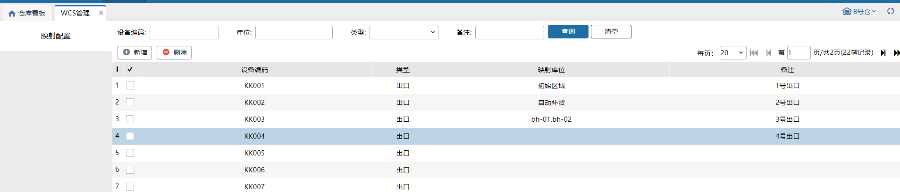
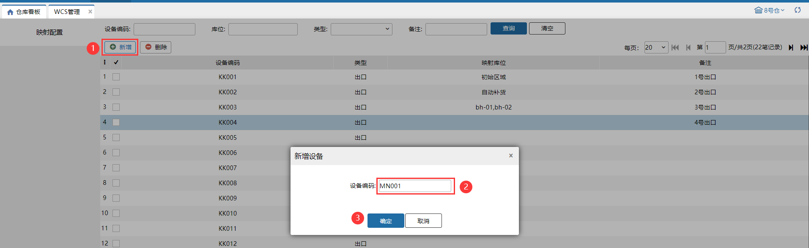
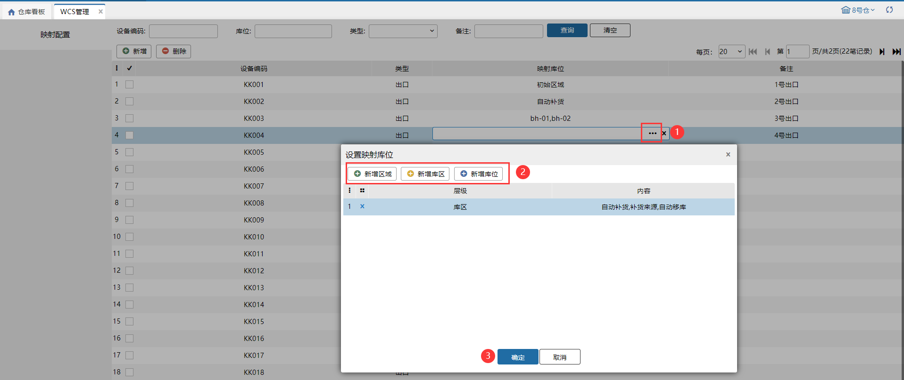

# WCS管理

仓库人员拣货后放到周转容器里，通过wcs自动化设备扫描周转容器自动识别分拣道口。

### 1.新增
点击新增，输入设备编码，新增设备编码。

### 2.设置映射库位
设备上设置了映射库位，wcs自动化设备扫描容器编码后后台指导出库位，通过映射库位确认分拣口。

1.新增区域：映射库位支持设置区域。设备之间设置的区域不能重复，已设置的区域会自动过滤掉。

2.新增库区：映射库位支持设置库区。设备之间设置的库区不能重复。

3.新增库位：映射库位支持设置库位。设备之间设置的库位不能重复。

### 3.删除
支持废弃的分拣口在系统删除掉。

### 4.查询
支持设备编码、库位、类型、备注查询。

> 更新: 2023-12-22 11:12:43  
> 原文: <https://hupun.yuque.com/unzko7/lsbfg0/wvs88n9sruaad8fu>