# 大宗出库任务

大宗出库，顾名思义为数量、体积、重量较大的订单进行出库作业。为便于区分大宗订单和普通订单系统据出库订单来源，依照商品数量、体积、重量、运输方式等维度进行自动区分。

可在仓内策略--大宗策略进行大宗订单区分的预设。

提示

1、由于大宗订单的特殊性，可跳过拣货、验货、称重、打包等环节，达到快速出库的目的。

2、考虑到大宗订单可能涉及商品数量特别大，单个作业人员无法短时间内完成，大宗出库支持将订单业务拆分多个任务可供多人同时作业。

3、考虑到商家库存不准的情况下，库存没有订单所需的商品数量，可以允许订单部分出库。

### 01、 系统界面
大宗出库界面较普通订单处理界面增加拆分拣货、手工库位锁定、序列号导入、部分出库功能。

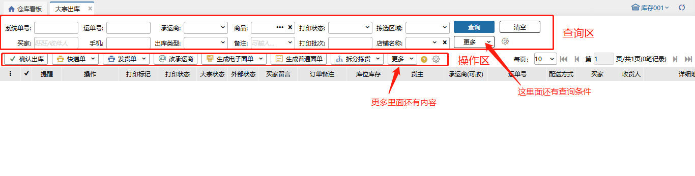

### 02、拆分拣货
#### （1）按条件拆分任务
先勾选需要拆分的订单，点击拆分拣货，对话框中有按库区、按区域、商品种类数上限、商品数量上限四个维度进行设置，设置完成后点击拆分按钮完成操作，拆分后可以去大宗拣货任务页面打印配货单进行拣货。如下图

#### （2）直接拆分任务
 先勾选需要拆分的订单，点击直接拆分，一个订单生成一个拣货任务。如下图

#### （3）按商品和库位拆分
可以根据库位+商品拆分或者根据商品拆分拣货任务，把同一个库位或同一个商品拆分到一个任务中更有效率的拣货。

先勾选需要拆分的订单，点击操作列的拆分，选择按商品或者库位+商品拆分。如下图

按商品拆分，点击拆分明细，修改已拆数量，点击拆分，拆分出一个任务，点击提交，会拆出两个任务，拆分的明细一个任务，剩余的明细一个任务。如图所示

按库位+商品，点击拆分明细，修改已拆数量，点击拆分，拆分出一个任务，点击提交，会拆出两个任务，拆分的明细一个任务，剩余的明细一个任务。如图所示

**提示：**

①.未开启大宗订单部分出库开关，订单商品部分锁不允许拆分；必须全锁才可以拆分；

②.开启大宗订单部分出库开关，订单商品部分锁允许拆分；全锁也可以拆分

#### （4）拆分任务完成
订单拆分后大宗状态显示已拆。

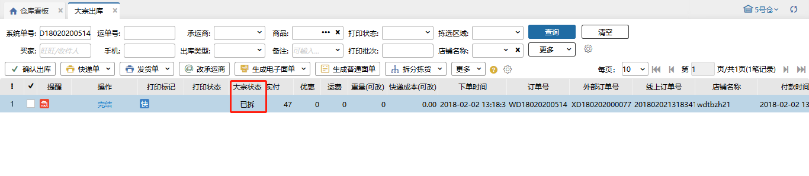

#### （5）取消拆分拣货任务
已经拆分的待拣货订单可勾选当前订单取消拣货，但是已有拣货的任务不允许取消拆分的。

### 03、库位锁定
大宗出库的订单系统会自动进行一次锁库操作，如果库位库存不足、库位属性条件不满足等情况则会出现锁库失败的情况。针对此类情况，可在调整库位库存后点击库位锁定系统再次进行锁库尝试。

#### （1）自动锁库
点击订单行“锁定”，或勾选订单后点击“自动锁库”按钮，会根据大宗策略设置规则进行锁库；

当用户发现锁定的库位不是预期想锁定的库位时，可以对订单进行解锁操作，解锁后的订单不会再自动锁定。

#### （2）手动锁库
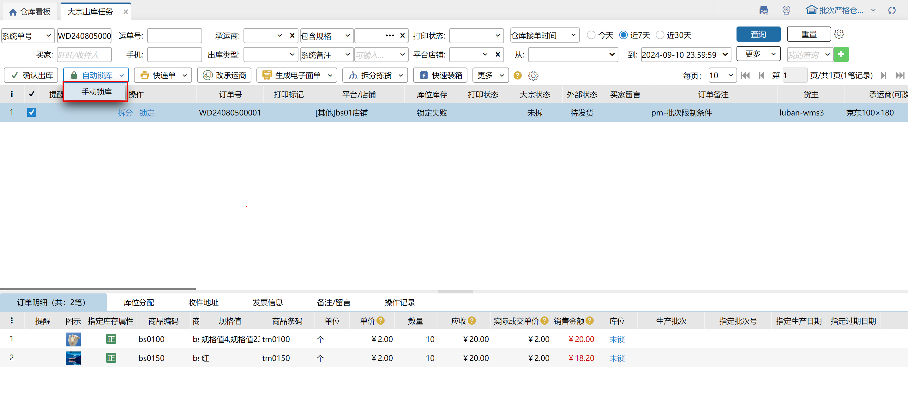

勾选订单后点击“手动锁库”，在弹窗手动临时配置锁库规则：

注：已锁定部分明细，手动锁库后已锁不会再重新锁定；

手动锁库失败后，跑批自动锁库不会对锁定失败订单重新锁库。

#### （3）手工分配库位
点击明细行库位列“未锁”，对明细进行手工分配库位，支持选择大宗策略规则设置范围外的库位，具体步骤如下：

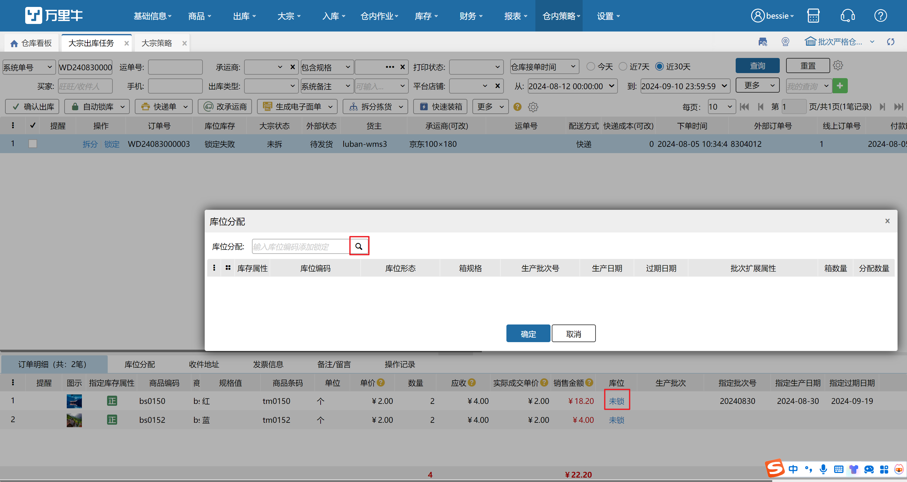

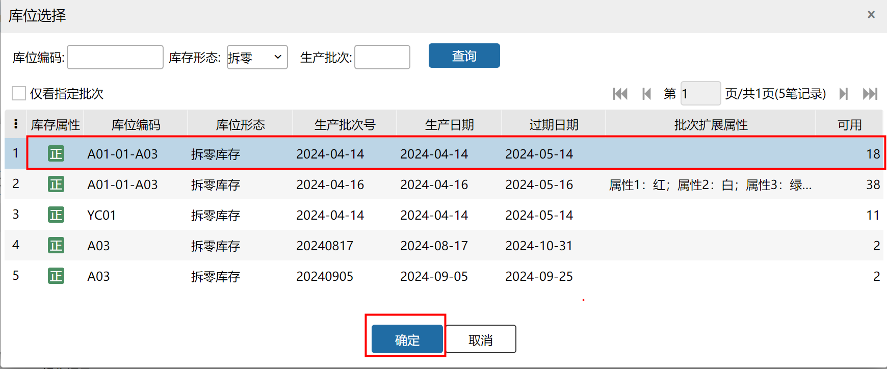

若明细为生产批次商品，且有指定批次时，根据当前账号权限判断是否允许锁定非指定批次库存。

若当前账号为超管、普通管理员、一级部门主管或勾选了允许修改指定批次-指定批次出库的其他账号，则允许为指定批次明细手动分配非指定批次库存，否则会报错提示无权限。

### 04、序列号导入
在订单需要直接确认出库的情况下，针对序列号管理的商品，可选取指定序列号供出库操作

点击序列号导入指定文件即可。导入模板可点击下拉箭头下载

### 05、部分出库
前提条件是：业务配置开启开启大宗订单部分出库+角色管理的操作权限勾选开启允许部分出库。

#### （1）已拆已拣未装箱的订单
选择订单，点击操作列的完结按钮，弹出部分完结窗口，点击确认，部分出库完成。未拣的任务会挂到新拆除的新订单且订单系统状态是关闭，外部状态是拦截，库位库存解锁且库存总量扣减和解锁。如图所示

**提示：**

①.订单部分锁库，拆分拣货，全部任务拣货完成，允许部分出库。

②.订单部分锁库，拆分拣货，部分任务拣货完成，允许部分出库。

③.订单全部锁库，拆分拣货，全部任务拣货完成，不允许部分出库。

④.订单全部锁库，拆分拣货，部分任务拣货完成，允许部分出库。

#### （2）已拆已拣已装箱的订单
##### 2.1 完结
选择订单，点击操作列的完结按钮，弹出部分完结窗口，点击确认，部分出库完成。未拣的任务会挂到新拆除的新订单且订单系统状态是关闭外部状态是拦截，已拣未装箱的任务仍归属于原始订单且异常还回已拣的，库位库存解锁且库存总量扣减和解锁。如图所示：

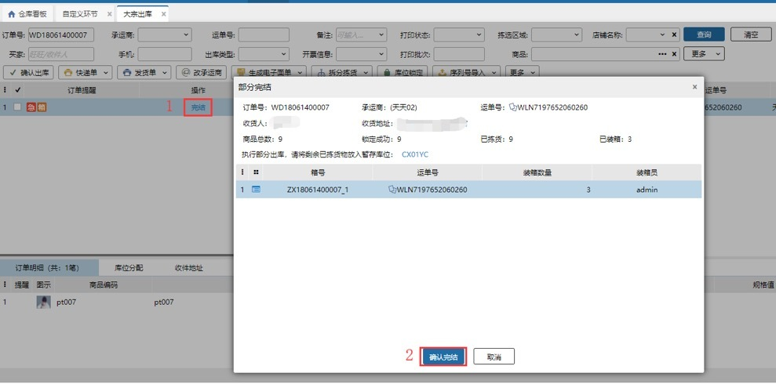

##### 2.2 部分发货
选择订单，点击操作列的部分发货按钮，弹出部分发货窗口，点击确认，部分出库完成。未拣的任务会挂到新拆除的新订单且订单系统状态是未拆外部状态是待发货，已拣未装箱的任务仍归属于原始订单且异常还回已拣的，库位库存解锁且库存总量扣减和解锁。

**提示：**

①.订单部分锁库，任务全部经拣货全部装箱，允许部分出库。

②.订单部分锁库，部分任务拣货，已拣的全部装箱，允许部分出库。

③.订单部分锁库，部分任务拣货，已拣的部分装箱，允许部分出库。

④.订单全部锁库，任务全部经拣货全部装箱，不允许部分出库。

⑤.订单全部锁库，部分任务拣货，已拣的全部装箱，允许部分出库。

⑥.订单全部锁库，部分任务拣货，已拣的部分装箱，允许部分出库。

#### （3）未拆已装箱的订单
##### 3.1 完结
选择订单，点击操作列的完结按钮，弹出部分完结窗口，点击确认，部分出库完成。未装的任务会挂到新拆除的新订单且订单系统状态是关闭外部状态是拦截，已装箱的任务仍归属于原始订单，库位库存且库存总量都扣减和解锁。如图所示

##### 3.2 部分发货
选择订单，点击操作列的部分发货按钮，弹出部分发货窗口，点击确认，部分出库完成。未装的任务会挂到新拆除的新订单且订单系统状态是未拆外部状态是待发货，已装箱的任务仍归属于原始订单，库位库存且库存总量都扣减和解锁。

**提示：**

①.订单全部锁库，全部装箱，不允许部分出库。

②.订单全部锁库，部分装箱，允许部分出库。

#### （4）出库时重量计算
(1).订单未装箱未大宗称重，出库时会根据商品数量和商品重量计算。

(2).订单未装箱已大宗称重，出库时不会重新计算重量。

(3).订单已装箱，出库时都是取箱子重量累加之和。

#### （5）出库时快递成本计算
(1).订单未装箱未大宗称重，若订单上快递成本不为0，则不会重新计算快递成本；若订单上快递成本为0则根据运费计算规则计算快递成本。

(2).订单未装箱已大宗称重，出库时不会重新计算快递成本。

(3).订单已装箱

①.若箱子未称重且订单和箱子的快递成本都是0，出库时则重新计算快递成本。

②.若箱子未称重订单上不为0，出库时不会重新计算快递成本。

③.若箱子未称重且箱子快递成本不为0，订单上快递成本为0，出库时直接取箱子累加之和。

④.若箱子有大宗称重且订单上为0，出库时直接取箱子累加之和。

⑤.若箱子有大宗称重且订单上不为0，出库时不重新计算快递成本。

### 06、生产批次标准模式下大宗出库
##### 1.设置生产批次
生产批次商品大宗出库需在页面录入商品的生产批次，点击订单明细生产批次列的设置按钮，在弹出的生产批次录入页面添加或扫描录入生产批次，操作步骤如下图所示：

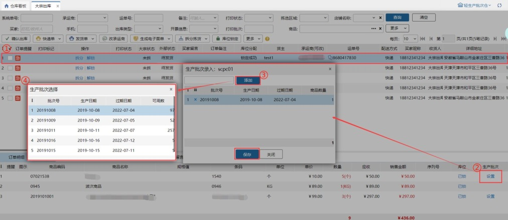

**注意：**

1.添加或扫描的生产批次在当前仓库可用库存必须大于0；                    

2.保存录入的生产批次时，会校验批次库存是否充足。                

##### 2.生产批次导入
在订单需要直接确认出库的情况下，针对生产批次标准模式管理的商品，可导入指定批次供出库操作

点击生产批次导入指定文件即可。导入模板可点击下拉箭头下载

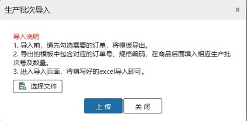

### 07、自定义设置
##### 1.查询项自定义设置                    
查询条件支持用户自定义设置，最多12个查询条件，位置是依次从左到右，从上到下排序。

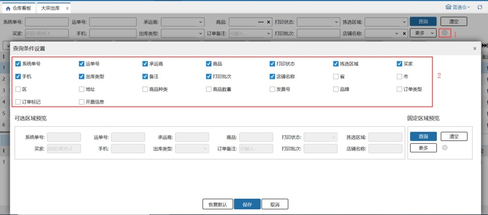

##### 2.工具栏按钮自定义设置
工具栏的按钮支持自动调整位置。

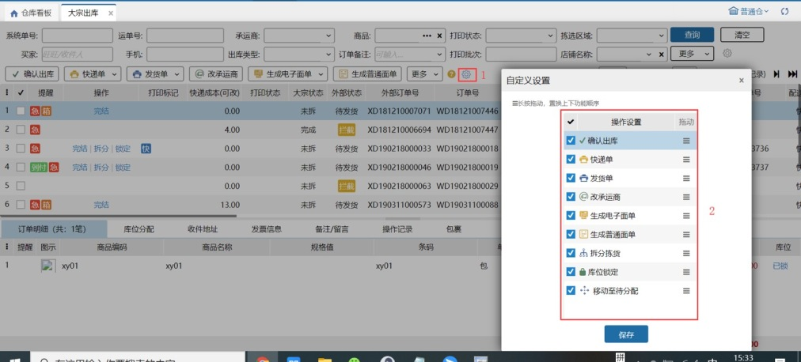

### 08、获取单号超区报错换快递优化
获取单号超区报错能够便捷换快递，下拉可以直接选择其他承运商，涉及页面有预出库订单、待分配、零拣打单、波次打单、异常订单、大宗出库，波次就可以单独换承运商并生成面单

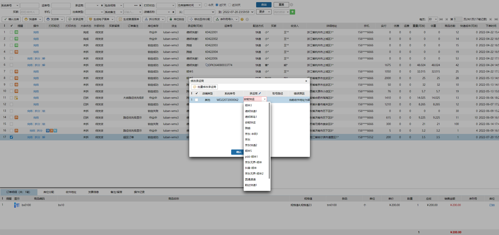

### 09、支持上传附件

1.显示在大宗出库页面的订单均支持上传，仅支持单笔操作上传。

2.订单上传图片后才显示附件tab。

3.订单查询仅支持查看订单的附件。

4.已操作上传，再拆单部分发货，拆出订单无附件显示。

### 10、申请电子箱唛
有包裹的订单支持申请电子箱唛，点击后申请电子箱唛，成功后订单显示标识。

注：若订单有多个包裹，则所有包裹都打上电子箱唛标识后，订单上才显示标识。

     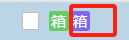

仅唯品会订单支持申请电子箱唛，否则报错。

未装箱订单不支持申请电子箱唛。

若作废包裹重新装箱，则支持重新申请电子箱唛。

支持部分申请电子箱唛，例：原装箱1、2，申请电子箱唛后又装箱3，则3可申请电子箱唛。

支持批量、后置申请和打印电子箱唛。

PDA暂不支持电子箱唛相关。

### 11、前置发货

勾选单据点击前置发货，若符合前置发货条件，系统提示前置发货成功，订单外部状态显示前置发货标记，可在订单操作日志中查看成功记录；若不符合前置发货条件，则订单外部状态不显示前置发货标记，可在订单操作日志中查看失败记录及。

### 12、改承运商
支持在订单上单个修改或批量修改订单承运商，同零拣打单。若修改后订单收件地址属超区，会报错提示。

替换承运商/回收电子面单时，已打印快递单的订单会弹窗提示：该订单已打印快递单，若继续修改请销毁已打印面单；点击继续按钮，替换承运商/回收电子面单，点击取消按钮，不替换承运商/回收电子面单。

### 13、快速装箱
支持按锁定箱规申请，每种商品拆零部分/所有拆零生成一个包裹。

(1)按锁定箱规申请，所有拆零生成一个包裹

b.锁定箱计算：

已锁定订单，锁定库存形态为规格箱/唯一箱，1箱=1个包裹，其余拆零直接计入尾箱。

例：商品1箱规1箱4个；订单1：商品1-7个

已锁定（锁1规格箱；1唯一箱：箱内2个；1拆零）-共生成包裹数：3个。

包裹1：1规格箱；包裹2：1唯一箱；包裹3：拆零1个

(2)按锁定箱规申请，每种商品拆零部分生成一个包裹：箱数计算逻辑同(1)，剩余商品按不同sku生成不同包裹。如订单锁定5个箱子，其中2种商品有若干散件，则申请7个单号。

注：①关联开启全流程箱规模式，开启后显示此开关，否则不显示。

②未锁定的订单不允许快速装箱。

> 更新: 2026-04-14 11:01:07  
> 原文: <https://hupun.yuque.com/unzko7/lsbfg0/sl2igiempnqrcnao>