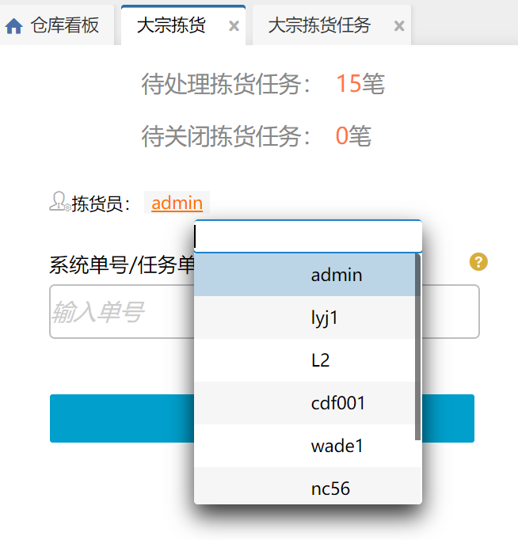

# 大宗拣货

1.大宗拣货任务扫描系统单号/任务单号/运单号后，右侧界面显示该任务单状态，点击确认拣货即可完成当任务单拣货环节。

2.点击拣货员可指定拣货员，便于进行绩效统计。

提示：

①扫描系统单号，加载该任务下未作业、作业中的任务，任务数超过100个报错提示，只加载未存在列表的任务，已存在再次扫描报错。

②扫描任务匹配多个任务，优先报错拦截挂起的。

 

> 更新: 2023-12-18 16:01:17  
> 原文: <https://hupun.yuque.com/unzko7/lsbfg0/fl42doe6fkidlq4z>