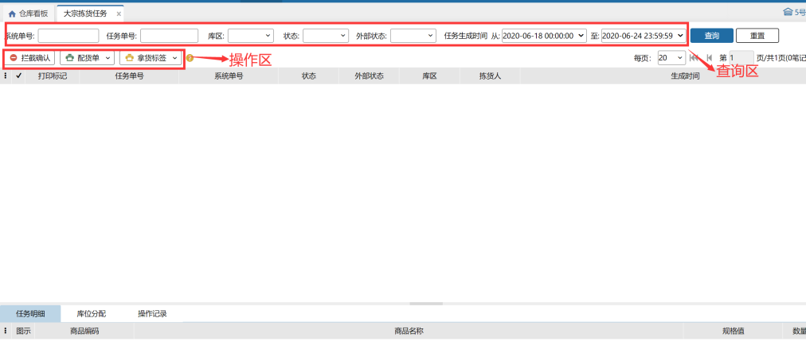

# 大宗拣货任务

大宗拣货任务界面可根据条件查询、查看任务单状态。操作区域可打印配货单、拿货标签和进行拦截订单的确认。

拣货任务排序：状态->订单中拣货任务最早的生成时间->单号；（同状态同系统单号的拣货任务排列在一起）

 

 

> 更新: 2026-07-07 09:24:57  
> 原文: <https://hupun.yuque.com/unzko7/lsbfg0/nnmbhmc78csaauyw>