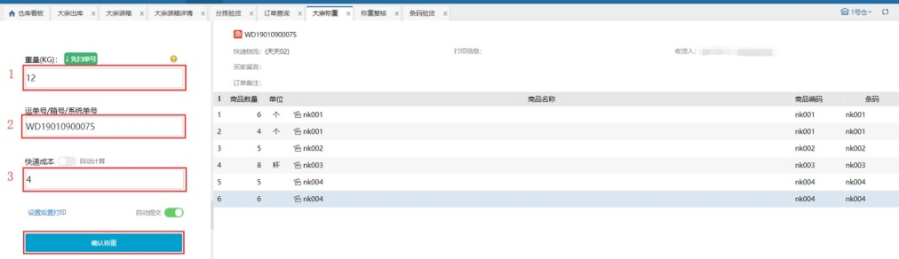

# 大宗称重

大宗称重：支持对大宗订单和包裹称重。

### 01.称重
大宗称重，用户输入重量，输入单号敲击回车，即可见到订单或包裹信息，点击确认称重，订单称重完成，重量会更新到订单或包裹上。

 

多种选择

1、先扫单号，还是先称重；（点击先扫单号即可切换）

2、自动计算，还是人工计算；（自动计算会根据商品信息界面设置的商品重量，或大宗称重的输入重量和快递运费设置，自动计算快递成本；人工计算，需要自己输入快递成本并回车）

### 02.自动计算重量
自动计算重量，首先要在商品信息里设置商品的重量，然后设置承运商档案的运费规则。根据商品的重量和预设的运费规则出库时自动计算出重量和快递成本，而不需要称重。

提示【称重两种方式】

1、自动称重：链接电子秤或手动输入重量；

2、自动计算重量：不需要大宗称重，设置商品重量，确认审核后自动计算重量；

### 03.自动计算快递成本
自动计算快递成本，是根据订单/箱子的重量和承运商档案设置的运费规则计算.

提示

1、开启称重后置打印，则电子面单快递订单确认称重后会自动生成单号和打印快递单，若选择箱唛只有包裹称重才能打印出来，订单不会打印箱唛。

2、开启自动提交，订单会自动提交称重。

3、订单/箱子重复称重时会提示。

4、扫描运单号优先匹配到大宗箱，匹配不到才会匹配大宗订单。

5、已装箱的大宗订单不能称重。

6、订单全部装箱且生成了子母件，箱子大宗称重时快递成本不允许修改会置灰显示。

 

 

> 更新: 2023-12-18 16:03:21  
> 原文: <https://hupun.yuque.com/unzko7/lsbfg0/mezcd4nvyhutqgwn>