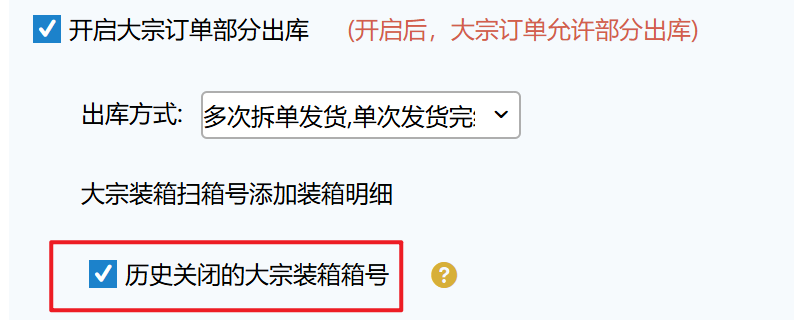
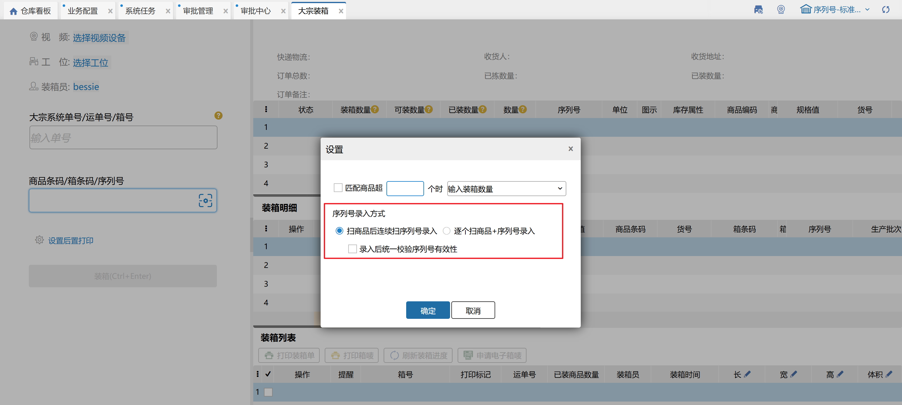

# 大宗装箱

大宗装箱是指在大宗订单、任务单确认拣货后进行的装箱操作。

### 1.新增装箱
1.首先扫描大宗订单的运单号/系统单号，右侧加载订单信息和待装商品明细。

2.在商品条码框中扫描需要装箱的商品条码或箱条码，下侧装箱明细会实时记录，或扫描箱号/点击修改，装箱明细会显示当前箱号的已装明细。

3.装箱列表中可以查看已装的大宗箱，可以打印装箱单和箱唛，点击刷新后多人装箱情况下会显示最新的进度数据。点击修改可对当前箱增加或减少商品，装箱后箱号不变。在装箱列表中支持对已装箱修改长、宽、高、体积等数据。

4. 当装箱完成后点击装箱按钮，可配置后置打印快递单、装箱单、箱唛。

### 2.修改已装箱
扫描已装箱箱号，右侧加载已装箱信息和商品明细，支持修改装箱数量和明细后，重新装箱。

### 3.扫描历史箱箱号

业务配置开启“历史关闭的大宗装箱箱号”，在大宗装箱时支持扫描已关闭箱箱号来快速添加箱明细。

要求：已关闭箱内明细sku在待装明细范围内，数量≤待装明细可装数量，库存属性一致，生产批次号与待装明细批次一致，规格箱/唯一箱箱条码一致。

例：已关闭大宗订单001，明细：正品bs0100*2（普通商品），次品bs0100*2，正品bs0150*4（生产批次商品），有4个包裹：包裹ZX01 bs0100*2（正品），包裹ZX02 bs0100*2（次品），包裹ZX03 bs0150*2（批次001*2），包裹ZX04 bs0150*2（批次002*2）。

未关闭大宗订单002，明细：正品bs0100*2，次品bs0100*2，正品bs0150*4（批次001*2，批次002*2），无包裹。

①大宗装箱页面扫描单号002匹配到订单，

②条码框扫描箱号ZX01，装箱明细列表带出正品bs0100*2，点击装箱后，装箱列表包裹+1，包裹长、宽、高、体积、重量、估重为ZX01的对应信息，支持手动修改；

③条码框扫描箱号ZX02，装箱明细列表带出次品bs0100*2；

④条码框扫描箱号ZX03，装箱明细列表带出正品bs0150*2（批次001*2）；

⑤条码框扫描箱号ZX04，装箱明细列表带出正品bs0150*2（批次002*2）。

**注：**

1. 最新的大宗装箱支持生产批次商品，若一个商品锁定了多个生产批次，扫描商品后，弹窗显示未装箱的生产批次。

2. 在仓内策略–业务配置，开启商品条码截取，扫描输入截取的商品条码会与商品信息的条码进行对比校验；

①.选择特殊信息截取，扫描输入++前的条码，系统会与订单商品信息的条码进行对比校验；扫描输入不含特殊字符的全量条码可直接匹配商品，扫描输入包含++字符的全量条码，无法匹配到商品信息。                     

②.选择条码位数截取，扫描输入前若干位条码，系统会与订单商品信息的条码进行对比校验；扫描输入全量条码，无法匹配到商品信息。    

3.大宗订单有运单号切装箱完成有且仅有1箱时会自动填充订单运单号至包裹上。             

4.集合码录入参考[业务配置](https://hupun.yuque.com/unzko7/lsbfg0/caki7lz4105n2vpg#CKIQO)。

### 4.输入数量设置
①输入装箱数量

商品条码开启”输入装箱数量“设置后，左侧显示“输入数量”文本框，该输入框可用于快捷填写已装数量。

当扫码商品条码可装数量<=指定数量时，输入数量框置灰，当扫码商品条码可装数量>指定数量时，输入数量框默认为1，可手动修改，填写数量n后回车，对应sku已装数量+n。

②仅扫描一次条码，完成该明细装箱

商品条码开启”仅扫描一次条码，完成该明细装箱“设置后，左侧不显示”输入数量“文本框，扫描条码后自动填充装箱数量=可装数量。

**注：**该配置记忆在仓库+操作员上

### 5.序列号录入方式设置
设置中可勾选序列号录入方式，按扫商品后连续扫序列号录入或者逐个扫商品+序列号录入。

①扫商品后连续扫序列号录入：扫商品条码后显示序列号弹窗，可录入多个序列号，每次录入时校验序列号有效性；

②扫商品连续扫序列号录入+录入后统一校验序列号有效性：扫商品条码后显示序列号弹窗，可录入多个序列号，点击保存时校验序列号有效性；

③逐个扫商品+序列号录入：扫商品条码后录入一个序列号就自动关闭序列号录入弹窗，再次扫商品条码会重新弹出序列号录入弹窗。

> 更新: 2025-11-26 17:14:22  
> 原文: <https://hupun.yuque.com/unzko7/lsbfg0/kuechc10g0uxd9ch>