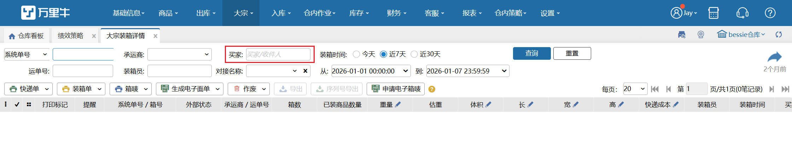

# 大宗装箱详情

大宗装箱详情界面显示默认7天内大宗订单装箱情况。

1. 操作区域内可勾选订单进行作废操作，作废后该笔订单下所有装箱记录清空。                    

**提示：**大宗装箱完成后才可以生成子母件，作废其中一个箱子，箱子上的单号都清掉。

回收电子面单时，已打印快递单的订单会弹窗提示：该订单已打印快递单，若继续修改请销毁已打印面单；点击继续按钮，回收电子面单，点击取消按钮，不回收电子面单。

2. 可以查看箱详情。

3.待发货状态的订单，箱子上允许编辑称重和快递成本。

**提示：**

①.若订单已装箱完成，订单上的重量和快递成本是箱子累加之和。

②.若订单未装箱完成，订单上的重量和快递成本与箱子累加之和不对等。

③.订单若生成了子母件，箱子的快递成本不允许编辑。

 4.筛选项-买家，能通过收件人模糊搜索订单

5.作废包裹回收单号

多包裹普通订单，作废单个包裹，如果包裹快递单号和订单显示的快递单号不一致，则只会作废该包裹，订单上的快递单号不做变更。如果包裹快递单号和订单显示的单号一致，则作废该包裹后，订单上的快递单号会变更成剩余箱子的第一个包裹上的快递单号

 

> 更新: 2026-01-27 13:47:37  
> 原文: <https://hupun.yuque.com/unzko7/lsbfg0/mtn8hgtvadyivv2w>