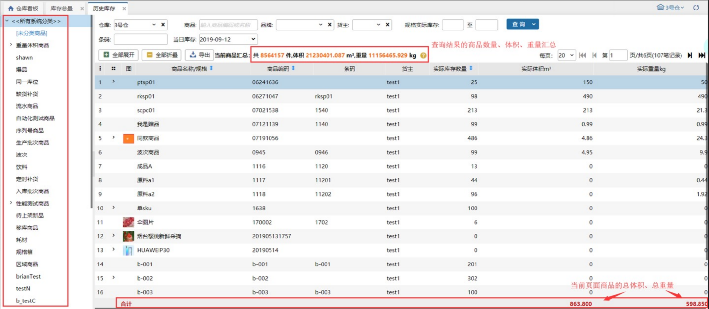
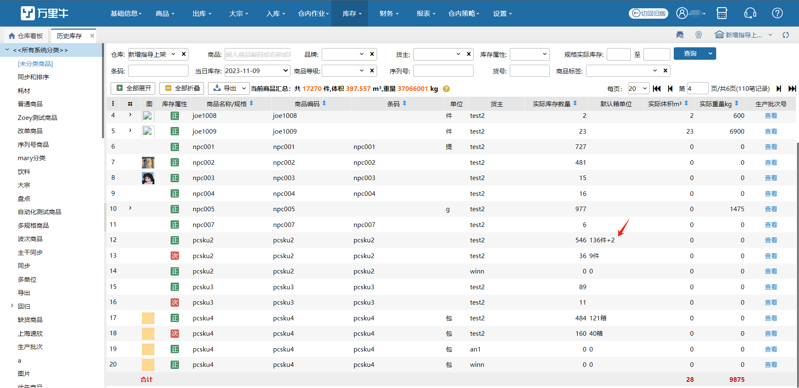
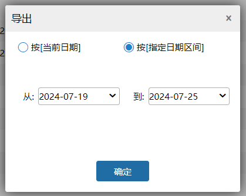
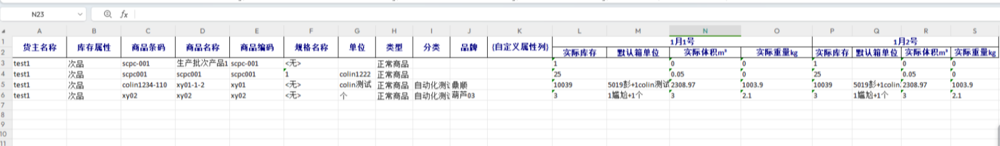

# 历史库存

### **1.库存数量**
页面中的库存数量只是当前晚上12点的商品的总库存量。

### **2. 库存状况页面**
页面默认选择商品选项，显示当前仓库下所有商品的库存数量。点击导出可以导出商品库存状况表，根据所查询仓库是否开启次品开关分别展示详见下图。

1）未开启次品管理开关

①、查询条件，支持多仓查询；支持指定日期查询，查看某天的日库存；支持货主查询；支持商品规格/编码、条码、品牌和实际库存查询。

②、支持商品和生产批次导出。

③、可以查看当前分类的总库存、商品的总体积、总重量，体积、总量最多保留小数点后3位。

④、实际体积、实际重量不可编辑。

2）开启次品管理开关

### **3.查询项**
1）支持仓库、商品编码/名称、品牌、货主、库存属性、规格实际库存、条码、日期、序列号查询；

2）存在序列号商品的次品时，录入正品的序列号，只查询正品的库存总量，录入次品的序列号，只查询次品的库存总量。                      

### **4. 默认箱单位**
1.新增默认箱单位，关联开启商品多单位管理+出库快速换算推荐模式显示。

2.操作员有权限的仓库，有一个仓库开启出库换算就展示。

3.已设置多单位的商品，显示商品实际库存数量根据默认多单位箱换算后结果。

4.已勾选筛选的仓库，有一个没有开启换算模式就不展示换算数据。 

### 4.导出
普通导出、生产批次导出支持按当前日期、按指定日期区间导出。

按当前日期：导出1日历史库存数据，日期按查询条件中所选。

按指定日期区间：导出指定日期区间内多日历史库存数据。

a.默认显示除当天外前7天时间范围。

b.最大支持选择32天进行导出。

> 更新: 2024-07-26 10:58:08  
> 原文: <https://hupun.yuque.com/unzko7/lsbfg0/bmgsdk6k9g511lhq>