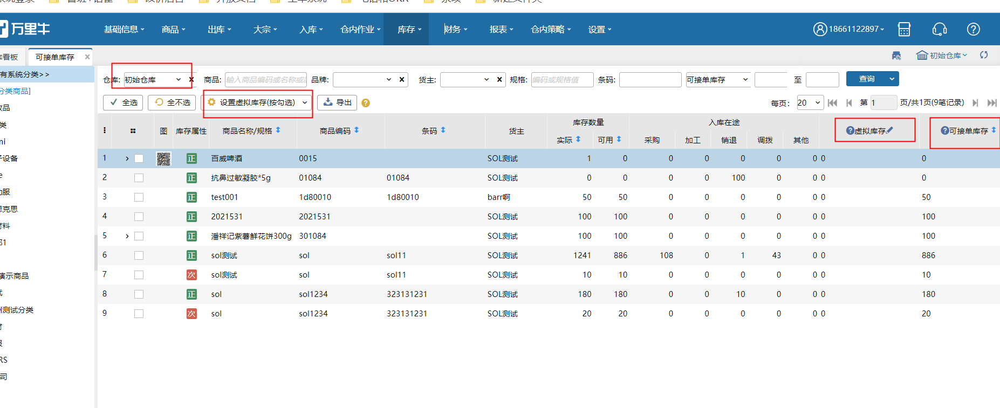
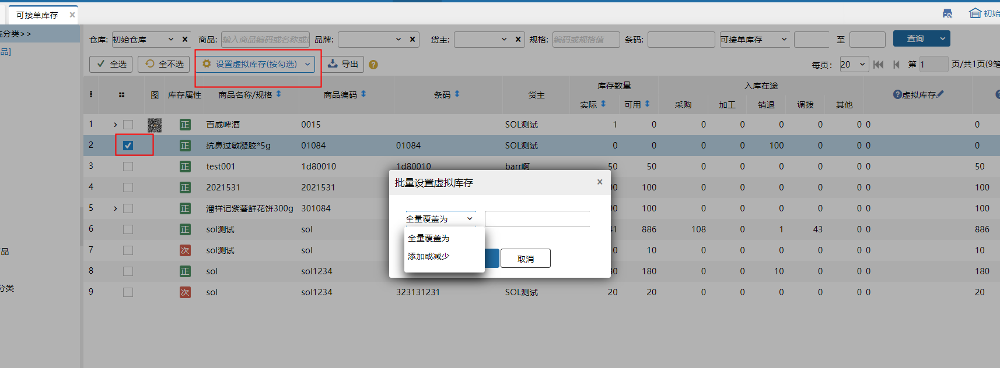

# 可接单库存

业务配置开启允许缺货接单-根据自定义库存判断后，能看到“可接单库存”菜单。可接单库存配置的计算公式算出，用于限制指定商品的可接单数量。

### 1.页面数据显示
默认显示当前仓库下、开启允许缺货接单货主的库存数据。

库存数量：和库存总量页面一致

入库在途：对应货主的在途库存数量，包括：采购入库在途、加工在途、销退入库在途、调拨入库在途、其他入库在途

虚拟库存：默认为0，支持手动修改，上限99999999

可接单库存：按照业务配置公式计算得出，修改公式后会触发重算

### 2.设置虚拟库存
有两种方式：单个设置、批量修改

①单个设置：在对应sku上直接修改数量，可为正负，修改后会重算可接单库存

②批量设置：按勾选、按查询两种，可以全量覆盖为指定数值、或者添加或减少固定值

> 更新: 2023-12-21 17:27:17  
> 原文: <https://hupun.yuque.com/unzko7/lsbfg0/ym9sugldykss8uru>