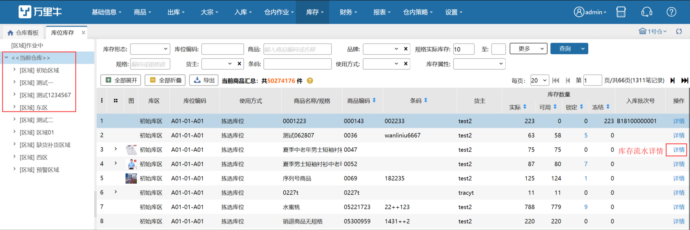
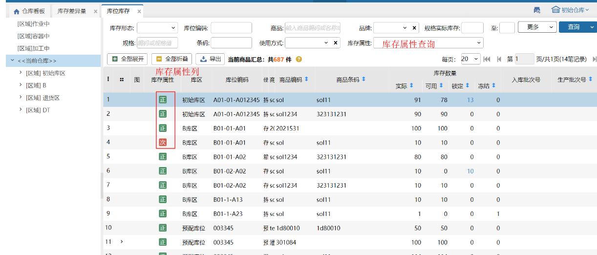
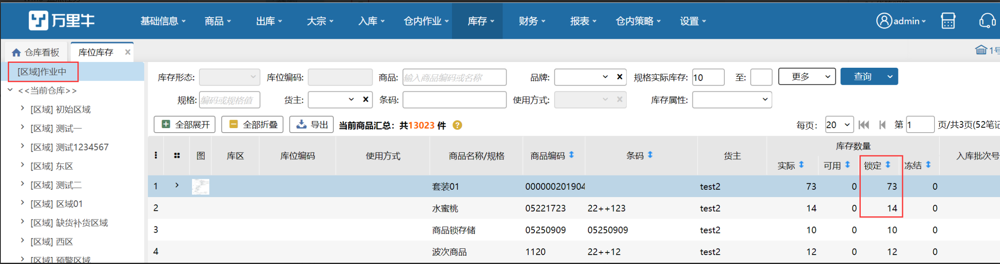
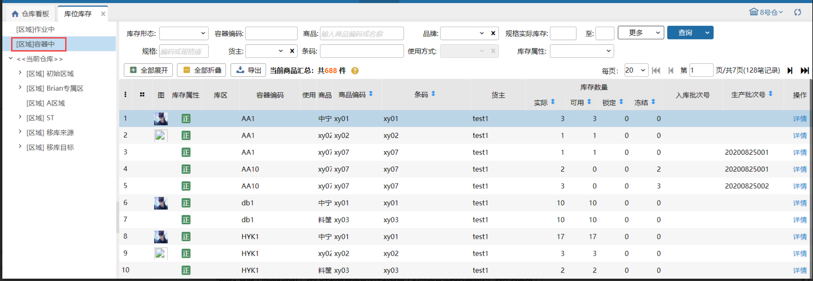

# 库位库存

### **1.功能场景**
库位库存是可查看库位上的商品的库存状况；

库存数量包括四种类型：实际库存，可用库存，锁定库存和冻结库存；

详情按钮的作用是查看每个商品库存变化明细，可追溯到相关单据，并显示记账时间。

根据是否开启次品管理开关分别展示具体页面展示如下：

1）未开启次品管理开关

库位库存变化提示：

1.订单推送到wms且有锁定库位，则这里的锁定数量增加，可用数量减少，实际数量不变；

2.订单拣货之后，这里的锁定数量减少，可用数量不变，实际数量减少；

2）开启次品管理开关

### **2.作业中商品**
增加了作业中的商品的统计：即已经确认拣货了但还没有出库的订单的商品会在此页面展示，作业中的数量就是锁定数量，具体页面如下：

### **3.容器中商品**
增加了容器中商品的统计：即入库到容器或者移库到容器中的商品会在此页面展示，具体页面如下：

### **4.货箱明细**
选择库存形态为货箱的 ，在有货箱存储的库位上点击货箱详情可查看当前SKU的装箱情况。

注意：货箱库存属性都为正品；

### **5. 库存详情**
点击商品详情可显示当前时间段库存变化情况，及发生业务的单据。

### **6.查询条件**
1. 支持库存形态（拆零、货箱）、库位编码、商品编码/名称、品牌、规格编码/名称、条码、库存属性、生产批次、序列号查询；

2.存在序列号商品的次品时，录入正品的序列号，只查询正品的库存总量，录入次品的序列号，只查询次品的库存总量；

3.最新发生时间表示当前行sku库存最新变更时间，支持按指定时间范围进行查询。

### **7.开启商品生产批次标准模式**
生产批次商品入库后，不再支持库位库存页面查看库位上生产批次商品的批次信息。

### **8. 默认箱单位**
1. 新增默认箱单位，关联开启商品多单位管理+出库快速换算推荐模式显示。
2. 已设置多单位的商品，显示商品实际库存数量根据默认多单位箱换算后结果。
3. 库存形态为货箱时无此列。

> 更新: 2025-01-21 10:29:38  
> 原文: <https://hupun.yuque.com/unzko7/lsbfg0/cltzrryhdxoxw5ba>