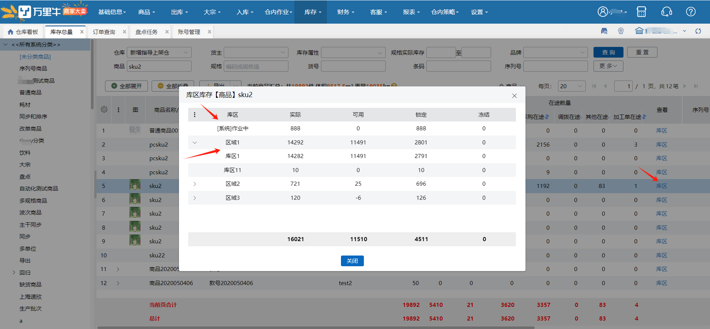
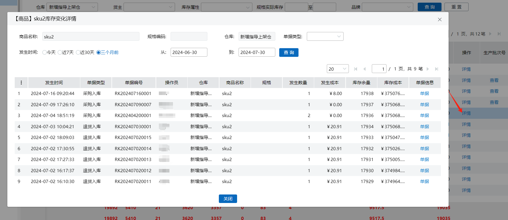
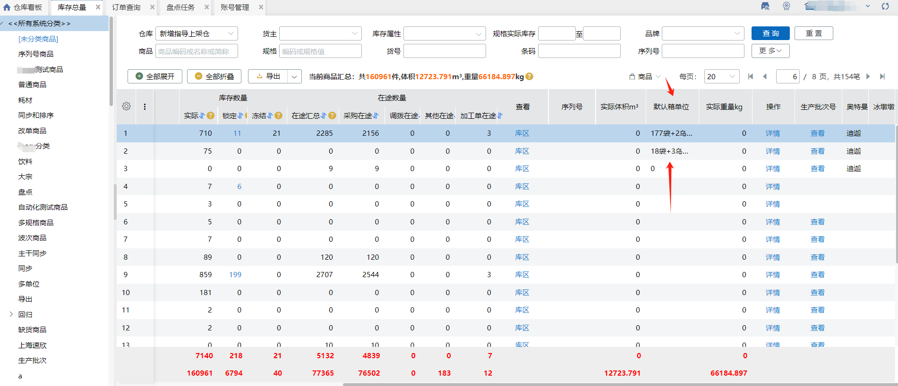

# 库存总量

### 1. 库存数量
反映当前各个商品在每个仓库的库存状况，包含实际库存，可用库存，锁定库存，冻结库存，在途库存。

库区按钮的作用是查看每个商品在各个库区的库存状况。

详情按钮的作用是查看每个商品库存变化明细，可追溯到相关单据，并显示记账时间。

万里牛五种库存形式含义：

实际库存：即代表实际仓库中拥有的库存量；  
可用库存：系统中的可用库存=实际库存-待发货数量（锁定数量）-冻结数量；  
锁定库存：即表示系统中已被分配使用的商品，不允许再被用来分配订单等；  
冻结库存：表示系统中不能被使用的商品，不可用于正常出库的等；  
在途库存：在供应商处已经下过订单，尚在运输途中，还未入库的库存部分。在系统中表现为有采购，退货，其他，调拨入库。

### 2. 库存总量页面
页面默认选择仓库选项，显示当前仓库下所有商品的库存数量。点击导出可以导出商品/生产批次/序列号库存状况。

库存总量变化提示：

1.订单推送到wms且有锁定库位，则这里的锁定数量增加，可用数量减少，实际数量不变；

2.订单出库之后，锁定数量减少，可用数量不变，实际数量减少；

3.实际库存=可用库存+锁定库存+冻结库存；在途库存不计入库存总量。

4.开启次品库存管理，页面多显示一列库存属性。

查询仓库库存总量规则：

1.查询的仓库都未开启次品开关，无库存属性查询项和库存属性列；

2.查询的仓库有开启次品开关的则展示库存属性查询项、库存属性列，商品在未开启次品仓库的库存总量按正品处理；

3.查询全部仓库的库存总量，若公司开启次品开关，则展示库存属性查询项、库存属性列；

案例如下：

1号仓未开启次品开关，商品a库存数量为：实际10，可用8，锁定2；

2号仓开启次品开关，商品a库位数量为：正品实际15，可用15，锁定0   次品实际5，可用5；

3号仓开启次品开关，商品a库位数量为：正品实际20，可用20，次品实际2，可用2；

①.当前仓为1号仓，查询1号仓库存总量：无库存属性查询项、库存属性列，商品a库存数量为：实际10，可用8，锁定2；

②.当前仓为1号仓，查询1、2号仓库存总量：有库存属性查询项、库存属性列，商品a库存数量为：正品实际25，可用23，锁定2 、次品实际5，可用5；

③当前仓为1号仓，查询全部仓库的库存总量：有库存属性查询项、库存属性列，商品a库存属性为：正品：实际45，可用43，锁定2、次品实际7，可用7.

### 3. 作业中商品
当订单确认拣货后但是还没有出库，则该订单的商品会被记录到作业中，具体页面如下：

**提示**

1.此处的数据与【库存】-【库位库存】页面的数据相同；

2.若没有作业中的订单，则此处的作业中栏不会显示。

### 4. 库存详情
点击商品详情可显示当前时间段库存变化情况，及发生业务的单据。

### 5.查询项
1.支持序列号查询，通过序列号查询，直接定位到货主、商品/规格。

2.存在序列号商品的次品时，录入正品的序列号，只查询正品的库存总量，录入次品的序列号，只查询次品的库存总量。

3.品牌查询项仅显示账号有权限的品牌数据。

### 6. 默认箱单位
1. 新增默认箱单位，关联开启商品多单位管理+出库快速换算推荐模式显示。
2. 操作员有权限的仓库，有一个仓库开启出库换算就展示。
3. 已设置多单位的商品，显示商品实际库存数量根据默认多单位箱换算后结果。
4. 已勾选筛选的仓库，有一个没有开启换算模式就不展示换算数据。

### 7. 商品/规格模式

商品：按spu+sku级显示，需展开则显示sku。

规格：仅显示商品sku级数据，无层级显示。

### 8. 条码查询项
条码精确查询后，右模糊搜索到的商品也展示。

例：商品1条码：sku2  商品2条码：sku2++01  商品3条码：sku12

输入sku2可查询到商品1和商品2

### 9.导出
支持导出序列号扩展属性值

  
 

> 更新: 2026-01-05 10:41:27  
> 原文: <https://hupun.yuque.com/unzko7/lsbfg0/megb9qnez4ty363g>