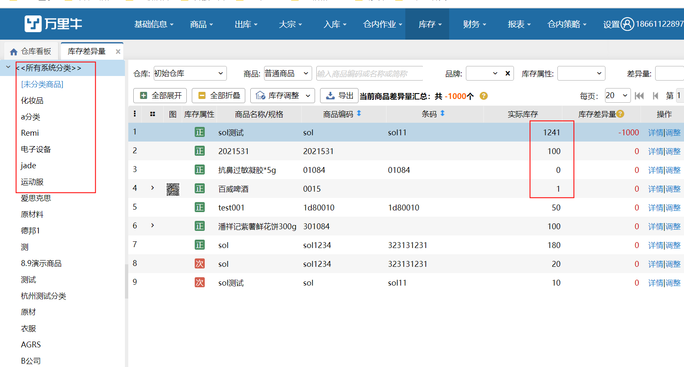
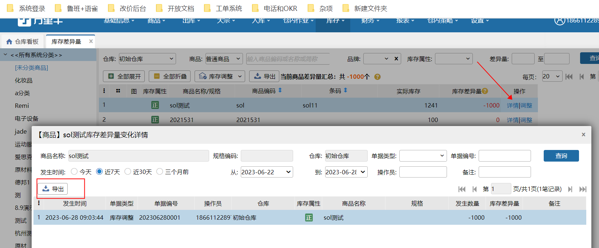
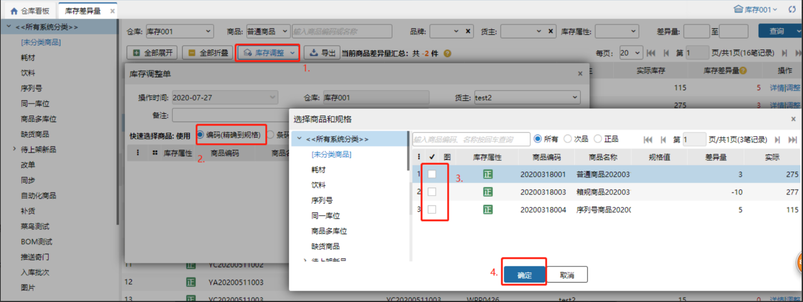
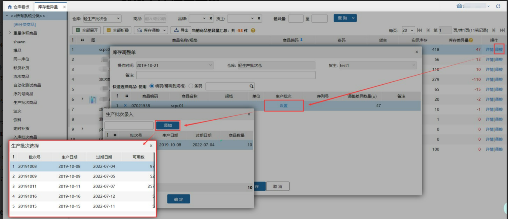

# 库存差异量

库存差异量：表示系统中库位库存和作业中的数量之合与库存总量的差异量，可用于帮助用户校准库存；

具体页面展示如下：

### **1.造成库存差异量的因素**
因素主要包括以下几点：订单库位锁定失败、库存盘点、库存调整；

具体可以点击详情查看库存差异量的变化原因，如下图：  

支持导出库存差异量变化详情。

**注意：**

1.导出结果是当前页面的查询结果。

2. 查询结果为空时，无法导出。

3.点击导出后会生成导出任务，建议5分钟后到数据中心下载查看。

### 2. 库存调整
当有存在库位差异量时，点击库存调整，选择要调整的商品，会带出改商品的库存差异量（该值不能修改），点击保存，则库存总量的值会对应的修改，具体页面如下：

### **3. 全量调整**
点击全量调整，自动带出所选仓库下，对应货主的全部有差异量的商品，上限500个，可手动添加。

注意

1. 库存差异量计算公式为：库存差异量=库位库存总量+作业中数量-库存总量；

2. 新建库存调整单进行库存调整后在【库存】-【库存调整】中会增加一条库存调整记录；

3. 在此页面库存调整会通知erp，则erp也会修改对应的库存。

### **4.支持次品库存的差异量**
1.  支持次品进行库存调整，操作步骤同正品库存调整。

2.调整后通知ERP

1）业务配置选择次品库存管理全部对内模式，次品库存调整后通知ERP数量增多或减少；例：商品A的次品库存调整差异数量+5，通知ERP后，ERP中商品A的库存数量+5。

2）业务配置选择次品库存管理全部半对外模式，次品库存调整后不会通知ERP数量变更；例：商品A的次品库存调整差异数量+5，调整单完成后不会通知ERP。                     

### **5.生产批次商品的差异量**
造成差异量的因素同普通商品，支持库存调整，生产批次严格模式下，库存差异量对应到商品的生产批次，选择有差异量的商品进行库存调整。

生产批次标准模式下，生产批次商品的差异量落在空批次上，进行库存调整时，需要选择批次后录入数量后调整，操作如下图所示：

**注意：**

1. 库存调整时，批次库存不可调整为负；

2. 生产批次录入页面的商品数量之和要和差异量相等；

3.扫描生产批次号进行录入时，不支持扫描系统中没有库存的批次。                

> 更新: 2023-12-21 17:39:33  
> 原文: <https://hupun.yuque.com/unzko7/lsbfg0/uu7cq54yps95hpgq>