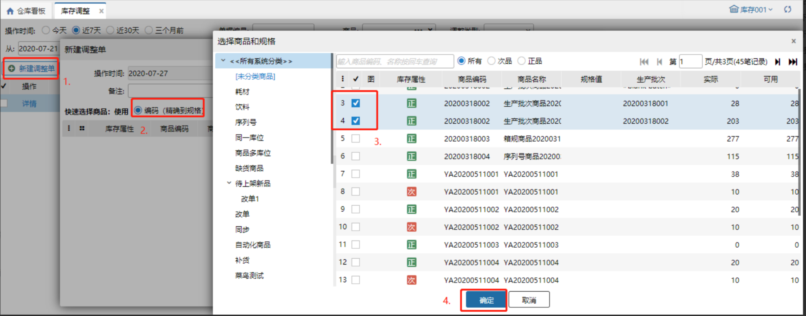
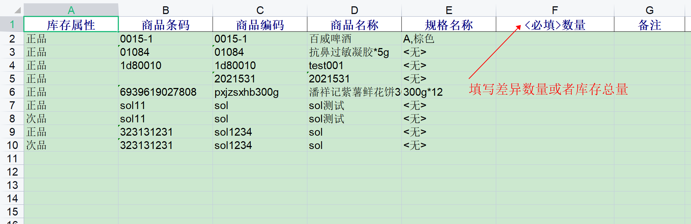
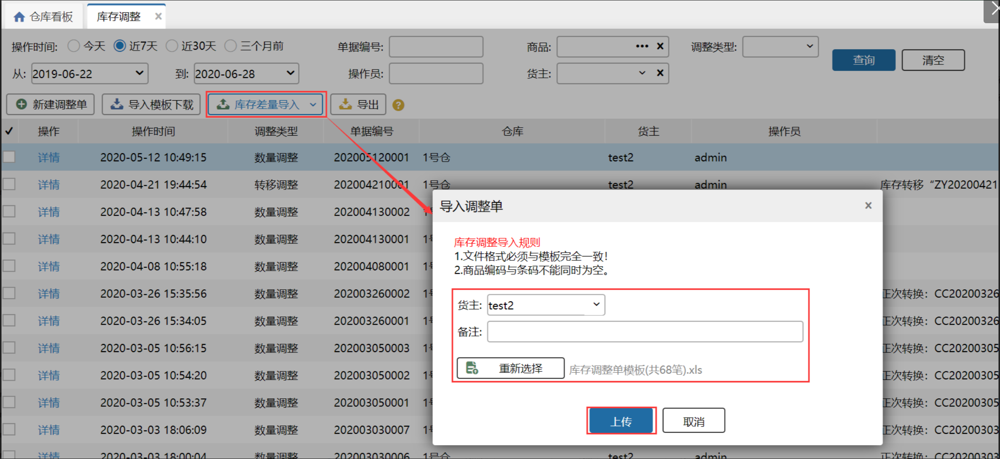
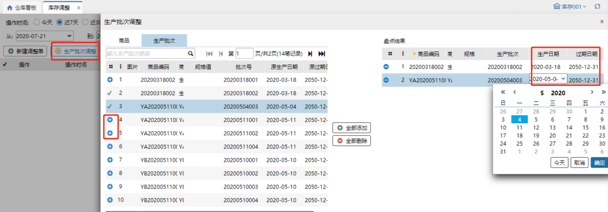

# 库存调整

库存调整一般是在盘点时，账列数与实际库存数量有差异的时候就要调账，要把账列数调整成实际库存数；

简单的说，系统里库存和仓库库存对不上了，那么就在万里牛系统里，把库存调整成和仓库实际库存一致。

**提示**

1.库存调整会与erp对接，即wms库存调整有增加或减少多少，erp也会相应的增加或减少；

2.库存调整的商品必须是wms和erp都存在，否则无法保存；

3.库存调整的数量为必填，若某个商品不用调整，则可将该商品行删除；

4.目前库存调整不会精确到区域、库区和库位，故商品的数量增加或减少只是针对库存总量而言。

### **1.新建调整单**
界面上新增调整单，具体操作如下：

### 2.导入调整单
当调要调整的商品较多时，可以使用导入调整单进行库存调整；

步骤为：

1）下载导入模板；

2）若选择库存差异量导入：在导出的模板上填写调整差异数量，实际数量比系统数量多则填写正数，实际数量小于系统数量则填写负数；

     若选择库存总量导入：在导出的模板上填写仓库实际的库存总量；

3）点击页面上的库存差异量导入或库存总量导入，选择文件导入

### **3.生产批次商品库存调整**
#### **1.严格模式下生产批次商品库存调整**
操作步骤同普通商品，选择好批次后进行调整。

**注意：**

严格模式下生产批次商品库存调整时可以进行批次选择。

#### **2.标准模式下生产批次商品库存调整**
选择生产批次商品后，点击设置按钮，在生产批次录入页面添加生产批次和商品数量，操作如下图所示：

注意：

生产批次商品库存调整时允许新增仓库不存在的批次。

### **4.生产批次调整**
针对有生产批次的商品，可通过生产批次调整功能更改生产批次号、生产日期、过期日期等，操作顺序如下

1、点击生成批次调整

2、查找需要调整的商品

3、如该商品有多个批次，点击左侧，选择需要更改的批次信息（如下图）

4、右侧盘点结果更改生成日期和到期日期点击确认保存

提示

生产批次调整仅是调整批次下的生产、到期日期信息，不做生产批次号更改

### **5.次品库存调整**
1. 支持次品进行库存调整，操作步骤同正品库存调整。

2.调整后通知ERP

1）业务配置选择次品库存管理全部对内模式，次品库存调整后通知ERP数量增多或减少；例：商品A的次品库存调整差异数量+5，通知ERP后，ERP中商品A的库存数量+5。

2）业务配置选择次品库存管理全部半对外模式，次品库存调整后不会通知ERP数量变更；例：商品A的次品库存调整差异数量+5，调整单完成后不会通知ERP。    

### **6.序列号调整 **
序列号简洁模式下支持序列号调整且是全量覆盖的。

**注：**

①.商品的序列号有锁定是不允许进行调整的。

②.调整后的序列号必须和库存总量数一致。

> 更新: 2023-12-21 17:38:48  
> 原文: <https://hupun.yuque.com/unzko7/lsbfg0/lggv5g6y9lbv62ho>