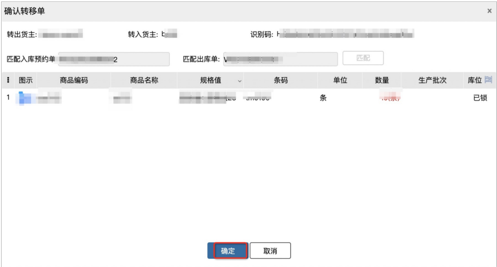

# 货权转移

****货权转移用于转移货品所有权，可一键将货主A的商品转移给货主B，无需操作出入库单据。

**注：该功能仅限于3PL旗舰版用户。**

1.新增货权转移单，选择转入/转出货主(授权本仓库且启用中的货主)：

2.获取转移单上的唯一识别码：

3.在OA/ERP系统中创建入库预约单和出库单，单据备注中包含第2步骤中的识别码，将单据推送到WMS系统

4.点击列表中的“转移”，确认转移单弹窗打开时，系统会自动查找一次符合匹配条件的入库预约单和出库单（单据备注中具有相同识别码且明细数量一致），若匹配到则显示单据信息，点击“确定”即可完成转移；未匹配则显示为空；

也可以手动点击匹配按钮，有匹配结果则显示单据信息，无匹配结果报错提示如下：5.转移完成后，对应的出入库单据自动完结，指定商品库存从转出货主转移到转入货主下，并可查看相应的流水记录

> 更新: 2023-12-21 17:40:02  
> 原文: <https://hupun.yuque.com/unzko7/lsbfg0/ytuen6srf9pvtgos>