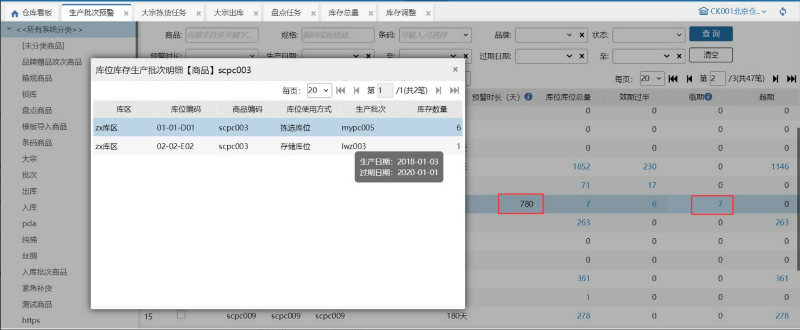
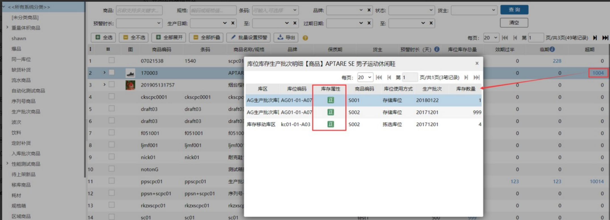
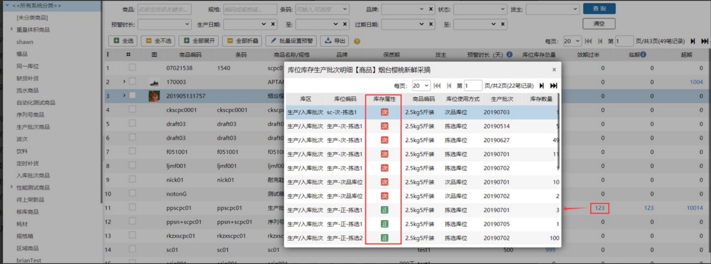
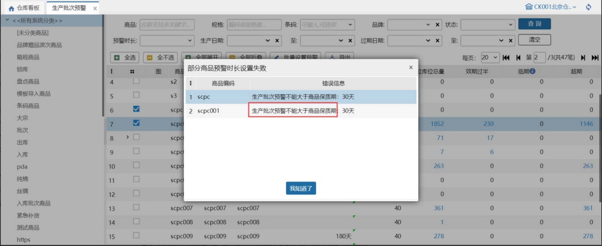
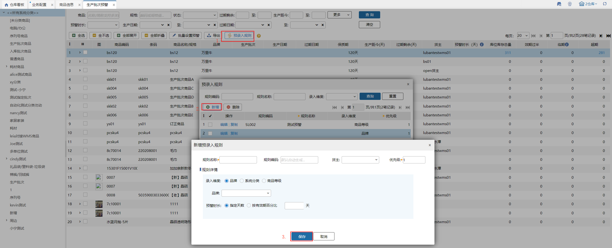

# 生产批次预警

适用场景：用户可在该页面查看生产批次商品已经过期和效期过半的库位库存，若设置了预警时长，根据预警时长计算，可以查看临期的库存。

名词解释：超期：当前日期已经过了过期日期。效期过半：保质期过半。临期：当前日期超过了过期日期-预警天数即进入了临期状态。

### **1. 页面显示**
显示开启了生产批次的商品，根据当前仓库是否开启次品管理开关分别展示；

#### 01.未开启次品管理开关
超期：统计过期的库位库存，点击数字可查看具体库位库存和批次信息。

效期过半：统计保质期过半的库位库存，点击数字查看具体的库位库存和生产批次信息。

临期：统计过期时间在预警天数内的库位库存，点击数字查看具体的库位库存和生产批次信息。

#### 02.开启次品管理开关
超期：统计过期的库位库存，点击数字可查看具体库位库存和批次信息。

效期过半：统计保质期过半的库位库存，点击数字查看具体的库位库存和生产批次信息。

临期：统计过期时间在预警天数内的库位库存，点击数字查看具体的库位库存和生产批次信息。

### **2. 设置预警**
设置预警范围：0-9999且不能超过该商品的保质期。勾选多个设置，部分成功，部分失败，失败的会报错提示失败原因且依旧保持勾选。

### ** 3.预录入规则**
预录入规则可以根据设置条件为新增批次号商品（包括入库、盘点）自动填充“预警时长”。先按需求新增预录入规则，录入维度包括品牌、系统分类、商品等级等，新增批次时有多个匹配规则时，按照规则优先级（从高到低，1最高）+规则编码（从小到大）匹配：

①.预警时长：指定天数 x 天

    按指定天数填充预警时长，例如：设置指定天数为20天，则匹配到该规则的批次商品预警时长为20天。

②.预警时长：按有效期百分比 x %

    按有效期百分比计算预警时长，例如：设置生产批次商品保质期为30天，按有效期百分比50%计算预警时长，则匹配到该规则的批次商品预警时长为15天。

注：生产批次预警时长优先取预录入规则的，若没有的取商品信息上的预警时长，若再没有则为空。

> 更新: 2026-07-02 13:50:24  
> 原文: <https://hupun.yuque.com/unzko7/lsbfg0/rw43ptw684f8nipm>