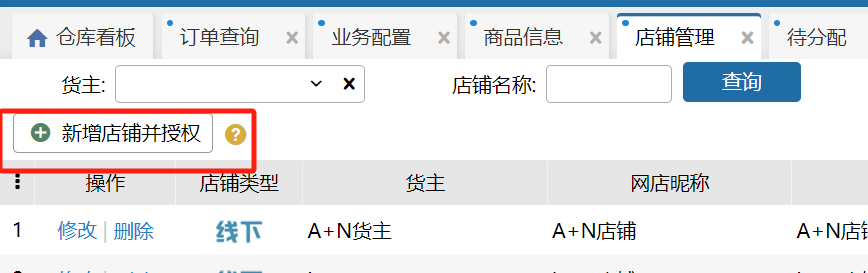
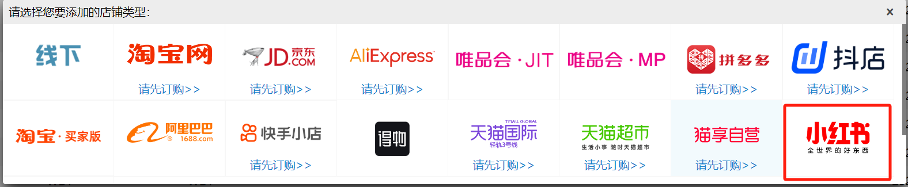
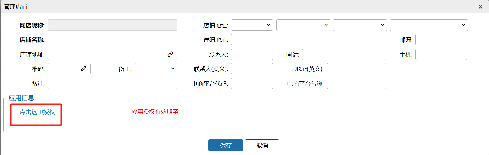
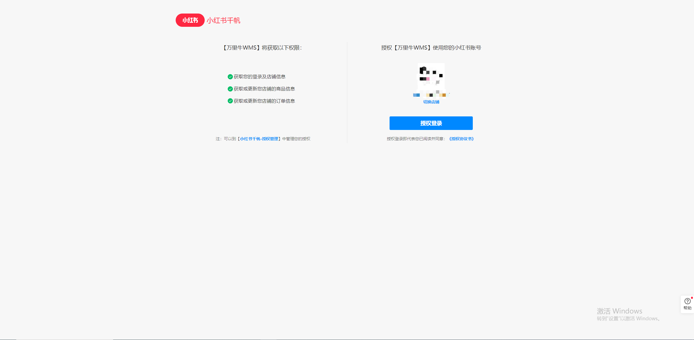
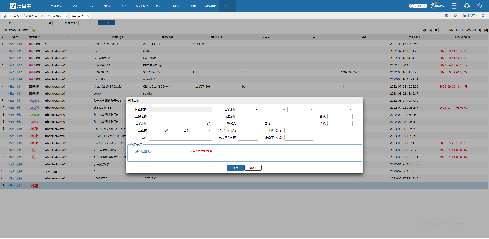
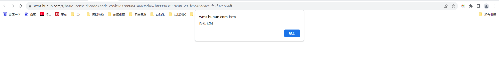
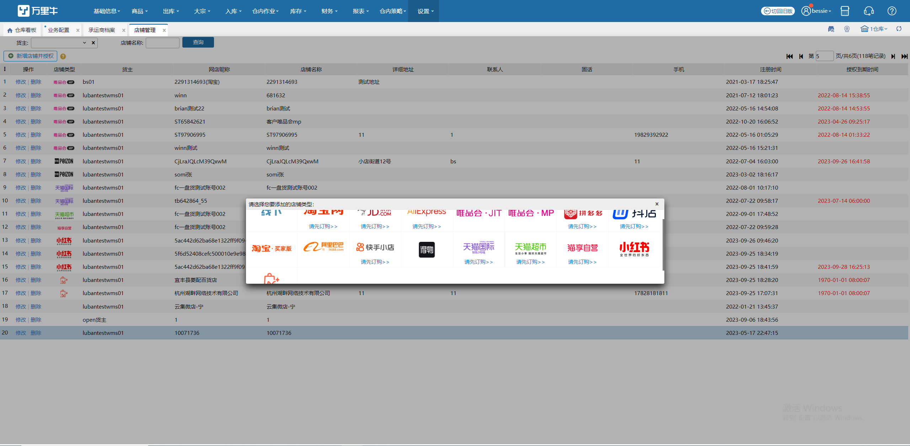
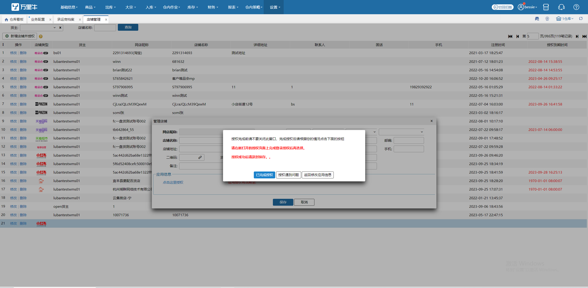
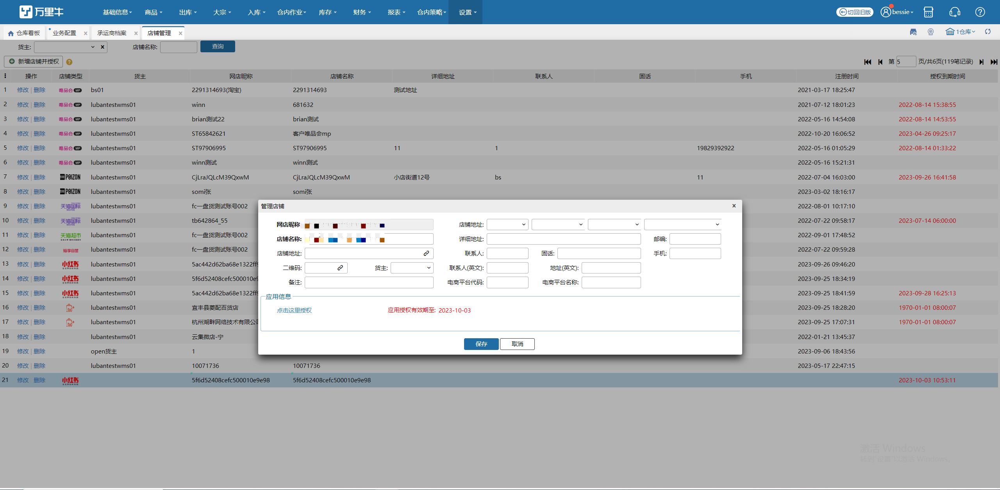
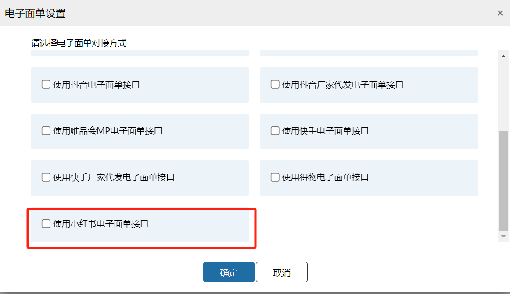

# WMS小红书授权

店铺授权

点击新增店铺

找到小红书平台图标

选择后点击授权

接下来就可以登陆店铺账号了。

登陆成功后选择授权

授权后返回系统操作页面

保存配置即可

成功新增好店铺后就可以在承运商管理中开通电子面单了

> 更新: 2023-12-21 10:52:41  
> 原文: <https://hupun.yuque.com/unzko7/lsbfg0/xl5lr6zcswcb46ug>