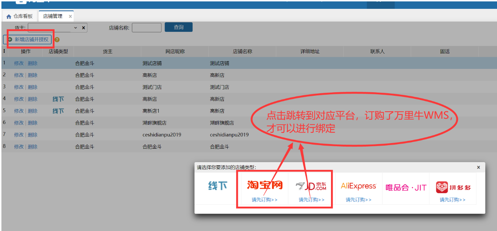
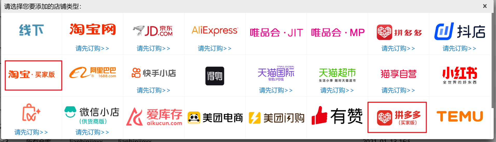
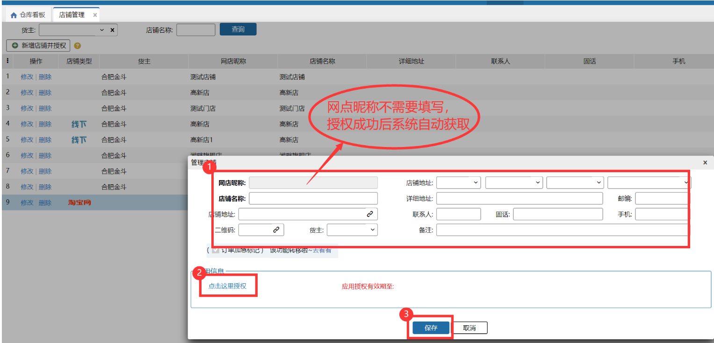
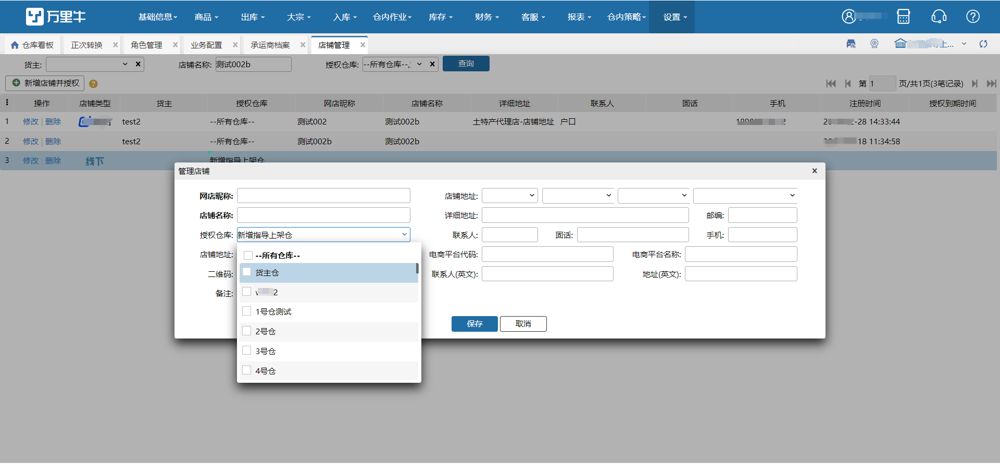

# 店铺管理

通过菜鸟开通电子面单或者开通了JD电子面单，需要在系统里面绑定对应店铺才可以获取到对应的电子面单号。

绑定流程：

1）选择店铺类型

注意区分买家版和卖家版店铺，若是买家版店铺，请选择带“买家版”标记的类型进行操作：

2）填写相关信息，进行授权

3）选择授权仓库，显示操作员有权限仓库。

授权成功后即可通过该店铺获取电子面单号。

注：

a.拼多多店铺授权默认有效期为1天，每天自动刷新。

b.推送订单自动创建店铺时，店铺授权仓库显示订单上的仓库。若订单货主二次推送此店铺到其他仓库，授权仓库不会追加显示。

c.修改取消授权仓库时，若承运商开启店铺电子面单，则报错。

d.店铺授权仓库会影响承运商档案->电子面单设置内店铺数据，仅显示授权所有仓库+当前登录仓的店铺。

> 更新: 2026-05-28 09:33:54  
> 原文: <https://hupun.yuque.com/unzko7/lsbfg0/lavcy09x6li72gxw>