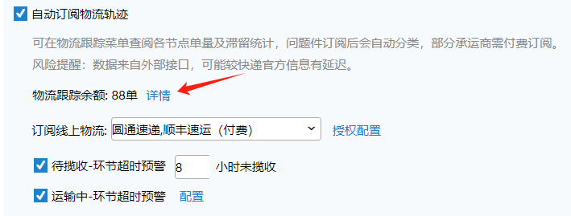
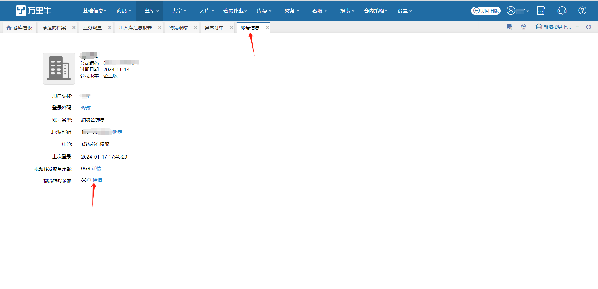
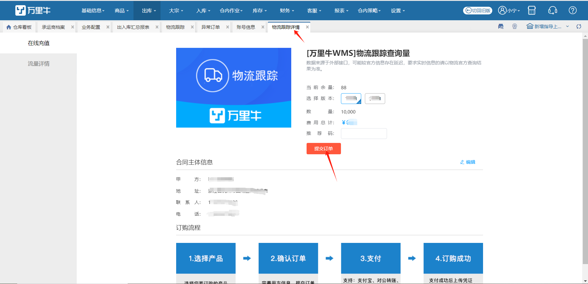
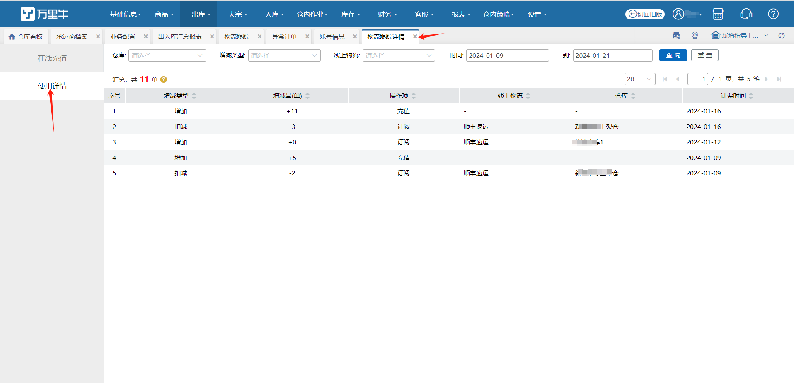

# 物流跟踪详情

当前公司下有仓库开启自动订阅物流轨迹，账号信息处和自动订阅物流轨迹配置下显示物流跟踪余额。

注：显示余额为公司级数据，点击详情跳转到物流跟踪详情页。

1.在线充值：充值物流跟踪余额入口。

2.查看有权限仓库内每日订阅扣减统计详情。以及显示每日操作员有权限仓库下所有订阅扣减记录汇总统计。

提示：

a.订阅失败订单不进行扣减余额。

b.充值记录为公司级记录，不局限于仓库显示。

c.余量不足时操作记录显示，不支持继续订阅。充值余额后可去物流跟踪-订阅失败页进行重新订阅。

> 更新: 2024-01-22 14:44:51  
> 原文: <https://hupun.yuque.com/unzko7/lsbfg0/plvv9tfsg0xz7qug>