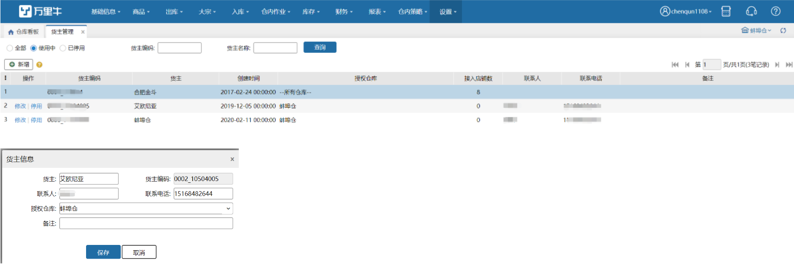
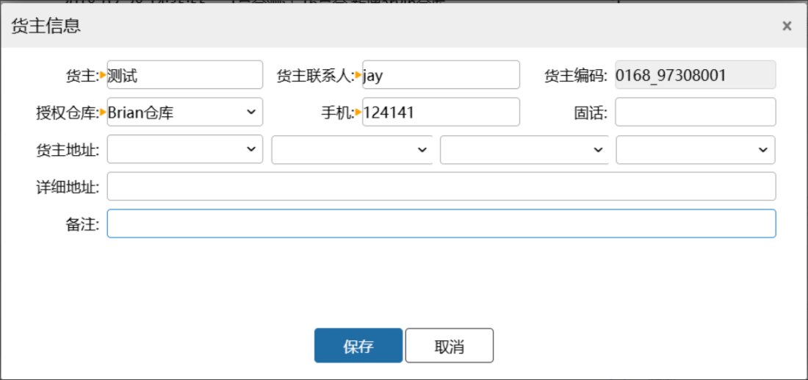
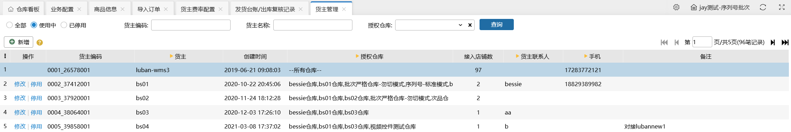

# 货主管理

货主管理是WMS系统中重要一环，每个WMS系统默认为一个货主，当需要进行多货主业务时，在货主管理界面可进行货主的配置如下图

点击新增后设置货主信息便于ERP配置，货主编码为系统新增后自动生成，授权仓库可配置该货主允许发生业务的仓库

货主手机号公司级唯一性校验，已启用的货主，手机号不允许重复

支持货主名称模糊搜索和筛选授权仓库查询货主

> 更新: 2026-08-17 13:43:16  
> 原文: <https://hupun.yuque.com/unzko7/lsbfg0/zk17ardiqngfrbqo>