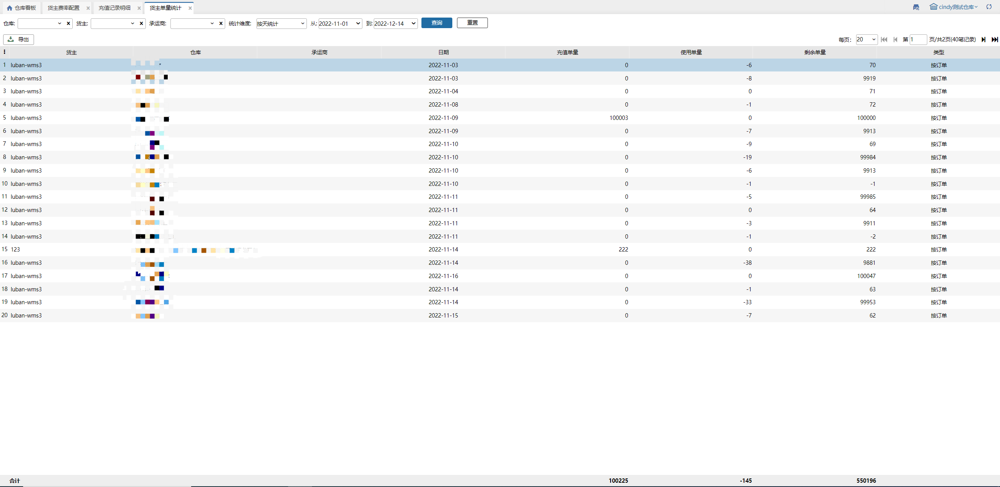

# 货主单量统计

3PL公司，仓库+货主配置了按单量统计，在货主单量统计中看查询单量相关数据。

1.统计维度可以分为按天统计和汇总统计。

2.列表中可以看到充值单量、使用单量和剩余单量数据，能够根据日使用单量和剩余单量看出货主的订单状况并及时充值单量。

> 更新: 2023-12-19 15:15:21  
> 原文: <https://hupun.yuque.com/unzko7/lsbfg0/advt9rgc126gg41r>