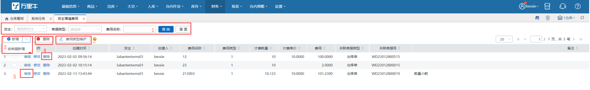
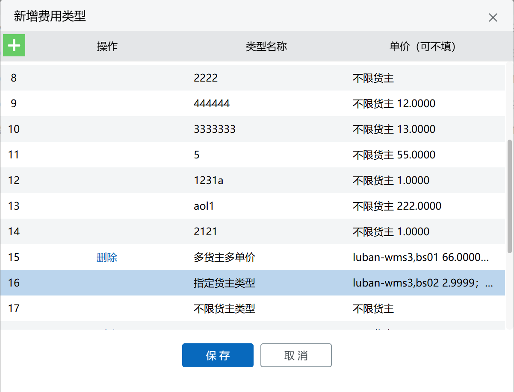
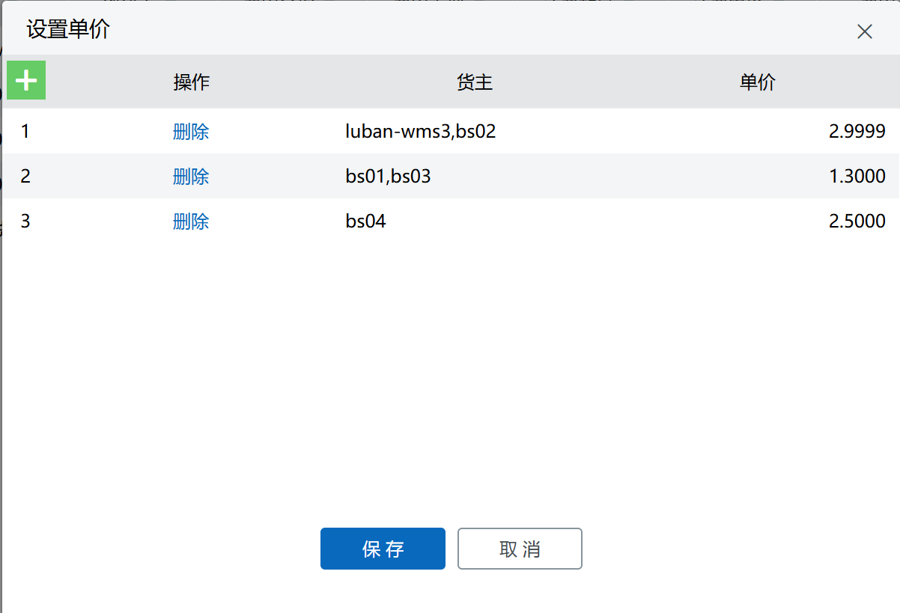
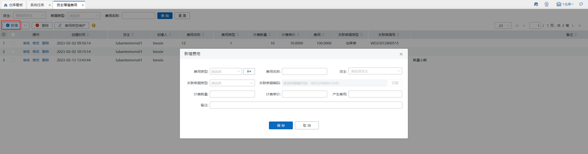
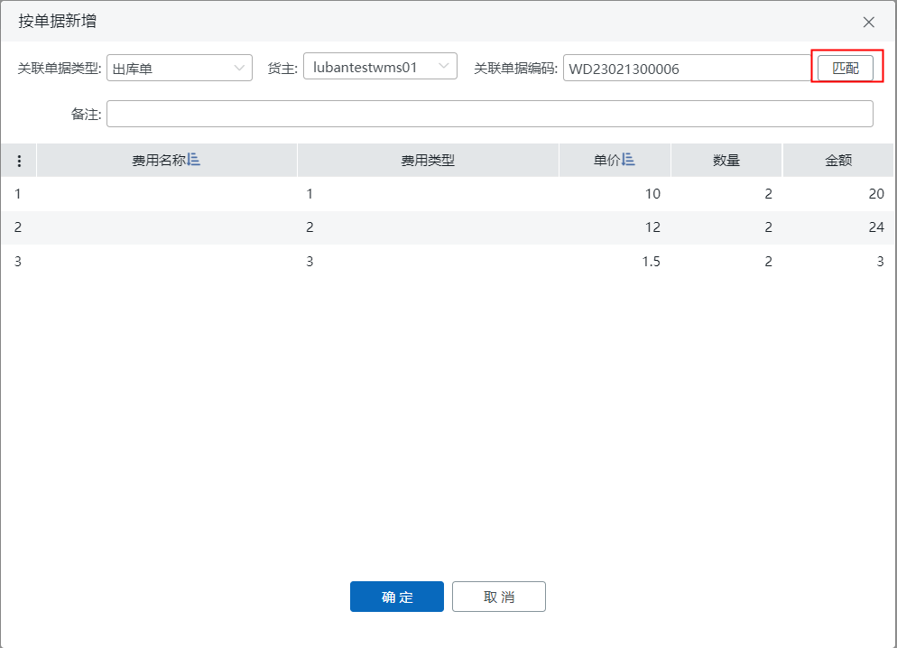
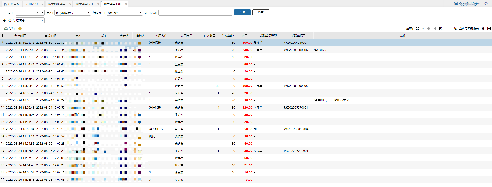
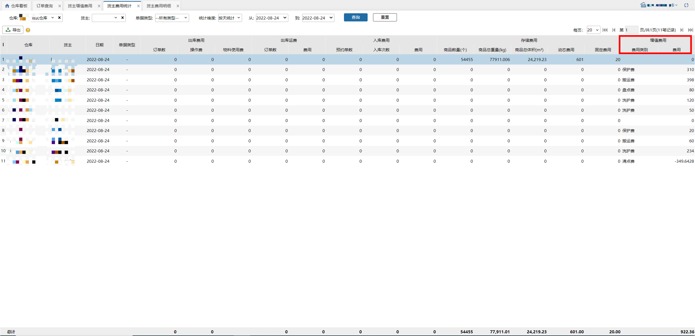
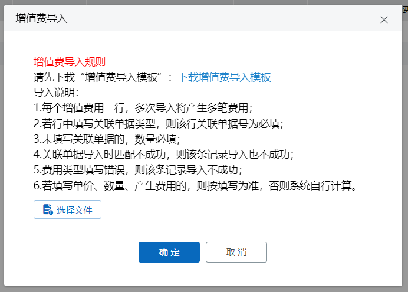

# 货主增值费用

仓库内替货主进行包装、清点、除尘、换标、洗护、维修等作业需要向货主收取费用，因费用名目，计费维度、来源数据等不同故货主增值费用支持自定义配置费用。

### 1.查询
可根据货主、商品类型、费用名称进行查询。

### 2.费用类型维护
填写类型名称和单价，单价可不填，新增的费用类型可删除，但关联增值费用的类型不能删除。

点击...进入设置页面，可指定货主设置单价，同一货主不能重复设置多个单价：

### 3.新增费用
3.1 按关联单据新增单个费用类型。

1）费用类型、费用名称、货主及产生费用必填，选择费用类型后，默认带出费用名称（同费用类型）关联单据类型选择后，关联单据编码必填，单据类型包括出库单、入库单、盘点单、加工单、移库单。

2）单据编码填写后需匹配成功才能保存生效，出库单、入库单、加工单根据货主+单据类型进行匹配，盘点单、移库单根据单据类型进行匹配。

3）计费单价和产生费用可以为负数，可用于费用审核过后发现不对去进行对冲纠正。

3.2 按关联单据新增多个费用类型。

1）关联单据类型选择后，关联单据编码必填，单据类型包括出库单、入库单、盘点单、加工单、移库单。

2）单据编码填写后需匹配成功才能保存生效，出库单、入库单、加工单根据货主+单据类型进行匹配，盘点单、移库单根据单据类型进行匹配。

3）匹配成功后列表“费用类型”、“单价”会自动带出当前仓维护的费用类型数据，“数量”为单据中商品数量，金额由系统自动计算带出。

4）费用名称、单价支持向下填充。

注：金额非必填，若填0或空则此条费用无效，费用名称非必填；若金额非空或非0，则费用名称必填。

### 4.删除费用
可以点击列表-操作中的删除，删除单条费用，也可以勾选多条费用，点击删除按钮进行批量删除。

### 5.审核
1）点击审核会弹二次确认窗，确认后审核通过费用生效，这笔费用会进入货主费用明细-增值费用中，货主费用统计中也会统计该笔费用，统计时间为费用的创建时间。

2）若配置了按金额扣减，审核后会扣减对应金额。

### 6.增值费导入
支持导入增值费用任务。

1.关联单据类型仅支持入库单、出库单、盘点单、加工单、移库单，否则报错。

2.关联单据类型和关联单据编码关联，若填则都需填。

3.计费单价：未填写单价时，取值费用类型单价；计费数量：未填时取值匹配单据的数值。

注：不与单据强关联，不符合单据数据也可导入成功。

4.产生费用未填写时通过计算得出，即计费单价×计费数量。

5.计费单价、产生费用可为负数。

### 7.批量审核
支持勾选多笔批量审核。

1.支持跨页勾选，限制最大1000单。

2.支持部分成功，审核失败的保留勾选。

3.审核成功后，对应货主费用明细和统计会显示数据，货主单量按金额会扣减对应金额。

> 更新: 2025-08-11 11:59:28  
> 原文: <https://hupun.yuque.com/unzko7/lsbfg0/uxglu8wumzs5oxyp>