# 01. 基础信息与系统设置

> 资料来源：基于 `00-源文件/` 对应模块的原始操作手册、专题功能与PDA文档重组迁移。
> 事实边界：正文仅重组迁移原始文档；章节编号、目录和来源标记为整理信息，不新增业务规则、字段或流程。

## 本章知识目录

- **01.1 基础档案管理**
  - [仓库库位](#0111-仓库库位)
  - [供应商档案](#0112-供应商档案)
  - [WMS-顺丰国际保税](#0113-WMS-顺丰国际保税)
  - [其他打印模板](#0114-其他打印模板)
  - [发货单模板](#0115-发货单模板)
  - [快递单模板](#0116-快递单模板)
  - [视频水印模板](#0117-视频水印模板)
  - [跨境快递单模板](#0118-跨境快递单模板)
  - [WCS管理](#0119-WCS管理)
  - [容器管理](#01110-容器管理)
  - [自动化仓库](#01111-自动化仓库)
  - [设备任务](#01112-设备任务)
  - [设备管理](#01113-设备管理)
  - [承运商档案总览](#01114-承运商档案总览)
- **01.2 店铺管理与系统配置**
  - [WMS小红书授权](#0121-WMS小红书授权)
  - [WMS抖音店铺授权](#0122-WMS抖音店铺授权)
  - [WMS有赞店铺授权](#0123-WMS有赞店铺授权)
  - [WMS爱库存店铺授权](#0124-WMS爱库存店铺授权)
  - [WMS视频号微信小店授权](#0125-WMS视频号微信小店授权)
  - [仓库管理](#0126-仓库管理)
  - [安全设置](#0127-安全设置)
  - [审批中心](#0128-审批中心)
  - [审批管理](#0129-审批管理)
  - [对接配置](#01210-对接配置)
  - [【库存初始化】各ERP调整方式一览](#01211-库存初始化各ERP调整方式一览)
  - [异步接口日志](#01212-异步接口日志)
  - [操作日志](#01213-操作日志)
  - [清关系统对接](#01214-清关系统对接)
  - [溯源上传记录](#01215-溯源上传记录)
  - [物流跟踪详情](#01216-物流跟踪详情)
  - [系统冻结](#01217-系统冻结)
  - [视频流量详情](#01218-视频流量详情)
  - [角色管理](#01219-角色管理)
  - [账号管理](#01220-账号管理)
  - [货主管理](#01221-货主管理)
  - [店铺管理总览](#01222-店铺管理总览)
  - [库存初始化总览](#01223-库存初始化总览)
- **01.3 PDA基础配置与登录**
  - [PDA-优先库位](#0131-PDA-优先库位)
  - [PDA-商品信息](#0132-PDA-商品信息)
  - [PDA-商品称重](#0133-PDA-商品称重)
  - [PDA-库区预警](#0134-PDA-库区预警)
  - [PDA-条码打印](#0135-PDA-条码打印)
  - [PDA-产品授权](#0136-PDA-产品授权)
  - [PDA-基础配置](#0137-PDA-基础配置)
  - [PDA-登陆](#0138-PDA-登陆)

---

## 01.1. 基础档案管理

### 01.1.1 仓库库位

> 原始文件来源：`00-源文件/操作手册/基础信息/档案管理/仓库库位.md`

系统中仓库库位一共分为3级区分，分别为区域-库区-库位；

#### 1.区域

如图所示，仓库下的一个平面仓（一层）建议编为一个区域。

功能：用于业务隔离，不同区域下系统在业务处理上有区别，如补货上架只会在同区域内生成自动任务，防止跨层作业等。

#### 2.库区

橙色虚线标记的区，用来区分实际作业中的功能划分。

功能：用于业务区分，如区分大货整存区，小件的拣选区，包装复核等功能区域；用于工作分配，系统中出库订单、补货作业等均会标记该作业的库区，用于根据库区来分配工作；

#### 3.库位

蓝色实线标记的区，如图中整存区一个托盘为一个地堆库位，拣选区的一个货架上的每个格子，也为一个库位；

功能：用来标记货品在仓库中精准位置，库位是仓库中最小的定位标志；

新增区域操作如图：

新增库区操作如图：

提示：

先在当前仓库下增加区域，然后在区域下增加库区。

新增库位操作如图：

库位条码打印

先选中需要打印的条码再点击库位条码按钮即可

也可以点击进行上图所示模板设计及预览功能。

##### 01.库位使用方式

系统中库位有多种功能区分，用来区分不同的库位用途。

拣选库位：系统中订单出库时，锁定库位只会锁定该类型库位；

箱拣选库位：用于存放整箱货物，满足订单出库时拆零和货箱分开拣货的需求；

存储库位：补货上架的来源库位，自动补货任务时系统将会从存储库位补货到拣选库位；

预配库位：波次策略中配合仓库预打包作业，用于直接分配订单到指定的预配库位上；

异常暂存：该库位用于操作员操作订单时，订单被拦截取消后，货品放置到该库位下；

过渡库位：用于仓库进出库时，用于过渡的库位，系统在执行相关作业完成后（检验等）生成移库任务；

工位：用于标记操作员在当前功能区下的位置，支持监控位配置；

次品库位：只可存放库存属性为次品的商品，用于存放入库、仓内操作时发现的残次品；

##### 02.库位容积及限重

系统自动生成补货上架、移库等仓内作业任务时，会根据当前库位的剩余容积及重量来判定上架商品的数量。

##### 03.库位优先商品

系统自动生成补货上架时，如该库位有优先商品，则会优先上架此商品到该库位，次品库位不支持设置优先商品，进行扫描录入的时候支持条码截取。

##### 04.已用容量更新

库位会更新已用的容积、承重。

##### 05.使用方式

修改库位使用方式

①.存储库位变更为其他使用方式，要看下是否有订单锁定、补货任务锁定、移库任务锁定、加工单锁定、移库任务目标库位的在途，若存在其中一种情况则会显示修改失败。

②.拣选库位变更为其他使用方式，要看下是否有订单锁定、加工单锁定、补货任务目标库位的在途、移库任务目标库位的在途，若存在其中一种情况则会显示修改失败。

③.预配库位变更为其他使用方式，要看下是否有订单锁定、加工单锁定、预配波次占用，若存在其中一种情况则会显示修改失败。

④.过渡库位变更为其他使用方式，要看下是否有订单锁定、移库任务锁定、加工单锁定、移库任务目标库位的在途，若存在其中一种情况则会显示修改失败。

⑤.箱拣选库位、工位、异常暂存库位更为其他使用方式，都要看下是否有订单锁定、加工单锁定，若存在其中一种情况则会显示修改失败。

⑥.次品库位变更为其他使用方式，要看下是否有移库任务锁定，有则修改失败。

⑦.其他库位变更使用方式为次品库位，要看下该库位是否有正品库存、是否设置优先商品，有其中一个则修改失败。

注：查看库位库存锁定信息，可在系统库存-库位库存中查看，如下图（点击数量可查看具体单据信息）：

##### 06.排除指导余量or排除指导历史

开启排除指导余量or排除指导历史，指导时排除该库位。

##### 07.货品混放

设置库位上是否允许存放多种商品，设置为是，此库位上允许存放多种商品，设置为否，此库位上只能存放一种商品。

注意：

1.过渡库位、异常暂存库位必须设置允许货品混放，不可设置为否。

2.库位的货品混放设置为否后，在进行入库、移库、盘点、指导上架，补货上架、仓内加工等作业时，选择目标库位时会判断库位是否允许货品混放。目标库位不允许混放且库位上有其他商品时，则跳过此库位。

3.唯一箱不可与其他货品/箱子混放。

注意：库存移动、补货等将唯一箱从存储库位移动到拣选库位拆箱上架，拣选库位的拆零商品和唯一箱的箱内商品一致时，正常操作移库、补货任务。

4.规格箱和散件商品一致时不算混放 。              

##### 08.库位标签

普通波次策略分组条件中增加了“库位标签”，通过给不同库位设置库位标签，来达到带有指定库位标签的库位生成到相同波次的目的。

##### ①.维护库位标签

库位标签支持新增、删除、修改：

注：最多能添加100个标签，标签名称不允许重复，最多10个字符

##### ②.设置库位标签

库位标签支持单个库位设置、批量设置。

单个库位设置如下图，点击...显示设置弹窗，勾选指定库位标签后点击确定，即可添加成功：

批量设置如下图，先勾选目标库位，再点击批量修改库位标签，选择指定标签后点击追加或覆盖：

注：

（1）每个库位最多支持设置10个库位标签，若超出则设置失败，会有报错提示；

（2）追加：指在现有库位标签基础上增加新设置的库位标签；覆盖：指不保留原有库位标签，用新设置的库位标签覆盖现有数据。

##### 09.路径优先级

通过设置库位的拣货优先级就可以改变仓库内拣货、移库取货的库位排序顺序，便于自行对库位路径进行规划

①.修改原库位优先级为锁定优先级，新增路径优先级，输入限制1-999999

②。优先级1最高999999最低， 无优先级排最后，可直接编辑，也可以批量修改或者清除，支持导入导出。修改成功后，PDA拣货页面及补货任务、移库任务、加工领料页面订单按照库区编码+设置的优先级+库位编码展示，默认按库区编码从小到大排列，相同库区下按照设置的优先级从高到低排序，相同优先级下按库位编码从小到大排序

注：次品库位不支持输入优先级；是否按库区编码排序有后台开关，开启后可以只按照路径优先级排，不按库区编码排。

##### 10.存储条件

系统默认库位存储条件为空，支持自定义存储条件。修改存储条件时，若指定库位无库存及优先商品，则存储条件可任意设置；若指定库位有库存或优先商品时，则库位存储条件必须与库存商品/优先商品的存储条件保持一致（或库位存储条件为【不限】），否则不允许设置。

注：1.导入库位未指定存储条件时，wms系统默认填充为空；

2.仓库和库位的自定义存储条件数据互通；

3.使用中的存储条件不支持删除。

##### 11.库位存储类型

区分“普通库位”和“托盘库位”，托盘容器只能指导到托盘库位上。

> 更新: 2026-05-06 09:32:18  

> 原文: <https://hupun.yuque.com/unzko7/lsbfg0/tbvpyuo6brv761dg>

---

### 01.1.2 供应商档案

> 原始文件来源：`00-源文件/操作手册/基础信息/档案管理/供应商档案.md`

供应商是给你供货的群体，你需要根据自己店铺的销售状况，定期向他们发出订货订单，供应商信息通过手工方式新增。

#### **1.新增**

点击新增，输入供应商详细信息，保存。

相关信息填写好，以备查找供应商相关信息是可以快速查询。

公司开启【UDI追溯回传】模块时，新增弹窗会多一个字段：码上放心发货企业entid。该字段有值时，在对接溯源上传系统时会优先使用该字段内容，若该字段为空则使用供应商编码。支持手动查询entid信息，若有查询结果会自动填充到文本框中，无查询结果或有异常时会报错提示。

#### **2.停用、启用**

对于不用的供应商，点击停用，供应商停用但不删除；停用的供应商再次使用，点击启用。

#### **3.匹配规则**

ERP推采购订单到WMS，供应商匹配规则如下：

1. 先匹配供应商编码，编码未匹配到，再匹配供应商名称，名称也未匹配到会自动新增供应商，入库预约的操作记录可以查看到日志

2.编码匹配到                        

①、供应商状态是启用，ERP和WMS名称不一致时，自动修改WMS中供应商名与ERP中的一样；名称一致，不修改供应商名称；                        

②、供应商状态是停用，ERP和WMS名称不一致时，WMS中供应商状态停用自动变为启用且修改供应商名称；名称一致，WMS中供应商状态停用自动变为启用且不修改名称

3. 编码没有匹配到，名称匹配到                   

①、供应商状态是启用，修改WMS中供应商编码与erp中一样                     

②、供应商状态是停用，WMS中供应商状态停用自动变为启用且修改供应商编码        

> 更新: 2026-04-28 18:21:28  

> 原文: <https://hupun.yuque.com/unzko7/lsbfg0/smxs1gl5xzzbiqcg>

---

### 01.1.3 WMS-顺丰国际保税

> 原始文件来源：`00-源文件/操作手册/基础信息/档案管理/承运商档案/WMS-顺丰国际保税.md`

业务场景：国内保税仓的保税进口，例如生鲜品、酒水等需要发顺丰冷链的。

准备步骤1：确保WMS已购买并开启跨境保税模块

准备步骤2：找到对接的顺丰大客户经理，提供客户编码和月结卡号，让大客户经理提交内部申请IT流程编码：IT031，配置海关推送的信息和推送取attr001的数值作为报关的订单号。

PS：客户编码需要登录顺丰丰桥，控制台查看客户编码。

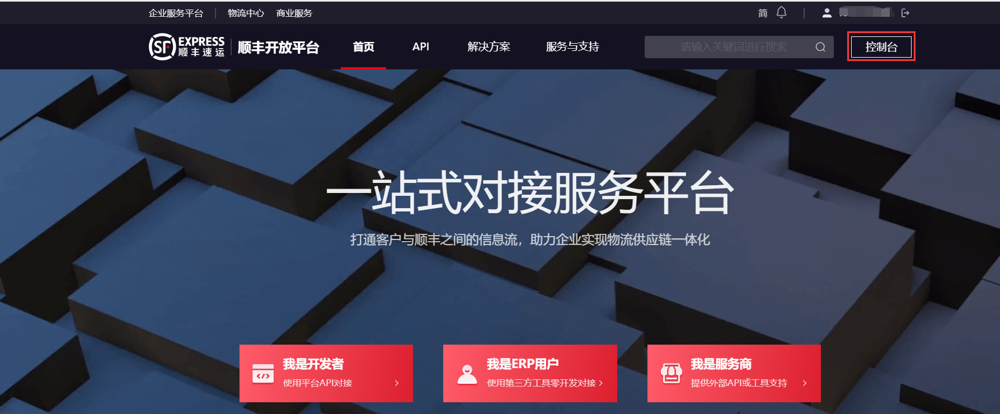

快递配置：选择或新建个顺丰速递，填写客户编码、月结卡号、校验码。

特殊点：使用国际件下单选择是，选择口岸、设置税金付款方式、填写电商企业编码即可。

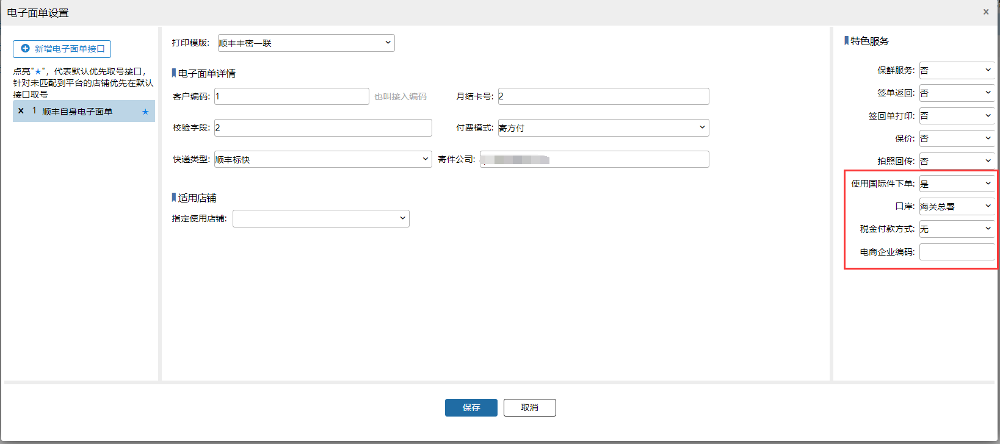

> 更新: 2024-06-04 14:25:10  

> 原文: <https://hupun.yuque.com/unzko7/lsbfg0/cxb8afb3qs60h5ca>

---

### 01.1.4 其他打印模板

> 原始文件来源：`00-源文件/操作手册/基础信息/打印管理/其他打印模板.md`

设置其他打印模板：配货单，商品条码，出库单，采购入库单，销售退货入库单，发票，补货单，库位条码，用户编码、设备编码、装箱信息、入库预约单、消退预约单、拿货标签、出库装箱单、报关单、盘点汇总单、库存转移单、移库单、箱唛、仓内加工单模板与快递单模板设置方法极其类似。这里就不具体介绍了。

#### 1.下图是其他打印模板界面：

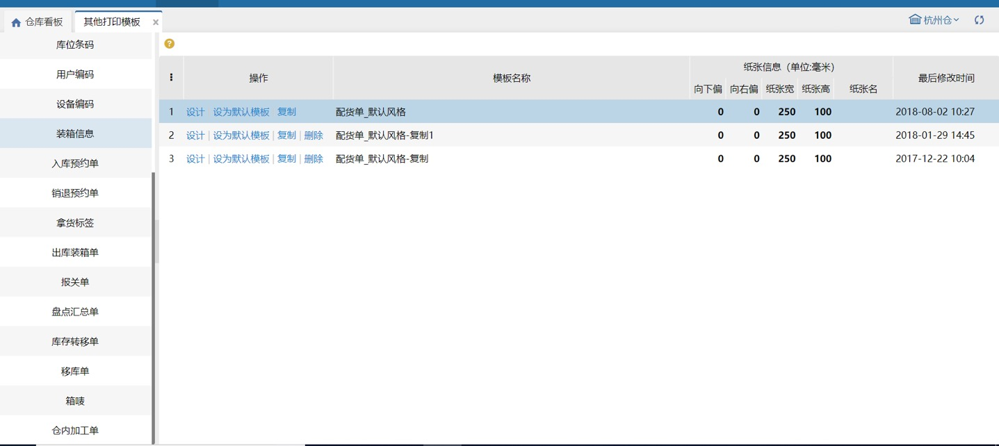

#### 2.出库单增加线上组合商品打印项：线上组合名称、线上组合编码、线上组合数量、组合配比。

  a.这几个打印项有开关控制，如有需要可以联系客服开启开关，只对开启开关后进入到 WMS的订单有用。

注：只有是使用万里牛erp的客户可开启。

  b.单品和组合商品排序：单品在前，单品按照自定义的排序，组合商品在后，按照组合商品编码>组合商品名称>规格编码>自定义的排序。

#### 3.打印项支持转换为一维码、二维码打印。

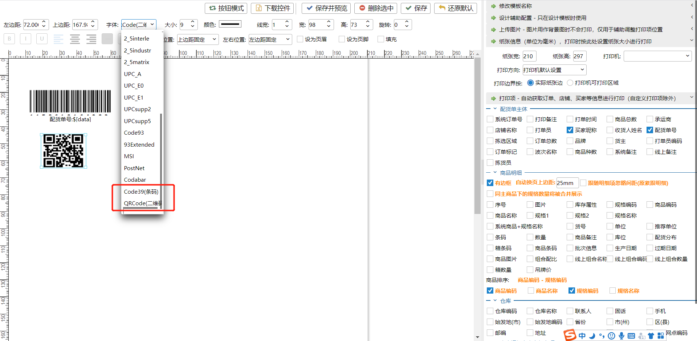

**注：条形码不支持中文。**

#### 4.配货单-拣货任务序号

1.ToC业务订单/波次打印拣货任务序号显示1/1。

2.大宗业务根据拆分任务显示数据：A/B/C（拣货拆分子任务/当前任务序号/总任务数）

例：1个订单拆分3个任务，第1个任务无拆分子任务，即1/3；第2个任务拆分1个子任务，即2/3；子任务即1/2/3。

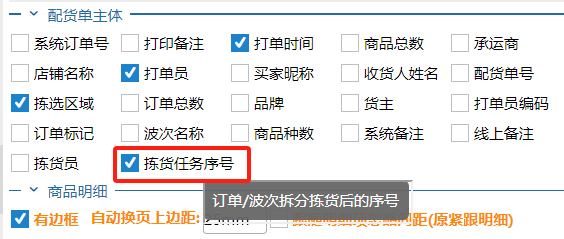

#### 5.箱唛-普通箱唛、电子箱唛

普通箱唛：大宗装箱后，普通箱子打印的箱唛。

电子箱唛：需先申请电子箱唛后可打印的箱唛。（仅唯品会订单支持申请）

（支持打印线上商品和组合商品信息，单明细情况下支持“明细非表格形式”）

#### 6.配货单-拼接内容换行显示

仅选择打印项“配货分布”时显示，未设置则打印内容逗号分隔拼接；已设置则打印内容换行分隔拼接。

#### 7.商品条码-支持按店铺配置打印

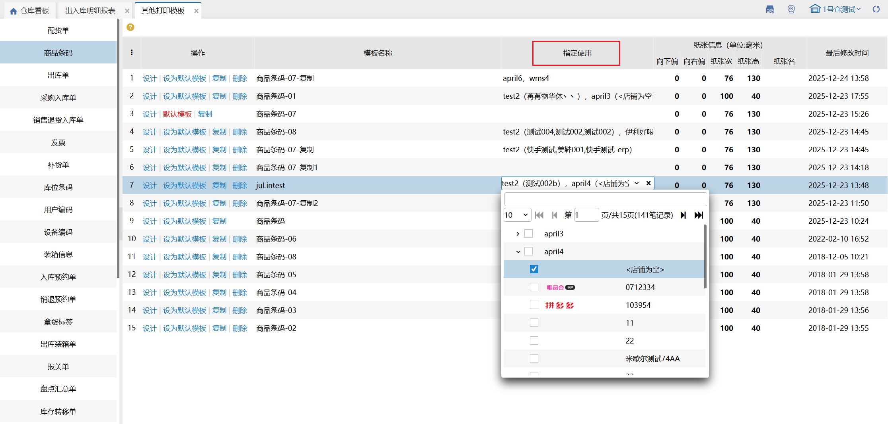

打印逻辑：

未设置指定使用店铺时，打印模板记录操作员上一次使用模板

配置后：

单笔打印，预览显示店铺配归属模板，允许临时修改，仅当次生效

多笔一起打印，预览时不显示模板，打印时涉及模板尺寸必须一致，否则报错

后置打印，预览不显示模板选择

PC出库页面支持，大宗拣货页面支持

#### 8.拿货标签-指定使用模板

1.显示公司下所有启用中的货主（一级）和货主的店铺（二级）。（单货主无货主项）

注：复制拿货标签模板后指定使用不复制，即默认显示空白。

> 更新: 2026-06-11 10:22:29  

> 原文: <https://hupun.yuque.com/unzko7/lsbfg0/wspg7hqr01xxs2ov>

---

### 01.1.5 发货单模板

> 原始文件来源：`00-源文件/操作手册/基础信息/打印管理/发货单模板.md`

系统默认提供了8种风格，您可以在这8种模板中，选一种最适合自己的模板。如果模板内容有需要修改的，修改方法跟快递单模板修改方法极其类似。

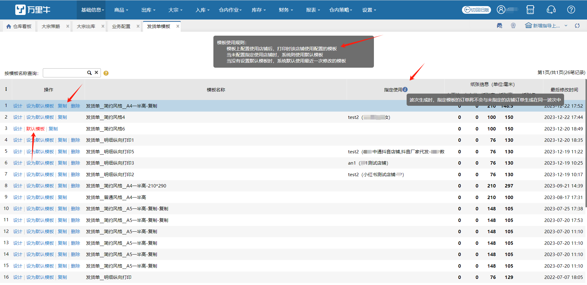

#### 1.发货单_明细纵向打印模板是小票格式，打印热敏发货单可以选择这个模板再进行调整，效果如下图：

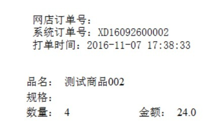

打印时某个字段显示位置和设计位置相差很大的情况，建议考虑用位置锁定的方式来调整。

位置锁定是指：点模板前面的设计，进来后点上面部分的上下位置和左右位置来调整。

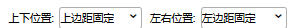

#### 2.100*100的纸张大小，纸张大小可以根据打印机纸张调整，效果图如下：

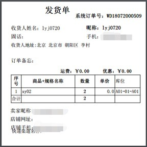

#### 3.线上组合商品打印项：线上组合名称、线上组合编码、线上组合数量、组合配比：

a.开关控制，如有需要可以联系客服开启开关，只对开启开关后进入到WMS的订单有用。

注意：只有是使用万里牛erp的客户可开启。

b.单品和组合商品排序：单品在前，单品按照自定义的排序，组合商品在后，按照组合商品编码>组合商品名称>规格编码>自定义的排序。

c.发货单合并商品明细和合并同商品表格两个设置项对组合商品无效。

d.发货单线上组合编码、线上组合名称、线上组合数量会自动合并。

4.序列号打印项：

a.跟随业务配置-其他配置-开启商品序列号管理开关关联显示。

b.每个序列号显示一行。 

#### 4.指定使用模板

1.显示公司下所有启用中的货主（一级）和货主的店铺（二级）。（单货主无货主项）

注：复制发货单模板后指定使用不复制，即默认显示空白。

2.设置后店铺订单发货单使用已指定的模板，生成波次和打印时可用到。

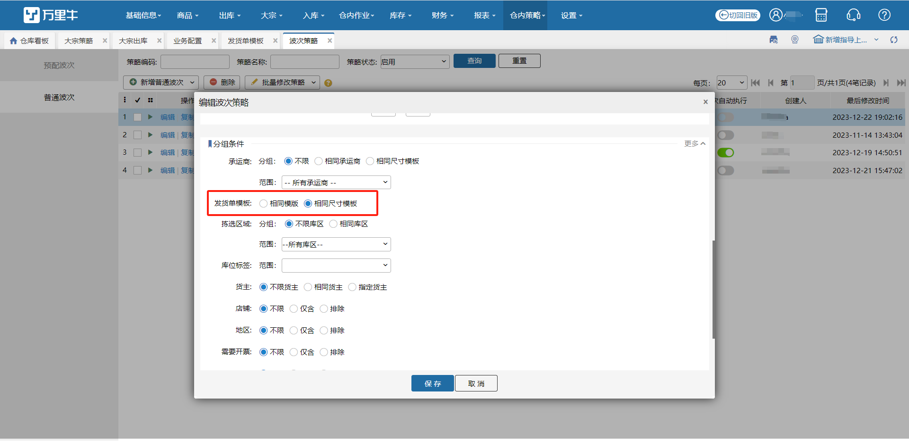

a.生成波次：指定模板和非指定模板订单无法生成到同一波次内。其余按照配置进行生成。

b.打印：支持同模板、同尺寸模板打印（注：勾选指定和非指定订单支持一起打印）

不同尺寸模板打印报错。

#### 5.拼接内容换行显示

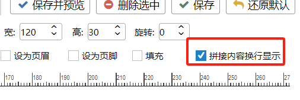

仅选择打印项“批次详情”时显示，未设置则打印内容逗号分隔拼接；已设置则打印内容换行分隔拼接。

#### 6.自定义合计行

支持自定义勾选合计字段，在表格最下行显示合计结果：

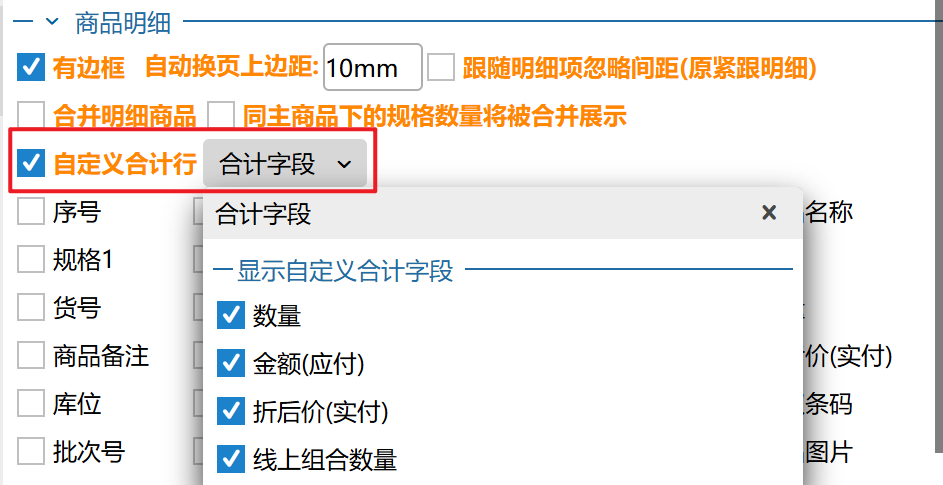

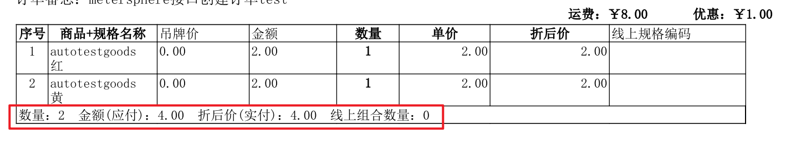

> 更新: 2025-04-29 16:36:39  

> 原文: <https://hupun.yuque.com/unzko7/lsbfg0/qsxyn14s1q13n3sx>

---

### 01.1.6 快递单模板

> 原始文件来源：`00-源文件/操作手册/基础信息/打印管理/快递单模板.md`

系统已有181个快递模板提供选择。

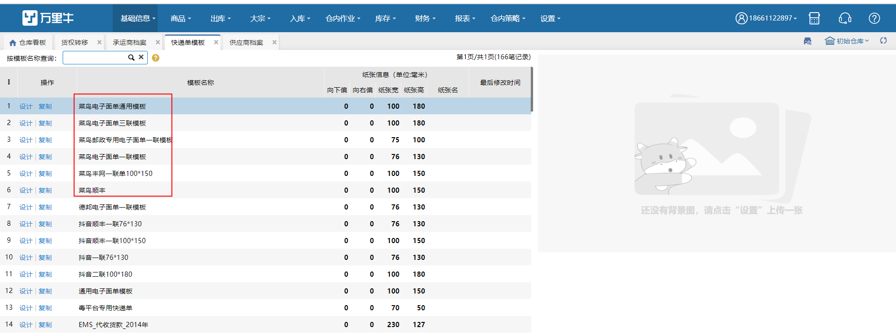

如果打印模板有特殊要求，可以自己进行设计调整。

选择相应模板点设计进去调整

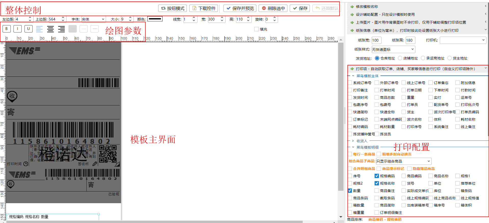

#### **1.打印配置**

##### 01.上传图片

     快递公司更改的面单纸样式，模板需要重新调整，先输入背景图网络地址，然后点击设为背景图即可。

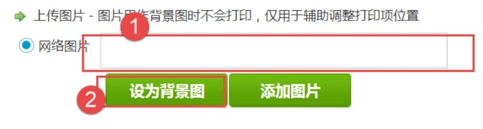

   模板上需要打印特殊图片，比如公司官网链接二维码等等，先输入图片网络地址，然后点击添加图片，模板主界面就会出现想要的图片。

##### 02.纸张信息

①　设置打印纸张大小；

②　对于某些打印机，有可能不支持外部程序自定义纸张大小。因此需要通过直接指定打印机及其对应纸张方式来使配置生效；

③　**发货地址**：即在面单上的寄件人信息，可以选择面单上显示的地址是对应仓库地址、店铺地址还是承运商地址。此配置项也平台电子面单模板中可配置的寄件人信息中的地址，云仓版还可以选择货主地址以供使用。

重要：如果选用店铺地址/货主地址的，会出现部分新增店铺/货主，出现忘记维护地址带来信息缺失问题，可使用业务配置-出库配置-快递面单发货地址取值功能，启用兜底地址

##### 03.打印项

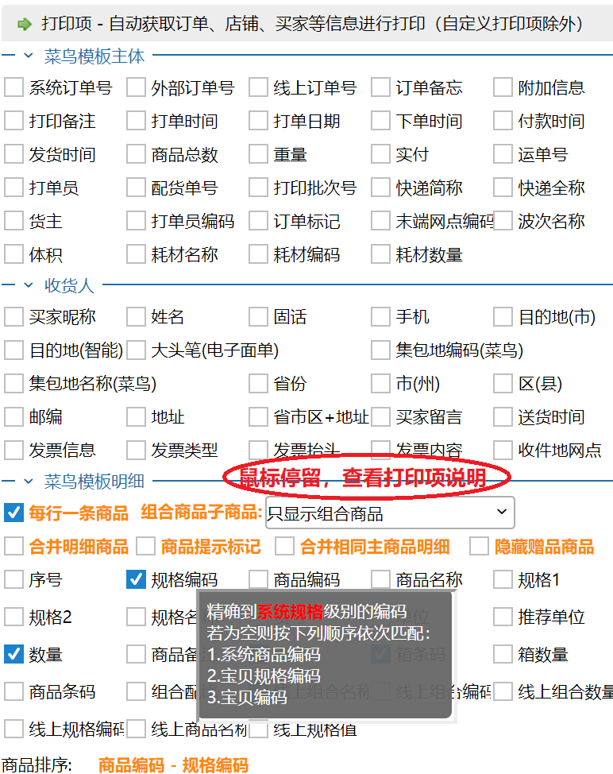

**重要**

1.每行一条商品：勾选后，一条商品明细打完，换行打印下一条商品

2.合并相同主商品明细：开启后，同一商品下的sku会合并成一条明细打印，此项有开关控制，开启需要联系技术人员

3.隐藏赠品商品：开启后，打印商品明细会忽略订单中的赠品

4.只有菜鸟电子面单模板增加线上组合商品打印项：线上组合名称、线上组合编码、线上组合数量、组合配比。

①.这几个打印项有开关控制，如有需要可以找技术开启开关，只对开启开关后进入到WMS的订单有用。

②.单品和组合商品排序：单品在前，单品按照自定义的排序，组合商品在后，按照组合商品编码>组合商品名称>规格编码>自定义的排序。

##### 04.在菜鸟电子面单通用模板中支持自主打印快递公司图标，便于用户在使用空白单据进行不同承运商面单混打。

纸张样式默认为无快递图标，选择带快递图标一项

重要：

【打印项】分为【数据项】和【自定义打印项】

1.【数据项】：指通过店铺、订单等获取到的信息，会根据具体的订单、店铺等不同动态加载。

2.【自定义打印项】：是指一些固定的内容，主要是为了方便您添加一些自定义的信息。目前支持文案、矩形、椭圆、直线、页号/页数。

#### ** 2.绘图参数模块**

【绘图参数项】是指绘图编辑区各种操作指令与配置。对于其中比较重要的几个常用指令，参照下图的说明。

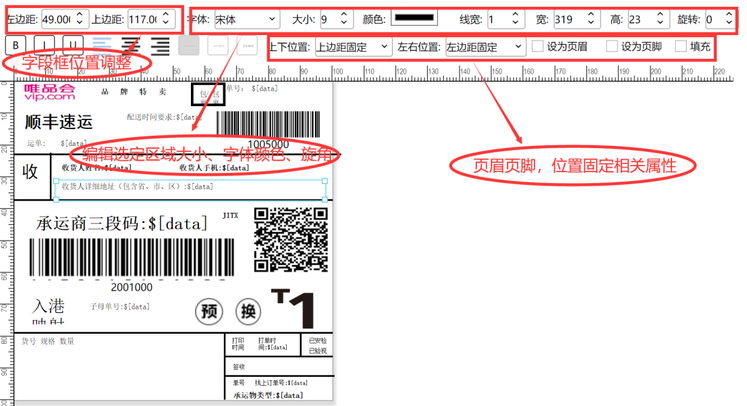

提示

1.选定区域可以直接拖动设置大小，也可在上方设置固定大小。

2.每个字段框根据显示位置设置不同的位置属性。

#### **3.模板主界面**

模板主界面显示了最常用的一些字段，位置已经过初步校正。大部分情况下，它们是适用的，你也可以通过直接拖动的方式，按自己的要求来调整。

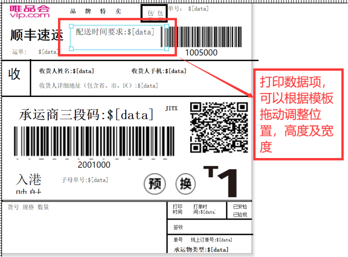

重要说明

1. 打印项的内容会按照文本框的大小进行打印，超出范围后自动截去。如遇到被截情况，可适当放大打印项的区域；

2.数据打印项的内容默认都包含了${data}字样，打印时${data}会使用真实数据进行替换；

3. ${data}字样建议您不要去除，这样可以帮助您区分自己添加的自定义文本；

4.如果去除了${data}字样，打印时会将真实数据添加在文案后面；

#### ** 4.整体控制**

#### 

   1）点击按钮模式，单个打印项可以进行多次选择；

   2）由于打印控件更新、损坏等原因需要重新下载的点击下载控件按钮下载更新；

   3）点击预览按钮，预览当前模板的打印效果图；

   4）已选择的打印项不想要了，选中之后点击删除选中按钮删除；

   5）调整好模板之后，点击保存按钮保存；

   6）模板调整的很乱，需要重新开始调整或者使用原始模板，点击还原默认按钮回到初始状态。

#### **5.顺丰丰密模板**

客户反馈有部分顺丰网点要求使用国内丰密电子面单，为了支持丰密电子面单一些加密信息的显示，增加了三个模板，100*150模板(图1)、100*180模板(图2)、100*210模板(图2)。若用户需要使用丰密电子面单请找对应的网点开通。

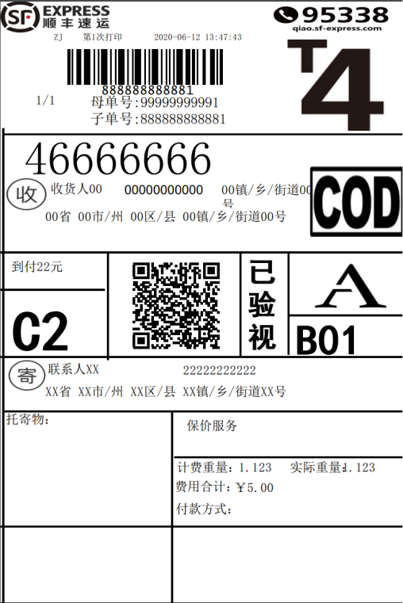

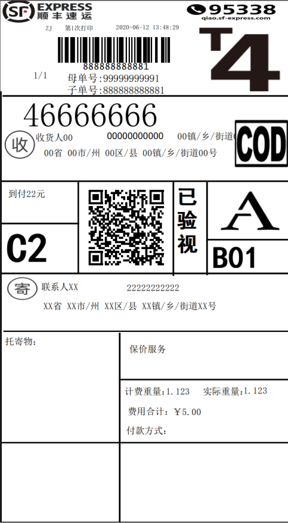

 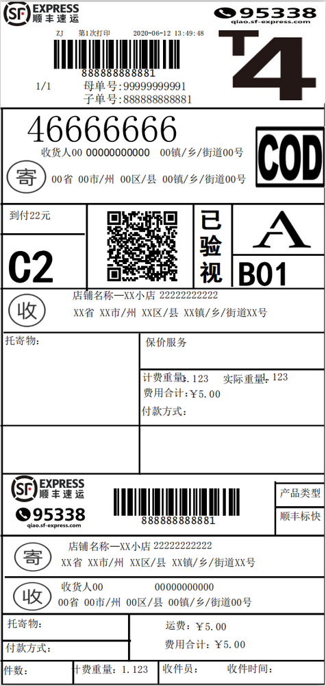

#### **6.打印项转换为一维码、二维码打印**

##### 01.字体下拉后增加打印项转换为一维码、二维码显示的选项。

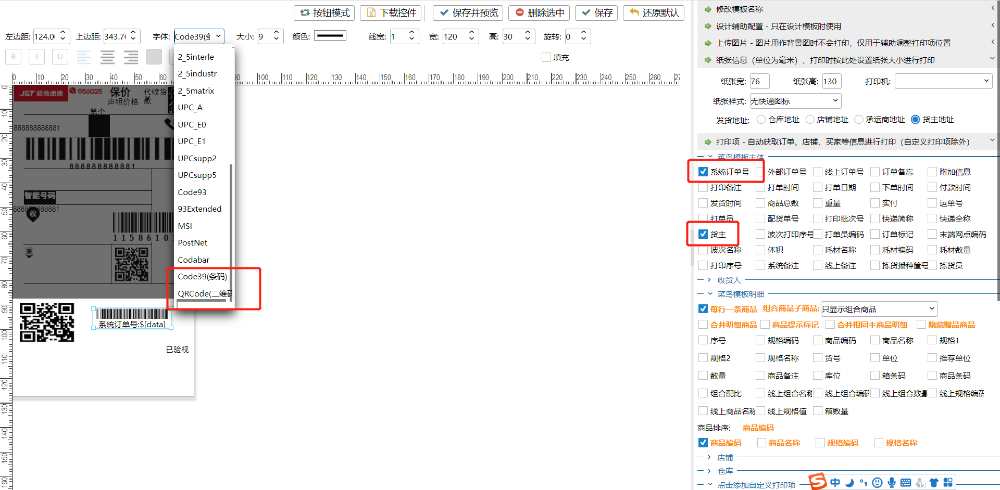

##### 02.打印组件：

a.菜鸟、京东、抖音：条码-Code39、二维码-QRCode

b.拼多多：条码-code128a

注：快递单-商品明细内的打印项选择后不显示一维码、二维码的选项（组合类显示的打印项暂不支持转换，例：耗材关联的打印项）。

> 更新: 2025-03-24 14:52:56  

> 原文: <https://hupun.yuque.com/unzko7/lsbfg0/vh2yrf9qok68er9z>

---

### 01.1.7 视频水印模板

> 原始文件来源：`00-源文件/操作手册/基础信息/打印管理/视频水印模板.md`

系统默认提供了2种尺寸的模板，您可以在这2种模板中，选一种最适合自己的模板。如果模板内容有需要修改的，可以点击设计进入模板设计页面。

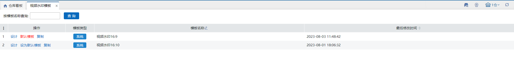

系统模板默认有四个水印项，可按需选择其他水印项拖拽到模板区，也可以自定义设置水印样式、或删除不需要的水印项。

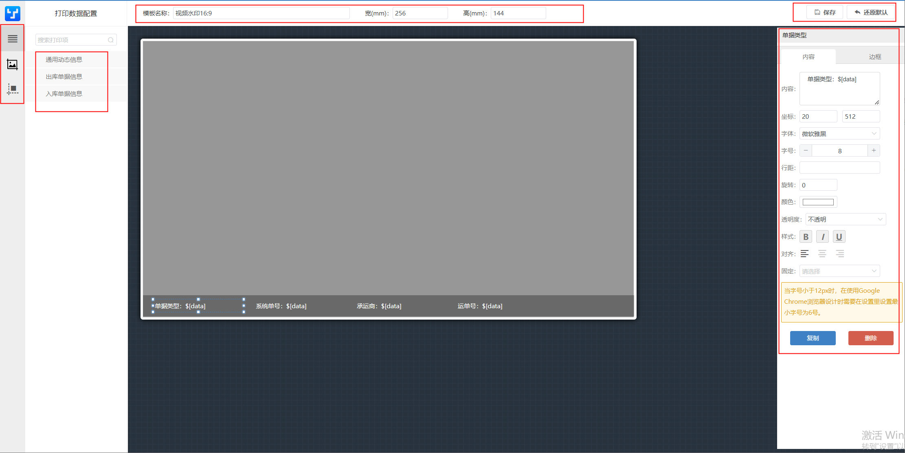

注：

1、若下载水印视频的单据上（或无单据视频）没有模板上添加的水印项，则不会显示该水印项。

2、若下载水印视频后水印项显示不完整，请适当调整模板水印项宽度，确保能完整显示水印。

在水印视频中，通用动态信息，明细动态信息会跟随操作同步刷新显示，用户扫描不同单据和商品时，会显示对应的单据及明细水印。

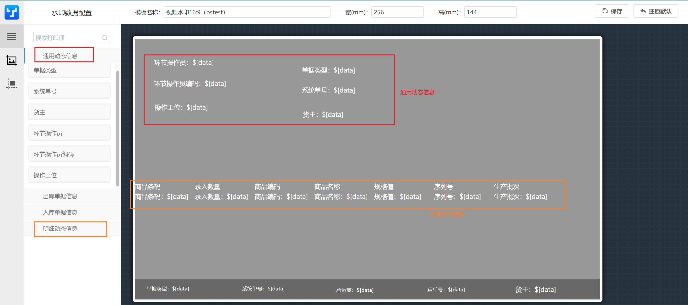

> 更新: 2024-06-20 10:57:50  

> 原文: <https://hupun.yuque.com/unzko7/lsbfg0/wokytzy9y6g0o5by>

---

### 01.1.8 跨境快递单模板

> 原始文件来源：`00-源文件/操作手册/基础信息/打印管理/跨境快递单模板.md`

系统已有6个默认分组E邮宝、邮政平邮、邮政挂号、速卖通、燕文、4PX、万里牛专用模板，每个分组下有默认的系统模板，每个模板有对应的国家、发货单、报关单。

注：

万里牛专用模板不能查看模板。

#### 1.默认分组

1.  E邮宝、邮政平邮、邮政挂号、燕文、4px分组下只有运单打印地址可以更改，模板、国家、发货单、报关单只能查看不能编辑

2.  速卖通，只能更改发货单，其他都不显示，如图所示：                       

#### 2.复制

默认分组下的模板对应模板、国家、发货单、报关单都不能编辑，若需要修改模板/国家/发货单/报关单，可以复制分组，进行修改模板/国家/发货单/报关单，复制按钮在分组的左下角如图所示：

注意：速卖通分组不能复制

#### 3.设置发货单和报关单

非速卖通的分组复制出来后才可以手动修改发货单和报关单。

速卖通直接在默认分组中设置发货单，不能设置报关单。

#### 4.打印配置

##### 01.运单打印地址

发货地址可以根据实际的地址勾选仓库地址/店铺地址/承运商发货地址。                  

##### 02.纸张信息

设置纸张大小，默认是100*100

##### 03.模板设计

预设分组只能查看；复制出的分组，可以根据业务需要修改打印项和打印项位置。

①、预设分组      

②、复制出的分组

> 更新: 2023-12-22 11:10:33  

> 原文: <https://hupun.yuque.com/unzko7/lsbfg0/knwa7l0r0vtr8xsf>

---

### 01.1.9 WCS管理

> 原始文件来源：`00-源文件/操作手册/基础信息/设备管理/WCS管理.md`

仓库人员拣货后放到周转容器里，通过wcs自动化设备扫描周转容器自动识别分拣道口。

#### 1.新增

点击新增，输入设备编码，新增设备编码。

#### 2.设置映射库位

设备上设置了映射库位，wcs自动化设备扫描容器编码后后台指导出库位，通过映射库位确认分拣口。

1.新增区域：映射库位支持设置区域。设备之间设置的区域不能重复，已设置的区域会自动过滤掉。

2.新增库区：映射库位支持设置库区。设备之间设置的库区不能重复。

3.新增库位：映射库位支持设置库位。设备之间设置的库位不能重复。

#### 3.删除

支持废弃的分拣口在系统删除掉。

#### 4.查询

支持设备编码、库位、类型、备注查询。

> 更新: 2023-12-22 11:12:43  

> 原文: <https://hupun.yuque.com/unzko7/lsbfg0/wvs88n9sruaad8fu>

---

### 01.1.10 容器管理

> 原始文件来源：`00-源文件/操作手册/基础信息/设备管理/容器管理.md`

#### 1.寄存容器

作业过程中需要一个地方暂时存放无法处理的包裹，例如：销退的疑难件、未出库的订单包裹或者仓内的其他包裹，因此新增寄存容器功能。

##### 01.新增

点击'新增'按钮，选择自动生成编码或自定义编码。

①** 自动生成编码：**输入容器数后，点击保存即可，编码从RQ0001开始递增

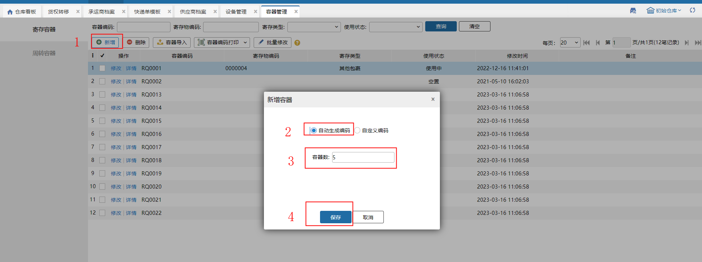

**②自定义编码：**输入容器数量，编码前缀和编码的起始序号后，点击保存即可；PS：编码前缀和起始序号不能为空，编码前缀就是指这个容器的名字。起始序列号就是你起的这个容器名字的结尾是什么，这个只能填数字，并且只能是填正整数。

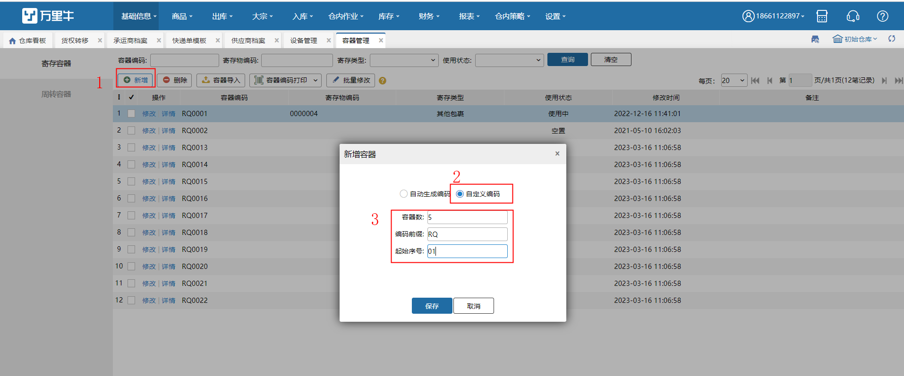

 注意：寄存容器编码不能与周转容器编码、库位编码重复。

##### 02.容器导入

支持通过导入新增或修改容器，如果选择文件之后发现选错了，可以点重新选择。

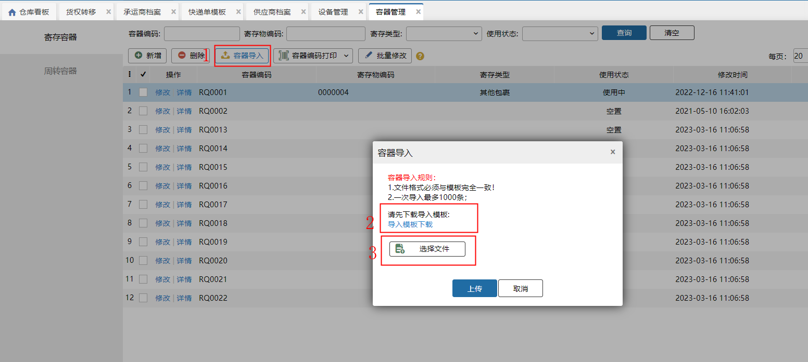

##### 03.容器编码打印

在其他打印模板哪边先设置好容器编码模板，然后在这里打印，把打印的容器编码贴到仓内的容器上，存入取出包裹时，扫描容器上的编码

##### 04.修改容器

支持修改容器编码和备注

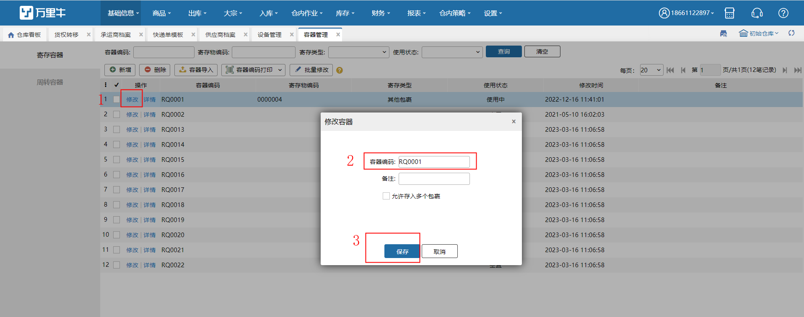

注：容器编码不能与库位编码重复

##### 05.查看容器详情

点击详情可以查看当前容器的存入、取出记录

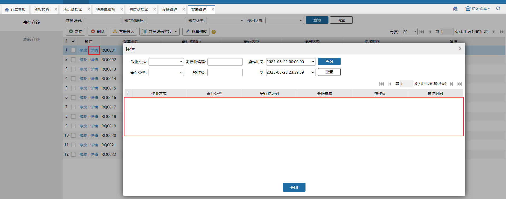

#### 2.周转容器

仓库人员通过在入库清点后暂存到周转箱中，以便上架时操作人员通过扫描周转箱快速找到货品和查看货品数量，直接上架到货位上。

##### 01.新增

点击'新增'按钮，选择自动生成编码或自定义编码。

① 自动生成编码：输入容器数后，点击保存即可，编码从RQ0001开始递增

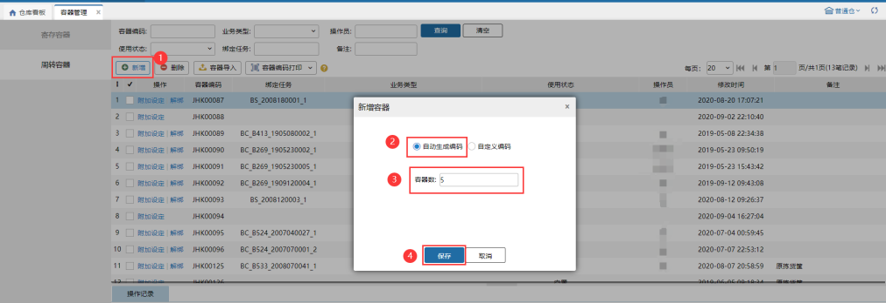

②自定义编码：输入容器数量，编码前缀和编码的起始序号后，点击保存即可；PS：编码前缀和起始序号不能为空，编码前缀就是指这个容器的名字。起始序列号就是你起的这个容器名字的结尾是什么，这个只能填数字，并且只能是填正整数。

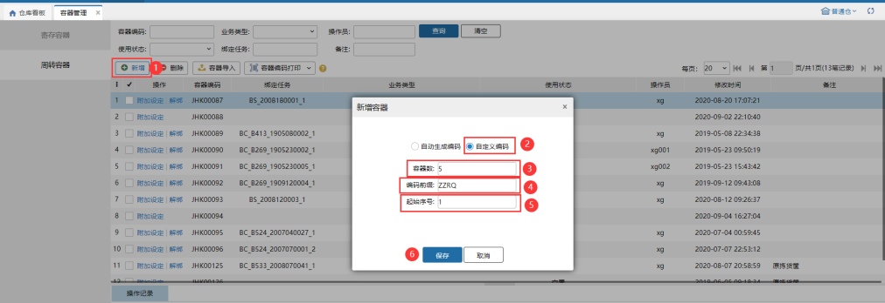

 注意：周转容器编码不能与寄存容器编码、库位编码重复。

##### 02.容器导入

支持通过导入新增或修改容器，如果选择文件之后发现选错了，可以点重新选择。新增和导入默认为拣货框模式。

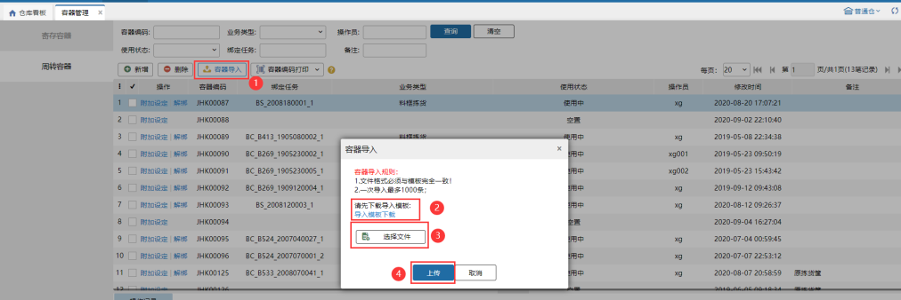

##### 03.容器编码打印

在其他打印模板哪边先设置好容器编码模板，然后在这里打印，把打印的容器编码贴到仓内的容器上，入库、料筐拣货、容器移库时，扫描容器上的编码

##### 04.删除容器

支持删除废弃的容器。

##### 05.修改容器

支持直接在列上修改容器编码和备注。

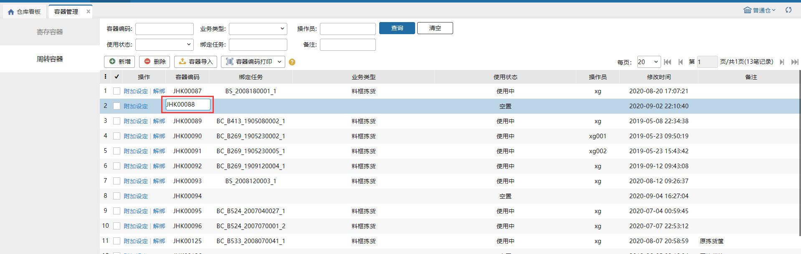

##### 06.附加设定

针对于PDA上料筐拣货、容器拣货、领单播种拣货领取任务条件的设定，选择订单类型、设置指定库区、指定承运商、指定波次策略后保存后。

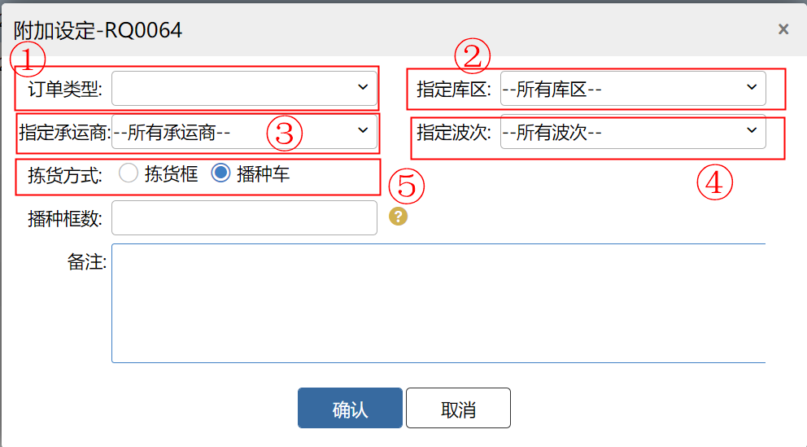  提示：

  ①.订单类型，领取任务时仅领取选择的订单类型的波次；

  ②.库区：领单时，仅领取绑定库区的波次；

  ③.承运商：领单时，仅领取指定承运商的波次；

  ④.指定波次：领单时，仅领取指定的波次策略；

  ⑤.拣货方式：拣货框/播种车，只有当选择播种车时，可以输入播种框数，播种车领取领单播种拣货任务，拣货框领取料框拣货和容器拣货任务；

##### 07.解绑

支持手动解绑料筐拣货和领单播种拣货任务。

##### 08.操作记录

用户可以查看到容器的历史记录排查异常。

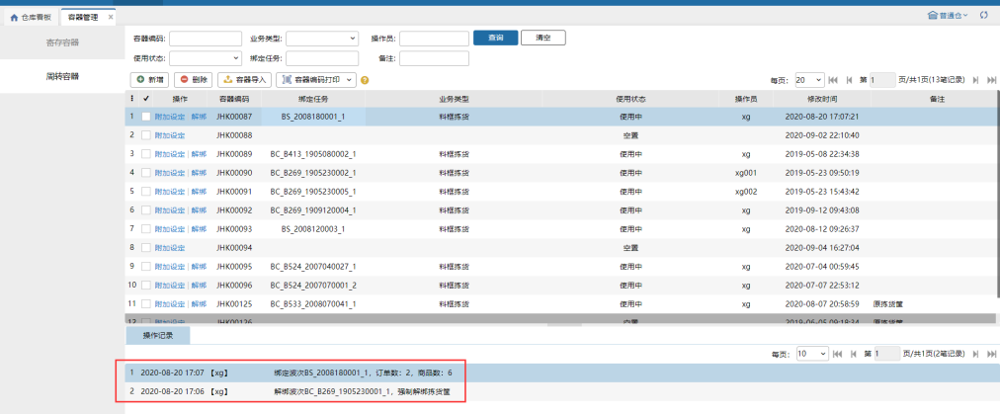

##### 09.容器形态

区分“普通”容器和“托盘”容器，托盘容器允许指导高位货架。

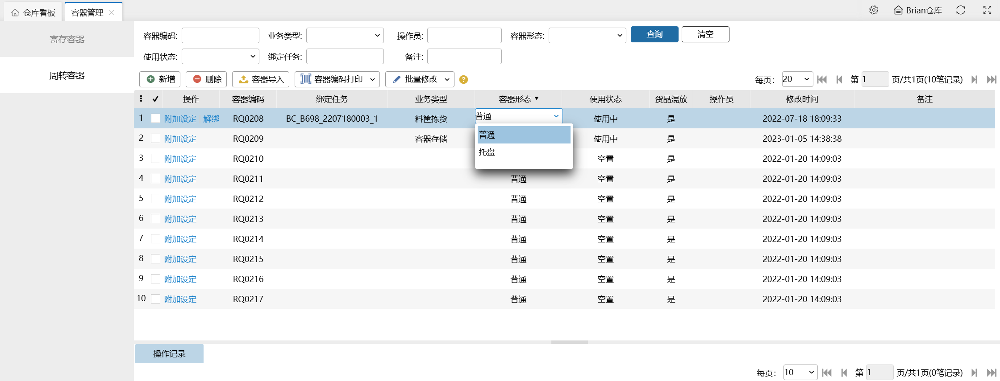

> 更新: 2026-05-06 09:30:17  

> 原文: <https://hupun.yuque.com/unzko7/lsbfg0/vgrnmmdo7vwzwcf7>

---

### 01.1.11 自动化仓库

> 原始文件来源：`00-源文件/操作手册/基础信息/设备管理/自动化仓库.md`

#### 1、入库作业

新增设备配置步骤：点击新增，选择对接设备，设置对应库位范围后，勾选业务能力—同设备入库，进一步设置作业单据类型和任务回传入库库位，设置完成后点击保存。

##### 1.1同设备入库

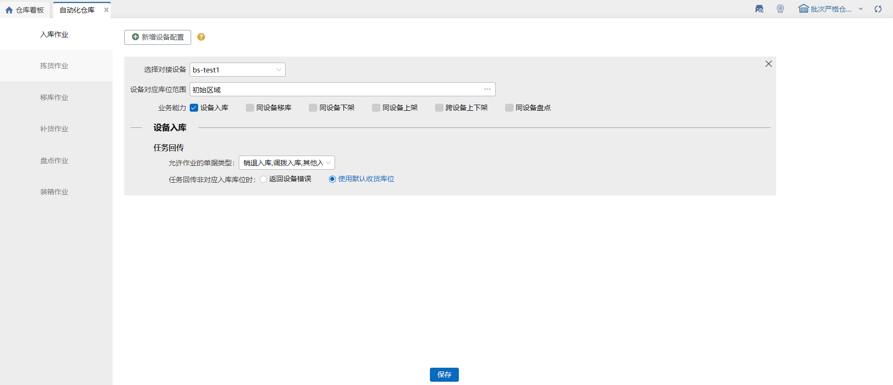

其中：

1. 选择对接设备：仅限授权当前仓库的设备，同一种作业类型下相同设备不允许重复设置；
2. 设备对应库位范围：至少设置1个，可以是区域、库区、库位层级，不同设备间所设置的库位范围不允许交叉；
3. 业务能力：暂时仅支持选择同设备入库；
4. 任务回传：

      a.允许作业单据类型：至少设置1个，可以多选，不同设备间所选择的单据类型不允许重复；

      b.任务回传非对应库位范围时：返回设备错误、使用默认收货库位，按需选择和配置。

        1. 返回设备错误

设备对应库位范围为拣选库区，接收设备回传生成设备任务后，若回传的入库库位在拣选库区范围内，则回传成功，设备任务完结，入库任务完结，入库库位为任务回传库位；若回传的入库库位有不在拣选库区范围内的，则返回设备报错，设备任务无变化，无入库任务。

        2. 使用默认收货库位

 设备对应库位范围为拣选库区，接收设备回传生成设备任务后，若回传的入库库位不在拣选库区范围内，则将回传的设备入库库位替换成业务配置-入库配置-设置默认收货库位，设备任务完结，入库任务完结。

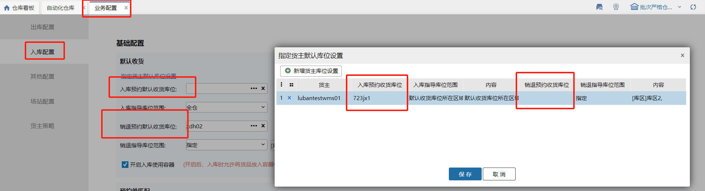

注：优先级：货主级默认收货库位->兜底默认收货库位，都为空时则设备任务回传报错。

采购、其他、调拨入库单据类型取入库预约默认收货库位，销退入库取销退预约默认收货库位。

#### 2、拣货作业

新增设备配置步骤：点击新增，选择对接设备，设置对应库位范围后，勾选业务能力—同设备下架，进一步设置任务下发和任务回传条件，设置完成后点击保存。

##### 2.1 同设备下架

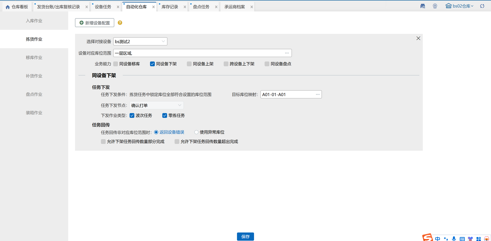

其中：

1. 选择对接设备：仅限授权当前仓库的设备，同一种作业类型下相同设备不允许重复设置；
2. 设备对应库位范围：至少设置1个，可以是区域、库区、库位层级，不同设备间所设置的库位范围不允许交叉；
3. 业务能力：至少选择1项，置灰项为拣货作业不支持的；
4. 任务下发
    1. 任务下发条件：拣货任务中锁定库位全部符合设置的库位范围

目标库位映射：非必填项，填写了则设备任务的目标库位按填写内容显示，否则为空

    2. 任务下发节点：确认打单，包括波次打单页面、零拣打单页面“确认打单”操作
    3. 下发作业类型：波次任务、零拣任务，按需选择，至少选1项

例：设备对应库位范围为拣选库区，设置目标库位映射为A01-01-A01，下发作业类型勾选波次任务。

有待打单波次任务001，订单锁库范围都在拣选库区，则波次提交打单后，会生成设备任务并下发到对应设备，设备任务明细的目标库位为A01-01-A01；

待打单波次任务002，订单锁库范围为跨库区，则波次提交打单后，不会生成设备任务；

待打单零拣订单003，订单锁库范围在拣选库区，则订单提交打单后，不会生成设备任务。

注：已经下发到设备的待拣货订单/波次，不允许手工领取进行拣货作业，要先关闭设备任务才能解锁。

5. 任务回传
    1. 任务回传非对应库位范围时：返回设备错误、使用异常库位，按需选择和配置
        1. 返回设备错误

例：设备对应库位范围为拣选库区，待打单波次任务001生成设备任务后，若回传的库位在拣选库区范围内，则回传成功，设备任务完结，波次订单从拣货提交到下一环节；若回传的库位不在拣选库区范围内，则返回设备报错，设备任务和波次订单无变化。

        2. 使用异常库位，设置异常库位YC01

例：设备对应库位范围为拣选库区，待打单波次任务001生成设备任务后，若回传的库位不在拣选库区范围内，则将设备任务的库位替换成异常库位YC01，设备任务完结，波次订单从拣货提交到下一环节。

#### 3、移库作业

新增设备配置步骤：点击新增，选择对接设备，设置对应库位范围后，勾选业务能力—同设备移库/同设备下架/同设备上架，进一步设置任务下发和任务回传条件，设置完成后点击保存。

##### 3.1 同设备移库

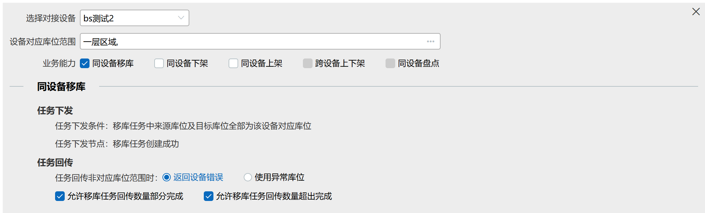

其中：

1. 选择对接设备：仅限授权当前仓库的设备，同一种作业类型下相同设备不允许重复设置；
2. 设备对应库位范围：至少设置1个，可以是区域、库区、库位层级，不同设备间所设置的库位范围不允许交叉；
3. 业务能力：至少选择1项，置灰项为移库作业不支持的；
4. 任务下发
    1. 任务下发条件：移库任务中来源库位及目标库位全部为该设备对应库位
    2. 任务下发节点：移库任务创建成功

例：设备对应库位范围为拣选库区。

创建移库任务001，明细来源库位和目标库位范围都在拣选库区，则任务创建成功后，会生成设备任务并下发到对应设备；

创建移库任务002，明细来源库位范围都在拣选库区、目标库位范围不在拣选库区，则任务创建成功后，不会生成设备任务；

创建移库任务003，明细目标库位范围都在拣选库区、来源库位范围不在拣选库区，则任务创建成功后，不会生成设备任务。

注：已经下发到设备的移库任务，不允许手工领取进行移库作业，要先关闭设备任务才能解锁。

5. 任务回传
    1. 任务回传非对应库位范围时：返回设备错误、使用异常库位，按需选择和配置
        1. 返回设备错误

例：设备对应库位范围为拣选库区，移库任务001生成设备任务后，若回传的来源库位和目标库位都在拣选库区范围内，则回传成功，设备任务完结，移库任务完结；若回传的来源库位或目标库位不在拣选库区范围内，则返回设备报错，设备任务和移库任务无变化。

        2. 使用异常库位，设置异常库位YC01

例：设备对应库位范围为拣选库区，移库任务001生成设备任务后，若回传的来源库位不在拣选库区范围内，目标库位在拣选库位范围内，则将设备任务的来源库位替换成异常库位YC01，设备任务完结，移库任务完结；若回传的目标库位不在拣选库区范围内，来源库位在拣选库位范围内，则将设备任务的目标库位替换成异常库位YC01，设备任务完结，移库任务完结；若回传的来源库位和目标库位都不在拣选库区范围内，则回传失败，返回错误信息（移库来源库位和目标库位不能重复）。

    2. 允许移库任务回传数量部分完成

勾选该配置，则回传的移库任务数量允许≤计划数量；未勾选，则回传的移库任务数量允许=计划数量，否则回传失败。

    3. 允许移库任务回传数量超出完成

勾选该配置，则回传的移库任务数量允许≥计划数量；未勾选，则回传的移库任务数量允许=计划数量，否则回传失败。

##### 3.2 同设备下架

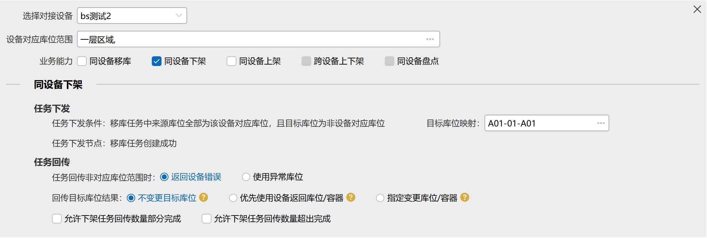

其中：

1. 任务下发
    1. 任务下发条件：移库任务中来源库位全部为该设备对应库位，且目标库位为非设备对应库位

目标库位映射：非必填项，填写了则设备任务的目标库位按填写内容显示，否则为空

    2. 任务下发节点：移库任务创建成功

例：设备对应库位范围为拣选库区，设置目标库位映射为Z01-01-A01（非拣选库区）。

创建移库任务001，明细来源库位范围都在拣选库区，目标库位都不在拣选库区，则任务创建成功后，会生成设备任务并下发到对应设备，设备任务明细中目标库位自动替换为Z01-01-A01；

创建移库任务002，明细来源库位、目标库位范围都不在拣选库区，则任务创建成功后，不会生成设备任务。

注：已经下发到设备的移库任务，不允许手工领取进行移库作业，要先关闭设备任务才能解锁。

2. 任务回传
    1. 任务回传非对应库位范围时：返回设备错误、使用异常库位，按需选择和配置
        1. 返回设备错误

例：设备对应库位范围为拣选库区，移库任务001生成设备任务后，若回传的来源库位都在拣选库区范围内、目标库位都不在拣选库区范围内，则回传成功，设备任务完结，移库任务完结；若回传的来源库位不在拣选库区范围内，或目标库位在拣选库区范围内，则返回设备报错，设备任务和移库任务无变化。

        2. 使用异常库位，设置异常库位YC01

例：设备对应库位范围为拣选库区，移库任务001生成设备任务后，若回传的来源库位、目标库位都不在拣选库位范围内，则将设备任务的来源库位替换成异常库位YC01，设备任务完结，移库任务完结。

    2. 回传目标库位结果：不变更目标库位、优先使用设备库位/容器、指定变更库位/容器，按需选择和配置
        1. 不变更目标库位：不管设备回传库位是什么，都按照移库任务中对应明细的目标库位填充和完结任务。
        2. 优先使用设备返回库位/容器：若设备回传的目标库位/容器是系统中存在的库位/容器，则按照设备回传的库位/容器填充和完结任务；否则仍按照移库任务中对应明细的目标库位填充和完结任务。
        3. 指定变更库位/容器：按照指定的库位或容器来填充移库任务目标库位，完结任务。

##### 3.3 同设备上架

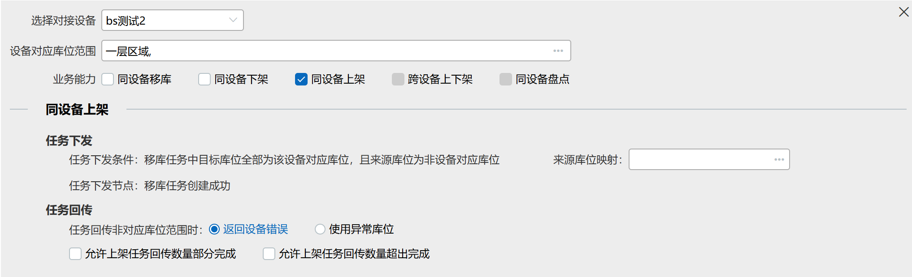

其中：

1. 任务下发
    1. 任务下发条件：移库任务中目标库位全部为该设备对应库位，且来源库位为非设备对应库位

来源库位映射：非必填项，填写了则设备任务的来源库位按填写内容显示，否则为空

    2. 任务下发节点：移库任务创建成功

例：设备对应库位范围为拣选库区，设置来源库位映射为Z01-01-A01（非拣选库区）。

创建移库任务001，明细目标库位范围都在拣选库区，来源库位都不在拣选库区，则任务创建成功后，会生成设备任务并下发到对应设备，设备任务明细中来源库位自动替换为Z01-01-A01；

创建移库任务002，明细来源库位、目标库位范围都不在拣选库区，则任务创建成功后，不会生成设备任务。

注：已经下发到设备的移库任务，不允许手工领取进行移库作业，要先关闭设备任务才能解锁。

2. 任务回传
    1. 任务回传非对应库位范围时：返回设备错误、使用异常库位，按需选择和配置
        1. 返回设备错误

例：设备对应库位范围为拣选库区，移库任务001生成设备任务后，若回传的目标库位都在拣选库区范围内、来源库位都不在拣选库区范围内，则回传成功，设备任务完结，移库任务完结；若回传的目标库位不在拣选库区范围内，或来源库位在拣选库区范围内，则返回设备报错，设备任务和移库任务无变化。

        2. 使用异常库位，设置异常库位YC01

例：设备对应库位范围为拣选库区，移库任务001生成设备任务后，若回传的来源库位、目标库位都不在拣选库位范围内，则将设备任务的目标库位替换成异常库位YC01，设备任务完结，移库任务完结。

#### 4、补货作业

新增设备配置步骤：点击新增，选择对接设备，设置对应库位范围后，勾选业务能力—同设备移库/同设备下架/同设备上架，进一步设置任务下发和任务回传条件，设置完成后点击保存。

:::danger
一般设备的补货作业是一半自动+一半人工完成，需配合系统补货配置中补货中转位功能完成

:::

##### 4.1 同设备移库

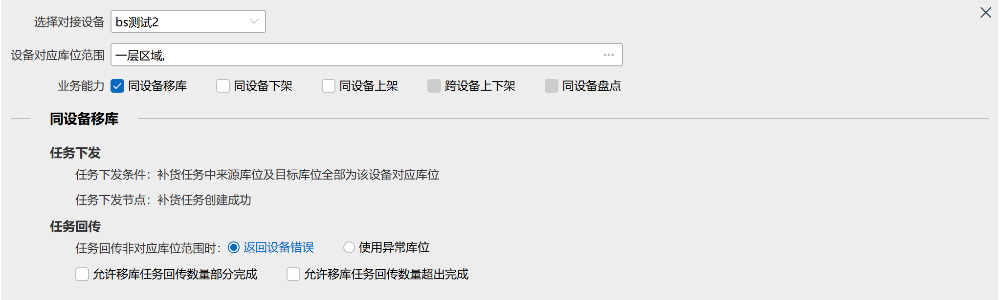

其中：

1. 选择对接设备：仅限授权当前仓库的设备，同一种作业类型下相同设备不允许重复设置；
2. 设备对应库位范围：至少设置1个，可以是区域、库区、库位层级，不同设备间所设置的库位范围不允许交叉；
3. 业务能力：至少选择1项，置灰项为补货作业不支持的；
4. 任务下发
    1. 任务下发条件：补货任务中来源库位及目标库位全部为该设备对应库位
    2. 任务下发节点：补货任务创建成功

例：设备对应库位范围为拣选库区。

创建补货任务001，明细来源库位和目标库位范围都在拣选库区，则任务创建成功后，会生成设备任务并下发到对应设备；

创建补货任务002，明细来源库位范围都在拣选库区、目标库位范围不在拣选库区，则任务创建成功后，不会生成设备任务；

创建补货任务003，明细目标库位范围都在拣选库区、来源库位范围不在拣选库区，则任务创建成功后，不会生成设备任务。

注：已经下发到设备的补货任务，不允许手工领取进行补货作业，要先关闭设备任务才能解锁。

5. 任务回传
    1. 任务回传非对应库位范围时：返回设备错误、使用异常库位，按需选择和配置
        1. 返回设备错误

例：设备对应库位范围为拣选库区，补货任务001生成设备任务后，若回传的来源库位和目标库位都在拣选库区范围内，则回传成功，设备任务完结，补货任务完结；若回传的来源库位或目标库位不在拣选库区范围内，则返回设备报错，设备任务和补货任务无变化。

        2. 使用异常库位，设置异常库位YC01

例：设备对应库位范围为拣选库区，补货任务001生成设备任务后，若回传的来源库位不在拣选库区范围内，目标库位在拣选库位范围内，则将设备任务的来源库位替换成异常库位YC01，设备任务完结，补货任务完结；若回传的目标库位不在拣选库区范围内，来源库位在拣选库位范围内，则将设备任务的目标库位替换成异常库位YC01，设备任务完结，补货任务完结；若回传的来源库位和目标库位都不在拣选库区范围内，则回传失败，返回错误信息（补货来源库位和目标库位不能重复）。

    2. 允许移库任务回传数量部分完成

勾选该配置，则回传的补货任务数量允许≤计划数量；未勾选，则回传的补货任务数量允许=计划数量，否则回传失败。

    3. 允许移库任务回传数量超出完成

勾选该配置，则回传的补货任务数量允许≥计划数量；未勾选，则回传的补货任务数量允许=计划数量，否则回传失败。

##### 4.2 同设备下架

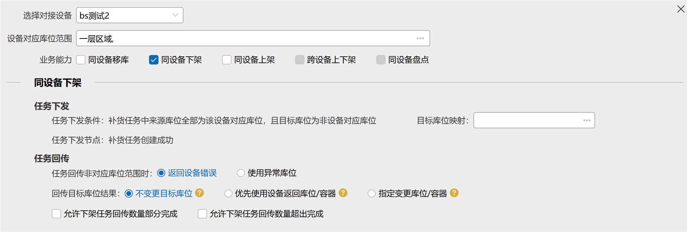

其中：

1. 任务下发
    1. 任务下发条件：补货任务中来源库位全部为该设备对应库位，且目标库位为非设备对应库位

目标库位映射：非必填项，填写了则设备任务的目标库位按填写内容显示，否则为空

    2. 任务下发节点：补货任务创建成功

例：设备对应库位范围为拣选库区，设置目标库位映射为Z01-01-A01（非拣选库区）。

创建补货任务001，明细来源库位范围都在拣选库区，目标库位都不在拣选库区，则任务创建成功后，会生成设备任务并下发到对应设备，设备任务明细中目标库位自动替换为Z01-01-A01；

创建补货任务002，明细来源库位、目标库位范围都不在拣选库区，则任务创建成功后，不会生成设备任务。

注：已经下发到设备的补货任务，不允许手工领取进行补货作业，要先关闭设备任务才能解锁。

2. 任务回传
    1. 任务回传非对应库位范围时：返回设备错误、使用异常库位，按需选择和配置
        1. 返回设备错误

例：设备对应库位范围为拣选库区，补货任务001生成设备任务后，若回传的来源库位都在拣选库区范围内、目标库位都不在拣选库区范围内，则回传成功，设备任务完结，补货任务完结；若回传的来源库位不在拣选库区范围内，或目标库位在拣选库区范围内，则返回设备报错，设备任务和补货任务无变化。

        2. 使用异常库位，设置异常库位YC01

例：设备对应库位范围为拣选库区，补货任务001生成设备任务后，若回传的来源库位、目标库位都不在拣选库位范围内，则将设备任务的来源库位替换成异常库位YC01，设备任务完结，补货任务完结。

    2. 回传目标库位结果：不变更目标库位、优先使用设备库位/容器、指定变更库位/容器，按需选择和配置
        1. 不变更目标库位：不管设备回传库位是什么，都按照补货任务中对应明细的目标库位填充和完结任务。
        2. 优先使用设备返回库位/容器：若设备回传的目标库位/容器是系统中存在的库位/容器，则按照设备回传的库位/容器填充和完结任务；否则仍按照补货任务中对应明细的目标库位填充和完结任务。
        3. 指定变更库位/容器：按照指定的库位或容器来填充补货任务目标库位，完结任务。

##### 4.3 同设备上架

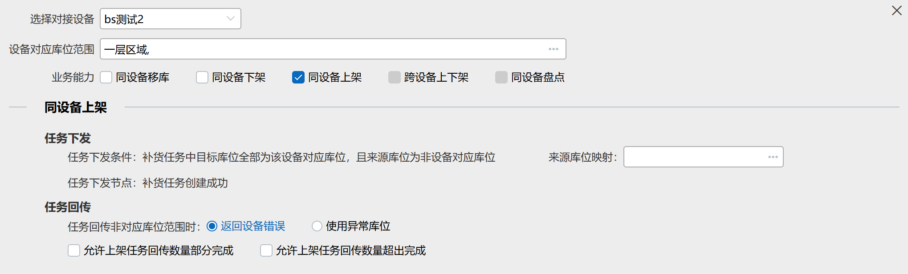

其中：

1. 任务下发
    1. 任务下发条件：补货任务中目标库位全部为该设备对应库位，且来源库位为非设备对应库位

来源库位映射：非必填项，填写了则设备任务的来源库位按填写内容显示，否则为空

    2. 任务下发节点：补货任务创建成功

例：设备对应库位范围为拣选库区，设置来源库位映射为Z01-01-A01（非拣选库区）。

创建补货任务001，明细目标库位范围都在拣选库区，来源库位都不在拣选库区，则任务创建成功后，会生成设备任务并下发到对应设备，设备任务明细中来源库位自动替换为Z01-01-A01；

创建补货任务002，明细来源库位、目标库位范围都不在拣选库区，则任务创建成功后，不会生成设备任务。

注：已经下发到设备的移库任务，不允许手工领取进行补货作业，要先关闭设备任务才能解锁。

2. 任务回传
    1. 任务回传非对应库位范围时：返回设备错误、使用异常库位，按需选择和配置
        1. 返回设备错误

例：设备对应库位范围为拣选库区，补货任务001生成设备任务后，若回传的目标库位都在拣选库区范围内、来源库位都不在拣选库区范围内，则回传成功，设备任务完结，补货任务完结；若回传的目标库位不在拣选库区范围内，或来源库位在拣选库区范围内，则返回设备报错，设备任务和补货任务无变化。

        2. 使用异常库位，设置异常库位YC01

例：设备对应库位范围为拣选库区，补货任务001生成设备任务后，若回传的来源库位、目标库位都不在拣选库位范围内，则将设备任务的目标库位替换成异常库位YC01，设备任务完结，补货任务完结。

#### 5、盘点作业

新增设备配置步骤：点击新增，选择对接设备，设置对应库位范围后，勾选业务能力—同设备盘点，进一步设置任务下发和任务回传条件，设置完成后点击保存。

##### 5.1 同设备盘点

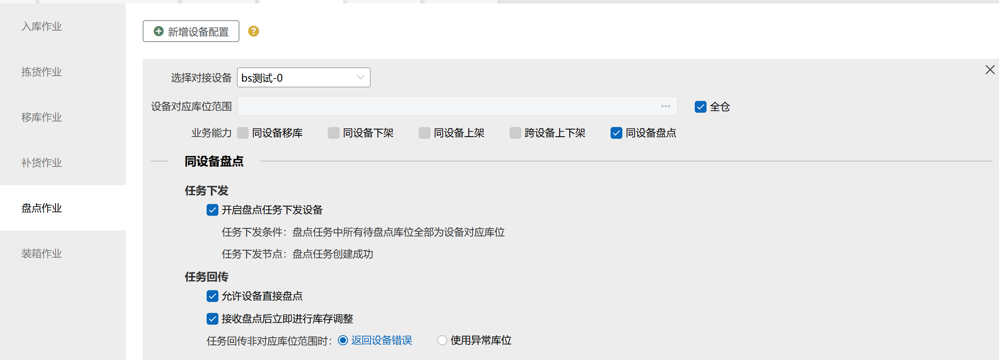

其中：

1. 选择对接设备：仅限授权当前仓库的设备，同一种作业类型下相同设备不允许重复设置；
2. 设备对应库位范围：至少设置1个，可以是区域、库区、库位层级，不同设备间所设置的库位范围不允许交叉；
3. 业务能力：至少选择1项，置灰项为盘点作业不支持的；
4. 任务下发
    1. 开启盘点任务下发设备 
        1. 任务下发条件：盘点任务中所有待盘点库位全部为设备对应库位
        2. 任务下发节点：盘点任务创建成功

例：开启盘点任务下发设备。

创建盘点任务001，盘点明细的库位范围都在设备对应库位范围内，则生成盘点任务后，会生成设备任务并下发到设备。

创建盘点任务002，盘点明细的库位范围有部分或全部都不在设备对应库位范围内，则生成盘点任务后，不会生成设备任务并下发到设备。

注：已经下发到设备的盘点任务，不允许手动盘点/关闭，要先关闭设备任务才能解锁；

未开启盘点任务下发设备时，创建盘点任务不会下发到设备。

5. 任务回传
    1. 允许设备直接盘点

开启后，允许直接接收设备回传的盘点结果，不需要下发任务到设备。

    2. 接收盘点后立即进行库存调整

开启后，盘点任务完结时同步自动生成库存调整单进行库存总量调整。

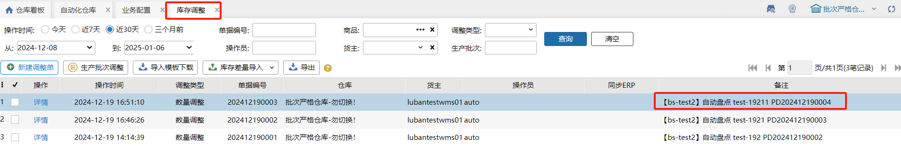

c.任务回传非对应库位范围时：返回设备错误、使用异常库位，按需选择和配置。

        1. 返回设备错误

设备对应库位范围为拣选库区，接收设备回传生成设备任务后，若回传的盘点库位在拣选库区范围内，则回传成功，设备任务完结，盘点任务完结，盘点库位为任务回传库位；若回传的盘点库位有不在拣选库区范围内的，则返回设备报错，设备任务和盘点任务无变化。

        2. 使用异常库位，设置异常库位YC01

例：设备对应库位范围为拣选库区，接收设备回传生成设备任务后，若回传的盘点库位不在拣选库区范围内，则将回传的设备盘点库位替换成异常库位YC01，设备任务完结，盘点任务完结。

注：被替换异常库位的原有盘点库位不进行盘点操作和库存变动。

#### 6、装箱作业

新增设备配置步骤：点击新增，选择对接设备，设置对应库位范围后，勾选业务能力—大宗装箱，进一步设置任务下发和任务回传条件，设置完成后点击保存。

##### 6.1 大宗装箱


其中：

1. 选择对接设备：仅限授权当前仓库的设备，同一种作业类型下相同设备不允许重复设置；
2. 业务能力：至少选择1项，置灰项为装箱作业不支持的；
3. 任务下发
    1. 任务下发条件：1、订单需完成库位分配；2、未进行装箱的；3、符合完成某一作业节点。
    2. 下发单据范围：销售出库、采购退货、调拨出库、B2B出库、其他出库，按需选择，至少选1项
    3. 任务下发节点：大宗出库链路：订单拣货完成后

例：设备下发单据范围勾选销售出库。

销售出库类型的大宗订单001，订单明细全部锁库成功，已拆分拣货任务，则完成全部拣货后，会生成设备任务并下发到设备。

非销售出库类型的大宗订单002，订单明细全部锁库成功，已拆分拣货任务，则完成全部拣货后，不会生成设备任务。

注：已经下发到设备的大宗订单，不允许手动装箱，要先关闭设备任务才能解锁。

4. 任务回传
    1. 异常回传商品或数量与任务需求不符时，返回设备错误

若回传的商品规格或者数量与下发任务一致，则回传成功，否则返回设备异常错误。

    2. 批次/序列号商品未回传相应内容时，返回设备错误

若回传的商品明细中包含生产批次商品、序列号商品，则要求生产批次商品所回传的批次信息与下发任务中的批次信息一致，序列号商品所回传的序列号是系统中已存在且未锁定的，否则返回设备异常错误。

#### 7、作业数量限制

自动设备业务模块数有限制，超出时提示如下，请联系万里牛商务开启：


注：同公司下不同仓库间业务模块数累计计算。

> 更新: 2025-07-24 15:51:57  

> 原文: <https://hupun.yuque.com/unzko7/lsbfg0/acm9iu8lzh6gzy33>

---

### 01.1.12 设备任务

> 原始文件来源：`00-源文件/操作手册/基础信息/设备管理/设备任务.md`

本页面用于显示和管理所有下发到设备的任务，目前支持作业类型包括：入库、拣货、移库、补货、盘点。


其中：

1. 任务状态为【作业中】，表示任务下发成功，等待设备回传，允许手动关闭任务（关联权限）。
2. 任务状态为【下发失败】，表示任务下发失败，需要手动重试，允许手动关闭任务（关联权限）。
3. 任务状态为【已完成】，表示任务回传成功，任务完结。
4. 任务状态为【已关闭】，表示任务已经关闭。
5. 点击关联系统单号，可以跳转到对应页面查看单据。

> 更新: 2025-01-06 14:54:19  

> 原文: <https://hupun.yuque.com/unzko7/lsbfg0/nbg271gc1qtfxg9b>

---

### 01.1.13 设备管理

> 原始文件来源：`00-源文件/操作手册/基础信息/设备管理/设备管理.md`

设备管理，设置扫描打单时的工作台和料筐拣货时的拣货筐。

#### 1.打印工作台

pda扫描打单，扫描的工作台需要在这里配置。

##### 01.新增

点击“新增”，选择工作的库区、设置本机在局域网下的ip地址（一般是直接刷新下）、设置工作台指定的承运商、设置工作台指定的波次、设置快递的打印机后保存即可，工作台编码会自动生成。  


提示

①.库区：领单时，仅领取绑定库区的波次。

②.承运商：领单时，仅领取指定承运商的波次。

③.指定波次：领单时，仅领取指定的波次策略，指定波次数量上限200。

④.打印单据：领单时，根据设置的单据打印。

⑤.快递：只显示开启电子面单的快递。

##### 02. 修改

用户可以修改工作台绑定的库区、承运商、ip地址、指定波次和快递的打印机。

##### 03.打印设备编码

用户可以打印工作台的设备编码贴到工作台上，pda扫描打单时扫工作台领任务。

#### 2.拣货筐

pda料筐拣货，扫描的拣货筐需要在这里配置。

##### 01.新增

点击“新增”，填入需要的拣货筐数量、选择订单类型、设置指定库区、指定承运商、指定波次策略后保存后生成拣货筐，编码自动生成。


**提示：**

①.订单类型，领取任务时仅领取选择的订单类型的波次；

②.库区：领单时，仅领取绑定库区的波次；

③.承运商：领单时，仅领取指定承运商的波次；

④.指定波次：领单时，仅领取指定的波次策略；

##### 02.修改

支持单个修改和批量修改；可以修改指定库区、承运商、波次和备注。

##### 03.打印设备编码

用户可以打印拣货筐的设备编码贴到筐上，pda料筐拣货时扫拣货筐领任务。

##### 04. 拣货筐操作记录

用户可以查看到拣货筐的历史记录排查异常。


> 更新: 2023-12-21 18:01:37  

> 原文: <https://hupun.yuque.com/unzko7/lsbfg0/dmf9ifzxu1iec86t>

---

### 01.1.14 承运商档案总览

> 原始文件来源：`00-源文件/操作手册/基础信息/档案管理/承运商档案/index.md`

承运商是为你提供订单的物流派送服务的群体，承运商也就是指快递。所有合作的承运商都需要在这个页面维护好。

#### 1.新增承运商

点击新增按钮，填写好承运商名称、线上物流公司、承运商编码、打印模板等信息之后保存即可。

提示

1.承运商编码必须跟ERP所填一致，如ERP没填，此处可空。

2.为方便用户联系，电话必填。

3.如果这个快递不想用了，可以选择停用，只能选择停用，不能删除。

4.支持根据承运商设置超区，设置后，用这个承运商的订单的收货地址是禁发地区的，不再支持自动获得电子面单单号和手动获取单号，操作步骤如下：


#### **2.运费设置**

 提前进行运费规则设置，由系统计算出每个订单的快递成本，方便月底跟快递对账时有据可查！

 系统目前支持按重量，或体积2种运费设置。只能选择其中一种进行设置！

##### 01.按重量计算运费

设置默认地区和个别地区的首重、续重及费用计算公式。

1、先点运费设置，进来后点默认运费设置那行的设置图标，设置下重量区间，如果有多个重量区间，点下面的新增重量区间，设置好后，点确定。

2、如果需要对一些地区进行设置运费规则，点下面的适用地区，选择要设置的地区即可，选好后，上面设置的运费规则会随之带出来，最后点保存。


提示：

关于运费设置

1.【默认运费设置】如果适用地区没有设置的话，那所有地区的运费规则就会按照上面设置的默认运费设置的规则来计算。

 2.【地区设置】在适用地区选择想要设置的地区，设置后那默认运费设置就是针对这个地区的了。地区设置精确到地级市。

 3.在【打单】环节通过后，系统会根据此处设置的公式，自动进行快递成本的计算；如果开启了【称重】环节，在称重之后会重新计算一次，以【称重】之后计算出来的为准。

4.重量区间设定上线为15条。

5.计算规则，如下例子：

区间设置0-6kg，首重3kg、费用3元、续重1、续费1

区间设置6-10kg，首重7kg、费用6元、续重2、续费2

①、订单重量是0kg，运费是3元（即第一区间的首重费用）。

②、订单重量是3kg，运费是3元（即第一区间的首重费用）。

③、订单重量是6kg，运费是6元（即第一区间的首重费用3+续费3）。

④、订单重量是7kg，运费是6元（即第二区间的首重费用）。

⑤、订单重量是10kg，运费是10元（即第二区间的首重费用6+续费4）。

⑥、订单重量是11kg，运费显示空白，不根据运费计算。

重量区间计算时是左开右闭的，0比较特殊算在第一区间里。

##### 02.按体积计算运费


提示

1.【默认运费设置】如果适用地区没有设置的话，那所有地区的运费规则就会按照上面设置的默认运费设置的规则来计算。

2.【地区设置】在适用地区选择想要设置的地区，设置后那默认运费设置就是针对这个地区的了。地区设置精确到地级市。

3.快递成本=体积*运费单价+附加费用。快递成本=最低运费+附加费用。（2者取大，因为给快递公司的费用至少是起运价+附加费用）。

4.通过【拣货】环节的时候，根据订单体积和快递运费规则，计算快递成本；

#### 3.电子面单开通

##### 01.开通

需要使用电子面单功能的，须在此页面开通快递公司的电子面单开关。打单的时候即可获取电子面单号打印电子面单。

点击电子面单开关进行操作：


支持多选电子面单接口操作：

##### 

##### 02.注意点

1.如果兼顾普通面单和电子面单交替时期，为了打印方便和结算清楚，建议亲创建2个快递公司，例如：中通-普通；中通-电子。

2.如果多个淘宝店铺都申请了电子面单功能，申请面单时将使用各自店铺的名义申请。如遇某个店铺暂时没有单号余量了，可以单独关闭某个店铺的电子面单功能，申请时将借用其他店铺的单号余量。

3.页面店铺仅显示店铺授权所有仓库+授权当前登录仓库的数据。

例：店铺1授权仓库A、B；店铺2授权所有仓库；店铺3授权仓库C

登录A仓时，可看到店铺1和2的数据。


##### 03.万里牛分享

1.电子面单配置内新增万里牛分享tab，目前仅支持菜鸟、拼多多、京东、抖音、快手，勾选面单接口后下一步，新增/选择提供方（需erp服务号）。


2.支持显示多个提供方的分享数据，ERP修改面单分享快递、面单接口配置等，wms会更新显示名称、配置等（wms暂不支持特色服务修改）。


#### **4.单号余量查看**

主要是查看承运商下的店铺网点的单号余量，能够通过设置单量预警来提醒单量应该充值，避免因单量不足造成仓库业务临时的中断。


提示：

1. 仓库中菜鸟电子面单、拼多多电子面单、京东无界电子面单都没有开启电子面单开关就不显示单号余量按钮；有一个开启就会显示。但是如果开通的这个电子面单的店铺授权都过期了，这里也不会显示单号余量按钮了。

2. 单号余量页面按承运商下店铺下的网点显示，每个承运商下店铺下的网点余量按照报警提示单量不足>未报警提示单量不足，然后再按照单量从少到多。

3. 通过勾选仅看预警，查询出报警提示单量不足的网点。

4.预警分为固定预警和动态预警

①.固定预警：当单号余量≤设置的预警值时，预警提示我。当单量小于设置的预警值时，单量就会标红并报警提示。注意：单量查询是5分钟查询一次。                     

②.动态预警：设置统计周期和可用天数。每点击保存一次预警值就会跑一次。

例如11-22用100单、11-23用0单、11-24用200单，剩余单量290单 ，11-25设置了动态预警，统计周期3，可用天数2保存后会预警提示。平均日单量=(100+200)/2=150，可用天数是2，2天要使用的单量是300单大于剩余的单量290，所以会报警。                  

#### **5.运费模板**

设置公用模板，设置的这个运费模板，可以直接快速应用到运费规则相同的承运商上面


注意：

1. 运费模板名称不能超过8个汉字。

2. 保存并应用的承运商只能选择启用的承运商。 

#### ** 6.增加发货地址**

顺丰速运、德邦快递、中通国际、申通国际、圆通速递、京东快递、中通快递自身接口增加了发货地址，根据发货地址生成电子面单。

#### 7.超区设置

部分地区只能发某个快递，需要在快递上设置当是某些地区时换成发某个快递。


注:

1.处理方式选择不设置，即生成面单时提示。

2.处理方式选择改用其他快递，即生成波次、打到零拣时会自动改成备用快递；大宗订单在落单后会改成备用快递。

3.指定地区、地址关键字、订单异常、超大件设置、指定商品五个条件之间是"or"的关系，满足一个就改备用快递。

4.指定商品最多200个sku，指定等级最多100个。

订单异常下拉项关联业务配置-出库配置-开启订单异常分类配置的分类名称

举例：

承运商德邦快递，设置超区条件：订单异常【匹配超区规则】，处理方式【改用其他快递 韵达】，其他条件不设置。

订单A承运商为德邦快递，收件地址属于超区，在待分配页面申请单号时，报错提示超区，订单打上“匹配超区规则”异常标记，此时订单符合超区替换条件，在批处理执行后会触发替换逻辑，替换成韵达。

注：订单异常条件需要在触发异常打上标记后才会生效，当前逻辑仅在待分配页面生效。

4.指定地区支持导入，导入失败的数据支持下载后重新修改上传。

5.导入时未填写省市区字样，支持导入；                                            

批量修改超区勾选同线上物流，带出显示已选超区地区；                      

导入时地区以逗号、顿号、换行间隔，支持导入；                                

导入时同级后缀填写错误，支持兼容导

例：浙江省填为了浙江自治区


#### **8.预约取货配置**

京东快递、京东快运开启电子面单配置处增加预约取货选项。


选择自己联系，申请单号时不传时间。

选择上门揽件，设置时间后申请单号传时间为当天日期+已设置时间。

#### **9.承运商自定义配置**

未开启电子面单配置，不显示承运商自定义配置按钮。

开启电子面单的取号接口可设置申请单号自定义传值。选择接口后，默认显示所有配置，支持自定义。


显示平台订单号、托寄物、重量、体积，默认全部勾选，显示线上单号、实际物品、实际重量、实际体积，支持下拉自定义配置，申请单号时按配置进行对应传值。（开启清关保税时，单号下拉可选择传清关单号。清关保税联系技术可开启）


#### **10.唯品会MP指定店铺模板**

a.仅唯品会MP面单接口增加指定店铺模板。

b.开启后，店铺行指定唯品会店铺模板允许下拉单选，网点行仍不允许编辑。

c.下拉显示MP店铺后台所有有效模板的名称供选择。

d.打印时若之前模板已有变动，则打印提示在承运商档案中重新选择店铺模板。


#### **11.运费模拟试算**

按重量、按体积模式设置运费时增加模拟试算入口，支持按订单信息/自定义信息模拟计算快递费用。如图所示：

(1).按订单信息

a.不支持跨仓查询订单（货主费率配置-出库运费除外）。

b.扫描订单的系统单号或运单号匹配订单，带出订单数据。（运单号匹配到多个订单时，取第一笔）

c.订单状态和订单承运商不匹配也可以进行模拟计算。

(2).按自定义信息

a.省市区、重量、体积必填，点击试算后计算运费结果。

注：适用地区不符合时用默认运费计算（取承运商上计抛比计算），若无默认运费计算，则计算无结果。

已支持页面：运费模板设置、运费设置、承运商对账-预估成本重算、货主费率配置-出库运费。

#### **12.重量模式运费导入导出**

仅选择按重量模式设置运费时显示，支持导入地区运费规则，导出时需先保存运费规则后方可操作。


导入规则：

a.支持左精确右模糊。

b.地区出现同级重复、地区错别字、地区出现在错误字段、未包含在上级地址内、单次导入多行重复等导入失败。（支持部分失败导入成功）

c.重量、费用等校验规则和页面设置时一致。

注：已填写两城市两区县，两区县需在两城市中，若都包含在其中一城市，则另一城市为全选。

例：吉林省、河北省；石家庄市、唐山市；长安区、路北区   导入成功：吉林省、石家庄市长安区、唐山市路北区

已支持页面：运费设置。

d.支持四级地址（街道、乡镇）导入。

> 更新: 2026-06-15 16:46:43  

> 原文: <https://hupun.yuque.com/unzko7/lsbfg0/iki7tkd119nq1bpe>

---

## 01.2. 店铺管理与系统配置

### 01.2.1 WMS小红书授权

> 原始文件来源：`00-源文件/操作手册/设置/店铺管理/WMS小红书授权.md`

店铺授权

点击新增店铺

找到小红书平台图标

选择后点击授权

接下来就可以登陆店铺账号了。

登陆成功后选择授权

授权后返回系统操作页面

保存配置即可

成功新增好店铺后就可以在承运商管理中开通电子面单了

> 更新: 2023-12-21 10:52:41  

> 原文: <https://hupun.yuque.com/unzko7/lsbfg0/xl5lr6zcswcb46ug>

---

### 01.2.2 WMS抖音店铺授权

> 原始文件来源：`00-源文件/操作手册/设置/店铺管理/WMS抖音店铺授权.md`

订购链接：[https://fuwu.jinritemai.com/detail?from=fuwu_market_tab&service_id=20183](https://fuwu.jinritemai.com/detail?from=fuwu_market_tab&service_id=20183)

新增店铺：0.1元，不做保证金退款

> 更新: 2024-02-04 17:11:07  

> 原文: <https://hupun.yuque.com/unzko7/lsbfg0/hw8t4ra0klawho0r>

---

### 01.2.3 WMS有赞店铺授权

> 原始文件来源：`00-源文件/操作手册/设置/店铺管理/WMS有赞店铺授权.md`

#### 店铺订购

有赞店铺的应用市场搜索万里牛WMS


点击了解更多之后购买


截至2024年9月30日根据平台收取**20%**技术服务费政策，**订购金额为2000元，订购金返款额为1600元**

**授权绑定**

店铺管理选择有赞平台


点击授权


登陆账号


选择订购店铺


授权成功

#### 电子面单启用

开通电子面单选择有赞


按开通店铺配置网点和面单打印模板

 

结束。

> 更新: 2024-09-30 11:23:40  

> 原文: <https://hupun.yuque.com/unzko7/lsbfg0/vszcd4dgwfpvlxl0>

---

### 01.2.4 WMS爱库存店铺授权

> 原始文件来源：`00-源文件/操作手册/设置/店铺管理/WMS爱库存店铺授权.md`

店铺开通电子面单服务方法

[‍⁠‬‍‬‬⁠‌⁠⁠‬‬‬‌‍⁠‍‬‍](https://z9shfdkrz5.feishu.cn/docx/LQsydI5dNojMINxUEulc3mwXnqe)[https://z9shfdkrz5.feishu.cn/docx/LQsydI5dNojMINxUEulc3mwXnqe](https://z9shfdkrz5.feishu.cn/docx/LQsydI5dNojMINxUEulc3mwXnqe)

新增店铺授权

点击新增店铺，选择爱库存


点击进入授权


登陆账号进行授权操作


授权成功后可看到对应的有效期


开通电子面单

承运商档案，新增快递


创建好快递后我们开启电子面单


也可以把已有的承运商增开爱库存电子面单接口


选择爱库存电子面单接口


开启店铺网点、选择店铺在平台侧配置的打印模板


配置打印模板

爱库存提供76*130 和100*180两种尺寸的模板，选择对应的 即可


模板编辑

若需要打印系统中个性化字段，需要先在平台上维护商品名称/规格/数量打印项


配置后就可以在系统中维护需要的打印字段。


> 更新: 2024-08-10 15:41:28  

> 原文: <https://hupun.yuque.com/unzko7/lsbfg0/zuxxvcnsm3h6gvvo>

---

### 01.2.5 WMS视频号微信小店授权

> 原始文件来源：`00-源文件/操作手册/设置/店铺管理/WMS视频号微信小店授权.md`

另附平台推荐的操作步骤

[https://support.weixin.qq.com/cgi-bin/mmsupportacctnodeweb-bin/pages/LGSfFz0ZhVQAQMSt](https://support.weixin.qq.com/cgi-bin/mmsupportacctnodeweb-bin/pages/LGSfFz0ZhVQAQMSt)

店铺订购：

新增订购

注意购买时有7天免费版和1年专业版。订购1年的订购金额为100元，平台收取技术服务费20%，可申请保证金退款80元


注意：我们建议授权之前先行登陆视频号小店后台

没有提前登陆时首次授权会先示如下页面


然后点击登陆出现下图


登陆成功后在店铺的服务市场搜索：万里牛WMS

登陆成功后也可重新点击系统中请先订购链接可直接到达下图


订购成功后，就可以进行授权了

新增店铺

注意，新增店铺时务必在供应商ID中正确填写店铺ID：格式以WX开头的，填写错误则授权则不成功


注：如何获取视频号ID字段，路径：在微信视频号小店商家后台-店铺信息中查看


授权成功后显示如下样式


点击确定后返回


成功授权后，店铺ID就不允许随便修改了。

> 更新: 2025-12-18 14:33:14  

> 原文: <https://hupun.yuque.com/unzko7/lsbfg0/qu48zddmw7znoqaa>

---

### 01.2.6 仓库管理

> 原始文件来源：`00-源文件/操作手册/设置/仓库管理.md`

仓库是WMS系统管理的对象，具有一定的空间，用于储存物品，并根据储存物品的特性配备相应的设备，以保持储存物品完好性。

仓库新增及停用：


**重要：仓库编码必须和ERP里面对应的仓库编码一致，才可以获取到ERP推送的数据！**

> 更新: 2023-12-19 16:02:54  

> 原文: <https://hupun.yuque.com/unzko7/lsbfg0/eogw886sxwwqy51l>

---

### 01.2.7 安全设置

> 原始文件来源：`00-源文件/操作手册/设置/安全设置.md`

主要用于数据下载以及登录验证

1. 数据下载密码是运用在账户下延展栏的数据中心下载时所需要的输入的密码，只能重置不可以进行手动设置
2. 二次验证就是在未登录过或一段时间未登录的设备进行二次的验证码校验


> 更新: 2023-12-19 16:04:29  

> 原文: <https://hupun.yuque.com/unzko7/lsbfg0/nhduz755g3zou4wu>

---

### 01.2.8 审批中心

> 原始文件来源：`00-源文件/操作手册/设置/审批中心.md`

主要用于展示审批单，有审批权限的账号允许进行审批操作。


注：本页面关联后台开关，开启后显示菜单。

#### 1、列表数据

符合[审批流程](https://hupun.yuque.com/unzko7/lsbfg0/gumupf3qnnlkrcrs)设置的单据创建后，会进入审批流程，包括快速入库、分批入库及正次转换单据。

#### 2、审批操作

页面默认查询与我相关[待我审批]的审批单，可以单笔/批量确认审批/审批驳回，审批后可在与我相关[经我审批]列表中查看对应审批单。

若审批通过，对应入库单自动确认入库，分批入库任务自动生成入库单，正次转换单自动确认转换；若审批驳回，对应单据显示[审批驳回]状态，支持修改后重新提交审批。

> 更新: 2025-11-24 18:20:27  

> 原文: <https://hupun.yuque.com/unzko7/lsbfg0/nd8c76szyu4qhrwk>

---

### 01.2.9 审批管理

> 原始文件来源：`00-源文件/操作手册/设置/审批管理.md`

主要用于设置各业务单据的审批流程，不同仓、货主及业务模块支持设置不同的审批流程。


注：本页面关联后台开关，开启后显示菜单。

#### 1、新增审批流程

点击新增，填写对应信息后点击保存即可新增一个审批流程，符合流程配置的单据创建后会进入审批流程。


其中：

①业务模块和单据类型之间存在关联，先选择业务模块，再选择单据类型；

②适用仓库最多支持30个，适用货主最多支持100个；

③审批人去重选择[是]时，同一个操作员在连续几个等级之间都有审批权限时，会跳过中间层级直接进入下一等级；选择[否]时，需要逐级审批，不支持跳过；

④审批人可以选择角色或账号，同一个审批流程不同审批等级之间审批人不允许重复，最多5个审批等级，同一层级审批人（包括角色）最多30个；

⑤同一个审批流程中只能有一个[货主Open对接]审批类型，该类型不需要设置审批人；

⑥不同审批流程之间，模块+类型+仓库+货主不允许重复；

⑦开启销退换单发货的仓库，不允许在审批流中勾选[退货入库]，两者存在冲突；

⑧最多能新增100个审批流程。

#### 2、编辑审批流程

审批流程编辑保存逻辑和新增一致，保存成功后，原先已经匹配到该审批流的单据，仍按编辑前的流程走，新的单据按编辑后的流程走。

#### 3、删除审批流程

审批流程删除成功后，原先已经匹配到该审批流的单据，仍按删除前的流程走，新的单据匹配新的流程。

#### 4、匹配审批流程

流程配置保存成功后，符合配置的单据会匹配到对应审批流程，并按审批等级配置进行审批。

例：审批管理指定业务[模块入库-快速入库]，生效单据类型[采购入库、采购验货入库]，适用仓库[1号仓库]，审批人去重[否]，适用货主[货主A]，审批等级1级，审批人[操作员A]，审批等级2级，审批人[操作员B]，审批等级3级，审批人[操作员C]。

单据1，1号仓库，货主A，采购入库单创建后能匹配到上述审批流；

单据2，1号仓库，货主A，销退入库单创建后不匹配上述审批流，单据类型不符合；

单据3，2号仓库，货主A，采购入库单创建后能匹配到上述审批流，仓库不符合；

单据4，1号仓库，货主B，采购入库单创建后能匹配到上述审批流，货主不符合。

> 更新: 2025-11-25 09:57:35  

> 原文: <https://hupun.yuque.com/unzko7/lsbfg0/gumupf3qnnlkrcrs>

---

### 01.2.10 对接配置

> 原始文件来源：`00-源文件/操作手册/设置/对接配置.md`

#### 一、ERP/OMS对接

##### **万里牛ERP对接步骤**

###### 第一步：ERP开启模块

在万里牛ERP联系在线客服，开启“万里牛直连对接”增值模块


###### 第二步：WMS获取验证码

①. 货主管理页面新增货主，若是无货主直接忽略该操作直接进行②操作。

②. 对接配置页面用对接编码查询到该货主，点击未连接，点击获取验证码(验证码有效期15分钟要注意下)，复制验证码。


###### 第三步：ERP里用验证码配置连接

在ERP系统中的云仓控制台界面，选择万里牛直连配置，点击新增配置，输入WMS系统中复制的验证码，选择要对接的仓库并输入WMS仓库编码，点击保存即可。


###### 第四步：WMS系统中刷新页面，对接配置页面用对接编码查询到该货主，点击已连接，查看ERP的对接公司是否正确。


###### 第五步：货主对接成功，接下来可以同步商品、建采购订单等操作了。

##### **非万里牛ERP对接（奇门）**

请以奇门等标准对接模式对接，需要ERP方发起奇门对接申请后联系WMS客服/实施操作，简要流程。

- ERP发起奇门对接，万里牛WMS奇门AppKey=23087164
- WMS货主管理新增货主，复制货主编码
- 联系WMS客服/实施，提供新增的货主编码+上游ERP名称或AppKey，完成对接配置等待生效

##### ERP扩展业务

:::color3
超出奇门官方标准的场景用法配置，不同ERP有不一样的用法，需选定对应系统类型才可起效

:::

对接配置处对接系统新增聚水潭ERP、旺店通(企业版)ERP、其他ERP，支持对接相关扩展业务：


 

其中：

1).若未开启扩展业务开关时，对应操作在提交或确认时系统会报错提示，如：原单入库开关未开启！

2).若开启扩展业务开关，则支持对应操作，并将数据回传给上游。

3).多次入库仅针对采购入库预约单，若开启多次入库，则允许对同一个预约单进行多次部分入库操作，直至入库数量=预约数量；若未开启，则第一次确认入库后，预约单变成“完成”，不允许继续入库。

4).选择奇门+其他模式时新增验货、疑难件入库回传，支持独立配置回传单据类型。

5).支持设置无对接+无系统配置，用于有货主是线下业务，使用的ERP不具备对接能力或没有ERP，需要仅在WMS中进行出入库库存管理。

6).旺店通（企业版）ERP，支持原单入库

7).序列号异步回传


开启后可分别设置不同业务单据的序列号回传方式和回传接口

8).拆单发货回传：多次发货（每单一次）、尾单发货一次（全部发货完成时）

订单拆分成多个子单时，若配置多次发货，则每一个子单发货时通知上游（仅回传当前子单明细，部分发货标记），直到最后一个子单发货时通知上游（仅回传当前子单明细，全部发货标记）；若配置尾单发货一次，则仅在最后一个子单（即尾单）发货时通知上游（回传所有关联子单明细，全部发货标记），其他子单发货时不通知。

注：若订单为主子单子母件，则默认按尾单发货一次回传。

9).多包裹订单不回传子单号

未开启时：多包裹订单发货回传时会回传所有包裹结构；

开启+勾选多包裹：多包裹订单发货回传时，所有包裹明细合并，无包裹结构；

开启+勾选子母件：子母件订单发货回传时，所有包裹明细合并，无包裹结构。

##### 其他配置信息

###### 基础业务（接口）

:::color3
此配置用于对接时上游ERP允许的业务范围，如未跟货主约定相关业务（如销退、加工等），可以关闭此配置

:::

- 切换不同对接类型时，业务项范围跟随变化。
- 勾选业务项，允许接收对应单据或通知上游（流水通知）。
- 未勾选则不允许接收对应单据或通知上游。
- 公司下有任一货主勾选【出库-发货单批量创建(异步)】时，显示【[异步接口日志](https://hupun.yuque.com/unzko7/lsbfg0/vbg23v58wqxmwnlr)】菜单。

###### 基础信息（商品）

:::color3
商品信息相关管理，可按照业务实际情况，禁用/启用上游ERP部分功能

:::


###### **商品编码识别模式**

两种模式：按itemCode识别唯一、按itemID识别唯一。

除商品同步接口外，如接单、回传等其他用到商品编码的接口，会按照此处选择的模式（itemCode或itemID）来使用。

注：该配置切换可能有资损风险，请谨慎选择模式。

---

###### 

###### **商品新增**

未启用商品新增时，无法从上游推送新商品到WMS系统；启用后则允许从上游推送新商品到WMS系统，系统默认寻找商品编码。

###### 商品新增-特殊场景

**<u>配置1：商品编码重复时允许创建，自动增加前缀【预设值AA】</u>**

:::color3
**场景：多货主商品编码重复**

云仓多货主场景中，多个ERP编码规则太简单。比方说编码都是001，但实物跟条码都完全不相同。例如一个货主的001是Iphone，另一个货主的001是铅笔

:::

- 未启用时，上游推送编码重复的商品，会在现有的商品上增加新推送货主授权；
- 启用时，上游推送编码重复的商品允许添加，且会在商品编码前自动增加预设前缀，生成一条新的商品信息。

例：WMS系统已存在的商品信息：货主h01，商品编码bs0100，商品条码tm0100。上游推送商品信息：商品编码bs0100，商品条码tm0100-1，货主h02。

1. 货主h02未启用【配置1】时，推送成功，在现有商品bs0100（商品条码tm0100）上增加货主h02授权。
2. 货主h02启用【配置1】时，推送成功，新生成一条商品信息，商品编码AAbs0100，商品条码tm0100-1，货主h02，建立WMS商品编码AAbs0100与ERP商品编码bs0100之间的映射关系。

****

**异常场景-停启用配置：**

- **停用后：**
    - **历史商品**：已生效的商品更新/订单推送依然生效，同例2效果；
    - **新商品**：新推送商品，配置不再生效，同例1效果；
- **再启用：**仅对启用后新推送商品生效，同例2效果；

**异常场景-修改配置：**

以例2为展开，修改配置AA->BB：

- **历史商品**：AAbs0100不受影响，可按原始bs0100更新商品信息/推送订单
- **新商品**：推送编码bs0101，创建时为BBbs0101

**异常场景-修改商品信息：**

- **例1未起效商品，修改商品编码**：修改编码为bs0101后，ERP推送bs0100订单时会报错商品不存在；
- **例2已起效商品，修改商品编码**：修改编码为bs0101后，ERP推送bs0100订单时依然成功，识别为bs0101；如ERP修改编码等情况需要修改WMS编码想保持一致的，请删除商品重新推送；
- **修改其他商品资料**：无特殊逻辑，均直接生效以及可被ERP更新。

**<u>配置2：商品条码重复时允许创建，自动增加后缀“++随机数”</u>**

:::color3
**场景：商品条码一样，需要细分规格**

有些商品含有多个规格，比方说红色/蓝色/黄色。库存管理时3个颜色需要独立管理，但3个颜色的商品的条码又是完全一致的。

:::

- 未启用时，上游推送条码重复的商品，会报错提示；
- 启用时，上游推送条码重复的商品允许添加，且会在商品条码后自动增加随机数，生成一条新的商品信息。后期可在wms系统中把随机数改成商品特征值，比方说++红，++蓝。

例：WMS系统已存在的商品信息：货主h01，商品编码bs0100，商品条码tm0100。上游推送商品信息：商品编码bs0100-1，商品条码tm0100，货主h02。

1. 货主h02未启用【配置2】时，推送失败，提示条码重复。
2. 货主h02启用【配置2】时，推送成功，新生成一条商品信息，商品编码bs0100-1，商品条码tm0100++随机数，货主h02。

**异常场景-停启用配置：**

- **停用后：**
    - **历史商品**：已生效的商品更新/订单推送依然生效，同例2效果；
    - **新商品**：新推送商品，配置不再生效，同例1效果；
- **再启用：**仅对启用后新推送商品生效，同例2效果；

**异常场景-修改商品信息：**

- **例1未起效商品，修改商品编码：**修改编码为bs0101后，ERP推送bs0100订单时会报错商品不存在；
- **例2已起效商品，修改商品编码：**修改编码为bs0100++1后，ERP推送bs0100订单时会报错商品不存在；
- **修改其他商品资料：**无特殊逻辑，均直接生效以及可被ERP更新。

**<u>配置3：商品条码重复时允许创建，映射至同一商品（分销场景）</u>**

:::color3
**场景：****多货主不相同编码，实际为一样的货（条码一样）**

云仓多货主场景中，部分货主是上下游分销等供销关系，云仓经常会发一些相同的商品（实物相同且条码相同）。

如果仓库中有10个这样的货主，那么同一个实物商品要维护10套商品信息，为了减少管理跟操作成本，需要WMS当作同一个商品管理

:::

- 未启用时，上游推送条码重复的商品，会报错提示；
- 启用时，上游推送条码重复的商品允许添加，且会在现有商品信息上增加货主授权。

例：WMS系统已存在的商品信息：货主h01，商品编码bs0100，商品条码tm0100。上游推送商品信息：商品编码bs0100-1，商品条码tm0100，货主h02。

1. 货主h02未启用【配置3】时，推送失败，提示条码重复。
2. 货主h02启用【配置3】时，推送成功，在现有商品bs0100（商品条码tm0100）上增加货主h02授权，建立WMS商品编码bs0100与ERP商品编码bs0100之间的映射关系，之后该货主推送bs0100-1即认为是bs0100同一个商品。

**异常场景-停启用配置：**

- **停用后：**
    - **历史商品**：已生效的商品更新/订单推送依然生效，同例2效果；
    - **新商品**：新推送商品，配置不再生效，同例1效果；
- **再启用：**仅对启用后新推送商品生效，同例2效果；

**异常场景-修改商品信息：**

- **正常商品修改商品编码**：修改编码为bs0101后，ERP推送bs0100订单时会报错商品不存在；
- **起效商品修改商品编码**：修改编码为bs0101后，ERP推送bs0100订单时依然成功，识别为bs0101；如ERP修改编码等情况需要修改WMS编码想保持一致的，请删除商品重新推送；
- **修改其他商品资料**：无特殊逻辑，均直接生效以及可被ERP更新。

**<u>配置4：不新增重量/长宽高体积</u>**

:::color3
场景：上游的商品物理信息，往往是采购供应商预估值，误差较大，大部分需要仓库到货后实际测量过才准确。

本功能经常配合入库商品校验使用。

:::

- 未启用时，上游推送新商品信息，所有字段按照推送数据正常接收；
- 启用时，上游推送新商品信息，重量、长宽高体积字段不按推送数据显示，显示0。

**多配置生效优先级：**

- 配置2和配置3不支持同时启用；
- 配置1和配置3同时启用时，配置3的优先级更高，优先配置3的逻辑；
- 配置1和配置2同时启用时，都生效。

---

###### 

###### 商品更新

未启用商品更新时，无法从上游推送更新商品信息到WMS系统；启用后则允许从上游推送更新商品到WMS系统。

启用后显示如下配置：

配置1：不更新时处理：接口成功但不更新数据、接口报错

接口成功但不更新数据：上游推送更新商品信息时，包含部分字段勾选了不更新处理，则允许接收更新信息，但不会对勾选了不更新的字段进行覆盖。

接口报错：上游推送更新商品信息时，包含部分字段勾选了不更新处理，则接口直接报错。

配置2：不更新商品名称/条码/重量/长宽高体积/商品分类/货号/简称/品牌/存储条件

未启用时，上游推送新商品信息，所有字段按照推送数据正常接收；未启用时，上游推送新商品信息，勾选了不更新的字段不变，其他字段做更新处理。

**注：启用商品新增下的配置1、2、3启用状态对于商品更新功能无影响。**

****

###### 库存处理


使用场景：库存差异进行调整的时候货主不允许回传盘点单，会影响财务结算，需要传其他出入库单。

###### 库存调整使用库存异动通知接口	

开启开关后，库存调整回传外部会调用库存异动通知接口，并且可以自定义选择或者填写需要回传上游的盘盈/盘亏类型；

case：勾选库存调整使用库存异动通知接口开关，盘盈类型下拉选择【THYRK】，盘亏类型自定义填写【PYCK】

库存调整单：商品A，调整差异数：10；商品B，调整差异数：-5；

回传外部，使用库存异动通知接口

消息1：业务类型：THYRK；商品：商品A；数量：10

消息2：业务类型：PYCK；商品：商品B；数量：5

###### 正次转换使用库存异动通知接口	

开启开关后，正次转换回传外部会调用库存异动通知接口，并且可以自定义选择或者填写需要回传上游的正品入库单/出库单类型和次品入库单/出库单类型；

①拆分2张单据(如出入库)


case：勾选正次转换使用库存异动通知接口开关，正品入库单类型下拉选择【THYRK】，正品出库单类型自定义填写【ZPCK】；次品入库单类型下拉选择【LYRK】，次品出库单类型自定义填写【PTCK】

**场景1：次品库存管理-标准模式**

**（正常回传正次品类型）**

正品转次：商品A：数量5

次品转正：商品B：数量3

回传外部，使用库存异动通知接口

消息1：业务类型：ZPCK；商品：商品A；数量：5；商品类型：正品

消息2：业务类型：LYRK；商品：商品A；数量：5；商品类型：次品

消息3：业务类型：PTCK；商品：商品A；数量：3；商品类型：次品

消息4：业务类型：THYRK；商品：商品A；数量：3；商品类型：正品

**场景2：次品库存管理-对内模式**

**（均按照正品类型回传）**

正品转次：商品A：数量5

次品转正：商品B：数量3

回传外部，使用库存异动通知接口

消息1：业务类型：ZPCK；商品：商品A；数量：5；商品类型：正品

消息2：业务类型：LYRK；商品：商品A；数量：5；商品类型：正品

消息3：业务类型：PTCK；商品：商品A；数量：3；商品类型：正品

消息4：业务类型：THYRK；商品：商品A；数量：3；商品类型：正品

**场景3：次品库存管理-半对外模式**

**（只回传正品类型，次品不回传）**

正品转次：商品A：数量5

次品转正：商品B：数量3

回传外部，使用库存异动通知接口

消息1：业务类型：ZPCK；商品：商品A；数量：5；商品类型：正品

消息2：业务类型：THYRK；商品：商品A；数量：3；商品类型：正品

②通知1张单据(如调拨/借用)

1次正次转换，多条推送数据会合并在1条推送消息中


case：勾选正次转换使用库存异动通知接口开关，正转次通知类型下拉选择【THYRK】，次转正时通知类型类型自定义填写【ZPCK】；

**场景1：次品库存管理-标准模式**

**（正常回传正次品类型）**

回传外部，使用库存异动通知接口

**正品转次：商品A：数量5**

消息1：业务类型：THYRK；商品：商品A；数量：-5；商品类型：正品

    业务类型：THYRK；商品：商品A；数量：5；商品类型：次品

**次品转正：商品B：数量3**

消息2：业务类型：ZPCK；商品：商品A；数量：-3；商品类型：次品

            业务类型：ZPCK；商品：商品A；数量：3；商品类型：正品

**场景2：次品库存管理-对内模式**

**（不做回传）**

**场景3：次品库存管理-半对外模式**

**（只回传正品类型，次品不回传）**

回传外部，使用库存异动通知接口

**正品转次：商品A：数量5**

消息1：业务类型：THYRK；商品：商品A；数量：-5；商品类型：正品

**次品转正：商品B：数量3**

消息2：业务类型：ZPCK；商品：商品A；数量：3；商品类型：正品

###### 库存查询接口冻结数量包含锁定数量	

勾选后，上游ERP查询冻结数量时，冻结数量=冻结库存+锁定库存

#### 二、设备对接

:::color3
此部分对接配置用于在自动化设备集成场景中的对接，比如拣货选机器人/穿梭堆垛立库等

:::

开启WCS管理的用户，可以在此进行设备对接配置。


###### 01 新增配置

点击新增，按要求填写有效配置信息后点击确定，可以新增一条配置。


其中：

（1）设备名称不能为空，不同设备的名称不能重复

（2）不同设备的设备编码不能重复，未填时系统自动生成

（3）填写对接编码后，若有关联的appkey和secret，可自动带出，否则报错提示。对接编码请在上线前联系万里牛开发获取。

（4）选择授权仓库后，对应设备只能在授权仓库范围内使用

自动设备对接数量有限制，超出时提示如下，请联系万里牛商务开启：


###### 02 设置配置

设置配置校验逻辑和新增时一致，修改后保存生效。

###### 03 删除配置

在自动化仓库中使用的设备，不允许直接删除。

#### 三、溯源系统对接

按对接系统/平台类型添加配置，对指定仓库、指定货主及指定单据类型生效。


业务校验模式：

- 不校验：业务单据有关联溯源上传记录未完成时，可以直接完结业务单据，无校验；
- 强校验：业务单据有关联溯源上传记录未完成时，不允许直接完结业务单据，需等溯源上传记录完成后才能完结；
- 弱校验：业务单据有关联溯源上传记录未完成时，有一个弱提醒，二次确认后允许完结业务单据。

###### 对接系统平台：阿里健康-码上放心

出库模块根据勾选配置，在出库时根据配置中相应店铺使用对应的接口进行溯源码（系统内的序列号）的上传


提示：

①本页面要开通对应增值模块【UDI追溯回传】后才显示；

②不同配置间仓库+货主+单据类型不允许重复；

③有未完成的溯源上传记录时，不允许修改或删除对应配置（除对接名称、备注）。

> 更新: 2026-07-29 09:51:03  

> 原文: <https://hupun.yuque.com/unzko7/lsbfg0/gpgz776pazg6t2mx>

---

### 01.2.11 【库存初始化】各ERP调整方式一览

> 原始文件来源：`00-源文件/操作手册/设置/库存初始化/【库存初始化】各ERP调整方式一览.md`

本文将根据业务发展持续更新

#### 生产批次

在有库存的情况下调整

| ERP类型 | 初始化 方式 | 完成后ERP的   【库存效果】 | 完成后ERP的   【订单效果】 | 操作步骤简述 |
| --- | :---: | :---: | --- | --- |
| 万里牛ERP | 开启 | 库存批次信息同WMS一致 | 订单接收WMS出库批次信息 | 1.开启ERP行业特性-批次号管理开关 2.强制开启ERP商品批次开关、效期管理开关 3.WMS执行库存初始化功能调整 |
| | 关闭 | 库存无批次信息 | 订单无批次信息 | 1.强制关闭ERP中效期管理开关、批次开关 2.WMS执行库位初始化功能调整 |
| 聚水潭ERP | 开启 | 库存批次信息同WMS一致 | 订单接收WMS出库批次信息 | 1.开启系统级批次效期开关 2.WMS&ERP同步将库存盘点为0 3.WMS&ERP各自开启商品级开关 |
| | 关闭 | 库存无批次信息 | 订单无批次信息 | 1.WMS执行库存初始化关闭生产批次 2.关闭ERP中生产批次开关 |
| 旺店通ERP （企业版） | 开启/关闭 | 库存无批次信息 | 订单接收WMS出库批次信息 | WMS直接进行库存初始化调整,ERP无需开启批次开关 仅单据记录批次信息 |
| 旺店通ERP（旗舰版） | 待更新…… | | | |
| 吉客云ERP | 待更新…… | | | |
| 管易ERP | 待更新…… | | | |
| 巨益ERP | 待更新…… | | | |
| 网店管家ERP | 待更新…… | | | |

#### 序列号

在有库存的情况下调整

| ERP类型 | 调整方式 | 完成后ERP的   【库存效果】 | 完成后ERP的   【订单效果】 | 操作步骤 |
| --- | :---: | --- | --- | --- |
| 万里牛ERP  | 开启 | 序列号库存同WMS一致 | 订单接收WMS出库序列号 | 1.开启ERP行业特性-序列号管理开关 2.强制开启ERP商品序列号开关 3.WMS执行库存初始化功能调整 |
| | 关闭 | 库存无序列号 | 订单无序列号 | 1.关闭ERP商品序列号开关 2.WMS执行WMS执行库存初始化功能调整 |
| 聚水潭ERP | 开启/关闭 | 库存无序列号 | 订单接收WMS出库序列号 | WMS直接进行库存初始化调整,ERP无需开启/关闭 仅单据记录序列号信息 |
| 旺店通ERP（企业版） | 开启/关闭 | 库存无序列号 | 订单接收WMS出库序列号 | |
| 旺店通ERP（旗舰版） | 待更新…… | | | |
| 吉客云ERP | 待更新…… | | | |
| 管易ERP | 待更新…… | | | |
| 巨益ERP | 待更新…… | | | |
| 网店管家ERP | 待更新…… | | | |

> 更新: 2024-01-30 09:59:23  

> 原文: <https://hupun.yuque.com/unzko7/lsbfg0/bnholqe749gz1y9y>

---

### 01.2.12 异步接口日志

> 原始文件来源：`00-源文件/操作手册/设置/异步接口日志.md`

用于查看奇门发货单批量创建结果，可查看处理结果、回传结果及对应原因，有回传失败的支持批量回传重试。


注：公司下有任一货主勾选【[出库-发货单批量创建(异步)]( https://hupun.yuque.com/unzko7/lsbfg0/gpgz776pazg6t2mx#xiAAc)】时，重登系统后显示此菜单。

> 更新: 2026-01-29 10:34:39  

> 原文: <https://hupun.yuque.com/unzko7/lsbfg0/vbg23v58wqxmwnlr>

---

### 01.2.13 操作日志

> 原始文件来源：`00-源文件/操作手册/设置/操作日志.md`

操作日志界面记录了操作员在系统中的关键业务操作情况。可按条件筛选，这些条件包括：操作时间、日志类型、操作员、日志内容。


> 更新: 2023-12-19 16:04:21  

> 原文: <https://hupun.yuque.com/unzko7/lsbfg0/roun56fx5tgz6mwl>

---

### 01.2.14 清关系统对接

> 原始文件来源：`00-源文件/操作手册/设置/清关系统对接.md`

保税仓订单需要申请单号再去报关，报关通过后才能发货。

#### 1.基础配置

后台新增清关配置开关，需开启可联系万里牛技术。

开启后系统管理员、普通管理员可查看此菜单，商品信息处显示跨境扩展。


1.清关方配置最多支持添加10条。

2.可切换模式，选择先报关再申请单号或先申请单号再报关。

3.选择仓库后，承运商范围和所选仓库关联；且同一承运商不允许在2条配置中选择。

4.选择出库流程强校验，未报关成功的订单不允许到下一环节。报错后订单到异常订单，订单提交到下一环节时，从异常订单中移出。（注：强校验选择待分配时，未报关成功订单不生成波次）

5.清关方申报店铺和平台代申报店铺不可重复选择。

6.先报关再获取单号：报关成功后才手动或自动获取电子面单。

a.开启快递匹配，订单匹配到承运商后再去报关。

b.若报关失败，重新改快递后，再去报关。

c.若已报关成功或已报关待确认，不允许重新改快递、回收电子面单。

7.先获取单号再报关：手动或自动获取电子面单成功后才报关。

a.若报关失败，重新申请电子面单后，再去报关。

b.若已报关成功或已报关待确认，不允许回收电子面单、改快递。


8.报关状态：报关成功、报关失败、待报关、已报关待确认。

a.非报关的普通订单状态显示-。

b.已出库、订单查询、出库单、异常订单、出库改单不显示手动触发报关图标。

9.清关订单不支持拆单，不支持生成多包裹。

10.修改清关配置从先获取单号再报关切到先报关再获取单号，捞取待报关的订单去报关。

11.切换清关承运商，清除仓库、承运商、强校验环节、店铺，申报方式默认选中由平台代申报。

注：暂时仅对接神州数码、八达通、伟世博、4PX、万里牛合作商清关系统。

1).选择八达通清关承运商

a.关联承运商仅显示仓库下韵达、顺丰、邮政的承运商（韵达国际、顺丰速运、EMS）。

b.报关时传商品备注。

c.报关成功后拿到运单号，打印的大头笔由5个打印项构成：始发分拣中心、始发中心编码、目的中心编码、配送站点名称、路区。

2).选择伟世博清关承运商

a.关联承运商仅显示仓库下圆通速递、京东快递的承运商。

b.报关时消费者姓名传身份证姓名，电话、地址传收件人手机号、地址。

c.报关成功后拿到运单号，圆通打印出运单号、大头笔，京东打印出运单号、始发中心编码、目的中心编码、始发分拣中心、目的分拣中心、配送站点名称、路区、时效信息、京东产品类型、京东运营模式、运输方式。

3).选择4PX清关承运商

a.关联承运商仅显示仓库下韵达快递、韵达国际、中通快递、顺丰速运的承运商。

b.报关时有身份证名称传身份证名称，没有则传收件人名称，传支持快递中所选快递的对应编码。

c.报关成功后拿到运单号，打印出运单号、大头笔和集包地名称。注：顺丰无集包地名称。

#### 2.清关取消

1.清关服务商为万里牛合作商时，显示清关取消配置。

a.开启开关时，拦截成功且符合配置条件的订单自动发起清关取消，取消成功则状态变更为已取消。

b.取消规则：

1).无条件全部取消：无视清关订单的清关状态，订单拦截成功后，无校验直接取消对应清关订单。

2).仅针对固定取消原因取消：无视清关订单的清关状态，订单拦截成功后，比对接口取消原因和已配置关键字，符合则取消对应清关订单。

注：比对规则-取消原因内容包含设置的关键字即可匹配（不可截取或间断）。例如BC：ABC、BCD匹配；AB、BAC、CB不匹配。


c.待报关订单不支持取消。

d.取消失败订单支持icon操作重试。

#### 3.清关服务商也是物流商

支持申请报关时传值映射信息。（除神州博海）

1.代申报承运商

设置承运商、承运商简码对外映射、产品类型（不传清关方）、产品类型对外映射。

承运商简码对外映射：选择承运商后默认显示承运商对应线上物流简码。

产品类型：未开启面单配置产品类型为空；已开启面单配置，无直连接口产品类型为空；有直连接口取直连产品类型。

2.指定环节报关

a.订单确认提交到XX环节时，自动触发清关。

b.申报确认提交到XX环节，作业提交失败不触发申报。

c.未开启对应环节，即进入下一环节时触发申报。

注：快速出库流程跨环节订单也放进入下一环节触发。

3.更新运单号和pdf

开启配置后，新单号、pdf链接和系统现有的是否一致，不一致则更新，记录操作日志；一致时则不进行更新。

> 更新: 2024-09-27 16:26:42  

> 原文: <https://hupun.yuque.com/unzko7/lsbfg0/gcup1duwnapg47st>

---

### 01.2.15 溯源上传记录

> 原始文件来源：`00-源文件/操作手册/设置/溯源上传记录.md`

本页面主要用于查看单据上传到溯源系统的情况。


对接了溯源系统的货主、仓库及对应类型范围内的单据，完成出库/确认入库时，会上传记录到溯源系统，并生成溯源上传记录。由系统自动执行上传，在列表中可查看上传状态，若上传失败，支持手动重试；上传成功后，支持手动更新查询结果。

注：

1.菜单显示关联【溯源系统对接】增值模块+菜单权限，同时满足则显示，否则不显示；

2.上传失败有自动重试机制，最多自动重试5次。

> 更新: 2025-12-12 18:01:12  

> 原文: <https://hupun.yuque.com/unzko7/lsbfg0/ftw5c7450kfccl72>

---

### 01.2.16 物流跟踪详情

> 原始文件来源：`00-源文件/操作手册/设置/物流跟踪详情.md`

当前公司下有仓库开启自动订阅物流轨迹，账号信息处和自动订阅物流轨迹配置下显示物流跟踪余额。

注：显示余额为公司级数据，点击详情跳转到物流跟踪详情页。

1.在线充值：充值物流跟踪余额入口。

2.查看有权限仓库内每日订阅扣减统计详情。以及显示每日操作员有权限仓库下所有订阅扣减记录汇总统计。

提示：

a.订阅失败订单不进行扣减余额。

b.充值记录为公司级记录，不局限于仓库显示。

c.余量不足时操作记录显示，不支持继续订阅。充值余额后可去物流跟踪-订阅失败页进行重新订阅。

> 更新: 2024-01-22 14:44:51  

> 原文: <https://hupun.yuque.com/unzko7/lsbfg0/plvv9tfsg0xz7qug>

---

### 01.2.17 系统冻结

> 原始文件来源：`00-源文件/操作手册/设置/系统冻结.md`

#### 使用场景：

在仓库日常运作中会有临检、审计、库存的盈亏调整、商品管理粒度调整等情况，就需要对库存处于静态状态，或是某些业务暂停操作。

#### 功能简介:

#### 创建任务

新增冻结任务，不同的仓库可以分别创建任务，目前仅允许仓库管理员、普通管理员、系统管理员进行创建


选仓：可选当前账号管辖范围下的仓库

选择时间范围：

若不确定业务何时解除限制，可选长期

若明确可设置定时生效，即在指定时间点解除限制

针对可能存在的场景我们预设了一些业务，如静态盘点、初始化调整库存等，也支持自定义选择需要禁用的业务类型


身份验证：

由于关键操作，需短信验证当前发起者的身份


冻结后可随时通过手动解除冻结


 特殊情况

当执行库存初始化期间，冻结状态不可解除


冻结期间效果为，所选定的业务执行会报错

例如入库业务冻结，入库时会提示禁止入库


> 更新: 2023-12-21 17:36:40  

> 原文: <https://hupun.yuque.com/unzko7/lsbfg0/peeg4aergvf2uvvc>

---

### 01.2.18 视频流量详情

> 原始文件来源：`00-源文件/操作手册/设置/视频流量详情.md`

当前公司下有仓库开启视频中转加速模式时，账号信息会显示视频转发流量余额及流量详情显示入口，点击可跳转到流量详情页面：


流量详情页面主要用于展示和查询流量使用记录：


流量充值：目前需要万里牛售后购买充值流量

流量扣减：通过中转加速模式查询/下载视频会产生流量扣减（注：流量不足后查询/下载视频会提示流量不足，需要先充值后才能继续查询）

> 更新: 2023-12-19 16:05:49  

> 原文: <https://hupun.yuque.com/unzko7/lsbfg0/ef4l6muu6xply8aq>

---

### 01.2.19 角色管理

> 原始文件来源：`00-源文件/操作手册/设置/角色管理.md`

每个公司都会有自己的部门分组。

常用的角色有：销售，售后，客服，售前，售后，仓管，打单，审单，验货等等。

在万里牛里，相同工作性质的员工，我们可以进行归类，比如打单组，都有待分配、波次打单、零件打单等权限。

#### 01.新增角色

新增角色步骤如下图所示，先填写角色名称，再勾选相应的权限后点击保存即可：


**建议：根据不同的岗位分配不同的权限，既降低操作员的操作复杂度，又避免操作失误造成损失。**

数据权限中的管理仓库、管理品牌、货主数据，用于对当前角色的仓库、品牌、货主数据进行限制：


#### 02.修改角色

选中需要修改的角色名称，在右侧对权限项进行修改后保存即可。

#### 03.删除角色

使用中的角色不允许直接删除。

> 更新: 2025-04-10 10:49:54  

> 原文: <https://hupun.yuque.com/unzko7/lsbfg0/tghds2kdn1syof5l>

---

### 01.2.20 账号管理

> 原始文件来源：`00-源文件/操作手册/设置/账号管理.md`

#### 01.部门结构管理

管理员或部门主管可以对部门结构进行管理，包括一级部门、子部门的新增、删除和修改等操作。

##### 1）新增部门

选中<<全部>>或现有部门，点击添加按钮，可新增部门。一级部门的角色权限范围为角色管理下所有角色，子部门的角色权限在上级部门角色权限范围内。新增后点击保存，在对应节点下级能看到新增部门。


注：[无部门]不支持新增子部门；部门层级最多支持5层；部门主管只能在其所在部门下新增子部门。

##### 2）修改部门

选中现有部门，点击修改按钮，可修改部门名称和角色权限。修改部门角色权限后，该部门下所有账号都会同步更新角色权限。


注：全部、[无部门]不支持修改；部门主管只能修改其所在部门和子部门。

##### 3）删除部门

选中现有部门，点击删除按钮，若部门下无账号，允许删除，否则不允许删除。部门主管只能修改所在部门


注：全部、无部门不支持删除；部门主管只能删除其下级部门。

##### 4）拖动部门

可以手动拖动修改部门结构，修改后部门角色权限只保留与上级部门交叉的权限。


注：部门主管只能拖动其下级部门。

#### 02.账号新增

系统里面的账号分为4个类型。

- **超级管理员：**整个系统唯一，拥有系统所有权限，可新增操作员账号。
- **普通管理员：**拥有除管理员设置外的其他权限，可新增操作员账号。
- **部门主管：**一级部门主管拥有对应仓库的所有操作权限，子部门主管视权限而定，每个部门能设置10个同级部门主管。部门主管可以新增普通操作员账号。
- **普通操作员：** 系统的主要操作员，不同岗位操作不同模块，由管理员或部门主管进行新增。

##### 1）新增超级管理员

注册公司时使用的手机号即默认为超级管理员。

##### 2）新增普通操作员

在左侧可以先选中需要新增操作员的部门，再点击“新增操作员”，填写相关信息后保存，新增操作员成功：


注：

- 勾选部门后，会自动带出该部门所关联的“角色权限”，且为置灰勾选状态，不允许手动取消；
- 勾选的角色若在角色管理页面设置了“管理仓库”“管理品牌”“货主数据”的，会在权限设置区域自动带出关联的数据，且为置灰勾选状态，不允许手动取消；
- 勾选的角色若在角色管理页面设置了菜单权限、数据权限、操作权限、PDA权限的，会在补充权限弹窗中自动勾选上关联的数据，且为置灰勾选状态，不允许手动取消。

##### 3）新增普通管理员

超级管理员账号有权限新增普通管理员，具体操作如下：

1.先新增一个操作员账号


2.选中需要设为普通管理员的账号，点击设为普通管理员，确定后设置成功：


注：部门主管不支持设置为普通管理员

##### 4）新增部门主管

部门主管有分一级主管、二级主管、三级主管、...，最多5个层级。

新增部门主管具体步骤如下：

在左侧可以先选中需要新增主管的部门，再点击“新增操作员”按钮，填写相关信息后勾选“主管”，保存后新增部门主管成功：


注：主管层级与左侧部门结构有关，在哪一级部门下新增，则新增成功后为对应级别的部门主管

#### 02.账号修改

##### 1）转让超级管理员

可以使用“转让超级管理员”功能将其他账号设置为超级管理员。

具体步骤如下：

1.先选中需要改成超级管理员的账号

2.点击“转让超级管理员”按钮

3.点击发送验证码，输入验证码后点击确定，转让成功


注：部门主管不支持设置为超级管理员

##### 2）取消普通管理员

要将普通管理员切换成普通操作员，可以使用“取消普通管理员”功能。具体操作步骤如下：

1.选中需要取消普通操作员的账号，点击“取消普通管理员”按钮：


2.选择归属部门后，点击确定，普通管理员即可设置为普通操作员：


##### 3）取消部门主管

要将部门主管改成普通操作员，可以在操作员信息中取消“主管”勾选状态，点击确定后即可修改成功：


##### 4）修改个人信息

选中需要修改的操作员账号，点击修改，可以修改相关信息，保存后生效：


#### 03.账号停用

员工岗位调动或者离职等情况，不再需要使用该账号的，停用了即不能再登录系统：


**提示：系统管理员账号不可停用！**

#### 04.角色权限设置

##### 1）岗位分工明确、人数多的公司

普通操作员的操作权限通过勾选角色权限进行设置，详情点击：[角色管理](https://hupun.yuque.com/unzko7/plvu1m/xe0ir4)；

##### 2）岗位分工不明确、人数少的公司

直接通过补充权限进行设置相关权限：


#### 05.特殊说明

由于不同账号的权限范围不同，在新增或修改操作员信息时，部门、角色、权限设置、补充权限等会根据当前登录的操作员权限进行限制，具体如下：

1）超级管理员、普通管理员

前提：当前登录账号为超级管理员、普通管理员

新增/修改账号信息时，可以选择的**部门范围**为当前系统中所维护的完整的部门结构；

可以选择的**角色范围**为当前公司所维护的所有角色项，其中部门所关联的角色权限置灰勾选状态（在左侧部门管理中设置的角色权限），不允许取消，其他角色权限允许自由配置；

可以选择的**管理仓库**为当前公司所维护的所有使用中仓库，其中角色所管理的仓库为置灰勾选状态（在角色管理页面设置的数据权限），不允许取消，其他仓库允许自由配置，指定管理仓库后，登录账号只能查看指定仓库的数据；

可以选择的**管理品牌**为当前公司所维护的所有品牌，其中角色所管理的品牌为置灰勾选状态（在角色管理页面设置的数据权限），不允许取消，其他品牌允许自由配置，指定管理品牌后，商品信息页面只显示指定品牌的数据；

可以选择的**货主数据**为当前公司所维护的所有启用中货主，其中角色所管理的货主为置灰勾选状态（在角色管理页面设置的数据权限），不允许取消，其他货主允许自由配置，指定管理货主后，订单等只显示指定货主的数据。

2）部门主管

前提：当前登录账号为部门主管

新增/修改账号信息时，可以选择的**部门范围**为当前主管所在部门及其下子部门；

可以选择的**角色范围**为当前主管的角色范围，其他角色权限不允许自由配置；

可以选择的**管理仓库**为当前主管的仓库范围，其他仓库不允许自由配置；

可以选择的**管理品牌**为当前主管的品牌范围，其他仓库不允许自由配置；

可以选择的**货主数据**为当前主管的货主范围，其他货主不允许自由配置。

3）普通操作员

无此页面权限

> 更新: 2024-07-05 11:52:19  

> 原文: <https://hupun.yuque.com/unzko7/lsbfg0/vbosq9isf8ufqm4h>

---

### 01.2.21 货主管理

> 原始文件来源：`00-源文件/操作手册/设置/货主管理.md`

货主管理是WMS系统中重要一环，每个WMS系统默认为一个货主，当需要进行多货主业务时，在货主管理界面可进行货主的配置如下图

点击新增后设置货主信息便于ERP配置，货主编码为系统新增后自动生成，授权仓库可配置该货主允许发生业务的仓库

货主手机号公司级唯一性校验，已启用的货主，手机号不允许重复

支持货主名称模糊搜索和筛选授权仓库查询货主

> 更新: 2026-08-17 13:43:16  

> 原文: <https://hupun.yuque.com/unzko7/lsbfg0/zk17ardiqngfrbqo>

---

### 01.2.22 店铺管理总览

> 原始文件来源：`00-源文件/操作手册/设置/店铺管理/index.md`

通过菜鸟开通电子面单或者开通了JD电子面单，需要在系统里面绑定对应店铺才可以获取到对应的电子面单号。

绑定流程：

1）选择店铺类型

注意区分买家版和卖家版店铺，若是买家版店铺，请选择带“买家版”标记的类型进行操作：

2）填写相关信息，进行授权

3）选择授权仓库，显示操作员有权限仓库。

授权成功后即可通过该店铺获取电子面单号。

注：

a.拼多多店铺授权默认有效期为1天，每天自动刷新。

b.推送订单自动创建店铺时，店铺授权仓库显示订单上的仓库。若订单货主二次推送此店铺到其他仓库，授权仓库不会追加显示。

c.修改取消授权仓库时，若承运商开启店铺电子面单，则报错。

d.店铺授权仓库会影响承运商档案->电子面单设置内店铺数据，仅显示授权所有仓库+当前登录仓的店铺。

> 更新: 2026-05-28 09:33:54  

> 原文: <https://hupun.yuque.com/unzko7/lsbfg0/lavcy09x6li72gxw>

---
### 01.2.23 库存初始化总览

> 原始文件来源：`00-源文件/操作手册/设置/库存初始化/index.md`

#### 使用场景

随着仓库管理要求提升，很多原先粗放管理的仓库需要管理起商品批次、序列号等，开启这类行业管理势必需要将已有库存进行清零重新录入，这对于已经深度使用的仓库来讲，很难在短时间内将所有库存进行重新调整。

本功能旨在提商家快速开启/关闭 生产批次或序列号的操作，帮助用户快速调整库存。

#### 操作介绍

创建初始化任务

创建的操作员仅仓库管理员、普通管理员、系统管理员。需注意，一个登陆公司下仅能有一个初始化调整任务执行。

选择范围：支持选择业务类型、调整方式等，选择后可查看调整范围


调整前的准备，调整功能需保证系统处于冻结状态，且涉及调整到的商品不可有未完成的单据，同时还需确保同外部ERP联通有效。


注意：外部ERP检测需操作员自行确认于ERP的连接是否通畅有效。确认后手动点击检测正常

处理完成后状态显示正常，就可以点击下一步进行调整了


接下来就进入到系统自动调整阶段，所有需要调整库存的单据都由系统自动执行，单据处理的时间较长的话可以点击刷新查看进度


调整过程中若出现异常，则会显示执行异常，需要手动刷新

执行成功时则会显示执行成功


 我们可以通过点击查看调整单据的商品详情


> 更新: 2024-02-05 16:35:36  

> 原文: <https://hupun.yuque.com/unzko7/lsbfg0/bfm01lmwoe448cq7>

---

## 01.3. PDA基础配置与登录

### 01.3.1 PDA-优先库位

> 原始文件来源：`00-源文件/PDA安卓端/基础信息/PDA-优先库位.md`

场景：客户是做文具业务的。例如圆珠笔、橡皮、笔记本等，上新比较快，而且新品会先打印条码，然后商品和库位预绑然后直接指导上架。仓库全部都是一库一品和一品一库，由于商品体积不同会存在小库位和大库位之分，大库位一般是3-5个库位组成，所以在PC上仓库库位页面看到的空库位并不一定是是实际意义上的空库位。需要拿着PDA边扫库位边绑定商品。

1.若为3PL公司，进入后需先选择货主。

2.扫描商品条码匹配商品，匹配为多个时先进行商品选择。


3.商品信息页显示商品已绑定的优先库位。支持扫描库位继续绑定下一个新的优先库位。


注：库位类型仅拣选、箱拣选、存储、过渡、工位。

- 库位设置的优先商品不能超过20个。
- 商品设置的优先库位每个库位类型不能超过10个。

4.PDA操作绑定库位成功后，PC商品库位也同步显示已绑定的数据。


> 更新: 2024-02-06 18:12:27  

> 原文: <https://hupun.yuque.com/unzko7/lsbfg0/qn9nthzfdl49pzga>

---

### 01.3.2 PDA-商品信息

> 原始文件来源：`00-源文件/PDA安卓端/基础信息/PDA-商品信息.md`

PDA查询下新增商品信息，支持操作员对每个商品明细进行修改维护。

关联PDA权限和商品信息修改权限，未开启修改权限的只能进行查看。

选择商品条码/编码/名称，查询商品信息，同时支持条码截取，编码和名称支持模糊查询。

支持修改生产批次号信息：保质期、保质期单位、保质期起始日期

支持修改序列号前缀（符合条件的商品才显示：1.仓库开启序列号管理开关；2.商品开启序列号开关；3.序列号管理-简洁模式下开启“出库根据序列号前缀校验序列号”和“入库根据药品识别码校验序列号”其中任一开关，或者序列号管理-标准模式下开启“入库根据药品识别码校验序列号”）


可修改信息：条码、辅助条码、货号、重量、长、宽、高等，货主不支持修改，商品图片可放大查看。


商品信息保存报错报单独页，可返回修改继续保存，保存成功后PC同步。

PDA拣货/入库等作业过程中，入口带商品的点击商品大图显示商品信息、商品库位两个跳转页，带库位的增加一个库位库存跳转页。

> 更新: 2026-08-17 14:00:11  

> 原文: <https://hupun.yuque.com/unzko7/lsbfg0/filhcsi3fsc43ddc>

---

### 01.3.3 PDA-商品称重

> 原始文件来源：`00-源文件/PDA安卓端/基础信息/PDA-商品称重.md`

场景：新品上架，专门安排操作员对每个商品的重量测量后维护。

关联操作员权限：必须拥有【数据权限】下“修改商品信息”权限的操作员，PDA才显示商品称重菜单

1.支持先扫商品条码匹配或先称重记录重量。

2.可连接外部设备蓝牙电子秤。


3.匹配商品记录重量后，点击提交后确认则商品称重完成。数据同步到PC商品信息上。


> 更新: 2026-05-14 11:23:36  

> 原文: <https://hupun.yuque.com/unzko7/lsbfg0/ttbgm7ob1zd51ers>

---

### 01.3.4 PDA-库区预警

> 原始文件来源：`00-源文件/PDA安卓端/基础信息/PDA-库区预警.md`

设置商品在某个库区下的库存上、下限警戒线，当库存低于警戒线时，系统会自动创建补货单，引导操作员进行补货操作。

进入菜单后，先选择预警库区：

 

选好预警库区后，扫描商品条码/编码/名称，指定需要设置预警值的商品，设置预警值后点击保存即可：


注：商品条码支持条码截取；

商品归属于多个货主时，扫描条码后先选择货主；

预警下限不能超过预警上限；

拆零保底不能超过预警上限；

已经设置动态预警的商品，手动设置预警值后，会将动态预警清除。

> 更新: 2025-08-11 14:04:44  

> 原文: <https://hupun.yuque.com/unzko7/lsbfg0/bgby0gwo6lsb1kck>

---

### 01.3.5 PDA-条码打印

> 原始文件来源：`00-源文件/PDA安卓端/基础信息/PDA-条码打印.md`

1、条码打印支持打印商品条码/箱条码。

2.商品条码打印步骤：选择商品条码，录入条码/编码/名称，设置蓝牙打印机连接和打印模板，点击打印。

3.箱条码打印步骤：选择箱条码，录入箱条码，设置蓝牙打印机连接和打印模板，点击打印。

默认扫码+1,重复添加+1，允许直接编辑数量


2.支持已有商品信息跳转页进行跳转打印，点击条码打印按钮跳转至打印页面。


3.支持在货箱详情页中进行箱条码的跳转打印。


> 更新: 2024-02-06 17:59:25  

> 原文: <https://hupun.yuque.com/unzko7/lsbfg0/zpytgbfzyvk7q20y>

---

### 01.3.6 PDA-产品授权

> 原始文件来源：`00-源文件/PDA安卓端/其他/PDA-产品授权.md`

本应用仅对已订购万里牛WMS的用户开放。可在联网的情况下，通过安卓设备进行仓库作业。

 **WMS****授权**

管理员登陆WMS，到设置-账号管理界面，给普通操作员授权相应的菜单权限。


> 更新: 2023-12-21 09:28:16  

> 原文: <https://hupun.yuque.com/unzko7/lsbfg0/vxxobosevt96uhfb>

---

### 01.3.7 PDA-基础配置

> 原始文件来源：`00-源文件/PDA安卓端/其他/PDA-基础配置.md`

登陆pda以后，点击右上角的图标进入用户中心，可以设置相关信息。

#### 1、修改手机/邮箱

点击修改手机，跳到修改手机页面输入手机号和验证码，点击确认，即用户绑定手机成功，除系统管理员外，其他操作员绑定成功后也允许修改手机。

提示：在PDA修改手机号后，PC端登录万里牛后，账号信息中的手机也是此手机号！

 

#### 2、修改密码

点击修改密码，可以修改当前账号的密码。输入当前密码，输入2次新密码，确定即可。

 重要：在PDA修改密码后，PC端登录万里牛时，也需要使用新密码登录！

 

#### 3、安全手势

可设置本台机器某个账号的安全手势，方便快速登陆。

 提示

相同的账户在不同的PDA终端登录时，都可以设置不同的安全手势，不影响账户信息。

#### 4、系统设置

##### 1.播种筐设置

播种框数量设置，用于播种拣货和播种验货中播种框一行显示X个，可以设置3、4、5、6、7、8。


##### 2.自动提交

a.条码验货自动提交设置，开启后条码验货，验货完成后直接提交，提升验货效率。

b.称重复核自动提交设置，开启后称重复核，先称重再扫订单后直接提交，提升称重效率。


##### 3.语音播报

a.播种验货语音提示设置，开启后播种验货时会语音播报提示商品放入X框。

b.播种拣货库位语音提示，开启后播种拣货时会语言播报下一未拣明细库位编码。

c.播种拣货商品语音提示，开启后播种拣货时会语言播报下一未拣明细商品名称/商品编码/条码（以配置项为准）。

d.批量拣货库位语音提示，开启后批量拣货（包括订单拣货、批量拣货、料筐拣货、大宗拣货）时会语言播报下一未拣明细库位编码。

e.批量拣货商品语音提示，开启后批量拣货（包括订单拣货、批量拣货、料筐拣货、大宗拣货）时会语言播报下一未拣明细商品名称/商品编码/条码（以配置项为准）。

f.称重复核线上物流语音提示，开启后称重复核提交成功后播报订单承运商对应线上物流公司。

注：称重提交失败则不播报。

g.扫描出库承运商简称语音提示，开启后扫描出库时播报承运商简称。

h.承运商交接承运商简称语言提示，开启后承运商交接时播报承运商简称。


##### 4.播种拣货样式分布

分页样式则为原有边拣边播样式。


##### 5.蓝牙电子秤

蓝牙电子秤设置，开启匹配到蓝牙电子称后，称重复核重量自动读取。

##### 6.商品信息显示设置

支持跟随仓库商品卡片配置或自定义配置。

设置后，影响商品卡片显示随之发生变化。


##### 7.平板模式

需联系万里牛技术开启后台开关后显示。

开启则登录设备为大屏设备时，显示兼容大屏设备，且操作员仅显示播种拣货菜单，未开启时仍按操作员权限显示菜单范围。


#### 5、小工具

##### 1、控件测试

主要是用于扫描打单打印和播种验货后置打印时报XX，可以用该工具测试万里牛控件是否正常运行和PDA与PC是否在同一局域网。

##### 2、集合码解析测试


注：关联[PC业务配置-开启集合码便捷录入](https://hupun.yuque.com/unzko7/lsbfg0/caki7lz4105n2vpg#CKIQO)开关，开启后才显示。

按当前仓设置的规则进行逐一匹配，若匹配到规则且有解析结果，如下左图所示，否则如下右图所示：


#### 6、关于我们

写明了当前系统的软件版本。

点击检查更新，若不是最新版本会提示更新。


#### 7、切换公司/退出登录

点击退出登录后，弹出确认窗，如图点击确认后则返回登录界面。


> 更新: 2026-01-05 10:25:33  

> 原文: <https://hupun.yuque.com/unzko7/lsbfg0/mhzc91unb7osdtgl>

---

### 01.3.8 PDA-登陆

> 原始文件来源：`00-源文件/PDA安卓端/其他/PDA-登陆.md`

WMS里的管理员账号，普通操作员账号，在pda里也可以登陆。登陆界面，如图所示：

登陆后记得选择正确的仓库，如图所示。


> 更新: 2023-12-21 09:28:16  

> 原文: <https://hupun.yuque.com/unzko7/lsbfg0/bguqyscuzbbnoxbp>

---
