# 02. 商品中心与库存属性

> 资料来源：基于 `00-源文件/` 对应模块的原始操作手册、专题功能与PDA文档重组迁移。
> 事实边界：正文仅重组迁移原始文档；章节编号、目录和来源标记为整理信息，不新增业务规则、字段或流程。

## 本章知识目录

- **02.1 商品基础档案与策略**
  - [品牌及自定义属性](#0211-品牌及自定义属性)
  - [商品信息](#0212-商品信息)
  - [序列号外箱码维护](#0213-序列号外箱码维护)
  - [条码打印](#0214-条码打印)
  - [规格备选值](#0215-规格备选值)
  - [计量单位管理](#0216-计量单位管理)
  - [商品库位](#0217-商品库位)
  - [商品绩效积分](#0218-商品绩效积分)
  - [仓储系统商品同步](#0219-仓储系统商品同步)
- **02.2 包装规格与多单位管理**
  - [WMS-商品多级单位管理](#0221-WMS-商品多级单位管理)
  - [WMS-序列号外箱码](#0222-WMS-序列号外箱码)
  - [WMS-箱规模块(箱规)](#0223-WMS-箱规模块箱规)
- **02.3 批次效期与残次品管控**
  - [WMS-保质期禁收_禁售](#0231-WMS-保质期禁收_禁售)
  - [WMS-序列号拍照上传](#0232-WMS-序列号拍照上传)
  - [WMS-残次品](#0233-WMS-残次品)
  - [WMS-生产批次标准模式](#0234-WMS-生产批次标准模式)
  - [码上放心溯源上传](#0235-码上放心溯源上传)
  - [生产批次扩展属性管理（医药）](#0236-生产批次扩展属性管理医药)

---

## 02.1. 商品基础档案与策略

### 02.1.1 品牌及自定义属性

> 原始文件来源：`00-源文件/操作手册/商品信息/基础档案/品牌及自定义属性.md`

#### 1.功能介绍

在此界面维护商品品牌类目以及属性，维护好可以在商品信息界面进行选择，提高工作效率。

#### 2.新增品牌

点新增品牌，输入品牌名称，然后点下空白的地方就会自动保存了。如果想删除这个品牌，可以点前面的【X】操作即可。

#### 3.自定义属性维护

先新增属性，添加好属性后添加属性值。这里添加好后在商品信息界面就可以直接选择了。属性值是可以进行修改的。

#### 4.生产批次扩展属性

tab不关联生产批次开关显示，支持新增/编辑/删除批次扩展属性。

属性名不支持重复，最大支持添加10个批次扩展属性。

注：已使用的扩展属性不可删除，仅支持修改。

添加批次扩展属性后，在WMS系统中入库、出库、盘点、调整等地方可用到。

最小粒度：生产批次号+生产日期+过期日期+批次扩展属性唯一

> 更新: 2024-05-06 17:17:04  

> 原文: <https://hupun.yuque.com/unzko7/lsbfg0/hlqhxb79s5nz78n5>

---

### 02.1.2 商品信息

> 原始文件来源：`00-源文件/操作手册/商品信息/基础档案/商品信息.md`

商品信息在使用系统的初期就要在系统里面维护

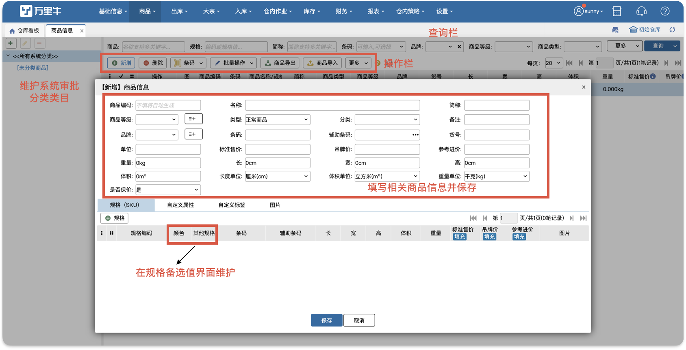

商品新增有几种方式：

①.在商品信息界面手动新增或者导入；

②.ERP新建采购订单推送至WMS，如果WMS无采购订单内包含的商品信息，则系统自动新增。

③.ERP支持一键同步全部商品或指定商品进行同步，如下图：

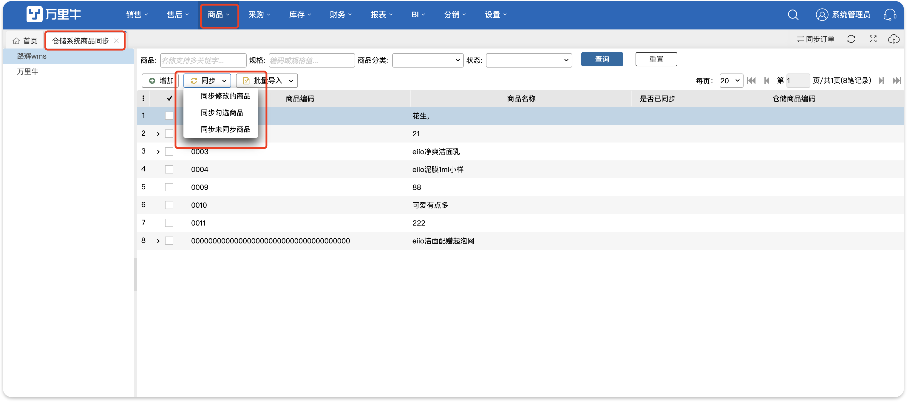

**提示:**

1.合理分类，便于后期进行商品维护，目前有批量修改商品分类的功能。

2.设置商品品牌，可以针对品牌设置权限，波次也可根据品牌生成。

3.商品编码一定要和ERP一致，才可以获取到相应单据。

4.维护条码，进行验货，防止仓库配货失误造成不必要的损失。

5.商品类型，会影响订单品牌。若一个订单有赠品和正常商品，则自动忽略赠品的品牌。

6.商品等级，会影响商品自动盘点时的盘点频率；目前支持批量修改商品等级功能。

7.商品货号，商品的款号，常用于记录供应商的编码，允许重复。

8.wms商品分类和erp分类一致，从erp同步商品过来时，若商品分类在wms中不存在，则会新增分类。

#### 1.维护商品的行业配置

1）商品序列号管理 (适用于3C数码等唯一码管理，开启后将会在出入库环节登记)

仓内策略-业务配置开启商品序列号管理后，可以在商品信息页面开启商品序列号。

2）开启商品入库批次管理(开启后，可启用商品的入库批次，入库自动生成入库批次，按照先进先出规则入库）

仓内策略-业务配置开启商品入库批次管理后，可以在商品信息页面开启商品的入库批次。

3）开启商品生产批次管理(开启后，可启用商品的生产批次，入库时可录入生成批次，生产时间早的商品优先出库)

仓内策略-业务配置开启商品生产批次管理后，可以在商品信息页面开启商品的生产批次。

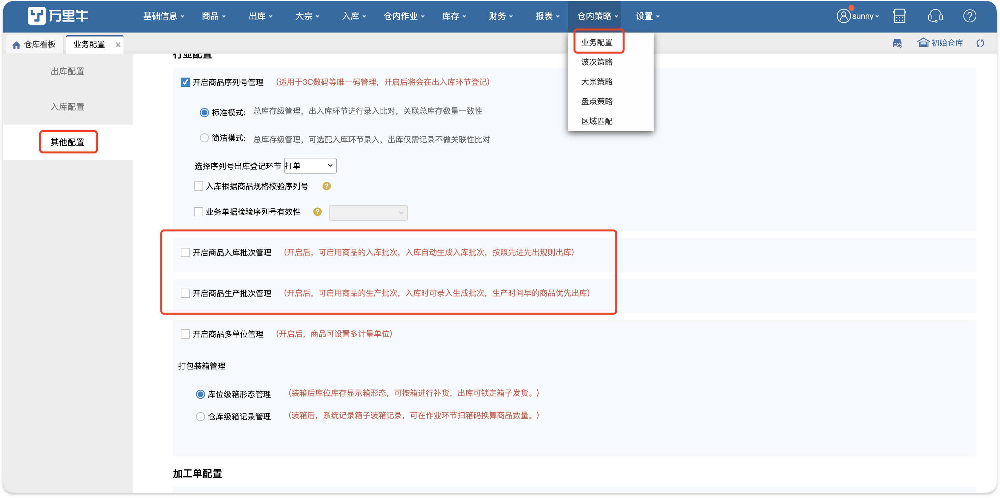

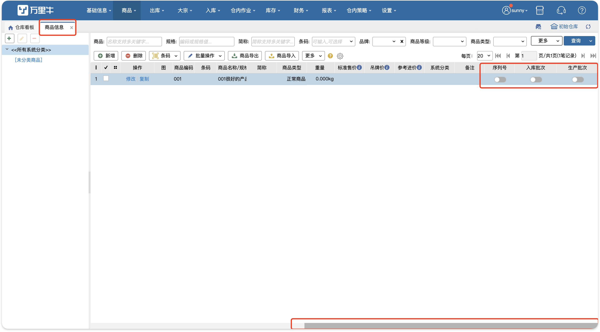

**提示：**

1.开启商品的序列号、入库批次、生产批次前，需将公司仓库下的商品库存全部清空。

2.业务配置开启生产批次严格模式，同一商品的序列号管理和生产批次管理不能同时开启。

3.业务配置开启生产批次严格模式，同一商品的入库批次管理和生产批次管理不能同时开启。

4.业务配置开启生产批次严格模式，同一商品可以同时开启序列号管理和入库批次管理。

5.业务配置开启生产批次标准模式，同一商品 序列号管理、入库批次管理、生产批次管理只能开启一项。                  

#### 2.商品导入

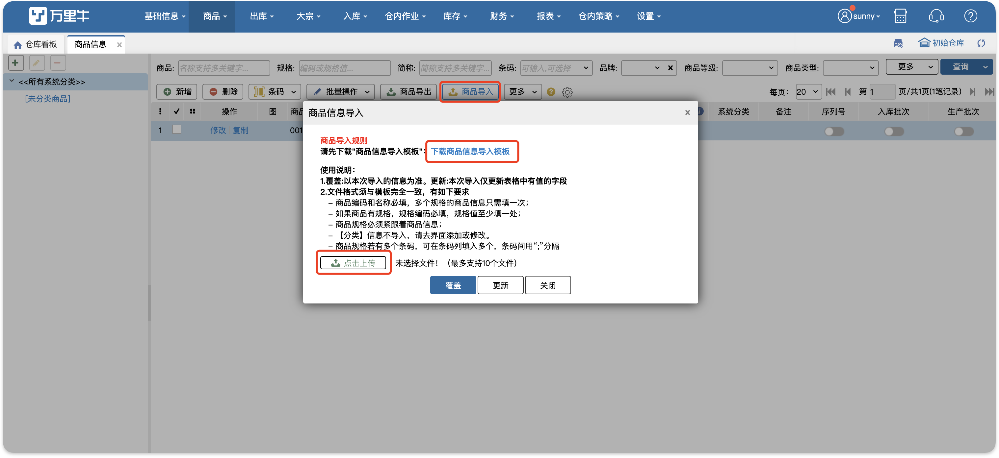

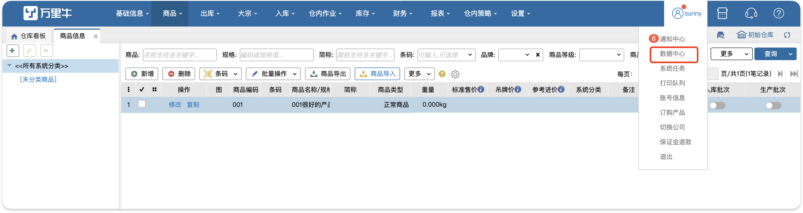

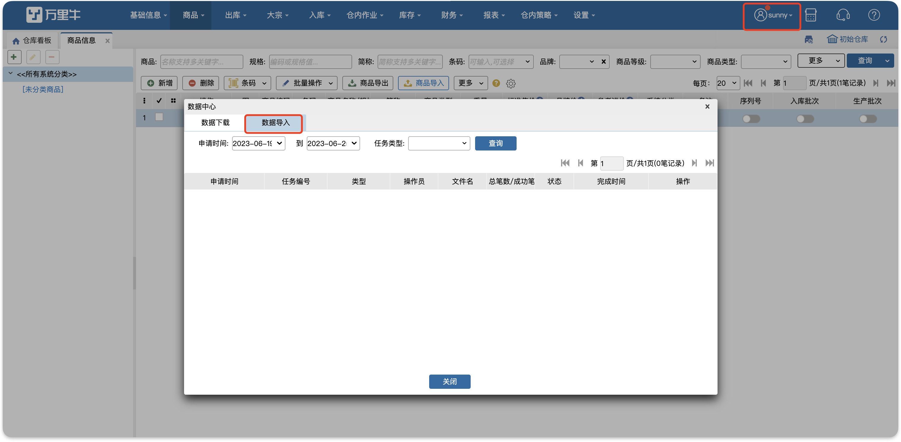

**注意：**

1.开启3pl的公司导入商品时，必须选择货主。

2.文件上传成功后生成导入任务，在数据中心-数据导入查看商品导入进度、结果。

3.导入失败可以查看失败详情，下载失败结果。

4.商品导入一次最多上传10个文件（目前支持2003版本EXCEL)。     

#### 3.无修改商品权限页面显示   

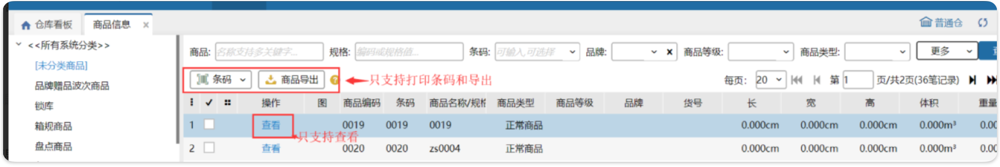

**注：**无修改商品权限，商品信息页面只支持查看，不支持任务修改操作。

#### 4.预录入规则

预录入规则可以根据设置条件为新增商品（包括手动新增、erp同步商品、导入新商品）自动开启生产批次管理开关并填充保质期。

:::color3
场景：当新增商品时，系统根据品牌、货主、系统分类、商品等级等自动匹配到对应预录入规则，自动启用生产批号管理并填充保质期，减少人工维护成本。

:::

先按需求新增预录入规则，录入维度包括品牌、货主、系统分类、商品等级等，新增商品有多个匹配规则时，按照规则优先级（从高到低，1最高）+规则编码（从小到大）匹配：

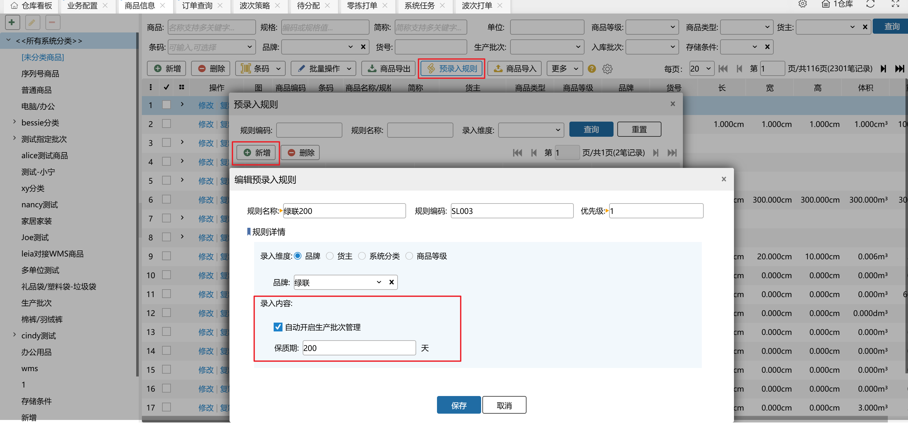

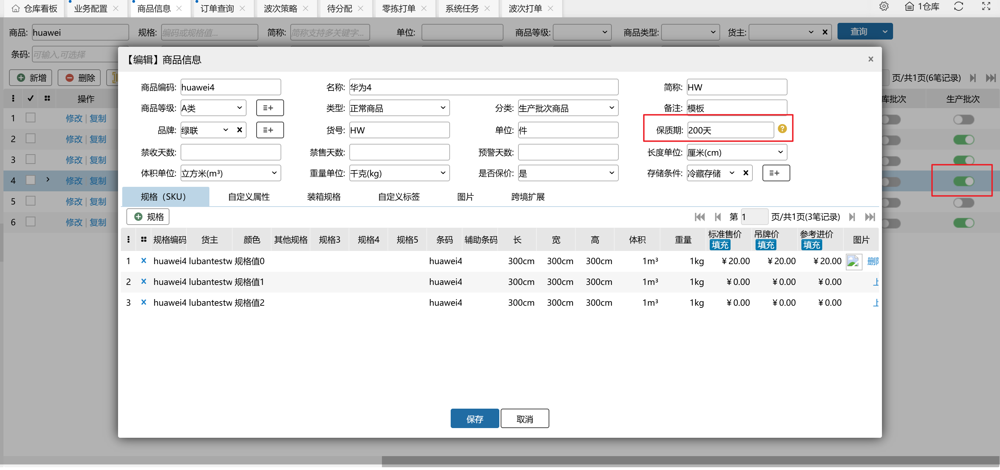

**注：**

当前仓库开启商品生产批次管理开关时，会显示“预录入规则”按钮；

若ERP推送创建商品时带有商品保质期，则使用ERP推送的保质期。

#### 5.存储条件

系统默认商品存储条件为空，支持自定义存储条件。修改存储条件时，若商品无库存，或商品所在库位存储条件为【不限】，则存储条件可任意设置；若商品有库位，则商品存储条件必须与库存所在库位的存储条件保持一致，否则不允许设置。

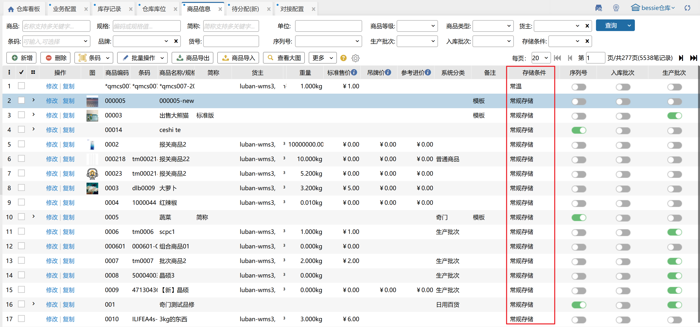

商品和库位设置存储条件后，涉及到入库指导上架、确认入库、仓内作业等库存变更的相关业务，在现有指导基础上增加了存储条件一致性判断，即商品与库位存储条件一致/库位存储条件为不限时，允许作业，否则报错提示。

注：从erp同步或导入商品未指定存储条件时，wms系统默认填充为空。

#### 6.序列号前缀

前置条件：1.仓库开启序列号管理开关；2.简洁模式：开启“出库根据药品识别码校验序列号”或者“入库根据药品识别码校验序列号”其中之一；标准模式：开启“入库根据药品识别码校验序列号”；

特殊：公司开启医药增值模块，序列号前缀>>药品识别码

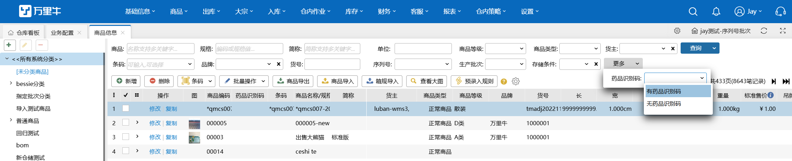

> 更新: 2026-08-17 11:45:00  

> 原文: <https://hupun.yuque.com/unzko7/lsbfg0/th9u8nmzossqtf4i>

---

### 02.1.3 序列号外箱码维护

> 原始文件来源：`00-源文件/操作手册/商品信息/基础档案/序列号外箱码维护.md`

本页面主要用于维护序列号外箱码数据。

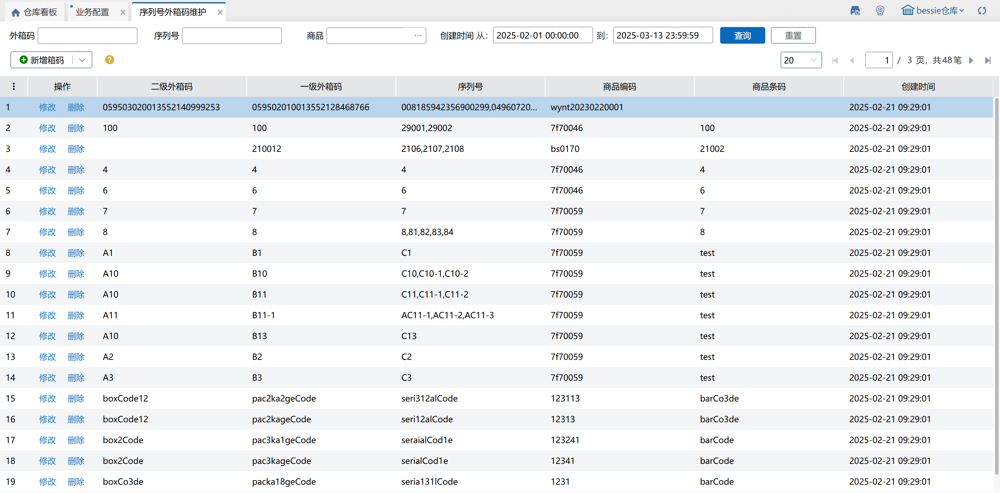

#### 01.新增箱码

在新增弹窗中，选择对应归属商品、输入二级外箱码、添加内箱及序列号后，点击保存即可在列表中查看对应数据。

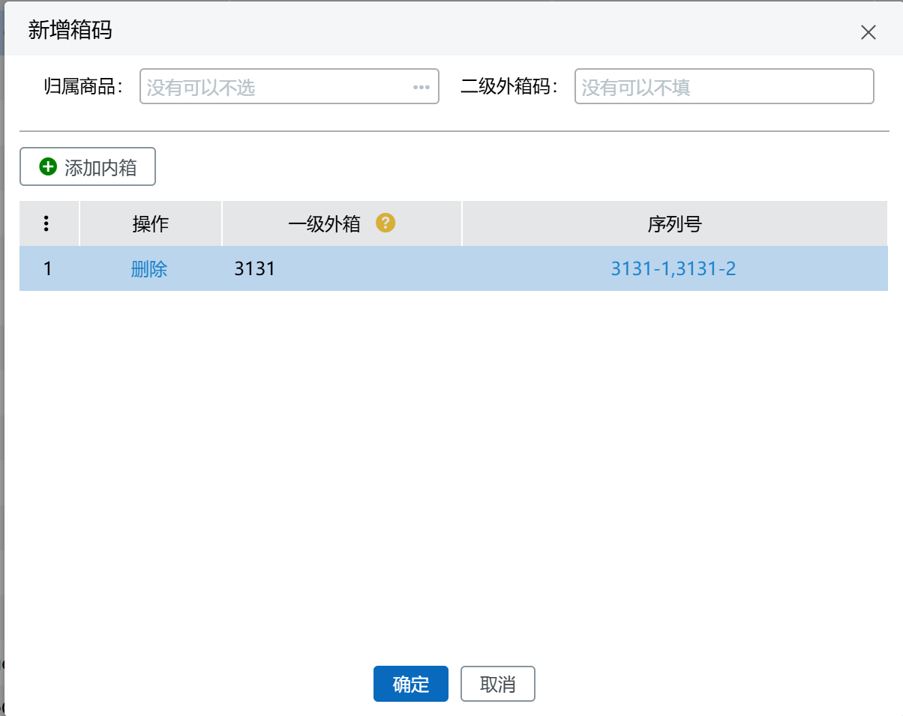

#### 02.扫描新增

通过扫描外箱码（前提是在溯源-蓝鲸系统中能查询到）快速带出归属商品、一级外箱及序列号信息，点击保存即可在列表中查看对应数据。

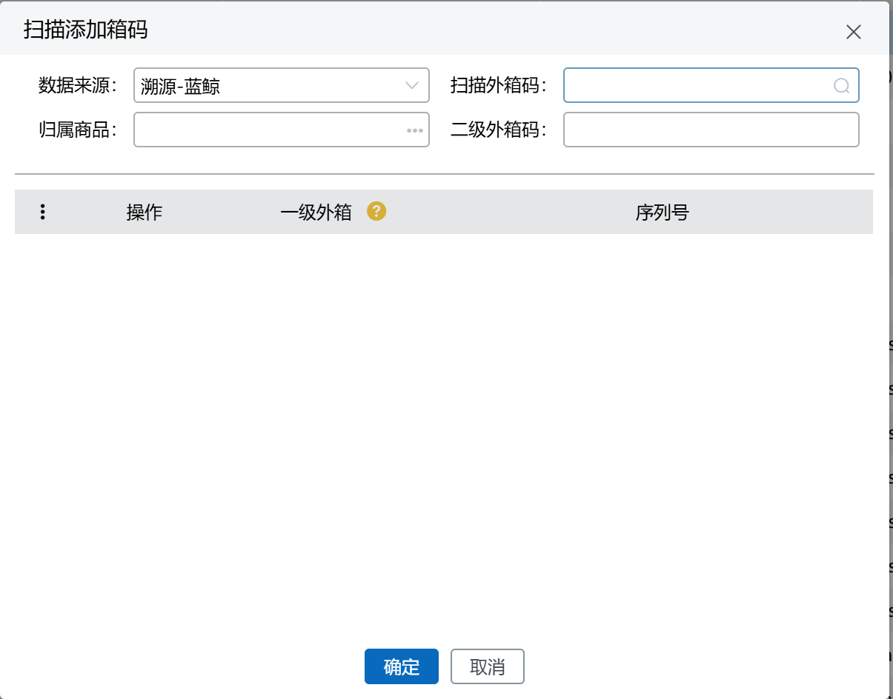

注：

1.菜单显示关联外箱码开关+仓库序列号开关+菜单权限，同时满足则显示，否则不显示；

2.归属商品、二级外箱码非必填，一级外箱、序列号必填；

3.一级外箱、序列号不允许重复。

> 更新: 2025-03-13 15:32:50  

> 原文: <https://hupun.yuque.com/unzko7/lsbfg0/qzlnxkxd0s2exo1y>

---

### 02.1.4 条码打印

> 原始文件来源：`00-源文件/操作手册/商品信息/基础档案/条码打印.md`

#### 1.商品条码

##### 01.快速添加商品

按编码、条码、货号添加：

##### 02.按库位/容器添加

输入库位/容器后，回车/确定，列表带出该库位/容器上的所有sku及实际数量：

##### 03.按库区添加

勾选指定库区后点击确定，列表带出该库区上的所有sku及实际数量：

##### 04.导入添加

先下载导入模板，填写后上传导入，导入成功的会显示在列表中，导入失败的可查看具体失败原因。

##### 05.删除

先勾选需要删除的记录，再进行删除。

##### 06.清空商品

不需要勾选，默认清空列表所有数据。

##### 07.打印

先勾选需要打印的sku并填写打印数量，支持打印预览，未勾选的sku不会打印。

注：通过页面添加或导入的数据，如果有多条sku+存放库位一致的数据，系统会自动合并数据并将打印数量累加；如果是页面上手动修改的数据，不会自动合并。

#### 2.装箱信息

##### 01.按库位/容器添加

若扫描库位上有箱库存，扫描后会带出箱条码和箱数，底部显示箱明细；若无箱库存，则不带出箱条码。

##### 02.快速添加箱条码

按箱条码添加：扫描规格箱/唯一箱/多单位条码后带出箱内明细

> 更新: 2023-12-21 18:07:55  

> 原文: <https://hupun.yuque.com/unzko7/lsbfg0/shg2zavwi8zv4543>

---

### 02.1.5 规格备选值

> 原始文件来源：`00-源文件/操作手册/商品信息/基础档案/规格备选值.md`

#### 1.功能介绍

规格备选值的设定与商品信息相关，维护的规格类型对应商品信息处的规格下面的字段。

#### 2.增加规格备选值

1.选中需要的规格类型，在右侧添加规格编码和规格备选值并进行保存，规格类型可以根据自己的需要进行修改。

2.如果规格编码和规格备选值需要删除的话，点击前面的“×”。

3.增加规格扩展属性，最多支持添加三条。

a.添加后保存，商品信息处新增/修改页显示规格扩展属性列，规格扩展属性有几个就增加几列显示。

b.商品导入的导入模板增加已设置的规格扩展属性列。

c.商品条码模板上新增规格3、4、5的打印项。

d.万里牛直连新增商品同步到WMS。

(1).ERP传规格值1、规格值2、规格值3、规格值4、规格值5，WMS正常接收，显示5个。

(2).若WMS添加规格扩展为2个，ERP传规格扩展为3个，WMS正常接收，显示2个（第5个舍弃显示）。

(3).若WMS添加规格扩展为3个，ERP传规格扩展为2个，WMS正常接收，显示2个（第5个显示为空）。

> 更新: 2023-12-21 18:04:56  

> 原文: <https://hupun.yuque.com/unzko7/lsbfg0/nzy64tg8hp9zthbz>

---

### 02.1.6 计量单位管理

> 原始文件来源：`00-源文件/操作手册/商品信息/基础档案/计量单位管理.md`

由于日常作业中，某些产品入库或采购时存在多级包装，如袜子1打=12双，1包=5打=60双等情况。为便于仓库拣货员在拣货时能够直观的了解当前作业需求量对应的多个单位间的换算，系统支持每个商品设置多级辅助计量单位。

1、计量单位管理中选择新增，填写基本单位名称及辅助单位与基本单位间的换算，点击保存

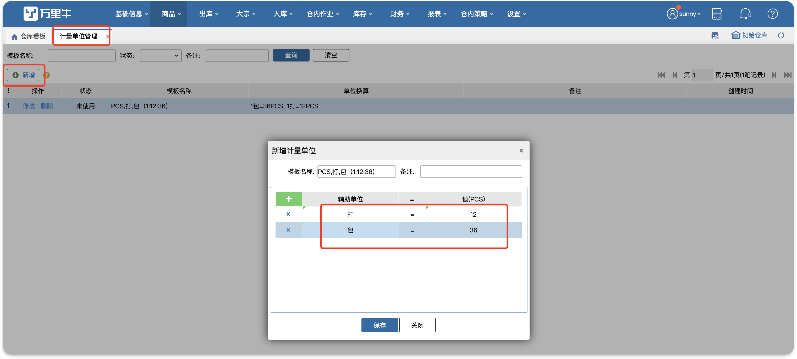

2、商品信息中选择相应的多单位模板

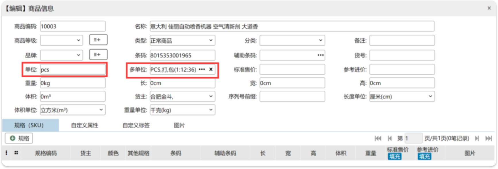

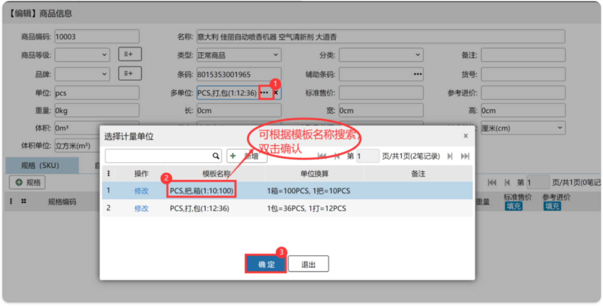

3、系统配置其他配置中勾选开启多单位选项

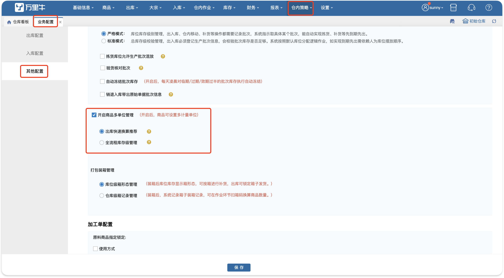

4、拣货时系统则根据拣货数量进行推荐单位提示

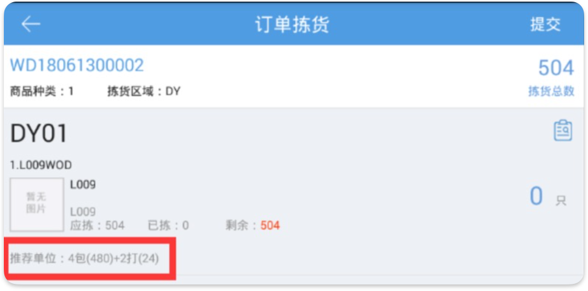

重要

1、拣货数量需大于第二级换算单位；

2、推荐单位仅作为换算单位提示，不作为库位内商品包装判断；

3、基础单位为商品之最小单位；

4、换算单位在基础单位之上最大5级。

> 更新: 2023-12-22 10:18:17  

> 原文: <https://hupun.yuque.com/unzko7/lsbfg0/frdp93e41y5z2dt7>

---

### 02.1.7 商品库位

> 原始文件来源：`00-源文件/操作手册/商品信息/商品策略/商品库位.md`

该页面功能是给商品设置优先库位。商品设置优先库位后，系统在指导上架和补货时将会推荐该商品放在优先库位上。

支持给商品设置拣选、存储、过渡、工位四种优先库位，每种库位类型最多设置20个优先商品，每个商品最多设置对应类型的10个库位。

#### 1.单个sku设置

点击sku上库位类型，显示商品信息，点击新增库位，显示对应类型的库位。可通过选择库区定位库位，也可直接查询库位编码。

#### 2.批量设置

批量设置可勾选多个商品，同时给商品设置优先库位，设置规则有库位库存和历史库位。

##### 01.批量按库位库存设置

支持批量给商品设置有库存的库位为优先库位，一次最多设置10个。

批量添加将会在原有设置的优先库位基础上添加库位，若添加后库位超过十个会报错提示只设置库位到十个，设置库位时根据库位编码从小到大排序。

批量覆盖则是将库位全部更新为新的库位。

##### 02.批量按历史库位设置

历史库位：商品在该库位曾经存在过且现在不存在。当sku的历史库位存在时，每种类型最终只会设置一个历史库位，该历史库位是最近存在过该sku的库位。

库位库存为0的库位仅会在历史库位不存在的时候被设置

##### 03.批量清除优先库位。

   选择商品和需清除的库位使用方式，确定后会清掉商品的优先库位。

#### 3.查询

可查询有历史库位和无历史库位的sku，查询后可批量设置。

可查询有优先库位和无优先库位的sku，对无优先库位的sku一键设置优先库位。也可根据商品的在途库存和库存总量来设置优先库位

#### 4.导入

商品优先库位支持通过导入方式填充，要求按使用说明填写导入文件：

> 更新: 2024-10-25 11:40:28  

> 原文: <https://hupun.yuque.com/unzko7/lsbfg0/wsg57ixeg30wlavp>

---

### 02.1.8 商品绩效积分

> 原始文件来源：`00-源文件/操作手册/商品信息/商品策略/商品绩效积分.md`

在业务配置-其他配置项中勾选了开启积分绩效，保存并退重新登录后，此页面会出现。商品绩效积分页面是用来设置每个商品对应不同环节的积分，设置成功后，在绩效明细报表和绩效统计报表中能查询到对应的积分统计。

#### 1.设置

1) 勾选商品，点击批量设置；或者选中分类，点击按分类批量设置；

2) 基准字段，选择固定值，再勾选目标环节，对应商品对应环节的积分将根据固定值按比例设置；

3) 基准字段，选择环节，再勾选目标环节，对应商品对应环节的积分将根据基准环节的数值按比例设置；

4) 页面中修改某sku对应环节的绩效配置，修改后点击保存积分才会生效。

**提示：**

1.支持跨页勾选商品进行批量设置；

2.未设置积分的环节，绩效统计默认为0；

3.修改了sku的积分，会在操作日志中显示修改的记录；

4.固定值仅支持输入1的整数倍，输入小数将自动进行四舍五入计算；

5.基准字段选择“清空”，会清空勾选商品目标环节的积分值。

#### 2.预录入规则

使用场景：入库的一批商品中无法识别哪些是未设置绩效积分的新品，从而不能及时维护新品的商品绩效积分，导致绩效计算不准确。提前设置好积分规格，当系统中新增商品后，自动匹配符合的规则，自动填入新品的绩效积分。

具体操作步骤如下：

新增预录入规则，输入规格名称后选择录入维度，在对应的环节中录入绩效积分，点击保存即可。

如上图所示设置好预录入规则：品牌万里牛后，erp推送新品或wms新增商品sp001，品牌为万里牛，商品绩效积分页面查询商品sp001，已匹配到预录入规则，自动带出规则中的绩效积分。

**注意：**

1.规格名称最多可以8个汉字；

2.录入维度有3种，商品的品牌、商品所属货主、商品的系统分类；

3.一个预录入规则只能选择一种录入维度；

4.两个规则中同一录入维度下选择不能重复。例如：预录入规则1选择录入维度品牌，品牌选择万里牛，保存后，新增预录入规则2，选择录入维度：品牌，品牌选择万里牛、新品两个选项，因为规则1已选择品牌万里牛则会提示录入维度重复，不允许新增预录入规则2。

> 更新: 2026-04-28 18:05:11  

> 原文: <https://hupun.yuque.com/unzko7/lsbfg0/bpggc7xo8bfc73xk>

---

### 02.1.9 仓储系统商品同步

> 原始文件来源：`00-源文件/操作手册/商品信息/对接配置/仓储系统商品同步.md`

仓储系统商品同步页面，用于从wms同步商品信息到万里牛erp系统中。页面左侧显示货主，右侧显示对应货主下可同步的商品信息：

注意：

1.该页面有后台开关；

2.在wms中修改商品部分字段（包括：长宽高、体积、重量、自定义属性、外贸扩展字段）后，会在此页面显示对应商品或规格信息；

3.同步方式有3种：同步勾选商品、同步未同步商品、同步所有商品；

4.“是否已同步“列显示该行数据的同步状态：空--未同步，x--同步失败，√--同步成功；

5.系统每晚自动跑批清除同步成功的数据；

6.货主下有可同步商品时，货主上有红点标记；无可同步商品，则货主上无红点。

> 更新: 2024-11-14 10:44:02  

> 原文: <https://hupun.yuque.com/unzko7/lsbfg0/tutmpdtourx60zhf>

---

## 02.2. 包装规格与多单位管理

### 02.2.1 WMS-商品多级单位管理

> 原始文件来源：`00-源文件/专题功能介绍/行业_库存属性/装箱_箱规_多单位/WMS-商品多级单位管理.md`

不少酒类、食品类商家的商品通常会已箱、小包的包装规格出现，那么日常在作业中，如果是以较为严格的箱规进行管理则会大大增加操作复杂度和维护成本，本功能旨在通过单位数量换算的方式提升作业时商品数量录入的效率

功能效果

扫码转换数量，可通过扫上级单位条码对SKU数量进行转换录入

单位换算推荐，系统根据商品维护的辅助单位比值对需求量（如：拣货数量）进行换算

一、配置及商品设定

开启多单位配置

路径：仓内策略-业务配置-其他配置

开启出库快速换算推荐

记得保存生效哟

设置多单位商品

路径：商品-商品信息

在商品信息中可针对每个SKU进行多单位比值以及条码设定，最大支持5种单位设定

如果仅看单位换算推荐的话也可以不填写条码

导入设置

针对批量的商品，我们提供了导入设置的方式

二、操作展示

PC端验货入库举例

我们录入商品辅助单位中的条码orange-2

在入库页面每次录入该条码即可将该商品数量+2

PDA操作展示

单位推荐展示

拣货推荐展示

不仅可在作业页面查看推荐的结果，PDA也支持通过扫多单位条码来添加商品

> 更新: 2023-12-21 10:48:19  

> 原文: <https://hupun.yuque.com/unzko7/lsbfg0/hel5o8y3dbe2u3zc>

---

### 02.2.2 WMS-序列号外箱码

> 原始文件来源：`00-源文件/专题功能介绍/行业_库存属性/装箱_箱规_多单位/WMS-序列号外箱码.md`

#### 背景

在快消品、电商及物流行业，为提升供应链效率，SN商品（序列号管理单品）常采用“一物一码”实现全流程追溯。外箱汇总二维码整合箱内单品信息，便于仓储扫码入库/出库、物流追踪及防窜货管理，同时支持渠道管控、消费者验真等场景，是数字化供应链与智慧物流中的关键应用。

#### 目的

本功能模块主要解决有箱包装的序列号产品，在出入库作业时通过扫描箱码批量带出序列号，避免 用户拆箱操作从而提升作业效率

#### 功能介绍

##### 外箱码的启用

在序列号商品信息中我们选择序列号扩展，启用外箱批量录入

##### 外箱二维码截取

一般来说，序列号商品，例如手机一类的电子数码产品，其外箱都会黏贴箱内商品的所有序列号集合。

其样式有两种

一种是把每个序列号单独列出，

另外 一种是把所有序列号汇集到一个二维码中，比如手机.

入库填写页面：

PC：采购入库、其他入库、销退入库、销退扫描入库

PDA：收货入库

出库填写匹配页面：

PC:条码验货、大宗装箱

PDA：条码验货，订单拣货，大宗拣货

> 更新: 2026-08-19 18:24:45  

> 原文: <https://hupun.yuque.com/unzko7/lsbfg0/tsg6dpuc4nlcm68z>

---

### 02.2.3 WMS-箱规模块(箱规)

> 原始文件来源：`00-源文件/专题功能介绍/行业_库存属性/装箱_箱规_多单位/WMS-箱规模块(箱规).md`

万里牛WMS“箱规”使用说明

一、概述

箱规：即有包装箱规格，在实际的仓储应用中扮演重要的角色，主要用于产品的集合管控、存储、搬运、出库等作业。

使用箱规的场景：

例1：

行业：小饰品

主要产品：发饰，小玩具等

业务模式：以线上订单为主，少量批发性质的大单

箱规情况：大部分商品可单个零售也可按小包出售，因产品价值低，小包商品销量更高

需求场景：

入库：按小包入库

拣货：拣货区分小包和散件两块区域，日常出库时，如果需求数量大于一个小包的数量那么先拣小包剩下的零散数量再从散件区域拣

验货：人工验货，无需扫条码

盘点：按小包数量计算商品总数

例2：

行业：百货

主要产品：洗化用品、洗发水、牙刷等

业务模式：批发订单为主，线上订单较少

箱规情况

所有商品包装都印有条码

部分商品10或12个为一盒，盒子上也有条码

部分盒装商品6盒为一箱  

需求场景：

入库：按箱、按盒入，扫描箱子或者盒子上的条码进行入库

拣货：订单数量复杂，需要计算最优的箱+盒子+散件的配比

如：某款牙刷 1盒12支，一箱6盒

当订单需要200支时需提示拣货2箱+4盒+8支

验货：扫描条码进行验货，拣了箱子就扫箱子条码

补货：对应拣货未的箱子或者散货不足时提示按箱进行补货，可补箱或者散货

盘点：扫箱条码盘点，盘点结果是箱子数量变化

二、使用方式（普通订单）

1、业务配置

在使用箱规前我们需要在业务配置中开启业务开关

 2、基础信息维护

仓库库位中新增箱拣选库位，用于规格箱的存放和拣选使用

2.1、商品维护

商品信息中修改对应商品的装箱规则填好箱条码比值关系及单位等信息

2.2、商品箱规导入

新建仓初始化时可考虑通过箱规模板批量导入箱规信息

3  验货入库

考虑到按箱收货体积较大的因素，我们推荐在PDA移动端执行验货入库

4 锁定与波次生成

当基础信息和货品都准备完成后，订单进入系统后，系统就开始根据设定的波次策略进行锁库和波次生成了

5 拣货

在系统已锁定了规格箱的情况下使用PDA进行拣货页面上会显示需要拣的箱子信息

 

6  验货

当拣货拣取箱子后，后续的验货也会支持扫描箱条码验箱，支持PDA播种验货、独立播种

快速验货；PC端播种验货、独立播种、条码验货、快速验货等多种验货形式

7  补货

当库位上可用库存低于我们设定的下限时补货任务开始启动

但使用箱规的情况下，我们需要优先补充出货量较大的箱子，而且同时需要兼顾到散件区域的补货

①设置补货

开启自动补货任务选择按箱补货

设置库区预警上下限

注意：设置了拆零保底值的任务才会在补货时补箱，拆零保底设置的值决定了每次补货需要拣选库位补多少散件

补货任务

设置完成后，系统自动生成的补货任务就会要求按箱进行补货

8  盘点

当开始使用箱规时，盘点时根据箱子数量X箱内商品数量的方式已经无法满足业务需要了

所以我们支持了PC端或者PDA的盘点支持盘箱，只需扫描箱条码系统就会记录箱子盘点情况

 

9  装箱

日常业务中如果箱规格是自己定义的，而非厂家生产出来就有的固定规格，那么我们需要将仓库内的散货进行装箱操作

打开规格装箱，点击新增，选择正确的库位】商品、箱信息即可完成装箱作业，同时还会记录装箱员绩效

三、使用方式（大宗订单）

在了解了普通订单的箱规使用方式，再来看一下大宗订单是如何使用的

1、策略配置

大宗策略开启出库流程时可配置需要锁定的库位使用方式和形态的锁定顺序

锁定顺序方式可自定义拖动调整

2、锁定

大宗订单锁定会遵循配置的锁定规则进行锁定

这里选择先锁箱再锁拆零的的锁定模式

 

3、拣货

大宗拣货同普通订单的拣货，锁定了箱子会提示拣选箱子

4、装箱

大宗装箱可支持将已拣的箱子扫描箱条码进行装箱

四、其他作业

1、上架

使用箱规时，系统支持将库位上的货箱进行上架

2、移库

日常的移库作业我们也支持将箱子进行移库操作，

移库作业系统支持PC端和PDA端的移库

> 更新: 2023-12-21 10:50:03  

> 原文: <https://hupun.yuque.com/unzko7/lsbfg0/ctaax9gpgvl4rprp>

---

## 02.3. 批次效期与残次品管控

### 02.3.1 WMS-保质期禁收_禁售

> 原始文件来源：`00-源文件/专题功能介绍/行业_库存属性/WMS-保质期禁收_禁售.md`

行业背景

通常做食品、药品、日化等具有保质期特性类目的，对于保质期的管理都是供应链管理的重中之重。那么收发货的时候会着重对于商品保质期

禁收管理

使用场景：

食品、药品等效期商品在入库时，若商品剩余保质期不够长或者接近临期，此时收货入库很可能就滞留在仓库发不出去了，给仓库带来资损风险

使用效果：

设置禁收规则后，所有入库批次商品均会经过系统检验是否符合规则，若不符合则提醒操作员不可入库

操作方式：

开启业务配置

点击收发策略打开禁收规则开关

开启后，就可以配置货主/业务单据以及规则条件

规则条件中有一些预设规则，也可以遵循按商品上配置的禁收期或者自定义禁收期

配置好后，入库时系统则开始逐一进行校验

注意：校验规则有两种，①强制，表示无论如何都不可入库，没有协商余地 ②提醒，表示可以上报采购和供应商交涉

PC页面在录入批次时的校验如下，问题批次会标红处理

PDA校验样式如下

禁售管理

使用场景：

平台、经销商（客户）、超市等都会对采购商品的剩余保质期有要求，比如，保质期大于180天、保质期不可低于1/3，如XX超市等要求会更加高，甚至要求保质期大于300天或2/3.抖音平台要求不可发临期商品等，如上所述商家在发货时往往碰到，同一个商品在不同的店铺、渠道内所要求的保质期范围不同。这就给仓库发货水平提出了极高的要求。

使用效果：

设定了保质期发货规则后，系统在锁定库存时将为订单自动分配符合要求的批次。

设置方式详解：

业务模块开关开启

必须是开启生产批次严格模式系统才可以使用禁售规则

设置规则

在设置页面我们可以通过配置指定店铺及其发货规则

配置店铺，注意同一个店铺只能设置一条规则

设置规则条件，系统中提供了若干常用的设置，可以直接选配

当然也可以设置自定义规则

设置自定义规则

自定义规则中我们可以设置发货条件，即可发/禁发，便于配置

同样的为了兼容一些商超的硬性要求，我们可以在天数范围选择按保质期的百分比设置或是按照天数范围设置

下面我们模拟一下场景进行一次设置

商家老马是一个做零食的商家，这个月他有幸傍上了大腿，盒牛生鲜超市与他签订了供货商采购协议，根据协议条款中要求老马供货的商品保质期不可低于3/4.

于是老马可进行如下配置

选择盒牛店铺，发货规则选择自定义，发货条件选择可售，天数范围选择按百分比，75-100%即可

保存配置成功后，老马系统中所有新进盒牛店铺的订单，均会按照此规则进行批次分配。

> 更新: 2023-12-21 10:50:27  

> 原文: <https://hupun.yuque.com/unzko7/lsbfg0/yynabuf7mai36tam>

---

### 02.3.2 WMS-序列号拍照上传

> 原始文件来源：`00-源文件/专题功能介绍/行业_库存属性/WMS-序列号拍照上传.md`

#### 背景

拼多多公告

【平台补贴商品需上传商品SN识别码和SN识别码图片信息】

基于平台补贴商品的风控，平台补贴订单最晚在4月30日，会全部上线商品识别码发货上传功能。

商品识别码发货上传功能说明：

商家通过商家后台或者开放平台接口需在订单发货前【上传】或发货后24小时内【补传】商品识别码和识别码图片信息。

上传教程说明：[https://mms.pinduoduo.com/daxue/detail?courseId=9493](https://mms.pinduoduo.com/daxue/detail?courseId=9493)

功能影响：平台补贴订单若未正确上传识别码和图片，目前不会拦截商家发货，但是会影响商家后续的平台补贴结算。

#### 操作方式

本次考虑作业便利性，拍照功能入库在PDA条码验货功能下支持。具体操作步骤如下

##### 系统配置要求：

序列号登记环节需设置在验货

SN回传模式调整为同步模式

设置-对接配置

对接配置中，对应货主的设置保留图上示例样式，**不要勾选**

##### 录入操作

扫描拼多多平台且带【SN上传图片】标记的订单号进入验货

匹配成功后展示商品列表

扫描商品校验成功后进入序列号登记页

此处用真实PDA展示

扫描后点击上传图片字样

可使用PDA自带摄像头进行拍照，也可选择相册添加图片

拍照后返回

系统记录上传图片数量，注意每个序列号拍一张即可

上传不通过场景：因平台对图片大小、格式、及拍摄清晰度有要求，所以提交验货时存在不成功的情况则会报错，相应序列号会标红显示，可重新删除图片再次上传

##### 回传ERP

拍照后图片会回传ERP提供发货上传，对应接口字段位置为

orderLine—>extendProps—>extSnList—>extSn—>snImageUrl

> 更新: 2026-06-15 15:52:23  

> 原文: <https://hupun.yuque.com/unzko7/lsbfg0/izydyvvvxo58sagh>

---

### 02.3.3 WMS-残次品

> 原始文件来源：`00-源文件/专题功能介绍/行业_库存属性/WMS-残次品.md`

引言

       在仓储作业时我们常常会碰到部分的商品性状发生改变，不再符合常规销售条件，即我们通常所说的次品的产生。次品的产生途径是多样的，有时入库的时候就发生了，有时仓内搬运的时候不小心造成的，还有随着存储时间过长加之存储条件不良导致商品慢慢由正品变成了次品。

       本次更新通过开发团队的一致努力，我们抛弃了当前行业市场中普遍点到为止的粗劣展现方式，从业务使用角度，遵循合理化、标准化、可持续化的原则进行开发。力求给到用户正确的业务引导和便捷的操作。

作业环节介绍：

如何开启残次品功能？

如何进行次品入库？

场景：当商品入库时，发现待入商品中夹杂着次品商品，在记录入库数量时，我们需要分别统计正品和次品的数量

系统支持全部的入库渠道，【[采购入库](https://hupun.yuque.com/unzko7/plvu1m/cxzlgl)】、【[验货入库](https://hupun.yuque.com/unzko7/plvu1m/cxzlgl)】、【[调拨入库](https://hupun.yuque.com/unzko7/plvu1m/wqotu6)】、【[其他入库](https://hupun.yuque.com/unzko7/plvu1m/wqotu6)】、【[销退入库](https://hupun.yuque.com/unzko7/plvu1m/sxd4mz)】以及两种

扫描入库作业【[收货入库](https://hupun.yuque.com/unzko7/plvu1m/av97be)】和【[销退扫描入库](https://hupun.yuque.com/unzko7/plvu1m/kcgaec)】在录入时支持添加次品商品

如何进行次品出库？

场景：次品商品库存积累一定程度后，根据不同的业务要求需要将次品进行出库返厂或报废折价处理

鉴于当前市场主流ERP不支持标准的残次品处理流程，我们开放了线下【[出库单](https://hupun.yuque.com/unzko7/plvu1m/drrosh)】这一出库渠道，支持分别选择正次品进行出库

线下出库单功能仅限对万里牛ERP生效，需通过技术人员开启

*WMS 3PL版本暂不支持开通验货出库，暂可通过盘点进行次品扣减

如何进行正、次品转换？

场景：仓内理货或者质检时，发现某些商品已经破损或发生性状改变，需要与正常商品做区分，这时就需要将正品库存转为次品库存

可通过【[正次转换](https://hupun.yuque.com/unzko7/plvu1m/twcqyf)】页面，支持正、次品间互相转换

如何查看次品库存？

场景：日常财务核账、仓库整顿、向上级部门反馈库存情况时，需要分别体现仓库中正次品的库存数量

【[库存总量](https://hupun.yuque.com/unzko7/plvu1m/rfrfut)】【[库位库存](https://hupun.yuque.com/unzko7/plvu1m/xcsa7g)】【[历史库存](https://hupun.yuque.com/unzko7/plvu1m/mta0ou)】【[出入库明细报表](https://hupun.yuque.com/unzko7/plvu1m/bdgcba)】均会在库存数据列表中区分正品&次品的数量，同时可查看对应属性的库存流水记录

如何进行次品盘点？

场景：在做仓库盘点时，库位上发现有次品商品存在时，需要能准确盘点不同属性的库存数量

【[盘点任务](https://hupun.yuque.com/unzko7/plvu1m/ngv6eg)】新增盘点任务时，有次品商品库存的将会自动带出

【快速盘点】支持盘点时录入次品商品

如何进行次品移库上架？

场景：仓内作业时，需要将库位上的商品进行移动或上架操作，移动时需要给到操作员提示对应商品的库存属性是正品还是次品

【[仓库库位](https://hupun.yuque.com/unzko7/plvu1m/gvnyhb)】新增次品库位使用方式，作为次品商品指导结果存在

【[库存移动](https://hupun.yuque.com/unzko7/plvu1m/sngiou)】支持移动时分别显示库位上正品和次品的数量

【[指导上架](https://hupun.yuque.com/unzko7/plvu1m/dsf6ht)】针对次品商品，系统会指导有同样属性库存的库位进行上架指导

> 更新: 2023-12-21 10:47:25  

> 原文: <https://hupun.yuque.com/unzko7/lsbfg0/mnhglobh0191r1fa>

---

### 02.3.4 WMS-生产批次标准模式

> 原始文件来源：`00-源文件/专题功能介绍/行业_库存属性/WMS-生产批次标准模式.md`

引言

生产批次商品常见于食品及药品类，具有严格的生产日期、保质期限等管理要求，在生产批次商品的库存管理上不同的商品有着不同的管控力度；如保鲜食品或是处方药等都是需要强制管理生产批次的拣货移库等作业，但也有一些生产批次商品无需做很精细的管理，仅在出库和入库有记录即可，这就是本次所做的--生产批次标准模式

该模式下，生产批次信息不再记录至库位库存，极大的减轻了日常的仓内作业强度，符合仅登记类商户的作业需求。

作业环节介绍：

开启商品生产批次标准模式：

开启前的准备：请先在出库环节开启验货环节、库位分配处开启待分配环节强制锁定库位。

注：生产批次标准模式与次品库存管理暂不能同时开启。

设置生产批次商品：

仓内策略-业务配置开启商品生产批次管理标准模式后，在【[商品信息](https://hupun.yuque.com/unzko7/plvu1m/sw4dcf)】新增商品并开启生产批次开关。

生产批次商品入库登记：

标准模式下的生产批次商品入库仍需登记生产批次，【[采购入库](https://hupun.yuque.com/unzko7/plvu1m/cxzlgl)】、【[验货入库](https://hupun.yuque.com/unzko7/plvu1m/cxzlgl)】、【[调拨入库](https://hupun.yuque.com/unzko7/plvu1m/wqotu6)】、【[其他入库](https://hupun.yuque.com/unzko7/plvu1m/wqotu6)】、【[销退入库](https://hupun.yuque.com/unzko7/plvu1m/sxd4mz)】以及两种扫描入库作业【[收货入库](https://hupun.yuque.com/unzko7/plvu1m/av97be)】和【[销退扫描入库](https://hupun.yuque.com/unzko7/plvu1m/kcgaec)】。

生产批次商品出库登记：

标准模式下生产批次商品出库登记批次信息在验货环节，此模式下生产批次商品普通订单出库登记生产批次暂支持【[条码验货](https://hupun.yuque.com/unzko7/plvu1m/tpd69m)】和【[待验货](https://hupun.yuque.com/unzko7/plvu1m/uti1vb)】两种验货方式，以及大宗订单的【[大宗出库](https://hupun.yuque.com/unzko7/plvu1m/hwq2kk)】。

本次生产批次标准模式下验货新增扫码验货方式

场景：商品包装上有二维码，其中包含了商品条码、批次号、等信息，验货时根据扫描的二维信息解析出条码、批次号进行录入。

【[扫码验货](https://hupun.yuque.com/unzko7/plvu1m/ktubl8)】为生产批次标准模式特有，适合通过二维码一次性录入商品及批次信息，需技术人员开启后台开关。

查看生产批次商品库存：

场景：日常财务核账、清点库存情况时，需要查看仓库中生产批次商品对应批次的库存数量

【[库存总量](https://hupun.yuque.com/unzko7/plvu1m/rfrfut)】【[历史库存](https://hupun.yuque.com/unzko7/plvu1m/mta0ou)】【[出入库明细报表](https://hupun.yuque.com/unzko7/plvu1m/bdgcba)】均会在库存数据列表中展示批次的库存数量，同时也可查看对应批次的库存流水记录

【[库位库存](https://hupun.yuque.com/unzko7/plvu1m/xcsa7g)】会展示商品所在库位以及库存数量，但在该模式下不会显示对应批次库存情况。

生产批次商品盘点：

场景：操作员仓内作业时，只需给到商品的库位以及数量而不需管理商品的批次

【[盘点任务](https://hupun.yuque.com/unzko7/plvu1m/ngv6eg)】新增盘点任务时，生产批次商品不会带出批次信息

【快速盘点】、【[库存移动](https://hupun.yuque.com/unzko7/plvu1m/sngiou)】、【[补货上架](https://hupun.yuque.com/unzko7/plvu1m/she782)】、【[库存冻结](https://hupun.yuque.com/unzko7/plvu1m/nev32d)】支持正常操作生产批次商品

【[指导上架](https://hupun0901.kf5.com/hc/kb/article/1159602/)】生产批次商品系统指导时，将不考虑批次一致性进行指导。

生产批次商品库存调整：

场景：当盘点库位库存后，库位库存与库存总量产生差异量时，需要把库存调整成和仓库实际库存一致。

【[库存调整](https://hupun.yuque.com/unzko7/plvu1m/umrsep)】支持生产批次商品选择批次后调整批次库存。

【[库存差异量](https://hupun.yuque.com/unzko7/plvu1m/ucsxv4)】实际调整时，才会选择有差异的批次进行调整。

> 更新: 2023-12-21 10:48:27  

> 原文: <https://hupun.yuque.com/unzko7/lsbfg0/gxxyzl5mx593ir2m>

---

### 02.3.5 码上放心溯源上传

> 原始文件来源：`00-源文件/专题功能介绍/行业_库存属性/医药/码上放心溯源上传.md`

#### 背景

2025年3月12日，国家医保局联合人力资源社会保障部、国家卫生健康委、国家药监局印发《关于加强药品追溯码在医疗保障和工伤保险领域采集应用的通知》，明确要求：自2025年7月1日起，定点医药机构销售环节按要求扫码后方可进行医保基金结算；自2026年1月1日起，所有医药机构都要实现药品追溯码全量采集上传。

#### 业务开启

溯源模块使用前请联系产品同学确认

#### 操作方式

##### 系统配置

溯源系统配置选择码上放心

填写企业身份，配置好业务所在仓库和货主和单据

企业标识和企业ID在码上放心-基础信息中查看

##### 客户侧绑定万里牛服务商

绑定操作见平台教程：[点击查看](https://qg6r2i.yuque.com/qg6r2i/ravqhr/oty6fvsgyza1hs6l?singleDoc)

填写教程

绑定成功后显示如下

##### 溯源码上传

根据配置，符合的仓库中产生入库单后，系统会自动像平台上传入库单。

上传任务发起后，系统中会产生溯源上传记录

##### 大、中码的录入方式

在码上放心编码规则中，药品是存在3级包装，有大（箱）、中（包）、小（盒、瓶等最小单位），

对于企业的实际的入库作业中，不可能拆箱逐个扫描商品的码，这时就需将大、中码转换为小码进行录入

##### 启用序列号外箱码管理

联系服务人员开启模块开关

开启商品外箱码管理，注意商品需是序列号商品

##### 策略配置

启用入库单审核并开启码上放心箱码不强制填写开关

##### 入库操作

入库时录入若是整箱/包到货则录入箱码，无需录入序列号保存即可

如果是最小包装则在基本录入中填写序列号

录入完成后提交单据等待系统自动解码

##### 查看上传和处理进度

上传状态显示已完成的，即视为系统完成解码的工作

可点击单号跳转至入库单页面查看结果，若数量无误则可点击审核完成进行入库

##### 异常的处理

##### 上传单据异常

1.上传异常：接口/配置错误导致上传码上放心单据异常

解决方案：检查溯源系统配置和单据相关配置，在溯源记录中重试操作。

2.溯源码异常：因为可能存在上游企业未上传出库溯源码信息，可能会导致商家在入库时上传溯源码异常

解决方案：

①联系发货企业补传溯源码  
②删除码上放心平台中已上传的入库单  
③系统中关闭失败的入库单，重新创建入库单  
3.部分箱码解码异常：入库扫描时可能会错误的将序列号（子码也是最小包装的溯源码）填写到箱码中或箱码填写错误

解决方案：

①在码上放心平台查询正确溯源码和关联序列号，复制到系统中替代系统解码过程。

或

②删除码上放心平台中已上传的入库单  
③系统中关闭失败的入库单，重新创建入库单填写正确箱码

> 更新: 2025-09-26 13:59:15  

> 原文: <https://hupun.yuque.com/unzko7/lsbfg0/mmy9htlxtyghutdg>

---

### 02.3.6 生产批次扩展属性管理（医药）

> 原始文件来源：`00-源文件/专题功能介绍/行业_库存属性/生产批次扩展属性管理（医药）.md`

#### 引言

       生产批次商品常见于食品及药品类，具有严格的生产日期、保质期限等管理要求。但在医药行业中，除进行正常的效期管理外，还需记录药品批次、批准文号、准字号、械字号等等国家相关法律发规中强制要求追溯的药品批次信息。所以在医药这类特殊类型的的批次管控中，WMS为满足GSP规范，将这类信息作为批次扩展属性进行管理。

#### 使用及操作

##### 功能配置

前置条件：开启生产批次管理

维护批次扩展属性

考虑不同地区的管控要求和不同管控等级的药品，系统可自定义设置扩展属性名供使用。

注意：所有属性值设置后一经使用不支持删除，仅可进行属性名修改。属性名最多可设置10个

##### 入库登记批次

##### PC入库

已采购类入库举例，我们在录入商品批次时可同步登记批次扩展属性

入下图

考虑不同的商品需录入的扩展属性值不同，故所有的属性值都是非必填项。

入库完成后可以在单据中看到汇总信息。

##### PDA入库

手持端PDA的入库我们也是在录入批次页面增加了相应的扩展属性录入

##### 单据的打印

在入库单的相关打印模板中，我们也增加了扩展属性的打印项

##### 出库作业

##### 扩展属性的查看

在正常的出库页面中，我们可以通过点击查看订单分配/录入的批次号来查看其扩展属性

##### ToC验货（复核）的批次复核

在GSP相关规范中要求，药品出库需要进行复核，我们在验货页面中也适配了相应要求

已条码验货为例

第一步：调整页面显示粒度

选择按批次明细显示

第二步：配置界面选择适合的地方显示批次属性

配置之后需保存保存

接下来扫描核对即可

##### 指定批次出库与手动分配批次

若订单是指定某批次发货的，则订单明细会显示指定批次信息。

手动分配锁定批次时，此处以大宗出库页面举例

可在选择批次的时候查看到相应的扩展属性

##### 盘点及库存调整

盘点作业时，我们可以新增创建批次

在调整库存时，我们也可以填写批次扩展属性相关

##### 批次扩展属性的修改和变更

如果严格按照GSP规范进行药品批次管理的话，仓库内是不允许进行批次等信息的修改。

但考虑到通用性，我们提供了如下几种变更修改的方式

1.入库时修改，提交入库单成功后，单据中最后一次录入的批次扩展属性会更新覆盖原系统中记录的属性内容

2.盘点修改，通过盘点变更扩展属性，修改后盘点提交会执行覆盖

3.批次调整，创建批次调整单，可修改批次及扩展属性

> 更新: 2024-04-24 15:43:17  

> 原文: <https://hupun.yuque.com/unzko7/lsbfg0/hsi50e3g0rz2uazs>

---
