# 03. 仓内策略

> 资料来源：基于 `00-源文件/` 对应模块的原始操作手册、专题功能与PDA文档重组迁移。
> 事实边界：正文仅重组迁移原始文档；章节编号、目录和来源标记为整理信息，不新增业务规则、字段或流程。

## 本章知识目录

- **03.1 波次策略配置**
  - [波次策略总览](#0310-波次策略总览)
  - [一筐同品单波次](#0311-一筐同品单波次)
  - [自由波次](#0312-自由波次)
  - [预配波次](#0313-预配波次)
  - [普通波次总览](#0314-普通波次总览)
- **03.2 仓内作业与绩效策略**
  - [绩效策略总览](#0320-绩效策略总览)
  - [例外累加规则](#0321-例外累加规则)
  - [基础绩效策略](#0322-基础绩效策略)
  - [业务配置-入库配置](#0323-业务配置-入库配置)
  - [业务配置-其他配置](#0324-业务配置-其他配置)
  - [业务配置-出库配置](#0325-业务配置-出库配置)
  - [业务配置-场站配置](#0326-业务配置-场站配置)
  - [业务配置-货主策略](#0327-业务配置-货主策略)
  - [区域匹配](#0328-区域匹配)
  - [大宗策略](#0329-大宗策略)
  - [盘点策略](#03210-盘点策略)
  - [耗材匹配](#03211-耗材匹配)
  - [耗材管理总览](#03212-耗材管理总览)

---

## 03.1. 波次策略配置

### 03.1.0 波次策略总览

> 原始文件来源：`00-源文件/操作手册/仓内策略/波次策略/index.md`

波次策略是用户可以根据自己的需求来设定规则，快速分类一大堆订单。根据设置的策略生成的波次，快速处理订单。

波次策略分类两类：预配波次和普通波次。

具体页面如下：

 

**提示**

1.预配波次的优先级高于普通波次，若订单同时满足预配波次策略和普通波次策略，则订单会生成预配波次；

2.在普通波次中，订单会有波次降级考虑：每个订单的波次执行次数≥2时，允许降级（波次优先级）寻找下个符合的策略；

3.开启跨境模块，波次策略“地区”增加显示其他国家，中国地区、其他国家下的数据可以同时选择，只保存当前页的数据，能根据选择地区生成对应的波次

详情的波次策略介绍，请看【[预配波次](https://hupun.yuque.com/unzko7/lsbfg0/gvrqcq1kd89vzzwd)】及【[普通波次](https://hupun.yuque.com/unzko7/lsbfg0/ovb4zd1mh7lfhbeu)】

> 更新: 2023-12-18 16:45:43  

> 原文: <https://hupun.yuque.com/unzko7/lsbfg0/ok8h5w5e8g7guzkw>

---

### 03.1.1 一筐同品单波次

> 原始文件来源：`00-源文件/操作手册/仓内策略/波次策略/普通波次/一筐同品单波次.md`

wms仓内策略-WMS-一筐同品单波次

应用场景举例：对于小商品类目且没有条码的卖家，小爆款类的订单使用传统边拣边分模式，分拣车空间利用率低且分拣效率无法得到提升。  
一筐同品单逻辑：只要订单货品结构一致（货品种类及数量均需相同，目前仅支持一单一件、一单多件的），就会分配至同一筐中

#### 01.新增一筐同品单波次策略

具体新增波次策略的步骤如下：

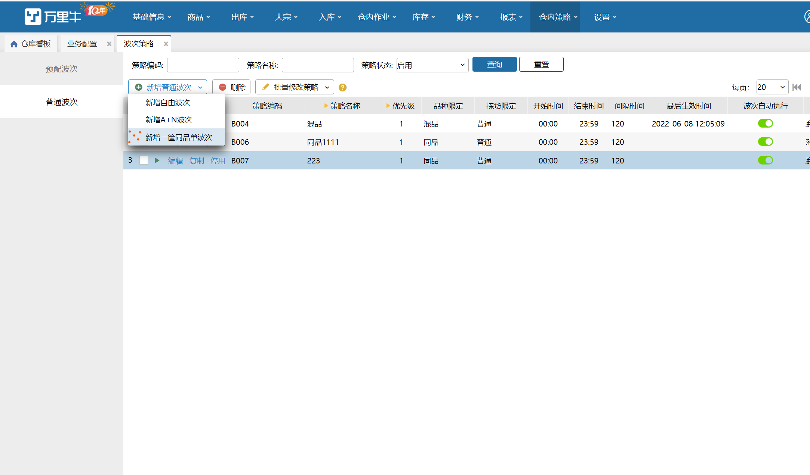

一筐同品单波次与普通波次的区别：

1.一筐同品单波次没有起止时间和间隔时间，不支持设置截单下限和订单降级

2.一筐同品单波次中没有容量上下限，对应为播种筐数上限、播种筐数下限、单筐订单数上限、单筐订单数下限，其中播种筐数上限*单筐订单数上限不能超过500

播种筐数上限：设置后波次每次执行生成时，波次中同品订单分组数将会做一次上限判断，超出则生成多个波

播种筐数下限：设置后波次每次执行生成时，波次中同品订单分组数将会做一次下限判断，不满足则生成不了波次

单筐订单数上限：单筐最多能放的同品订单数，超出则自动切分到下一个播种筐

单筐订单数下限：单筐最少能放的同品订单数，同品订单数未达到下限，则不参与波次生成

3.一筐同品单波次默认勾选允许PDA领单-扫描打单

4.自动波次不支持生成一筐同品单波次，需要手动截单生成一筐同品单波次

#### 02.波次策略复制

若要建一个和已存在的策略类似的波次策略，则可以使用复制功能，具体如下图所示：

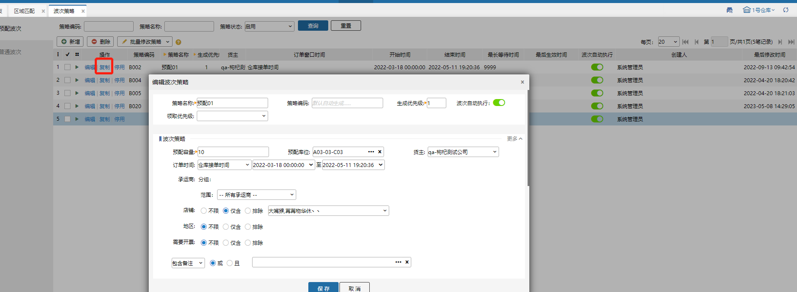

#### 03.策略停用、启用、删除

波次策略有停用和启用，这个可以根据用户的需求进行操作：

1）停用的策略可以启用

2）删除策略需要先勾选策略，策略删除后就不能恢复，需要重新新建

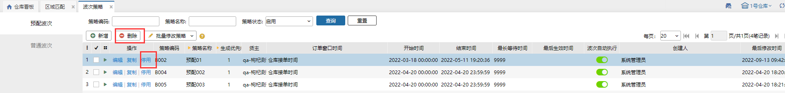

#### 04.一筐同品单波次项目了解

除置灰项不支持外，其他项与普通波次相同，可参考[普通波次项目了解](https://hupun.yuque.com/unzko7/lsbfg0/ovb4zd1mh7lfhbeu)。

> 更新: 2023-12-18 17:24:59  

> 原文: <https://hupun.yuque.com/unzko7/lsbfg0/pbzdux9ptlm6rn5z>

---

### 03.1.2 自由波次

> 原始文件来源：`00-源文件/操作手册/仓内策略/波次策略/普通波次/自由波次.md`

场景：针对一种一件的商品，特别是服装相关行业（订单比例可大于60-70%），希望有比目前系统更加相对便捷简单的拣货、验货方式。设置自由波次策略后，一种一件的生成自由波次，可以通过pda自由领单进行拣货，通过pc自由验货并后置打印快递单。

#### **01.新增自由波次策略**

具体新增波次策略如下图所示：

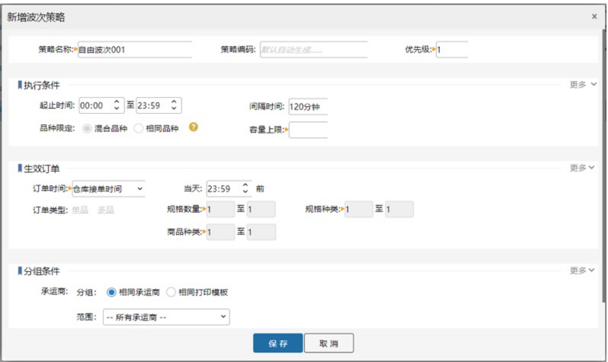

#### **02. 波次策略复制**

若要建一个和已存在的策略类似的波次策略，则可以使用复制功能，具体如下图所示：

#### **03 策略停用、启用、删除**

波次策略有停用和启用，也支持批量停用和启用，这个可以根据用户的需求进行操作：1）停用的策略可以开启；2）删除策略需要先勾选策略，策略删除后就不能恢复，需要重新新建。

具体操作控件如下图：

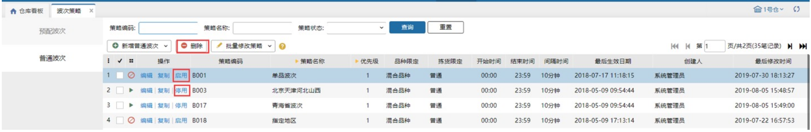

批量停用和启用

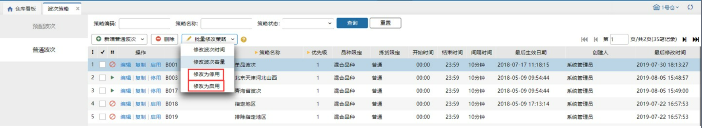

#### **04.自由波次项目了解**

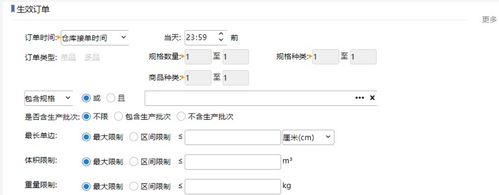

波次分为下面四个大块：策略概要、执行条件、生效订单、分组条件。

##### 一。策略概要

策略概要主要包括下面三点：

1.策略名称：表示波次策略的名称，必填；

2.策略编码：是该策略的身份标识，可以自己输入，也可自动生成，且在一个仓库内是唯一的；

3.优先级：表示该波次策略的优先级，只能为正数，且数字越大优先级越低，优先级可以重复；符合波次生效条件以及部分分组条件的订单会根据优先级从高到低匹配。

##### 二、执行条件

执行条件表示是否要执行生成波次这个动作的条件，只有在满足下面设置的条件的下，才会去触发生成波次的动作。

具体的内容主要包括以下几点：

1.起止时间：表示只有在这个时间段内才会有可能去触发波次的生成，订单进来不在这个时间段内是不会生成波次的，

1）若订单到了最长等待时间还没有在这个时间段内则会打到零拣；

2）若订单到了最长等待时间且已经在这个时间段内则会生成波次；

2.间隔时间：表示波次每次波次生成的时间间隔，且目前设定每10分钟会跑一次波次，就一个波次策略来说连续两次跑波次的时间必须大于等于这里的间隔时间，时间间隔的时间必须为10的倍数；

如：若间隔时间设置20分钟，若该策略第一次生成波次的时间是06:10，那么下一次生成波次的时间就是06:30分（因为在06:20的时候距离第一次生成的时间06:10只有10分钟，间隔还没有20分钟，所以不生成，但是当06:30的时间距离前一次生成06:10已经大于等于20分钟，所以会生成）；

3.最长等待时间：因该波次策略进入待分配的订单，如超过最长时间将强制生成波次，以保证该笔订单的出库时效；

如：该策略第一次生成波次的时间是06:10，波次最长时间为35分钟，订单A是06:08进入wms且满足该波次，则若到06:43分改订单因为其他原因还没有生成波次，则在06:50分的时候该订单将强制被生成波次（若有满足的波次策略）或打到零拣（若已经没有满足的波次策略了）；

4.品种限定：默认选择混品，且不可修改；

5.容量上限：表示一个波次最多有几个订单，必填；在没有开启截单下限时，若订单数量没到容量上线则订单不生成波次；

6.容量下限：开启容量下限后，波次每次执行生成时，订单容量将会以此下限判断，但最高不高于容量上限。设置了总量限定/重量限定/体积限定的时候，必须设置容量下限。

7.1总量限定：限定一个波次最多有多少个sku，设置了总量限定，最终生成的一个波次内订单的sku总数不会超过总量限定，一个波次内订单数量最少为容量下限数量的订单。

如：波次A容量上限：40，容量下限：5，总量限定：100。待分配有100个订单归属波次A，每个订单内有3个sku。最终生成的波次：33个订单一个波次，最后剩下的1个订单等降级。

波次B容量上限：100，容量下限：40，总量限定：100。待分配有100个订单归属波次A，每个订单内有3个sku。最终生成的波次：40个订单一个波次，最后剩下的20个订单等降级。（当订单个数满足容量下限，但是超过总量限定时，一个波次订单个数为容量下限个数。）

7.2重量限定：同理，限制了一个波次中订单重量总和的最大值。

7.3体积限定：同理，限制了一个波次中订单体积总和的最大值。

8.截单下限：开启后需要设置截单下限，且要设置截单时间，时间最多只能设置4个，则当到达这个时间后会执行生成波次的动作，且生成波次的下限就是此处的截单下限，但若是满足波次的订单没有达到截单下限，则订单仍然不会生成波次

9.允许PDA领单置灰，不允许勾选设置

10.仅起止时间内匹配订单置灰，不允许勾选

12.禁止订单降级：勾选了禁止订单降级，符合该波次的订单在波次执行了两次之后且依旧不满足容量下限这个生成条件时，不会降级，依旧根据这个波次的执行条件和时间生成

 

##### 三、生效订单

生效订单是以订单的角度去判断是否符合波次策略。

主要包括记以下几点：

1.订单时间：时间类型包括仓库接单时间、客户下单时间、客户付款时间、订单审核时间、剩余发货时间；

1）若订单是符合这个时间段的，则会去查看是否能生成波次；

2）若订单不符合这个时间段，则订单会到零拣，不会生成波次；

2.包含规格：只有订单包含这里设置的商品才会生成波次，包含商品这里包括两种形式：

1）且：由于自由波次是一种一件，只有订单中的商品是这里选择的商品才能生成波次；

2）或：由于自由波次是一种一件，只要订单中的商品包含这里选择的商品的某一个就能生成波次；

3.排除规格：只要订单包含这里设置的商品就不会生成波次，排除商品这里包含两种形式：

1）且：由于自由波次是一种一件，只有订单中的商品都不是这里选择的商品才不会匹配到该波次且也不会生成波次；

2）或：由于自由波次是一种一件，只要订单中的商品包含这里选择的商品的某一个就不会匹配到该波次且也不会生成波次；

4.订单类型默认选择单品，规格数量1至1，规格种类1至1，商品种类1至1且是置灰不能设置；

5.规格数量是1至1，订单中规格数量是1，才会满足该波次策略且之后可以生成波次；

6.规格种类是1至1，订单中只有一种规格，才会满足该波次策略且之后可以生成波次；

7.商品种类是1至1，订单中只有一种商品，会满足该波次策略且之后可以生成波次；

8.最长单边：即是长宽高里最长的一边，订单中边长最长的商品只有满足设定的最长单边才会生成波次，否则自动打到零拣

①、普通限制：一个订单中边长最长的商品小于等于设置的值才会满足该波次策略；

②、区间限制：一个订单中边长最长的商品大于设置的最长单边值下限且小于等于设置的最长单边值上限才会满足该波次策略；区间是左开右闭的；上限可不填写，不填为无限大

例如设置了区间0.1-0.5dm，0.4-0.8dm，2-3dm，页面显示合并后的区间0.1-0.8dm和2-3dm；订单有a、b、c三个商品最长单边分别是20.01cm、2.1dm、0.31m，由于最长单边是0.31m=3.1dm不满足该波次策略；订单有a、b、c三个商品最长单边分别是20.01cm、2.1dm、0.9dm，由于最长单边是2.1dm满足该波次策略；

9.体积限制：订单只有满足设定的体积才会生成波次，否则自动打到零拣

①、普通限制：一个订单的所有商品体积相加小于等于设置的体积値才会满足该波次策略；

②、区间限制：一个订单的所有商品体积相加大于设置的体积下限且小于等于设置的体积上限才会满足该波次策略；区间是左开右闭的；上限可不填写，不填为无限大

例如设置了区间1-10m³,10-20m³，页面显示合并后的区间1-20m³；订单的体积是1m³，不满足该波次策略；订单的体积是10m³，满足该波次策略；订单的体积是20m³，满足该波次策略；订单的体积是21m³，不满足该波次策略

10.重量限制：订单只有满足设定的重量才会生成波次，否则自动打到零拣

①、普通限制：一个订单的重量小于等于此处设置的重量值才会满足该波次策略

②、区间限制：一个订单的所有商品重量相加大于设置的重量下限且小于等于设置的重量上限才会满足该波次策略，区间是左开右闭的；上限可不填写，不填为无限大

例如设置了区间1-10kg,10-20kg，页面显示合并后的区间1-20kg；订单的重量是1kg，不满足该波次策略；订单的重量是10kg，满足该波次策略；订单的重量是20kg，满足该波次策略；订单的重量是21kg，不满足该波次策略

##### 四、分组条件

分组条件主要包括以下几点：

1.承运商：订单只有满足所设置的承运商才会生成波次，否则会自动到零拣打单；

1）相同承运商：生成波次时，订单的承运商相同会生成同一个波次。例如：订单的其他条件都满足波次时，有5个订单的承运商为A，5个订单的承运商为B，则最后会生成两个波次，一个波次的承运商都为A，一个波次的承运商都为B；

2）相同打印模板：生成波次时，订单的承运商的打印模板是相同的会生成同一个波次。例如：订单的其他条件都满足波次时，有2个订单的承运商为A，3个订单的承运商为B，但它们的打印模板相同，则最后这5个订单只会生成1个波次；

3）指定承运商：生成波次时，订单的承运商要与这里指定的相同才会生成波次。例如：订单的其他条件都满足波次时且指定承运商A，有5个订单的承运商为A，5个订单的承运商为B，则最后会生成1个波次，一个波次的承运商都为A，承运商为B的订单会到零拣；ps：最新版本的波次策略是支持选择多个承运商的。

4）指定多个承运商+相同承运商：最终波次生成的时候，会根据承运商分组，一种承运商一个波次。

5）指定多个承运商+相同打印模板：最终波次生成的时候，会根据打印模板分组，一种打印模板一个波次。

2.拣选区域：订单的锁定区域只有满足所设置的拣选区域才会生成波次，否则会自动到零拣打单；

1）不限库区：生成波次时，对订单锁定范围无限制，都能正常生成波次；例如：订单的其他条件都满足波次时，订单锁定范围有跨区域拣选、库区A、库区B、跨库区A、B，这波订单都能生成同一个波次；

2）相同库区：生成波次时，订单的锁定库区是相同的会生成同一个波次。例如：订单的其他条件都满足波次时，有2个订单的锁在库区A，3个订单锁在库区B，则最后会生成2个波次，一个波次的拣选范围都是库区A、一个波次的拣选范围都是库区B；

3）指定库区：生成波次时，订单的拣选区域要与这里指定的相同才会生成波次。例如：区域A下有a1、a2两个库区，订单的其他条件都满足波次时且指定区域A，有5个订单的锁定库区为a1，5个订单的锁定库区为a2，5个订单锁定库区a1、a2，则最后会生成1个波次，波次的拣选范围为跨库区a1、a2，锁定区域B的订单会到零拣；

4）指定多个库区+不限库区：最终波次生成的时候，锁在指定库区的订单生成1个波次；

5）指定多个库区+相同库区：最终波次生成的时候，会根据库区分组，一个库区一个波次，锁定失败一个波次，跨库区一个波次；

3.订单品牌：订单的品牌只有满足所设定的品牌限制的才会生成波次，否则自动打到零拣；

1）不限制品牌：订单品牌不限制，所有订单只要满足其他条件的都能生成波次；

2）品牌完全相同：订单的品牌完全相同的会生成在同一个波次，不同品牌的订单会生成在不同的波次中；如：A/B/C/D/E/F共6个订单，它们的品牌分别为a/b/空/a/b/杂牌，那么最后生成的波次情况为：A/C在一个波次(品牌为a)，B/D在一个波次(品牌为b)，C/F在一个波次(品牌为空)；

3）指定品牌：只有订单满足指定的品牌，那么该订单才能生成波次，否则自动打到零拣，此处的品牌可以指定多个；如：策略指定品牌为a，有A/B/C共3个订单，它们的品牌分别为a/b/空，那么最后生成的波次情况为：A生成波次(品牌为a)，B/D自动到零拣打单页面；

*品牌为空：该选项表示只要订单的品牌显示为空（空包含没有品牌和杂牌两种情况），那么这个订单就符合波次，否则不符合波次，会自动打到零拣。

4.开票信息：订单只要满足所设定的开票信息才会生成波次，否则会自动打到零拣，这里的开票信息只针对普通发票，有电子发票的订单不算其中；

1）不限：不管订单是否有开票信息，都可以生成波次；例如：订单的其他条件都满足波次时，有5个订单的需开普通发票，5个订单不用开票，5个订单要开电子发票，则最后这3批订单都能生成波次；

2）仅含：订单有开票信息的才会生成波次，没有的不会生成波次，有电子发票的也不会生成波次；例如：订单的其他条件都满足波次时，波次选择普通发票，有5个订单的需开普通发票，5个订单不用开票，5个订单要开电子发票，则最后要开普通发票的会生成1个波次，其余的都要零拣；

3）排除：订单是没有开票信息的或者只有开电子发票的才能生成波次，有开普通发票信息的不能生成波次；例如：订单的其他条件都满足波次时，波次选择普通发票，有5个订单的需开普通发票，5个订单不用开票，5个订单要开电子发票，则最后要开普通发票的订单到零拣，其余的都要生成波次；

5.特殊备注：

订单只有满足所设定的备注要求的才能生成波次，备注包含买家留言、线上备注和系统备注；

1）不限：表示不管订单是否有备注，都可以生成波次；

2）仅含：And关系，只要后面填写的备注都满足才能生成波次；例如：订单的其他条件都满足波次时，设置仅含备注A,B，则只有含备注A且含备注B的订单，才会生成波次；

3）排除：or或者关系，后面填写的备注只有都不存在才会生成波次；例如： 订单的其他条件都满足波次时，设置排除备注A,B，则只要订单含备注A或含备注B，则不满足波次；

6.订单标记：标记订单只有满足所设定的标记限制的才会生成波次，否则自动打到零拣

①、不限：标记订单、普通订单都可以生成波次；例如订单的其他条件都满足波次时，2个加急订单、2个天猫直送订单、2个货到付款订单、2个普通订单，这8个订单都可以生成波次

②、包含：or或者关系，订单只要含有标记都可以生成波次；例如订单的其他条件都满足波次时，设置了包含加急标记订单、天猫直送订单，则只要订单含有“急”或“直”标记，都可以生成波次

③、排除：or或者关系，订单不含有标记才会生成波次；例如订单的其他条件都满足波次时，设置了包含加急标记订单、天猫直送订单，只要订单含有“急”或“直”标记，则就不满足波次

> 更新: 2024-10-17 11:39:46  

> 原文: <https://hupun.yuque.com/unzko7/lsbfg0/cudmkyywuc60txgp>

---

### 03.1.3 预配波次

> 原始文件来源：`00-源文件/操作手册/仓内策略/波次策略/预配波次.md`

预配波次：表示这些符合这个波次的商品其实在仓库已经打包好，只要订单推送到仓库就可以直接打印等出库，且这里的每个包裹里面的商品都是一样的，它可以加快仓库的出库效率。

简单的说就是：这个主要根据销售统计出哪些是热销的商品，可以仓库提前打包等，提升发货和出库的效率。

#### 01.新增预配波次策略

如下图所示：

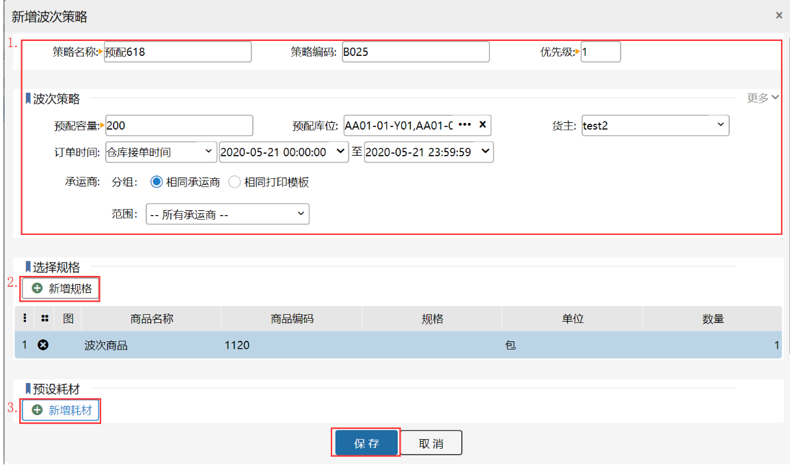

#### **02. 波次策略复制**

若要建一个和已存在的策略类似的波次策略，则可以使用复制功能，具体如下图所示：

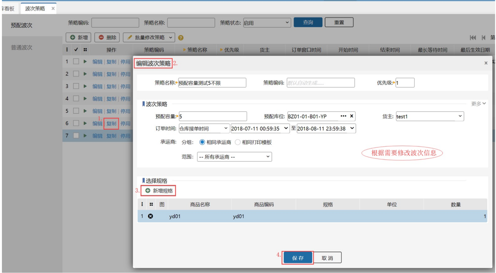

#### **03 策略停用、启用、删除**

波次策略有停用和启用，这个可以根据用户的需求进行操作：

1）停用的策略可以开启；

2）删除策略需要先勾选策略，策略删除后就不能恢复，需要重新新建。

具体操作步骤如下图：

#### **04.批量修改策略**

勾选多个波次可以进行批量修改，修改内容包括波次时间、波次容量、承运商、地区、截单下限，是否开启可用库存充足时生成、波次自动执行、波次策略状态。

1）地区可进行批量添加或覆盖，对地区不限无效

2）修改截单下限数量需开启截单下限开关，截单时间不为空

#### **05.波次项目了解**

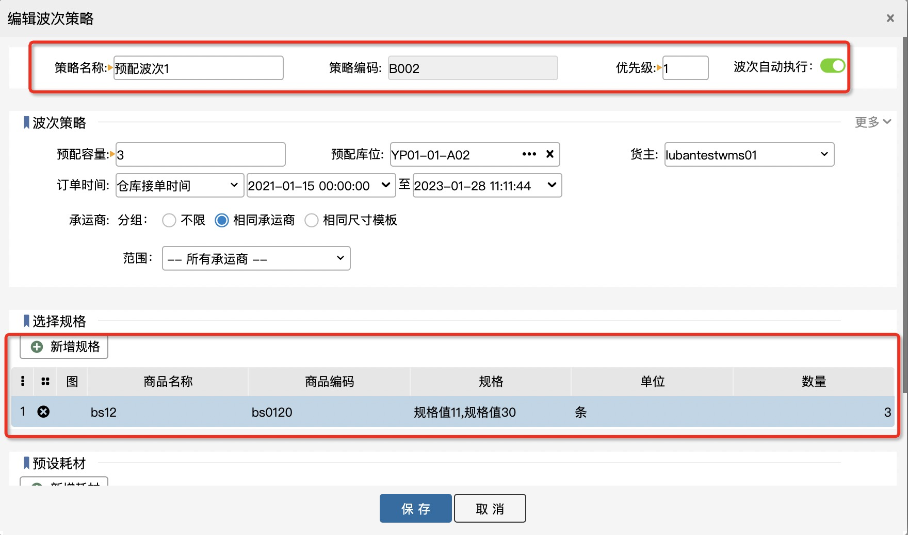

波次分为下面三个大块：策略概要、波次策略、选择商品。

##### a、策略概要

策略概要主要包括下面三点：

1.策略名称：表示波次策略的名称，必填；

2.策略编码：是该策略的身份标识，可以自己输入，也可自动生成，且在一个仓库内是唯一的；

3.优先级：表示该波次策略的优先级，只能为正数，且数字越大优先级越小，优先级可以重复；

##### b、波次策略

波次策略主要包括下面几点：

1.预配容量：表示一个波次最多有几个订单，必填；在没有开启截单下限时，若订单数量没到预配容量则订单不生成波次；

2. 预配库位：表示订单之后之后要拣货的库位，只能选择库位类型是“预配库位”的库位，且必填；

3.订单时间：时间类型包括仓库接单时间、客户下单时间、客户付款时间、订单审核时间、剩余发货时间；

1）若订单是符合这个时间段的，则会去查看是否能生成波次；

2）若订单不符合这个时间段，则订单会到零拣打单，不会生成波次；

4..承运商：订单只有满足所设置的承运商才会生成波次，否则会自动到零拣打单；

1）相同承运商：生成波次时，订单的承运商相同会生成同一个波次。例如：订单的其他条件都满足波次时，有5个订单的承运商为A，5个订单的承运商为B，则最后会生成两个波次，一个波次的承运商都为A，一个波次的承运商都为B；

2）相同打印模板：生成波次时，订单的承运商的打印模板是相同的会生成同一个波次。例如：订单的其他条件都满足波次时，有2个订单的承运商为A，3个订单的承运商为B，但它们的打印模板相同，则最后这5个订单只会生成1个波次；

3）指定承运商：生成波次时，订单的承运商要与这里指定的相同才会生成波次。例如：订单的其他条件都满足波次时且指定承运商A，有5个订单的承运商为A，5个订单的承运商为B，则最后会生成1个波次，一个波次的承运商都为A，承运商为B的订单会到零拣；

4）指定多个承运商+相同承运商：最终波次生成的时候，会根据承运商分组，一种承运商一个波次。

5）指定多个承运商+相同打印模板：最终波次生成的时候，会根据承运商分组，一种打印模板一个波次。

5.平台店铺：订单只要满足所设定的平台/店铺才会生成波次，否则会自动打到零拣，平台或店铺只能设置其中一种。

1）不限：不管订单来自哪个平台/店铺，可以生成波次；

2）仅含：只有属于这里设置平台/店铺的订单才能生成波次；

3）排除：只有不属于这里设置平台/店铺的订单才能生成波次；例如：波次策略排除店铺A，订单的其他条件都满足波次，5个来自店铺A，5个来自店铺B，只有来自店铺B的订单能生成波次，来自店铺A的订单打到零拣。

6.地区：订单只有满足所设定的地区才会生成波次，否则会自动打到零拣，这里的地区是指订单上的收货地址

1）不限：不管订单来自什么地区，可以生成波次；

2）仅含：只有属于这里设置地区的订单才能生成波次；

3）排除：只有不属于这里设置地区的订单才能生成波次；例如：波次策略排除地区新疆，订单的其他条件都满足波次，5个订单收货地址是新疆，5个订单收货地址是浙江，只有收货地址是浙江的订单能生成波次。

7.需要开票：订单只要满足所设定的开票信息才会生成波次，否则会自动打到零拣，这里的开票信息**针对普通发票或增值税发票，选择仅含或排除时可以多选这两种发票**，有电子发票的订单不算其中；

1）不限：不管订单是否有开票信息，都可以生成波次；例如：订单的其他条件都满足波次时，有5个订单的需开普通发票，5个订单不用开票，5个订单要开电子发票，则最后这3批订单都能生成波次；

2）仅含：订单有符合设置的开票信息的才会生成波次，没有的不会生成波次，有电子发票的也不会生成波次；例如：订单的其他条件都满足波次时，波次选择普通发票，有5个订单的需开普通发票，5个订单不用开票，5个订单要开电子发票，则最后要开普通发票的会生成1个波次，其余的都要零拣；

3）排除：订单是没有开票信息的或者只有开电子发票的才能生成波次，有开普通发票信息的不能生成波次；例如：订单的其他条件都满足波次时，波次选择普通发票，有5个订单的需开普通发票，5个订单不用开票，5个订单要开电子发票，则最后要开普通发票的订单到零拣，其余的都要生成波次；

8.包含备注：订单只有包含所设定的备注要求的才能生成波次，备注包含买家留言、线上备注和系统备注，最多可以设置20个，字数总数不能超过200字。包含备注这里包括两种形式：

1）或：or或者关系，订单填写的备注有这里添加的备注就能生成波次；例如： 订单的其他条件都满足波次时，设置备注A,B，则只要订单含备注A或含备注B就能生成波次

2）且：And关系，只要后面填写的备注都满足才能生成波次；例如：订单的其他条件都满足波次时，设置备注A,B，则只有含备注A且含备注B的订单，才会生成波次；

9.排除备注：订单只有不含所设定的备注要求的才能生成波次，备注包含买家留言、线上备注和系统备注，最多可以设置20个，字数总数不能超过200字。包含备注这里包括两种形式：

1）或：or或者关系，订单填写的备注有这里添加的备注就不会生成波次；例如： 订单的其他条件都满足波次时，设置备注A,B，则只要订单含备注A或含备注B就不能生成波次

2）且：And关系，只有订单填写的备注都不包含这里添加的备注才能生成波次；例如：订单的其他条件都满足波次时，设置备注A,B，则只有含备注A且含备注B的订单，不会生成波次；

10.更新订单重量：当订单生成波次后则会更新订单重量为设置的值；例如：订单的A满足预配波次，订单原始重量为3，波次有设置更新订单重量为4，则A生成波次是会自动更新订单重量为4，若波次策略没有设置这个重量，则订单生成波次后的重量仍然为3；

11.截单下限：开启后需要设置截单下限，且要设置截单时间，时间最多只能设置4个，则当波次轮循到达这个时间或刚超过这个时间执行生成波次这个动作，且生成波次的下限就是此处的截单下限，但若是满足波次的订单没有达到截单下限，则订单仍然不会生成波次。

12.最长等待时间：表示订单的最长等待时间；

1）订单进来首先会匹配优先级最高的波次策略，这个时间就是该订单在待分配等待的最长等待时间；

2）若超过最长等待时间订单还在待分配，则在下一次生成波次任务时

2.1）若此时该订单还有满足的波次策略，则订单会强行生成波次；

2.2）若此时该订单已没有满足的波次策略，则订单会自动打到零拣；

13.允许PDA领单                   

1）开启开关

①、选择扫描打单，波次其他条件符合的情况下，待打单的波次可以通过扫描打单领取到

②、选择料筐拣货，波次其他条件符合的情况下，待打单的波次可以通过料筐拣货领取到

2）关闭开关，不会被扫描打单/料筐拣货领取到

14.仅可用库存充足时生成：

①、开启后显示“降级时间”，默认9999分钟，时间范围：[0,99999]。填写降级时间后，订单落单后先匹配到预配波次，且在降级时间范围内，手动截单或自动生成波次因指定库位库存不足时，订单不会降级，仍匹配预配波次，但不会锁库，直至超出降级时间后，订单自动降级匹配普通波次，锁定到拣选库位。

②、开启后，全仓清单勾选预配波次时，若指定预配库位库存充足，则锁定到预配库位上，否则锁定到拣选库位上。

15.选择规格：订单的商品明细只有和此处设置的商品完全相同才会生成预配波次，且商品的个数也要完全相同。 

注意：支持添加生产批次商品，添加生产批次商品后须开启 仅可用库存充足时生成开关。

16.选择耗材：业务配置开启耗材管理，预配波次支持添加耗材，匹配到预配波次的订单使用耗材直接记录波次上添加的耗材。

17.发货单模板：生成波次时按照此配置订单分组去生成。（注：指定模板和非指定模板订单无法生成到同一波次内）

18.收货公司：生成波次时按照此配置订单分组去生成。选择不限收货公司：收货不限制，所有订单只要满足其他条件的都能生成波次；选择相同收货公司：订单的收货公司相同的会生成在同一个波次，不同收货公司的订单会生成在不同的波次中

> 更新: 2026-01-05 09:36:46  

> 原文: <https://hupun.yuque.com/unzko7/lsbfg0/gvrqcq1kd89vzzwd>

---

### 03.1.4 普通波次总览

> 原始文件来源：`00-源文件/操作手册/仓内策略/波次策略/普通波次/index.md`

波次配货是提高拣货作业效率的一种方法，它将不同的订单按照某种规则（相同仓库相同快递相同店铺相同商品，付款时间先后）合并为一个波次。

更通俗的讲，**波次计划就是对订单进行分类，然后快速拣货。**

普通波次与预配波次的区别在与普通波次是等订单到wms系统后再进行分类，生成某个或某些特征相同的一波再去统一配货打单等，而预配波次是订单在未推送到wms单商品就已经拣货打包好了，且每个包裹的商品都是相同的。

#### **01.新增普通波次策略**

具体新增波次策略的步骤如下：

#### **02. 波次策略复制**

若要建一个和已存在的策略类似的波次策略，则可以使用复制功能，具体如下图所示：

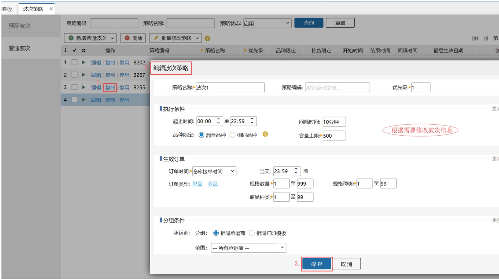

#### **03.策略停用、启用、删除**

波次策略有停用和启用，这个可以根据用户的需求进行操作：

1）停用的策略可以开启；

2）删除策略需要先勾选策略，策略删除后就不能恢复，需要重新新建。

具体操作步骤如下图：

#### **04.批量修改策略**

勾选多个波次可以进行批量修改，修改内容包括波次时间、波次容量、承运商、地区、截单下限，是否开启波次自动执行，波次策略状态。

1）地区可进行批量添加或覆盖，对地区不限无效

2）修改截单下限数量需开启截单下限开关，截单时间不为空

3）波次自动执行开启对A+N和一筐同品不支持，会忽略

#### **05.普通波次项目了解**

波次分为下面四个大块：策略概要、执行条件、生效订单、分组条件。

##### **（1）策略概要**

策略概要主要包括下面三点：

**1.策略名称：**表示波次策略的名称，必填；

**2.策略编码：**是该策略的身份标识，可以自己输入，也可自动生成，且在一个仓库内是唯一的；

**3.优先级：**表示该波次策略的优先级，只能为正数，且数字越大优先级越低，优先级可以重复；符合波次生效条件以及部分分组条件的订单会根据优先级从高到低匹配。

##### **（2）执行条件**

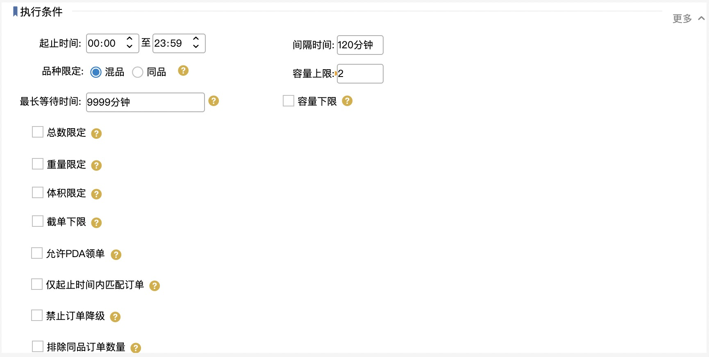执行条件表示是否要执行生成波次这个动作的条件，只有在满足下面设置的条件的下，才会去触发生成波次的动作。

具体的内容主要包括以下几点：

**1.起止时间：**

表示只有在这个时间段内才会有可能去触发波次的生成，订单进来后不在这个时间段内波次是不会执行的

1）若订单到了最长等待时间还没有在这个时间段内则会打到零拣；

2）若订单到了最长等待时间且已经在这个时间段内则会生成波次；

**2.间隔时间：**

表示波次每次波次生成的时间间隔，且目前设定每10分钟会跑一次波次，就一个波次策略来说连续两次跑波次的时间必须大于等于这里的间隔时间，时间间隔的时间必须为10的倍数；

如：若间隔时间设置20分钟，若该策略第一次生成波次的时间是06:10，那么下一次生成波次的时间就是06:30分（因为在06:20的时候距离第一次生成的时间06:10只有10分钟，间隔还没有20分钟，所以不生成，但是当06:30的时间距离前一次生成06:10已经大于等于20分钟，所以会生成）；

**3.最长等待时间：**

因该波次策略进入待分配的订单，如超过最长时间，若该订单还是有符合的波次策略则会强制生成波次；若该订单无符合的波次策略了则自动打到零拣；

如：该策略第一次生成波次的时间是06:10，波次最长时间为35分钟，订单A是06:08进入wms且满足该波次，则若到06:43分该订单因为其他原因还没有生成波次，①.订单A还是符合这个波次策略或者有其他的波次策略则在06:50分的时候该订单将强制被生成波次。②.订单A无符合的波次策略了则自动打到到零拣。

**4.品种限定：**表示该波次的种类；

1）混合品种：生成的波次中，一个波次中的每个订单的商品是可以不同的，即A订单有是商品a，B订单是商品b，若它们满足一个波次策略，则它们可以存在于一个波次中；

2）相同品种：生成的波次中，一个波次中的每个订单的商品必须是完全相同的，即A订单有是商品a，B订单是商品b，若它们满足一个波次策略，则它们不可能存在于一个波次中，将会生成两个波次，一个波次中的每个订单的商品全部都是a，另一个波次中的每个订单的商品将都是b；

**5.容量上限：**表示一个波次最多有几个订单，必填；在没有开启截单下限时，若订单数量没到容量上线则订单不生成波次；

**6.容量下限：**开启容量下限后，波次每次执行生成时，订单容量将会以此下限判断，但最高不高于容量上限。设置了总量限定/重量限定/体积限定的时候，必须设置容量下限。

:::color3
场景：由于仓库播种车等拣货设备限制，可视情况设置总数限定、重量限定、体积限定（7.1、7.2、7.3），避免拣货员负重过载或任务不饱和。另可限制单波次涉及的SKU种类数，如不超过10种（7.3），可降低拣货路径复杂度，减少跨区行走，尤其适合边拣边分模式。

:::

**7.1总数限定：**限定一个波次中需要拣货的商品总数量，即所有订单商品总数之和。

设置了总数限定，既要满足最终生成的一个波次内订单的商品总数之和不会超过总数限定，又要确保波次内订单数量符合波次容量下限数量。

如：波次A容量上限：40，容量下限：5，总数限定：100。待分配有100个订单归属波次A，每个订单中商品数量3。最终生成的波次：33个订单一个波次，最后剩下的1个订单等降级。

波次B容量上限：100，容量下限：40，总数限定：100。待分配有100个订单归属波次B，每个订单中商品数量3。最终生成的波次：40个订单一个波次，最后剩下的20个订单等降级。（当订单个数满足容量下限，但是超过总数限定时，一个波次订单个数为容量下限个数。）

**7.2规格种类限定：**同理，限制了一个波次中所有商品种类总数量的最大值。

**7.3重量限定：**同理，限制了一个波次中所有订单重量总和的最大值。

**7.4体积限定：**同理，限制了一个波次中所有订单体积总和的最大值。

**8.截单下限：**开启后需要设置截单下限，且要设置截单时间，时间最多只能设置4个，则当到达这个时间后会执行生成波次的动作，且生成波次的下限就是此处的截单下限，但若是满足波次的订单没有达到截单下限，则订单仍然不会生成波次

****

**9.允许PDA领单**

开启开关

①、选择扫描打单，波次其他条件符合的情况下，待打单的波次可以通过扫描打单领取到

②、选择料筐拣货，波次其他条件符合的情况下，待打单的波次可以通过料筐拣货领取到

关闭开关，不会被扫描打单/料筐拣货领取到

****

**10.仅起止时间内匹配订单：**

开启后，起止时间外，订单将不会匹配到该波次策略，并且该策略中超过截止时间还未生产波次的订单将会被降级。

:::color3
场景：一般用于仓库下班时间设置的波次，由于下班时间不作业，波次池中累计推送的订单较多。次日早上上班的时候可生成此类容量大，凝练度更高的波次。此方式同样适用于春节长假，法定节假日休息之类场景。

:::

例如18:00下班，早上9:00上班，波次设置的起止时间是18:00-9:30，优先级为1（一般都设为最高一档）

①、上班期间17:59和9:31推过来的订单不会匹配到该波次，等于本波次策略不生效

②、下班期间18:00-9:30推过来的订单可以匹配到该波次，如晚上不打算生成波次，可以把间隔时间调整到希望的时间。或者干脆添加截单时间是早上上班前开始，如8.50之类。

③、上班9:00时，已有大批量准备好的波次可进行处理。9:00-9:30推送的订单，因为还在打单，依然还可以生成。

④、9:30后第一波工作处理结束，希望低优先级的波次生效，如归属在本波次的订单，会降级重新匹配到其他波次，完成低容量下限的波次执行，至此本波次策略的职能已结束

特殊情况：若波次设置了截单时间9:32，订单是9:29推过来的，若下次跑的时间是9:31,则该订单降级后再生成接单波次，若下次跑的时间是9:33，则订单不会降级，生成截单波次。请设置截单时间为10分钟的整数倍最佳

****

**12.禁止订单降级：**

勾选了禁止订单降级，符合该波次的订单在波次执行了两次之后且依旧不满足容量下限这个生成条件时，不会降级，依旧根据这个波次的执行条件和时间生成。

****

**13.排除同品订单数量：**

开启后超过指定数量的同品订单不会被生成此波次，例：设置排除同品订单数量为10，待分配有12个订单同时符合该混品波次和同品波次，另有10个订单只符合该混品波次，截单生成波次后，只有符合该混品波次的10个订单生成到混品波次中，另12个订单不生成波次，也不会去锁库；若设置设置排除同品订单数量为13，则待分配22个订单都会生成到该混品波次中。（注：仅混品、自由波次显示此项，预配、一筐同品、A+N波次不显示此项）

##### （3）生效订单

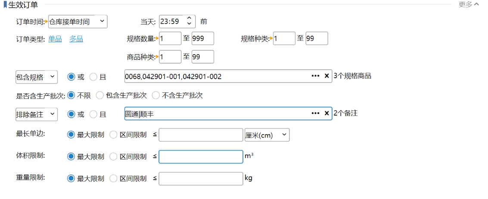

生效订单是以订单的角度去判断是否符合波次策略。

主要包括记以下几点：

**1. 订单时间：**时间类型包括仓库接单时间、客户下单时间、客户付款时间、订单审核时间、剩余发货时间；

1）若订单是符合这个时间段的，则会去查看是否能生成波次；

2）若订单不符合这个时间段，则订单会到零拣，不会生成波次；

**2.订单类型：**只用于快速生成商品数量和商品种类的值；

1）单品：规格数量为1至1个，规格种类为1至1个，商品种类为1至1个；

2）多品：规格数量为2至999个，规格种类为1至99个，商品种类为1至99个；

****

**3.规格数量：**表示一个订单中的sku的数量，只有满足这里设定的数量值的订单才会满足该波次策略且之后可以生成波次；

**4.规格种类：**表示一个订单中的sku的种类，只有满足这里设定的种类数的订单才会满足该波次策略且之后可以生成波次；

**5.商品种类：**表示一个订单中的SPU的数量，只有满足这里设定的数量值的订单才会满足该波次策略且之后可以生成波次；

**6.包含规格：**只有订单包含这里设置的规格才会生成波次，包含规格这里包括两种形式：

1）且：只有订单包含这里选择的所有规格商品就能生成波次；

2）或：只要订单中的规格商品包含这里选择的商品的某一个或某几个就能生成波次；

**7.排除规格：**只要订单包含这里设置的规格就不会生成波次，排除规格这里包含两种形式：

1）且：只有订单包含这里选择的所有规格商品就不会匹配到该波次且也不会生成波次；

2）或：只要订单中的商品包含这里选择的规格商品的某一个或某几个就不会匹配到该波次且也不会生成波次；

**8.是否包含生产批次：**限制订单是否包含生产批次商品；（**PS：生产批次标准模式下生效订单无此限制**）

①、不限：订单包含生产批次商品和普通商品都能正常匹配波次；

②、包含生产批次：只有订单包含生产批次商品才会满足该波次策略；

③、不含生产批次：只有订单不包含生产批次商品才会满足该波次策略。

**9.包含备注：**订单只有包含所设定的备注要求的才能生成波次，备注包含买家留言、线上备注和系统备注，最多可以设置20个，字数总数不能超过200字。包含备注这里包括两种形式：

1）或：or或者关系，订单填写的备注有这里添加的备注就能生成波次；例如： 订单的其他条件都满足波次时，设置备注A,B，则只要订单含备注A**或**含备注B就能生成波次

2）且：And关系，只要后面填写的备注都满足才能生成波次；例如：订单的其他条件都满足波次时，设置备注A,B，则只有含备注A**且**含备注B的订单，**才会生成波次**；

**10.排除备注：**订单只有不含所设定的备注要求的才能生成波次，备注包含买家留言、线上备注和系统备注，最多可以设置20个，字数总数不能超过200字。包含备注这里包括两种形式：

1）或：or或者关系，订单填写的备注有这里添加的备注就**不会生成波次**；例如： 订单的其他条件都满足波次时，设置备注A,B，则只要订单含备注A**或**含备注B就**不能生成波次**

2）且：And关系，只有订单填写的备注都不包含这里添加的备注才能生成波次；例如：订单的其他条件都满足波次时，设置备注A,B，则只有含备注A**且**含备注B的订单，**不会生成波次**；

**11.最长单边：**

即是长宽高里最长的一边，订单中边长最长的商品只有满足设定的最长单边才会生成波次，否则自动打到零拣

①、普通限制：一个订单中边长最长的商品小于等于设置的值才会满足该波次策略；

②、区间限制：一个订单中边长最长的商品大于设置的最长单边值下限且小于等于设置的最长单边值上限才会满足该波次策略；区间是左开右闭的；上限可不填写，不填为无限大

例如设置了区间0.1-0.5dm，0.4-0.8dm，2-3dm，页面显示合并后的区间0.1-0.8dm和2-3dm；订单有a、b、c三个商品最长单边分别是20.01cm、2.1dm、0.31m，由于最长单边是0.31m=3.1dm不满足该波次策略；订单有a、b、c三个商品最长单边分别是20.01cm、2.1dm、0.9dm，由于最长单边是2.1dm满足该波次策略；

**12.体积限制：**订单只有满足设定的体积才会生成波次，否则自动打到零拣

①、普通限制：一个订单的所有商品体积相加小于等于设置的体积値才会满足该波次策略；

②、区间限制：一个订单的所有商品体积相加大于设置的体积下限且小于等于设置的体积上限才会满足该波次策略；区间是左开右闭的；上限可不填写，不填为无限大

例如设置了区间1-10m³,10-20m³，页面显示合并后的区间1-20m³；订单的体积是1m³，不满足该波次策略；订单的体积是10m³，满足该波次策略；订单的体积是20m³，满足该波次策略；订单的体积是21m³，不满足该波次策略

**13.重量限制：**订单只有满足设定的重量才会生成波次，否则自动打到零拣

①、普通限制：一个订单的重量小于等于此处设置的重量值才会满足该波次策略

②、区间限制：一个订单的所有商品重量相加大于设置的重量下限且小于等于设置的重量上限才会满足该波次策略，区间是左开右闭的；上限可不填写，不填为无限大

例如设置了区间1-10kg,10-20kg，页面显示合并后的区间1-20kg；订单的重量是1kg，不满足该波次策略；订单的重量是10kg，满足该波次策略；订单的重量是20kg，满足该波次策略；订单的重量是21kg，不满足该波次策略 

   

**14.仅生成整箱的订单：**此项与业务配置-其他配置-商品多单位管理开关关联，若开启商品多单位管理，则显示此配置，否则不显示。勾选此配置项，当订单锁定库存是整货箱无拆零或者换算成推荐单位无拆零时，才能生成该波次，否则无法生成该波次。                

##### **（4）分组条件**

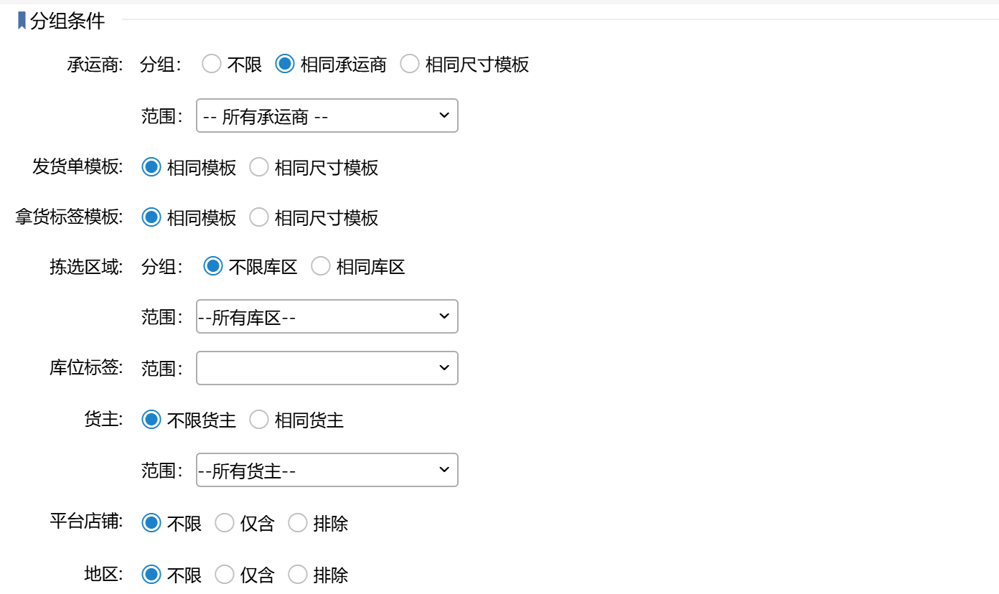

分组条件主要包括以下几点：

**1. 承运商：**订单只有满足所设置的承运商才会生成波次，否则会自动到零拣打单；

1）相同承运商：生成波次时，订单的承运商相同会生成同一个波次。例如：订单的其他条件都满足波次时，有5个订单的承运商为A，5个订单的承运商为B，则最后会生成两个波次，一个波次的承运商都为A，一个波次的承运商都为B；

2）相同打印模板：生成波次时，订单的承运商的打印模板是相同的会生成同一个波次。例如：订单的其他条件都满足波次时，有2个订单的承运商为A，3个订单的承运商为B，但它们的打印模板相同，则最后这5个订单只会生成1个波次；

3）指定承运商：生成波次时，订单的承运商要与这里指定的相同才会生成波次。例如：订单的其他条件都满足波次时且指定承运商A，有5个订单的承运商为A，5个订单的承运商为B，则最后会生成1个波次，一个波次的承运商都为A，承运商为B的订单会到零拣；ps：最新版本的波次策略是支持选择多个承运商的。

4）指定多个承运商+相同承运商：最终波次生成的时候，会根据承运商分组，一种承运商一个波次。

5）指定多个承运商+相同打印模板：最终波次生成的时候，会根据打印模板分组，一种打印模板一个波次。

****

**2.发货单模板：**生成波次时按照此配置订单分组去生成。（注：指定模板和非指定模板订单无法生成到同一波次内)

****

**3.拿货标签模板：**生成波次时按照此配置订单分组去生成。（注：指定模板和非指定模板订单无法生成到同一波次内)

****

**4.拣选区域：**订单的锁定区域只有满足所设置的拣选区域才会生成波次，否则会自动到零拣打单；

1）不限库区：生成波次时，对订单锁定范围无限制，都能正常生成波次；例如：订单的其他条件都满足波次时，订单锁定范围有跨区域拣选、库区A、库区B、跨库区A、B，这波订单都能生成同一个波次；

2）相同库区：生成波次时，订单的锁定库区是相同的会生成同一个波次。例如：订单的其他条件都满足波次时，有2个订单的锁在库区A，3个订单锁在库区B，则最后会生成2个波次，一个波次的拣选范围都是库区A、一个波次的拣选范围都是库区B；

3）指定库区：生成波次时，订单的拣选区域要与这里指定的相同才会生成波次。例如：区域A下有a1、a2两个库区，订单的其他条件都满足波次时且指定区域A，有5个订单的锁定库区为a1，5个订单的锁定库区为a2，5个订单锁定库区a1、a2，则最后会生成1个波次，波次的拣选范围为跨库区a1、a2，锁定区域B的订单会到零拣；

4）指定多个库区+不限库区：最终波次生成的时候，锁在指定库区的订单生成1个波次；

5）指定多个库区+相同库区：最终波次生成的时候，会根据库区分组，一个库区一个波次，锁定失败一个波次，跨库区一个波次；

**5.库位标签：**订单锁定的每个库位上的库位标签都与此处指定范围有交集的，才会生成到该波次中，否则不生成。

**6.货主：**在指定范围内的货主订单才能生成该波次，否则不会生成。选择“不限货主”，则所有范围内的货主订单生成同一个波次中；选择“相同货主”，则按货主分组生成不同波次，每个货主生成一个波次。（仅多货主公司有此项）

**7.平台店铺：**订单只要满足所设定的平台/店铺才会生成波次，否则会自动打到零拣，平台或店铺只能设置其中一种。

1）不限：不管订单来自哪个平台/店铺，可以生成波次；

2）仅含：只有属于这里设置平台/店铺的订单才能生成波次；

3）排除：只有不属于这里设置平台/店铺的订单才能生成波次；例如：波次策略排除店铺A，订单的其他条件都满足波次，5个来自店铺A，5个来自店铺B，只有来自店铺B的订单能生成波次，来自店铺A的订单打到零拣。

****

**8.地区：**订单只有满足所设定的地区才会生成波次，否则会自动打到零拣，这里的地区是指订单上的收货地址，支持手动勾选和导入两种方式。

1）不限：不管订单来自什么地区，可以生成波次；

2）仅含：只有属于这里设置地区的订单才能生成波次；

3）排除：只有不属于这里设置地区的订单才能生成波次；例如：波次策略排除地区新疆，订单的其他条件都满足波次，5个订单收货地址是新疆，5个订单收货地址是浙江，只有收货地址是浙江的订单能生成波次。

****

**9.需要开票**：订单只要满足所设定的开票信息才会生成波次，否则会自动打到零拣，这里的开票信息针对普通发票、增值税发票或电子发票，选择仅含或排除时可以多选这三种发票

1）不限：不管订单是否有开票信息，都可以生成波次；例如：订单的其他条件都满足波次时，有5个订单的需开普通发票，5个订单不用开票，5个订单要开电子发票，则最后这3批订单都能生成波次；

2）仅含：订单有开票信息的才会生成波次，没有的不会生成波次，例如：订单的其他条件都满足波次时，波次选择普通发票，有5个订单的需开普通发票，5个订单不用开票，5个订单要开电子发票，则最后要开普通发票的会生成1个波次，其余的都要零拣；

3）排除：订单是没有开票信息的才能生成波次，有开普通发票信息的不能生成波次；例如：订单的其他条件都满足波次时，波次选择普通发票，有5个订单的需开普通发票，5个订单不用开票，5个订单要开电子发票，则最后要开普通发票的订单到零拣，其余的都要生成波次；

****

**10.订单标记：**标记订单只有满足所设定的标记限制的才会生成波次，否则自动打到零拣

①、不限：标记订单、普通订单都可以生成波次；例如订单的其他条件都满足波次时，2个加急订单、2个天猫直送订单、2个货到付款订单、2个普通订单，这8个订单都可以生成波次

②、包含：or或者关系，订单只要含有标记都可以生成波次；例如订单的其他条件都满足波次时，设置了包含加急标记订单、天猫直送订单，则只要订单含有“急”或“直”标记，都可以生成波次

③、排除：or或者关系，订单不含有标记才会生成波次；例如订单的其他条件都满足波次时，设置了包含加急标记订单、天猫直送订单，只要订单含有“急”或“直”标记，则就不满足波次

****

**11.订单品牌：**订单的品牌只有满足所设定的品牌限制的才会生成波次，否则自动打到零拣；

1）不限制品牌：订单品牌不限制，所有订单只要满足其他条件的都能生成波次；

2）品牌完全相同：订单的品牌完全相同的会生成在同一个波次，不同品牌的订单会生成在不同的波次中；如：A/B/C/D/E/F共6个订单，它们的品牌分别为a/b/空/a/b/杂牌，那么最后生成的波次情况为：A/C在一个波次(品牌为a)，B/D在一个波次(品牌为b)，C/F在一个波次(品牌为空)；

3）指定品牌：只有订单满足指定的品牌，那么该订单才能生成波次，否则自动打到零拣，此处的品牌可以指定多个；如：策略指定品牌为a，有A/B/C共3个订单，它们的品牌分别为a/b/空，那么最后生成的波次情况为：A生成波次(品牌为a)，B/D自动到零拣打单页面；

4）品牌为空：该选项表示只要订单的品牌显示为空（空包含没有品牌和杂牌两种情况），那么这个订单就符合波次，否则不符合波次，会自动打到零拣。

**12.耗材：**订单的耗材只有满足所设定的耗材限制的才会生成波次，否则自动打到零拣；

1）不限：订单耗材不限制，所有订单只要满足其他条件的都能生成波次；

2）相同耗材：订单的耗材完全相同的会生成在同一个波次，不同耗材的订单会生成在不同的波次中；

3）包含：订单的耗材包含指定耗材就能生成波次。

**13.收货公司：**生成波次时按照此配置订单分组去生成。选择不限收货公司：收货公司有没有都可以，所有订单只要满足其他条件的都能生成波次；选择相同收货公司：订单的收货公司相同的会生成在同一个波次，不同收货公司的订单会生成在不同的波次中，没有收货公司的算作一组。

14.系统备注：生成波次时按照此配置订单分组去生成。选择不限系统备注：系统备注有没有都可以，所有订单只要满足其他条件的都能生成波次；选择相同系统备注：订单的系统备注相同的会生成在同一个波次，不同系统备注的订单会生成在不同的波次中，没有系统备注的算作一组。

> 更新: 2026-08-19 16:02:46  

> 原文: <https://hupun.yuque.com/unzko7/lsbfg0/ovb4zd1mh7lfhbeu>

---

## 03.2. 仓内作业与绩效策略

### 03.2.0 绩效策略总览

> 原始文件来源：`00-源文件/操作手册/仓内策略/绩效策略/index.md`

绩效策略是用户可以根据自己的需求来设定积分计算规则，可细分到不同模块、不同环节、不同货主、不同操作员等条件。

绩效策略分类两类：普通绩效策略和例外累加规则。

具体页面如下：

提示

基础绩效策略有优先级，最多只能匹配一个，优先级1最大，往后依次递减。同优先级时按策略编码从小到大匹配。

2.例外累加规则无优先级，支持匹配多个，有多个匹配时累加，并与基础绩效策略合计。详细的绩效策略介绍，请看【[基础绩效策略](https://hupun.yuque.com/unzko7/lsbfg0/dx7fs2lnqq24mnz1)】及【[例外累加规则](https://hupun.yuque.com/unzko7/lsbfg0/tf8nvibl37hxc42g)】

> 更新: 2023-12-18 17:25:50  

> 原文: <https://hupun.yuque.com/unzko7/lsbfg0/dcsnv5l389r9yhrv>

---

### 03.2.1 例外累加规则

> 原始文件来源：`00-源文件/操作手册/仓内策略/绩效策略/例外累加规则.md`

#### **01.新增例外累加规则**

具体步骤如下：

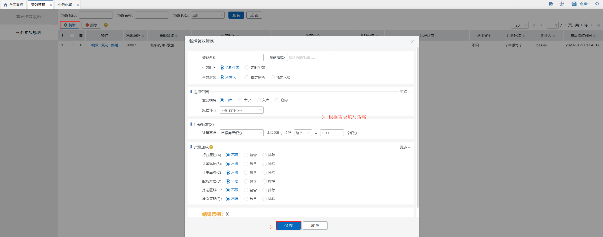

#### **02.绩效策略复制**

若要建一个和已存在的策略类似的绩效策略，则可以使用复制功能，具体如下图所示：

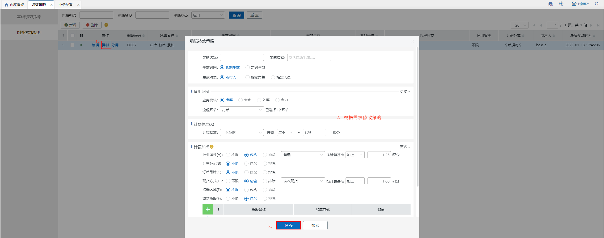

#### **03.策略停用、启用、删除**

绩效策略有停用和启用，这个可以根据用户的需求进行操作：

1）停用的策略可以开启；

2）删除策略需要先勾选策略，策略删除后就不能恢复，需要重新新建。

具体操作步骤如下图：

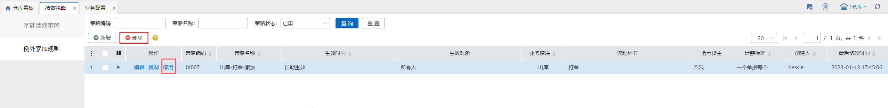

#### **04.绩效策略设置规则了解**

策略分为下面四个大块：策略概要、适用范围、计薪标准、计薪加成。

##### **一、策略概要**

策略概要主要包括：

1.策略名称：表示绩效策略的名称，必填，不允许重复；

2.策略编码：是该策略的身份标识，可以自己输入，也可自动生成，不允许重复；

3.生效时间：默认长期生效，可设置为指定日期、每日定时，业务操作时间在指定时间范围内才会匹配到该策略。

4.生效对象：默认为所有人，可指定角色、指定人员，在指定范围内的可以匹配，否则无法匹配。

##### **二、适用范围**

适用范围主要包括：

1、业务模块：包括出库、大宗、入库、仓内四种，默认出库，单选。符合指定业务模块的能匹配该策略。

2、流程环节：关联业务模块，默认全选，可勾选部分，只对勾选环节的操作匹配生效。符合指定流程环节的能匹配该策略。(注：出库环节不关联业务配置主流程)

3、适用货主：默认不限，可指定包含范围或排除范围。在指定货主范围内或排除范围外的能匹配该策略。(注：此项对仓内-补货、移库、装箱、转移、预包任务环节不生效)

4、行业属性：默认不限，可指定包含范围或排除范围。单据明细包含指定行业属性或排除范围外的能匹配到该策略。订单维度的，按订单明细的行业属性匹配；拣货任务维度的，按任务明细的行业属性匹配(注：此项关联行业配置开关)

5、订单标记：默认不限，可指定包含范围或排除范围。在指定订单标记范围内或排除范围外的能匹配该策略。订单维度的，按订单上标记匹配，拣货任务维度的，按任务明细反算所属单据，再按订单标记匹配。(注：此项对入库、仓内模块不生效)

6、订单品牌：默认不限，可指定包含范围或排除范围。在指定订单品牌范围内或排除范围外的能匹配该策略。订单维度的，按订单明细品牌匹配；拣货任务维度的，按本次操作维度品牌匹配。(注：此项对入库、仓内模块不生效)

7、配货方式：默认不限，可指定包含范围或排除范围。出库模块对应零拣配货、波次配货，大宗模块对应大宗件。(注：此项对入库、仓内模块不生效)

8、拣选区域：默认不限，可指定包含范围或排除范围。在指定拣选区域内或排除范围外的能匹配该策略。订单维度的，按单据拣选库区/来源库区匹配；拣货任务维度的，按拣货任务上的拣选库区/来源库区匹配。(注：此项对入库模块、仓内模块-装箱、预包任务不生效)

9、波次策略：默认不限，可指定包含范围或排除范围。按波次订单归属波次策略匹配。(注：此项对大宗、入库、仓内模块不生效)

##### **三、计薪标准(X)**

匹配到此策略的单据，按设置规则计算积分，各模块对应的计算基准略有不同，具体含义可参考【[WMS-基础绩效策略](https://hupun.kf5.com/hc/kb/article/1590549/)】。

##### **四、计薪加成**

计薪加成是在计薪标准计算基础上的附加数据，若单据符合某一项或多项设置，则按配置计算该项加成，若不符合，则跳至下一项，有多项符合时累加计算。

1.行业属性(A)：默认不限，可指定包含范围或排除范围。单据明细包含指定行业属性或排除范围外的符合该条件，可根据设置计算积分。

选择“不限”时，不计算加成，结果示例如上图。

选择“包含”时，单据明细包含其中一项即可按计算基准计算加成，结果示例如上图。

选择“排除”时，单据明细需排除所有勾选项可按计算基准计算加成，结果示例如上图。

  2.订单标记(B)：默认不限，可指定包含范围或排除范围。在指定订单标记范围内或排除范围外的符合该条件，可根据设置计算积分。

选择“包含”时，订单标记包含其中一项即可按计算基准计算加成，结果示例如上图。

选择“排除”时，订单标记需排除所有勾选项可按计算基准计算加成，结果示例如上图。

  3.订单品牌(C)：默认不限，可指定包含范围或排除范围。在指定订单品牌范围内或排除范围外的符合该条件，可根据设置计算积分。计算方式同上述一致。

  4.配货方式(D)：默认不限，可指定包含范围或排除范围。出库模块对应零拣配货、波次配货，大宗模块对应大宗件。计算方式同上述一致。

  5.拣选区域(E)：默认不限，可指定包含范围或排除范围。在指定拣选区域内或排除范围外的符合该条件，可根据设置计算积分。计算方式同上述一致。

  6.波次策略(F)：默认不限，可指定包含范围或排除范围。按波次订单归属波次策略匹配的符合该条件，可根据设置计算积分。计算方式同上述一致。

> 更新: 2023-12-18 17:38:08  

> 原文: <https://hupun.yuque.com/unzko7/lsbfg0/tf8nvibl37hxc42g>

---

### 03.2.2 基础绩效策略

> 原始文件来源：`00-源文件/操作手册/仓内策略/绩效策略/基础绩效策略.md`

#### 01.新增基础绩效策略

具体步骤如下：

#### 02.绩效策略复制

若要建一个和已存在的策略类似的绩效策略，则可以使用复制功能，具体如下图所示：

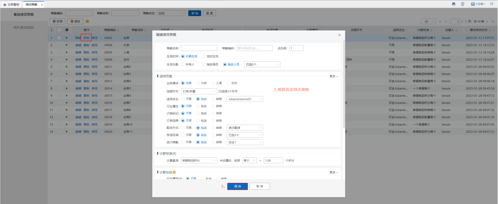

#### 03.策略停用、启用、删除

绩效策略有停用和启用，这个可以根据用户的需求进行操作：

1）停用的策略可以开启；

2）删除策略需要先勾选策略，策略删除后就不能恢复，需要重新新建。

具体操作步骤如下图：

#### 04.绩效策略设置规则了解

策略分为下面四个大块：策略概要、适用范围、计薪标准、计薪加成。

##### 一、策略概要

策略概要主要包括：

1.策略名称：表示绩效策略的名称，必填，不允许重复；

2.策略编码：是该策略的身份标识，可以自己输入，也可自动生成，不允许重复；

3.生效时间：默认长期生效，可设置为指定日期、每日定时，业务操作时间在指定时间范围内才会匹配到该策略。

4.生效对象：默认为所有人，可指定角色、指定人员，在指定范围内的可以匹配，否则无法匹配。

##### 二、适用范围

适用范围主要包括：

1、业务模块：包括出库、大宗、入库、仓内四种，默认出库，单选。符合指定业务模块的能匹配该策略。

2、流程环节：关联业务模块，默认全选，可勾选部分，只对勾选环节的操作匹配生效。符合指定流程环节的能匹配该策略。(注：出库环节不关联业务配置主流程)

3、适用货主：默认不限，可指定包含范围或排除范围。在指定货主范围内或排除范围外的能匹配该策略。(注：此项对仓内-补货、移库、装箱、转移、预包任务环节不生效)

4、行业属性：默认不限，可指定包含范围或排除范围。单据明细包含指定行业属性或排除范围外的能匹配到该策略。订单维度的，按订单明细的行业属性匹配；拣货任务维度的，按任务明细的行业属性匹配(注：此项关联行业配置开关)

5、订单标记：默认不限，可指定包含范围或排除范围。在指定订单标记范围内或排除范围外的能匹配该策略。订单维度的，按订单上标记匹配，拣货任务维度的，按任务明细反算所属单据，再按订单标记匹配。(注：此项对入库、仓内模块不生效)

6、订单品牌：默认不限，可指定包含范围或排除范围。在指定订单品牌范围内或排除范围外的能匹配该策略。订单维度的，按订单明细品牌匹配；拣货任务维度的，按本次操作维度品牌匹配。(注：此项对入库、仓内模块不生效)

7、配货方式：默认不限，可指定包含范围或排除范围。出库模块对应零拣配货、波次配货，大宗模块对应大宗件。(注：此项对入库、仓内模块不生效)

8、拣选区域：默认不限，可指定包含范围或排除范围。在指定拣选区域内或排除范围外的能匹配该策略。订单维度的，按单据拣选库区/来源库区匹配；拣货任务维度的，按拣货任务上的拣选库区/来源库区匹配。(注：此项对入库模块、仓内模块-装箱、预包任务不生效)

9、波次策略：默认不限，可指定包含范围或排除范围。按波次订单归属波次策略匹配。(注：此项对大宗、入库、仓内模块不生效)

##### 三、计薪标准(X)

匹配到此策略的单据，按设置规则计算积分，各模块对应的计算基准略有不同，通用基准具体含义可参考【[WMS-业务配置-其他配置-绩效配置](https://hupun.yuque.com/unzko7/lsbfg0/caki7lz4105n2vpg)】

个性基准具体含义如下：

###### 1、出库模块

###### 1.1验货

###### 1.1.1验货以“提交商品种类数”替代计算（前提：选择单据种类数/单据商品种类积分）

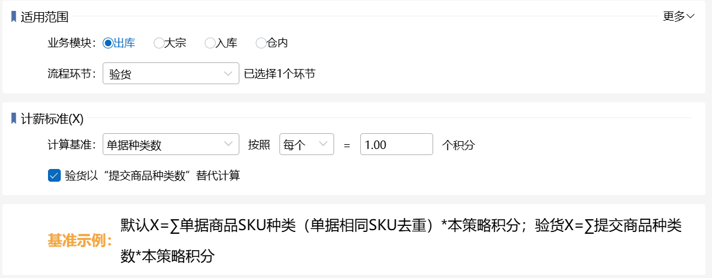

计算基准选择【单据种类数】

含义：验货环节的操作使用“提交商品种类数”代替计算基准“单据种类数”进行积分计算，有按每个/按阶梯两种算法，<u>即：单次提交多笔单据验货时，把本次提交的所有单据视作整体进行SKU去重后进行积分计算</u>

**例1**：仓库1开启积分绩效，设置出库模块——单据种类数按照：每个=[2]个积分，勾选验货以“提交商品种类数”替代计算。

         仓库1下有波次A，波次内包含订单1和订单2，订单1包含sku1 2个、sku2 3个，订单2包含sku2 2个、sku3 6个。

         播种验货，提交波次A

         验货环节结算积分结果：3*2=6[即：验货提交商品种类数*默认积分]

         验货环节，作业商品种类数=2+2=4，提交商品种类数=3

**例2**：仓库1开启积分绩效，设置出库模块——单据种类数按照：阶梯 ，勾选验货以“提交商品种类数”替代计算。

         种类区间：0种-2种，首种类：1种，积分：2个，续种类：1个，续积分：1个；

         种类区间：2种-无穷多种，首种类：3种，积分：3个，续种类：1种，续积分：2个； 

         仓库1下有波次A，波次内包含订单1和订单2，订单1包含sku1 2个、sku2 3个，订单2包含sku2 2个、sku3 6个 sku4 5个

         提交波次A

         验货环节计算积分结果：3+2=5   [即：波次A种类数4种，落到第二区间，首种类3个，积分3个，续种类1种，续积分2个]

计算基准选择【单据种类数积分】

同样按照单据种类数替代计算的逻辑，不同的是，按照单据种类数*商品配置的验货环节积分（未配置时取策略上的默认积分）

**例1**：仓库1开启积分绩效，设置出库模块——单据商品种类积分未设置时，按照每种=[2]个积分，勾选验货以“提交商品种类数”替代计算。

         仓库1下有波次A，波次内包含订单1和订单2，订单1包含sku1 2个、sku2 3个，订单2包含sku2 2个、sku3 6个。（sku1配置验货绩效积分=3；sku2配置验货绩效积分=4；sku3没配置）

         播种验货，提交波次A

         验货环节结算积分结果：3+4+2=9

###### 1.2拣货

###### 1.2.1拣货为箱时【以"箱内商品"替代/不计算】积分，为拆零时【不计算/按策略计算】积分（前提：选择单据商品数量积分）

下拉项可自定选择配置，但是不能同时选择“不计算”

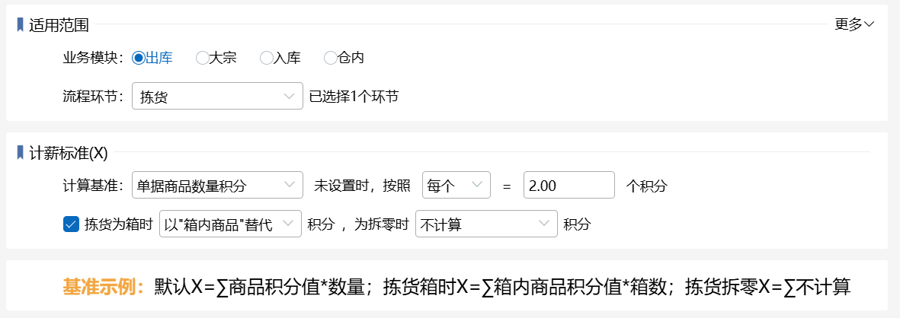

（1）**拣货为箱时【以"箱内商品"替代】积分，为拆零时【不计算】积分**

含义：拣货时，订单内锁定箱库存的明细，以箱内商品数量进行积分计算，拆零库存则不计算积分

例1：仓库1开启积分绩效，设置出库模块——单据商品数积分未设置时，按照每个=[2]个积分。

订单内包含：商品A*13（锁定箱A（一箱=4件）*3，拆零库存*1）、商品B*5

拣货环节结算积分结果：4*3*2=24

（2）**拣货为箱时【以"箱内商品"替代】积分，为拆零时【按策略计算】积分**

含义：拣货时，订单内锁定箱库存的明细，以箱内商品数量进行积分计算，拆零按照策略中计算基准计算积分

例1：仓库1开启积分绩效，设置出库模块——单据商品数积分未设置时，按照每个=[2]个积分。

订单内包含：商品A*13（锁定箱A（一箱=4件）*3，拆零库存*1）、商品B*5

拣货环节结算积分结果：4*3*2+1*2+5*2=36

（3）**拣货为箱时【不计算】积分，为拆零时【按策略计算】积分**

含义：拣货时，订单内锁定箱库存的明细，锁定箱库存的明细不计算积分，，拆零库存则按照策略中计算基准计算积分

例1：仓库1开启积分绩效，设置出库模块——单据商品数积分未设置时，按照每个=[2]个积分。

订单内包含：商品A*13（锁定箱A（一箱=4件）*3，拆零库存*1）、商品B*5

拣货环节结算积分结果：1*2+5*2=12

###### 1.2.2拣货为箱时【以"箱内商品"替代/以“拣货种类库位数”替代/不计算】积分，为拆零时【以“拣货种类库位数”替代/不计算/按策略计算】积分（前提：选择单据商品种类积分）

下拉项可自定选择配置，但是不能同时选择“不计算”

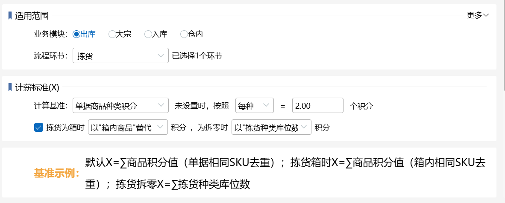

（1）**拣货为箱时【以"箱内商品"替代】积分，为拆零时【不计算】积分**

含义：拣货时，订单内锁定箱库存的明细，以箱内商品种类（箱内相同SKU去重）进行积分计算，拆零库存则不计算积分

例1：仓库1开启积分绩效，设置出库模块——单据商品数积分未设置时，按照每个=[2]个积分。

订单内包含：商品A*13（锁定箱A（一箱=4件）*3，拆零库存*1）、商品B*5

拣货环节结算积分结果：1*2=2

（2）**拣货为箱时【以"箱内商品"替代】积分，为拆零时【按策略计算】积分**

含义：拣货时，订单内锁定箱库存的明细，以箱内商品种类（箱内相同SKU去重）进行积分计算，拆零按照策略中计算基准计算积分

例1：仓库1开启积分绩效，设置出库模块——单据商品数积分未设置时，按照每个=[2]个积分。

订单内包含：商品A*13（锁定箱A（一箱=4件）*3，拆零库存*1）、商品B*5

拣货环节结算积分结果：1*2+1*2+1*2=6

（3）**拣货为箱时【以"箱内商品"替代】积分，为拆零时【以"拣货种类库位数"替代】积分**

含义：拣货时，订单内锁定箱库存的明细，以箱内商品种类（箱内相同SKU去重）进行积分计算，拆零按照sku+库位维度去重计算积分

例1：仓库1开启积分绩效，设置出库模块——单据商品数积分未设置时，按照每个=[2]个积分。

订单内包含：商品A*13（锁定箱A（一箱=4件）*3，拆零库存*1（A库位*1））、商品B*5（A库位*2、B库位*3）

拣货环节结算积分结果：1*2+1*2+1*2+1*2=8

（4）**拣货为箱时【不计算】积分，为拆零时【按策略计算】积分**

含义：拣货时，订单内锁定箱库存的明细，锁定箱库存的明细不计算积分，拆零库存则按照策略中计算基准计算积分

例1：仓库1开启积分绩效，设置出库模块——单据商品数积分未设置时，按照每个=[2]个积分。

订单内包含：商品A*13（锁定箱A（一箱=4件）*3，拆零库存*1）、商品B*5

拣货环节结算积分结果：1*2+1*2=4

（5）**拣货为箱时【不计算】积分，为拆零时【以"拣货种类库位数"替代】积分**

含义：拣货时，订单内锁定箱库存的明细，锁定箱库存的明细不计算积分，拆零按照sku+库位维度去重计算积分

例1：仓库1开启积分绩效，设置出库模块——单据商品数积分未设置时，按照每个=[2]个积分。

订单内包含：商品A*13（锁定箱A（一箱=4件）*3，拆零库存*1（A库位*1））、商品B*5（A库位*2、B库位*3）

拣货环节结算积分结果：1*2+1*2+1*2=6

（6）**拣货为箱时【以"拣货种类库位数"替代】积分，为拆零时【不计算】积分**

含义：拣货时，订单内锁定箱库存的明细，以箱内商品种类（箱内相同SKU+库位去重）进行积分计算，拆零库存则不计算积分

例1：仓库1开启积分绩效，设置出库模块——单据商品数积分未设置时，按照每个=[2]个积分。

订单内包含：商品A*13（锁定箱A（一箱=4件）*3（A库位*1、B库位*2），拆零库存*1（A库位*1））、商品B*5

拣货环节结算积分结果：1*2+1*2=4

（7）**拣货为箱时【以"拣货种类库位数"替代】积分，为拆零时【按策略计算】积分**

含义：拣货时，订单内锁定箱库存的明细，以箱内商品种类（箱内相同SKU+库位去重）进行积分计算，拆零按照策略中计算基准计算积分

例1：仓库1开启积分绩效，设置出库模块——单据商品数积分未设置时，按照每个=[2]个积分。

订单内包含：商品A*13（锁定箱A（一箱=4件）*3（A库位*1、B库位*2），拆零库存*1（A库位*1））、商品B*5

拣货环节结算积分结果：1*2+1*2+1*2+1*2=8

（8）**拣货为箱时【以"拣货种类库位数"替代】积分，为拆零时【以"拣货种类库位数"替代】积分**

含义：拣货时，订单内锁定箱库存的明细，以箱内商品种类（箱内相同SKU+库位去重）进行积分计算，拆零按照sku+库位维度去重计算积分

例1：仓库1开启积分绩效，设置出库模块——单据商品数积分未设置时，按照每个=[2]个积分。

订单内包含：商品A*13（锁定箱A（一箱=4件）*3（A库位*1、B库位*2），拆零库存*1（A库位*1））、商品B*5（A库位*2、B库位*3）

拣货环节结算积分结果：1*2+1*2+1*2+1*2+1*2=10

###### 1.2.3拣货为箱时【以"箱数"替代/不计算】积分，为拆零时【不计算/按策略计算】积分（前提：选择单据商品数）

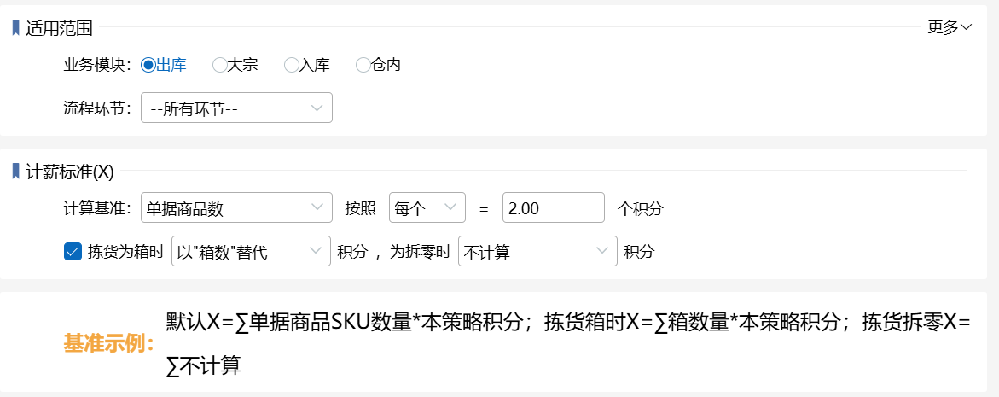

（1）**拣货为箱时【以"箱数"替代】积分，为拆零时【不计算】积分**

含义：拣货时，订单内锁定箱库存的明细，以箱数量进行积分计算，拆零库存则不计算积分

例1：仓库1开启积分绩效，设置出库模块——单据商品数积分未设置时，按照每个=[2]个积分。

订单内包含：商品A*13（锁定箱A（一箱=4件）*3，拆零库存*1）、商品B*5

拣货环节结算积分结果：3*2=6

（2）**拣货为箱时【以"箱数"替代】积分，为拆零时【按策略计算】积分**

含义：拣货时，订单内锁定箱库存的明细，以箱数量进行积分计算，拆零按照策略中计算基准计算积分

例1：仓库1开启积分绩效，设置出库模块——单据商品数积分未设置时，按照每个=[2]个积分。

订单内包含：商品A*13（锁定箱A（一箱=4件）*3，拆零库存*1）、商品B*5

拣货环节结算积分结果：3*2+1*2+5*2=24

（3）**拣货为箱时【不计算】积分，为拆零时【按策略计算】积分**

含义：拣货时，订单内锁定箱库存的明细，锁定箱库存的明细不计算积分，，拆零库存则按照策略中计算基准计算积分

例1：仓库1开启积分绩效，设置出库模块——单据商品数积分未设置时，按照每个=[2]个积分。

订单内包含：商品A*13（锁定箱A（一箱=4件）*3，拆零库存*1）、商品B*5

拣货环节结算积分结果：1*2+5*2=12

###### 1.2.4拣货为箱时【以"箱数"替代/不计算】积分，为拆零时【不计算/按策略计算】积分（前提：选择单据种类数）

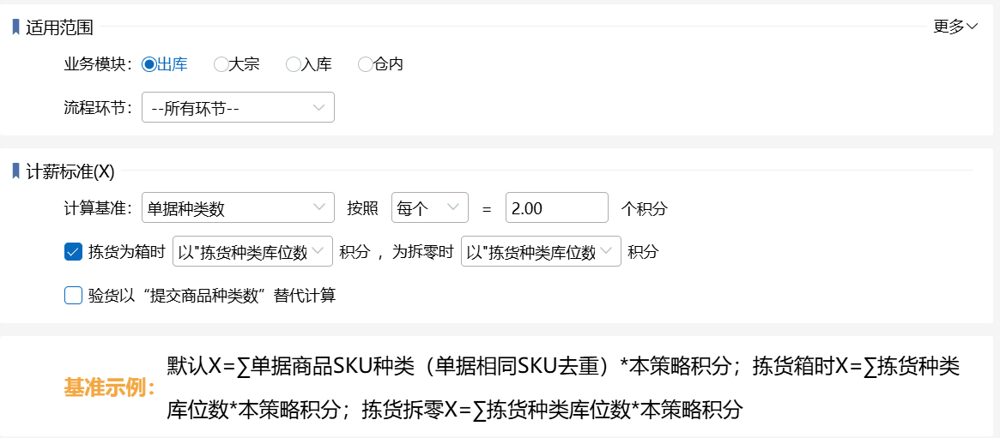

（1）**拣货为箱时【以"箱数"替代】积分，为拆零时【不计算】积分**

含义：拣货时，订单内锁定箱库存的明细，以箱数量进行积分计算，拆零库存则不计算积分

例1：仓库1开启积分绩效，设置出库模块——单据商品数积分未设置时，按照每个=[2]个积分。

订单内包含：商品A*13（锁定箱A（一箱=4件）*3，拆零库存*1）、商品B*5

拣货环节结算积分结果：3*2=6

（2）**拣货为箱时【以"箱数"替代】积分，为拆零时【按策略计算】积分**

含义：拣货时，订单内锁定箱库存的明细，以箱数量进行积分计算，拆零按照策略中计算基准计算积分

例1：仓库1开启积分绩效，设置出库模块——单据商品数积分未设置时，按照每个=[2]个积分。

订单内包含：商品A*13（锁定箱A（一箱=4件）*3，拆零库存*1）、商品B*5

拣货环节结算积分结果：3*2+1*2+5*2=24

（3）**拣货为箱时【不计算】积分，为拆零时【按策略计算】积分**

含义：拣货时，订单内锁定箱库存的明细，锁定箱库存的明细不计算积分，，拆零库存则按照策略中计算基准计算积分

例1：仓库1开启积分绩效，设置出库模块——单据商品数积分未设置时，按照每个=[2]个积分。

订单内包含：商品A*13（锁定箱A（一箱=4件）*3，拆零库存*1）、商品B*5

拣货环节结算积分结果：1*2+5*2=12

###### 2、大宗模块

###### 2.1大宗拣货

###### 2.1.1.大宗拣货为箱时【以"箱内商品"替代/不计算】积分，为拆零时【不计算/按策略计算】积分（前提：选择单据商品数量积分）

含义和计算逻辑和【出库-拣货-1.2.1】一致。

###### 2.1.2大宗拣货为箱时【以"箱内商品"替代/以“拣货种类库位数”替代/不计算】积分，为拆零时【以“拣货种类库位数”替代/不计算/按策略计算】积分（前提：选择单据商品种类积分）

含义和计算逻辑和【出库-拣货-1.2.2】一致。

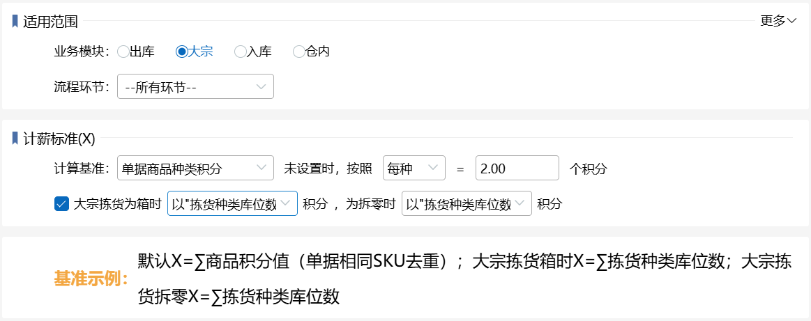

###### 2.1.3拣货为箱时【以"箱数"替代/不计算】积分，为拆零时【不计算/按策略计算】积分（前提：选择单据商品数）

含义和计算逻辑和【出库-拣货-1.2.3】一致。

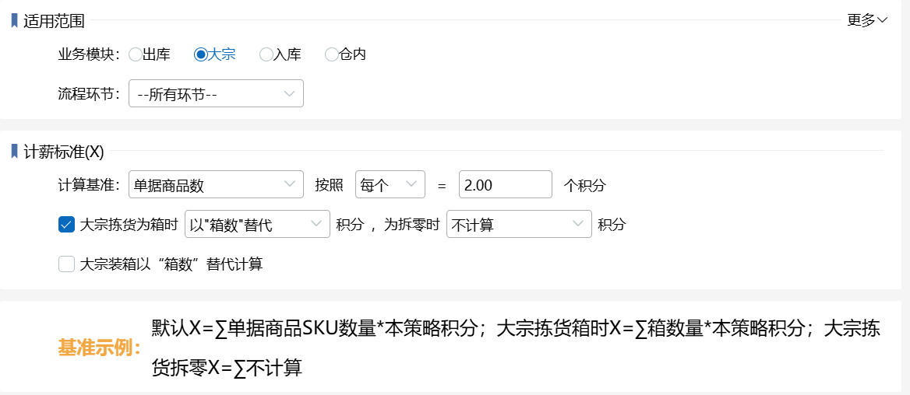

###### 2.1.4拣货为箱时【以"箱数"替代/不计算】积分，为拆零时【不计算/按策略计算】积分（前提：选择单据种类数）

含义和计算逻辑和【出库-拣货-1.2.4】一致。

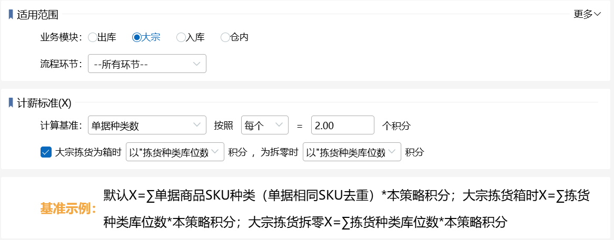

###### 2.2大宗装箱

###### 2.2.1大宗装箱以“箱数”替代计算（前提：选择单据商品数）

含义：大宗装箱时，订单拆分装箱时，以装箱数量进行积分计算

例1：仓库1开启积分绩效，设置大宗模块——单据商品数未设置时，按照每个=[2]个积分。

订单内包含：商品A*13、商品B*5

大宗装箱时：箱1：商品A*3+商品B*2；箱2：商品*4+商品B*1；箱3：商品A*6+商品B*2

大宗装箱环节结算积分结果：3*2=6

###### 3、仓内模块

###### (1)补货/移库/盘点为箱时以“箱数”替代计算，为拆零时【不计算/按策略计算】积分（前提：作业商品数）

含义：仓内补货/移库/盘点环节的操作区分箱库存和拆零库存，箱库存使用“箱数”代替计算基准“作业商品数”进行积分计算，拆零库存可以选择不计算/按策略计算积分，有按每个/按阶梯两种算法。

例1：仓库1开启积分绩效，设置仓内模块——作业商品数按照：每个=[2]个积分，勾选补货/移库/盘点为箱时以“箱数”替代计算，为拆零时【不计算】积分。

case数据：箱A包含：商品A*3+商品B*2、箱B包含：商品B*2+商品C*1、箱C包含：商品C*5

仓库1下的补货单/移库单/盘点单A内商品明细：箱A*2+箱B*3+箱C*1+商品A*2+商品C*1

补货/移库/盘点环节结算积分结果：2*2+3*2+1*2+0+0=12[即：提交箱数*默认积分]

例2：仓库1开启积分绩效，设置仓内模块——作业商品数按照：每个=[2]个积分，勾选补货/移库/盘点为箱时以“箱数”替代计算，为拆零时【按策略计算】积分。

case数据：箱A包含：商品A*3+商品B*2、箱B包含：商品B*2+商品C*1、箱C包含：商品C*5

仓库1下的补货单/移库单/盘点单A内商品明细：箱A*2+箱B*3+箱C*1+商品A*2+商品C*1

补货/移库/盘点环节结算积分结果：2*2+3*2+1*2+2*2+1*2=18[即：（提交箱数+拆零数量）*默认积分]

###### (2)装箱为箱时以“箱数”替代计算（前提：作业商品数）

含义：仓内装箱环节的操作，箱库存使用“箱数”代替计算基准“作业商品数”进行积分计算，有按每个/按阶梯两种算法。

例1：仓库1开启积分绩效，设置仓内模块——作业商品数按照：每个=[2]个积分，勾选装箱为箱时以“箱数”替代计算。

case数据：箱A包含：商品A*3+商品B*2

仓库1下的装箱订单A内商品明细：箱A*2

装箱环节结算积分结果：2*2=4[即：装箱数量*默认积分]

例2：仓库1开启积分绩效，设置仓内模块——作业商品数按照：每个=[2]个积分，不勾选装箱为箱时以“箱数”替代计算。

case数据：箱A包含：商品A*3+商品B*2

仓库1下的装箱订单A内商品明细：箱A*2

装箱环节结算积分结果：（3+2）*2*2=20[即：箱内商品数量总和*箱数*默认积分]

###### (3)预包任务以“预包完成数”替代计算（前提：作业商品数）

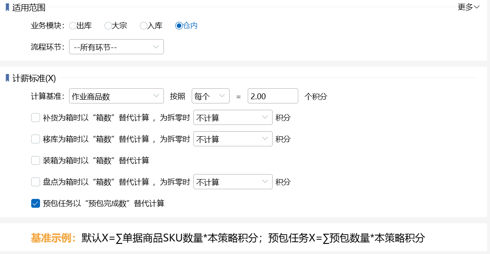

含义：预包任务环节的操作使用“预包完成数”代替计算基准进行积分计算。

例1：仓库1开启积分绩效，设置仓内模块——作业商品数按照：每个=3积分，预包任务以“预包完成数”替代计算。

         预包任务1计划预包数量=10，完成数量=7。

         预包任务计算积分结果：7*3   [即：预包完成数*默认积分]

###### (4)移库/盘点为箱时以“箱数”替代计算，为拆零时【不计算/按策略计算】积分（前提：选择作业种类数）

含义：仓内移库/盘点环节的操作区分箱库存和拆零库存，箱库存使用“箱数”代替计算基准“作业商品数”进行积分计算，拆零库存可以选择不计算/按策略计算积分，有按每个/按阶梯两种算法。

例1：仓库1开启积分绩效，设置仓内模块——作业种类数按照：每个=[2]个积分，勾选移库/盘点为箱时以“箱数”替代计算，为拆零时【不计算】积分。

case数据：箱A包含：商品A*3+商品B*2、箱B包含：商品B*2+商品C*1、箱C包含：商品C*5

仓库1下的移库单/盘点单A内商品明细：箱A*2+箱B*3+箱C*1+商品A*2+商品C*1

移库/盘点环节结算积分结果：（2+3+1+0+0）*2=12[即：提交箱数*默认积分]

例2：仓库1开启积分绩效，设置仓内模块——作业种类数按照：每个=[2]个积分，勾选移库/盘点为箱时以“箱数”替代计算，为拆零时【按策略计算】积分。

case数据：箱A包含：商品A*3+商品B*2、箱B包含：商品B*2+商品C*1、箱C包含：商品C*5

仓库1下的移库单/盘点单A内商品明细：箱A*2+箱B*3+箱C*1+商品A*2+商品C*1

移库/盘点环节结算积分结果：（2+3+1+1+1）*2=16[即：（补货提交箱数+拆零商品种类数）*默认积分]

###### (5)补货以“上架数/下架数”替代计算（前提：选择作业种类数）

含义：补货环节的操作使用“上架数/下架数”代替计算基准“作业种类数”进行积分计算。

例1：仓库1开启积分绩效，设置仓内模块——作业种类数按照：每个=3积分，补货以“上架数/下架数”替代计算。

         补货任务1部分补货，完成情况：明细sku1 来源库位1 目标库位2 计划数量4 已补数量2，明细sku2 来源库位1 目标库位2 计划数量4 已补数量2，

         明细sku2 来源库位1 目标库位3 计划数量4 已补数量2，明细sku3 来源库位1 目标库位1 计划数量4 已补数量2。上架种数=4，下架种数=3。

         补货以“上架数”计算积分结果：4*3=12   [即：上架种数*默认积分] 

         补货以“下架数”计算积分结果：3*3=9   [即：下架种数*默认积分] 

另注：打包装箱，作废箱后，会扣除绩效及其他字段的数据。

###### 

###### **四、计薪加成**

计薪加成是在计薪标准计算基础上的附加数据，若单据符合某一项或多项设置，则按配置计算该项加成，若不符合，则跳至下一项，有多项符合时累加计算。

1.行业属性(A)：默认不限，可指定包含范围或排除范围。单据明细包含指定行业属性或排除范围外的符合该条件，可根据设置计算积分。

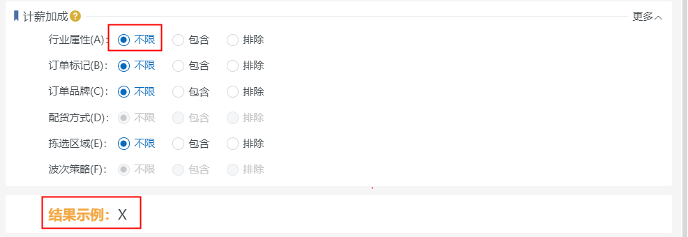

选择“不限”时，不计算加成，结果示例如上图。

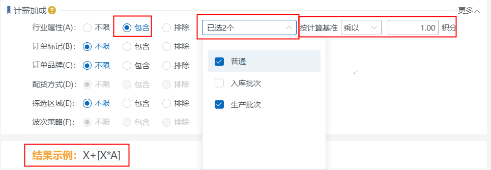

选择“包含”时，单据明细包含其中一项即可按计算基准计算加成，结果示例如上图。

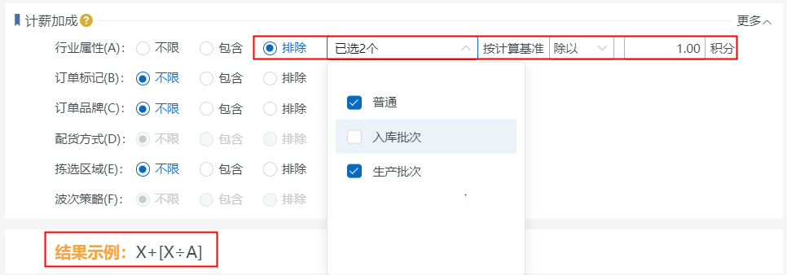

选择“排除”时，单据明细需排除所有勾选项可按计算基准计算加成，结果示例如上图。

  2.订单标记(B)：默认不限，可指定包含范围或排除范围。在指定订单标记范围内或排除范围外的符合该条件，可根据设置计算积分。

选择“包含”时，订单标记包含其中一项即可按计算基准计算加成，结果示例如上图。

选择“排除”时，订单标记需排除所有勾选项可按计算基准计算加成，结果示例如上图。

  3.订单品牌(C)：默认不限，可指定包含范围或排除范围。在指定订单品牌范围内或排除范围外的符合该条件，可根据设置计算积分。计算方式同上述一致。

  4.配货方式(D)：默认不限，可指定包含范围或排除范围。出库模块对应零拣配货、波次配货，大宗模块对应大宗件。计算方式同上述一致。

  5.拣选区域(E)：默认不限，可指定包含范围或排除范围。在指定拣选区域内或排除范围外的符合该条件，可根据设置计算积分。计算方式同上述一致。

  6.波次策略(F)：默认不限，可指定包含范围或排除范围。按波次订单归属波次策略匹配的符合该条件，可根据设置计算积分。计算方式同上述一致。

> 更新: 2026-03-26 15:05:48  

> 原文: <https://hupun.yuque.com/unzko7/lsbfg0/dx7fs2lnqq24mnz1>

---

### 03.2.3 业务配置-入库配置

> 原始文件来源：`00-源文件/操作手册/仓内策略/业务配置-入库配置.md`

#### 1.入库流程

1.允许入库任务在确认入库时，快速修改商品数量并入库：开启则分批入库任务页面显示改入按钮，允许确认入库前操作修改单据数据。

2.改入时禁止自动修改原始环节单据商品明细，以保留原始凭证：开启后指定入库类型的分批入库任务在改入完成后，保留其关联原始单据（清点单、质检单等）的明细及数量。

3.上架后自动确认分批入库任务：开启后，已100%进度的预约单分批入库任务，最末尾环节全部操作完容器上架后，单据将自动提交入库。（菜单：PDA-容器上架）

4.快速入库启用入库单审核：开启后，在采购、其他、销退入库单页面操作提交单据后，生成待审核单据，需审核后方可入库。

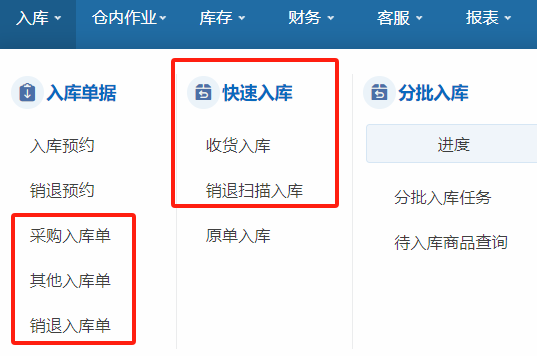

注：开启新版审核后台开关后，此配置置灰不可编辑。

5.上传码上放心单据入库前查询外箱码自动填写关联序列号：开启后，上传码上放心入库单不强制外箱码填写序列号，填写入库后自动向码上放心平台查询补入。

显示前提：当前仓在码上放心[对接配置](https://hupun.yuque.com/unzko7/lsbfg0/gpgz776pazg6t2mx#l2ZFi)指定仓库范围内。

开启配置后，启用外箱批量录入的序列号商品，在新增入库单时支持外箱码批量录入，序列号数量与明细数量独立，无需保持一致。新增入库单后，生成对应溯源上传记录，上传外箱码到码上放心平台并将查询序列号结果回填到明细上，溯源上传记录变成【已完成】状态，在序列号外箱码维护页面页面查看对应数据记录。

提示：

①溯源上传记录未完成时，对应入库单不允许确认审核；

②确认入库时，序列号数量要求和明细数量保持一致；

③生成溯源上传记录后定时执行上传和查询，若出现失败的情况，最多自动执行5次后不再执行。

#### 2.基础配置

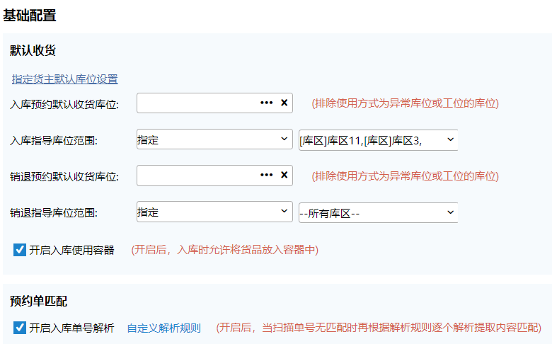

1.默认收货库位设置、库位指导范围：有不同货主要依照货主维度设置收货库位的，点击按钮进行配置。

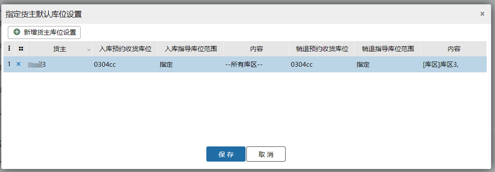

不考虑货主条件可统一设置入库时收货库位。

2.指导库位范围：入库和销退支持独立配置。

全仓：全仓库下指导。

首个区域：全仓编码最小的区域内指导。

默认收货库位所在区域：

      单货主：已配置默认收货库位，在默认收货库位所在区域内指导；未配置则在首个区域内指导。

      多货主：指定货主已配置收货库位，按指定货主收货库位所在区域内指导；指定货主未配置收货库位，看兜底是否配置收货库位。配置，则在兜底收货库位所在区域内指导；未配置，则在全首个区域内指导。

指定：在所选区域/库区内指导。

3.开启入库使用容器：开启后操作入库相关业务时，可入容器。

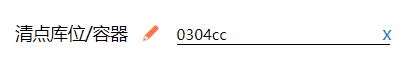

4.开启入库单号解析：配置后，指定页面扫描单号后会根据配置的规则截取单号然后匹配订单。

解析规则：

指定字符截取：单号已指定字符截取后的结果进行匹配。

从后往前按位数截取：忽略单号从后往前X位的结果进行匹配。

从前往后按位数截取：忽略单号从前往后X位的结果进行匹配。

注：配置规则后，扫订单原运单号可正常匹配。

       若单号位数不够规则设置的截取位数，则不截取。

#### 3.业务校验

1.入库数量免输入：开启后操作入库业务时，勾选的页面支持自动带出预约数量。

2.允许销退入库差异收货：开启后，销售退货预约单可入入库预约单之外的商品。

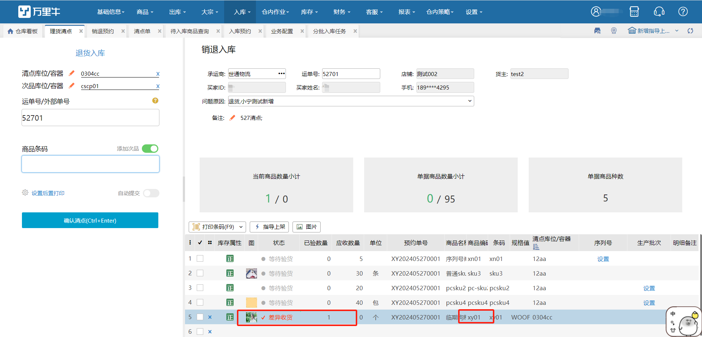

3.允许原单入库异常收货：开启后，原单入库支持少收、超收和操作次品入库。

4.开启入库商品信息检测：开启后，入库环节提交单据时检测商品信息是否完整，不符合则报错提示且不允许提交单据。

#### 4.业务拓展

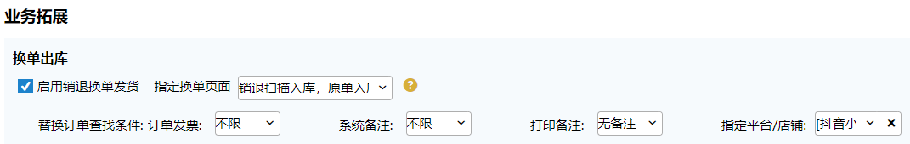

1.换单出库

a).开启开关后，指定页面显示换单发货按钮；开启按钮后，入库提交成功后触发换单发货。

注：此功能和入库入容器互斥，开启后不可入库入容器内，反之则不可开启换单发货按钮。

选择多个预约单时不支持换单发货。

b).弹窗换单发货：支持修改承运商、申请运单号。

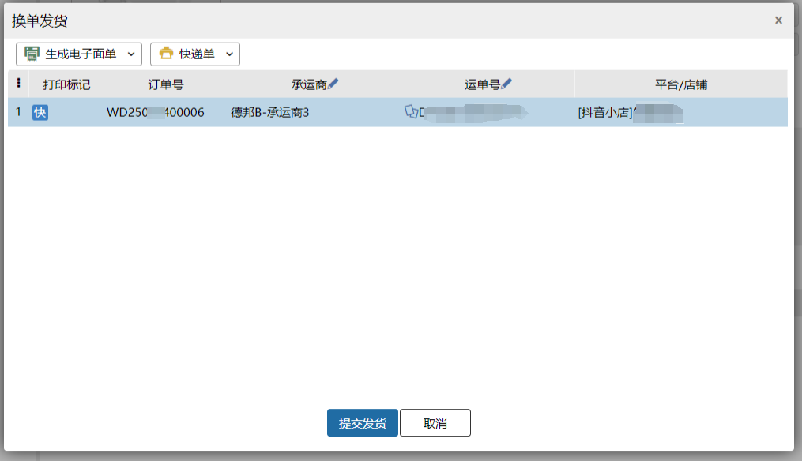

提交发货成功则替换订单从待分配提交到待出库，入库单库存扣减。

提交发货失败则报错，点击换一单则弹窗重新查询替换订单，继续进行发货操作。

> 更新: 2025-12-12 15:56:28  

> 原文: <https://hupun.yuque.com/unzko7/lsbfg0/og8p6qb1admghbhe>

---

### 03.2.4 业务配置-其他配置

> 原始文件来源：`00-源文件/操作手册/仓内策略/业务配置-其他配置.md`

#### 一、系统配置

##### 1、PDA商品信息展示样式

显示仓库级别的PDA商品信息样式

【点击设置】可以对商品卡片样式进行编辑

重要内容/次要内容必选一项，其他内容可为空，重要内容、次要内容、其他内容不可重复

##### 2、系统单据编号生成规则

支持自定义波次编号/入库任务单号生成规则，修改后会按照新规则生成波次号/入库任务单号。

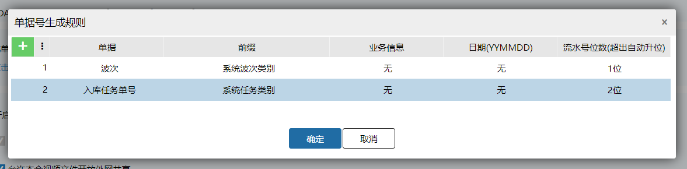

波次生成规则组成部分含义如下：

       单据：波次；

       前缀：新增规则时默认系统波次类别(预配/普通波次--BC，清仓波次--QC，手工波次--BS)，支持自定义，支持8位数字/英文；

       业务信息：新增规则时默认无，下拉可选“波次编码”，即波次策略对应的策略编码；

       日期(YYMMDD)：新增规则时默认无，下拉可选“有”，即生成波次号包含YYMMDD格式的日期信息；

       流水号位数(超出自动升位)：新增规则时默认“3位”，下拉可选“1位/5位”，即生成波次号最后有1/3/5位流水号，每次新生成的流水号在之前基础上累加，超出位数则自动升位。（例：设置位数为3位，现有波次号...、xxx998、xxx999，则后续生成波次号xxx1000、...。）

入库任务单号生成规则组成部分含义如下：

       单据：入库任务单号；

       前缀：新增规则时默认系统任务类别；

       业务信息：新增规则时默认无，下拉可选“入库类型”；

       日期(YYMMDD)：新增规则时默认无，下拉可选“有”，即生成入库任务单号包含YYMMDD格式的日期信息；

       流水号位数(超出自动升位)：同波次规则。

注： (1)此配置关联公司级后台开关，开启后页面上显示对应配置项，未开启则不显示；

        (2)现有用户后台开关默认关闭，新注册用户默认开启；

        (3)现有客户现有仓库默认规则为空，按现有规则生成；

        (4)每个仓库只支持2条规则。

##### 3、系统单据主体自定义字段设置

开启后可针对指定单据主体设置自定义字段。

点击设置，进入自定义字段设置弹窗，填写类型有三种：文本、预设值、日期选择。

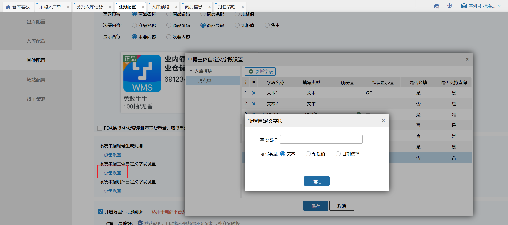

填写类型不同，预设值、默认显示值输入格式不同。填写类型为【预设值】时，必须录入预设值。

注：字段名称不允许重复，最多10个；

预设值之间不允许重复；

类型为【文本/时间选择】时，预设值为空；

类型为【预设值】时，预设值至少填一个，最多50个；

默认显示值设置后，在对应页面会默认显示该值；

设置字段【是】必填时，在对应页面有必填校验；

设置字段【是】支持查询时，在对应单据列表页面有查询项。

支持自定义字段的页面包括：清点单/收货台账、理货清点（PC）、理货清点。以PC-[理货清点](https://hupun.yuque.com/unzko7/lsbfg0/sv93htr5q3s2328n#oPVBn)为例进行说明，详见对应页面操作手册。

##### 4、系统单据明细自定义字段设置

开启后可针对指定单据明细设置自定义字段。

点击设置，进入自定义字段设置弹窗，填写类型有三种：文本、预设值、日期选择。

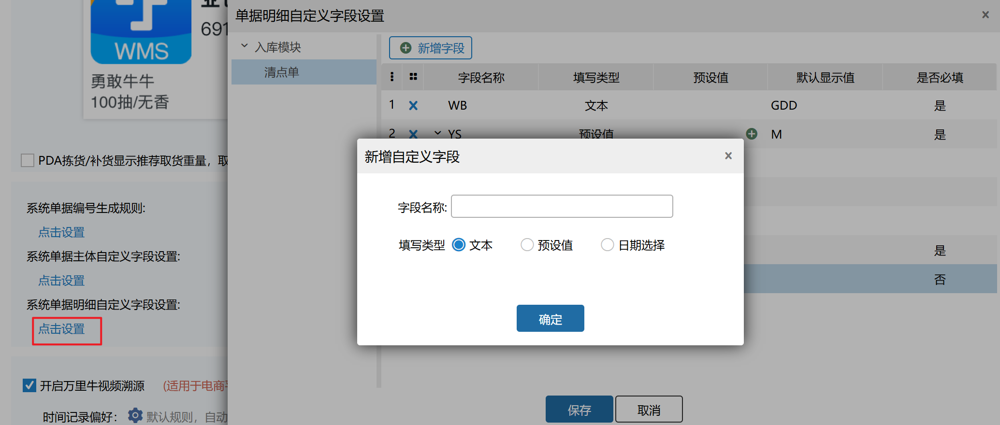

填写类型不同，预设值、默认显示值输入格式不同。填写类型为【预设值】时，必须录入预设值。

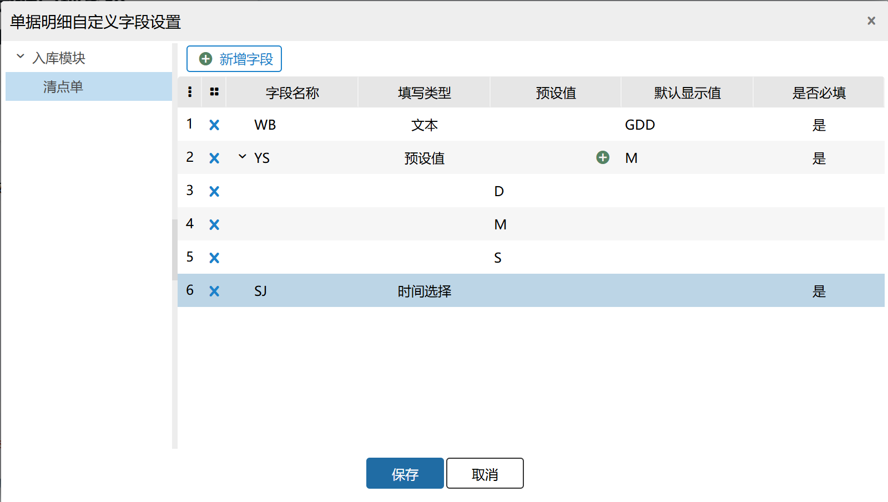

注：字段名称不允许重复，最多10个；

预设值之间不允许重复；

类型为【文本/时间选择】时，预设值为空；

类型为【预设值】时，预设值至少填一个，最多50个；

默认显示值设置后，在对应页面会默认显示该值；

设置字段【是】必填时，在对应页面有必填校验。

支持自定义字段的页面包括：清点单/收货台账、理货清点（PC）、理货清点。以PC-理货清点-无预约清点为例进行说明，详见对应页面操作手册。

##### 5、开启集合码便捷录入

开启后可扫描集合码，识别商品、批次等多个信息，用一次以完成验货核对、信息录入等多步骤操作。

开启此开关后，需要先按需求设置好解析规则并保存，在操作过程中，扫描集合码会按照规则解析出商品条码、批次信息等并进行匹配。当前支持扫集合码便捷录入的页面包括PC条码验货、PDA快速上架、PDA条码验货、PDA盘点任务、PC大宗装箱、PC分拣验货。

解析规则有两种：自定义规则、UDI预设规则，具体设置方法如下。

**①自定义规则**

以商品条码+生产批次号解析为例。点击设置解析规则，点击新增按钮-选择自定义规则，在弹窗中按需求填写数据：

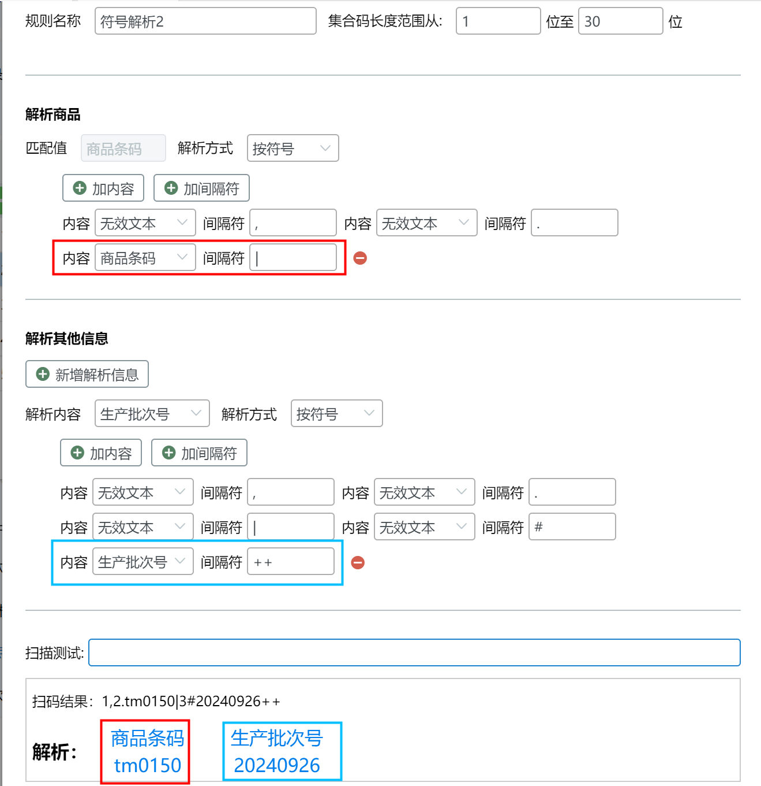

(1) 规则名称：不允许重复，必填，最多8个字；

(2) 集合码长度范围：用来匹配集合码长度，在设置范围内的集合码可以匹配到当前规则，不符合的则无法匹配，可以用长度来区分规则。下限1，上限128，必填；

(3) 解析商品：默认解析目标为商品条码，解析方式有按位数、按符号两种，必填。

按位数解析：按照设置的长度范围截取出对应位数的条码，作为商品条码进行匹配。如上图举例中，第1-6位条码被解析为商品条码；

按符号解析：按照设置的匹配规则截取出对应间隔符之间的信息，作为商品条码进行匹配

(4) 解析其他商品：目前仅支持匹配生产批次号，关联当前仓生产批次管理开关。若当前仓未开启生产批次管理开关，则下拉项无数据。解析方式分按位数、按符号两种，必填。

按位数解析：按照设置的长度范围截取出对应位数的条码，作为生产批次号进行匹配。如上图举例中，第9-末尾位条码被解析为生产批次号；

按符号解析：按照设置的匹配规则截取出对应间隔符之间的信息，作为生产批次号进行匹配

(5) 扫码测试：设置规则后，通过扫码测试工具来辅助判断当前规则是否符合需求。

**②UDI规则**

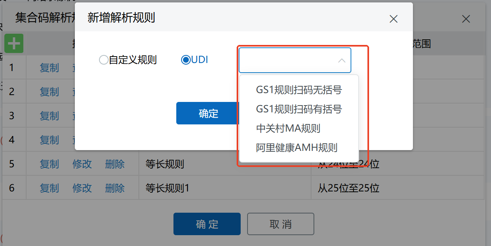

:::color3
应用场景：医疗器械行业要求对产品实行UDI（唯一器械标识）管理，不同生产企业使用不同的编码规则（如GS1带括号/不带括号、中关村MA、阿里健康AHM）。此前系统仅支持自定义集合码规则，配置复杂且难以覆盖多种标准。本功能在集合码规则中增加系统预设的UDI解码方案，支持GS1、MA、AHM等标准，可直接选用，无需手动配置。

:::

新增规则时选择UDI后，下拉选项包括：GS1规则扫码无括号、GS1规则扫码有括号、中关村MA规则、阿里健康AHM规则，至少选择1项，系统自动生成对应的解码规则（长度、截取方式等预设），高亮显示。

预设规则为系统级，不支持修改，但可点击查看详情和扫码测试。

保存后，在条码验货、大宗装箱等页面扫描UDI码时，系统按预设规则自动解析出商品条码、生产批次等信息。

注：

a.“开启集合码便捷录入”关联鲁班增值模块【集合码】，需开启增值模块后才会显示此开关；

b.“开启集合码便捷录入”与同批次多日期（后台开关）互斥，不允许同时开启；

c. 若集合码位数未匹配到任何一条规则，则最终无解析结果；若集合码位数匹配到其中一条规则，但解析不出商品条码、生产批次号等信息，则不会再去匹配其他规则，无解析结果。

d.在一个解析规则中，解析其他信息最多可以设置生产批次号、序列号两条规则，用于解析同时开启生产批次和序列号管理开关的商品信息。

#### 二、行业配置

##### 1、开启商品序列号管理

开启后商品可以进行序列号管理，即商品出入库需要录入商品序列号。

(1).标准模式：库存总量级管理，出入库必须登记序列号，且出库登记的序列号必须是库存总量中未锁定的。

(2).简洁模式：库存总量级管理，入库选择性录入，出库仅记录不需要与库存总量中的序列号关联。

(3).入库根据商品规格校验序列号：开启后入库将根据商品信息序列号前缀进行强制验证。该功能开启后，商品信息才显示系列号前缀选项。

(4).序列号出库登记为拣货、验货时，支持扫描序列号匹配对应商品并直接录入，开启则有效，未开启扫序列号不支持匹配。支持范围为PC和PDA两端的拣货、验货支持序列号商品的菜单。

(5).简洁模式下的入库登记序列号：开启开关，根据配置的单据类型，入库需要登记序列号；未开启开关或者未配置的单据类型，入库时无需登记序列号。

(6).业务单据检验序列号有效性：开启后销退入库、调拨入库、原单退回或采购退货入库根据原始单据检验序列号。（关联入库登记序列号-单据类型）

重要：仓库存在序列号商品库存时，开启关闭商品序列号管理，会进行风险验证，向仓库管理员发送验证码，验证通过后，清空仓内序列号商品的库存总量。

(7).模式互相切换

a.标准模式切换到简洁模式，若序列号商品有未关闭的单据，切换报错；若序列号商品都无单据，正常切换。

b.简洁模式切换到标准模式，若序列号商品有未关闭的单据，切换报错；若序列号商品都无单据，会进行风险验证，向仓库管理员发送验证码，验证通过后，清空仓内序列号商品的库存总量。

(8).入库根据关联订单号自动带出商品序列号

前置条件：公司开启医药增值模块

功能介绍：通过预约单中关联订单编号/原出库单号来匹配当前公司下的单据匹配成功后，则带出单据中序列号自动填充。

开启开关后，允许的单据类型会将匹配的出库单中的序列号信息自动带入到当前入库单明细对应的序列号商品内。

匹配并带入的条件：关联单据只匹配到一笔出库单，且出库单内的序列号商品和入库单中对应的序列号商品数量一致。

case1：入库预约单A，关联单据：XD202604130001，包含序列号商品A*4

出库单a：线上单号：XD202604130001，包含序列号商品A*4

出库单b：线上单号：XD202604130001，包含序列号商品A*5

结果：未匹配到出库单（匹配到多笔），序列号不自动带入

case2：入库预约单A，关联单据：XD202604130001，包含序列号商品A*4

出库单a：线上单号：XD202604130001，包含序列号商品A*5

结果：未匹配到出库单（序列号商品不一致），序列号不自动带入

case3：入库预约单A，关联单据：XD202604130001，包含序列号商品A*4

出库单a：线上单号：XD202604130001，包含序列号商品A*4（sn01、sn02、sn03、sn04）

结果：匹配到出库单a，选择入库预约单A进行入库时，序列号商品A自动带入序列号sn01、sn02、sn03、sn04

##### 2、开启商品入库批次管理

开启后启用商品批次号管理，入库则自动生成批次号，按照先进先出规则出库。

开启后需设置商品批次号生成规则，

预约单+收货时间（天）：同一预约单，同一天入库，入库批次号相同

预约单+收货时间（月）：同一预约单，同一自然月入库，入库批次号相同

收货时间（天）：同一天入库，入库批次号相同

收货时间（月）：同一自然月入库，入库批次号相同

##### 3、开启商品生产批次管理

开启后可启用商品的生成批次，入库时可录入生产批次，生产时间早的优先出库。

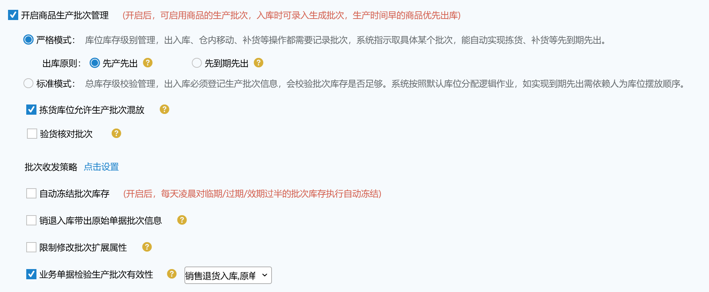

##### 3.1 严格模式

库位库存级别管理，出入库、仓内移动、补货等操作都需要记录批次，系统指示取具体某个批次，能自动实现拣货、补货等先到期先出。

①. 开启后可选择拣货库位(拣选库位/箱拣选库位)是否允许同一商品的不同生产批次混放。

②.开启后可选择相应验货环节核对生产批次号，包括PC端和PDA端的条码验货、分拣验货、播种验货/独立播种、抽检验货，有两种核对模式：

    手动选择核对：验货商品存在多个批次时需手动选择对应批次完成核对，仅一个批次时无需选择

    扫描批次号核对：验货商品每个批次都需扫描批次号进行核对

        例：波次中有2个订单，订单1 明细a 锁定批次01 数量2、批次02 数量2，明细b 锁定批次03 数量2；订单2 明细a 锁定批次02 数量4，明细b 锁定批次03 数量2

        手动选择核对模式：验货页面扫描订单1明细a后，会弹出生产批次选择框，支持录入数量，扫描订单1明细b、订单2明细a、明细b时不会弹出生产批次选择框

        扫描批次号核对模式：验货页面扫描订单每个明细都会弹出生产批次选择框，不支持录入数量，支持回车或双击选中批次号

③.批次收发策略，点击设置，可分别设置禁收规则和禁售规则 

**禁收规则**

可设置指定货主+单据类型在针对生产批次商品入库时，按照指定的时间范围进行禁收校验。

禁收校验包含两种：强制校验、校验提醒。

其中，强制校验不允许有禁收范围内的批次商品提交入库，在录入或提交时会进行强制校验；校验提醒允许有禁收范围内的批次商品提交入库，在录入或提交时有弱提醒。

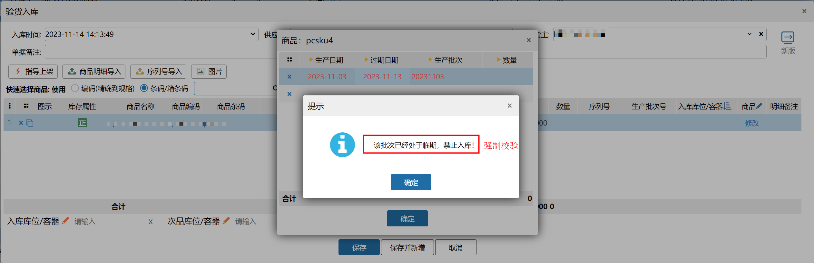

在规则设置中，货主为授权本仓且启用中的，若所有货主要设置相同规则，则可选择所有货主； 

业务范围共采购入库、销退入库、调拨入库、其他入库四种，用户可按需选择对应单据类型；

规则条件共效期过半、效期低于1/3、效期低于2/3、临期、过期、按商品禁收天数、自定义共七种，自定义可按百分比或天数设置。

注：

既有指定货主、又选择了所有货主时，优先按照指定货主规则进行校验。

相同货主+相同业务范围不允许重复。

例：指定货主a-采购入库-效期过半-禁收低于50%：假如商品保质期为100天，效期过半禁收50%表示该商品剩余有效期低于50天时为禁收。

货主a采购入库单包含生产批次商品，在入库时录入或提交时剩余有效期过半的批次号，在保存时会弹窗提示有异常批次，请确认后再进行后续操作。

指定货主b-销退入库-效期低于1/3-禁收低于33%：货主b销退入库单包含生产批次商品，在入库时录入或提交时剩余有效期低于33%的批次号，在保存时会弹窗提示有异常批次。

指定货主c-调拨入库-效期低于2/3-禁收低于66%：货主c调拨入库单包含生产批次商品，在入库时录入或提交时剩余有效期低于66%的批次号，在保存时会弹窗提示有异常批次。

指定货主d-其他入库-临期-禁收临期品：货主d其他入库单包含生产批次商品，在入库时录入或提交时临期的批次号，在保存时会弹窗提示有异常批次。

指定货主e-采购入库、调拨入库-过期-禁收过期品：货主e采购入库/调拨入库单包含生产批次商品，在入库时录入或提交时过期的批次号，在保存时会弹窗提示有异常批次。

指定货主f-其他入库-按商品禁收天数：商品上有设置禁收天数的，在货主 f 其他入库单包含对应生产批次商品时，在入库时录入或提交时过期的批次号，在保存时会弹窗提示有异常批次；未设置禁收天数的，则无禁收校验。

指定货主g-其他入库-自定义：可按百分比或者天数设置自定义规则，货主g其他入库单包含生产批次商品，在入库时录入或提交时批次号按照指定规则进行校验，若有异常批次则在保存时会弹窗提示。

非指定货主、非指定业务范围的入库单包含生产批次商品，无禁收校验。

**禁售规则**

开启后可指定店铺设置生产批次禁售规则，未设置禁售规则将按照先进先出原则锁定批次。

在规则设置中，店铺不允许重复设置； 规则条件共效期过半、效期超出1/3、效期超出2/3、临期、过期、按商品禁售天数、自定义共七种，自定义可按百分比或天数设置。

**包含批次商品订单锁定批次的顺序：指定批次>生产批次禁售规则>到期先出**

例：

指定店铺a-效期过半-禁售0-50%：假如商品保质期为100天，效期过半禁售0-50%表示该商品有效期低于50天时为禁售。

- 店铺a订单包含生产批次商品指定批次，订单锁库时会优先锁定指定批次库存，若指定批次库存不足则锁库失败，

店铺a订单包含生产批次商品，订单锁库时会排除效期过半的批次库存，在剩余批次库存中按到期先出的规则锁库，若库存不足则锁定失败。

- 指定店铺b-效期超出1/3-禁售0-33%：店铺b订单包含生产批次商品，订单锁库时会排除效期超过1/3的批次库存，在剩余批次库存中按到期先出的规则锁库，若库存不足则锁定失败。

指定店铺c-效期超出2/3-禁售0-66%：店铺c订单包含生产批次商品，订单锁库时会排除效期超过2/3的批次库存，在剩余批次库存中按到期先出的规则锁库，若库存不足则锁定失败。

指定店铺d-临期-禁售临期品：店铺d订单包含生产批次商品，订单锁库时会排除临期的批次库存，在剩余批次库存中按到期先出的规则锁库，若库存不足则锁定失败。

指定店铺e-过期-禁售过期品：店铺e订单包含生产批次商品，订单锁库时会排除过期的批次库存，在剩余批次库存中按到期先出的规则锁库，若库存不足则锁定失败。

指定店铺f-按商品禁售天数：商品上有设置禁售天数的，店铺f订单包含生产批次商品，则订单锁库时排除商品禁售天数内的批次库存，在剩余批次库存中按到期先出的规则锁库，若库存不足则锁定失败。

指定店铺g-自定义：可按百分比或者天数设置自定义规则，若设置禁售，则排除禁售期内的批次库存，在剩余批次库存中按到期先出的规则锁库，若库存不足则锁定失败；若设置可售，则锁定在可售期内的批次库存，若库存不足则锁定失败。

非指定店铺订单、或包含未设置禁售天数的生产批次商品的订单，则按先进先出的原则优先锁定到期时间最早的库批次库存。

**大宗订单分配限制条件**

开启后可指定店铺和单据类型设置**大宗订单**中生产批次商品允许锁定的批次种类数。

在规则设置中，店铺+单据类型不允许重复设置； 规则条件默认为每单商品最多锁定批次种类数，范围支持下拉选择，代表批次种类数。

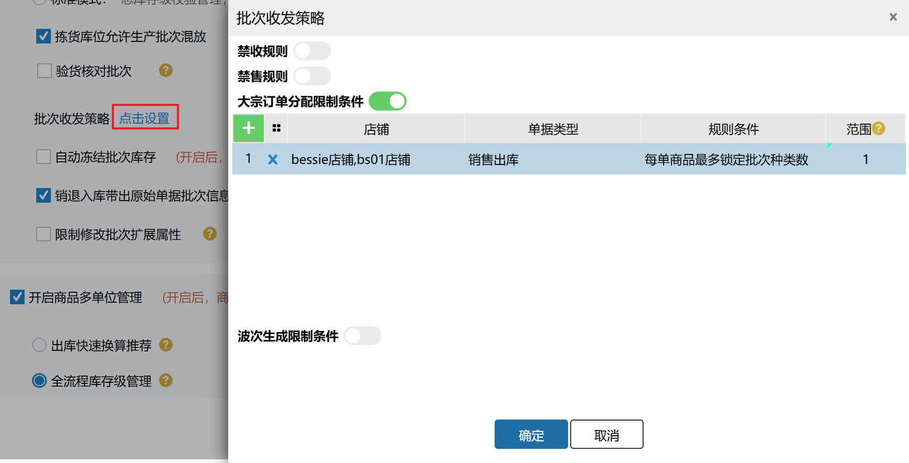

设置批次限制条件后，大宗订单在原先大宗策略设置的基础上，结合限制条件进行锁库。

例：设置大宗策略如下

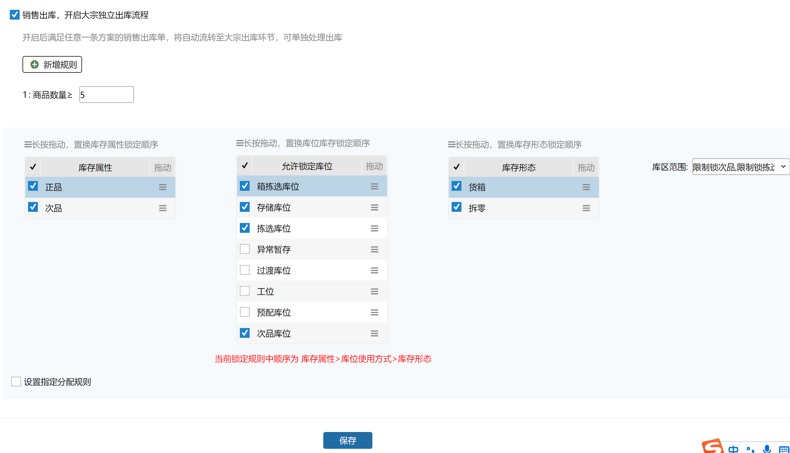

设置批次限制条件如下：

订单1 普通商品明细01 5个，生产批次商品明细02 5个，按照大宗策略和批次限制条件，普通商品明细会优先锁库箱拣选库位上的货箱库存，生产批次商品不锁货箱，只锁拆零库存，按批次先进先出原则锁定，若可用批次库存5个、批次种类数超过2种，则锁库失败，否则锁库成功。

注：指定批次大宗订单仍按照指定批次锁库，不会走限制条件。

**波次生成限制条件**

开启后可指定波次策略设置**同一个波次**中生产批次商品允许锁定的批次种类数。

在规则设置中，波次策略不允许重复设置； 规则条件默认为每波次中商品最多锁定批次种类数，范围支持下拉选择，代表批次种类数。

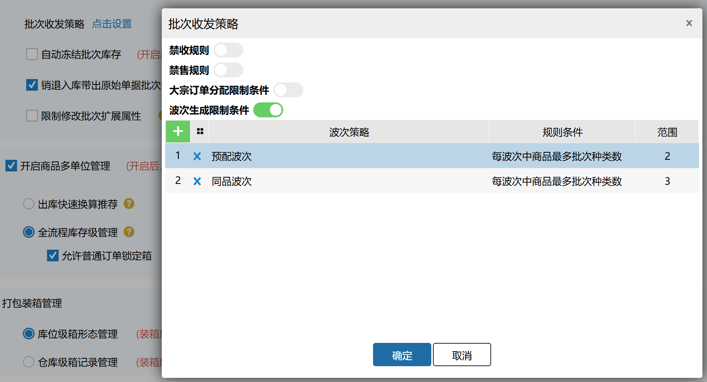

若指定波次锁定批次种类数超出限制范围，则生成失败。

##### 3.2 标准模式

总库存级校验管理，出入库必须登记生产批次信息，会校验批次库存是否足够。系统按照默认库位分配逻辑作业，如实现到期先出需依赖人为库位摆放顺序。

##### 3.3 开启同批次多日期管理

开启后，严格模式和标准模式都支持录入相同批次号、不同日期的批次信息，具体包括入库、仓内作业等模块下生产批次商品录入批次信息，库存模块查看批次信息等。

注：此开关开启后不支持关闭

例：以验货入库为例，录入生产批次时，允许录入相同生产批次、不同日期的批次信息，若有两条数据的生产批次、生产日期、过期日期完全一致，则不允许录入：

##### 3.4 指定批次更新

在生产批次商品在WMS系统中已经存在批次信息的情况下，上游系统推送了包含新批次信息的采购订单到WMS系统中，会根据现有批次商品的库存状况来判断是覆盖现有批次信息还是拒收新的采购订单。

库存状况主要包括三种情况：待审核/待确认的入库单中包含批次信息；作业中的分批入库任务中包含批次信息；对应批次信息的生产批次商品存在可用库存。

举例说明：

（1）WMS系统中存在批次商品 pc01，批次信息001，生产日期2024-09-10，过期日期2024-10-10，无批次扩展属性，可用库存0，在途库存10个，不存在待审核/待确认入库单，不存在作业中的分批入库任务。

①未开启同批次多日期管理开关 

上游推送采购订单1：批次商品pc01，批次信息001，生产日期2024-09-10，过期日期2024-10-11，有批次扩展属性（a,b,c），数量10个。

结果：采购订单接收成功，覆盖批次信息001，生产日期2024-09-10，过期日期2024-10-11，有批次扩展属性（a,b,c）。

上游推送采购订单2：批次商品pc01，批次信息002，生产日期2024-09-10，过期日期2024-10-11，有批次扩展属性（a,b,c,d），数量10个。

结果：采购订单接收成功，新增批次信息002，生产日期2024-09-10，过期日期2024-10-11，有批次扩展属性（a,b,c,d）。

②开启同批次多日期管理开关

上游推送采购订单1：批次商品pc01，批次信息001，生产日期2024-09-10，过期日期2024-10-12，有批次扩展属性（a,b,c），数量10个。

结果：采购订单接收成功，新增批次信息001，生产日期2024-09-10，过期日期2024-10-12，有批次扩展属性（a,b,c）。

（2）WMS系统中存在批次商品 pc01，批次信息001，生产日期2024-09-10，过期日期2024-10-10，无批次扩展属性，可用库存0，在途库存10个，存在待审核/待确认入库单/作业中的分批入库任务。

①未开启同批次多日期管理开关 

上游推送采购订单1：批次商品pc01，批次信息001，生产日期2024-09-10，过期日期2024-10-11，有批次扩展属性（a,b,c），数量10个。

结果：采购订单接收失败。

上游推送采购订单2：批次商品pc01，批次信息002，生产日期2024-09-10，过期日期2024-10-11，有批次扩展属性（a,b,c,d），数量10个。

结果：采购订单接收成功，新增批次信息002，生产日期2024-09-10，过期日期2024-10-11，有批次扩展属性（a,b,c,d）。

②开启同批次多日期管理开关

上游推送采购订单1：批次商品pc01，批次信息001，生产日期2024-09-10，过期日期2024-10-10，有批次扩展属性（a,b,c），数量10个。

结果：采购订单接收失败。

上游推送采购订单1：批次商品pc01，批次信息002，生产日期2024-09-12，过期日期2024-10-12，有批次扩展属性（a,b,c），数量10个。

结果：采购订单接收成功，新增批次信息002，生产日期2024-09-12，过期日期2024-10-12，有批次扩展属性（a,b,c,d）。

##### 3.5 限制修改批次扩展属性

1.未开启：入库、仓内等入口，批次扩展属性允许正常修改更新。

2.开启：入库、仓内等入口，批次扩展属性不允许编辑修改。

##### 3.6 业务单据检验生产批次有效性

开启后，指定类型单据在销退入库时会根据原始单据校验生产批次，未通过校验时报错提示。

##### 3.7 指定批次库存预留规则

:::color3
应用场景：本功能为WMS系统提供指定批次订单的库存预留机制，确保指定批次订单能够优先锁定指定批次的库存，避免被非指定批次订单占用，保障特殊业务需求（如质量追溯、保质期管理、客户指定等）的库存分配优先级。

:::

默认模式：先预留再分配

工作原理：

- 指定批次订单直接按指定批次号预留对应库位库存数量，不参与FIFO排序
- 非指定批次订单从剩余库存中按混合FIFO规则扣减
- 预留优先级高于所有分配规则

示例：

:::tips
批次A：100件（被指定，入库1月1日）  
批次B：80件（入库1月2日）

指定批次订单O1：指定批次A，需求60件  
非指定订单O2：需求80件

执行结果：

- O1直接锁定批次A 60件，A剩40件
- O2从A剩40件 + B 40件按FIFO扣减，共80件

:::

上述模式生效范围包括：

零拣打单：待分配订单提交到零拣打单时锁库

波次作业：手动截单生成波次、生成预配波次、生成清仓波次、同品波次锁存储规则

大宗出库：大宗出库任务自动锁库

智能锁库：智能锁库+库位分配偏好场景

锁规格箱：普通订单优先锁箱规则

注：

此规则在页面上无配置，为后台默认逻辑；

指定批次库存无法完全满足指定批次订单需求时，仍将这部分库存预留给指定批次订单，不会分配给其他非指定批次订单。

##### 3.8 生产批次号自动生成规则

可自定义配置不同业务类型，自动生成的批次号格式，未配置的按照默认格式(YYYYMMDD)生成

case：仓内加工：YYYY-MM-DD；调拨入库：YY/MM/DD；其他入库未配置

仓内加工，批次商品填写生产日期为2026年3月15日，自动生成的批次号为：2026-03-15

调拨入库，批次商品填写生产日期为2026年3月15日，自动生成的批次号为：26/03/15

其他入库，批次商品填写生产日期为2026年3月15日，自动生成的批次号为：20260315

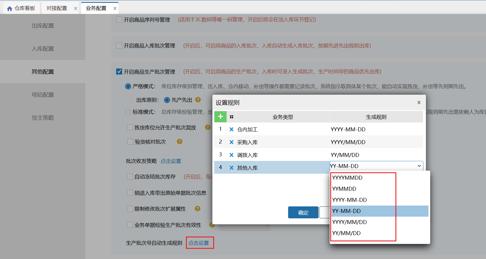

##### 4、开启多单位

开启后出库时推荐最优拣货库位。

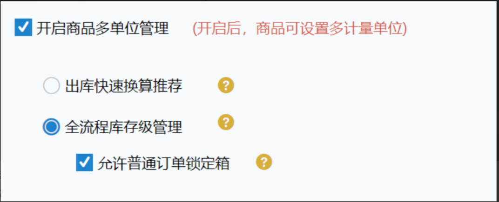

①.出库快速换算推荐：出库时推荐最优的拣货单位，最多5级，仅推荐显示。例如，商品a001基本单位是包，设置了计量单位1打=6包、1提=12包、1箱=26包，订单中商品a001有19包，拣货时推荐拿:1提+1打+1包。

(1)推荐单位显示样式

可以下拉选择，推荐单位显示的样式

(2)商品未设置多单位时，推荐单位显示该商品基础单位

勾选后，未设置多单位的商品，推荐单位也会显示该商品的基础单位，如果未配置基础单位，则不显示单位

②.全流程库存级管理：出库时根据指定的单位拣货。

(1) 允许普通订单锁定箱：先锁箱后锁零，都不锁唯一箱。

##### 普通商品锁库逻辑

a.先锁可以被整除的单箱sku数量最大且库位编码比较小的规格箱

b.若没有整除的，则锁规格箱或规格箱+拆零的组合，规格箱是按       照单箱sku数量从大到小且箱拣库位编码从小到大排序锁，拆零是     按照库位锁定偏好锁拣选库位；

c. a和b都不满足则锁库失败。

##### 入库批次商品锁库逻辑

a.锁规格箱或规格箱+拆零的组合，规格箱是按照入库批次号>库位 顺序锁规格箱，拆零是按照入库批次号>库位顺序锁拣选库位；

b. a不满足则锁库失败。

**序列号商品锁库逻辑：**按照库位锁定偏好锁拣选库位**。**

**生产批次商品锁库逻辑：**按照生产日期>生成批次号>库位。

(2) 不允许普通订单锁定箱：普通都不锁箱，锁库逻辑不变；大宗订单仍是允许锁箱，根据大宗策略锁。

注：判断可用库存

①、普通商品是判断拣选库位+箱拣库位上的规格箱可用数，若不足，报库位库存不足；若可用数充足，没有合适库存，报无合适库存。

②、生产批次商品是判断拣选库位的可用数，若不足，报库位库存不足。

③、入库批次商品是判断拣选库位+箱拣库位上的规格箱可用数，若不足，报库位库存不足；若可用数充足，没有合适库存，报无合适库存。

④、序列号商品是判断拣选库位的可用数，若不足，报库位库存不足。

##### 5、打包装箱管理

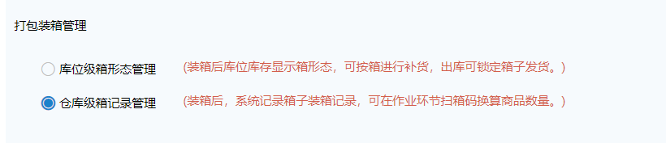

（1）库位级箱形态管理，默认模式，有货箱形态的库存，打包装箱能正常生成唯一货箱库存。

（2）仓库级箱记录管理，切换后原有货箱形态的库存全部转化成拆零库存，打包装箱生成箱条码，但是没有货箱库存，不影响现有拆零库存数量，相当于支持按箱内数量快速录入商品的功能。

（3）支持页面如下：

PC页面：分拣验货、条码验货、单种验货、自定义环节-校验条码验货、拆包补打-装箱&生成子母件、大宗装箱；

PDA页面：订单/批量/料框拣货、单批次拣货页、拣货商品确认、播种拣货、容器拣货、条码验货、抽检验货、条码验货、生产批次列表页、大宗拣货、大宗装箱、自由上架-逐件取货、快速上架-逐件取货、补货任务-拆零补货、移库任务-拆零移库、加工领料、盘点任务、单批次盘点、快速盘点、正次转换、容器移库-逐件取货。

注：

①从库位级箱形态管理切换成仓库级箱记录管理模式，会将唯一货箱库存全部转化为拆零库存，若当前仓有锁定或待生效的唯一货箱，则不支持切换；

②从仓库级箱记录管理切换成库位级箱形态管理模式，会将打包装箱页面现有箱记录全部作废，变成失效模式。

③仓库级箱记录管理模式下，PDA仓内页面支持扫混箱条码（混箱：一个唯一箱中包含多个不同sku商品），扫描后带出箱内明细及对应数量，其他页面不支持扫混箱条码，扫描后会报错提示。

④仓库级箱记录管理模式下，若业务配置开启PDA拣货校验商品条码为仅商品种类/库位、商品种类，则在PDA对应拣货页面不支持扫箱条码带出箱内明细及对应数量。

#### 三、加工单配置

进行仓内加工作业时，需指定原料商品的锁定区域/库区以及库位的使用方式，指定后，创建仓内加工单，会自动锁定原料商品库位。

#### 四、绩效配置

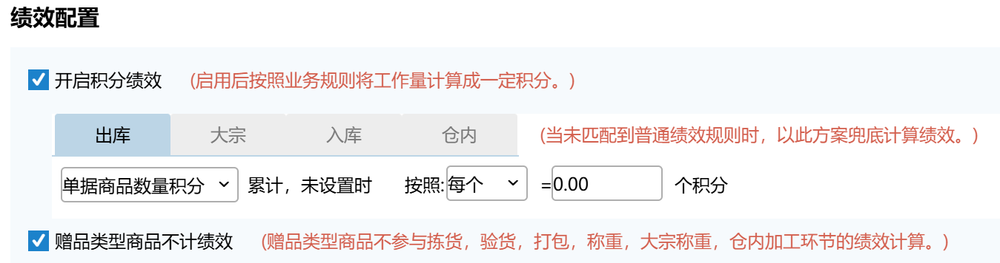

开启积分绩效：开启后，可根据模块分别设置出库、大宗、入库、仓内四个模块下各作业环节积分绩效计算方式。当未匹配到普通绩效规则时，以此方案兜底计算绩效，若匹配到普通绩效规则，则按照普通绩效规则计算。各模块独立设置，互不影响。

对于已经开启积分绩效的仓库，各模块默认设置：单据商品数量积分累计，未设置时按照：每个=0个积分；

对于新开启积分绩效的仓库，各模块默认设置：单据商品数量积分累计，未设置时按照：每个=1个积分。

注：各模块对应的计算基准略有不同，具体含义如下：(前提：示例中仓库未设置绩效策略或无匹配普通绩效规则）

##### 出库模块

(1)单据商品数量积分累计，未设置时按照：每个=[n]个积分

含义：根据单据中sku在商品绩效积分对应环节设置的积分值计算并累加，作为本单据的积分值。若对应环节未设置积分，则用n进行计算。

例1：仓库1开启积分绩效，设置出库模块——单据商品数量积分累计，未设置时按照：每个=[3]个积分。

         仓库1下有普通单据1，包括明细sku1 2个，sku2 3个，其中sku1 打单环节积分为2，sku2 打单环节积分为空，将单据1提交打单。

         打单环节计算积分结果：2*2+3*3=13    [即：sku1数量*sku1打单环节积分+sku2数量*默认积分]

(2)单据商品种类积分累计，未设置时按照：每种=[n]个积分

含义：根据单据中单种sku在商品绩效积分对应环节设置的积分值计算并累加，作为本单据的积分值。若对应环节未设置积分，则用n进行计算。

例1：仓库1开启积分绩效，设置出库模块——单据商品种类积分累计，未设置时按照：每个=[3]个积分。

         仓库1下有普通单据1，包括明细sku1 2个，sku2 3个，其中sku1 打单环节积分为2，sku2 打单环节积分为空，将单据1提交打单。

         打单环节计算积分结果：2+3=5    [即：sku1打单环节积分+默认积分]

(3)一个单据按照：每个=[n]个积分

含义：根据单据数量计算积分，积分值=单据数量*n。若部分作业时单据数为0，则积分=0。

例2：仓库1开启积分绩效，设置出库模块——一个单据按照：每个=[3]个积分。

         仓库1下有普通单据1，包括明细sku1 2个，sku2 3个，将单据1提交打单。

         打单环节计算积分结果：1*3=3    [即：单据数量*默认积分]

(4)单据商品数按照：每个=[n]个积分/阶梯

含义：根据单据商品数计算积分，有按每个/按阶梯两种算法。

例3：仓库1开启积分绩效，设置出库模块——单据商品数按照：每个=[2]个积分。

         仓库1下有普通单据1，包括明细sku1 2个，sku2 3个，将单据1提交打单。

         打单环节计算积分结果：(2+3)*2=10    [即：(sku1数量+sku2数量)*默认积分]

例4：仓库1开启积分绩效，设置出库模块——单据商品数按照： 阶梯

         数量区间：0个-3个，首数量：2个，积分：2个，续数量：1个，续积分：2个；

         数量区间：3个-无穷多个，首数量：4个，积分：4个，续数量：1个，续积分：2个；

         仓库1下有普通单据1，包括明细sku1 2个，sku2 3个，将单据1提交打单。

         打单环节计算积分结果：4+2=6  [即：单据1商品数5个，落到第二区间，首数量4个，积分4个，续数量1个，续积分2个]

(5)单据种类数按照：每个=[n]个积分/阶梯

含义：根据单据种类数计算积分，有按每个/按阶梯两种算法。

例5：仓库1开启积分绩效，设置出库模块——单据种类数按照：每个=[2]个积分。

         仓库1下有普通单据1，包括明细sku1 2个，sku2 3个，将单据1提交打单。

         打单环节计算积分结果：2*2=4    [即：单据种类数*默认积分]

例6：仓库1开启积分绩效，设置出库模块——单据商品数按照： 阶梯

         种类区间：0种-2种，首种类：1种，积分：2个，续种类：1个，续积分：1个；

         种类区间：2种-无穷多种，首种类：3种，积分：3个，续种类：1种，续积分：2个；

         仓库1下有单据1，包括明细sku1 2个，sku2 3个，将单据1提交打单。

         打单环节计算积分结果：2+1=3   [即：单据1种类数2种，落到第一区间，首种类1个，积分2个，续种类1种，续积分1个]

##### 大宗模块

(1)单据商品数量积分累计，未设置时按照：每个=[n]个积分

含义：根据单据中sku在商品绩效积分对应环节设置的积分值计算并累加，作为本单据的积分值。若对应环节未设置积分，则用n进行计算。

例1：仓库1开启积分绩效，设置大宗模块——单据商品数量积分累计，未设置时按照：每个=[3]个积分。

         仓库1下有大宗单据1，包括明细sku1 2个，sku2 3个，其中sku1 大宗出库环节积分为2，sku2 大宗出库环节积分为空，将单据1提交出库。

         大宗出库环节计算积分结果：2*2+3*3=13    [即：sku1数量*sku1大宗出库环节积分+sku2数量*默认积分]

(2)单据商品种类积分累计，未设置时按照：每种=[n]个积分

含义：根据单据中单种sku在商品绩效积分对应环节设置的积分值计算并累加，作为本单据的积分值。若对应环节未设置积分，则用n进行计算。

例1：仓库1开启积分绩效，设置大宗模块——单据商品种类积分累计，未设置时按照：每个=[3]个积分。

         仓库1下有大宗单据1，包括明细sku1 2个，sku2 3个，其中sku1 大宗出库环节积分为2，sku2 大宗出库环节积分为空，将单据1提交出库。

        大宗出库环节计算积分结果：2+3=5    [即：sku1大宗出库环节积分+默认积分]

(3)单据商品数按照：每个=[n]个积分/阶梯

含义：根据单据商品数计算积分，有按每个/按阶梯两种算法。

例2：仓库1开启积分绩效，设置大宗模块——单据商品数按照：每个=[2]个积分。

         仓库1下有大宗单据1，包括明细sku1 2个，sku2 3个，将单据1提交出库。

         大宗出库环节计算积分结果：(2+3)*2=10    [即：(sku1数量+sku2数量)*默认积分]

例3：仓库1开启积分绩效，设置大宗模块——单据商品数按照： 阶梯

         数量区间：0个-3个，首数量：2个，积分：2个，续数量：1个，续积分：2个；

         数量区间：3个-无穷多个，首数量：4个，积分：4个，续数量：1个，续积分：2个；

         仓库1下有大宗单据1，包括明细sku1 2个，sku2 3个，将单据1提交出库。

         大宗出库环节计算积分结果：4+2=6  [即：单据1商品数5个，落到第二区间，首数量4个，积分4个，续数量1个，续积分2个]

(4)单据种类数按照：每个=[n]个积分/阶梯

含义：根据单据种类数计算积分，有按每个/按阶梯两种算法。

例4：仓库1开启积分绩效，设置大宗模块——单据种类数按照：每个=[2]个积分。

         仓库1下有大宗单据1，包括明细sku1 2个，sku2 3个，将单据1提交出库。

         大宗出库环节计算积分结果：2*2=4    [即：单据种类数*默认积分]

例5：仓库1开启积分绩效，设置大宗模块——单据种类数按照： 阶梯

         种类区间：0种-2种，首种类：1种，积分：2个，续种类：1个，续积分：1个；

         种类区间：2种-无穷多种，首种类：3种，积分：3个，续种类：1种，续积分：2个；

         仓库1下有大宗单据1，包括明细sku1 2个，sku2 3个，将单据1提交出库。

         大宗出库环节计算积分结果：2+1=3   [即：单据1种类数2种，落到第一区间，首种类1个，积分2个，续种类1种，续积分1个]

##### 入库模块

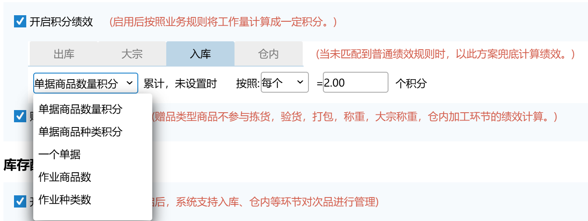

(1)单据商品积分累计，未设置时按照：每个=[n]个积分

含义：根据单据中sku在商品绩效积分对应环节设置的积分值计算并累加，作为本单据的积分值。若对应环节未设置积分，则用n进行计算。

例1：仓库1开启积分绩效，设置入库模块——单据商品积分累计，未设置时按照：每个=[3]个积分。

         仓库1下有待入库单据1，包括明细sku1 2个，sku2 3个，其中sku1 入库环节积分为2，sku2 入库环节积分为空，将单据1确认入库。

         入库环节计算积分结果：2*2+3*3=13    [即：sku1数量*sku1入库环节积分+sku2数量*默认积分]

(2)单据商品种类积分累计，未设置时按照：每种=[n]个积分

含义：根据单据中单种sku在商品绩效积分对应环节设置的积分值计算并累加，作为本单据的积分值。若对应环节未设置积分，则用n进行计算。

例1：仓库1开启积分绩效，设置入库模块——单据商品种类积分累计，未设置时按照：每个=[3]个积分。

         仓库1下有待入库单据1，包括明细sku1 2个，sku2 3个，其中sku1 入库环节积分为2，sku2 入库环节积分为空，将单据1确认入库。

         入库环节计算积分结果：2+3=5    [即：sku1入库环节积分+默认积分]

(3)一个单据按照：每个=[n]个积分

含义：根据单据数量计算积分，积分值=单据数量*n。

例2：仓库1开启积分绩效，设置入库模块——一个单据按照：每个=[3]个积分。

         仓库1下有待入库单据1，包括明细sku1 2个，sku2 3个，将单据1确认入库。

         入库环节计算积分结果：1*3=3    [即：单据数量*默认积分]

(4)作业商品数按照：每个=[n]个积分/阶梯

含义：根据实际作业商品数计算积分，有按每个/按阶梯两种算法。

例3：仓库1开启积分绩效，设置入库模块——作业商品数按照：每个=[2]个积分。

         仓库1下有入库预约单1，包括明细sku1 10个，sku2 10个，部分入库生成待入库单据1，包括明细sku1 2个，sku2 3个，将单据1确认入库。

         入库环节计算积分结果：(2+3)*2=10    [即：(sku1数量+sku2数量)*默认积分]

例4：仓库1开启积分绩效，设置入库模块——作业商品数按照： 阶梯

         数量区间：0个-3个，首数量：2个，积分：2个，续数量：1个，续积分：2个；

         数量区间：3个-无穷多个，首数量：4个，积分：4个，续数量：1个，续积分：2个； 

         仓库1下有入库预约单1，包括明细sku1 10个，sku2 10个，部分入库生成待入库单据1，包括明细sku1 2个，sku2 3个，将单据1确认入库。

         入库环节计算积分结果：4+2=6  [即：单据1商品数5个，落到第二区间，首数量4个，积分4个，续数量1个，续积分2个]

(5)作业种类数按照：每个=[n]个积分/阶梯

含义：根据实际作业种类数计算积分，有按每个/按阶梯两种算法。

例4：仓库1开启积分绩效，设置入库模块——作业种类数按照：每个=[2]个积分。

         仓库1下有入库预约单1，包括明细sku1 10个，sku2 10个，部分入库生成待入库单据1，包括明细sku1 2个，sku2 3个，将单据1确认入库。

         入库环节计算积分结果：2*2=4    [即：作业种类数*默认积分]

例5：仓库1开启积分绩效，设置入库模块——作业种类数按照： 阶梯

         种类区间：0种-2种，首种类：1种，积分：2个，续种类：1个，续积分：1个；

         种类区间：2种-无穷多种，首种类：3种，积分：3个，续种类：1种，续积分：2个；

         仓库1下有入库预约单1，包括明细sku1 10个，sku2 10个，部分入库生成待入库单据1，包括明细sku1 2个，sku2 3个，将单据1确认入库。

         入库环节计算积分结果：2+1=3   [即：单据1种类数2种，落到第一区间，首种类1个，积分2个，续种类1种，续积分1个]

##### 仓内模块

(1)单据商品积分累计，未设置时按照：每个=[n]个积分

含义：根据单据中sku在商品绩效积分对应环节设置的积分值计算并累加，作为本单据的积分值。若对应环节未设置积分，则用n进行计算。

例1：仓库1开启积分绩效，设置仓内模块——单据商品积分累计，未设置时按照：每个=[3]个积分。

         仓库1下有待作业库存转移作业单1，包括明细来源库位1 sku1 目标库位2 sku2  计划数量3个，其中sku1 转移环节积分为2，sku2 转移环节积分为空，将作业单1确认完成。

         转移环节计算积分结果：2*2=4    [即：来源库位sku完成数量*来源库位sku转移环节积分]

(2)单据商品种类积分累计，未设置时按照：每种=[n]个积分

含义：根据单据中单种sku在商品绩效积分对应环节设置的积分值计算并累加，作为本单据的积分值。若对应环节未设置积分，则用n进行计算。

例1：仓库1开启积分绩效，设置仓内模块——单据商品种类积分累计，未设置时按照：每个=[3]个积分。

        仓库1下有待作业库存转移作业单1，包括明细来源库位1 sku1 目标库位2 sku2  计划数量3个，其中sku1 转移环节积分为2，sku2 转移环节积分为空，将作业单1确认完成。

         转移环节计算积分结果：3    [即：默认积分]

(3)一个单据按照：每个=[n]个积分。若部分作业时单据数为0，则积分=0。

含义：根据单据数量计算积分，积分值=单据数量*n。

例2：仓库1开启积分绩效，设置仓内模块——一个单据按照：每个=[3]个积分。

         仓库1下有待作业库存转移作业单1，包括明细来源库位1 sku1 目标库位2 sku2  计划数量3个，将作业单1确认完成。

         转移环节计算积分结果：1*3=3    [即：单据数量*默认积分]

(4)作业商品数按照：每个=[n]个积分/阶梯

含义：根据实际作业商品数计算积分，有按每个/按阶梯两种算法。

例3：仓库1开启积分绩效，设置仓内模块——作业商品数按照：每个=[2]个积分。

         仓库1下有待作业库存转移作业单1，包括明细来源库位1 sku1 目标库位2 sku2  计划数量3个，完成数量2个。

         转移环节计算积分结果：2*2=4   [即：来源库位sku完成数量*默认积分]

例4：仓库1开启积分绩效，设置仓内模块——作业商品数按照： 阶梯

         数量区间：0个-3个，首数量：2个，积分：2个，续数量：1个，续积分：2个；

         数量区间：3个-无穷多个，首数量：4个，积分：4个，续数量：1个，续积分：2个；

         仓库1下有待作业库存转移作业单1，包括明细来源库位1 sku1 目标库位2 sku2  计划数量3个，完成数量2个。

         转移环节计算积分结果：2  [即：作业单1完成商品数2个，落到第一区间，首数量2个，积分2个]

(5)作业种类数按照：每个=[n]个积分/阶梯

含义：根据实际作业种类数计算积分，有按每个/按阶梯两种算法。

例4：仓库1开启积分绩效，设置仓内模块——作业种类数按照：每个=[2]个积分。

         仓库1下有待作业库存转移作业单1，包括明细来源库位1 sku1 目标库位2 sku2  计划数量3个，完成数量2个。

         转移环节计算积分结果：1*2=2    [即：作业单1完成商品作业种类数*默认积分]

例5：仓库1开启积分绩效，设置仓内模块——作业种类数按照： 阶梯

         种类区间：0种-2种，首种类：1种，积分：2个，续种类：1个，续积分：1个；

         种类区间：2种-无穷多种，首种类：3种，积分：3个，续种类：1种，续积分：2个；

         仓库1下有待作业库存转移作业单1，包括明细来源库位1 sku1 目标库位2 sku2  计划数量3个，完成数量2个。

         转移环节计算积分结果：2   [即：作业单1完成商品作业种类数1种，落到第一区间，首种类1个，积分2个]

注：赠品类型商品不计绩效：开启后赠品属性的商品不参与拣货、验货、称重、打包环节的绩效统计。

#### 五、库存配置

##### 5.1开启次品库存管理

开启后，系统支持对入库、仓内等环节对次品进行管理。

模式解释：

1.标准模式：WMS出库、入库、盘点调整，外部ERP能正常接收正次品数量。例：商品A入库，正品100个，次品10个，确认入库后，回传ERP **商品A入库100个正品，10个次品。**

2.对内模式：外部ERP无法区分正次品时，同时需要保障两边库存总量的一致性。此时，次品仅在仓内体现，不支持正次订单锁库，类似冻结库存需通过指定方式出库，入库、出库、盘点均按正品库存回传。例：商品A入库，正品100个，次品10个，确认入库后，回传ERP **商品A入库110个。**

3.半对外模式：外部ERP不接收次品数量，次品仅靠WMS进行管理，故出入库及盘点时仅正品数量对外有效 ，库存也仅正品库存变更与外部保持一致。例：商品A入库，正品100个，次品10个，确认入库后，回传ERP **商品A入库100个**。

4.自定义设置：开启3pl的公司支持自定义设置不同货主的次品库存管理模式。

5.开启开关后，仓内作业新增正次转换页面，支持对正品批量转次、残次品批量转正；库存查询页面、入库、仓内作业等操作新增库存属性，展示商品的正、次库存属性。

##### 5.2 开启自定义库存描述

开启后可针对商品库存属性不同设置个性描述字段

点击设置，进入自定义属性设置弹窗，属性值类型有三种：文本、预设值、固定属性值。

属性值类型不同，正品值、次品值输入格式不同。

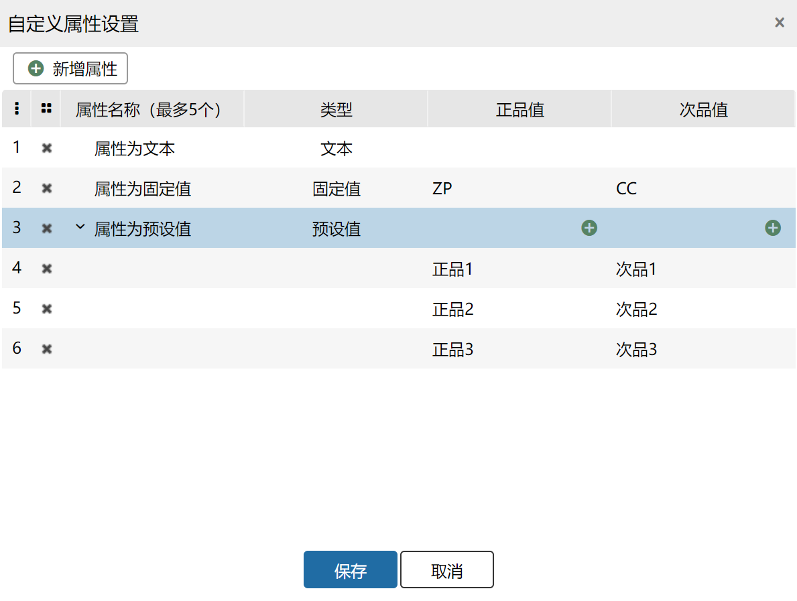

注：属性名称不允许重复，最多5个；

正品值之间不允许重复、次品值之间不允许重复；

属性值类型为固定值时，正品值、次品值非必填；

属性值类型为预设值时，正品值、次品值至少各填一个，最多各10个。

支持录入库存自定义描述的页面包括：清点单/收货台账、理货清点（包括PC/PDA）、进货查验记录、正次转换、理货清点。以PC-理货清点-快速清点为例进行说明，详见对应页面[操作手册](https://hupun.yuque.com/unzko7/lsbfg0/cogi67y2zn60c0q3#V9Nhe)。

##### 5.3 开启次品审核

开启后，正次转换或验货报次后生成正次转换类型的单据状态为待审核。（包括PC端、PDA端）

操作员有审核权限时即可操作审核单据，审核成功后单据为已完成。

角色管理->操作权限

若操作已关闭，则单据关闭。

注：

①开启次品审核且单据状态待审核时，备注允许编辑；

②开启新版审核后台开关后，此配置置灰不可编辑。

##### 5.4 报次仅可选择次品库位

开启后，入库和正品转次时次品明细库位仅允许选择库位类型为次品的库位。

##### 5.5 开启指导上架按库位容量/承重推荐库位

开启后，指导库位时计算当前商品的总体积/重量和推荐库位的容量，超出则自动拆分明细指导多个库位。当前仅支持PC：采购入库单、其他入库单、销退入库单；PDA：指导上架。

例：商品b01，商品重量1kg，商品体积1m³；库位A01，库位容积20m³，已用容积8m³，库位承重50kg，已用承重30kg，设置优先商品b01；库位A02，库位容积20m³，已用容积5m³，库位承重50kg，已用承重40kg，设置优先商品b01。

计算可容数量：库位A01剩余容积12m³，剩余承重20kg，取较小值12；库位A02剩余容积15m³，剩余承重10kg，取较小值10。按商品b01的重量、体积计算，库位A01可容数量12个，库位A02可容数量10个。

验货入库扫描商品b01，数量20，点击指导上架，系统自动指导库位，将b01拆成2个明细，其中库位A01上12个，库位A02上8个。

注：①一个明细最多指导10个库位，还有未分配的数量单独拆出，指导库位为空；

②此开关与序列号商品管理开关不能同时开启。

#### 六、仓内配置

开启后，对于指导上架，新品入库上架，容器上架、补货上架指导无结果的情况进行补充，指导出空货位进行上架。

1.匹配范围，同时满足以下2点才能匹配规则

①.商品的品牌/分类/等级在设置的商品品牌/商品分类/商品等级范围里；

②.选择的指导方式在设置的使用方式范围内。

2.仅查找空库位

①.未勾选，在选择的区域里按照商品数量从少到多的指导库位，空库位优先。

②.勾选仅查找空库位+路径优先，在选择的区域里找库位编码最小的空库位。

③.勾选仅查找空库位+同款优先，在选择的区域里找库位编码距离同款库位编码最近且库位编码最小的空库位。

若之前的指导无结果，则按照指导补充规则设置的商品品牌/商品等级/商品分类+指导库区+库位使用方式+是否找空库位去指导。

示例：

sku1-品牌A、sku2-品牌B、sku3-品牌A、sku401-品牌A，sku501-品牌B

sku1-在库区02设置了优先库位kw01-拣选库位

sku2-在库区03下库位kw02有余量-拣选库位

sku3-在库区04下有历史库位kw03-拣选库位

库区01下有空库位kw04-存储、kw05-拣选

库区02下有空库位kw06-拣选，kw07有sku502的库存（sku501的同款）kw08-存储、kw09-存储

规则01，设置了商品品牌A+指导库区01+库位使用方式拣选+路径优先

规则02，设置了商品品牌B+指导库区02+库位使用方式存储+同款优先

现在容器RQ0026里有商品sku1、sku2、sku3、sku401、sku501库存去上架到库位

a.pda上指导时选择不限

sku1指导出库位kw01

sku2指导出库位kw02

sku3指导出库位kw03

sku401指导出库位kw05

sku501指导出库位kw08

b.pda上指导时选择拣选库位

sku1指导出库位kw01

sku2指导出库位kw02

sku3指导出库位kw03

sku401指导出库位kw05

sku501无指导结果

c.pda上指导时选择存储库位

sku1无指导结果

sku2无指导结果

sku3无指导结果

sku401无指导结果

sku501指导出kw08

#### 七、补货配置

9、开启补货上架自动生成补货任务：开启后系统定时根据库区预警生成补货任务

9.1 补货模式分为按箱补货和拆零补货，系统会根据设置的间隔时间和任务详情数量进行任务拆分和生成，补货分配偏好分为效率优先和路径优先

a.路径优先：【走路最少】根据存储库位编码从小到大分配给商品。若该商品有存储库位库存满足需求量，则直接分配编码最小的存储库位；若商品没有满足需求量的存储库位库存，则直接分配最小的库位库存，锁定库存为负数；若商品的各个存储库位库存不满足需求量但所有存储库位库存满足需求量，则按照存储库存编码从小到大分配，直至足够。

b.效率优先：【拿的次数最少】根据商品的存储库位库存最接近商品所需量进行分配库位。若该商品有存储库位库存满足需求量，则直接分配满足需求量且库位编码的存储库位；若商品没有满足需求量的存储库位库存，则直接分配库存数量最大的存储库位，锁定库存为负数；若商品的各个存储库位库存不满足需求量但所有存储库位库存满足需求量，则按照存储库存数量从大到小分配，直至足够。

9.2 开启缺货补货：开启后订单缺货即会生成补货任务，已经生成定时补货任务的系统将自动提高该任务优先级。

a.订单范围：支持普通订单和大宗订单锁定失败触发自动缺货补货。

b.锁定失败也生成缺货补货：决定手动截单、清仓波次、手工波次锁定失败时是否触发自动缺货补货。

c.指定锁定范围失败也生成任务：已开启则按照指定的锁库范围去补货；否则按全仓去补。

9.3 商品历史库位判断：开启后当目标库区没有商品库存时，补货到该商品最后存放的库位。

9.4 历史库位允许混放：开启后历史库位如有其它商品则支持混放，否则将不匹配历史库位。

10、允许补货任务自动完结：开启后，实际补货数量<计划补货数量，也视为完成补货任务（即不存在部分补货）

11、开启补货任务自动合并：开启后系统定时合并未作业的补货任务。

策略解释：

1.一键合并作业范围：取补货上架页面所有待作业且未被操作员领取的任务明细进行合并。

2.合并作业类型：即合并补货任务的范围；

1)合并同类型：合并任务时，生成形式相同的会进行合并；例：待作业的补货任务有：任务01-缺货补货，任务02-定时补货，任务03-缺货补货、任务04-定时补货，一键合并作业类型选择合并同类型，任务01和任务03合并，任务02和任务04合并。

2）混合类型：合并任务时根据勾选的作业类型进行合并，操作如下图：

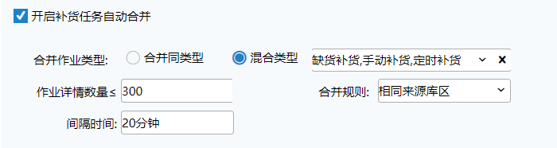

例1：合并作业类型选择混合类型，勾选了缺货补货，待作业的补货任务有：任务01-缺货补货，任务02-定时补货，任务03-缺货补货、任务04-定时补货，一键合并作业时，只取任务01、任务03进行合并；

例2：合并作业类型选择混合类型，勾选了缺货补货、定时补货，待作业的补货任务有：任务01-缺货补货，任务02-定时补货，任务03-缺货补货、任务04-定时补货，一键合并作业时，取任务01、任务02、任务03、任务04进行合并。

3.作业详情数量：合并生成新的补货任务的详情数量。

4.合并规则：合并补货任务的依据。

1）相同来源库区：来源库区相同的补货任务合并到一个任务中；例：补货任务01：商品a 来源库区A、商品b 来源库区B、商品c 来源库区C  补货任务02：商品d 来源库区A、商品e 来源库区C，一键合并作业生成3个补货任务：任务1：商品a 来源库区A、商品d 来源库区A；任务2：商品b 来源库区B；任务3：商品c 来源库区C、商品e 来源库区C.

2）相同目标库区：目标库位相同的补货任务合并到一个任务中；

3）相同来源库区及目标库区：来源库区、目标库区相同的补货任务才会合并到一个任务中。

注意：

1. 同商品来源库位、目标库位相同的补货明细会合并成1条；

2.一键合并任务时，拆零的与拆零的合并，箱子与箱子的合并；

3.一键合并任务生成时，补货任务无法在pda领取。

4.生成补货任务排序：再满足设置的合并规则的情况下，根据明细的来源、目标和商品编码进行排序；

1）合并规则为相同来源库区，排序为：目标区域编码>目标库区编码>来源库位编码>目标库位编码>商品编码

2)合并规则为相同来目标库区，排序为：来源区域编码>来源库区编码>来源库位编码>目标库位编码>商品编码

3）合并规则为相同来源及目标库区，排序为：来源库位编码>目标库位编码>商品编码

12.开启补货中转：开启后可进行分段补货 

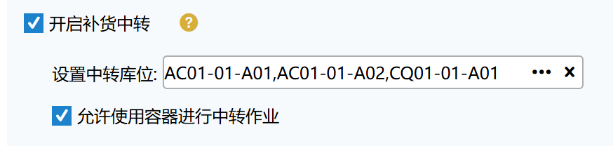

12.1 设置中转库位

在补货作业中，若选择的目标库位和中转库位一致，则完成该补货作业后，系统会自动创建一个待作业的补货任务，明细的来源库位为中转库位，目标库位为原补货任务的目标库位。

12.2 允许使用容器进行中转作业

在补货作业中，目标库位允许选择容器，完成该补货作业后，系统会自动创建一个待作业的补货任务，明细的来源库位为中转容器，目标库位为原补货任务的目标库位。

#### 八、预包配置

1.开启定时生成预包任务并设置间隔时间后，系统会根据预包预警上下限+间隔时间定时生成预包任务；未开启或未到间隔时间则不会自动生成。

2.开启预配订单缺货后自动生成预包任务，预配订单生成时，若库位库存不足，会自动生成预包任务；未开启则不会自动生成。具体计算方式请参考[预包任务](https://hupun.kf5.com/hc/kb/article/1553778/)05、06节内容。

#### 九、上架管理

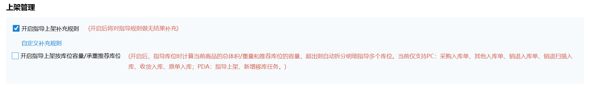

##### 9.1开启指导上架补充规则

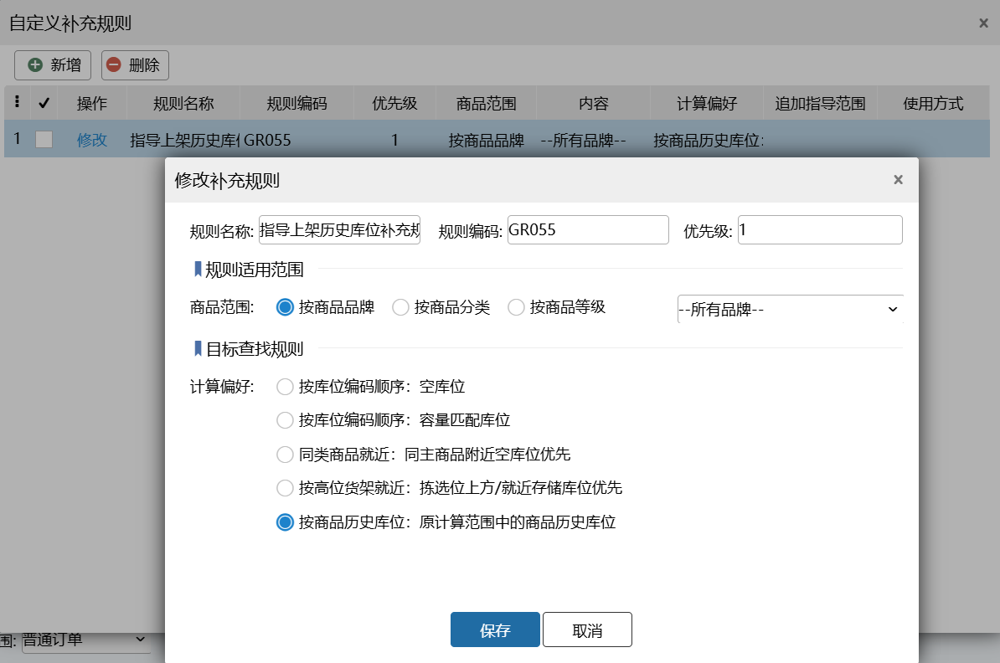

指导上架固定规则没有匹配到库位时，会根据配置的自定义补充规则去匹配库位，根据不同的计算偏好去寻找库位作为指导上架的结果库位。指导时会按照所有配置的自定义补充规则都去匹配库位，最后将所有库位排序后得出最优库位作为指导库位。

> 更新: 2026-07-08 16:08:27  

> 原文: <https://hupun.yuque.com/unzko7/lsbfg0/caki7lz4105n2vpg>

---

### 03.2.5 业务配置-出库配置

> 原始文件来源：`00-源文件/操作手册/仓内策略/业务配置-出库配置.md`

业务配置主要是针对当前登录仓库设置流程配置。

出库配置

流程图：详见上图，表示订单的操作流程。用户可根据当前仓库的情况选择开启或关闭拣货、验货、打包、称重环节。当订单被提交至待出库环节时均会触发自动发货，即通知对接平台（例erp）订单发货。

#### **基础出库业务：**

##### **1、快速出库**

**1、开启出库自定义环节**：开启后，可对指定订单出库流程进行自定义作业。

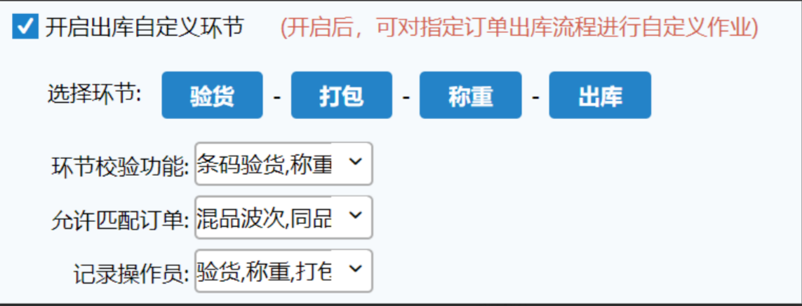

**2、开启前置发货**：开启后，选择前置发货的环节，当订单在此环节确认后则会通知erp发货（直接确认订单），快速提交的跨节点订单也符合可以前置发货。如果为万里牛ERP，可配合ERP的通知线上发货时机提前功能，实现线上平台发货。

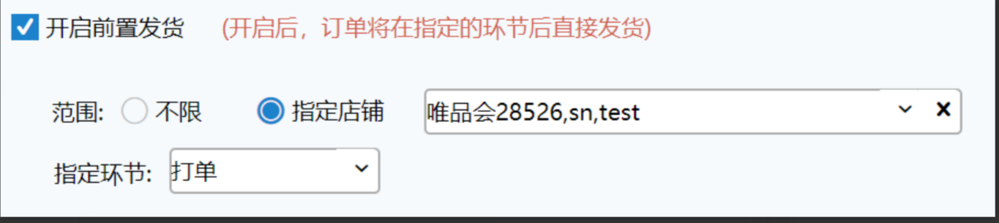

①、前置发货为自动获取单号后，获取单号后自动计算运费成本然后通知ERP发货。

②、前置发货为自动获取单号后，自动获取单号环节是打单，则订单生成波次或打到零拣时不计算运费成本，获取单号后计算运费然后通知ERP发货。

前置发货为打单环节，订单生成波次或打到零拣时计算运费成本，确认打单后通知ERP发货。

**3、标记订单辅助优先处理**：开启后，含有指定标记的订单将优先进入出库流程

开启开关，例如选择加急标记订单  

①、锁库：带有加急订单的优先锁库

②、波次生成：波次策略开启禁止降级，由于未达到波次容量下限或已达到最大波次数，加急订单所属波次会降级，其他标记订单和普通不会降级；

③、波次中订单排序：在现有逻辑的接单时间前加了标记，货主>相同库区>同品>承运商>品牌>发票>库位>混品>标记>接单时间

④、领单：含有加急订单的波次会有“优”标记，领单时会优先被领取到

关闭开关，标记订单无特殊逻辑，与普通订单一样。

**4、开启同品波次快速出库流程**：开启后，同品波次将会在确认打单/拣货后直接提交至验货/打包/批量称重/待出库环节。方便用户对于同品波次的快速处理。

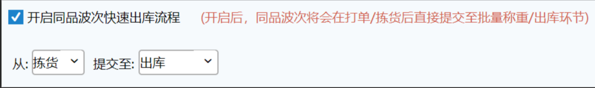

**5、开启预配波次快速出库流程**：开启后，预配波次将会在确认打单/拣货后直接提交至验货/打包/批量称重/待出库环节。方便用户对于预配波次的快速处理。

**6、开启指定策略快速出库流程**：开启后，指定的波次将会在打单/拣货后直接提交至批量称重/出库环节，此项优先级最高。方便用户对于指定波次订单的快速处理。

注意：开启指定策略快速出库流程的环节跳转与同品波次/预配波次的快速出库流程有冲突时，以指定策略的快速出库流程为准。

**7、开启快速验货后提交至待出库**：开启后，使用快速验货提交的订单将直接提交至称重/出库环节，包括PC、PDA。

##### **2、流程管理**

**1、无匹配波次订单自动进入零拣打单**

开启后，在待分配页面匹配不到波次策略的订单，会自动打到零拣；未开启则不会自动打到零拣，可以手动打到零拣。

**2、开启商品条码截取**：开启后，扫描入库、出库验货环节中将商品条码同系统内截取后结果进行比对校验。

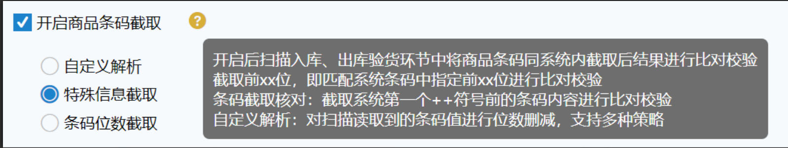

①.特殊信息截取：扫描输入商品条码，截取系统第一个++符号前的条码内容进行比对校验。

②.条码位数截取：扫描输入商品条码，截取输入条码的前若干位，与商品信息的条码进行比对校验。

③.自定义解析：扫描输入商品条码，忽略X位后与商品信息的条码进行比对校验。

**3、开启扫描条码强制提交**：开启后，扫描此条码可替代点击提交的动作，当验货或者其他环节因业务需要无法开启自动提交时，扫码后即相当于点击了提交按钮。

**注意：**

a.系统中有商品条码/辅助条码/箱条码是wanliniu666的，开启此开关需要先将商品条码/辅助条码/箱条码清除。

b.此开关开启后，不允许新增商品条码/辅助条码/箱条码是wanliniu666、

c.所支持的环节：分拣验货(单笔匹配模式)/条码验货/自定义环节条码验货/订单打包/收货入库/销退扫描入库/拆包补打/大宗装箱。

d.大宗装箱扫描此条码可将剩余未装箱商品全部装为一箱并自动提交装箱（序列号商品需手动操作录入）。

**4、出库作业扫描订单匹配波次**：开启后，设置页面按波次作业环节可通过扫描其中一单匹配波次，未设置页面不支持扫描其中一单匹配波次。

**注：此配置关联公司级后台开关(同单据自定义规则)，开启后才显示此配置项，未开启则不显示，原有支持扫订单带波次的页面仍支持带出。**

****

**5、出库作业扫描商品异常提醒**：开启后，扫描错误会有提醒弹窗需手工关闭。目前支持PC条码验货、大宗装箱两个页面。

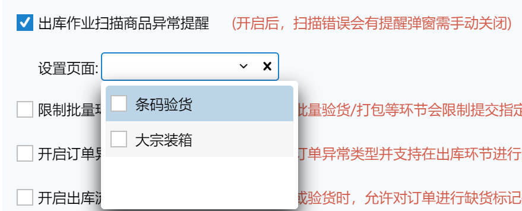

勾选效果：扫描错误条码时弹窗提示报错，可点击回车键关闭

未勾选效果：无弹窗提醒

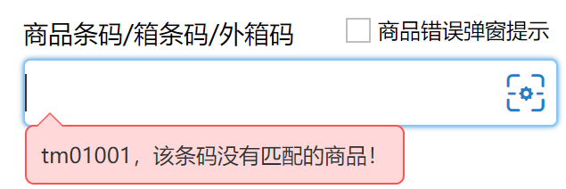

**6、限制批量环节指定波次提交**：开启后，批量验货/打包等环节会限制提交指定波次类型，逐单提交不受限制。

例：设置页面为PC-快速验货，限制波次类型为[清仓]，则在PC快速验货页面扫描清仓波次配货单号时，系统会提示该波次类型不支持批量匹配，支持通过扫描该波次下单笔订单号匹配单据。

**7、开启订单异常分类**：开启后可自定义订单异常类型，根据生成单号时的异常原因关键字解析，解析到指定关键字后订单打上该分类标记，并支持通过查询项“订单异常分类”查询到对应订单。

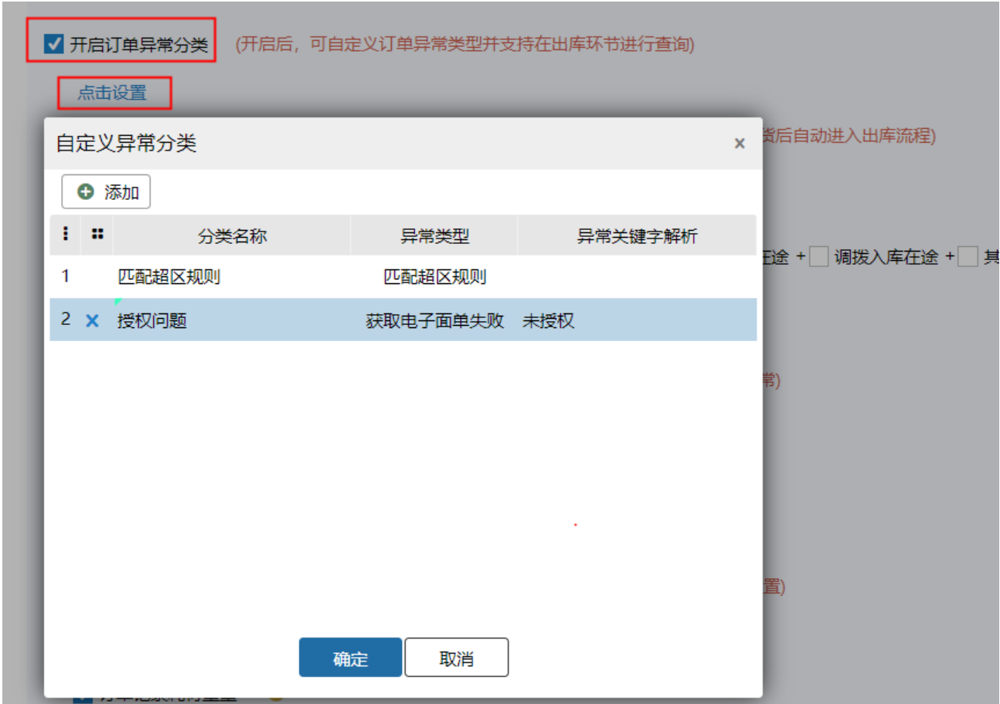

其中：

1、“匹配超区规则”是系统默认分类，开启开关就会显示，订单生成单号时提示超区替换的都会自动打上该分类标记

2、支持手动添加5个分类，异常类型固定为“获取电子面单失败”

3、分类名称限6个字，异常关键字解析最多20条，字数合计最多50字，在同一个仓库下不允许重复

4、添加分类后，“订单异常分类”查询下拉项会自动显示该分类

**8、开启缺货订单处理**：拣货或验货时，允许对订单进行缺货标记并单独处理异常。

:::color3
场景：适用于仓储出库环节的异常处理场景，当出现系统库存与实物库存不一致（如拣货时货位实物不足）、商品错发漏装等情况时，可通过该配置实现订单缺货标记、异常单独处理，避免异常订单影响正常出库流程，同时联动ERP系统同步缺货信息，保障库存数据准确性和订单交付效率。

:::

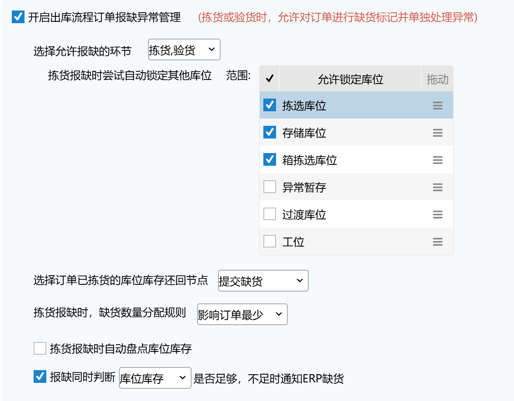

①. 选择允许报缺的环节

功能说明‌：设置可触发报缺操作的业务环节，当前配置为“拣货、验货”，即仅在这两个环节可标记订单缺货。

②拣货报缺时尝试自动锁定其他库位

功能说明‌：拣货环节标记缺货时，系统自动锁定指定范围内的其他库位，防止这些库位的库存被分配给其他订单，避免库存资源浪费和后续订单报错。（注：此项配置关联允许报缺环节，勾选“拣货”才显示此配置。）

操作步骤‌：

勾选“允许锁定库位”选项，启用自动锁定功能；

在“范围”列表中，勾选需要锁定的库位类型，当前配置已勾选“拣选库位”“存储库位”“箱拣选库位”，系统将仅对这三类库位执行锁定操作，拖动顺序可调整锁定优先级。

系统订单报缺重锁库存逻辑可按以下层级整理：

第一层：库存形态优先级锁定‌

若仓库开启了优先锁箱配置，则优先锁定货箱库存，仅当货箱库存不足时，再锁定拆零库存。确定锁定库存形态后，再走第二层逻辑。

第二层：库区与区域范围锁定‌

同库区优先：优先在报缺库位的同库区范围内查找可锁定库存。

邻近库区查找：同库区无库存时，在报缺库位左右30个库位的邻近库区搜索，超出30个库位范围则停止搜索。

同区域查找：邻近库区无库存时，在报缺库位所属的同区域范围内查找。

邻近区域查找：同区域无库存时，在报缺库位左右30个区域的邻近区域搜索，超出30个区域范围则停止搜索。

全仓范围锁定：上述范围均无库存时，扩展至全仓范围锁定库存。确定锁定库区/区域后，再走第三层逻辑。

第三层：指定库位范围+优先级锁定‌

在特定配置的库位范围内，按照预设的优先级规则锁定库存。确定锁定库位类型后，再走第四层逻辑。

第四层：库位分配偏好锁定‌

根据预设的分配偏好执行锁定，偏好有四种：路径优先、效率优先、清仓优先、路径效率综合。

通过四层定位后，最终锁到符合的库位上，若四层定位后未找到符合库位，则提示提交缺货。

③. 选择订单已拣货的库位库存还回节点

功能说明‌：设置已拣货订单的库存还回时机，当前配置为“提交缺货”，即在提交缺货标记时，已拣货的库位库存将自动还回系统库存池，可供其他订单分配。

④. 拣货报缺时，缺货数量分配规则

功能说明‌：当系统库存不足需分配缺货数量时，按照设定规则进行分配。

- 影响订单数最少：优先找未拣数量大于等于报缺数的订单，再找低于报缺数量订单由大到小排列依次报缺，最后若未拣数量一样再按照接单时间从晚到早依次报缺。
- 付款时间最晚：涉及缺货的商品订单按付款时间从晚到早依次报缺，若付款时间一样再按照接单时间从晚到早依次报缺。
- 订单总价（即订单实付）最低：涉及缺货的商品订单总价由低到高依次报缺，若订单总价一样再按照接单时间从晚到早依次报缺。
- 商品数量最少：涉及缺货的商品订单商品总数量从低到高依次报缺，若订单商品数量一样再按照接单时间从晚到早依次报缺。

⑤. 拣货报缺时自动盘点库位库存

功能说明‌：拣货环节标记缺货时，系统自动触发对应库位的盘点任务，快速核对实物库存与系统库存的差异，修正库存数据偏差。

⑥. 报缺同时判断库位库存/库存总量是否足够，不足时通知ERP缺货，实现仓储与财务、销售系统的数据联动，及时同步缺货信息，便于后续补货、订单调整等操作。

功能说明‌：库存总量不足，报缺通知erp：报缺时对比每笔订单的缺货数量是否小于等于该商品库存总量的可用，是的话报缺不通知erp。否则通知erp。

库位库存不足，报缺通知erp：报缺时对比每笔订单的缺货数量是否小于等于该商品全仓的库位库存可用包含（报缺时还回的），是的话报缺不通知erp。否则通知erp。

**9、指定拦截替换环节**，订单可在已拣过货的前提下做替换动作

①指定拦截环节：可多选，开启后只有到指定拦截环节才弹拦截确认，前面环节可以正常提交。

②指定换单环节：单选，选择范围为指定拦截环节所选择的内容，如图选择验货后将在验货环节进行拦截替换，替换订单为待分配、预出库订单，优先捞取加急订单，再按接单时间顺序捞取，捞取订单将被锁定，不能自动/截单生成波次等操作，另订单在打包、待出库环节只是拦截，不替换。

③拦截订单可换条件/替换订单查找条件：选择后只有符合的订单才能进行拦截替换，有一个不符合就不能替换。

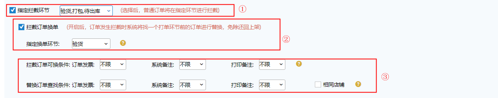

注：拦截环节对PDA也生效，但是PDA只进行拦截不会进行替换，在PDA操作后替换订单将解锁。

**10、开启耗材管理**：设置耗材登记环节后，订单在对应登记环节操作时会根据耗材设置规则，显示推荐耗材

各环节目前支持的页面如下：

验货环节：PC-条码验货、分拣验货

打包环节：PC-订单打包、批量打包，PDA-订单打包、批量打包

称重环节：PC-称重复核、批量称重，PDA-称重复核

**1、耗材前置计算**

:::color3
场景：适用于没有开启打包环节但需要记录耗材使用的情况。

:::

开启后订单推送到系统中，直接根据耗材匹配设置的规则，提前记录订单推荐使用的打包耗材，在打单、拣货、验货等环节打出快递单、发货单后，根据耗材规则取耗材打包商品。最多匹配25种耗材。

**2、订单记录耗材重量**

:::color3
场景：可以解决耗材匹配使用了一个包装箱，箱体比商品重，使得称重时差异过大而报错这个问题。

:::

设置耗材登记环节可以选择打包/称重。选择打包时，耗材推荐/耗材推荐+实际记录显示在订单打包、批量打包页面；选择称重时，耗材推荐/耗材推荐+实际记录显示在称重复核、批量称重页面。

开启后使用的耗材商品重量会加到订单上，打包后订单上的重量和快递成本会重新计算。耗材推荐是根据推荐的耗材商品重量计算；实际使用是根据实际扫描的耗材商品重量计算。（设置耗材登记环节是称重时，订单称重后不会将耗材重量加到订单上）

不开启使用的耗材商品重量不会加到订单上，打包后订单上的重量和快递成本不会重新计算。

**3、使用耗材体积作为包裹体积**：单个订单视作一个包裹，每个包裹上取最大且大于包裹本身体积的耗材作为包裹体积。

开启后当包裹匹配到的耗材体积>包裹体积时，会将耗材体积更新到包裹上，若耗材体积<包裹体积，则不更新包裹体积。

若称重环节称重模式开启按包裹称重，当为多包裹订单时，则将耗材体积与每个子包裹进行对比。

例1：订单1无子包裹，订单体积为0.45m³，订单在耗材前置计算、打包/称重环节匹配到推荐耗材或录入实际使用耗材：耗材1*2个，单个耗材体积0.5m³，耗材2*3个，单个耗材体积0.25m³，由于耗材1单个耗材体积>订单体积，所以最终更新到包裹上的体积：0.5m³。

例2：订单2无子包裹，订单体积为0.45m³，订单在耗材前置计算、打包/称重环节匹配到推荐耗材或录入实际使用耗材：耗材1*2个，单个耗材体积0.3m³，耗材2*3个，单个耗材体积0.25m³，由于耗材1单个耗材体积<订单体积，不更新包裹体积。

例3：订单3有3个子包裹，体积分别为0.1m³、0.2m³、0.3m³，按子包裹称重时匹配到推荐耗材或录入实际使用耗材：耗材1*2个，单个耗材体积0.1m³，耗材2*3个，单个耗材体积0.25m³，则将子包裹1、子包裹2的体积更新为0.25m³，子包裹3体积不变，订单体积根据子包裹体积合计：0.8m³。

**4、耗材推荐**

订单耗材使用会根据设置的耗材匹配规则记录，不同类别的耗材会累加。

**5、实际使用**

订单耗材使用会根据实际扫描的耗材记录。

5.1 实际使用未录入时自动使用推荐耗材

:::color3
场景：仓库按推荐耗材进行包装时，不想再录入实际耗材的，可开启自动使用推荐耗材开关，免除录入操作。

:::

开启后，在对应操作页面验货/打包/称重，未登记实际使用耗材时，自动按推荐耗材填充耗材记录；未开启则不会按推荐耗材填充耗材记录，实际耗材记录为空。

5.2 强制录入耗材

:::color3
场景：为避免操作员有时会漏扫耗材，导致结算的时候库存对不上，造成费用损失，增加强制录入耗材限制。

:::

开启后，在对应操作页面验货/打包/称重，未登记实际使用耗材时，不允许提交订单；未开启则无此限制。

注：5.1和5.2开关不支持同时开启。

**6、录入一个耗材后触发作业自动提交**

勾选【录入一个耗材后触发作业自动提交】，且操作页面开启自动提交，则实际录入1个耗材后，订单自动提交；若未勾选，则需要手动提交。

a.勾选录入一个耗材后触发作业自动提交+登记环节：打包（PC和PDA打包）

开启自动提交，扫描一个耗材后订单自动提交到下一环节。

未开启自动提交，扫描一个耗材后需手动提交，也支持扫描多个耗材。

b.勾选录入一个耗材后触发作业自动提交+登记环节：称重（PC和PDA称重）

开启自动提交，耗材扫描框在最后一个，扫描一个耗材后订单自动提交到下一环节。

未开启自动提交，扫描一个耗材后需手动提交，也支持扫描多个耗材。

PDA称重复核需要连接蓝牙电子秤+开启称重复核自动提交时耗材扫描框在最后一个，扫描一个耗材后订单才会自动提交到下一环节。

耗材扫描框未在最后一个，PC和PDA称重扫描一个耗材后，会自动换行到下一个选项。

注：勾选录入一个耗材后触发作业自动提交，之前未开自动提交，扫了多个耗材后，再开启自动提交，再扫一个耗材，系统才会自动提交。

c.未勾选录入一个耗材后触发作业自动提交+登记环节：打包（PC和PDA打包）

开启自动提交，扫描一个耗材后订单不会自动提交到下一环节，需手动提交订单。

未开启自动提交，也需手动提交订单。

d.未勾选录入一个耗材后触发作业自动提交+登记环节：称重（PC和PDA称重）

未开启/开启自动提交，耗材扫描框在最后一个，扫描耗材后需手动提交。

耗材扫描框未在最后一个，PC和PDA称重扫描耗材后，开启万能条码，扫wanliniu666才会自动换行到下一个选项。

**7、设置耗材登记环节**

可选环节包括验货、打包、称重，设置后重新登录系统，可在指定环节操作页面登记耗材。

**8、开启拆包补打时登记耗材**：开启后拆包补打的拆单、拆包装箱模式支持登记耗材。

允许在拆包补打登记耗材需要同时满足以下条件：

- 选择耗材按实际使用，勾选开启拆包补打时登记耗材
- 订单当前环节为耗材录入的环节或已经过录入环节，如耗材登记环节为打包，则待打包之前环节的订单在拆包补打页面不允许录入耗材，待打包及之后状态的订单允许在拆包补打页面录入耗材。

在【拆包补打】模式登记耗材后，拆出的新订单会显示拆单时录入的耗材，原订单上的耗材信息（若有）会自动清除。

在【拆包装箱】模式登记耗材后，各包裹上的耗材会显示装箱时录入的耗材，订单上的耗材为各包裹上耗材的汇总信息。包裹上的耗材信息可以通过点击图标查看，如下图：

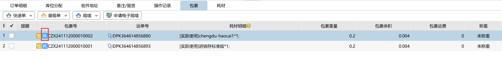

**9、开启耗材出库扣减**后，订单出库后，耗材库位库存、库存总量会扣减，并回传耗材信息给上游；未开启则不会扣减耗材库存，也不会回传。

注：单货主公司在此页面配置，多货主公司在货主策略tab配置

**10、耗材库存共享**

a.开启后，出库订单将统一扣减提供方货主库存，每天汇总扣减一次。配置成功后耗材统计自次日开始，第三日进行扣减。

b.提供货主：仅显示公司下启用中+授权本仓库+对接万里牛直连的货主。支持单选。

   使用货主：仅显示公司下启用中+授权本仓库+未开启货主级耗材出库扣减的货主。支持多选。

c.已设置提供货主，使用货主有耗材库存也不扣减。

注：生成出库单（其他出库类型）+扣减库位库存、库存总量。若生成单据失败则不锁定库存，支持单据重试，重试成功后直接扣减库存。

d.关闭耗材共享或耗材管理开关，立即生效，已操作的耗材后续不再进行统计和扣减。

**11、开启销退入库回收耗材**

设置后指定入库页面支持耗材入库。

a).开启销退回收耗材+耗材库存共享显示耗材回收库位，必填项。

b).指定入库页面：开启销退入库回收耗材+指定页面+出库扣减耗材（有一个货主开启即显示），匹配单据成功且仅选择1个单据作业时显示耗材回收库位；

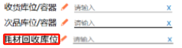

开启销退入库回收耗材+指定页面，匹配单据成功且仅选择1个单据作业时显示耗材条码框（疑难件直接显示）；

开启销退入库回收耗材+指定页面，匹配单据成功且仅选择1个单据作业时显示回收耗材信息tab；

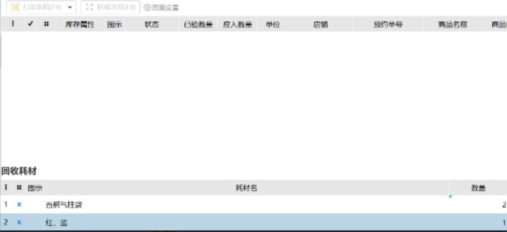

c).原单据上有耗材则扫描后带出显示。

耗材出库扣减：未开启时入库后仅单据显示耗材数据，实际无库存入库；若开启则有实际耗材库存入库。

耗材共享扣减：例-A货主订单1录入耗材，出库扣减B货主库存；

扫描A货主订单入库，会自动带出耗材显示，入库后实际无耗材库存增加；

系统会自动跑批生成验货入库单据，统计B货主当日耗材回收记录（1张单据），耗材库存入库变化；失败时支持在系统任务重试。

**12、开启接力拣货**：开启后，PDA拣货支持接力拣货。

①.按区域接力拣货

PDA上拣货页面明细排序显示：按区域>按库区>按库位>按商品编码。

PDA上锁定在某个区域下明细都拣货完成后，自动提示是否提交接力拣货。

②.按库区接力拣货

PDA上拣货页面明细排序显示：按库区>按库位>按商品编码。

PDA上锁定在某个库区下明细都拣货完成后，自动提示是否提交接力拣货。

**13、开启大宗订单部分出库**：开启后，pda大宗拣货允许部分拣货后提交；若操作员有允许部分出库的操作权限，支持大宗部分出库。

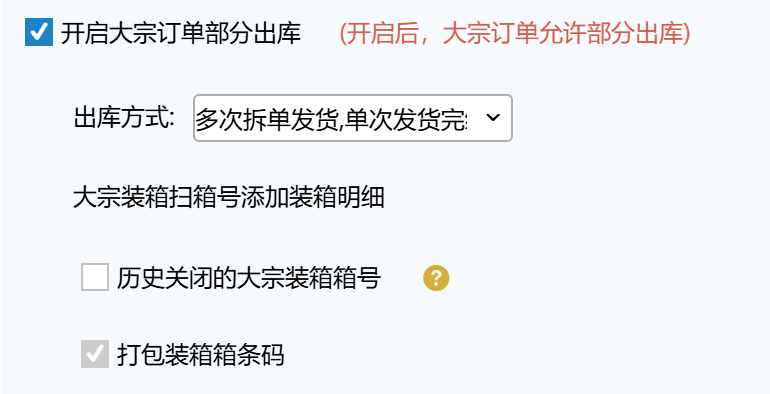

**a.出库方式**

①多次拆单发货

开启后，大宗订单部分拣货后显示“部分发货”按钮，点击支持拣货完成部分拆单出库，剩余部分拆分到另一个订单中，可多次发货。

②单次发货完结

开启后，大宗订单部分拣货后显示“完结”按钮，点击支持拣货完成部分拆单出库，剩余部分拆分到另一个订单中并自动关闭。

**b.大宗装箱扫箱号添加装箱明细**

①历史关闭的大宗装箱箱号

开启后，可以在大宗装箱时扫描历史已关闭箱号以达到快速添加箱明细的效果。

具体匹配效果参考[大宗装箱](https://hupun.yuque.com/unzko7/lsbfg0/kuechc10g0uxd9ch#mBcbU)。

②打包装箱箱条码

关联仓库级箱记录管理开关，若当前仓开启该开关，则显示此配置且默认置灰勾选状态，否则不显示。

**14、开启拣货任务集合**：开启后，拣货完成系统会推荐配置的交接点，针对用户对于同一类商品拣货完成想统一放在一个地方，可以按照指定波次+拣货方式进行配置，集合方式分为拣货提交集合和拣货后独立集合，区别在于是否完成后需单独再拣货集合页面进行集合。最大等待波次数为当前集合库位可集合的最大数量，超过后会显示下个集合点，没有的话就会进行报错。

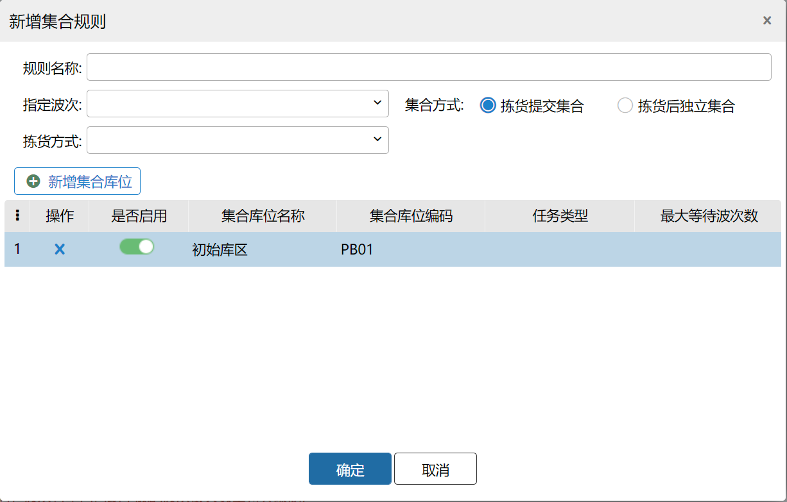

**15、开启大宗订单自动出库：**开启后，大宗订单，会在选择的节点完成后，触发自动发货，将订单系统状态变更为已完成。拣货：大宗订单在拣货完成后会触发自动出库；装箱：大宗订单在装箱完成后会触发自动出库，装箱中不会触发。

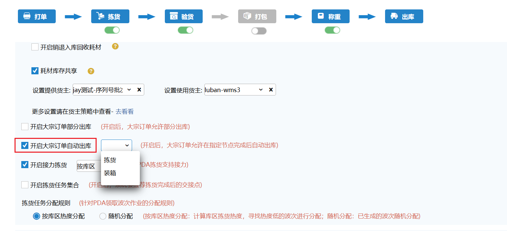

#### 策略配置

**1、开启波次最大数限制**：开启后可选择不同类型波次最大生成数量，当波次生成达到设置数量时则暂不生成，订单保留在待分配界面

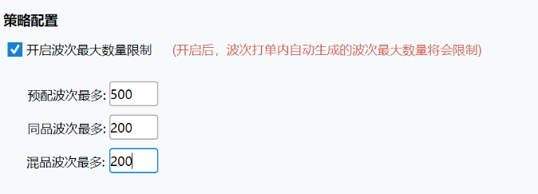

#### 打印设置

**1、后置打单优先**

正常情况下后置打印单据前会检测该订单线上状态是否正常然后打印单据，开启后优先打印单据提高响应时间，但该模式下有打印成功订单提交失败的情况，请谨慎处理。

打印顺序：生成波次后波次下订单排序按此处设置排列

效率优先：相同打印控件的订单排列在一起，拼多多>菜鸟>京东>抖音>快手>唯品会MP

路径优先：按订单锁定库位编码从小到大排列

相同快递：订单承运商的线上物流公司相同的排列在一起

数量优先：按波次中订单商品数量从少到多/从多到少排序，关联赠品免计算开关（若开启则排除赠品明细数量）。

注：数量优先仅限对接自动播种机的用户使用

**2、快递面单敏感字段加密打印**

收件人脱敏：

a.去掉直连快递单模板处-收货人-敏感字段加密打印配置。

b.此处配置线上物流，该线上物流的承运商电子面单选择的直连模板，打印后收件人信息加密。

c.新增手机号脱敏格式：188******88和1******8888两种格式可选

注：顺丰丰密模板一直加密打印；平台类模板对于此配置不生效。

寄件人脱敏：

此处配置线上物流，该线上物流的承运商电子面单选择的直连/云打印/平台模板，打印后寄件人信息加密。

**3、多打印机同时出纸**

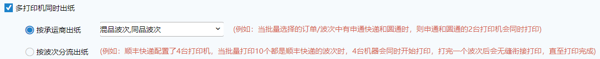

a).按承运商出纸：不同快递支持设置多台打印机，同时进行打印出纸。

波次策略承运商分组可选择不限，支持不同模板尺寸的快递订单生成到同一波次内。

b).按波次分流出纸：1个快递支持设置多台打印机，多波次操作打印时，多台机器同时打印出纸+一直衔接打印出纸。

与组合打印开关互斥，不支持同时开启。

**4、快递面单发货地址打印取值**

未设置：取快递单模板上设置的发货地址；若快递单模板上发货地址，手机号/固定电话、联系人、联系地址有一个为空时则打印正常为空。

已设置：取快递单模板上设置的发货地址；若快递单模板上发货地址，手机号/固定电话、联系人、联系地址有一个为空时就按照此处设置的顺序取发货地址，一直不满足则一直取，直至取至最后一项。

直连类模板不支持此配置，仅取打印模板上的。

**5、开启普通机打发票打印**

控制仓库是否显示发票相关数据功能的开关。

**6、开启组合打印**

与多打印机出纸开关互斥，不支持同时开启。

a).设置打印方案后，零拣打单、波次打单、大宗出库页面可操作组合打印；pda扫描工作台也支持组合打印。

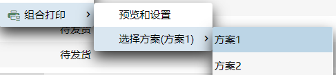

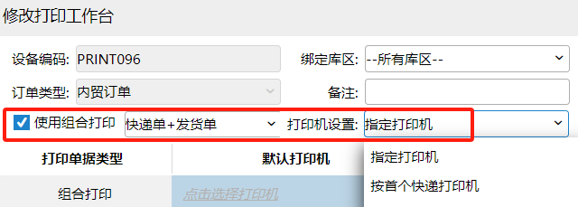

b).打印方案：同一方案内每种单据类型仅支持配置一次；至少配置2种单据类型；配货单仅支持在最前或最后打印（若为波次，则跟随波次打印）。

c).打印机设置：指定打印机-按设置的固定打印机出纸；

                  按首个快递打印机-打印的这波订单中按首个承运商所设置的打印机出纸。

PC端支持多份数打印。

#### 库位分配

**1、待分配环节强制锁定库位**：开启后，待分配环节商品锁定失败的订单将不允许流转到打单环节，直至锁定成功。

**1.1 开启待分配环节订单超锁：**开启后，若拣选库位有待补货/移库的商品，则允许订单超锁，超锁订单可进行拣货。

:::color3
场景：订单商品在拣选库位库存不足，但系统支持补货。此时启用超锁，可强制分配库位并生成波次。允许缺货订单参与波次计算，使波次生成结果更优（订单聚合更集中、路径更短），避免因个别缺货导致波次延迟或分散，最终实现拣货效率的整体提升。

:::

订单进入待分配环节，系统根据锁库相关配置尝试锁定目标库位，商品拣选库位可用库存不足时，若开启超锁功能，订单明细有待补货/移库任务，且任务目标库位符合订单锁库配置，系统自动执行超锁：可锁定数量 = 目标库位可用库存 + 补货 / 移库在途库存； 超锁后订单可正常进行组波、拣货作业，拣货时若库位实际库存不足，扣减库存时允许扣成负数。

例：商品A 拣选库位jx01、jx02 无可用库存，存储库位cc01 有可用库存10个，待移库任务yk01 商品A 来源库位cc01 目标库位jx01 数量5个，待补货任务bz01 商品A 来源库位cc01 目标库位jx02 数量5个。订单1有商品明细A 数量10个。未开启超锁时，手动截单生成波次失败，原因库位库存不足；

开启超锁时，手动截单生成波次成功，明细有两条锁库记录：jx01 可用数量-5，jx02 可用数量-5。波次能正常拣货下架出库。

注： ①需先开启 “待分配环节强制锁定库位”，超锁功能才会生效；

 ②超锁只在手动截单/自动截单生成波次时生效，全仓清单、手工波次、打到零拣等不生效。

**2、开启智能锁库**：开启后锁库的顺序是标记的普通订单优先锁库，非标记的普通订单会先锁库同库区再锁跨库区最后锁跨区域，锁同库区或跨库区，库区编码小的优先锁；锁跨区域的逻辑不变按库位分配偏好和优先级。例如

库区kw1有A、B、C-库位s2-优先级2

库区kw2有A、B、D-库位s3-优先级1

库区kw3有A、C、D-库位s1-优先级2

1类订单：订单有A+C -100笔-普通订单

2类订单：订单A+D-300笔-普通订单

3类订单：订单A+C+D-200笔-普通订单

4类订单：订单A+B+C-200笔-普通订单

①.开启智能锁库：1类订单锁库区kw1；2类订单锁库区kw2；3类订单锁库区kw3；4类订单锁库区kw1。

②.未开启智能锁库：1类订单锁跨库取kw2和kw3；2类订单锁库区kw2；3类订单锁跨库区kw2和kw3；4类订单锁跨库区kw2和kw3

**注：**

①.智能锁库和普通订单锁定规格箱的开关不能同时开。

②.订单类型是单种的一件或多件，按照同库区的优先锁。

③.订单中只要含有生产批次商品或入库批次商品，订单锁库都是按照之前的逻辑，不按照同库区的优先锁。

④.订单中只要有明细锁库失败，未锁库失败的明细按照之前的逻辑，不按照同库区的优先锁。

**3、设置库位分配偏好**：当订单从待分配提交至打单环节时，系统会根据用户选择的偏好自动为订单所有商品锁定拣选库位库存。方便用户高效找到库位并拣货。

**提示**

若当前仓库无拣选库位，则订单到打单环节时操作记录显示分配失败。

①【路径优先】：走路最少，适用于面积较大/路径较长仓库

根据拣选库位编码从小到大分配给商品。若该商品有拣选库位库存满足需求量，则直接分配编码最小的拣选库位；若商品没有满足需求量的拣选库位库存，则直接分配最小的库位库存，锁定库存为负数；若商品的各个拣选库位库存不满足需求量但所有拣选库位库存满足需求量，则按照拣选库存编码从小到大分配，直至足够。

②【效率优先】：拿的次数最少，适用于产品较重/较大或者拆包麻烦的仓库

根据商品的拣选库位库存最接近商品所需量进行分配库位。若该商品有拣选库位库存满足需求量，则直接分配满足需求量且库位编码的拣选库位；若商品没有满足需求量的拣选库位库存，则直接分配库存数量最大的拣选库位，锁定库存为负数；若商品的各个拣选库位库存不满足需求量但所有拣选库位库存满足需求量，则按照拣选库存数量从大到小分配，直至足够。

③【清库优先】：按库位库存从少到多的去拿，主要用于出库时尽可能把边边角角的商品出库掉，腾出库位空间做存放其他商品。

根据商品的拣选库位库存从少到多的进行分配库位，若库位库存数量相同按照库位设置优先级从高到低去分配，若库位设置的优先级也相同，最后按照库位编码从小到大进行分配。

④【路径效率综合】：能一次拿完直接拿，不然按走路最少的拿

优先根据商品拣选库位最接近商品所需数量进行分配。若该商品有拣选库位库存满足需求量，则按照效率优先执行，若商品没有满足需求量的拣选库位库存则按照路径优先规则进行分配。

**4、开启普通波次可分配预配库存**：开启后，允许锁定的波次类型可按指定预配策略锁定预配库位。

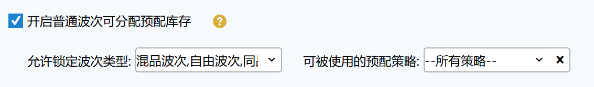

其中锁定预配库位需满足以下两个条件：

①单个预配库位可用库存需至少满足一份预配数量。

例：预配策略YP01，指定规格a01 数量2，指定预配库位Y01 a01库位库存可用数量1，则不满足一份预配数量要求；指定预配库位Y02 a01库位库存可用数量2（或≥2时），则满足一份预配数量要求。

②预配策略为单种商品。预配策略中指定2种及以上规格的不符合要求。

例：预配策略YP01，指定规格a01 数量2，则符合单种商品要求；预配策略YP02，指定规格a01 数量2、a02 数量3，则不符合单种商品要求。

若指定波次类型无可被使用的预配策略，则按拣选库位+库位分配偏好锁库；

若指定波次订单有多规格明细，可按sku匹配多个预配策略；

若指定预配库位库存不足，则优先锁预配库存，剩余部分锁拣选库存。

注：此配置与智能锁库互斥，不允许同时开启；

若开启允许普通订单锁箱，此配置不生效。

#### 风险预警

##### 1.仓储环节

1、店铺订单个性化加急标记：仓库级配置，开启后设置店铺和预警时间，超出预警时间订单打上标记需优先出库。

2、仓储操作-环节超时预警：各环节配置预警时间，超时则标记为异常预警订单，后续去异常订单处理。仓库无XX出库流程环节则不显示对应环节配置。

3、订单多发货预警：开启此开关后，订单取号后自动订阅物流轨迹，有轨迹信息则疑似重复发货，订单异常类型显示【疑似重复发货】，可在异常订单中处理。订单出库后不再重复订阅物流轨迹。

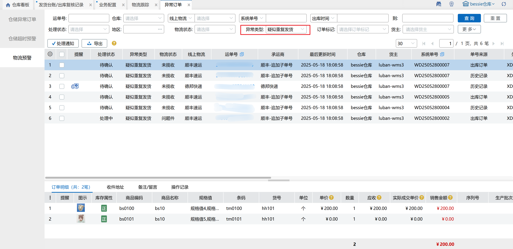

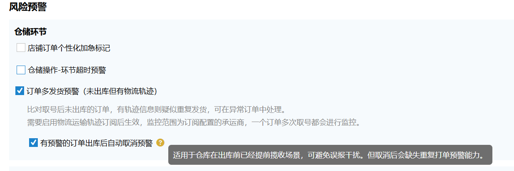

单号来源：历史记录——回收的电子面单对应的记录；出库订单——出库的电子面单对应的记录。

注：需要启用物流运输轨迹订阅后生效，监控范围为订阅配置的承运商，一个订单多次取号都会进行监控。

3.1有预警的订单出库后自动取消预警	：开启此开关后，有预警的订单，订单状态变已出库了，取消多发货预警。适用于仓库在出库前已经提前揽收场景，可避免误报干扰。但取消后会缺失重复打单预警能力

##### 2.物流运输

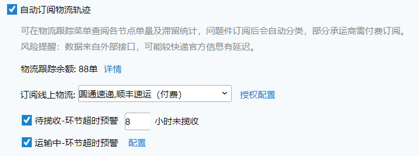

1、设置订阅物流轨迹的线上物流，韵达快递需在授权配置内填写数据；顺丰速运订阅后不扣减余额也需在授权配置内填写数据。

2、待揽收、运输中、已揽收物流状态的订单根据设置预警时间，订单自动预警并打上超时标识（关闭配置后已落地数据不去除标识）。

3、点击余额详情支持跳转到物流跟踪详情查看每日余额明细。

#### 自动策略

**1、拆单审核：**开启订单审核流程后，可在此处配置不同拆单规则。

:::color3
场景：针对库区分散、商品体积大导致的多件订单拣货效率低、无法与单件订单混合组波次的问题，系统在订单审核环节自动将多件订单按商品明细拆分为多个单件子订单，每个子订单对应一个包裹并使用子母件电子面单。通过这种方式，所有订单统一按单件原则组波次，拣货员每次只需拣一件商品即可完成任务，无需区分订单类型或进行多人接力，既提升了拣货效率和路径优化，又降低了物流成本和操作异常率，实现库内作业与物流包裹的精准对应。

:::

本策略应用于订单审核批量拆单功能。前提条件：开启接单审核。

订单进入订单审核页面后，若订单上的平台/店铺+承运商能匹配到拆单策略，且该策略拆单模式【自动拆】，则按照拆分条件拆出主子单；若拆单模式为【手动拆】，则按顺序往下匹配其他策略。若当前策略开启自动提交，则拆出订单自动提交到下一环节；否则不提交。

拆分条件用法如下：

（1）将负库存商品拆分出来：将订单中缺货的明细拆出新订单；

（2）订单拆分成一种一件：将订单拆分成一单一件，每个订单1个明细；

（3）以商品默认箱单位拆分，所有余数生成一单：“默认箱”即商品信息-装箱规格-默认箱设置，此项可以按照默认箱为单位将订单拆分为多个订单，不够拆分成默认箱的剩余明细会生成到一个订单中；

举例：商品sku1 默认箱1:2，商品sku2默认箱1:4，商品sku3无默认箱设置，订单1中有明细sku1 4个，sku2 5个，sku3 2个。

按此项拆分后有4个订单：订单1：sku1 2个，订单2：sku1 2个，订单3：sku2 4个，订单4：sku2 1个，sku3 2个。

（4）以商品默认箱单位拆分，每种商品余数生成一单：按照默认箱为单位将订单拆分为多个订单，不够拆分成默认箱的剩余明细按sku生成多个订单；

举例：商品sku1 默认箱1:2，商品sku2默认箱1:4，商品sku3无默认箱设置，订单1中有明细sku1 4个，sku2 5个，sku3 2个。

按此项拆分后有5个订单：订单1：sku1 2个，订单2：sku1 2个，订单3：sku2 4个，订单4：sku2 1个，订单5：sku3 2个。

（5）以商品种类为单位拆分，数量不限：将订单拆分成一种一件，每个订单1种sku；

（6）订单重量限制，每单重量小于等于[]千克：将订单拆分到指定重量范围内，若被拆分订单1已小于设定值，则不做拆分，若订单中的单个商品已超过设定值也不做拆分；

（7）订单体积限制，每单重量小于等于[]千克：将订单拆分到指定体积范围内，若被拆分订单1已小于设定值，则不做拆分，若订单中的单个商品已超过设定值也不做拆分。

拆成主子单效果如下图：

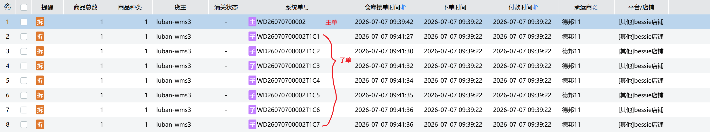

注：

①单仓下规则名称不允许重复，最多10个字符；

②每个仓库最多20条规则；

③将负库存商品拆分出来+自动拆单+自动提交，拆单后自动提交到预出库订单，缺货部分会保留在预出库订单等待补货，有货部分在批处理执行后进入待分配；

④平台/店铺、承运商设为不限时，包含订单平台/店铺、承运商为空的情况；

⑤一般按照优先级+页面排序匹配拆单策略，缺货订单优先匹配“将负库存商品拆分出来”策略（若有）。

****

**2、开启订单自动出库**：开启后，提交到待出库环节的订单会被系统自动出库。

**3、开启订单自动生成包裹：**开启后，订单将在接单后按规则自动生成包裹。

:::color3
场景：对于需要根据订单中商品数量自动生成子母件/多包裹普通快递单，以提升打单效率的仓库，可开启此配置，再配合自动生成/子母件/多包裹单号开关，在接单时按规则配置自动生成包裹及快递单号。

:::

开启后可按需设置包裹生成规则，符合指定平台/店铺+承运商的订单，接单后会根据不同生成规则生成对应子包裹。

注：①仓库接单后，订单审核、预出库、待分配环节订单执行订单自动生成包裹逻辑，大宗出库环节不会执行订单自动生成包裹逻辑；

②相同的平台/店铺+承运商只能设置一条规则，不能重复设置多条；

③店铺不同、店铺所属平台相同的，也视为重复（比如第1个规则设置【淘宝+德邦承运商+按每单商品总数量】，第2个规则设置【[淘宝]淘宝店铺+德邦承运商+按每单明细数量】，则两个规则视为重复数据）；

④默认箱按商品信息装箱规格或多单位默认箱计算，若无默认箱则视为0箱。

**4、开启自动获取电子面单**：开启后，订单需同时符合指定环节、指定时间、且在排除承运商范围外的，系统会自动获取电子面单。若指定平台/店铺+承运商设置了自动生成子母件/多包裹单号生成规则，则符合规则的订单自动获取子母件/多包裹单号。

指定环节可以选择三种：

①.指定环节选择“预出库/待分配/大宗/待打单”，订单落单后会进行获取电子面单，只含预出库、待分配、待打单、大宗出库的订单。

②.指定环节选择“待分配/大宗/待打单”，订单落单后会进行获取电子面单，只含待分配、待打单、大宗出库的订单。

③.指定环节选择“待打单”，订单从待分配到待打单订单都会生成电子面单。例如手动打到零拣、自动打到零拣、自动生成波次、手动截单波次、清仓波次、手工波次、缺货订单手动提交到零拣或手工波次，订单都会生成电子面单。

指定时间：落单时间在指定时间范围内的订单会进行获取电子面单。

排除承运商：承运商不在排除承运商范围内的订单会进行获取电子面单。

自动生成子母件/多包裹单号：开启后可按需设置单号生成规则，符合指定平台/店铺+承运商的订单，接单后会根据不同生成规则生成对应子母件/多包裹单号。

注：①必须先开启自动生成包裹开关，才允许开启和配置自动生成子母件/多包裹单号；

②未生成子包裹的订单，即使符合自动生成子母件/多包裹单号规则，也不会生成子母件/多包裹单号；

③只能生成1个子包裹的订单，默认不生成子包裹。

**5、申请子母件、多包裹普通单号或自动生成包裹时自动分配订单商品明细：**开启后，执行生成子母件、生成包裹分别申请普通单号或自动生成包裹等操作时，将按规则将指定货主的订单商品明细拆分到包裹里。

例：开启订单自动生成包裹开关+自动生成子母件/多包裹单号+开启申请子母件、多包裹普通单号或自动生成包裹时自动分配订单商品明细-指定货主A。假设下列订单都符合规则配置，则：

订单1：淘宝平台，淘宝测试店铺，德邦承运商，商品明细a*2、b*2，则接单后按每单商品总数量4个计算，订单自动生成4个子包裹及子母件单号，各子包裹中商品明细：a*1、a*1、b*1、b*1；

订单2：其他平台，线下测试店铺，德邦承运商，商品明细a*2、b*2、a*1，则接单后按每单明细数量2种计算（相同sku合并为1种），订单自动生成2个子包裹及多包裹单号，各子包裹中商品明细：a*3、b*2；

订单3：京东平台，京东测试店铺，德邦承运商，商品明细a*10（默认箱1:3）、b*10（默认箱1:4），则接单后按商品默认箱数量算出5个箱，每个箱为1个包裹，再将所有余数生成1个包裹，共生成6个子包裹及子母件单号，各子包裹中商品明细：a*3、a*3、a*3、b*4、b*4、a*1+b*2；

订单4：线下平台，A+N店铺，EMS承运商，商品明细a*10（默认箱1:3）、b*10（默认箱1:4），则接单后按商品默认箱数量算出5个箱，每个箱为1个包裹，再将每种余数生成1个包裹，共生成7个子包裹及多包裹单号，各子包裹中商品明细：a*3、a*3、a*3、b*4、b*4、a*1、b*2。

**6、****开启后自动执行拣货拆分：**开启后可指定波次按拣选范围/按商品种数上限/按商品数量上限自动拆分拣货任务。

#### 校验

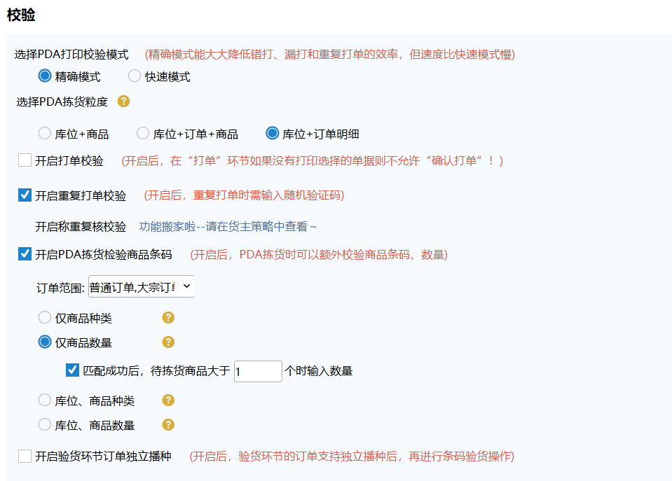

**1、开启打单校验**

①.强制校验：开启后，在”零拣打单”或“波次打单”环节如果没有打印选择的单据则不允许“确认打单”，提交至下一环节。

②.提醒校验：开启后，在”零拣打单”或“波次打单”环节如果没有打印选择的单据则提醒有订单未打快递单，是否确认提交？点击是，确定打单提交到下一环节，点击否不确定打单，不提交下一环节。

**2、开启重复打单校验**	

开启后，重复打单时需输入随机验证码

开启开关且操作员有“允许补打单据”操作权限时，重复打印快递单、发货单、配货单时会弹窗提示，需要输入随机验证码，正确后才能重复打印。

**3、开启称重复核校验**：开启后，称重环节将会根据订单商品总重量和输入的重量计算是否在误差内，若超过误差范围则提醒。误差范围=[订单商品总重量-x，订单商品总重量+x]，x=百分比*订单商品总重量或者x=固定值。

**4、开启PDA拣货检验商品条码**：开启后共4中检验方式可供选择，不开启则默认仅扫描库位编码

仅商品种类：仅扫描商品条码，每种SKU扫描一次

仅商品数量：仅扫描商品条码，按商品数量扫描

库位、商品种类：先扫描库位编码再扫描商品条码，每种SKU扫描一次

库位、商品数量：先扫描库位编码再扫描商品条码，按商品数量扫描（逐渐扫描）

**5、开启验货环节独立播种**：开启后，验货环节的订单支持独立播种，可再进行条码验货操作

**快速流程：（PS：生产批次标准模式下，快速出库流程结束环节不能跳过验货环节。）**

同时启用播种验货可以直接提交：开启后，播种验货页面和独立播种页面同时显示，可以选择所需菜单进行作业。

**6、选择PDA拣货粒度**：根据所选的批次粒度，显示拣货任务

目前支持PDA批量拣货

库位+商品：同一库位，跨订单合并同款商品总量拣取

库位+订单+商品：同一库位，按单个订单汇总同款商品拣取

库位+订单明细：同一库位，按订单每行明细单独拆分拣货

case

一个波次包含3笔订单：

订单01商品A（SKU 1001-10）两条明细数量分别3和4，分配相同库位 A01-01-A01 共7件；

订单02商品A分配库位 A01-01-A01 7件，库位 A01-01-A02 3件；

订单03商品A分配库位 A01-01-A01 8件，库位 A01-01-A02 5件；

批次粒度配置

1.库位+商品（默认）：生成2条拣货任务

任务1：库位 A01-01-A01，商品A，待拣数量22件（7+7+8汇总）

任务2：库位 A01-01-A02，商品A，待拣数量8件（3+5汇总）

2.库位+订单+商品：生成5条拣货任务

任务1：库位 A01-01-A01，商品A，订单01，待拣7件；

任务2：库位 A01-01-A01，商品A，订单02，待拣7件；

任务3：库位 A01-01-A01，商品A，订单03，待拣8件；

任务3：库位 A01-01-A02，商品A，订单02，待拣3件；

任务3：库位 A01-01-A02，商品A，订单03，待拣5件；

3.库位+订单明细：生成6条拣货任务

任务1：库位 A01-01-A01，商品A，订单01，待拣3件；

任务2：库位 A01-01-A01，商品A，订单01，待拣4件；

任务3：库位 A01-01-A01，商品A，订单02，待拣7件；

任务4：库位 A01-01-A01，商品A，订单03，待拣8件；

任务5：库位 A01-01-A02，商品A，订单02，待拣3件；

任务6：库位 A01-01-A02，商品A，订单03，待拣5件；

#### **赠品管理**

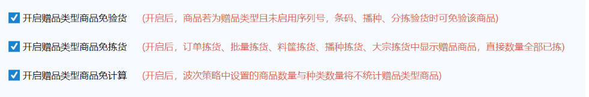

**1、开启赠品商品免验货**：开启后商品属性为赠品的且无序列号的，在条码验货、播种环节可免验商品

**2、开启赠品商品免拣货**：开启后订单拣货、批量拣货、播种拣货、料框拣货、大宗拣货中赠品商品数量直接显示已拣

**3、开启赠品类型商品免计算**：开启后，波次判断生效订单的商品种类和商品数量时，不计算赠品的数量，波次生成时，不统计赠品锁定的库区。

> 更新: 2026-08-17 13:55:39  

> 原文: <https://hupun.yuque.com/unzko7/lsbfg0/koouhyfe442qcd1h>

---

### 03.2.6 业务配置-场站配置

> 原始文件来源：`00-源文件/操作手册/仓内策略/业务配置-场站配置.md`

场站配置关联清关系统对接后台开关显示。

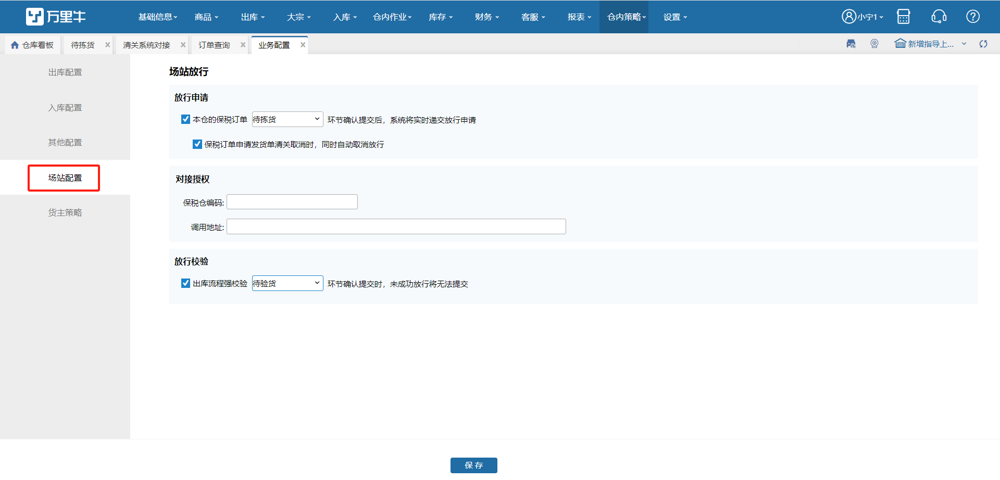

1.放行申请和放行强校验的环节关联仓库出库流程环节。

2.配置强校验环节不早于放行申请环节。（也不支持同环节）

3.放行申请：订单承运商设置清关系统对接，订单在放行申请环节确认提交到下一环节，自动异步触发场站放行。

注：未开启环节或跨环节订单在上一环节提交时触发。

4.放行强校验：未放行成功的订单提交下一环节时报错，不允许到下一环节。

注：待打单环节后的订单强校验异常时订单会到异常订单页面，提交到下一环节后订单从异常订单移除。

未配置强校验时，放行失败订单可正常出库。

5.已开启清关取消同步取消场站放行配置，万里牛合作商清关订单拦截成功，发起清关取消时自动同步调用场站进行取消操作。

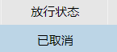

取消成功放行状态变更为已取消，取消失败则支持点击重试icon进行操作。

> 更新: 2024-04-23 12:01:58  

> 原文: <https://hupun.yuque.com/unzko7/lsbfg0/hqbg4tkh3uw2x7m2>

---

### 03.2.7 业务配置-货主策略

> 原始文件来源：`00-源文件/操作手册/仓内策略/业务配置-货主策略.md`

货主策略将部分配置下放到货主级别，适用开启3PL的公司根据货主分别设置规则。

#### 01.开启地区禁发拒绝接单

开启后，订单收件人地址在指定地区范围内或包含地址关键字的，直接拒单，在erp操作记录中可以看到拒单原因

**注：**

①.开启后，指定地区和地址关键字至少设置一个

②.指定地区支持手动选择或批量导入

③.地址关键字支持用顿号、逗号(不区分中英文)、空格分隔

④.禁发设置支持批量应用到其他货主上，具体操作如下：

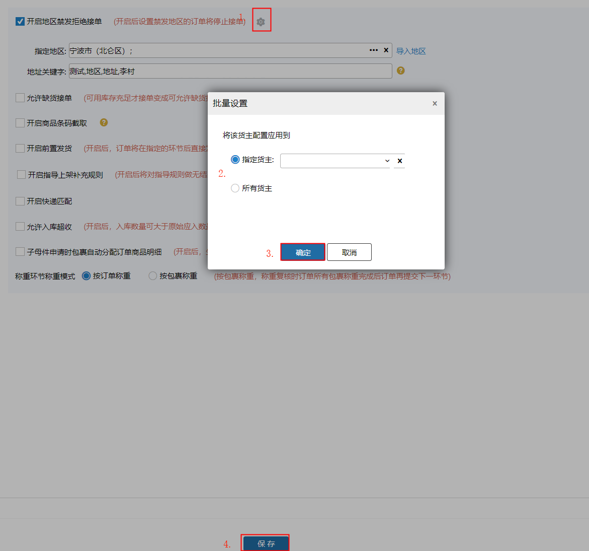

#### 02.允许缺货接单

开启后允许缺货接单，接单后缺货订单进入预出库页面排队，库存补足后自动流转进入出库流程。

1.无接单限制：可接单数量无限制

2.根据自定义库存判断：可接单数量可配置，默认可接单数量=可用库存+虚拟库存，虚拟库存可以手动修改，可用手动勾选加上其他在途库存。可接单库存充足时允许接单，不足时拒单。

3.订单排序规则默认根据客户付款时间从早到晚排序，当缺货订单全部清除后允许修改排序规则

其中：

①.开启缺货接单后，出库模块下显示“预出库订单”页面

②.开启根据自定义库存判断，库存模块下显示“可接单库存”页面

#### 03.开启接单审核（限3PL版本）

开启后，出库模块显示“订单审核“菜单，对应货主的订单落单后优先进入订单审核页面，未开启的货主订单落单后进入待分配、预出库或大宗出库。

#### 04.商品条码截取

1.开启商品条码截取：开启后，扫描入库、出库验货环节中将商品条码同系统内截取后结果进行比对校验。

1.1特殊信息截取：扫描输入商品条码，截取系统第一个++符号前的条码内容进行比对校验。

1.2条码位数截取：扫描输入商品条码，截取输入条码的前若干位，与商品信息的条码进行比对校验。

1.3自定义解析：对扫描读取到的条码值进行位数删减，支持多种策略

特殊字符截取示例：

商品a系统中的条码1422++001

实际扫描条码：1422、1422++001都可以匹配到商品a

条码位数截取示例：截取前6位

商品a系统中的条码05121422；商品b系统中的条码2020

实际扫描条码2020，匹配到商品b；实际扫描051214匹配到商品a

自定义解析示例：

解析规则：从后往前忽略3位，全部品牌    

商品a系统中条码：05121422

实际扫描条码：05121422ASD，忽略后3位匹配到商品a

1.4自定义解析+开启保留区间截取：后台开关需要技术开启，开启后支持从X位到XX位截取匹配。

（PDA同样支持）

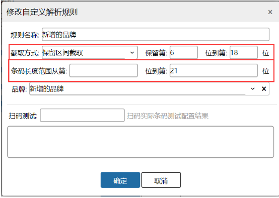

自定义解析+开启保留区间截取示例：

解析规则：保留区间截取，品牌：新增的品牌，保留区间截取第6到18位，条码长度范围为从0-21

商品A系统中商品条码69200811001-新增的品牌

商品B系统中商品条码69200811002-新增的品牌

扫描条码1234569200811001001，保留区间截取第6到18位匹配到了商品A。

扫描条码01234569200811002001，条码不在长度范围0-21内匹配不到商品B。

#### 05.开启前置发货

开启后，选择前置发货的环节，当订单在此环节确认后则会通知erp发货（直接确认订单），快速提交的跨节点订单也符合可以前置发货。如果为万里牛ERP，可配合ERP的通知线上发货时机提前功能，实现线上平台发货。

①、前置发货为获取单号后，则手动或自动获取单号后，系统计算运费成本然后通知ERP发货。

其中：

手动获取单号包括手动申请电子面单、普通面单、手动输入单号、导入运单号等操作，具体页面有预出库订单、待分配、零拣打单、波次打单、拆包补打拆出新订单等；

自动获取单号关联出库配置-自动策略-开启自动获取电子面单，开启后则生成单号后通知前置发货；

若订单清关时获取到单号的，也会触发前置发货；

若订单已经有单号了，或者从上游带了单号过来的，手动修改单号不会触发前置发货。

②、前置发货为打单环节，订单生成波次或打到零拣时计算运费成本，确认打单后通知ERP发货。

③、前置发货为拣货环节，订单提交到拣货环节时计算运费成本，确认拣货后通知ERP发货。

④、前置发货为验货环节，订单提交到验货环节时计算运费成本，确认验货后通知ERP发货。

⑤、前置发货为打包环节，订单提交到打包环节时计算运费成本，确认打包后通知ERP发货。

⑥、前置发货支持指定店铺，选择店铺后，属于指定店铺的订单才会在环节后通知erp发货

#### 06.允许同步视频记录至ERP系统

开启后，在WMS相关操作页面（目前仅支持PC条码验货页面）录制的视频记录会同步到ERP系统（仅支持万里牛ERP）。

ERP订单查询页面，对应订单接收到视频记录后会显示图标（前提：ERP系统开启出入库视频监控溯源），点击可查看视频内容。

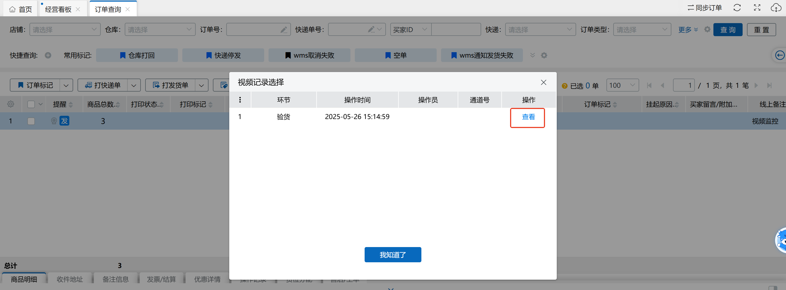

注：外网模式下查看视频产生的流量会计入当前仓。

#### 07.开启指导规则补充

开启后，对于指导上架，新品入库上架，容器上架、补货上架指导无结果的情况进行补充，指导出空货位进行上架。

1.匹配范围，同时满足以下2点才能匹配规则

①.商品的品牌/分类/等级在设置的商品品牌/商品分类/商品等级范围里；

②.选择的指导方式在设置的使用方式范围内。

2.计算偏好

①.【按库位编码顺序：容量匹配库位】：在选择的区域里按照商品数量从少到多的指导库位，空库位优先。

②.【按库位编码顺序：空库位】：在选择的区域里找库位编码最小的空库位。

③.【同类商品就近：同主商品附近空库位优先】：在选择的区域里找库位编码距离同款库位编码最近且库位编码最小的空库位。

④.【高位货架就近：拣选位上方/就近存储库位优先】：寻找一个有库位的拣选库位作为锚点库位，在该库位上方/附近寻找存储库位。

锚点库位：在库区范围内寻找一个有该商品库存且是托盘类型的拣选库位作为锚点库位

指导高位货架优先级

1.同库区同巷道同货架同货位，锚点库位的层数向上搜索20层，有符合要求的托盘类型空库位则作为指导结果之一，没有则走下一条指导逻辑；

2.同库区同巷道同货架相邻货位，以锚点库位为基础，货位向左搜索2个货位， 按货位号从大到小顺序；货位向右搜索2个货位， 按货位号从小到大顺序；单个货位按锚点库位层索引向上搜索20层，有符合要求的托盘类型空库位则作为指导结果之一，没有则走下一条指导逻辑；

3.同库区同巷道相邻货架， 以锚点库位的货架为基础，货架向左搜索60个货架， 按货架号从大到小顺序；货架向右搜索60个货架， 按货架号从小到大顺序；单个货架， 按货位距离(左侧货架货位号从大到小， 右侧货架货位号从小到大), 货位数量取5个；按锚点库位层索引向上搜索20层，有符合要求的托盘类型空库位则作为指导结果之一，没有则走下一条指导逻辑；

4.同库区相邻巷道，以锚点库位的巷道为基础，巷道向前、向后搜索2个巷道，按从前到后顺序；单个巷道货架按从前到后，单侧#60个货架；单个货架， 按货位距离从小到大(头部货架货位号从小到大， 尾部货架货位号从大到小), 货位数量取5个；按锚点库位层索引向上搜索20层，有符合要求的托盘类型空库位则作为指导结果之一，没有则走下一条指导逻辑；

5.寻找范围内符合条件的拣选库位空库位；

⑤.【按商品历史库位：原计算范围中的商品历史库位】：寻找有存放过该商品的历史库位

若之前的指导无结果，则按照指导补充规则设置的商品品牌/商品等级/商品分类+指导库区+库位使用方式+是否找空库位去指导。

示例：

sku1-品牌A、sku2-品牌B、sku3-品牌A、sku401-品牌A，sku501-品牌B

sku1-在库区02设置了优先库位kw01-拣选库位

sku2-在库区03下库位kw02有余量-拣选库位

sku3-在库区04下有历史库位kw03-拣选库位

库区01下有空库位kw04-存储、kw05-拣选

库区02下有空库位kw06-拣选，kw07有sku502的库存（sku501的同款）kw08-存储、kw09-存储

规则01，设置了商品品牌A+指导库区01+库位使用方式拣选+路径优先

规则02，设置了商品品牌B+指导库区02+库位使用方式存储+同款优先

现在容器RQ0026里有商品sku1、sku2、sku3、sku401、sku501库存去上架到库位

a.pda上指导时选择不限

sku1指导出库位kw01

sku2指导出库位kw02

sku3指导出库位kw03

sku401指导出库位kw05

sku501指导出库位kw08

b.pda上指导时选择拣选库位

sku1指导出库位kw01

sku2指导出库位kw02

sku3指导出库位kw03

sku401指导出库位kw05

sku501无指导结果

c.pda上指导时选择存储库位

sku1无指导结果

sku2无指导结果

sku3无指导结果

sku401无指导结果

sku501指导出kw08

#### 08.开启快递匹配

开启后，在货主策略里设置货主的快递匹配规则，系统通过货主设置的快递匹配规则自动的去匹配快递进行发货。

优先级：指定快递>最低快递成本优先原则>自定义规则匹配>默认快递。

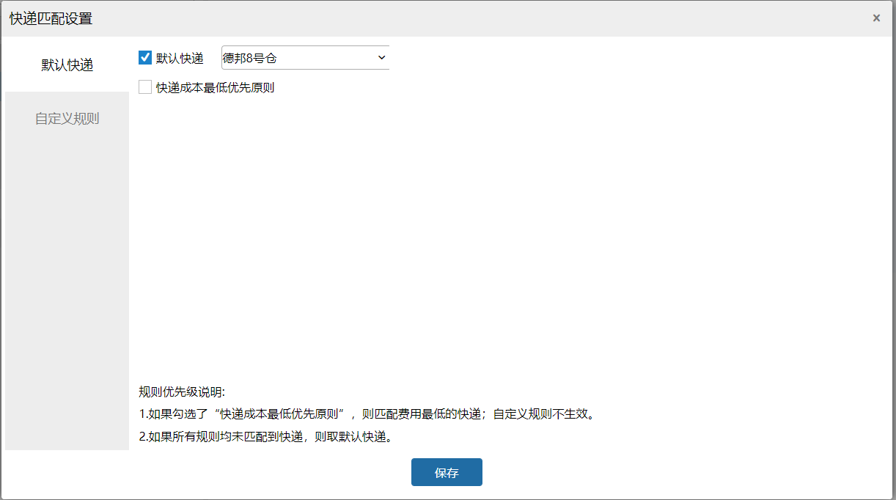

1.默认快递：当没有更优的快递可以选择时，默认快递就是最好的选择，也可以理解为备用快递。

2.快递成本最低原则：此原则下，系统会自动根据订单的重量或体积去匹配运费最低的快递公司（计算的规则来自与快递公司的运费规则设置）。

注：当选用此原则时，此原则最优先，系统中其他的规则不可同时使用。

3.自定义规则

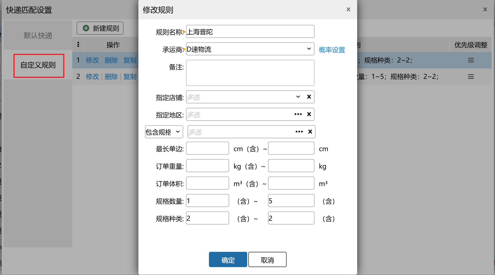

1）规则名称：可以增加多个自定义规则，规则名称不可重复。

2）快递公司：可多选，当选择多个快递公司时，意味着满足当前规则的订单可以使用多个快递公司，系统支持设置每个快递公司的匹配概率，概率高的匹配到的订单多，默认多个公司概率平均。

3）指定店铺、地区、商品可多选，多个规则之间可重复。

4）最长单边、重量、体积、下限不填表示0，上限不填表示正无穷。

5）规格数量、规格种类用于限制指定区数量间范围内的订单才能匹配到该规则。

例如：规则1：规格数量1~5，规格种类2-2

   规则2：规格数量2-4，规格种类3-5

规则1优先级高于规则2，订单明细a*2，b*1，c*1，则匹配到规则2。

6）同一个规则内，多个条件间是“and”的关系，即全部满足条件后才会匹配到所设置的快递公司。

7）不同自定义规则之间，根据优先级匹配快递，从上往依次执行，系统一旦匹配到快递，不再执行后面的规则。

例如：规则1：黑龙江发百世快递

          规则2：东三省发韵达快递

规则1优先级高于规则2，订单收货地址是黑龙江时，发百世快递

8）鼠标拖动规则可以调整优先级。

注：大宗订单不走快递匹配逻辑；

规格数量、规格种类计算时包括赠品。

#### 09.允许入库超收

1）.开启后入库数量可大于预约数量，允许超收单据可自定义

2）.入库时校验提示，当收货数量超过应收数量指定比例时，会显示弹窗确认提示

#### 10.子母件申请时包裹自动分配订单商品明细

开启后，生成子母件时，各包裹平摊订单商品明细。如原订单有8个商品明细数量，生成3个子母件，每个子母件包裹内明细数量分别为：2、3、3

#### 11.称重环节称重模式

①.按订单称重：开启后，生成多包裹的订单，不支持对单个包裹称重，需要对整个订单称重，重量更新到订单上

②.按包裹称重：开启后，生成多包裹的订单，不支持对整个订单称重，需要扫包裹运单号称重，重量更新到包裹上，所有包裹称重完成后订单再提交到下一环节

#### 12.耗材设置

开启耗材出库扣减后，对应货主订单出库后，耗材库位库存、库存总量会扣减，并回传耗材信息给上游；

未开启则对应货主不会扣减耗材库存，也不会回传。

**注：此配置关联业务配置-耗材管理开关，若开启则显示此项，否则不显示。**

#### 13.称重复核校验

1.原业务配置->出库配置->校验：开启称重复核校验配置挪至此处。

2.校验规则如下，最多支持10个区间：

例如：称重校验规则配置如上；订单1估重6；

则称重时订单重量11提示-称重重量与订单估重不符，超出允许范围+3kg；订单重量4，无报错提示，直接提交称重成功。

注：若订单重量不在估重区间内则不计算校验重量，直接提交称重成功。

3.订单估重为0校验配置

a.未开启，订单估重为0，无弹窗提示，正常提交称重。

b.已开启，订单估重为0，待称重修改重量/称重复核、批量称重重量回车、快递成本回车、确认称重时弹窗提示，能否继续操作提交称重关联有无强制提交称重权限。

#### 14.预约单超时自动关闭

根据自定义配置，超过规定时限未完成的预约单会自动关闭。

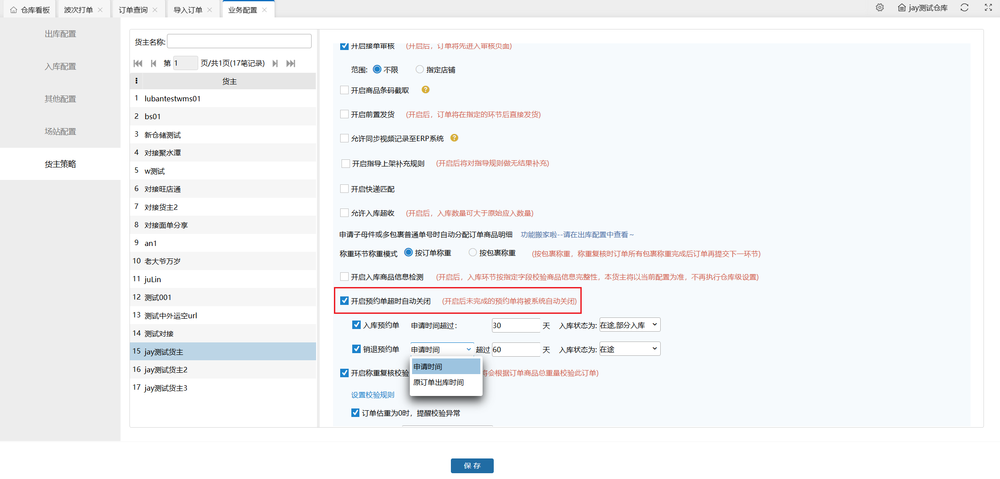

> 更新: 2026-08-07 17:22:09  

> 原文: <https://hupun.yuque.com/unzko7/lsbfg0/fay7zts5tamdictu>

---

### 03.2.8 区域匹配

> 原始文件来源：`00-源文件/操作手册/仓内策略/区域匹配.md`

业务场景：某些店铺或者某些商品指定区域或库区发货，因此设置了区域匹配规则后，仅包含指定店铺和指定商品的订单将会在设置的区域或库区内锁库。

名词解释：爆品区：设置了指定商品/指定店铺+商品的区域或库区。

#### 01.新增区域

设置指定的区域，新增时至少保留一个非指定的区域，若区域已设置指定库区就不允许设置指定区域了。

#### 02.新增库区

设置指定的库区，新增时至少保留一个非指定的库区，若库区所在的区域已设置指定区域就不允许设置指定库区了。

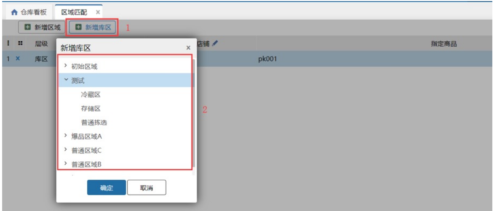

#### 03.添加商品

添加商品时，如果指定了订单商品数量的范围，那么商品在指定区域锁库的条件又加上了订单中商品的数量范围必须在指定范围内。

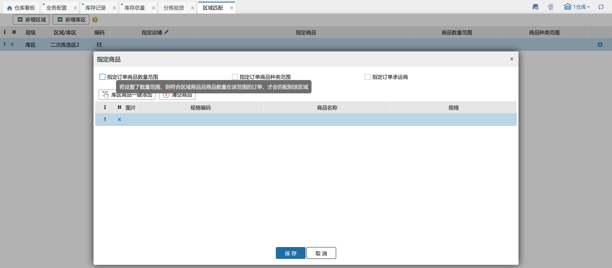

添加商品时，如果指定了订单商品种类的范围，那么商品在指定区域锁库的条件又加上了订单中商品种类的范围必须在指定范围内。

#### 04.指定店铺

区域可以设置指定的店铺，设置后，订单需要是指定店铺的订单，才会锁定在设置的区域。

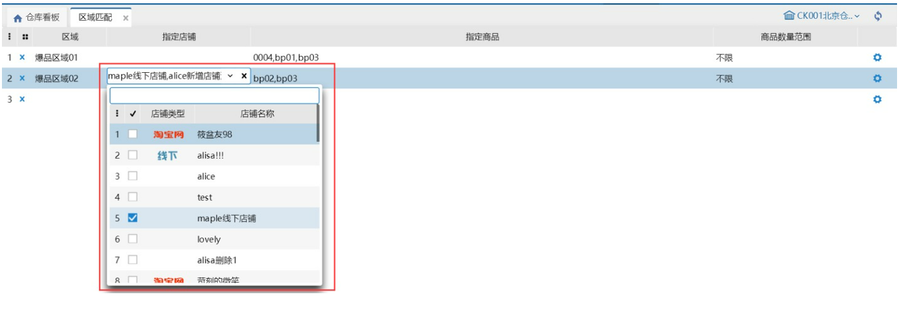

#### 05.指定承运商

添加商品时，如果指定了承运商的范围，那么商品在指定区域锁库的条件又加上了订单承运商必须在指定范围内。

#### 06.波次降级

指定区域和指定库区逻辑类似，只是范围不一样，以指定区域为例。

1.  落单降级：若波次的分组设置了指定区域，指定区域为爆品区，且该波次优先级最高。订单匹配的指定区域为非爆品区，该订单落单降级。反之亦然。

2.锁库降级：若波次的分组设置了指定区域，且该波次优先级最高。订单落单时无法判断是否将会锁定到该区域，锁定库位后若发现未锁定到波次指定区域，订单将会降级。                   

**注意**

1）指定区域设置了指定商品后，订单若包含非指定商品，不会在指定区域锁库。

2）指定区域设置了指定商品后，订单包含指定商品和非指定商品，不会在指定区域锁库。

3）指定区域a设置了指定商品sp01，指定区域b设置了指定商品sp01和sp02，订单包含商品sp01和sp02，只会在指定区域b锁定库位，不会在指定区域a和b锁定库位。

4）商品和订单数量、商品种类都满足区域匹配的条件时，订单才会在指定区域锁定库位。

> 更新: 2025-03-24 10:02:12  

> 原文: <https://hupun.yuque.com/unzko7/lsbfg0/tmvqgpmcoso9v63a>

---

### 03.2.9 大宗策略

> 原始文件来源：`00-源文件/操作手册/仓内策略/大宗策略.md`

大宗策略是系统为了自动区分大宗订单而配置。符合大宗订单配置的订单将不经过待分配环节，直接在大宗出库界面显示。

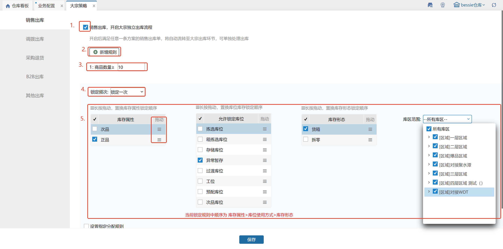

大宗策略根据订单来源情况的不同分为5种出库方式。

#### 01、销售出库

销售库位可配置商品数量、体积大小、配送方式、订单标记为综合判断依据。

每一行都是且的关系，行与行之间是或的关系。

1.第一行设置规则商品数量≥50且订单体积≥3m³且配送方式为自提；第二行设置规则商品数量≥10且店铺为bs01店铺。

则表示订单状态满足第一行设置的规则或第二行设置的规则才能被判断为大宗订单。

2.锁定频次有三种类型：不锁定、锁定一次、持续尝试锁定

- 不锁定：订单进入大宗出库页面后，不会执行自动锁库
- 锁定一次：订单进入大宗出库页面后，会按照大宗策略设置范围尝试锁库，若锁定失败，不会重新尝试锁库
- 持续尝试锁定：订单进入大宗出库页面后，会按照大宗策略设置范围尝试锁库，若锁定失败，会重新尝试锁库

3.推送订单标记符合已设置的标记策略，且其他条件也符合时，订单自动进入大宗。（若策略设置多个标记时，订单有1个标记就算符合策略）

勾选库存属性会在勾选的库存属性范围内锁库，拖动箭头指向滑块可改变选定属性库位的排序顺序，系统锁定顺序也跟着改变。

勾选库位类型会在勾选的库位类型范围内锁库，拖动箭头指向滑块可改变选定属性库位的排序顺序，系统锁定顺序也跟着改变。

勾选库存形态锁库时按照勾选的库位形态锁库，拖动箭头指向滑块可改变选定库存形态的排序顺序，系统锁定顺序也跟着改变。

指定库区范围会在勾选的库区范围内锁库，若库存不足则锁库失败。

#### 02、调拨出库、采购退货、B2B出库、其他出库

这几类出库类型的策略配置均不含配送方式匹配。其余设置方式与销售出库一致。

#### 03、指定分配

大宗策略各业务出库类型新增指定分配规则。

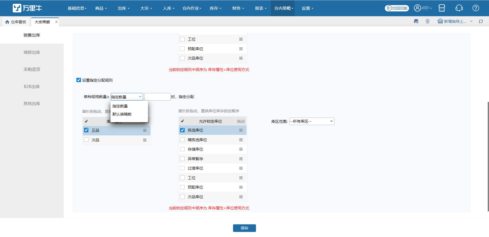

a.默认箱单位配置关联开启商品多单位开关显示。

b.设置指定分配规则后，订单内单种sku数量总计满足指定数量时，**明细**按照指定分配规则锁库。

注：若明细满足指定分配规则但锁库失败，则明细锁库失败，即不会在非指定策略内锁库。

例如：

规则：单种规格数量>=5时指定分配；

订单：sku1:2个  sku3:3个  sku2:3个；即锁库时sku2走指定规则，sku3走非指定规则

> 更新: 2025-04-11 16:27:38  

> 原文: <https://hupun.yuque.com/unzko7/lsbfg0/kgw7gm8c9vy8gkal>

---

### 03.2.10 盘点策略

> 原始文件来源：`00-源文件/操作手册/仓内策略/盘点策略.md`

设置好盘点策略后，会根据设置条件自动生成盘点任务。

#### 01.ABC盘点

abc盘点策略中对应商品等级的商品会根据策略规则生成盘点任务。  
1）盘点的对象为：策略中商品等级对应的商品。  
2）盘点起始日和结束日：盘点策略只会在起始日和结束日之间生效。  
3）生效时间：当前日期<盘点结束日且当前日期=盘点起始日+时间间隔*n（其中n为正整数）。  
4）任务明细：生成一个任务的明细数量最多数量。  
5）抽盘覆盖率：应当抽取个数=商品等级对应商品个数*抽盘率。  
   应当抽取个数<策略对应等级有库位库存商品个数时，实际生成：应当抽取个数。  
   应当抽取个数>策略对应等级有库位库存商品个数时，实际生成：策略对应等级有库位库存商品个数。  
6）任务类型：商品盘点和库位盘点两个类型可选，与盘点任务中的类型意义一致。  
7）盘点库位：会生成盘点任务的库位类型只有拣选库位和存储库位。

5号合

#### 02.动碰盘点

动碰盘点策略主要是动碰过的商品或者库位，根据策略的规则，会自动生成盘点任务。  
1） a.动碰对象：盘商品。（策略生效当天-动碰时间）到（策略生效当天）这段范围内，有过流水的商品。【注意：除了仅盘点流水的商品】。  
       b.动碰对象：盘库位。（策略生效当天-动碰时间）到（策略生效当天）这段范围内，有过流水的库位。【注意：除了仅盘点流水的库位】。  
2）盘点起始日和结束日：盘点策略只会在起始日和结束日之间生效。  
3）生效时间：当前日期<盘点结束日且当前日期=盘点起始日+时间间隔*n（其中n为正整数）。  
4）任务明细：生成一个任务的明细数量最多数量。  
5）a.动碰对象为商品时的抽盘覆盖率：  
     应当抽取个数=全仓有流水对应商品个数*抽盘率。【注意：除了仅盘点流水的商品】。  
     应当抽取个数<盘点区域有库位库存商品个数时，实际生成：应当抽取个数。  
     应当抽取个数>盘点区域有库位库存商品个数时，实际生成：盘点区域有库位库存商品个数。  
     b.动碰对象为库位时的抽盘覆盖率：  
     实际生成个数=应当抽取个数=盘点区域下有流水的库位个数*抽盘率【注意：除了仅盘点流水的库位】。  
6）任务类型：商品盘点和库位盘点两个类型可选，与盘点任务中的类型意义一致。  
7）盘点区域：生成盘点任务时只会从选中的盘点区域下的库位中选择。【注意：新增或修改时，未勾选区域，将视为盘点区域为全仓】  
8）盘点库位：会生成盘点任务的库位类型只有拣选库位和盘点库位。

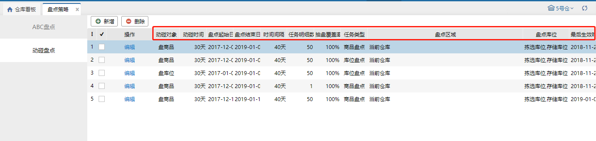

> 更新: 2023-12-19 16:05:31  

> 原文: <https://hupun.yuque.com/unzko7/lsbfg0/xz9ka960mbk6ubwx>

---

### 03.2.11 耗材匹配

> 原始文件来源：`00-源文件/操作手册/仓内策略/耗材匹配.md`

这个页面功能主要是设置订单中商品匹配多少耗材的规则。匹配规则 : 规则仅针对本仓，每个耗材类别最多匹配生效一个具体规则，有重复规则的按优先级高的（数字小的优先级更高）、规则编码小的优先生效。智能规则优先级为0级时，优先级最高。

注意：业务配置开启了耗材管理才会出现该页面。

耗材规则类别分为按包裹和按商品。最多设置五个类别，每个类别下面最多2000个规则，不同规则之间的名称+编码不能相同。

#### 01.耗材类别为包裹

包裹匹配 : 常规的包材如快递袋、纸箱、充气垫等填充物，可按包裹匹配。

有两种类型：按业务规则、按智能规则

##### （1）业务规则：根据规则中设置的各条件匹配包裹及耗材

1. 规则名称：可不填，最多16个字符，不填按规则编码填充。

2. 规则编码：可不填，不填自动生成。

3. 优先级：优先级越小，优先级越高，类别下先根据优先级匹配规则。

4. 货主：若设置了指定货主，只有指定货主的包裹才会匹配这个规则；排除同理。

5. 店铺：若设置了指定店铺，只有指定店铺的包裹才会匹配这个规则；排除同理。

6. 耗材：设置匹配这个规则将会推荐的耗材。可选范围为商品类型为耗材的商品。

7.商品、等级、品牌、商品组合：若设置了包含，含有该商品/品牌/等级/商品组合的包裹会匹配此规则；设置了仅含，仅有该商品/品牌/等级/商品组合的包裹会匹配此规则；设置了排除，除去此商品/品牌/等级的包裹会匹配此规则。

例：规则设置包含商品A、B，包裹中有商品A、B、C，可匹配此规则。

规则设置仅含等级a，包裹中商品都为等级a，可匹配此规则；包裹中商品等级为a、b，不匹配此规则。

规则设置排除品牌1，包裹中商品都不是品牌1，可匹配此规则；包裹商品品牌为1、2，不匹配此规则。

规则设置仅含商品组合A*1、B*2，包裹中有商品A*1、B*2，可匹配此规则；包裹中有商品A*2、B*2，不匹配此规则；

规则设置包含商品组合A*1、B*2，包裹中有商品A*2、B*2，可匹配此规则；包裹中有商品A*2、B*2、C*1，可匹配此规则；包裹中有商品A*2、C*2，不匹配此规则；包裹中有商品A*2，不匹配此规则。

注：商品组合中最多允许添加10种规格的商品。

8. 最大单边填写数值后：

a.最大单边tab内设置多个耗材，订单中所有商品边长比较，取Max，Max<=最大单边，则符合匹配

b.最大单边tab内仅设置1个耗材，订单中商品三边<=耗材三边，所有商品逐一比对，若所有商品都符合则匹配，否则不匹配。

9. 最大承重：订单总重量和匹配到耗材商品的总重量和去和最大承重对比，若超过最大承重，该订单不匹配。

10. 最大体积：订单总体积和匹配到耗材商品的总体积和去和最大体积对比，若超过最大体积，该订单不匹配这个规则的耗材。

注意：按包裹设置的耗材规则，业务场景适用于对整个包裹打包需要使用的耗材，例如：一个包裹需要一个打包袋，五个防震泡沫。

11.按指定商品匹配：订单满足规则的商品数量除以规则中指定商品的数量，得到应匹配耗材的数量（不能整除时取整）。

例：规则设置仅含商品A、B，订单满足2个符合商品匹配耗材a数量1个，包裹中A-3个，B-2个，则匹配耗材a数量2个。

注意：按包裹设置的耗材规则，业务场景适用与对整个包裹打包需要使用的耗材，例如：一个包裹需要一个打包袋，五个防震泡沫。

例：

商品sku1 品牌：A 等级:A 重量：1kg 最长边：200cm 体积：1立方米

商品sku2 品牌：B 等级:B 重量：0.5kg 最长边：150cm 体积：0.03立方米

商品sku3 品牌：A 等级:A 重量：0.8kg 最长边：100cm 体积：0.15立方米

耗材HCN01 重量：0.1kg 最长边：200cm 体积：0.1立方米

耗材HCN02 重量：0.2kg 最长边：150cm 体积：0.3立方米

按包裹规则设置-排除品牌B，最大单边<=200cm，且最大承重<=5kg，且最大体积<=4立方米 耗材是HCN01；订单满足3个指定商品匹配HCN02:1个

订单1-sku1:2个 sku2:1个，订单未匹配耗材

订单2-sku1 1个 sku3:2个，sku1和sku3品牌均为A；

最大单边200=200，最大承重1×1+2×0.8+0.1=2.7kg<5kg，最大体积1×1+2×0.15+0.1=1.4立方米<4立方米；订单商品数量3=指定商品数量3，则订单匹配耗材HCN01:1个 HCN02:1个

订单原重量2.6Kg，加入耗材重量后订单重量2.9Kg。

注：耗材最多支持添加5种类型。

##### （2）智能规则：按照历史订单使用耗材及规则条件智能匹配耗材数据

1. 规则名称：可不填，最多16个字符，不填按规则编码填充。

2. 规则编码：可不填，不填自动生成。

3. 优先级：默认为0，可修改。

4.计算偏好：统计在数据累计时间范围内出库的、具有相同明细的订单耗材使用情况

    使用次数最多：按照使用次数最多的耗材数据进行推荐

    耗材成本最低：按照耗材参考进价计算结果最低的耗材数据进行推荐

5. 货主：若设置了指定货主，只有指定货主的包裹才会匹配这个规则；排除同理。

6. 店铺：若设置了指定店铺，只有指定店铺的包裹才会匹配这个规则；排除同理。

7. 地区：若设置了指定地区，只有收件地址为指定地区的包裹才会匹配这个规则；排除同理。支持手动选择和导入两种方式。

8.耗材免录入：当业务配置-耗材管理-开启实际使用时，订单匹配到该规则后，在对应操作页面登记环节将自动填入推荐耗材，可以手动录入其他耗材。

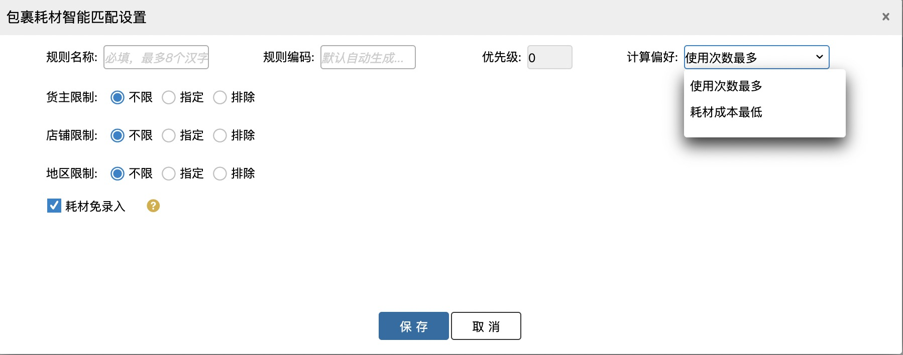

##### ①新增智能规则

智能规则设置保存成功后，默认数据累计时间为0，系统会在次日凌晨自动执行批处理，根据近7天内出库的订单根据计算模型统计耗材数据，执行成功后，数据累计时间显示7天，并在后续每一天都+1天，计算模型里新增最近1天出库订单数据；上限为365天，最多只根据最近365天的出库订单统计数据。

注：若已有包裹类别下存在智能规则，则不允许再新增包裹分类；同一个包裹分类下可新增多条智能规则。

##### ②重算

点击重算，系统会在次日凌晨按照最近7天内出库订单重新计算耗材数据，若当前智能推荐耗材不是用户所需的，可进行重算操作

##### ③编辑

修改规则后，不影响计算模型中已有的数据，后续新订单会按照修改后的规则进行累计计算，因此不推荐对规则进行大改，否则智能推荐结果可能会存在较大偏差。

若修改计算偏好，从“使用次数最多”改成“耗材成本最低”会实时生效，反之需要等次日批处理执行后生效。

##### ④删除

删除智能规则后，当前规则不再生效。

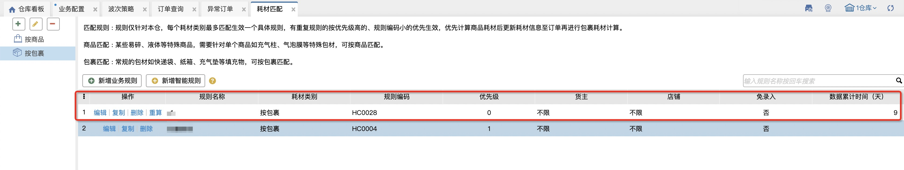

#### 02.耗材类别为商品

商品匹配 : 某些易碎、液体等特殊商品，需要针对单个商品如充气柱、气泡膜等特殊包材，可按商品匹配。规则设置后，订单内全部商品都在指定商品范围内才会匹配该规则。

1.规则名称：可不填，最多16个字符，不填按规则编码填充。

2.规则编码：可不填，不填自动生成。

3.优先级：优先级越小，优先级越高，类别下先根据优先级匹配规则。

4.货主：若设置了指定货主，只有指定货主的包裹才会匹配这个规则；排除同理。

5.店铺：若设置了指定店铺，只有指定店铺的包裹才会匹配这个规则；排除同理。

6.商品：若设置指定的商品，订单只要包含一个指定商品，就会匹配该规则。最多设置20个sku。

7.品牌：若设置指定的品牌，订单是属于指定品牌的才会匹配该规则。

8.等级：若设置指定的等级，订单内商品是属于指定等级的才会匹配该规则。

9.耗材：设置匹配这个规则将会推荐的耗材。可选范围为商品类型为耗材的商品。

10.条件：n个商品匹配m个耗材。

例子：一个商品匹配3个耗材，订单2个商品，最终推荐6个耗材（可被整除）。3个商品匹配5个耗材，订单7个商品，最终推荐10个耗材（余数不匹配）。注意：仅指定商品会匹配规则。

11、耗材免录入

当业务配置-耗材管理-开启实际使用时，订单匹配到该规则后，在对应操作页面登记环节将自动填入推荐耗材，可以手动录入其他耗材。

12、仅匹配此数量

开启时，订单中商品规格和数量需要精准匹配此规则中所设置的商品及符合商品数量，才能够匹配到此规则，未开启时无此限制。

例：耗材规则中设置指定商品00023，满足1个符合商品匹配hc011*3，勾选“仅匹配此数量”

订单1 明细00023*1，则能匹配到此规则，耗材hc011*3，

订单2 明细00023*2，则不能匹配到此规则。

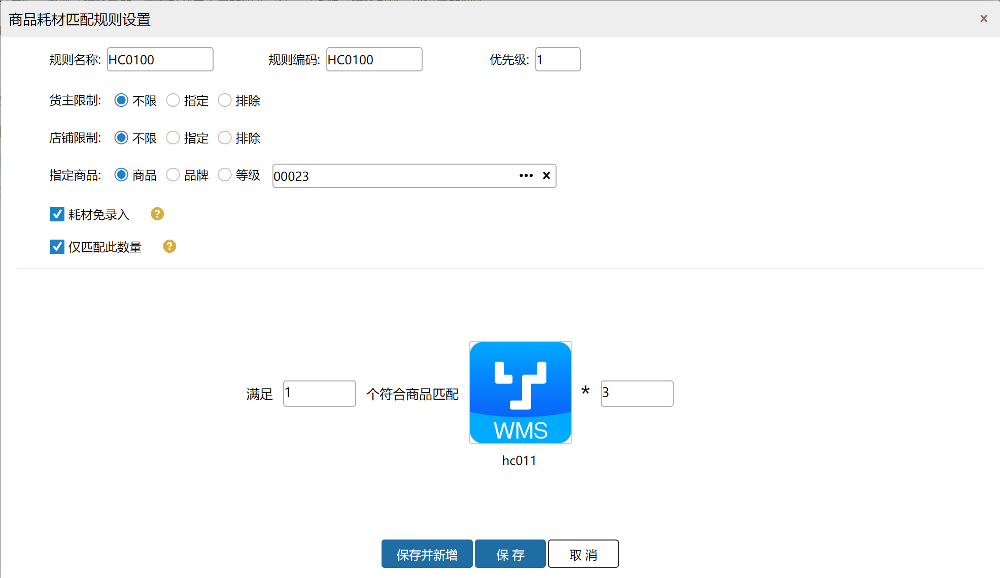

#### 03.耗材匹配节点

前提：业务配置-开启订单记录耗材重量

开启耗材前置计算时，订单落单时/打到零拣时/匹配波次时/从大宗出库打到待分配时，订单匹配耗材且重新计算订单重量和快递成本，未开启耗材前置计算时，订单在PC和PDA指定耗材登记环节（包括验货/打包/称重）后订单匹配耗材且重新计算订单重量和快递成本。

 

> 更新: 2026-08-19 16:04:41  

> 原文: <https://hupun.yuque.com/unzko7/lsbfg0/yurh68zhhre7aa0v>

---

### 03.2.12 耗材管理总览

> 原始文件来源：`00-源文件/专题功能介绍/其他/WMS-耗材管理/index.md`

行业背景：国家停止进口洋垃圾 以后，纸浆下游链路一路飞涨，导致电商卖家在发货时的包材、纸箱成本大幅上升。耗材的管理成为了仓库中重要的降本管理要素。结合此种背景，我们推出了耗材管理模块，旨在帮助商家进行有效的耗材库存管理和使用管理，避免浪费。

    耗材管理达成的效果：

    1.通过商品和包裹特性，系统推荐应该使用的耗材，避免员工乱用

    2.通过登记的耗材，记录耗材使用量。便于财务核算成本

    3.管理耗材库存用量并回传ERP系统

    耗材管理的功能清单

    1.耗材推荐策略

    2.耗材使用报表

    3.耗材使用登记

    4.耗材预设

    一、耗材策略的配置

 1.启用耗材策略

打开耗材使用开关即可

位置：业务配置--出库策略

2.策略的配置

位置：仓内策略--耗材匹配

①主页面

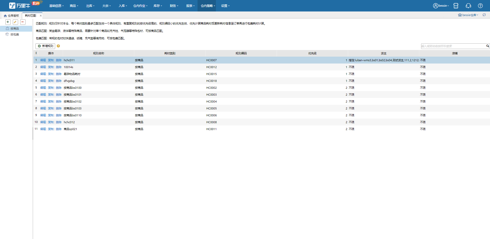

    ②设置类型

     按商品设定

    耗材匹配规则中，商品匹配多用于易碎品、贵重品等商品的包装，也就是说是属于保护商品完整性的一类耗材，例如气泡柱、充气膜、瓦楞纸、泡沫块等

     按包裹设定

    在规则中，按包裹匹配多用于针对订单的体积、重量、目的地等特性的匹配，相当于是打包的外箱、快递袋等

    ③商品类型

     使用耗材推荐势必会有特定的耗材，严格意义上，耗材也是商品的一种，那么我们需要将耗材商品做类型设定

     位置 基础信息-商品信息

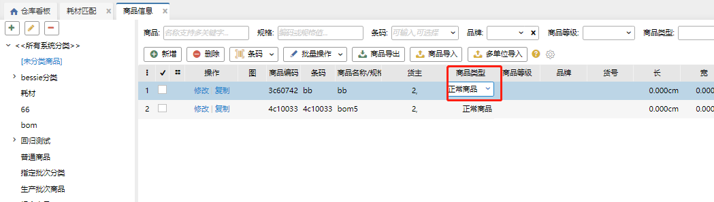

     ④商品匹配策略

点击添加选择按商品指定策略，填写自定的策略名称

新增一个规则

规则中可选择对应的货主、店铺

选择指定的商品或者等级分类通过设定每X个商品使用某个耗材的方式进行配置

包裹匹配策略

新增按包裹的分类后，新增一个规则

包裹规则中可设定包裹的物流属性、地区特性（冷链行业尤为重要）同时还可搭配商品特性进行设定

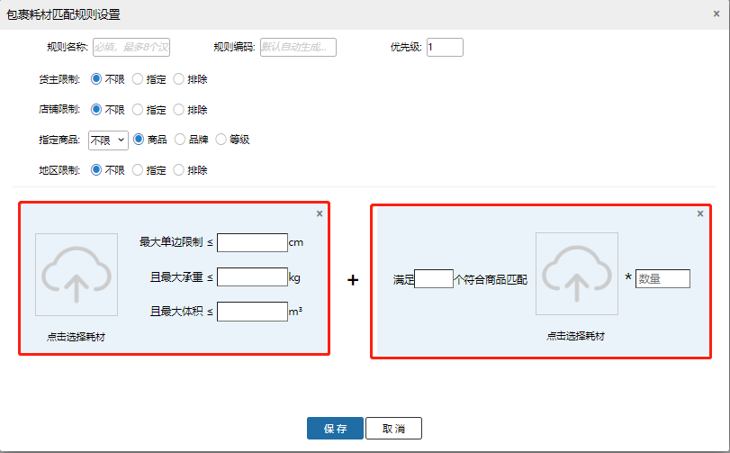

匹配规则：当符合规则存在多条时，系统取优先级最高的规则进行匹配并产出结果

二、耗材推荐结果的展示

①配置

在耗材配置中选择对应的录入、展示环节

同时耗材功能提供了耗材推荐（推荐查看） 和实际使用（使用登记）两种

耗材推荐即系统将计算好的耗材展示出来，操作员只需查看

实际使用则需要操作员在看到推荐结果后再进行扫码录入的操作

②录入耗材

当配置了称重时录入耗材，页面增加耗材录入展示

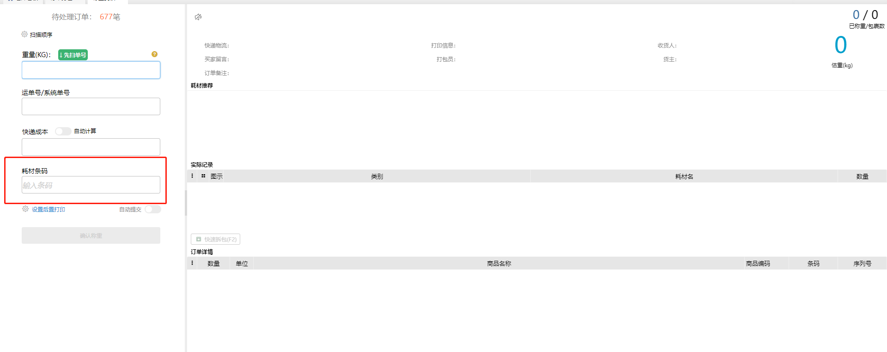

③查看耗材记录

已经录入的会在耗材统计报表中展示

同时也可以在对应订单上显示

三、其他设定

①前置计算

有些商家并无繁琐冗长的流程，希望能把耗材打印到面单上在打包贴单的时候看一下做个引导

则在配置项中开启前置计算即可，同时快递单模板、发货单模板均可以选择耗材信息打印

②记录耗材重量

系统在接收到订单的时候会通过维护的商品重量来计算整个订单的重量，但是当包装过程中商品增加了一些包装耗材时，此时订单重量会相应增加

为保证称重时估重的参考值正确，可选择订单记录耗材重量选项

③记录耗材数量

部分商家仅用耗材记录最外箱的耗材，每个包裹通常只有一个，若开启了记录单个耗材时，操作页面（如订单打包）则会在录入完一个耗材后自动提交订单提升作业效率

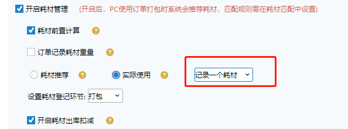

④库存扣减

由于ERP需要对耗材的使用进行成本计算，故可开启耗材出库扣减功能。目前已知除万里牛ERP外还无其他ERP支持扣减

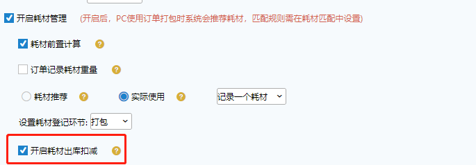

功能效果：开启之后，订单正常出库，在ERP订单中会增加耗材记录

> 更新: 2023-12-21 10:47:51  

> 原文: <https://hupun.yuque.com/unzko7/lsbfg0/kamrg6goukkgg372>

---
