# 04. 入库操作

> 资料来源：基于 `00-源文件/` 对应模块的原始操作手册、专题功能与PDA文档重组迁移。
> 事实边界：正文仅重组迁移原始文档；章节编号、目录和来源标记为整理信息，不新增业务规则、字段或流程。

## 本章知识目录

- **04.1 入库预约与单据管理**
  - [入库预约](#0411-入库预约)
  - [其他入库单](#0412-其他入库单)
  - [采购入库单](#0413-采购入库单)
  - [销退入库单](#0414-销退入库单)
  - [销退预约](#0415-销退预约)
- **04.2 PC端快速入库与收货交接**
  - [原单入库](#0421-原单入库)
  - [收货入库](#0422-收货入库)
  - [销退扫描入库](#0423-销退扫描入库)
  - [收货交接](#0424-收货交接)
- **04.3 PC端分批入库与质检清点**
  - [质检任务](#0431-质检任务)
  - [质检单](#0432-质检单)
  - [清点单](#0433-清点单)
  - [理货清点](#0434-理货清点)
  - [分批入库任务](#0435-分批入库任务)
  - [待入库商品查询](#0436-待入库商品查询)
- **04.4 PDA手持端入库作业**
  - [PDA-入库交接](#0441-PDA-入库交接)
  - [PDA-原单入库](#0442-PDA-原单入库)
  - [PDA-快速入库](#0443-PDA-快速入库)
  - [PDA-收货入库](#0444-PDA-收货入库)
  - [PDA-清点装箱](#0445-PDA-清点装箱)
  - [PDA-理货清点](#0446-PDA-理货清点)
  - [PDA-验货入库](#0447-PDA-验货入库)

---

## 04.1. 入库预约与单据管理

### 04.1.1 入库预约

> 原始文件来源：`00-源文件/操作手册/入库/入库单据/入库预约.md`

ERP发起采购计划，将采购单推送至WMS，在WMS中就会生成一笔入库预约单。

入库预约页面默认显示申请时间是近7天的采购单据，支持打印入库预约单以及商品条码。

入库预约单包括三种类型：采购入库，调拨入库和其他入库，具体页面如下：

 

**提示**

1.查询条件中的入库类型对应单据类型中的类型，包括：采购入库，调拨入库和其他入库，若选择“空白”则表示三个类型的单据都要查询。

2.该笔入库预约单的商品明细和具体的操作记录都会在这个页面显示，但是实际入库的操作分别要在【入库】-【采购入库】和【其他入库】进行。

3.发货人信息，可查看预约单供应商相关数据。

4.运单号支持批量查询多笔单据，支持空格、逗号分隔。（入库模块运单号都支持）

5.打印预约单后，单据行显示打印标记及打印次数。

**其中：**入库状态分为4个类型：

1）在途：表示入库预约单已经建立，但是仓库还没有实际入库；

2）部分收货：表示仓库只有部分入库，还有一些因为某些原因还没有入库；

3）收货完成：表示仓库已经全部入库完成；

4）关闭：表示单据已部分入库或还未入库，就被ERP通知关闭掉了。

 

> 更新: 2025-04-10 11:03:57  

> 原文: <https://hupun.yuque.com/unzko7/lsbfg0/kgpu0nlyknmikubh>

---

### 04.1.2 其他入库单

> 原始文件来源：`00-源文件/操作手册/入库/入库单据/其他入库单.md`

入库预约中有存在调拨入库预约单或其他入库预约单后就可以在该页面进行入库操作。

#### 1. 调拨入库

1.当发起调拨入库请求后，就可以在该页面进行调拨入库，实际入库页面如下：

点确定之后进入下图这个页面：

2. 有修改入库成本权限的操作员，选择预约单后，可以修改商品的成本单价。                        

3. 生产批次导入时，若导入的生产批次号在系统中存在，生产日期、过期日期允许不填，导入批次后取系统中的生产日期、过期日期；若导入的生产批次号在系统中不存在，生产日期、过期日期必填。

例：生产批次商品A，在系统中有批次20200106：生产日期：2020-01-06，过期日期：2022-01-06

预约单01，明细：生产批次商品A，可入库数量100；

1）导入生产批次，批次号：20200106，生产日期、过期日期为空，能正常导入，导入后，批次：20200106，生产日期：2020-01-06，过期日期：2022-01-06。

2）导入生产批次，批次号：20200106，生产日期：2020-01-01,过期日期：2020-012-31，能正常导入，导入后，批次：20200106，生产日期：2020-01-06，过期日期：2022-01-06。

3）导入生产批次，批次号：20200107，生产日期、过期日期为空，导入失败，生产日期、过期日期不能为空。                  

同一预约单内生产批次商品有两条一样的商品明细，生产批次导入时，会根据可入库数量填充。其中：

**相同库位**情况下：                  

1.超收/不超收，先填充第一行，填充满后填充第二行。                    

**不同库位**下：                   

1.不超收，按照库位明细填充。

2.超收，先填充第一行，超收的部分填充到第二行，另外一个库位的直接过滤不填充。

例1：预约单01，明细1：生产批次商品A 可入库数量5；明细2：商品A 可入库数量5。

导入生产批次：商品A  批次p1 数量6 库位A1；商品A 批次p2 数量4 库位A1；                  

导入后，明细1：批次p1，数量5，库位A1；明细2：批次p1，数量1，批次p2，数量4，库位A1 

例2：预约单01，明细1：生产批次商品A 可入库数量5；明细2：商品A 可入库数量5。

导入生产批次：商品A  批次p1 数量6 库位A1；商品A 批次p2 数量4 库位A2；

导入后，明细1：批次p1，数量5，库位A1；明细2：批次p1，数量1，库位A1；

同一预约单内生产批次商品有两条一样的商品明细，序列号导入时，会根据可入库数量填充。

例3：预约单01，明细1：序列号商品B 可入库数量5；明细2：商品B 可入库数量5。

序列号导入：商品B 序列号：x01、x02、x03、x04、x05、x06、x07、x08、x09、x10

导入后：明细1：商品B 数量5，序列号：x01、x02、x03、x04、x05

明细2：商品B 数量5，序列号：x06、x07、x08、x09、x10

3.开启次品管理开关后，调拨入库页面商品名称前新增库存属性列，功能栏新增添加次品按钮，点击按钮跳转选择商品规格页面，勾选商品并确定后，添加次品入库，具体操作如下图：

注意：

1. 可添加的次品为调拨入库页面展示的商品；

2. 选择多个预约单时，添加的次品明细关联所选择的预约单；

3. 正品的收货库位过滤次品库位，次品收货库位无限制；

4. 序列号商品已支持添加次品入库，添加次品时，选择序列号商品，录入序列号入库后，序列号根据库存属性区分；

5.商品开启入库批次管理，添加次品入库后，入库批次号为空；

同sku正品、次品不能同时存放同一库位，案例如下：

前提：空拣选库位A、拣选库位B有商品a的正品库存、拣选库位C有商品a的次品库存、次品库位D

①商品a 正品选择库位A，次品选择库位A报错：所选的目标库位不能同时存放同一个商品的正次商品；

②商品a 正品选择时，查询库位D结果为空，选择库位C，保存报错：目标库位上有同商品的不同属性库存；

③商品a 次品选择库位B，保存报错：目标库位上有同商品的不同属性库存；

④商品a 正品选择库位B，次品选择库位C，保存入库成功；

⑤序列号商品b添加次品入库，次品无序列号。

若上次入库操作（包括采购入库、销退入库、其他入库、销退扫描入库、收货入库）次品所选收货库位都为同一库位，调拨入库再次添加次品时，次品收货库位会自动带出上次入库的次品选择的收货库位。

次品入库回传：

1）业务配置选择次品库存管理全部对内模式，入库后次品数量回传ERP；

2）业务配置选择次品库存管理全部半对外模式，入库后次品数量不回传ERP。

**开启入库支持使用容器：**入库时扫描容器编码，支持货品入到容器里。

#### 2. 其他入库

1.实际入库页面如下：

点确定之后进入下图这个页面：

提示

1. 商品入库后会通知erp，erp商品库存也会对应增加，单据状态也会对应发生更新；

2.入库时可以选择收货库位，入库后对应的库位可用库存和实际库存会增加。

3.选择入库库位时对库位类型没有限制。

4.在仓内策略–业务配置，开启商品条码截取，扫描输入截取的商品条码会与商品信息的条码进行对比校验；

5.开启次品管理开关后调拨入库页面商品名称前新增库存属性列，功能栏新增添加次品按钮，点击按钮跳转选择商品规格页面，勾选商品并确定后，添加次品入库，具体操作如下图：

注意：

1. 可添加的次品为其他入库页面展示的商品；

2. 选择多个预约单时，添加的次品明细关联所选择的预约单；

3. 正品的收货库位过滤次品库位，次品收货库位无限制；

4.序列号商品已支持添加次品入库，添加次品时，选择序列号商品，录入序列号入库后，序列号根据库存属性区分。

5.商品开启入库批次管理，添加次品入库后，入库批次号为空；

6.同sku正品、次品不能同时存放同一库位，案例如下：

前提：空拣选库位A、拣选库位B有商品a的正品库存、拣选库位C有商品a的次品库存、次品库位D

①商品a 正品选择库位A，次品选择库位A报错：所选的目标库位不能同时存放同一个商品的正次商品；

②商品a 正品选择时，查询库位D结果为空，选择库位C，保存报错：目标库位上有同商品的不同属性库存；

③商品a 次品选择库位B，保存报错：目标库位上有同商品的不同属性库存；

④商品a 正品选择库位B，次品选择库位C，保存入库成功；

⑤序列号商品b添加次品入库，次品无序列号。

若上次入库操作（包括采购入库、销退入库、其他入库、销退扫描入库、收货入库）次品所选收货库位都为同一库位，其他入库再次添加次品时，次品收货库位会自动带出上次入库的次品选择的收货库位。

次品入库回传：

1）业务配置选择次品库存管理全部对内模式，入库后次品数量回传ERP；

2）业务配置选择次品库存管理全部半对外模式，入库后次品数量不回传ERP。

**开启入库支持使用容器：**入库时扫描容器编码，支持货品入到容器里。

#### 3.入库审核-旧版

入库配置开启入库审核后，调拨入库或其他入库后会生成入库审核单，具体操作如下：

注意：

①开启次品管理后，入库单审核页面商品编码前新增库存属性列，选择商品页面新增开启添加次品勾选项；

②入库审核单添加商品时，可选择的是预约单内的商品；

③.开启入库支持使用容器，入库审核页面扫描容器编码支持货品入到容器中。

#### 4.入库审核-新版

在审批管理页面配置快速入库—调拨/其他入库审批流程后，符合配置的调拨入库或其他入库后会生成待入库+审批中的入库单，具体操作请参考[采购入库审核](https://hupun.yuque.com/unzko7/lsbfg0/crl0rycd2i8g3a23#M1x2b)。

#### 5.确认入库并跳转装箱

其他入库时，可以确认入库之后就直接跳到打包装箱里面去将入库商品进行批量装箱

前置条件：有打包装箱权限的操作员才显示该按钮

> 更新: 2026-07-08 16:24:33  

> 原文: <https://hupun.yuque.com/unzko7/lsbfg0/kk54nauq2fs3cwnr>

---

### 04.1.3 采购入库单

> 原始文件来源：`00-源文件/操作手册/入库/入库单据/采购入库单.md`

仓库接收到采购预约单，就可以在采购入库页面进行商品入库动作，采购入库具体有两种入库操作：采购入库和验货入库。

#### **1.采购入库**

采购入库是针对有入库预约单的操作，具体操作如下图：

**注意：**

1. 有修改入库成本权限的操作员，选择预约单后，可以修改商品的成本单价。                      

2.生产批次导入时，若导入的生产批次号在系统中存在，生产日期、过期日期允许不填，导入批次后取系统中的生产日期、过期日期；若导入的生产批次号在系统中不存在，生产日期、过期日期必填。

例：生产批次商品A，在系统中有批次20200106：生产日期：2020-01-06，过期日期：2022-01-06                     

预约单01，明细：生产批次商品A，可入库数量100；                       

1）导入生产批次，批次号：20200106，生产日期、过期日期为空，能正常导入，导入后，批次：20200106，生产日期：2020-01-06，过期日期：2022-01-06。                     

2）导入生产批次，批次号：20200106，生产日期：2020-01-01,过期日期：2020-012-31，能正常导入，导入后，批次：20200106，生产日期：2020-01-06，过期日期：2022-01-06。                    

3）导入生产批次，批次号：20200107，生产日期、过期日期为空，导入失败，生产日期、过期日期不能为空。.                     

3.同一预约单内生产批次商品有两条一样的商品明细，生产批次导入时，会根据可入库数量填充。其中：                     

**相同库位情况下：**                   

超收/不超收，先填充第一行，填充满后填充第二行。                  

**不同库位下：**                    

①.不超收，按照库位明细填充                    

②.超收，先填充第一行，超收的部分填充到第二行，**另外一个库位的直接过滤不填充。**                 

    例1：预约单01,明细1：生产批次商品A 可入库数量5；明细2：商品A 可入库数量5。

    操作导入生产批次：商品A  批次p1 数量6 库位A1；商品A 批次p2 数量4 库位A1；

    导入后结果展示：明细1：批次p1，数量5，库位A1；明细2：批次p1，数量1，批次p2，数量4，库位A1

    例2：预约单01,明细1：生产批次商品A 可入库数量5；明细2：商品A 可入库数量5。

    操作导入生产批次：商品A  批次p1 数量6 库位A1；商品A 批次p2 数量4 库位A2；

    导入后结果展示：明细1：批次p1，数量5，库位A1；明细2：批次p1，数量1，库位A1；

4.同一预约单内生产批次商品有两条一样的商品明细，序列号导入时，会根据可入库数量填充。

  例：预约单01,明细1：序列号商品B 可入库数量5；明细2：商品B 可入库数量5。

  操作序列号导入：商品B 序列号：x01、x02、x03、x04、x05、x06、x07、x08、x09、x10.

  导入后结果展示：明细1：商品B 数量5，序列号：x01、x02、x03、x04、x05

                             明细2：商品B 数量5，序列号：x06、x07、x08、x09、x10

5.开启次品管理开关后采购入库页面商品名称前新增库存属性列，功能栏新增添加次品按钮，点击按钮跳转选择商品规格页面，勾选商品并确定后，添加次品入库，具体操作如下图：

**注意：**

1. 可添加的次品为采购入库页面展示的商品；

2.选择多个预约单时，添加的次品明细关联所选择的预约单；

3. 正品的收货库位过滤次品库位，次品收货库位无限制；

4. 序列号商品已支持添加次品入库，添加次品时，选择序列号商品，录入序列号入库后，序列号根据库存属性区分。

5. 商品开启入库批次管理，添加次品入库后，入库批次号为空；

6.同sku正品、次品不能同时存放同一库位，案例如下：

前提：空拣选库位A、拣选库位B有商品a的正品库存、拣选库位C有商品a的次品库存、次品库位D

①商品a 正品选择库位A，次品选择库位A报错：所选的目标库位不能同时存放同一个商品的正次商品；

②商品a 正品选择时，查询库位D结果为空，选择库位C，保存报错：目标库位上有同商品的不同属性库存；

③商品a 次品选择库位B，保存报错：目标库位上有同商品的不同属性库存；

④商品a 正品选择库位B，次品选择库位C，保存入库成功；                     

若上次入库操作（包括采购入库、销退入库、其他入库、销退扫描入库、收货入库）次品所选收货库位都为同一库位，采购入库再次添加次品时，次品收货库位会自动带出上次入库的次品选择的收货库位。

次品入库回传：                     

1）业务配置选择次品库存管理全部对内模式，入库后次品数量回传ERP；                     

2）业务配置选择次品库存管理全部半对外模式，入库后次品数量不回传ERP。                    

7.同一预约单内生产批次商品有两条一样的商品明细，生产批次导入时，会根据可入库数量填充。其中：

**相同库位情况下：**

超收/不超收，次品都填充到第一行；

**不同库位下：**

超收/不超收，按照库位明细填充；

例1：预约单01,明细1：次品，生产批次商品A ；明细2：次品，商品A 。

操作导入生产批次：次品，商品A  批次p1 数量6 库位A1；次品，商品A 批次p2 数量4 库位A1；

导入后结果展示：明细1：次品，商品A：批次p1，数量6，批次p2，数量4，库位A1；明细2：次品，商品A 数量 0.

例2：预约单01,明细1：次品，生产批次商品A ；明细2：次品，商品A 。

操作导入生产批次：次品，商品A  批次p1 数量6 库位A1；次品，商品A 批次p2 数量4 库位A2；

导入后结果展示：明细1：次品，商品A  批次p1 数量6 库位A1；明细2:次品，商品A 批次p2 数量4 库位A2；

**入库清单：**查看预约单的入库进度。

可入库数量=预约数量-已入库数量

差异=可入库数量-本次入库数量

**开启入库支持使用容器：**入库时扫描容器编码，支持货品入到容器里。

#### **2.验货入库-旧版**

验货入库是在有商品可以入库，但是没有采购预约单的情况下进行的，具体操作如下图，点击验货入库按钮弹出验货入库页面，现在供应商、货主后，录入商品编码/条码添加入库商品，选择入库库位后点击保存，验货入库成功。

提示

1.商品采购入库后会通知erp，erp商品库存也会对应增加，单据状态也会对应发生更新；

2.验货入库只会在wms增加库存，仅会通知万里牛 erp增加库存；

3.入库时可以选择收货库位，入库后对应的库位会增加相应的可用库存和实际库存；

4.选择入库库位时对库位类型没有限制；

5.在仓内策略–业务配置，开启商品条码截取，扫描输入截取的商品条码会与商品信息的条码进行对比校验；

6.验货入库成功后，不关闭一级采购入库菜单，再次验货入库后，记忆上次验货入库选择的供应商；

7.支持导入商品明细，快速添加入库商品，操作步骤如下：

注意：

1.商品编码、条码、箱条码填一个即可；

2.同一编码的商品导入多行，会累加商品数量；

3.同一编码的商品导入多行，销售单价，库位，备注取最后一行；

4.序列号商品不支持导入；

5.单次导入行数限制200行；

6.文件格式须与模版完全一致，有如下要求：

- 条码和箱条码只能填一个；   

- 数量必填，销售单价选填；

-开启次品库存管理开关库存属性必填仅可录入正品或次品；

开启次品管理开关后验货入库页面商品名称前新增库存属性列，条码右侧新增开启添加次品勾选项，勾选后根据编码查询商品或录入商品条码后，添加次品入库，具体操作如下图：

提示：

1. 正品的收货库位过滤次品库位，次品收货库位无限制；

2.序列号商品不允许添加次品入库，勾选添加次品后，选择序列号商品报错：序列号商品暂不支持此操作；

3. 商品开启入库批次管理，添加次品入库后，入库批次号为空；

4.同sku正品、次品不能同时存放同一库位，案例如下：

前提：空拣选库位A、拣选库位B有商品a的正品库存、拣选库位C有商品a的次品库存、次品库位D

①商品a 正品选择库位A，次品选择库位A报错：所选的目标库位不能同时存放同一个商品的正次商品；

②商品a 正品选择时，查询库位D结果为空，选择库位C，保存报错：目标库位上有同商品的不同属性库存；

③商品a 次品选择库位B，保存报错：目标库位上有同商品的不同属性库存；

④商品a 正品选择库位B，次品选择库位C，保存入库成功；

若上次入库操作次品所选收货库位都为同一库位，验货入库再次添加次品时，次品收货库位会自动带出上次入库的次品选择的收货库位。

次品入库回传：

1）业务配置选择次品库存管理全部对内模式，入库后次品数量回传ERP；                   

2）业务配置选择次品库存管理全部半对外模式，入库后次品数量不回传ERP。  

保存并新增 :点击保存并新增，验货入库页面不关闭，且选择的收货时间、供应商、货主、备注都保留，可以连续入库。

**开启入库支持使用容器：**入库时扫描容器编码，支持货品入到容器里。

#### **3.验货入库-新版    **

点击验货入库按钮，在验货入库弹窗中点击"新版"按钮切换到新版验货入库页面，新版支持扫描条码添加商品，操作步骤如下所示：

注意：

1.先选择供应商、货主后再扫描商品；

2.选择收货库位后，扫描条码添加商品后会自动带出选择的库位；

3.界面右侧已添加商品的数量、收货库位可以编辑修改，其中数量不能修改为小于0的正整数；

4.选中页面右侧的商品明细列表空白行的商品编码，支持通过编辑查询添加商品。

5.开启保存并新增，确认入库页面不关闭，库位、收货时间、供应商、货主、备注不变，可以继续入库。

**开启入库支持使用容器：**入库时扫描容器编码，支持货品入到容器里。

#### **4.入库审核-旧版**

入库配置开启入库审核后，采购入库或验货入库后会生成入库审核单，具体操作如下：

注意：

①开启次品管理后，入库单审核页面商品编码前新增库存属性列，选择商品页面新增开启添加次品勾选项；

②采购入库审核单添加商品时，可选择的是预约单内的商品，验货入库单审核添加商品时，可选择当前仓的所有商品；

③.开启入库支持使用容器，入库审核页面扫描容器编码支持货品入到容器中。

#### 5.入库审核-新版

在[审批管理](https://hupun.yuque.com/unzko7/lsbfg0/gumupf3qnnlkrcrs)页面配置快速入库—采购入库审批流程后，符合配置的采购入库或验货入库后会生成待入库+审批中的入库单，具体操作如下：

##### 5.1 创建审批流

先在审批管理页面新增审批流程，业务模块选择[入库-快速入库]，单据类型选择[采购入库/采购验货入库]，适用仓库、适用货主选择指定数据，审批人去重/不去重，如下图所示为2级审批流，第一级审批人是角色[普通仓工]，第二级审批人是账号[bessie]，配置完成后点击保存，审批流创建成功。

##### 5.2 新建入库单

1仓库，操作员bs01，新建采购入库/验货入库单，单据货主为lubantestwms01，符合审批流程，单据进入审批流，单据状态及审批状态如下，点击审批单号可跳转到审批中心查看审批单。

审批单发起人为入库单创建人，当前审批人为第一级审批人，当前审批等级为第一级：

其中：

①发起人能看到审批单，但不能操作；

②当前审批人、超级管理员、普通管理员能看到并审批单据；

③其他账号看不到审批单。

##### 5.3 审批通过

有审批权限的账号可以在审批中心选择审批单进行审批操作，选择对应审批单点击审批/确认审批，在弹窗中填写审批意见后点击审批通过按钮，即可完成审批。上一级审批完成后，进入下一级审批，审批人按流程配置发生变化。

第二级审批人审批过程同上，审批通过后，审批流结束，对应入库单自动确认入库。

##### 5.4 审批驳回

有审批权限的账号可以在审批中心选择审批单进行审批操作，选择对应审批单点击审批/确认审批，在弹窗中填写审批意见后点击审批驳回按钮，即可驳回审批。驳回审批后，审批流结束。

可在对应入库单上进行修改并提交重新发起新的审批，或者关闭单据。

##### 5.5 审批撤销

入库单发起审批后，若提交单据有误，可以手动撤销审批，待修改后重新提交发起新的审批。

#### **6.采购入库单**

采购入库单支持查看某一入库单的商品总额及商品总数。统计了查询出所有预约单的商品汇总。

#### **7.入库装箱的单据确认入库**

 在pda[入库装箱](https://hupun.yuque.com/docs/share/e3d57a38-6059-4610-ad01-0213e116c859?)完成采购预约单的装箱后此页面生成待确认的采购入库单，点击入库，商品确认入库成功，库位库存增加装箱商品的库存。

注意：

1.pda入库装箱后，PC未确认入库前，库位库存不会增加，唯一箱是待生效状态；

2.待确认的入库单不能新增明细，唯一箱的数量不支持编辑，允许删除装箱明细；

3.支持修改装箱的库位，库位仅限在存储、箱拣选、过渡库位中修改；

4.确认入库后，货箱的状态是生效，库位库存增加。

5.开启入库支持使用容器，待入库页面扫描容器编码支持货品入到容器中。

#### **8.序列号**

1.序列号标准模式，入库时必须录入序列号且支持导入序列号。

2.序列号简洁模式，开启入库登记序列号，入库时必须录入序列号且支持导入序列号；未开启入库登记序列号，入库时无需录入序列号且页面不显示导入序列号按钮。

3.码上放心换码路径支持仅扫描箱号

开启“上传码上放心单据入库前查询外箱码自动填写关联序列号”情况下，扫描外箱码时可以通过开启“仅扫描外箱码”实现录入外箱码后不会弹出录入序列号弹窗，可以直接连续扫描外箱码录入。

#### 9.辅助单位

新增辅助单位换算商品数量，关联开启商品多单位管理+出库快速换算推荐模式显示。

1.暂不支持序列号商品编辑。

2.辅助单位弹窗显示商品多单位信息，编辑后自动把辅助单位数量换算基础单位数量后相加，更新到数量，辅助单位显示已填数量辅助单位拼接结果。

3.生产批次商品辅助单位入口在批次录入弹窗内，入库明细列上仅支持弹窗显示，不支持修改，显示辅助单位合计数据。

4.修改数量后辅助单位清空，收货清单无预约单收货生成入库单合并相同sku数量后辅助单位清空。

5.复制的明细需手动编辑辅助单位。

6待入库、待审核单据、草稿已有辅助单位的仅显示文本，再进入弹窗，辅助单位弹窗数据显示初始化空白。（ps：批次商品录入->批次辅助单位弹窗内，会显示批次辅助单位具体数据）

7.支持导出和打印辅助单位。

已支持页面：PC端入库模块（生产批次商品辅助单位仅采购/验货入库、有/无预约单收货清点、其他/销退入库支持）、仓内盘点任务。

#### 10.确认入库并跳转装箱

采购入库/验货入库时，可以确认入库之后就直接跳到打包装箱里面去将入库商品进行批量装箱

前置条件：有打包装箱权限的操作员才显示该按钮

> 更新: 2026-07-08 16:21:24  

> 原文: <https://hupun.yuque.com/unzko7/lsbfg0/crl0rycd2i8g3a23>

---

### 04.1.4 销退入库单

> 原始文件来源：`00-源文件/操作手册/入库/入库单据/销退入库单.md`

有生成退货入库或换货入库的预约单后，就可以在该页面进行退货或换货的入库操作，具体页面如下：

#### 1.选择预约单

选择对应的售后预约单（可在查询栏进行条件筛选，查询单据）。

#### 2.销退入库

##### 2.1 非买赔业务

填写对应数量及收货库位后保存即可。支持商品明细导入，可以通过表格导入商品

##### 2.2 买赔业务

:::color3
场景：买赔业务在售后场景下可视为将不入库商品进行记录，买赔仅是不做入库后的索赔，对于仓储业务来说是一个向上游反馈异常不可收数量的方式。本次更新在销退入库、销退预约相关页面新增"拒收数量"录入与展示，支持货主在销退环节记录拒收商品数量，并按开关控制是否启用该功能。

:::

开启后台开关后，销退入库单录入、查看明细处增加了“拒收数量”列，用户可按实际情况输入/不输入拒收数量，对于单条明细可以不拒收（不输入拒收数量，置空 ）/部分拒收（拒收数量<可入库数量）/全部拒收（拒收数量=可入库数量），输入后保存单据，生成入库单。

根据拒收数量差异，入库单和关联预约单结果也有不同，具体如下：

①所有明细全部拒收，不生成入库单，销退预约单自动关闭；

②明细部分拒收、部分正常收入，生成入库单，显示对应拒收数量、实收数量，销退预约单显示部分收货/完成；

③明细全部正常收入无拒收，生成入库单，显示对应实收数量，销退预约单显示完成。

注：

1.剩余未入库数量=预约数量-（实际入库数量+拒收数量）

2.后台开关与"业务配置-入库审核（老审核）"互斥，若已开启老审核流程，开启后台开关后不生效，若已开启后台开关，开启老审核流程会报错

3.采购入库单、其他入库单、采购预约单不受此开关影响，不显示拒收相关列

4.次品明细不需要录入拒收数量

5.生产批次商品、序列号商品有拒收数量时，这部分数量不需要录入行业属性信息

6.导出、打印支持拒收数量

提示：

1.商品入库后会通知ERP，ERP商品库存也会对应增加，单据状态也会对应发生更新。

2.入库时可以选择收货库位，入库后对应的库位可用库存和实际库存会增加。

3.选择入库库位时对库位类型没有限制。

4.在仓内策略–业务配置，开启商品条码截取，扫描输入截取的商品条码会与商品信息的条码进行对比校验。

5.有修改入库成本权限的操作员，选择预约单后，可以修改商品的成本单价。                 

6. 若导入的生产批次号在系统中不存在，生产日期、过期日期必填。

例：生产批次商品A，在系统中有批次20200106：生产日期：2020-01-06，过期日期：2022-01-06

预约单01，明细：生产批次商品A，可入库数量100；

1）导入生产批次，批次号：20200106，生产日期、过期日期为空，能正常导入，导入后，批次：20200106，生产日期：2020-01-06，过期日期：2022-01-06。

2）导入生产批次，批次号：20200106，生产日期：2020-01-01,过期日期：2020-012-31，能正常导入，导入后，批次：20200106，生产日期：2020-01-06，过期日期：2022-01-06。

3）导入生产批次，批次号：20200107，生产日期、过期日期为空，导入失败，生产日期、过期日期不能为空。

同一预约单内生产批次商品有两条一样的商品明细，生产批次导入时，会根据可入库数量填充。其中：

7.支持商品导入，和采购预约单入库一致，支持导入商品和对应的库位信息，目前至少支持5000条商品信息导入

**相同库位情况下：**

1.超收/不超收，先填充第一行，填充满后填充第二行。

**不同库位下：**

1.不超收，按照库位明细填充

2.超收，先填充第一行，超收的部分填充到第二行，**另外一个库位的直接过滤不填充。**

 例1：预约单01,明细1：生产批次商品A 可入库数量5；明细2：商品A 可入库数量5。

导入生产批次：商品A  批次p1 数量6 库位A1；商品A 批次p2 数量4 库位A1；

导入后，明细1：批次p1，数量5，库位A1；明细2：批次p1，数量1，批次p2，数量4，库位A1；

 例2：预约单01,明细1：生产批次商品A 可入库数量5；明细2：商品A 可入库数量5。

导入生产批次：商品A  批次p1 数量6 库位A1；商品A 批次p2 数量4 库位A2；

导入后，明细1：批次p1，数量5，库位A1；明细2：批次p1，数量1，库位A1；

开启次品管理开关后销退入库页面商品名称前新增库存属性列，功能栏新增添加次品按钮，点击按钮跳转选择商品规格页面，勾选商品并确定后，添加次品入库，具体操作如下图：

注意：

1. 可添加的次品为销退入库页面展示的商品。

2.选择多个预约单时，添加的次品明细关联所选择的预约单。

3. 正品的收货库位过滤次品库位，次品收货库位无限制。

4.序列号商品已支持添加次品入库，添加次品时，选择序列号商品，录入序列号入库后，序列号根据库存属性区分。

5.商品开启入库批次管理，添加次品入库后，入库批次号为空。

6.同sku正品、次品不能同时存放同一库位，案例如下：

前提：空拣选库位A、拣选库位B有商品a的正品库存、拣选库位C有商品a的次品库存、次品库位D。

①商品a 正品选择库位A，次品选择库位A报错：所选的目标库位不能同时存放同一个商品的正次商品。

②商品a 正品选择时，查询库位D结果为空，选择库位C，保存报错：目标库位上有同商品的不同属性库存。

③商品a 次品选择库位B，保存报错：目标库位上有同商品的不同属性库存。

④商品a 正品选择库位B，次品选择库位C，保存入库成功。

7.若上次入库操作（包括采购入库、销退入库、其他入库、销退扫描入库、收货入库）次品所选收货库位都为同一库位，销退入库添加次品时，次品收货库位会自动带出上次入库的次品选择的收货库位。

8.入库配置开启销退入库差异收时，销售退货可以入预约单外的商品，点击销退入库页面商品明细空白行的商品编码，跳转选择商品页面，可以选择当前仓库的所有商品，操作如下：                   

9.次品入库回传：

 1）业务配置选择次品库存管理全部对内模式，入库后次品数量回传ERP。

 2）业务配置选择次品库存管理全部半对外模式，入库后次品数量不回传ERP。

10.新增单据类型查询项，原单入库的单据可以在销退入库处进行查询。

11.开启入库支持使用容器：入库时扫描容器编码，支持货品入到容器里。

#### 3.入库审核-旧版

入库配置开启入库审核后，销退入库后会生成入库审核单，具体操作如下：

注意：

①开启次品管理后，入库单审核页面商品编码前新增库存属性列，选择商品页面新增开启添加次品勾选项；

②销退入库审核单添加商品时，可选择的是预约单内的商品；

③开启入库支持使用容器，入库审核页面扫描容器编码支持货品入到容器中。

支持勾选多笔批量审核待审核单据。

注意：

①关联业务配置入库单审核开关+角色权限入库单审核权限显示。

②不支持跨页勾选。

③仅支持待审核单据操作，否则报错。

④批量审核失败无入库草稿生成。

#### 4.入库审核-新版

在审批管理页面配置快速入库—调拨/其他入库审批流程后，符合配置的调拨入库或其他入库后会生成待入库+审批中的入库单，具体操作请参考[采购入库审核](https://hupun.yuque.com/unzko7/lsbfg0/crl0rycd2i8g3a23#M1x2b)。

#### 5.导入

支持导入销退预约单入库、原单入库。

1.按钮关联角色管理-允许操作销退入库权限显示。

2.原单入库选项关联操作员是否有原单入库菜单权限显示。

3.不支持包含生产批次、入库批次、序列号、次品商品的单据导入入库。

4.仅支持预约单状态为在途的单据。

5.若开启销退入库单审核的配置，则导入单据为待审核状态。

6.导入入库失败无草稿生成。

7.导入支持部分成功，导入失败时可数据中心查看错误原因。

#### 

> 更新: 2026-07-28 17:33:38  

> 原文: <https://hupun.yuque.com/unzko7/lsbfg0/gd5kg1rv7rpmiwk8>

---

### 04.1.5 销退预约

> 原始文件来源：`00-源文件/操作手册/入库/入库单据/销退预约.md`

已完成的订单需要退货或者换货，则erp会发起退货入库或者换货入库请求，wms就会自动生成一笔销退预约单。

#### **1.入库类型有两种类型：退货入库、换货入库。**

具体页面如下：

如图1为查询条件区，默认查询条件为申请时间为近7天的销退预约单据；

如图2为预约单据显示区，可翻页查询；

如图3为具体单笔单据的详细信息。

提示

1.支持修改预约单的承运商、运单号、备注；

2. 预约单信息修改同步至ERP场景

1）对接万里牛erp的销退预约单，修改承运商、运单号、备注后会通知到erp更新售后单的承运商、运单号；

2）erp修改售后单的承运商、运单号、问题详情后wms的销退预约单的承运商、运单号随后更新，erp修改问题详情，更新到wms的备注里。

3）wms预约单状态为部分收货、收货完成、关闭时，erp更新售后单的承运商、运单号、备注，wms不再同步更新。

4）wms销退预约单完成30天内允许修改承运商、运单号、备注。

3.打印预约单后，单据行显示打印标记及打印次数。

入库状态分为4种:

1）在途：表示预约已创建，但是仓库还没有实际入库；

2）部分收货：表示仓库只有部分入库；

3）收货完成：表示仓库已全部入库，单据已操作完成；

4）关闭：表示仓库还未入库或者部分入库时，接受到erp发起终止售后的请求。

#### **2. 销退入库单创建就已显示有收货库位**

这类现象是由于在【业务配置】-【入库配置】页面有设置默认收货库位，如下图：

设置页面：

结果如下图：

 

**提示**

1. 系统暂时不支持淘宝后台直接退款等售后单自动创建，必须要在erp创建售后单才能创建；

2. 退货、换货预约单的的订单必须要在wms发货的才可以。

> 更新: 2025-04-10 11:04:30  

> 原文: <https://hupun.yuque.com/unzko7/lsbfg0/ly5cshsu34bdoxoz>

---

## 04.2. PC端快速入库与收货交接

### 04.2.1 原单入库

> 原始文件来源：`00-源文件/操作手册/入库/快速入库/原单入库.md`

从仓库销售出库的订单扫描运单号、买家ID、手机号任意一个可以原单入库，具体操作页面如下：

#### **1.扫描信息匹配到多个原单**

当扫描的信息有多个销售出库的单据匹配时，会弹出匹配的订单供选择，最多显示十个匹配的订单，按照仓库接单时间排序，具体操作页面如下：

#### **2.扫描信息匹配到一个原单**

单据不包含序列号商品时，扫描运单号、买家ID、手机号之一后，会自动验货，此时选择收货库位后可入库；

单据包含序列号商品时，要扫描序列号之后才会验货成功，具体操作页面如下：

提示

1.拥有销售出库仓库权限的用户可以选择权限下的任意仓库原单入库；

2.仓内策略--其他配置中开启验证业务单据有效性的前提下，原单入库会验证序列号商品的序列号是不是原始出库时登记的序列号；

3.仓内策略--入库配置中开启了允许入库超收，原单入库已验数量可以修改为大于应入数量的值；

4.仓内策略--入库配置开启了允许入库超收、允许销退入库差异收货，原单入库可以差异收货;

5.订单经过拆单、合单及系统已经建立售后预约单的则不支持原单入库。

#### ** 3.开启入库使用容器**

入库时扫描容器编码，支持货品入到容器里。

> 更新: 2023-12-21 17:50:04  

> 原文: <https://hupun.yuque.com/unzko7/lsbfg0/yxx8i8g1fnistalh>

---

### 04.2.2 收货入库

> 原始文件来源：`00-源文件/操作手册/入库/快速入库/收货入库.md`

收货入库可以通过扫描单据信息进行入库操作。同时支持入库装箱。扫描时匹配除销退单据之外的所有未完成入库预约单。

#### **1.收货入库**

1）扫描项：支持扫描预约单的运单号和外部单号，左模糊匹配。

2）扫描匹配：匹配一个单据，直接带入单据内明细信息。扫描匹配多个单据，弹出框显示匹配到的单据，默认显示20个。只支持同类型和同货主的单据同时入库。

3）扫描商品条码：支持条码截取、辅助条码和主条码。扫描匹配到一个商品直接添加该商品数量，扫描匹配到多个商品弹出框选择；在仓内策略–业务配置，开启扫描条码强制提交后，未开启自动提交时，收货入库无需点击确认入库，扫描wanliniu666可自动入库。

 

#### **2.入库装箱**

名词解释：唯一箱：通过打包装箱等途径装的箱子，每个箱子拥有唯一的箱条码，不同箱子之间的箱条码不可能重复。规格箱：开启了全流程库存管理时，商品可设置装箱规格，根据不同的数量比例设置箱子中sku数量的多少。

1）装箱条件：仅在未开启入库审核时才能入库装箱。点击装箱按钮或者按F7直接跳转装箱页面。

2）扫描商品条码/箱条码：扫描商品条码：匹配之后，装箱清单中加上该sku。扫描规格箱条码：装箱清单中加上该规格箱规则中对应的sku数量。扫描唯一箱条码：只匹配待生效的唯一箱条码，且待生效的唯一箱中的sku存在于预约单中。

3）建议装箱量：开启全流程库存管理时，sku的建议装箱数量为规格箱启用的箱规则中最低层级的箱子数量。若没有规格箱规则，建议装箱数量为该sku设置的库区预警上限-下限的最小值。若都无，建议装箱数量为-。建议装箱数量可以手动填写，当sku的数量到达建议装箱数量时，可自动装箱。

4）已装箱：点击已装箱的数字，弹出框会显示已经装箱的箱子信息。规格箱数量可编辑，增加、减少或删除箱子。唯一箱只能删除箱子。点击箱图标，显示箱内sku信息。唯一箱装箱但是未入库时，打包装箱能查询到该箱子信息，状态为待生效。

5）后置打印：后置打印在每次装箱后打印箱条码，方便操作员装箱后贴上箱条码。

#### **3.开启次品开关后收货入库**

业务配置开启次品开关后，收货库位下新增次品库位，商品条码右上方新增添加次品开关，右侧商品明细中新增库存属性列，新增快捷键F8拆成次品，具体操作如下所示：

**提示：**

1.  未开启添加次品开关，扫描录入的都是正品，开启添加次品开关，扫描录入的都是次品；                      

2. 收货库位过滤次品库位，次品库位无限制；

3. 序列号商品已支持添加次品入库，添加次品时，选择序列号商品，录入序列号入库后，序列号根据库存属性区分。

4. 商品开启入库批次管理，添加次品入库后，入库批次号为空；

5. 扫描录入商品的正品入库明细后，使用快捷键F8可以从当前已验的正品中拆成次品，当正品已验数量为0时，不可拆出次品；

6. 同sku正品、次品不能同时存放同一库位，案例如下：

前提：空拣选库位A、拣选库位B有商品a的正品库存、拣选库位C有商品a的次品库存、次品库位D

①商品a 正品选择库位A，次品选择库位A报错：所选的目标库位不能同时存放同一个商品的正次商品；

②商品a 正品选择时，查询库位D结果为空，选择库位C，保存报错：目标库位上有同商品的不同属性库存；

③商品a 次品选择库位B，保存报错：目标库位上有同商品的不同属性库存；

④商品a 正品选择库位B，次品选择库位C，保存入库成功；

⑤序列号商品b添加次品入库，次品无序列号。

7.若上次入库操作次品所选收货库位都为同一库位，收货入库再次添加次品时，次品收货库位会自动带出上次入库的次品选择的收货库位。

次品入库回传：

1）业务配置选择次品库存管理全部对内模式，入库后次品数量回传ERP；

2）业务配置选择次品库存管理全部半对外模式，入库后次品数量不回传ERP。                     

 

#### **4.开启入库使用容器后收货入库**

入库时扫描容器编码，支持货品入到容器里。

#### 

> 更新: 2023-12-21 17:48:55  

> 原文: <https://hupun.yuque.com/unzko7/lsbfg0/tct91keu3a3ogybd>

---

### 04.2.3 销退扫描入库

> 原始文件来源：`00-源文件/操作手册/入库/快速入库/销退扫描入库.md`

销退预约未完成的单据可在该页面扫描 运单号、外部单号、买家ID、手机号 其中任意一个信息后对匹配到的单据进行入库操作。

#### 1.扫描信息匹配到多个销退预约单

弹出符合扫描信息的销退预约单，可选择具体的预约单，具体页面如下：

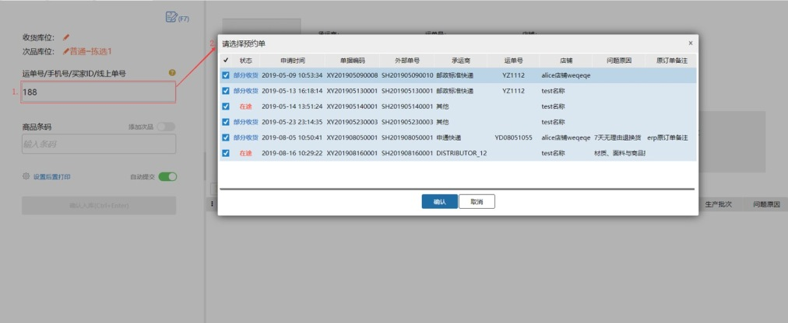

选择多个预约单后，点击销退商品信息栏的预约单号弹出预约单详情弹窗，支持修改承运商、运单号、备注，如图所示：

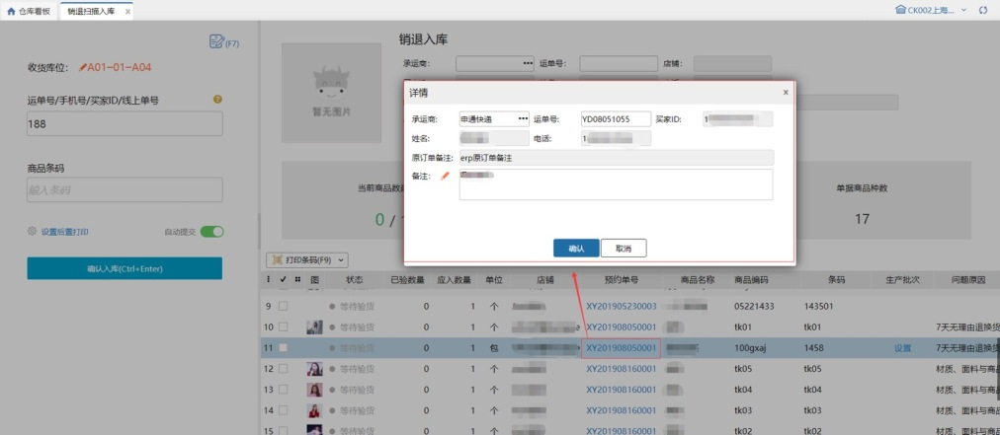

提示：

1. 预约单有多个商品时，在一个商品明细行的预约单详情中修改了承运商、运单号、备注，此预约单其他商品的预约单详情会更新为修改后的内容。例如：销退预约单01有商品a1、商品a2，点击商品a1明细的预约单号，在详情弹窗中修改承运商为申通，单号ST001，确认保存后，点击商品a2明细的预约单号，弹出的详情，承运商为申通，单号为ST001；

2. 多个预约单，一个预约单01在详情中修改承运商为申通、运单号ST001，销退预约主体上也修改了承运商为德邦、运单号DB002、确认入库回传ERP时，预约单01的承运商为申通，单号ST001，其他预约单的承运商为德邦，单号DB002                    

#### 2.扫描信息匹配到一个销退预约单

直接带入该预约单的商品信息，展示订单的店铺、买家ID、姓名、电话、销退的问题原因、原订单的备注以及商品的图片，验货并选择库位之后入库，具体页面如下：

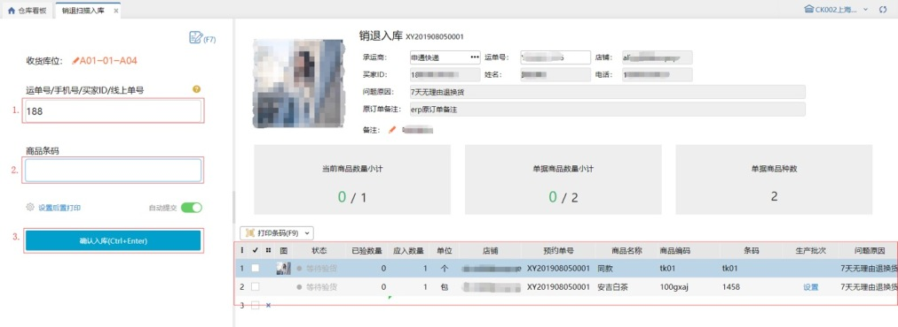

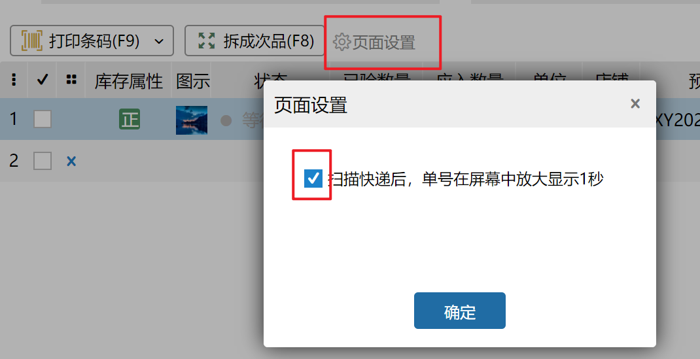

开启页面设置，匹配到预约单后，页面会居中显示该预约单快递单号，持续1秒，效果如下图所示：

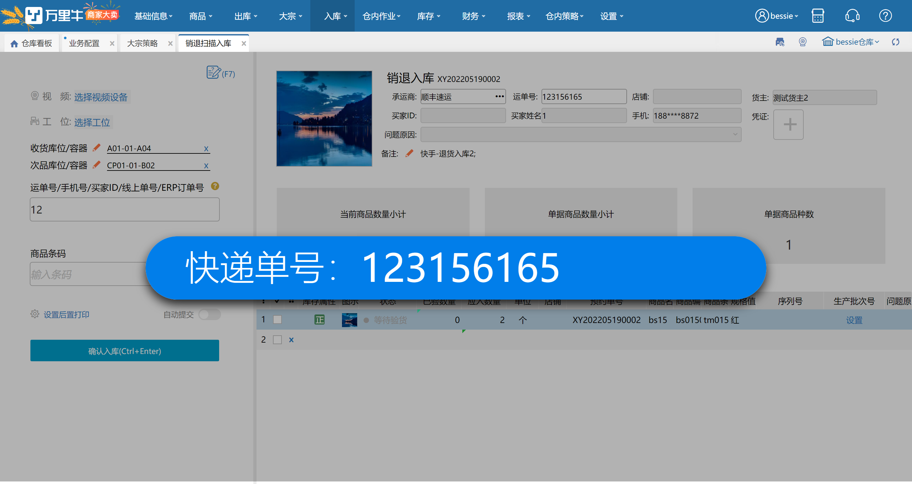

**提示**

1.仓内策略开启允许入库超收，扫描入库也可超收；

2.仓内策略开启允许销退入库差异收货时，扫描入库也可差异收货；

3.流程配置开启商品条码截取时，扫描商品条码时会截取。

4.在仓内策略–业务配置，开启扫描条码强制提交后，无需点击确认入库，扫描wanliniu666可自动入库。

5.若选择了多个预约单，则会显示第一个快递单号。

#### 3.扫描信息匹配到原单

弹窗提示是否跳转到原单入库页面，点击跳转/F2快捷键，跳转到原单入库页面，并带出对应单据信息；点击不跳转，停留在当前页面；勾选不再提醒，则记忆本次跳转/不跳转，下次无弹窗提醒。

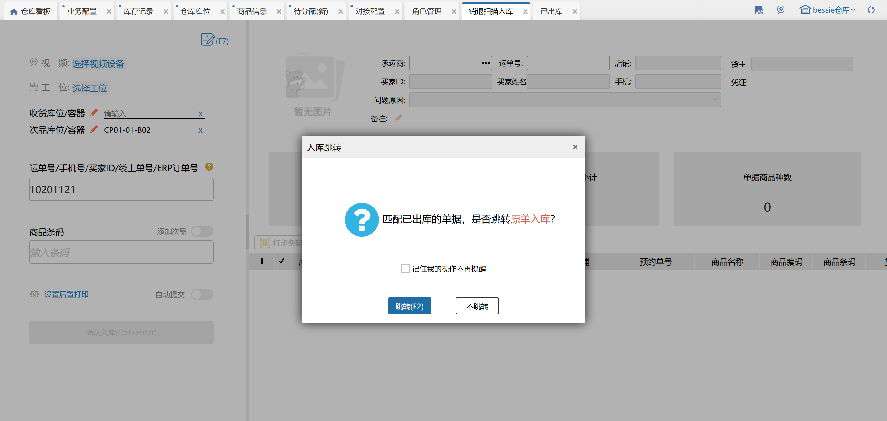

#### 4.开启次品开关后销退扫描入库

业务配置开启次品开关后，收货库位下新增次品库位，商品条码右上方新增添加次品开关，右侧商品明细中新增库存属性列，新增快捷键F8拆成次品具体操作如下所示：

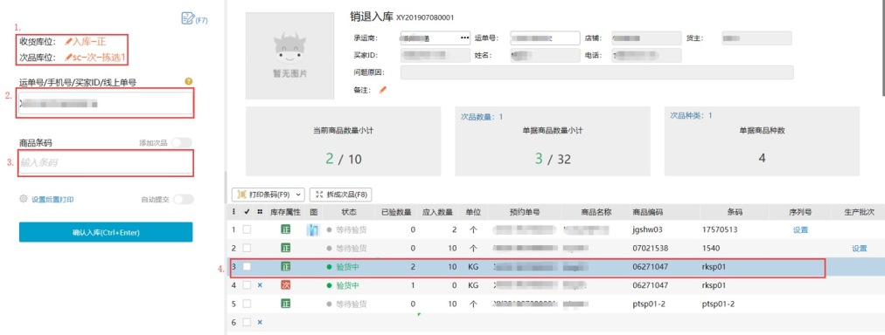

**提示：**

1.未开启添加次品开关，扫描录入的都是正品，开启添加次品开关，扫描录入的都是次品；           

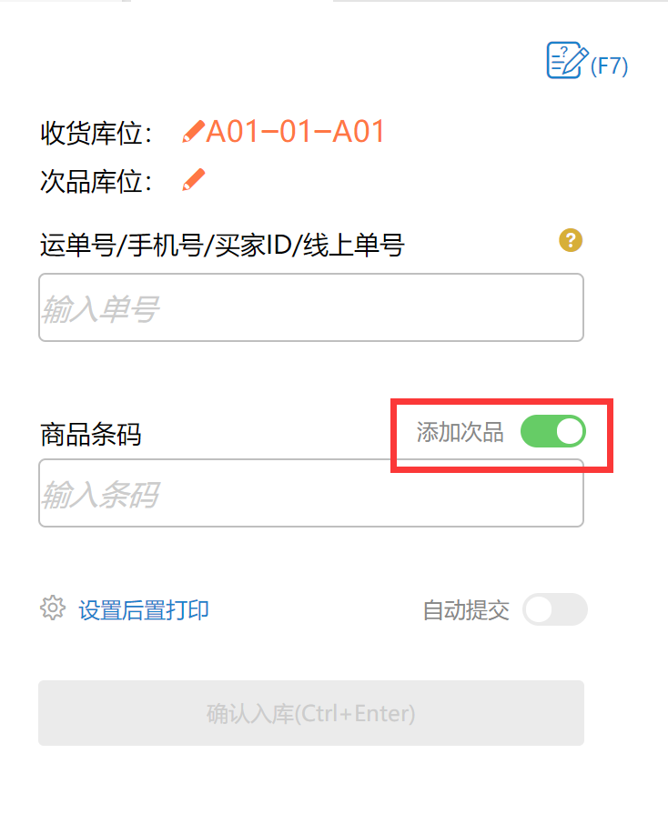

2.收货库位过滤次品库位，次品库位无限制；

3.序列号商品已支持添加次品入库，添加次品时，选择序列号商品，录入序列号入库后，序列号根据库存属性区分。

4. 商品开启入库批次管理，添加次品入库后，入库批次号为空；

5.扫描录入商品的正品入库明细后，使用快捷键F8可以从当前已验的正品中拆成次品，当正品已验数量为0时，不可拆出次品；

6.同sku正品、次品不能同时存放同一库位，案例如下：

前提：空拣选库位A、拣选库位B有商品a的正品库存、拣选库位C有商品a的次品库存、次品库位D

①商品a 正品选择库位A，次品选择库位A报错：所选的目标库位不能同时存放同一个商品的正次商品；

②商品a 正品选择时，查询库位D结果为空，选择库位C，保存报错：目标库位上有同商品的不同属性库存；

③商品a 次品选择库位B，保存报错：目标库位上有同商品的不同属性库存；

④商品a 正品选择库位B，次品选择库位C，保存入库成功；

⑤序列号商品b添加次品入库，次品无序列号。

7.若上次入库操作次品所选收货库位都为同一库位，销退扫描入库再次添加次品时，次品收货库位会自动带出上次入库的次品选择的收货库位。

次品入库回传：

 1）业务配置选择次品库存管理全部对内模式，入库后次品数量回传ERP；

 2）业务配置选择次品库存管理全部半对外模式，入库后次品数量不回传ERP。     

**开启入库支持使用容器：**入库时扫描容器编码，支持货品入到容器里。

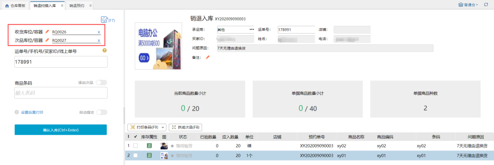           

#### 5.扫描信息未匹配到预约单/原单

弹窗提示是否进行疑难件入库，点击跳转/F2快捷键，跳转到疑难件入库，自动填充运单号；点击不跳转，停留在当前页面；勾选不再提醒，则记忆本次跳转/不跳转，下次无弹窗提醒。

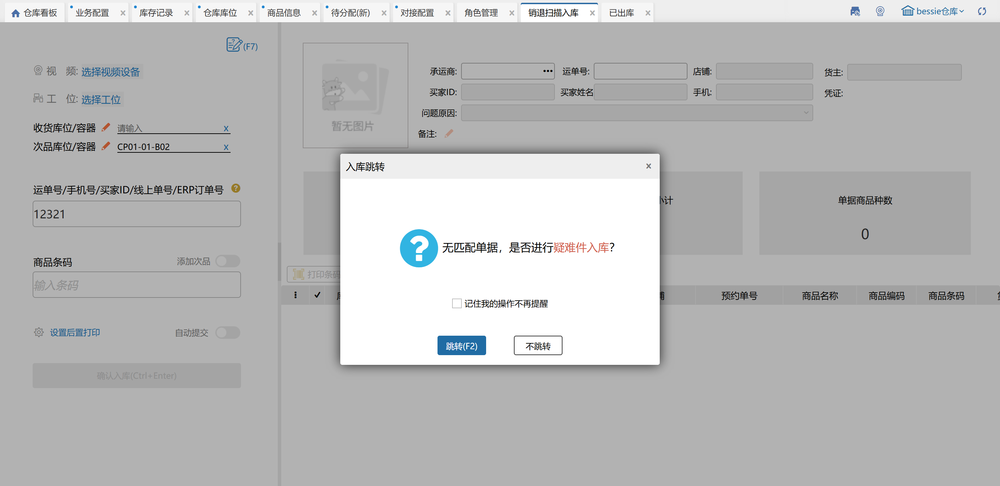

#### 6.疑难件入库

退货的包裹无关联的预约单，入库时，进行疑难件登记，操作如下：

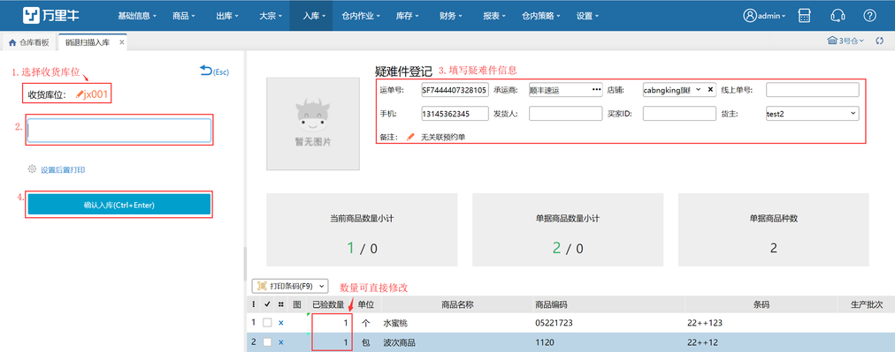

1.货主默认显示为空。

2.扫条码后匹配到多个货主/货主有多个商品时弹窗规格选择。

注：若开启条码截取，匹配到多个结果，弹窗内仅显示符合截取策略结果的商品和货主数据。

注：若开启商品全对应开关，选择商品后货主不自动带出，需手动选择货主。

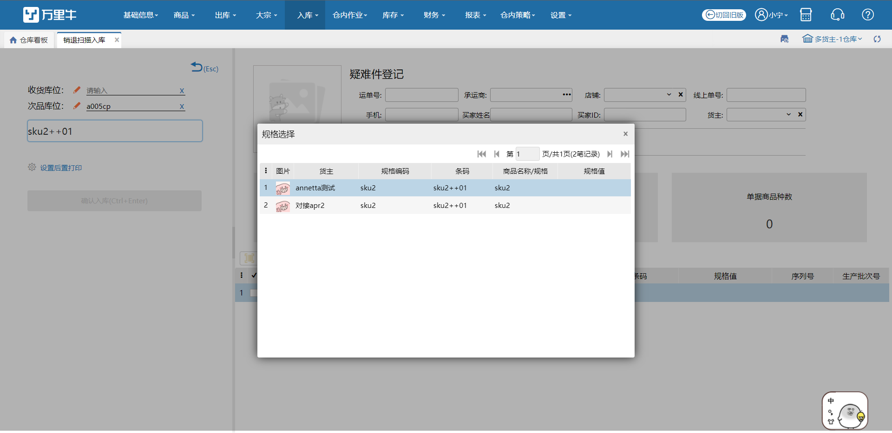

**注：疑难件登记的运单号或手机号与系统中的未完成的销退预约单的运单号或手机号一致时确认入库，会提示匹配到的预约单**。

3.开启入库支持使用容器：入库时扫描容器编码，支持货品入到容器里。

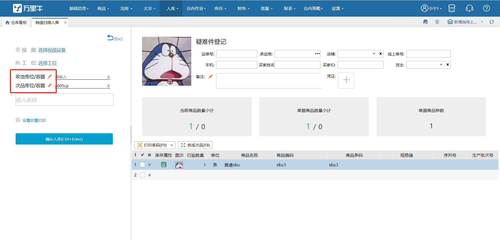

4.支持手动上传凭证。

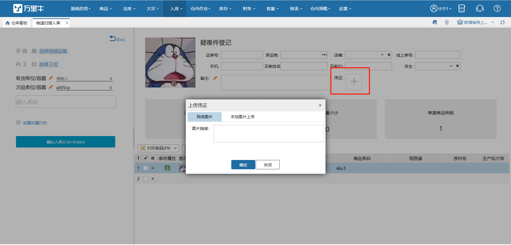

上传后效果：

a.点击×，支持手动删除。

b.最多支持上传6张图片。

c.支持悬浮查看大图。

> 更新: 2025-10-24 16:30:13  

> 原文: <https://hupun.yuque.com/unzko7/lsbfg0/xmznl0x4tkpk26pd>

---

### 04.2.4 收货交接

> 原始文件来源：`00-源文件/操作手册/入库/其他/收货交接.md`

入库承运商交接，用于仓库入库预约单未完全入库时，记录是否有完成承运商交接。此处只要在这个页面有完成交接，则系统认为该预约单已经从承运商处交接过来。具体操作如下：

**提示**

1.承运商每次交接只能选择一个，若要交接的承运商系统不存在，输入该承运商名称，自动视为要交接的承运商；

2.入库预约单有运单号时才能交接；

3.一个预约单的运单号如果有多个，且用“,”分开，交接时输入其中一个运单号，也能自动匹配预约单；

4.运单号在系统没有匹配的入库预约单时，将视为该运单号与已选的承运商交接，承运商可在右侧列表中修改；

5.当前运单总数显示为待确认交接的运单总数；

6.当运单号匹配到预约单时，点击列首图标，可查看预约单商品详情；

7.运单号+承运商唯一，运单号+预约单唯一。

> 更新: 2023-12-19 15:23:10  

> 原文: <https://hupun.yuque.com/unzko7/lsbfg0/qhh4iygffq3o7fvv>

---

## 04.3. PC端分批入库与质检清点

### 04.3.1 质检任务

> 原始文件来源：`00-源文件/操作手册/入库/分批入库/质检/质检任务.md`

请参考[专题功能介绍](https://hupun.yuque.com/unzko7/lsbfg0/zexgznlchnpsc7p7#Ge99m)。

> 更新: 2025-07-18 09:31:37  

> 原文: <https://hupun.yuque.com/unzko7/lsbfg0/qte0gmatcmz174vd>

---

### 04.3.2 质检单

> 原始文件来源：`00-源文件/操作手册/入库/分批入库/质检/质检单.md`

请参考[专题功能介绍](https://hupun.yuque.com/unzko7/lsbfg0/zexgznlchnpsc7p7#ibpsq)。

> 更新: 2025-07-18 09:32:09  

> 原文: <https://hupun.yuque.com/unzko7/lsbfg0/ing6pdty1pzbb1nk>

---

### 04.3.3 清点单

> 原始文件来源：`00-源文件/操作手册/入库/分批入库/清点/清点单.md`

仓库接收到采购/调拨/其他预约单时，可以在清点单页面进行商品清点动作，清点完成后再进行入库。清点单有两种模式：快速清点（有预约）和快速清点（无预约）。

注意：清点单和入库审核开关互斥，若开启入库审核开关，则不显示清点单菜单，若未开启入库审核开关，则显示清点单菜单。（前提：未开启12004开关，否则菜单与审核开关不关联）

#### **1.**快速清点（有预约）

有预约单又分为采购入库预约单、其他入库预约单、调拨入库预约单、销退预约单。

以采购入库预约单为例，以下是手工录入的操作步骤，与采购入库方法基本一致：

支持商品明细导入（仅支持普通商品）

填写数量、库位后，点击确定按钮，生成一个清点单及对应预约单的待确认入库单：

##### 预约单附加信息

场景：冷链药品必填送货单位和发货地址，收货的时候用于核对信息。

注：默认脱敏显示，有敏感信息查看权限的可点击查看具体信息，无权限的不能查看。

##### 库存自定义描述

若当前仓库开启库存自定义描述，以快速清点为例说明录入步骤。

①属性值类型为文本：在对应操作页面，手工录入正品值/次品值；

②属性值类型为固定值：在对应操作页面，库存属性为正品的明细自动带出正品值，库存属性为次品的明细自动带出次品值，不允许修改；

③属性值为预设值：在对应操作页面，库存属性为正品的明细，下拉选择正品值预设值，库存属性为次品的明细，下拉选择次品值预设值。

清点单保存成功后，在明细行上能看到录入的属性值：

库存自定义描述支持打印，勾选当前仓设置的属性名称并打印即可：

##### 入库修改指定批次

若明细为生产批次商品，且有指定批次时，根据当前账号权限判断是否允许在入库时录入非指定批次。

若当前账号为超管、普通管理员、一级部门主管或勾选了允许修改指定批次-指定批次入库的其他账号，则在入库时，允许为指定批次明细录入非其他非指定批次号，否则只能选择到指定批次号，如下图所示：

**注意：**

1.清点单不允许修改，可点击查看详情；

2.入库单为待确认状态，可在入库详情修改，点击入库确认后，该笔采购预约单入库成功；

3.修改入库单不影响清点单数据；

4.一次清点可选择同货主、同类型的多笔预约单；

5.允许对一笔预约单多次清点，明细数量会在原数量基础上扣减之前已经清点过的数量；

6.点击扫描录入，自动跳转到理货清点页面。

#### 2.快速清点（无预约）

无预约单清点不需要选择预约单，填写清点信息和明细后点击保存，即可生成清点单和入库单。

> 更新: 2026-06-11 10:11:17  

> 原文: <https://hupun.yuque.com/unzko7/lsbfg0/cogi67y2zn60c0q3>

---

### 04.3.4 理货清点

> 原始文件来源：`00-源文件/操作手册/入库/分批入库/清点/理货清点.md`

此页面用于各类型的入库预约单进行扫描式商品清点操作。

注：需联系客服开启，原有有收货清点权限的操作员，会有理货清点菜单的使用权限。

支持多选预约单类型，但不允许采购/其他/调拨类型与退货/换货类型同时选择。 

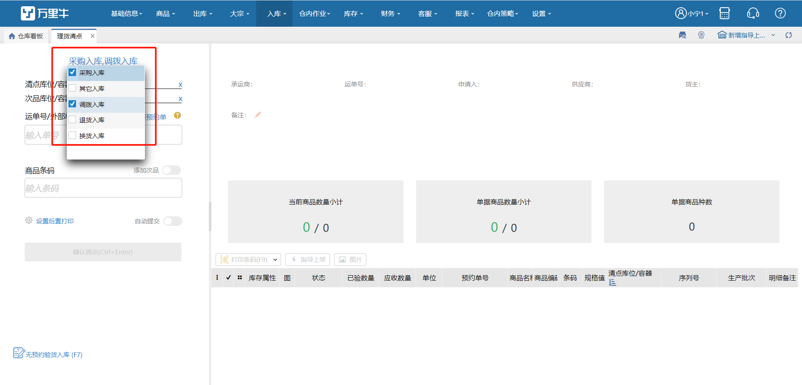

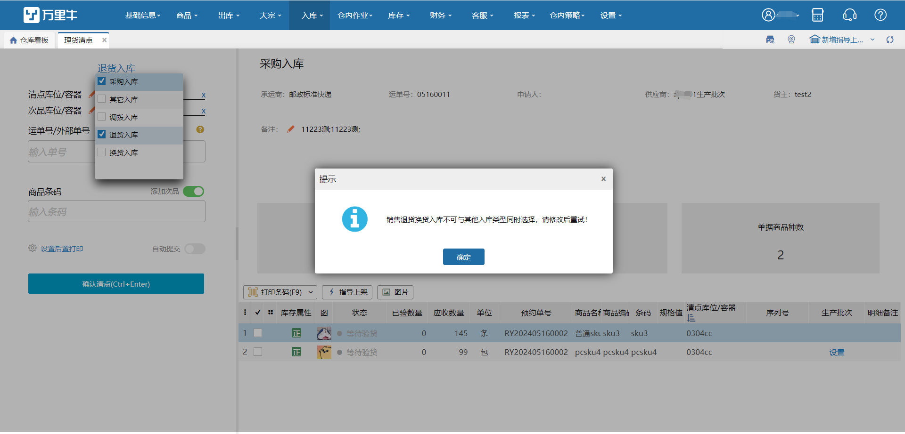

#### **1.有预约单扫描（采购、其他、调拨、退换货）**

##### (1).采购入库、其他入库、调拨入库

a.订单来源：通过选择预约单入口直接选择（支持同货主+同类型的多笔预约单一起清点）或直接扫描单据运单号、外部单号匹配单据。

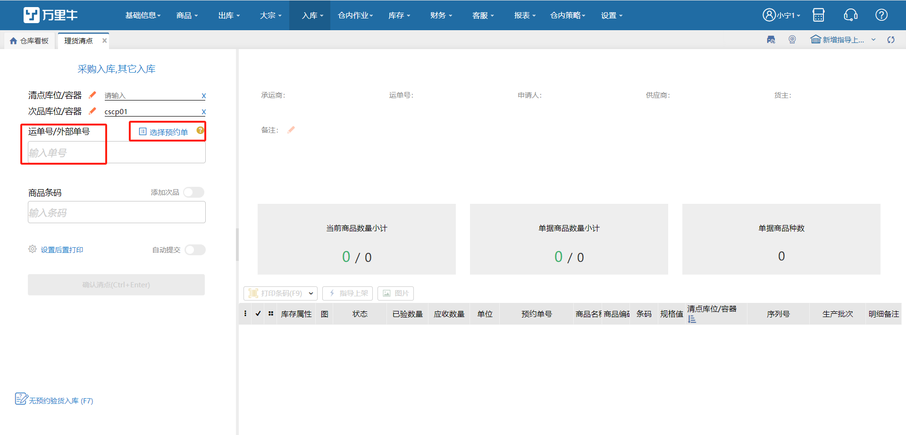

b.匹配成功后，右侧显示单据商品，支持正次品、各行业属性类型的商品操作。

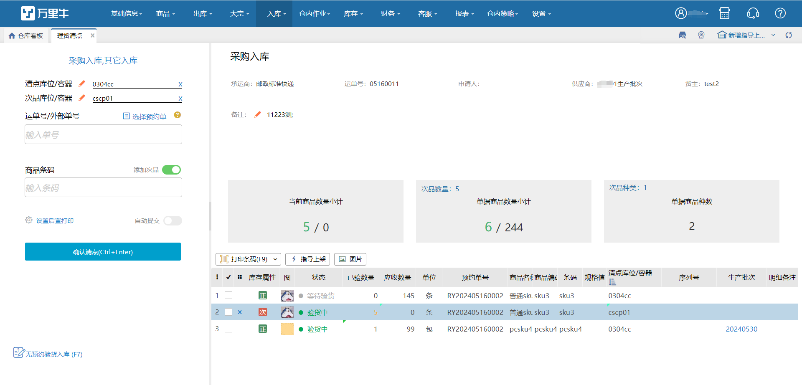

c.清点单设置[自定义字段](https://hupun.yuque.com/unzko7/lsbfg0/caki7lz4105n2vpg#p3zpp)的，在清点页面显示主体及明细层级对应自定义字段，支持录入信息。

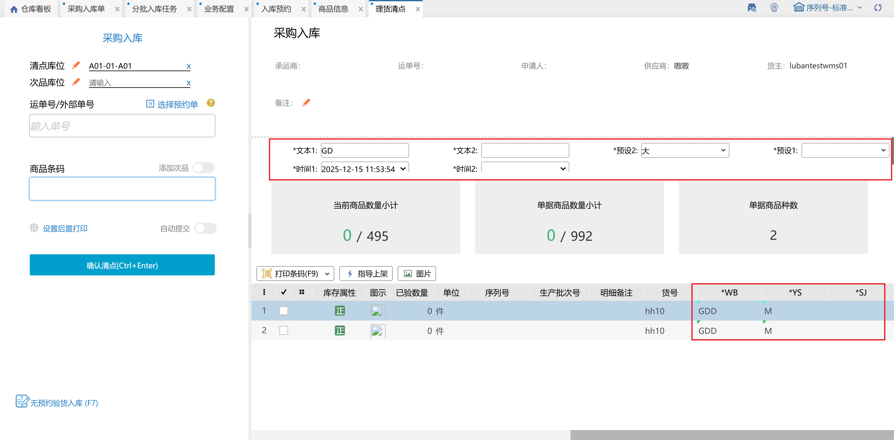

d.点击确认清点或快捷键，单据提交清点。在清点单页面可查看生成的清点单据，分批入库页面可查看生成的待入库任务。（同一预约单多次清点，生成多张清点单，一个待入库任务）

##### (2).退货入库、换货入库

a.订单来源：暂仅支持直接扫描单据运单号、外部单号匹配单据。

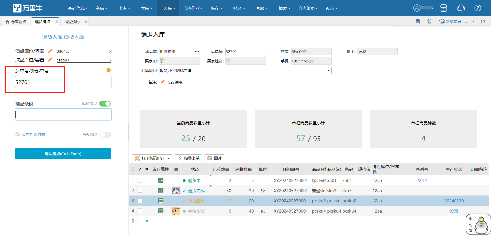

b.右上角显示预约单据信息，支持销退差异收、销退自动带出批次信息等，其余同采购入库。

各类型预约单提交清点后清点单显示预约单附加信息。

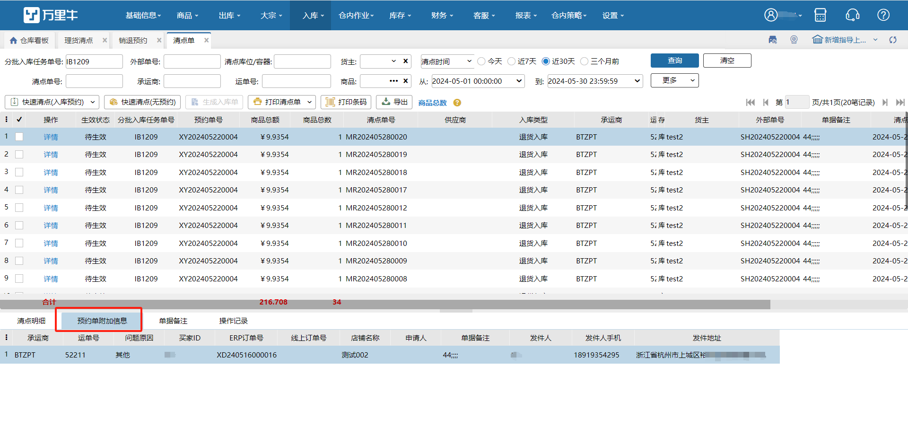

#### **2.无预约单扫描（采购验货入库）**

选择入库类型包含采购入库时，显示采购验货入库入口。

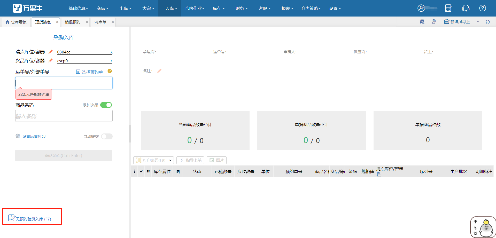

a.支持直接扫描商品条码匹配商品。

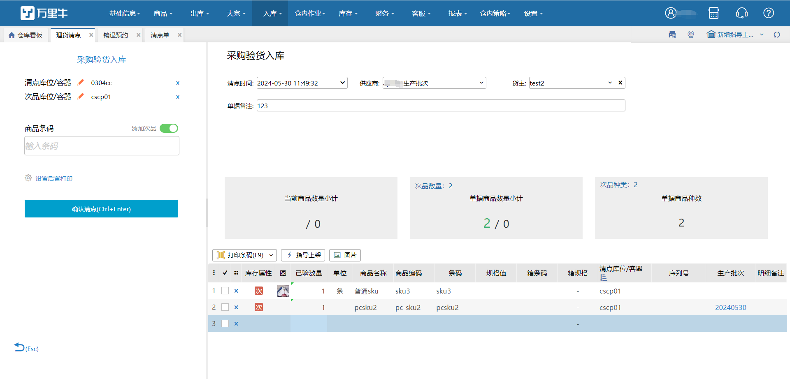

b.提交清点后，清点时间更新到最新时间，保留供应商（切换模式或关闭菜单再打开清空）和货主，清空单据备注。

c.点击确认清点或快捷键，数据提交清点。在清点单页面可查看生成的清点单据，分批入库页面可查看生成的待入库任务。（当货主+供应商相同时会合并成一个待入库任务）

> 更新: 2025-12-15 11:57:28  

> 原文: <https://hupun.yuque.com/unzko7/lsbfg0/sv93htr5q3s2328n>

---

### 04.3.5 分批入库任务

> 原始文件来源：`00-源文件/操作手册/入库/分批入库/进度/分批入库任务.md`

此页面主要用于查看和管理不同类型的分批入库任务。

#### 1.生成任务

从PC清点单、PC/PDA理货清点、PDA清点装箱等页面生成清点单后，同步会生成对应的分批入库任务，默认任务状态为【作业中】，按业务配置——[个性配置](https://hupun.yuque.com/unzko7/lsbfg0/zexgznlchnpsc7p7#C6Npb)匹配任务流程。

其中，各数量列含义如下：

任务商品数量：首环节完成商品数量，单环节时显示-

任务商品种类：首环节完成商品种类，单环节时显示-

完成商品数量：末环节完成商品数量

完成商品种类：末环节完成商品重量

- **商品明细**

单次清点后，商品明细和清点明细一致，若进行多次清点，则同sku合并显示（库存属性+指定生产批次）。

其中，各数量列含义如下：

任务商品数量：首环节完成商品数量，单环节时显示-

完成商品数量：末环节完成商品数量

已作业商品数量：末环节已作业商品数量

- **流程进度**

显示各环节作业进度，目前只支持清点、质检环节。环节单据数点击可跳转到清点单/质检单页面显示对应的单据。

其中，各数量列含义如下：

应作业商品数量：上环节已完成商品数量，单环节时显示-

应作业商品种类：上环节已完成商品种类，单环节时显示-

已完成商品数量：本环节已完成商品数量

已完成商品种类：本环节已完成商品种类

环节完成率：本环节完成商品数量/本环节应作业商品数量

剩余作业商品数量：应作业商品数量-已作业商品数量

剩余作业种类：剩余作业商品种类

当前可作业商品数量：应作业商品数量-已完成商品数量

当前可作业种类：当前可作业商品种类

环节任务数：本环节关联的任务数量

环节单据数：本环节关联的单据数量

作业进度：已作业商品数量/应作业商品数量

已作业商品数量：已完成商品数量+作业中商品数量，单环节显示-

- **卸货明细**

功能开发中……

- **清点明细**

显示对应清点单明细，箱明细转化为拆零数量，同sku+库存属性合并显示。

其中，各数量列含义如下：

应作业商品数量：清点环节时显示-

已完成商品数量：已完成清点的商品数量

当前可作业商品数量：清点环节时显示-

已作业商品数量：已完成清点的商品数量

- **质检明细**

以树结构形式显示明细，父级显示清点明细，子级显示质检结果，未质检的明细无子明细。

其中，各数量列含义如下：

应作业商品数量：上一环节完成商品数量(拆零)，上一环节为空显示“-”

未创建任务商品数量：应作业商品数量-已创建任务商品数量

可作业商品数量：应作业商品数量-已作业商品数量

已作业商品数量：已完成商品数量+作业中商品数量

作业中商品数量：创建任务暂存的作业结果商品数量

已完成商品数量：已质检通过的商品完成数量(拆零)

- **预约单附加信息**

默认带出预约单上对应数据，其中采购验货入库无预约单，支持手动修改信息，其他类型不支持修改。

- **备注 **

任务状态为【作业中】时，允许手动修改备注。

- **入库凭证**

支持手动上传网络或本地图片，最多6张。

- **操作记录**

显示任务相关操作记录。

注：相同货主、相同供应商的采购验货入库会自动合并为一个【作业中】入库任务。

#### 2.改入

改入关联业务配置-允许入库任务在确认入库时，快速修改商品数量并入库，勾选则显示改入，否则不显示。

点击改入显示任务修改弹窗，环节结果单据根据任务流程环节显示。

任务清点+入库流程，弹窗分区显示入库任务明细、对应清点单据以及清点单明细。

任务清点+质检+入库流程，弹窗显示入库任务明细、对应清点单、质检单以及单据明细。

入库任务明细、清点单明细、质检单明细修改范围包括明细数量、入库库位、明细备注、增减明细等，其中不同类型的任务可修改范围关联相关配置，具体如下：

- 入库超收

开启允许入库超收，对应单据可入库数量允许超出预约数量，修改数量后标红显示。

- 销退入库差异收货

开启销退入库差异收货，退货入库/换货入库类型的任务允许新增预约单外的商品明细并入库，新增明细数量标红显示。

- 次品管理

开启次品管理开关后允许添加次品明细。

- 序列号商品管理

开启序列号商品管理时，包含序列号商品明细的入库任务支持改入。

- 生产批次商品管理
    - 开启生产批次商品管理时，包含生产批次商品明细的入库任务支持改入。
    - 批次禁收规则

生产批次商品按禁收规则进行校验，不符合时页面会有异常提示。

    - 同批次多日期开关

开启开关后允许添加同批次号不同日期的批次信息。

注：

①货箱明细不支持修改数量；

②同一个任务同时有清点和质检环节时，清点单据明细不允许修改。

修改入库任务明细后，点击分摊至各单据按钮，可以将改动同步至单据明细上，其中有数量变化的明细会标红显示，同时所属单据也会标红显示，表示此单据有改动。

修改完成后点击确定，由于修改后数量与前置环节数量不等，系统显示数量异常提示。点击确定则继续确认入库，点击取消则不再确认入库，点击不再提醒，下次确认入库时不显示此弹窗。

入库成功后，对应单据上会同步修改信息并显示操作记录。

若入库任务明细和单据明细数量、规格、生产批次等存在不一致的情况，入库时会报错提示。

#### 3.关联明细快速定位

操作列新增定位按钮，点击后显示红色，并高亮蓝色显示各环节关联的明细行，点击切换环节可以查看关联明细。

注：①点击环节单据明细定位按钮，可以反向定位关联的上层入库明细；

②再次点击定位按钮，会取消关联行高亮显示效果；

③删除当前定位行，会取消关联行高亮显示效果；

④新增明细分摊到单据后，可以通过定位按钮找到关联行。

#### 4.上传溯源系统

前提：对接配置——[溯源系统对接](https://hupun.yuque.com/unzko7/lsbfg0/gpgz776pazg6t2mx#l2ZFi)中设置当前仓对接码上放心平台，分批入库任务明细中包含序列号外箱码时，在确认入库或改入确认时，入库任务变成【作业中】并生成一个【待入库】入库单，将外箱码上传到码上放心平台，并在系统中生成一条[溯源上传记录](https://hupun.yuque.com/unzko7/lsbfg0/ftw5c7450kfccl72)，根据平台处理结果显示状态：

当前仓未开启【上传码上放心单据入库前查询外箱码自动填写关联序列号】时，外箱码上传成功后，不会回填到对应清点单据和分批入库任务明细上，仍按照生成时的序列号信息显示；开启则会回填到对应入库单明细上。

注：【作业中】分批入库任务有溯源上传记录生成时，不允许二次清点，要先把作业中任务完结后再进行清点。

#### 5.确认入库

##### 5.1 未设置审批管理

勾选单据点击确认入库，在弹窗中点击确定后，若正常入库，则任务状态变成【已完成】，关联的清点单/质检单变成【已生效】，同时生成【已审核】状态的入库单；否则弹窗显示失败原因。

##### 5.2 设置审批管理

在[审批管理](https://hupun.yuque.com/unzko7/lsbfg0/gumupf3qnnlkrcrs)页面配置分批入库—指定单据类型审批流程后，符合配置的入库任务在确认入库或改入后会生成作业中+审批中的入库任务，具体操作请参考[采购入库审核](https://hupun.yuque.com/unzko7/lsbfg0/crl0rycd2i8g3a23#M1x2b)。

#### 6.取消入库

勾选单据点击取消入库，在弹窗中输入取消备注（非必填）后点击确定，若取消成功，则任务状态变成【已取消】，关联的清点单/质检单变成【已取消】，不会生成入库单；否则弹窗显示失败原因。

#### 7.导出

可选择按查询结果或按单据导出任务数据。

> 更新: 2026-01-29 18:39:15  

> 原文: <https://hupun.yuque.com/unzko7/lsbfg0/gnq86bvaynt3kg0u>

---

### 04.3.6 待入库商品查询

> 原始文件来源：`00-源文件/操作手册/入库/分批入库/进度/待入库商品查询.md`

待入库商品页面用于显示有入库任务但未操作入库的商品，包括货箱和拆零：

注意：

1.数据来源包括：PDA-清点装箱、理货清点；PC-清点单、理货清点；单据类型：采购、其他、调拨、退换货预约单

2.对应入库任务确认入库或关闭，则在此页面不显示数据。

> 更新: 2024-05-30 14:03:23  

> 原文: <https://hupun.yuque.com/unzko7/lsbfg0/aygn3cc1lbdxq757>

---

## 04.4. PDA手持端入库作业

### 04.4.1 PDA-入库交接

> 原始文件来源：`00-源文件/PDA安卓端/入库/PDA-入库交接.md`

入库承运商交接，用于仓库入库预约单未完全入库时，记录是否有完成承运商交接。

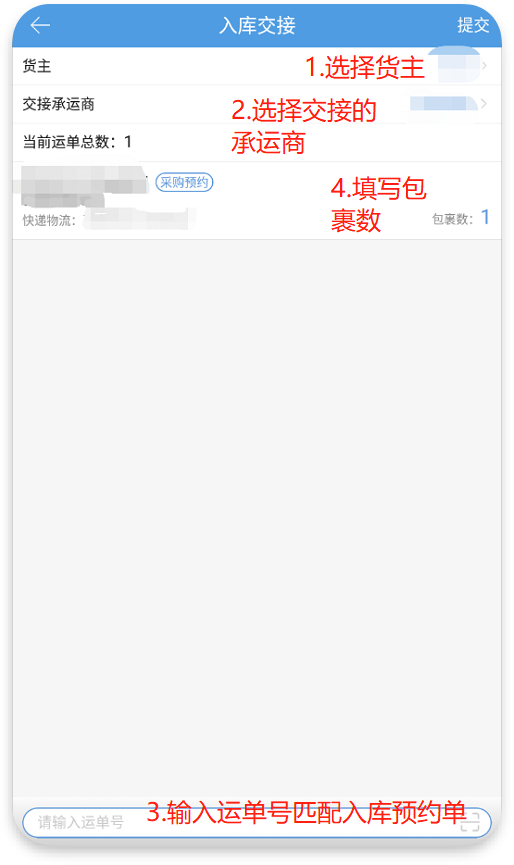

1.非3pl公司不会显示货主一栏，第一次操作也不会跳至货主选择页面。

2.扫运单号未匹配到预约单时，预约单信息只显示快递物流一栏：交接承运商+运单号。多笔预约单有相同运单号时，有入库单选择的页面，支持单选。承运商+运单号唯一。

3.页面有显示预约单明细时，切换货主要清除明细，切换承运商不清明细。

4.带出显示包裹数默认是1，支持编辑，不可为0。

5.入库交接不显示预约单商品信息。

6.支持明细左滑删除。

7.PDA入库交接也支持在PC端的入库预约单和入库交接记录中显示。

> 更新: 2023-12-21 09:57:42  

> 原文: <https://hupun.yuque.com/unzko7/lsbfg0/ac25eh96tx7pgypx>

---

### 04.4.2 PDA-原单入库

> 原始文件来源：`00-源文件/PDA安卓端/入库/PDA-原单入库.md`

从仓库销售出库的订单，扫描运单号/手机号/卖家昵称/线上单号中的任意一项可以原单入库。

单据只能原单入库一次。

若单据建立了售后单且状态为未完成或者已完成，该单据不能再原单入库。

**01.****扫描的信息匹配到多个订单**

页面显示所有匹配到的订单，点击单据后进入入库页面。

 

**02.****扫描的信息匹配到一个订单**

直接进入入库页面，商品数量自动验货完毕，选择库位后可提交。

注：订单中的序列号商品会自动填写之前出库登记的序号，生产批次商品会自动填写之前出库的生产批次号。

PS.1 支持上传图片，上限为10张

> 更新: 2026-07-08 16:29:34  

> 原文: <https://hupun.yuque.com/unzko7/lsbfg0/tbz25eqr0g5lzety>

---

### 04.4.3 PDA-快速入库

> 原始文件来源：`00-源文件/PDA安卓端/入库/PDA-快速入库.md`

快速入库支持销退预约单不校验商品条码，直接入库。不支持包含序列号商品和生产批次商品的单据入库。

一次只支持入库一个单据，扫描匹配到多个时，页面显示匹配到的预约单，支持选择。

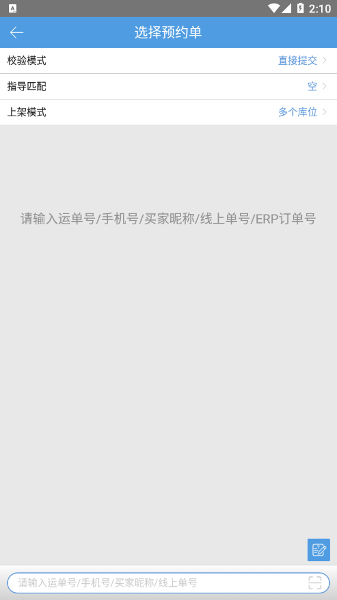

#### 01. 校验模式：校验库位

多个库位上架模式时，入库明细指导匹配库位，需要扫描库位校验之后才能提交。多个明细的库位相同，只需要扫描一次库位就能完成校验。

校验后：库位打上校验标记

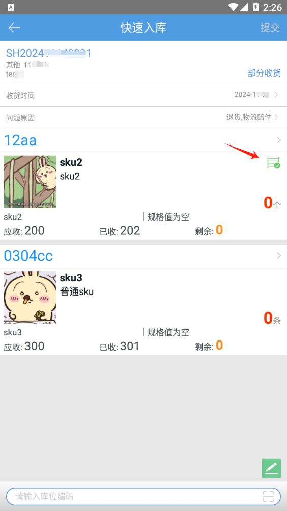

通过选择的库位会打上库位校验标识，无需再次校验。

#### 02. 校验模式：直接提交

入库明细有库位时，不需要扫描库位校验，就能直接提交。

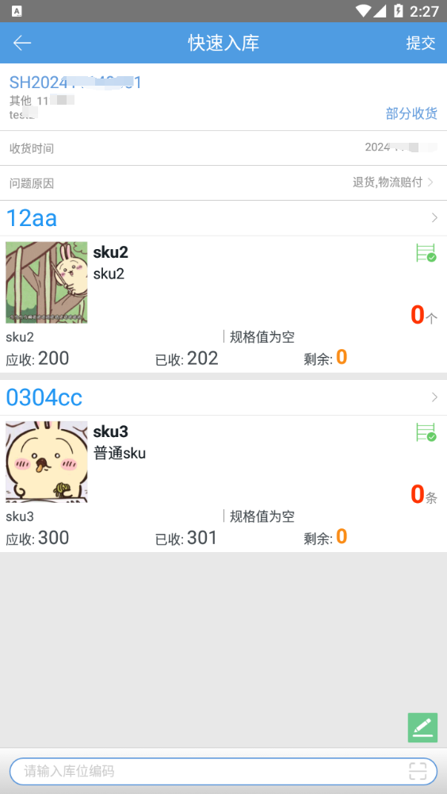

#### 03. 指导匹配

指导匹配为空时，明细不指导库位，若预约单有默认收货库位，所有明细的库位填充为相同。指导匹配不为空时，会根据指导匹配库位。

注：单个库位模式不支持指导匹配。

#### 04.上架模式：单个库位

入库明细仅有1个选择库位入口，多明细入同一库位上。

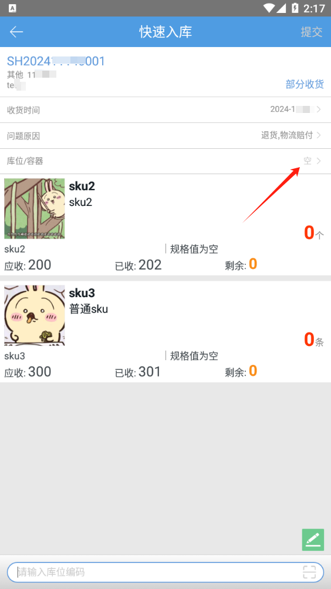

#### 05.上架模式：多个库位

 每条明细显示选择库位入口，支持多明细入多库位。

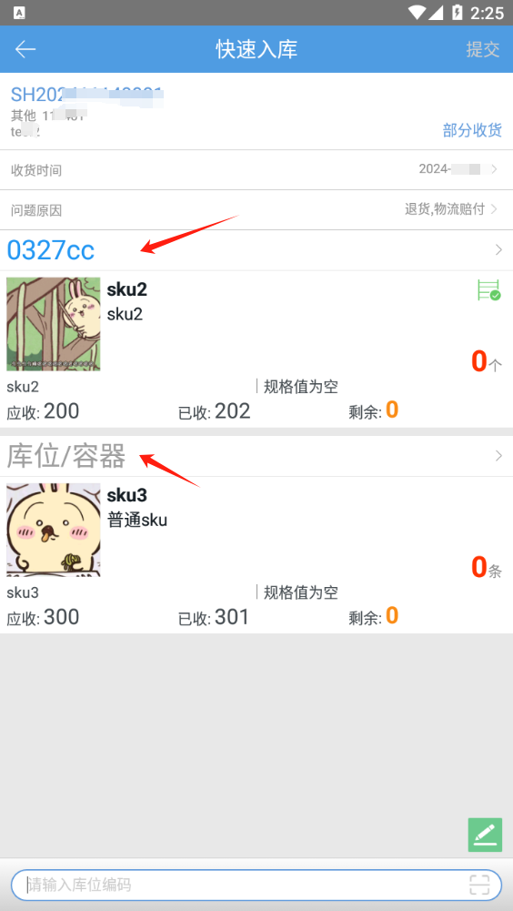

支持指导匹配。

#### 06.原订单备注

显示原始WD订单上的订单备注，可点击查看更多内容。

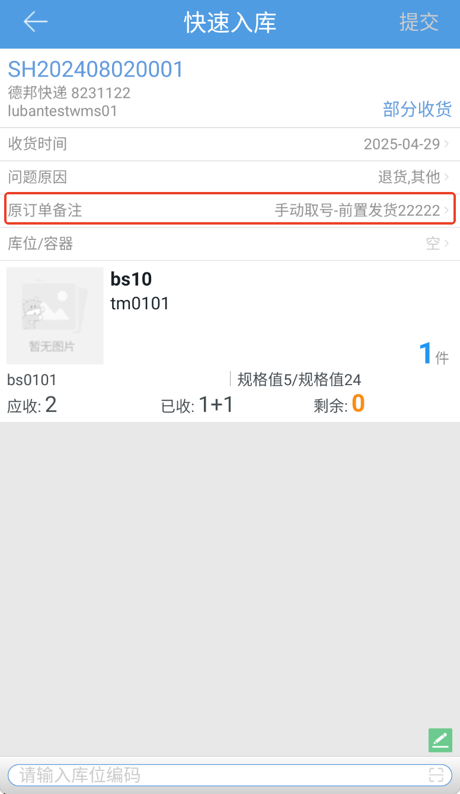

#### 07.上传图片

点击进入上传图片页面，可选择通过拍照或相册直接上传图片。

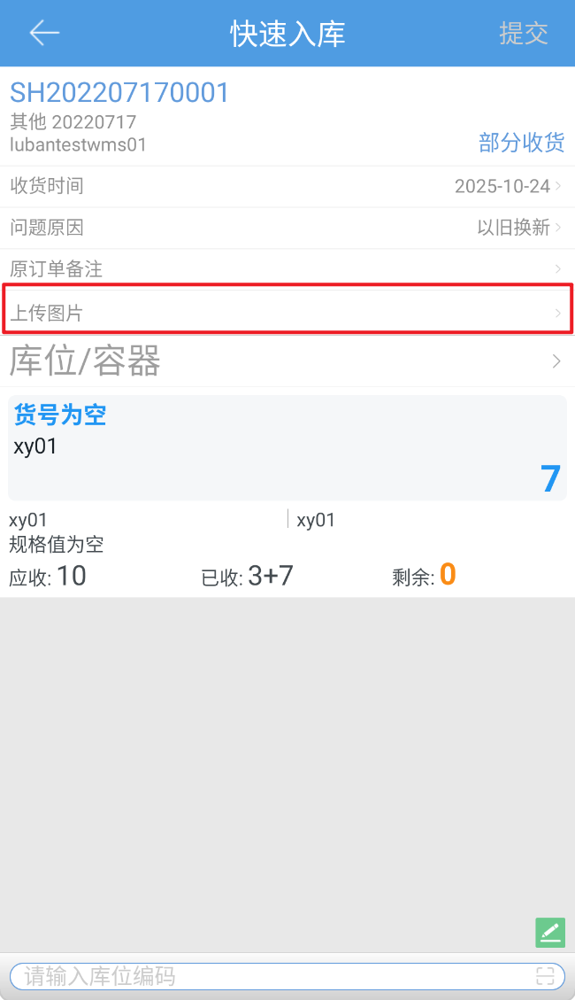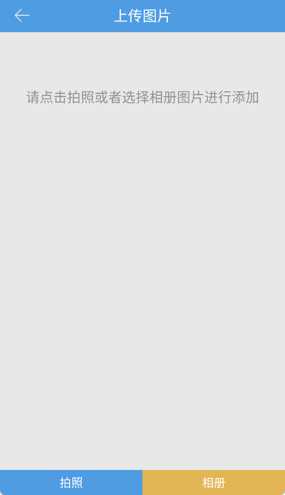

#### 08.疑难件入库

快速入库右下角点击疑难件icon图标，PDA可入库疑难件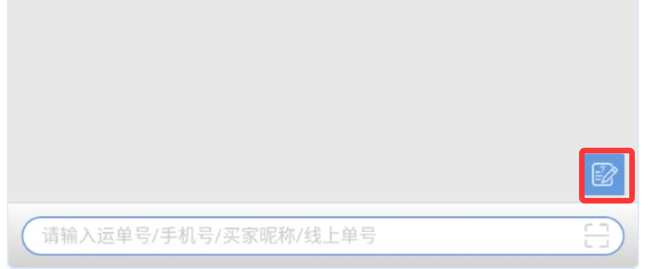

> 更新: 2025-11-05 09:51:15  

> 原文: <https://hupun.yuque.com/unzko7/lsbfg0/fzso88cs5qe9eq3g>

---

### 04.4.4 PDA-收货入库

> 原始文件来源：`00-源文件/PDA安卓端/入库/PDA-收货入库.md`

wms系统中的采购、销退、其他入库、调拨入库预约单，可以通过pda选择相应的预约单进行入库操作，具体步骤如下。

#### 1、选择单据

选择正确的仓库后，点击收货入库菜单，点击右上角按钮筛选预约单，支持查看供应商。

单号扫描/输入匹配，支持匹配销退预约单中ERP订单号字段，目前没有按照顺序匹配的逻辑，所有符合的都会查出来

收货入库支持批量入库

1.在下拉/筛选后，扫描运单号筛选出同一运单号的入库单，假如存在多笔，可选择多笔入库单批量入库；

2.在下拉/筛选后，再次筛选，筛选项有包含商品项或承运商项，假如存在多笔，可选择多笔入库单批量入库；

注：以上两种情况在加载完全部入库预约单的情况下才会显示；批量入库的单据需为同一入库类型且同一货主。

#### 2、普通模式——上架

选择好预约单后，跳到收货入库页面。

选择普通模式上架，即所有商品都扫描完成后再上架到库位上。操作步骤如下：上架模式选择普通模式，要入库的商品扫描完成后，点击上架。

选择入库上架方式：

选择上架库位后，点击提交，完成入库。

#### 3、边入边上模式——上架

选择边入边上模式：即扫描一款商品就跳转上架页面，边扫描边上架。操作步骤如下：上架模式选择边入边上，扫描商品。

扫描商品条码，跳到入库上架页面。

点击确定完成上架，返回到收货入库页面，点击提交，完成入库。

 提示：

①选择预约单后，商品实际入库的数量不能大于预约单商品的应收数量。若开启允许[入库超收](https://hupun.yuque.com/unzko7/plvu1m/tb8ay4)，则入库数量可大于应入数量。

②入库上架页面，序列号商品直接扫描序列号。

③边入边上，扫描生产批次商品先跳转到入库上架页面再跳转到生产批次设置页面，未设置生产批次点击返回直接返回收货入库页面。

④一次性录入序列号，后台开关开启保留区间截取，示例：

解析规则：保留区间截取，品牌：新增的品牌，保留区间截取第6到18位，条码长度范围为从0-21

商品A系统中商品条码69200811001-新增的品牌-序列号商品

商品B系统中商品条码69200811002-新增的品牌-非序列号商品

收货入库页面扫描条码1234569200811001001，匹配到了商品A且录入序列号1234569200811001001。

收货入库页面扫描条码1234569200811002001，匹配到了商品B不录入序列号。

#### 4、开启万里牛视频溯源

PC开启万里牛视频溯源，收货入库页面显示工位和设备，支持录制操作过程。选择工位后，会自动带出绑定的视频设备。

 

提示：

①生产批次商品暂不支持记录明细动态信息；

②PC开启“在操作页面强制选择工位”，需要先选择工位和设备才能继续入库操作；

③普通上架模式，视频结束时间为点击“上架/提交成功”节点，具体上架操作不包含在视频记录内。

> 更新: 2026-01-05 09:33:39  

> 原文: <https://hupun.yuque.com/unzko7/lsbfg0/umw7oi7xu2ye8qxq>

---

### 04.4.5 PDA-清点装箱

> 原始文件来源：`00-源文件/PDA安卓端/入库/PDA-清点装箱.md`

适用于预约单的商品，先装箱再确认入库的操作，此处商品装的是唯一箱。前提条件：未开启入库审核的仓库才允许入库装箱。

建议先打印出箱条码贴在货箱上，装箱时需扫描箱条码，可以在PC端的[打包装箱](https://hupun.yuque.com/docs/share/aec8f154-a86a-40be-a643-7a194b177e0e?#)页面，通过预设箱号，批量打印箱条码。

1.选择需要入库装箱的预约单，入库装箱支持选择采购预约单、其他预约单、调拨预约单、销退预约单。

2.然后选择装箱商品的存放库位，扫描打印好的箱条码后，扫描添加预约单内的商品，达到装箱的数量后，点击提交，完成装箱。装箱完成后需要在PC的清点单页面查看清点单数据，分批入库任务页面查看待入库单据。

注意：

1.同一预约单允许多个操作员领取，操作清点装箱；

2.多个操作员清点装箱后，PC端生成1个待入库任务，其他操作员装箱后，更新单据内的装箱明细；

2.清点装箱的库位只能选择可以存放箱库存的库位即箱拣选、存储、过渡库位；

3.扫描的箱条码要符合系统中唯一箱的箱条码格式，即XH开头+11位数字；

4.唯一箱条码具有唯一性，不能选择已经在系统中使用过的箱条码；

5.业务配置开启条码截取，此页面扫描商品条码也支持截取；

6.支持生产批次商品和序列号商品装箱。若业务配置开启仓库级箱记录管理，则不限制生产批次混装；若开启仓库级箱记录管理，则不允许生产批次商品混批次装箱；

> 更新: 2024-05-30 14:27:07  

> 原文: <https://hupun.yuque.com/unzko7/lsbfg0/xpvs1cznt0kggt2x>

---

### 04.4.6 PDA-理货清点

> 原始文件来源：`00-源文件/PDA安卓端/入库/PDA-理货清点.md`

货品入库时，需要多个人操作，扫描入库时，是扫描一款商品后上架一款，库位放满后需要将商品上架到其他库位上，故推出多人入库功能，支持多人操作同一预约单入库，上架时支持同商品上架到不同库位。

此功能有后台开关控制，需要时联系技术人员开启。

#### 1.有预约单清点

选择预约单后跳转理货清点页面，根据需要选择上架模式后，扫描商品开始清点。

#### (1)普通模式

即所有商品都扫描完成后再上架到库位上，操作步骤如下：

a.上架模式选择普通模式，要入库的商品扫描完成后，点击上架。

b.选择上架方式：

c.选择上架库位后，点击提交，完成清点。

#### (2)边入边上

即扫描一款商品就跳转上架页面，边扫描边上架，操作步骤如下：

a.上架模式选择边入边上，扫描商品。

b.扫描商品后直接跳转入库上架页面。

c.扫描商品条码添加入库数量，点击页面右下角+号，可以将商品放在其他库位。

注：此页面只扫描上架一款商品。

d.点击确定完成上架，返回到理货清点页面。

扫描下一款商品继续入库上架，商品上架完成后，点击提交，完成清点。

提交清点后，PC端清点单生成1笔清点单单据，分批入库任务页面新增1笔待入库任务，点击确认入库后完成商品入库。

#### 2.无预约单清点

开启3PL模块的公司，进入跳转到货主选择页需先选择货主，选择后回到理货清点页面。

a.扫描商品条码后匹配商品操作。

b.可在页面直接提交清点或操作入库上架后提交清点。

c.其余同有预约单清点。

提交清点后，PC端清点单生成1笔清点单单据，分批入库任务页面新增1笔待入库任务，点击确认入库后完成商品入库。（同货主+供应商的单据会自动合并成1笔待入库任务）

> 更新: 2024-10-25 11:59:17  

> 原文: <https://hupun.yuque.com/unzko7/lsbfg0/umblrzgv3i8of2sn>

---

### 04.4.7 PDA-验货入库

> 原始文件来源：`00-源文件/PDA安卓端/入库/PDA-验货入库.md`

验货入库支持直接入库，无需预约单。

1）开3pl的公司进入验货入库页面后将自动跳转选择货主页面。

2）供应商可选择对应货主下的供应商。

3）扫描商品支持商品主条码和辅助条码，同时支持条码截取。左滑可以删除添加的商品。

4）合计栏记录了已添加商品的总数

 

4）选择普通上架模式：即所有商品都扫描完成后再上架到库位上，操作步骤如下：上架模式选择普通模式，要入库的商品扫描完成后，点击上架。

入库上架方式

选择上架库位后，点击提交，完成入库。

5）选择边入边上模式：即扫描一款商品就跳转上架页面，边扫描边上架，操作步骤如下：上架模式选择边入边上，扫描商品。

扫描商品条码，跳到入库上架页面。

点击确定完成上架，返回到验货入库页面，点击提交，完成入库。

6）开启条码截取时，点击明细行空白处，可跳转连扫页面，扫描截取的条码直接加该商品的数量。

7)一次性录入序列号，后台开关开启保留区间截取，示例：

解析规则：保留区间截取，品牌：新增的品牌，保留区间截取第6到18位，条码长度范围为从0-21

商品A系统中商品条码69200811001-新增的品牌-序列号商品

商品B系统中商品条码69200811002-新增的品牌-非序列号商品

收货入库页面扫描条码1234569200811001001，匹配到了商品A且录入序列号1234569200811001001。

收货入库页面扫描条码1234569200811002001，匹配到了商品B不录入序列号。

8）提交入库后，入库单可在采购入库页面查询得到。

> 更新: 2023-12-21 09:28:16  

> 原文: <https://hupun.yuque.com/unzko7/lsbfg0/nml4lfgt93ewt71l>

---
