# 05. 出库_B2C

> 资料来源：基于 `00-源文件/` 对应模块的原始操作手册、专题功能与PDA文档重组迁移。
> 事实边界：正文仅重组迁移原始文档；章节编号、目录和来源标记为整理信息，不新增业务规则、字段或流程。

## 本章知识目录

- **05.1 打单作业**
  - [导入订单](#0511-导入订单)
  - [待分配](#0512-待分配)
  - [波次打单](#0513-波次打单)
  - [订单审核](#0514-订单审核)
  - [零拣打单](#0515-零拣打单)
  - [预出库订单](#0516-预出库订单)
- **05.2 拣货作业**
  - [容器拣货任务](#0521-容器拣货任务)
  - [待拣货](#0522-待拣货)
  - [拣货任务](#0523-拣货任务)
  - [接力拣货](#0524-接力拣货)
  - [操作员任务](#0525-操作员任务)
  - [订单拣货](#0526-订单拣货)
- **05.3 验货与复核**
  - [分拣验货](#0531-分拣验货)
  - [单种验货](#0532-单种验货)
  - [待验货](#0533-待验货)
  - [快速验货](#0534-快速验货)
  - [抽检验货](#0535-抽检验货)
  - [播种验货](#0536-播种验货)
  - [条码验货](#0537-条码验货)
  - [自由验货](#0538-自由验货)
- **05.4 打包作业**
  - [待打包](#0541-待打包)
  - [批量打包](#0542-批量打包)
  - [订单打包](#0543-订单打包)
- **05.5 称重作业**
  - [待称重](#0551-待称重)
  - [批量称重](#0552-批量称重)
  - [称重复核](#0553-称重复核)
- **05.6 出库交接与其他**
  - [出库单](#0561-出库单)
  - [已出库](#0562-已出库)
  - [待出库](#0563-待出库)
  - [扫描出库](#0564-扫描出库)
  - [批量出库](#0565-批量出库)
  - [承运商交接](#0566-承运商交接)
  - [出库改单](#0567-出库改单)
  - [出库组包](#0568-出库组包)
  - [出库缺货](#0569-出库缺货)
  - [发货进度](#05610-发货进度)
  - [多操作环节跳转](#05611-多操作环节跳转)
  - [异常订单](#05612-异常订单)
  - [拆包补打](#05613-拆包补打)
  - [拦截验核](#05614-拦截验核)
  - [组包记录](#05615-组包记录)
  - [自定义环节](#05616-自定义环节)
  - [订单查询](#05617-订单查询)
- **05.7 PDA手持端B2C作业**
  - [PDA-容器拣货](#0571-PDA-容器拣货)
  - [PDA-快捷打单](#0572-PDA-快捷打单)
  - [PDA-扫描打单](#0573-PDA-扫描打单)
  - [PDA-批量拣货](#0574-PDA-批量拣货)
  - [PDA-拣货集合](#0575-PDA-拣货集合)
  - [PDA-播种拣货](#0576-PDA-播种拣货)
  - [PDA-料筐拣货](#0577-PDA-料筐拣货)
  - [PDA-自由领单](#0578-PDA-自由领单)
  - [PDA-订单拣货](#0579-PDA-订单拣货)
  - [PDA-领单播种拣货](#05710-PDA-领单播种拣货)
  - [PDA-快捷播种](#05711-PDA-快捷播种)
  - [PDA-快速验货](#05712-PDA-快速验货)
  - [PDA-抽检验货](#05713-PDA-抽检验货)
  - [PDA-播种验货](#05714-PDA-播种验货)
  - [PDA-条码验货](#05715-PDA-条码验货)
  - [PDA-独立播种](#05716-PDA-独立播种)
  - [PDA-自由验货](#05717-PDA-自由验货)
  - [PDA-批量打包](#05718-PDA-批量打包)
  - [PDA-批量称重](#05719-PDA-批量称重)
  - [PDA-称重复核](#05720-PDA-称重复核)
  - [PDA-订单打包](#05721-PDA-订单打包)
  - [PDA-扫描出库](#05722-PDA-扫描出库)
  - [PDA-承运商交接](#05723-PDA-承运商交接)
  - [PDA-以货找单](#05724-PDA-以货找单)
  - [PDA-拆包补打](#05725-PDA-拆包补打)
  - [PDA-按单还回](#05726-PDA-按单还回)
  - [PDA-订单抽查](#05727-PDA-订单抽查)

---

## 05.1. 打单作业

### 05.1.1 导入订单

> 原始文件来源：`00-源文件/操作手册/出库_B2C/打单/导入订单.md`

运用场景：有货主是线下业务，使用的ERP不具备对接能力或没有ERP，需要托管云仓进行发货，固针对此类货主需要有个特定的类型，仅在WMS中进行出入库库存管理。

**基本操作流程：下载模板->导入设置->上传文件->选择货主、店铺->确认导入**

**（菜单由操作员权限控制显示，有权限可查看此菜单）**

#### 1.下载模板

点击系统模板下载即可。

#### 2.导入设置

a.导入文件：

未设置-excel表格内有外部单号重复则导入报错；已设置-excel表格内有外部单号重复则过滤，不报错且不导入。

b.确认订单导入

未设置-页面数据有外部单号与系统内已有外部单号重复则报错；已设置-页面数据有外部单号与系统内已有外部单号重复则过滤，不报错且不导入订单。

#### 3.上传文件

a.点击确定则上传文件，支持重新选择文件上传。

b.导入有报错时弹窗，或点击按钮可查看错误原因。

c.承运商、收件人信息、备注支持界面手动修改。

注：导入行无主体信息，仅有商品信息，判断为上一行订单的明细。（即支持1笔订单多个明细进行导入）

d.导入任务可在数据中心->数据导入查看。

#### 4.货主、店铺

a.需先选择货主才可选择店铺。

b.货主可选范围：启用中+货主授权本仓+对接配置：无对接+角色权限、补充权限内设置货主数据，以上条件取交集；店铺可选范围：当前货主下的店铺。

c.确认导入订单前必选货主+店铺。

#### 5.确认导入

a.点击确认导入，订单导入wms系统内。

b.有失败订单点击按钮可查看错误原因，且失败订单支持再次确认导入。

c.点击取消导入，自动清除页面上所有数据信息。

d.导入任务可在数据中心->数据导入查看。

#### 6.详细地址解析

导入模板变更：省/市/区/收件人/固话/手机，列不再是必填，详细地址列成为必填，增加必填校验。当省/市/区列均没有填写内容，导入时会去解析详细地址，将解析后的省市区内容填写到相应的预览信息中，同理收件人/固话/手机也是，如果没有解析内容，则导入到预览中，显示为空，省市区有内容为空时，详细地址会打红色提醒标记提醒需要人工手动填入。

新导入模板

> 更新: 2026-08-17 11:55:22  

> 原文: <https://hupun.yuque.com/unzko7/lsbfg0/nv9oiqnedsx6n06n>

---

### 05.1.2 待分配

> 原始文件来源：`00-源文件/操作手册/出库_B2C/打单/待分配.md`

#### 订单池

erp推送到wms的订单首先是到待分配环节。符合仓内策略–波次策略的订单会留在待分配页面等待自动生成波次，波次生成后订单在波次打单页面；不符合任何策略的订单则自动打到零拣打单；用户可以勾选某笔订单操作打到零拣打单环节和手动生成波次操作。

##### **1.打到零拣打单**

不符合任何波次策略的订单系统会自动打回零拣打单环节；对于符合波次策略的订单会等待自动生成波次，用户若不希望生成波次，则勾选这笔订单，点击打到零拣打单按钮，此订单就到零拣打单环节了。具体操作如下图所示：

##### **2.手动截单**

当待分配列表订单数量很多，但是订单还没达到时间去自动生成波次的时候，用户可点击生成截单波次按钮，选择需要执行的货主、店铺、波次策略和截单下限数量点击生成，生成截单波次任务，可以在系统中任务查看，当任务执行完成后待分配页面所有符合勾选策略的订单会生成波次，订单会去波次打单环节。具体操作步骤如下图：

###### 根据策略名称、策略编码、波次类型等进行筛选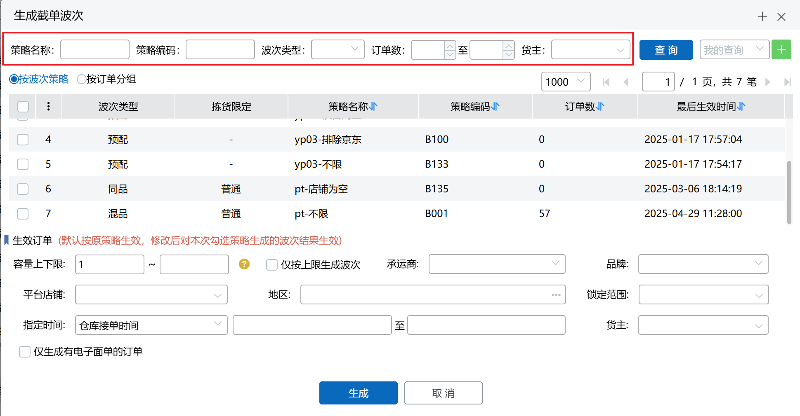

其中：按“货主”查询，订单数只显示当前货主的订单，生成波次时也只会捞取这部分订单进行生成。生效订单中的“货主”不生效。

###### 按波次策略

勾选需要的策略后点击生成即可：

###### 修改生效订单内容生成截单波次

生成波次后可在系统任务中查看任务状态，如下图：

①.截单下限指截单后波次订单数量下限，为避免截单后单个波次的订单数量太低可自行调整，截单下限默认为空，截单上限为截单后波次订单数量上限，不填默认按波次策略内的上下限生成，勾选仅按上限生成余数不会生成波次。

②.执行订单范围：选择货主、店铺确认和指定的时间范围后，截单波次页面会刷新波次策略所属的订单数。只统计归属选择的货主、店铺、指定的时间范围内和波归属次策略的订单，生成波次时也只有这些订单可以生成。

###### 指定锁库范围

①.不勾选锁定范围，锁库逻辑和之前一样，全仓下按照库位分配偏好锁库。

②.勾选锁定范围，锁库逻辑是在锁库范围下的库区按照库位偏好锁库。

③.锁定范围与波次策略设置的拣选区域不一致，则不进行锁库且不生成截单波次。

④.订单符合同品锁存储库位的波次策略且设置了锁库范围，则设置的锁定范围无效，仍按照全仓下效率优先锁存储库位。

⑤.爆品订单且设置了锁定范围，锁库逻辑是在锁库范围下的库区按照库位偏好锁库。

⑥.预配波次且设置了锁定范围，仍按照预配波次策略设置库位锁库。

4.新增我的查询选项，可保存之前的查询项，仅对下方生效订单条件+策略名称+编码+波次类型筛选有效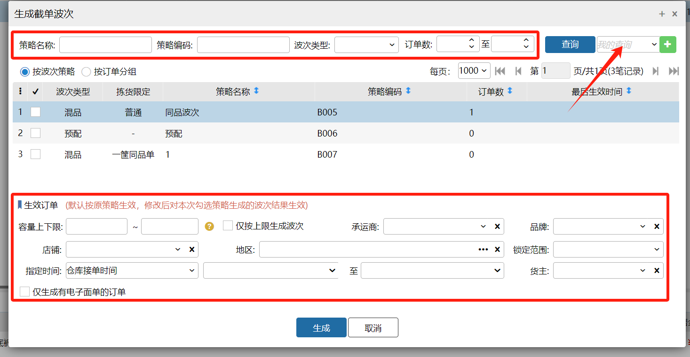

###### 按订单分组

左侧列表显示A+N波次和同品波次策略，右侧显示符合对应策略的订单分组，勾选分组后点击生成波次，每次只对一个策略生成波次：

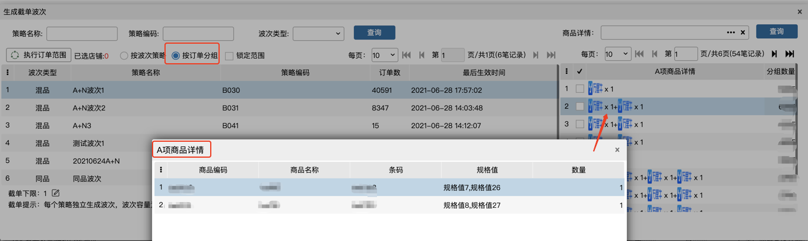

其中：

1)鼠标hover在商品图片上，可查看大图和商品名称

2)点击A项商品详情可在弹窗中查看具体A项商品信息

3)分组数量指符合这个A项的订单数量。

4)截单下限指截单后波次订单数量下限，为避免截单后单个波次的订单数量太低可自行调整，截单下限默认为1。

生成波次后可在系统任务中查看任务状态，如下图：

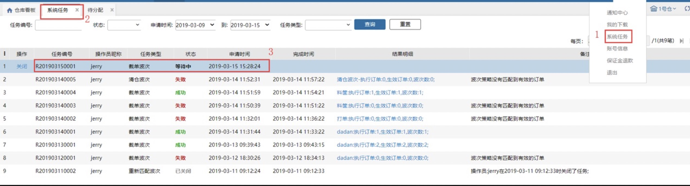

##### **3.生成手工波次**

用户也可通过待分配的查询条件自动筛选，选择要生成一个波次的订单，生成手工波次。具体操作步骤见下图。

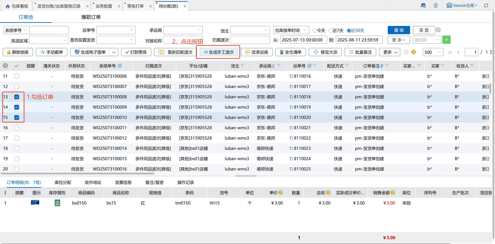

**提示：**

1、手工波次队列的订单必须快递公司的打印模板相同，才能生成一个手工波次。

2、若有订单原本配货方式是零拣的（不符合任何波次）订单，生成了手工波次，那么这边订单的配货方式变成波次，最长等待时间是60min。

3、挂起的订单不会生成手工波次。

4、库存不足的订单不会生成手工波次，可以选择跳过失败订单继续，锁库失败的订单不生成波次，锁库成功的订单正常生成波次。

5、PDA领单方式，可选项：扫描打单/料框拣货/领单播种拣货

##### **4.解锁库位分配**

在待分配订单中，系统会锁定订单商品库存，当某些库存不足需要优先其他订单发货或者已锁定库存需要做解锁进行其他仓内作业的可通过解锁库位分配来完成。

步骤如下，先选中需解锁订单，再单击解锁库位分配按钮，确认即可，如图：

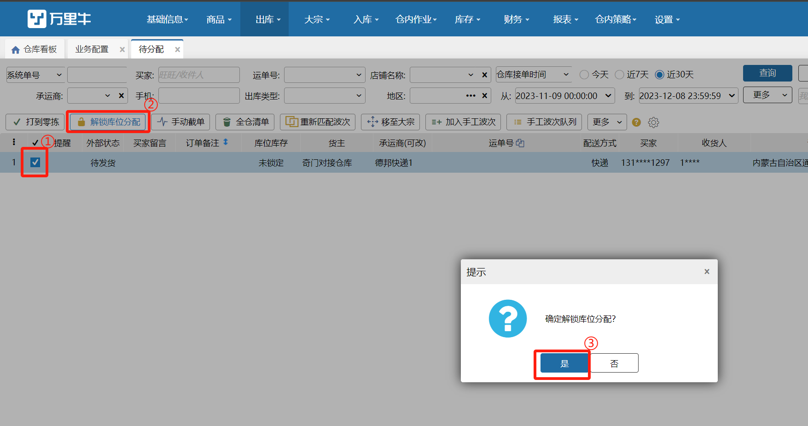

##### **5.生成清仓波次**

当待分配列表订单数量很多，但是订单还没达到时间去自动生成波次的时候，用户通过勾选波次策略和设置容量，点击生成，生成清仓波次任务，可在系统任务中查看，当任务完成后符合勾选策略的订单全部生成清仓波次。具体操作如下图：

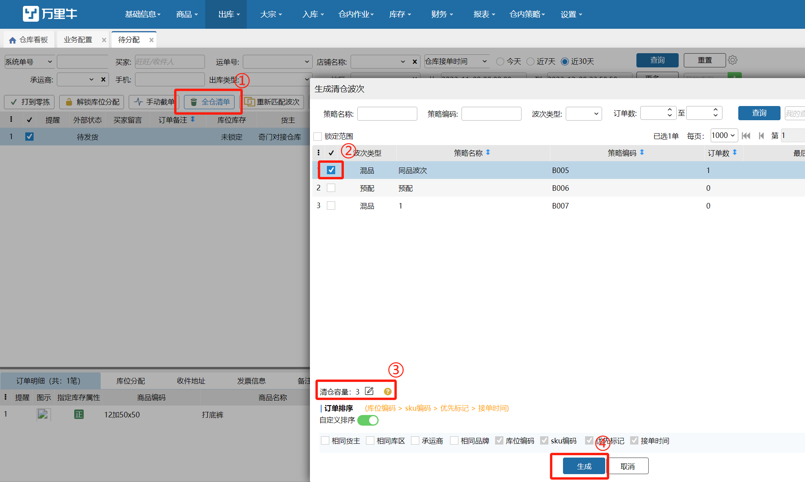

波次类型支持混品、同品和预配

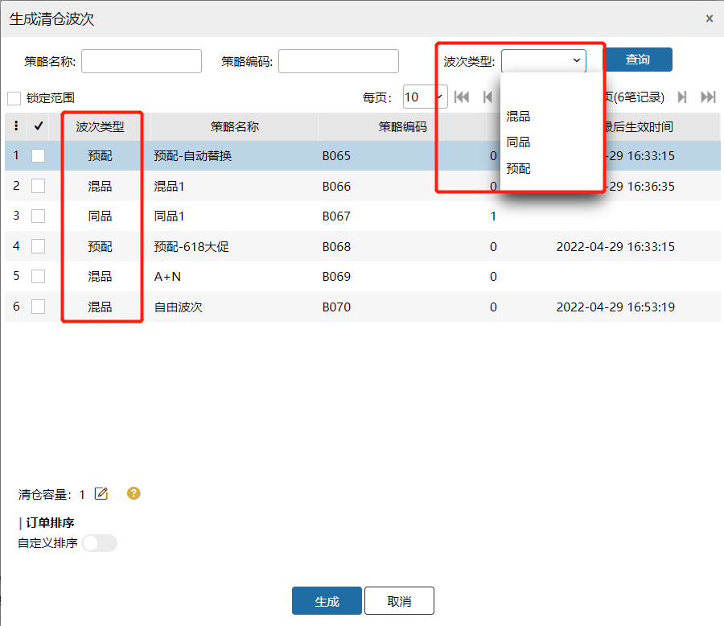

确认生成后可在系统任务中查询任务状态，

指定锁库范围

①.不勾选锁定范围，锁库逻辑和之前一样，全仓下按照库位分配偏好锁库。

②.勾选锁定范围，锁库逻辑是在锁库范围下的库区按照库位偏好锁库。

##### **6.解锁指定区域**

爆品锁到爆品区锁定失败时，可以解锁指定区域，解锁后再次锁库时允许锁到非爆品区。

注：必须先设置好仓内策略-区域匹配规则后，才能操作解锁指定区域

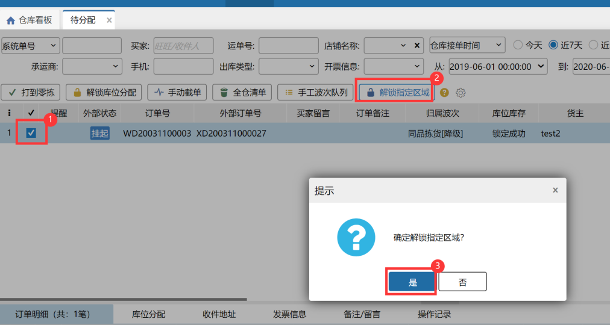

##### **7.重新匹配波次**

订单在待分配中，落单匹配到的波次不是想要的波次，调整波次优先级后可以重新匹配波次，不需要重新下单。不用勾选订单，是针对于待分配中的所有订单，直接点击重新匹配波次，生成重新匹配波次任务，任务执行完成后订单上的归属波次会更新更新掉。具体操作如下图：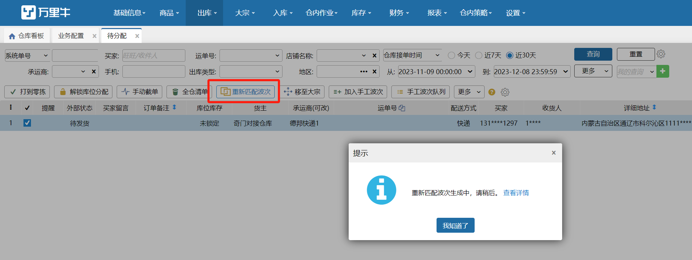

##### **8.移至大宗**

用户设置大宗策略时设置错，订单都跑到待分配了，可以通过该功能把这些订单移至大宗，不用再从erp那边重新下单了，减少路径。

##### **9.打回审核**

有货主开启接单审核的仓库，在打到零拣下方有“打回审核”的按钮，可以把订单打到“订单审核”页面，未开启接单审核的货主订单也可以打回。

##### 10.改承运商

支持在订单上单个修改或批量修改订单承运商，同零拣打单。若修改后订单收件地址属超区，会报错提示。

替换承运商/回收电子面单时，已打印快递单的订单会弹窗提示：该订单已打印快递单，若继续修改请销毁已打印面单；点击继续按钮，替换承运商/回收电子面单，点击取消按钮，不替换承运商/回收电子面单。

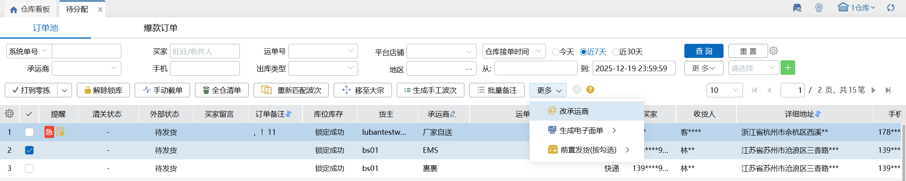

##### 11.查询项优化

1.运单号可以根据有无运单号进行查询，页面包括预出库和待分配。

2.查询项“订单异常分类”改成：包含异常/排除异常，可以在预出库订单、待分配、零拣打单、波次打单、待拣货、待验货等页面查出包含/排除指定异常订单。

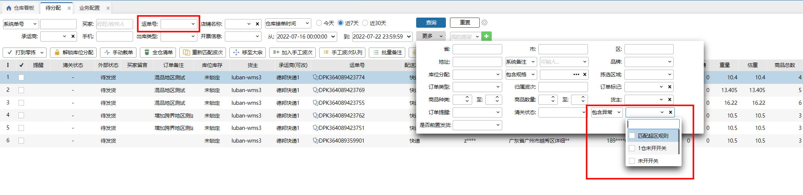

3.货主查询项支持显示当前环境剩余单量

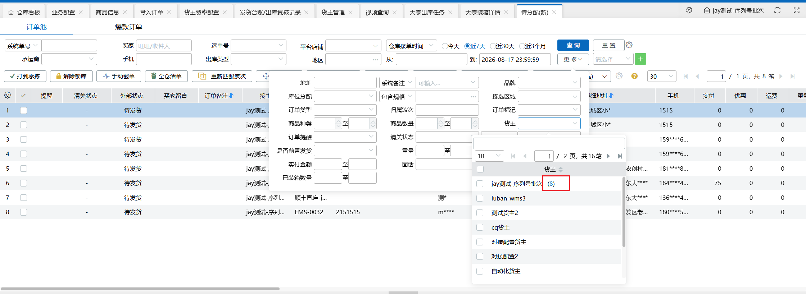

#### 爆款订单

背景：直播、爆款等业务叠加快递价格及重量区间不断压缩，越来越多的商家在走爆款模式。同样也有越来越多的小商家委托三方云仓进行发货。致使云仓订单结构更多的侧重于爆品、单品结构。复杂订单出现的占比持续降低。

##### 1.查询条件

(1).订单类型、缺货商品统计：根据查询条件统计数据，每次点击查询后数量变更。

(2).缺货商品统计：勾选商品点击去补货，自动跳转至待分配商品统计，勾选商品并弹窗补货。

##### 2.设置方案

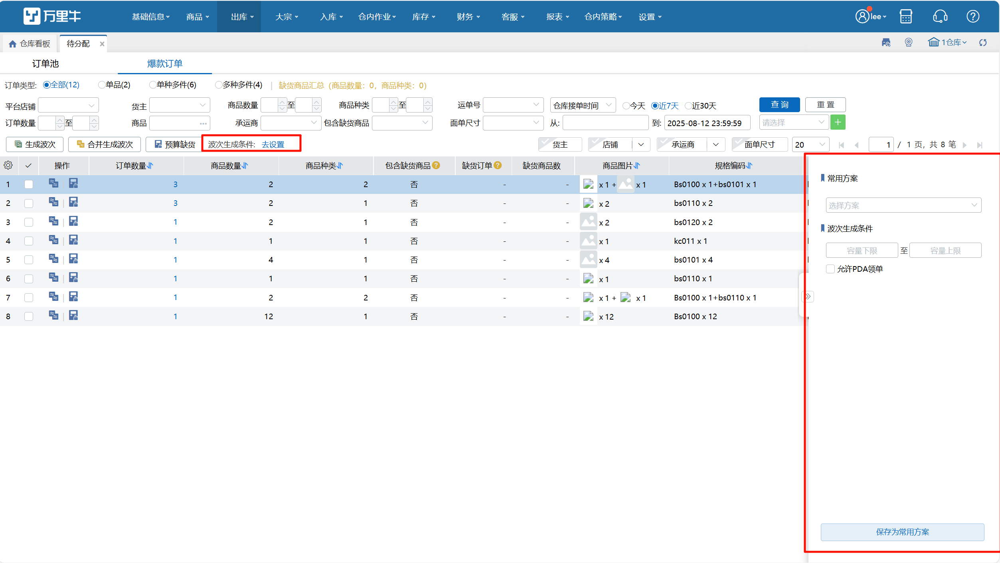

(1).支持快捷选择前6种方案，下拉会显示全量方案。

(2).点击保存为常用方案，保存成功且会设置为默认方案。

方案只是快速带出显示的作用，实际生成波次的容量和领单类型以右侧界面上实际填写的为准。

(3).支持删除方案。

##### 3.生成波次

(1).支持点击工具栏生成、合并生成，以及表格列进行单个分组生成波次。

##### 4.计算缺货

(1).需手动点击操作栏按钮或表格列，会自动计算当前缺货订单数、缺货商品数量。

(2).缺货订单点击弹窗待分配条件查询，支持查看和修改订单数据。

(3).缺货商品数点击自动跳转至待分配商品统计，勾选商品并弹窗补货。

##### 5.分组条件

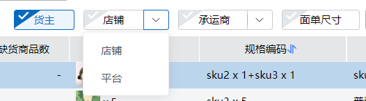

(1).支持手动选择分组拆分条件，选择后表格列末端新增对应分组拆分条件的列。分组后勾选多个组合合并生成波次，波次内订单会按照页面顺序进行排序。

（2).支持记忆在操作员上。

##### 6.表格列快捷跳转

(1).点击订单数量、缺货订单、优先订单数，弹窗待分配条件查询，支持查看和修改订单数据。

(2).点击缺货商品数，自动跳转至待分配商品统计，勾选商品并弹窗补货。

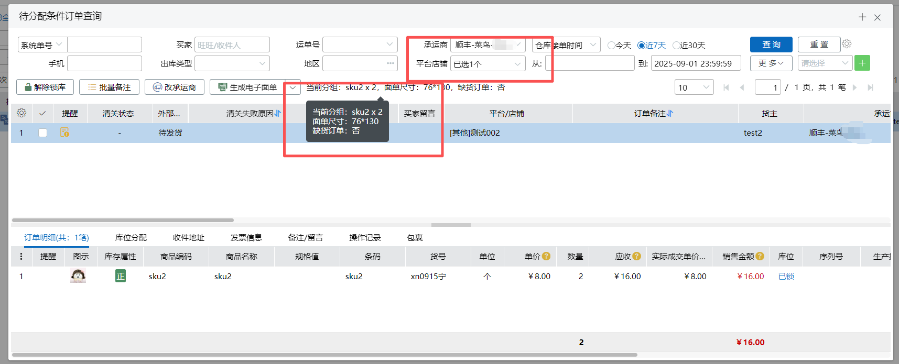

(3).部分列支持全局排序。

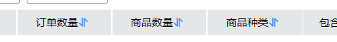

(4).支持自定义列。

(5).选择分组条件、查询项，筛选后结果，点击数量跳转至“待分配条件订单查询”内会自动带入筛选条件。

> 更新: 2026-08-17 14:05:15  

> 原文: <https://hupun.yuque.com/unzko7/lsbfg0/ow8unkls4z7dpqys>

---

### 05.1.3 波次打单

> 原始文件来源：`00-源文件/操作手册/出库_B2C/打单/波次打单.md`

波次打单页面显示的是一波波分类好的订单。用户可以在此页面针对一波订单生成单号和打印单据。

#### **01.改承运商**

如下图所示可修改一个波次订单的承运商。

替换承运商/回收电子面单时，已打印快递单的订单会弹窗提示：该订单已打印快递单，若继续修改请销毁已打印面单；点击继续按钮，替换承运商/回收电子面单，点击取消按钮，不替换承运商/回收电子面单。

提示

订单是指定承运商（有锁标记），则不允许修改承运商与零拣打单同理。

#### **02.生成普通单号**

若订单的承运商开启了电子面单，则勾选此订单，点击生成电子面单按钮即可。

若订单的承运商无电子面单，则可直接键入快递单号列输入单号，或者点击生成普通面单按钮，快速生成单号。生成普通面单的操作步骤见下图。

提示

1、勾选一个波次，这个波次有电子面单和普通面单订单，则点击生成电子面单，只会更新电子面单的订单单号；同理点击生成普通面单，只会更新普通面单的订单单号；

2、勾选一个波次，这个波次只有两个不同承运商的普通面单订单，点击生成普通面单，可手动选择快递公司，只会更新选择的承运商订单单号。

#### **03.回收电子面单**

当订单有生成电子面单，则可以勾选订单进行回收电子面单。回收电子面单时只支持勾选同一个波次中的订单进行回收。

#### **04.新增发票**

erp推送到wms的订单，若买家临时想要开发票，用户可在此环节找到此订单，点击发票信息标记，填写正确的信息后点击保存。保存的发票信息自动同步记录至发票打印页面。具体操作步骤见下图。

#### **05.打印单据**

勾选某个波次点击相应按钮，即可打印快递单、发货单、配货单、发票、拿货清单。

快递单两种打印排序：

①按打印批次号排序：按波次中订单打印批次号排序

②按包裹中商品排序：按波次中子包裹商品数量及编码排序

排序规则：包裹中商品数量为1（含无包裹订单）>包裹中数量大于等于2（含无包裹订单）>包裹号/系统订单号>订单归属平台。

例：波次订单：

订单1：包裹ZX01001：商品a*1；包裹ZX01002：商品b*1  
订单2：包裹ZX02001：商品a*1；包裹ZX02002：商品c*1

订单3：包裹ZX03001：商品a*2；包裹ZX03002：商品a*1、b*1

订单4：包裹ZX04001：商品a*1；包裹ZX04002：空

订单5：订单号：ZX05001，无包裹，商品a*1

订单6：订单号：ZX06001，无包裹，商品a*3

快递单打印排序结果：

包裹ZX01001

包裹ZX02001

包裹ZX04001

包裹ZX04002

订单5：ZX05001

包裹ZX01002

包裹ZX02002

包裹ZX03001

包裹ZX03002

订单6：ZX06001

#### **06.移除订单**

若用户不想要一个波次中的某笔订单，可勾选这笔订单，点击移除按钮，这笔订单就会到待分配环节。

提示

若波次仅剩下一笔订单，则这笔订单不允许移除。用户可勾选此波次，点击撤销波次。

#### **07.撤销波次**

若用户对生成的波次不满意，可以整笔作废。作废的波次订单都会到待分配环节。

#### **08.确认打单**

勾选波次，点击确认打单按钮，该波次的所有订单就提交到下一环节。

提示

订单从待分配到波次打单环节，会根据仓内策略--仓库规则--作业规则，分配商品的库位。

#### **09.查询项自定义设置**

查询条件支持用户自定义设置，最多8个查询条件，位置是依次从左到右，从上到下排序。生成时间从XX到XX两项固定不能选择。

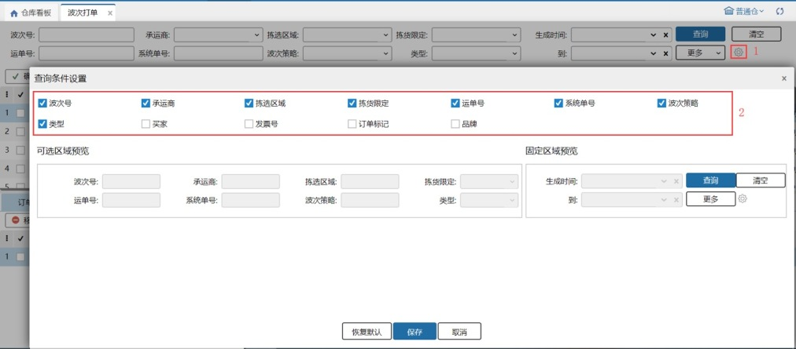

#### **10.工具栏按钮自定义设置**

工具栏的按钮支持自动调整位置。

#### **11.录入序列号**

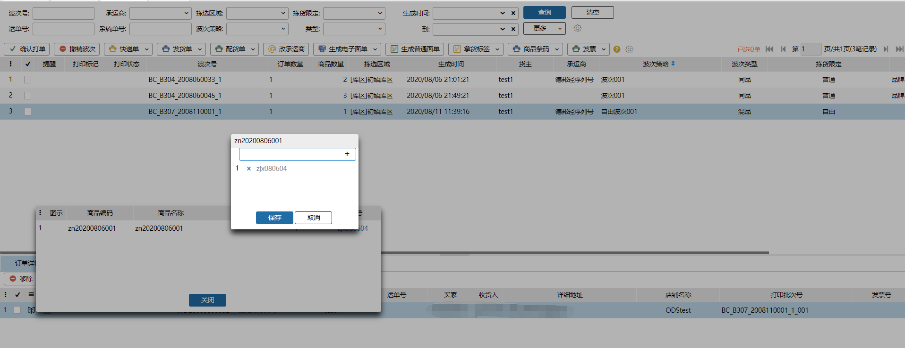

①.标准模式：录入序列号必须是当前商品未锁定的。

②.简洁模式：录入序列号可以是当前商品未锁定的，也可以是系统中不存在的。录入系统中不存在的后，该序列号自动添加当前商品的库存总量里且是锁定状态。

#### 12、提升优先级

勾选指定波次后，点击“提升优先级”按钮，可以给波次打上“优”标记，在领取波次时可以优先领取。

#### ** 13.自动替换拦截订单**

当波次中的部分订单被拦截时，系统自动从待分配、预出库页面寻找符合该波次策略（生成该波次时的策略）的同品订单进行替换，替换之后被拦截订单关闭，新的订单锁库记录继承被拦截订单的锁库记录。允许替换的波次需符合以下条件：待打单波次、未拆分且未打印单据（包括快递单、发货单、发票）

其中：

(1)以生成该波次时的波次策略为依据来寻找可替换订单，如：生成波次时策略设置为A，生成波次后修改了策略设置为B，在找可替换订单时，会找符合策略A的订单，不会找符合策略B的订单。

(2)若波次策略指定承运商范围仅为承运商为空，则当有订单发生拦截时，不会替换同品订单到波次中；若波次策略指定承运商范围包含承运商为空，则当有订单发生拦截时，不会替换承运商为空的同品订单到波次中，只会替换有承运商的订单到波次中。

#### 14.生成电子面单

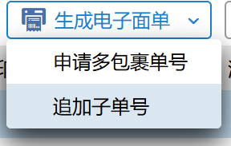

1.生成电子面单：点击后订单生成普通电子面单号。

2.申请多包裹单号：按申请类型及方式生成子母件单号或普通多包裹电子面单号。

(1)按每单商品总数申请：系统自动计算订单内商品总数，根据总数自动生成对应包裹数。

(2)按每单明细数量申请：系统自动计算订单内商品明细数量（同sku多明细算1条），根据数量自动生成对应包裹数。

(3)按指定数量申请：需手动填写要生成的包裹数量。

(4)按默认箱/锁定箱数量申请，所有余数生成一个包裹：如订单锁定5个箱子，其中2种商品有若干散件，则申请6个单号。

默认箱/锁定箱关联业务配置-商品多单位管理开关：

        开启出库换算模式->显示按默认箱数量申请，剩余商品生成1个包裹

        开启全流程箱规模式->显示按锁定箱数量申请，剩余商品生成1个包裹

根据对应模式+订单，系统自动计算生成x个包裹。

注：使用后包裹明细分摊结果将按计算结果分配。

a.默认箱计算：未锁定/已锁定订单，看商品有无设置多单位。

若已设置则订单内单sku商品总数/默认箱比值，取整作为包裹数，余数计入尾箱。

若未设置则不计算，直接计入尾箱。

例：商品1默认多单位1:2，商品2无多单位；订单1：商品1-5个，商品2-2个

共生成包裹数：3个。包裹1：商品1-2个；包裹2：商品1-2个；包裹3：商品1-1个，商品2-2个

b.锁定箱计算：

未锁定订单，不计算，直接计入尾箱。

已锁定订单，锁定库存形态为规格箱/唯一箱，1箱=1个包裹，其余拆零直接计入尾箱。

例：商品1箱规1箱4个；订单1：商品1-7个

未锁定-共生成包裹数：1个。

已锁定（锁1规格箱；1唯一箱：箱内2个；1拆零）-共生成包裹数：3个。

包裹1：1规格箱；包裹2：1唯一箱；包裹3：拆零1个

(5)按默认箱/锁定箱数量申请，每种余数生成一个包裹：箱数计算逻辑同(4)，剩余商品按不同sku生成不同包裹。如订单锁定5个箱子，其中2种商品有若干散件，则申请7个单号。

3.追加子单号：支持追加的快递已有单号点击可以追加生成指定数量的子母件。

> 更新: 2026-04-14 10:49:48  

> 原文: <https://hupun.yuque.com/unzko7/lsbfg0/geqydgi9oms6malu>

---

### 05.1.4 订单审核

> 原始文件来源：`00-源文件/操作手册/出库_B2C/打单/订单审核.md`

订单审核在现有出库流程前增加了审核环节，订单落单后会先进入订单审核页面，支持手工拆单、修改承运商、确认审核，该页面关联业务配置-货主策略-开启接单审核开关，开启后显示显示此菜单页面。

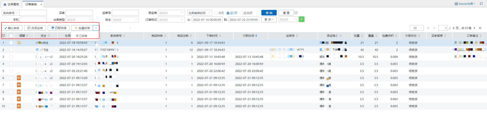

#### 01.确认审核

勾选订单后点击确认审核，若仓库未开启缺货接单，则订单根据仓库有无大宗策略、是否开启缺货接单等配置进入待分配、预出库或大宗出库页面；

若仓库开启缺货接单，则无论订单是否缺货都会先进入预出库页面，根据订单排序规则进入队列。

#### 02.改承运商

支持在订单上单个修改或批量修改订单承运商，同零拣打单。若修改后订单收件地址属超区，会报错提示。

替换承运商/回收电子面单时，已打印快递单的订单会弹窗提示：该订单已打印快递单，若继续修改请销毁已打印面单；点击继续按钮，替换承运商/回收电子面单，点击取消按钮，不替换承运商/回收电子面单。

#### 03.匹配快递

勾选订单后点击按钮，指定订单走快递匹配逻辑，页面会提示处理成功的订单数据，这些订单在后续出库流程中不再走快递匹配逻辑。

#### 04.批量拆单

若在业务配置中未设置批量拆单策略，点击批量拆单会提示先去设置，点击会跳转到业务配置页面：

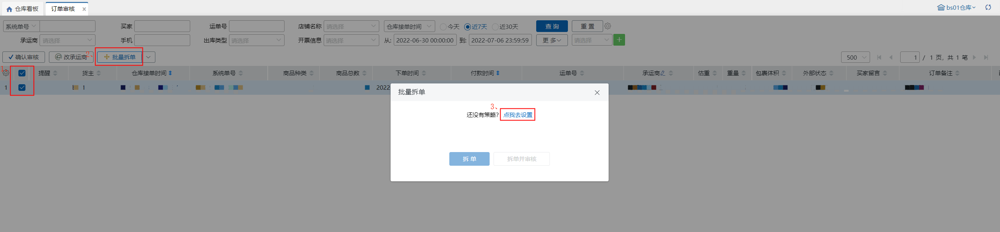

若已设置拆单策略，则弹窗显示策略名称，选择某个策略后，点击“拆单”，则订单按照策略规则拆出新订单，若点击“拆单并审核”，则拆出订单后自动确认审核，订单打到下个环节。

注：

手动批量拆单后点击“拆单”按钮，不会自动提交订单；

手动批量拆单时只看策略上的拆分条件，不限平台/店铺、承运商条件。

#### 05.手工拆单

手工拆单只能对单笔订单进行拆单，若多选会报错提示，勾选订单后点击手工拆单，显示拆单弹窗：

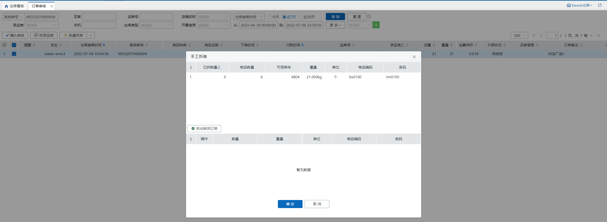

其中：

(1) 上边列表显示的是该订单中所有的商品明细，下边列表显示的是拆出明细，上边列表已拆明细显示在下边列表中，下边列表明细删除后数量会加到上边列表中

(2) 拆出缺货订单可以将订单中所有缺货明细一键拆出，该按钮关联缺货接单开关，若该订单所属货主开启，则显示按钮，否则不显示

(3) 不能将所有明细全部拆出，否则会报错提示

(4) 可用库存是该明细库存总量的可用数量

(5) 拆单成功后，列表自动刷新订单数据

**注意：**

(1) 不符合拆单的情况：一单一件、货到付款、外贸等加快递锁的订单、天猫直送、唯品会、外贸订单；

(2) 批量拆单时，若勾选订单中有部分不符合拆单条件，则允许拆单的拆单成功，不允许拆单的弹窗列表提示；

(3) 拦截订单直接关闭，挂起订单不允许操作，操作时会报错提示。

#### 06.拆单召回

:::color3
场景：拆单召回功能主要应用于订单自动拆单后需要调整的场景。当拆单规则有误需要重新拆分，或订单已拆成多个子订单使用子母件面单后需要更换快递公司时，原有功能无法支持批量操作。该功能通过一键将已拆分的子订单合并还原为原始订单，取消子母件关系，使订单恢复到可重新拆单或换快递的状态，避免人工逐单处理，保障订单履约的灵活性。

:::

在输入框中输入已拆订单单号后，点击确定，可将该订单关联的所有主子单都召回，还原到拆单前状态。

注：

拆出订单已发货时，不支持召回；

通过手工拆单、批量拆单（自动、手动）拆出的订单，支持召回。

> 更新: 2026-07-08 17:39:25  

> 原文: <https://hupun.yuque.com/unzko7/lsbfg0/cp3sf0sasnlh7q5z>

---

### 05.1.5 零拣打单

> 原始文件来源：`00-源文件/操作手册/出库_B2C/打单/零拣打单.md`

零拣打单环节主要是给用户提供针对零散件进行生成单号和打印单据操作。

#### **01.修改承运商**

订单的承运商列有锁，表示指定承运商，不可修改此订单承运商。若无锁标记，则可勾选订单更换订单的承运商信息。具体修改步骤见下图。

替换承运商/回收电子面单时，已打印快递单的订单会弹窗提示：该订单已打印快递单，若继续修改请销毁已打印面单；点击继续按钮，替换承运商/回收电子面单，点击取消按钮，不替换承运商/回收电子面单。 

注：目前外贸订单和得物订单（部分模式）均锁定承运商，不支持更改。

#### **02.生成普通单号**

若订单的承运商开启了电子面单，则勾选此订单，点击生成电子面单按钮即可。若订单的承运商无电子面单，则可直接键入快递单号列输入单号，或者点击生成普通面单按钮，快速生成单号。生成普通面单的操作步骤见下图

#### **03.回收电子面单**

若订单已经生成了电子面单，则点击这边的回收电子面单，电子面单将会被回收，该笔订单可以生成其他的单号。此处支持批量选中订单再回收。若订单被拦截确认关闭，则电子面单会被自动回收。

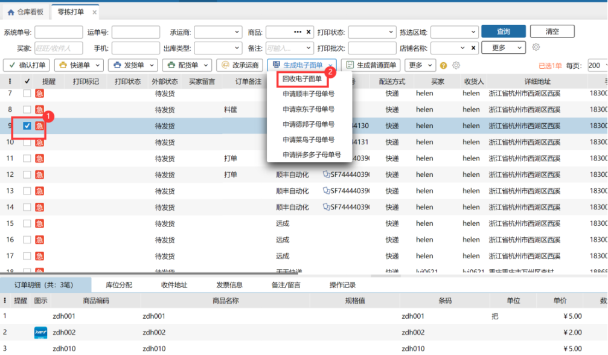

#### **04.新增发票**

erp推送到wms的订单，若买家临时想要开发票，用户可在此环节找到此订单选中，点击发票信息，填写正确的信息后点击保存。保存的发票信息自动同步记录至发票打印页面。

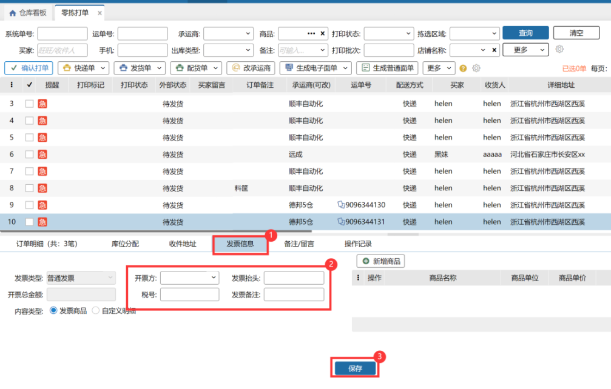

#### **05.打印单据**

勾选某笔订单点击相应按钮，即可打印快递单、发货单、配货单、发票、拿货标签等。

#### **06.确认打单**

勾选订单点击确认打单按钮，订单就提交到下一环节。

#### **07.撤回待分配**

勾选订单点击打回待分配，订单将会回到待分配。

打回待分配之后，若匹配到波次，重新根据波次策略生成波次。等待超时时间依旧是订单接单时间+波次的最长等待时间。

若匹配到预配波次，将会清除之前的锁定，在匹配到的预配波次生成时锁定预配库位，生成预配波次。

#### **08.查询项自定义设置**

查询条件支持用户自定义设置，最多12个查询条件，位置是依次从左到右，从上到下排序。

#### **09.工具栏按钮自定义设置**

工具栏的按钮支持选择需要的功能按钮，以及拖动调整先后顺序。

#### **10.录入序列号**

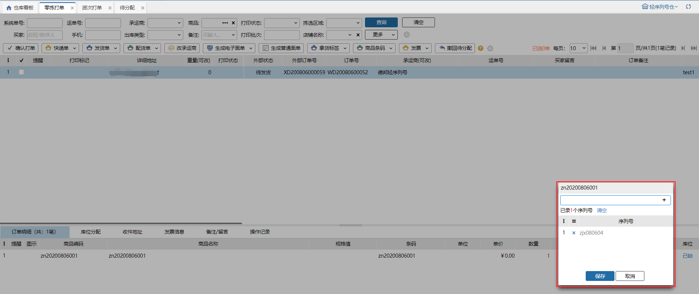

①.标准模式：录入序列号必须是当前商品未锁定的。

②.简洁模式：录入序列号可以是当前商品未锁定的，也可以是系统中不存在的。录入系统中不存在的后，该序列号自动添加当前商品的库存总量里且是锁定状态。

注：待分配、预出库订单、零拣打单和波次打单页面勾选单笔/多笔订单进行打印快递单、生成电子面单、前置发货等操作后仍保留勾选状态，方便查看操作是否生效及下一步操作

#### **11.生成电子面单**

1.生成电子面单：点击后订单生成普通电子面单号。

2.回收电子面单：对已生成单号/子母件的订单点击后回收电子面单成功并清空对应运单号。

3.申请子母单号：按申请类型及方式生成子母件单号或普通多包裹电子面单号。

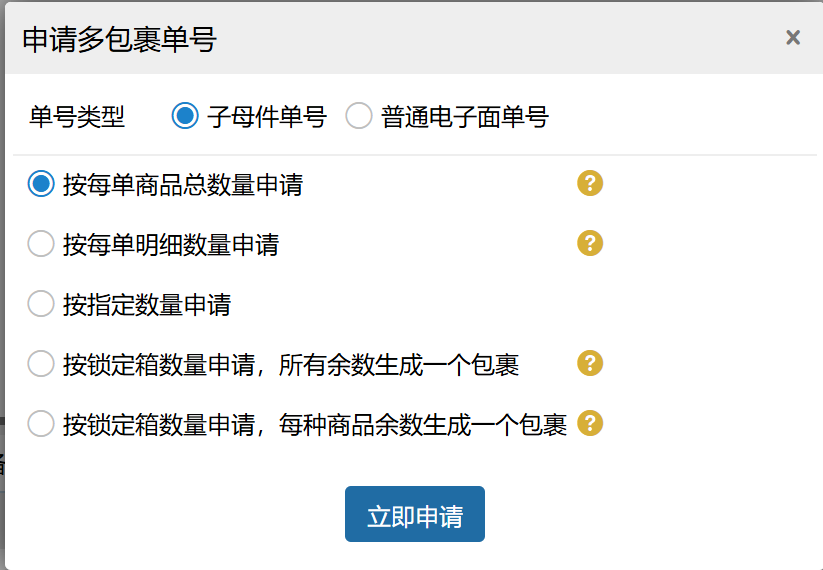

(1)按每单商品总数申请：系统自动计算订单内商品总数，根据总数自动生成对应包裹数。

(2)按每单明细数量申请：系统自动计算订单内商品明细数量（同sku多明细算1条），根据数量自动生成对应包裹数。

(3)按指定数量申请：需手动填写要生成的包裹数量。

(4)按默认箱/锁定箱数量申请，所有余数生成一个包裹：如订单锁定5个箱子，其中2种商品有若干散件，则申请6个单号。

默认箱/锁定箱关联业务配置-商品多单位管理开关：

        开启出库换算模式->显示按默认箱数量申请，剩余商品生成1个包裹

        开启全流程箱规模式->显示按锁定箱数量申请，剩余商品生成1个包裹

根据对应模式+订单，系统自动计算生成x个包裹。

注：使用后包裹明细分摊结果将按计算结果分配。

a.默认箱计算：未锁定/已锁定订单，看商品有无设置多单位。

若已设置则订单内单sku商品总数/默认箱比值，取整作为包裹数，余数计入尾箱。

若未设置则不计算，直接计入尾箱。

例：商品1默认多单位1:2，商品2无多单位；订单1：商品1-5个，商品2-2个

共生成包裹数：3个。包裹1：商品1-2个；包裹2：商品1-2个；包裹3：商品1-1个，商品2-2个

b.锁定箱计算：

未锁定订单，不计算，直接计入尾箱。

已锁定订单，锁定库存形态为规格箱/唯一箱，1箱=1个包裹，其余拆零直接计入尾箱。

例：商品1箱规1箱4个；订单1：商品1-7个

未锁定-共生成包裹数：1个。

已锁定（锁1规格箱；1唯一箱：箱内2个；1拆零）-共生成包裹数：3个。

包裹1：1规格箱；包裹2：1唯一箱；包裹3：拆零1个

(5)按默认箱/锁定箱数量申请，每种余数生成一个包裹：箱数计算逻辑同(4)，剩余商品按不同sku生成不同包裹。如订单锁定5个箱子，其中2种商品有若干散件，则申请7个单号。

4.追加子单号：支持追加的快递已有单号点击可以追加生成指定数量的子母件。

> 更新: 2026-04-14 10:50:21  

> 原文: <https://hupun.yuque.com/unzko7/lsbfg0/fy3tr1zb3mu04q74>

---

### 05.1.6 预出库订单

> 原始文件来源：`00-源文件/操作手册/出库_B2C/打单/预出库订单.md`

未开启缺货接单时，商品可用库存不足时拒单；对应货主开启允许缺货接单后，在无限制接单或可接单库存充足的情况下，有明细缺货的订单会进入预出库订单页面，按照排序规则升序显示订单。等缺货商品到货后，按照顺序分配给优先级最高的订单，订单库存充足后进入出库流程。

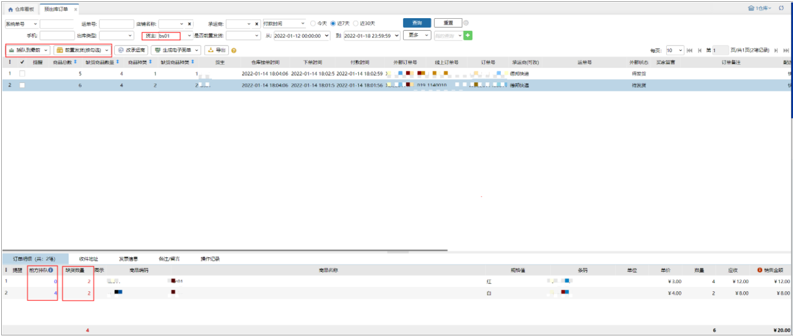

#### 01.订单数据显示

订单默认按照业务配置中选择的排序规则显示数据，货主查询项必选，默认显示当前仓库下开启缺货接单的第一个货主。

订单层级：缺货商品数量：该订单下总共缺货的sku数量；

缺货商品种类：该订单下总共缺货的商品种类。

订单明细层级：前方排队：指当前订单前同一sku还有多少等待进入出库流程的数量，点击查看队列详情，可以看到排在前面的具体订单和缺货数量；

缺货数量：当前sku无可用库存的数量

#### 02.插队功能

插队分两种：插队到最前、排队到最后；有两个操作入口：订单列表页面操作栏按钮、队列详情窗口操作按钮

①插队到最前

在订单列表页面，勾选需要插队的订单后，点击插队到最前按钮即可，支持批量操作，插队的订单始终在最前面。

队列详情窗口，无需选择订单，直接点击插队到最前按钮即可，对当前查看的这个订单生效，仅支持单个操作。

②排队到最后

在订单列表页面，勾选需要插队的订单后，点击排队到最后按钮即可，支持批量操作，插队的订单始终在最后面。

队列详情窗口，无需选择订单，直接点击排队到最后按钮即可，对当前查看的这个订单生效，仅支持单个操作。

#### 03.前置发货功能

有两种方式：按勾选、按查询

①按勾选前置发货，需要先勾选订单再点击按钮。

②按查询前置发货，点击后对当前查询条件下的所有查询结果进行前置发货操作，操作成功后外部状态会显示通知成功的标记，可以通过“是否前置发货”查询到对应数据

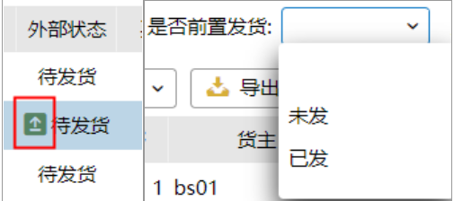

#### **04.订单流转**

①库存到货后，会优先分配给优先级高的订单，订单库存充足后，会自动流转到待分配页面，或根据大宗策略进入大宗出库页面。

②订单拦截后，会自动关闭，在订单查询页面可查到对应数据，不在预出库订单页面显示。

#### **05.改承运商功能**

订单层级支持手动修改承运商，或批量勾选订单进行批量修改。超区替换、3PL快递匹配对预出库订单生效。

替换承运商/回收电子面单时，已打印快递单的订单会弹窗提示：该订单已打印快递单，若继续修改请销毁已打印面单；点击继续按钮，替换承运商/回收电子面单，点击取消按钮，不替换承运商/回收电子面单。

#### **06.生成电子面单**

①手动生成电子面单：勾选订单后点击按钮生成。

②自动生成电子面单：业务配置指定预出库环节自动生成电子面单后，订单落单后能自动生成电子面单。

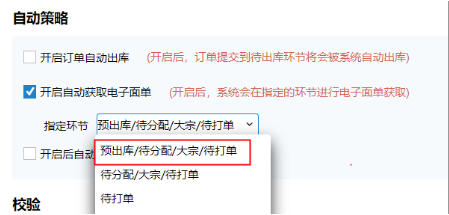

#### **07.导出**

导出支持包含明细、不包含明细。

#### **08.统计缺货商品**

此功能用于汇总**当前页面查询结果下**缺货明细的数量和影响订单数量：

其中：

(1)列表无数据时，按钮置灰，有数据时可点击汇总

(2)缺货数量指该商品规格缺货数量合计数，影响订单数量指该商品规格缺货时所在订单合计笔数

(3)弹窗汇总结果是在当前页面查询结果下计算的

(4)汇总结果支持导出

#### **09.有货拆单**

勾选订单后点击按钮，可以批量将订单中有货部分拆出并提交到下个环节，缺货部分留在预出库页面。

> 更新: 2025-12-19 15:05:31  

> 原文: <https://hupun.yuque.com/unzko7/lsbfg0/egblaakszoxzhgps>

---

## 05.2. 拣货作业

### 05.2.1 容器拣货任务

> 原始文件来源：`00-源文件/操作手册/出库_B2C/拣货/容器拣货任务.md`

之前操作员任务、接力任务和容器拣货任务分别在三个页面显示，查看起来不太方便，「拣货任务」页面用于集中显示波次拣货任务、容器拣货任务、接力任务和加工任务数据。

页面分两个状态展示，默认显示作业中，只显示已经被操作员领取的作业中任务，可切换到待作业列表，显示未领取的任务：

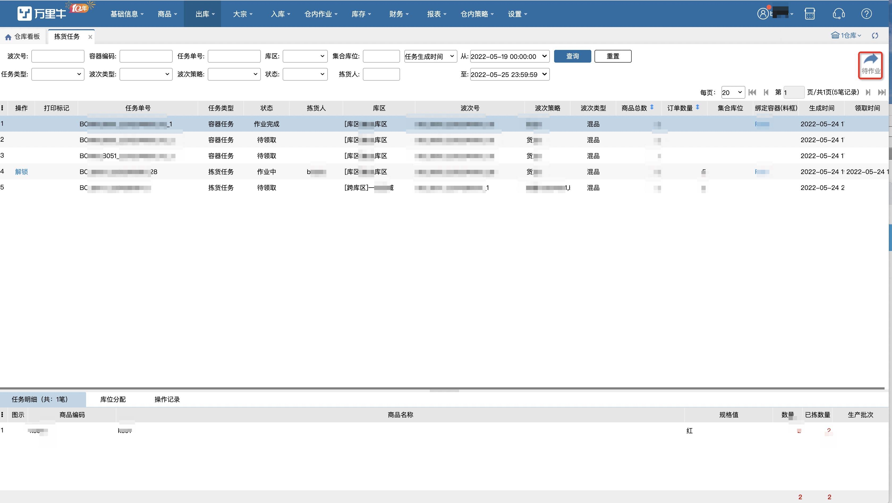

#### 01.页面数据来源

待作业列表：

1）波次确认打单提交到待拣货环节，领取拣货后数据显示到作业中列表；

注：零拣订单确认打单后不会显示在列表中；

作业中列表：

1）波次拆分生成容器拣货任务，任务状态为待领取，若有任务被领取，显示作业中，若有部分任务完成，显示作业完成，若全部任务完成，数据提交到下个环节，数据不显示在此列表中；

2）PDA批量拣货、播种拣货、料框拣货页面领取待拣货波次后，显示在此列表中，若放弃/解绑拣货，显示在待作业列表，若提交拣货，数据提交到下个环节，数据不显示在此列表中；

3）PDA扫描打单、领单播种拣货、自由领单领取波次后，显示在此列表中，若放弃/解绑拣货，显示在待作业列表，若提交拣货，数据提交到下个环节，数据不显示在此列表中；

4）PDA加工领料领取加工任务后，显示在此列表中，若放弃/解绑任务/提交任务，数据不显示在此页面。

#### 02.任务解绑

操作员领取任务后，可以手动解绑任务，解绑后可重新领取。

> 更新: 2023-12-18 13:50:02  

> 原文: <https://hupun.yuque.com/unzko7/lsbfg0/xuigkgn0nu87ko80>

---

### 05.2.2 待拣货

> 原始文件来源：`00-源文件/操作手册/出库_B2C/拣货/待拣货.md`

#### 一、查询界面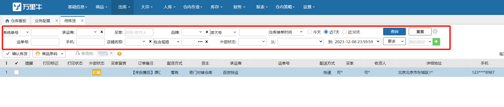

可在查询界面选择不同条件进行待拣货订单查询。（单号支持批量查询，最多200个）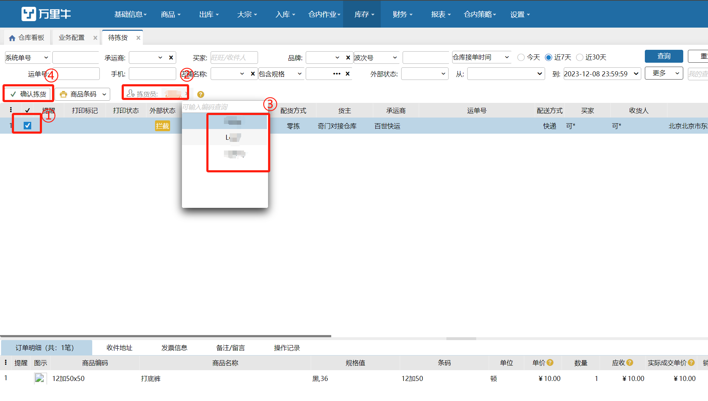

1.勾选一个或多个订单点击确认拣货即可快速通过拣货环节

2.拣货员默认为当前操作员，可点击进行更改选择，选择操作员后相应验货绩效将计入该操作员。

> 更新: 2024-02-02 16:28:28  

> 原文: <https://hupun.yuque.com/unzko7/lsbfg0/arguozsfzp5zrprg>

---

### 05.2.3 拣货任务

> 原始文件来源：`00-源文件/操作手册/出库_B2C/拣货/拣货任务.md`

之前操作员任务、接力任务和容器拣货任务分别在三个页面显示，查看起来不太方便，「拣货任务」页面用于集中显示波次拣货任务、容器拣货任务、接力任务和加工任务数据。

页面分两个状态展示，默认显示作业中，只显示已经被操作员领取的作业中任务，可切换到待作业列表，显示未领取的任务：

#### 01.页面数据来源

待作业列表：

1）波次确认打单提交到待拣货环节，领取拣货后数据显示到作业中列表；

注：零拣订单确认打单后不会显示在列表中；

作业中列表：

1）波次拆分生成容器拣货任务，任务状态为待领取，若有任务被领取，显示作业中，若有部分任务完成，显示作业完成，若全部任务完成，数据提交到下个环节，数据不显示在此列表中；

2）PDA批量拣货、播种拣货、料框拣货页面领取待拣货波次后，显示在此列表中，若放弃/解绑拣货，显示在待作业列表，若提交拣货，数据提交到下个环节，数据不显示在此列表中；

3）PDA扫描打单、领单播种拣货、自由领单领取波次后，显示在此列表中，若放弃/解绑拣货，显示在待作业列表，若提交拣货，数据提交到下个环节，数据不显示在此列表中；

4）PDA加工领料领取加工任务后，显示在此列表中，若放弃/解绑任务/提交任务，数据不显示在此页面。

#### 02.任务解绑

操作员领取任务后，可以手动解绑任务，解绑后可重新领取。

> 更新: 2023-12-18 13:49:04  

> 原文: <https://hupun.yuque.com/unzko7/lsbfg0/gp0opq86c6wiswfl>

---

### 05.2.4 接力拣货

> 原始文件来源：`00-源文件/操作手册/出库_B2C/拣货/接力拣货.md`

业务场景：多层楼，每层不同的拣货员，流水线自动将拣货筐流转至要送达的区域，故一层楼（一个区域）拣完货之后需要通过PDA进行接力拣选。

支持查看PDA上提交的接力拣货任务。

支持解锁PDA上领取的接力任务。

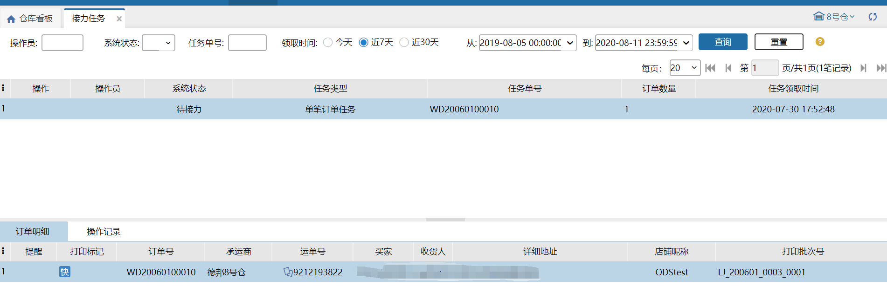

**注：全部订单完成接力任务不再该页面显示了。**

> 更新: 2023-12-18 13:46:15  

> 原文: <https://hupun.yuque.com/unzko7/lsbfg0/nbv8cs851sqetrsp>

---

### 05.2.5 操作员任务

> 原始文件来源：`00-源文件/操作手册/出库_B2C/拣货/操作员任务.md`

操作员任务支持查看当前手持移动端任务领取情况

可点击解锁按钮解除当前操作员任务。

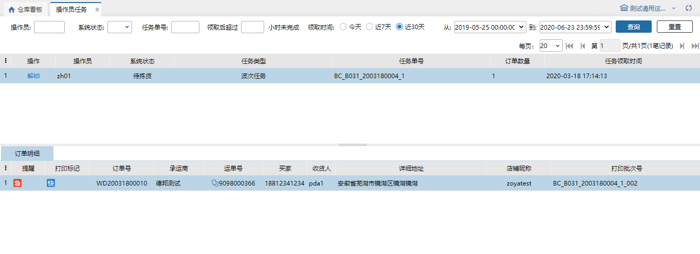

**提示：**

在拣货任务中若已经进行商品拣货，则该任务不允许解锁

> 更新: 2023-12-18 13:49:25  

> 原文: <https://hupun.yuque.com/unzko7/lsbfg0/cqtypsnwxhcsoh9g>

---

### 05.2.6 订单拣货

> 原始文件来源：`00-源文件/操作手册/出库_B2C/拣货/订单拣货.md`

订单拣货环节，用户可输入快递单号、系统单号、配货单号，批量进行确认拣货。若扫描的订单有不想确认拣货的，可点击移除按钮将订单移除。

**提示：**

1、配货单号：波次订单的配货单号是波次号；零拣订单的配货单号是打印配货单显示的配货单号。

2、确认拣货后订单就移至下一环节，订单锁定的库位库存实际数量会减少，锁定数量会增加，订单的快递成本会自动计算。

3、若用户不需要此环节，则可在仓内策略--业务配置页面，关闭此环节。

4.序列号录入

①.标准模式：录入序列号必须是当前商品未锁定的。

②.简洁模式：录入序列号可以是当前商品未锁定的，也可以是系统中不存在的。录入系统中不存在的后，该序列号自动添加当前商品的库存总量里且是锁定状态。

> 更新: 2023-12-18 13:48:24  

> 原文: <https://hupun.yuque.com/unzko7/lsbfg0/ucg6z67z11akbyol>

---

## 05.3. 验货与复核

### 05.3.1 分拣验货

> 原始文件来源：`00-源文件/操作手册/出库_B2C/验货/分拣验货.md`

分拣验货，可以帮助用户盲扫商品来验货，当扫到的商品有匹配上订单后，确认验货按钮就会高亮，用户点击确认验货就可以完成该笔订单的验货环节。

#### 01、默认为动态匹配

扫配货单号和商品条码后，右侧显示匹配到的波次中待验商品明细和数量

设置后置打印环节，可选择打印快递单、发货单和发票等：

**提示：**

1. 首先应该扫描配货单号或者波次号，则会显示出来该配货单有多少笔订单是待验货的；

2. 扫描商品条码，则右边有显示出来有匹配商品的待验货商品，用户可以进行参考，下面会显示已验货的数量；

3. 开启自动提交功能，表示当一个订单的所有商品都确认验货后会自动提交订单到下个环节，不需要用户去手动点击确认验货按钮；

4. 后置打印，开启后确认验货后若是电子面单快递订单会自动生成单号和打印快递单，若选择发票则可以后置打印发票；

5. 在仓内策略–业务配置，开启商品条码截取，扫描输入截取的商品条码会与商品信息的条码进行对比校验；

①.选择特殊信息截取，扫描输入++前的条码，系统会与订单商品信息的条码进行对比校验；扫描输入不含特殊字符的全量条码可直接匹配商品，扫描输入包含++字符的全量条码，无法匹配到商品信息。

②.选择条码位数截取，扫描输入前若干位条码，系统会与订单商品信息的条码进行对比校验；扫描输入全量条码，无法匹配到商品信息。

6.在仓内策略-业务配置，开启赠品类型商品免验货，商品类型是赠品的，确认订单后赠品类型的商品已验数量自动填充。

1）订单中的商品类型都是赠品时，商品都不免验，需要依次验货；

2）订单中序列号商品是赠品时，序列号商品不免验，需要手动验货；

例如：波次包含两个订单：订单01：普通商品A（赠品）2个，普通商品B（赠品）3个；

订单02：普通商品C 2个，普通商品B（赠品）3个；

订单03：序列号商品D（赠品）2个，普通商品B（赠品）3个；

验货时，订单01 商品A、B都需要验货；订单02 商品B免验，只需验商品C；订单03 商品B免验，只需验序列号商品D

7.录入序列号

1）标准模式：录入序列号必须是当前商品未锁定的。

2）简洁模式：录入序列号可以是当前商品未锁定的，也可以是系统中不存在的。录入系统中不存在的后，该序列号自动添加当前商品的库存总量里且是锁定状态。

3）简洁模式：不支持序列号匹配商品。

8.验货核对批次

①.手动选择核对

扫描商品条码后，若有多个批次号，则弹窗选择生产批次并填写数量，若只有1个批次号，则直接增加已验数量：

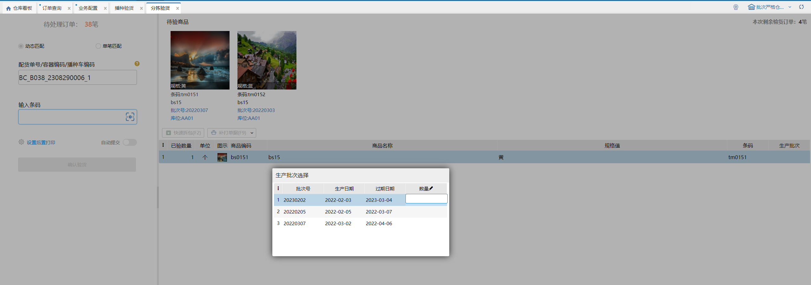

②.扫描批次号核对

每次扫描生产批次商品，都会弹窗选择生产批次，可以手动输入批次号+回车，或者双击选中批次号：

9.集合码录入

具体内容参考[业务配置](https://hupun.yuque.com/unzko7/lsbfg0/caki7lz4105n2vpg#CKIQO)。

#### 02、单笔匹配

扫配货单号和商品条码后，右侧显示匹配到的单笔订单信息和待验商品：

注：匹配订单规则：

①.顺序逻辑为波次订单商品总数由少到多推荐，即单笔先完成

②.若波次中订单商品数量一致的，按打印批次号顺序完成

2.1 输入数量

商品条码开启输入数量设置后，左侧显示“输入数量”文本框，该输入框可用于快捷填写已验数量。

当扫码商品条码剩余可验数量<=指定数量时，输入数量框置灰，当扫码商品条码剩余可验数量>指定数量时，输入数量框默认为1，可手动修改，填写数量n后回车，对应sku已验数量+n

注：该配置记忆在仓库+操作员上

3、耗材使用

业务配置-开启耗材管理，设置耗材登记环节为“验货”时，支持在分拣验货页面显示推荐耗材或录入实际使用耗材：

3.1 按耗材推荐：在扫描商品条码匹配到待验订单后，就根据耗材规则显示耗材推荐信息

- 

3.2 按实际使用：订单所有明细验货完成后，页面上显示推荐耗材数据，并支持录入实际使用耗材：

4、万能码提交

若当前仓库开启扫描条码强制提交开关，商品条码、耗材条码扫描框支持扫描wanliniu666强制提交或跳转到下一个扫描框。

5.集合码录入

具体内容参考[业务配置](https://hupun.yuque.com/unzko7/lsbfg0/caki7lz4105n2vpg#CKIQO)。

#### 03、支持视频监控显示商品明细

同条码验货，视频监控记录会显示扫描的商品明细（商品名称、条码、数量、批次信息、序列号）

普通商品

批次号商品

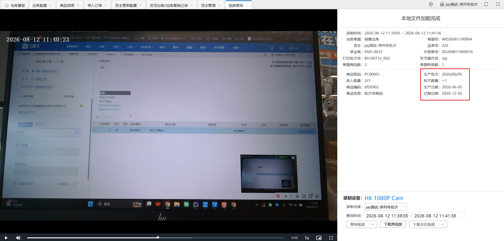

序列号商品

> 更新: 2026-08-17 13:48:19  

> 原文: <https://hupun.yuque.com/unzko7/lsbfg0/bbx4n7cxh33h2zhe>

---

### 05.3.2 单种验货

> 原始文件来源：`00-源文件/操作手册/出库_B2C/验货/单种验货.md`

单种验货页面专用于满足单种类不限数量的波次验货，单种类波次的概念：非预配/同品/自由波次、且规格种类1-1 商品种类1-1 的波次。

具体操作步骤如下：输入配货单号->输入条码->确认验货

扫描波次号时会判断是否为单种类的波次，否则报错提醒如下：

**注意：**

1.支持配置验货单据查找顺序（如数量大的优先）;

2.快速跳转中验货环节增加单种验货，支持快速跳转

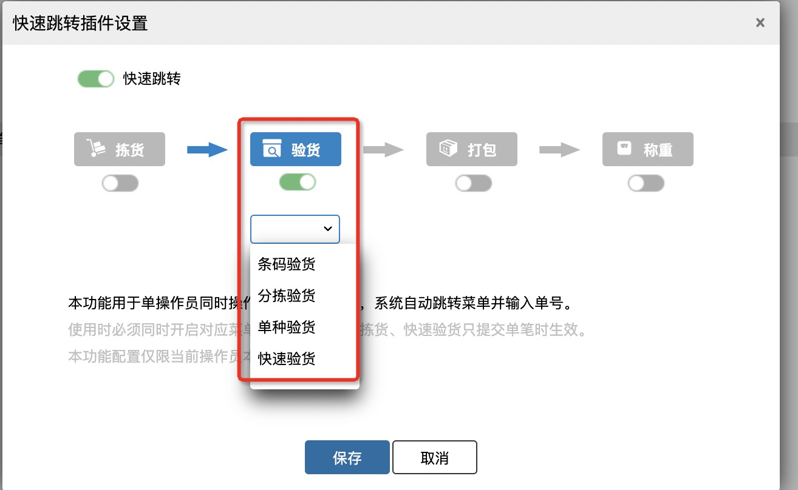

> 更新: 2023-12-18 14:00:58  

> 原文: <https://hupun.yuque.com/unzko7/lsbfg0/axgc1987rimmk2u4>

---

### 05.3.3 待验货

> 原始文件来源：`00-源文件/操作手册/出库_B2C/验货/待验货.md`

#### **01、查询界面**

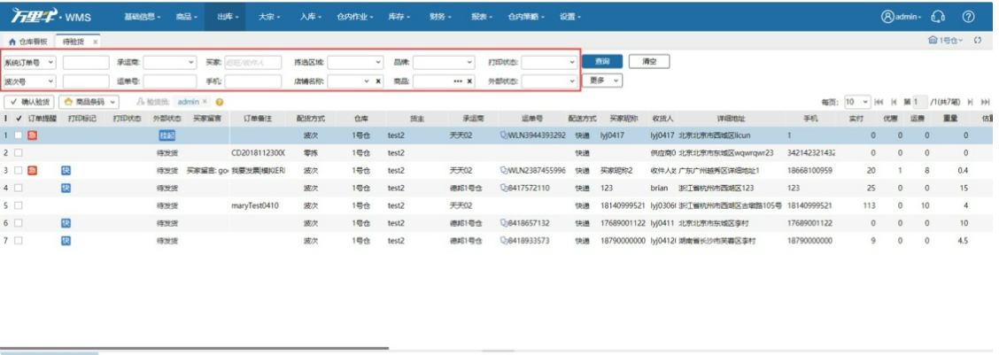

可在查询界面选择不同条件进行待验货订单查询。（单号支持批量查询，最多200个）

#### **02、验货**

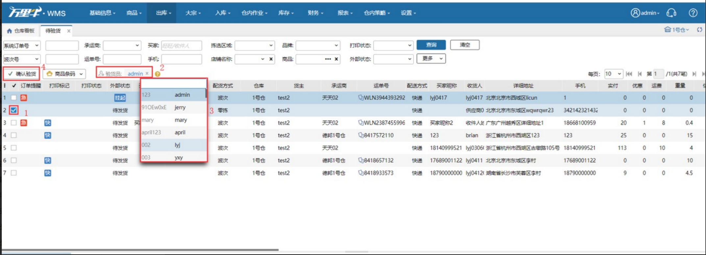

1.勾选一个或多个订单点击确认验货即可快速通过验货环节。

2.验货员默认为当前操作员，可点击进行更改选择，选择操作员后相应验货绩效将计入该操作员。

> 更新: 2024-02-02 16:28:51  

> 原文: <https://hupun.yuque.com/unzko7/lsbfg0/snsn1zcza523yrf9>

---

### 05.3.4 快速验货

> 原始文件来源：`00-源文件/操作手册/出库_B2C/验货/快速验货.md`

快速验货页面，可以扫描多个单号进行快速验货。操作步骤见下图。

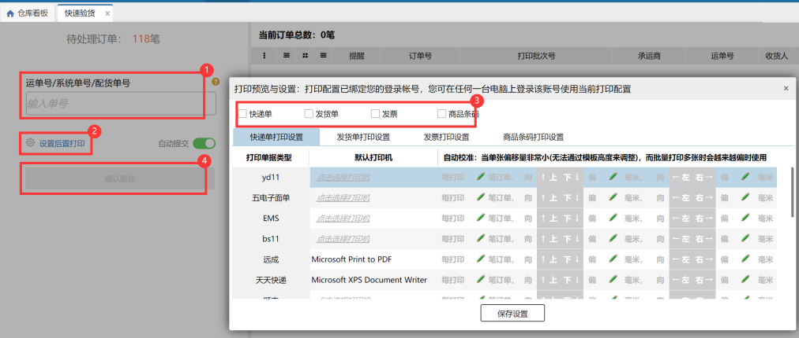

**提示：**

1、仓内策略--流程配置，开启快速验货后提交至待出库，订单确认验货后可直接触发发货，并提交至待出库环节。

2、扫描的多个单号，有一笔订单想要移除，则点击移除按钮即可。

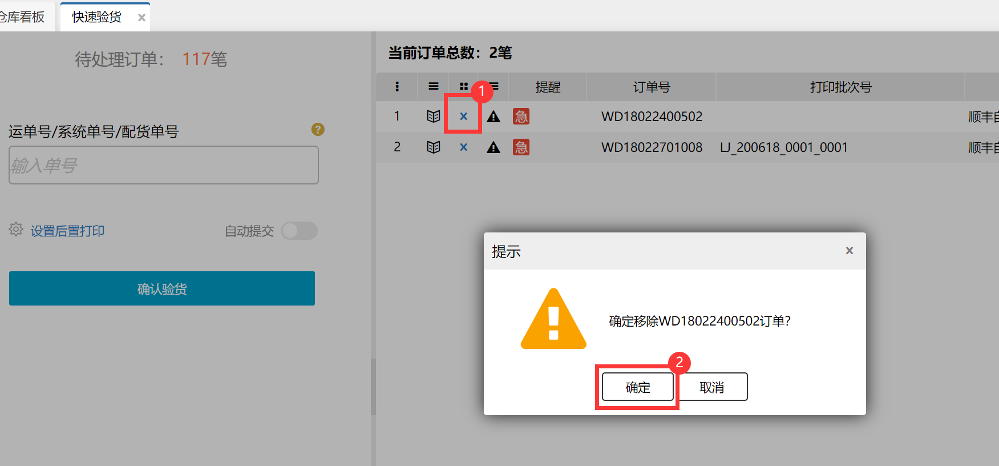

3、开启页面上的后置打印，确认验货后若是电子面单快递订单会自动生成单号和打印快递单，若选择发票则可以后置打印发票或选择发货单进行打印。

4、录入序列号

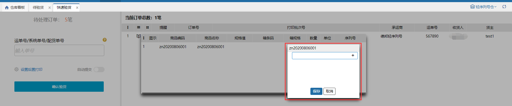

①.标准模式：录入序列号必须是当前商品未锁定的。

②.简洁模式：录入序列号可以是当前商品未锁定的，也可以是系统中不存在的。录入系统中不存在的后，该序列号自动添加当前商品的库存总量里且是锁定状态

5、页面设置

勾选验货明细按批次粒度显示，有锁定多个批次的明细会按照不同批次分多条数据展示

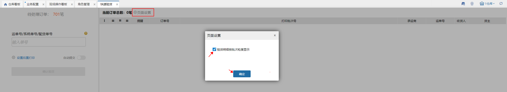

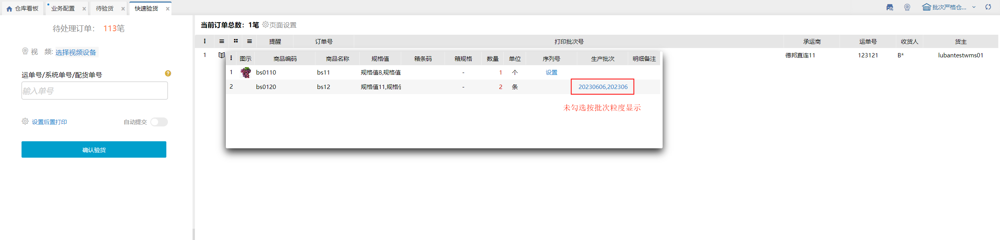

> 更新: 2023-12-18 14:02:28  

> 原文: <https://hupun.yuque.com/unzko7/lsbfg0/doib8dv17aamv5ep>

---

### 05.3.5 抽检验货

> 原始文件来源：`00-源文件/操作手册/出库_B2C/验货/抽检验货.md`

同品、预配波次有大批量相同明细的单据，如若批量验货则容易出现整个波次拿错货的情况，所以需要对其中一单进行抽查检验，由于同品订单在打印时往往是连着打，那么撕单时就可能撕错，就导致发错货，因此在抽检的时候抽检方式也需要多样化。

1.点击抽检验货按钮，扫描同品/预配波次的波次号匹配订单。

①待处理订单：同品/预配波次的订单数。

②可选择验货模式有：普通抽检、首尾验货、随机验货，作业模式记忆为仓库+操作员上。

③输入框：普通抽检不显示订单号/快递单号，右边订单信息为空；未开启耗材管理-实际使用-验货环节，不显示耗材条码输入框。

④设置后置打印：支持后置打印快递单、发货单、发票、商品条码、平台标签。

⑤自动提交：开启耗材管理-实际使用-记录多个耗材，自动提交不生效。

⑥补打单据：支持补打快递单。

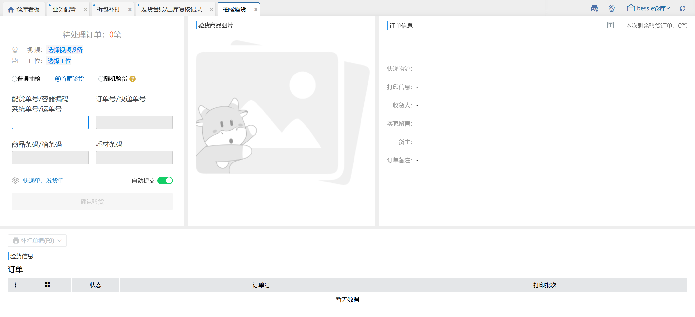

2.选择验货模式

1）普通抽检

场景：无需确认订单，直接验其中一单的商品

①波次中共3笔订单，每笔订单明细均为bs0100：数量2个。

②扫描商品条码，验货波次的其中一单。

③商品验货完成，显示推荐耗材。

④可输入耗材条码，在实际耗材记录中展示。

⑤确认验货，提交整笔波次验货完成。

2）首尾验货

场景：需要扫描波次首单和尾单，然后再扫商品验货，主要预防撕错单

①扫描波次后，订单信息显示首单信息，需先完成首尾单校验，再验商品。

②其他操作与普通抽检一致。

3）随机验货

场景：打单贴单人较多，随机扫几个看看单子对不对，主要预防撕错单+打印中途换纸+一个波次多人操作人工分错等

①扫描单号后，可录入一笔或多笔波次内任意订单的系统单号/运单号匹配订单，录入后订单显示完成，再验商品。

②其他操作与普通验货一致。

3.验货核对批次

开启验货核对批次-抽检验货后，验货步骤分为校验订单--核对批次两个步骤，其中校验订单的方式和上述三种模式一致，核对批次的方式如下，以首尾验货为例。

①.手动选择核对

扫描波次后，订单信息显示首单信息，需先完成首尾单校验，再验商品：

扫描商品条码后，若有多个批次号，则弹窗选择生产批次，选择后增加已验数量，若只有1个批次号，则直接增加已验数量：

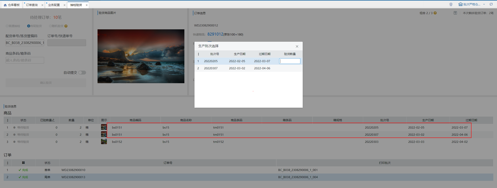

每个组合核验完成后，会自动切换显示下一个组合，并刷新“组合”和“本次剩余验货订单”数据，直到最后一个组合核验完成后，可以录入耗材或提交整个波次。

组合：指在波次订单中，如果商品批次号不同，那么订单中出现不同的批次搭配都记为一种组合。

例：波次中有4个订单，订单1 明细a 锁定批次01 数量1 批次02 数量2，订单2 明细a 锁定批次01 数量3，订单3 明细a 锁定批次01 数量2 批次02 数量1，订单4 明细a 锁定批次01 数量1 批次02 数量2

上述波次共有3个组合：组合1：明细a 锁定批次01 数量1 批次02 数量2，共2个订单；组合2：明细a 锁定批次01 数量3，共1个订单；组合3：明细a 锁定批次01 数量2 批次02 数量1，共1个订单

②.扫描批次号核对

扫描波次后，订单信息显示首单信息，需先完成首尾单校验，再验商品

每次扫描生产批次商品，都会弹窗选择生产批次，可以手动输入批次号+回车，或者双击选中批次号：

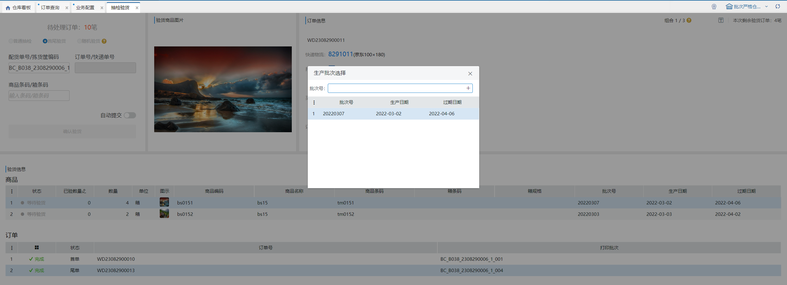

每个组合核验完成后，会自动切换显示下一个组合，并刷新“组合”和“本次剩余验货订单”数据，直到最后一个组合核验完成后，可以录入耗材或提交整个波次。

> 更新: 2024-11-18 16:48:02  

> 原文: <https://hupun.yuque.com/unzko7/lsbfg0/skagrpfegnetmcgp>

---

### 05.3.6 播种验货

> 原始文件来源：`00-源文件/操作手册/出库_B2C/验货/播种验货.md`

播种验货，可以帮助用户使用料框模式盲扫商品来验货，当扫到的商品匹配上订单后，对应的框号会在右侧显示，用户只需要将商品放入对应的播种框中。

具体页面如下：

**提示：**

1. 首先应该扫描配货单号或者波次号，则会显示出来该配货单有多少笔订单是待验货的；

2. 扫描商品条码，则右边有显示出来对应的料筐号，且下面对应的播种框下的数字会改变，用户只需将商品放入对应的播种框中即可；

3.播种验货需要一个播种里的所有订单都验货完成才允许提交至下个环节；

4.开启页面上的后置打印，确认验货后若是电子面单快递订单会自动生成单号和打印快递单，若选择发票则可以后置打印发票；

5.在仓内策略–业务配置，开启商品条码截取，扫描输入截取的商品条码会与商品信息的条码进行对比校验；

①.选择特殊信息截取，扫描输入++前的条码，系统会与订单商品信息的条码进行对比校验；扫描输入不含特殊字符的全量条码可直接匹配商品，扫描输入包含++字符的全量条码，无法匹配到商品信息。

②.选择条码位数截取，扫描输入前若干位条码，系统会与订单商品信息的条码进行对比校验；扫描输入全量条码，无法匹配到商品信息。

6.在仓内策略–业务配置，开启验货前置发货，则确认验货后订单会通知对应erp显示发货。

7.若操作员验货到一半因为各种原因无法继续验货，则在刷新页面后重新输入配货单号，系统会提示“是否继续上一次操作”，若点击是则继续上次操作，点击否则需要重新验货。

8.PC端如验货一半因为各种原因无法继续验货，可在PDA上通过播种验货功能继续验货。

9.语音播报可关闭。

10.录入序列号

①.标准模式：录入序列号必须是当前商品未锁定的。

②.简洁模式：录入序列号可以是当前商品未锁定的，也可以是系统中不存在的。录入系统中不存在的后，该序列号自动添加当前商品的库存总量里且是锁定状态。

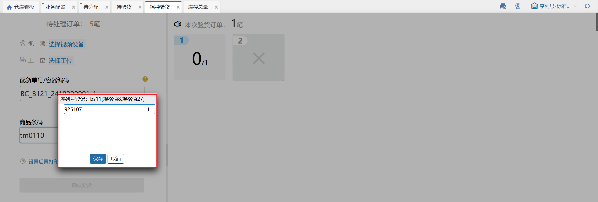

11.验货核对批次

①.手动选择核对

扫描商品条码后，若有多个批次号，则弹窗选择生产批次，选择后增加已验数量，若只有1个批次号，则直接增加已验数量：

②.扫描批次号核对

每次扫描生产批次商品，都会弹窗选择生产批次，可以手动输入批次号+回车，或者双击选中批次号：

> 更新: 2025-04-29 16:17:45  

> 原文: <https://hupun.yuque.com/unzko7/lsbfg0/ipamxiqqed6l9gf1>

---

### 05.3.7 条码验货

> 原始文件来源：`00-源文件/操作手册/出库_B2C/验货/条码验货.md`

条码验货环节，方便用户扫描订单的商品。具体操作如下图所示。

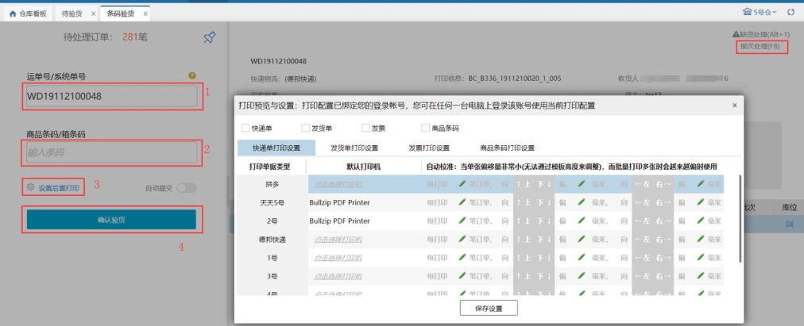

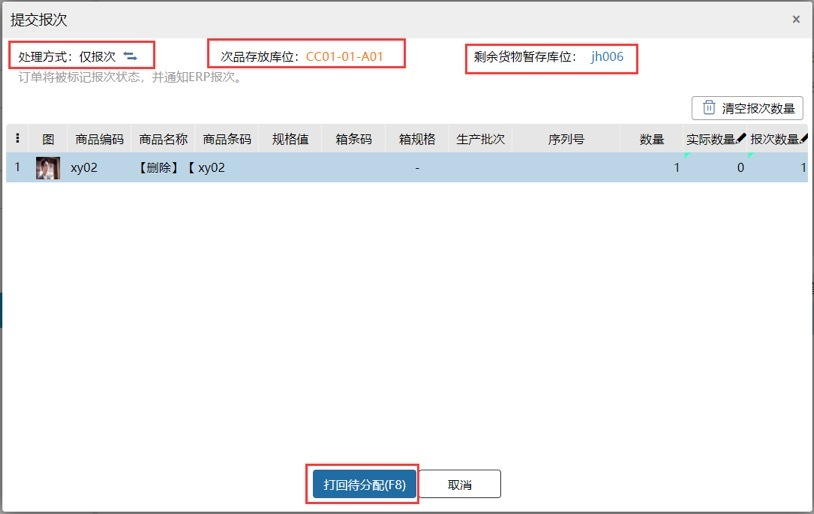

#### 1.条码截取

在仓内策略–业务配置开启商品条码截取，扫描输入截取的商品条码会与商品信息的条码进行对比校验；

①.选择特殊信息截取，扫描输入++前的条码，系统会与订单商品信息的条码进行对比校验；扫描输入不含特殊字符的全量条码可直接匹配商品，扫描输入包含++字符的全量条码，无法匹配到商品信息。

②.选择条码位数截取，扫描输入前若干位条码，系统会与订单商品信息的条码进行对比校验；扫描输入全量条码，无法匹配到商品信息。

#### 2.后置打印

开启后确认验货后若是开启电子面单的快递订单会自动生成单号和打印快递单，若选择发票则可以后置打印发票。

#### 3.自动提交

若开启，当所有已验数量等于所有商品数量时，会自动提交至下一环节。

#### 4.强制提交

当已验数量小于商品数量时，点击确认验货可强制提交至下一环节；在仓内策略–业务配置，开启扫描条码强制提交后，无需点击确认验货，扫描wanliniu666可强制提交至下一环节。

#### 5.赠品免验

在仓内策略--业务配置，开启赠品类型商品免验货，扫描系统订单号或运单号，赠品类型的商品已验数量自动填充。

#### 6.条码验货报次

##### 6.1 报次配置

业务配置-其他配置-次品库存开启订单验货报次开关，条码验货显示报次按钮。若订单只锁了规格箱不允许报次；若订单锁规格箱+零散的允许报次；点击报次按钮或F8进入报次页面。

##### 6.2 报次页面

①.选择处理方式仅报次或报次并拆单。

②.设置残次品存放库位和剩余非残次品存放库位；残次品库位选择除了异常暂存库位和工位，其他的都支持；剩余非残次品存放库位只能选择异常暂存库位。

③.报次数量设置，序列号商品的报次数量不可编辑，扫描序列号后会自动增加报次数量；非序列号商品的报次数量可以正常编辑。

##### 6.3 打回待分配逻辑

①.未勾选复核库存总量/库位库存不足，执行缺货上报，正常打回待分配且订单缺货了也不会通知erp缺货；

②.勾选复核库存总量/库位库存不足，执行缺货上报，打回待分配时若缺货会提示库存总量/库位库存不足，点击确定按钮打回待分配并通知erp缺货；

点击取消按钮不报次；

点击取消并打印按钮不报次但打印单据，打印单据是根据后置打印设置的单据，若没有开启则不显示取消并打印按钮，若选择快递单或发票，订单没有运单号或发票信息也不显示取消并打印按钮。

③.打回待分配时订单被挂起，确认异常后仍可以打回待分配；打回待分配时订单被拦截，确认异常后订单关闭。

④.打回待分配时订单中的商品会报次，报次数量即报次页面填写的数量且正次转换和库存调整都会自动新增一个单据。

#### 7.录入序列号

①.标准模式：录入序列号必须是当前商品未锁定的。

②.简洁模式：录入序列号可以是当前商品未锁定的，也可以是系统中不存在的。录入系统中不存在的后，该序列号自动添加当前商品的库存总量里且是锁定状态。

（1）录入序列号适配采集器

前置条件：序列号录入方式选择【扫商品后连续扫序列号录入】时，增加子项：录入后统一校验序列号有效性

勾选后，在录入序列号时不校验有效性，点击保存&<u>已验数量=应验数量</u>时统一校验。若录入序列号都通过校验，则弹窗关闭，序列号录入到明细行；若录入序列号部分/全部未通过校验，则弹窗保留，以列表形式报错，且列表错误序列号标红(有多行重复序列号，首行不标红，其余行标红报错)

#### 8.输入数量设置

①输入验货数量

商品条码开启”输入验货数量“设置后，左侧显示“输入数量”文本框，该输入框可用于快捷填写已验数量。

当扫码商品条码剩余可验数量<=指定数量时，输入数量框置灰，当扫码商品条码剩余可验数量>指定数量时，输入数量框默认为1，可手动修改，填写数量n后回车，对应sku已验数量+n

②仅扫描一次条码，完成该明细验货

商品条码开启”仅扫描一次条码，完成该明细验货“设置后，左侧不显示”输入数量“文本框，扫描条码后自动填充已验数量=数量，明细标记为验货完成。

**注：**

(1)条码验货页面，若未开启允许验货编辑数量，开启设置也不显示输入框

(2)该配置记忆在仓库+操作员上

#### 9.序列号录入方式设置

设置中可勾选序列号录入方式，按扫商品后连续扫序列号录入或者逐个扫商品+序列号录入。

①扫商品后连续扫序列号录入：扫商品条码后显示序列号弹窗，可录入多个序列号，每次录入时校验序列号有效性；

②扫商品连续扫序列号录入+录入后统一校验序列号有效性：扫商品条码后显示序列号弹窗，可录入多个序列号，点击保存时校验序列号有效性；

③逐个扫商品+序列号录入：扫商品条码后录入一个序列号就自动关闭序列号录入弹窗，再次扫商品条码会重新弹出序列号录入弹窗。

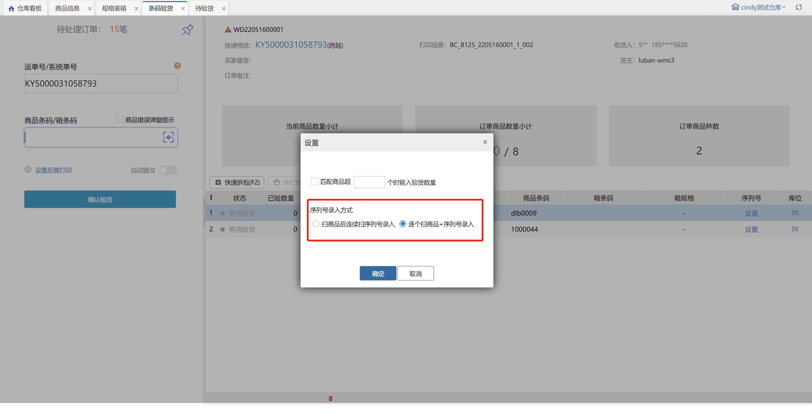

注：开启商品序列号管理+选择序列号出库登记环节：验货才显示序列号录入方式

#### 10.配置扫描顺序

前提：业务配置-开启耗材管理，设置耗材登记环节为“验货”，按实际使用录入耗材。符合前提配置时，页面可配置扫描顺序，否则不支持配置。

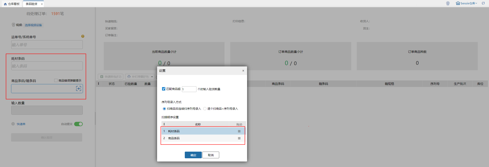

#### 11.业务配置-开启耗材管理

（1）设置耗材登记环节为“验货”时，支持在条码验货页面显示推荐耗材或录入实际使用耗材：

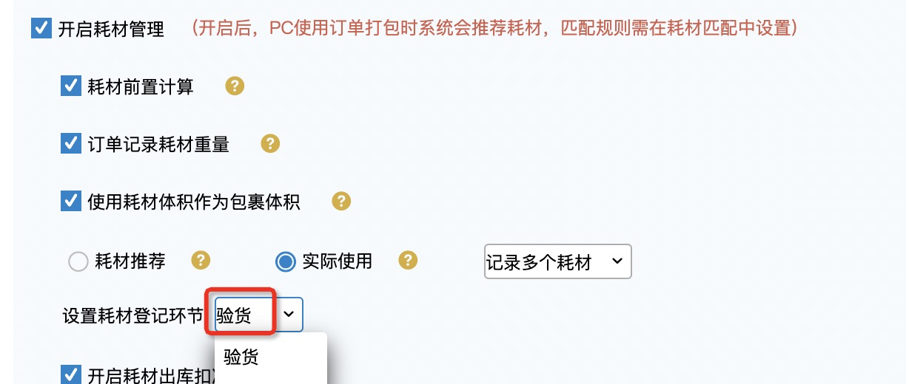

（2）按耗材推荐：

一订单所有明细验货完成后，页面上显示推荐耗材数据以供参考：

（3）按实际使用：订单所有明细验货完成后，页面上显示推荐耗材数据，并支持录入实际使用耗材：

#### 12.验货核对批次

①.手动选择核对

扫描商品条码后，若有多个批次号，则弹窗选择生产批次，选择后增加已验数量，若只有1个批次号，则直接增加已验数量：

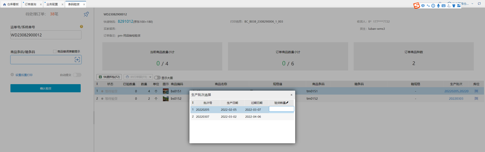

②.扫描批次号核对

每次扫描生产批次商品，都会弹窗选择生产批次，可以手动输入批次号+回车，或者双击选中批次号：

#### 13.页面配置

①启用商品大图：勾选后高亮行明细商品图片会显示大图模式，未勾选时显示小图模式。

②验货明细按批次粒度显示：勾选验货明细按批次粒度显示，有锁定多个批次的明细会按照不同批次分多条数据展示

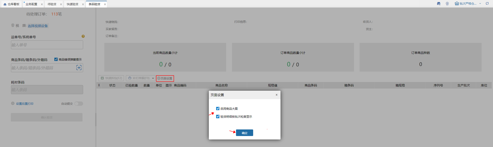

开启显示大图+按批次粒度显示明细效果如下：

未开启显示大图+按批次粒度显示明细效果如下：

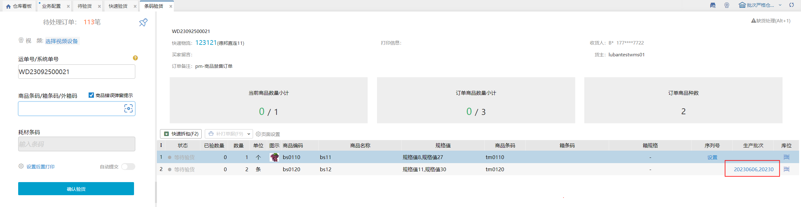

#### 14.跳转拆包装箱

从条码验货跳转到拆包补打页面需要符合以下条件：

- 当前操作员有拆包补打页面权限
- 当前扫描单号有匹配的订单，且未提交验货

快捷键F9或点击按钮可以跳转到拆包补打页面【拆包装箱】模式，系统会自动把单号、录入耗材（若有）、待验明细、已验明细（若有）带到拆包装箱页面。

注：对于不支持拆包装箱的订单，跳转到拆包补打页面后会自动判断并提示，不影响跳转功能。

#### 15.集合码录入

具体内容参考[业务配置](https://hupun.yuque.com/unzko7/lsbfg0/caki7lz4105n2vpg#CKIQO)。

> 更新: 2025-12-19 16:30:24  

> 原文: <https://hupun.yuque.com/unzko7/lsbfg0/pa13n9t9mgwrhbgx>

---

### 05.3.8 自由验货

> 原始文件来源：`00-源文件/操作手册/出库_B2C/验货/自由验货.md`

业务场景：针对一种一件的商品，特别是服装相关行业（订单比例可大于60-70%），希望有比目前系统更加相对便捷简单的拣货、验货方式。希望可以在验货的时候直接扫描商品条码，系统自由匹配订单后置打印出快递单。

自由验货，通过操作员手拿实物去扫商品条码匹配订单，进行验货并后置打印快递单。

具体页面如下：

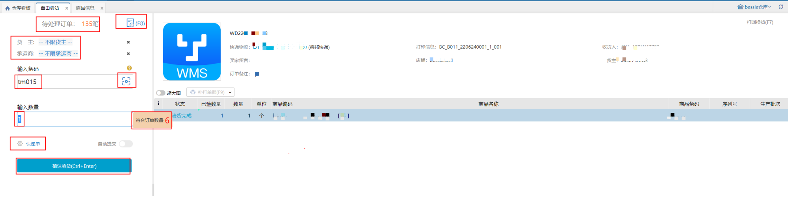

1.先选择货主和承运商，默认选择是不限货主、不限承运商。

2.扫描商品条码，匹配订单并自动验货，提交验货并打印快递单。

3.待处理订单数，是处于待验货且是归属自由波次下的订单数。

4.扫码设置，开启后，若输入条码能够匹配到的订单数量>设定值，则输入数量输入框可编辑，默认数量为1，且页面显示符合订单数量，供用户参考，若输入数量>符合订单数量，报错提示：

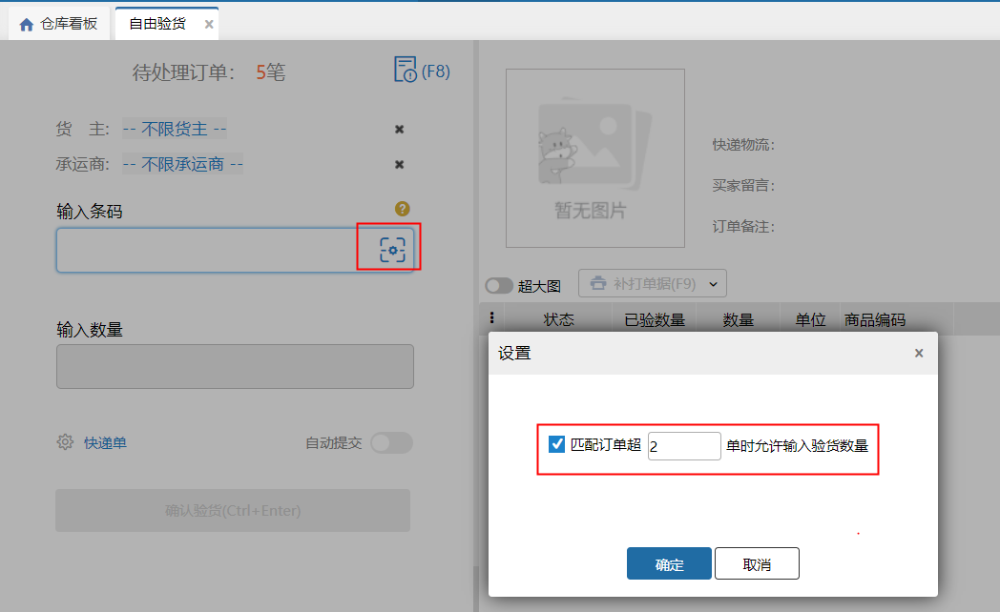

5.生产批次商品，先选择批次再匹配订单，选择的批次是处于待验货且归属自由波次的订单中该商品的批次。例如a商品有01、02、03、04，处于待验货的自由波次有a商品的2笔订单分别是批次01和04，处于待验货的非自由波次有a商品1笔订单批次是02，自由验货，扫描商品a选择批次页面显示01、04。商品明细的生产批次不能修改只能查看。

6.序列号商品，先扫描序列号再匹配订单，商品明细的序列号可以修改。

7.开启条码截取，选择商品再匹配订单，选择的商品是处于待验货且归属自由波次的订单中商品。例如xy01、xy02、xy03、xy04，处于待验货的自由波次中订单的商品有xy01、xy04，扫描xy，选择商品页面显示xy01、xy04。

8.扫描商品条码，拦截的订单会匹配到；挂起的订单会匹配到，确认异常后，就不会匹配了，恢复异常后仍可以匹配到。

9.扫描商品，匹配顺序是标记订单（加急>天猫直送>COD订单>预售订单）>付款时间。

10.自由验货报次                     

10.1 业务配置-其他配置-次品库存开启订单验货报次开关，自由验货显示切换按钮。                   

10.2 验货报次页面，选择货主；设置次品存放库位；扫描次品条码或序列号。                   

10.3 确认报次按钮逻辑校验                 

①.未勾选复核库存总量/库位库存不足，执行缺货上报，正常报次且订单缺货了也不会通知erp缺货；              

②.勾选复核库存总量/库位库存不足，执行缺货上报，确认报次时若缺货会提示库存总量/库位库存不足，点击确定按钮打回待分配并通知erp缺货；点击取消按钮不报次；点击取消并打印按钮不报次但打印单据，打印单据是根据后置打印设置的单据，若没有开启则不显示取消并打印按钮，若选择快递单或发票，订单没有运单号或发票信息也不显示取消并打印按钮。                 

③.确认报次时订单被挂起，确认异常后仍可以打回待分配；确认报次时订单被拦截，确认异常后订单关闭。

④.确认报次时订单中的商品会报次，报次数量即报次页面填写的数量且正次转换和库存调整都会自动新增一个单据。                

11.换货处理：验货时发现商品污损不可出库，通过换货处理打回待分配重新锁库、拣货，正常出库。

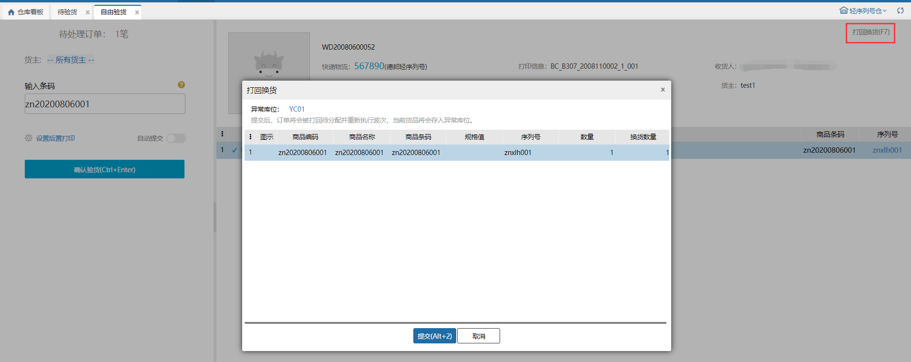

11.1换货数量不可编辑。

11.2提交换货后，订单打回待分配，换货的商品还回异常暂存库位。

11.3拣选库位+存储库位的可用库位库存不足，提示是否继续执行换货操作；选择是则继续打回，否则取消换货，关闭弹窗。

12.录入序列号

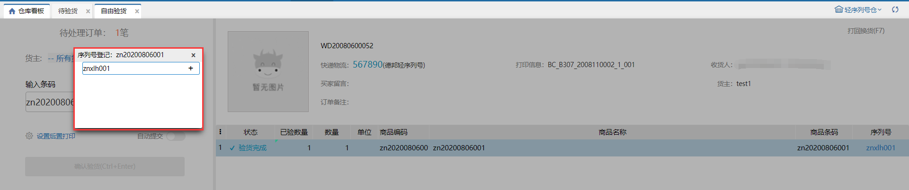

12.1标准模式：录入序列号必须是当前商品未锁定的。

12.2简洁模式：录入序列号可以是当前商品未锁定的，也可以是系统中不存在的。录入系统中不存在的后，该序列号自动添加当前商品的库存总量里且是锁定状态。

12.3简洁模式：不支持扫描序列号匹配订单。

13.支持超大图显示，默认关闭，订单详情增加店铺名称。

14.同时开启赠品免计算和免验情况下，普通商品1个加其他是赠品支持订单进入自由波次，且自由验货被匹配到。

1）扫描普通商品带出订单，扫描赠品不支持匹配订单，赠品显示已验。

2）赠品为序列号/轻批次商品可以在明细上设置修改，设置完成后显示验货完成，可以提交。

3）批量提交显示符合数量为赠品也一致的数量。

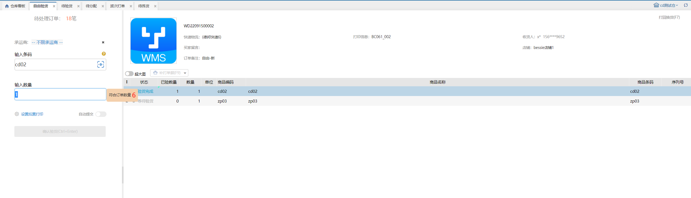

> 更新: 2023-12-18 13:59:17  

> 原文: <https://hupun.yuque.com/unzko7/lsbfg0/czhq7ccedbey1vtn>

---

## 05.4. 打包作业

### 05.4.1 待打包

> 原始文件来源：`00-源文件/操作手册/出库_B2C/打包/待打包.md`

#### **01、查询界面**

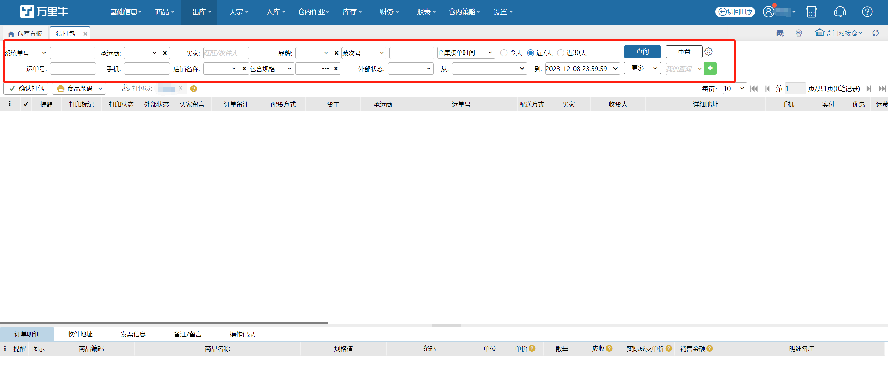

可在查询界面选择不同条件进行待打包订单查询。（单号支持批量查询，最多200个）

#### **02、订单打包**

1. 勾选一个或多个订单点击确认打包即可快速通过打包环节

2. 打包员默认为当前操作员，可点击进行更改选择，选择操作员后相应订单打包绩效将计入该操作员。                     

> 更新: 2024-02-02 16:29:01  

> 原文: <https://hupun.yuque.com/unzko7/lsbfg0/uc54r1q1gc3tnsef>

---

### 05.4.2 批量打包

> 原始文件来源：`00-源文件/操作手册/出库_B2C/打包/批量打包.md`

批量打包页面可输入同品、混品或预配波次号，针对一波订单，批量打包，耗材输入框录入的是一笔订单的耗材，确认打包后，该波次下的所有在打包环节的订单的耗材都更新为此耗材。

1.支持扫描波次号，波次内的系统单号，波次内的运单号匹配波次；扫描波次内的系统单号/运单号，带出波次下所有待打包的订单。

2.当前波次订单总数展示的是波次内待打包的订单笔数。

3.开启耗材管理，设置耗材规则后，会显示系统推荐的耗材。

4.扫描耗材条码支持录入实际使用的耗材。

5.设置后置打印的单据，目前支持快递单、发货单、发票和商品条码的打印，确认打包后若是电子面单快递订单会自动生成单号和打印快递单，若选择发票则可以后置打印发票；选择发货单则可以后置打印发货单；选择商品条码则可以打印出订单中所有商品的条码数量即是商品的数量。

6.开启自动提交后可在扫描运单号后自动提交至下一环节。

7.未开启自动提交时，在仓内策略–业务配置，开启扫描条码强制提交后，无需点击确认打包，扫描wanliniu666可强制提交至下一环节。

①未开启耗材管理时，在运单号扫描框扫描有效；

②开启耗材管理-实际使用时，在耗材扫描框扫描有效。

8.确认打包后，波次内的打包订单全部更新为使用的耗材。

9.耗材管理开启实际使用时，批量打包时，直接确认打包没有扫描实际使用的耗材，取系统推荐的耗材记录在订单上。

> 更新: 2023-12-18 14:03:28  

> 原文: <https://hupun.yuque.com/unzko7/lsbfg0/ouhgvkh4t19hza7b>

---

### 05.4.3 订单打包

> 原始文件来源：`00-源文件/操作手册/出库_B2C/打包/订单打包.md`

#### **01.订单打包**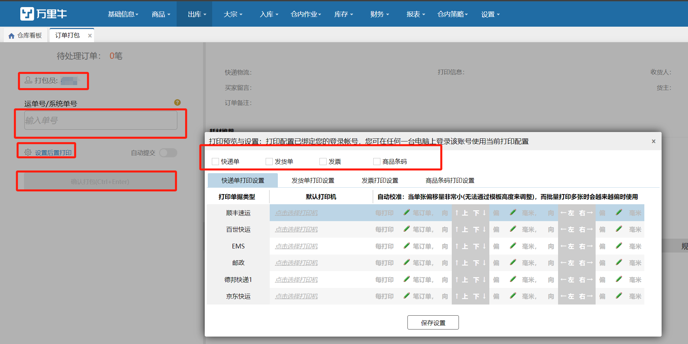

1、设置打包员。

2、设置订单商品信息显示的方式：列表和卡片两种，卡片主要用于根据图片区分商品的业务。卡片如下图显示

3、扫描订单的运单号或对于系统单号均可匹配对应订单。

4、设置后置打印的单据，目前支持快递单、发货单、发票和商品条码的打印，确认打包后若是电子面单快递订单会自动生成单号和打印快递单，若选择发票则可以后置打印发票；选择发货单则可以后置打印发货单；选择商品条码则可以打印出订单中所有商品的条码数量即是商品的数量。

5、确认打包后系统会记录当前操作员打包绩效。

6、开启自动提交后可在扫描运单号后自动提交至下一环节。

7、右上角商品总数为当前订单的商品数总和。

8、未开启自动提交时，在仓内策略–业务配置，开启扫描条码强制提交后，无需点击确认打包，扫描wanliniu666可强制提交至下一环节。

①未开启耗材管理时，在运单号扫描框扫描有效；

②开启耗材管理-实际使用时，在耗材扫描框扫描有效。

> 更新: 2023-12-18 14:03:14  

> 原文: <https://hupun.yuque.com/unzko7/lsbfg0/hk2qtnndqicxk422>

---

## 05.5. 称重作业

### 05.5.1 待称重

> 原始文件来源：`00-源文件/操作手册/出库_B2C/称重/待称重.md`

#### **02、待称重订单查询**

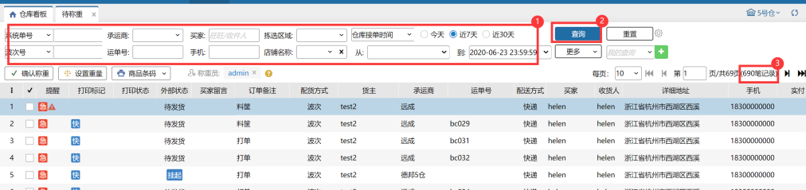

订单根据待称重界面筛选查询条件进行查询，如不选择条件系统默认显示所有当前待称重订单。

#### **02、批量设置体积重量**

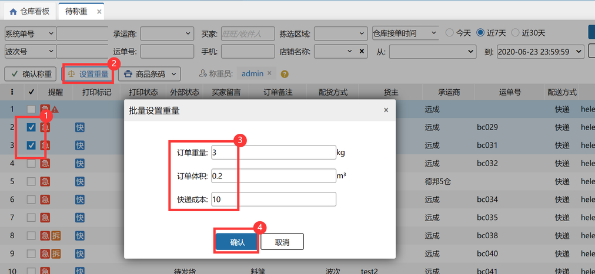

1、首先勾选待操作订单；

2、点击设置重量，在弹出对话框中输入该笔/多笔订单的重量、体积、快递成本等，点击确认保存。如不设置系统默认为0.每次设置仅对当前勾选订单有效；

3、快递成本不输入则系统根据运费规则自动计算。

#### **03、订单称重**

1、勾选需要称重的订单；

2、称重员默认为当前登录账号的操作员，可点击进行更改选择，选择操作员后相应订单称重绩效将计入该操作员；

3、点击确认称重订单进入下一环节。

#### 04、重量校验

1.关联业务配置称重复核校验。

已设置校验，单笔/批量修改订单重量不符合校验值时提示--称重重量与订单估重不符，超出允许范围+/-XXkg/%（或估重为0校验），能否修改成功关联是否有强制提交称重权限。

> 更新: 2023-12-27 10:51:59  

> 原文: <https://hupun.yuque.com/unzko7/lsbfg0/ykziwmz3g5ui80wa>

---

### 05.5.2 批量称重

> 原始文件来源：`00-源文件/操作手册/出库_B2C/称重/批量称重.md`

批量称重页面可输入同品或预配波次号，针对一波订单，批量称重，重量输入框填写的是一笔订单的重量，确认称重后，该波次下的所有订单都更新为此重量，快递成本相应计算更新，订单触发发货程序，提交至待出库环节。

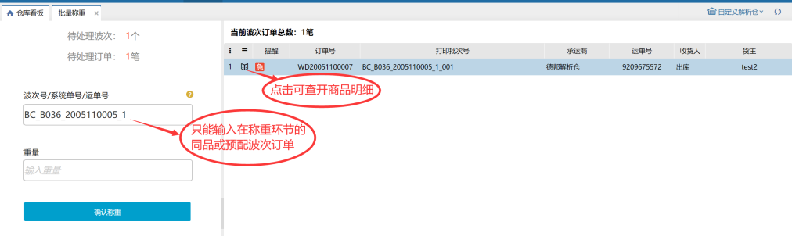

1、若订单发货失败则无法提交至下一环节。若因快递单号为空而发货失败，则可至异常订单页面填写快递，刷新界面重新确认称重发货。

2.关联业务配置称重复核校验。

已设置校验，订单称重时重量不符合校验值则提示--称重重量与订单估重不符，超出允许范围+/-XXkg/%（或估重为0校验），能否继续提交称重关联是否有强制提交称重权限。

> 更新: 2023-12-27 10:51:29  

> 原文: <https://hupun.yuque.com/unzko7/lsbfg0/va83zklk5rkbnh8w>

---

### 05.5.3 称重复核

> 原始文件来源：`00-源文件/操作手册/出库_B2C/称重/称重复核.md`

#### **01.称重**

称重复核环节，用户输入重量，输入单号敲击回车，即可见到订单信息，点击确认称重，订单就提交至下一环节。

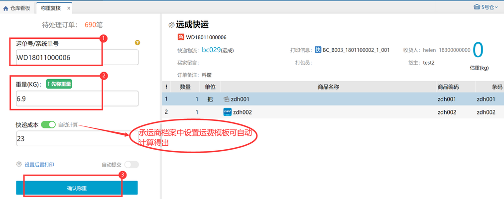

多种选择

1、先扫单号，还是先称重；（点击先扫单号即可切换）

2、自动计算，还是人工计算；  
（自动计算会根据商品信息界面设置的商品重量，或称重环节的重量和快递运费设置，自动计算快递成本；人工计算，需要自己输入快递成本并回车）

3、小诀窍

a、快递单号可以借助条码扫描枪进行快速输入。

b、重量信息可以借助与“万里牛”直接对接的电子秤，可自动称取重量并回写到系统中。

c、快递成本在系统获取到重量数值后，根据预先设定的公式规则自动计算。参见[承运商档案](https://hupun.yuque.com/unzko7/lsbfg0/iki7tkd119nq1bpe)。

#### **02.自动计算重量**

自动计算重量，首先要在商品信息里设置商品的重量，然后设置承运商档案的运费规则。根据商品的重量和预设的运费规则自动计算出重量和快递成本，而不需要开启称重环节。

提示

##### (1)称重两种方式

a、自动称重：需开启称重环节，连接电子秤或手动输入重量；

b、自动计算重量：不需要开启称重环节，设置商品重量，确认审核后自动计算重量；

##### (2)如何自动计算重量和快递成本

a、自动计算重量： 确认审核后，会根据商品明细的重量自动计算出商品的总重量；

b、自动计算快递成本：确认配货后，会根据设置的运费规则自动计算出快递成本；

##### (3)重量哪里看

a、打单配货环节：打印预览发货单可以看到商品的总重量；

b、发货环节：可以看到商品的总重量；

c、订单查询：查询系统状态是打单配货的，可以看到商品的总重量；

##### (4)重要

设置了商品重量，自动称重，就不要开启称重环节了，否则称重的时候会覆盖之前自动计算的重量。

##### (5)提示

a、开启称重后置打印，则电子面单快递订单确认称重后会自动生成单号和打印快递单，若选择发票则可以后置打印发票。

b、在设置-流程配置页面，开启称重复核校验，重量超过误差范围的订单会有提示。

c、开启自动提交，订单在确认称重后会自动提交至下个环节。

#### **03.称重复核**

1、关联业务配置称重复核校验

已设置校验，订单称重时重量不符合校验值则提示--称重重量与订单估重不符，超出允许范围+/-XXkg/%（或估重为0校验），能否继续提交称重关联是否有强制提交称重权限。

2、操作员权限：强制提交称重权限

若没有允许强制称重权限，订单重量和估重的差值大于校验值时，无法提交称重。

#### 04.语音播报

开启语音播报后，默认按线上物流播报，可切换为承运商名称。

注：关联后台开关，未开启时只能选择【线上物流】。

> 更新: 2026-07-21 10:50:25  

> 原文: <https://hupun.yuque.com/unzko7/lsbfg0/ks7ols31xl9k42y5>

---

## 05.6. 出库交接与其他

### 05.6.1 出库单

> 原始文件来源：`00-源文件/操作手册/出库_B2C/出库/出库单.md`

订单出库都会生成一个出库单，也支持直接新增一个线下出库单。

#### **1.查询**

通过查询条件快速查询到出库单。

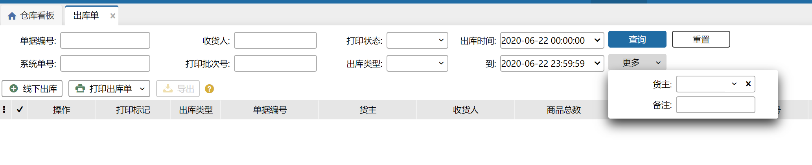

#### **2.线下出库单**

线下店铺出售的商品，不需要走销售流程，可以直接增加线下出库单，保存后直接减库存。

业务场景：客户上门提货，不需要走销售流程，直接新增线下出库单。

开关配置：是后台开关，如果需要开启，找客服开启。

##### (1)新增线下出库单

货主：这个线下出库单是要出售哪个货主的商品。

店铺：当前货主的店铺。

收货人：下订单的用户名称或昵称。

手机号：非必填。

备注：非必填。

选择出售的商品，锁定库位，新增后直接扣减库位库存，并通知万里牛erp，万里牛erp会扣减库存且万里牛erp中的出库单中也可以查看到该笔单据。

注：商品编码选择商品时支持模糊查询，暂不支持序列号和生产批次商品。

##### (2)打印出库单

①、销售订单和线下出库单都是可以在出库单里打印的，打印的时候可以先打印预览，然后再打印，也可以直接打印。目前也新增了打印标记，方便用户了解打印情况。

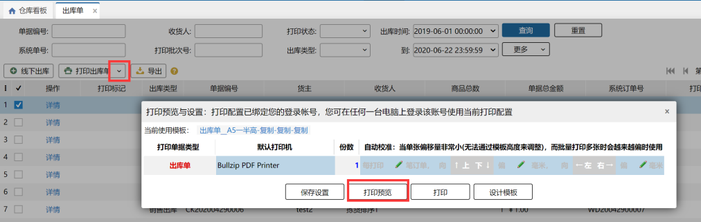

②、线下出库单窗口勾选保存同时打印时，新增线下出库单时也会打印出库单。

##### (3)锁库逻辑

点击一键锁库，选择锁库时的库位类型，锁库时按照库位编码小的>入库批次小的>规格箱>唯一箱>拆零的顺序锁。

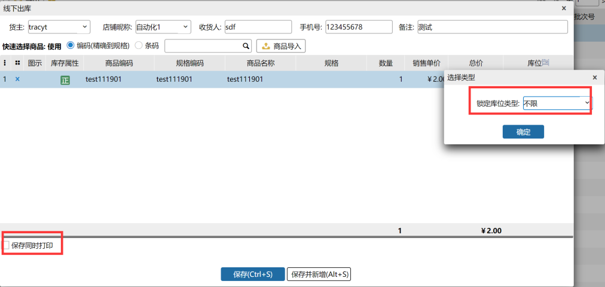

4.出库单详情

查看线下出库单锁定库位，方便拿货。

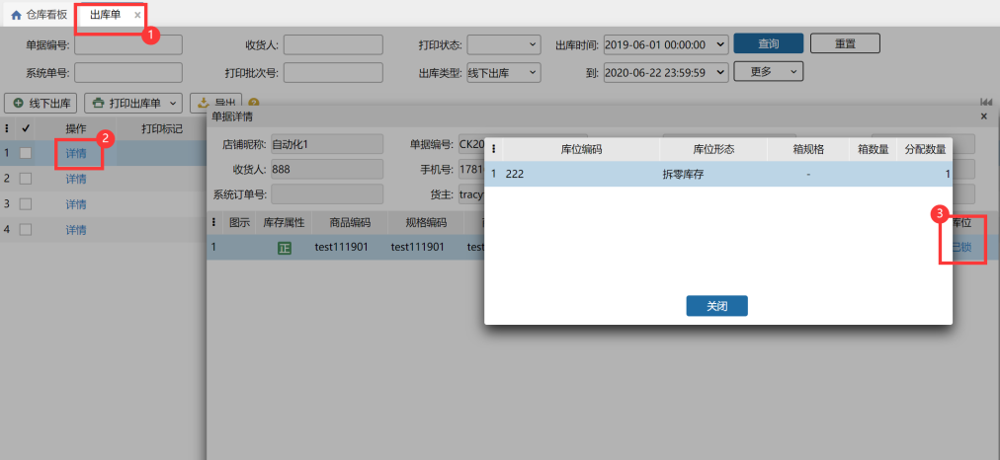

注：只有线下出库单才可以查看库位，其他类型的出库单不能看到库位。

5.商品导入

支持商品导入，最多导入200行，导入时有多行是重复商品，商品数量累加，销售单价取最后一行设置的。

#### **3.导出**

支持出库单导出和序列号商品单独导出。

#### **4.支持残次品出库**

次品商品库存积累一定程度后，根据不同的业务要求需要将次品进行出库返厂或报废折价处理，鉴于当前市场主流ERP不支持标准的残次品处理流程，我们开放了线下【出库单】这一出库渠道，支持分别选择正次品进行出库

1.通过商品编码添加商品时，可以添加正品和次品，直接选择添加。                        

2.  通过商品条码添加商品，默认添加的时正品，勾选添加次品添加次品。                    

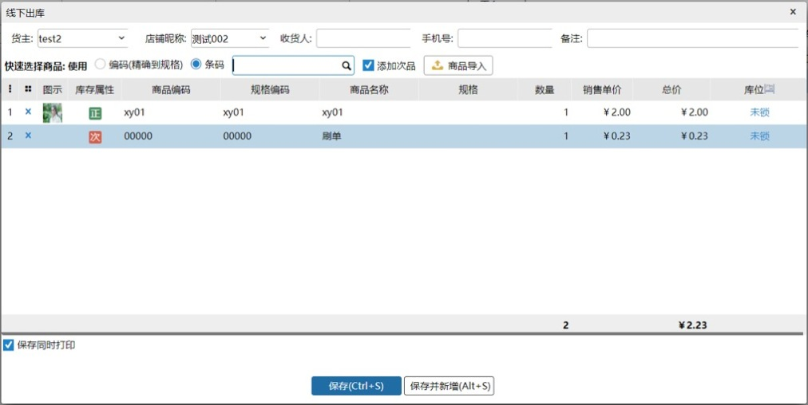

3.锁库时，正品不能锁次品库位和次品库存，次品不能锁正品库存，库位不限。

4.打印支持正品和次品打印，增加库存属性打印项。

5.次品商品的线下出库单WMS里创建完成后是否通知erp，根据选择的次品管理模式。

①.设置次品管理模式是在仓内策略-业务配置-其他配置-开启次品库存管理。

②.选择对内模式，次品商品线下出库单WMS里创建完成后是会通知erp扣减库存和创建出库单。

③.选择半对外模式，次品商品线下出库单WMS里创建完成后不会通知erp扣减库存和创建出库单。

> 更新: 2025-09-01 15:53:26  

> 原文: <https://hupun.yuque.com/unzko7/lsbfg0/tfpk4bz8ehnhdz57>

---

### 05.6.2 已出库

> 原始文件来源：`00-源文件/操作手册/出库_B2C/出库/已出库.md`

业务场景：日常发货后常有用户要求更换其他快递，或者快递揽件后退回的情况。在已出库页面可以修改快递或单号。

已出库页面查询的是最近7天出库的订单，可以在该页面修改快递、生成单号和打印快递单。

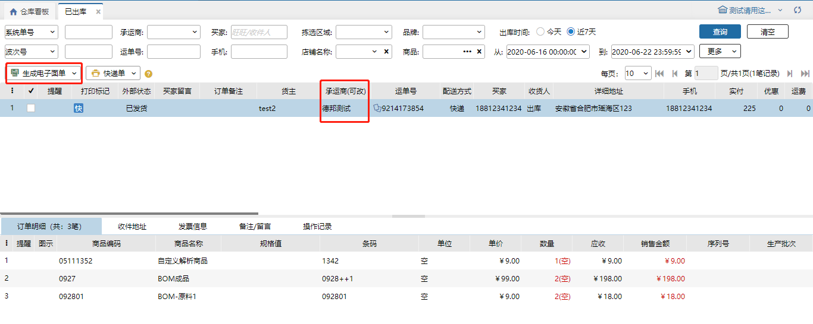

**提示：**

1.修改后会回传erp，仅对万里牛erp有效。

2. 只有单号变化后才会重新回传erp，只修改快递或快递成本都不会回传erp，单号变化后才会回传erp。

3.生成子母件或大宗装过箱的订单不允许修改快递。

4. 替换承运商/回收电子面单时，已打印快递单的订单会弹窗提示：该订单已打印快递单，若继续修改请销毁已打印面单；点击继续按钮，替换承运商/回收电子面单，点击取消按钮，不替换承运商/回收电子面单。  

 

> 更新: 2025-12-19 15:22:09  

> 原文: <https://hupun.yuque.com/unzko7/lsbfg0/we1k1x822ni3k0gg>

---

### 05.6.3 待出库

> 原始文件来源：`00-源文件/操作手册/出库_B2C/出库/待出库.md`

待出库页面为在待出库环节的订单列表。用户可勾选多笔订单，点击确认出库。

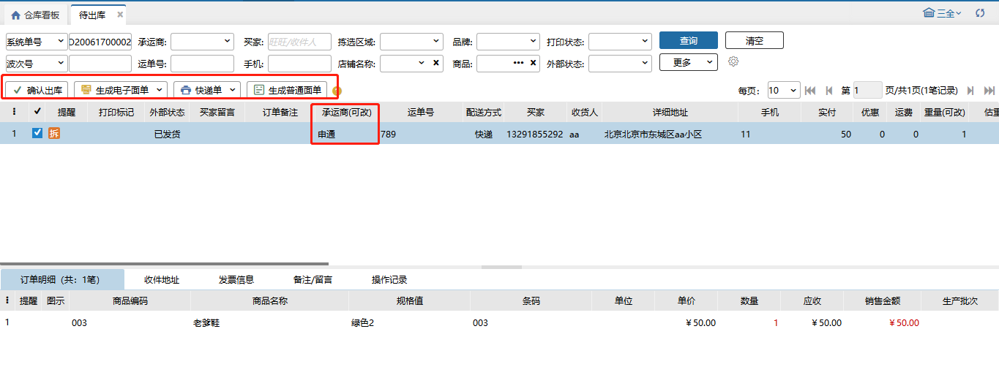

**提示:**

1、若订单未发货成功（因关闭称重环节移至待出库环节的），点击确认出库会触发发货程序。

2、仓内策略--流程配置，开启自动出库，系统自动每5min触发出库程序。发货失败超过5次，不再自动出库。

3.已发货的订单可以修改快递、单号、快递成本，只有单号变化后才会重新回传erp，只修改快递或快递成本都不会回传erp，单号变化后才会回传erp。

4.生成子母件或大宗装过箱的订单不允许修改快递。

5.仅对万里牛erp有效。

> 更新: 2023-12-18 14:08:30  

> 原文: <https://hupun.yuque.com/unzko7/lsbfg0/qoyamxvcfmene1a4>

---

### 05.6.4 扫描出库

> 原始文件来源：`00-源文件/操作手册/出库_B2C/出库/扫描出库.md`

用户可针对一笔订单扫描单号确认出库。操作步骤见下图。

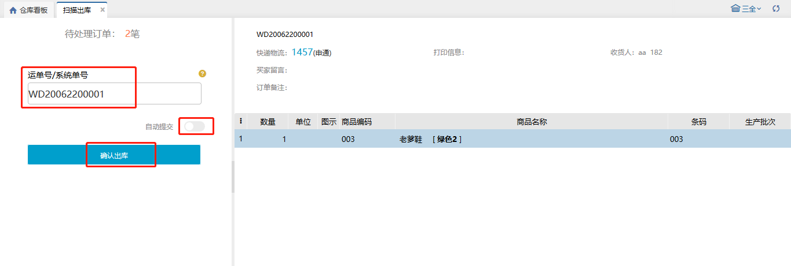

**提示:**

1、若订单未发货成功（因关闭称重环节移至待出库环节的），点击确认出库会触发发货程序。

2、仓内策略--流程配置，开启自动出库，系统自动每5min触发出库程序。发货失败超过5次，不再自动出库。

> 更新: 2023-12-18 14:08:49  

> 原文: <https://hupun.yuque.com/unzko7/lsbfg0/fgimc8bt03f4nx16>

---

### 05.6.5 批量出库

> 原始文件来源：`00-源文件/操作手册/出库_B2C/出库/批量出库.md`

用户可扫描多笔订单确认出库。操作步骤见下图。

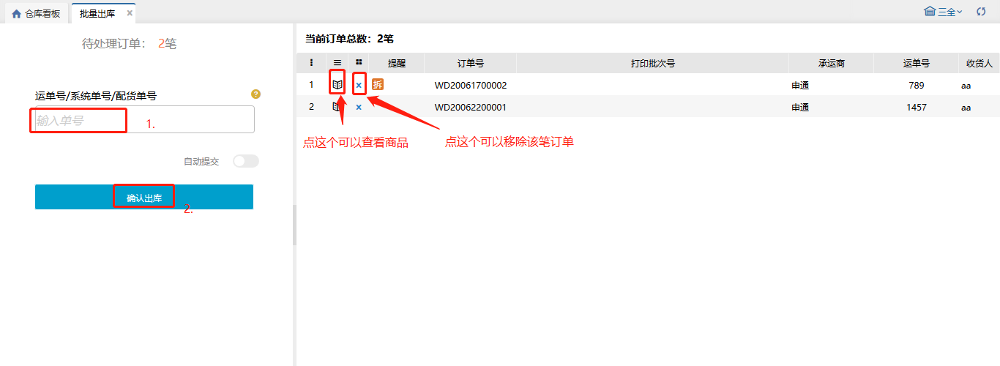

**提示:**

1、若订单未发货成功（因关闭称重环节移至待出库环节的），点击确认出库会触发发货程序。

2、仓内策略--流程配置，开启自动出库，系统自动每5min触发出库程序。发货失败超过5次，不再自动出库。

> 更新: 2023-12-18 14:09:03  

> 原文: <https://hupun.yuque.com/unzko7/lsbfg0/fqsvhhuwpgr46hld>

---

### 05.6.6 承运商交接

> 原始文件来源：`00-源文件/操作手册/出库_B2C/出库/承运商交接.md`

承运商交接，用于仓库订单已出库时，记录是否有完成承运商交接。只要在这个页面有完成交接，则系统认为该订单已经交接到承运商处。具体操作如下：

1、先选择好承运商，输入运单号，然后点确认交接。 如果想自动提交，就把自动提交的开关开启。

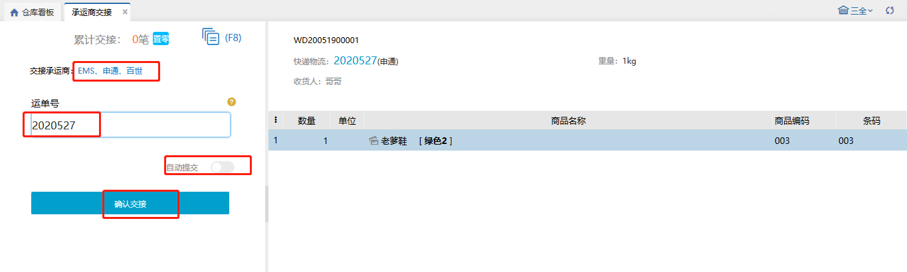

2、点F8哪里或者电脑上点F8按键，会变成按波次号来进行交接的页面。选择对应得承运商输入波次号点确认交接。如果想自动提交，就把自动提交的开关开启。

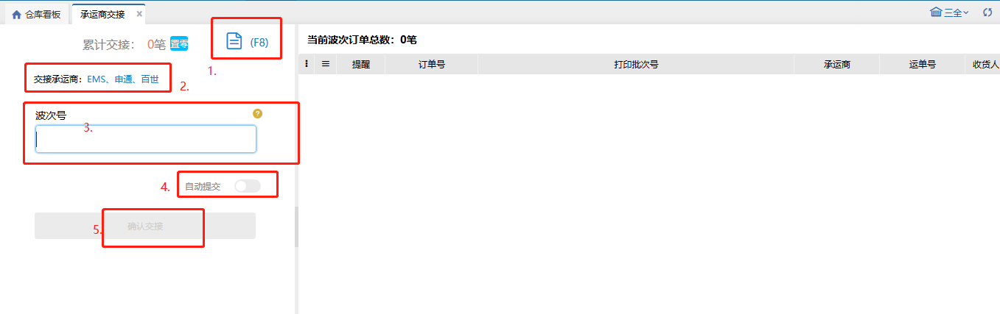

**提示**

1.选择承运商默认为全部，输入的运单号必须对应输入选择的承运商；

2.输入运单号的订单必须在待出库或已完成环节，否则无法交接；

3.点击置零可以将此操作员目前选择的承运商的交接记录笔数置零；

4.同一个承运商的同一个运单号在两个月内只能交接一次，两个月内交接过的运单号不允许再次被确认交接；

5.开启自动提交，扫描运单号后确认正确则自动提交。

> 更新: 2023-12-18 14:09:20  

> 原文: <https://hupun.yuque.com/unzko7/lsbfg0/bwdsbdwicbkx69hd>

---

### 05.6.7 出库改单

> 原始文件来源：`00-源文件/操作手册/出库_B2C/其他/出库改单.md`

#### 使用场景

出库改单主要用来用户推送订单到wms中发现商品错了，可以直接在wms中修改商品不需要在erp修改后重新下单，缩短了流程。也常用于服装类目中，订单中sku库存不足，改码发货的场景。

#### 01.改单

##### (1) 全部换商品

下单时订单中的商品是A，推到wms中发现订单中商品填写错误，可以把商品A换为商品B。

选择一个订单点击“改单”，在改单窗口，点击商品编码处修改商品，设置商品锁定的库位，选择原商品还回的库位，确认后改单成功并通知erp，具体步骤如图所示。

##### (2)部分换商品

订单需要5件商品A（L码），拿货时发现只有3件商品A（L码），但商品A（XL码）充足，把5件商品，拆分为3件A（L码）+2件A（XL码）。

选择一个订单点击“改单”,在改单窗口，点击“拆”，输入数量点确定后会出来选商品得页面，选择要换得商品。设置商品的库位，选择原商品还回的库位，确认后改单成功并通知erp，具体步骤如图所示。

 

**提示**

①.销售出库单、大宗订单都支持，调拨出库、其他出库类型的订单不允许改单；

②.生产批次商品和序列号商品不支持，只支持普通商品；

③.拣货之后的环节都需要异常还回；

④.换商品的过程，数量不会增也不会减，只有商品的变化；

⑤.锁库不变，库位总量和库位库存扣减是在确认改单时；

⑥.对接伯俊ERP的调拨出库、其他出库单不允许改单，只允许改地址

##### (3）商品生产批次管理标准模式下改单

业务配置开启生产批次管理标准模式，订单包含生产批次商品时，不支持出库改单；

##### (4) 改地址

收件地址支持手动修改和识别。在详细地址中输入需要识别的信息后，点击识别，系统自动解析出对应信息并填充，红字为识别出的信息，点击保存生效。

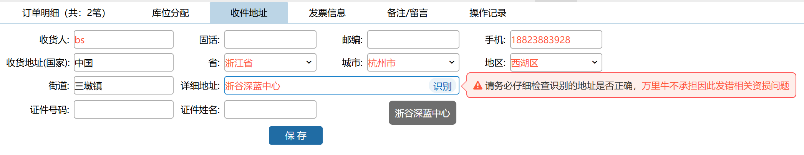

##### (5) 改承运商

替换承运商/回收电子面单时，已打印快递单的订单会弹窗提示：该订单已打印快递单，若继续修改请销毁已打印面单；点击继续按钮，替换承运商/回收电子面单，点击取消按钮，不替换承运商/回收电子面单。

#### 02.打印

勾选某笔订单点击相应按钮，即可打印快递单、发货单、配货单。

> 更新: 2026-04-14 10:52:01  

> 原文: <https://hupun.yuque.com/unzko7/lsbfg0/enxgs9wtoloa3zun>

---

### 05.6.8 出库组包

> 原始文件来源：`00-源文件/操作手册/出库_B2C/其他/出库组包.md`

组包是物流与供应链履约中，将多个小件合并为一个大件或按流向 / 规则整合为 “包裹组” 的作业模式，核心是降本、提效、合规与适配平台规则，在国内快递通常是快递方按照集包地进行组包，而在跨境托管场景中则为核心履约环节。出库组包页面主要用于组包创建、修改及作废等相关操作，具体操作如下。

#### 页面布局

出库组包页面及功能区域如下图所示：

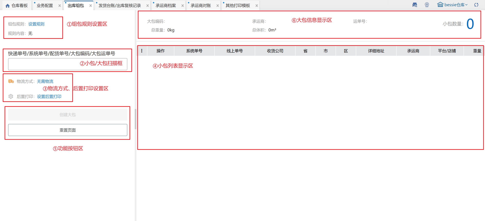

##### ①组包规则设置区

初始页面默认无组包规则，若组包不限分组条件，符合扫描范围的订单都可以添加到小包列表中；若要指定分组条件，可以点击设置规则，按需设置不同分组条件，这样在扫描时会根据选择的规则进行筛选，符合规则的可以添加到小包列表，不符合的有相应提示，不会添加到小包列表中。

**组包规则设置**

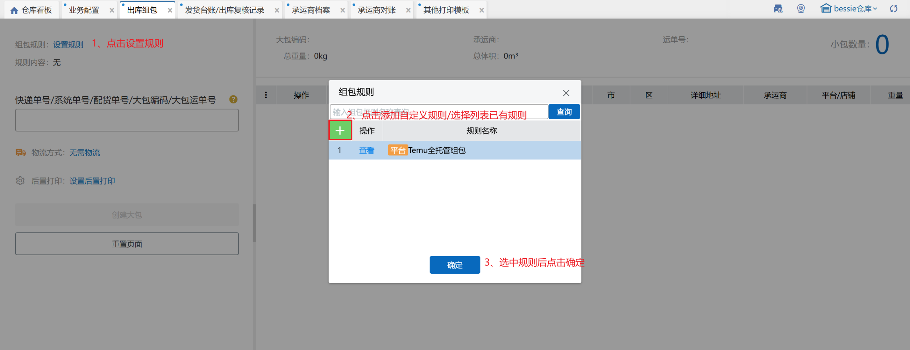

**平台规则**

平台规则是系统预设规则，带有【平台】标识，支持查看，不支持修改和删除。选择平台规则后创建大包，属于平台组包。

**新增自定义规则**

点击+新增规则，设置分组包括货主、平台/店铺、收货地址、收货公司、承运商，设置后点击保存即可。选择自定义规则或无规则创建大包，属于非平台组包。

以货主为例：分组不限+范围所有货主，即扫描不同货主的订单都可组成同一个大包；

分组不限+范围指定货主，即扫描货主需在指定范围内才允许组成同一个大包；

相同货主+范围所有货主，即扫描相同货主的订单才允许组成同一个大包，以扫描的第一个订单货主为分组依据；

相同货主+范围指定货主，即扫描相同货主且在指定范围内的订单才允许组成同一个大包，以扫描的第一个订单货主为分组依据。

以收货地址为例：分组不限+范围所有地区，即扫描不同地区的订单都可组成同一个大包；

分组不限+范围指定地区，即扫描地区需在指定范围内才允许组成同一个大包；

相同地区+范围所有地区，即扫描相同地区的订单才允许组成同一个大包，以扫描的第一个订单收货地区（省市区）为分组依据；

相同地区+范围指定地区，即扫描相同地区且在指定范围内的订单才允许组成同一个大包，以扫描的第一个订单货主为分组依据；

相同地址，即扫描相同地址（省市区详细地址）的订单才允许组成同一个大包，以扫描的第一个订单收货地址为分组依据。

以收货公司为例：分组不限，即扫描不同收货公司的订单都可组成同一个大包；

相同收货公司，即扫描相同收货公司的订单才允许组成同一个大包，以扫描的第一个订单收货公司为分组依据。

平台/店铺、承运商分组逻辑同货主类似。

**修改自定义规则**

选择需要修改的规则，点击修改并保存即可。

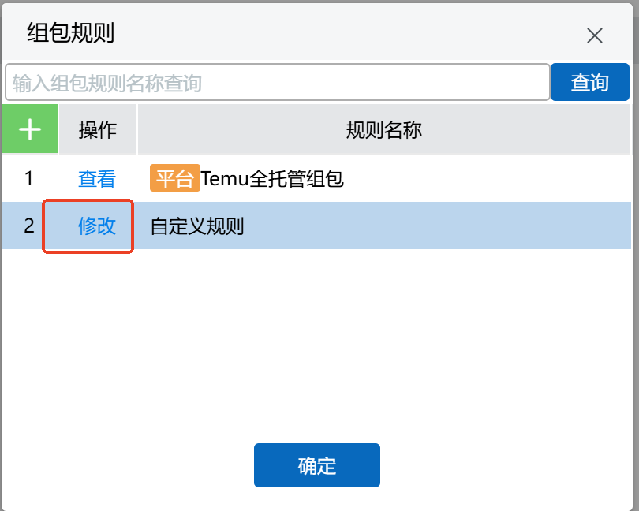

****

**删除自定义规则**

选择需要删除的规则，点击修改-删除并二次确认即可。

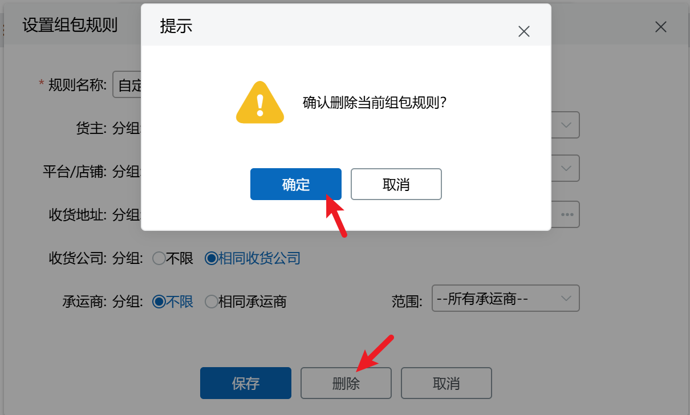

注：最多支持添加20条规则（含平台规则）。

##### ②小包/大包扫描框

小包指未组包的订单，大包指已创建的组包。扫描框支持扫描已出库且未迁移到历史库的订单/波次进行组包操作，或扫描已创建的大包进行修改物流或作废操作。扫描小包需符合当前设置规则，匹配到有效单据后会添加到右侧小包列表中，无匹配或其他异常时会报错提示原因。

扫描单号有多个匹配单据时，可以在弹窗中选择对应单据添加到列表中。

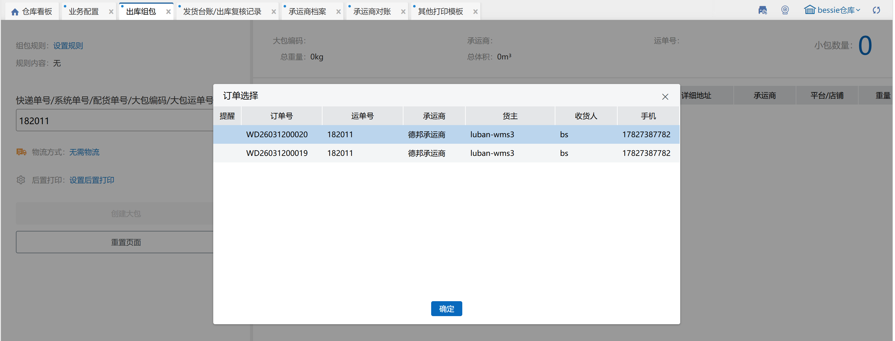

先扫描匹配到大包后，不允许再扫描小包，系统提示如下图，可先重置页面后再扫描小包。

先扫描匹配到小包后，再扫描大包，系统提示如下，可选择切换到大包操作流程或取消。

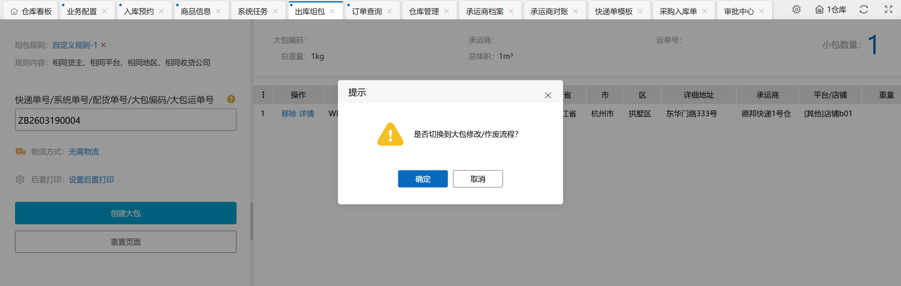

注：小包列表最多支持扫描添加500个订单。

##### ③物流方式、后置打印设置区

平台组包物流方式有两种：仓库自有物流、平台物流；非平台组包物流方式有两种：无需物流，仓库自有物流。

出库组包支持后置打印大包快递单、大包清单。在组包过程中可以按需选择对应物流方式及后置打印单据。

##### ④小包列表显示区

在创建大包时，用于显示已经扫描的小包信息，支持移除小包、查看小包明细详情。

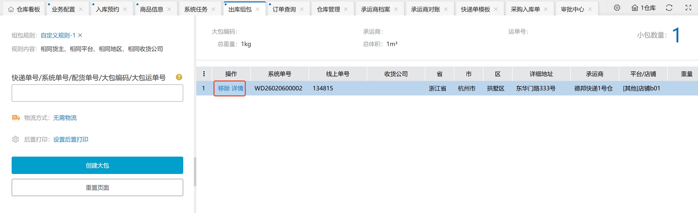

扫描大包编码匹配到小包信息，支持查看小包明细详情，不支持移除。

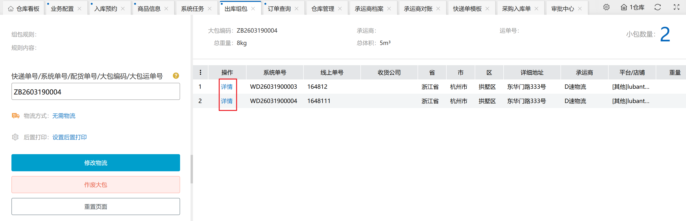

##### ⑤功能按钮区

创建大包：扫描小包单号进行组包时显示此按钮，点击后创建大包。

修改物流：扫描匹配到非平台大包编码时显示此按钮，点击后可修改物流信息。

作废大包：扫描匹配到非平台大包编码时显示此按钮，点击后可作废大包。

重置页面：一键清除页面数据，重新录入新单号。

##### ⑥大包信息显示区

显示大包相关信息，包括大包编码、承运商、运单号、总重量、总体积、小包数量。

#### 创建大包

##### 平台组包

平台组包有默认的平台组包规则，平台组包规则是固定的，只能查看无法修改。

选择平台组包规则后，扫描需要组包的订单号/波次号，选择物流方式及后置打印单据类型后，点击创建大包，在弹窗中填写大包、物流等信息后提交，完成创建大包。

##### Temu全托管组包

物流方式选择“平台物流”，点击创建大包按钮，会弹出“[平台]组包信息确认”，会显示大包信息，物流信息。物流信息中，平台推荐物流需要自行选择，选择物流后会显示可以选择的上门取货时间，选择符合范围的上面取货时间。

点击【确认】，即可完成大包的创建，并根据后置打印的配置，打印出相应的大包清单（ps：平台组包使用平台物流情况下不支持打印快递单），页面会显示组包成功的大包信息。

##### Shein全托管

物流方式选择“平台物流”（Shein全托管只能选择平台物流），点击创建大包按钮，会弹出“[平台]组包信息确认”，会显示大包信息，物流信息。物流信息中，SHEIN发货仓和SHEIN发货地可以下拉选择。选择“预约上门取货时间”后，点击【刷新物流】按钮，会显示平台推荐物流，平台推荐物流需要自行选择，选择物流后即可提交创建大包。

##### 非平台组包

设置自定义规则后，扫描需要组包的订单号/波次号，选择物流方式及后置打印单据类型后，点击创建大包，在弹窗中填写大包、物流等信息后提交，完成创建大包。

物流方式选择“无需物流”，组包确认弹窗仅显示大包信息，无物流信息，创建成功后大包上无承运商和运单号，后置打印出大包清单，无快递单。

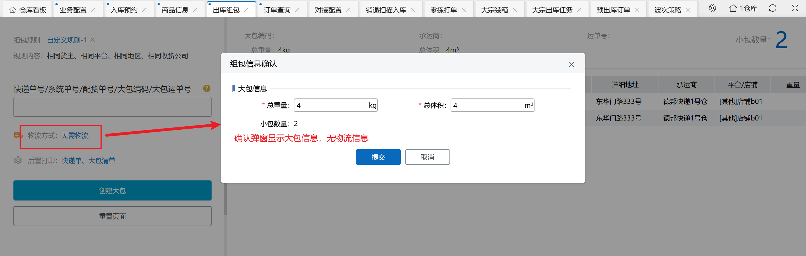

物流方式选择“仓库自有物流”，组包确认弹窗显示大包信息和物流信息，发货地址默认带出当前仓地址，可手动修改收货地址和发货地址，承运商手动指定，运单号可以不填，创建成功后大包运单号按所选承运商生成，后置打印出大包快递单和大包清单。

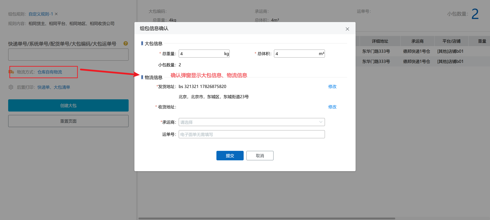

注：组包信息确认弹窗带*为必填项。

大包快递单上系统订单号、运单号、重量、体积显示对应大包编码、大包运单号、大包总重量、大包总体积。

组包创建成功后，订单查询页面显示对应大包信息，并支持查询和导出。

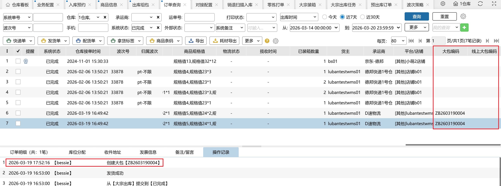

大包生成电子面单后，承运商对账页面显示对应大包信息和单号状态。

注：组包记录暂不支持承运商对账、预估成本重算、批量核销。

#### 修改物流

扫描需要修改物流的大包编码，匹配到数据后先按需选择物流方式，点再击修改物流按钮，在确认弹窗中修改相关信息后确认，修改成功后大包按新的信息生成，后置打印出新的大包快递单和大包清单。

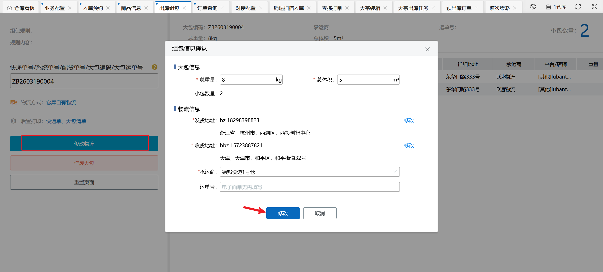

#### 作废大包

扫描需要作废的大包编码，匹配到数据后点击作废大包并确认作废。

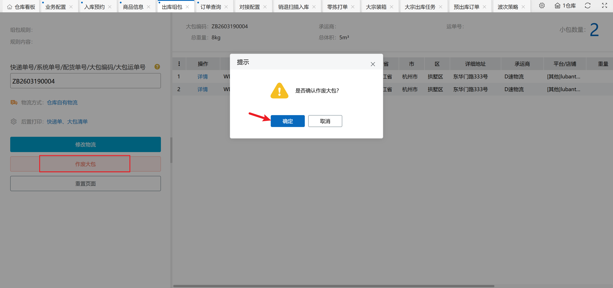

平台组包不允许作废大包。

#### 重置页面

需要清除页面数据时，可点击重置页面按钮一键清除。

#### 补打单据按钮

已创建的大包，可以在系统页面补打该大包的相应单据。扫描已组包完成的大包编码，显示大包信息后，补打按钮可点击。下拉点击可以切换单据类型，可选的单据类型和后置打印中勾选的单据一致，未勾选的单据，补打下拉无法切换。

> 更新: 2026-04-10 15:15:55  

> 原文: <https://hupun.yuque.com/unzko7/lsbfg0/kk2dcehd7f76n0sy>

---

### 05.6.9 出库缺货

> 原始文件来源：`00-源文件/操作手册/出库_B2C/其他/出库缺货.md`

#### **出库缺货**

在日常作业中，系统考虑到在拣货作业和验货作业中碰到拣货缺货或是验货缺货的情况；故设置缺货订单可以将缺货订单进行提交

#### 01.打回待分配

缺货商品处理完成后可勾选相应订单将其打回待分配界面。处理完成是指：缺货商品已经有库存了。

#### 02.打回并提交零拣

勾选订单后，将订单重新打到零拣打单。若之前提报缺货订单时，库存未还回，打回零拣打单时会需要还回。

#### 03.打回并生成波次

勾选订单后，将勾选订单生成手工波次。若之前提报缺货时，库存未还回，打回并生成波次时会需要还回。支持勾选多个订单。

##### （1）勾选后点击

##### （2）生成手工波次

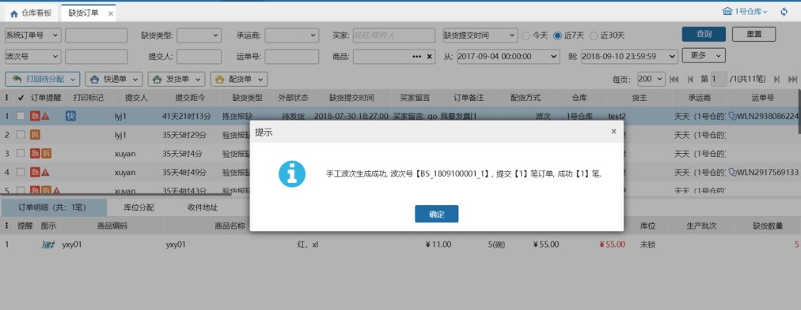

**提示：**

拣货环节报缺仅支持PDA作业时提报

验货环节PC及PDA均可提报

#### 04.一键盘点or一键调整

在缺货明细tab页看到订单中商品XX1在K1、K2..库位缺了多少个，勾选缺货的订单点击一键盘点或一键调整，跳到盘点页面，对库位上的缺货商品进行盘点，差异量根据计算会自动带出来。

**注意**

1.验货报缺或已盘过的缺货订单，不允许盘点和调整。

2.订单上的明细盘点后，缺货明细盘点状态是已盘，并关联盘点单。

3.盘点后，所有订单上有该缺货库位该缺货商品的明细都是已盘。例如：订单01、02、03、04都是缺货库位kw1、商品A1，勾选订单01进行盘点或调整，盘点后，01、02、03、04订单的缺货明细tab页库位kw1+商品A1都是已盘。

4.一键调整限制序列号商品和多个货主的订单一起调整。

5.一键盘点和一键调整限制200个订单500个明细。

6.盘点页面差异量计算公式：库位库存实际数量-（未拣数量-缺货数量）。

> 更新: 2023-12-18 15:40:33  

> 原文: <https://hupun.yuque.com/unzko7/lsbfg0/xfd4h7io1l0eg49l>

---

### 05.6.10 发货进度

> 原始文件来源：`00-源文件/操作手册/出库_B2C/其他/发货进度.md`

本页面用于显示拆单订单发货进度，用户可查看拆出订单的发货情况。

**注：订单完成2个月后此页面不再显示**

> 更新: 2023-12-18 14:11:37  

> 原文: <https://hupun.yuque.com/unzko7/lsbfg0/ugzd0zrgz01u3mk5>

---

### 05.6.11 多操作环节跳转

> 原始文件来源：`00-源文件/操作手册/出库_B2C/其他/多操作环节跳转.md`

#### **功能描述**

某些特殊订单必须走2个或以上环节，某操作员在连续操作验货&打包，用多环节跳转功能，不用来回切换菜单，减少无效操作。

##### 01.  多环节自动跳转设置

在仓库前鼠标悬浮上去，出现齿轮图标，点击跳出快速跳转页面。                     

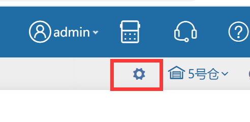

##### 02.设置跳转的环节且至少设置两个环节

例如快速验货和打包。                       

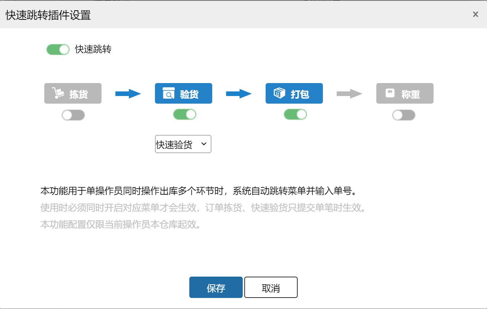

##### 03.环节设置

菜单必须打开，快速验货后，自动切到打包页面，自动输入运单号，打包提交后，又会自动切到快速验货页面。

**提示：**                     

a. 操作员必选用于2个及以上的环节权限，才会出现多环节自动跳转设置按钮。                   

b. 只能是单个订单或波次中只含一个订单才支持多环节自动跳转，多订单不支持。                   

c.称重界面如果为先称重后扫单号的，跳转后不自动输入运单号。                  

d.设置三个及以上环节，在中间环节页面手动输入运单号，不会自动切换菜单。

> 更新: 2023-12-18 15:44:38  

> 原文: <https://hupun.yuque.com/unzko7/lsbfg0/tb9llg93pcig1kyg>

---

### 05.6.12 异常订单

> 原始文件来源：`00-源文件/操作手册/出库_B2C/其他/异常订单.md`

#### 1、仓储异常订单

默认显示异常发生时间为近7天的异常订单列表。异常情况分为：挂起、拦截、发货失败等。

**提示：**

1、挂起：erp在WMS配货页面挂起已经推送到wms的订单，wms订单会有挂起标记，挂起的订单不能移至下一环节。erp订单申请退款，自动会挂起。

2、拦截：erp在WMS配货页面对已经推送到wms的订单打回审核或者重新下单，wms这笔订单会有拦截标记。拦截的订单点击确认拦截后状态变成已关闭。erp订单退款关闭，自动拦截。

3、发货失败：提交至待出库环节的订单会触发发货程序，发货失败则显示在异常订单列表中。用户可以在此页面针对这些订单修改承运商和快递单号。

4、在订单的 操作记录中会显示当前订单异常发生原因，便于分析解决

5、wms的单据正常，但是需要关闭订单。如果是没有超过7天的单子的话，需要找客服去拦截下订单，超过7天的单子可以自己手动拦截下，点下图像书一样的按钮进行拦截。拦截好后，去订单所在的环节操作下确认拦截就可以了。

**自动拦截订单**

自动拦截订单的情况有：

1.  订单退款

2.、部分关闭

3、地址变更

4、备注变更                       

#### 2、仓储超时预警

联动业务配置中仓储操作-环节超时预警配置显示，默认显示当前仓库下近7天的环节超时订单。

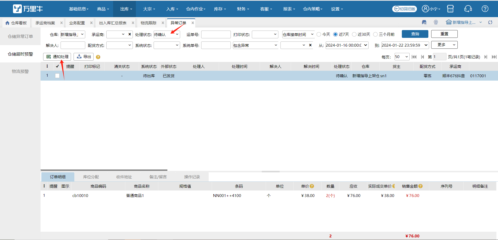

**提示：**

a.环节预警在业务配置-风险预警-仓储环节中进行设置，保存后立即生效，对符合的订单打上标记，在预警异常中可查询到对应订单。

b.勾选订单或者按查询结果点击通知处理可选择对应的操作员进行处理，确定后订单状态变为处理中，操作员会受到一条提醒通知。

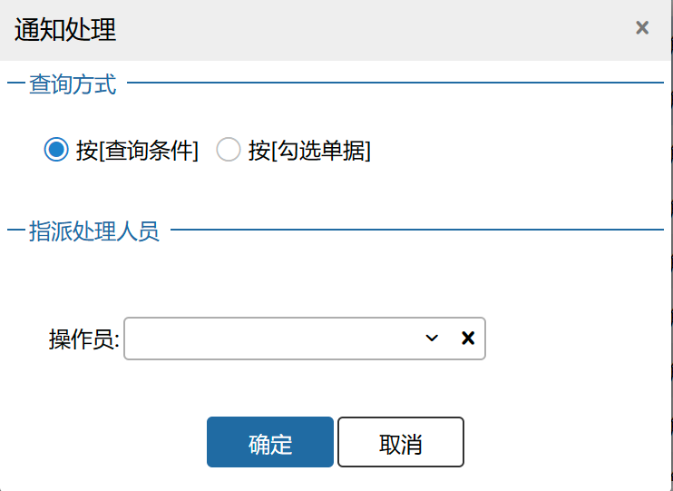

c.环节预警的订单在超时环节进行作业到下一环节后恢复正常，收回超时订单标志，在当前环节长时间不作业又达到环节预警的时间则会称为超时订单。

d.仓库看板中点击环节超时对应环节的数据可点击跳转到仓储超时预警tab查看具体的订单。

注：点击未揽收跳转到物流预警tab。

#### 3、物流预警

业务配置中待揽收或运输中环节超时预警有一个配置则异常订单显示物流预警tab。可显示有权限仓库下物流状态超时或问题件订单。

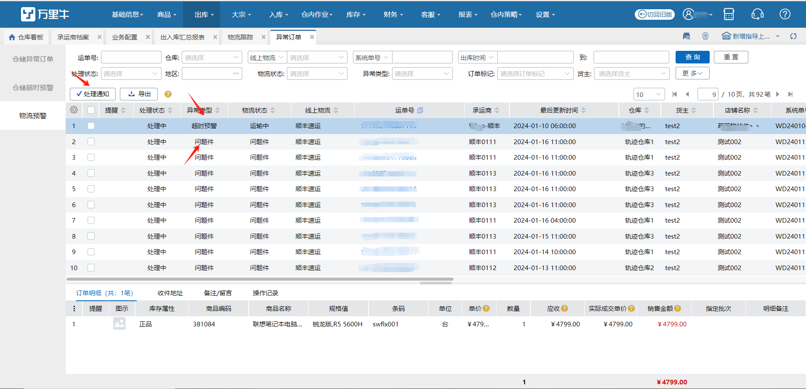

1.订单物流状态“已揽收/未揽收/运输中”，最后更新时间超过X小时（X>设置预警），订单为超时异常；订单物流状态“问题件”，订单为问题件；以上订单进入异常订单-物流预警。

2.异常订单支持点击通知处理，处理状态变更处理中，更新处理人和时间数据；订单去除异常后从此tab移除。

异常变更规则：

例：已揽收订单-超时预警：订单状态“已揽收”，最后更新时间超过X小时。

      无异常、处理状态为空：订单物流状态变为“运输中”或之后非异常物流状态；订单物流状态“已揽收”，最后更新时间已更新，且未超过X小时。

#### 4.改承运商

支持在订单上单个修改或批量修改订单承运商，同零拣打单。若修改后订单收件地址属超区，会报错提示。

替换承运商/回收电子面单时，已打印快递单的订单会弹窗提示：该订单已打印快递单，若继续修改请销毁已打印面单；点击继续按钮，替换承运商/回收电子面单，点击取消按钮，不替换承运商/回收电子面单。

> 更新: 2025-12-19 15:14:47  

> 原文: <https://hupun.yuque.com/unzko7/lsbfg0/ag8uluml4lv98fl5>

---

### 05.6.13 拆包补打

> 原始文件来源：`00-源文件/操作手册/出库_B2C/其他/拆包补打.md`

#### **01.拆包补打**

拆包补打页面可以输入想要拆单的订单进行多次拆单并支持变更快递，设置后置打印后，点击装箱会自动打印快递单。

#### **02.拆包装箱**

该功能主要适用于用户在不拆分订单的情况下，将订单用子母件/多包裹的方式发货，支持变更快递单。

1.和拆包补打在同一个菜单下，点击切换或者按快捷键切换

2. 装箱逻辑同拆包补打，只是这里不拆分订单，只是将明细装成一个包裹

3.全部装成包裹完毕后，点击生成子母件/单号就完成了。

4.装箱后，可以点击详情查看当前包裹的明细。       

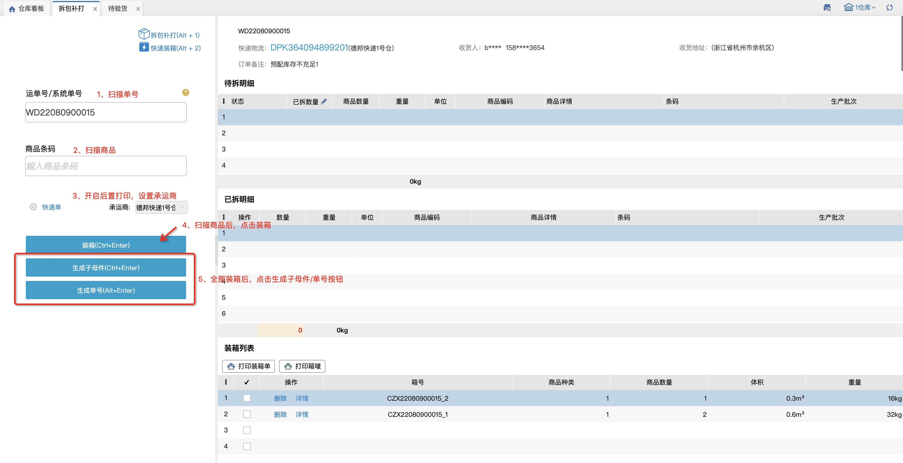 

#### 03.快速装箱

该功能主要适用于用户在打包后想要追加生成单号或多次追加的情况，支持自定义装箱数量，按钮跟随不同场景变化显示。

1.订单上已有单号或已有多个包裹、且承运商支持追加单号，则支持追加单号，并按新增箱或所有箱打印快递单：

2.订单上已有单号、且承运商不支持追加单号，则支持快速装箱，并按新增箱或所有箱打印快递单：

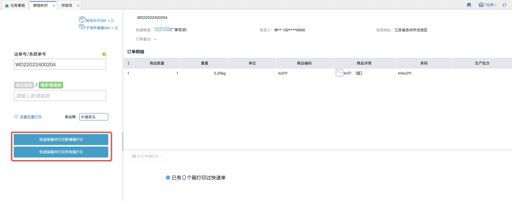

3.订单上无单号、且承运商不支持追加单号，则支持申请普通单号快速装箱并打印：

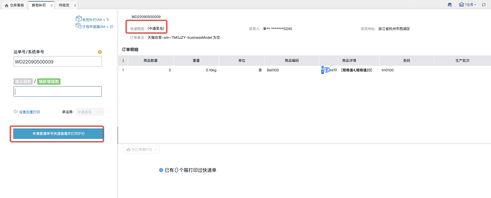

4.订单上无单号、且承运商支持追加单号，则支持申请子母件快速装箱并打印：

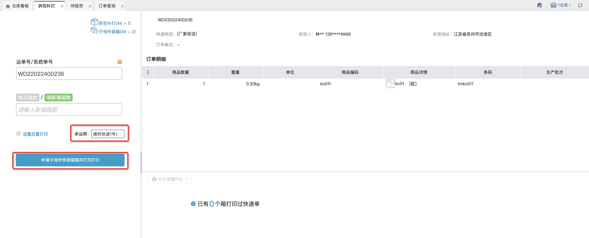

5.订单已有多个包裹、有单号、且承运商不支持追加单号，则显示追加单号按钮，但不支持追加，点击会报错提示：

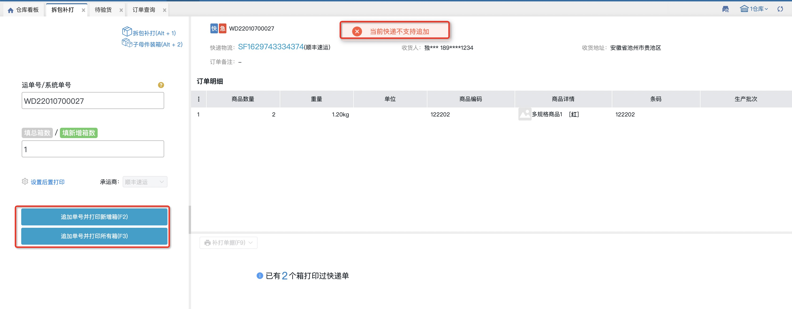

#### 04.视频录制

视频录制方法和其他页面一致，此处不再赘述，可参考[专题内容](https://hupun.yuque.com/unzko7/lsbfg0/ff462xtrzibtn77z#QTC8K)。

视频记录时间根据拆单顺序有所区别，具体如下：

【拆包补打】模式，第一个拆出订单的开始时间为匹配到订单的时间，结束时间为拆单提交时间；往后每一个拆出订单的开始时间都为上一个订单的拆单提交时间，结束时间为本订单拆单提交时间。

【快速装箱】模式，订单开始时间为匹配到订单的时间，结束时间为装箱成功的时间。

【拆包装箱】模式，订单开始时间为匹配到订单的时间，结束时间为生成子母件/单号成功的时间。

从条码验货跳转到拆包装箱模式进行操作的，视频记录时间和内容根据两个页面的设备配置有所区别，具体如下：

条码验货和拆包装箱页面配置设备一致的：订单开始时间为条码验货页面匹配到订单的时间，结束时间为生成子母件/单号成功的时间，视频内容包括在两个页面操作的内容。

条码验货和拆包装箱页面配置设备不一致的：如果条码验货有设备，则条码验货页面跳转到拆包装箱后，会把设备带出并显示到拆包装箱页面，订单开始时间为条码验货页面匹配到订单的时间，结束时间为生成子母件/单号成功的时间，视频内容包括在两个页面操作的内容。如果条码验货没有设备，则条码验货页面跳转到拆包装箱后，按拆包装箱页面的设备进行录制，订单开始时间为拆包装箱页面匹配到订单的时间，结束时间为生成子母件/单号成功的时间，视频内容仅包括在拆包装箱页面操作的内容。

视频记录归属环节为【拆包补打】，操作员为实际进行拆包补打操作的人员。

**提示**

1、仓库中只要有开启电子面单的承运商，无论订单上的承运商是否开启了电子面单都允许拆单，但是点击装箱时会判断承运商是否开启电子面单，未开启的报错提示，开启的正常拆单。拆包补打的订单必须是待验货、待打包、待称重或待出库环节的订单。

仓库中只要有支持生成子母件承运商开启电子面单无论订单上的承运商是否开启了电子面单都允许装箱，但是点击生成子母件时会判断承运商是否开启电子面单，未开启的报错提示，开启的正常生成子母件。

2、有发票信息（普通发票/电子发票）的订单拆出来的子订单是没有发票信息的。

3、天猫直送（承运商带锁的）、到付件、唯品会订单、已装箱的订单不允许拆包补打。

4、波次中的其中一笔订单拆包补打，这个订单不再属于这个波次。

5、待验货和打包环节的订单拆包补打，拆出来的订单直接提交至下一环节。

6、淘宝平台的订单进行拆包补打时若不进行明细拆出则新生成的最后一张电子面单号会覆盖之前的单号同步至店铺后台，若拆出明细发货，系统则给ERP回传所有运单号并以部分发货形式同步至线上。

7、生产批次管理严格模式下支持生产批次商品；**标准模式下不支持生产批次商品（拆包补打、快速装箱两种不支持；拆包装箱支持，需要先登记批次号才允许拆包）。**

8、不支持外贸订单和锁了规格箱的订单。

9.在仓内策略–业务配置，开启商品条码截取，扫描输入截取的商品条码会与商品信息的条码进行对比校验；

①.选择特殊信息截取，扫描输入++前的条码，系统会与订单商品信息的条码进行对比校验；扫描输入不含特殊字符的全量条码可直接匹配商品，扫描输入包含++字符的全量条码，无法匹配到商品信息。

②.选择条码位数截取，扫描输入前若干位条码，系统会与订单商品信息的条码进行对比校验；扫描输入全量条码，无法匹配到商品信息。

10、在仓内策略–业务配置，开启扫描条码强制提交后，无需点击装箱，扫描wanliniu666可自动装箱。

①生成子母件页面只代替点击装箱的动作，不会代替生成子母件的动作。

> 更新: 2025-05-30 09:14:50  

> 原文: <https://hupun.yuque.com/unzko7/lsbfg0/diel37dq62pgz5dm>

---

### 05.6.14 拦截验核

> 原始文件来源：`00-源文件/操作手册/出库_B2C/其他/拦截验核.md`

用于二次确认当前仓库下已经确认拦截的订单，最多显示近1个月内的订单。

页面默认显示当天确认拦截且未核验过的订单，左侧待核验订单数量跟随右侧查询列表数据同步变化。

数据范围：当前仓库下+已经打印过快递单+被拦截状态+确认拦截的订单

#### **01.添加订单**

添加订单有三种方式：扫描单号录入、手动点击加号添加、点击“全部添加”：

添加成功后数据显示在下方列表，可手动点击减号或“全部删除”取消添加：

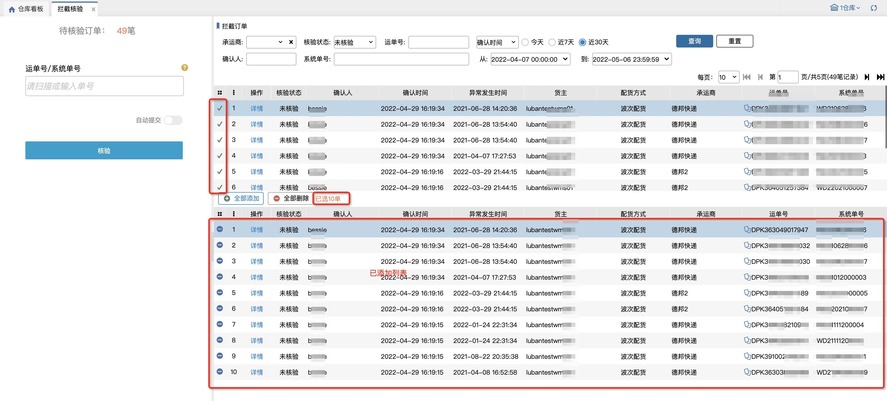

**注：已添加列表无数据时，核验按钮置灰不可点击，有数据时高亮可点击。**

#### **02.核验**

录入需要核验的订单后，点击核验按钮，即可提交核验。提交成功后订单状态变成已核验，已添加列表清空。

#### **03.已核验列表**

订单提交核验后，通过“核验状态-已核验”能查询到数据，已核验状态下页面不支持操作，只能查询数据：

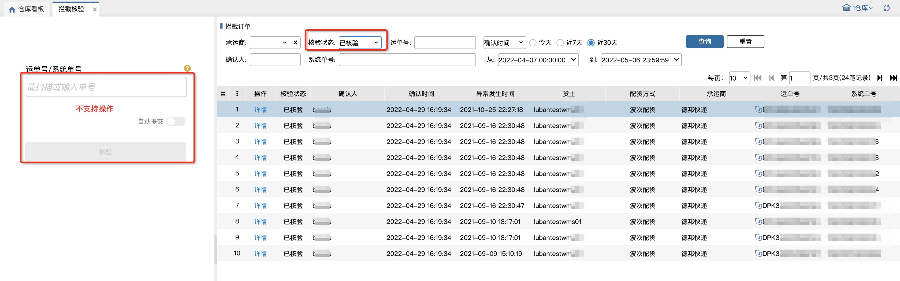

> 更新: 2023-12-18 14:27:50  

> 原文: <https://hupun.yuque.com/unzko7/lsbfg0/pohd5m3ehftgqs16>

---

### 05.6.15 组包记录

> 原始文件来源：`00-源文件/操作手册/出库_B2C/其他/组包记录.md`

关联[出库组包](https://hupun.yuque.com/unzko7/lsbfg0/kk2dcehd7f76n0sy)功能使用，用于查看已经组包的数据记录，并支持打印相关单据，包括大包快递单、大包清单、大包箱唛。

大包点击“详情”可查看小包订单，并支持打印小包快递单。

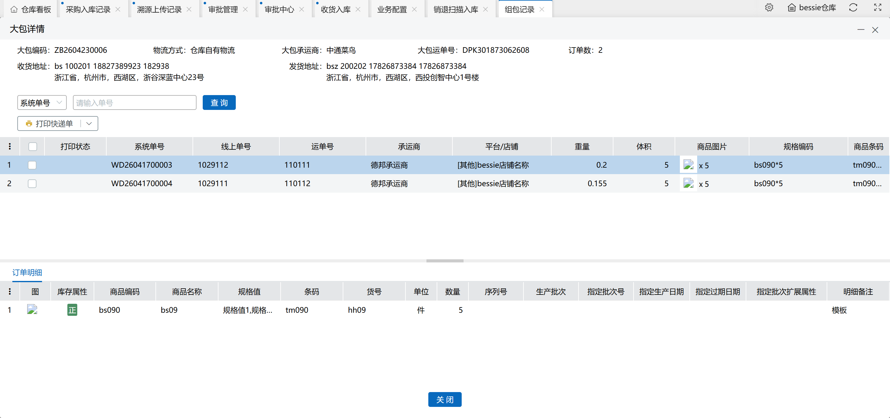

注：部分大包不支持打印单据，点击打印有报错提示。

> 更新: 2026-04-28 18:01:21  

> 原文: <https://hupun.yuque.com/unzko7/lsbfg0/mgag3wflvro88hyq>

---

### 05.6.16 自定义环节

> 原始文件来源：`00-源文件/操作手册/出库_B2C/其他/自定义环节.md`

#### 自定义环节页面适用场景：

1.用户有部分订单想要一次性通过一些环节时，可以在选择得页面扫描并提交，这样就一次性通过了多个环节。

2.用户想要抽查一个波次内的某个订单，就可以开启校验模式，扫描波次后，自动选出波次中的一个订单进行条码验货或者称重操作。提交后，整笔波次提交。（仅支持同品波次和预配波次）

业务配置开关：

##### 01.选择环节

可配置范围：仓库开启的环节中从验货到出库的环节，中间环节之间不能有间隔，选中之后，自定义环节菜单中提交的订单将会直接通过选中的环节。

匹配的订单根据选中环节判断。例：自定义环节为：验货+称重+出库。匹配的订单就是待验货的订单。

1).选择环节包括验货且环节校验功能为条码验货的，序列号录入支持扫商品后连续扫录入和逐个扫商品+序列号录入

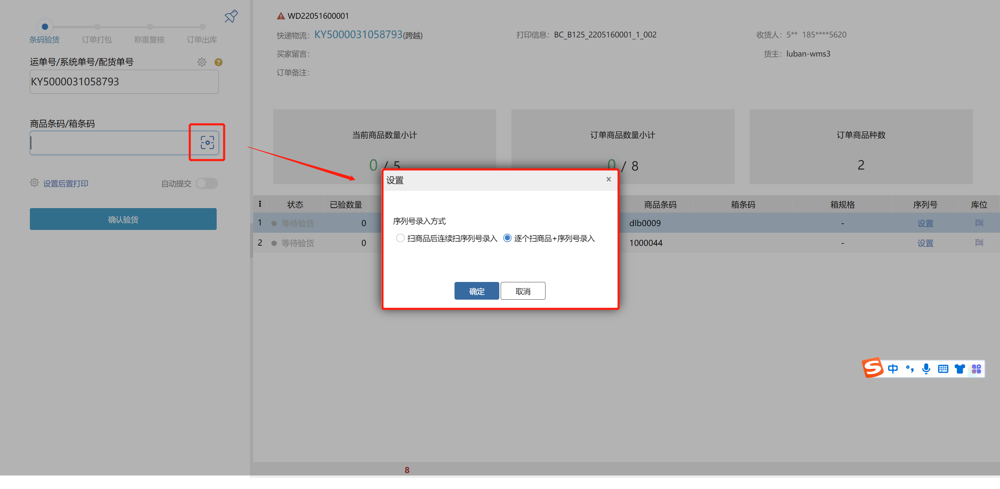

##### 02.环节校验功能

不选择环节：所有自定义环节都不用校验，自定义环节菜单将变成批量模式。

选择条码验货：扫描的订单只需要通过条码验货操作就能通过所有自定义环节。选择称重复核同理。

选择条码验货+称重复核：订单需要通过两个环节的校验才能提交所有环节。

##### 03.允许匹配订单

混品波次、同品波次、预配波次、零拣，选中之后，对应波次类型和波次类型下的订单才能被匹配到，混品波次不支持开启校验功能的页面匹配。

##### 04.记录操作员

选中后，仅选中的环节会记录操作员，记录为当前登录账号

 

#### 自定义菜单模式：

##### 01批量模式

环节校验均未开启时，进入批量模式

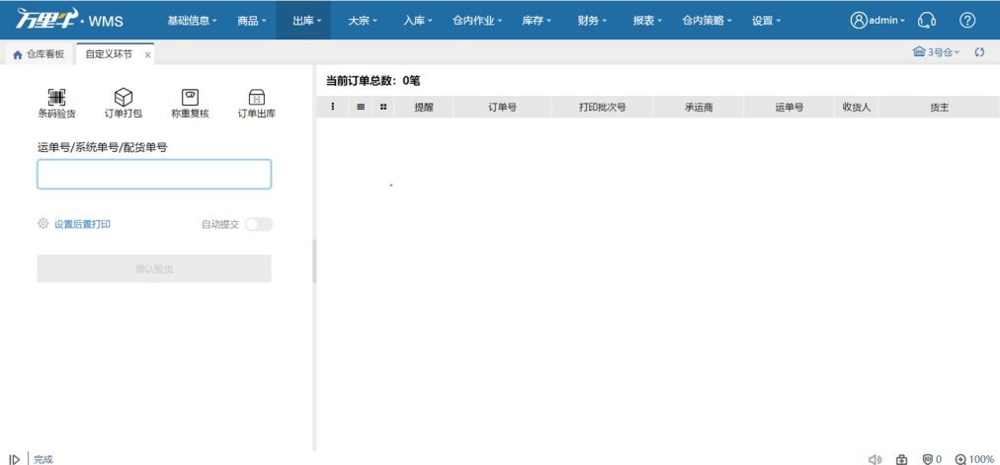

##### 02.校验模式

环节校验功能开启条码验货/称重复核/条码验货+称重复核

a.仅开启条码校验，扫描订单后，需要进行条码验货操作，提交后，订单直接出库。

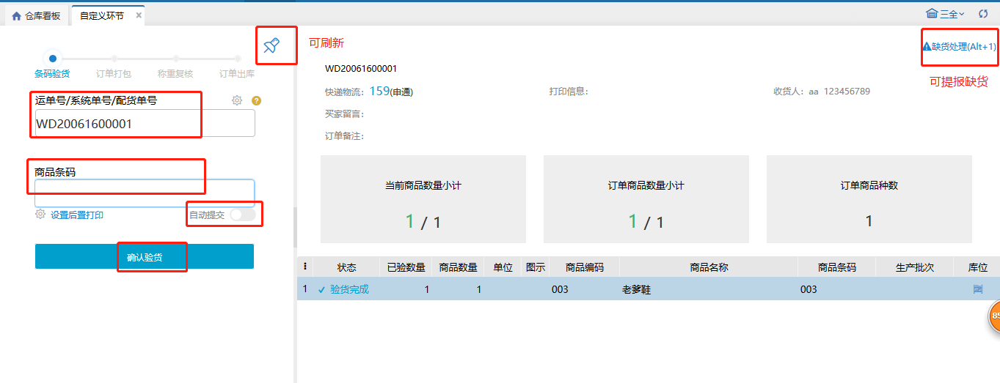

b.仅开启称重复核，匹配的订单需要做称重操作，提交后所有环节都通过。图中情况匹配待验货的订单，做称重操作提交后出库。

   

 c.条码验货+称重复核，扫描订单后，需要进行条码验货操作，提交条码验货后到称重复核页面，再次提交后，所有环节都通过。

从验货提交到称重：扫描的单号自动带到称重页面，且自动扫描，不能修改扫描的单号，称重后才能提交。

**注意**

在仓内策略–业务配置，开启商品条码截取，扫描输入截取的商品条码会与商品信息的条码进行对比校验；

①.选择特殊信息截取，扫描输入++前的条码，系统会与订单商品信息的条码进行对比校验；扫描输入不含特殊字符的全量条码可直接匹配商品，扫描输入包含++字符的全量条码，无法匹配到商品信息。

②.选择条码位数截取，扫描输入前若干位条码，系统会与订单商品信息的条码进行对比校验；扫描输入全量条码，无法匹配到商品信息。

> 更新: 2023-12-18 15:43:05  

> 原文: <https://hupun.yuque.com/unzko7/lsbfg0/gpx4mitgomuxb8d5>

---

### 05.6.17 订单查询

> 原始文件来源：`00-源文件/操作手册/出库_B2C/其他/订单查询.md`

根据各种条件进行订单查询，查看订单处理状态。可以补打发货单、快递单和导出订单明细。

#### 1. 查询

条件支持用户自定义设置，最多10个查询条件，位置是一次从左到右，从上到下排序。                        

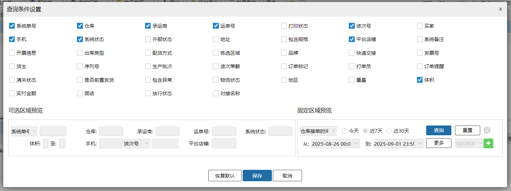

#### 2.查询条件记忆

例如根据手机号123查询点击我的查询，输入标题名称01，下次进来可以直接在我的查询选择01，查询条件自动带出。

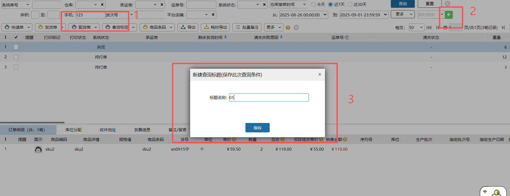

#### 3.工具栏按钮支持自动调整位置

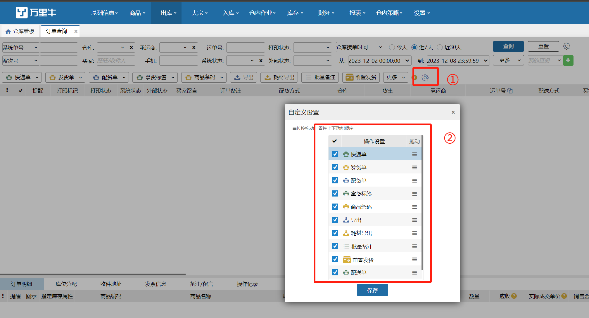

#### 4.导出

:::color3
应用场景：主要给货主提供对账核对的数据支持。合并了耗材导出和普通导出功能，增加了耗材详情展示，并同步优化了包裹导出逻辑。

:::

订单导出步骤：

1. 进入【订单管理】→【订单查询】页面

2. 查询/勾选需要导出的订单

3. 点击【导出】按钮，选择导出方式：

   - 支持按单据导出（合并耗材）

   - 支持按包裹导出（包含明细）

   - 支持明细平铺显示

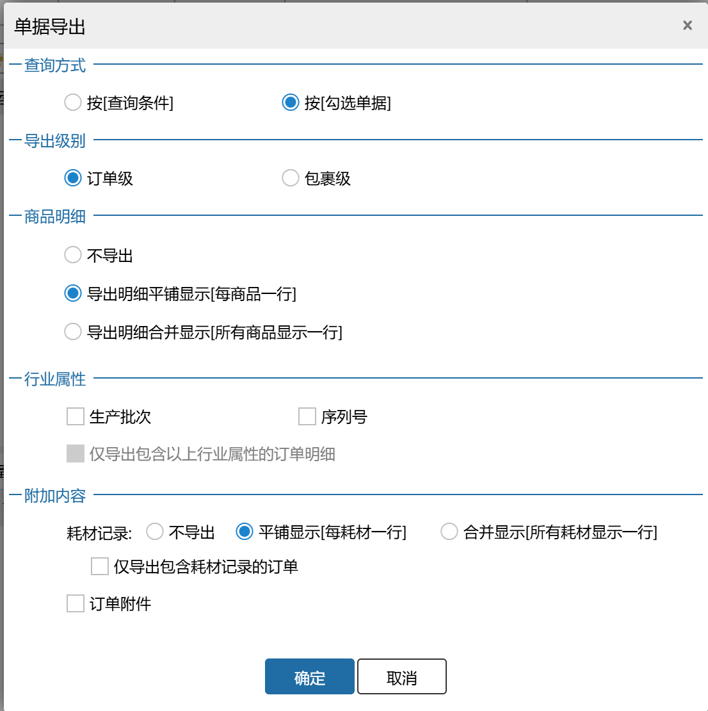

注：

①商品合并样式和"不导出明细"选项对行业属性不可选

②耗材的导出合并模式跟随单据/包裹的第一个明细行展示

③如果选择平铺显示，则每行一个，单据行数不够时自动补齐

④导出包裹时，若包裹中有商品则按包裹商品显示（包括耗材）；若包裹中无商品，则在第一行显示订单明细

⑤支持自定义列导出，按照页面上显示的列导出。

#### 5.运单号查询支持输入子包裹运单号查询

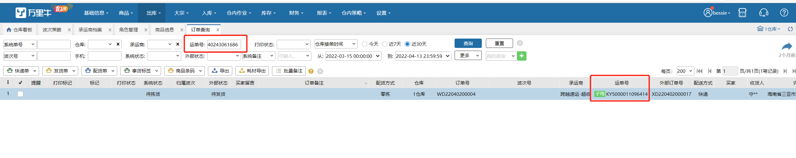

#### 6.订单标记-系统标记-平台标签

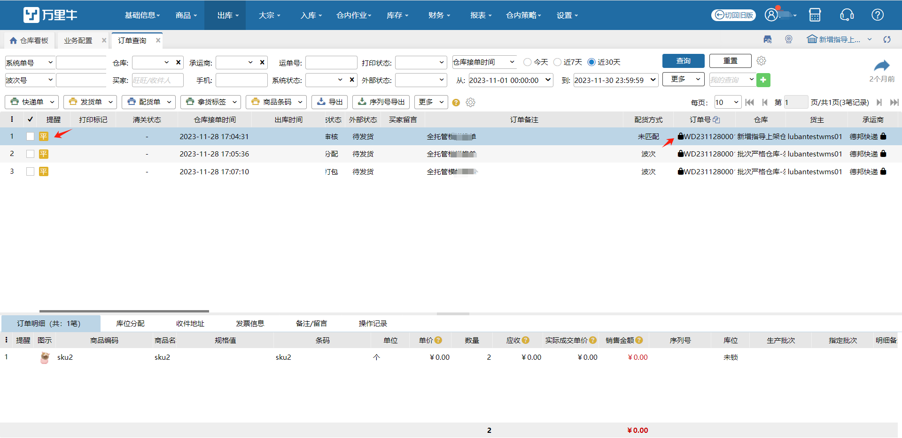

接单识别：推扩展字段cerpPrintGoodsLabel有值，识别为平台标签订单。

原其他打印模板->线上发货单改为平台标签。

平台标签支持全局查询、前置打印（波次、零拣、大宗）、后置打印（播种验货，独立播种、条码验货）。

平台标签对订单自动匹配波次、波次策略指定生成、标记订单辅助优先处理、绩效策略都生效。

#### 7.订单支持按平台或店铺查询

订单可通过店铺或者平台进行筛选。抖音供销、抖音超市等可通过抖音小店查询。

切换tab时，数据以及勾选会对应清空。兼容保存我的查询条件。

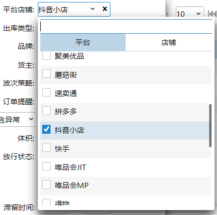

#### 8.申请电子箱唛

有包裹的订单支持申请电子箱唛，点击后申请电子箱唛，成功后订单显示标识。

注：若订单有多个包裹，则所有包裹都打上电子箱唛标识后，订单上才显示标识。

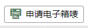     

仅唯品会订单支持申请电子箱唛，否则报错。

未装箱订单不支持申请电子箱唛。

若作废包裹重新装箱，则支持重新申请电子箱唛。

支持部分申请电子箱唛，例：原装箱1、2，申请电子箱唛后又装箱3，则3可申请电子箱唛。

支持补打、后置申请和打印电子箱唛。

PDA暂不支持电子箱唛相关。

#### 9.历史库位记录

系统状态为【已完成】的订单，支持查看历史库位记录：

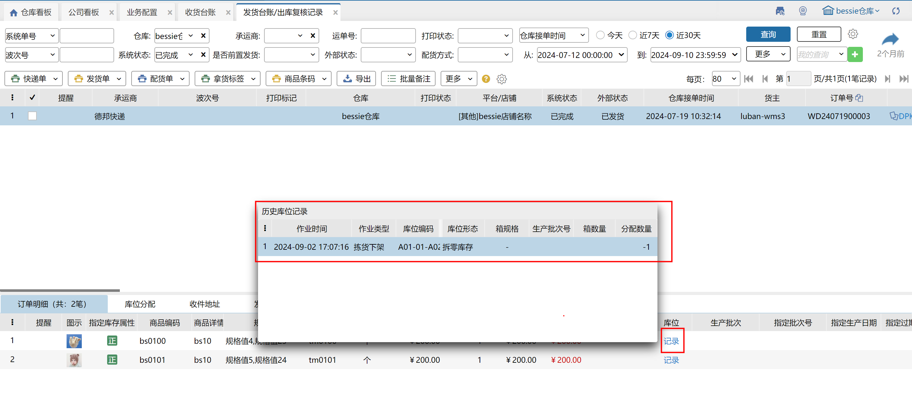

#### 10.按订单附件导出

导出新增模式-按订单附件导出，按查询条件或勾选单据，操作后支持去数据中心下载压缩包。

导出数据为订单上附件图片，包括png、jpg等。（支持在大宗出库手动上传附件或由上游推单附件数据）

#### 11.清关证件信息

1.开启保税模块，收件人信息处展示证件相关数据（可联系技术开启）。

2.账号有查看敏感信息权限，点击后即可查看全部证件相关信息，否则仅显示加密信息。

3.账号有敏感信息查看权限，导出支持证件信息。

#### 12.历史单据

1.历史单据可与正常单据一起查询、操作。

2.历史订单不支持前置发货。

3.历史订单不支持生成电子箱唛。

#### 13.取消订单

1.订单查询显示“取消订单”按钮的条件：角色管理权限：有权限+公司下至少有1个无对接货主配置。

2.仅允许取消无对接货主的订单。

3.已出库的订单无法取消。

> 更新: 2026-07-27 17:54:13  

> 原文: <https://hupun.yuque.com/unzko7/lsbfg0/gwfq735st0u01ghx>

---

## 05.7. PDA手持端B2C作业

### 05.7.1 PDA-容器拣货

> 原始文件来源：`00-源文件/PDA安卓端/出库_B2C/拣货/PDA-容器拣货.md`

容器拣货，pda通过扫描容器编码，进行拣货，具体步骤如下：

一、点击容器拣货按钮，打开首界面，点击右上角的按钮可以筛选库区。

筛选拣货区域后，扫描容器编码（容器拣货方式为拣货框）匹配已拆分波次进行拣货。

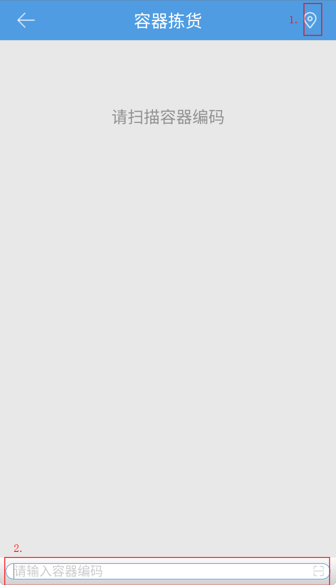

二、选择波次后，扫描商品行上的库位，商品行自动标记已完成。

若pc端开启PDA拣货检验商品条码，扫描库位后，再扫描商品条码，商品才会自动标记完成。

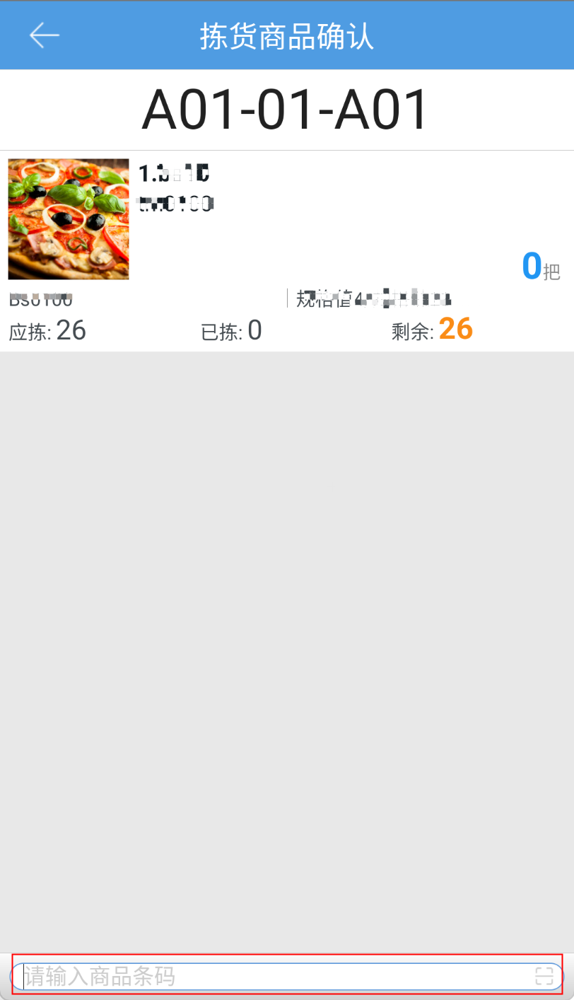

若pc端开启PDA拣货检验商品数量，点击商品行上的数量，可以直接修改商品数量。

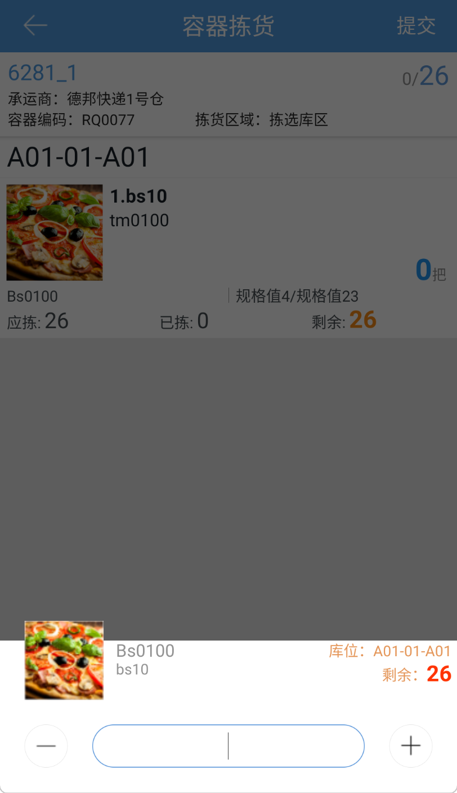

三、所有商品行都已完成后，点击确认，即可提交下一环节。

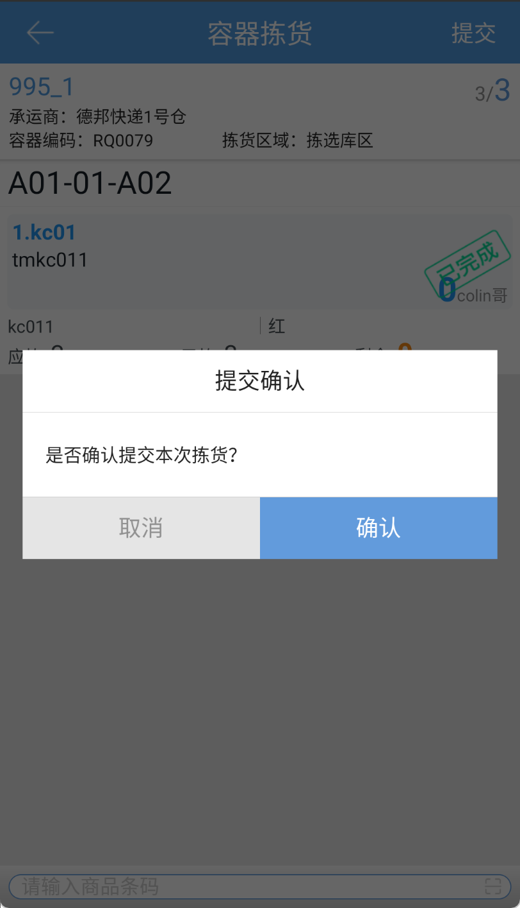

 容器拣货领取逻辑

1.仅领取已拆分的波次；

2.按照PDA选择的库区领取对应容器拣货任务；

3.若波次订单都被拦截挂起，则不领取该波次；

4.仅领取与容器指定的库区、承运商、指定波次一致、且拣货方式为拣货框的波次。

5、波次拆分成多个拣货任务时，第一个拣货任务提交后再次扫描容器编码，会自动匹配同波次下剩余拣货任务

> 更新: 2024-02-06 10:28:03  

> 原文: <https://hupun.yuque.com/unzko7/lsbfg0/lqztr7cdz568ytfr>

---

### 05.7.2 PDA-快捷打单

> 原始文件来源：`00-源文件/PDA安卓端/出库_B2C/拣货/PDA-快捷打单.md`

当用户仓库有多个固定预配波次，且预配波次是走快速流程 打单到出库的，仓库操作员可以使用PDA领取波次任务打印快递单，并自动提交出库.

#### 01.菜单权限

菜单权限,系统管理员和仓库管理员默认有此权限,普通操作员需要仓库管理员添加快捷打单权限.

#### 02.快速流程配置

首先要开启预配波次或同品波次快速出库流程,且开始环节必须是打单环节.

#### 03.领单配置

1.设置工作台，PC端设备管理，设置工作台的绑定库区、指定承运商、指定波次、绑定地址、打印机。

①、绑定库区：领单时，仅领取绑定库区的波次。

②、绑定地址：点击刷新，自动获取本机ip。

③、指定承运商：领单时，仅领取指定承运商的波次；

④、指定波次：领单时，仅领取指定的波次策略。

⑤、打印机设置：设置打印快递单的打印机。

2.检查网络，保证PC和PDA要在同一局域网，可以用PDA上的小工具检测，若是菜鸟控件运行正常，则PC和PDA在同一个局域网；若是报错，则检查PC和PDA网络。

3.波次策略设置，指定的波次策略要开启允许PDA领单才能被领取到。

#### 04.快捷打单

操作步骤如下

1. 点击快捷打单按钮，用户可见如图界面，输入工作台编码或扫工作台编码，领取任务。                    

2.领取任务后,直接打印快递单和自动提交到快速流程设置的结束环节,任务完成后,继续扫描工作台,领取下个任务。          

> 更新: 2023-12-21 09:28:17  

> 原文: <https://hupun.yuque.com/unzko7/lsbfg0/it9cvpbv9f755gwo>

---

### 05.7.3 PDA-扫描打单

> 原始文件来源：`00-源文件/PDA安卓端/出库_B2C/拣货/PDA-扫描打单.md`

业务场景：仓库操作员使用PDA领取波次任务，并直接打印电子面单，结合批量拣货、播种拣货，提升整体配货效率。 

#### 01.领单配置

设置工作台，PC端设备管理，设置工作台的绑定库区、指定承运商、指定波次、绑定地址、打印机。                  

①、绑定库区：领单时，仅领取绑定库区的波次。

②、绑定地址：点击刷新，自动获取本机ip。③、指定承运商：领单时，仅领取指定承运商的波次；

9.                        

④、指定波次：领单时，仅领取指定的波次策略。

⑤、打印机设置：设置打印快递单的打印机。

检查网络，保证PC和PDA要在同一局域网，可以用PDA上的小工具检测，若是菜鸟控件运行正常，则PC和PDA在同一个局域网；若是报错，则检查PC和PDA网络。                   

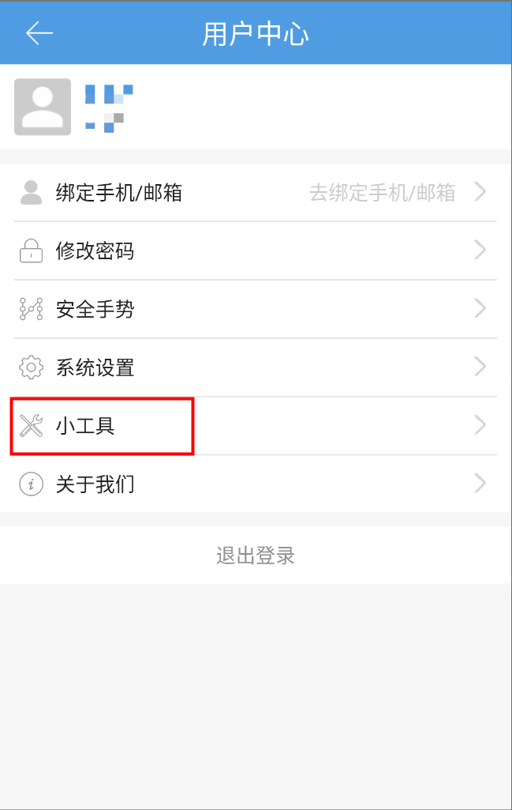

波次策略设置，指定的波次策略要开启允许PDA领单才能被领取到。                  

            

#### 02.扫描打单

具体步骤如下：

1点击扫描打单按钮，用户可见如图界面，输入工作台编码或扫工作台编码，领取任务。                    

2.领取任务后，打印快递单，跳转到如图界面，用户选择拣货方式，进行拣货。

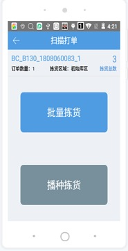

3.拣货提交后，任务完成，即可再次扫工作台编码，领取下个任务。

#### 03.领单逻辑

1. 波次策略勾选了开启PDA允许领单-扫描打单，才能被领取到。

2. 波次是待打单状态，才能被领取到。

3.波次中的订单都生成了电子面单，才能被领取到。

4.没有打印过快递单、发货单、配货单、发票的波次，才能被领取到。

5.与工作台设置的绑定库区、指定波次一致的波次，才能被领取到。

6.与工作台设置的指定承运商一致的波次，才能被领取到。

7.序列号登记环节在拣货且波次中含有序列号商品，该波次不能被领到。

符合条件的任务如何分配：

按当前正在拣货的库区(待拣货正在执行的波次任务)，库区中拣选人员最少的波次优先领取，如果跨区跟单区数量相同则跨区优先，越早生成的波次优先领取。

Ps.目的是边拣边播动态分流，防止某个区人太多全部扎堆的交通堵塞，造成效率降低。

> 更新: 2023-12-21 09:28:17  

> 原文: <https://hupun.yuque.com/unzko7/lsbfg0/gg2t4fdo0erthxz1>

---

### 05.7.4 PDA-批量拣货

> 原始文件来源：`00-源文件/PDA安卓端/出库_B2C/拣货/PDA-批量拣货.md`

pda的批量拣货适用于波次订单快速提交下一环节，具体操作步骤如下：

一、点击批量拣货按钮，如下图输入配货单号或运单号匹配订单。

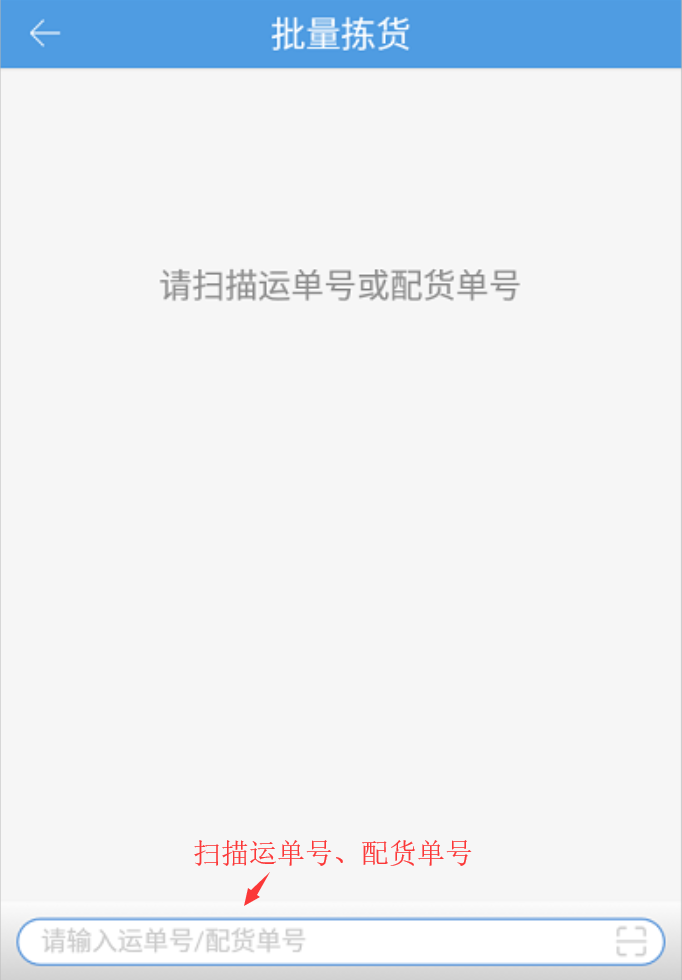

提示

1.波次号就是配货单号。对一波零拣订单批量拣货，需要在pc上打印这波零拣订单的配货单，在此页面输入配货单显示的配货单号即可进行拣货。

2.扫描运单号，带出订单所属波次下的全部待拣货的订单

二、选择订单后，扫描商品行上的库位，商品行自动标记已完成。

点击商品行上的数量，可以直接修改商品数量。

三、所有商品行都已完成后，点击确认，即可提交下一环节。

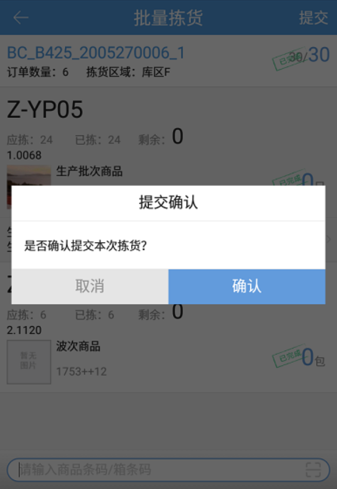

 四、开启按库区接力拣货，一个库区明细拣货完成后，提示库区拣货已完成是否提交，确认提交后生成接力拣货任务。下个库区拣货直接扫描运单号或配货单号领取接力拣货任务。

> 更新: 2023-12-21 09:28:17  

> 原文: <https://hupun.yuque.com/unzko7/lsbfg0/gcgvupeqazgwzul4>

---

### 05.7.5 PDA-拣货集合

> 原始文件来源：`00-源文件/PDA安卓端/出库_B2C/拣货/PDA-拣货集合.md`

待补充

> 更新: 2024-02-06 10:39:14  

> 原文: <https://hupun.yuque.com/unzko7/lsbfg0/mlat0v5elpkgc4ch>

---

### 05.7.6 PDA-播种拣货

> 原始文件来源：`00-源文件/PDA安卓端/出库_B2C/拣货/PDA-播种拣货.md`

用户不需要打印配货单，可以直接通过PDA对一波订单快速拿货和分订单。

下图是一波订单的配货单，PDA播种拣货的时候商品显示与配货单商品显示一致。配货分布中的（1）指一波订单中的第一笔订单，也是PDA播种拣货的第一个播种框。

点击播种拣货按钮，通过扫描一波订单中任意一个运单号或配货单号来匹配一波订单，或者波次策略中选择允许PDA领单-扫描打单，则可通过扫描相应的工作台编码领取波次订单。

a).可选择作业模式为边拣边播或先拣后播，作业模式记忆为仓库+操作员上。作业过程中支持返回主页面，切换作业模式。

模式切换时支持带出之前作业的已拣、未拣、已播、未播的数量。

例：订单中有sku1-2个，sku2-3个，锁在库位kw01上。

边拣边播切到先拣后播：在边拣边播拣货sku1-2个并且播种，切到先拣后播，sku1显示已拣2，播种页面显示已播2；

先拣后播切到边拣边播：在先拣后播拣货sku2-2个，播种1个，切到边拣边播，跳到sku2播种页面（播种框显示1），再跳到sku1拣货播种2个，再跳到sku2页面拣货播种1个（播种框显示1）。

b).作业完成后可进行后置打单，根据开关配置。开启后，作业完成，自动跳转至后置打印扫描工作台，若工作台输入错误，支持修改，修改可打印的正确工作台后自动打印；若工作台ip不正确，修改后，可直接点击“打印运单”按钮进行打印。

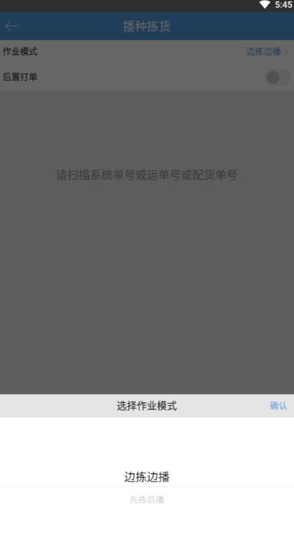

提示：PDA领单需同步配置好工作台的IP地址和波次策略处的设置。

#### 边拣边播

a).显示播种框分布。

b).选择配货单后，推着播种车去显示库位。找到库位后扫描库位编码。

c).支持查看拣货进度，扫描商品条码，拣货进度根据扫描商品的数量更新，扫描箱条码时，拣货进度增加的是箱内库存的数量。

  

d).扫描库位后进行拿货操作，点击确认按钮即可完成此商品此库位的拣货，确认按钮可通过F12快速确认。

提示：商品详情支持收起，记忆在仓库+操作员上。

图中有些框是“X”，表示这些订单可能不在拣货环节，可能被挂起/拦截确认了。

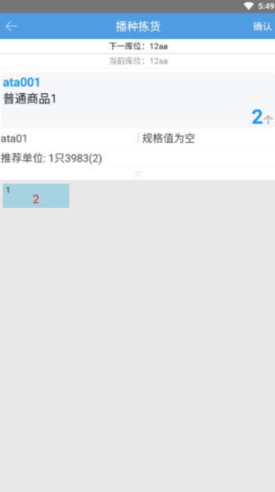

可操作上一个/下一个跳过商品拣货。（本次作业点击过上一个或下一个按钮后，不支持播种回看，但支持定位下一未拣货完成明细）

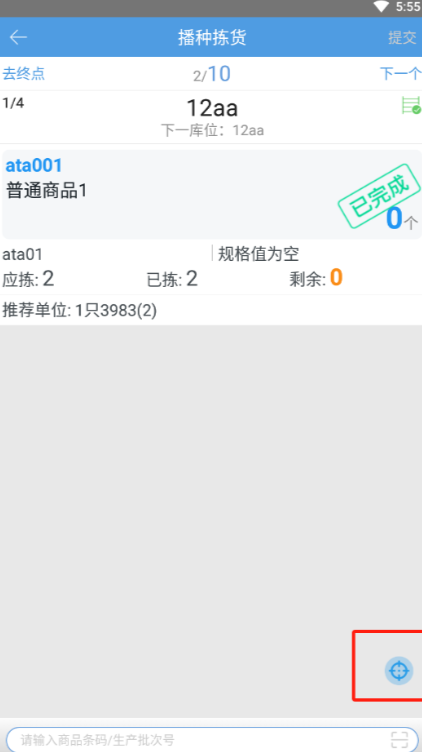

e).拣货至波次内的最后一个商品，点击确认即可完成拣货。

f).点击绿色回看按钮，支持回看上一次的播种分配页面。

g).开启按库区接力拣货，一个库区明细拣货完成后，提示库区拣货已完成是否提交，确认提交后生成接力拣货任务。下个库区拣货直接扫描运单号或配货单号领取接力拣货任务。

提示：播种拣货会有记忆功能，即配货因为某些原因中断，再次选择此配货单，之前拣货过的商品不需要再次操作，直接继续未完成的拣货。选择其他配货单，再选择此配货单，就不会记忆此配货单进度。

#### 先拣后播

a).选择先拣后播作业模式，扫描波次号后，进入先拣后播作业页面。

b).已拣货数量不为0时，点击去播种进入播种页面，播种页面支持扫描商品条码、箱条码，支持条码截取。已播和未播数量实时刷新，播种后返回先拣后播页面，未播数量实时刷新。生产批次商品有多个批次，播种时支持扫完商品条码选择批次。

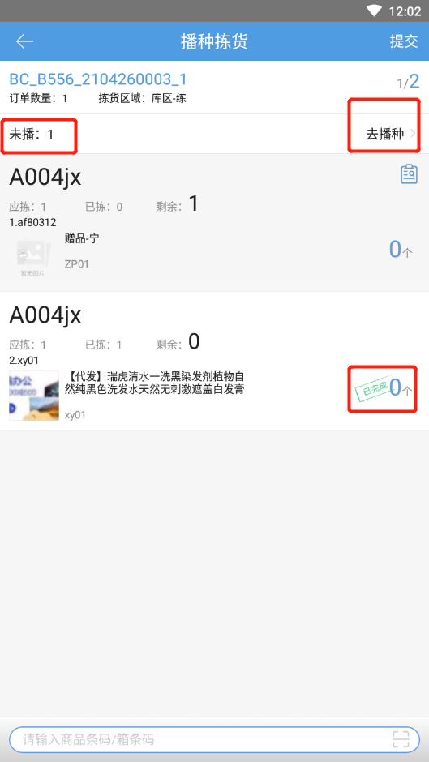

c).支持播种框语音播报，跟随设置处的播种验货语音播报开关。

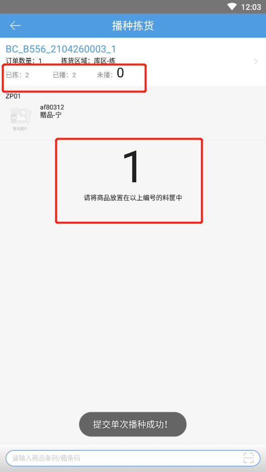

d).从播种页面支持点击进入播种进度页面查看进度。某商品已拣=已播时，在此页面打上完成标识。

e).拣货完成，播种完成后，返回先拣后播页面弹出提交拣货，确认后提交拣货。

#### 跳过缺货库位仅记录缺货数量

PDA拣货模式支持-拣货报缺时全部订单提交拣货后再提交报缺（订单拣货、批量拣货、自由领单+批量拣货、播种拣货、料筐拣货、领单播种拣货）

a).业务配置-出库配置-开启订单缺货处理-选择已拣库存异常打回时还回-显示跳过缺货库位仅记录缺货数量

b).波次内有商品明细报缺时跳过该商品，仅记录缺货数量，不显示报缺明细（如有已拣再报缺，已拣明细和数量显示，报缺数量不显示），所有明细都拣货完成后提交拣货时，正常订单到下一环节，有后置打印的正常打印，缺货订单提交到缺货，拦截挂起订单提交到异常订单，异常页面显示缺货订单和拦截挂起订单。

c).PDA拣货开启接力拣货时，最后一个操作员提交拣货时订单再提交缺货订单。

#### 语音提示

pda-系统设置开启语音提示后，在作业过程中会根据配置播报库位/商品/数量：

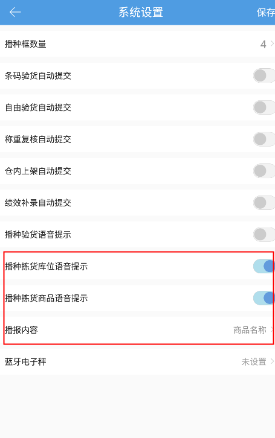

#### 合并播种拣货

pda系统设置支持配置分页样式和合并样式。

合并样式如下：可操作本次拣货和查看上一播种任务。

> 更新: 2024-05-07 10:42:41  

> 原文: <https://hupun.yuque.com/unzko7/lsbfg0/yslltcrchttp7w92>

---

### 05.7.7 PDA-料筐拣货

> 原始文件来源：`00-源文件/PDA安卓端/出库_B2C/拣货/PDA-料筐拣货.md`

料筐拣货，pda通过扫描拣货筐编码进行拣货，操作方式关联所扫描容器上选择的拣货方式：

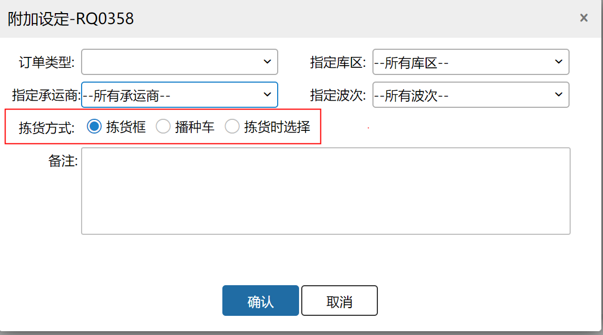

1、点击料筐拣货按钮，打开首界面，显示所选区域下待处理波次的笔数，扫描拣货筐编码选择波次进行拣货。

点击右上角的按钮可以筛选库区。

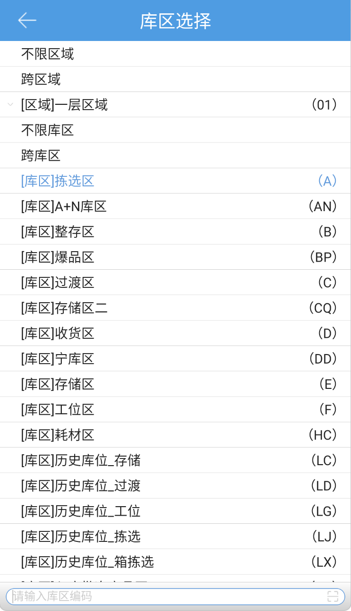

2、容器选择不同拣货方式时，对应不同的操作流程

2.1 容器拣货方式选择“拣货框”

扫描容器编码领取到波次后，进入批量拣货模式，点击波次号可以查看商品详情，需要先开启左下角蓝牙打印，才能点击右上角确认按钮，继续拣货流程，后续流程和[批量拣货](https://hupun.yuque.com/unzko7/lsbfg0/gcgvupeqazgwzul4)一致：

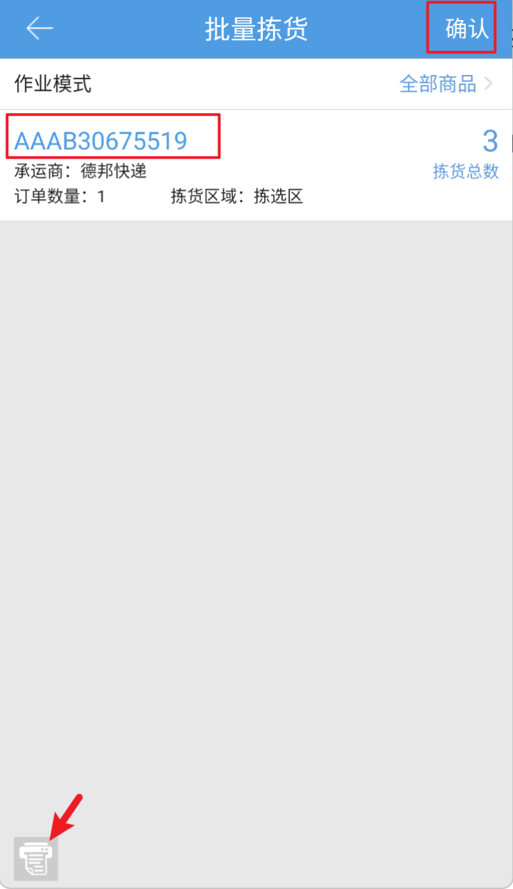

2.2 容器拣货方式选择“播种车”

扫描容器编码领取到波次后，进入播种拣货模式，点击波次号可以查看商品详情，可按需切换作业模式和开启后置打单开关，点击右上角确认按钮，继续拣货流程，后续流程和[播种拣货](https://hupun.yuque.com/unzko7/lsbfg0/yslltcrchttp7w92)一致：

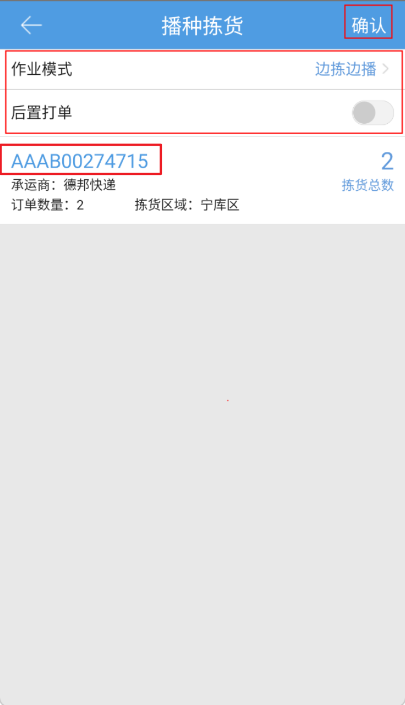

2.3 容器拣货方式选择“拣货时选择”

扫描容器编码领取到波次后，进入模式选择页面，点击波次号可以查看商品详情，可按需选择播种拣货或批量拣货模式，继续拣货流程，若选择播种拣货则后续流程和[播种拣货](https://hupun.yuque.com/unzko7/lsbfg0/yslltcrchttp7w92)一致，若选择批量拣货则后续流程和[批量拣货](https://hupun.yuque.com/unzko7/lsbfg0/gcgvupeqazgwzul4)一致：

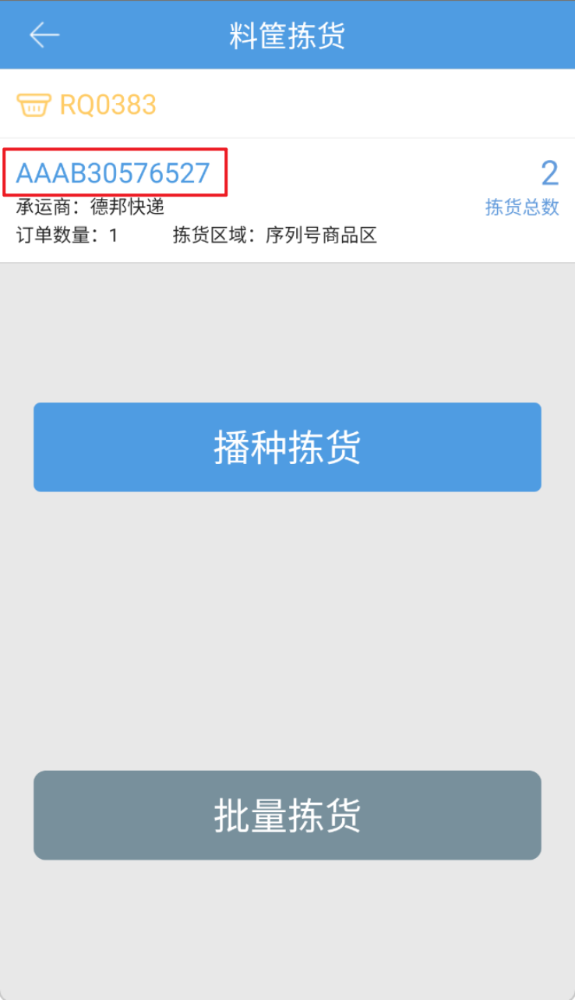

3、拣货方式关联PC端配置

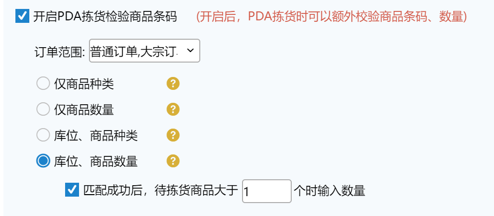

3.1 未开启PDA拣货校验商品条码

选择波次后，扫描商品行上的库位，商品行自动标记已完成：

点击商品行上的数量，可以直接修改商品数量：

3.2 开启PDA拣货校验商品条码，按配置方式校验库位和商品

①仅商品种类：仅扫描商品条码，每种SKU扫描一次

②仅商品数量：仅扫描商品条码，按商品数量扫描

③库位、商品种类：先扫描库位编码再扫描商品条码，每种SKU扫描一次

④库位、商品数量：先扫描库位编码再扫描商品条码，按商品数量扫描（逐渐扫描）

所有商品行都已完成后，点击确认，即可提交下一环节：

 料筐拣货自动领取逻辑：

1.仅领取勾选了波次策略-允许领单-料筐拣货的波次；

2.仅领取待打单环节且生成电子面单的波次（后台开关可配置领取无电子面单波次）；

3.按照PDA选择的库区领取对应待打单的波次；

4.预配波次优先普通波次；

5.若波次订单都被拦截挂起，则不领取该波次；

6.波次中有订单含有序列号、批次号商品、拣选区域为空，波次打印过快递单、发货单、配货单、发票该波次不会被领取；

7.仅领取与拣货筐指定的库区、承运商、指定波次一致的波次。

> 更新: 2024-10-25 14:22:46  

> 原文: <https://hupun.yuque.com/unzko7/lsbfg0/atpnq1abcxaah749>

---

### 05.7.8 PDA-自由领单

> 原始文件来源：`00-源文件/PDA安卓端/出库_B2C/拣货/PDA-自由领单.md`

业务场景：针对一种一件的订单，特别是服装相关行业（订单比例可大于60-70%），希望有比目前系统更加相对便捷简单的拣货。

#### 01.自由领单

具体步骤如下：

1.点击自由领单按钮，用户可见如图界面，选择作业库区，点击领取任务按钮，操作员领取到任务并进行作业。

2.领取任务后，跳转到如图界面，操作员进行拣货。

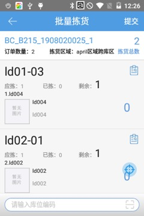

3.拣货提交后，任务完成，即可点击领取任务，领取下个任务。

#### 02.领单逻辑

1.正常领取情况，前提都是自由波次

①.若操作员已有拣货任务，进入自由领单菜单后自动加载该任务。

②.波次中有部分订单被拦截或挂起，该波次可以被正常领取。

③列号登记环节在验货环节，波次中的订单有序列号商品，该波次可以被正常领取。

④.波次上无打印标记，订单有或没有打印标记，该波次可以被正常领取。

⑤.波次中的订单都生成电子面单，该波次可以被正常领取（后台开关可配置领取无电子面单波次）。

⑥.自由波次生成波次后，策略停掉，该波次可以被正常领取。

2.领取不到情况

①.所选作业库区下无自由波次，领取不到任务。

②.波次的拣选区域为空，领取不到任务。

③.波次上有打印标记，该波次不能被领取到。

④.序列号登记环节在打单或拣货环节，波次中的订单有序列号商品，该波次不能被领取到。

⑤.无拣货环节，不能领取到任务。

⑥.波次中的订单都被拦截或挂起，该波次不能被领取到。

⑦.领取不到符合扫描打单或料筐拣货的波次。

3.领单顺序

优先标记的波次（订单中标记预售>天猫直送>COD订单>加急订单）>区域库区下的作业数（少>多）>波次生成时间（早>晚）>波次优先级（高>低）>波次库区ID（小>大）

> 更新: 2024-10-15 11:15:41  

> 原文: <https://hupun.yuque.com/unzko7/lsbfg0/lu9gz5wg7bc29wdu>

---

### 05.7.9 PDA-订单拣货

> 原始文件来源：`00-源文件/PDA安卓端/出库_B2C/拣货/PDA-订单拣货.md`

pda的订单拣货只能单笔提交下一环节，具体操作步骤如下：

1.点击订单拣货按钮，用户可见如图界面，通过输入、扫描系统单号或运单号操作需拣货订单。

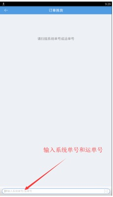

2.选择订单后，用户可以根据商品显示的库位进行取货。扫描库位，相应订单需要此库位上的商品就会标记已完成。

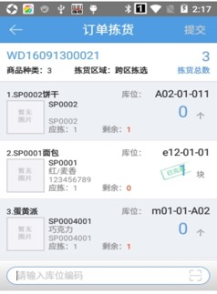

点击商品数量，弹窗可修改数量，点击完成即可。

支持右上角查看拣货进度，扫描商品条码，拣货进度根据扫描商品的数量更新，扫描箱条码时，拣货进度增加的是箱内库存的数量；

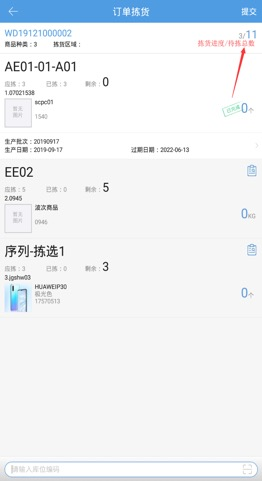

3.所有的商品行都为已完成，则会自动弹窗提交，点击确认即可。

4.开启按库区接力拣货，一个库区明细拣货完成后，提示库区拣货已完成是否提交，确认提交后生成接力拣货任务。下个库区拣货直接扫描运单号领取接力拣货任务。

提示

1. 如开启了PDA拣货检验商品条码配置，则根据配置的结果，拣货时进行库位或商品条码扫描。

2.序列号商品，扫描商品条码后跳转序列号录入界面，商品数量不可编辑。 

3.一次性录入序列号，后台开关开启保留区间截取，示例：

解析规则：保留区间截取，品牌：新增的品牌，保留区间截取第6到18位，条码长度范围为从0-21

商品A系统中商品条码69200811001-新增的品牌-序列号商品

商品B系统中商品条码69200811002-新增的品牌-非序列号商品

收货入库页面扫描条码1234569200811001001，匹配到了商品A且录入序列号1234569200811001001。

收货入库页面扫描条码1234569200811002001，匹配到了商品B不录入序列号。

4.若商品为序列号商品且序列号登记环节在拣货，即商品需录入序列号，序列号支持修改。

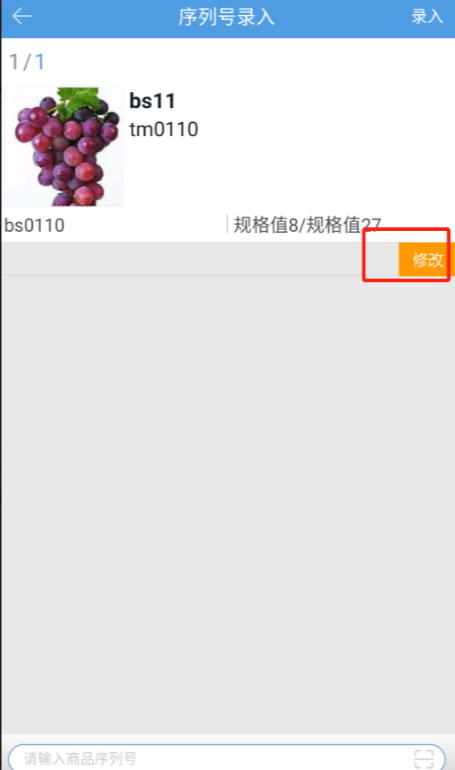

点击修改输入序列号若符合，则确认后修改成功。

注：修改序列号不会再次扣减库存。

> 更新: 2024-07-04 13:49:41  

> 原文: <https://hupun.yuque.com/unzko7/lsbfg0/bwipfoa3yuv0g7zh>

---

### 05.7.10 PDA-领单播种拣货

> 原始文件来源：`00-源文件/PDA安卓端/出库_B2C/拣货/PDA-领单播种拣货.md`

领单播种拣货

可以直接点击领取波次或者扫描播种车编码领取任务，点击领取仓库中后置打印业务，播种拣货实现无纸化操作，扫播种车一般是拿着打印单去进行拣货，没有后置打印。播种车时在PC容器管理中增加配置的。

前置条件：a).PC端波次策略-允许PDA领单-选择领单播种拣货。

b).波次内订单有生成电子面单。

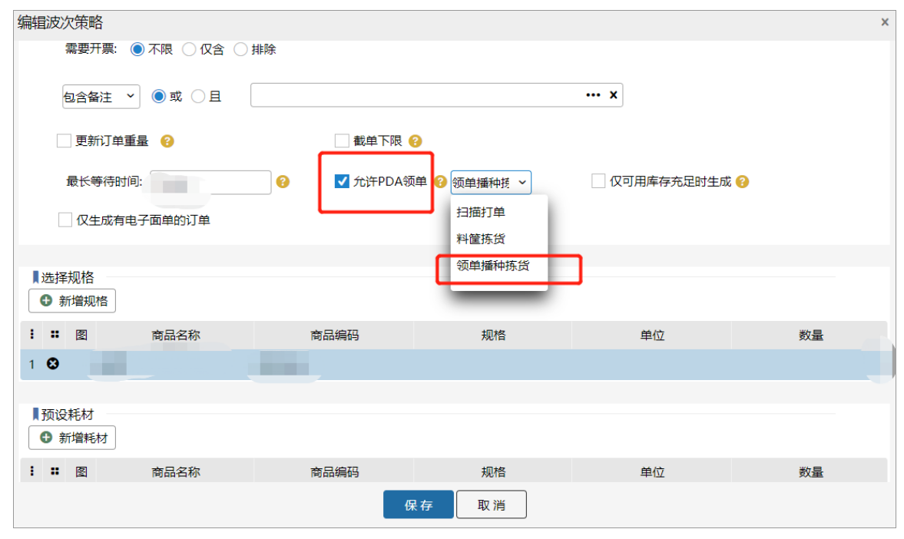

1、点击领单播种拣货按钮，进入领单播种拣货首页面。

领单方式1：领取任务

(1).可进行库区选择，待处理波次将在指定作业区域内筛选，记忆在仓库+操作员+本地上。

(2).领取的波次类型：非自由波次。

可领取的波次内订单状态为待拣货或待打单，且优先领取待拣货波次。

先领取有优先标记的波次，都有优先标时订单预售>天猫>代收货款>加急。

领单方式2：选择任务

(1).先选择作业模式，再点击“选择任务”

(2).可按指定条件筛选任务，在列表中直接点击某个任务或通过扫描配货单号领取任务

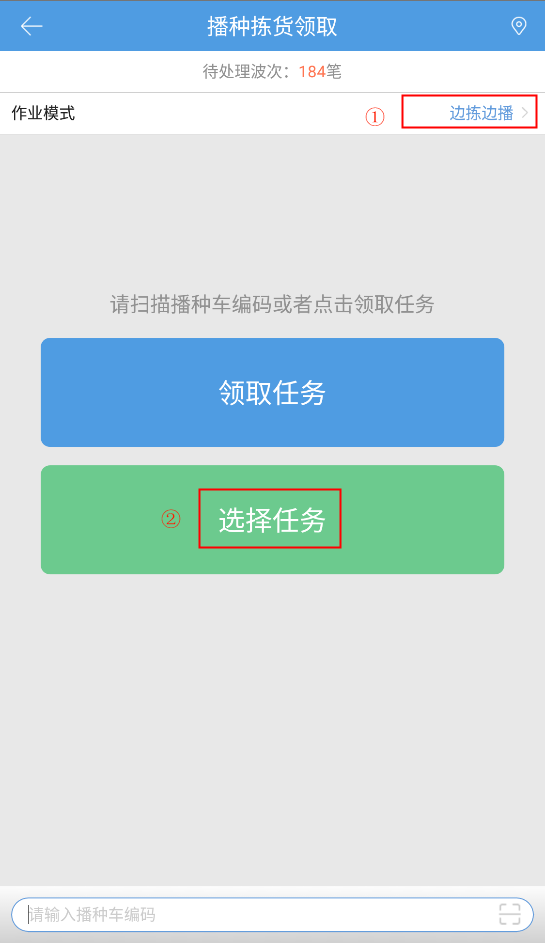

(3).设置中可选择分页样式和合并样式，分页样式可选择作业模式为边拣边播或先拣后播，合并样式为边拣边播，作业模式记忆在仓库+操作员上。

(4).支持后置打印，点击领取拣货完成后，扫工作台进行打印运单。

(5).在其他菜单下已有绑定任务的前提下，再在领单播种拣货领取新的任务，会报错提示。

(6).PC端拣货作业报表-执行页面增加领单播种拣货，可进行绩效数据查看。

2.选择边拣边播作业模式，点击领取任务，显示播种框分布。

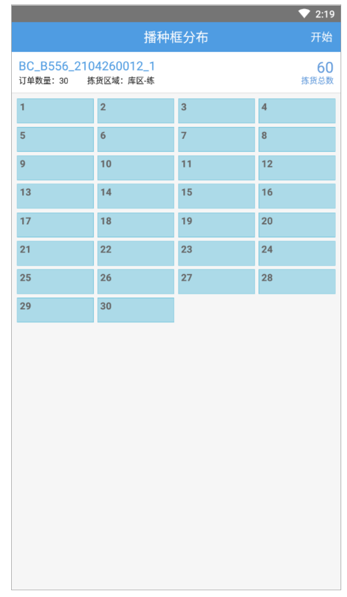

3.跳转至拣货页面，该库位该商品拣货完成后，进行播种。

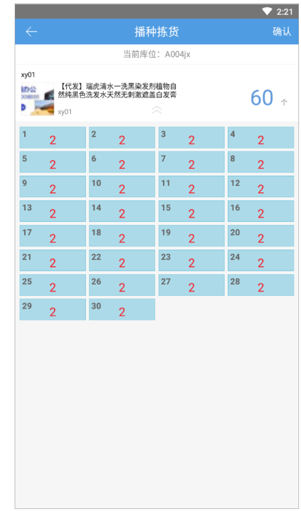

4.全部商品拣货完成，播种完成后，提示提交拣货，确认后订单到下一环节。

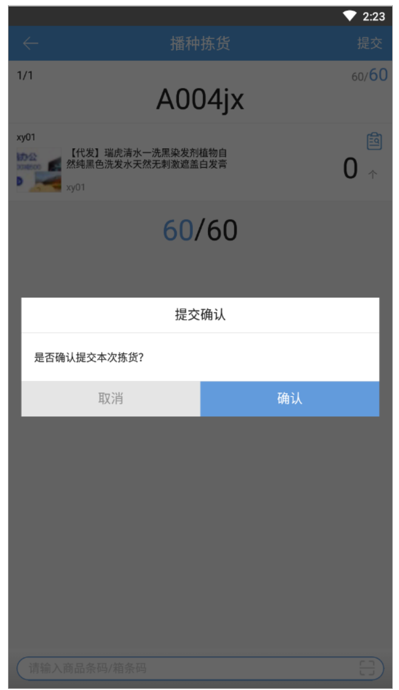

5.选择先拣后播作业模式，支持全部拣货后进行播种，详细用法见播种拣货-先拣后播。

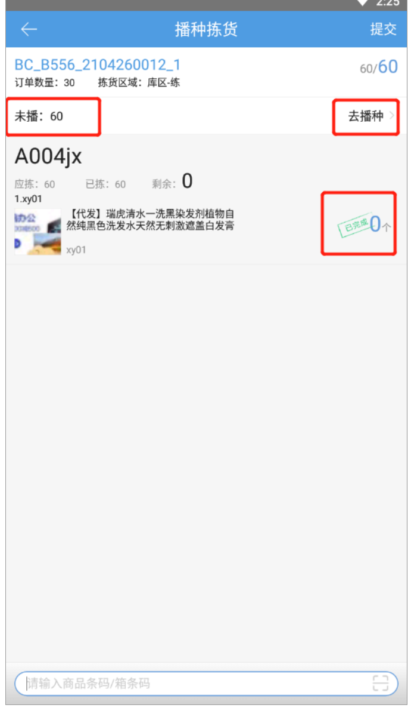

6.提交拣货完成后，跳转至后置打印页面扫描工作台编码打印运单。

支持修改工作台，修改后获取正确的工作台信息，自动打印。

若工作台ip不对，支持修改ip后，点击“打印运单”按钮，正常打印。

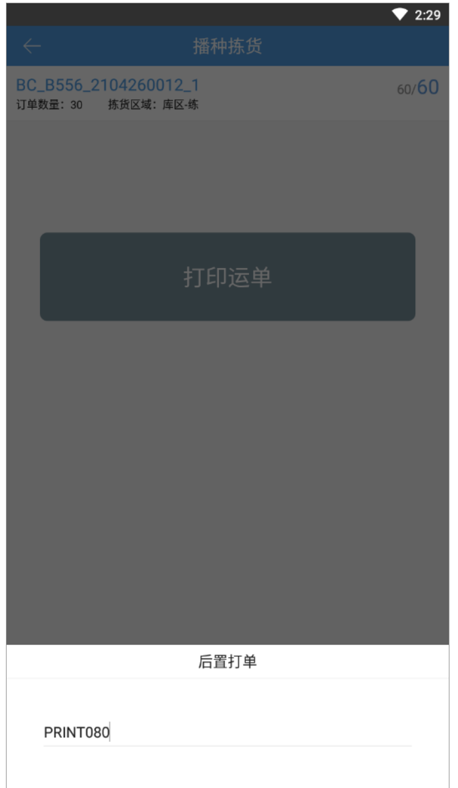

7.PDA拣货模式支持-拣货报缺时全部订单提交拣货后再提交报缺（订单拣货、批量拣货、自由领单+批量拣货、播种拣货、料筐拣货、领单播种拣货）

a).业务配置-出库配置-开启订单缺货处理-选择已拣库存异常打回时还回-显示跳过缺货库位仅记录缺货数量

b).波次内有商品明细报缺时跳过该商品，仅记录缺货数量，不显示报缺明细（如有已拣再报缺，已拣明细和数量显示，报缺数量不显示），所有明细都拣货完成后提交拣货时，正常订单到下一环节，有后置打印的正常打印，缺货订单提交到缺货，拦截挂起订单提交到异常订单，异常页面显示缺货订单和拦截挂起订单。

c).PDA拣货开启接力拣货时，最后一个操作员提交拣货时订单再提交缺货订单。

> 更新: 2023-12-21 09:57:22  

> 原文: <https://hupun.yuque.com/unzko7/lsbfg0/pzhxy8lfv7wqzkls>

---

### 05.7.11 PDA-快捷播种

> 原始文件来源：`00-源文件/PDA安卓端/出库_B2C/验货/PDA-快捷播种.md`

快捷播种，pda通过扫描配货单号或容器编码，对同品波次或预配波次进行播种，具体步骤如下：

1.扫描配货单号或容器编码，匹配同品波次或预配波次

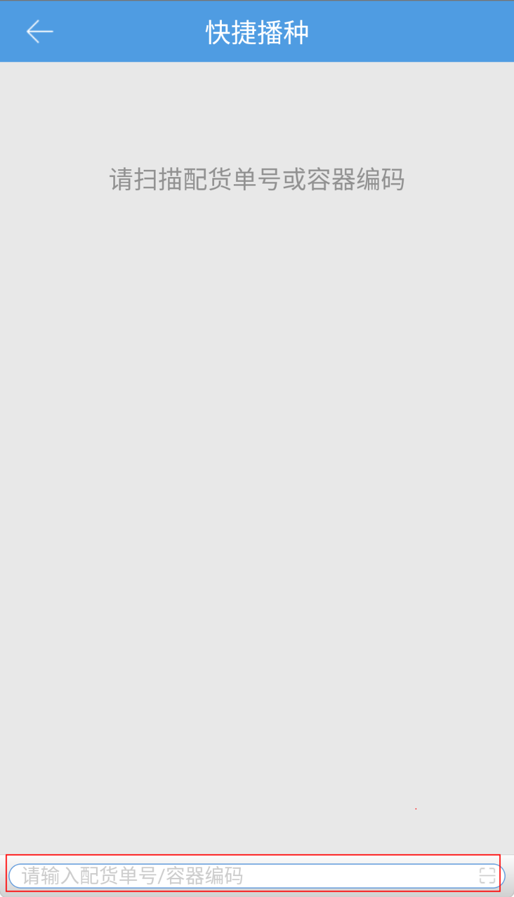

2.开启后置打印，扫描商品条码进行播种

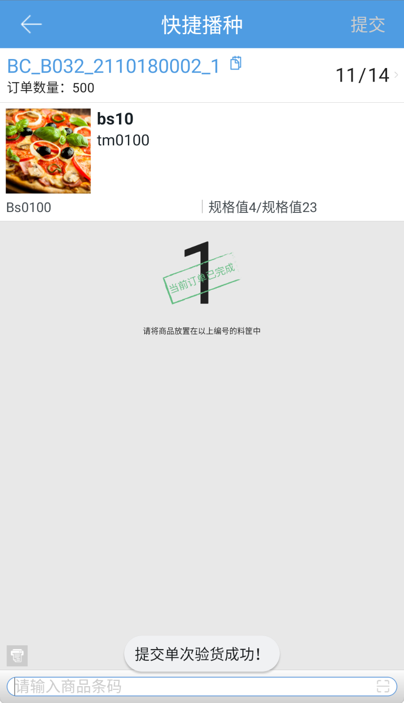

点击配货单号后的按钮，可查看剩余订单情况：

波次内所有订单播种完成后，显示提交确认弹窗，确认后波次播种成功，提交到下一个环节。

> 更新: 2024-02-06 11:15:39  

> 原文: <https://hupun.yuque.com/unzko7/lsbfg0/rhrk0zo2pq5fk6lr>

---

### 05.7.12 PDA-快速验货

> 原始文件来源：`00-源文件/PDA安卓端/出库_B2C/验货/PDA-快速验货.md`

快速验货，用户可直接扫描订单无需扫描商品进行验货。

作业模式：单笔作业、批量作业

① 单笔作业：用户扫描输入系统单号或运单号后，界面显示相应订单的详细信息，如图所示。

② 批量作业：用户扫描输入配货单号后，界面显示相应订单的详细信息，如图所示。

继续扫描下一笔订单/波次，第一次输入的订单会自动提交下一环节。点击右上角的提交按钮，可手动提交当前显示的订单/波次至下一环节。

> 更新: 2023-12-21 09:28:17  

> 原文: <https://hupun.yuque.com/unzko7/lsbfg0/zybgvy519ollfpl3>

---

### 05.7.13 PDA-抽检验货

> 原始文件来源：`00-源文件/PDA安卓端/出库_B2C/验货/PDA-抽检验货.md`

PDA抽检验货

同品、预配波次有大批量相同明细的单据，如若批量验货则容易出现整个波次拿错货的情况，所以需要对其中一单进行抽查检验，由于同品订单在打印时往往是连着打，那么撕单时就可能撕错，就导致发错货，因此在抽检的时候抽检方式也需要多样化。

PDA抽检验货的操作步骤如下：

1.点击抽检验货按钮，扫描同品/预配波次的波次号匹配订单。

a).可选择验货模式有：普通验货、首尾验货、随机验货、首尾+随机验货，作业模式记忆为仓库+操作员上。

2.验货模式-普通验货

a).波次中共3笔订单，每笔订单明细均为sku1：数量3个。

b).扫描商品条码，验货波次的其中一单，提交整笔波次验货完成。

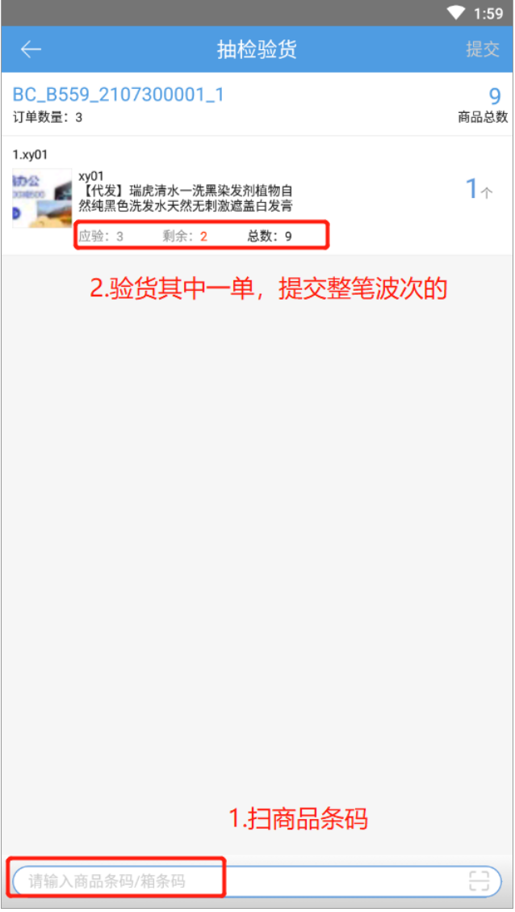

3.验货模式-首尾验货

a).扫描波次号后，页面显示整笔波次的首单的系统单号/运单号和尾单的系统单号/运单号。

b).首单和尾单都校验完成后，跳到抽检验货页面，扫描商品条码进行验货一单，验货完成波次内所有订单正常提交到下一环节。

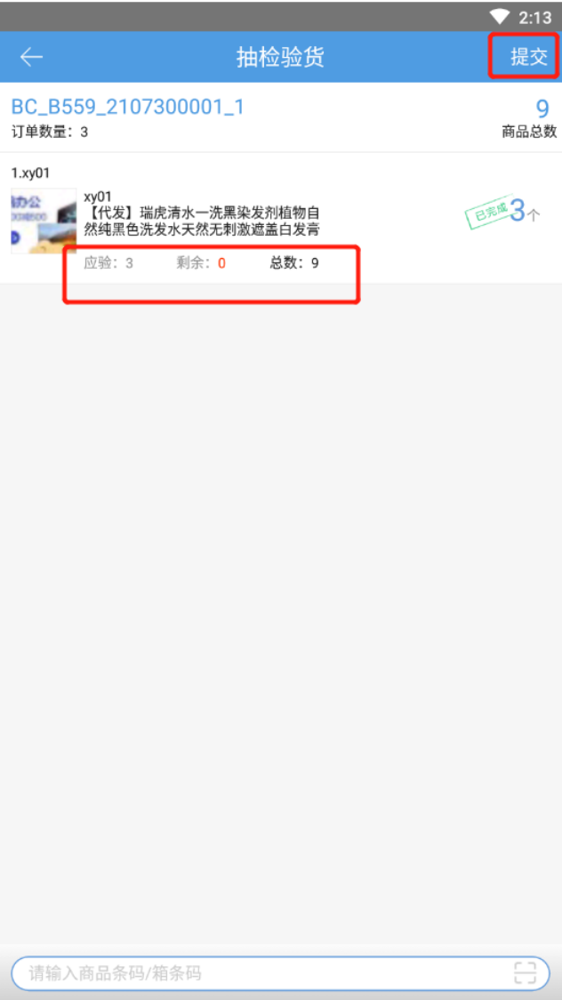

4.验货模式-随机模式

a).扫描波次后跳到随机验货页面，下方扫波次内任意订单的系统单号/运单号匹配订单。

b).校验订单属于该波次成功后，点击确定，跳到抽检验货页面扫描条码验货，验货未完成，提交按钮置灰，无法提交；完成后整笔波次订单提交到下一环节。

5.验货模式-首尾+随机验货

a).扫波次后显示波次的首单和尾单，不校验，点击确定，无法进行下一步。

b).校验首单和尾单后，扫波次内其他任意订单的单号跳到抽检验货页面，扫描条码进行验货

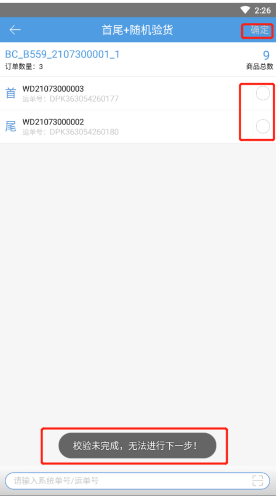

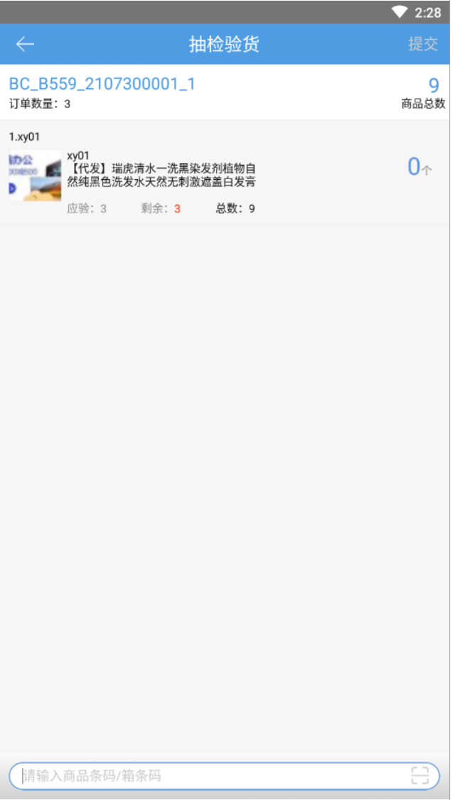

注：

1.验货模式仅是作为抽检订单是否属于当前波次。

2.当波次内仅有1单时不进行检验订单。

3.此页面支持扫含生产批次商品的波次。

4.商品明细数量编辑关联权限配置，勾选权限的允许手动修改数量，未勾选的不允许修改数量，只能通过扫描条码录入明细。

6.验货核对批次

开启验货核对批次-抽检验货后，验货步骤分为校验订单--核对批次两个步骤，其中校验订单的方式和上述四种模式一致，核对批次的方式如下，以首尾验货为例。

①.手动选择核对

扫描波次后，订单信息显示首单信息，需先完成首尾单校验，再验商品：

扫描商品条码后，若有多个批次号，则扫描商品条码后转到生产批次列表，可以扫描输入商品条码；若只有1个批次号，则直接增加已验数量：

     

每个组合核验完成后，会自动切换显示下一个组合，并刷新“组合”和“本次剩余验货订单”数据，直到最后一个组合核验完成后，可以录入耗材或提交整个波次。

组合：指在波次订单中，如果商品批次号不同，那么订单中出现不同的批次搭配都记为一种组合。

例：波次中有4个订单，订单1 明细a 锁定批次01 数量1 批次02 数量2，订单2 明细a 锁定批次01 数量3，订单3 明细a 锁定批次01 数量2 批次02 数量1，订单4 明细a 锁定批次01 数量1 批次02 数量2

上述波次共有3个组合：组合1：明细a 锁定批次01 数量1 批次02 数量2，共2个订单；组合2：明细a 锁定批次01 数量3，共1个订单；组合3：明细a 锁定批次01 数量2 批次02 数量1，共1个订单

②.扫描批次号核对

扫描波次后，订单信息显示首单信息，需先完成首尾单校验，再验商品

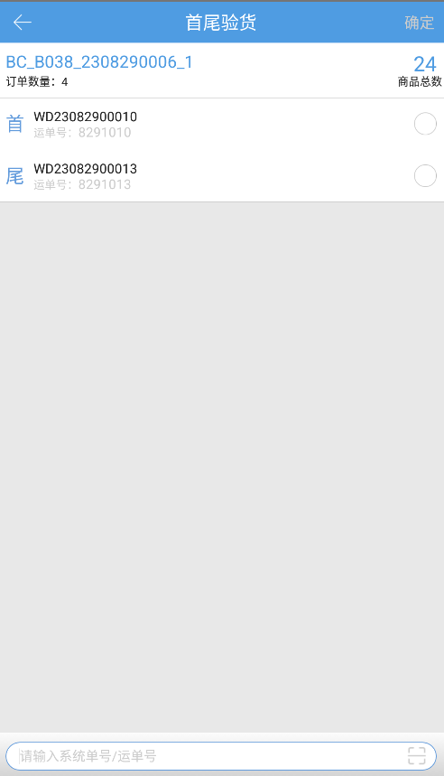

每次扫描生产批次商品，都会转到生产批次列表，可以扫描输入批次号：

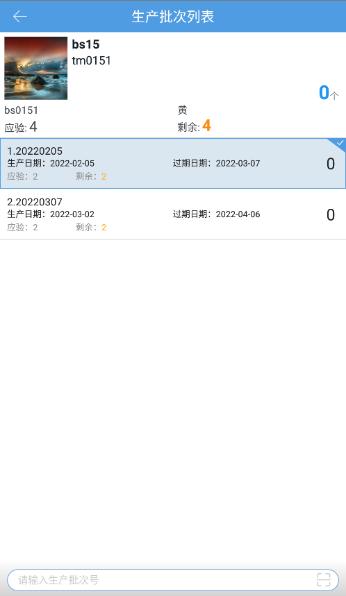

每个组合核验完成后，会自动切换显示下一个组合，并刷新“组合”数据，直到最后一个组合核验完成后，可以录入耗材或提交整个波次。

> 更新: 2023-12-21 09:56:43  

> 原文: <https://hupun.yuque.com/unzko7/lsbfg0/nsnbnf6zpmr8xirm>

---

### 05.7.14 PDA-播种验货

> 原始文件来源：`00-源文件/PDA安卓端/出库_B2C/验货/PDA-播种验货.md`

播种验货，可以帮助用户使用料框模式盲扫商品来验货，当扫到的商品匹配上订单后，会显示对应的筐号，用户只需要将商品放入对应的播种框中，具体操作如下：

一、点击播种验货按钮，用户可见如图界面，扫描配货单号或者拣货筐编码进行验货。

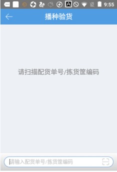

二、选择波次后，开启后置打印，扫描工作台编码。

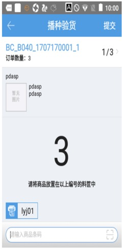

扫描波次中相应的商品条码，显示商品和对应的筐号。

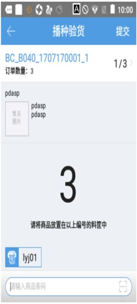

1.pc上流程配置开启验货商品条码截取，pda会自动生效。若截取条码前3位，商品条码是new0001，则pda只需要扫描条码new即可完成验货。

2.pc上流程配置开启商品序列号管理-选择序列号出库登记环节为验货，pda会自动生效。扫描开启序列号的商品条码时要输入正确的序列号才可以完成验货。

当未开始验货或者部分验货时，点击提交，查看到播种筐验货情况

1.  播种筐中的“X”，表示该订单被拦截或者挂起。

2.已完成验货的绿色高亮显示。

三、验货完成，点击提交，即可提交到下一环节且打印快递单。

1.打印快递单时，pc和pda需处于同一局域网下且快递单模板时菜鸟模板。

2.部分提交时，只打印已验货完成的订单。

3.订单全部被拦截或挂起，不打印快递单。

> 更新: 2023-12-21 09:28:17  

> 原文: <https://hupun.yuque.com/unzko7/lsbfg0/wil6bzwnagbvnmwi>

---

### 05.7.15 PDA-条码验货

> 原始文件来源：`00-源文件/PDA安卓端/出库_B2C/验货/PDA-条码验货.md`

#### 1、未启用视频录制功能

##### 1.1 基本步骤

用户可扫描订单号和商品条码进行验货。具体操作步骤如下：

点击条码验货按钮，通过扫描系统单号和运单号操作订单。

扫描输入相应订单的商品条码即可验货。如图输入kw102，商品行数量为1且自动标记已完成。

用户也可以点击商品数量，进行直接编辑修改。

提示

a.pc上流程配置开启验货商品条码截取，pda会自动生效。若截取条码前3位，商品条码是new0001，则pda只需要扫描条码new即可完成验货。

b.开启赠品属性商品免验货则赠品商品数量直接带出无需输入。

c.开启序列号扩展属性后台开关+序列号登记环节：验货，操作页支持扫外箱码不跳转序列号录入页直接快速带出序列号。

d.当发现商品拣货时少拣漏拣，可点击库位查看商品的缺货库位即原始锁库库位。

e.商品明细数量编辑关联权限配置，勾选权限的允许手动修改数量，未勾选的不允许修改数量，只能通过扫描条码录入明细。

所有商品验货完成，点击确认即可提交下一环节。

提示：支持自动提交验货，只需要在系统设置了开启条码验货自动提交按钮。

##### 1.2 验货核对批次

##### ①.手动选择核对

扫描商品条码后，若有多个批次号，则扫描商品条码后转到生产批次列表，可以扫描输入商品条码：

查询模式切换，底部扫描框默认显示“条码”，若[开启集合码便捷录入](https://hupun.yuque.com/unzko7/lsbfg0/caki7lz4105n2vpg#CKIQO)开关，会显示“集合码”，通过扫描集合码来匹配商品条码，并跳转到批次设置页面。

##### ②.扫描批次号核对

每次扫描生产批次商品，都会转到生产批次列表，可以扫描输入批次号：

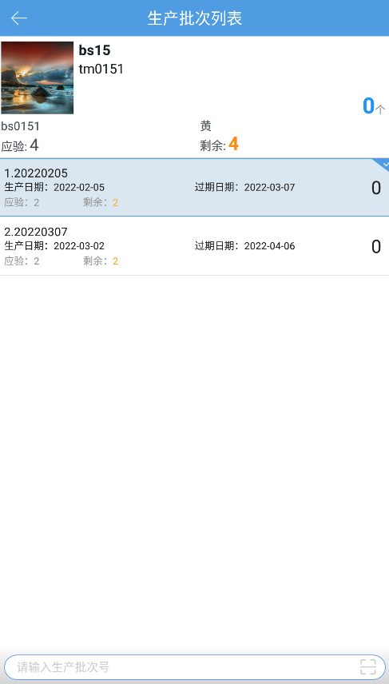

查询模式切换，底部扫描框默认显示“条码”，若[开启集合码便捷录入](https://hupun.yuque.com/unzko7/lsbfg0/caki7lz4105n2vpg#CKIQO)开关，会显示“集合码”，通过扫描集合码来同时匹配商品条码、生产批次号等多个信息。

开启批次匹配验货（联系客服开启）+验货核对批次+解析商品条码时核对批次，条码验货验货页扫批次号匹配到商品+批次号，不跳转批次验货页，直接对应批次号验货数量+1。

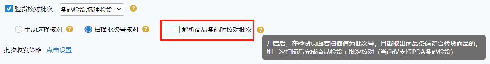

例：商品sku2，商品条码001，批次号001、002；

       扫001不跳转页面，批次001验货数量+1；扫002报错无匹配。

##### ③.序列号校验

序列号商品录入环节在“验货”环节时，若录入无效序列号，在提交订单时会将对应商品及序列号标红显示，不允许提交到下个环节，重新录入有效序列号后，可以正常提交。

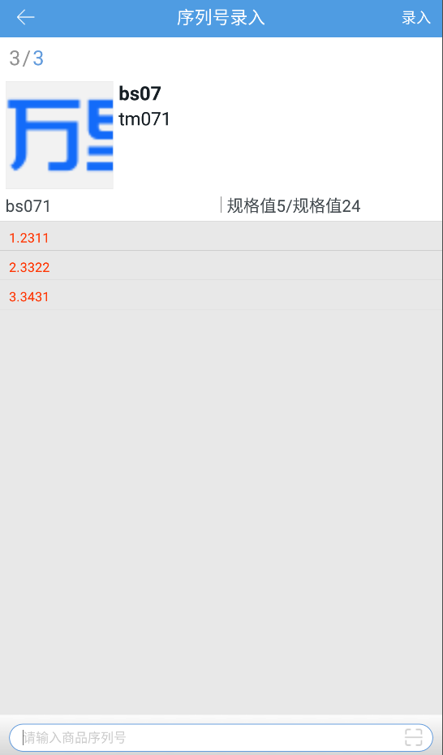

##### ④.序列号上传图片

拼多多平台且带【SN图片上传标记】的订单支持上传序列号商品图片，具体操作参考[专题功能介绍](https://hupun.yuque.com/unzko7/lsbfg0/izydyvvvxo58sagh)。

##### 2、启用视频录制功能

视频录制步骤请参考[订单打包](https://hupun.yuque.com/unzko7/lsbfg0/wpnzfyg3ouuupkn6#dM3ZH)相关内容。

> 更新: 2026-06-15 15:52:27  

> 原文: <https://hupun.yuque.com/unzko7/lsbfg0/kedwevg81h50ddpk>

---

### 05.7.16 PDA-独立播种

> 原始文件来源：`00-源文件/PDA安卓端/出库_B2C/验货/PDA-独立播种.md`

独立播种，可以帮助用户使用料框模式盲扫商品来验货，当扫到的商品匹配上订单后，会显示对应的筐号，用户只需要将商品放入对应的播种筐中，不提交验货。

(1) 点击“独立播种”，进入独立播种扫描页面。

(2) 扫描波次或拣货筐，进入播种页面，点击左下角开启后置打印，扫描工作台编码。

(3) 扫描波次中相应的商品条码，显示商品和对应的筐号。

    提示

    ①.条码截取：pc上流程配置开启验货商品条码截取，pda会自动生效。若截取条码前3位，商品条         码是new0001，则pda只需要扫描条码new即可完成验货。

(4) 播种完成后，自动跳到，播种筐分布页面，点击提交，提交播种并打印快递单。

    提示

    ①.播种筐中的“X”，表示该订单被拦截或者挂起或者不在验货环节了。

    ②.打印快递单，pc和pda需处于同一局域网下且快递是开启电子面单的。

(5)若播种的过程中，发现订单中的商品缺失了，可以进行缺货报缺。

    提示

    ①.批量报缺：多笔订单可以同时报缺且是整笔订单都报缺。

    ②.拆单并报缺：订单缺货的部分拆出一个新订单，未缺货的可以正常提交播种。

(6)查看商品详情，不区分订单的。

**注：独立播种和播种验货只能二选其一，在****PC****端****-****仓内策略****-****业务配置****-****出库配置中开启验货环节订单独立播种，则显示独立播种菜单；否则显示播种验货菜单。**

> 更新: 2023-12-21 09:28:17  

> 原文: <https://hupun.yuque.com/unzko7/lsbfg0/mgy11boewo3b2ym5>

---

### 05.7.17 PDA-自由验货

> 原始文件来源：`00-源文件/PDA安卓端/出库_B2C/验货/PDA-自由验货.md`

业务场景：针对一种一件的商品，特别是服装相关行业（订单比例可大于60-70%），希望有比目前系统更加相对便捷简单的拣货、验货方式。希望可以在验货的时候直接扫描商品条码，系统自由匹配订单后置打印出快递单。

自由验货，通过操作员手拿实物去扫商品条码匹配订单，进行验货并后置打印快递单。

具体页面如下：

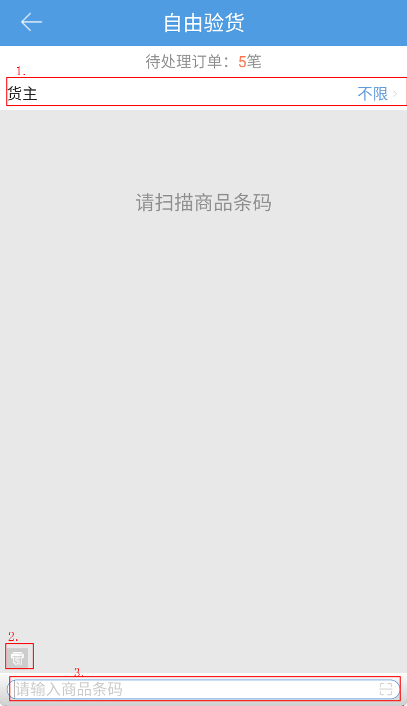

1.先选择货主，默认选择是不限货主；

2.开启后置打印，输入工作台编码；

3.扫描商品条码，匹配订单并自动验货，提交验货并打印快递单；

4.待处理订单数，是处于待验货且是归属自由波次下的订单数。

> 更新: 2024-02-06 10:48:21  

> 原文: <https://hupun.yuque.com/unzko7/lsbfg0/vvgpnoq5ktdufg0g>

---

### 05.7.18 PDA-批量打包

> 原始文件来源：`00-源文件/PDA安卓端/出库_B2C/打包_称重/PDA-批量打包.md`

pda的批量打包支持对同品、混品、预配波次的订单进行批量操作，具体步骤如下：

1、未开启耗材管理时，系统自动提交打包

(1).点击批量打包按钮，用户可见如图界面，通过输入、扫描系统单号/运单号/配货单号操作需打包订单：

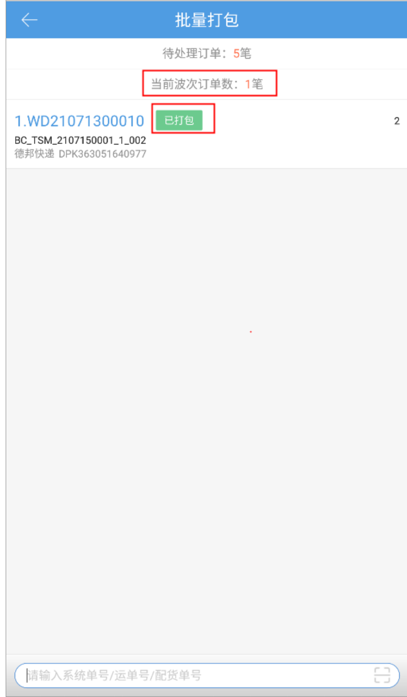

提示：

1.系统自动提交打包并打上标记，无需手动提交

2.当前波次订单数=该波次下待打包环节的订单数量

2、设置耗材登记环节为“打包”，开启耗材管理-耗材推荐，订单自动提交打包，打包耗材按推荐显示，不支持手动录入耗材

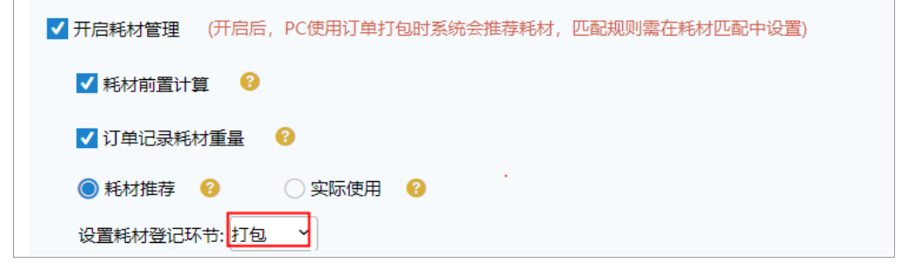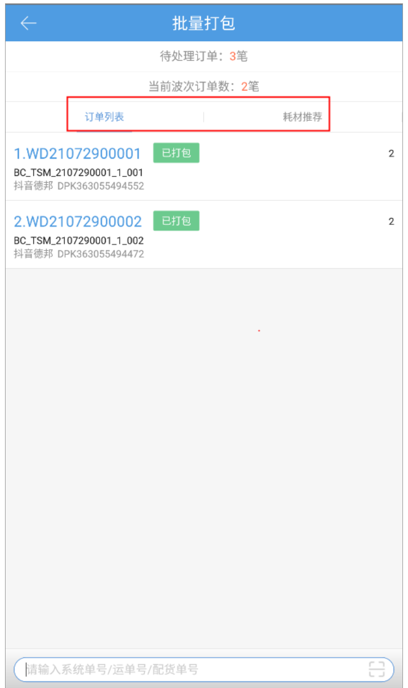

3、设置耗材登记环节为“打包”，开启耗材管理-实际使用，订单需手动提交打包，打包耗材默认按推荐显示，支持手动录入耗材并提交，若不录入耗材，则按推荐使用耗材：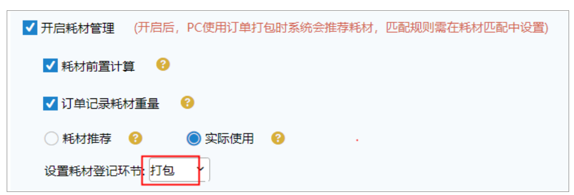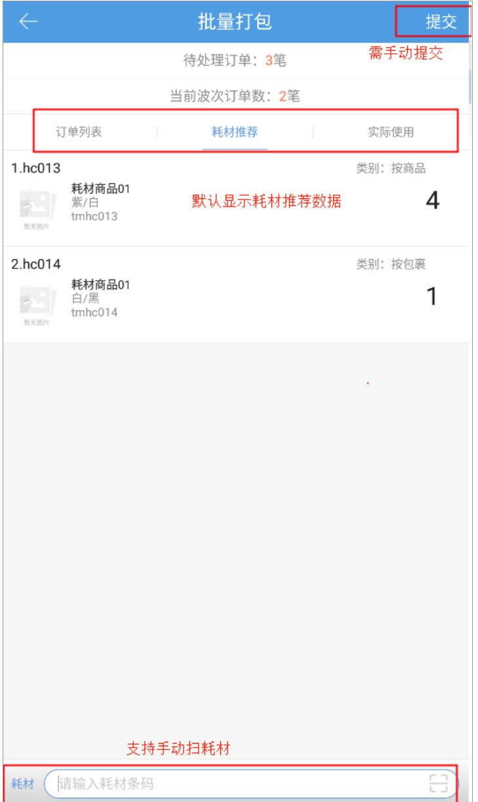

> 更新: 2023-12-21 09:57:28  

> 原文: <https://hupun.yuque.com/unzko7/lsbfg0/bf9hx00n75xuyvxl>

---

### 05.7.19 PDA-批量称重

> 原始文件来源：`00-源文件/PDA安卓端/出库_B2C/打包_称重/PDA-批量称重.md`

PDA的批量称重支持对同品、预配波次的订单进行批量操作，用户可以通过pda扫描订单，输入正确格式的重量即可提交称重。若用户期望先扫重量再扫订单，则点击底部输入框隔壁的按钮进行切换。

小贴士：PDA批量称重，连接蓝牙电子秤可实现称重输入哦。蓝牙电子秤推荐：坤宏KHW+、耀华XK3190

1.连接蓝牙电子秤（如需），扫配货单号匹配波次。

2.手动输入重量或通过蓝牙电子秤自动获取重量。

3.操作提交订单。

4.关联业务配置称重复核校验。

已设置校验，订单称重时重量不符合校验值则跳转到重量异常页，提示--称重重量与订单估重不符，超出允许范围+/-XXkg/%（或估重为0校验），能否继续提交称重关联是否有强制提交称重权限。

> 更新: 2023-12-27 10:50:21  

> 原文: <https://hupun.yuque.com/unzko7/lsbfg0/xcr44bh728x40pyv>

---

### 05.7.20 PDA-称重复核

> 原始文件来源：`00-源文件/PDA安卓端/出库_B2C/打包_称重/PDA-称重复核.md`

称重复核，用户可以通过pda扫描订单，输入正确格式的重量即可提交称重。若用户期望先扫重量再扫订单，则点击底部输入框隔壁的按钮进行切换。

小贴士：PDA称重复核，连接蓝牙电子秤可实现称重输入哦。蓝牙电子秤推荐：坤宏KHW+、耀华XK3190

#### 1、未开启视频录制功能

1.1 点击称重复核按钮，输入系统单号/运单号，会显示相应订单的信息，如图所示。

1.2 直接输入重量，即可提交称重。

注：

a.开启称重复核自动提交，先称重后再扫订单后，自动提交称重复核。

b.关联业务配置称重复核校验。

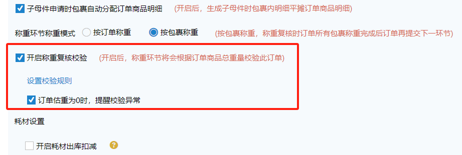

已设置校验，订单称重时重量不符合校验值则提示--称重重量与订单估重不符，超出允许范围+/-XXkg/%（或估重为0校验），能否继续提交称重关联是否有强制提交称重权限。

#### 2、开启视频录制功能

视频录制步骤请参考[订单打包](https://hupun.yuque.com/unzko7/lsbfg0/wpnzfyg3ouuupkn6#dM3ZH)相关内容。

> 更新: 2024-06-25 18:09:02  

> 原文: <https://hupun.yuque.com/unzko7/lsbfg0/hdhtv8gv3upb9fdz>

---

### 05.7.21 PDA-订单打包

> 原始文件来源：`00-源文件/PDA安卓端/出库_B2C/打包_称重/PDA-订单打包.md`

#### 1、未启用视频录制功能

pda的订单打包只能单笔提交下一环节，具体操作步骤如下：

1.1 未开启后置打印

点击订单打包按钮，用户可见如图界面，通过输入、扫描系统单号或运单号操作需打包订单，未开启打包环节登记耗材时，扫描订单自动提交打包：

开启耗材管理-打包环节登记耗材时，扫描单号后，会根据登记方式显示页面。

①按耗材推荐，匹配到订单后，默认展示耗材推荐列表，并自动提交订单：

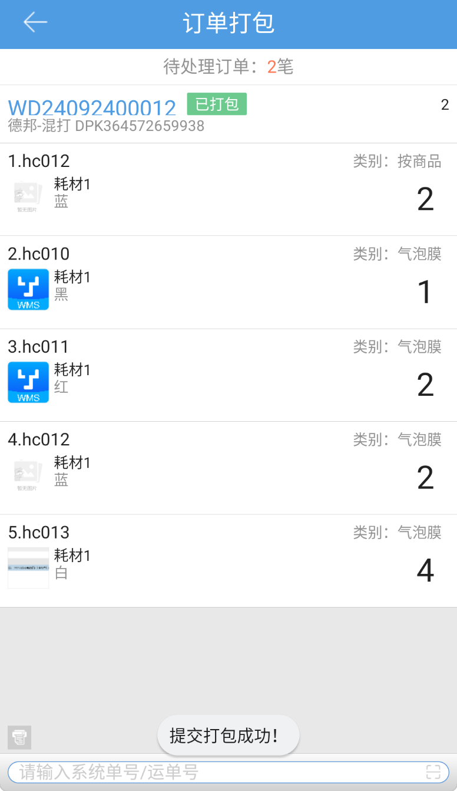

②按实际使用，匹配到订单后，默认展示耗材推荐列表，可按需录入实际使用耗材后提交订单：

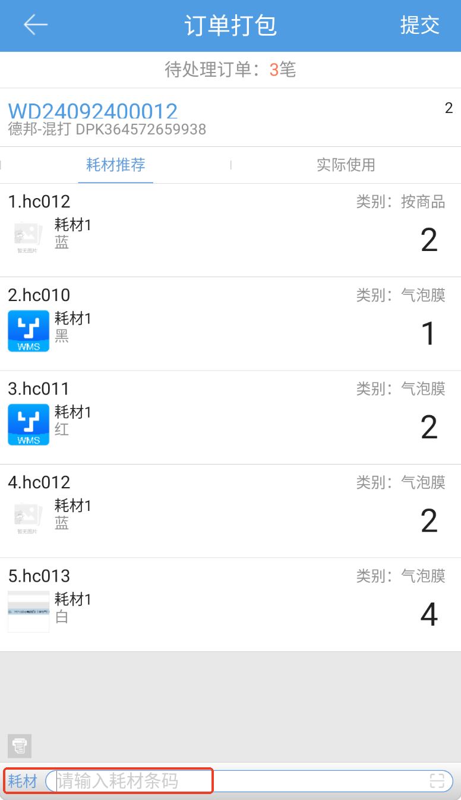

1.2 开启后置打印时，在订单提交成功后，会根据设置的工作台打印出单据：

#### 2、启用视频录制功能

**使用前提：当前仓开启“允许添加IPC摄像机及NVR网络录像机”，否则条码验货页面不显示工位选择入口**

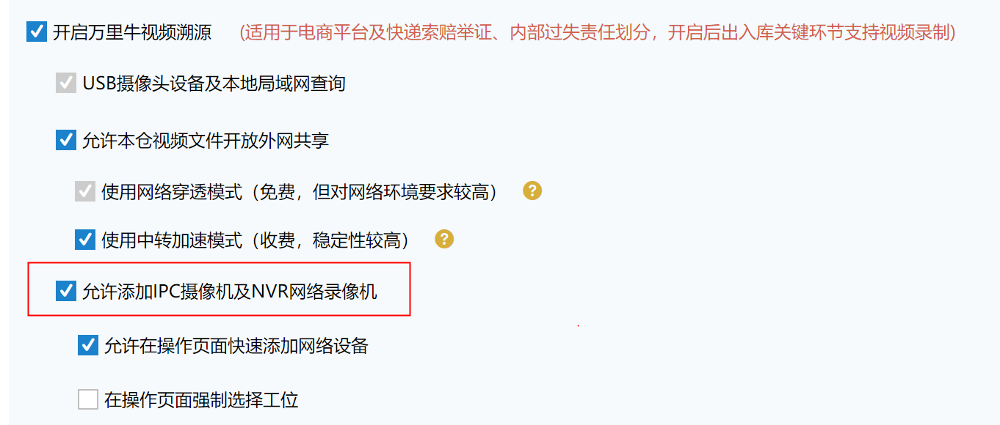

2.1 点击工位栏-请选择，跳转到工位选择列表，点击选择对应工位

   

2.2 选择工位后，若工位有绑定的IPC视频设备，则会自动带出IPC视频设备：

注：

1）此处选择工位后，不会带出所关联的USB视频设备

2）若开启“在操作页面强制选择工位”，则视频栏不能为空，否则扫描单号会报错先设置已绑定摄像头的工位；若未开启，则视频栏为空也允许继续操作。

2.3 订单打包操作同第1部分内容一致，此处不再赘述。订单提交成功后，在PC订单查询页面可以点击对应订单查看所录制的视频内容。

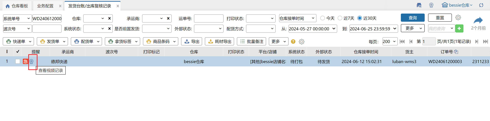

> 更新: 2024-10-25 11:11:25  

> 原文: <https://hupun.yuque.com/unzko7/lsbfg0/wpnzfyg3ouuupkn6>

---

### 05.7.22 PDA-扫描出库

> 原始文件来源：`00-源文件/PDA安卓端/出库_B2C/出库_交接/PDA-扫描出库.md`

输入系统单号、运单号、配货单号后查询到此订单，则会立即出库。

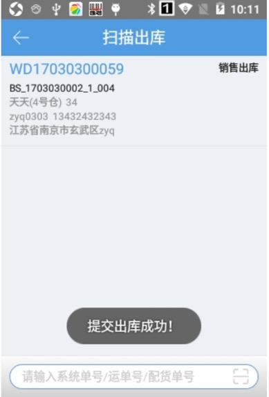

 在系统设置-语音播报-语音播报设置中开启“扫描出库承运商简称语音提示”，订单扫描出库成功后会播报承运商简称。

> 更新: 2024-02-02 10:32:18  

> 原文: <https://hupun.yuque.com/unzko7/lsbfg0/fyxom8bm8gn84txn>

---

### 05.7.23 PDA-承运商交接

> 原始文件来源：`00-源文件/PDA安卓端/出库_B2C/出库_交接/PDA-承运商交接.md`

承运商交接，用于仓库订单已出库时，记录是否有完成承运商交接。此处只要在这个页面有完成交接，则系统认为该订单已经交接到承运商处。具体操作如下：

选择交接方式（单笔、波次）以及交接承运商后，扫描订单的运单号（波次号），点击提交（F2）即可

在系统设置-语音播报-语音播报设置中开启“承运商交接承运商简称语音提示”，订单或波次匹配成功后会播报承运商简称.

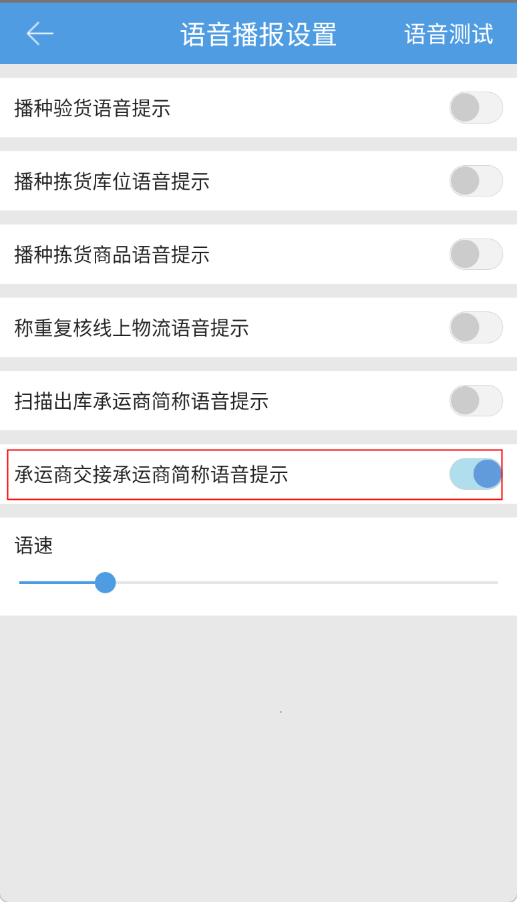

提示：

1.承运商选择无限制，扫描的订单要属于选择的承运商；

2.仅支持待出库、已出库环节的订单进行交接；

3.点击置零可以将此操作员目前选择的承运商的交接记录笔数清零；

4.交接方式选择单笔交接，支持扫描多笔订单一起交接，一次扫描限制200笔订单以内；

5. 只勾选一个交接承运商，订单匹配成功后，不会播报承运商简称；

6.勾选多个交接承运商，且波次中有多个不同承运商订单时，播报“xxx等多个”。

> 更新: 2024-02-02 10:36:51  

> 原文: <https://hupun.yuque.com/unzko7/lsbfg0/kv0pbqbh6w67lgqe>

---

### 05.7.24 PDA-以货找单

> 原始文件来源：`00-源文件/PDA安卓端/出库_B2C/其他/PDA-以货找单.md`

通过PDA扫描指定库位，扫描任意商品，系统将自动匹配对应订单（一单一货），将其快速提交到验货之后的环节，便于商家快速出库，优先发出退货商品。

一。进入以货找单页面，首先跳转至库位选择页选择库位，库位可选范围为所有非次品库位

二。设置后置打印，输入工作台编码连接打印机，否则输入商品条码后会报错

三。输入商品条码后显示匹配到的订单，库位锁定库存，点击提交或者开启以货找单自动提交将订单快速提交至验货的下一环节，打印单据，实现快速出库，点击返回或者切换库位后会解锁库存

注意：

1.订单匹配规则：

1）待分配有普通/电子面单的订单

2）找单逻辑：未锁定>锁定失败>已锁定>最晚发货时间>付款时间

订单支持重锁，如订单已锁定拣选库位A01-01-A01，异常暂存库位YC01上存在该订单商品库存，选择库位YC01，输入商品条码，可将订单重新锁定在异常暂存库位YC01上，这样可以先清理掉异常暂存库位库存

2.匹配订单锁定库存后，5分钟内无操作会自动解锁库位释放库存

3.匹配订单锁定库存后，待分配页面不支持将订单打到零拣，不能自动/手动生成波次，不能解锁库未分配，不能移至大宗，也不能回收电子面单等操作

4.匹配订单锁定库存后，该笔订单不能被波次拦截替换

> 更新: 2023-12-21 09:58:08  

> 原文: <https://hupun.yuque.com/unzko7/lsbfg0/zl5p3g4rp3alp5tw>

---

### 05.7.25 PDA-拆包补打

> 原始文件来源：`00-源文件/PDA安卓端/出库_B2C/其他/PDA-拆包补打.md`

针对大件商品，把货搬到电脑跟前扫码拆包不方便，因此新增PDA拆包补打功能，输入想要拆单的订单可进行多次拆单并支持变更快递。

1.点击取号承运商，可以进行修改快递

2.选择要拆出的明细后，点击提交，可以选择继续拆单或是直接提交

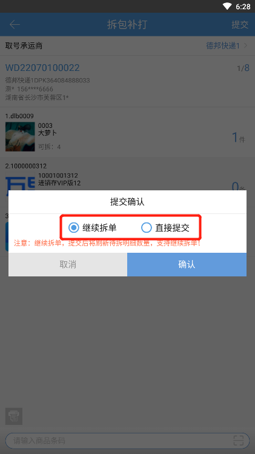

3.支持后置打印，提交后可以进行补打单据

> 更新: 2023-12-21 09:56:32  

> 原文: <https://hupun.yuque.com/unzko7/lsbfg0/dxt4xmf1k95xxo46>

---

### 05.7.26 PDA-按单还回

> 原始文件来源：`00-源文件/PDA安卓端/出库_B2C/其他/PDA-按单还回.md`

按单还回

已拣货拦截的订单系统默认把库存还到异常库位，但由于没有条码，商品本身很难辨识，没法实现拦截包裹还回商品的操作。订单在拣货时拦截，按照订单将已拣货的商品从异常暂存库位重新上架到其他库位。

1.订单已拣货已拦截，未确认异常

扫描系统单号/运单号跳到确认异常的页面，点击返回，回到按单还回首页；点击确认，跳到按单还回作业页面显示订单信息。

a).来源库位为已拣商品所放的异常暂存库位，支持修改（可选范围：非工位）。

b).指导匹配默认显示为空，上架库位即默认显示商品拣货下架的库位；支持选择其他类型的库位进行指导匹配；上架库位支持修改（可选范围：非工位和异常暂存库位）。

c).明细不支持编辑数量和删除，明细数量>1时支持左划拆分。

d).扫描确认页面所有商品的库位后，可提交按单还回。

注：在PC端库位库存详情可查看记录，单据类型：库存移动；在PC端库存移动页面生成1笔已完成的库存移动记录。

2.订单已拣货已拦截，已确认异常

扫描系统单号/运单号直接跳到按单还回作业页面显示订单信息。

其他如第1点同理。

3.若仓库未开启强锁且订单未锁定库位，显示来源库位(异常暂存库位)，不显示上架库位(拣货下架库位)。

若订单锁定库位，显示来源库位（异常暂存库位)和上架库位(拣货下架库位)。

注：a).暂不支持大宗订单。

b).已经按单还回的订单不支持再次按单还回。

c).支持规格箱。

d).不支持正常订单/挂起订单。

> 更新: 2023-12-21 09:56:28  

> 原文: <https://hupun.yuque.com/unzko7/lsbfg0/txlvvw1dvapkc486>

---

### 05.7.27 PDA-订单抽查

> 原始文件来源：`00-源文件/PDA安卓端/出库_B2C/其他/PDA-订单抽查.md`

本页面主要用于对近2个月内爆品订单进行抽查验货，避免批量出错。

1.订单匹配

当前仓库近2个月内的订单都能匹配的到，不区分订单状态，匹配后显示订单明细

订单明细不区分行业属性，所有商品都当作普通商品进行验货

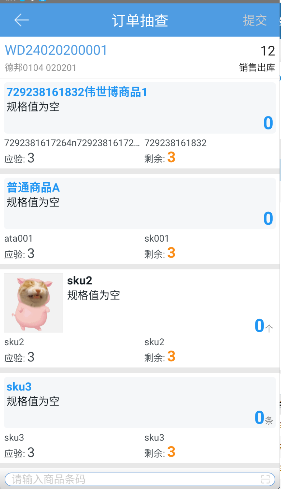

2.提交

正常提交：所有明细验货完成后，点击提交，选择是否抽查通过并确认后，订单抽查成功

强制提交：部分/所有明细未验货，直接点击提交，选择是否抽查通过并确认后，订单抽查成功

注：

1.关联赠品免验配置，开启后赠品自动标记完成

2.关联条码截取配置，开启后按配置进行截取匹配

> 更新: 2024-04-24 16:18:15  

> 原文: <https://hupun.yuque.com/unzko7/lsbfg0/hp6tpd89btm4af3p>

---
