# 06. 大宗_B2B

> 资料来源：基于 `00-源文件/` 对应模块的原始操作手册、专题功能与PDA文档重组迁移。
> 事实边界：正文仅重组迁移原始文档；章节编号、目录和来源标记为整理信息，不新增业务规则、字段或流程。

## 本章知识目录

- **06.1 PC端大宗出库作业**
  - [大宗出库任务](#0611-大宗出库任务)
  - [大宗拣货](#0612-大宗拣货)
  - [大宗拣货任务](#0613-大宗拣货任务)
  - [大宗称重](#0614-大宗称重)
  - [大宗装箱](#0615-大宗装箱)
  - [大宗装箱详情](#0616-大宗装箱详情)
- **06.2 PDA手持端大宗作业**
  - [PDA-大宗出库](#0621-PDA-大宗出库)
  - [PDA-大宗拣货](#0622-PDA-大宗拣货)
  - [PDA-大宗称重](#0623-PDA-大宗称重)
  - [PDA-大宗装箱](#0624-PDA-大宗装箱)

---

## 06.1. PC端大宗出库作业

### 06.1.1 大宗出库任务

> 原始文件来源：`00-源文件/操作手册/大宗_B2B/大宗出库任务.md`

大宗出库，顾名思义为数量、体积、重量较大的订单进行出库作业。为便于区分大宗订单和普通订单系统据出库订单来源，依照商品数量、体积、重量、运输方式等维度进行自动区分。

可在仓内策略--大宗策略进行大宗订单区分的预设。

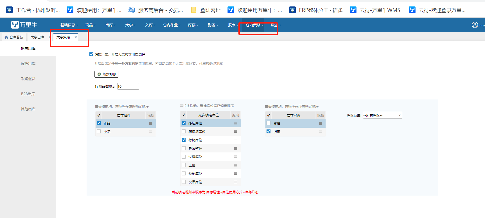

提示

1、由于大宗订单的特殊性，可跳过拣货、验货、称重、打包等环节，达到快速出库的目的。

2、考虑到大宗订单可能涉及商品数量特别大，单个作业人员无法短时间内完成，大宗出库支持将订单业务拆分多个任务可供多人同时作业。

3、考虑到商家库存不准的情况下，库存没有订单所需的商品数量，可以允许订单部分出库。

#### 01、 系统界面

大宗出库界面较普通订单处理界面增加拆分拣货、手工库位锁定、序列号导入、部分出库功能。

#### 02、拆分拣货

##### （1）按条件拆分任务

先勾选需要拆分的订单，点击拆分拣货，对话框中有按库区、按区域、商品种类数上限、商品数量上限四个维度进行设置，设置完成后点击拆分按钮完成操作，拆分后可以去大宗拣货任务页面打印配货单进行拣货。如下图

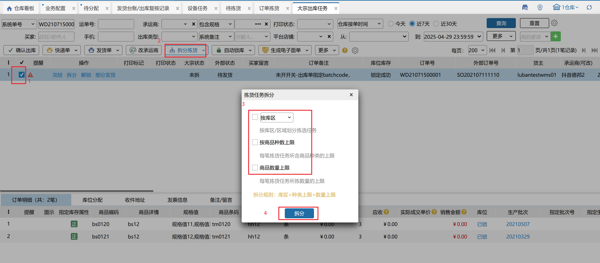

##### （2）直接拆分任务

 先勾选需要拆分的订单，点击直接拆分，一个订单生成一个拣货任务。如下图

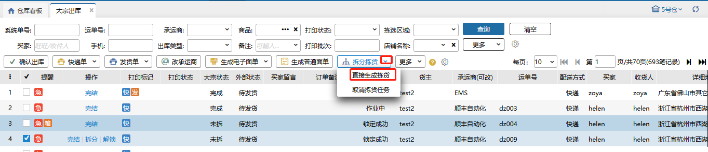

##### （3）按商品和库位拆分

可以根据库位+商品拆分或者根据商品拆分拣货任务，把同一个库位或同一个商品拆分到一个任务中更有效率的拣货。

先勾选需要拆分的订单，点击操作列的拆分，选择按商品或者库位+商品拆分。如下图

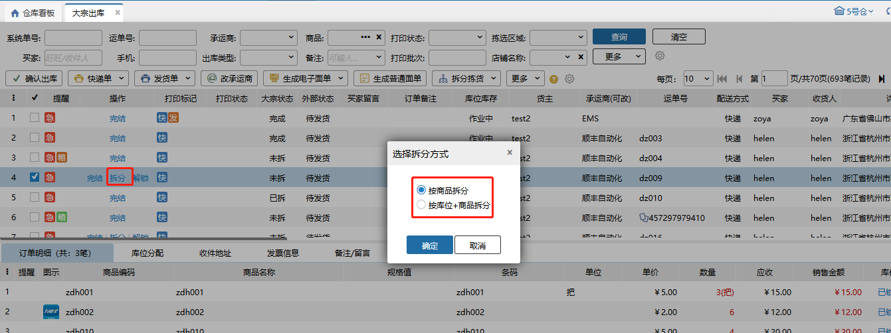

按商品拆分，点击拆分明细，修改已拆数量，点击拆分，拆分出一个任务，点击提交，会拆出两个任务，拆分的明细一个任务，剩余的明细一个任务。如图所示

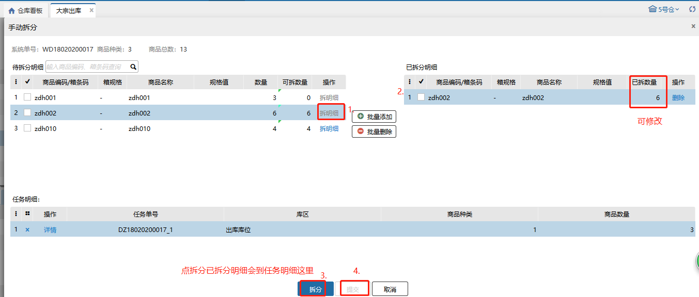

按库位+商品，点击拆分明细，修改已拆数量，点击拆分，拆分出一个任务，点击提交，会拆出两个任务，拆分的明细一个任务，剩余的明细一个任务。如图所示

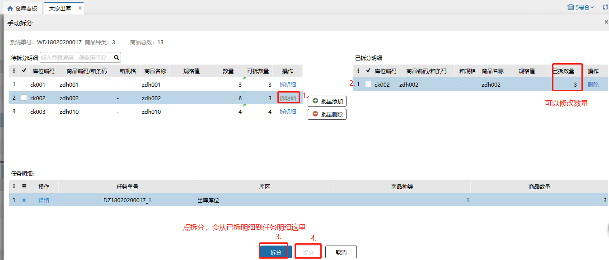

**提示：**

①.未开启大宗订单部分出库开关，订单商品部分锁不允许拆分；必须全锁才可以拆分；

②.开启大宗订单部分出库开关，订单商品部分锁允许拆分；全锁也可以拆分

##### （4）拆分任务完成

订单拆分后大宗状态显示已拆。

##### （5）取消拆分拣货任务

已经拆分的待拣货订单可勾选当前订单取消拣货，但是已有拣货的任务不允许取消拆分的。

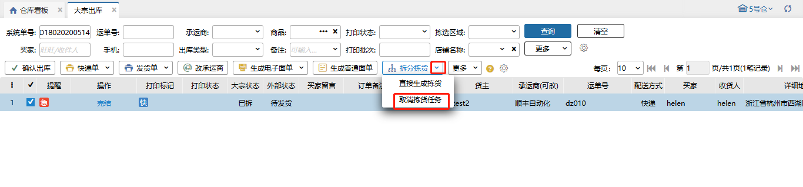

#### 03、库位锁定

大宗出库的订单系统会自动进行一次锁库操作，如果库位库存不足、库位属性条件不满足等情况则会出现锁库失败的情况。针对此类情况，可在调整库位库存后点击库位锁定系统再次进行锁库尝试。

##### （1）自动锁库

点击订单行“锁定”，或勾选订单后点击“自动锁库”按钮，会根据大宗策略设置规则进行锁库；

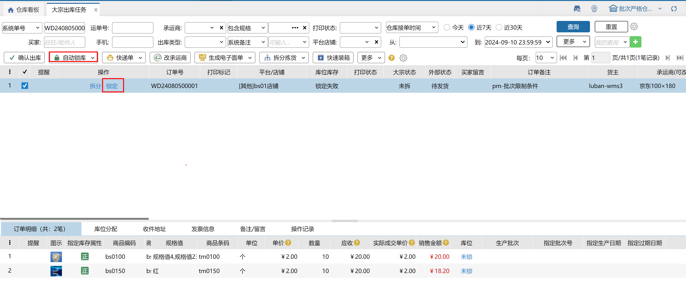

当用户发现锁定的库位不是预期想锁定的库位时，可以对订单进行解锁操作，解锁后的订单不会再自动锁定。

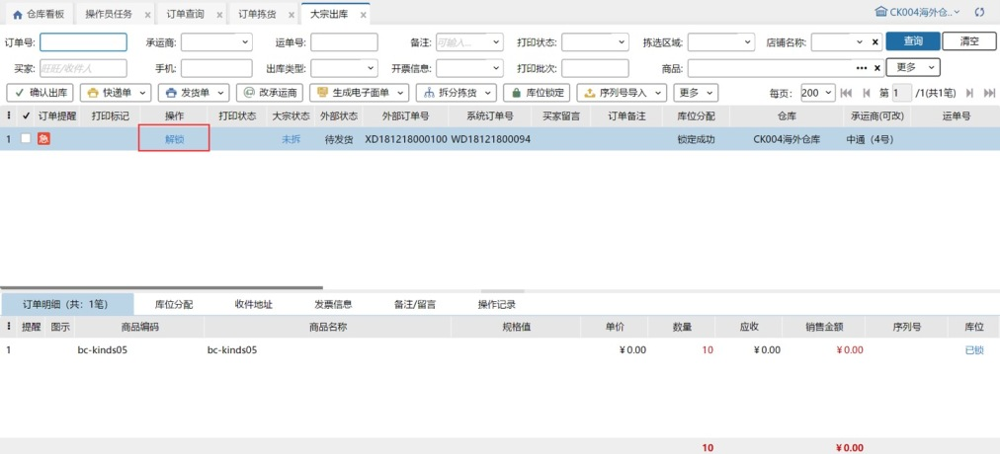

##### （2）手动锁库

勾选订单后点击“手动锁库”，在弹窗手动临时配置锁库规则：

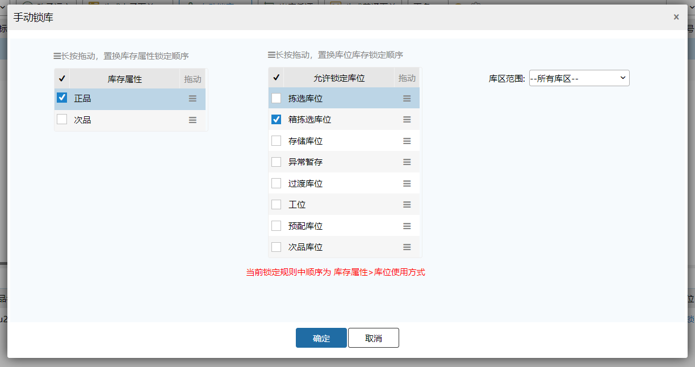

注：已锁定部分明细，手动锁库后已锁不会再重新锁定；

手动锁库失败后，跑批自动锁库不会对锁定失败订单重新锁库。

##### （3）手工分配库位

点击明细行库位列“未锁”，对明细进行手工分配库位，支持选择大宗策略规则设置范围外的库位，具体步骤如下：

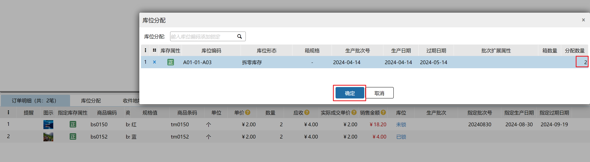

若明细为生产批次商品，且有指定批次时，根据当前账号权限判断是否允许锁定非指定批次库存。

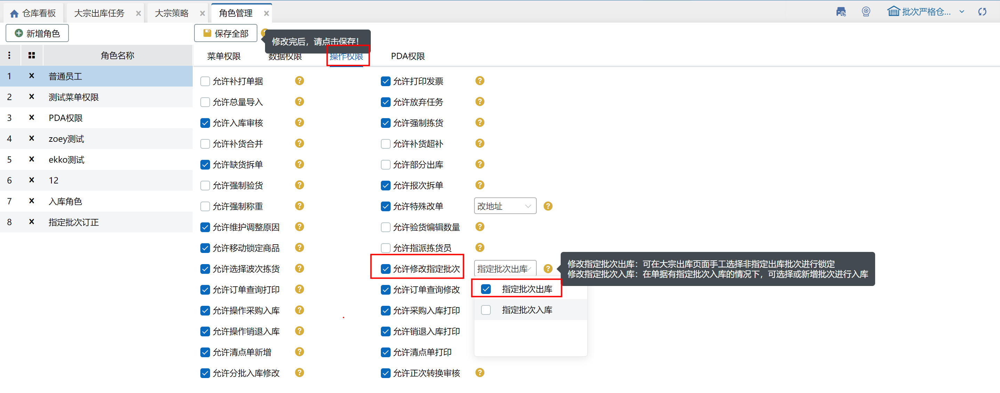

若当前账号为超管、普通管理员、一级部门主管或勾选了允许修改指定批次-指定批次出库的其他账号，则允许为指定批次明细手动分配非指定批次库存，否则会报错提示无权限。

#### 04、序列号导入

在订单需要直接确认出库的情况下，针对序列号管理的商品，可选取指定序列号供出库操作

点击序列号导入指定文件即可。导入模板可点击下拉箭头下载

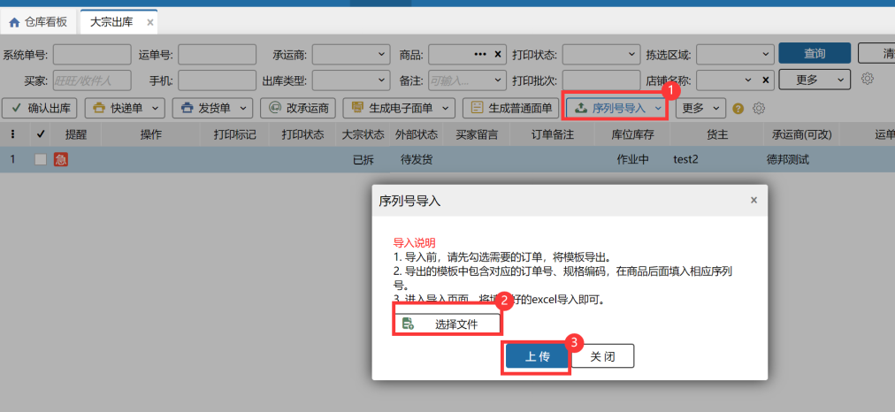

#### 05、部分出库

前提条件是：业务配置开启开启大宗订单部分出库+角色管理的操作权限勾选开启允许部分出库。

##### （1）已拆已拣未装箱的订单

选择订单，点击操作列的完结按钮，弹出部分完结窗口，点击确认，部分出库完成。未拣的任务会挂到新拆除的新订单且订单系统状态是关闭，外部状态是拦截，库位库存解锁且库存总量扣减和解锁。如图所示

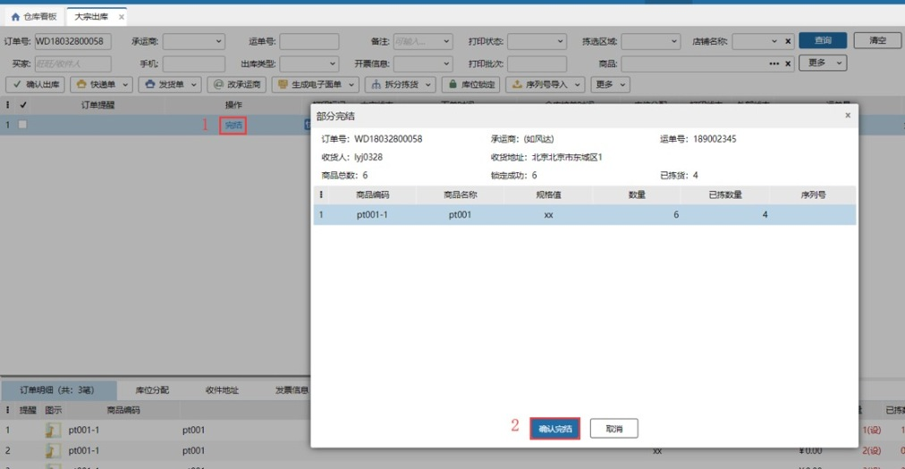

**提示：**

①.订单部分锁库，拆分拣货，全部任务拣货完成，允许部分出库。

②.订单部分锁库，拆分拣货，部分任务拣货完成，允许部分出库。

③.订单全部锁库，拆分拣货，全部任务拣货完成，不允许部分出库。

④.订单全部锁库，拆分拣货，部分任务拣货完成，允许部分出库。

##### （2）已拆已拣已装箱的订单

##### 2.1 完结

选择订单，点击操作列的完结按钮，弹出部分完结窗口，点击确认，部分出库完成。未拣的任务会挂到新拆除的新订单且订单系统状态是关闭外部状态是拦截，已拣未装箱的任务仍归属于原始订单且异常还回已拣的，库位库存解锁且库存总量扣减和解锁。如图所示：

##### 2.2 部分发货

选择订单，点击操作列的部分发货按钮，弹出部分发货窗口，点击确认，部分出库完成。未拣的任务会挂到新拆除的新订单且订单系统状态是未拆外部状态是待发货，已拣未装箱的任务仍归属于原始订单且异常还回已拣的，库位库存解锁且库存总量扣减和解锁。

**提示：**

①.订单部分锁库，任务全部经拣货全部装箱，允许部分出库。

②.订单部分锁库，部分任务拣货，已拣的全部装箱，允许部分出库。

③.订单部分锁库，部分任务拣货，已拣的部分装箱，允许部分出库。

④.订单全部锁库，任务全部经拣货全部装箱，不允许部分出库。

⑤.订单全部锁库，部分任务拣货，已拣的全部装箱，允许部分出库。

⑥.订单全部锁库，部分任务拣货，已拣的部分装箱，允许部分出库。

##### （3）未拆已装箱的订单

##### 3.1 完结

选择订单，点击操作列的完结按钮，弹出部分完结窗口，点击确认，部分出库完成。未装的任务会挂到新拆除的新订单且订单系统状态是关闭外部状态是拦截，已装箱的任务仍归属于原始订单，库位库存且库存总量都扣减和解锁。如图所示

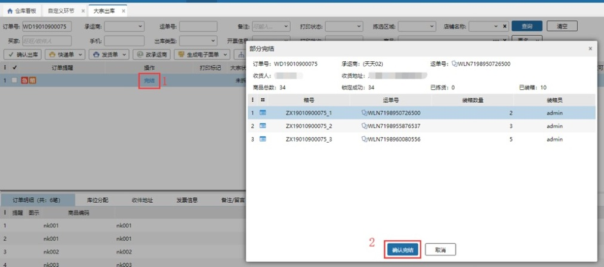

##### 3.2 部分发货

选择订单，点击操作列的部分发货按钮，弹出部分发货窗口，点击确认，部分出库完成。未装的任务会挂到新拆除的新订单且订单系统状态是未拆外部状态是待发货，已装箱的任务仍归属于原始订单，库位库存且库存总量都扣减和解锁。

**提示：**

①.订单全部锁库，全部装箱，不允许部分出库。

②.订单全部锁库，部分装箱，允许部分出库。

##### （4）出库时重量计算

(1).订单未装箱未大宗称重，出库时会根据商品数量和商品重量计算。

(2).订单未装箱已大宗称重，出库时不会重新计算重量。

(3).订单已装箱，出库时都是取箱子重量累加之和。

##### （5）出库时快递成本计算

(1).订单未装箱未大宗称重，若订单上快递成本不为0，则不会重新计算快递成本；若订单上快递成本为0则根据运费计算规则计算快递成本。

(2).订单未装箱已大宗称重，出库时不会重新计算快递成本。

(3).订单已装箱

①.若箱子未称重且订单和箱子的快递成本都是0，出库时则重新计算快递成本。

②.若箱子未称重订单上不为0，出库时不会重新计算快递成本。

③.若箱子未称重且箱子快递成本不为0，订单上快递成本为0，出库时直接取箱子累加之和。

④.若箱子有大宗称重且订单上为0，出库时直接取箱子累加之和。

⑤.若箱子有大宗称重且订单上不为0，出库时不重新计算快递成本。

#### 06、生产批次标准模式下大宗出库

##### 1.设置生产批次

生产批次商品大宗出库需在页面录入商品的生产批次，点击订单明细生产批次列的设置按钮，在弹出的生产批次录入页面添加或扫描录入生产批次，操作步骤如下图所示：

**注意：**

1.添加或扫描的生产批次在当前仓库可用库存必须大于0；                    

2.保存录入的生产批次时，会校验批次库存是否充足。                

##### 2.生产批次导入

在订单需要直接确认出库的情况下，针对生产批次标准模式管理的商品，可导入指定批次供出库操作

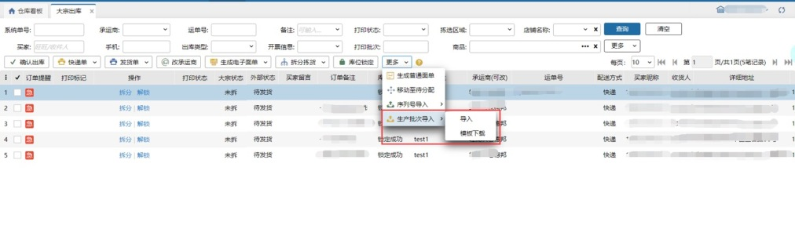

点击生产批次导入指定文件即可。导入模板可点击下拉箭头下载

#### 07、自定义设置

##### 1.查询项自定义设置                    

查询条件支持用户自定义设置，最多12个查询条件，位置是依次从左到右，从上到下排序。

##### 2.工具栏按钮自定义设置

工具栏的按钮支持自动调整位置。

#### 08、获取单号超区报错换快递优化

获取单号超区报错能够便捷换快递，下拉可以直接选择其他承运商，涉及页面有预出库订单、待分配、零拣打单、波次打单、异常订单、大宗出库，波次就可以单独换承运商并生成面单

#### 09、支持上传附件

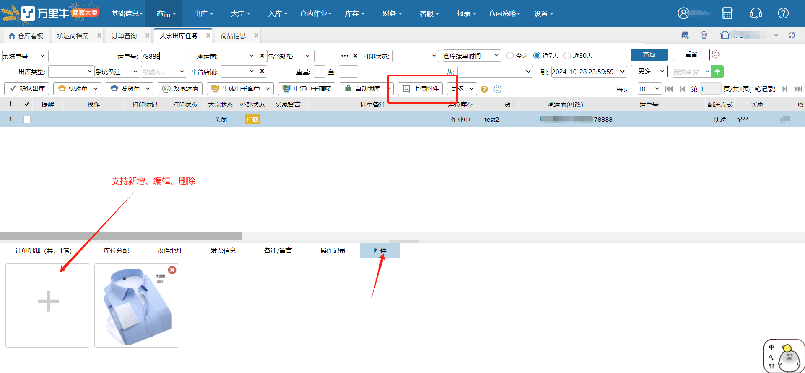

1.显示在大宗出库页面的订单均支持上传，仅支持单笔操作上传。

2.订单上传图片后才显示附件tab。

3.订单查询仅支持查看订单的附件。

4.已操作上传，再拆单部分发货，拆出订单无附件显示。

#### 10、申请电子箱唛

有包裹的订单支持申请电子箱唛，点击后申请电子箱唛，成功后订单显示标识。

注：若订单有多个包裹，则所有包裹都打上电子箱唛标识后，订单上才显示标识。

     

仅唯品会订单支持申请电子箱唛，否则报错。

未装箱订单不支持申请电子箱唛。

若作废包裹重新装箱，则支持重新申请电子箱唛。

支持部分申请电子箱唛，例：原装箱1、2，申请电子箱唛后又装箱3，则3可申请电子箱唛。

支持批量、后置申请和打印电子箱唛。

PDA暂不支持电子箱唛相关。

#### 11、前置发货

勾选单据点击前置发货，若符合前置发货条件，系统提示前置发货成功，订单外部状态显示前置发货标记，可在订单操作日志中查看成功记录；若不符合前置发货条件，则订单外部状态不显示前置发货标记，可在订单操作日志中查看失败记录及。

#### 12、改承运商

支持在订单上单个修改或批量修改订单承运商，同零拣打单。若修改后订单收件地址属超区，会报错提示。

替换承运商/回收电子面单时，已打印快递单的订单会弹窗提示：该订单已打印快递单，若继续修改请销毁已打印面单；点击继续按钮，替换承运商/回收电子面单，点击取消按钮，不替换承运商/回收电子面单。

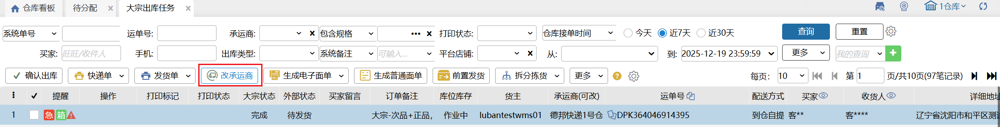

#### 13、快速装箱

支持按锁定箱规申请，每种商品拆零部分/所有拆零生成一个包裹。

(1)按锁定箱规申请，所有拆零生成一个包裹

b.锁定箱计算：

已锁定订单，锁定库存形态为规格箱/唯一箱，1箱=1个包裹，其余拆零直接计入尾箱。

例：商品1箱规1箱4个；订单1：商品1-7个

已锁定（锁1规格箱；1唯一箱：箱内2个；1拆零）-共生成包裹数：3个。

包裹1：1规格箱；包裹2：1唯一箱；包裹3：拆零1个

(2)按锁定箱规申请，每种商品拆零部分生成一个包裹：箱数计算逻辑同(1)，剩余商品按不同sku生成不同包裹。如订单锁定5个箱子，其中2种商品有若干散件，则申请7个单号。

注：①关联开启全流程箱规模式，开启后显示此开关，否则不显示。

②未锁定的订单不允许快速装箱。

> 更新: 2026-04-14 11:01:07  

> 原文: <https://hupun.yuque.com/unzko7/lsbfg0/sl2igiempnqrcnao>

---

### 06.1.2 大宗拣货

> 原始文件来源：`00-源文件/操作手册/大宗_B2B/大宗拣货.md`

1.大宗拣货任务扫描系统单号/任务单号/运单号后，右侧界面显示该任务单状态，点击确认拣货即可完成当任务单拣货环节。

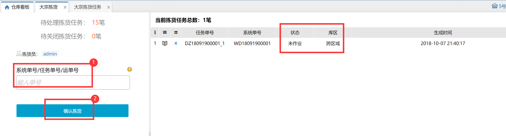

2.点击拣货员可指定拣货员，便于进行绩效统计。

提示：

①扫描系统单号，加载该任务下未作业、作业中的任务，任务数超过100个报错提示，只加载未存在列表的任务，已存在再次扫描报错。

②扫描任务匹配多个任务，优先报错拦截挂起的。

> 更新: 2023-12-18 16:01:17  

> 原文: <https://hupun.yuque.com/unzko7/lsbfg0/fl42doe6fkidlq4z>

---

### 06.1.3 大宗拣货任务

> 原始文件来源：`00-源文件/操作手册/大宗_B2B/大宗拣货任务.md`

大宗拣货任务界面可根据条件查询、查看任务单状态。操作区域可打印配货单、拿货标签和进行拦截订单的确认。

拣货任务排序：状态->订单中拣货任务最早的生成时间->单号；（同状态同系统单号的拣货任务排列在一起）

> 更新: 2026-07-07 09:24:57  

> 原文: <https://hupun.yuque.com/unzko7/lsbfg0/nnmbhmc78csaauyw>

---

### 06.1.4 大宗称重

> 原始文件来源：`00-源文件/操作手册/大宗_B2B/大宗称重.md`

大宗称重：支持对大宗订单和包裹称重。

#### 01.称重

大宗称重，用户输入重量，输入单号敲击回车，即可见到订单或包裹信息，点击确认称重，订单称重完成，重量会更新到订单或包裹上。

 

多种选择

1、先扫单号，还是先称重；（点击先扫单号即可切换）

2、自动计算，还是人工计算；（自动计算会根据商品信息界面设置的商品重量，或大宗称重的输入重量和快递运费设置，自动计算快递成本；人工计算，需要自己输入快递成本并回车）

#### 02.自动计算重量

自动计算重量，首先要在商品信息里设置商品的重量，然后设置承运商档案的运费规则。根据商品的重量和预设的运费规则出库时自动计算出重量和快递成本，而不需要称重。

提示【称重两种方式】

1、自动称重：链接电子秤或手动输入重量；

2、自动计算重量：不需要大宗称重，设置商品重量，确认审核后自动计算重量；

#### 03.自动计算快递成本

自动计算快递成本，是根据订单/箱子的重量和承运商档案设置的运费规则计算.

提示

1、开启称重后置打印，则电子面单快递订单确认称重后会自动生成单号和打印快递单，若选择箱唛只有包裹称重才能打印出来，订单不会打印箱唛。

2、开启自动提交，订单会自动提交称重。

3、订单/箱子重复称重时会提示。

4、扫描运单号优先匹配到大宗箱，匹配不到才会匹配大宗订单。

5、已装箱的大宗订单不能称重。

6、订单全部装箱且生成了子母件，箱子大宗称重时快递成本不允许修改会置灰显示。

 

> 更新: 2023-12-18 16:03:21  

> 原文: <https://hupun.yuque.com/unzko7/lsbfg0/mezcd4nvyhutqgwn>

---

### 06.1.5 大宗装箱

> 原始文件来源：`00-源文件/操作手册/大宗_B2B/大宗装箱.md`

大宗装箱是指在大宗订单、任务单确认拣货后进行的装箱操作。

#### 1.新增装箱

1.首先扫描大宗订单的运单号/系统单号，右侧加载订单信息和待装商品明细。

2.在商品条码框中扫描需要装箱的商品条码或箱条码，下侧装箱明细会实时记录，或扫描箱号/点击修改，装箱明细会显示当前箱号的已装明细。

3.装箱列表中可以查看已装的大宗箱，可以打印装箱单和箱唛，点击刷新后多人装箱情况下会显示最新的进度数据。点击修改可对当前箱增加或减少商品，装箱后箱号不变。在装箱列表中支持对已装箱修改长、宽、高、体积等数据。

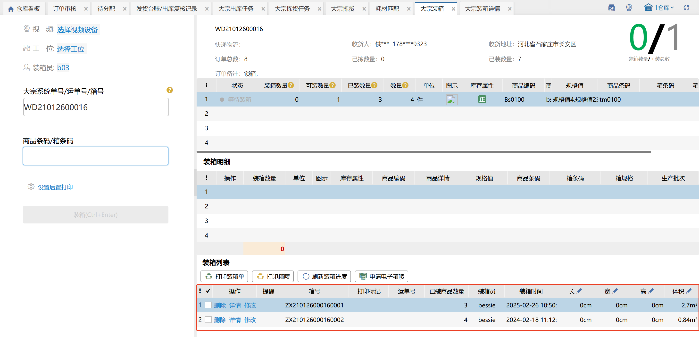

4. 当装箱完成后点击装箱按钮，可配置后置打印快递单、装箱单、箱唛。

#### 2.修改已装箱

扫描已装箱箱号，右侧加载已装箱信息和商品明细，支持修改装箱数量和明细后，重新装箱。

#### 3.扫描历史箱箱号

业务配置开启“历史关闭的大宗装箱箱号”，在大宗装箱时支持扫描已关闭箱箱号来快速添加箱明细。

要求：已关闭箱内明细sku在待装明细范围内，数量≤待装明细可装数量，库存属性一致，生产批次号与待装明细批次一致，规格箱/唯一箱箱条码一致。

例：已关闭大宗订单001，明细：正品bs0100*2（普通商品），次品bs0100*2，正品bs0150*4（生产批次商品），有4个包裹：包裹ZX01 bs0100*2（正品），包裹ZX02 bs0100*2（次品），包裹ZX03 bs0150*2（批次001*2），包裹ZX04 bs0150*2（批次002*2）。

未关闭大宗订单002，明细：正品bs0100*2，次品bs0100*2，正品bs0150*4（批次001*2，批次002*2），无包裹。

①大宗装箱页面扫描单号002匹配到订单，

②条码框扫描箱号ZX01，装箱明细列表带出正品bs0100*2，点击装箱后，装箱列表包裹+1，包裹长、宽、高、体积、重量、估重为ZX01的对应信息，支持手动修改；

③条码框扫描箱号ZX02，装箱明细列表带出次品bs0100*2；

④条码框扫描箱号ZX03，装箱明细列表带出正品bs0150*2（批次001*2）；

⑤条码框扫描箱号ZX04，装箱明细列表带出正品bs0150*2（批次002*2）。

**注：**

1. 最新的大宗装箱支持生产批次商品，若一个商品锁定了多个生产批次，扫描商品后，弹窗显示未装箱的生产批次。

2. 在仓内策略–业务配置，开启商品条码截取，扫描输入截取的商品条码会与商品信息的条码进行对比校验；

①.选择特殊信息截取，扫描输入++前的条码，系统会与订单商品信息的条码进行对比校验；扫描输入不含特殊字符的全量条码可直接匹配商品，扫描输入包含++字符的全量条码，无法匹配到商品信息。                     

②.选择条码位数截取，扫描输入前若干位条码，系统会与订单商品信息的条码进行对比校验；扫描输入全量条码，无法匹配到商品信息。    

3.大宗订单有运单号切装箱完成有且仅有1箱时会自动填充订单运单号至包裹上。             

4.集合码录入参考[业务配置](https://hupun.yuque.com/unzko7/lsbfg0/caki7lz4105n2vpg#CKIQO)。

#### 4.输入数量设置

①输入装箱数量

商品条码开启”输入装箱数量“设置后，左侧显示“输入数量”文本框，该输入框可用于快捷填写已装数量。

当扫码商品条码可装数量<=指定数量时，输入数量框置灰，当扫码商品条码可装数量>指定数量时，输入数量框默认为1，可手动修改，填写数量n后回车，对应sku已装数量+n。

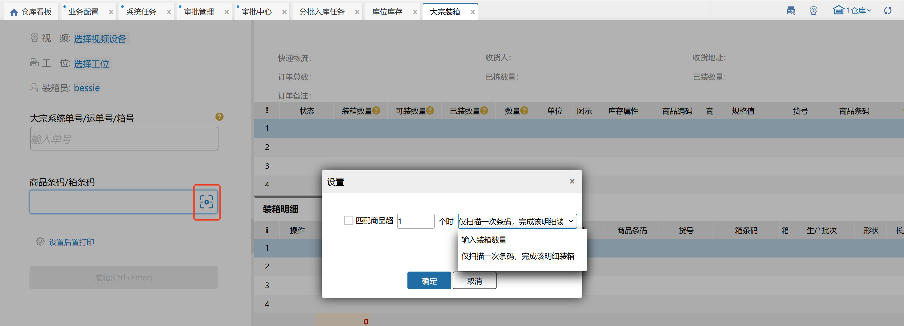

②仅扫描一次条码，完成该明细装箱

商品条码开启”仅扫描一次条码，完成该明细装箱“设置后，左侧不显示”输入数量“文本框，扫描条码后自动填充装箱数量=可装数量。

**注：**该配置记忆在仓库+操作员上

#### 5.序列号录入方式设置

设置中可勾选序列号录入方式，按扫商品后连续扫序列号录入或者逐个扫商品+序列号录入。

①扫商品后连续扫序列号录入：扫商品条码后显示序列号弹窗，可录入多个序列号，每次录入时校验序列号有效性；

②扫商品连续扫序列号录入+录入后统一校验序列号有效性：扫商品条码后显示序列号弹窗，可录入多个序列号，点击保存时校验序列号有效性；

③逐个扫商品+序列号录入：扫商品条码后录入一个序列号就自动关闭序列号录入弹窗，再次扫商品条码会重新弹出序列号录入弹窗。

> 更新: 2025-11-26 17:14:22  

> 原文: <https://hupun.yuque.com/unzko7/lsbfg0/kuechc10g0uxd9ch>

---

### 06.1.6 大宗装箱详情

> 原始文件来源：`00-源文件/操作手册/大宗_B2B/大宗装箱详情.md`

大宗装箱详情界面显示默认7天内大宗订单装箱情况。

1. 操作区域内可勾选订单进行作废操作，作废后该笔订单下所有装箱记录清空。                    

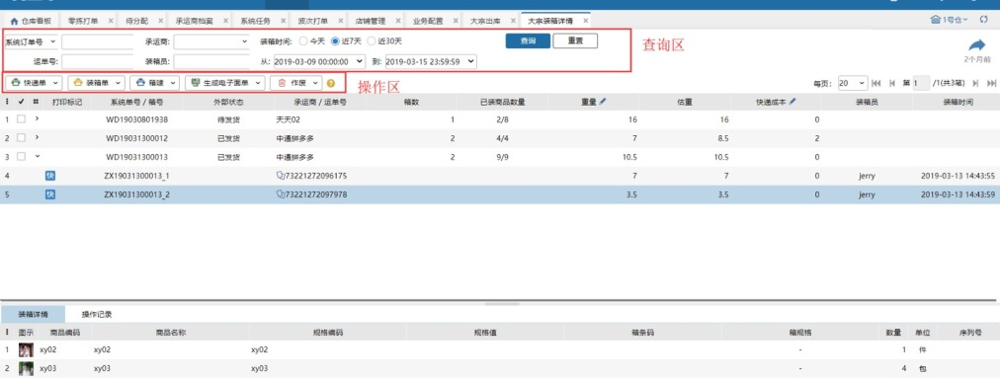

**提示：**大宗装箱完成后才可以生成子母件，作废其中一个箱子，箱子上的单号都清掉。

回收电子面单时，已打印快递单的订单会弹窗提示：该订单已打印快递单，若继续修改请销毁已打印面单；点击继续按钮，回收电子面单，点击取消按钮，不回收电子面单。

2. 可以查看箱详情。

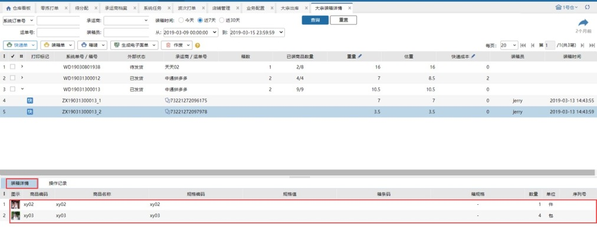

3.待发货状态的订单，箱子上允许编辑称重和快递成本。

**提示：**

①.若订单已装箱完成，订单上的重量和快递成本是箱子累加之和。

②.若订单未装箱完成，订单上的重量和快递成本与箱子累加之和不对等。

③.订单若生成了子母件，箱子的快递成本不允许编辑。

 4.筛选项-买家，能通过收件人模糊搜索订单

5.作废包裹回收单号

多包裹普通订单，作废单个包裹，如果包裹快递单号和订单显示的快递单号不一致，则只会作废该包裹，订单上的快递单号不做变更。如果包裹快递单号和订单显示的单号一致，则作废该包裹后，订单上的快递单号会变更成剩余箱子的第一个包裹上的快递单号

> 更新: 2026-01-27 13:47:37  

> 原文: <https://hupun.yuque.com/unzko7/lsbfg0/mtn8hgtvadyivv2w>

---

## 06.2. PDA手持端大宗作业

### 06.2.1 PDA-大宗出库

> 原始文件来源：`00-源文件/PDA安卓端/大宗_B2B/PDA-大宗出库.md`

大宗出库，针对大宗单提交出库，也支持序列号的输入，操作步骤如下

1.点击大宗出库按钮，用户可见如图页面，输入或扫描订单号/运单号，操作需出库订单。                     

2.选择订单后，可以查看订单信息和商品，点击提交，提交出库。                      

                     

> 更新: 2024-02-06 09:34:21  

> 原文: <https://hupun.yuque.com/unzko7/lsbfg0/pzqyu282uyhvsahs>

---

### 06.2.2 PDA-大宗拣货

> 原始文件来源：`00-源文件/PDA安卓端/大宗_B2B/PDA-大宗拣货.md`

业务场景：订单是大宗件，商品种类和数量很多，可以把该订单拆分多个任务，分配给多人操作，也支持部分拣货，实现边拣货边装箱。

1. 点击大宗拣货按钮，用户可见如图页面，扫描作业单号/系统单号/运单号或选择作业区域下拉选择任务。                       

  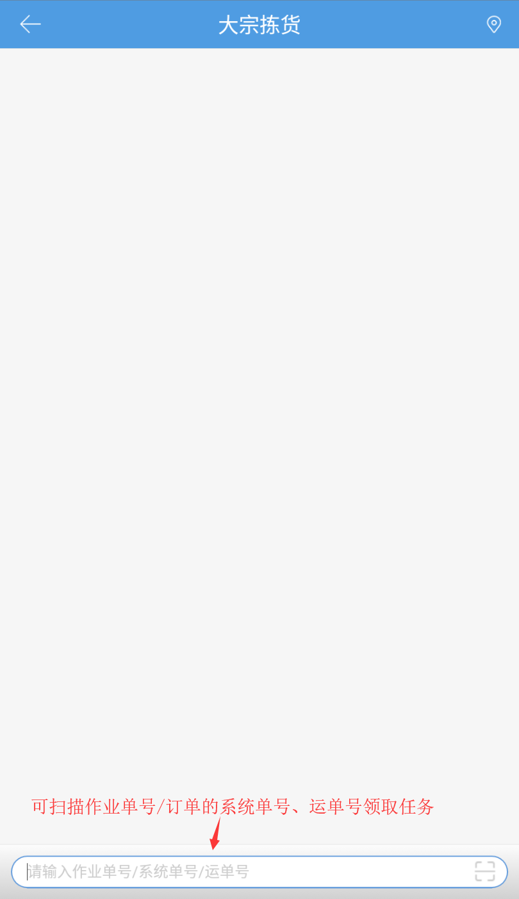

注意：订单锁定成功未拆分，大宗拣货扫描系统单号/运单号，会直接生成一个拣货任务

2.页面下拉，加载作业区域下的任务所属订单，点击选择任务。

  

提示：

①、加载订单：作业区域下的任务所属订单且该订单下有任务时未完成的，全部任务完成的订单不加载、被拦截的订单不加载。

②、扫描任务单号时，不限制作业区域。

③、订单中任务排序显示：作业中无操作员>未作业>作业中有操作员>已完成.

3.选择任务，跳到拣货页面，进行拣货。

   

4.若仓库中的业务配置开启了大宗订单部分出库，部分拣货，点击提交，可以先提交已拣货的部分。

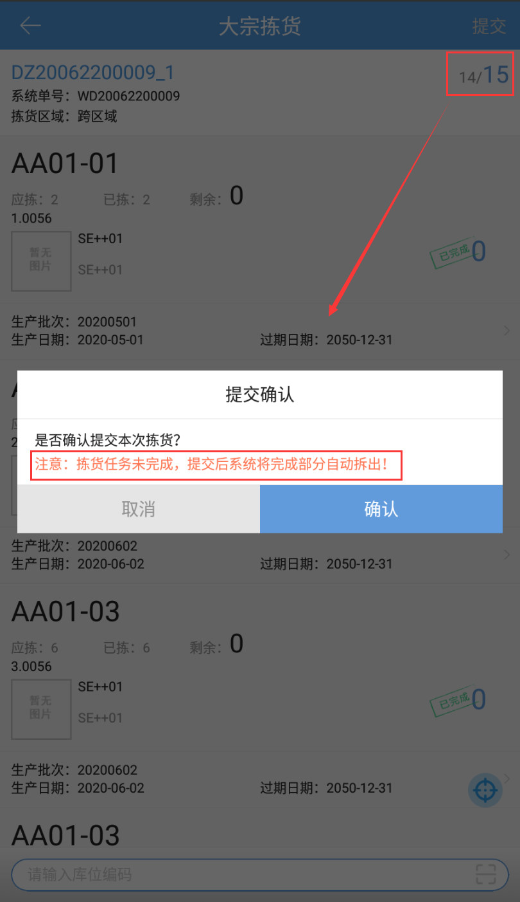

提示：已拣的部分提交并拆出新的任务，状态是作业完成，提交后剩余未拣货的仍属于原任务且还是被当前操作员领取到。

> 更新: 2024-02-06 09:34:02  

> 原文: <https://hupun.yuque.com/unzko7/lsbfg0/dqsavnzc1gdgi0fe>

---

### 06.2.3 PDA-大宗称重

> 原始文件来源：`00-源文件/PDA安卓端/大宗_B2B/PDA-大宗称重.md`

大宗订单称重时搬箱子到工作台不方便，希望提供快捷大宗称重功能。

1.支持扫描未装箱的大宗订单系统单号/运单号，已装箱的支持扫描大宗箱号/箱运单号匹配。

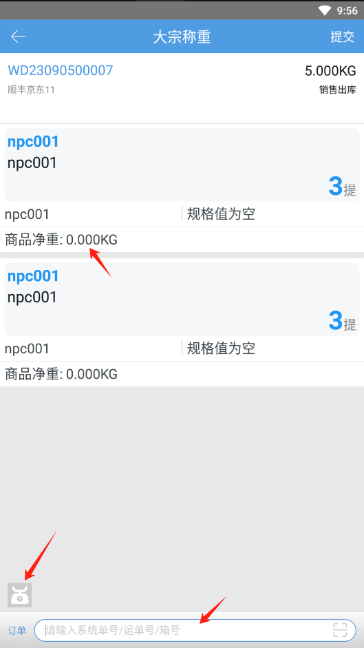

注：订单/箱子已被称重过，支持再次称重。

2.支持连接蓝牙电子秤操作设备称重，连接成功下次进入菜单默认自动连接。

3.商品净重=商品重量×商品数量

4.是否自动提交关联系统设置-大宗称重自动提交配置。

已开启配置：

a.先手动输入重量，再扫订单，自动提交。

b.先扫订单，再手动输入重量，自动提交。

c.连接外部蓝牙电子秤，先输入重量，再扫订单，自动提交。

注：连接外部蓝牙电子秤，先扫订单，再输入重量，需手动提交。

暂时不支持耗材录入和重量校验配置。

5.大宗称重，支持提交后按照运费设置自动计算快递成本（按重量计算、按体积计算，并且按重量计算支持计算计抛比）

> 更新: 2026-08-17 14:03:42  

> 原文: <https://hupun.yuque.com/unzko7/lsbfg0/cqkzdblv3p5ga272>

---

### 06.2.4 PDA-大宗装箱

> 原始文件来源：`00-源文件/PDA安卓端/大宗_B2B/PDA-大宗装箱.md`

wms安卓端-WMS:PDA-大宗装箱

大宗装箱

业务场景：大宗订单数量比较多，拣货完成后存放的区域比较大，电脑端不方便进行操作。

1.点击大宗装箱菜单，支持扫描系统单号/运单号来匹配订单。（外贸订单、生产批次标准模式下含有生产批次商品的订单、已生成子母件的订单不支持大宗装箱）

2.匹配到订单后，大宗装箱作业页面显示订单信息和商品信息。

3.支持自定义配置蓝牙打印机来打印装箱单和箱唛，保存后设置才有效。装箱单和箱唛打印机和模板全部配置好之后，蓝牙打印机图标亮起。（也支持配装箱单/箱唛中的一个，配置哪个就打印哪个单据）若已经配置过，下次进入大宗装箱作业页面，蓝牙打印自动连接。

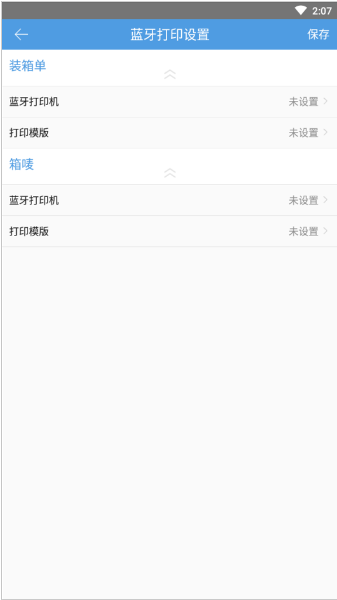

4.扫条码匹配商品，显示装箱情况（可装、已装、应装、本次装箱数量）。提交装箱后，已完成装箱的明细不显示。

a.若商品为生产批次商品，且明细锁定>1个生产批次，则扫条码后弹出生产批次列表，支持选择批次

b.若商品为序列号商品，扫条码后跳转至序列号录入页面，扫序列号时校验序列号的有效性。（注：跟仓库开关：序列号管理的标准/简洁模式有关），序列号支持左滑删除。

录入序列号的数量=商品数量时，自动返回到大宗装箱作业页面。（可录入部分，录几个序列号，装箱数量就是几）

c.支持扫描规格箱和唯一箱的箱条码。

d.支持条码截取。

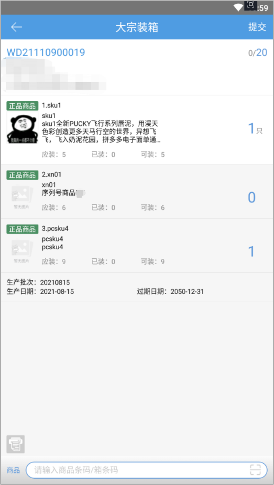

5.提交装箱后页面显示已装按钮，明细清空，配置蓝牙打印的，根据配置打印单据。

6.点击已装按钮，跳转至已装箱页面，显示箱号、装箱数等，点击箱号跳转至箱内明细页。

a.左滑支持补打、作废和修改，已装箱页面支持修改蓝牙打印的配置。

b.箱子排序按照装箱时间从晚到早，可看到所有操作员的箱子

c.全部作废按钮，支持将已装的包裹全部作废，重新去操作装箱。

（ps：若需要将全部装箱完成的订单进行全部作废，需联系客服开启技术开关）

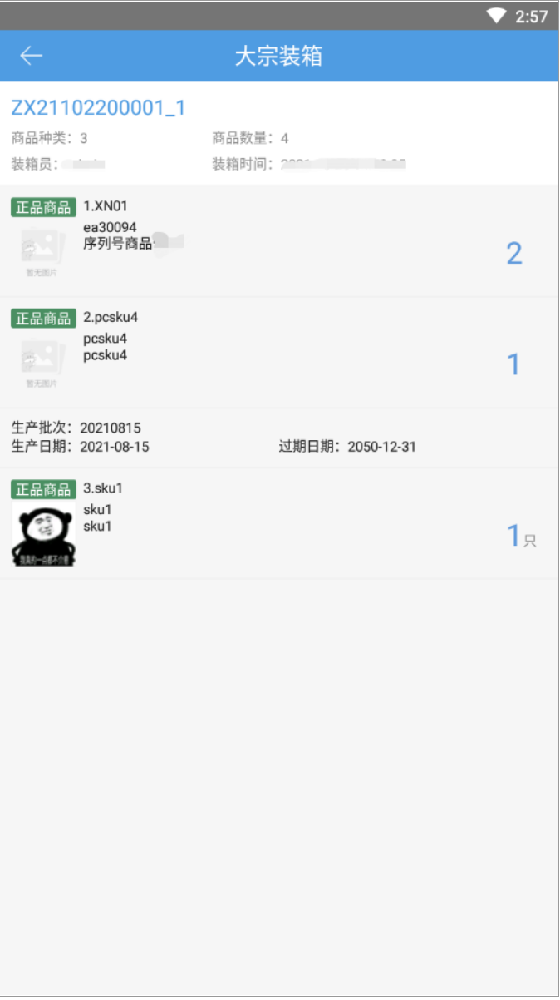

7.订单内全部商品装箱后，仍停留在大宗装箱作业页面，且作业页面、已装箱明细页等显示的数据不清空。

8.PDA大宗装箱后支持统计大宗装箱的绩效。

9.若订单已拦截挂起，扫单号后跳至异常页面；若扫单号后订单拦截挂起，提交装箱时跳至异常页面。

10.若序列号商品锁定规格箱/唯一箱，扫箱条码后跳转至录入序列号页面，未录满不允许返回，录完后自动返回至作业页面。点击图片跳转至货箱明细页面，点击数量跳转至装箱明细页。

例：序列号商品1：4个 锁定规格箱2个（1箱内2个），录完两箱序列号后，点击图片，货箱明细页显示数量为2；点击数量跳转至装箱明细页，显示数量为4

11.为方便拣货，在开启商品多单位管理出库快速换算推荐下大宗装箱库位支持显示推荐单位

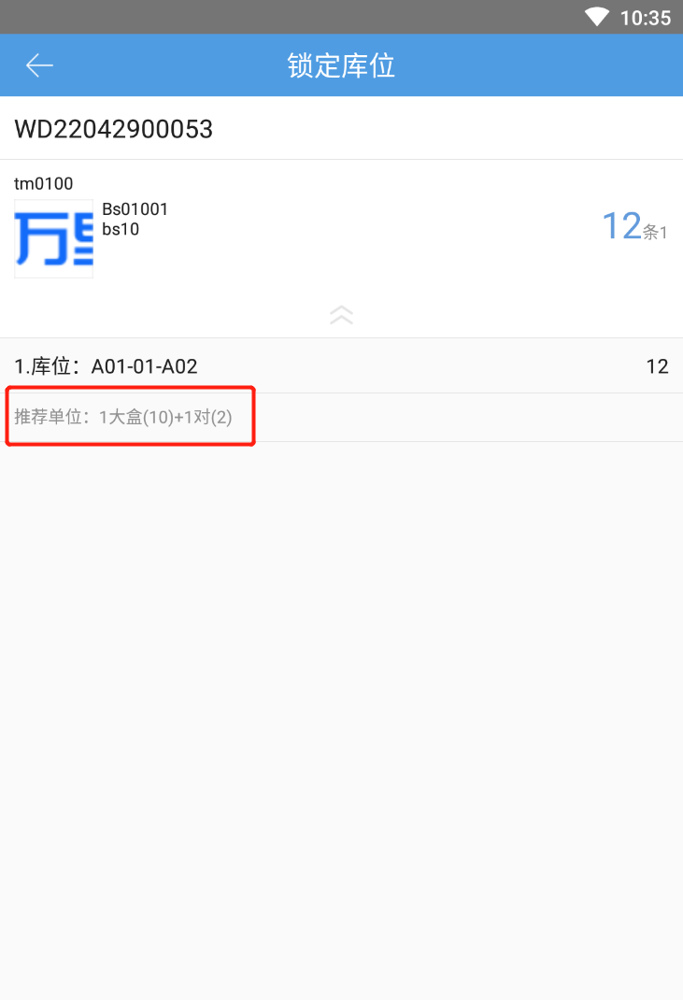

12.支持批量装箱，装箱数量计算：当前箱规该明细的数量/当前箱规明细中最小的可装数量，例：43/5，显示最多可装8箱，点击提交时校验可装数量>1弹出。唯一箱或序列号，无可重复装箱的按原弹窗提醒显示。

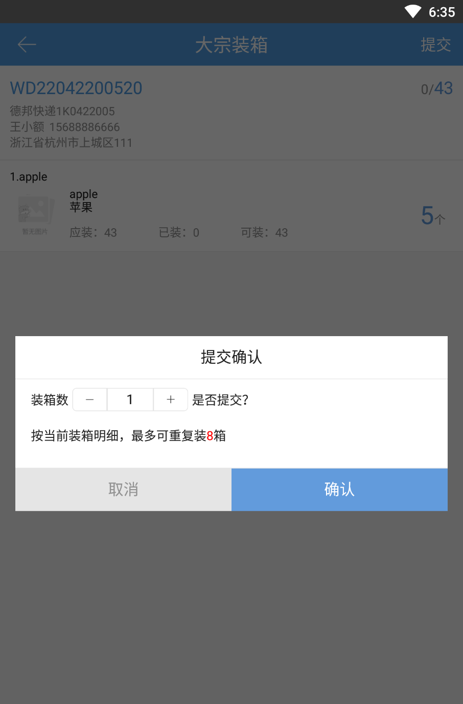

13.大宗装箱商品排序支持按路径优先级和锁定库位展示，先按路径优先级从小到大展示，路径优先级一致时按锁定库位编码从小到大展示，库位相同按商品编码排序，货箱商品优先于拆零。

14.在开启耗材管理-实际使用的前提下，大宗装箱支持录入耗材，下面可切换商品/耗材录入，支持记忆。若开实际使用-记录一个耗材，录入一个耗材后会自动切换至商品录入或自动提交，批量提交时耗材同步记录至多个箱号上。

15.大宗装箱显示重量、体积，支持编辑，每录入一个商品，体积、重量会随之变化

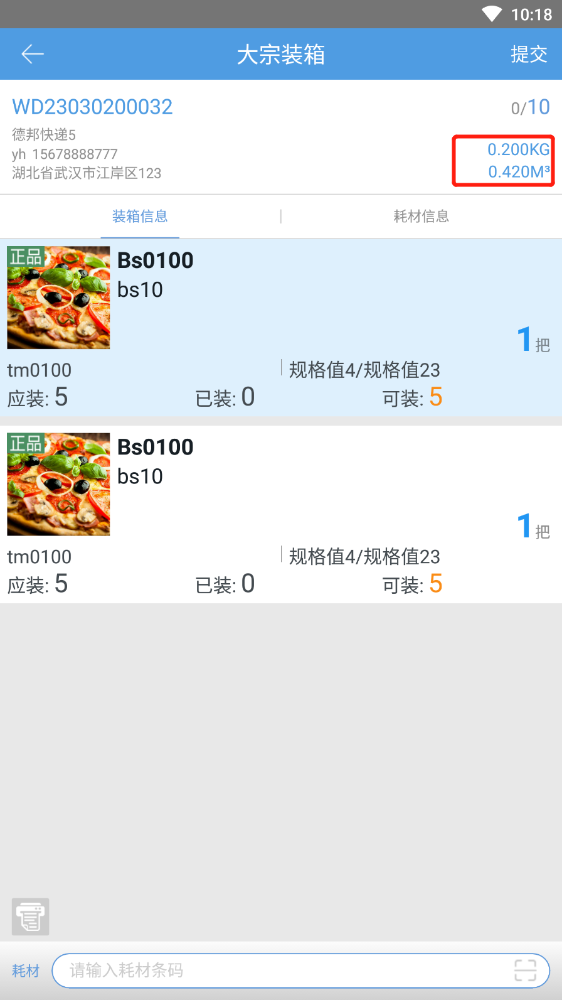

16.大宗装箱支持扫箱号进行编辑箱内信息，如下图点击确认后可进入编辑状态，包括修改装箱商品、耗材、重量、体积。

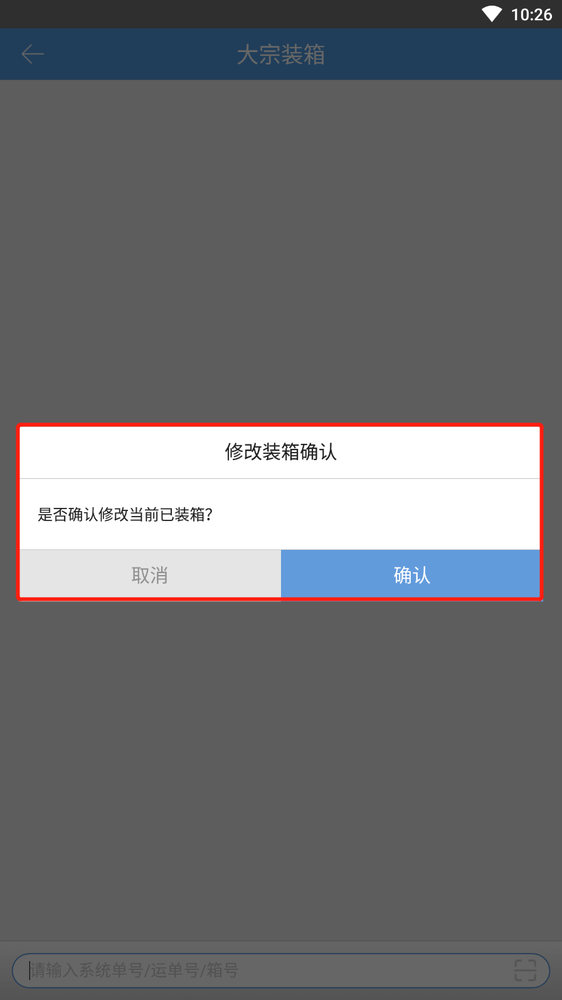

17.大宗装箱支持显示已装商品的预估体积和估重

> 更新: 2026-08-17 14:02:16  

> 原文: <https://hupun.yuque.com/unzko7/lsbfg0/uh438065rggd1gnp>

---
