# 07. 仓内作业

> 资料来源：基于 `00-源文件/` 对应模块的原始操作手册、专题功能与PDA文档重组迁移。
> 事实边界：正文仅重组迁移原始文档；章节编号、目录和来源标记为整理信息，不新增业务规则、字段或流程。

## 本章知识目录

- **07.1 PC端库存移动与装箱**
  - [库存冻结](#0711-库存冻结)
  - [库存移动](#0712-库存移动)
  - [库存转移](#0713-库存转移)
  - [补货上架](#0714-补货上架)
  - [预包任务](#0715-预包任务)
  - [打包装箱](#0716-打包装箱)
  - [规格装箱](#0717-规格装箱)
- **07.2 PC端库存变更与加工**
  - [正次转换](#0721-正次转换)
  - [盘点任务](#0722-盘点任务)
  - [仓内加工](#0723-仓内加工)
  - [加工任务](#0724-加工任务)
  - [容器寄取](#0725-容器寄取)
  - [巡仓事务](#0726-巡仓事务)
- **07.3 PDA手持端仓内作业**
  - [PDA-加工领料](#0731-PDA-加工领料)
  - [PDA-容器寄取](#0732-PDA-容器寄取)
  - [PDA-容器移库](#0733-PDA-容器移库)
  - [PDA-巡仓事务](#0734-PDA-巡仓事务)
  - [PDA-巡仓补货](#0735-PDA-巡仓补货)
  - [PDA-库存冻结](#0736-PDA-库存冻结)
  - [PDA-库存移动](#0737-PDA-库存移动)
  - [PDA-库存解冻](#0738-PDA-库存解冻)
  - [PDA-库存调换](#0739-PDA-库存调换)
  - [PDA-库存转移](#07310-PDA-库存转移)
  - [PDA-快速上架](#07311-PDA-快速上架)
  - [PDA-快速加工](#07312-PDA-快速加工)
  - [PDA-快速盘点](#07313-PDA-快速盘点)
  - [PDA-成品入库](#07314-PDA-成品入库)
  - [PDA-打包装箱](#07315-PDA-打包装箱)
  - [PDA-指导上架](#07316-PDA-指导上架)
  - [PDA-新增移库任务](#07317-PDA-新增移库任务)
  - [PDA-次品转正](#07318-PDA-次品转正)
  - [PDA-正品转次](#07319-PDA-正品转次)
  - [PDA-盘点任务](#07320-PDA-盘点任务)
  - [PDA-移库任务](#07321-PDA-移库任务)
  - [PDA-自由上架](#07322-PDA-自由上架)
  - [PDA-自由分拣](#07323-PDA-自由分拣)
  - [PDA-补货任务](#07324-PDA-补货任务)
  - [PDA-规格装箱](#07325-PDA-规格装箱)
  - [PDA-预包任务](#07326-PDA-预包任务)

---

## 07.1. PC端库存移动与装箱

### 07.1.1 库存冻结

> 原始文件来源：`00-源文件/操作手册/仓内作业/库存移动/库存冻结.md`

当仓库中商品有损坏等情况不能进行出库时，则需要将这些商品进行冻结，当商品进行返修或其他操作后可以贩售了，则需要将商品解冻；

该页面主要有两个功能：库存冻结、库存解冻和批量导入任务。

具体的库存冻结和库存移动后，在【库存】-【库位库存】页面能看到对应的库存会有相应的变化。

#### **1. 库存冻结**

具体操作如下：

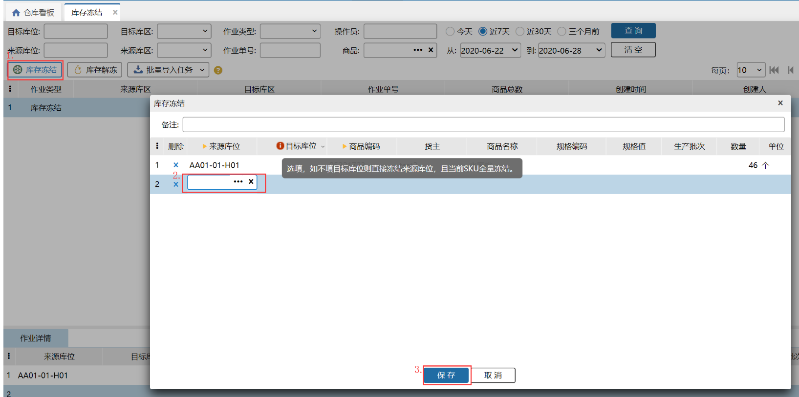

提示

1.选择的商品只能是该来源库位下存在的可用库存大于0的商品；

2.同一个库位下同一个sku不会存在可用或锁定大于0且冻结也大于0的情况，具体如下案例：

前提：来源库位为A，目标库位为B，要冻结商品为a

1）B中有a商品状况为可用2个，锁定0个，此时A向B冻结a商品5件，点击保存报错：目标库位a商品的可用库存大于0；

2）B中有a商品状况为可用0个，锁定2个，此时A向B冻结a商品5件，点击保存报错：目标库位a商品的锁定库存大于0；

3）B中有a商品状况为可用0个，锁定0个，冻结0个，此时A向B冻结a商品5件，点击保存成功；

4）B中有a商品状况为可用0个，锁定0个，冻结1个，此时A向B冻结a商品5件，点击保存成功；

#### **2. 库存解冻**

具体操作如下：

提示

1.选择的商品只能是该来源库位下存在的冻结库存大于0的商品；

2.同一个库位下同一个sku不会存在可用或锁定大于0且冻结也大于0的情况，具体如下案例：

前提：来源库位为A，目标库位为B，要解冻商品为a

1）B中a商品状况为可用2个，锁定0个，此时A向B解冻a商品5件，点击保存成功；

2）B中a商品状况为可用0个，锁定2个，此时A向B解冻a商品5件，点击保存成功；

3）B中a商品状况为可用0个，锁定0个，冻结0个，此时A向B解冻a商品5件，点击保存成功；

4）B中a商品状况为可用0个，锁定0个，冻结1个，此时A向B解冻a商品5件，点击保存报错：目标库位a商品存在冻结库存大于0；

#### **3. 批量导入库存冻结或库存解冻**

批量导入库存冻结或库存解冻，可以方便用户批量进行库存冻结或解冻，具体如下如：

**提示**

1.用户可先下载模板，对内容进行编辑后进行导入，库存冻结与库存解冻的模板相同；

2.导入文件中来源库位必填，目标库位可不填写；

3.导入文件中商品编码与条码其中至少填写1个；

4.当填写的商品编码与条码对应的不同一个商品时，以商品编码为准；

5.导入的文档明细不能超过500条；

6.导入的明细若有重复，则导入时以最后一条明细为准。

> 更新: 2023-12-21 17:40:45  

> 原文: <https://hupun.yuque.com/unzko7/lsbfg0/trcsyd52gec68x5t>

---

### 07.1.2 库存移动

> 原始文件来源：`00-源文件/操作手册/仓内作业/库存移动/库存移动.md`

一个仓库的库位之间会出现有些库位库存差异过大，且不方便实际操作时，则可以考虑进行库存的移动或库存调换的操作；

具体进行库存移动或库存调换后可在【库存】-【库位库存】页面查看对应的库存状况。

#### 1. 库存移动

当某个库位上库存不足时可以从其他库位上移动一些sku到该库位上，这个就是库存移动，具体操作如下：

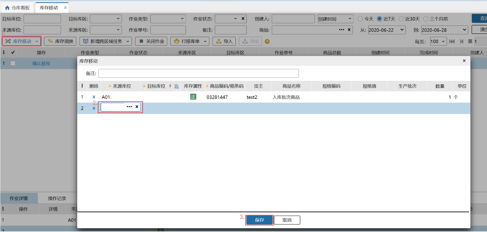

提示

1.库存移动只能移动来源库位的可用库存或冻结库存，且移动数量必须大于0；

2.同一个sku，若目标库位有冻结库存，只能移动冻结的库存到该目标库位；

3.同一个sku，若目标库位没有冻结库存但有可用或锁定的，只能移动可用库存到该目标库位；

4.同一个sku，若目标库位没有任何库存，则不能同时将可用的和冻结的库存都移到该目标库位；

5.库存移动的数量必须小于来源库位的可用库存或小于来源库位的冻结库存；

6.库存移动后可以在库位库存页面查看最新库存状况；

7.来源库位和目标库位的库位类型都没有限制。

#### 2. 库存调换

库存调换就是快速的库存移动，表示将两个库位的商品进行调换，具体操作如下：

提示

1.来源库位或目标库位若有锁定库存，则库存调换点击保存报错：来源库位或目标库位有锁定库存，无法保存；

2.库存调换后可以在库位库存页面查看最新库存状况；

3.来源库位和目标库位的库位类型都没有限制。

#### 3. 新增跨区任务                    

新增跨区任务为系统自动生成跨区移库作业任务，任务来源依据[区域预警]对区域商品设置的上下限而生成。

#### 4. 新增移库任务

 用户需要每天给库管人员下发移库任务，有时候涉及到存储库位移动至预配库位等目前补货任务限制的地方，可 以通过移库任务完成对过渡库位、预配库位、箱拣库位上库存的补充。支持PDA在移库任务菜单里领取。

1、按钮位置

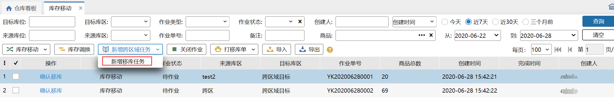

2、操作页面和库存移动类似，选择来源库位、要移动的商品和要移到的库位。

3、任务创建完成后，PC和PDA上都支持移库任务的完成。

#### 5. 关闭作业                   

勾选订单状态为待作业单据，点击关闭作业，订单状态转为已关闭。

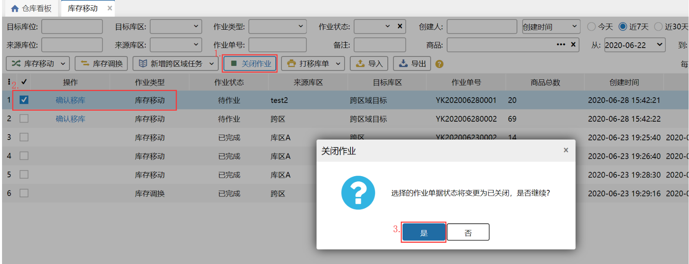

#### 6. 支持残次品移库

仓内作业时，需要将库位上的商品进行移动或上架操作，移动时需要给到操作员提示对应商品的库存属性是正品还是次品，如图所示。

确认移库页面

选择商品页面

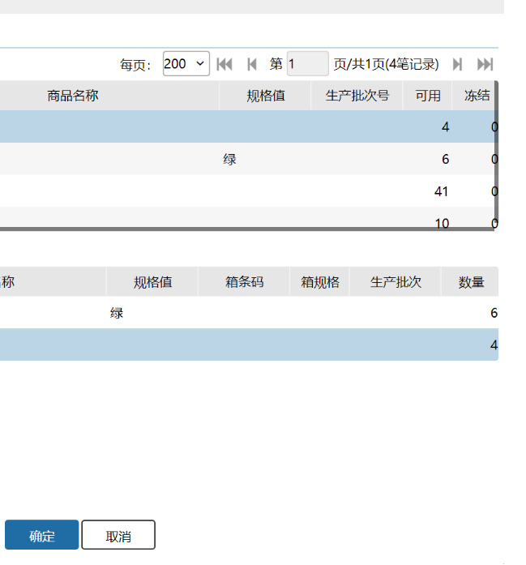

①.正品和次品移库、调换一定要遵守的原则

1.同一库位，同一个商品的正品库存和次品库存不能同时存在。

2.正品库存和箱库存不能放到次品库位上。

②.正品库存、次品库存指导上架逻辑调整

1.指导上架时，次品库存只能指导到有余量的次品库位，其他库位不指导，无优先库位、无历史库位。

2.指导上架时，正品库存不能指导次品库位上，之前指导逻辑不变，普通商品还是按照优先库位、余量、历史库位；批次商品按照余量、历史库位。

③.次品库存管理开关

1.开启次品库存管理开关，显示正品和次品的库存属性，不开启就不显示.

2.次品库位与开关无关，一直都显示。

#### 7.打印移库单

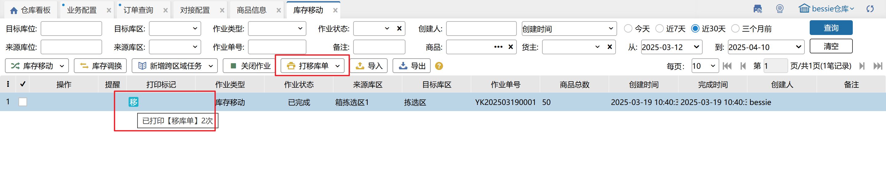

打印移库单后，单据上显示打印标记及打印次数。

#### 8.修改移库任务

待作业且没有被领取、没有下发到自动化设备的移库任务，可以进行修改。

具体操作页面如下：

1.可以将原来作业的数量、商品、库位全部进行修改

2.修改限制和新增移库任务一致

3.修改后点击保存，任务明细将变成修改后的：

#### ****

> 更新: 2025-04-29 16:49:59  

> 原文: <https://hupun.yuque.com/unzko7/lsbfg0/dza5azhqribowl4k>

---

### 07.1.3 库存转移

> 原始文件来源：`00-源文件/操作手册/仓内作业/库存移动/库存转移.md`

名词解释

1.库存转移主要用于服装行业，可以对商品进行改款操作

2.库存转移的效果是将来源库位的来源商品的库存转移成目标库位的目标商品库存

#### **1.新增转移任务**

新增转移任务首先点击库存转移页面的新增作业，之后主要有一下几种交互：

（1）先选来源库位后选来源sku

选择来源库位后，选择sku，可选的sku是来源库位中有库存的sku。

（2）先选择sku后选择来源库位

选择sku后，选择来源库位的可选范围：sku有库存的库位

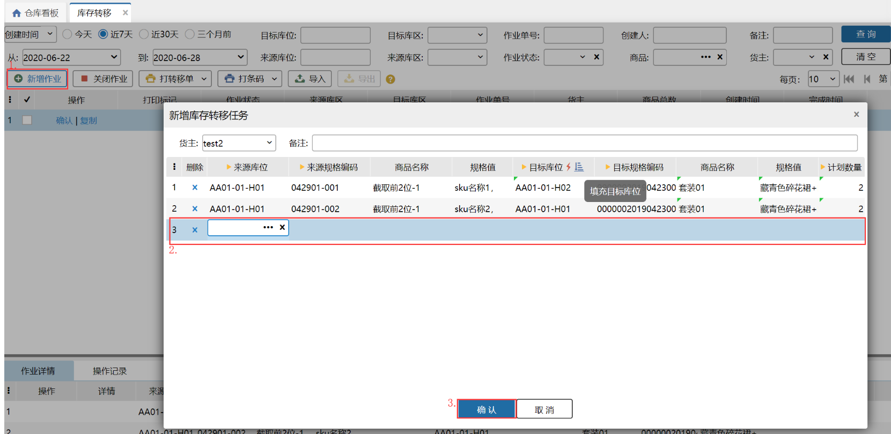

#### **2.完成转移任务**

完成效果：

（1）将来源库位的来源商品的库存转移成目标库位的目标商品库存。

（2）生成盘点单，将来源库位的来源sku，库位库存盘少；目标库位的目标sku库存盘多，同时盘点单据备注有转移单据的单号。

（3）生成调整单，调整单据类型为：转移调整。备注中有转移单据的单号，同时将对应库存变更通知erp。

完成操作有以下两种

①.整单完成

整个单据完成，操作记录仅显示完成整个单据。

②.单据内部分明细完成

仅完成对应明细的库存转移操作，操作记录中提示来源库位的来源sku数量n转移成目标库位的目标sku。

**提示**

1.选择库位时排除了预配库位

2.目标库位默认是和来源库位一致，可选择其他库位。

3.目前暂时不支持开启了生产批次、入库批次、序列号的商品进行转移操作

> 更新: 2023-12-21 17:41:48  

> 原文: <https://hupun.yuque.com/unzko7/lsbfg0/lryclmlbq3hsy9gl>

---

### 07.1.4 补货上架

> 原始文件来源：`00-源文件/操作手册/仓内作业/库存移动/补货上架.md`

当拣货库位商品库存不足时，则需要从存储库位将商品补充到该拣选库位上。

补货上架分为两种形式：自动新增补货上架单和手动新增补货上架单。

#### **1. 手动补货上架**

##### **01.新增作业**

手动新增补货上架任务具体页面如下：

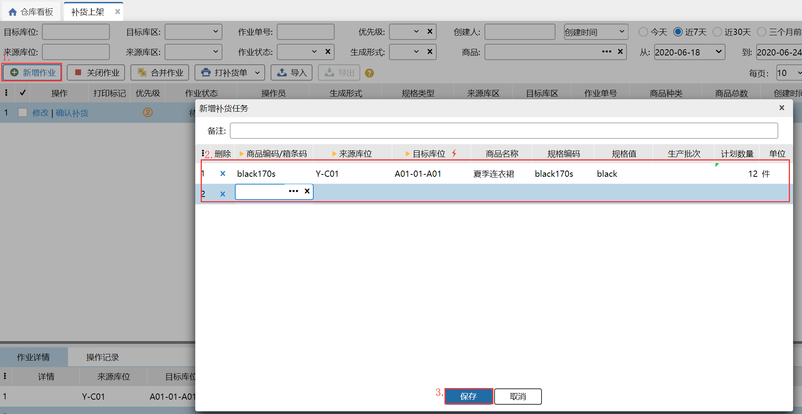

提示

1.来源库位只能选择存储库位，目标库位只能选择拣选库位；

2.补货的sku只能选择可用库存，冻结库存和锁定库存不能用来补货操作；

3.新增补货上架任务后该任务的状态自动变更为“待补货”，且可打印补货单；

4.同一个sku若目标库位有冻结库存，则来源库位向目标库位补货点击保存报错：目标库位有冻结库存，不能补货；

5.“待补货”状态的补货任务可以关闭作业，且相应的库位库存的锁定都会释放，但是关闭后不允许打印补货单。

##### **02.确认补货作业**

已存在补货任务，则可以进行确认补货的操作，具体操作如下：

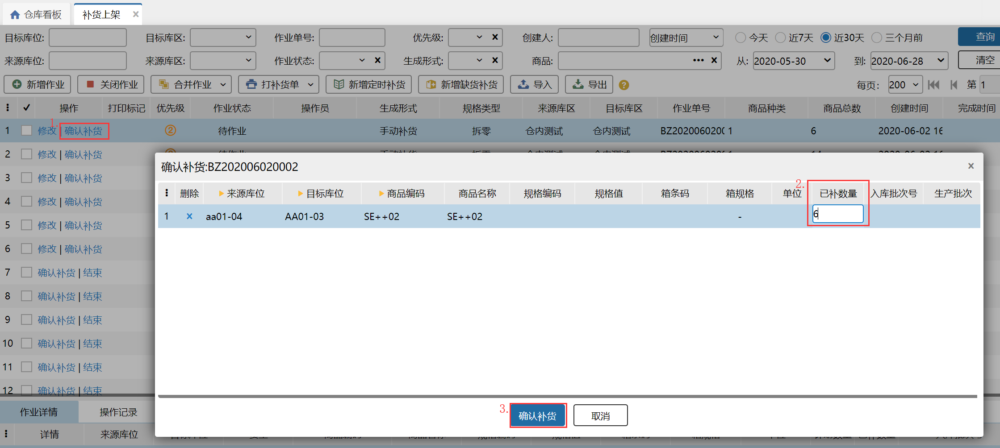

**提示**

1.若补货任务都完成，则作业状态会变成"已完成"，且不允许打印补货单；

2.若已补货一部分但未完全补货，则作业状态会变成“补货中”，且允许打印补货单；

3.“补货中”的补货任务不允许关闭作业，只能“强制完成”；若点击“强制完成”，则状态变为"已完成"；

4.补货完成后可以在【库存】-【库位库存】页面查看最新的库存状况。

#### **2. 定时补货**

自动补货上架是根据操作员在【仓库】-【库存预警】下设置库位上商品的上下限来生成的，若库位上实际库存小于预警下限则会自动生成补货上架的任务，提醒操作员进入补货操作。

自动补货上架生成要点

1.触发条件：预警下限≥库区拣选库位+待补货任务，定时生成任务。

2.来源库位必须为存储库位，本库区内的优先获取。如果本库区不够，则找编码相近的库区获取，但是只寻找本区域下的库区(跨区域的不作为来源)。

3.库区补货数量=预警上限-当前库区剩余可用-待补货任务

4.补货上架任务生成影响因素：

1）商品的总体积不能大于库位的体积；

2）商品的总重量不能大于库位的限重；

3）库位中优先补优先级高的商品（可在【基础信息】-【库位库存】中设置库位的优先商品）；

5.手动新增定时补货：仓内策略-业务配置关闭补货上架自动生成补货任务时，可以手动生成定时补货任务，且支持配置补货项，补货逻辑和自动补货一致。

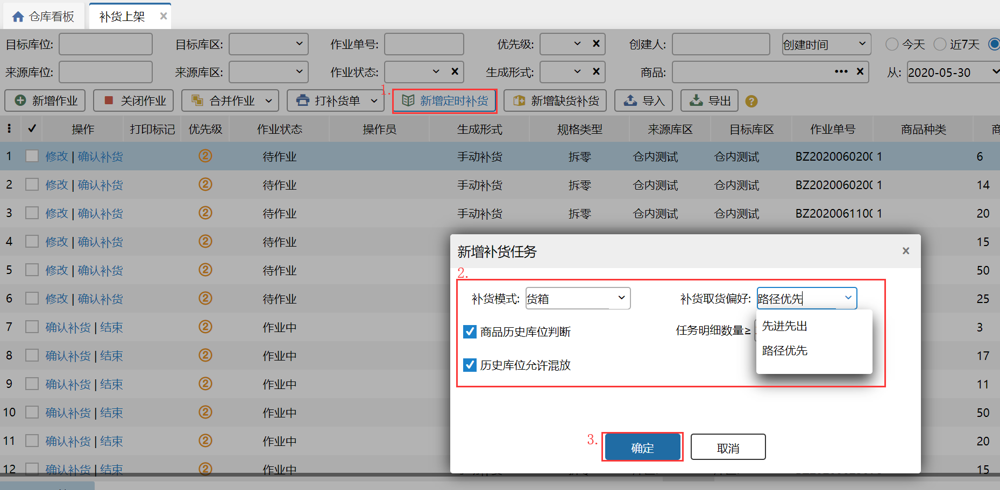

#### **3. 缺货补货**

**1.补多少：**锁定失败的订单中商品锁定失败数量和该商品库区预警上限对比。哪个大取哪个。若订单商品锁定失败数量大，补货数量=订单锁定失败商品数量-该商品拣选库位可用数量-该商品的补货在途数量；若预警上限大，补货数量=预警上限-该商品拣选库位可用数量-该商品的补货在途数量。

**2.什么时候补：**a.订单归属波次，波次策略跑批触发锁定，发现订单锁定失败，触发补货 b.订单归属零拣，零拣批处理跑批触发锁定，发现订单锁定失败，触发补货

**3.补到哪里（找目标库位）：**

1）先查询全仓是否有库位设置了缺货商品为优先商品，倘若有，定位该库位。倘若无，走下一步；

2）查询全仓有这个商品库存的拣选库位，倘若有，定位该存储库位所在库区下有这个商品库存的拣选库位。倘若无，走下一步；

3）查询全仓该商品历史存在过的拣选库位，倘若有，定位该存储库位所在库区下有历史存在过的拣选库位。倘若无，走下一步；

4）查询全仓存储库位有缺货商品存在的库位，定位该存储库位所在库区的空拣选库位，倘若无，无法补货。

**4.从哪里补（找来源）：**

1）从目标库位所在库区的存储库位找，找不到走下一步；

2）目标库位所在区域库区编码从小到大依次找存储库位有库存的，再找不到走下一步；

3）目标库位所在区域相邻区域的库区找存储库位有库存的，相邻的找不到再找次相邻的，直到找遍所有区域下的存储库位。

5.手动新增缺货补货：仓内策略-业务配置关闭补货上架自动生成补货任务时，可以手动生成定时补货任务，且支持配置补货项，补货逻辑和自动补货一致。

6.指定锁定范围失败也生成任务：手动截单、清仓波次、手工波次指定库区锁定失败后按照指定库区补货。

#### **4. 补货配置完结**

当业务配置中开启了允许补货自动完结，补货任务部分完成后，任务状态将直接变成已完成，不能再次作业，之前未补的数量依旧视为未补。

#### **5. 修改补货任务**

未作业过且没有在作业中的补货任务，可以进行修改。

具体操作页面如下：

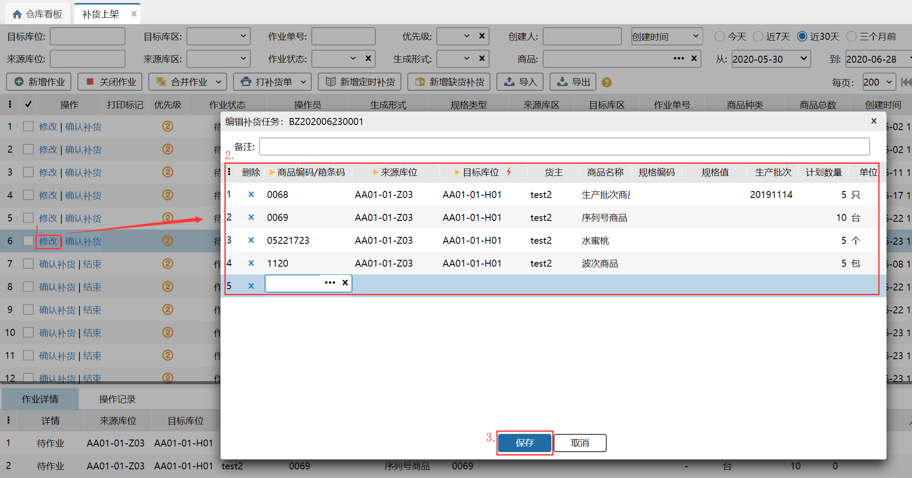

1.可以将原来作业的数量、商品、库位全部进行修改

2.修改限制和新增补货任务一致：同一作业只能包含拆零或者按箱明细、目标库位只能为拣选库位、一个任务不能包含多个货主的sku

3.修改被操作员领取的作业会报错提示不能修改

4.已经作业过的补货任务无修改按钮

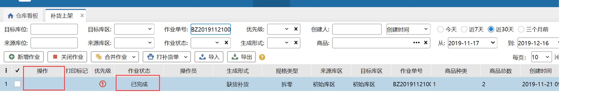

5.修改后点击保存，任务的生成形式将变为手动补货，任务明细将变成修改后的

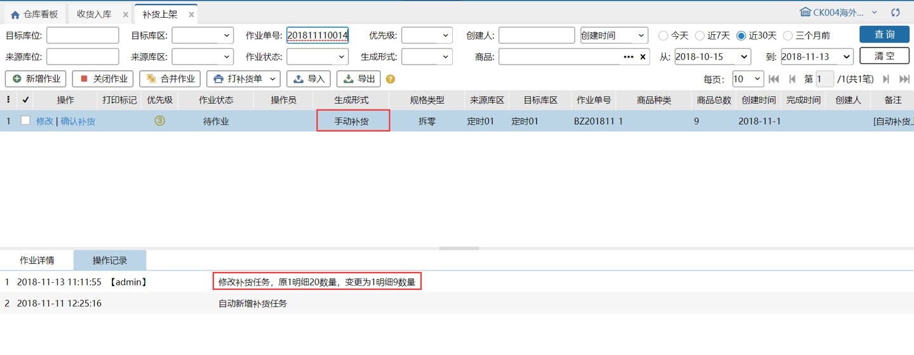

#### **6. 合并补货任务**

建议使用方式：将同来源库区的补货任务合并，这样取货时就可以一次性将同一来源的货物取完。

合并任务限制：和新增任务限制一致，只能合并同类型的任务，比如：拆零任务只能和拆零任务合并，货箱任务只能和货箱任务合并。

当合并的任务来源为不同的库区时，会有提醒。

合并后相同的明细会合并，数量累加。

#### **7. 一键合并补货任务**

 

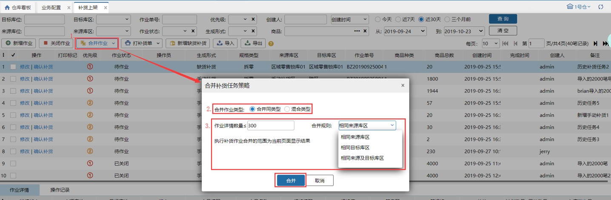

**策略解释：**

1.一键合并作业范围：取当前查询结果下所有待作业且未被操作员领取的任务明细进行合并。

2.合并作业类型：即合并补货任务的范围；

1)合并同类型：合并任务时，生成形式相同的会进行合并；例：待作业的补货任务有：任务01-缺货补货，任务02-定时补货，任务03-缺货补货、任务04-定时补货，一键合并作业类型选择合并同类型，任务01和任务03合并，任务02和任务04合并。

2）混合类型：合并任务时根据勾选的作业类型进行合并，操作如下图：

例1：合并作业类型选择混合类型，勾选了缺货补货，待作业的补货任务有：任务01-缺货补货，任务02-定时补货，任务03-缺货补货、任务04-定时补货，一键合并作业时，只取任务01、任务03进行合并；

例2：合并作业类型选择混合类型，勾选了缺货补货、定时补货，待作业的补货任务有：任务01-缺货补货，任务02-定时补货，任务03-缺货补货、任务04-定时补货，一键合并作业时，取任务01、任务02、任务03、任务04进行合并。

3.作业详情数量：合并生成新的补货任务的详情数量。

4.合并规则：合并补货任务的依据。

1）相同来源库区：来源库区相同的补货任务合并到一个任务中；例：补货任务01：商品a 来源库区A、商品b 来源库区B、商品c 来源库区C  补货任务02：商品d 来源库区A、商品e 来源库区C，一键合并作业生成3个补货任务：任务1：商品a 来源库区A、商品d 来源库区A；任务2：商品b 来源库区B；任务3：商品c 来源库区C、商品e 来源库区C.

2）相同目标库区：目标库位所在的库区相同的补货任务合并到一个任务中；

3）相同来源库区及目标库区：来源库区、目标库区相同的补货任务才会合并到一个任务中。

**注意：**

1. 同商品来源库位、目标库位相同的补货明细会合并成1条；

2.一键合并任务时，拆零的与拆零的合并，箱子与箱子的合并；

3.一键合并任务生成时，补货任务无法在pda领取。

5.生成补货任务排序：再满足设置的合并规则的情况下，根据明细的来源、目标和商品编码进行排序；

1）合并规则为相同来源库区，排序为：目标区域编码>目标库区编码>来源库位编码>目标库位编码>商品编码

2)合并规则为相同来目标库区，排序为：来源区域编码>来源库区编码>来源库位编码>目标库位编码>商品编码

3）合并规则为相同来源及目标库区，排序为：来源库位编码>目标库位编码>商品编码

#### 8.导出

除“已关闭”状态的补货任务都支持导出。

> 更新: 2026-06-30 10:36:27  

> 原文: <https://hupun.yuque.com/unzko7/lsbfg0/cxslvg2t8bb5z6lc>

---

### 07.1.5 预包任务

> 原始文件来源：`00-源文件/操作手册/仓内作业/库存移动/预包任务.md`

预包任务适用于以预包为主的仓库，根据子商品配比数量和计划预包数量计算预打包数量，并支持单独统计预包绩效。

#### 1.新建任务

先在PC上新建预包任务单，具体步骤如下：

其中：

(1)预配策略：是本仓的预配策略，包括启用和停用的，排除了包含序列号商品、生产批次商品和入库批次商品的策略

(2)预包数量：即预打包数量

(3)单价：指完成每个成品的预包费用，用于计算预包绩效，记录在波次策略上，下次新建任务时，选择同一波次策略会自动带出单价

(4)商品明细：是所选预配策略中指定的商品规格，配比数量是策略中的商品数量(不会约分)，计划数量=预包数量*配比数量

#### 2.任务状态

创建任务单后，生成一个[待作业]预包任务显示如下：

预包任务的操作在PDA上进行(具体操作参考PDA-预包任务)，提交后在PC上同步更新数据。

如下图是任务[全部完成]的状态：

预包任务的操作在PDA上进行(具体操作参考PDA-预包任务)，提交后在PC上同步更新数据。

如下图是任务[全部完成]的状态：

其中：

(1)任务单据层级的完成数量≥成品数量

(2)作业详情中的完成数量=PDA上提交的数量≥计划数量

(3)来源库位=PDA上子商品的锁定库位；目标库位=成品的指定库位

(4)操作员=在PDA上提交作业的操作员

(5)按照成品数量计算预包绩效，并记录在绩效明细报表和绩效统计报表中

(6)库位流水记录预包作业发生的库存变化情况，可查看预包作业单据详情

如下图是任务[部分完成]的状态：

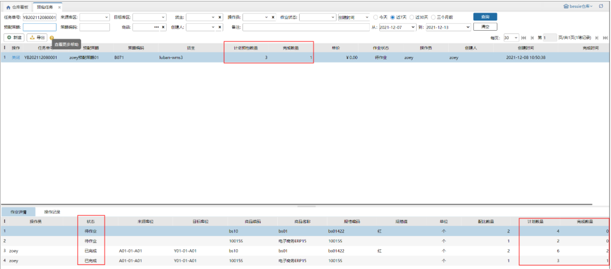

其中：

(1)任务单据层级的完成数量<成品数量

(2)作业详情中的完成数量<计划数量时会自动拆分成2条明细，已完成明细的完成数量=PDA上提交的数量，待作业明细的计划数量=原计划数量-已完成数量

(3)来源库位=PDA上子商品的锁定库位；目标库位=成品的指定库位

(4)作业详情上的操作员=在PDA上提交作业的操作员；任务单据层级的操作员=最后一次提交并完成任务的操作员

(5)按照成品数量计算预包绩效，并记录在绩效明细报表和绩效统计报表中

(6)库位流水记录预包作业发生的库存变化情况，可查看预包作业单据详情

#### 3.关闭任务单

仅待作业的任务单允许关闭。

#### 4.导出任务单

除“已关闭”状态的任务都支持导出。

#### 5.按预警条件快速生成

点击后按预警上下限生成预包任务，点击可查看详情：

**生成预包任务时计划预包数量计算方式：计划预包数量=预包上限（无预包上限时取预包下限）-预计可用库存(套）-待作业预包任务计划预包数量   **

**注：上述计算方式中涉及的参数可参考**[**预包预警**](https://hupun.yuque.com/unzko7/lsbfg0/uzz9ntco9acin5i1)**页面对应的预配策略数据**

若是停用的预配策略，不生成预包任务；

若无预包上下限，不生成预包任务；

若计划预包数≤0时，不生成预包任务；

若预计可用库存(套)+待作业预包任务计划预包数量 ≥  预包下限，不生成预包任务；

若计划预包数>0且对应预配策略无待作业的预包任务，则生成新的预包任务，**计划预包数量=计算出的计划预包数**

若计划预包数>0且对应预配策略有待作业的预包任务，则选择其中1个预包任务叠加计划预包数量，**叠加数量=计算出的计划预包数**

#### 6.按缺货条件快速生成

点击后按缺货数量生成预包任务，点击可查看详情：

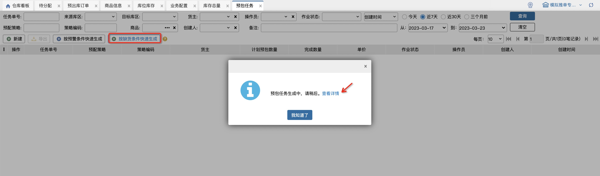

**生成预包任务时计划预包数量计算方式：计划预包数量=缺货组合数/预包上限（取较大值）-预计可用库存(套）-待作业预包任务计划预包数量   **

**注：****上述计算方式中涉及的参数可参考**[**预包预警**](https://hupun.kf5.com/hc/kb/article/1602389/)**页面对应的预配策略数据，缺货组合数=[待分配+波次打单环节]所有预配波次订单数-对应预配策略指定库位可用库存数（若为负数则取0）** 

若计划预包数≤0时，不生成预包任务；

若计划预包数>0且对应预配策略无待作业的预包任务，则生成新的预包任务，**计划预包数量=计算出的计划预包数**

若计划预包数>0且对应预配策略有待作业的预包任务，则选择其中1个预包任务叠加计划预包数量，**叠加数量=计算出的计划预包数**

> 更新: 2025-12-12 15:52:47  

> 原文: <https://hupun.yuque.com/unzko7/lsbfg0/no31nnkdg27w3g9i>

---

### 07.1.6 打包装箱

> 原始文件来源：`00-源文件/操作手册/仓内作业/装箱/打包装箱.md`

打包装箱，是指将仓库内货品进行装箱存放。

#### 1.操作界面

查询区可根据不同筛选条件进行查询，创建时间默认为当日。

#### 2.新增装箱

1、点击新增按钮，确认好货主、装箱作业员后选择待作业的库位。

2、输入需要装箱的商品明细

3、点击保存

**提示**

**1.装箱作业的库位不支持【拣选库位】和【预配库位】**

**2.业务配置开启生产批次标准模式，装箱商品不支持生产批次商品。**

#### 3.批量装箱

批量装箱是指将相同的商品按照固定的数量进行装箱操作。

点击批量装箱选择需装箱商品，输入单箱数量后系统自动计算箱数。

**提示**

1、可装总数如不能被单箱数量整出则余数也装一箱

2、批量装箱中添加多个商品，系统不做混装操作。

#### 4.作废、打印箱号

1、勾选待操作明细，可进行该箱的作废操作，箱号作废后该箱内商品数量释放可装总数增加

2、勾选指定箱可进行箱号的打印。

#### 5.导出及导入

导出支持指定箱明细导出和查询结果导出，导入时按导入模板进行填写，成功后系统完成装箱操作

 

商品入库后放置一个大货拣货库位进行暂存，优先发一部分货之后进行往相应的库位之中进行上架 装箱操作因此新增移库装箱模块；

#### 6.移库装箱

录入移库来源库位和装箱目标库位后，选择进行移库装箱的商品、数量后，点击保存，完成移库装箱

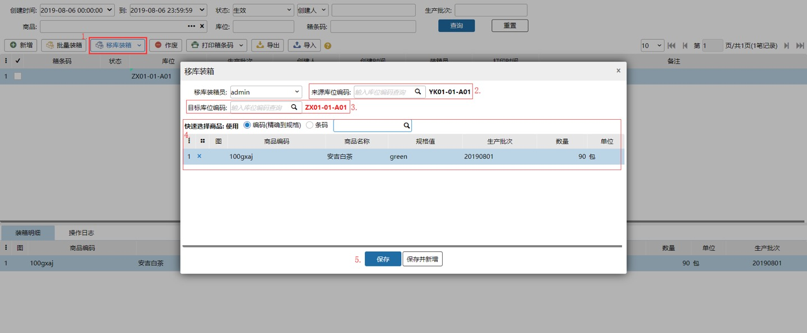

**提示：**

1. 移库来源库位必填且不能为次品库位

2.选择商品范围为来源库位可用库存>0的商品

3. 装箱目标库位必填且不能为拣选、预配、次品库位；

4.来源库位与目标库位不能相同；

5.移库装箱成功后库存移动页面自动新增一条移库记录；

6.移库装箱完成后，会记录来源库位、目标库位。                  

#### 7.批量移库装箱

批量移库装箱是指将相同的商品按照固定的数量进行移库装箱操作。

点击批量移库装箱选择需装箱商品，输入单箱数量后系统自动计算箱数。

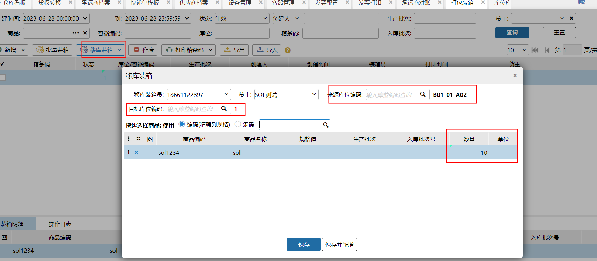

> 更新: 2023-12-21 17:44:35  

> 原文: <https://hupun.yuque.com/unzko7/lsbfg0/dcwwguxi6he1fnis>

---

### 07.1.7 规格装箱

> 原始文件来源：`00-源文件/操作手册/仓内作业/装箱/规格装箱.md`

提示：该功能开启需要在业务配置-其他配置-开启商品多单位。

名词解释：这个功能是对规格箱进行装箱和拆解。规格箱即根据系统设置的箱规则装的箱子。箱规则设置见商品信息页面。

#### 1.规格装箱

先点击新增，再扫描库位编码，最后选择库位下有库存的且设置了箱规则的商品。

选择商品后，选择商品的箱条码，可选对应方案的对应层级的箱条码。

选中后，系统会根据可用库存/箱条码对应的基础商品个数，计算最多可装箱子数。可以修改装箱数量，保存后，库位库存就会对应的箱子。

例如：库存可用有999个，选择规格箱的规格为：1箱4个商品，计算出来最多可装箱子数量：999/4取整数为249个箱子。

**注：生产批次商品不支持规格装箱。**

#### 2.移库装箱

先点击移库装箱，再选择移库来源库位编码、装箱目标库位编码最后选择库位下有库存的且设置了箱规则的商品。

选择商品后，选择商品的箱条码，可选对应方案的对应层级的箱条码。

选中后，系统会根据可用库存/箱条码对应的基础商品个数，计算最多可装箱子数。可以修改装箱数量，保存后，库位库存就会对应的箱子。

例如：库存可用有99个，选择规格箱的规格为：1箱2个商品，计算出来最多可装箱子数量：99/2取整数为49个箱子。

**提示：**

1. 移库来源库位必填且不能为次品库位

2. 选择商品范围为来源库位可用库存>0的商品

3.装箱目标库位必填且不能为拣选、预配、次品库位；

4.来源库位与目标库位不能相同；

5.移库装箱成功后库存移动页面自动新增一条移库记录；

6.移库装箱完成后，会记录来源库位、目标库位。               

#### 3.拆解箱子

这个功能可以把大箱子拆成小箱子，或者把箱子直接拆成拆零库存。

点击箱子旁边的拆解，弹出框中可填写本次拆的箱子数量，本次拆的箱子数量不能大于箱子的可用数量。也可选择将要拆成哪个层级的箱子，可跨层级拆。

选中箱子对应层级后并填写要拆的箱子数量后，系统会自动计算出拆后对应箱子数量。

继续拆的意思是拆完这个4级的箱子，可继续拆3级的箱子。

保存的意思是只拆当前的箱子，不继续拆了。

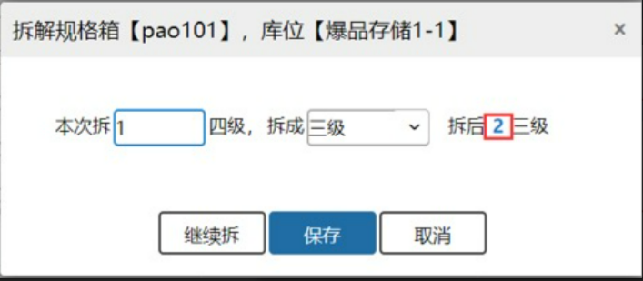

点击继续拆的效果：四级箱子拆成三级箱子后，页面显示拆分三级箱子的配置。

#### 4.打印

点击打印可以打印对应规格箱的箱条码。

> 更新: 2023-12-21 17:44:58  

> 原文: <https://hupun.yuque.com/unzko7/lsbfg0/pfel68wc5e56mgnt>

---

## 07.2. PC端库存变更与加工

### 07.2.1 正次转换

> 原始文件来源：`00-源文件/操作手册/仓内作业/库存变更/正次转换.md`

当入库或仓内作业发现商品有损坏等情况不能进行出库时，则需要将这些商品库转成次品，当商品进行返修或其他操作后可以贩售了，则需要将商品转为正品；

该页面主要有两个功能：正品转次、次品转正。

具体的次品转正和正品转次后，系统自动生产库存调整单，调整类型为数量调整，在【库存】-【库存总量】、【库位库存】页面能看到对应的库存会有相应的变化。

#### **1.正品转次**

具体操作如下：

提示：

1. 来源库位只能选择非次品库位，目标库位无限制；

2.选择的商品只能是该来源库位下存在的实际库存大于0的商品；

3. 目标库位选填，若不填，则该sku在来源库位上全量转次；

4.所选商品锁定、冻结的数量不允许转次；

5.同一个库位下同一个sku不会同时存在正品大于0且次品也大于0的情况；

案例如下：

前提：来源库位A，目标库位B，要将商品a的正品库存转成次品库存

1）B中有商品a 正品库存10个，此时A向B转次a商品5个，点击报错：目标库位上有同商品的不同属性库存；

2）A中有商品a 正品库存20个，其中可用15个，锁定5个，B中无商品a的正品库存，此时A向B转次a商品，可转次的数量为15个；

3）A中有商品a 正品库存20个，其中可用0个，冻结20个，此时A向B转次a商品，点击报错：正次转换不允许转冻结的商品；

4）A中有商品a 正品库存20个，其中可用20个，B中无商品a的正品库存，此时A向B转次a商品，点击保存成功。

开启入库批次的商品转成次品后，清空入库批次号；

开启序列号的商品支持录入序列号后转成次品，转次后，录入的序列号标记为次品的序列号，普通订单出库时，不允许录入次品的序列号。

若上次正品转次所选目标库位都为同一库位，再次操作正品转次时，选择来源库位和商品后，目标库位会自动带出上次转次操作的目标库位。

正次转换后系统自动生成对应的库存调整单。

#### **2.次品转正**

具体操作如下：

1. 来源库位选择无限制，目标库位过滤次品库位；

2. 选择的商品只能是该来源库位下存在的实际库存大于0的商品；

3. 目标库位选填，若不填，来源库位为次品库位，保存报错：次品目标库位不能存放正品库存；若来源库位为非次品库位，则该sku在来源库位上全量转正；

4.所选商品锁定的数量不允许转次；

5.同一个库位下同一个sku不会同时存在正品大于0且次品也大于0的情况；

案例如下：

前提：来源库位A次品库位，目标库位C，要将商品a的次品库存转成正品库存

1）C中有商品a次品库存10个，此时A向C转正a商品5个，点击报错：目标库位上有同商品的不同属性库存；

2）A中有商品a 次品库存20个，其中可用15个，锁定5个，C中无商品a的次品库存，此时A向C转正a商品，可转正的数量为15个；

3）直接在A库位上转正a商品，保存报错：次品目标库位不能存放正品库存；

4）A中有商品a 次品库存20个，其中可用20个，C中无商品a的次品库存，此时A向C转正a商品，点击保存成功。

6.正次转换后系统自动生成对应的库存调整单。

#### 3.正次转换审核

##### 3.1 未设置审批管理

前提：开启次品审核+账号有审核权限

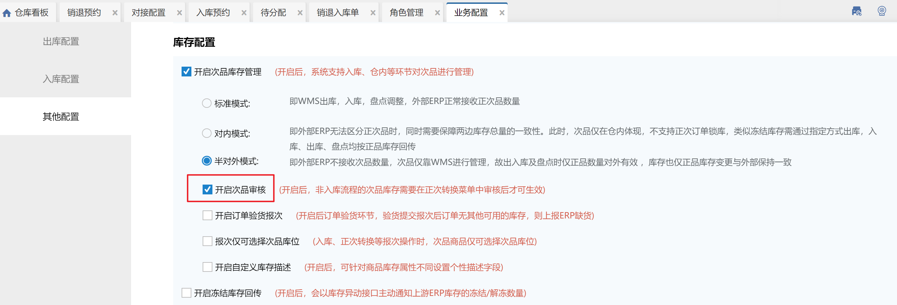

正次转换生成待审核单据，确认审核后单据生效，具体操作如下：

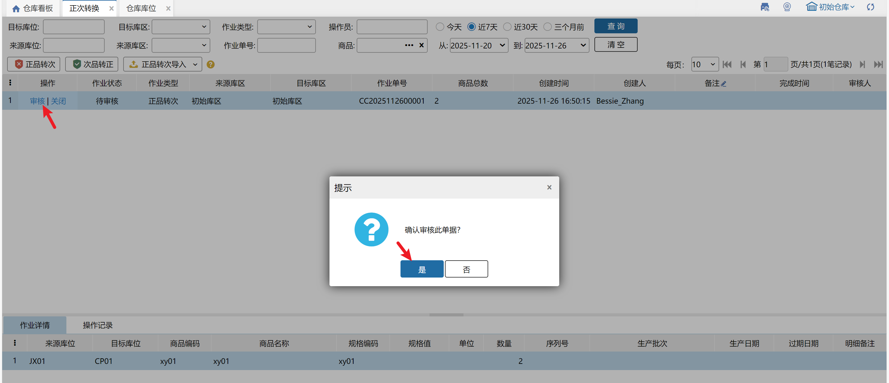

##### 3.2 设置审批管理

在审批管理页面配置正次转换审批流程后，符合配置的正次转换单据保存后会生成待转换+审批中的转换单，具体操作请参考[采购入库审核](https://hupun.yuque.com/unzko7/lsbfg0/crl0rycd2i8g3a23#M1x2b)。

> 更新: 2025-11-26 16:51:52  

> 原文: <https://hupun.yuque.com/unzko7/lsbfg0/vggggk8zdxt3eqfs>

---

### 07.2.2 盘点任务

> 原始文件来源：`00-源文件/操作手册/仓内作业/库存变更/盘点任务.md`

名词解释：盘点任务

1.盘点是为了精确的计算当日（或周、月、年）的营运状况，以日（或周、月、年）为周期执行清点仓库内的货品数量及账面价值，以便对仓储货品的收发结存等活动进行有效控制，保证仓储货品完好无损、帐物相符。

2.简单的说，系统里库存和仓库库存对不上了，那么就在wms系统里，把库存盘点成和仓库实际库存一致。

3.WMS库存盘点会更新箱子库存。

#### **1.新增盘点任务**

新增盘点任务分有以下几种方式：

##### 01.按库位新增盘点任务

直接点击页面上的新增任务就表示按库位新增盘点任务，具体如下图所示：

##### 02.按库区新增盘点任务

在新增作业页面选择想要盘点的库区，点击保存即可生成盘点任务，具体操作页面如下：

##### 03.按商品新增盘点任务

在新增作业页面选择想要盘点的商品，点击保存后目标库位上就会展现目前系统中有存在这个商品的库位，具体新增页面如下：

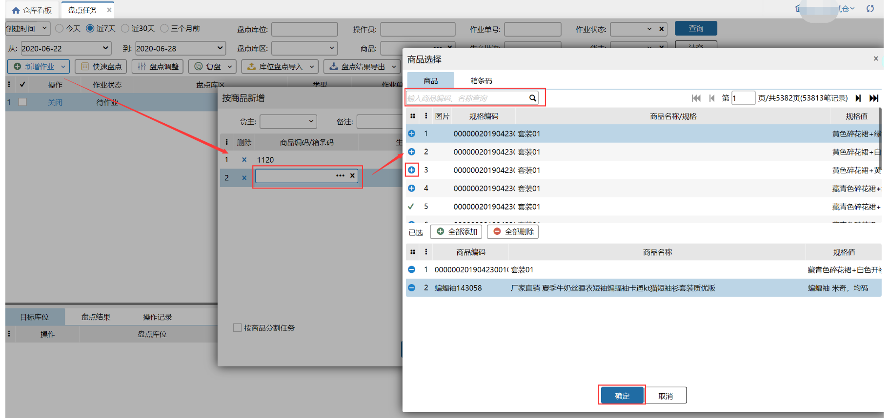

**提示**

1.按库区新增盘点任务：点击保存时系统会带出该库区下的所有库位，即可对每个库位进行盘点；

2.按库区分割任务：若勾选此项，则若有选择多个库区，则保存任务后会生成多条任务，每个库区一个任务；若不勾选此项，则点击保存后只会生成一个任务，即表示多个库区的盘点是在一个任务中；

3.按商品分割任务：若勾选此项，则若有选择多个商品，则保存任务后会生成多条任务，每个商品一个任务；若不勾选此项，则点击保存后只会生成一个任务，即表示商品的盘点是在一个任务中。

##### 04.按策略新增盘点任务

a.支持创建库位/商品盘点，是否选择明盘取决于勾选项。

b.动碰记录

   (1).盘商品+商品盘点：仅盘点所选时间段内有库存变动的sku。

   (2).盘商品+库位盘点：盘点所选时间段内有库存变动的sku的所在库位。

   (3).盘库位+库位盘点：盘点所选时间段内有库存变动的库位。

c.盘库存量较低

   (1).盘点库存总量实际数量(区分货主)在区间内的有库存变动的sku。

   (2).支持单区间填写。

   (3).仅商品盘点时支持该模式。

d.销售预警值

   (1).后台统计货主+正品+sku在近30天内销售出库平均值a，销售库存数量不足b天

   盘点范围：货主+正品+sku库存总量实际数量<=a*b的sku

注：正品符合条件的sku次品也对应生成盘点任务；生产批次商品计算粒度也到sku级。

   (2).仅商品盘点时支持该模式。

**选择多个模式生成盘点任务时，盘点结果取交集范围。**

e.盘点任务去重

   (1).生成盘点任务时过滤历史 X 天内有盘点结果的盘点任务明细。

   (2).新增任务类型：库位盘点

        仅去重历史盘点类型为库位盘点+X天内有盘点结果的盘点明细（只要库位在时间段内有盘点结果，不管库位上的商品，整个库位剔除）。

   (3).新增任务类型：商品盘点

       去重历史类型为商品、库位盘点+符合策略sku在X天内有盘点结果的盘点明细（库位+商品级剔除）。

f.抽盘覆盖率

   (1).任务类型：盘商品  商品种类数*覆盖率

   (2).任务类型：盘库位  库位个数*覆盖率

#### **2. 复制任务**

当同一个任务已经盘点完成，但是发现盘点错误时，则可以复制之前的盘点任务进行重新盘点，页面与新增页面相似，具体操作如下：

#### **3.盘点单导入**

盘点单导入可以时用户批量导入库位的商品，导入规则如页面显示，具体页面如下：

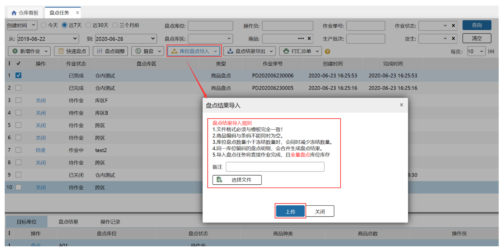

**提示**

1.同一个sku同一个库位导入文件中出现多次，导入的结果为它们的和；

#### **4.任务状态**

盘点任务分为以下几种状态：待作业、作业中、已完成、已关闭，只有待作业和作业中的任务可以进行盘点，且只有待作业的任务能关闭，作业中的任务只能强制完成。

点击盘点，填写实际盘点的数量，点击保存即完成了盘点，具体页面如下：

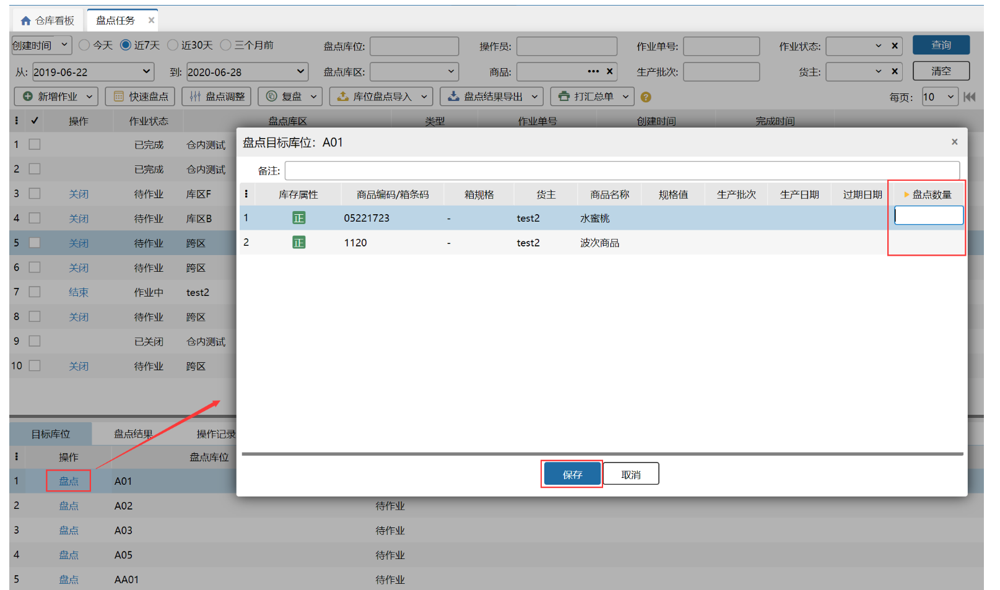

当点击保存后，在盘点结果就会有对应的记录：

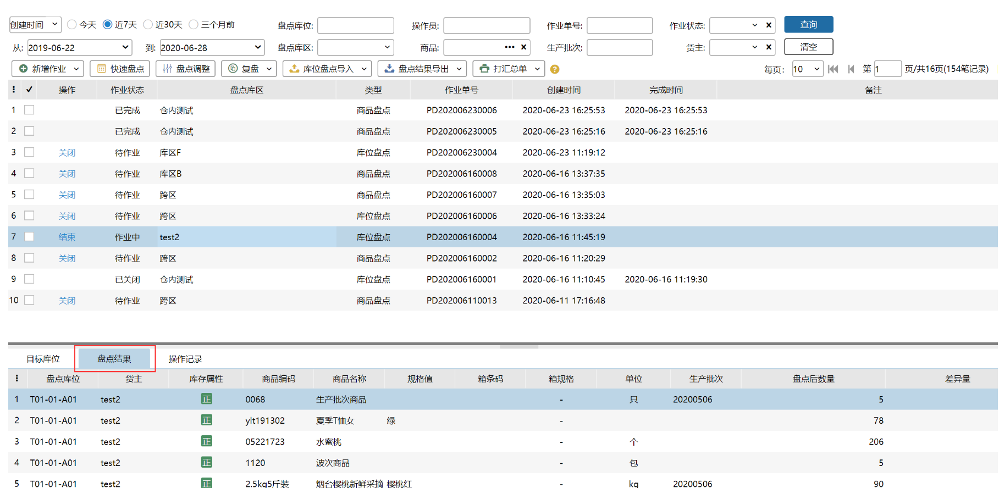

**提示**

1.盘点时库位为最小单位，即一个库位只能盘点一次；

2.当库位上一商品的实际数量与系统中该库位此商品的冻结数量不符时盘点后会增加或减少此库位的冻结库存；

3.盘点后点击保存后，则页面上会增加对应的盘点结果。

4.盘点结果中的盘点差异量=盘点后数量-盘点前数量；

5.此处的盘点结果中的库存差异量会记录到【库存】-【库存差异量】页面的详情中，会影响该仓库中此商品的库存差异量。

6.WMS系统支持盘点箱子库存。

#### **5.支持残次品盘点**

在做仓库盘点时，库位上发现有次品商品存在时，需要能准确盘点不同属性的库存数量，如图所示。

1.盘点目标库位页面，显示库存属性，商品显示正、次，货箱不显示库存属性。

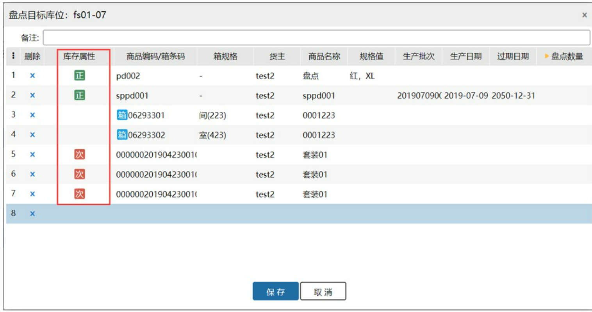

2.盘点目标库位，选择商品，商品默认添加的是正品，勾选添加次品添加的是次品，选择箱条码tab页是没有添加次品显示的。

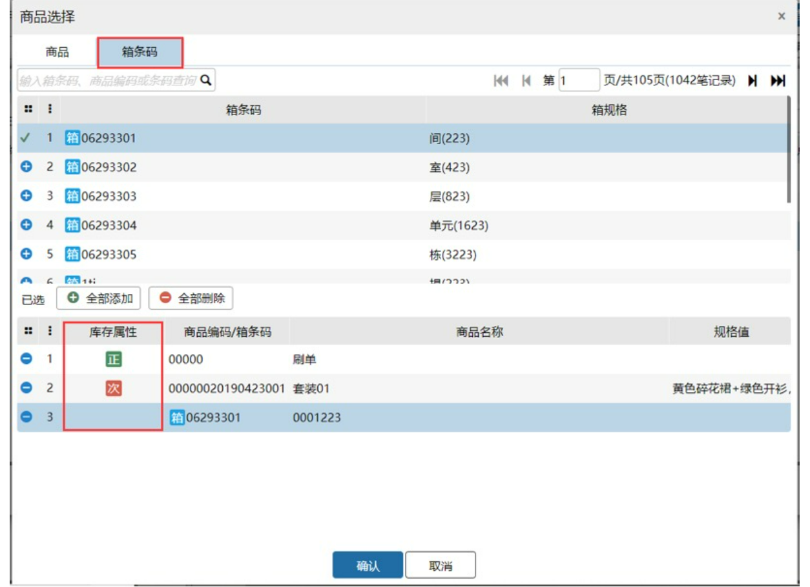

3.快速盘点和盘点调整页面，直接显示的是库位上的商品属性。

4.盘点页面，选择商品，默认添加的是正品，勾选添加次品添加的是次品，选择箱条码tab页是没有添加次品显示的。

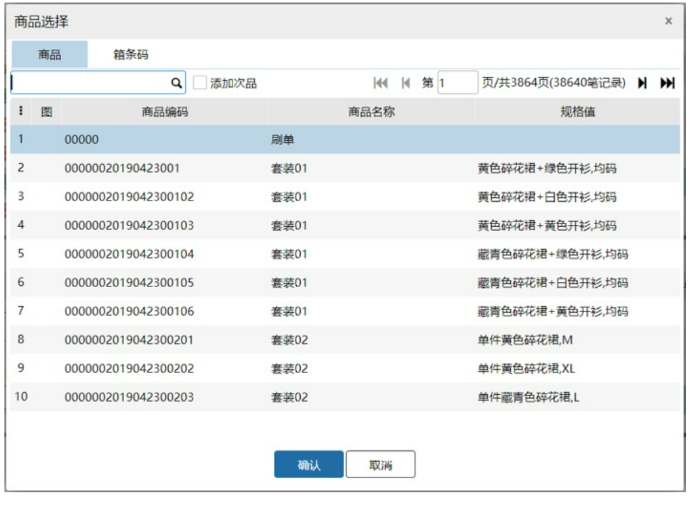

5.复盘和复制任务页面都不显示库存属性列，复原页面显示库存属性列。

6.盘点单打印，增加库存属性打印项，商品显示正品、次品，货箱显示空白；库存属性打印项和次品管理开关无关，开关关闭，库存属性都显示为空白。

**注意：**

商品盘点，创建任务时，不会带出库存为0的库位了；打开盘点目标库位页面时显示的是实时查询的库存结果，有正品库存就显示正品，有次品库存就显示次品库存，正次品库存都为0，则显示创建时的库存属性。

例如：若创建任务时，库位01有商品A的正品库存时，通过正次转换转成次品库存，打开盘点目标库位页面则显示的时A次品；若创建任务时，库位01有商品A的正品库存时，通过正次转换转成次品库存并把该次品库存盘成0，打开盘点目标库位页面则显示的时A正品。

#### **6.生产批次标准模式下不支持生产批次商品盘点调整**

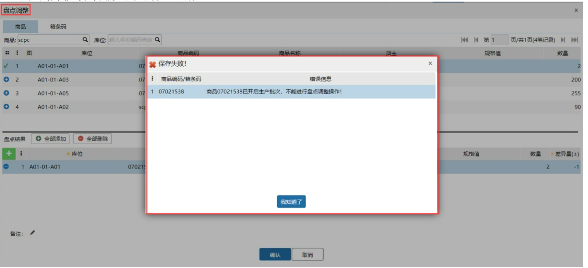

#### **7.盘点结果导出**

支持导出已盘点完成的盘点单，可以按[查询条件]，按[勾选单据]两种方式导出

#### **8.待作业任务导出**

支持导出待作业的盘点明细，可以按[查询条件]，按[勾选单据]两种方式导出

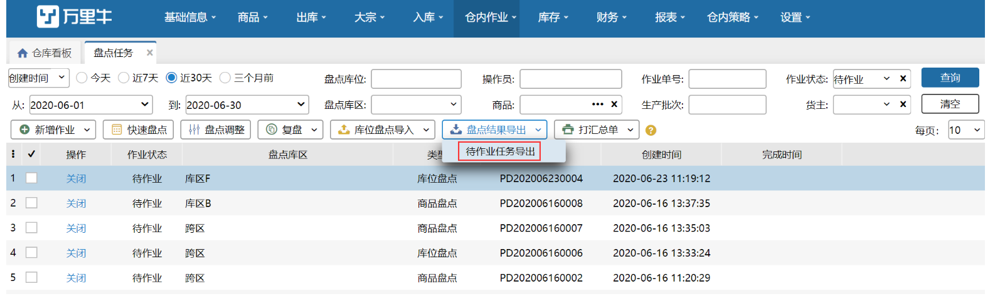

#### 9.明盘

创建盘点任务时，勾选“明盘”，生成盘点任务后，会显示对应sku在库位上的实际数量，不勾选则不会显示：

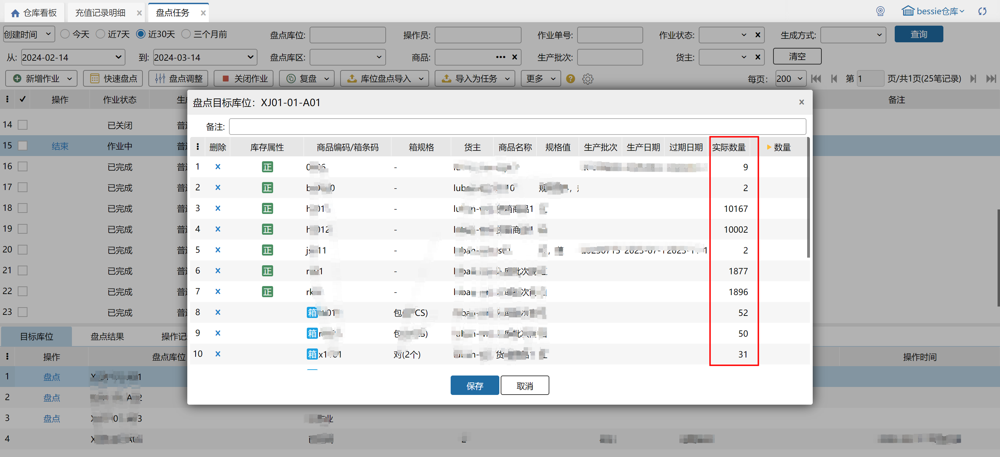

#### 10.辅助单位

新增辅助单位换算商品数量，关联开启商品多单位管理+出库快速换算推荐模式显示。

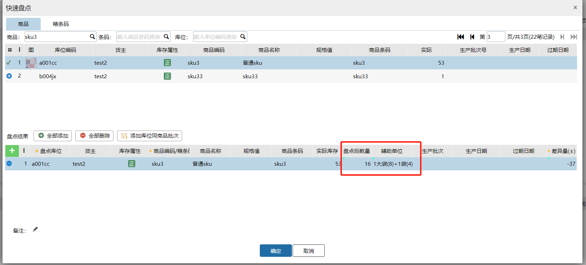

1.辅助单位弹窗显示商品多单位信息，编辑后自动把辅助单位数量换算基础单位数量后相加，更新到数量，辅助单位显示已填数量辅助单位拼接结果。

2.修改数量后辅助单位清空。

已支持页面：PC端入库模块、仓内盘点任务。

> 更新: 2025-03-24 14:01:39  

> 原文: <https://hupun.yuque.com/unzko7/lsbfg0/zwp8zuv4645fu28y>

---

### 07.2.3 仓内加工

> 原始文件来源：`00-源文件/操作手册/仓内作业/加工/仓内加工.md`

适用业务场景：用户需要将多个商品加工成另一个商品来适应当时的销售策略，例如：1个商品A+1个商品B组成1个商品C，通过建立仓内加工任务即可操作完成。

#### 1.组合加工

##### 01.原料

原料即组装成品需要的商品，一个成品一般对应多个原料。

原料锁定的库位根据业务配置中库位分配规则锁定。

配比数量等于该原料组成一个成品需要的数量。

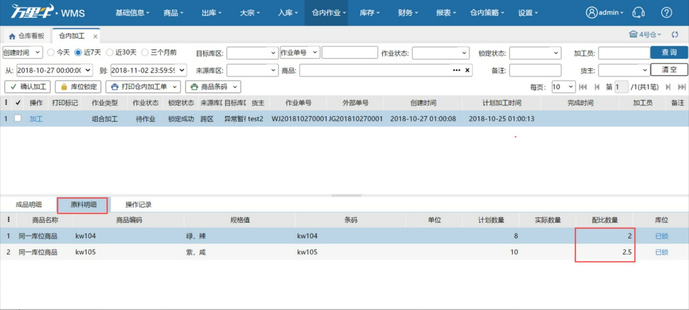

##### 02.成品

成品即组装后的商品。

目标库位有两种填充方式：

a.业务配置-加工单配置，开启默认成品过渡库位并配置默认库位，配置后加工单会按指定库位默认填充成品库位；

b.可选仓库任意库位，当原料锁定时，会根据原料锁定的库位所在区域指导出来一个成品的目标库位。若目标库位已经存在，根据锁定触发的指导，不会覆盖更新已有的目标库位。手动点击指导按钮时，会覆盖更新已有的目标库位。

目前一个加工单只有一个成品。

##### 03.单个加工

点击加工即可操作，填写原料实际用量和成品完成数量后即可点击完成。

原料的实际用量填写范围：0-锁定数量+锁定库位的可用数量。实际用量可以小于大于等于计划数量，但是保存的时候会校验，不能超过这个库位可用+该加工单锁定的数量。

成品实际生成的数量没有限制，可以小于计划数量也可以大于等于计划数量。

加工员可选择有这个仓库权限的操作员。

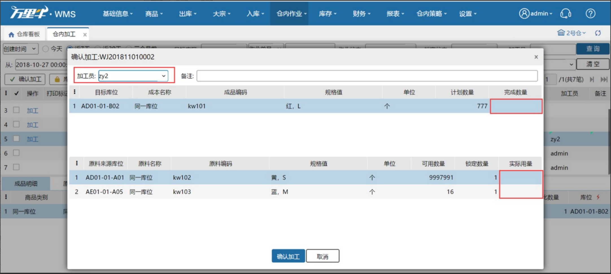

**注：业务配置-加工单配置，开启成品和原料实际数量免输入，原料和成品的实际数量会按照如下规则填充：**

a.待领料状态：原料和成品的实际数量会按照计划数量填充

b.待加工状态+全部领料：原料和成品的实际数量会按照计划数量填充

c.待加工+拣部分：原料默认填充已拣数量，按最大配比计算成品数量

（例：2个原料A+1个原料B，组合成1个成品C。计划成品数量4个，已拣4个原料A，1个原料B。默认填充成品C数量1个，原料A4个，原料B1个）

d.成品包含生产批次商品：不自动填充

##### 04.批量加工

批量加工可勾选多个加工单加工，选择后点击确认加工。

原料的计划数量就是实际用量，成品的计划数量就是完成数量，加工员即当前登录账号。

#### **2.拆分加工**

适用业务场景：把一种商品拆分成多种商品进行销售。在系统中即一种原料拆分成多种成品。

##### 01.原料

原料：被拆分的商品，一个拆分单据目前只支持一个原料。

原料锁定的库位根据业务配置中库位分配规则锁定。

配比：原料计划数量/成品计划数量。

##### 02.成品

成品：拆分后的商品。

成品的目标库位：可配置默认过渡库位，或手动选择仓库任意库位，当原料锁定时，会根据原料锁定的库位所在区域指导出来一个成品的目标库位。若目标库位已经存在，根据锁定触发的指导，不会覆盖更新已有的目标库位。手动点击指导按钮时，会覆盖更新已有的目标库位。

#### **3.生产批次严格模式下加工支持生产批次**

##### 01.原料库存的锁定

1）原料锁定根据锁定区域，按照先进先出顺序锁定。先空批次，再根据生产日期从早到晚，再根据生产批次号从小到大，最后根据过期日期从早到晚。

##### 02.成品批次的匹配

##### ①加工单推送过来指定了成品的批次。

a.成品在wms有库存和指定批次批次号一致，但是生产日期/过期日期不一致，推送报错。

b.成品在wms无库存和指定批次批次号一致，正常推送。

c.成品在wms有库存和指定批次批次号&生产日期&过期日期一致，正常推送。

##### ②加工单推送过来未指定成品批次。

成品批次会在原料锁定后，自动填充原料批次中最早过期的一个批次。

a.成品有历史批次和被填充的原料批次，批次号一致，但生产日期/过期日期不一致，成品批次不填充。

b.成品无历史批次和被填充的原料批次一致或者批次号&生产日期&过期日期全部一致，正常填充。        

##### ③批次商品的库存。

单据推送过来时，原料锁定加在空批次上，成品在途也加在空批次上，加工完成后，再增加/减少对应批次库存。

##### ④生产批次标准模式下，加工单成品或原料包含生产批次商品时，推送加工单报错。

##### 03.加工单指定批次

上游推送的加工单带有指定批次信息，会在WMS系统中显示，并且锁定原料批次库存和增加成品批次库存在途。最终库存赠减按照加工单最后选择的批次库存进行。

#### **4.生成加工任务**

勾选多个加工单，可以生成一个加工任务，以任务形式作业。

允许手动生成加工任务的前提条件：作业状态待领料+外部状态待完成+状态一致+加工类型一致+相同货主+未在加工任务中+未被领取+非冻结状态(erp批量推送的加工单，未全部推完前，单据是冻结状态)+库位锁定成功

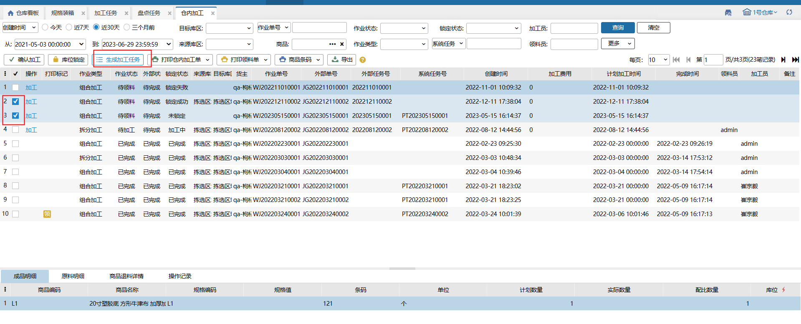

**注：生成加工任务后，生成系统任务号，单笔加工单不允许修改原料锁定库位、加工。**

#### 5.加工完成通知ERP

由pda快速加工发起的加工单或仓内加工完成加工通知ERP失败后，加工单状态不变，可重新加工。

#### 6.退料

在确认加工时，若原料实际使用数量<已拣数量时，系统会自动计算退料数量，填写退料库位可将超出部分还回指定库位（**注：退料数量>0时，退料库位必填**），退料完成后，在商品退料详情tab可查看数据： 

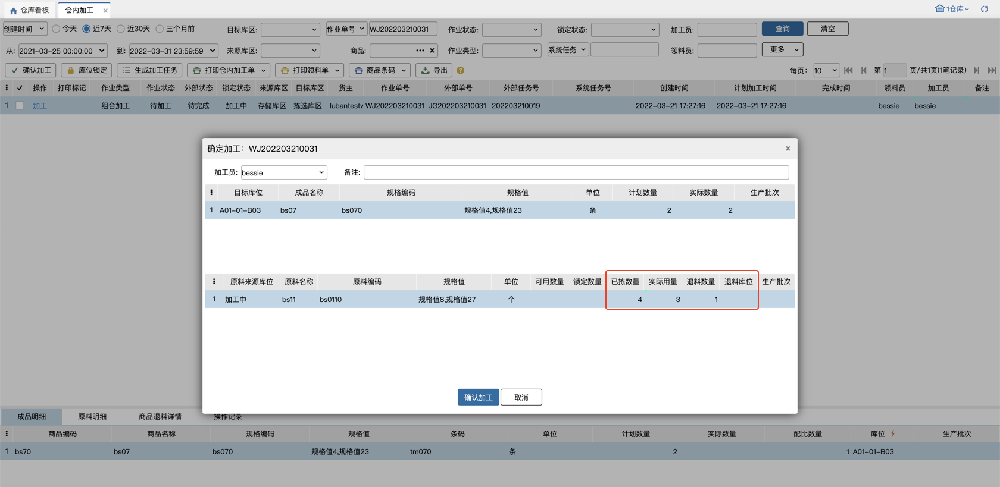

#### **7.加工单关闭**

待领料状态的加工单，erp发起关闭后，外部状态显示拦截，加工单自动关闭；

待加工状态的加工单，erp发起关闭后，外部状态显示拦截，点击加工或确认加工时，系统提示退料，退料数量自动计算，将已拣原料还回指定库位：

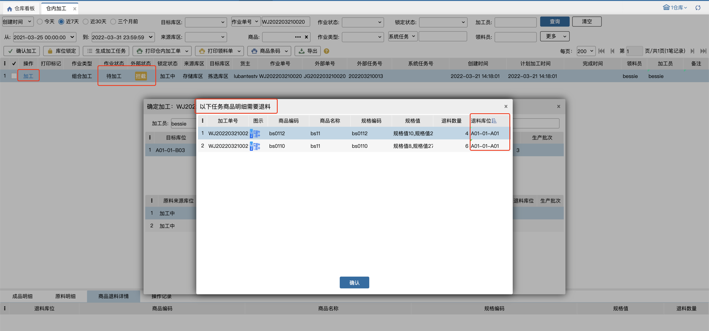

#### **8.加工单打印商品条码顺序支持多种**

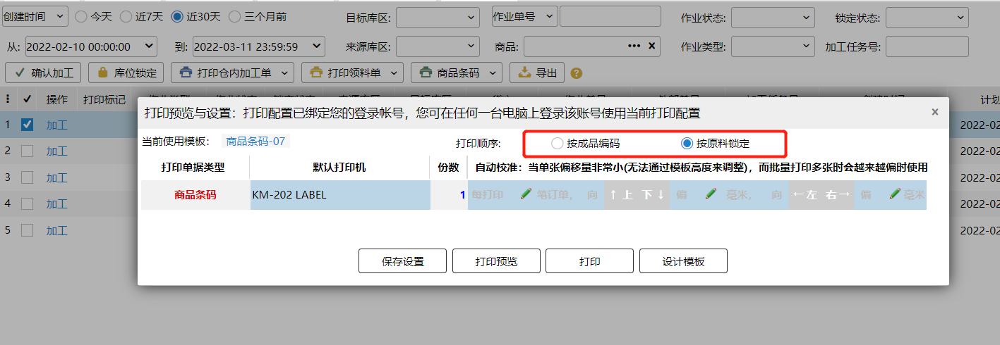

1.按成品编码-按成品商品编码顺序打印。

2.按原料锁定-按每个加工单中原料锁定的最小库位作为该加工单排序依据。

3.选择记忆在操作员上。

4.加工单的部分/全部原料未锁定库位/锁定失败、已完成的加工单，选择按原料锁定顺序打印报错。

例：

加工单1    成品-xy01：2个   原料-ss01：2个（原料全锁库位n001）   即原料最小库位n001

加工单2    成品-sku1:3个     原料-ss02：6个（原料锁库位k003：4个   n002:2个）即原料最小库位n002

加工单3    成品-xy02：1个   原料-ss03：2个  ss04：1个  （原料ss03锁库位c001：1个  d001：1个   原料ss04锁库位z001）   即原料最小库位z001

按成品编码顺序打印-sku1（3张）  xy01（2张）  xy02（1张）

按原料锁定顺序打印-xy02（1张）  sku1（3张）  xy01（2张）

> 更新: 2026-04-13 11:46:22  

> 原文: <https://hupun.yuque.com/unzko7/lsbfg0/cdki7dfr9uk688sx>

---

### 07.2.4 加工任务

> 原始文件来源：`00-源文件/操作手册/仓内作业/加工/加工任务.md`

将多个加工单生成同一个加工任务，进行加工作业。

#### 1.页面数据

##### 01.数据来源

1.erp批量推送带任务号的加工单，推送完成后，会自动生成加工任务

前提是开启业务配置-加工单配置-接收外部ERP推送的任务

2.手动在仓内加工页面勾选加工单，点击生成加工任务

##### **02.加工任务显示**

组合加工单，成品显示在上，原料显示在下：

拆分加工单，原料在上，成品在下：

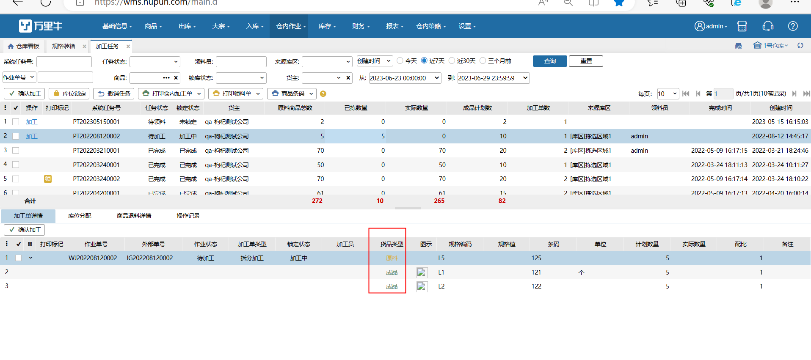

#### 2.库位锁定

根据业务配置-加工单配置锁定原料库位

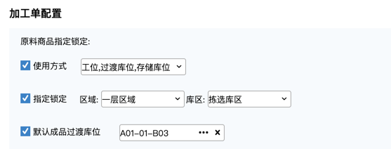

#### **3.确认加工**

##### **01.单个任务加工**

点击加工，按加工单层级显示数据，填写原料实际用量和成品完成数量后即可点击完成。

待领料加工单原料的实际用量填写范围：0-锁定数量+锁定库位的可用数量。实际用量可以小于大于等于计划数量，但是保存的时候会校验，不能超过这个库位可用+该加工单锁定的数量。

待加工加工单原料的实际用量填写范围：0-已拣数量。实际用量可以小于已拣数量，剩余部分进行退料操作。

成品实际生成的数量没有限制，可以小于计划数量也可以大于等于计划数量。

加工员可选择有这个仓库权限的操作员。

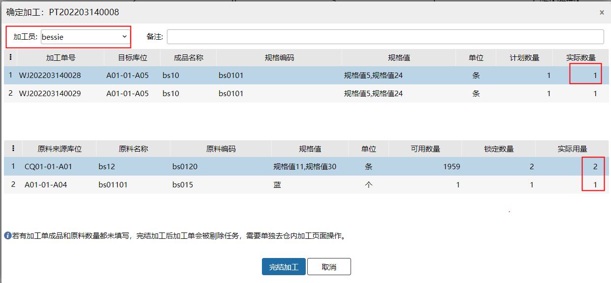

注：业务配置-加工单配置，开启成品和原料实际数量免输入，原料和成品的实际数量会按照如下规则填充：

a.待领料状态：原料和成品的实际数量会按照计划数量填充

b.待加工状态+全部领料：原料和成品的实际数量会按照计划数量填充

c.待加工+拣部分：原料默认填充已拣数量，按最大配比计算成品数量

（例：2个原料A+1个原料B，组合成1个成品C。计划成品数量4个，已拣4个原料A，1个原料B。默认填充成品C数量1个，原料A4个，原料B1个）

d.待加工+拣部分：原料在多个加工单中，若已拣<全部计划原料，则不填充数量；若已拣=全部计划原料，则按计划数量分摊到加工单中；若原料只在一个加工单中，且已拣<=全部计划原料，则填充已拣数量。

##### **02.批量确认加工**

批量加工可勾选多个加工任务加工，选择后点击确认加工。

原料的计划数量就是实际用量，成品的计划数量就是完成数量，加工员即当前登录账号。

注：

(1) 仅待领料+锁库成功、待加工+全部领料的加工任务允许批量确认加工，待加工+部分领料的加工任务不允许批量确认加工

(2) 若有加工单被拦截，点击加工/确认时提示异常，提示退料，退料明细：被拦截加工单原料明细，退料数量：该加工单原料已拣数量，退料完成后，库存流水单据类型：加工退料，主体是任务主体，明细显示退料明细

##### **03.单个加工单确认加工**

操作步骤同仓内加工页面-手动加工逻辑一致，若有导致该任务完成/关闭的操作，若有退料，先强制退料，再加工；否则直接完成加工；

若不会导致该任务关闭/完成的操作，若有退料，不会提示。

#### 4.撤销任务

(1) 已领取、已完成加工任务不允许撤销

(2) 待领料加工任务允许撤销，撤销后不解锁加工单锁定库位

(3) 待加工任务允许撤销，点击撤销时提示退料，退料明细：原料已拣数量>0的明细，退料数量：原料已拣数量，退料后解锁加工单锁定库位

#### 5.打印单据

##### 01.打印仓内加工单

单笔打印时，一笔加工单一张单据，打印后任务层级、加工单层级显示标记；

合并打印时，一个加工任务一张单据，加工单合并显示，若勾选多个任务，则打印出多张单据，打印后任务层级、加工单层级显示标记。

##### 02.打印领料单

一个加工任务一张单据，勾选多个任务，则打印出多张单据，打印后任务层级、加工单层级显示标记。

##### 03.打印商品条码

按成品编码：按成品规格编码从小到大打印出成品条码

按原料锁定：打印时以每个加工单原料锁定最小库位作为该加工单成品打印顺序，按原料最小库位编码从小到大排序打印出成品条码，若有原料未锁定，则报错提示。

> 更新: 2023-12-21 17:47:04  

> 原文: <https://hupun.yuque.com/unzko7/lsbfg0/utgr9tksmpu468go>

---

### 07.2.5 容器寄取

> 原始文件来源：`00-源文件/操作手册/仓内作业/其他/容器寄取.md`

处理退货包裹时，遇到退货无法查询到销退预约单的疑难件时，需要有个地方暂时存放无头件，待售后人员确认为某一售后单据后取出；

订单出库时，在某一环节需要将包裹暂时存放，根据订单信息申请快递单号，根据打印好的快递单号找到对应的包裹；

现推出暂存柜功能-容器寄取，支持将包裹放入保存，并通过放入时填写的识别码，待需要取出时通过扫码寻找置入的容器。

#### **1.存入**

###### 01.售后包裹

（1）点击'存入'按钮，选择要存入的包裹类型-售后包裹，扫描容器编码，选择交接承运商后，扫描包裹上的运单号后点击存入即可。

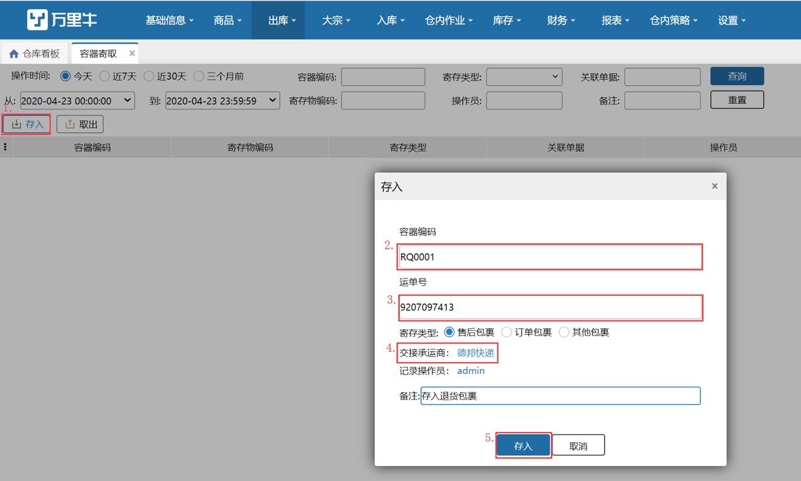

**注意：**

1. 相同承运商，相同运单号的包裹，已经存入过一次，未取出前，不允许再次存入；

2.已经存入过包裹的容器，未取出前，不能再次存入其他的包裹；

3.存入售后包裹时，选择的承运商和扫描的运单号和销退预约单上的承运商、运单号完全一致时，此容器会与销退预约单进行关联；例：存入售后包裹，承运商德邦快递，运单号：DB123；现有预约单01：承运商德邦快递，运单号DB123；存入售后包裹的容器会与预约单01进行关联。                    

4.如果暂时没有匹配到销退预约单，则直接存入，不关联单据，再次向系统推送销退预约单时，会与容器内存入的售后包裹进行匹配。                     

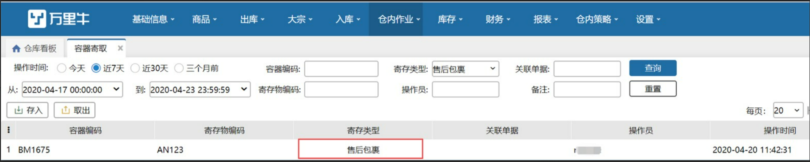                                      

###### 02.订单包裹                     

点击'存入'按钮，选择要存入的包裹类型-订单包裹，扫描容器编码和订单的系统单号、线上单号、运单号后点击存入即可。

注意：

1. 存入订单包裹时，输入订单上的系统单号、线上单号、运单号其中一项即可，无需选择交接承运商；

2.存入订单包裹时，识别码（系统单号/线上单号/运单号）需在当前仓库存在，否则存入报错；

3.同一订单包裹，已存入未取出，再次存入会报错。

###### 03.其他包裹

点击'存入'按钮，选择要存入的包裹类型-其他包裹，扫描容器编码和寄存物编码后点击存入

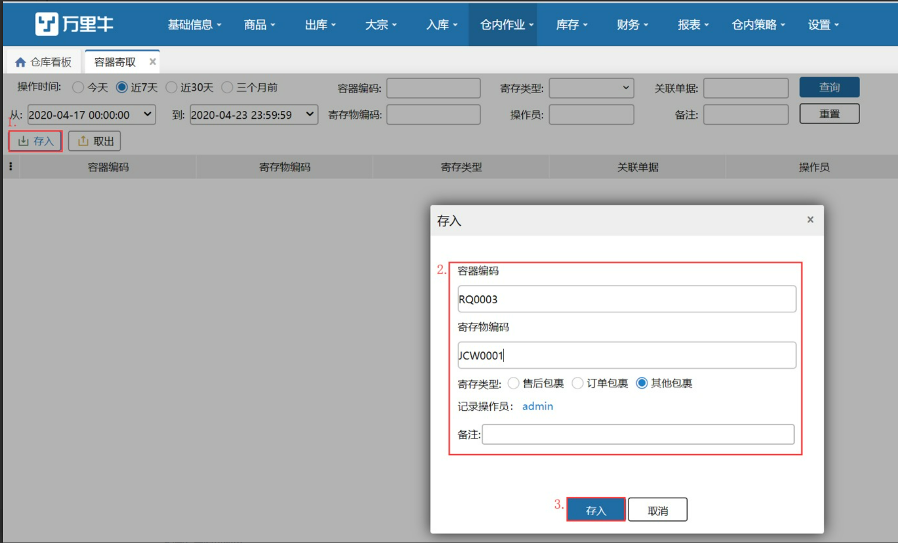

#### **2.取出**

取出包裹时，支持扫描容器编码，查找容器和扫描容器编码，查找寄存物两种方式。

###### 01.按寄存物编码取出

点击‘取出’按钮，编码类型选择按寄存物编码，选择要取出的包裹类型（售后包裹、订单包裹、其他包裹），扫描寄存物编码后即可查询当前包裹所在容器，点击取出。

·                          

**注意：**

1. 取出售后包裹时，需要选择交接承运商，寄存物编码扫描存入时，扫描的运单号；

2. 取出订单包裹时，无需选择交接承运商，寄存物编码扫描订单的系统单号、线上单号、运单号其中一项即可；

3.取出其他包裹时，无需选择交接承运商，寄存物编码扫描存入包裹时，录入的编码。                       

###### 02.按容器编码取出                    

点击‘取出’按钮，编码类型选择按容器编码，扫描存入包裹的容器编码后即可查询当前容器内的包裹信息，点击取出。                       

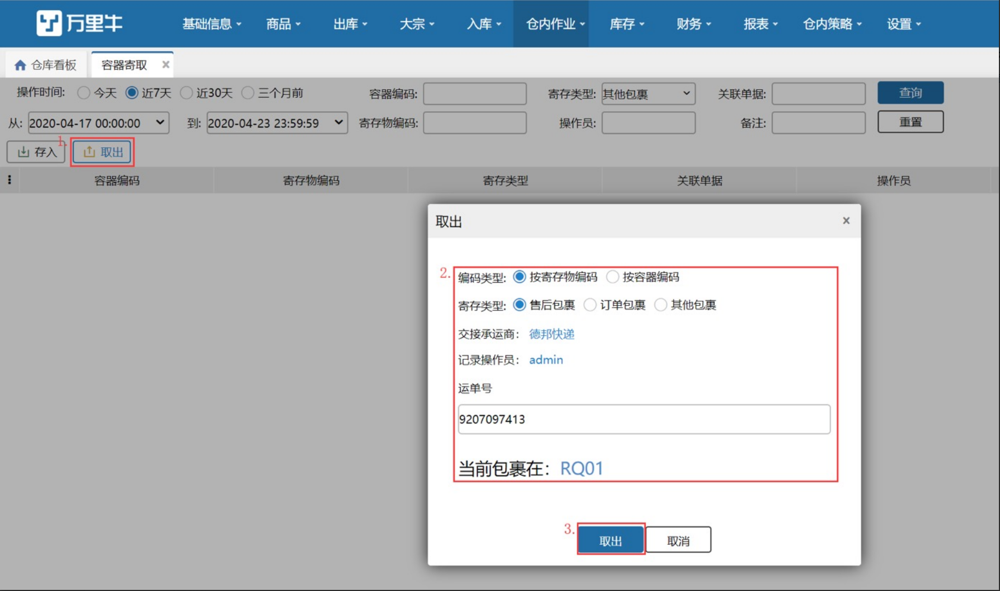                     

**注意：       **              

按容器编码取出包裹时，无需选择寄存类型

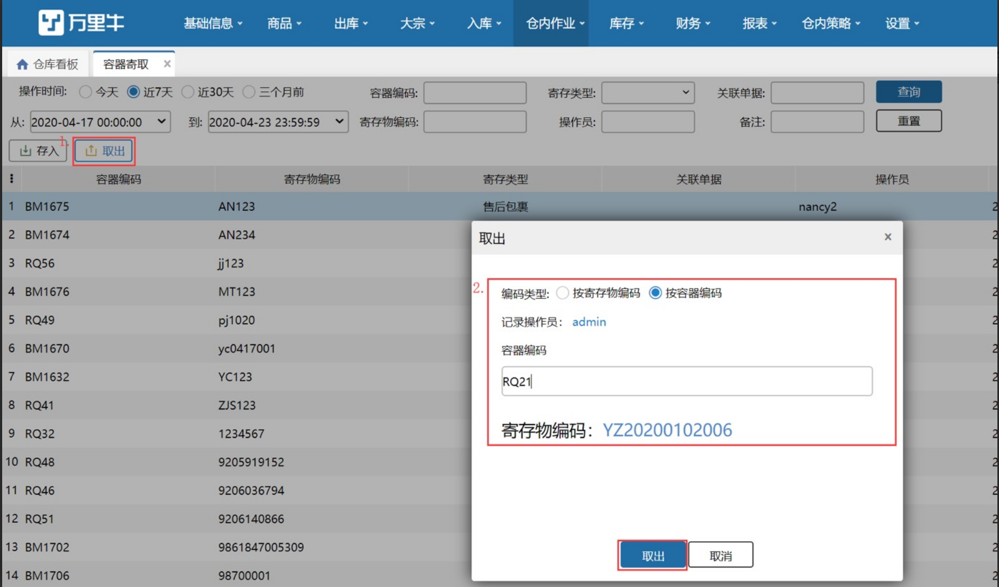

> 更新: 2023-12-21 17:23:22  

> 原文: <https://hupun.yuque.com/unzko7/lsbfg0/gmffk0rly6s3md3v>

---

### 07.2.6 巡仓事务

> 原始文件来源：`00-源文件/操作手册/仓内作业/其他/巡仓事务.md`

PC端巡仓事务页面主要用于管理事务类型、查看和操作事务数据，数据来源于PDA。

#### **1.事务类型管理**

事务类型管理具体操作如下：

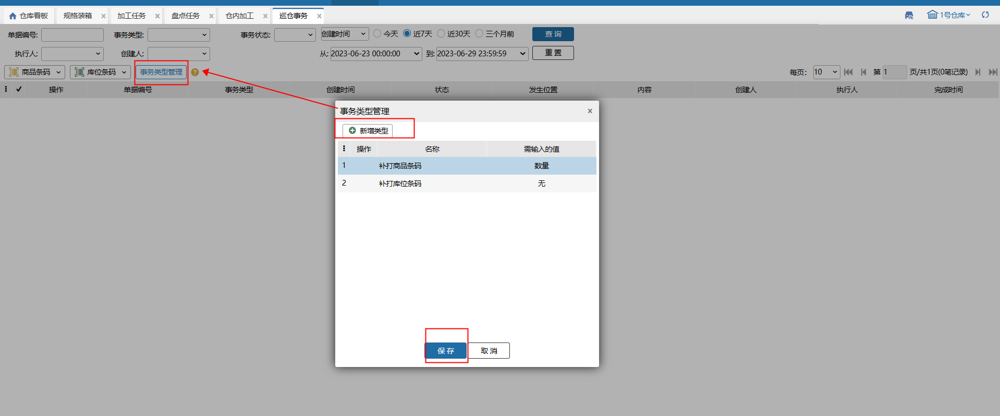

注意：

1.事务类型最多20条；

2.需要输入的值包括：无、数量、文本；

3.在PC端新增或修改事务类型后，可在PDA上使用。

#### **2.执行事务**

#### **3.关闭事务**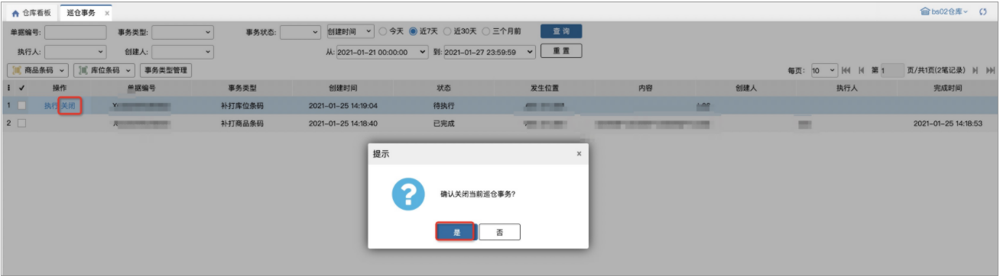

#### **4.打印条码**

勾选1或多个数据，点击打印按钮，即可打印出对应数据的商品条码或库位条码，其中商品条码是根据数量打印的。

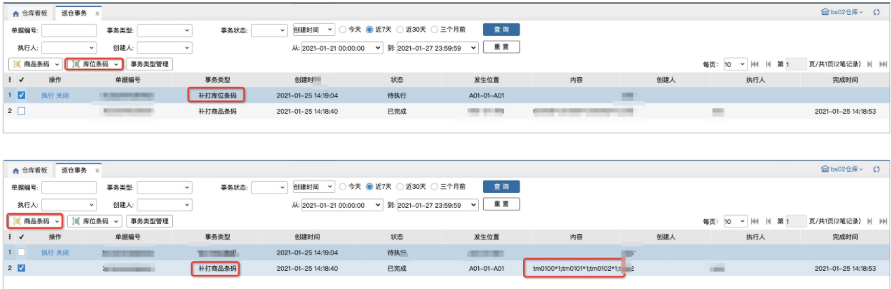

> 更新: 2023-12-21 17:47:27  

> 原文: <https://hupun.yuque.com/unzko7/lsbfg0/vmuguvglr7ofgioe>

---

## 07.3. PDA手持端仓内作业

### 07.3.1 PDA-加工领料

> 原始文件来源：`00-源文件/PDA安卓端/仓内/PDA-加工领料.md`

加工领料可以先对加工单/加工任务进行领料操作，后续再进行加工，将原先的加工拆分成领料+加工两个操作。

01.正常领料操作

第一步：领取加工单/加工任务

进入页面后，支持下拉加载或直接扫描单号领取待领料加工单/加工任务，

若该操作员已领取拣货任务或其他仓加工单/加工任务，领取时报错提示，不允许领取当前加工单；

若该操作员未领取其他任务，则允许领取当前加工单，PC-仓内加工对应加工单领料员=操作员，且在PC上不允许对该加工单进行加工操作，否则报错提示。允许手动解锁任务，解锁后pda上同步解锁。

第二步：拣货

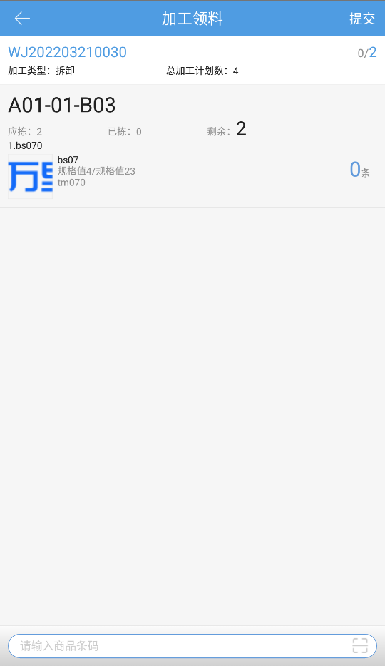

此页面拣货校验逻辑关联业务配置开关，拣货操作和订单拣货一致，支持条码截取：

第三步：提交作业

① 若已拣=0时，允许强制提交，提交后单据作业状态由[待领料]变成[待加工]，原料已拣数量=计划数量，成品实际数量=空，绩效明细报表、绩效统计报表加工领料相关绩效数据+1，按原料计划数量计算：

，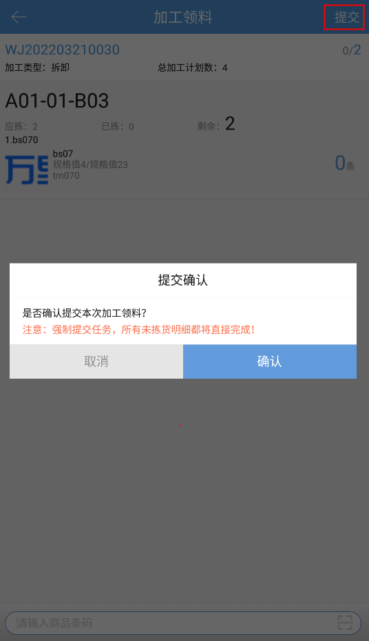

② 若0<已拣<应拣时，有部分提交和强制提交两种选择：

部分提交：提交后单据作业状态由[待领料]变成[待加工]，原料已拣数量=已拣数量，成品实际数量=空，绩效明细报表、绩效统计报表加工领料相关绩效数据+1，按原料已拣数量计算；

强制提交：提交后单据作业状态由[待领料]变成[待加工]，原料已拣数量=计划数量，成品实际数量=空，绩效明细报表、绩效统计报表加工领料相关绩效数据+1，按原料计划数量计算。

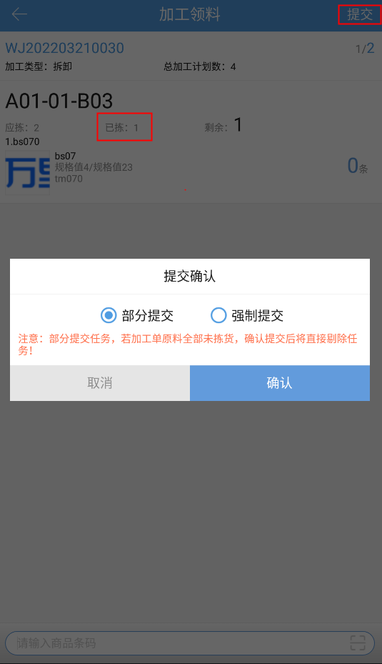

③ 若已拣=应拣时，则拣货完成后自动弹出提交窗口，提交后单据作业状态由[待领料]变成[待加工]，原料已拣数量=计划数量，成品实际数量=空，绩效明细报表、绩效统计报表加工领料相关绩效数据+1，按原料计划数量计算。

02.放弃作业

① 若已拣=0时，允许直接放弃，仓内加工，对应加工单领料员清空，PC-操作员任务，解绑该加工单；允许其他操作员领取

② 若已拣>0时，手动放弃任务并确认后转到退料页面，明细为已拣>0的，数量=已拣数量，不可编辑；库位可改。

03.erp关闭加工单

领单后/领料过程中/领料完成后提交前，erp关闭加工单，PDA上能继续拣货，在提交时提示异常，完成后作业状态变成[已关闭]。

> 更新: 2023-12-21 09:57:10  

> 原文: <https://hupun.yuque.com/unzko7/lsbfg0/kdq70u4phe349dna>

---

### 07.3.2 PDA-容器寄取

> 原始文件来源：`00-源文件/PDA安卓端/仓内/PDA-容器寄取.md`

01.包裹存入

1.容器寄取类型：售后包裹、订单包裹、其他包裹；其他包裹支持一个容器存入多个寄存物。

2.存入时允许存入多个寄存物的，寄存物进行多行展示。

3.订单包裹需要关联单据，售后包裹和其他包裹可关联单据，也可不关联。

02.包裹取出

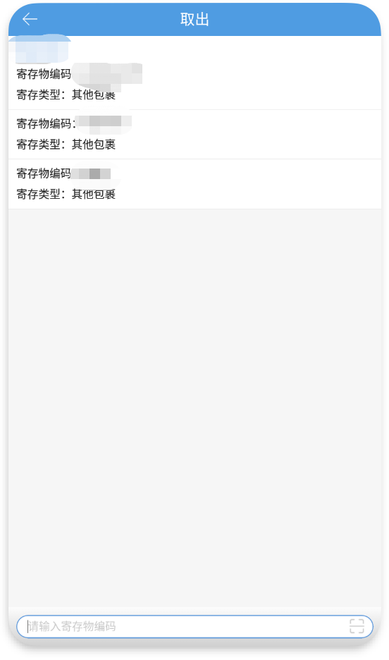

1.取出时可以先扫寄存物编码或先扫容器编码。

2.存入多包裹的容器扫描容器后显示多个待取出包裹。

3.扫描寄存物编码取出后进行打标。

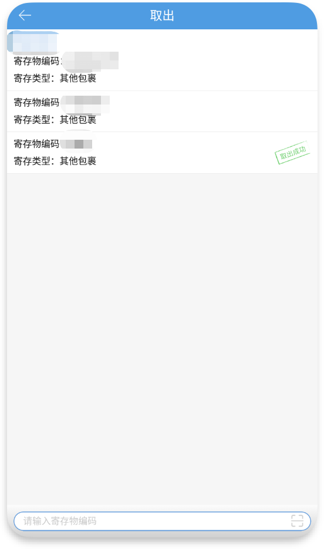

> 更新: 2024-03-19 14:31:51  

> 原文: <https://hupun.yuque.com/unzko7/lsbfg0/thoqdu8i2xi2b4vw>

---

### 07.3.3 PDA-容器移库

> 原始文件来源：`00-源文件/PDA安卓端/仓内/PDA-容器移库.md`

仓库人员通过扫描周转容器快速找到货品进行上架。

(1)、点击“容器移库”进入容器移库首页，选择移库模式和取货模式。

(2)、移库模式选择容器-库位，扫描容器编码。

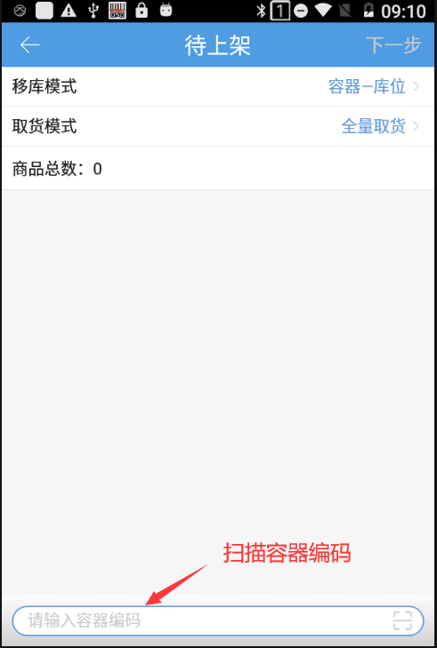

(3)、取货页面，可直接扫描商品条码或者点击绿色加号按钮选择当前容器中的商品明细。

(4)、点击选择商品，当前界面显示该库位下所有商品及数量，如有装箱货品则显示货箱编码，勾选需要上架的商品点击确定。

(5)、选择商品后可点击商品数量选择需要上架的数量，再点击确认。

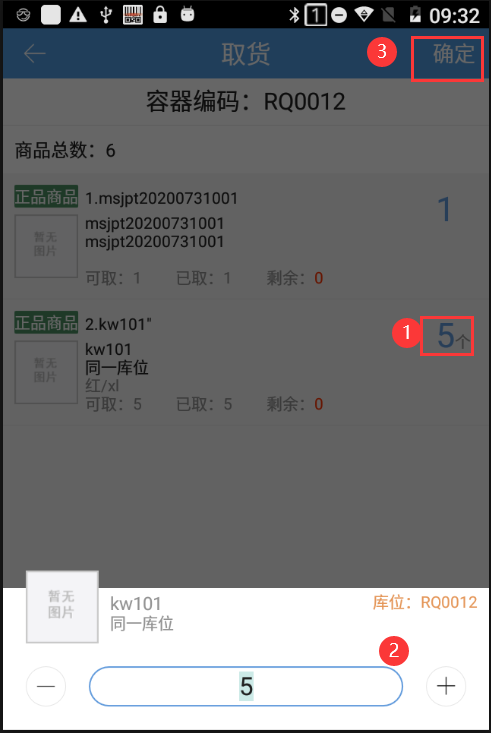

(6)、下一步扫描或输入指导的库位编码完成该库位下对应的商品上架操作。

(7)、移库模式选择库位-容器，扫描库位编码。

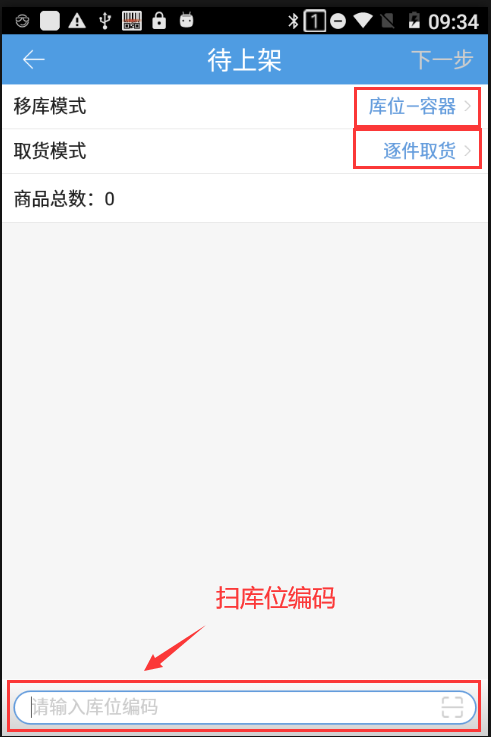

(8)、取货页面，可直接扫描商品条码或者点击绿色加号按钮选择当前容器中的商品明细。

(9)、点击选择商品，当前界面显示该库位下所有商品及数量，如有装箱货品则显示货箱编码，勾选需要上架的商品点击确定。

(10)、进入待上架页面，取货模式、上架模式，编辑商品数量，点击下一步。

(11)、进入上架页面，扫描上架的容器，点击确定。

#### 取货模式-免扫全取

移库模式：库位-容器，取货模式选择“免扫全取”时，扫描库位编码后，会跳过取货流程，直接跳转到最终【上架】页面，默认显示该库位下所有有库存的商品。省去了中间取货过程，上架更便捷。同理移库模式：容器-库位情况下，扫描容器会将容器内所有有库存的商品带到【上架】页面，可以直接上架到库位。

> 更新: 2026-08-07 17:30:24  

> 原文: <https://hupun.yuque.com/unzko7/lsbfg0/dmfn3bse9lazhubp>

---

### 07.3.4 PDA-巡仓事务

> 原始文件来源：`00-源文件/PDA安卓端/仓内/PDA-巡仓事务.md`

PDA巡仓事务主要用于提交事务数据到PC端，根据PC端配置的事务类型不同，有3种不同的录入方式。

#### **01.补打商品条码-数量**

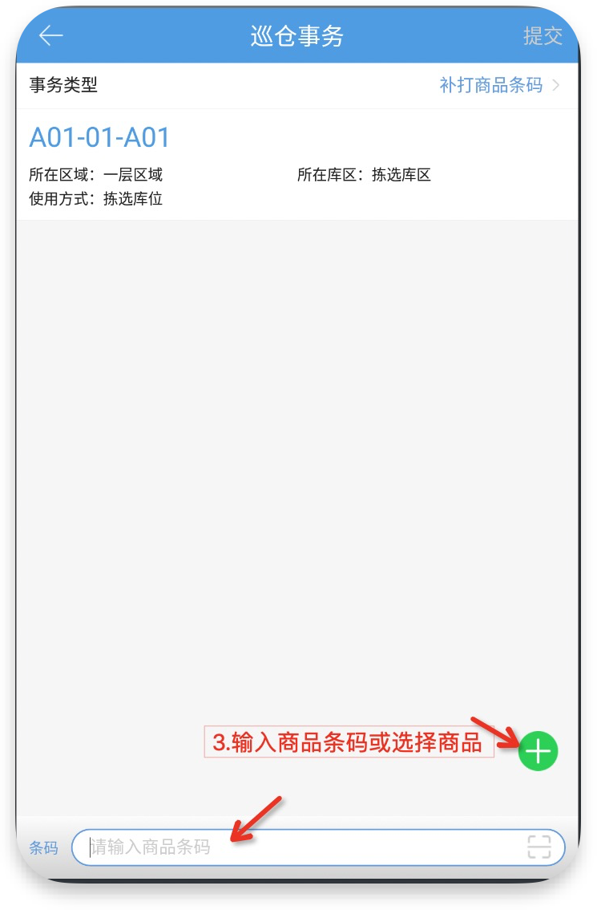

#### **02.补打库位条码-无**

#### **03.其他-文本**

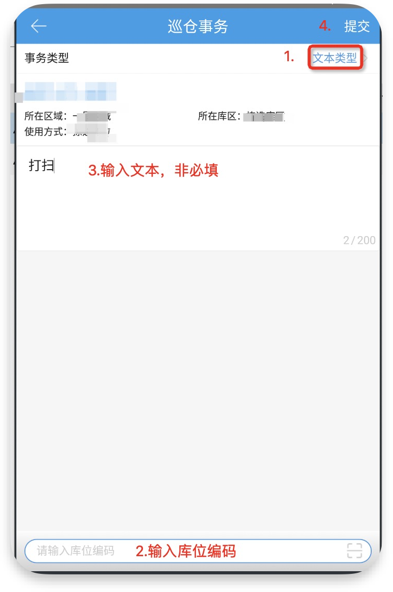

> 更新: 2023-12-21 09:58:00  

> 原文: <https://hupun.yuque.com/unzko7/lsbfg0/fclshu4i5luk2u1e>

---

### 07.3.5 PDA-巡仓补货

> 原始文件来源：`00-源文件/PDA安卓端/仓内/PDA-巡仓补货.md`

业务背景：巡仓即大型仓库内设定的巡查岗，属于相对传统的巡检方式，在巡仓过程中通过指定库位和商品手动新增补货任务。

点击巡仓补货按钮，选择补货类型后，输入需要补货的拣选库位

 

 

选择需要补货的商品

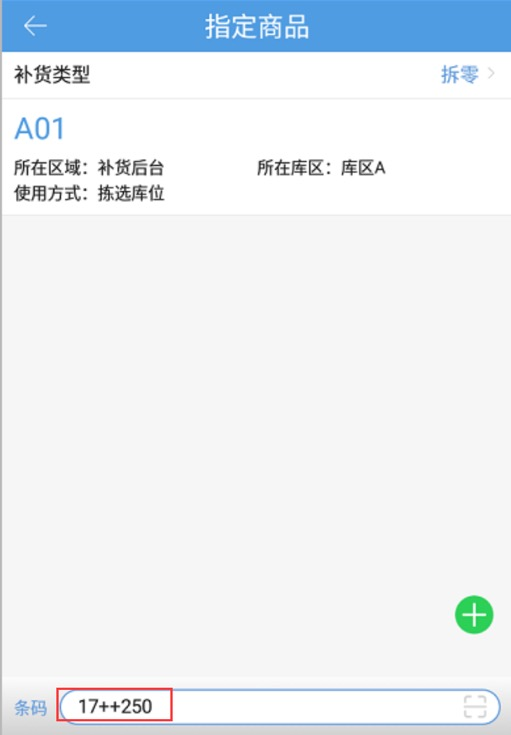

重要：点击 +号，可以选择当前库位上有库存记录的商品（次品、冻结商品除外），扫描条码可以选择库位上无库存记录的商品（即全仓的商品）

输入需要补货的数量，点击确定，自动生成补货任务

注意：

1.业务配置开启箱规后，按货箱补货，目标库位可以选择箱拣选库位；

2.选择商品，通过条码查询商品支持条码位数截取；

3.巡仓补货任务找来源的顺序为：先在目标库位同库区的存储库位根据库位编码从小到大依次取货，取完本库区的在找相邻库区的存储库位。

4.本库区有库位能满足补货数量时，直接取此库位上的库存。

5.生成的补货任务可以在PC端 补货上架以及pda补货任务中查询领取               

> 更新: 2023-12-21 09:28:19  

> 原文: <https://hupun.yuque.com/unzko7/lsbfg0/ts40kdritleeraoi>

---

### 07.3.6 PDA-库存冻结

> 原始文件来源：`00-源文件/PDA安卓端/仓内/PDA-库存冻结.md`

当仓库中商品有损坏等情况不能进行出库时，则需要将这些商品进行**冻结**

点击库存冻结按钮，输入需冻结库存的库位编码，选择需要冻结的商品

点击选择需要冻结商品的数量，然后点击下一步，输入冻结商品的目标库位，可根据商品手动选择，也可直接输入库位编码将当前界面的待冻结商品统一指定至目标库位。

提示

1.目标库位不可选择与来源库位相同；

2.异常暂存库位不允许冻结；

3.多货主同商品情况下，同一库位保存报错

> 更新: 2023-12-21 09:28:18  

> 原文: <https://hupun.yuque.com/unzko7/lsbfg0/caez0vz5mu4sqs66>

---

### 07.3.7 PDA-库存移动

> 原始文件来源：`00-源文件/PDA安卓端/仓内/PDA-库存移动.md`

(1) 点击“库存移动”进入取货页面，扫描取货库位。

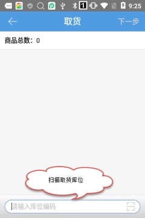

(2) 进入选择商品页面，选择商品和编辑取货的数量，点击下一步。

(3) 进入上架页面，扫描上架库位。

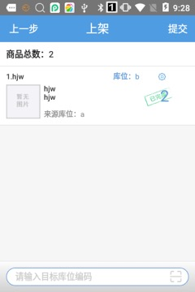

> 更新: 2023-12-21 09:28:18  

> 原文: <https://hupun.yuque.com/unzko7/lsbfg0/vl23v7c3lg4v1ewl>

---

### 07.3.8 PDA-库存解冻

> 原始文件来源：`00-源文件/PDA安卓端/仓内/PDA-库存解冻.md`

当冻结商品进行返修或其他操作后可以贩售了，则需要将商品解冻。

点击库存解冻按钮，输入已有冻结商品的库位编码,显示当前库位冻结商品的情况

修改解冻数量或点击下一步，输入目标库位，点击提交确认。

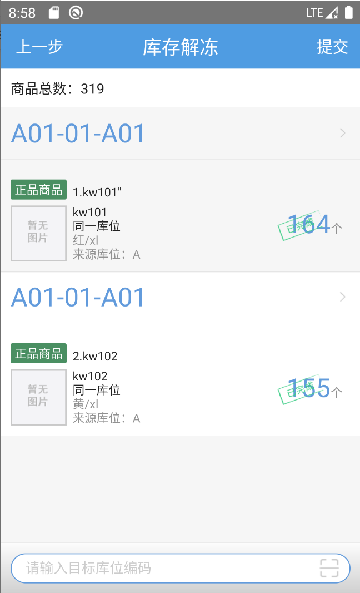

提示

1.解冻校验同商品多货主不允许保存到相同库位

2.目标库位不可选择与来源库位相同；

3.来源库位没有冻结商品是提示错误

> 更新: 2023-12-21 09:28:18  

> 原文: <https://hupun.yuque.com/unzko7/lsbfg0/pvy02ngwye8fzxid>

---

### 07.3.9 PDA-库存调换

> 原始文件来源：`00-源文件/PDA安卓端/仓内/PDA-库存调换.md`

库存调换功能可使两个库位之间的所有库存互换。

点击库存调换按钮，输入来源库位编码

输入库位编码后当前界面显示所有商品的可用库存和实际库存

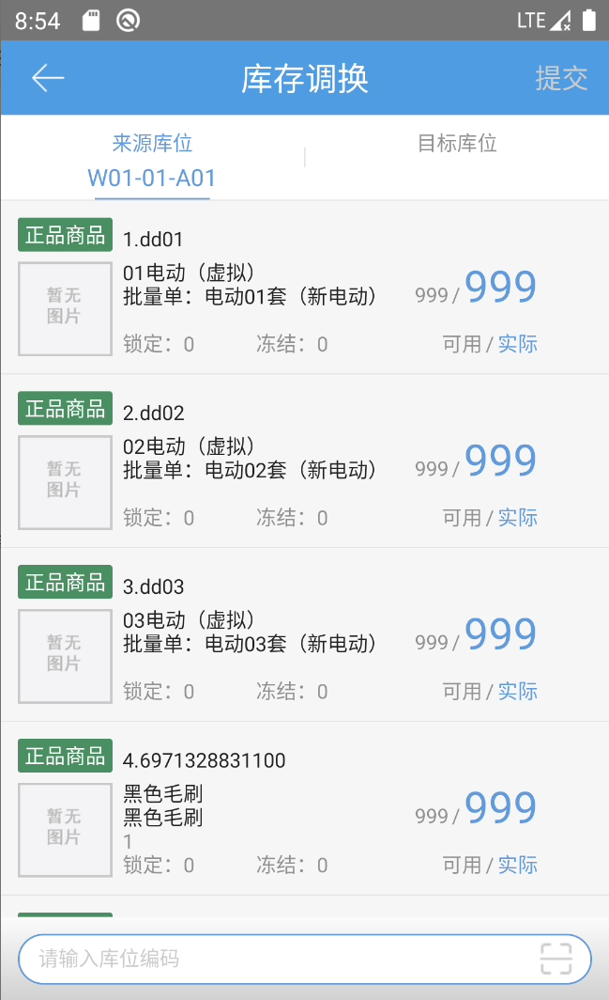

点击右上角目标库位切换至输入目标库位界面，该界面显示当前目标库位库存，点击提交确认完成库存调换

提示

1、库存调换是全量调换，除当前库位锁定库存外其余全部调换

2、如来源或目标库位有装箱库存，则无法与拣选库位、预配库位进行调换

> 更新: 2023-12-21 09:28:18  

> 原文: <https://hupun.yuque.com/unzko7/lsbfg0/tkn309qosaiuucuw>

---

### 07.3.10 PDA-库存转移

> 原始文件来源：`00-源文件/PDA安卓端/仓内/PDA-库存转移.md`

PC端生成转移任务，用户可以手持pda进行转移。

点击“库存转移”按钮，进入选择转移单页面，选择取货模式、上架模式后，下拉加载转移任务并选择转移任务或者输入作业单号领取转移任务。

#### 1、全量取货+按库位上架

进入取货页面，扫描来源库位或直接编辑商品数量进行取货，取货完成后，点击下一步。

跳转转移页面，扫描目标库位进行转移，点击提交，移库作业完成。

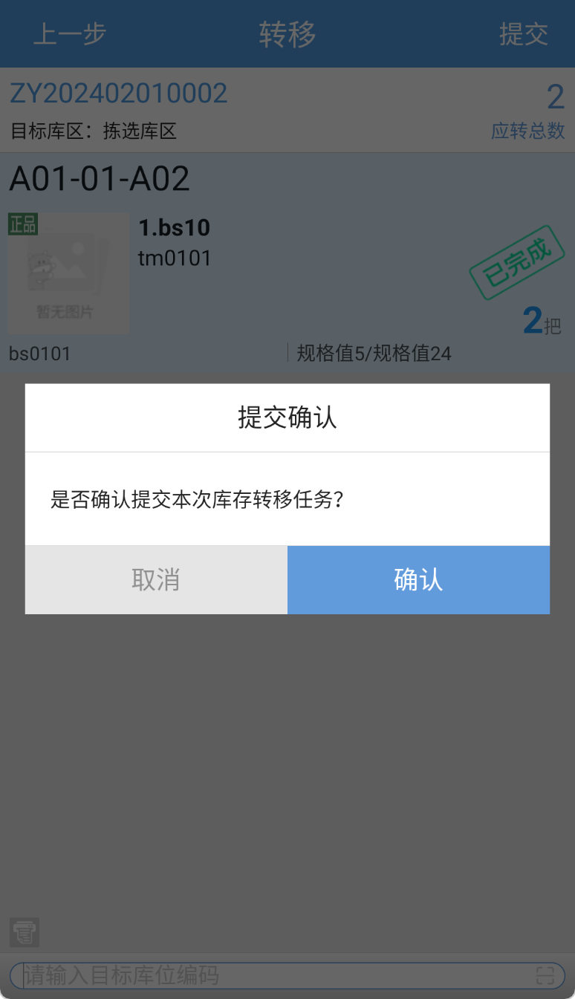

#### 2、逐件取货+按商品上架

领取任务进入取货页面，扫描库位编码跳转取货商品确认页面，扫描商品条码逐件添加取货商品数量，取货完成后点击下一步。

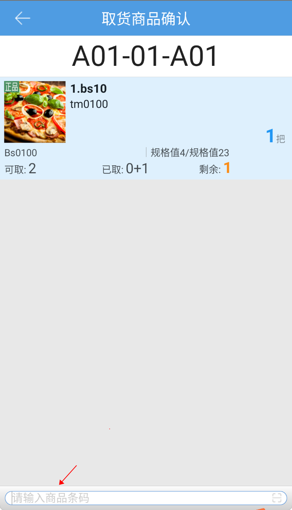

跳转转移页面，扫描需要进行转移的**目标商品条码**

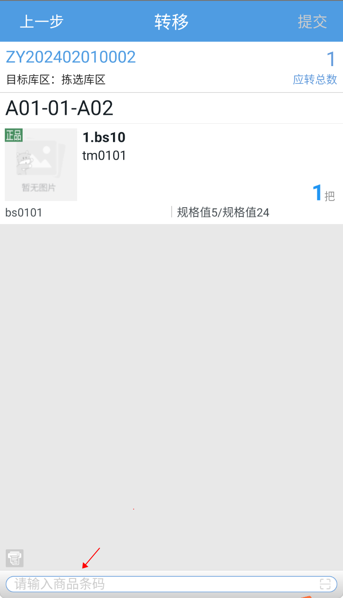

自动跳转到转移页面，扫描商品的目标库位：

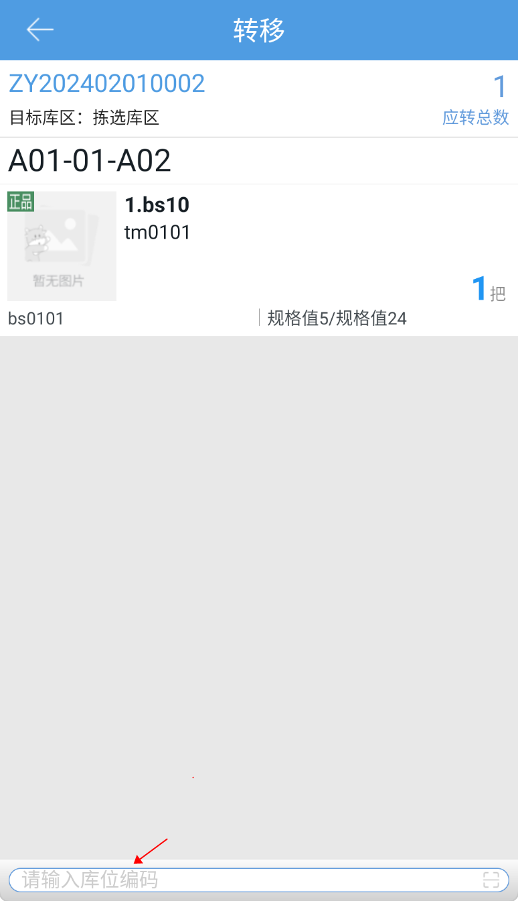

完成转移：

①.转移任务中有超过1条明细时，选择任务后，会先跳转到商品选择页面，点击选择其中1个商品进行转移

②.单次转移作业提交后，若当前任务中还存在超过1条明细未作业，会自动跳转到商品选择页面，选择商品后进行转移；若仅1条明细未作业，会返回单据选择页面，重新选择单据后进行作业。

> 更新: 2024-02-01 18:29:05  

> 原文: <https://hupun.yuque.com/unzko7/lsbfg0/gmotxgx247074imu>

---

### 07.3.11 PDA-快速上架

> 原始文件来源：`00-源文件/PDA安卓端/仓内/PDA-快速上架.md`

快速上架可以扫一次上架库位后就不用再次扫，用于快速的上架。

(1)点击“快速上架”，进入快速上架页面，设置取货模式、上架模式、指导匹配、来源库位、作业模式后，扫描商品条码。

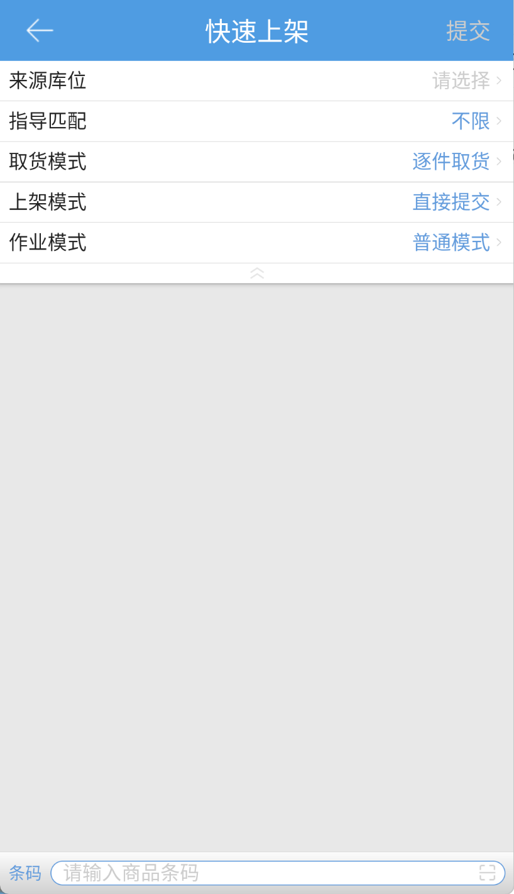

提示

①.取货模式，逐件取货是每扫描一次商品，商品数量+1；全量取货是每扫描一次商品，商品数量和该库位上的可用库存一样。

②.上架模式，直接提交是和指导匹配一起用，指导匹配选择不限、拣选库位等有指导出的库位可以直接提交，不需要再次输入目标库位；校验库位是目标库位必须再次输入一次确认；校验库位并自动提交是输入目标库位后不需要手动点击提交按钮，系统自动提交上架。

③.指导匹配，选择空是不指导；选择不限是指导出全仓下有余量、设置了优先库位和历史下架的库位；选择拣选库位是指导出全仓下有余量、设置了优先库位和历史下架的拣选库位；选择存储库位是指导出全仓下有余量、设置了优先库位和历史下架的存储库位；选择预配库位是指导出全仓下有余量、设置了优先库位和历史下架的预配库位；选择过渡库位是指导出全仓下有余量、设置了优先库位和历史下架的过渡库位；

④.作业模式，普通模式是每次都要扫描目标库位；连扫模式是第一次提交成功后自动带出目标库位，带出的目标库位即上一次提交的目标库位，建议和直接提交一起用。

⑤.查询模式切换，底部扫描框默认显示“条码”，若[开启集合码便捷录入](https://hupun.yuque.com/unzko7/lsbfg0/caki7lz4105n2vpg#CKIQO)开关，会显示“集合码”，通过扫描集合码来同时匹配商品条码、生产批次号等多个信息，并取货模式显示明细数量。

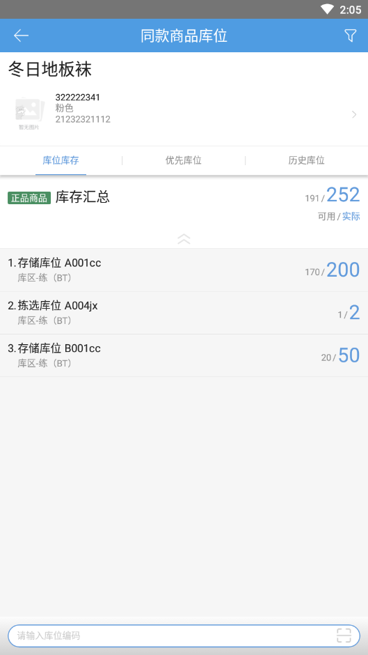

(2)扫描目标库位，点击提交。

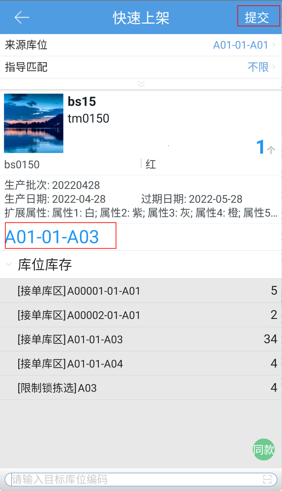

（3）最新版本支持上架生产批次商品。若生产批次商品库存只有一种批次，带出来的库存显示生产批次信息；若生产批次商品库存有多个批次，扫描商品后会跳转选择商品页面，选择后回到上架页面，带出商品库存信息。

（4）支持左滑删除商品，删除后扫描库位栏变成扫描商品栏。

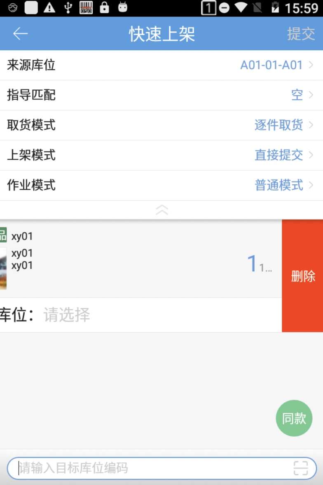

> 更新: 2024-09-26 15:20:02  

> 原文: <https://hupun.yuque.com/unzko7/lsbfg0/eya6emv5pc5k4xhm>

---

### 07.3.12 PDA-快速加工

> 原始文件来源：`00-源文件/PDA安卓端/仓内/PDA-快速加工.md`

业务场景：仓库加工作业频繁，随意没有明细计划性，如果由ERP发起加工单就较为麻烦，由PDA根据ERP的BOM规则自动对应成品和原料进行反算，然后生成加工单同步给ERP。

**目前仅支持万里牛ERP对应对接使用**

****

#### 01.组合加工

操作步骤如下：

1.点击快速加工图标，跳转如图页面，加工方式默认组合加工，在底部的扫描框录入成品商品的条码

2.扫描录入成品商品的条码后，根据ERP的BOM规格带出成品、原料商品以及配比数，如图所示：

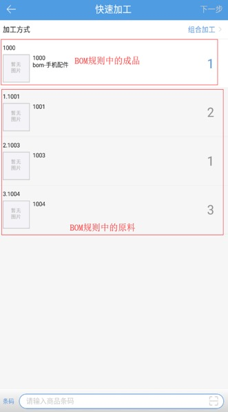

3.点击成品商品的数量，可以编辑修改商品数量，修改后，原料商品的数据根据配比数自动增减，此处原料商品数量不支持修改。

4.添加完成品，编辑完商品数量后，点击下一步跳转到加工确认页面，系统根据PC端设置的加工单配置指定的原料商品锁定范围自动锁定原料库位，锁定失败后，点击图标在全仓范围内锁库，底部的库位扫描框扫描录入库位编码，加工成品的目标库位自动填充，如图所示：

5.点击提交，加工完成，PC端仓内加工自动生成组合加工单并通知erp，通知erp超时跳转快速加工异常页面，点击重试，重新推送erp，点击跳过，回到快速加工页面，继续快速加工操作，如图所示:

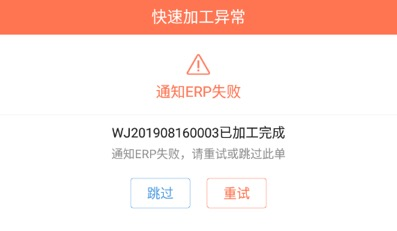

#### 02.拆分加工

 

1.在快速加工页面将作业方式修改为拆分加工，扫描录入成品商品的条码，根据ERP的BOM规格带出成品、原料商品以及配比数，如图所示：

2.点击成品商品的数量，可以编辑修改商品数量，修改后，原料商品的数据根据配比数自动增减，此处原料商品数量不支持修改。

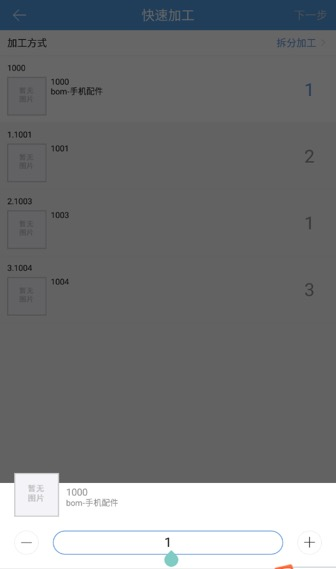

3.添加完成品，编辑完商品数量后，点击下一步跳转到加工确认页面，系统根据PC端设置的加工单配置指定的原料商品锁定范围自动锁定BOM规则中成品商品的库位，锁定失败后，点击图标在全仓范围内锁库，底部的库位扫描框扫描录入库位编码，BOM中原料的库位由上到下依次填充，如图所示：

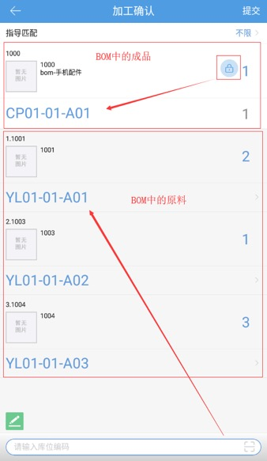

4.点击提交，加工完成，PC端仓内加工自动生成拆分加工单并通知erp。

提示：

1.快速加工为后台开关，需要找wms技术开启，仅对万里牛ERP直连有效；

2.快速加工扫描的商品要实现在ERP进行仓储商品同步；

3.快速加工仅支持普通商品，BOM规则中成品为序列号商品、生产批次商品的扫描报错；

4.快速加工扫描的是成品，扫描BOM规则中的原料报错提示；

5.加工确认页面，修改成品商品数量，原料商品数量不再根据配比数增减；

6.加工确认页面，原料商品数量支持修改，修改单个原料的数量后不影响成品、其他原料的数量；

7.快速加工原料的库存扣减是在提交加工单时扣减；

8.PC上业务配置开启验货商品条码截取，pda会自动生效。若截取条码前3位，商品条码是new0001，则pda只需要扫描条码new即可。                    

> 更新: 2026-05-14 11:04:32  

> 原文: <https://hupun.yuque.com/unzko7/lsbfg0/cxhqadbmygsab6mq>

---

### 07.3.13 PDA-快速盘点

> 原始文件来源：`00-源文件/PDA安卓端/仓内/PDA-快速盘点.md`

快速盘点是日常仓内作业中最灵活的一种盘点方式，具有随意性、便捷性的特征。

快速盘点分为商品盘点和库位盘点两种类型

商品盘点：盘点时以商品为维度仅盘点指定库位下的该商品数量，库位其余商品不做盘点

库位盘点：盘点指定库位内所有商品。

点击快速盘点，选择盘点类型和盘点方式

盘点方式分为

实际数量：即盘点得出的数量

增加数量：再原有库存基础上增加的数量

减少数量：在原有库存基础上减少的数量

1.点击页面上的跳转选择商品页面，可快速选择库位上的商品

2.商品属于多个货主，盘点时需先选择商品的货主

3.生产批次商品盘点时，需选择/录入商品的批次

4.业务配置开启次品管理，盘点前需先选择商品的正/次 库存属性

5.盘点完成后点击提交按钮即实时改变当前盘点的库存。

6.差异提醒

开启后在盘点过程中，若有商品实际盘点数量超过当前库位上的实际数量、或新增了商品时，会有异常提示，不影响作业：

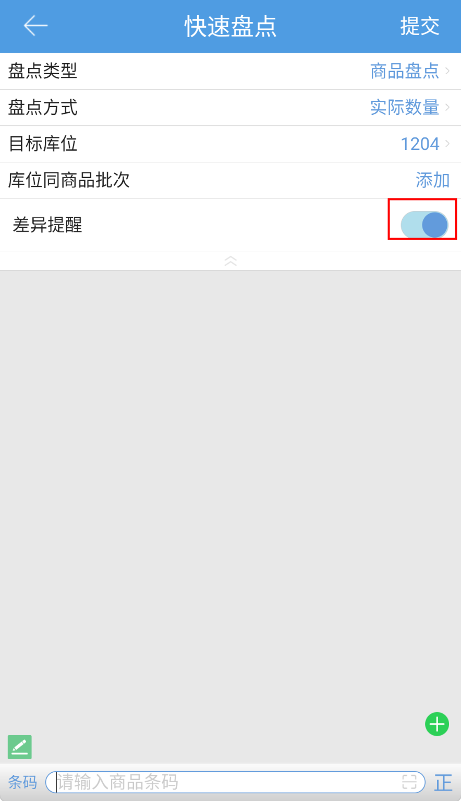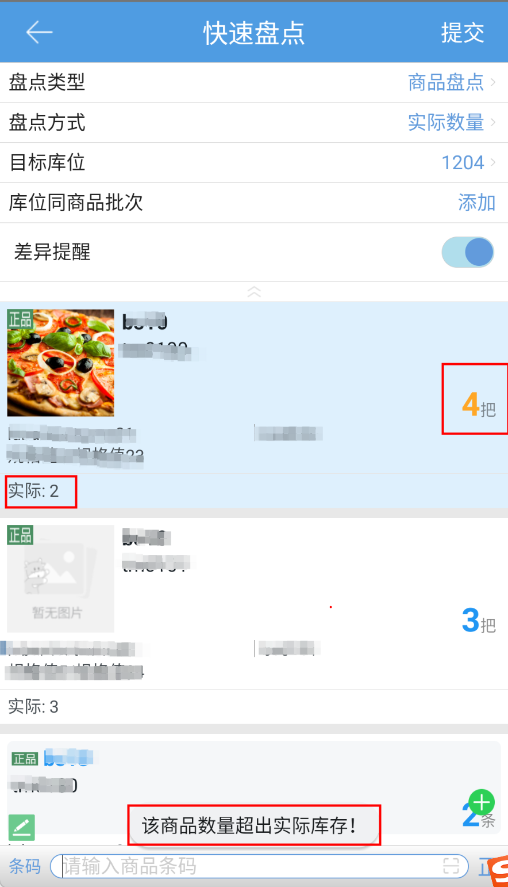

完成盘点后点击提交，会跳转到盘点差异页面，显示与实际库存有差异的明细，点击提交后，盘点成功：

> 更新: 2024-03-14 17:13:39  

> 原文: <https://hupun.yuque.com/unzko7/lsbfg0/oqepvoeiyednmz7q>

---

### 07.3.14 PDA-成品入库

> 原始文件来源：`00-源文件/PDA安卓端/仓内/PDA-成品入库.md`

成品入库，具体操作步骤如下。

1、筛选条件，选择作业模式（部分入库/全部入库），选择或扫描加工任务单号/加工单号，匹配到对应加工单据。

筛选条件：

2、作业模式选择部分入库时，在成品入库页面选择加工任务单后，会跳转到选择加工单页面进行选择，再跳转到加工确认页面：

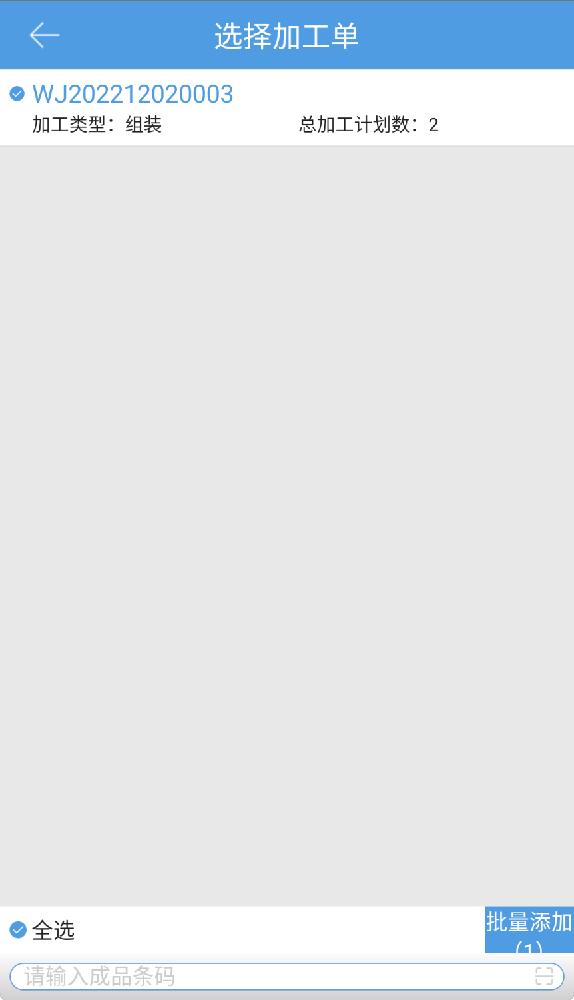

3、作业模式选择全部入库时，在成品入库页面选择加工任务单后，会直接跳转到加工确认页面，分区域显示成品和原料明细：

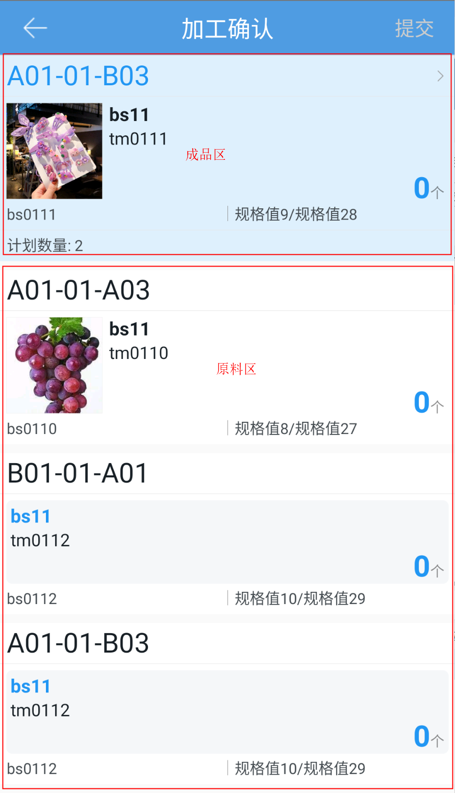

4、输入成品数量后，会按照配比自动带出原料数量，点击提交并确认，加工单完成。

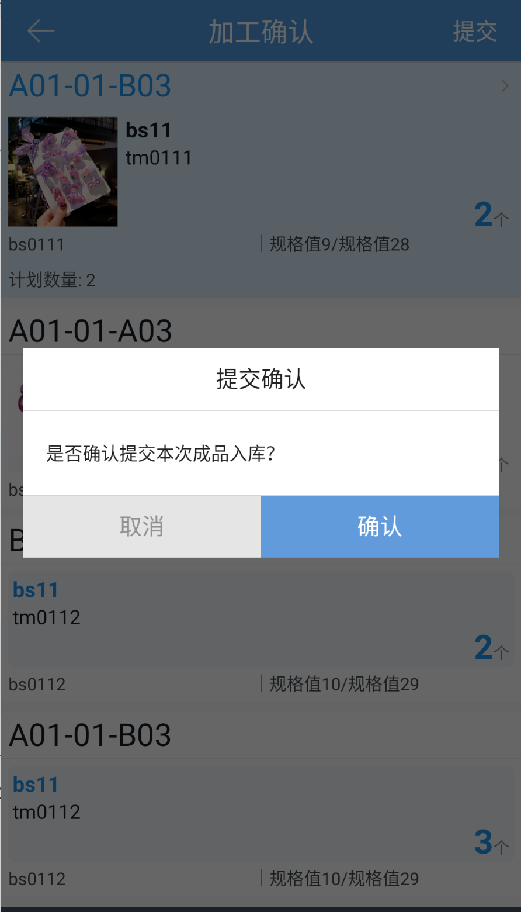

注意：入库批次商品不支持加工

> 更新: 2024-02-06 16:38:10  

> 原文: <https://hupun.yuque.com/unzko7/lsbfg0/hhhansqgyeaifia8>

---

### 07.3.15 PDA-打包装箱

> 原始文件来源：`00-源文件/PDA安卓端/仓内/PDA-打包装箱.md`

PDA支持将仓库内的商品装箱存放，此处商品装箱是唯一箱。

首先选择需要装箱的商品所在库位，不能选择拣选、预配、次品库位；开启3PL的公司需要选择货主。

然后扫描货箱的箱条码后，添加装箱商品后，点击确认（F2），装箱成功。

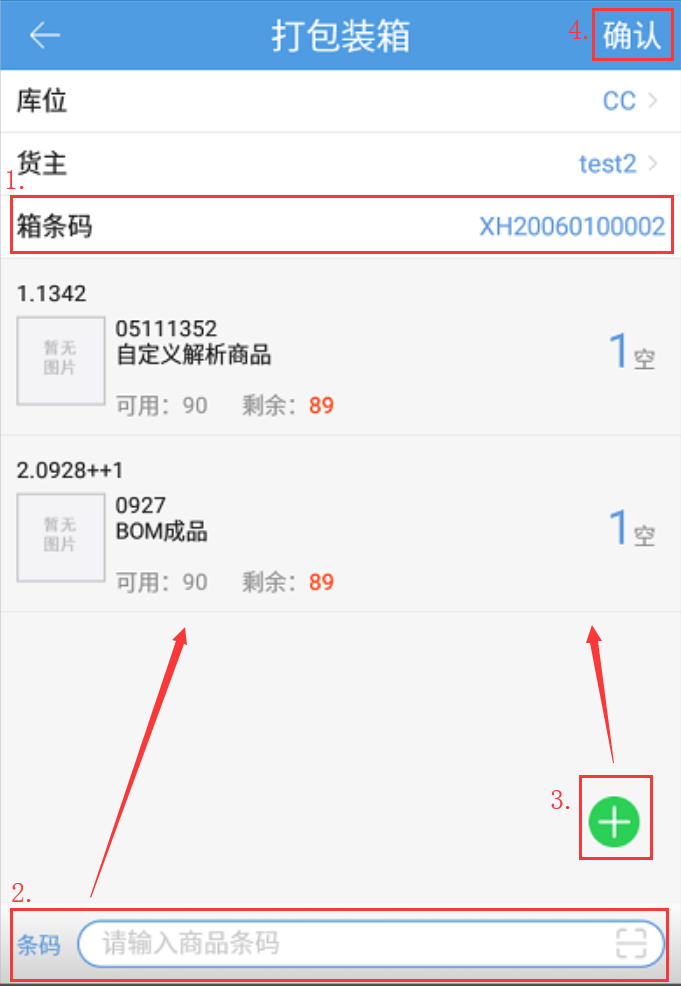

注意：

1.扫描的箱条码需符合系统中唯一箱的条码规则：XH开头+11位数字；

2.支持扫描条码和点击 + 添加商品；

3.生产批次商品、入库批次商品不能与其他商品混装；

4.普通商品支持多种商品混装箱；

> 更新: 2023-12-21 09:28:19  

> 原文: <https://hupun.yuque.com/unzko7/lsbfg0/yd9g36qbgzhvkt0a>

---

### 07.3.16 PDA-指导上架

> 原始文件来源：`00-源文件/PDA安卓端/仓内/PDA-指导上架.md`

指导上架是为了将过渡或收货库位的货品移动上架至存储或拣选库位而设定

点击指导上架按钮，先输入待上架货品的来源库位。

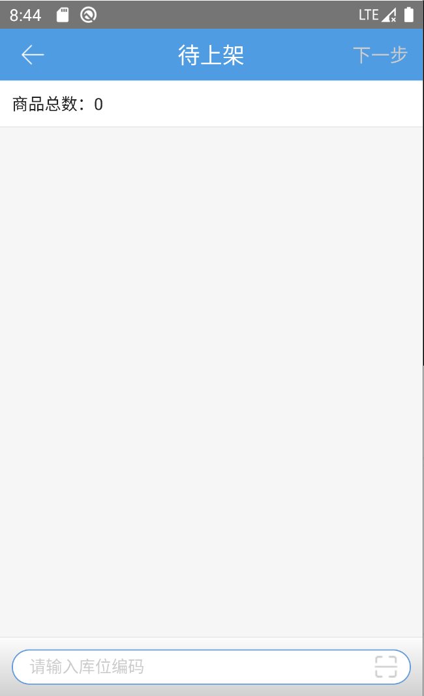

输入来源库位后可直接扫描商品条码或者点击绿色加号按钮选择当前库位下商品明细

点击选择商品，当前界面显示该库位下所有商品及数量，如有装箱货品则显示货箱编码，勾选需要上架的商品点击确定

选择商品后可点击商品数量选择需要上架的数量，再点击确认

下一步扫描或输入指导的库位编码完成该库位下对应的商品上架操作。

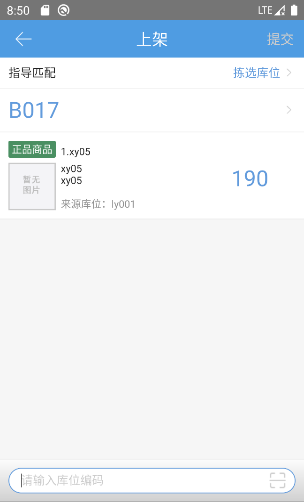

提示

1、指导库位可选择库位属性，根据所选库位属性查找匹配的库位

2、指导库位匹配原则，依次检查批次号、库存冻结情况、有无库存、有无库存记录、有无历史记录进行查找，所有匹配条件都不满足，系统返回空值。

> 更新: 2023-12-21 09:28:17  

> 原文: <https://hupun.yuque.com/unzko7/lsbfg0/dbzklb17ve2l22nx>

---

### 07.3.17 PDA-新增移库任务

> 原始文件来源：`00-源文件/PDA安卓端/仓内/PDA-新增移库任务.md`

PDA上创建移库任务，具体步骤如下：

1、设置来源，扫描来源库位后，选择需要进行移库的商品和数量，点击下一步

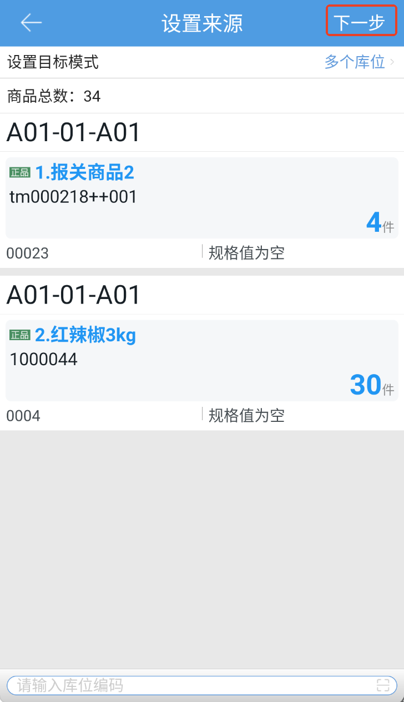

2、设置明细目标库位后，点击提交，提交成功后，移库任务创建成功

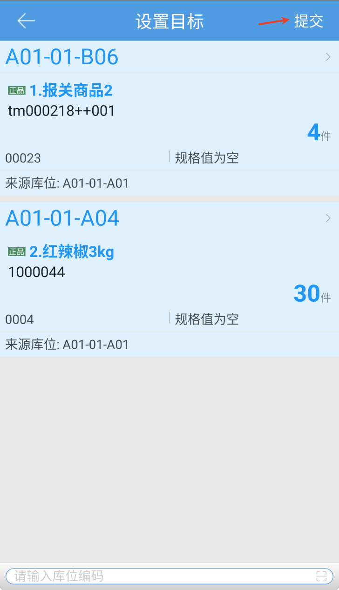

> 更新: 2024-12-25 17:26:54  

> 原文: <https://hupun.yuque.com/unzko7/lsbfg0/trd8af0g40kg553a>

---

### 07.3.18 PDA-次品转正

> 原始文件来源：`00-源文件/PDA安卓端/仓内/PDA-次品转正.md`

当残次商品进行返修或其他操作后可以贩售了，则需要将这些商品**转为正品**；

**正次转换模块需要给操作员配置页面权限后可见。**

点击次品转正图标，输入需要转正库存的库位编码，选择需要转正的商品

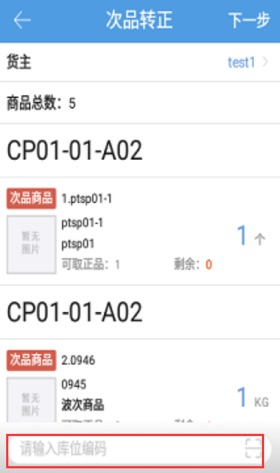

点击下一步，跳转选择目标库位页面，扫描输入存放正品的目标库位编码后，点击提交，完成商品转正。

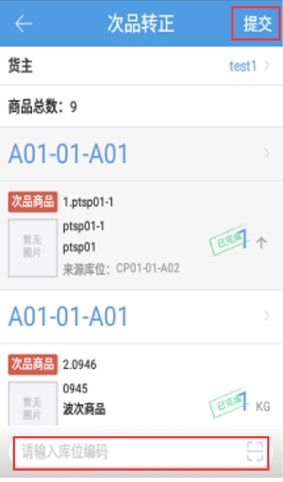

注意：

1. 开启3pl的公司一次只能选择一个货主的商品进行转正。

2. 次品转正只能选择库位上商品的次品库存。

3. 同一个商品的正品和次品不能存放在同一个库位，选择目标库位有转正商品的次品库存时，提交时会报错。

4.次品库位不能存放正品库存所以商品转正，目标库位不能选择次品库位。       

5.关联仓库配置->开启次品审核，开启后，生成单据状态为待审核，需在PC端确认审核即可完成单据。

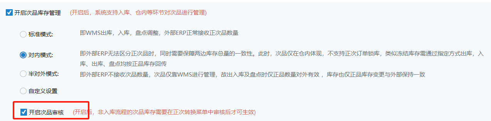          

> 更新: 2024-09-10 15:08:09  

> 原文: <https://hupun.yuque.com/unzko7/lsbfg0/wgkufqowpd6tqghg>

---

### 07.3.19 PDA-正品转次

> 原始文件来源：`00-源文件/PDA安卓端/仓内/PDA-正品转次.md`

当入库或仓内作业发现商品有损坏等情况不能进行出库时，则需要将这些商品库**转成次品**

**正次转换模块需要给操作员配置页面权限后可见。**

点击正品转次图标，输入需要报次库存的库位编码，选择需要报次的商品

点击下一步，跳转选择目标库位页面，扫描输入存放次品的目标库位编码后，点击提交，完成商品报次。

注意：

1. 开启3pl的公司一次只能选择一个货主的商品进行报次。

2.正品转次只能选择库位上未锁定、未冻结的拆零正品库存。

3.同一个商品的正品和次品不能存放在同一个库位，选择目标库位有报次商品的正品库存时，提交时会报错。

4.选择序列号商品报次时，需要录入商品的序列号。

5.可以在原库位上转次，所选商品需要全部报次。

6.目标库位设置不允许货品混放后，报次时，库位上有其他商品时，会报错。             

 7.关联仓库配置->开启次品审核，开启后，生成单据状态为待审核，需在PC端确认审核即可完成单据。

> 更新: 2024-09-10 15:07:54  

> 原文: <https://hupun.yuque.com/unzko7/lsbfg0/ya5r2tl1n30vetyt>

---

### 07.3.20 PDA-盘点任务

> 原始文件来源：`00-源文件/PDA安卓端/仓内/PDA-盘点任务.md`

当系统设置盘点策略自动生成任务或是在库存盘点界面手动新增了盘点任务，都可通过盘点任务功能进行领取操作。

点击盘点任务按钮，选择作业区域或直接输入作业单号

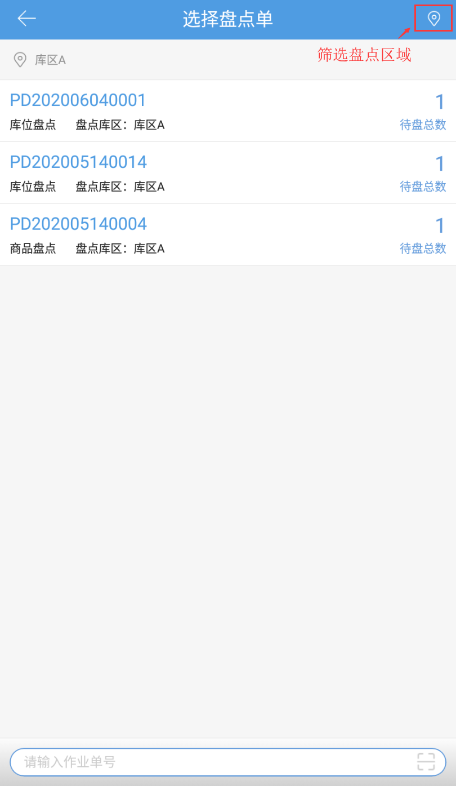  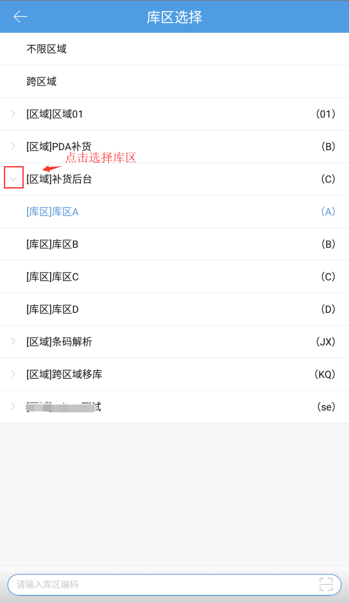

选择作业区域后界面显示当前区域下待作业的盘点任务，点击选择任务或输入作业单号进行盘点作业，点击目标库位后的待作业，或扫描目标库位编码进行盘点操作

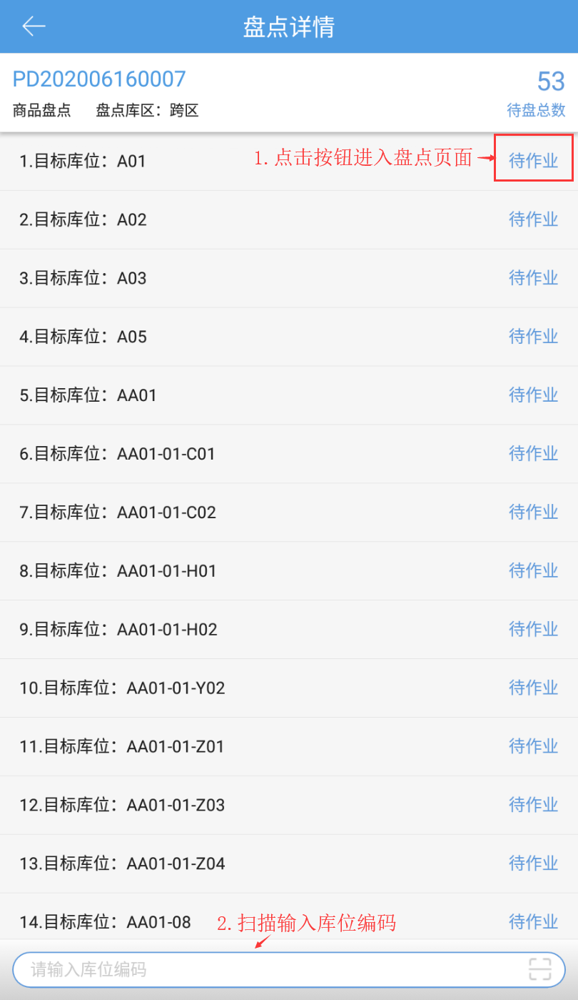

盘点时可逐件进行商品条码扫描，也可点击商品数量进行修改

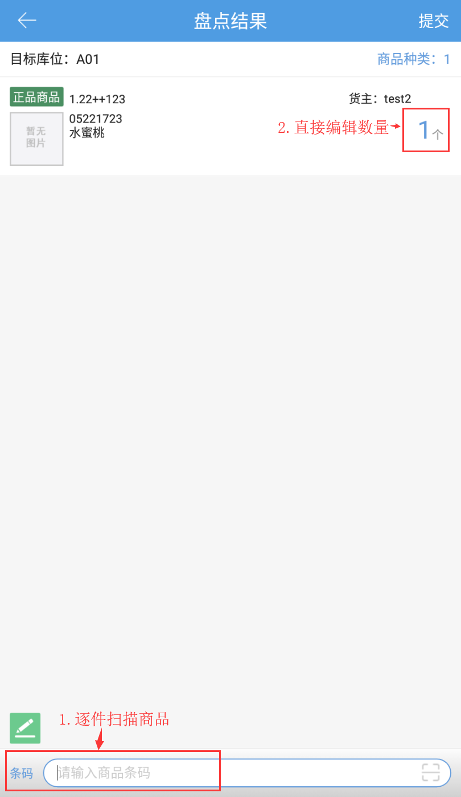

提示

1、指定库区后仅能查看当前库区任务

2、如果盘点类型是商品盘点，输入非盘点商品则报错

3、当某个盘点任务中部分盘点成功后在选择任务界面系统显示部分完成。

4、盘点任务支持盘点生产批次商品，扫描生产批次商品会跳转生产批次设置页面。设置后会到单批次扫描页面，盘点对应批次的商品。首页点击生产批次，也能跳转单批次扫描页面。

5、盘点任务开启明盘时，PDA上可以开启差异提醒开关（具体功能参考[快速盘点第6条](https://hupun.yuque.com/unzko7/lsbfg0/oqepvoeiyednmz7q)），未开启明盘时，不显示差异提醒开关。

6、查询模式切换，底部扫描框默认显示“条码”，若[开启集合码便捷录入](https://hupun.yuque.com/unzko7/lsbfg0/caki7lz4105n2vpg#CKIQO)开关，会显示“集合码”，通过扫描集合码来同时匹配商品条码、生产批次号等多个信息。若批次号在列表中存在，则会直接匹配到对应明细并增加数量；若不存在，则只带出批次号，其它信息为空。

> 更新: 2024-10-25 10:51:53  

> 原文: <https://hupun.yuque.com/unzko7/lsbfg0/ww674lzxzfc0sgy2>

---

### 07.3.21 PDA-移库任务

> 原始文件来源：`00-源文件/PDA安卓端/仓内/PDA-移库任务.md`

支持领取pc生成的跨区域移库任务。

01.   取货页面，取商品，扫描库位可取货库位下的所有商品。取箱子，扫描箱条码即取货一个箱子。

取商品：

取箱子：

02.   上架页面，拆零的商品，扫描目标库位即上架成功。箱子上架时，若箱子的目标库位有多个，扫描目标库位后需要跳转确认箱子页面，保证箱子上架到库位上的箱子是正确的。

注意：任务同来源库位同商品但是目标库位不同，取货时会合并在同一个库位下取货，上架时再拆分上架。同理不同来源的同商品，目标库位相同，上架页面明细合并。

> 更新: 2023-12-21 09:28:18  

> 原文: <https://hupun.yuque.com/unzko7/lsbfg0/dntehhumbel832r7>

---

### 07.3.22 PDA-自由上架

> 原始文件来源：`00-源文件/PDA安卓端/仓内/PDA-自由上架.md`

自由上架一般用于商品在异常暂存库位上架到库位上。

(1) 点击“自由上架”，进入待上架页面，选择取货模式、上架模式和扫描库位，点击下一步。

(2) 进入取货页面，扫描待上架的商品条码或者点击“+”选择上架的商品，点击确认。

(3) 进入待上架页面，取货模式、上架模式，编辑商品数量，点击下一步。

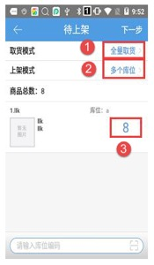

(4) 进入上架页面，扫描上架的库位，点击提交。

(5) 若在待上架页面上架模式选择了多个库位，在上架页面，选择商品左划，拆出一条明细，上架到多个库位上。

#### 取货模式-免扫全取

取货模式选择“免扫全取”时，扫描库位编码后，会跳过取货流程，直接跳转到最终【上架】页面，默认显示该库位下所有有库存的商品。省去了中间取货过程，上架更便捷。

 

> 更新: 2026-08-07 17:26:20  

> 原文: <https://hupun.yuque.com/unzko7/lsbfg0/npvqc9ztus6ppd8c>

---

### 07.3.23 PDA-自由分拣

> 原始文件来源：`00-源文件/PDA安卓端/仓内/PDA-自由分拣.md`

库位上销售退货的商品种类繁多，重新上架需要先将库位上的商品根据条件进行分类，然后集中上架，以避免上架过程中过多来回无效跑动。

自由分拣功能，操作如下：

#### 1.确定需要分拣的商品跟库位

扫描需要进行分拣的来源库位

#### 2.选择分拣的方式

分拣方式=分拣分类遵照的规则

现支持：指导区域/指导库区/货主/商品品牌/商品分类/商品等级6种分拣方式

选择分拣方式后，后台计算当前库位上的商品可分为X种，提示需要X个分拣框。

请根据系统提示，准备好拣货筐，然后点击确认开始分拣。

如果框不够或者条件选择错误，点击取消可以重新选择分拣方式。

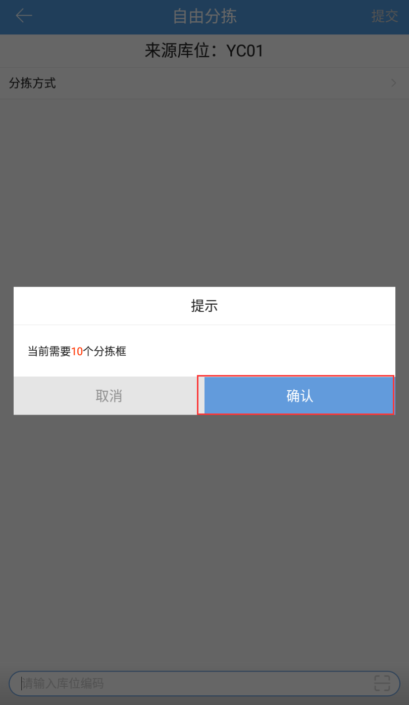

#### 3.开始分拣

扫描库位上的商品条码，提示将商品放置在Y号分拣框中，支持回看上次的分拣结果，库位上的商品全都扫描后，点击右上角的提交按钮，完成分拣。

#### 注意事项

1.开启播种验货语音播报后，自由分拣扫描商品后会语音播报商品将要放置的筐号

2.扫描商品开启分拣后，分拣方式不支持中途修改

3.根据指导区域、指导库区进行分拣，可以选择指导上架的库位类型

4.系统配置开启条码截取后，开始分拣扫描商品条码时，也支持条码截取

> 更新: 2024-10-31 15:04:51  

> 原文: <https://hupun.yuque.com/unzko7/lsbfg0/usew97o4ngb1k855>

---

### 07.3.24 PDA-补货任务

> 原始文件来源：`00-源文件/PDA安卓端/仓内/PDA-补货任务.md`

PC端生成补货任务，用户可以手持pda进行补货。

#### 01.补货任务筛选

点击右上角：

a.指定所在库区：支持选择来源/目标库区，仅支持单选。

b.包含库位标签：

- 数据来源：PC仓库库位->标签维护
- 不选或全选时显示不限
- 支持选择来源/目标库位标签，支持多选。

库位标签满足条件：任务中来源/目标所在库位均在设定的库位标签所查询到的库位范围内。

c.指定所在库区、包含库位标签为“且”逻辑关系。

#### 02.零散-补货上架

 点击“补货任务”按钮，进入选择补货单页面，选择取货模式、上架模式后，下拉加载补货任务并选择补货任务或者输入作业单号/来源库位/目标库位领取补货任务

##### 1、全量取货+按库位上架

进入取货页面，扫描来源库位或直接编辑商品数量进行取货，取货完成后，点击下一步。

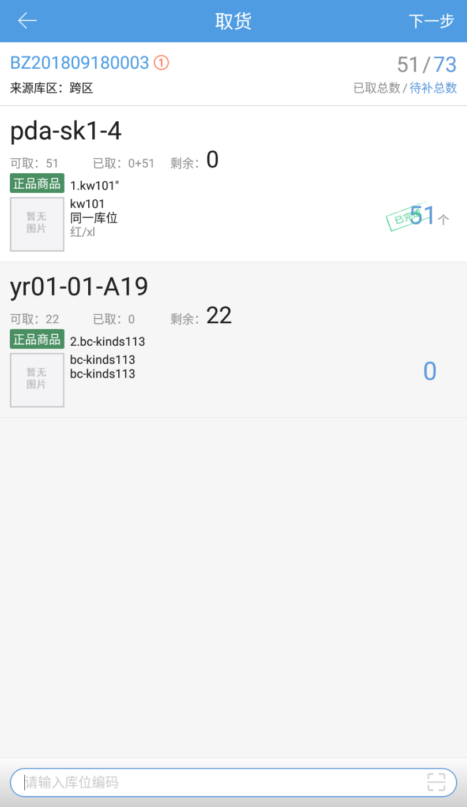

跳转上架页面，扫描目标库位进行上架，点击提交，补货上架完成。

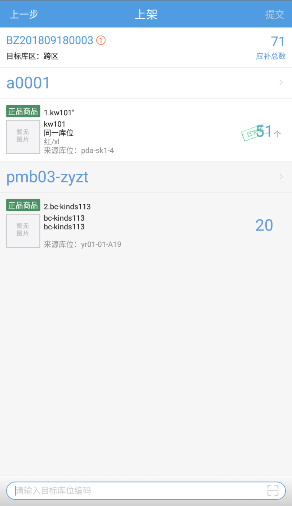

①.操作员拥有超补权限后，补货上架可以超补，在取货页面直接编辑商品的数量，系统自动计算超补数

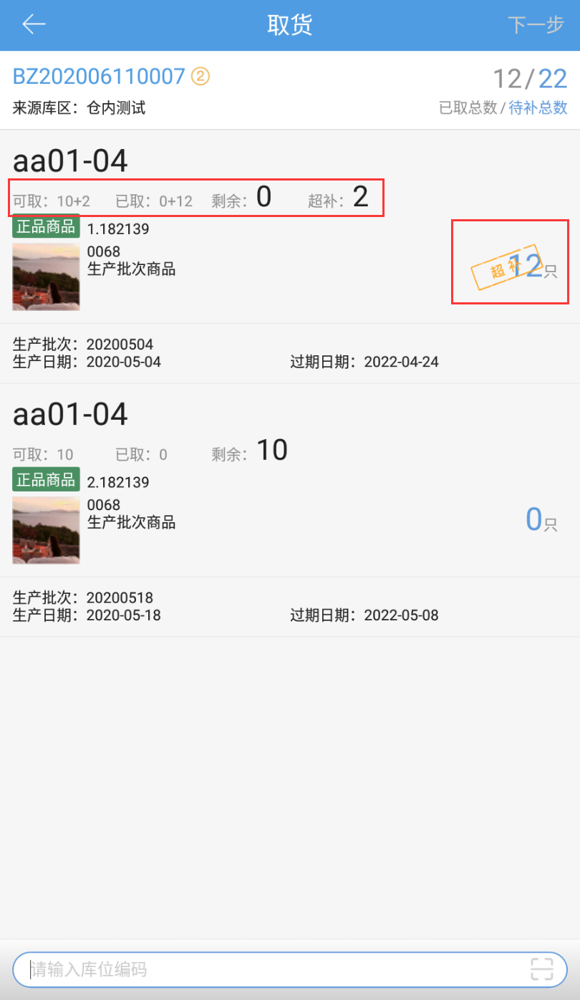

②.上架时支持修改目标库位，上架页面，点击库位，跳转选择库位页面，扫描新的上架库位即可

##### 2、逐件取货+按商品上架

领取任务进入取货页面，扫描库位编码跳转取货商品确认页面，扫描商品条码逐件添加取货商品数量，取货完成后点击下一步

跳转上架页面，扫描需要进行上架的**商品条码**

自动跳转到单商品上架页面，扫描商品的目标库位

完成上架

#### 03.货箱-补货上架

(1) 点击“补货任务任务”按钮，进入选择补货单页面，下拉加载补货任务并选择补货任务或者输入作业单号。

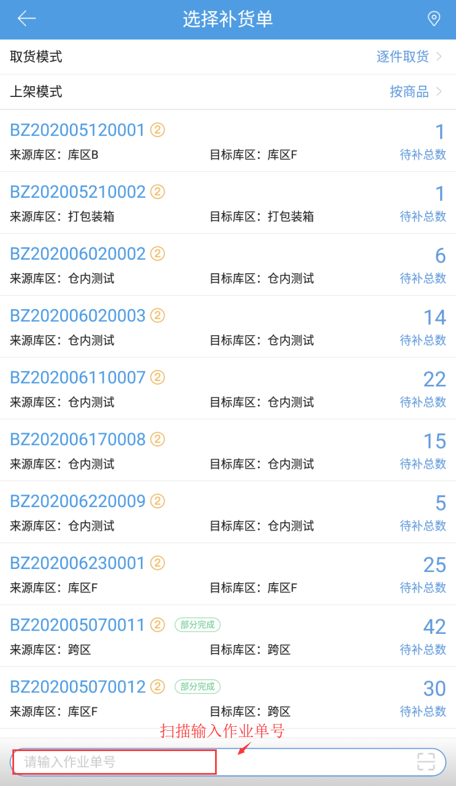

(2)  进入取货页面，扫描来源库位或直接编辑商品数量进行取货，取货完成后，点击下一步。

(3) 进入上架库位页面，扫描目标库位，点击下一步。

(4) 进入上架页面，点击提交，提交补货上架。

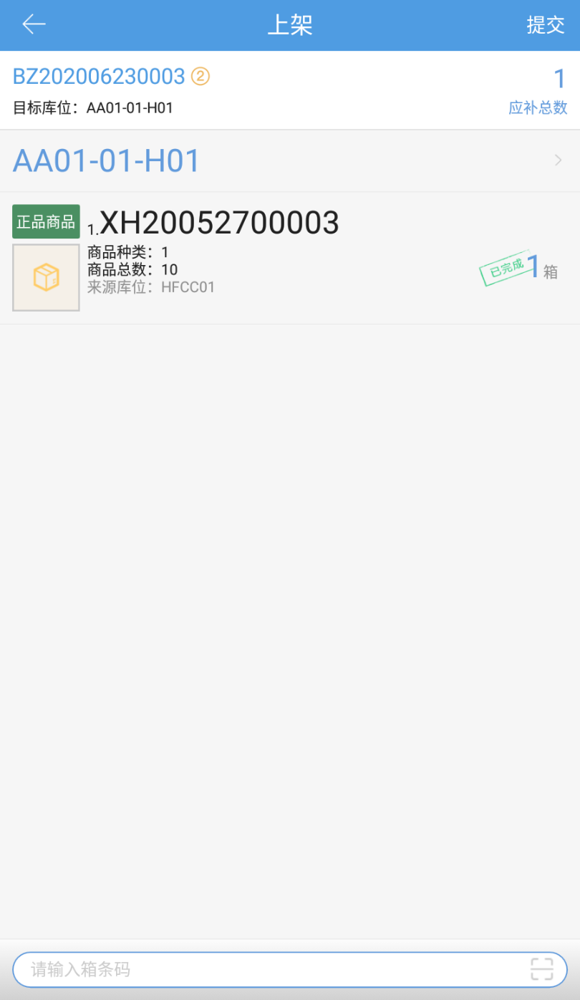

#### 04.添加其他批次

1.操作员有超补权限即拆零批次sku左滑显示添加批次。

2.支持添加补货单外的同库位同sku其他批次，当前批次库存可用数量>=1即添加锁定成功，否则报错。

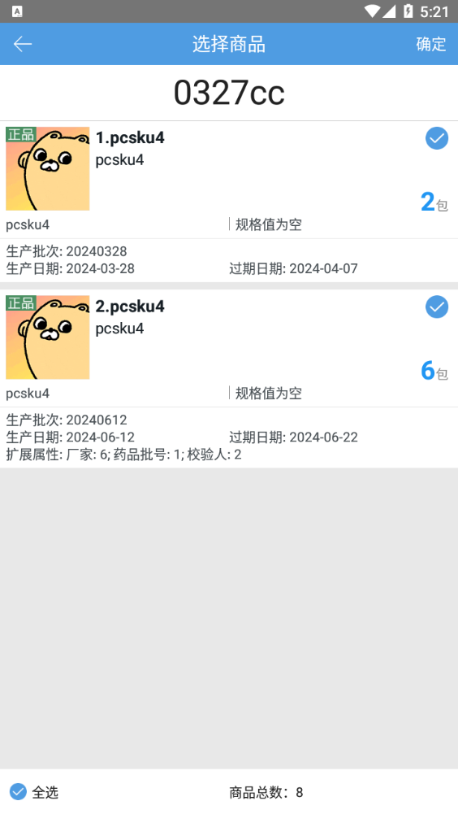

3.添加批次后PC端补货单对应显示新增批次数据，新增批次支持删除，其他操作逻辑同原有明细。

注：新增批次取货数量不关联外部取货模式。

> 更新: 2026-04-20 18:31:00  

> 原文: <https://hupun.yuque.com/unzko7/lsbfg0/in5ghg3ufgoqx842>

---

### 07.3.25 PDA-规格装箱

> 原始文件来源：`00-源文件/PDA安卓端/仓内/PDA-规格装箱.md`

PDA支持将仓库内的商品装规格箱存放。

首先选择需要装箱的商品所在库位，不能选择拣选、预配、次品库位；开启3PL的公司需要选择货主。

然后选择商品或扫描商品，跳到选择箱规格页面。

选择箱规格后，返回规格装箱页面，编辑装箱数量，点击确定装箱成功。

注意：

1若扫描的商品未设置装箱规格则提示商品没有设置装箱规格，不允许装箱。

2.若扫描生产批次商品提示生产批次商品，不允许装箱。

3.选择箱规格页面显示的箱规格是小于可用数的且只支持单选，

例如可用数20，

方案1：1包=10个，1箱=2包=20个

方案2：1车=100个

选择箱规格页面上只显示方案1。

> 更新: 2023-12-21 09:28:19  

> 原文: <https://hupun.yuque.com/unzko7/lsbfg0/fek1h2rvs5x098yo>

---

### 07.3.26 PDA-预包任务

> 原始文件来源：`00-源文件/PDA安卓端/仓内/PDA-预包任务.md`

预包任务适用于以预包为主的仓库，根据子商品配比数量和计划预包数量计算预打包数量，并预包任务适用于以预包为主的仓库，根据子商品配比数量和计划预包数量计算预打包数量，并支持单独统计预包绩效。

01.领取任务并作业

在PC上创建任务单后，可以在PDA上领取任务并作业:

其中：

(1)领取任务有两种方式：页面下拉加载、扫任务单号匹配

(2)页面下拉加载显示的任务单是待作业状态的单据

(3)领取任务后，单据变成[作业中]状态，其他人不能领取该任务

(4)领取任务后放弃，单据变成[待作业]状态，其他人可以领取该任务

领取任务后，进入任务单详情页面，锁定来源库位后点击提交即可完成任务：

其中：

(1)预包数量=任务单计划预包数量，若有部分完成的成品，则预包数量=剩余预包数量

(2)拟完成数量=本次锁定的子商品数量可以组成的成品数量

(3)目标预配库位：用于指定成品存放的目标库位，默认选中所属预配波次中的第一个预配库位，可以手动点击修改或扫描匹配

(4)未锁来源库位：用户锁定子商品的来源库位，默认不显示，可以手动指定或一键锁定

(5)来源库位一键锁定范围：除箱拣选、工位、次品、货箱库存；手动指定库位范围：除预配、箱拣选、工位、次品、货箱库存

(6)子商品明细锁库时，若指定库位可用库存<计划数量，指定锁库后会自动拆出一个同规格未锁明细，数量=计划数量-已锁数量

02.无完成数量

部分明细已锁、部分明细未锁、无拟完成数量时点击提交，不会影响预包任务完成数量及明细数据，系统会生成一个移库单:

支持单独统计预包绩效。

01.领取任务并作业

在PC上创建任务单后，可以在PDA上领取任务并作业:

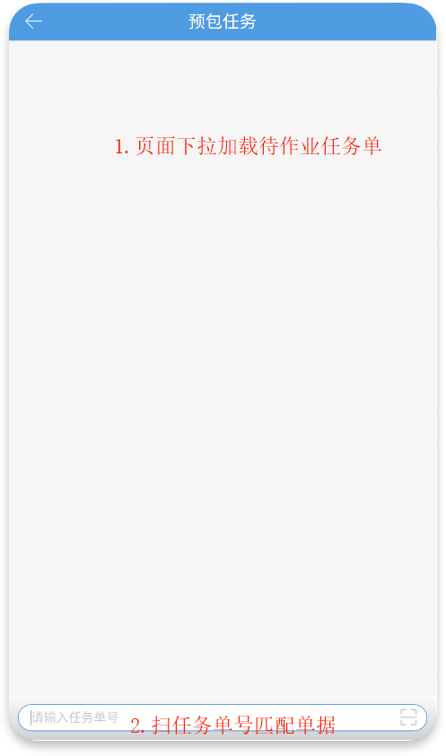

其中：

(1)领取任务有两种方式：页面下拉加载、扫任务单号匹配

(2)页面下拉加载显示的任务单是待作业状态的单据

(3)领取任务后，单据变成[作业中]状态，其他人不能领取该任务

(4)领取任务后放弃，单据变成[待作业]状态，其他人可以领取该任务

领取任务后，进入任务单详情页面，锁定来源库位后点击提交即可完成任务：

其中：

(1)预包数量=任务单计划预包数量，若有部分完成的成品，则预包数量=剩余预包数量

(2)拟完成数量=本次锁定的子商品数量可以组成的成品数量

(3)目标预配库位：用于指定成品存放的目标库位，默认选中所属预配波次中的第一个预配库位，可以手动点击修改或扫描匹配

(4)未锁来源库位：用户锁定子商品的来源库位，默认不显示，可以手动指定或一键锁定

(5)来源库位一键锁定范围：除箱拣选、工位、次品、货箱库存；手动指定库位范围：除预配、箱拣选、工位、次品、货箱库存

(6)子商品明细锁库时，若指定库位可用库存<计划数量，指定锁库后会自动拆出一个同规格未锁明细，数量=计划数量-已锁数量

02.无完成数量

部分明细已锁、部分明细未锁、无拟完成数量时点击提交，不会影响预包任务完成数量及明细数据，系统会生成一个移库单:

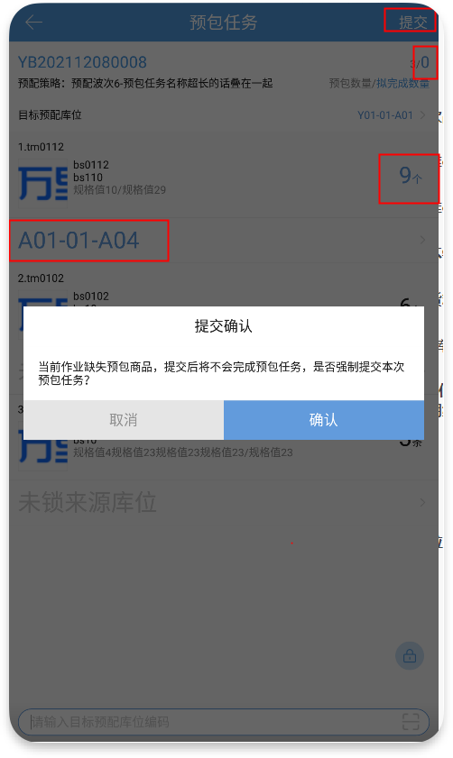

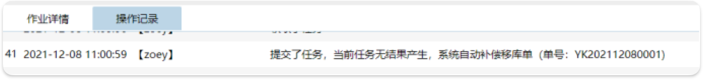

> 更新: 2023-12-21 09:59:22  

> 原文: <https://hupun.yuque.com/unzko7/lsbfg0/zd53hqa0ziurehif>

---
