# 08. 库存管理

> 资料来源：基于 `00-源文件/` 对应模块的原始操作手册、专题功能与PDA文档重组迁移。
> 事实边界：正文仅重组迁移原始文档；章节编号、目录和来源标记为整理信息，不新增业务规则、字段或流程。

## 本章知识目录

- **08.1 库存状况与明细查询**
  - [历史库位库存](#0811-历史库位库存)
  - [历史库存](#0812-历史库存)
  - [可接单库存](#0813-可接单库存)
  - [库位库存](#0814-库位库存)
  - [库存总量](#0815-库存总量)
- **08.2 库存预警监控**
  - [区域预警](#0821-区域预警)
  - [库区预警](#0822-库区预警)
  - [库存差异量](#0823-库存差异量)
  - [库存调整](#0824-库存调整)
  - [货权转移](#0825-货权转移)
  - [生产批次预警](#0826-生产批次预警)
  - [预包预警](#0827-预包预警)
- **08.3 PDA手持端查询与盘点**
  - [PDA-商品库位](#0831-PDA-商品库位)
  - [PDA-容器查询](#0832-PDA-容器查询)
  - [PDA-库位库存](#0833-PDA-库位库存)
  - [PDA-绩效补录](#0834-PDA-绩效补录)
  - [PDA-订单库位](#0835-PDA-订单库位)
  - [PDA-订单查询](#0836-PDA-订单查询)
  - [PDA-货箱查询](#0837-PDA-货箱查询)

---

## 08.1. 库存状况与明细查询

### 08.1.1 历史库位库存

> 原始文件来源：`00-源文件/操作手册/库存/库存状况/历史库位库存.md`

本页面可按每日库存进行查看历史库存数据，用于辅助计算货主存储费用。

注：

①无库位栏用于显示没有库位信息的库存

②本菜单关联后台开关，开启后显示

> 更新: 2026-02-10 15:31:04  

> 原文: <https://hupun.yuque.com/unzko7/lsbfg0/ql8oqpreyo8opzit>

---

### 08.1.2 历史库存

> 原始文件来源：`00-源文件/操作手册/库存/库存状况/历史库存.md`

#### **1.库存数量**

页面中的库存数量只是当前晚上12点的商品的总库存量。

#### **2. 库存状况页面**

页面默认选择商品选项，显示当前仓库下所有商品的库存数量。点击导出可以导出商品库存状况表，根据所查询仓库是否开启次品开关分别展示详见下图。

1）未开启次品管理开关

①、查询条件，支持多仓查询；支持指定日期查询，查看某天的日库存；支持货主查询；支持商品规格/编码、条码、品牌和实际库存查询。

②、支持商品和生产批次导出。

③、可以查看当前分类的总库存、商品的总体积、总重量，体积、总量最多保留小数点后3位。

④、实际体积、实际重量不可编辑。

2）开启次品管理开关

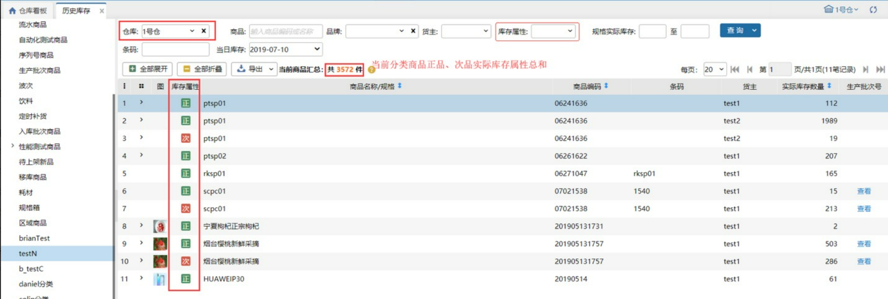

#### **3.查询项**

1）支持仓库、商品编码/名称、品牌、货主、库存属性、规格实际库存、条码、日期、序列号查询；

2）存在序列号商品的次品时，录入正品的序列号，只查询正品的库存总量，录入次品的序列号，只查询次品的库存总量。                      

#### **4. 默认箱单位**

1.新增默认箱单位，关联开启商品多单位管理+出库快速换算推荐模式显示。

2.操作员有权限的仓库，有一个仓库开启出库换算就展示。

3.已设置多单位的商品，显示商品实际库存数量根据默认多单位箱换算后结果。

4.已勾选筛选的仓库，有一个没有开启换算模式就不展示换算数据。 

#### 4.导出

普通导出、生产批次导出支持按当前日期、按指定日期区间导出。

按当前日期：导出1日历史库存数据，日期按查询条件中所选。

按指定日期区间：导出指定日期区间内多日历史库存数据。

a.默认显示除当天外前7天时间范围。

b.最大支持选择32天进行导出。

> 更新: 2024-07-26 10:58:08  

> 原文: <https://hupun.yuque.com/unzko7/lsbfg0/bmgsdk6k9g511lhq>

---

### 08.1.3 可接单库存

> 原始文件来源：`00-源文件/操作手册/库存/库存状况/可接单库存.md`

业务配置开启允许缺货接单-根据自定义库存判断后，能看到“可接单库存”菜单。可接单库存配置的计算公式算出，用于限制指定商品的可接单数量。

#### 1.页面数据显示

默认显示当前仓库下、开启允许缺货接单货主的库存数据。

库存数量：和库存总量页面一致

入库在途：对应货主的在途库存数量，包括：采购入库在途、加工在途、销退入库在途、调拨入库在途、其他入库在途

虚拟库存：默认为0，支持手动修改，上限99999999

可接单库存：按照业务配置公式计算得出，修改公式后会触发重算

#### 2.设置虚拟库存

有两种方式：单个设置、批量修改

①单个设置：在对应sku上直接修改数量，可为正负，修改后会重算可接单库存

②批量设置：按勾选、按查询两种，可以全量覆盖为指定数值、或者添加或减少固定值

> 更新: 2023-12-21 17:27:17  

> 原文: <https://hupun.yuque.com/unzko7/lsbfg0/ym9sugldykss8uru>

---

### 08.1.4 库位库存

> 原始文件来源：`00-源文件/操作手册/库存/库存状况/库位库存.md`

#### **1.功能场景**

库位库存是可查看库位上的商品的库存状况；

库存数量包括四种类型：实际库存，可用库存，锁定库存和冻结库存；

详情按钮的作用是查看每个商品库存变化明细，可追溯到相关单据，并显示记账时间。

根据是否开启次品管理开关分别展示具体页面展示如下：

1）未开启次品管理开关

库位库存变化提示：

1.订单推送到wms且有锁定库位，则这里的锁定数量增加，可用数量减少，实际数量不变；

2.订单拣货之后，这里的锁定数量减少，可用数量不变，实际数量减少；

2）开启次品管理开关

#### **2.作业中商品**

增加了作业中的商品的统计：即已经确认拣货了但还没有出库的订单的商品会在此页面展示，作业中的数量就是锁定数量，具体页面如下：

#### **3.容器中商品**

增加了容器中商品的统计：即入库到容器或者移库到容器中的商品会在此页面展示，具体页面如下：

#### **4.货箱明细**

选择库存形态为货箱的 ，在有货箱存储的库位上点击货箱详情可查看当前SKU的装箱情况。

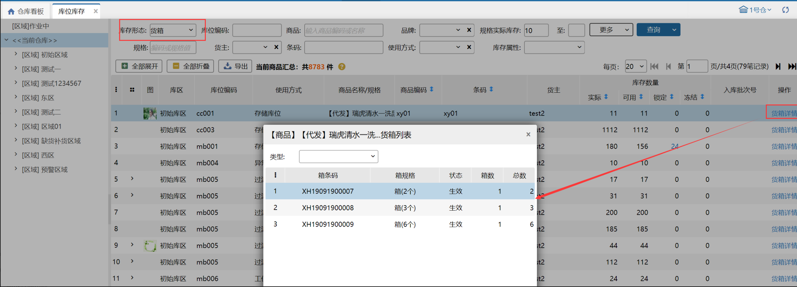

注意：货箱库存属性都为正品；

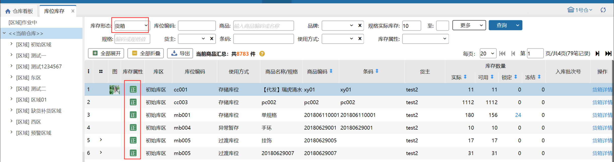

#### **5. 库存详情**

点击商品详情可显示当前时间段库存变化情况，及发生业务的单据。

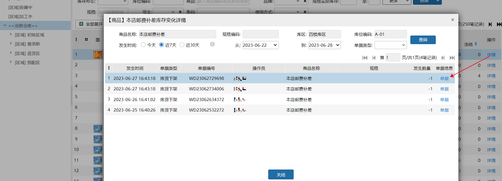

#### **6.查询条件**

1. 支持库存形态（拆零、货箱）、库位编码、商品编码/名称、品牌、规格编码/名称、条码、库存属性、生产批次、序列号查询；

2.存在序列号商品的次品时，录入正品的序列号，只查询正品的库存总量，录入次品的序列号，只查询次品的库存总量；

3.最新发生时间表示当前行sku库存最新变更时间，支持按指定时间范围进行查询。

#### **7.开启商品生产批次标准模式**

生产批次商品入库后，不再支持库位库存页面查看库位上生产批次商品的批次信息。

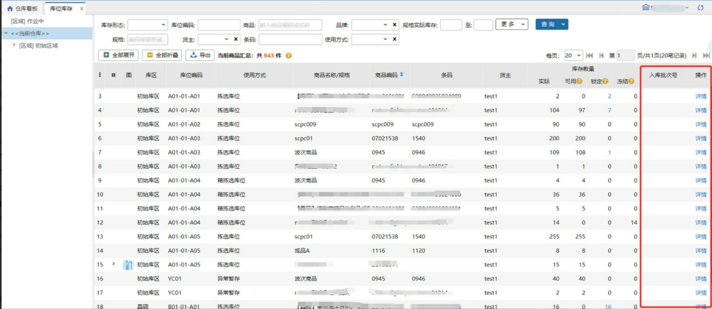

#### **8. 默认箱单位**

1. 新增默认箱单位，关联开启商品多单位管理+出库快速换算推荐模式显示。
2. 已设置多单位的商品，显示商品实际库存数量根据默认多单位箱换算后结果。
3. 库存形态为货箱时无此列。

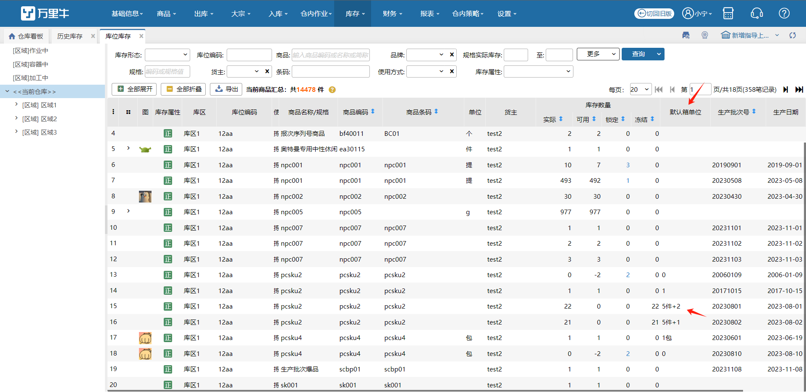

> 更新: 2025-01-21 10:29:38  

> 原文: <https://hupun.yuque.com/unzko7/lsbfg0/cltzrryhdxoxw5ba>

---

### 08.1.5 库存总量

> 原始文件来源：`00-源文件/操作手册/库存/库存状况/库存总量.md`

#### 1. 库存数量

反映当前各个商品在每个仓库的库存状况，包含实际库存，可用库存，锁定库存，冻结库存，在途库存。

库区按钮的作用是查看每个商品在各个库区的库存状况。

详情按钮的作用是查看每个商品库存变化明细，可追溯到相关单据，并显示记账时间。

万里牛五种库存形式含义：

实际库存：即代表实际仓库中拥有的库存量；  
可用库存：系统中的可用库存=实际库存-待发货数量（锁定数量）-冻结数量；  
锁定库存：即表示系统中已被分配使用的商品，不允许再被用来分配订单等；  
冻结库存：表示系统中不能被使用的商品，不可用于正常出库的等；  
在途库存：在供应商处已经下过订单，尚在运输途中，还未入库的库存部分。在系统中表现为有采购，退货，其他，调拨入库。

#### 2. 库存总量页面

页面默认选择仓库选项，显示当前仓库下所有商品的库存数量。点击导出可以导出商品/生产批次/序列号库存状况。

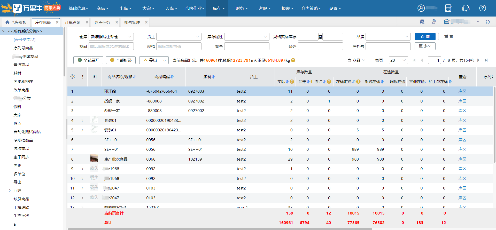

库存总量变化提示：

1.订单推送到wms且有锁定库位，则这里的锁定数量增加，可用数量减少，实际数量不变；

2.订单出库之后，锁定数量减少，可用数量不变，实际数量减少；

3.实际库存=可用库存+锁定库存+冻结库存；在途库存不计入库存总量。

4.开启次品库存管理，页面多显示一列库存属性。

查询仓库库存总量规则：

1.查询的仓库都未开启次品开关，无库存属性查询项和库存属性列；

2.查询的仓库有开启次品开关的则展示库存属性查询项、库存属性列，商品在未开启次品仓库的库存总量按正品处理；

3.查询全部仓库的库存总量，若公司开启次品开关，则展示库存属性查询项、库存属性列；

案例如下：

1号仓未开启次品开关，商品a库存数量为：实际10，可用8，锁定2；

2号仓开启次品开关，商品a库位数量为：正品实际15，可用15，锁定0   次品实际5，可用5；

3号仓开启次品开关，商品a库位数量为：正品实际20，可用20，次品实际2，可用2；

①.当前仓为1号仓，查询1号仓库存总量：无库存属性查询项、库存属性列，商品a库存数量为：实际10，可用8，锁定2；

②.当前仓为1号仓，查询1、2号仓库存总量：有库存属性查询项、库存属性列，商品a库存数量为：正品实际25，可用23，锁定2 、次品实际5，可用5；

③当前仓为1号仓，查询全部仓库的库存总量：有库存属性查询项、库存属性列，商品a库存属性为：正品：实际45，可用43，锁定2、次品实际7，可用7.

#### 3. 作业中商品

当订单确认拣货后但是还没有出库，则该订单的商品会被记录到作业中，具体页面如下：

**提示**

1.此处的数据与【库存】-【库位库存】页面的数据相同；

2.若没有作业中的订单，则此处的作业中栏不会显示。

#### 4. 库存详情

点击商品详情可显示当前时间段库存变化情况，及发生业务的单据。

#### 5.查询项

1.支持序列号查询，通过序列号查询，直接定位到货主、商品/规格。

2.存在序列号商品的次品时，录入正品的序列号，只查询正品的库存总量，录入次品的序列号，只查询次品的库存总量。

3.品牌查询项仅显示账号有权限的品牌数据。

#### 6. 默认箱单位

1. 新增默认箱单位，关联开启商品多单位管理+出库快速换算推荐模式显示。
2. 操作员有权限的仓库，有一个仓库开启出库换算就展示。
3. 已设置多单位的商品，显示商品实际库存数量根据默认多单位箱换算后结果。
4. 已勾选筛选的仓库，有一个没有开启换算模式就不展示换算数据。

#### 7. 商品/规格模式

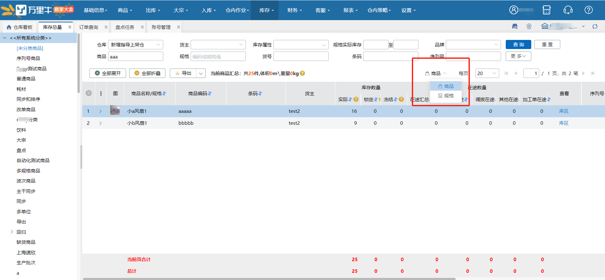

商品：按spu+sku级显示，需展开则显示sku。

规格：仅显示商品sku级数据，无层级显示。

#### 8. 条码查询项

条码精确查询后，右模糊搜索到的商品也展示。

例：商品1条码：sku2  商品2条码：sku2++01  商品3条码：sku12

输入sku2可查询到商品1和商品2

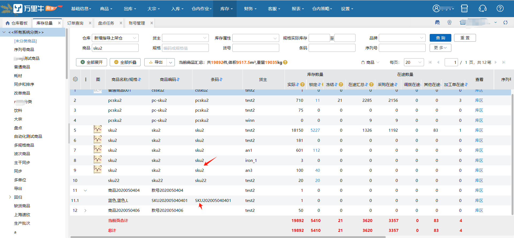

#### 9.导出

支持导出序列号扩展属性值

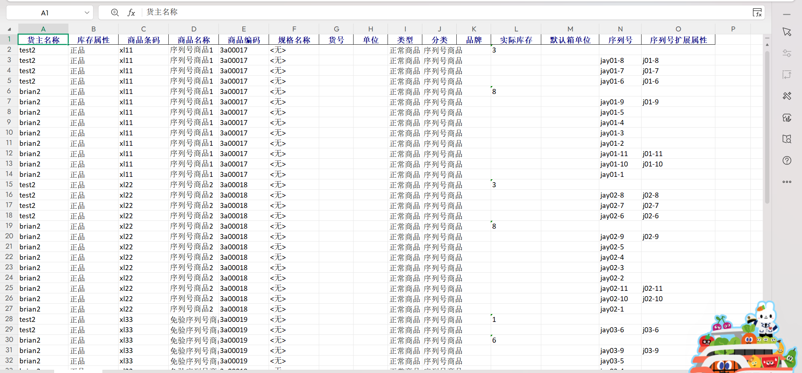

> 更新: 2026-01-05 10:41:27  

> 原文: <https://hupun.yuque.com/unzko7/lsbfg0/megb9qnez4ty363g>

---

## 08.2. 库存预警监控

### 08.2.1 区域预警

> 原始文件来源：`00-源文件/操作手册/库存/库存预警/区域预警.md`

区域预警是将同个区域下库位库存总和来进行上限和下限的警戒设置。当商品数量低于警戒下限时可通过【库存移动】点击生成跨区移库任务。设置方法与库区预警类似。

 

> 更新: 2023-12-19 14:13:14  

> 原文: <https://hupun.yuque.com/unzko7/lsbfg0/ypb2z8ekfloyy577>

---

### 08.2.2 库区预警

> 原始文件来源：`00-源文件/操作手册/库存/库存预警/库区预警.md`

设置商品在某个库区下的库存上、下限警戒线，当库存低于警戒线时，系统会自动创建补货单，引导操作员进行补货操作。

#### **1.页面显示**

页面默认不显示任何商品，需要选择库区，才可以查询到相应的商品，

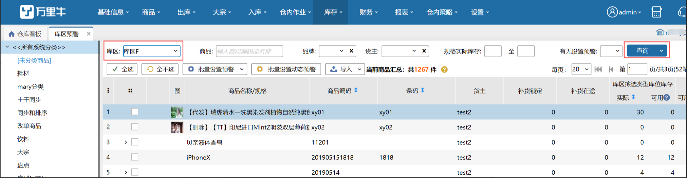

 

#### **2.预警值设置**

库区预警值设置有三种形式：直接填写、批量设置和模板导入

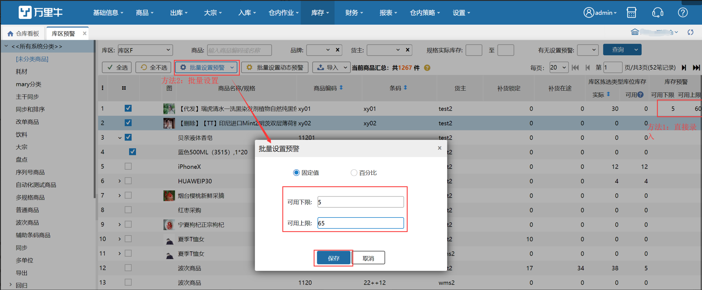

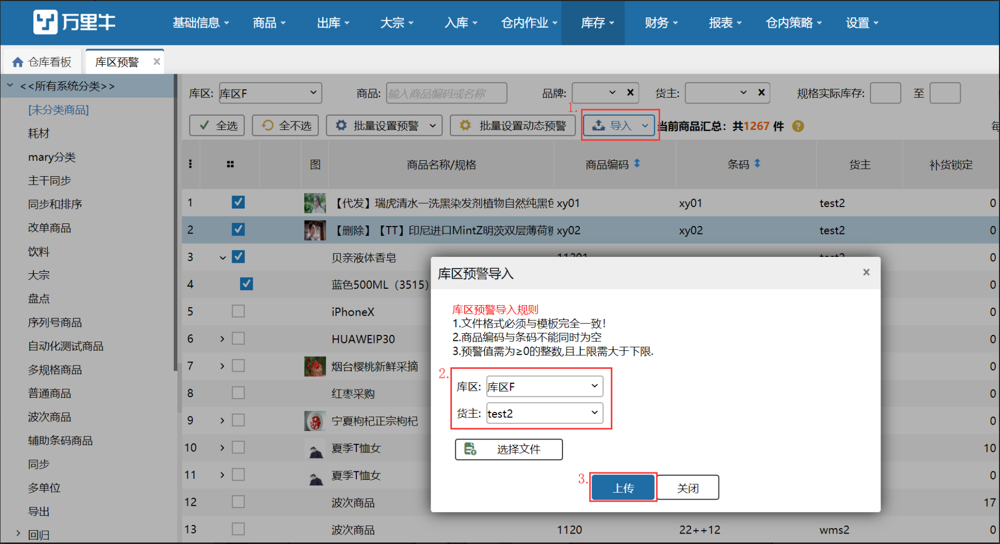

#### **3.动态预警**

根据7个补货周期的销售情况，自动更新预警上下限。上限根据补货周期和安全倍数计算，下限根据上限的百分比计算。每天凌晨跑批更新预警上下限。

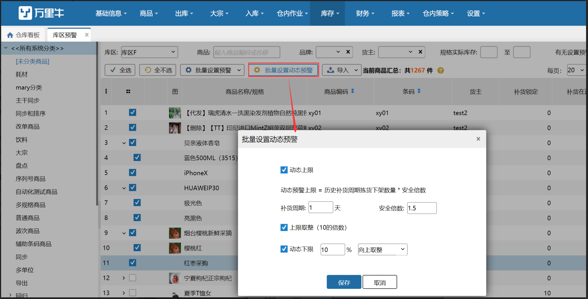

①.新品针对全仓的，新品库区预警计算是上限=（第一个周期内拣货下架数之和/7）*安全倍数；下限=上限*百分数，只有第一个周期后才会跑预警上下限。

eg：补货周期是3天、安全倍数是2，下限是10%向上取整，A在库区01下拣选库位有100个，8月27号第一拣货65，8月28、29、30号凌晨都不会跑出预警上下限，8月31号凌晨跑出预警上限（65/7）*3=28，下限是28*10%=3。8月31号再次拣货10，9月1号凌晨跑出新的预警上限（75/7）*3=32，下限是32*10%=4。

②.非新品库区预警计算，上限=(7个补货周期内拣货下架数之和/7)*安全倍数；下限=上限*百分数

注：已经设置动态预警的商品，手动设置预警上下限/批次设置预警后，会将动态预警清除。

#### **4.拆零保底设置**

使用全流程库存级管理的前提下，需要实现需要实现整数按箱出，零头拿散件凑的业务特征，需要常备一些散件作为‘凑零头’使用，所以在日常补货时也需要对这些零头的数量做一些补充，就是所谓的拆零保底数量

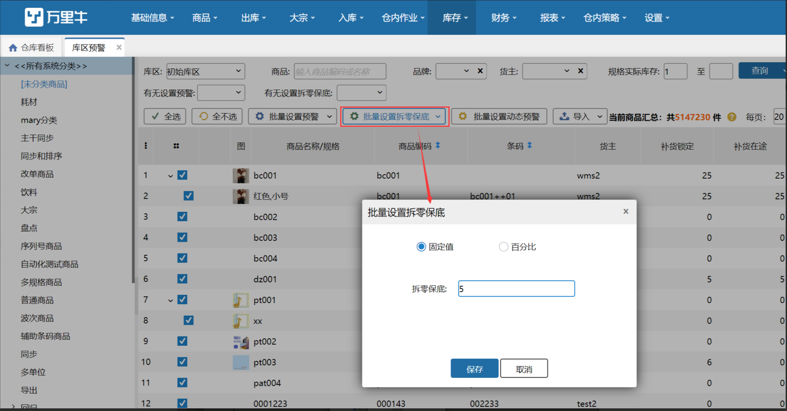

①.设置了拆零保底怎么触发补货？

开启允许普通订单锁箱子开关+拣选库位可用/实际+箱拣选库位箱内可用/实际+拣选库位在途+箱拣选箱在途<下限，触发补货。

②.需要补的数量是多少？

预警上限-拣选库位可用-箱拣选箱可用-拣选库位在途-箱拣选箱在途。

③.拆零补多少？

拆零保底-拣选库位拆零在途-拣选库位拆零。

④.箱子补多少？

要补的数量-拆零保底实际补的。

提示

1.该页面只能每个库区分别设置。

2.模板导入可根据某一设定好的库区下载相应模板，修改后再导入至需修改的区域

 

> 更新: 2025-08-11 14:05:24  

> 原文: <https://hupun.yuque.com/unzko7/lsbfg0/vyqly7arbk2zydth>

---

### 08.2.3 库存差异量

> 原始文件来源：`00-源文件/操作手册/库存/库存预警/库存调整/库存差异量.md`

库存差异量：表示系统中库位库存和作业中的数量之合与库存总量的差异量，可用于帮助用户校准库存；

具体页面展示如下：

#### **1.造成库存差异量的因素**

因素主要包括以下几点：订单库位锁定失败、库存盘点、库存调整；

具体可以点击详情查看库存差异量的变化原因，如下图：  

支持导出库存差异量变化详情。

**注意：**

1.导出结果是当前页面的查询结果。

2. 查询结果为空时，无法导出。

3.点击导出后会生成导出任务，建议5分钟后到数据中心下载查看。

#### 2. 库存调整

当有存在库位差异量时，点击库存调整，选择要调整的商品，会带出改商品的库存差异量（该值不能修改），点击保存，则库存总量的值会对应的修改，具体页面如下：

#### **3. 全量调整**

点击全量调整，自动带出所选仓库下，对应货主的全部有差异量的商品，上限500个，可手动添加。

注意

1. 库存差异量计算公式为：库存差异量=库位库存总量+作业中数量-库存总量；

2. 新建库存调整单进行库存调整后在【库存】-【库存调整】中会增加一条库存调整记录；

3. 在此页面库存调整会通知erp，则erp也会修改对应的库存。

#### **4.支持次品库存的差异量**

1.  支持次品进行库存调整，操作步骤同正品库存调整。

2.调整后通知ERP

1）业务配置选择次品库存管理全部对内模式，次品库存调整后通知ERP数量增多或减少；例：商品A的次品库存调整差异数量+5，通知ERP后，ERP中商品A的库存数量+5。

2）业务配置选择次品库存管理全部半对外模式，次品库存调整后不会通知ERP数量变更；例：商品A的次品库存调整差异数量+5，调整单完成后不会通知ERP。                     

#### **5.生产批次商品的差异量**

造成差异量的因素同普通商品，支持库存调整，生产批次严格模式下，库存差异量对应到商品的生产批次，选择有差异量的商品进行库存调整。

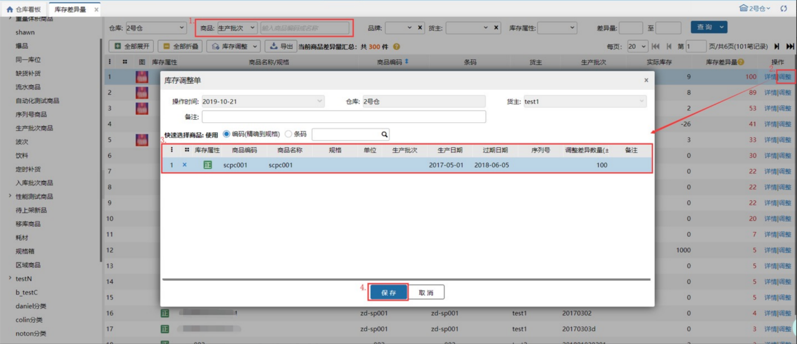

生产批次标准模式下，生产批次商品的差异量落在空批次上，进行库存调整时，需要选择批次后录入数量后调整，操作如下图所示：

**注意：**

1. 库存调整时，批次库存不可调整为负；

2. 生产批次录入页面的商品数量之和要和差异量相等；

3.扫描生产批次号进行录入时，不支持扫描系统中没有库存的批次。                

> 更新: 2023-12-21 17:39:33  

> 原文: <https://hupun.yuque.com/unzko7/lsbfg0/uu7cq54yps95hpgq>

---

### 08.2.4 库存调整

> 原始文件来源：`00-源文件/操作手册/库存/库存预警/库存调整/库存调整.md`

库存调整一般是在盘点时，账列数与实际库存数量有差异的时候就要调账，要把账列数调整成实际库存数；

简单的说，系统里库存和仓库库存对不上了，那么就在万里牛系统里，把库存调整成和仓库实际库存一致。

**提示**

1.库存调整会与erp对接，即wms库存调整有增加或减少多少，erp也会相应的增加或减少；

2.库存调整的商品必须是wms和erp都存在，否则无法保存；

3.库存调整的数量为必填，若某个商品不用调整，则可将该商品行删除；

4.目前库存调整不会精确到区域、库区和库位，故商品的数量增加或减少只是针对库存总量而言。

#### **1.新建调整单**

界面上新增调整单，具体操作如下：

#### 2.导入调整单

当调要调整的商品较多时，可以使用导入调整单进行库存调整；

步骤为：

1）下载导入模板；

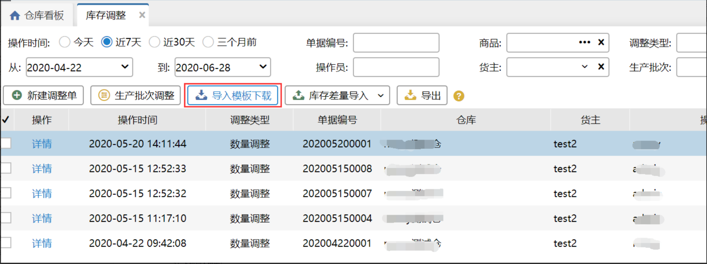

2）若选择库存差异量导入：在导出的模板上填写调整差异数量，实际数量比系统数量多则填写正数，实际数量小于系统数量则填写负数；

     若选择库存总量导入：在导出的模板上填写仓库实际的库存总量；

3）点击页面上的库存差异量导入或库存总量导入，选择文件导入

#### **3.生产批次商品库存调整**

##### **1.严格模式下生产批次商品库存调整**

操作步骤同普通商品，选择好批次后进行调整。

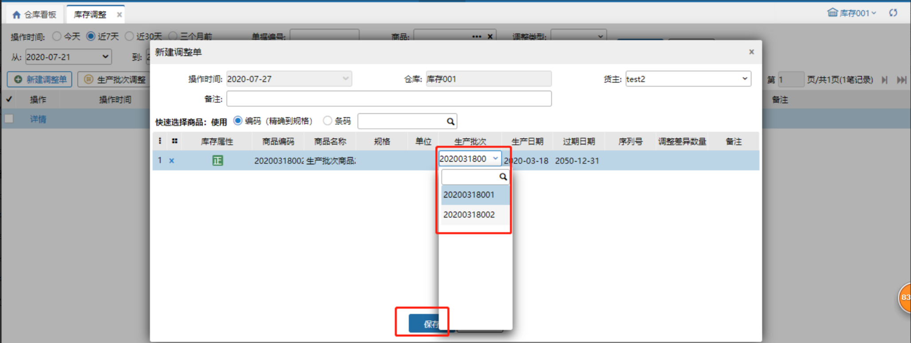

**注意：**

严格模式下生产批次商品库存调整时可以进行批次选择。

##### **2.标准模式下生产批次商品库存调整**

选择生产批次商品后，点击设置按钮，在生产批次录入页面添加生产批次和商品数量，操作如下图所示：

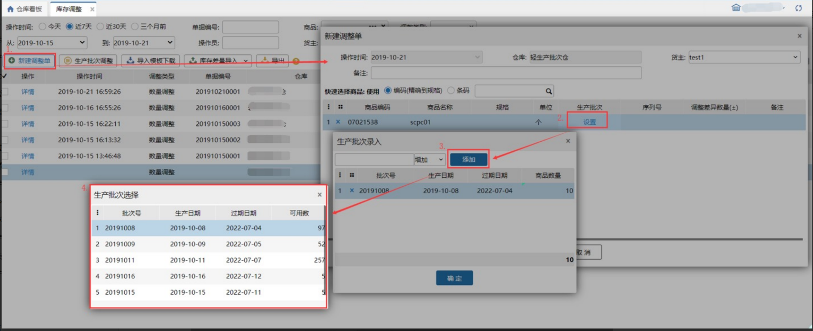

注意：

生产批次商品库存调整时允许新增仓库不存在的批次。

#### **4.生产批次调整**

针对有生产批次的商品，可通过生产批次调整功能更改生产批次号、生产日期、过期日期等，操作顺序如下

1、点击生成批次调整

2、查找需要调整的商品

3、如该商品有多个批次，点击左侧，选择需要更改的批次信息（如下图）

4、右侧盘点结果更改生成日期和到期日期点击确认保存

提示

生产批次调整仅是调整批次下的生产、到期日期信息，不做生产批次号更改

#### **5.次品库存调整**

1. 支持次品进行库存调整，操作步骤同正品库存调整。

2.调整后通知ERP

1）业务配置选择次品库存管理全部对内模式，次品库存调整后通知ERP数量增多或减少；例：商品A的次品库存调整差异数量+5，通知ERP后，ERP中商品A的库存数量+5。

2）业务配置选择次品库存管理全部半对外模式，次品库存调整后不会通知ERP数量变更；例：商品A的次品库存调整差异数量+5，调整单完成后不会通知ERP。    

#### **6.序列号调整 **

序列号简洁模式下支持序列号调整且是全量覆盖的。

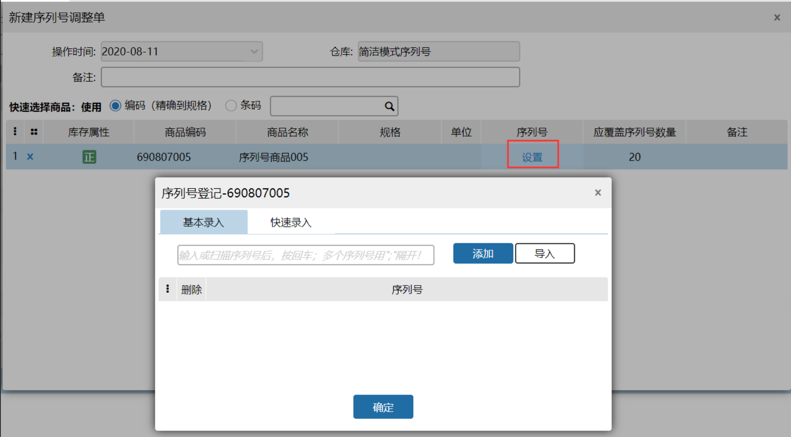

**注：**

①.商品的序列号有锁定是不允许进行调整的。

②.调整后的序列号必须和库存总量数一致。

> 更新: 2023-12-21 17:38:48  

> 原文: <https://hupun.yuque.com/unzko7/lsbfg0/lggv5g6y9lbv62ho>

---

### 08.2.5 货权转移

> 原始文件来源：`00-源文件/操作手册/库存/库存预警/库存调整/货权转移.md`

****货权转移用于转移货品所有权，可一键将货主A的商品转移给货主B，无需操作出入库单据。

**注：该功能仅限于3PL旗舰版用户。**

1.新增货权转移单，选择转入/转出货主(授权本仓库且启用中的货主)：

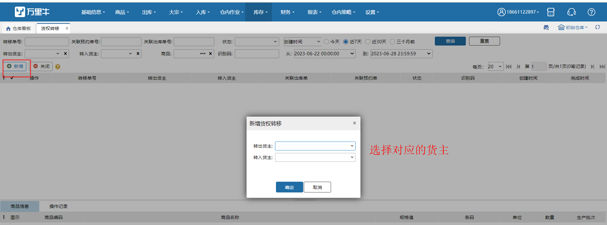2.获取转移单上的唯一识别码：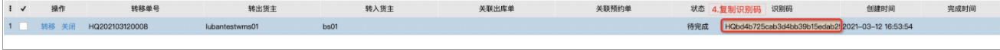

3.在OA/ERP系统中创建入库预约单和出库单，单据备注中包含第2步骤中的识别码，将单据推送到WMS系统

4.点击列表中的“转移”，确认转移单弹窗打开时，系统会自动查找一次符合匹配条件的入库预约单和出库单（单据备注中具有相同识别码且明细数量一致），若匹配到则显示单据信息，点击“确定”即可完成转移；未匹配则显示为空；

也可以手动点击匹配按钮，有匹配结果则显示单据信息，无匹配结果报错提示如下：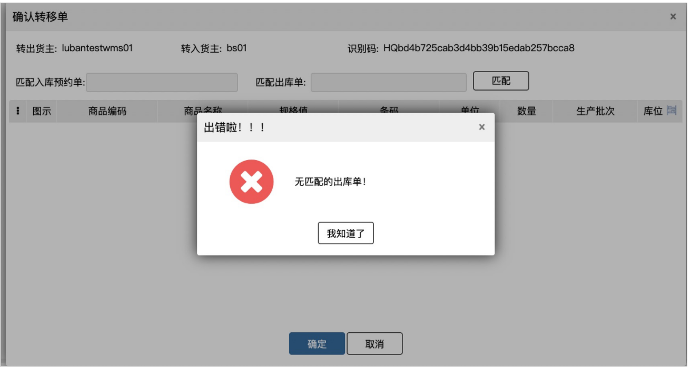5.转移完成后，对应的出入库单据自动完结，指定商品库存从转出货主转移到转入货主下，并可查看相应的流水记录

> 更新: 2023-12-21 17:40:02  

> 原文: <https://hupun.yuque.com/unzko7/lsbfg0/ytuen6srf9pvtgos>

---

### 08.2.6 生产批次预警

> 原始文件来源：`00-源文件/操作手册/库存/库存预警/生产批次预警.md`

适用场景：用户可在该页面查看生产批次商品已经过期和效期过半的库位库存，若设置了预警时长，根据预警时长计算，可以查看临期的库存。

名词解释：超期：当前日期已经过了过期日期。效期过半：保质期过半。临期：当前日期超过了过期日期-预警天数即进入了临期状态。

#### **1. 页面显示**

显示开启了生产批次的商品，根据当前仓库是否开启次品管理开关分别展示；

##### 01.未开启次品管理开关

超期：统计过期的库位库存，点击数字可查看具体库位库存和批次信息。

效期过半：统计保质期过半的库位库存，点击数字查看具体的库位库存和生产批次信息。

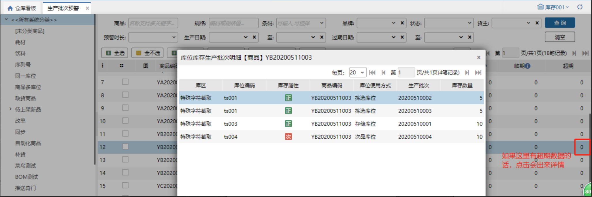

临期：统计过期时间在预警天数内的库位库存，点击数字查看具体的库位库存和生产批次信息。

##### 02.开启次品管理开关

超期：统计过期的库位库存，点击数字可查看具体库位库存和批次信息。

效期过半：统计保质期过半的库位库存，点击数字查看具体的库位库存和生产批次信息。

临期：统计过期时间在预警天数内的库位库存，点击数字查看具体的库位库存和生产批次信息。

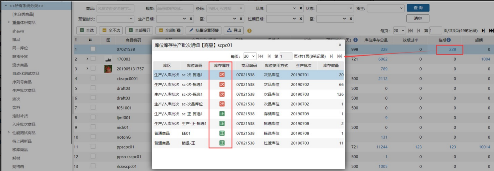

#### **2. 设置预警**

设置预警范围：0-9999且不能超过该商品的保质期。勾选多个设置，部分成功，部分失败，失败的会报错提示失败原因且依旧保持勾选。

#### ** 3.预录入规则**

预录入规则可以根据设置条件为新增批次号商品（包括入库、盘点）自动填充“预警时长”。先按需求新增预录入规则，录入维度包括品牌、系统分类、商品等级等，新增批次时有多个匹配规则时，按照规则优先级（从高到低，1最高）+规则编码（从小到大）匹配：

①.预警时长：指定天数 x 天

    按指定天数填充预警时长，例如：设置指定天数为20天，则匹配到该规则的批次商品预警时长为20天。

②.预警时长：按有效期百分比 x %

    按有效期百分比计算预警时长，例如：设置生产批次商品保质期为30天，按有效期百分比50%计算预警时长，则匹配到该规则的批次商品预警时长为15天。

注：生产批次预警时长优先取预录入规则的，若没有的取商品信息上的预警时长，若再没有则为空。

> 更新: 2026-07-02 13:50:24  

> 原文: <https://hupun.yuque.com/unzko7/lsbfg0/rw43ptw684f8nipm>

---

### 08.2.7 预包预警

> 原始文件来源：`00-源文件/操作手册/库存/库存预警/预包预警.md`

设置预配策略在指定预配库位上的预包商品(组合套数)上下限，当可用预包库存不足时，可以手动或自动创建预包作业。

#### **1.页面显示**

页面默认显示当前仓库中启用的预配策略及相关商品信息，预包上下限默认为空，支持手动设置。

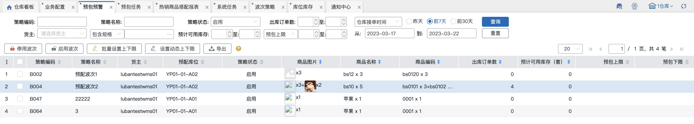

其中：出库订单数按查询条件时间范围统计，表示对应预配策略的订单在指定时间范围内的出库订单数量；

           预计可用库存(套)根据预配库位上可用库存组合数累加计算，如预配波次A中指定规格sku1*3，指定库位YP01、YP02，其中YP01库位上有sku1 10个，YP02库位上有sku1 5个，则预计可用库存(套)=3+1=4个。

#### **2.上下限设置**

##### **01.手动输入**

预包上下限支持手动输入，失焦后即保存生效，预包上限需≥预包下限。

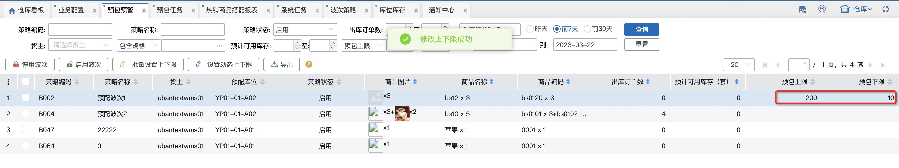

##### **02.批量设置上下限**

勾选需要批量设置的数据后，按需填写上下限，可以只设置上限或下限，若勾选使用当前出库订单数作为上/下限，则手动输入的上下限不生效，预包上/下限=出库订单数：

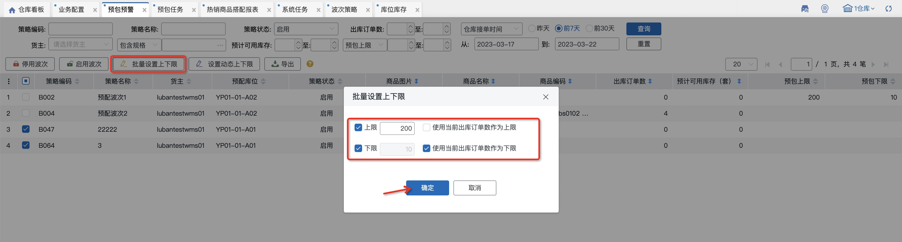

##### **03.设置动态上下限**

勾选需要批量设置的数据后，按需填写上下限，可以只设置上限或下限：

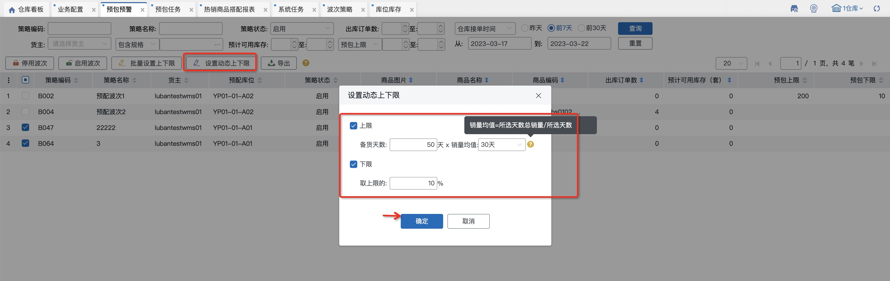

其中：

上限=备货天数*销量均值，销量均值=指定天数内出库订单数量/指定天数，如上图销量均值为30天内的总销量/30，会根据时间动态变化。

下限=上限*指定比例。

#### 3.停用/启用波次

勾选指定波次启/停用后，对应波次策略就被启/停用了：

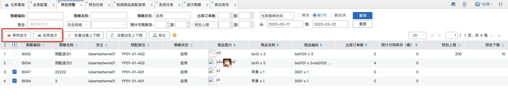

#### 4.导出

列表数据导出后可以在数据中心下载。

> 更新: 2023-12-21 17:37:35  

> 原文: <https://hupun.yuque.com/unzko7/lsbfg0/uzz9ntco9acin5i1>

---

## 08.3. PDA手持端查询与盘点

### 08.3.1 PDA-商品库位

> 原始文件来源：`00-源文件/PDA安卓端/查询/PDA-商品库位.md`

商品库位，用户可扫描输入商品，查看商品的库位库存情况。

点击商品库位按钮，扫描输入条码，即可显示这个商品的所有库位库存数量，如图所示。

提示：

1.点击底部输入框左边的按钮即可切换条码、编码、名称查询商品。

条码：精确匹配，支持辅助条码(多条码)功能，支持条码截取功能;

编码：精确匹配，先匹配商品编码(匹配到会带出所有规格)，再匹配规格编码

名称：模糊匹配

2.若商品无库存，设置了优先库位，扫描输入条码后展示优先库位tab页；

3.若商品无库存、优先库位，有历史库位，扫描输入条码后展示历史库位tab页；

4.若商品无库存、优先库位、历史库位，扫描输入条码后展示库位库存tab也。

点击同款按钮跳转到查询商品同款页面，展示同SPU下的其他sku商品，如图所示：

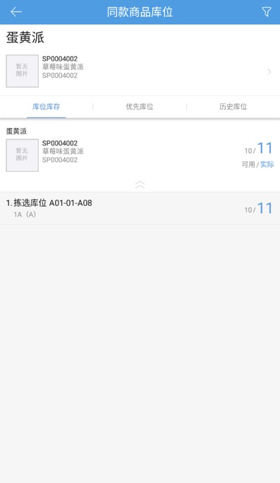

5.点击右上角的筛选按钮，即可选择库位使用方式、所在库区、所属货主、库存形态、库存属性、历史库位，如图所示。

6.设置了筛选项并确定后，操作员再次在同一机器上查询商品库位后，会记忆上一次设置的筛选项。

7.可点击库位蓝色字体后，快捷跳转操作仓内业务。支持通过键盘数字快捷键跳转。

> 更新: 2024-02-05 16:56:37  

> 原文: <https://hupun.yuque.com/unzko7/lsbfg0/rtk6gsfmuqk9rcaw>

---

### 08.3.2 PDA-容器查询

> 原始文件来源：`00-源文件/PDA安卓端/查询/PDA-容器查询.md`

容器查询：查询容器当前的状态和历史操作记录。

1.打开容器查询页面，扫描容器编码。

2.扫描拣货类型的容器编码后，若容器绑定了领取的波次任务，则容器绑定的波次号、绑定时间、绑定的操作员。订单明细页面显示波次中的订单以及对应订单的状态。点击右边的解锁按钮，将会强制解锁容器绑定的波次。

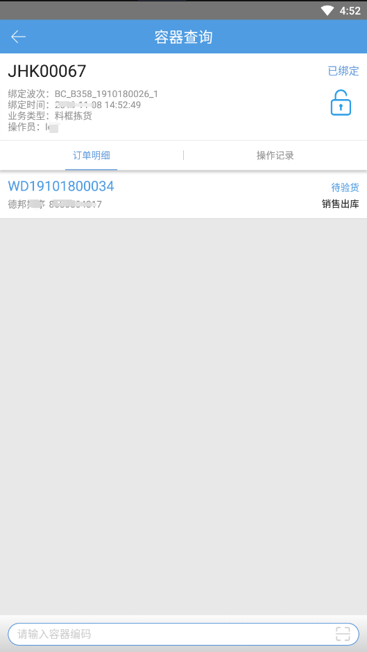

3.点击操作记录，可以查询容器曾经做过的作业。

4.查询存储类型的容器，查看到该容器中的商品信息、实际数量、所属货主、库存属性。

5.查询未使用的容器，直接显示该容器的作业记录和当前状态。

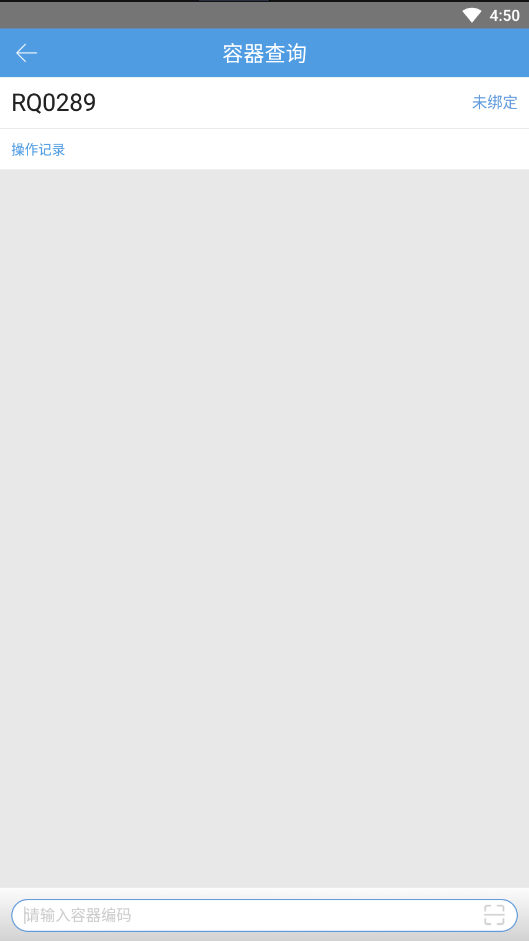

> 更新: 2024-02-02 16:53:41  

> 原文: <https://hupun.yuque.com/unzko7/lsbfg0/ybgq8s8fakmc2gvi>

---

### 08.3.3 PDA-库位库存

> 原始文件来源：`00-源文件/PDA安卓端/查询/PDA-库位库存.md`

库位库存，方便用户了解某个库位上的商品数量/待入库单据商品数量情况。

1.在库位编码输入框输入即可查询。

实际库存

待入库库存

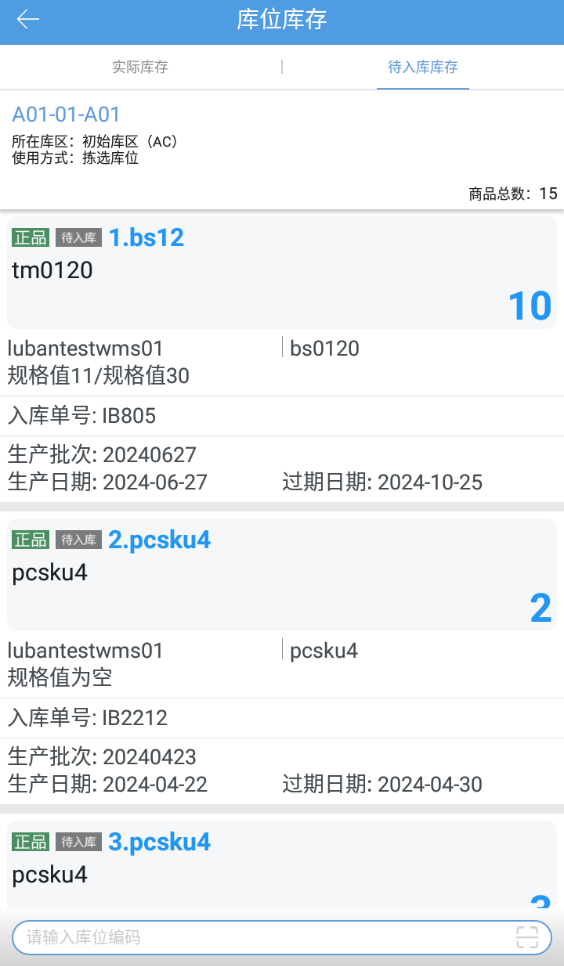

2.可快捷跳转操作仓内业务，支持快捷键跳转。

 

> 更新: 2025-02-20 14:53:23  

> 原文: <https://hupun.yuque.com/unzko7/lsbfg0/rupo05bt17c34p9h>

---

### 08.3.4 PDA-绩效补录

> 原始文件来源：`00-源文件/PDA安卓端/查询/PDA-绩效补录.md`

绩效补录主要用于补录指定环节、指定操作员的工作绩效，并记录到绩效表中。

具体操作：先选择需要补录的环节，扫需要补录的单号或配货单号，若支持补录，会带出订单信息，否则会报错提示，操作员默认是当前登录账号，可手动切换成其他操作员，录入后点击提交即可，对应订单上会更新操作员信息。在绩效报表中可查看到对应数据。

其中：

1.扫描多个订单号后会累加显示到列表中；扫描多个配货单号会覆盖之前的；

2.若订单指定环节已有操作员，则不允许补录该环节操作员；

3.若订单在验货环节拦截挂起了，可补录之前环节的绩效，不支持补录验货环节的绩效。

4.已补录笔数显示的是当前选中环节已补录的订单数，与操作员无关，可手动置零。

> 更新: 2024-03-19 14:32:28  

> 原文: <https://hupun.yuque.com/unzko7/lsbfg0/iq7t80cicob0h6id>

---

### 08.3.5 PDA-订单库位

> 原始文件来源：`00-源文件/PDA安卓端/查询/PDA-订单库位.md`

订单库位可根据订单号或者运单号来查询当前订单商品锁定库位列表

1.点击订单库位按钮，输入订单号或者运单号。

2.界面显示当前订单商品库位锁定情况以及订单流转环节。

提示：已出库订单仅显示商品数量不显示历史库位信息。

> 更新: 2024-02-02 16:47:33  

> 原文: <https://hupun.yuque.com/unzko7/lsbfg0/ym1sgg8g61bfn8qn>

---

### 08.3.6 PDA-订单查询

> 原始文件来源：`00-源文件/PDA安卓端/查询/PDA-订单查询.md`

订单查询可供查询订单信息、状态及操作记录。

1.输入系统单号或运单号显示当前订单信息。

2.点击操作记录可显示当前订单操作日志。

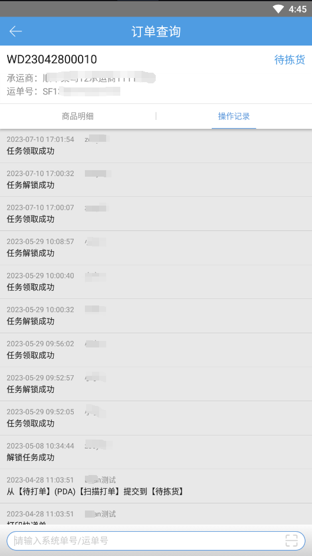

> 更新: 2024-02-02 16:46:20  

> 原文: <https://hupun.yuque.com/unzko7/lsbfg0/tztsis4cgx3ytzab>

---

### 08.3.7 PDA-货箱查询

> 原始文件来源：`00-源文件/PDA安卓端/查询/PDA-货箱查询.md`

1.货箱查询是便于查询当前货箱内商品装箱明细

2.点击货箱查询按钮，输入或扫描箱号，当前界面显示货箱锁在库位以及箱内商品明细

3.支持唯一箱的拆箱，输入或扫描唯一箱的箱号，点击页面上的右上角的作废按钮，确认作废后唯一箱拆箱成功

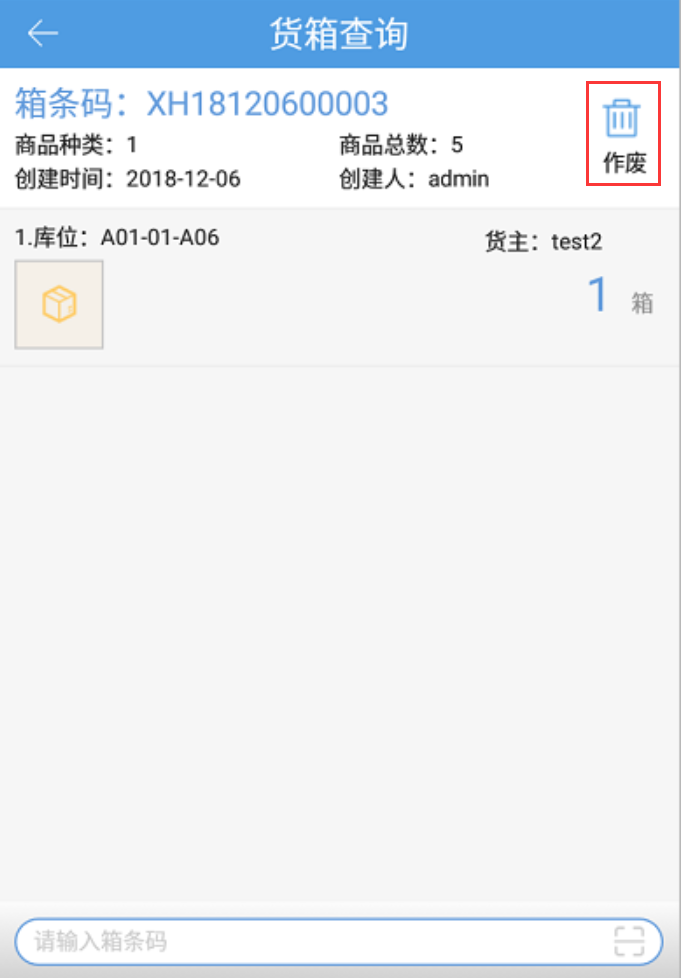

> 更新: 2023-12-21 09:28:19  

> 原文: <https://hupun.yuque.com/unzko7/lsbfg0/ligfqwxr6qitiww4>

---
