# 09. 特殊作业与即时零售

> 资料来源：基于 `00-源文件/` 对应模块的原始操作手册、专题功能与PDA文档重组迁移。
> 事实边界：正文仅重组迁移原始文档；章节编号、目录和来源标记为整理信息，不新增业务规则、字段或流程。

## 本章知识目录

- **09.1 电商特殊出库模式（爆款、售后直发、A+N）**
  - [WMS-A+N波次](#0911-WMS-AN波次)
  - [WMS-单品订单自由出库](#0912-WMS-单品订单自由出库)
  - [WMS-售后入库快速发货](#0913-WMS-售后入库快速发货)
  - [WMS-待分配-爆款订单](#0914-WMS-待分配-爆款订单)
- **09.2 即时零售与同城配业务**
  - [WMS-即时零售城配业务](#0921-WMS-即时零售城配业务)
- **09.3 唯品会VIP业务模式**
  - [WMS-唯品会JIT与JITX专题](#0931-WMS-唯品会JIT与JITX专题)
  - [WMS-唯品会MP专题](#0932-WMS-唯品会MP专题)

---

## 09.1. 电商特殊出库模式（爆款、售后直发、A+N）

### 09.1.1 WMS-A+N波次

> 原始文件来源：`00-源文件/专题功能介绍/特殊作业方式/WMS-A+N波次.md`

WMS专题功能-A+N波次

场景：鞋服类目，爆品商品搭配单品售卖这批订单可以生成一个A+N波次，爆品商品作为固定项A项，单品作为N项。在播种验货时，A项免播，只需播种N项即可，大大提升播种效率。

A+N解释说明:

A项可以是1种或多种商品，针对单个波次A项要完全一致（同品），A项业务作业为固定平均分配对象；

N项作为搭配项只能有一件商品，针对单订单N项是数量为1且种类为1，针对单个波次N项种类不定，N项业务作业为播种的对象。

作业环节介绍：

这种类型的订单如何设定波次？

新增【[A+N波次策略](https://hupun-service.cus.dingtalk.com/page/knowledge?pageId=6&category=1003118845&knowledge=1014140394&language=zh)】，优先级默认是1级，自动波次不支持生成A+N波次，需要手动截单生成A+N波次。

订单怎么生成A+N波次？

【[待分配页面](https://hupun-service.cus.dingtalk.com/page/knowledge?pageId=6&category=1003118852&knowledge=1007286545&language=zh)】，手动截单页面增加按订单分组，左侧列表显示A+N波次和同品波次策略，右侧显示符合对应策略的订单分组，勾选分组后点击生成波次，每次只对一个策略生成波次

A+N波次的订单拣货完成后，怎么验货？

暂时仅支持电脑端【[播种验货](https://hupun-service.cus.dingtalk.com/page/knowledge?pageId=6&category=1003118852&knowledge=1007286541&language=zh)】，后期会陆续支持其他的验货方式。播种验货页面扫描配货单号后带出A项内容，A项免扫系统会自动填充播种框中A项商品数量，直接扫描N项进行分拣订单。

WMS专题功能-A+N波次

场景：鞋服类目，爆品商品搭配单品售卖这批订单可以生成一个A+N波次，爆品商品作为固定项A项，单品作为N项。在播种验货时，A项免播，只需播种N项即可，大大提升播种效率。

A+N解释说明:

A项可以是1种或多种商品，针对单个波次A项要完全一致（同品），A项业务作业为固定平均分配对象；

N项作为搭配项只能有一件商品，针对单订单N项是数量为1且种类为1，针对单个波次N项种类不定，N项业务作业为播种的对象。

作业环节介绍：

这种类型的订单如何设定波次？

新增【[A+N波次策略](https://hupun-service.cus.dingtalk.com/page/knowledge?pageId=6&category=1003118845&knowledge=1014140394&language=zh)】，优先级默认是1级，自动波次不支持生成A+N波次，需要手动截单生成A+N波次。

订单怎么生成A+N波次？

【[待分配页面](https://hupun-service.cus.dingtalk.com/page/knowledge?pageId=6&category=1003118852&knowledge=1007286545&language=zh)】，手动截单页面增加按订单分组，左侧列表显示A+N波次和同品波次策略，右侧显示符合对应策略的订单分组，勾选分组后点击生成波次，每次只对一个策略生成波次

A+N波次的订单拣货完成后，怎么验货？

暂时仅支持电脑端【[播种验货](https://hupun-service.cus.dingtalk.com/page/knowledge?pageId=6&category=1003118852&knowledge=1007286541&language=zh)】，后期会陆续支持其他的验货方式。播种验货页面扫描配货单号后带出A项内容，A项免扫系统会自动填充播种框中A项商品数量，直接扫描N项进行分拣订单。

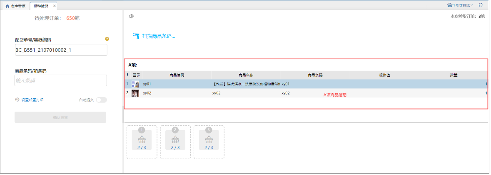

WMS专题功能-A+N波次

场景：鞋服类目，爆品商品搭配单品售卖这批订单可以生成一个A+N波次，爆品商品作为固定项A项，单品作为N项。在播种验货时，A项免播，只需播种N项即可，大大提升播种效率。

A+N解释说明:

A项可以是1种或多种商品，针对单个波次A项要完全一致（同品），A项业务作业为固定平均分配对象；

N项作为搭配项只能有一件商品，针对单订单N项是数量为1且种类为1，针对单个波次N项种类不定，N项业务作业为播种的对象。

作业环节介绍：

这种类型的订单如何设定波次？

新增【[A+N波次策略](https://hupun-service.cus.dingtalk.com/page/knowledge?pageId=6&category=1003118845&knowledge=1014140394&language=zh)】，优先级默认是1级，自动波次不支持生成A+N波次，需要手动截单生成A+N波次。

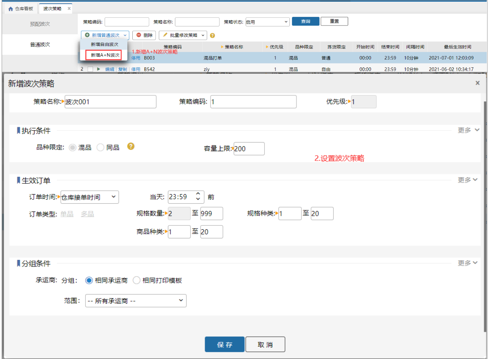

订单怎么生成A+N波次？

【[待分配页面](https://hupun-service.cus.dingtalk.com/page/knowledge?pageId=6&category=1003118852&knowledge=1007286545&language=zh)】，手动截单页面增加按订单分组，左侧列表显示A+N波次和同品波次策略，右侧显示符合对应策略的订单分组，勾选分组后点击生成波次，每次只对一个策略生成波次

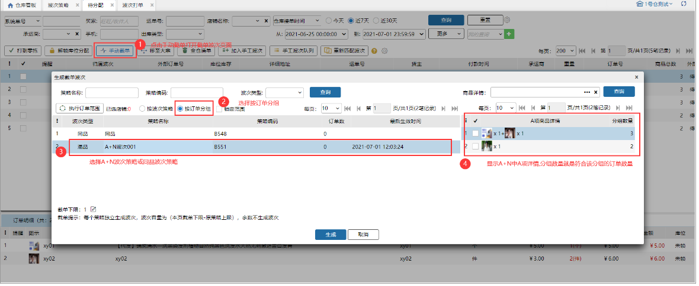

A+N波次的订单拣货完成后，怎么验货？

暂时仅支持电脑端【[播种验货](https://hupun-service.cus.dingtalk.com/page/knowledge?pageId=6&category=1003118852&knowledge=1007286541&language=zh)】，后期会陆续支持其他的验货方式。播种验货页面扫描配货单号后带出A项内容，A项免扫系统会自动填充播种框中A项商品数量，直接扫描N项进行分拣订单。

> 更新: 2023-12-21 10:51:09  

> 原文: <https://hupun.yuque.com/unzko7/lsbfg0/ofdxzoao6i0c9gdt>

---

### 09.1.2 WMS-单品订单自由出库

> 原始文件来源：`00-源文件/专题功能介绍/特殊作业方式/WMS-单品订单自由出库.md`

场景：日常业务中，针对一种一件的商品，特别是某些行业类目（订单比例可大于60-70%），希望有比目前系统更加相对便捷简单的拣货、验货方式，抛开波次的束缚可以在验货的时候直接扫描商品条码，系统自由匹配订单后置打印出快递单。

作业环节介绍：

这种类型的订单如何设定波次？

新增【[自由波次策略](https://hupun.yuque.com/unzko7/plvu1m/vmipnr)】。波次策略默认是混品和默认都是一种一件。

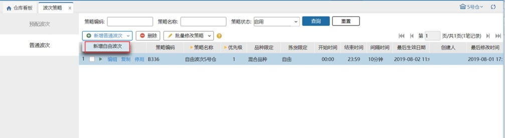

生成了自由波次的订单如何进行拣货？

自由波次生成后，操作员可以通过PDA上【[自由领单](https://hupun.yuque.com/unzko7/plvu1m/xxlkh3)】领取任务进行拣货。

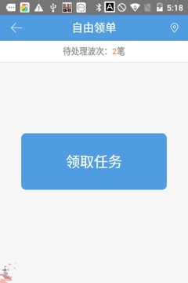

通过PDA自由领单完成拣货任务，这样状态的订单就可以进入验货后置打单的环节了

如何对这些订单验货？

通过PC上【[自由验货](https://hupun.yuque.com/unzko7/plvu1m/pdrg0n)】，直接扫描商品匹配订单进行快速验货。

我们推荐在自由验货中配置后置打印，这样就可以扫一个商品打一张面单。

> 更新: 2023-12-21 10:47:43  

> 原文: <https://hupun.yuque.com/unzko7/lsbfg0/bc2f0bpfyr6fv1kf>

---

### 09.1.3 WMS-售后入库快速发货

> 原始文件来源：`00-源文件/专题功能介绍/特殊作业方式/WMS-售后入库快速发货.md`

#### 背景

系统已发货实际快递还未取走的退款关闭订单/快递拦截回来的订单/原单退回的订单，或是售后回来无需做二次包装维护的货品，入库后，目前需要拆包上架。每笔订单都需要拆包上架并浪费包材，流程重复，浪费仓库人力。

#### 功能效果

通过识别入库的商品，自动搜集系统中代发订单，将其快速提取打印，进行发货。从而省去了在仓库周转的过程

#### 操作方式

开启换单发货配置

可根据实际业务情况选择可换出发货的订单条件

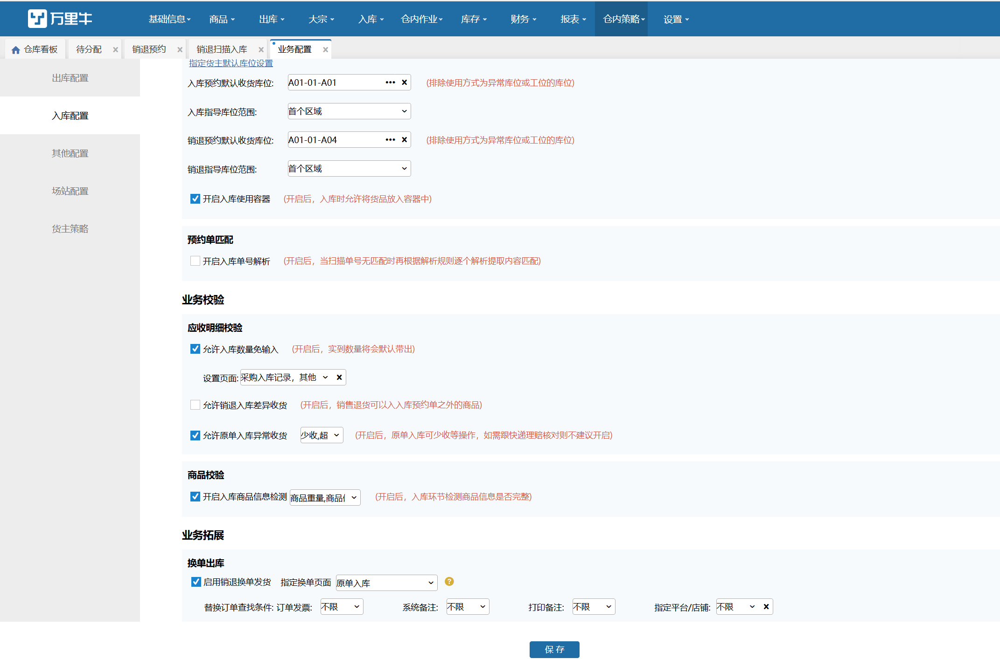

在相应的页面进行入库后如果待分配及前置环节有未发货的订单则会自动触发换单

1.提交入库成功后，页面会根据存量订单自行匹配，匹配到后则会立即弹出换单弹窗，

2.操作员可在此出进行申请运单号，打印面单等操作，

3.操作完成后提交发货，发货成功意味着换单完成。

> 更新: 2025-02-14 09:21:11  

> 原文: <https://hupun.yuque.com/unzko7/lsbfg0/gege07h6tgmzbrms>

---

### 09.1.4 WMS-待分配-爆款订单

> 原始文件来源：`00-源文件/专题功能介绍/特殊作业方式/WMS-待分配-爆款订单.md`

#### 背景

直播、爆款等业务叠加快递价格及重量区间不断压缩，越来越多的商家在走爆款模式。同样也有越来越多的小商家委托三方云仓进行发货。致使云仓订单结构更多的侧重于爆品、单品结构。复杂订单出现的占比持续降低 

#### 释义

爆款订单：若干订单中单品或商品组合数量均完全一致

#### 功能简介

通过对订单池的分析，将相同结构的订单按用户需要的维度进行组合展示，做到选择即生成，所见即所得的效果。

#### 操作介绍

##### 页面

##### 页面元素

订单类型：针对当前查询结果中，按结构展示相应的订单数

缺货汇总：针对当前订单所需分配商品计算出的总缺货情况

点击可见缺货列表

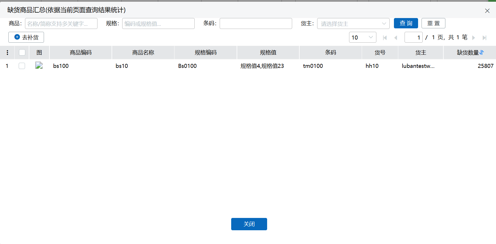

条件查询：订单池的查询条件

操作栏：操作栏

分组设置：针对相同的订单按什么样的粒度去分组，可以多选

分组列表：根据分组设置计算出的列表

生成条件：波次生成条件设置，可以预设一些方案

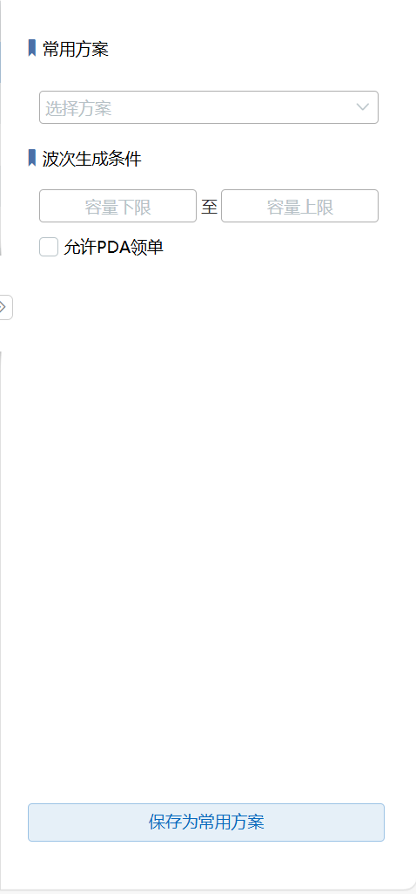

##### 生成波次方式

目前生成波次的方式有两种

1.针对单个分组去生成，即生成出的都是同品波次

操作上可在单个分组详情上点击生成，也可以选择多个分组点击操作栏生成波次按钮

2.选择多个分组合并生成，即类似一筐同品波次

勾选多个分组后点击操作栏的合并生成按钮

##### 预算缺货

生成波次时常会出现订单缺货从而影响波次生成质量，导致部分订单不能跟随同品波次一起生成。

缺货预算即解决这个问题

可以指定你即将要生成的分组来预计算是否缺货

也可以勾选多个分组来计算

计算时是取当前可用库存逐一计算订单，得出不足数量的订单和缺货的商品

##### 跳转补货

当我们获知缺货商品时我们可以通过点击来快速的进行补货点击

点击预算缺货后的缺货商品数

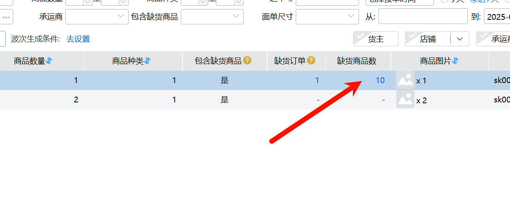

或者勾选缺货汇总中的商品点击去补货

都会把当前涉及的商品带出并弹出补货窗口。直接点击确认即可

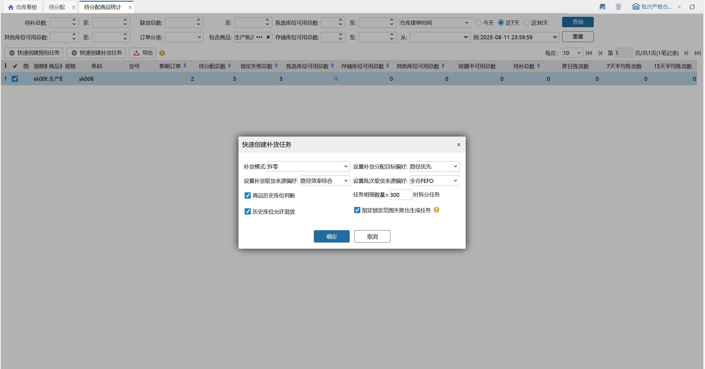

未尽事宜也可以参看页面介绍 -[爆款订单](https://hupun.yuque.com/unzko7/lsbfg0/ow8unkls4z7dpqys#ksHxC)

> 更新: 2025-08-12 11:44:44  

> 原文: <https://hupun.yuque.com/unzko7/lsbfg0/dno1hyoncvzf7uvh>

---

## 09.2. 即时零售与同城配业务

### 09.2.1 WMS-即时零售城配业务

> 原始文件来源：`00-源文件/专题功能介绍/即时零售/WMS-即时零售城配业务.md`

#### 场景介绍

近期各大电商/直播/外卖及本地生活平台，纷纷推行了支持区域城配的即时零售业务，其业务主要侧重为以仓/门店为中心覆盖同城部分业务，缩短配送时效提升购物体验

#### 业务特点

> 区别于传统车队城配，此类同城配送主要的运输方式分两种
>

**骑手配送：**闪送/骑手，小时达。常见于门店场景，覆盖周边区域3-5KM以内，时效一般会在一小时内完成

**快递运输：**快递小哥配送，隔日达**。**通过快递运输网络对同城(通常是市)直接转运配送，通常为当天或次日上午送达，整体时效在24小时内

#### WMS业务侧重

| **** | **发货仓规模** | **仓地理位置** | **发货方式** | **送达时效** | **拣货时效** | **即时零售中业务定位** |
| --- | --- | --- | --- | --- | --- | --- |
| **WMS客群场景** | 较大仓库 | 偏远城区/物流园区 | 快递 | 隔日达 | 4H内(接近JIT) | 补充货盘/降低成本 |
| **零售客群场景** | 门店/店仓 | 靠近用户/市中心城区 | 骑手 | 小时达 | 10Min内 | 极致时效体验 |

#### 目前支持的平台

| **平台名称** | **业务类型** | **业务范围** | **单据识别方式** |
| :---: | :---: | :---: | --- |
| 淘宝 | [淘宝闪购业务](https://hupun.yuque.com/unzko7/lsbfg0/gkfrbq5qtzgz543e)  | 不限类目，同城业务 | 匹配到线上物流为淘宝闪购平台配 |
| 京东 | [京东全渠道京配](https://hupun.yuque.com/unzko7/lsbfg0/vf3z5qrakahh5nrv) | 不限类目，同城业务 | 当sourcePlatformCode 订单来源编码为JD，request—>deliveryOrder—>extendProps—>delivery_mode，delivery_mode值为12，识别此订单为全渠道京配订单。 |
| 美团 | [美团医药健康](https://hupun.yuque.com/unzko7/lsbfg0/qotgn2438gr4pvdz)  |  仅医药业务 | 当sourcePlatformCode 订单来源编码为MTYYJK=美团医药健康 |

> 更新: 2025-09-16 15:57:54  

> 原文: <https://hupun.yuque.com/unzko7/lsbfg0/tptwk81es0xu7ulh>

---

## 09.3. 唯品会VIP业务模式

### 09.3.1 WMS-唯品会JIT与JITX专题

> 原始文件来源：`00-源文件/专题功能介绍/唯品会VIP业务/WMS-唯品会JIT与JITX专题.md`

#### 一、JIT业务

##### 1.1业务简介

JIT业务为唯品会为解决纯入仓给商家带来库存压力的一种业务模式，即买家下单后商家在一定时间内需将档期内的销售商品发货至唯品会仓，由唯品会仓将货品打包给买家.

针对WMS来说，唯品会JIT订单也仅是多样化订单中的一种，并未过于特别的地方，只要上游ERP可正常推送创建订单即可

##### 1.2发货方式介绍

唯品会JIT单据由于发货时效较高，且箱体上需粘贴指定格式的箱唛，故可根据当日单量大小选择不同功能进行操作

1.2.1小单量拣货

此种订单多发于档期运营后期，此时单量较小，可以走组波次--批量拣货--播种验货，或者组波次--边拣边播的的操作方式

波次生成技巧：波次策略选择指定店铺，可把不同唯品仓的JIT订单一并拣货然后做分拣

策略设置如下:

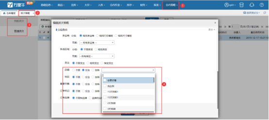 

生成后PDA操作功能示意

1扫描工作台领取任务并打印快递单

 

2.选择边拣边播模式

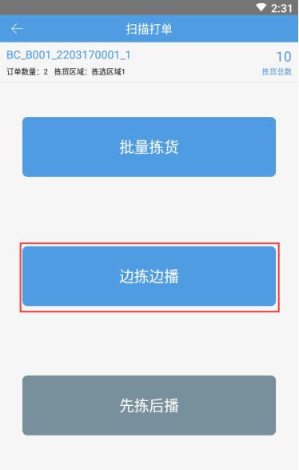 

3.根据播种框分布设置播种车

 

4. 扫描库位进行拣货

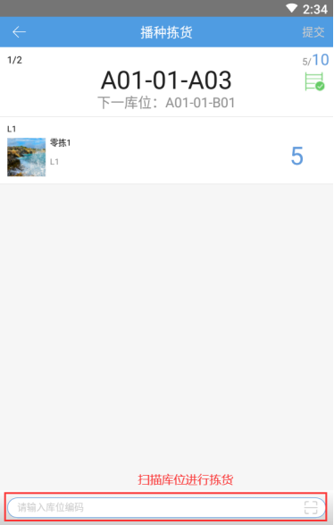 

5.拣货完成后进行播种

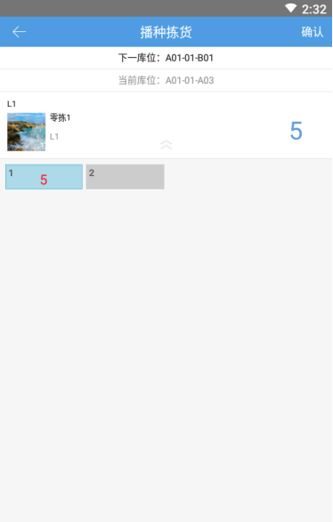 

1.2.2小单量订单装箱打箱唛

可在拆包补打页面切换子母件装箱页面进行装箱，设置后置打印箱唛

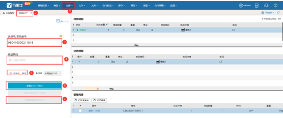 

装箱过程补打箱唛

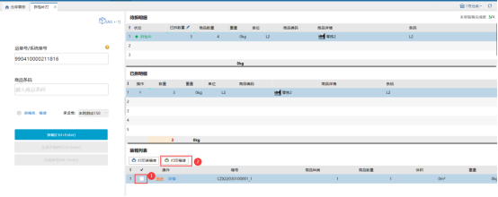 

订单查询补打箱唛

 

1.2.3快递单号获取

系统支持直接在波次打单页面获取跨越电子面单/顺丰电子面单

跨越电子面单开通方式

 

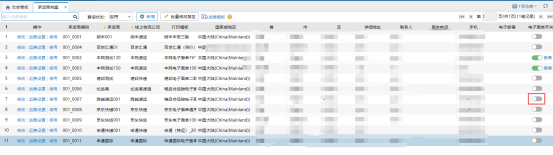 

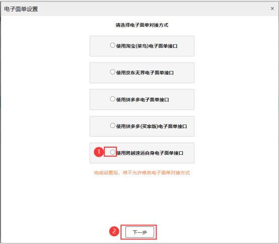 

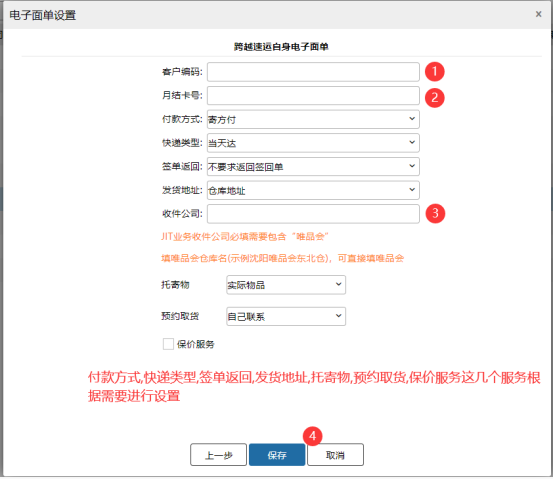 

也可在手动填写单号

唯品专配特别提醒：使用唯品专配入仓的，需ERP推送唯品专配承运商，唯品专配的无需生成快递单号，单号由ERP从平台获取提供

1.2.4打包称重出库

同普通订单一样装箱后称重出库即可

##### 1.3大单量出库

1.3.1订单策略

由于大单量业务的特点，我们建议使用大宗订单作业链路，通过设定指定店铺及商品数量属性设定策略

 

1.3.2拆分作业

订单商品数量较多时我们推荐使用拆分拣货的的方式作业

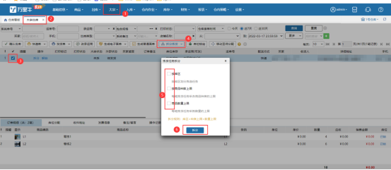 

1.3.3装箱

拣货完成后可通过大宗装箱页面进行装箱，后置打印箱唛

 

1.3.4

确认出库较普通订单会跟便捷，直接点击出库即可

 

#### 二、JITX业务

##### 2.1业务简介

在JIT模式下通常买家收到货会比平时长约24H,为了提高买家的收货时效，减少供应商的重复操作、降低供应商的发货成本，现唯品会JIT发货模式新增JITX发货模式，JITX发货模式主要是针对买家收货地址属于供应商仓库覆盖范围之内，故唯品会将此类订单筛选出来，就近在供应商的仓库给唯品会员（买家）发货，从而提高会员的满意度，同时我们为方便商家操作，提高商家的发货效率故我们系统对该业务做了相应对接，方便供应商在系统中完成操作，无需切换VC后台，减少工作量。

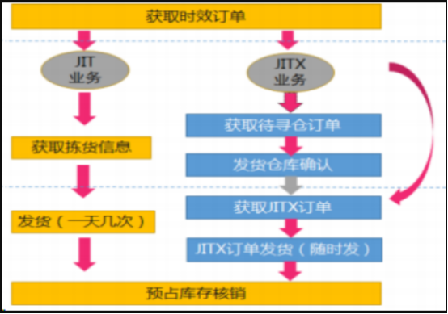 

##### 2.2订单特性

①JITX订单为全脱敏订单，商家无法解密

②JITX订单需要通过唯品会平台获取单号，且承运商不可改

③打印模板只能使用唯品会JITX专用模板

##### 2.3出库作业

JITX订单同其他平台正常销售订单一样，生成波次后批量操作出库

##### 2.4获取电子面单

2.4.1店铺授权

点击店铺授权，填写供应商ID（JITX&JIT模式下，商家的店铺ID在唯品会中称之为供应商ID）

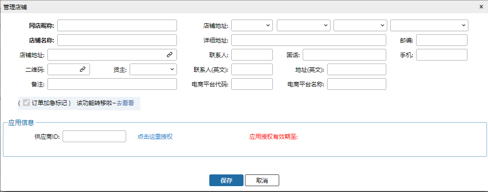

2.4.2开通电子面单

选择对应的线上快递后，在开启电子面单入口选择唯品会电子面单，点击开启即可

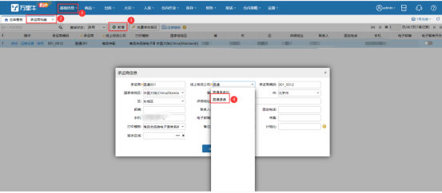 

 

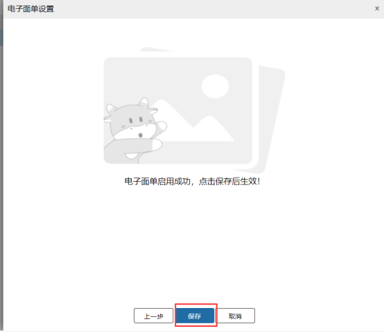 

2.4.3配置模板

开通电子面单后，承运商模板需选择唯品会JITX模板

 

> 更新: 2026-02-28 13:56:53  

> 原文: <https://hupun.yuque.com/unzko7/lsbfg0/thkcasp1g601mkww>

---

### 09.3.2 WMS-唯品会MP专题

> 原始文件来源：`00-源文件/专题功能介绍/唯品会VIP业务/WMS-唯品会MP专题.md`

近日唯品会MP启动了收件人信息脱敏，并禁止解密。必须使用唯品会MP电子面单才可以打单发货。以下将讲述具体操作步骤

#### 一、商家准备

1.根据平台要求，使用第三方系统的商家需要签署相关协议

平台指导公告链接如下：

[https://edu.vip.com/?p=12529&_ppp=634dd2472c](https://edu.vip.com/?p=12529&_ppp=634dd2472c)

2.开通电子面单

请商家根据自身发货需要在店铺后台订购相关快递服务

2.1商家后台开通电子面单

①登录 唯品会MP商家后台->物流管理->电子面单服务->选择对应快递服务商申请合作

②输入必填内容（直营型物流公司电子面单需填写客户月结编号；加盟型物流公司需根据发货地区选择对应的物流网点），点击【保存】即可，需要通知合作的快递网点进行审核操作

③加盟型快递需要充值单量

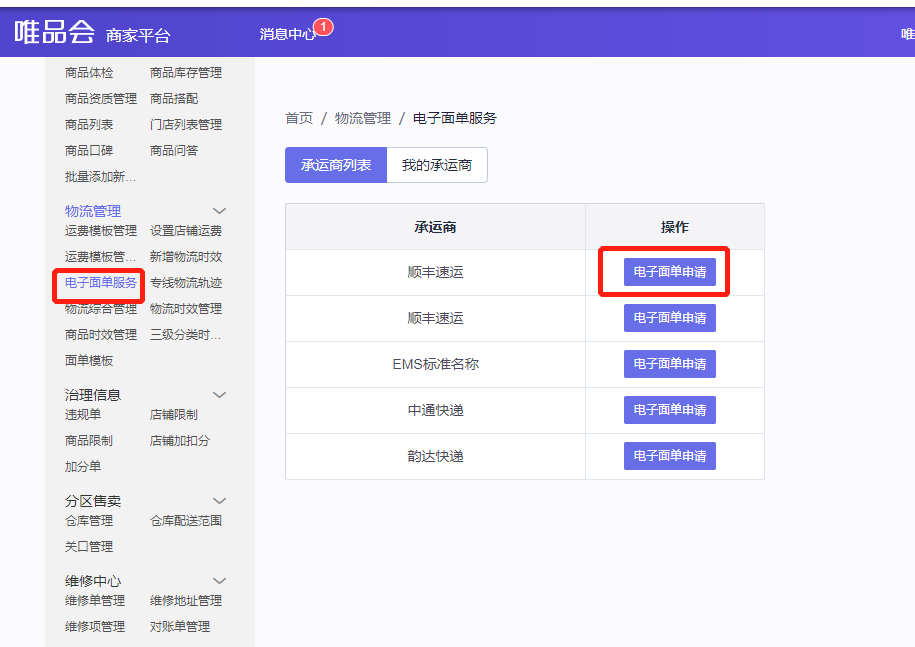

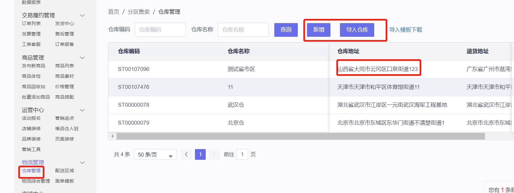

注意：每个店铺只能用自己的快递，唯品会目前不支持跨店铺使用

3.店铺后台配置快递单模板

根据唯品会提供的方案，商家需要在店铺后台配置快递单的打印模板，建议使用较为稳定的一联单 尺寸为 76*130

官方操作指南如下

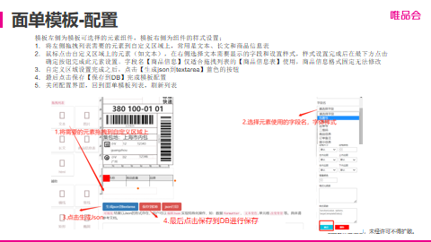

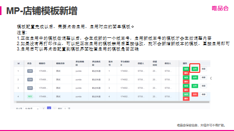

4.店铺模板中扩展信息与系统模板的字段对应

扩展信息1：打印批次号

扩展信息2：波次打印序号

其余陆续增加中……

#### 二、店铺授权准备

1.新增店铺授权

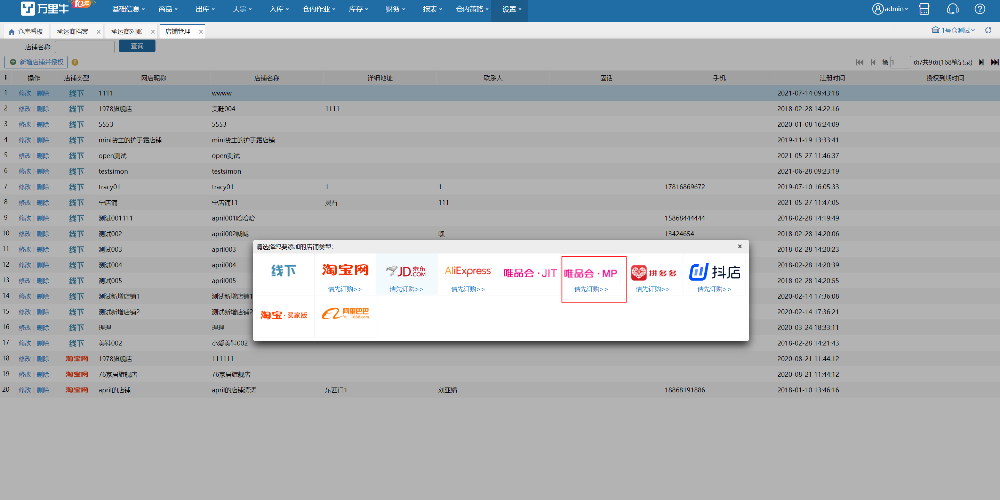

2.已有店铺授权

特别说明

2.1前期由于标准接口无法区分MP店铺类型，故使用万里牛ERP的商家自近日起看到的将是一个无店铺标记的店铺，可在修改中授权

点击修改

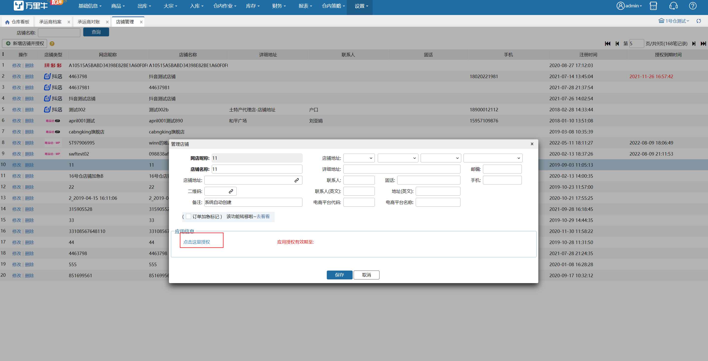

选择MP店铺授权

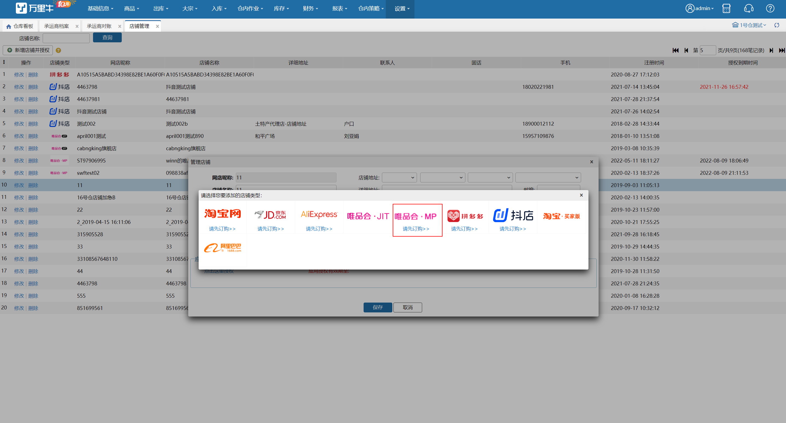

2.2使用其他ERP的需要让友商ERP按照标准接口的定义推送MP店铺，附图如下：

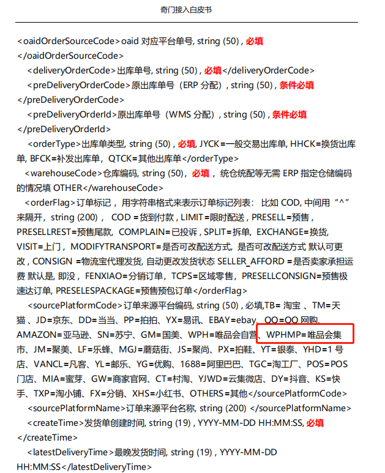

正常推送后可进行店铺授权，方式同2.1

请注意，店铺信息中【网店昵称】必须填写正确，否则申请电子面单就会出错!

样例：

#### 三、系统电子面单开通

1.承运商新增唯品会电子面单

新增承运商并开启电子面单

2.开启电子面单

配置店铺、网点以及相应的快递服务

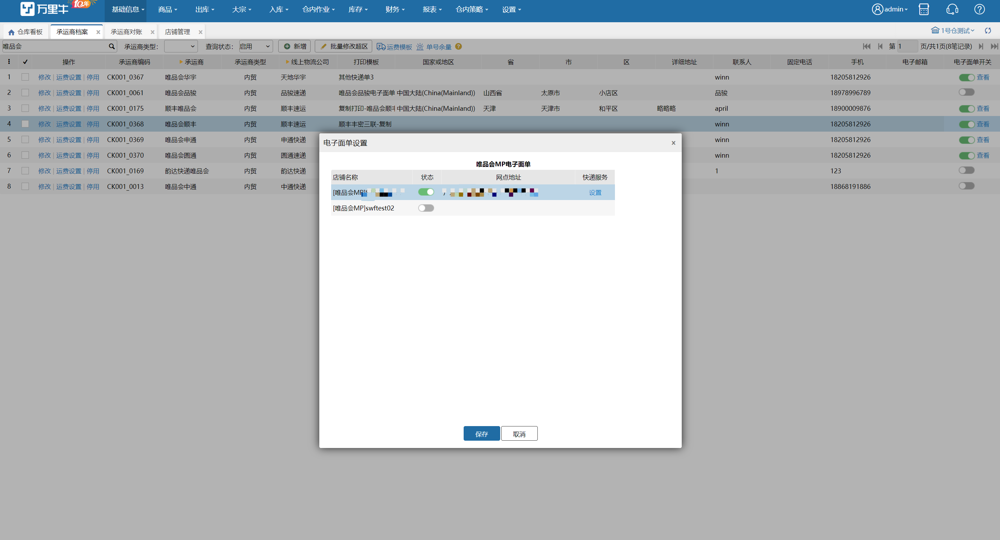

3.打印模板选择

请选择唯品会MP一联单

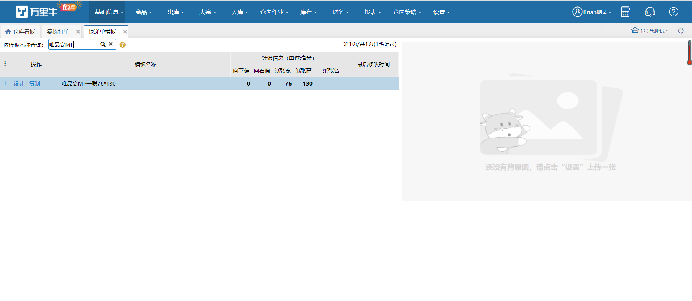

此处特殊说明

由于面单模板在唯品会店铺后台配置，WMS暂不支持自定义模板设定

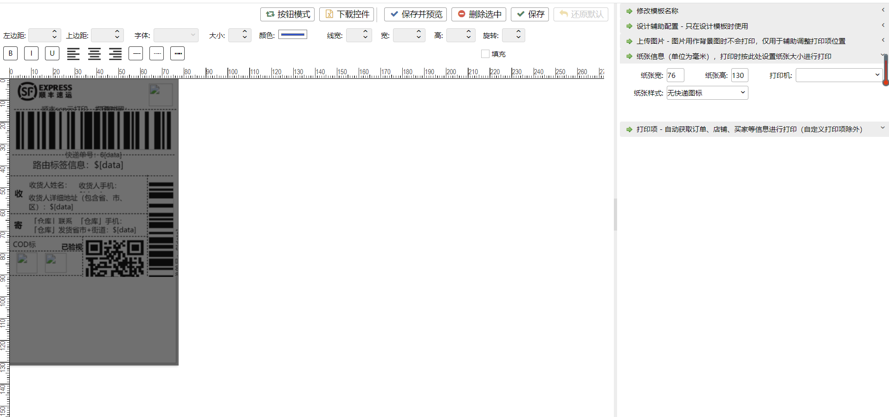

#### 四、唯品会MP打印组件下载

建议打单电脑设置为开机启动

[https://pan.corp.vipshop.com/os/share.html?pc=cwdxvk](https://pan.corp.vipshop.com/os/share.html?pc=cwdxvk)

下载密码：BP98xn

打印组件设置打印机

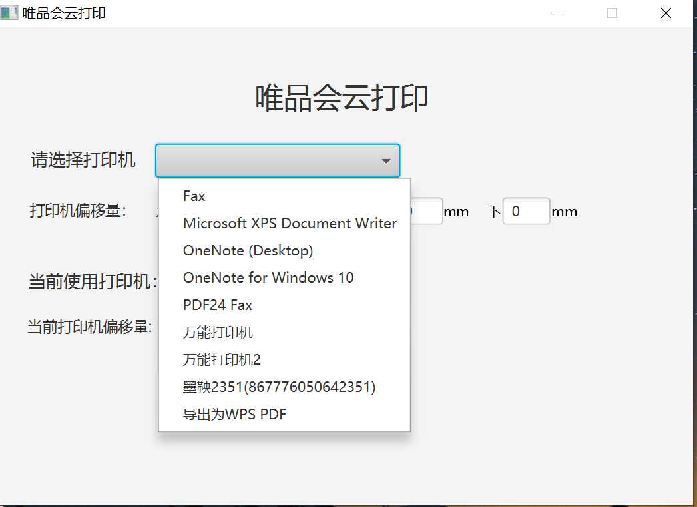

特别说明唯品会MP支持同其他平台面单混合打印！！！！

人肉实操店铺授权和模板编辑步骤：[https://hupun.kf5.com/hc/kb/article/1588586/](https://hupun.kf5.com/hc/kb/article/1562040/)

#### 商家常见问题一览

| 序号 | 操作节点 | 商家常见问题Q | 解答A |
| --- | --- | --- | --- |
| 1 | 添加仓库 | 新增仓库出现报错“新增仓库失败，需要输入store ID”，怎么办？ | 请先清除电脑缓存（ctrl+H）,重新登陆操作尝试。 |
| 2 | 添加仓库 | 系统只能添加5个仓库，如果有超过5个仓库地址要添加，怎么办？ | 目前系统仅支持添加5个仓库，如果仓库超过5个，需要联系商务增加仓库。 |
| 3 | 添加仓库 | 同一个店铺， 同一个网点，可以用不同的地址申请两次面单吗？ | 支持。 |
| 4 | 添加仓库 | 仓库管理的地址必须跟电子面单的发货地址一样嘛？ | 是的 |
| 5 | 面单申请 | 同一个店铺， 同一个网点，可以用不同的仓库地址申请两次面单吗？ | 支持的。 |
| 6 | 面单申请 | 承运商列表中，没有“德邦”选项，要如何申请？ | 德邦快递之前还有问题待处理，平台暂时把申请入口关闭了。等后续调试好后会重新开放，请你耐心等待即可，相关部门已经在尽快完成；同时也建议您选择多个承运商合作。 |
| 7 | 面单申请 | "承运商列表"中没有商家的合作网点怎么办？是否可以新增？比如丰网快递。 | 不支持新增，只能从列表选择；建议商家可以与多个快递合作。 |
| 8 | 面单申请 | 商家是ERP将数据传输给WMS，再由仓库发货，这种场景下：面单申请，是需要填写仓库对接账号吗？ | 是的。 |
| 9 | 面单申请 | 申请承运商面单时，出现报错： request detail.linkman Tel不能为空，要怎么处理？ | 报错提示说明仓库联系人没有填写，需要补全。 |
| 10 | 面单申请 | 填写面单申请时候，在后台找不到对应的网点怎么办？ | 后台填写的网点名称可能跟商家输入的名称有偏差，请直接输入网点代码查询即可 |
| 11 | 面单申请 | 面单申请填写账号、网点错误，并且显示“审核中”，要如何驳回？ | 面单有承运商审核，请直接联系网点驳回申请，之后重新提交。 |
| 12 | 面单申请 | 面单申请一直显示“审核中”，但是网点又无法完成审核，怎么办？ | 面单由承运商审核。若网点无法审核，告知网点联系快递商总部客服协助处理；若需要驳回也请直接联系承运商处理。若承运商总部还是无法处理，可以提供与承运商的沟通记录截图、网点编码发送至唯商先；唯商先会反馈至承运商处理。 |
| 13 | 面单申请 | 面单申请一直显示“审核中”，但是网点又无法完成审核，怎么办？ | 面单由承运商审核。若网点无法审核，告知网点联系快递商总部客服协助处理；若需要驳回也请直接联系承运商处理。若承运商总部还是无法处理，可以提供与承运商的沟通记录截图、网点编码发送至唯商先；唯商先会反馈至承运商处理。 |
| 14 | 面单申请 | 申请通过的面单是否可以作废？如何修改面单中月结账号、面单网点信息、联系人信息？ | 面单上的信息不支持修改；但是支持商家在页面操作“取消订购”之后重新提交申请即可。如右图 |
| 15 | 物流服务 | 添加物流服务时，为什么圆通承运商显示无数据？ | “物流服务”是用来填写增值服务的信息；若无数据则表明不用填写；同时顺丰、京东物流必须填写增值服务。 |
| 16 | 店铺面单模版设置 | 店铺面单模版如何设置？ | 到商学院[https://edu.vip.com/?p=12529&_ppp=2cd5b5eb50](https://edu.vip.com/?p=12529&_ppp=2cd5b5eb50) 下载《商家后台操作20220311》观看，第3个视频 |
| 17 | 店铺面单模版设置 | 打印的面单只显示商家后台的商品名称、数量；没有显示对应的商家SKU编码，要如何设置？ | 设置店铺面单模版。如右图 |
| 18 | 店铺面单模版设置 | 面单要如何设置显示“打印批次”等信息？ | “打印批次”等信息在商家后台没有对应的字段，若ERP有设置，可以通过面单模版的“扩展信息”添加。 |
| 19 | 店铺面单模版设置 | 不同仓库，不同网点，同一个承运商，是支持启用一个面单吗？ | 是的，同一个承运商仅支持启用一个面单模版。 |
| 20 | 充值面单 | 如何充值面单？是不是每个承运商都需要提前充值面单？ | 1）联系承运商充值唯品会MP电子面单； 2）顺丰、邮政月结账号无需要提前充值面单。 |
| 21 | 充值面单 | 充值面单后，面单余额在哪里查看？使用明细在哪里查看？ | 1）剩余单号在【我的承运商】菜单页面查看，目前不支持同步到ERP后台； 2) 使用明细在承运商系统查看。若是申通快递，需要先添加申通的客户编码、密码信息才能看到。 申通的客户编码有申通管理，需要联系申通客服获取。 |
| 22 | 获取面单 | ERP发货系统MP电子面单报错提示面单库存不足，出现如下报错提示，怎么办？ | 报错提问说明商家的唯品会MP电子面单不足，需要联系承运商充值面单。 |
| 23 | 获取面单 | 获取顺丰单号的时候，出现报错提示“有错误Other-承运商返回失败 当carrierCode = shunfeng时， 增值服务值不能为空”怎么办？ | 报错提示说明物流服务没有填写，顺丰快递需要填写至少一个增值服务，如右图。  若是通过ERP打印，也需要在ERP的设置；ERP的设置，需要联系ERP客服咨询 |
| 24 | 获取面单 | 申通快递获取面单时，ERP报错“other-承运商返回失败，当carrierCode=shentong时，客户编码不能为空”，怎么办？ | 报错提示说明申通面单申请中，客户编码信息没有填写，需要联系申通客服查询编码并补充。如右图 |
| 25 | 获取面单 | 设置完电子面单后，ERP系统无法获取面单，怎么办？ | 需要商家先检查下面设置是否完成：1、面单是否申请；2、店铺面单模版是否设置并启用；3、是否充值面单 如果还有问题，需要提供ERP报错截图反馈至唯商先核实。 |
| 26 | 获取面单 | 获取中通面单时提示参数异常，出现如下报错，怎么办？ | 发货地址维护不够详细，需要维护到四级地址（XX街；XX号）。 |
| 27 | 获取面单 | 旺店通ERP对接唯品会店铺中通电子面单报错需要在店铺后台配置密钥，密钥如何获取呢？ 是直接联系旺店通吧？ | 报错说明店铺没有店铺配置面单模板并启用面单。请检查设置。 |
| 28 | 获取面单 | 获取京东运单号出现报错提示：推送接单管道异常，原因：SOP商家销售平台必须为京东。如下截图，要如何处理？ | 请检查京东月结账号是否正确，若有误，请直接更换了月结账号。 |
|  | 获取面单 | ERP捉取不到订单号，报错提示：decryption is forbidden cause the store use electronic waybill | 报错说明唯品会已禁止解密；需要商家按照加密流程发货（获取唯品会MP电子面单发货）。ERP具体发货操作步骤，请联系ERP客户经理协助。 |
| 29 | 打印面单 | 打印的面单显示【object object】如下图，是什么原因？ | 面单模版设置错误，如果左边用的是文本，就会显示object；正确设置如右图。 |
| 30 | 打印面单 | 打印快递单总是出两张纸，一张是正常的，一张是空白，是什么原因？ | 面单模版设置纸质尺寸不对，需要调整。请调整对应的宽（按照实际情况设置），高（20），点击自定义，点击蓝色的生成JSON按钮，最后点红色的保存按钮。参考右图。 |
| 31 | 打印面单 | 打印出的面单上面的寄件地址怎么修改？ | 这是模板预览的内容，不是实际打印的。寄件方取的是商家申请电子面单时候的地址和联系人。 |
| 32 | 打印面单 | 面单打压出现偏移，要如果调整？ | 使用打印组件调整偏移量，如果向左偏移右侧出现大量，可先尝试组件偏移量调整为40,0,0,0；看打印效果后再做微调。参考右图 |
| 33 | 发货操作-ERP | 商家直接在ERP系统修改会员收件地址，为什么无法重新获取运单号？ | 1、因为第三方修改的地址没有同步到唯品会系统里，唯品系统存的也是老地址，所以即使重新获取运单，运单上的收货地址也是有问题的。 2、需引导会员在唯品会APP/PC端操作修改地址；无需联系唯品客服下发工单至商家修改。修改完成后，商家取消取消之前的原单号；重新获取运单号发货。 3、所以一定要求会员在唯品会上修改地址。直接点击修改地址的选项完成输入提交即可。如右图所示。 |
| 34 | 发货操作-ERP | 老接口支持拆单发货，新接口拆单发货如何传参呢？比如一个订单需要回传多个物流单号怎么传，新的发货接口支持多次回调吗？ | package_type=2。新旧发货接口都支持多次回传发货 |
| 35 | 发货操作-ERP | 如何操作部分？（商家在ERP创建了补寄单为什么无法回传？） | 新的发货流程不支持直接在ERP创建补寄单；ERP创建的补寄单在唯品平台无数据，无法获取运单号，物流轨迹无法同步至唯品会系统。需要在store.vip.com 创建。 |
| 36 | 发货操作-ERP | 不管顾客买多少件商品，面单打印出来数量都是1，这要怎么解决？ | 请联系ERP客户经理处理，让客户经理获取运单号时传入正确数量就可以了；参考文档[https://vop.vip.com/doccenter/viewdoc/128](https://vop.vip.com/doccenter/viewdoc/128)  第3点说明：新增接口说明。 |
| 37 | 发货操作-ERP | 如何修改成订单的快递单号？ | 需要取消之前的运单号，之后重新获取运单号发货即可。 |
| 38 | 包裹揽收 | 使用唯品会MP电子面单，邮政快递员无法缆车揽收？ | 我们核实到是快递操有误（快递员选择的订单渠道有误，别指定菜鸟电子面单或者其他渠道进行收寄），让快递员拨打邮政的24H运维电话-010-63010086协助处理。 |
| 39 | 商家后台-物流轨迹同步 | 按照按流程发货后，订单物流轨迹（顺丰）没有同步；还提示超时未发货？ | 1、物流轨迹无法同步的很可能的原因是：商家实际发货的电话号码与会员下单收件人手机号不一致，将无法获取物流轨迹。 2、使用顺丰发货的运单为子母运单形式，如果商家在系统操作发货的运单号为子单号，唯品系统将无法获取到物流轨迹。 3、处理方案：  登录商家平台—物流管理—物流综合管理—专线物流轨迹，选择承运商为顺丰（shunfeng）并自行更新物流轨迹进系统（需要确保轨迹准确）（如下图所示） 望知悉！ |
| 40 | 包裹配送 | 按照新流程发货，面单上无法显示会员详细信息，快递员如何配送？ | 面单虽然不显示，但是快递员还是可以登陆快递商后台查看（扫描枪），不影响配送。 |

> 更新: 2026-02-28 13:59:30  

> 原文: <https://hupun.yuque.com/unzko7/lsbfg0/qck08uzw5szo34rv>

---
