# 10. 打印与电子面单

> 资料来源：基于 `00-源文件/` 对应模块的原始操作手册、专题功能与PDA文档重组迁移。
> 事实边界：正文仅重组迁移原始文档；章节编号、目录和来源标记为整理信息，不新增业务规则、字段或流程。

## 本章知识目录

- **10.1 电商平台电子面单集成**
  - [WMS-万里牛打印服务助手](#1011-WMS-万里牛打印服务助手)
  - [WMS-京东全渠道京配电子面单（京东零售）](#1012-WMS-京东全渠道京配电子面单京东零售)
  - [WMS-京东工业承运（工小达）上门揽收](#1013-WMS-京东工业承运工小达上门揽收)
  - [WMS-得物品牌直发_得物打印组件使用介绍](#1014-WMS-得物品牌直发_得物打印组件使用介绍)
  - [WMS-微信小店代发（供货商）](#1015-WMS-微信小店代发供货商)
  - [WMS-快手电子面单](#1016-WMS-快手电子面单)
  - [WMS-打印记录](#1017-WMS-打印记录)
  - [WMS-承运商档案(快递合并)](#1018-WMS-承运商档案快递合并)
  - [WMS-抖音买家版电子面单](#1019-WMS-抖音买家版电子面单)
  - [WMS-新版小红书电子面单打印](#10110-WMS-新版小红书电子面单打印)
  - [WMS-淘宝闪购平台配](#10111-WMS-淘宝闪购平台配)
  - [WMS-混打功能](#10112-WMS-混打功能)
  - [WMS-组合打印](#10113-WMS-组合打印)
  - [WMS-美团医药健康电子面单](#10114-WMS-美团医药健康电子面单)
  - [WMS-跨境托管自绘制商品条码](#10115-WMS-跨境托管自绘制商品条码)
  - [WMS-顺丰云打印升级](#10116-WMS-顺丰云打印升级)

---

## 10.1. 电商平台电子面单集成

### 10.1.1 WMS-万里牛打印服务助手

> 原始文件来源：`00-源文件/专题功能介绍/打印_电子面单/WMS-万里牛打印服务助手.md`

业务背景

为避免消费者的隐私信息出现泄露，各个平台都对数据进行加密处理。随着各个平台数据加密的处理打印组件也随之增加，这样就导致用户有多少平台就下载几次打印控件且每天每个控件都要至少开启一次，对于来说使用不友好。

上线效果

首次下载和安装万里牛服务助手和各个平台打印控件，日常使用中只需一键启动万里牛打印服务助手即可

PS：目前CLodop还未支持需要单独下载控件。

操作

下载万里牛打印助手根据引导进行安装，[点击下载](https://hcalf.oss-cn-hangzhou.aliyuncs.com/print-assistant/%E4%B8%87%E9%87%8C%E7%89%9B%E6%89%93%E5%8D%B0%E5%8A%A9%E6%89%8B.msi" \o "万里牛打印助手" \t "/Users/liuyanhong/Documents\\x/_blank)

安装后，打开万里牛打印服务助手，根据自己需要选中平台打印组件下载安装。

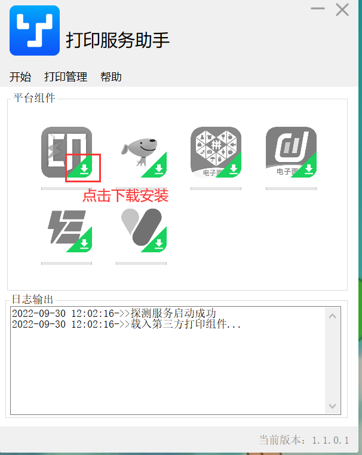

平台打印组件平台打印组件支持加入开启启动，设置后开启万里牛打印服务助手时平台打印组件会自动启动，不需要一一手动启动了。

开启万里牛打印服务助手，电脑上PDA上在打印时万里牛打印服务助手会自动把任务下发到对应平台的打印组件里进行打印。

打印队列新增了万里牛控件类型，可以通过这个查看订单是走万里牛打印服务助手还是各个平台的打印组件。

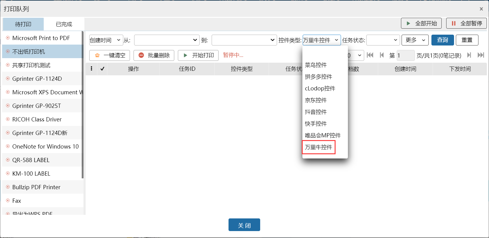

> 更新: 2024-03-13 09:16:30  

> 原文: <https://hupun.yuque.com/unzko7/lsbfg0/iuwcwvlrfcu45hda>

---

### 10.1.2 WMS-京东全渠道京配电子面单（京东零售）

> 原始文件来源：`00-源文件/专题功能介绍/打印_电子面单/WMS-京东全渠道京配电子面单（京东零售）.md`

#### 业务介绍

京东零售源头直发业务改为由京东快递提供承运支持，需要单独获取全渠道京配电子面单发货

#### 操作说明

WMS识别京东零售订单：当sourcePlatformCode 订单来源编码为JD，request—>deliveryOrder—>extendProps—>delivery_mode，delivery_mode值为12，识别此订单为全渠道京配订单。

##### 京东店铺后台配置

[查看详细配置流程](https://joyspace.jd.com/pages/8H1nV2WWjsymo21ha2gL)

##### 店铺授权

选择京东平台登录进行授权，全渠道京配业务不支持跨店铺获取面单，故每一个发货店铺都需要授权

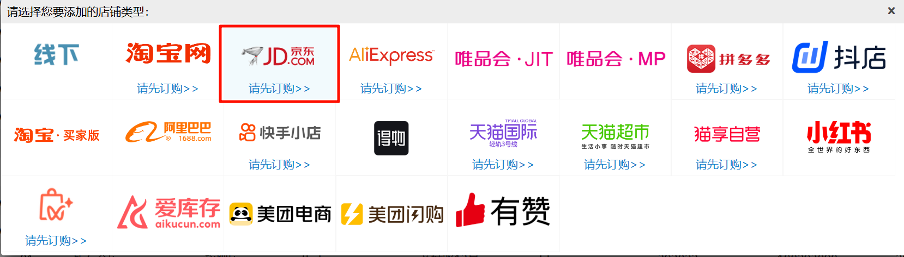

##### 开通电子面单

授权成功后，选择京东快递，找到全渠道直连京配电子面单接口

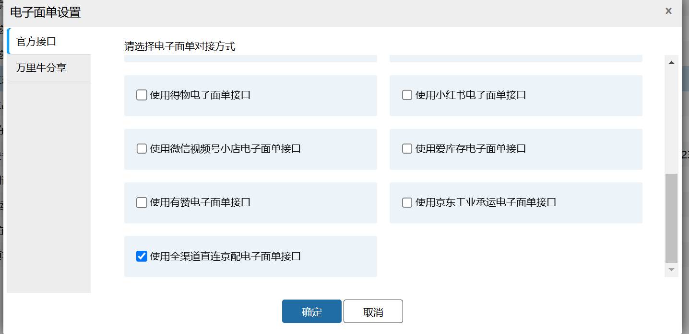

填写authKey（需联系京东采销人员提供）和青龙编码

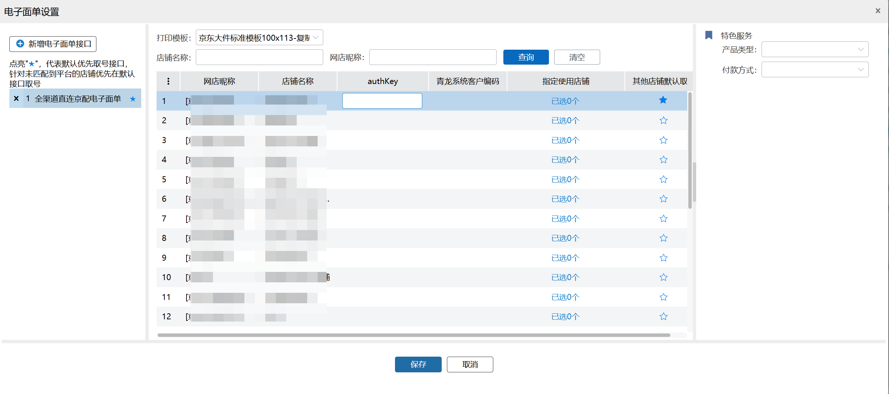

选择对应的产品类型即可

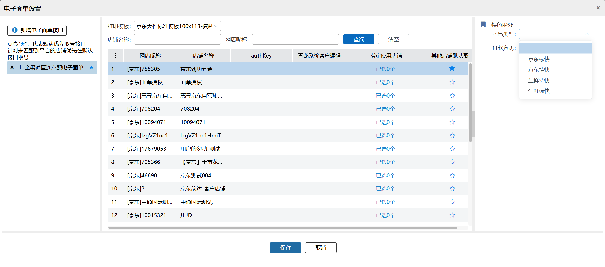

> 更新: 2025-11-27 11:48:32  

> 原文: <https://hupun.yuque.com/unzko7/lsbfg0/vf3z5qrakahh5nrv>

---

### 10.1.3 WMS-京东工业承运（工小达）上门揽收

> 原始文件来源：`00-源文件/专题功能介绍/打印_电子面单/WMS-京东工业承运（工小达）上门揽收.md`

#### 一、背景介绍

工业品类目因为物品体积大、物流承运商服务能力层次不齐、商家单独和物流公司结算费用高等缺陷，导致商家服务能力参差不齐。所以平台对于订单业务为厂直模式，商品类目为工业品的订单提供了京东承业承运平台的物流服务，辅助提高商家服务能力，降低商家物流成本，

#### 二、操作方式

**订单标记**

京东工业承运上门的订单WMS在接收ERP推送的订单后会显示 **承 **字标

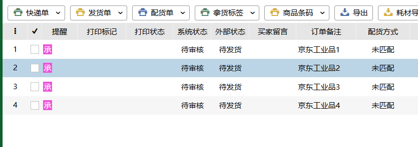、

支持根据订单标记进行筛选，生成波次，提升加急等操作

**店铺授权**

使用京东工业承运发货的需要每个店铺都进行店铺授权，不支持使用其他店铺的电子面单

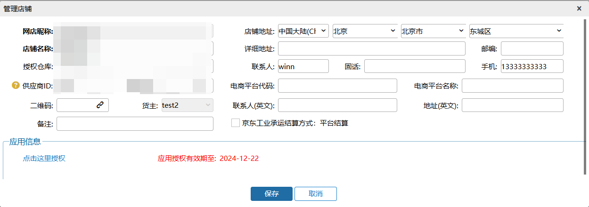

**发货方式**

平台支持的发货方式目前有三种

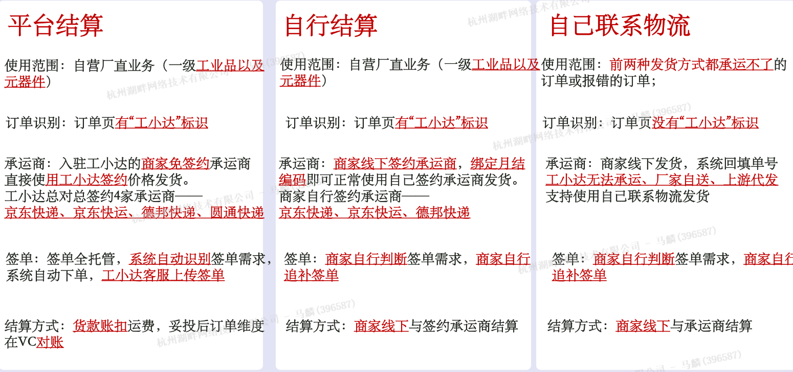

自己联系物流方式下，目前订单上不会有 **承 **字标，所以本次涉及的是其他两种

**平****台结算**

①签约平台结算的店铺勾选平台结算配置

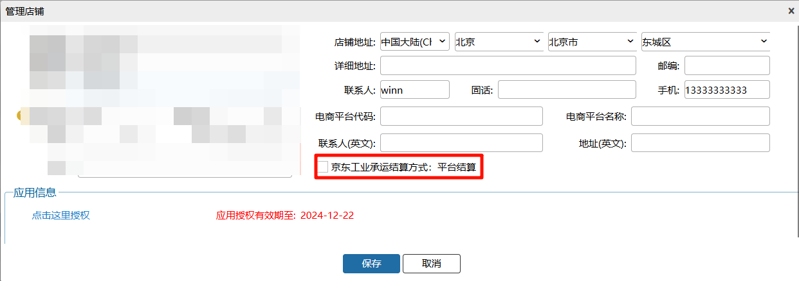

②创建承运商

新增对应线上快递的承运商，然后使用京东工业承运电子面单接口

（注意：平台结算的方式是由平台自行指定快递，所以需要将自己可发的快递或者偏好快递都逐一新增一下）

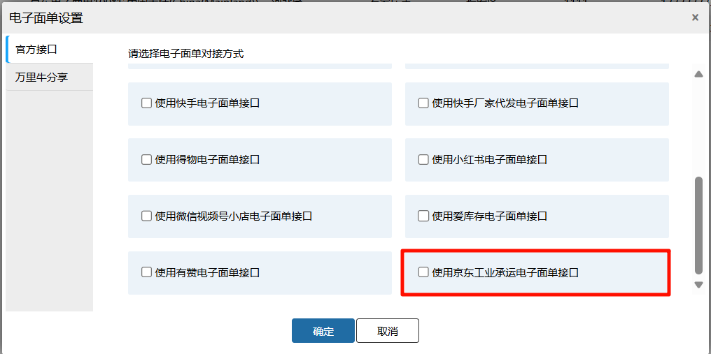

选择平台结算，保存即可

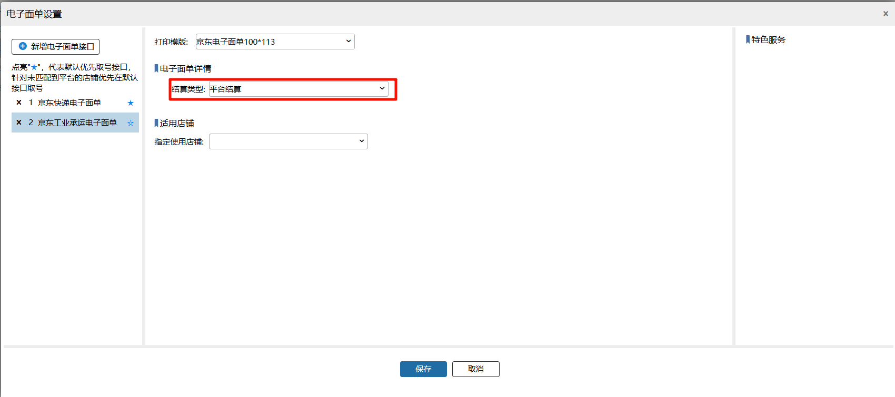

③快递的取号

平台结算的订单系统在接单后会自动生成单号，无需手动获取。此类订单不可变更承运商。另外，ERP推送订单时若系统中没有任何结算类型为平台结算的快递，则接单失败。

**自行结算**

自行结算的模式下同其他自选承运商发货场景一致

①自行结算场景下**不可勾选**店铺的平台结算配置

②设置承运商

选择自行结算，填写相应的月结编码配置相应的特色服务

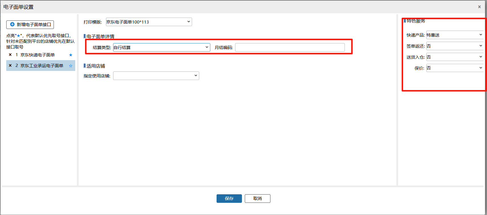

③接单发货

订单接单后按需自行选择承运商进行打单发货即可

**偏好物流设置**

在平台结算情况下是允许商家配置偏好物流的，这个偏好物流相当于是商家指定某一物流公司优先

承运商中平台结算下选择偏好物流是，则取号时就会使用当前承运商去向平台获取电子面单，若平台结算的范围内无此快递则申请电子面单不成功

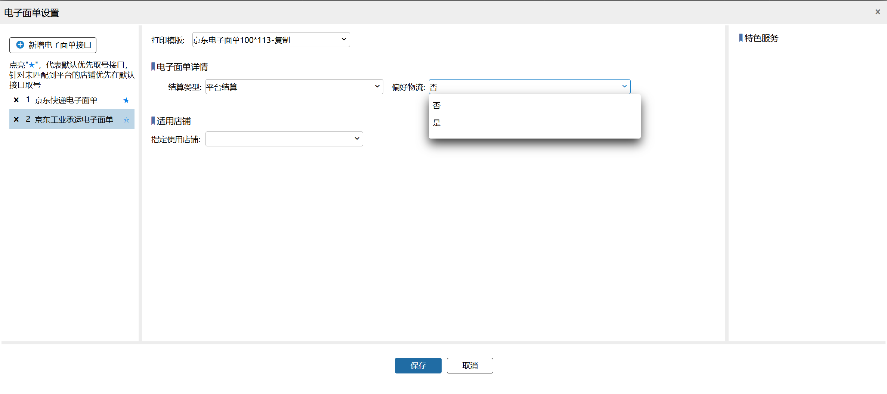

> 更新: 2025-03-04 11:16:53  

> 原文: <https://hupun.yuque.com/unzko7/lsbfg0/voie2d96zz0o2cu7>

---

### 10.1.4 WMS-得物品牌直发_得物打印组件使用介绍

> 原始文件来源：`00-源文件/专题功能介绍/打印_电子面单/WMS-得物品牌直发_得物打印组件使用介绍.md`

#### 一、功能介绍

得物平台要求对于**品牌直发**的订单面单必须通过“得物”的打印组件打单。万里牛已经上线了对应功能，请您尽快切换。得物打印组件是为了简化商家打印得物物流面单的流程，商家安装后，可提升面单打印稳定性、提升打印效率、减少面单打印异常错乱问题；同时面单模版符合得物标准，是最新的。

平台公告：

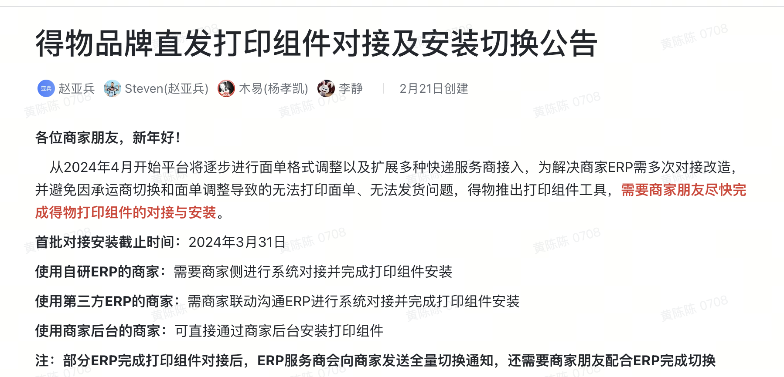

#### 二、操作说明

###### 平台应用授权

在得物服务市场找到万里牛WMS

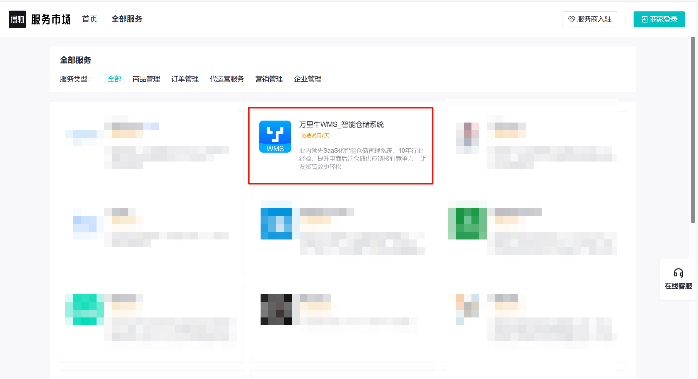

点击登录授权使用

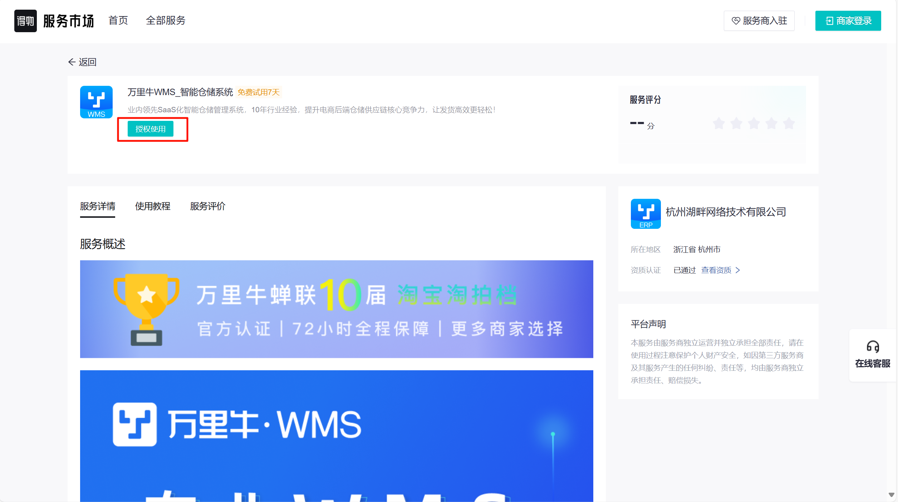

###### 店铺授权

选择得物平台进行授权

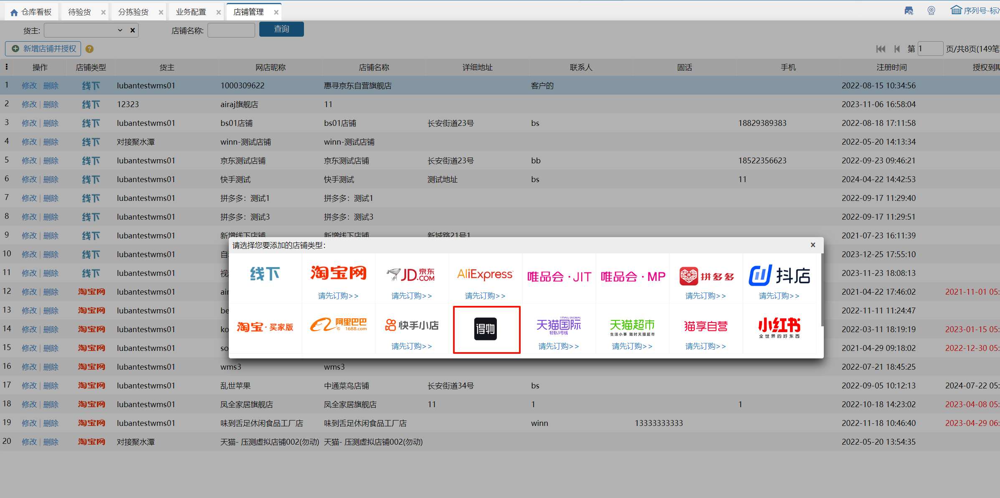

点击授权

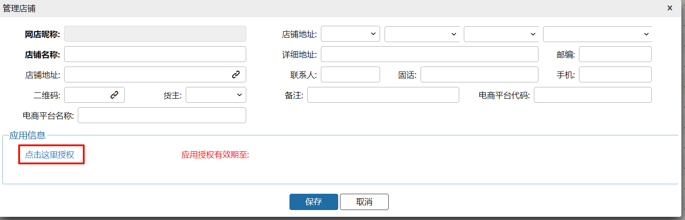

授权成功

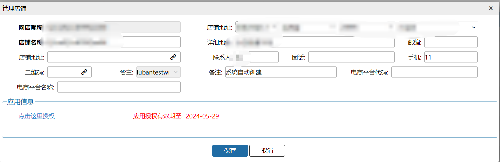

###### 选择承运商并开通电子面单

选择得物电子面单接口

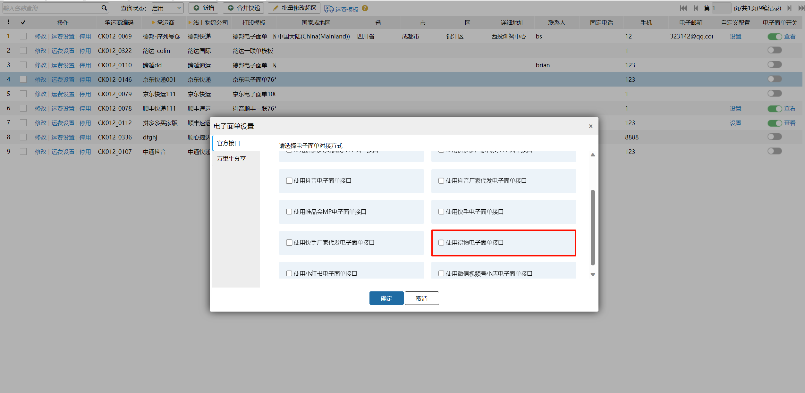

开通成功

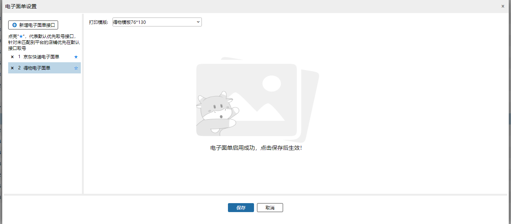

###### 

###### 选择打印模板尺寸

得物提供了76*130 与70*170两种尺寸，可根据实际情况选择使用

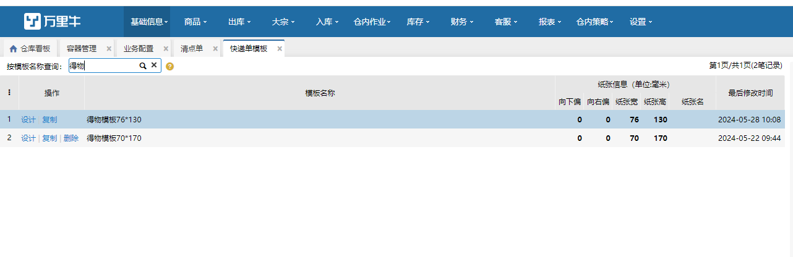

###### 编辑打印模板

得物的打印模板自定义区域支持使用得物平台的打印内容和系统自定义打印内容，配置如下

选择平台默认即使用店铺后台所配置的打印项

选择自定义同其他打印模板逻辑一致，需自行选择打印项配置。

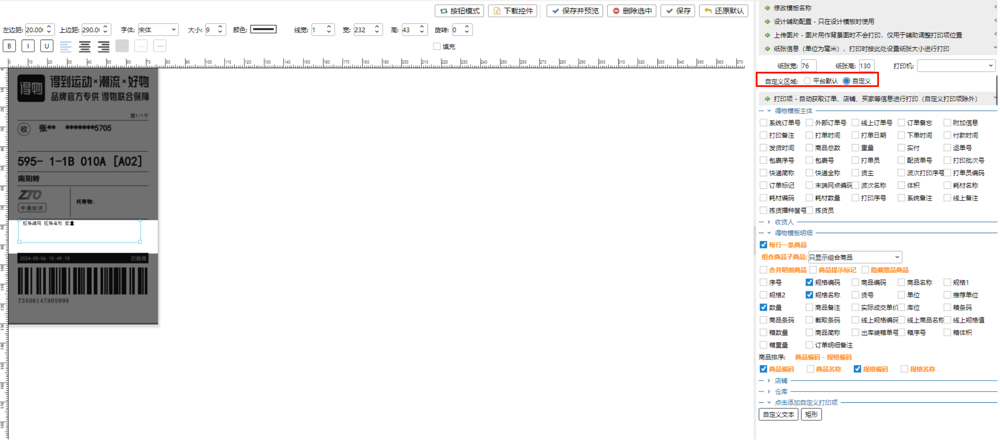

###### 下载打印组件

通过万里牛打印助手下载并更新得物打印组件

###### 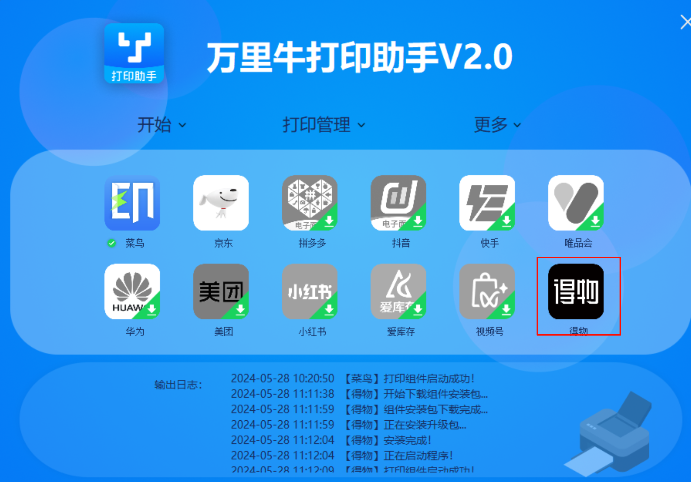

###### 打印组件设置

注意：无视打印组件中的选择打印机选项，系统会根据WMS中配置的打印机进行打印

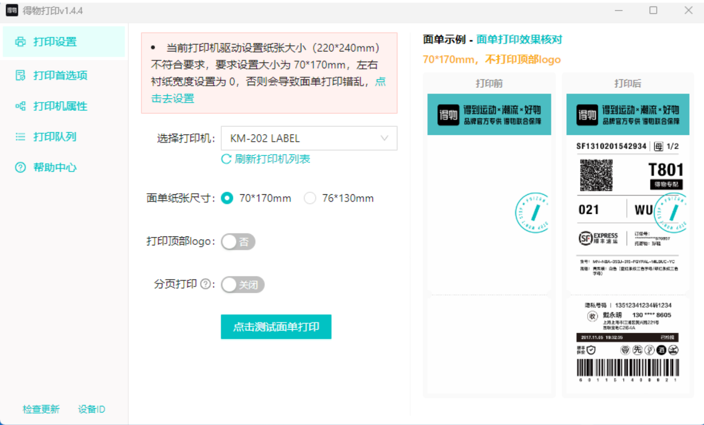

配置当前使用的面单尺寸

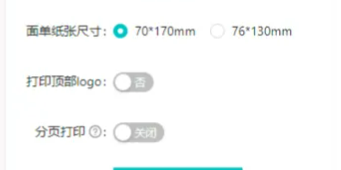

不同品牌直发模式取号的特点介绍

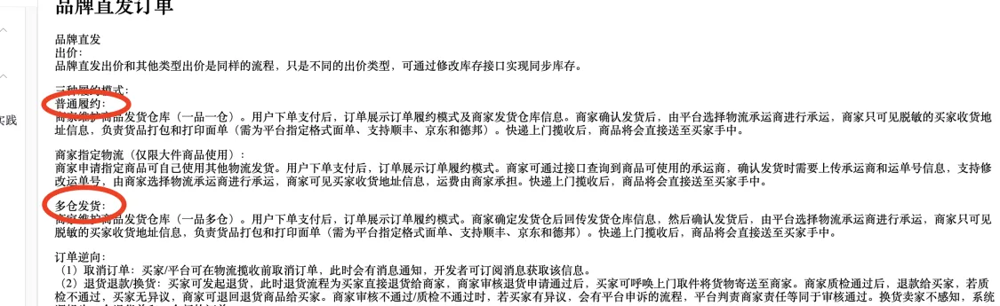得物的品牌直发有三种模式，官方业务介绍如图。因为模式的不同，WMS在申请电子面单时也有所不同

1、普通履约与多仓发货：此种场景下，WMS申请电子面单时，平台指定了 快递公司 和 运单号，商家无法更改。故订单中承运商不可修改，快递匹配规则也不生效。

2、商家指定物流：也叫商家自寄，此种情况下平台考虑商家货品较大可能存在多包裹、发物流等场景，可以由商家自行选择快递公司发货，但是注意，不可使用得物电子面单。

> 更新: 2025-07-09 09:17:50  

> 原文: <https://hupun.yuque.com/unzko7/lsbfg0/xqo5g1etcs8dpsz3>

---

### 10.1.5 WMS-微信小店代发（供货商）

> 原始文件来源：`00-源文件/专题功能介绍/打印_电子面单/WMS-微信小店代发（供货商）.md`

#### 背景

2025年12月1日起，微信官方平台逐步调整跨店铺代打业务的规范性。详情可点击查看[平台公告](https://store.weixin.qq.com/chengzhang/webdoc/wiki/8469/5f00c2182495bdfd/growth_center_platform_notice)。其中**当且仅当「订单所属店铺」与「代打单店铺」具备经营主体关系时，双方店铺方可使用****原代打功能****。否则只能使用「****官方代发工具****」**

本次功能即为官方代发工具（微信小店供货商代发）

万里牛WMS供货商代发，**订购100元退80元**，平台技术服务费20元

#### 影响范围

本次微信官方调整将将在12月逐步启动，届时将影响WMS现有业务开展，影响范围为

**使用某一视频号小店（微信小店）订购电子面单替其他无经营关联店铺进行取号打单的用户**

****

#### 建议改造方式

1.向自有多店铺商家，向平台证明代取号店铺和取号店铺间具备同一经营主体关系

2.云仓经营方，自行申请微信小店供货商身份，并进行绑定代打店铺（详情可见[微信小店「供货商关联商家」操作指引](https://store.weixin.qq.com/chengzhang/webdoc/wiki/8205/ea21caa54d1d14d8/growth_center_manual_for_supplier)）

#### 供货商方案示意

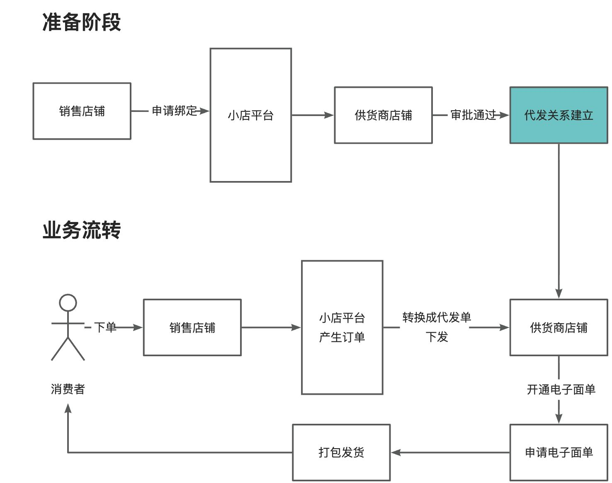

#### 微信小店代发系统操作方式

##### 店铺授权

订购应用：万里牛WMS供货商代发，**订购100元退80元**，平台技术服务费20元（20%收取）

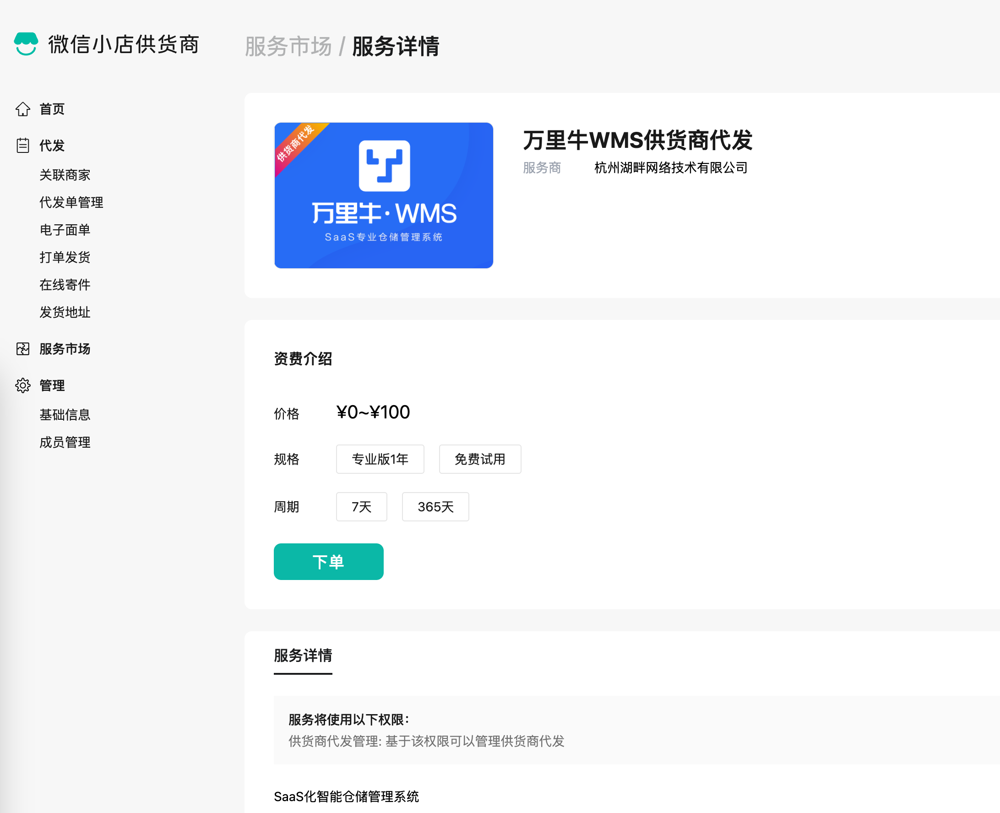

新增店铺或将ERP推送的店铺进行授权

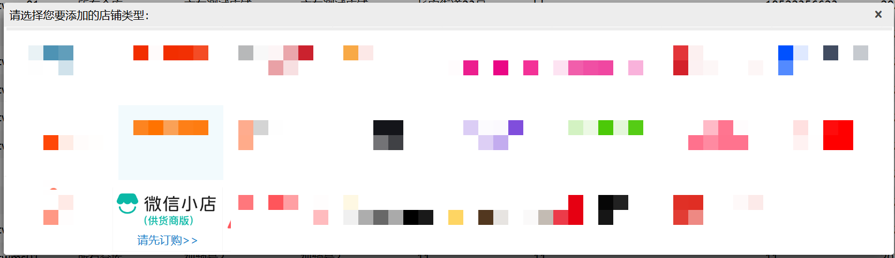

填写正确的供应商ID,特别注意当小店既是视频号微信小店身份又是供货商身份时必须填写对应正确的ID 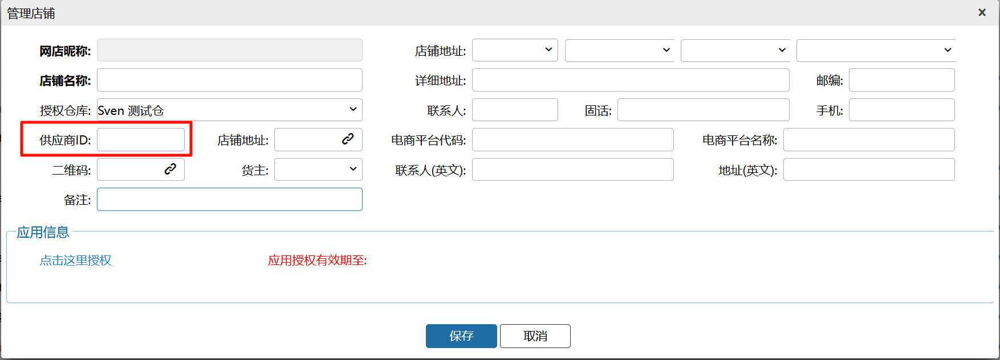

参考位置

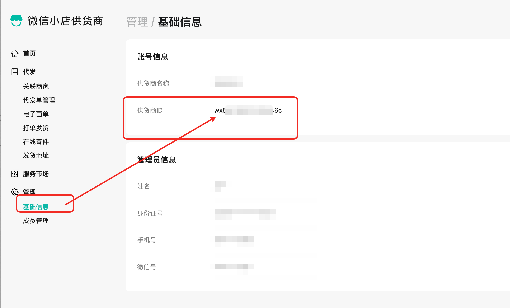

##### 开通电子面单

新增承运商后或已有承运商启用电子面单接口，选择微信小店供货商接口

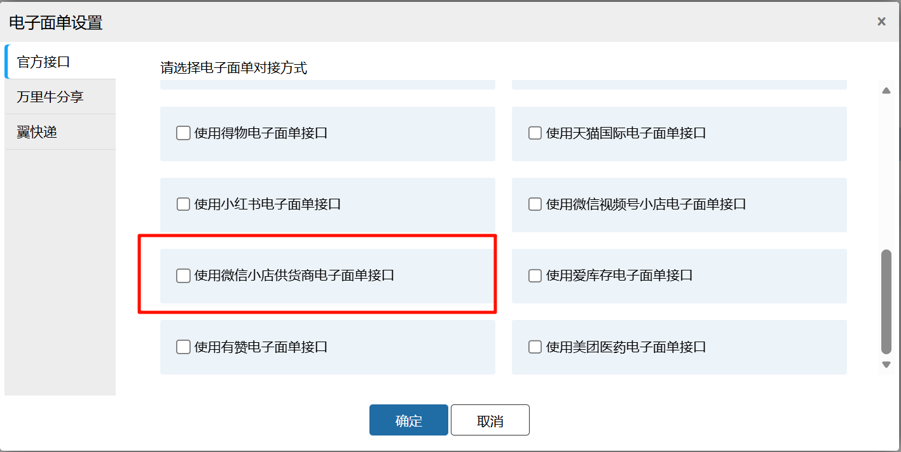

启用后，配置店铺、网点相关信息，其余操作同视频号电子面单一致

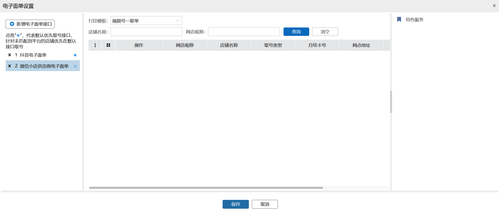

##### 单据查看

该类供货商代发单区别于正常的视频号（微信小店）订单，在系统中的店铺类型为微信小店供应商。

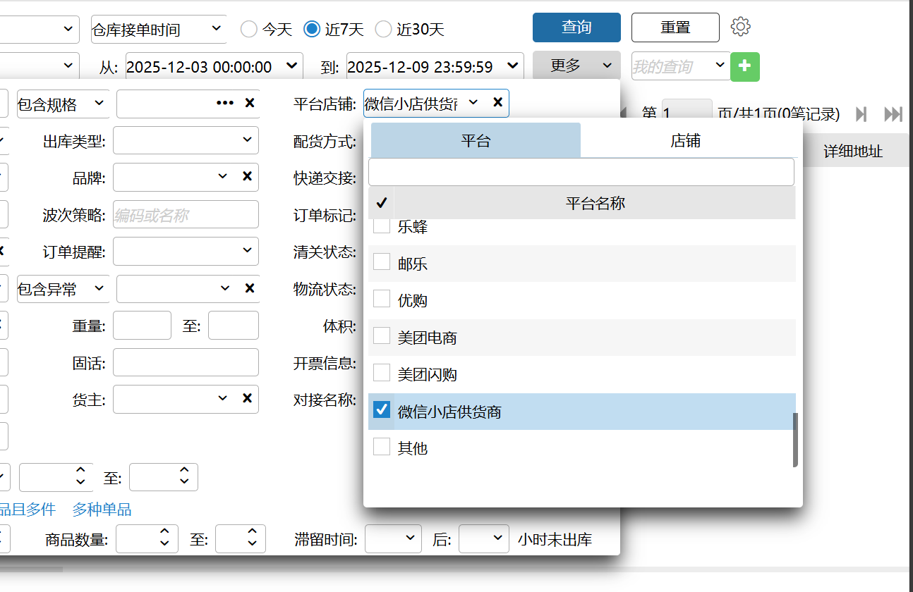

##### 业务识别条件

供货商代发单识别：

平台来源编码为：WXXDDF 微信小店代发  
代发订单商品信息：request->orderLines->orderLine->extCode 平台商品编码

供货商代发方案几点注意事项：

1.供货商店铺建立后需要去平台获取代发单，而非处理销售店铺的订单

2.供货商店铺只可给自己店铺的代发单申请电子面单，其余都不行。

3.供货商小店的供应商ID必须填当前店铺的供应商ID

> 更新: 2026-07-17 10:21:21  

> 原文: <https://hupun.yuque.com/unzko7/lsbfg0/hzmsryuw1getafah>

---

### 10.1.6 WMS-快手电子面单

> 原始文件来源：`00-源文件/专题功能介绍/打印_电子面单/WMS-快手电子面单.md`

业务背景：

应快手平台要求，近期将对用户订单数据逐步加密，数据加密后，商家必须切换快手官方提供的快手电子面单进行打单发货，不然无法解密打印面单，影响商家正常打单发货。

一。店铺订购和保证金退款

店铺先订购WMS应用，[点击订购](https://fuwu.kwaixiaodian.com/new/detail?id=4313364561014)，选择电子面单订购专用版。

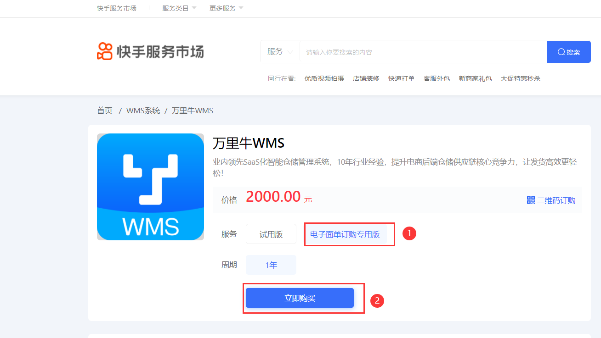

订购成功后，在WMS系统里进行保证金退款，平台侧会收取0.6%的技术服务费，即付2000元，退款1988元，退款周期35天左右。

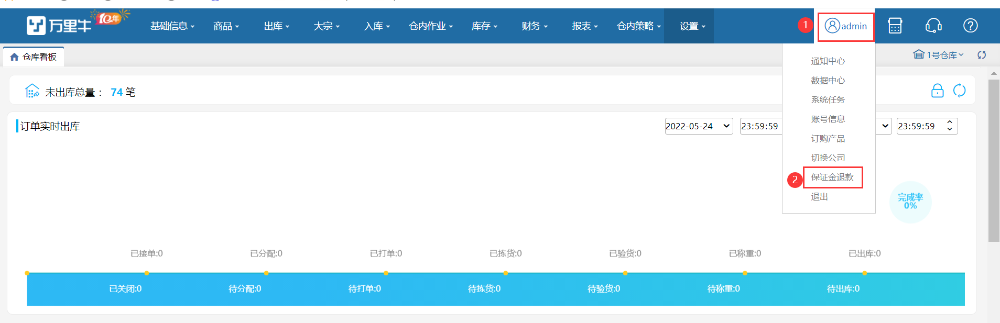

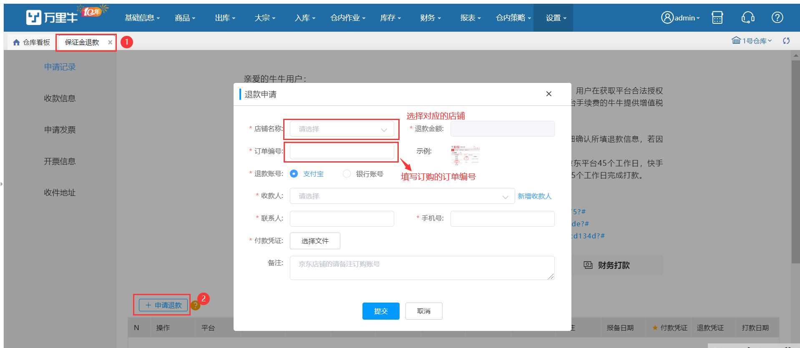

二。 店铺授权

选择已有的快手店铺，点击修改->打开店铺管理页面->点击授权，授权成功后->点击保存。

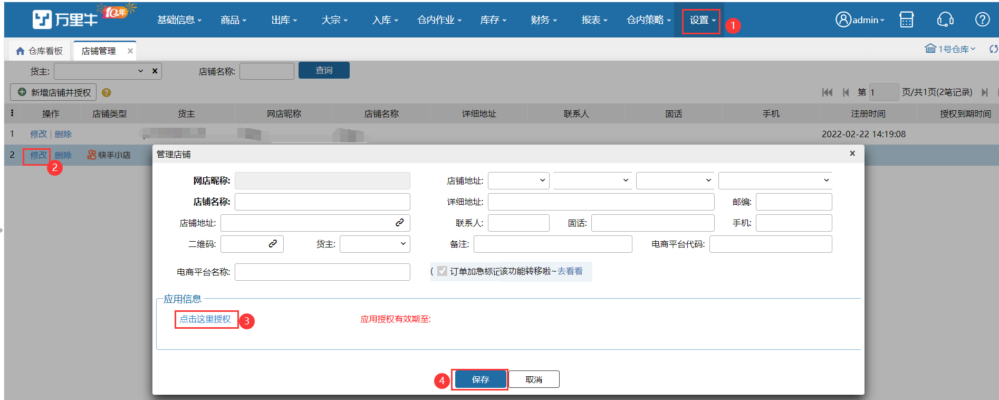

 2.新增店铺->选择快手小店->点击授权，授权成功后->点击保存。

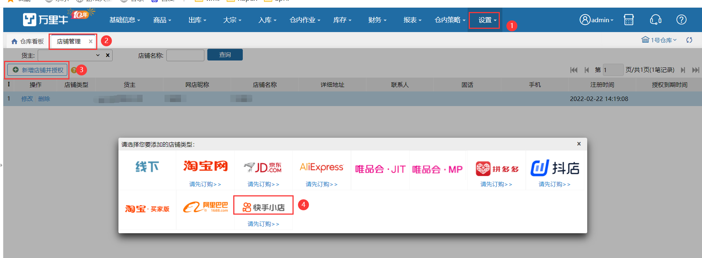

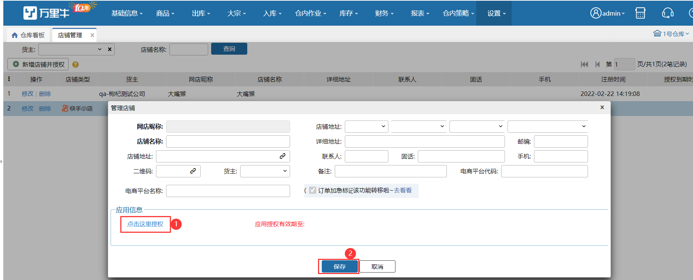

三。 承运商设置

承运商档案页面->点击新增，选择线上物流和快手模板，点击保存。

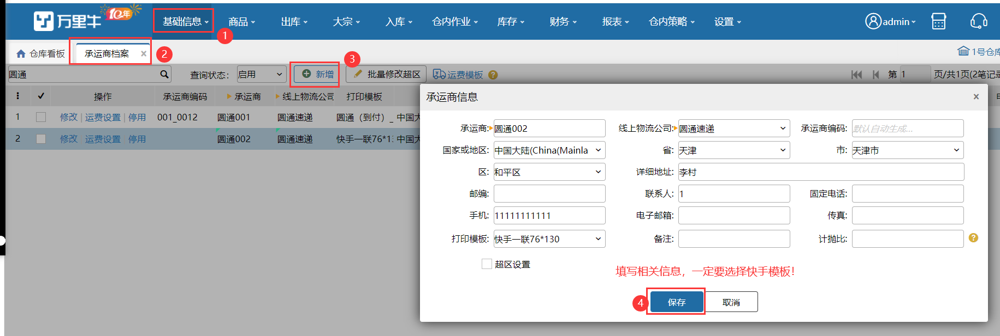

点击开启电子面单->选择使用快手电子面单接口->选择店铺开启，设置网点和网点编码->点击保存。

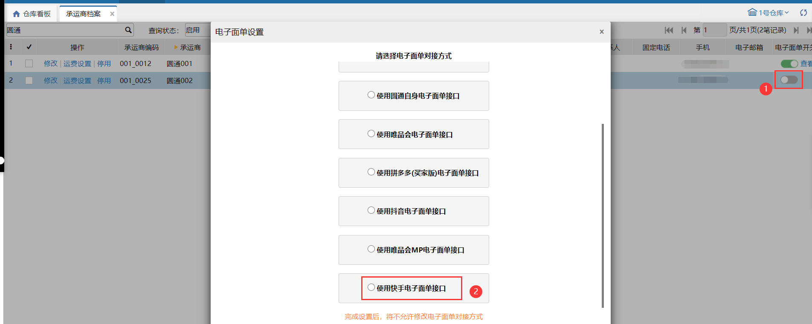

PS：顺丰速递需要快递服务里填写客户编码。

四。安装快手打印控件

[点击下载快手打印控件](https://s1-11586.kwimgs.com/kos/nlav11586/kuaishou-print-installer.exe" \o "点击下载快手打印控件" \t "/Users/liuyanhong/Documents\\x/_blank)，然后根据提示进行安装即可，安装成功双击打开。

五。面单申请

上游ERP/OMS推快手订单到WMS，在WMS里进行申请单号打单发货。

快手支持的快递，[点击查看](https://hupun.yuque.com/docs/share/8e79e205-21bf-41ab-b04c-7848bde57198?" \l "esrE %E3%80%8AWMS%E7%94%B5%E5%AD%90%E9%9D%A2%E5%8D%95%E5%AF%B9%E6%8E%A5%E6%B1%87%E6%80%BB%E3%80%8B" \o "点击查看" \t "/Users/liuyanhong/Documents\\x/_blank)。

> 更新: 2026-03-02 12:03:39  

> 原文: <https://hupun.yuque.com/unzko7/lsbfg0/ogkx3gbgrfimk1ga>

---

### 10.1.7 WMS-打印记录

> 原始文件来源：`00-源文件/专题功能介绍/打印_电子面单/WMS-打印记录.md`

待补充...

> 更新: 2025-10-09 15:09:14  

> 原文: <https://hupun.yuque.com/unzko7/lsbfg0/yhgnlunw7uakdhe6>

---

### 10.1.8 WMS-承运商档案(快递合并)

> 原始文件来源：`00-源文件/专题功能介绍/打印_电子面单/WMS-承运商档案(快递合并).md`

业务场景：

随着电商行业发展，各种平台不断增加，一个平台至少有6个快递(四通一达+顺丰)，导致快递电子面单配置成本倍增，波次作业效率低下。为了降低承运商配置和维护成本，提升波次作业效率，提升客户使用体验，现推出承运商支持多接口取号功能。

效果:

    1.当新增一个平台，ERP不需要新增承运商，WMS仅对现有的承运商操作新增取号接口即可。

    2.禁发区域修改，仅操作一个承运商。

    3.从哪个网点取号，用户可自定义配置。

PS：该功能目前暂未放开，若需要请联系在线客服开启该功能。

合并后影响:

      1.WMS中老承运商合并成新承运商后，ERP需要再新建一个承运商，所有使用老的承运商的订单发货完成且对账完成后，再手动停用老承运商。

      2.模板只能在电子面单设置页面修改。

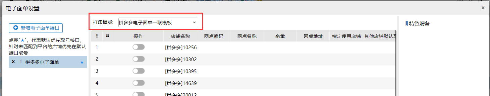

    3. 3PL快递匹配、波次策略、出库运费、单量设置需要重新设置下合并后承运商。

    4.混打开关会强制开启。

    5.波次策略强制去掉相同打印模板，已设置的订正成相同尺寸模板+混合快递。

快递匹配逻辑如下：

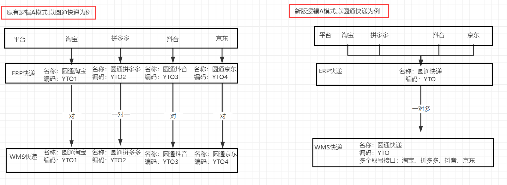

A模式为系统默认快递匹配模式

具体操作:

一。 承运商档案设置

1.勾选多个承运商且线上物流公司一样，点击快递合并，设置合并后的承运商名称和编码。

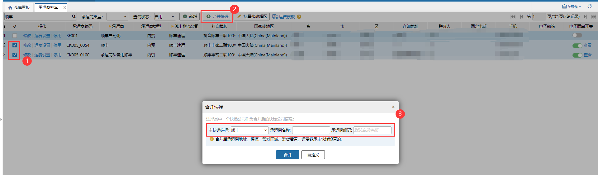

2.选择合并后承运商点击查看，打开电子面单设置页面。

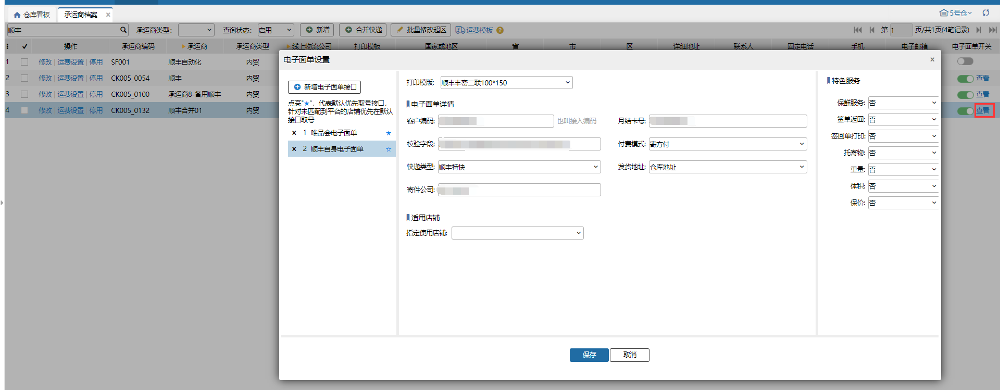

3.点击新增电子面单接口，可以选择添加电子面单接口。

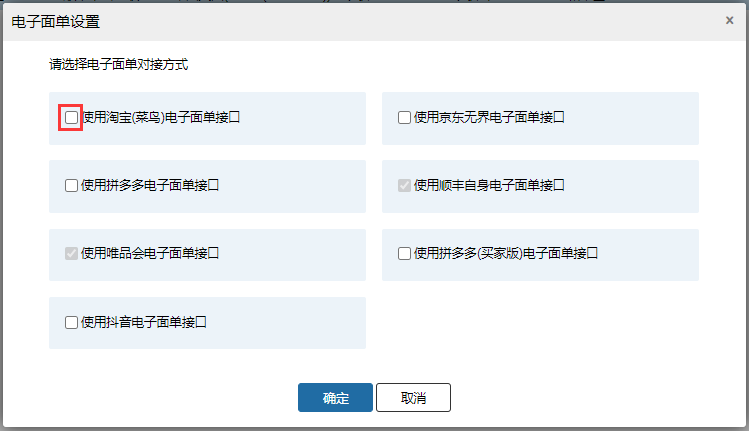

4.通过设置指定使用店铺，可配置某个店铺使用哪种电子面单。

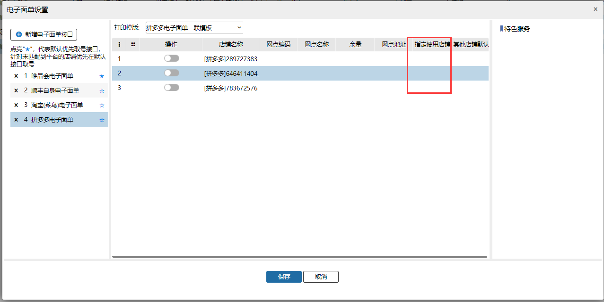

5.未指定的店铺，优先匹配对应平台下的默认网点进行生成电子面单。


6.设置特色服务。


注意：所有取号接口的模板尺寸必须要一样才能保存成功。

二。 波次策略配置

波次策略配置相同尺寸模板相同快递


三。 电子面单生成

优先在指定了该店铺的接口取号>订单归属平台的接口取号>默认的取号接口取号

> 更新: 2023-12-21 10:47:34  

> 原文: <https://hupun.yuque.com/unzko7/lsbfg0/hpittcci8c07ayn4>

---

### 10.1.9 WMS-抖音买家版电子面单

> 原始文件来源：`00-源文件/专题功能介绍/打印_电子面单/WMS-抖音买家版电子面单.md`

1.店铺后台：开通抖音电商电子面单

点击注册登录网址：[https://ebill.douyinec.com/register-service](https://ebill.douyinec.com/register-service)

平台的操作手册：[https://school.jinritemai.com/doudian/web/article/aHN3qQ4zjiWF?from=shop_table](https://school.jinritemai.com/doudian/web/article/aHN3qQ4zjiWF?from=shop_table)

【手机号+验证码】登录即可，登录后完善信息


点击【开通电子面单服务】选择合作的快递，点击【立即开通】

- 选择发货地址
- 选择网点
- 填写联系人姓名、电话


**提交完成后，联系快递公司网点进行审批。**

**3授权创建订购关系**

接下来需要去服务市场授权万里牛应用


搜索之后进行订购应用


然后系统中进行店铺授权


授权成功后就可以正常使用电子面单了

> 更新: 2026-04-07 17:40:02  

> 原文: <https://hupun.yuque.com/unzko7/lsbfg0/tb17vvgkusu54iks>

---

### 10.1.10 WMS-新版小红书电子面单打印

> 原始文件来源：`00-源文件/专题功能介绍/打印_电子面单/WMS-新版小红书电子面单打印.md`

【通知1】平台将于**2025年2月1日**起电子面单订购页面全量切换为新版电子面单订购页面，请商家**店铺后台订购新版电子面单。**

【通知2】平台将于**2025年3月31日**起全面下线旧版电子面单，不再支持旧版电子面单取号，请商家及时切换新版电子面单进行使用。

[查看平台公告连接](https://open.xiaohongshu.com/platformSupport/notice/-1/299)

#### **商家店铺开通方式**

##### 店铺后台：[查看店铺后台开通电子面单流程](https://school.xiaohongshu.com/lesson/normal/ba4395753d134b2c95b2c9b0db0f715f?jumpFrom=school&uba_pre=8.school_rule_list..1729501620361&uba_pre=8.school_course_list..1729502818612&uba_ppre=8.RuleCenter..1729501620133&uba_ppre=8.school_rule_list..1729501620361&uba_index=6&uba_index=7&viewSource=LESSON&fromPage=LessonList)

店铺后台-电子面单点击“一键切换”进入新版电子电子面单进行开通快递


进入新版电子面单后

点击【订单】--【电子面单】，选择可申请的物流公司，点击【申请】

- 选择发货地址
- 选择网点
- 填写联系人姓名、电话
- 月结卡号
- 

** **

****

#### WMS系统设置方式

##### 店铺授权

新增店铺并授权


##### 电子面单开启

新增承运商并开启电子面单


开启小红书电子面单接口


##### 新增网点

注意此时新开通的会显示XXXXX（新）字样


开通成功后就可以正常获取电子面单号了

##### 新打印组件下载安装

因为本次更新之后需启用新的打印组件，固在万里牛打印助手中序下载安装小红书新


如果不能正确安装，则打印时会显示


#### 新版电子电子面单Q&A  

**1旧版电子面单余额怎么办？**  
答：系统不支持自动迁移到新版电子面单账户，商家可使用完旧版后再切换新版电子面单，也可以沟通快递网点进行余额切换。  
**2新版和旧版的区别？**  
答：新版支持云模版编辑，面单配置更灵活；新版打印组件为全新组件。  
**3切换新版需要做哪些事？**  
**1.**重新订购电子面单账号（可选择一键切换进行切换，如商家的物流服务商有顺丰、京东，商家需先行使用月结账号在新申请电子面单页完成首次订购和验证码核验， 验证核验完成后点击一键切换按钮，平台将协助您完成同一月结账号下其他发货地址（如有）的订购以及面单模板的配置迁移。）  
2.重新配置面单模版（可选择一键切换进行切换，如商家的物流服务商有顺丰、京东，商家需先行使用月结账号在新申请电子面单页完成首次订购和验证码核验， 验证核验完成后点击一键切换按钮，平台将协助您完成同一月结账号下其他发货地址（如有）的订购以及面单模板的配置迁移。）  
3.重新下载打印组件  
如果是通过erp、打单工具进行发货，在千帆完成新版电子面单订购后，需在第三方打单系统中按照指引完成新版电子面单账号、模版配置，并下载新的打印组件  
4G云打印是否支持打印：暂不支持，需要购买新的打印机。  
**4不切换新版是否可以？**  
答：2025年3月31日起将不支持旧版电子面单订购、取号；辛苦商家务必提前完成切换，否则会影响发货履约。  

若有收获，就点个赞吧

> 更新: 2025-03-05 11:17:15  

> 原文: <https://hupun.yuque.com/unzko7/lsbfg0/wc3wn1prcnpyxy1q>

---

### 10.1.11 WMS-淘宝闪购平台配

> 原始文件来源：`00-源文件/专题功能介绍/打印_电子面单/WMS-淘宝闪购平台配.md`

#### 功能介绍

针对淘宝小时达**平台配送-快递配的订单类型，万里牛系统支持获取运单号进行打印发货处理**

#### 操作说明

##### 淘宝店铺后台配置

[查看详细配置流程](https://alidocs.dingtalk.com/i/nodes/Qnp9zOoBVBgoQRkkhG5KYAdzJ1DK0g6l?cid=66881692912&corpId=ding482919750e0d871724f2f5cc6abecb85&doc-mode=edit&doc_type=wiki_doc&iframeQuery=utm_medium=im_card&utm_source=im&utm_medium=im_card&utm_scene=person_space&utm_source=im)

**若有不清楚的可联系店铺小二进行咨询和开通**

**店铺后台-直联**

##### 快递公司-开启电子面单

新增“淘宝闪购平台配”线上物流公司


选择菜鸟店铺版电子面单并保存电子面单设置


开启网点


**网点地址：来源店铺后台电子面单设置里的发货网点**

选择菜鸟电子面单模板


#### 常见问题

> 更新: 2025-08-20 10:55:05  

> 原文: <https://hupun.yuque.com/unzko7/lsbfg0/gkfrbq5qtzgz543e>

---

### 10.1.12 WMS-混打功能

> 原始文件来源：`00-源文件/专题功能介绍/打印_电子面单/WMS-混打功能.md`

场景：菜鸟和拼多多各自通过控件加密打印数据，原本在同一个波次中排序连贯的订单，被打印控件原因拆成多个波次。

仓库需重复跑多次进行拣货，造成作业效率低，为解决这一问题波次策略设置及打印机制做了调整，允许不同平台订单生成同一波次只需打印模板尺寸，即在同一台打印机上实现同一波次不同控件的混合打印。

波次策略设置

①.分组条件选择相同尺寸模板+相同快递，即相同尺寸模板和相同物流公司的订单可以生成同一个波次。

②.分组条件选择相同尺寸模板+混合快递，即相同尺寸模板的订单就可以生成同一个波次。


打印队列

现有模式打印后等待控件返回结果时页面一直等待，必须出完纸后才能继续打印其他的波次，为解决这一问题做成打印队列使页面等待时间大大缩减，更便于监控和管理。

具体操作：

1.波次打单页面勾选波次点击打印，会生成一个打印任务。

2.在打印队列中对应的打印机里可以看到该任务。

3.任务下发控件成功后，任务状态变成已完成且控件开始出纸。

4.出纸完成后，波次和订单的打印状态更新，打上快递标记。

异常情况：

1.若任务下发控件失败，任务状态是打印失败，可以点击重试再次下发。

2.若打印机A有待发送的任务，操作员关闭浏览器更换电脑登陆

  2.1新电脑无打印机A，待发送的任务自动到异常队列中，且登陆时会提示异常队列中有未完成的任务，是否处理？。

  2.2新电脑有打印机A，登陆时会提示打印机队列“打印机A“中有未完成的任务，是否处理？。

3.若打印机A有待发送的任务且模板尺寸时76*130，操作员再次用打印机A

  3.1打印模板尺寸76*130的订单，会提示打印队列里有打印异常的任务，请先处理！。

  3.2打印模板尺寸100*180的订单，会提示当前打印配置项“纸张宽高”与打印任务中的配置项不同，请修改后重试！。


注：打印中没有纸了可以点击暂停，装纸完成后可以点击继续打印。

> 更新: 2023-12-21 10:47:56  

> 原文: <https://hupun.yuque.com/unzko7/lsbfg0/ww6kuakxgcvkthwp>

---

### 10.1.13 WMS-组合打印

> 原始文件来源：`00-源文件/专题功能介绍/打印_电子面单/WMS-组合打印.md`

#### 使用场景：

1.有些商家在发货时需要给买家提供发货清单，而发货清单单独打印又会影响发货效率，以及错误率的产生，如果发货单按照快递单的尺寸设计，跟在每一张面单后打印出来，这样在做分单的时候就不会错，同样对于打单的人也节约了时间

2.前置打单拣货情况，针对爆款打单商家通常会先打印一张波次配货单，再把波次中快递单打印出来，这样一个波次就需要操作2次打印，而且不能批量打印，如果可以在打印快递单的时候自动插入打印一张配货单，就可以大大提高打单效率和分单效率

#### 功能使用

#### 1.打印配置

在系统中开启打印配置

开启组合打印开关


设置打印方案

首次配置的时候系统会帮你自动生成一个打印方案（配货单+快递单）


自行设置打印方案

我们提供了若干单据供组合打印，配置时根据点击的**先后顺序，决定打印的先后顺序。**

配置后为避免打印机纸张识别错误，所有模板尺寸需要保持一致


选择后效果


#### 2.前置打印

以波次打单举例，开启配置后需手动选出组合打印按钮，


配置后可在页面点击下拉选择方案


配置打印机

在预览和设置中可配置打印机

我们提供了两种方式

①指定打印机

这种情况下方案中的所有单据均从这一个机器中打印


②按首个快递打印机

配置按快递打印的一般是区分快递纸张使用了多个打印机的，为了避免频繁是更改打印机，所以打印时就我们就会使用波次中第一单快递所配置的打印机


#### 3.打印工作台

不光是页面上的打印，我们在打印工作台也支持了组合打印功能

配置组合打印

在页面上勾选组合打印，


打印机设置也分为指定打印机和首个快递打印机两种


设置成功后PDA后置打印也可以进行组合打印了

目前支持组合打印的页面有：

零拣打单、波次打单、大宗出库任务等页面

> 更新: 2025-01-10 15:25:15  

> 原文: <https://hupun.yuque.com/unzko7/lsbfg0/irgyzug978pccpk3>

---

### 10.1.14 WMS-美团医药健康电子面单

> 原始文件来源：`00-源文件/专题功能介绍/打印_电子面单/WMS-美团医药健康电子面单.md`

#### 背景

应平台要求，美团闪购医药健康订单必须使用美团电子面单发货

详细文档链接：[https://tscc.meituan.com/home/notice/medical/0?activeId=4&id=446](https://tscc.meituan.com/home/notice/medical/0?activeId=4&id=446)

#### 操作方式

##### 店铺授权

新增店铺时选取美团闪购类型

填写正确的店铺名称

点击授权

登录店铺账号

获取授权App_poi_code,字段位置如图

复制该内容填入点击保存

此时店铺授权就成功了

##### 开通电子面单

创建承运商，新增一个承运商，也可以使用已有的承运商

开通取号接口，

打开电子面单开关

选择美团医药电子面单接口

确定选择网点

保存即可正常使用了

#### 常见问题

截止8月20日平台所支持的快递公司 

中通 

申通 

圆通 

韵达

顺丰 

极兔 

> 更新: 2025-08-20 18:50:26  

> 原文: <https://hupun.yuque.com/unzko7/lsbfg0/qotgn2438gr4pvdz>

---

### 10.1.15 WMS-跨境托管自绘制商品条码

> 原始文件来源：`00-源文件/专题功能介绍/打印_电子面单/WMS-跨境托管自绘制商品条码.md`

设置商品条码模板


线上扩展字段1：对应temu的产地

线上扩展字段2：对应temu的sku id

线上扩展字段3：对应temu的sku货号

线上扩展字段4：对应temu的条码编码、labelCode（第一规格）

线上扩展字段5：对应temu的第二规格

线上扩展字段6：对应shein的备货单号

线上扩展字段7：对应shein的SKC货号

线上扩展字段8：对应shein的SKC id

条码都可以使用线上商品条码，条码可通过下方方式设置为条码样式展示


step2：在零捡打单页面打印商品条码选择设计的模板进行打印


> 更新: 2026-06-11 10:18:39  

> 原文: <https://hupun.yuque.com/unzko7/lsbfg0/qpokq76izz7rgv38>

---

### 10.1.16 WMS-顺丰云打印升级

> 原始文件来源：`00-源文件/专题功能介绍/打印_电子面单/WMS-顺丰云打印升级.md`

#### 背景

应顺丰集团直联顺丰下单的所有商家须尽快完成切换云打印，万里牛已完成云打印接入。使用顺丰直连电子面单的用户需要尽快切到此方式来打印面单。【特别提醒】新签约顺丰的商家，必须使用新的云打印方式打印面单，否则可能造成顺丰不揽收。

#### 使用方式

本次增加了一些不同尺寸的顺丰云打印模板，尺寸如下

在配置承运商时搜索云打印选择对应的模板即可

云打印使用菜鸟打印组件

请提前在万里牛打印助手中安装菜鸟打印组件

> 更新: 2025-03-05 11:17:22  

> 原文: <https://hupun.yuque.com/unzko7/lsbfg0/qtsqatu6l2es01t2>

---
