# 11. 客服与财务

> 资料来源：基于 `00-源文件/` 对应模块的原始操作手册、专题功能与PDA文档重组迁移。
> 事实边界：正文仅重组迁移原始文档；章节编号、目录和来源标记为整理信息，不新增业务规则、字段或流程。

## 本章知识目录

- **11.1 客服协同与异常拦截**
  - [物流跟踪](#1111-物流跟踪)
  - [WMS-物流跟踪查询总览](#1112-WMS-物流跟踪查询总览)
- **11.2 仓储费用与发票结算**
  - [发票打印](#1121-发票打印)
  - [发票配置](#1122-发票配置)
  - [承运商对账](#1123-承运商对账)
  - [货主充值](#1124-货主充值)
  - [货主单量统计](#1125-货主单量统计)
  - [货主增值费用](#1126-货主增值费用)
  - [货主账单](#1127-货主账单)
  - [货主费率配置](#1128-货主费率配置)
  - [货主费用明细](#1129-货主费用明细)
  - [货主费用统计](#11210-货主费用统计)
- **11.3 线下货主协同**
  - [WMS-线下货主模块（含订单导入）](#1131-WMS-线下货主模块含订单导入)

---

## 11.1. 客服协同与异常拦截

### 11.1.1 物流跟踪

> 原始文件来源：`00-源文件/操作手册/客服/物流跟踪.md`

背景：3PL云仓业务场景下，提供给有物流属性的企业，服务货主订单物流服务质量及跟踪处理。

订单出库后，系统将自动订阅运单数据显示在物流跟踪内，方便查看后续订单物流轨迹情况以及预警订单流转进行处理。

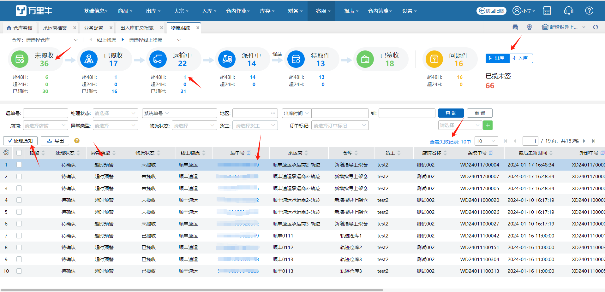

该菜单联动仓库级自动订阅物流轨迹+操作员权限显示。

1.物流订单数据快捷看板：显示操作员有权限仓库对应各环节物流订单数据统计，物流状态、超时XXH、已超时均可携带时间自动查询对应订单数据。

2.支持出库、退货入库流程双向展示数据。

3.订单点击运单号可查看物流轨迹情况。

a.手填单号支持出库订阅和查看物流轨迹。

b.修改单号后可二次订阅。

4.订单根据对应环节配置超时预警时间计算是否超时，超时后自动标记，用户可在物流跟踪或异常订单-物流预警内查看并支持点击通知处理进行处理。（去除异常后对应去除异常数据）

5.失败记录点击跳转订阅失败订单页

a.可查看订阅失败订单数据并进行重新订阅操作。

b.支持取消订阅，取消后订单无订阅失败标记，订单不跟随业务配置预警。

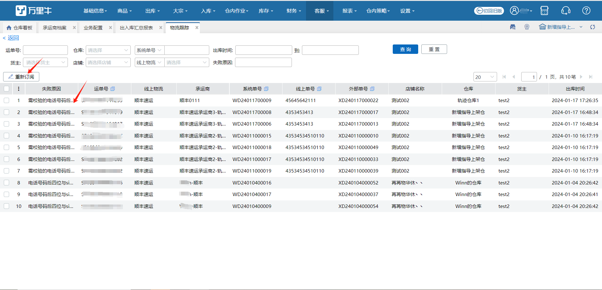

6.原单入库、销退入库（前提：入库预约单上的承运商和运单号和原出库单一致）后，自动取消订阅。

7.单号来源：历史记录——回收的电子面单对应的记录；出库订单——出库的电子面单对应的记录。

8.记录自动清除时间：

- 未揽收+超时已处理=7天
- 揽收后至签收前+已处理=15天
- 已签收/完结=15天
- 任意节点超时未处理=最后轨迹更新时间2个月

> 更新: 2025-12-15 10:08:57  

> 原文: <https://hupun.yuque.com/unzko7/lsbfg0/uhmamoqssgfunyrg>

---

### 11.1.2 WMS-物流跟踪查询总览

> 原始文件来源：`00-源文件/专题功能介绍/其他/WMS-物流跟踪查询/index.md`

物流预警

使用场景:

目前各个平台揽收时效基本都是24h(发货到有揽件信息)，而三方仓客户的话，货主会把仓库订单发货时效做为考核的一个标准。当店铺因仓库揽收超时被罚后，货主会让仓库做出相应补偿。

上线效果：

通过设置揽收时效预警，对即将超时订单做揽收操作，降低揽收超时率

操作：

     1.业务配置-出库配置，开启自动订阅物流轨迹，设置生效的线上物流和揽收预警。开启后，订单出库后自动订阅物流轨迹。

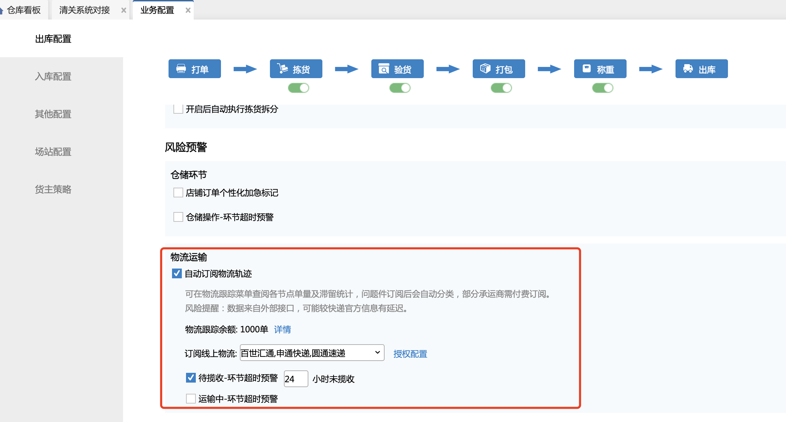

2.已出库页面查看订单是否揽收超时。

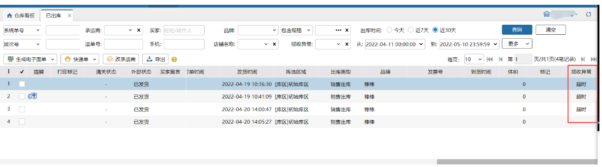

物流轨迹查询

使用场景

随着客户单量增大，在售问题增加的时候，客服人员往往需要去查询某一问题单的发货物流情况，有些ERP无法提供物流追踪功能，货主会让仓库人员查询各个订单的发货物流进度，方便处理因快递原因产生的问题件。

上线效果

订单查询可通过运单号查询订单物流轨迹详情。

操作

订单查询页面点击运单号查看物流轨迹详情。

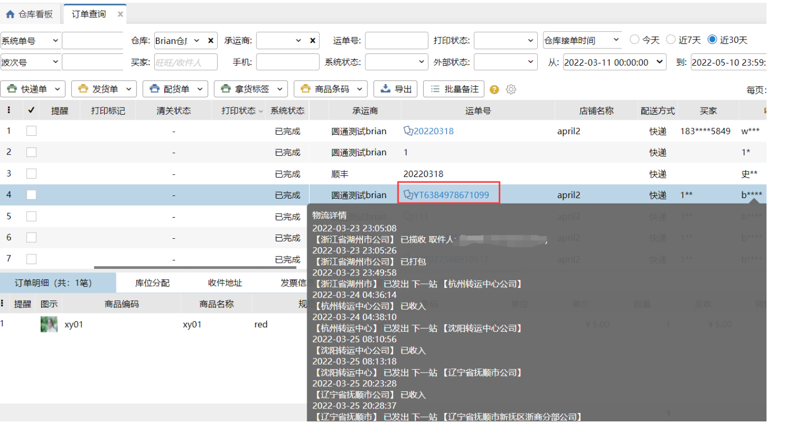

> 更新: 2025-06-03 10:43:48  

> 原文: <https://hupun.yuque.com/unzko7/lsbfg0/ybtgqywotqpl2x77>

---

## 11.2. 仓储费用与发票结算

### 11.2.1 发票打印

> 原始文件来源：`00-源文件/操作手册/财务/发票/发票打印.md`

发票打印页面是为了用户快速找到需开票订单进行打印发票操作并导出发票核对数据。

#### 1.查询

发票打印支持单号、仓库、打印状态、发票抬头、时间、打印批次号、开票人、系统状态、是否开票等查询，默认查询条件是近7天创建具体见下图。

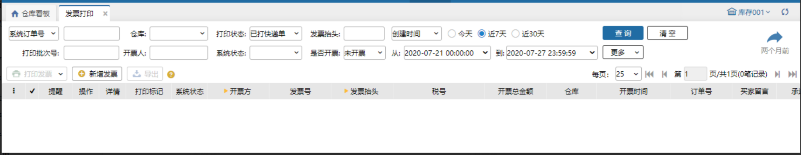

提示

1、若erp推送一笔需开票的订单至wms，则此页面会增加此订单的发票记录。

2、若订单需要开票且未打印任何单据且外部状态是拦截，则此页面的此订单发票记录会自动删除。

 

#### 2.新增发票

erp推送到wms的订单是不需要开票的，但买家临时要求开票。用户可以按照下述步骤进行新增发票操作。

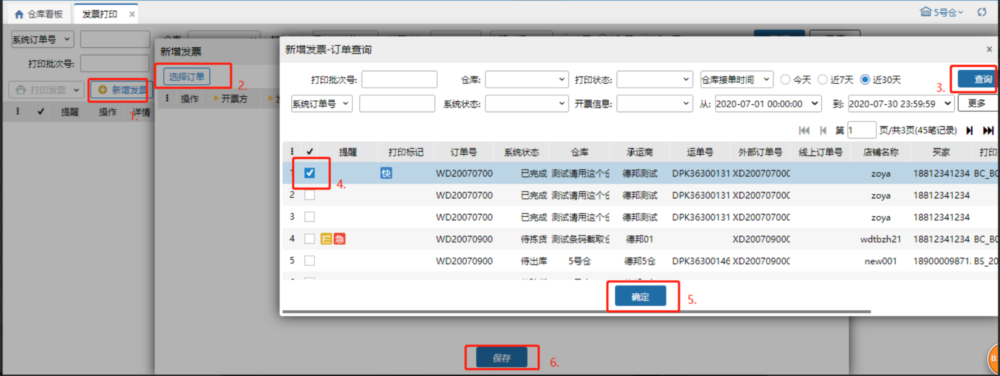

 

#### 3.打印发票

按照下图步骤，可以打印发票，图中开票时间就是发票打印时间。

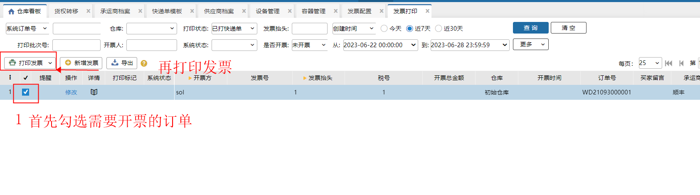

 

#### 4.设置发票号

##### **01.直接勾选订单，点击打印发票。**

用户更具自己的需求设置发票号，点击确认，则订单能设置发票号并打印；

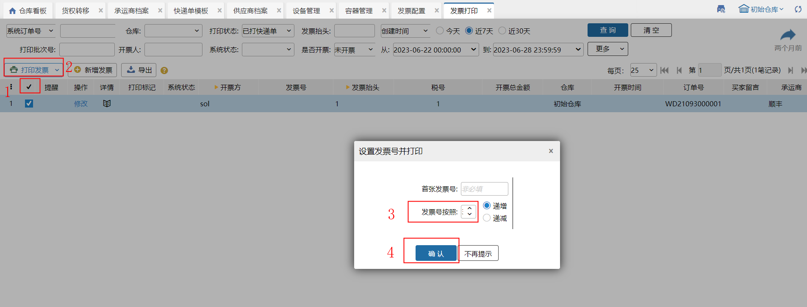

**提示**

1.首张发票号：非必填，填写后该数据为第一张发票中的发票号；

2.确认：根据设置的发票号规格保存对应订单的发票号且打印发票；

3.不再提示：根据设置的发票号规格保存对应订单的发票号且打印发票，浏览器自动记录下一个会生成的首张发票号，且该对话框之后不再提示，但是打印的发票中仍然会有对应的发票号显示；用户可以清除浏览器缓存可以将改对话框再次展现，但是之前设置的规则也将清空，需要重新设置；

4.关闭页面按钮：不记录设置规则且不打印发票。

##### **02.点击设置发票号设置**

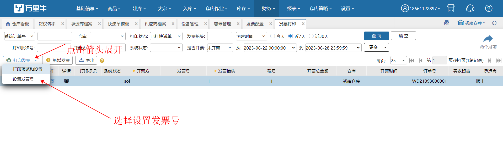

**提示**

1.首张发票号：非必填，填写后该数据为第一张发票中的发票号；

2.确认：保存设置的发票号规格，但是未保存在订单中，需要打印才能保存到订单中；

3.取消：不记录设置规则；

4.关闭页面按钮：不记录设置规则。

#### 5.导出发票

点击导出按钮，如下图选择某种方式后即可导出数据，快速对账发票信息。

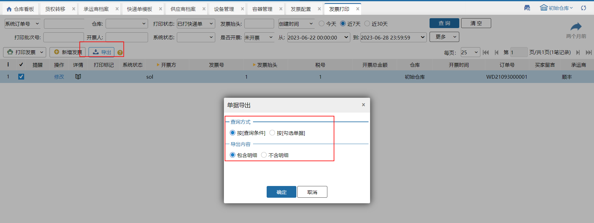

> 更新: 2023-12-21 18:09:46  

> 原文: <https://hupun.yuque.com/unzko7/lsbfg0/zksz0sqph2aruirv>

---

### 11.2.2 发票配置

> 原始文件来源：`00-源文件/操作手册/财务/发票/发票配置.md`

发票配置是通过店铺来关联该店铺需要开票订单的开票方，从而快捷开票。新增发票配置的步骤见下图。用户也可以针对某个开票方进行停用或启用操作。

> 更新: 2023-12-19 14:54:20  

> 原文: <https://hupun.yuque.com/unzko7/lsbfg0/pwhn6tgbbfdtd4xa>

---

### 11.2.3 承运商对账

> 原始文件来源：`00-源文件/操作手册/财务/对账/承运商对账.md`

在仓库日常工作中，需要定期与承运商进行运费对账，鉴于包裹数量实在太多，没有精力手工计算快递收费是否正确，就可以用承运商对账来解决。

#### **1.承运商对账(旧版)**

选择需要对账的承运商、日期及费用误差设置，点击选择文件导入模板，点击开始对账，生成任务可以在数据中心，数据导入看到该任务，导入成功后可以下载结果查看。

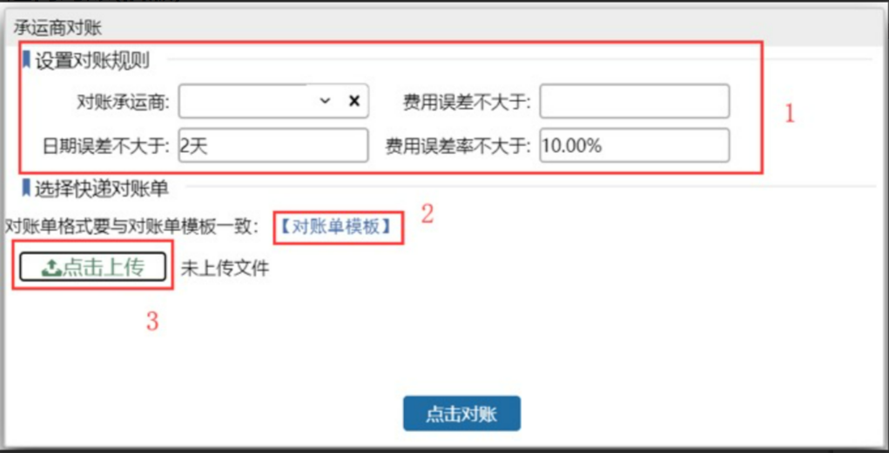

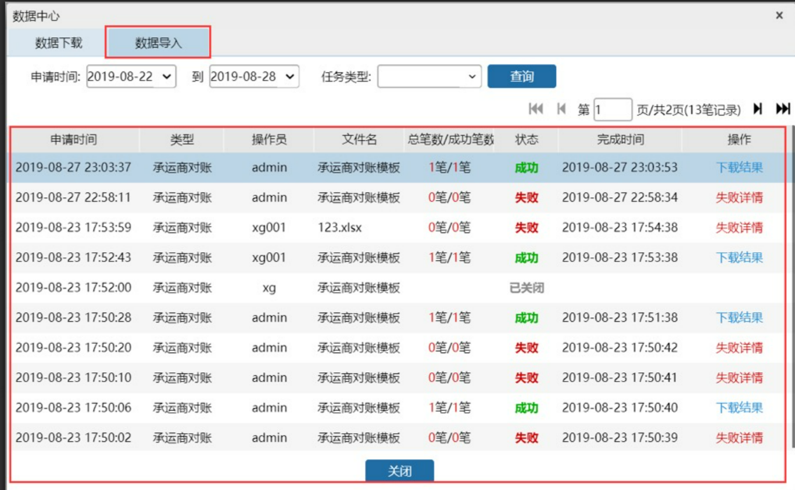

提示：

1、不能直接将快递公司给您的模板，导入到我们系统里进行对账。需要按照我们的模板格式，填写内容，然后导入到我们系统进行对账。

2、顺丰开启保价业务，模板上增加一列增值费。

3、多仓库使用同一承运商可一起对账。

#### **2.承运商对账(升级版)**

考虑快递月结特性，有时候运费是已经发了一段时间货以后才谈妥，这样就会出现谈之前的运费不准，对账是个问题，如果单量很大那么用户基本无法操作，为了解决这一问题，承运商对账功能做了升级。

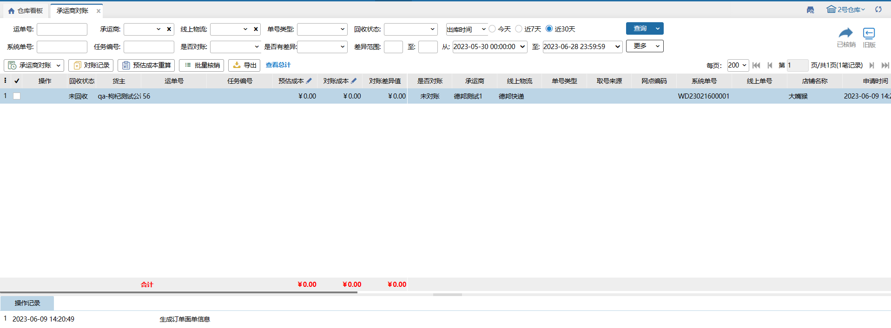

**页面显示的订单来源**

已出库的订单必须有运单号；未出库的订单只有申请了电子面单才会在承运商对账升级版页面显示。                      

**承运商对账**                        

选择需要对账的承运商、日期及费用误差设置，点击选择文件导入模板，点击开始对账，生成任务可以在数据中心，数据导入看到该任务，导入成功后可以下载结果查看。成功后会在对账记录页面生成一个任务。

                       

#### 3.批量修改对账成本                       

支持批量修改对账成本，可以直接取订单上的快递成本即预估成本，也可以自定义对账成本，修改成功后会在对账记录页面生成一个任务。                       

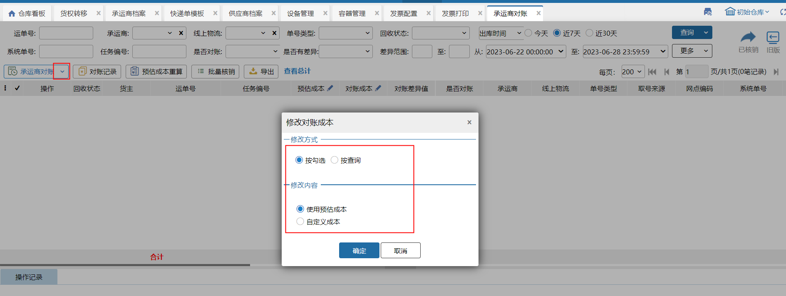                  

#### 4.对账记录

对账成本通过承运商对账或批量修改或单笔修改后都会在对账成本页面新增一个任务。

  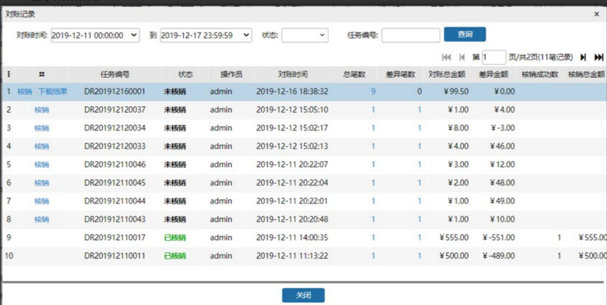

①.通过承运商对账新增的任务有下载结果查看；通过批量修改对账成本或单笔修改对账成本新增的任务只有核销按钮。

②.总笔数和差异笔数支持跳转查询，差异笔数是该任务中快递给的费用和订单上的费用不一样的订单。

③.点击核销会有一个系统任务，任务完成后会把任务中的核销成功的订单最新的对账成本自动修改到订单上且会显示核销成功笔数和核销成功笔数的总金额。

④.超过7天的任务不支持核销。

⑤.订单重复修改对账成本创建多个任务是以最新一个为准，且订单上的任务编号也是最新的一个。

#### 5.预估成本重算

针对运费是已经发了一段时间货以后才谈妥，之前的运费就不对这个问题，通过某个出库时间段的某些承运商重新计算快递成本，使对账更方便。

当前规则计算，选择承运商和出库时间段，根据承运商运费规则重新计算在出库时间段内且属于该承运商的订单的快递成本。出库时间选择的范围是当前时间的近180天，时间段开始和结束的区间只能是60天。确认重新计算后会自动新建一个系统任务，任务完成后，承运商对账页面订单的预估成本会显示重新计算后的运费。

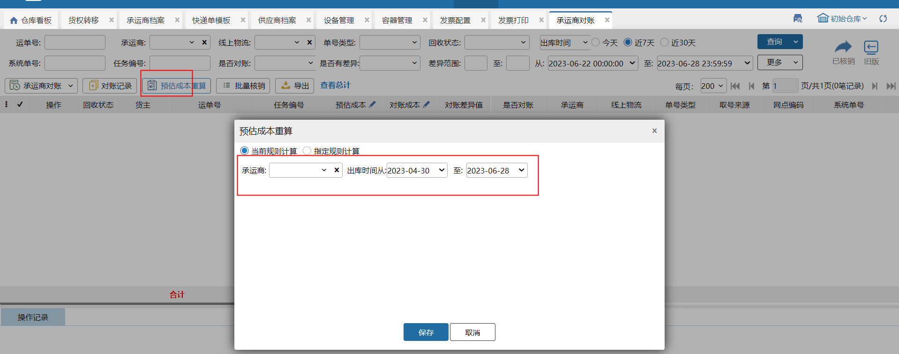

指定规则计算，选择承运商和出库时间段，根据设置的运费规则重新计算在出库时间段内且属于该承运商的订单的快递成本。出库时间选择的范围是当前时间的近180天，时间段开始和结束的区间只能是60天。确认重新计算后会自动新建一个系统任务，任务完成后，承运商对账页面订单的预估成本会显示重新计算后的运费。

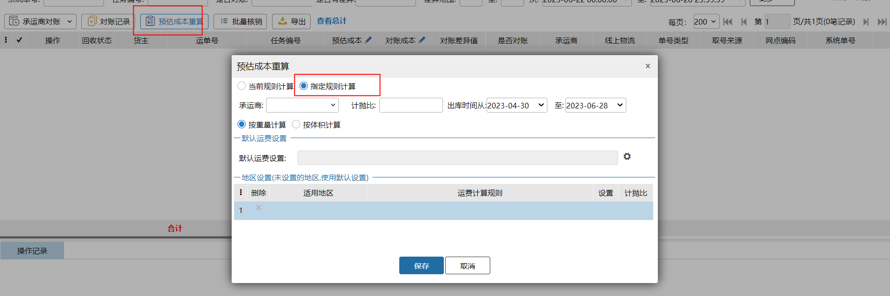

#### 6.批量核销

支持勾选订单进行批量核销。但是核销的订单必须已对账。

#### 7.导出

支持勾选和查询导出。

#### 8.已核销

已经完成核销确认的订单自动跑已核销页面，可以根据核销时间或任务时间查看快递费用总金额。

#### 9.运费模拟试算

按重量、按体积模式设置运费时增加模拟试算入口，支持按订单信息/自定义信息模拟计算快递费用。如图所示：

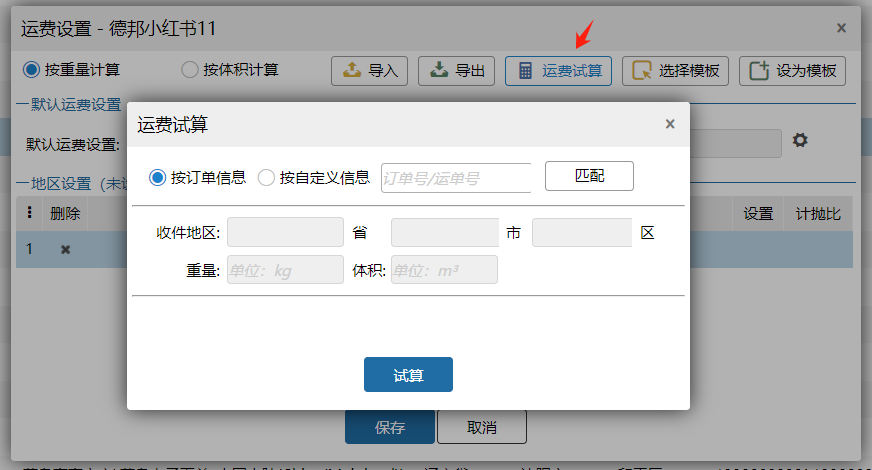

(1).按订单信息

a.不支持跨仓查询订单（货主费率配置-出库运费除外）。

b.扫描订单的系统单号或运单号匹配订单，带出订单数据。（运单号匹配到多个订单时，取第一笔）

c.订单状态和订单承运商不匹配也可以进行模拟计算。

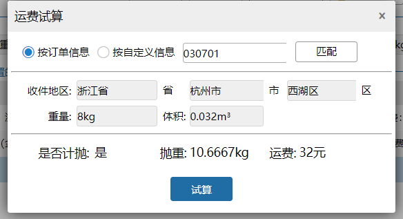

(2).按自定义信息

a.省市区、重量、体积必填，点击试算后计算运费结果。

注：适用地区不符合时用默认运费计算（取承运商上计抛比计算），若无默认运费计算，则计算无结果。

已支持页面：运费模板设置、运费设置、承运商对账-预估成本重算、货主费率配置-出库运费。

> 更新: 2024-03-15 14:41:26  

> 原文: <https://hupun.yuque.com/unzko7/lsbfg0/qz8ww20a1f4vog1d>

---

### 11.2.4 货主充值

> 原始文件来源：`00-源文件/操作手册/财务/费用统计/货主充值.md`

开启3PL后，货主可以自定义按单量/金额配置货主费用，可在货主充值页面进行充值/扣减、查询和导出。

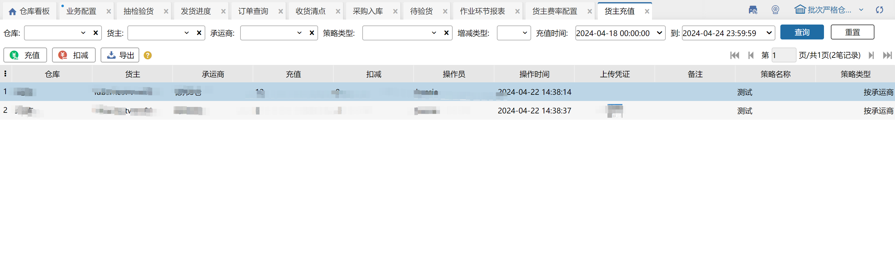

#### 1.充值

选择对应仓库、货主后，会带出对应策略，填写充值金额/充值数量，并上传凭证后，点击确定，即可对对应策略进行充值操作，在列表可查看充值明细。

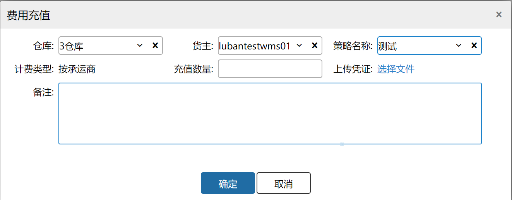

#### 2.扣减

选择对应仓库、货主后，会带出对应策略，填写扣减金额/扣减数量，并上传凭证后，点击确定，即可对对应策略进行扣减操作，在列表可查看扣减明细。

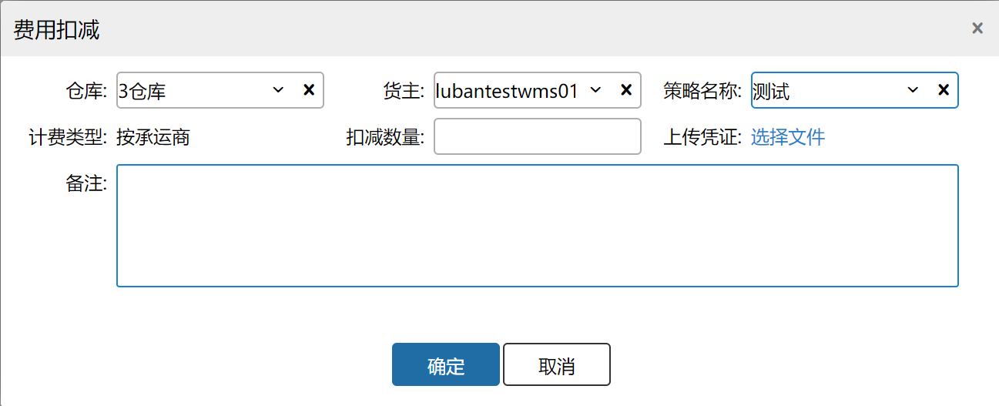

注：

1.仓库、货主关联操作员数据权限，只会显示操作员权限内、且授权对应仓库的货主数据

2.若对应仓库+货主有已存在的策略且仅有一个，则自动带出策略名称，否则不带出

#### 3.查询

当选择单个策略类型时，页面显示汇总和合计数据，若选择多个策略类型或未选择时，页面不显示汇总和合计数据：

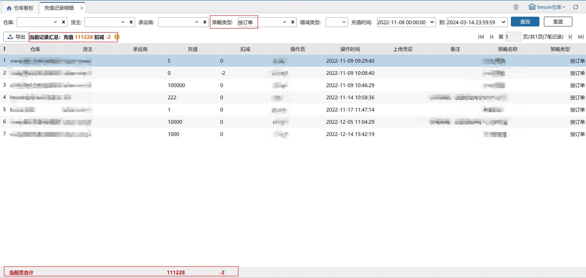

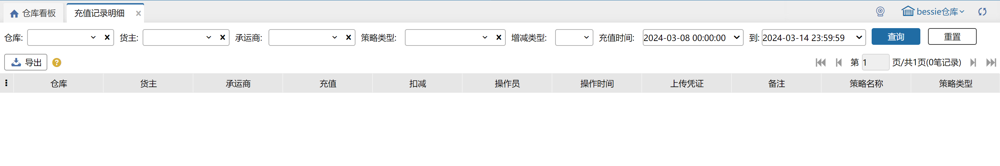

> 更新: 2024-04-24 16:52:12  

> 原文: <https://hupun.yuque.com/unzko7/lsbfg0/kyab37f1xa2f757o>

---

### 11.2.5 货主单量统计

> 原始文件来源：`00-源文件/操作手册/财务/费用统计/货主单量统计.md`

3PL公司，仓库+货主配置了按单量统计，在货主单量统计中看查询单量相关数据。

1.统计维度可以分为按天统计和汇总统计。

2.列表中可以看到充值单量、使用单量和剩余单量数据，能够根据日使用单量和剩余单量看出货主的订单状况并及时充值单量。

> 更新: 2023-12-19 15:15:21  

> 原文: <https://hupun.yuque.com/unzko7/lsbfg0/advt9rgc126gg41r>

---

### 11.2.6 货主增值费用

> 原始文件来源：`00-源文件/操作手册/财务/费用统计/货主增值费用.md`

仓库内替货主进行包装、清点、除尘、换标、洗护、维修等作业需要向货主收取费用，因费用名目，计费维度、来源数据等不同故货主增值费用支持自定义配置费用。

#### 1.查询

可根据货主、商品类型、费用名称进行查询。

#### 2.费用类型维护

填写类型名称和单价，单价可不填，新增的费用类型可删除，但关联增值费用的类型不能删除。

点击...进入设置页面，可指定货主设置单价，同一货主不能重复设置多个单价：

#### 3.新增费用

3.1 按关联单据新增单个费用类型。

1）费用类型、费用名称、货主及产生费用必填，选择费用类型后，默认带出费用名称（同费用类型）关联单据类型选择后，关联单据编码必填，单据类型包括出库单、入库单、盘点单、加工单、移库单。

2）单据编码填写后需匹配成功才能保存生效，出库单、入库单、加工单根据货主+单据类型进行匹配，盘点单、移库单根据单据类型进行匹配。

3）计费单价和产生费用可以为负数，可用于费用审核过后发现不对去进行对冲纠正。

3.2 按关联单据新增多个费用类型。

1）关联单据类型选择后，关联单据编码必填，单据类型包括出库单、入库单、盘点单、加工单、移库单。

2）单据编码填写后需匹配成功才能保存生效，出库单、入库单、加工单根据货主+单据类型进行匹配，盘点单、移库单根据单据类型进行匹配。

3）匹配成功后列表“费用类型”、“单价”会自动带出当前仓维护的费用类型数据，“数量”为单据中商品数量，金额由系统自动计算带出。

4）费用名称、单价支持向下填充。

注：金额非必填，若填0或空则此条费用无效，费用名称非必填；若金额非空或非0，则费用名称必填。

#### 4.删除费用

可以点击列表-操作中的删除，删除单条费用，也可以勾选多条费用，点击删除按钮进行批量删除。

#### 5.审核

1）点击审核会弹二次确认窗，确认后审核通过费用生效，这笔费用会进入货主费用明细-增值费用中，货主费用统计中也会统计该笔费用，统计时间为费用的创建时间。

2）若配置了按金额扣减，审核后会扣减对应金额。

#### 6.增值费导入

支持导入增值费用任务。

1.关联单据类型仅支持入库单、出库单、盘点单、加工单、移库单，否则报错。

2.关联单据类型和关联单据编码关联，若填则都需填。

3.计费单价：未填写单价时，取值费用类型单价；计费数量：未填时取值匹配单据的数值。

注：不与单据强关联，不符合单据数据也可导入成功。

4.产生费用未填写时通过计算得出，即计费单价×计费数量。

5.计费单价、产生费用可为负数。

#### 7.批量审核

支持勾选多笔批量审核。

1.支持跨页勾选，限制最大1000单。

2.支持部分成功，审核失败的保留勾选。

3.审核成功后，对应货主费用明细和统计会显示数据，货主单量按金额会扣减对应金额。

> 更新: 2025-08-11 11:59:28  

> 原文: <https://hupun.yuque.com/unzko7/lsbfg0/uxglu8wumzs5oxyp>

---

### 11.2.7 货主账单

> 原始文件来源：`00-源文件/操作手册/财务/费用统计/货主账单.md`

为极大方便与货主进行对账，节约人工数据加工成本，新增货主账单。

#### 1.账单模板配置

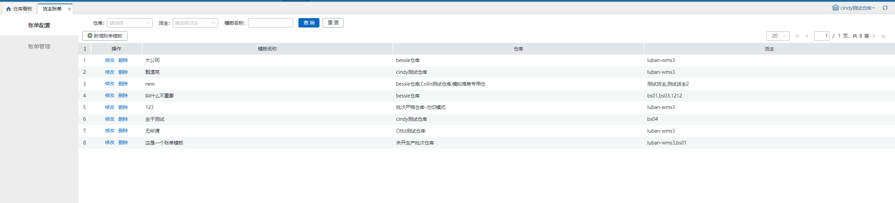

##### 01.新增账单模板

①输入模板名称，选择仓库和货主，账单时间可以选择每月一份或者选定时间汇总一份，不勾选明细单就只生成一个汇总单，勾选明细单会导出出库费用、出库运费、入库费用、存储费用、增值费用各条明细。

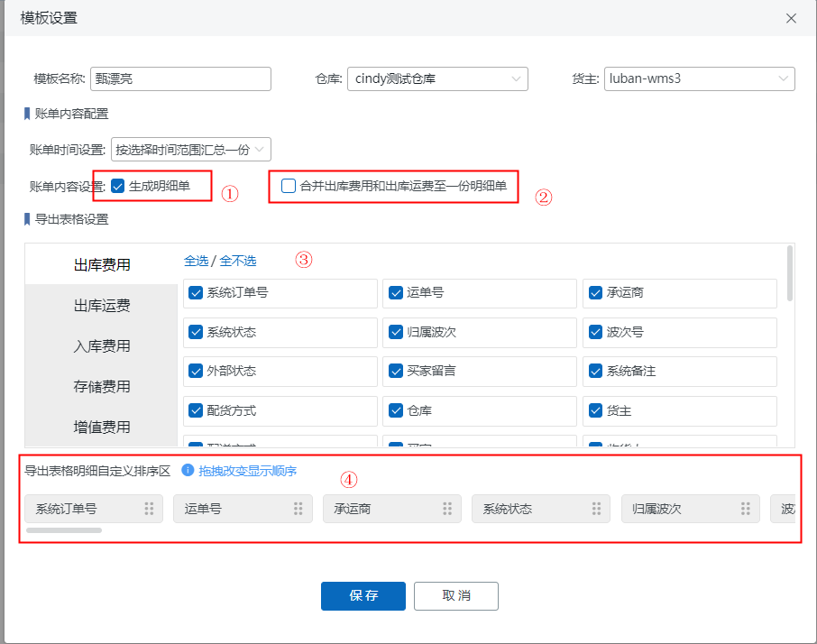

②勾选可合并出库费用和出库运费至一份明细单。

按费用项分别显示：导出下载账单，按费用类型项一笔订单多行分开显示。

按订单汇总显示：导出下载账单，一笔订单仅显示一行。（支持费用合计统计）

注：初算和重算冲红不支持合并一行显示。

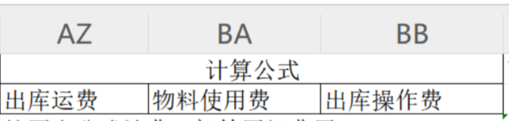

③勾选按包裹生成。

导出订单中若有包含多包裹/子母件的，可以按包裹维度导出。可叠加“合并出库费用和出库运费至一份明细单”使用。

④选择每个明细单导出的数据，可以选择比较重要的数据进行导出。

⑤拖拽改变显示顺序，导出后按顺序显示。

##### 02.修改模板

修改模板和设置模板页一致，修改后即时生效，若有对应的账单下载按新设置模板下载。

#### 2.账单管理

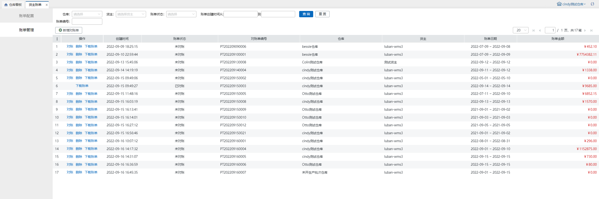

##### 01.新增对账单

选择仓库、货主、费用产生时间，仓库和货主单选，费用产生时间间隔不超过2个月，时间不能重复，可以勾选包含账单时间外的冲红记录，不勾选查询时间内的所有费用，新增时没有对应的仓库+货主 模板报错，需先添加模板。

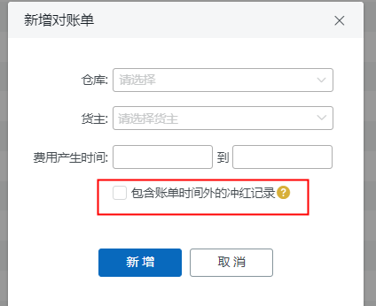

##### 02.对账、删除账单，对账后不能删除

##### 03.下载账单

无论是否对账，都能下载账单，账单样式如下图所示。

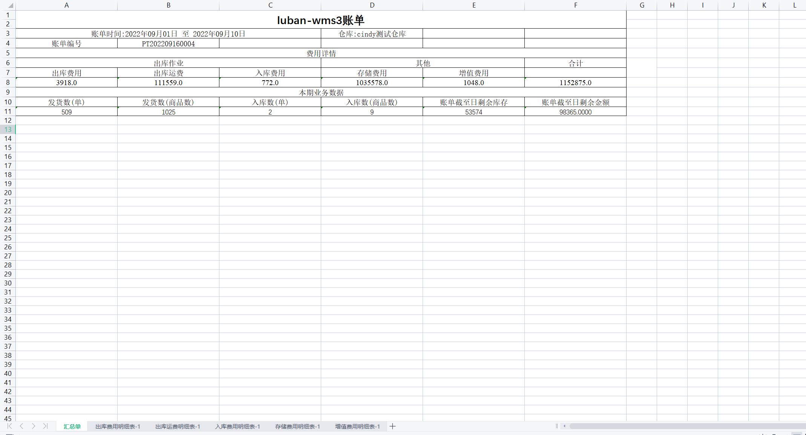

> 更新: 2025-01-02 18:04:26  

> 原文: <https://hupun.yuque.com/unzko7/lsbfg0/wy29wpk116v4pfkh>

---

### 11.2.8 货主费率配置

> 原始文件来源：`00-源文件/操作手册/财务/费用统计/货主费率配置.md`

货主费率配置：通过对不同的货主和单据类型设置费率计算规则，用户可以计算对应货主和单据的出库运费、出库费用和入库费用，方便仓库计算管理费。该功能只对开启3pl的公司开放。

#### **1.出库费用**

点击新增可设置出库单据费用计算规则。

一个货主+一种费用分类+一个仓库只能启用一种费用规则。

单据出库后，计算出库费用

1）仓库：可以选择公司下所有仓库

2）货主：公司下所有货主

3）单据类型：系统所有的出库类型

4）费率取值：取最高时，会比较每种费用规则计算出来的费用，取最大值为最终的出库费用。取最低同理。

5）赠品商品免计算项：费用分类：「操作费」时显示，「物料使用费」不做显示。设置：是，则排除赠品商品

商品类型赠品；设置：否，则赠品商品正常计算。

6）按单计费：直接对应仓库+货主+单据类型，出库一单，计算一单的价格。

7）按商品数量：根据订单上商品等级和商品数量计算出库费用。例：单据有商品A 10个等级是1级，商品B 10个等级是2级。指定等级1级，计算区间0-10，首数量：5，价格：2.2，续数量：1，价格：4.1；指定等级2级，计算区间0-5，首数量：3，价格：2.2，续数量：1，价格：4.1，区间5-20，首数量7，价格5，续数量1，价格2，。计算价格为：（10-5)/1*4.1+2.2+(10-7)/1*2+5=33.7。

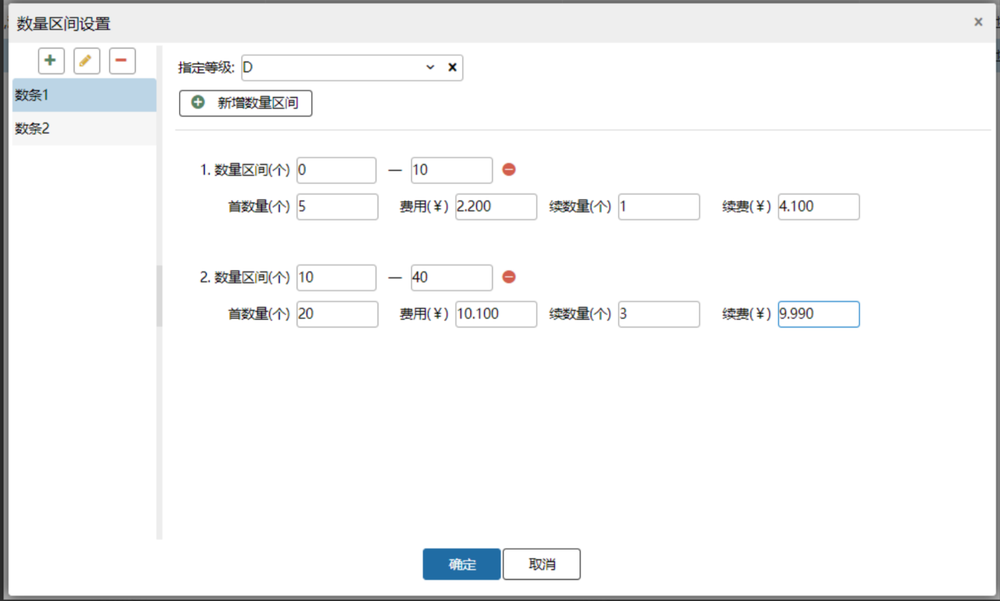

8）按商品种类：根据订单商品种类计算出库费用。计算规则同商品数量。

9）按订单重量：根据订单重量计算出库费用。计算规则同商品数量。

10）按订单体积：根据订单体积计算出库费用。计算规则同商品数量。

11）按订单重量段：先按照订单的重量确认计费单价，然后以订单的商品数量确认最终费用。

12）费用分类：操作费/物料使用费。原有计费方式5-9为操作费。

13）耗材使用费：属于物料使用费，两种取值方式：按耗材标准售价，在耗材标准售价的基础上乘以或者加减一定的数量；按自定义费用，可以设定不同的耗材对应不同的单价进行扣减。

14）按拣货库存形态：按出库时订单中拣货的库存形态，分别计算，比如3个散件+2个箱子，那么3个散件去匹配拆零区间规则，2个箱子去匹配货箱区间规则。再进行合计。

#### **2.出库运费**

出库运费是计算订单出库快递成本，可根据快递运费计算，也可以设置新的区间规则计算。

1）仓库：可以选择公司下所有仓库

2）货主：公司下所有货主

3）单据类型：系统所有的出库类型

4）承运商：公司下的所有承运商，只有选择固定成本才可以选择承运商

5）费率取值：取运费成本，意思是根据原有的承运商运费成本计算。出库运费最终为：原有承运商运费成本加减或乘除指定数值计算出来的结果。

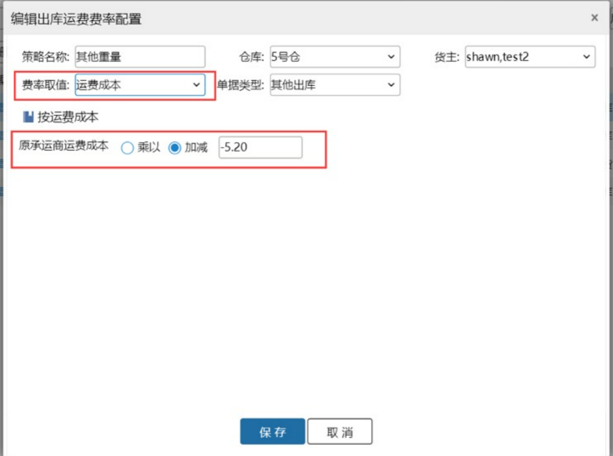

6）费率取值：取固定成本，意思是根据订单的重量或者体积计算出库运费。选择按固定成本取值后，需指定出账时间。

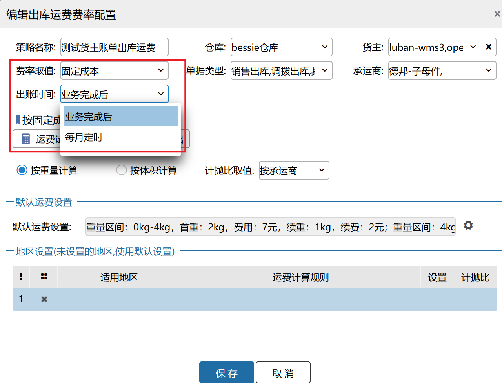

（1）出账时间：业务完成后。按照配置的计算方式，在单据完成出库后即时计算出库运费。

根据重量计算：订单重量在对应区间下，根据首重量和续重量的价格，计算结果。

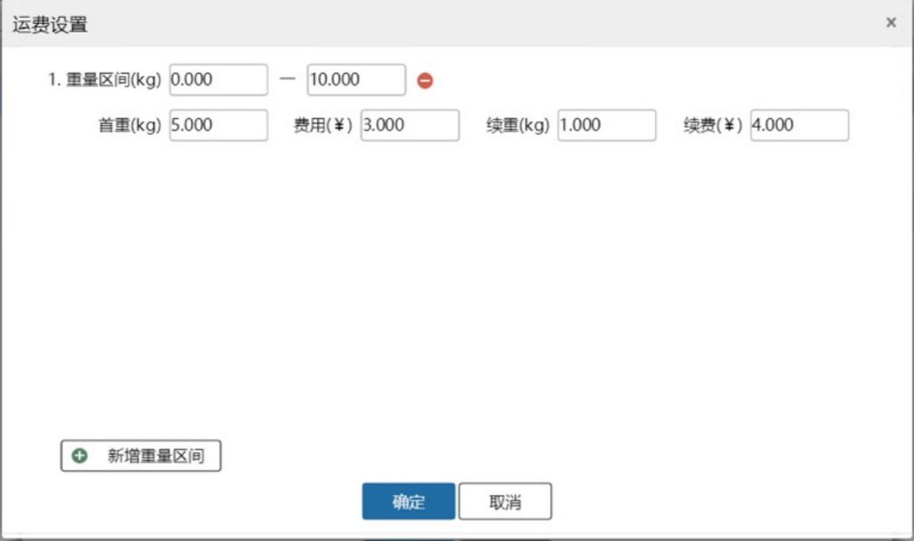

根据体积计算：实际运费=体积*运费单价+附加费用。当"体积*运费单价"小于"最低运费"时，实际运费=最低运费+附加费用。附加费用指综合信息服务费、燃油附加费等。

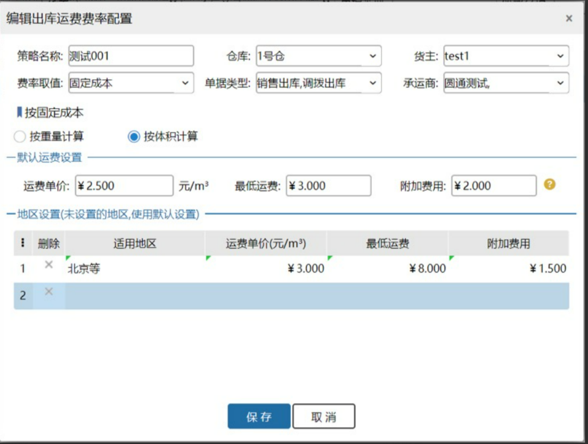

（2）出账时间：每月定时。按设置的每月出账日（1-28号任意一天，或月末）定时计算运费。

统计范围：符合策略且出库时间在出账日往前一个自然月内的订单。

根据重量计算时，每个重量区间支持单独设置计算方式，订单重量/均重在对应区间下，根据首重量和续重量的价格，计算结果。

业务发生后按单：按照订单实际重量所在区间计算费用；

每月定时按均重区间：按匹配策略且在指定地区和重量区间范围内的有效订单平均重量计算费用。

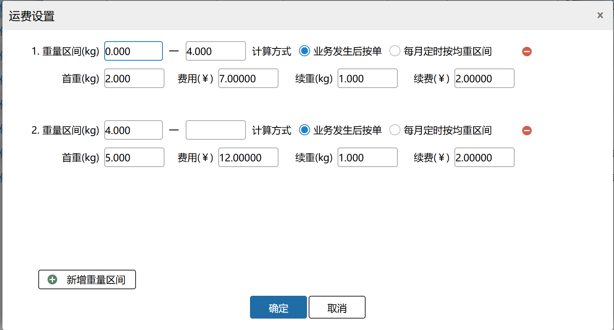

按照体积计算时，实际运费=体积*运费单价+附加费用。当"体积*运费单价"小于"最低运费"时，实际运费=最低运费+附加费用。附加费用指综合信息服务费、燃油附加费等。

7）按重量、按体积模式设置运费时增加模拟试算入口，支持按订单信息/自定义信息模拟计算快递费用。如图所示：

(1).按订单信息

a.不支持跨仓查询订单（货主费率配置-出库运费除外）。

b.扫描订单的系统单号或运单号匹配订单，带出订单数据。（运单号匹配到多个订单时，取第一笔）

c.订单状态和订单承运商不匹配也可以进行模拟计算。

(2).按自定义信息

a.省市区、重量、体积必填，点击试算后计算运费结果。

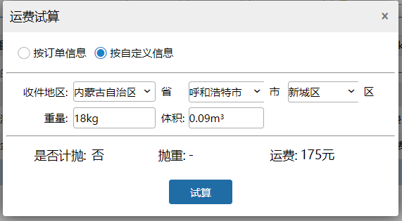

注：适用地区不符合时用默认运费计算（取承运商上计抛比计算），若无默认运费计算，则计算无结果。

已支持页面：运费模板设置、运费设置、承运商对账-预估成本重算、货主费率配置-出库运费。

#### **3.入库费用**

入库费用是计算入库单据的成本费用，方便仓库计算管理费用。

点击新增可设置入库单据费用计算规则。

一个货主+一种单据类型+一个仓库只能启用一种费用规则。

单据入库后，计算入库费用，若开启审核，审核后计算入库费用。

1）仓库：可以选择公司下所有仓库

2）货主：公司下所有货主

3）单据类型：系统所有的入库类型

4）费率取值：取最高时，会比较每种费用规则计算出来的费用，取最大值为最终的出库费用。取最低同理。

5）按单计费：直接对应仓库+货主+单据类型，入库一单，计算一单的价格。

6）按商品数量：根据订单商品数量计算出库费用。例：单据有商品10个，计算区间0-10，首数量：6，价格：1，续数量：2，价格：3。计算价格为：（10-6）/2*3+1=7。

7）按商品种类：根据订单商品种类计算出库费用。计算规则同商品数量。

#### 4.存储费用

存储费用是计算货主存放于仓库的存储成本，可根据不同方式管理费用。

点击新增可设置存储单据费用计算规则。

一个货主+一种费用分类+一个仓库只能启用一种费用规则。

1）仓库：可以选择公司下所有仓库

2）货主：公司下所有货主

3）单据类型：系统所有的入库类型

4）费率取值：取最高时，会比较每种费用规则计算出来的费用，取最大值为最终的出库费用。取最低同理。

5）费用分类：动态费用/固定费用

**动态费用：**

6）按商品日库存：按每日库存区间范围设置费用

①未开启后台开关时，只设置拆零库存数量区间，货箱库存按拆零单位换算后计算费用。

②开启后台开关时，可按拆零库存和货箱库存分开设置数量区间，并按对应形态库存数量计算费用后合计。

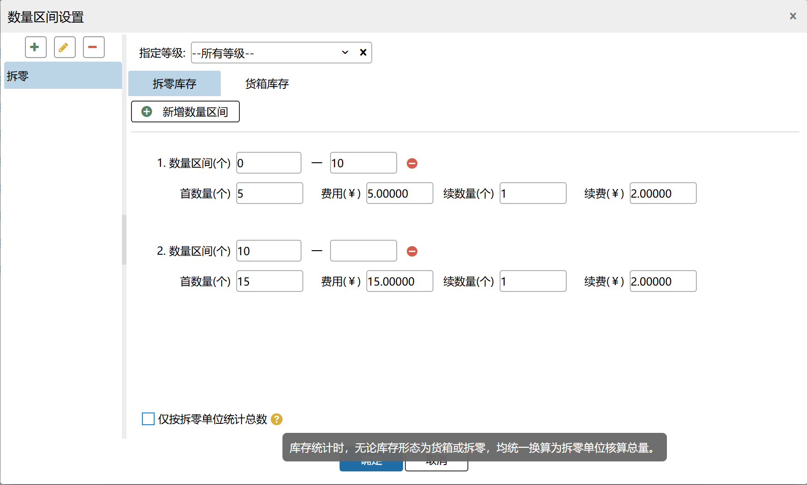

勾选【仅按拆零单位统计总数】，先将货箱库存换算成拆零库存，累加拆零库存计算总库存，在此基础上计算存储费用。

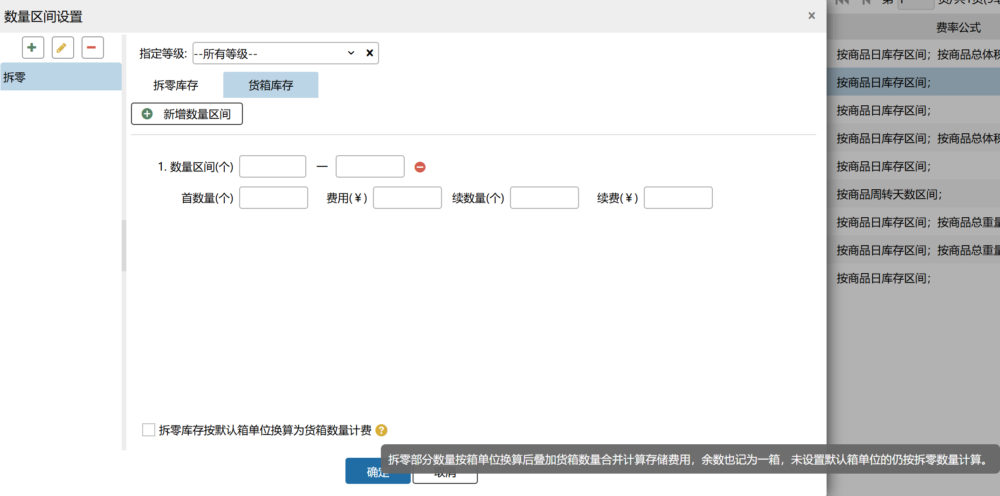

勾选【拆零库存按默认箱单位换算为货箱数量计费】，先将拆零库存换算成货箱库存，累加货箱库存计算总库存，在此基础上计算存储费用，未设置默认箱单位的仍按拆零数量计算。

7）按商品总体积：按库存商品的体积范围设置费用

8）按商品总重量：按库存商品的重量区间范围设置费用

9）按商品周转天数：按库存商品的周转天数区间设置费用，周转天数=月累计库存总件数/月累计销售总件数

10）按日使用库位：按商品每天使用的有效库位设置费用

设置维度：库位；使用方式；库位标签；库区，设置如下

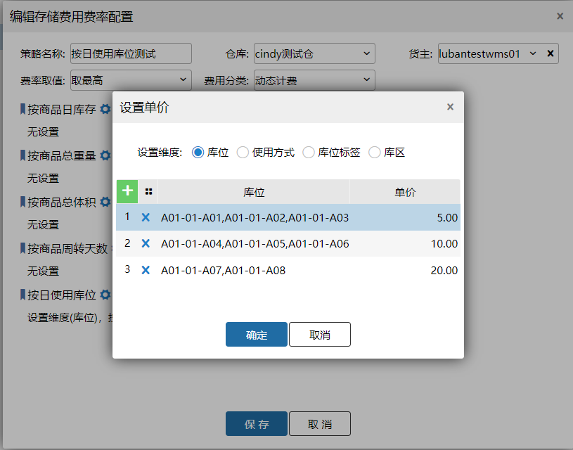

**固定费用**

11）按日固定费用：按xx/天固定收取存储费用

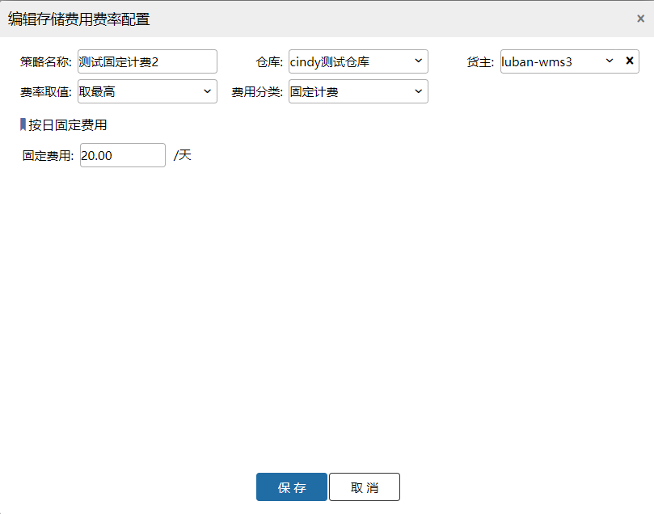

#### 5.单量设置

单量设置页面主要用于管理单量设置策略，包括新增、修改、删除、预警设置、查询等操作。

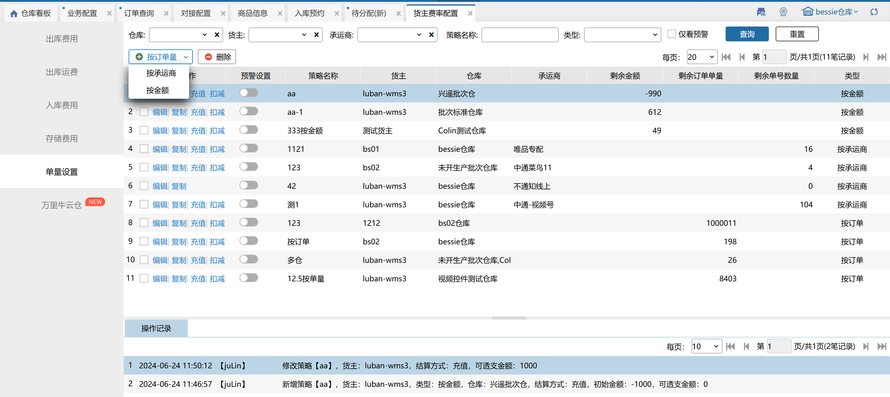

**（1）新增策略**

新增包括三种类型：按订单量、按承运商、按金额

- **按订单量新增**

选择对应货主、仓库（可多选）后，设置取消订单时是否回收数量，并设置结算方式、初始单量和允许透支单量，点击确定后策略新增成功。

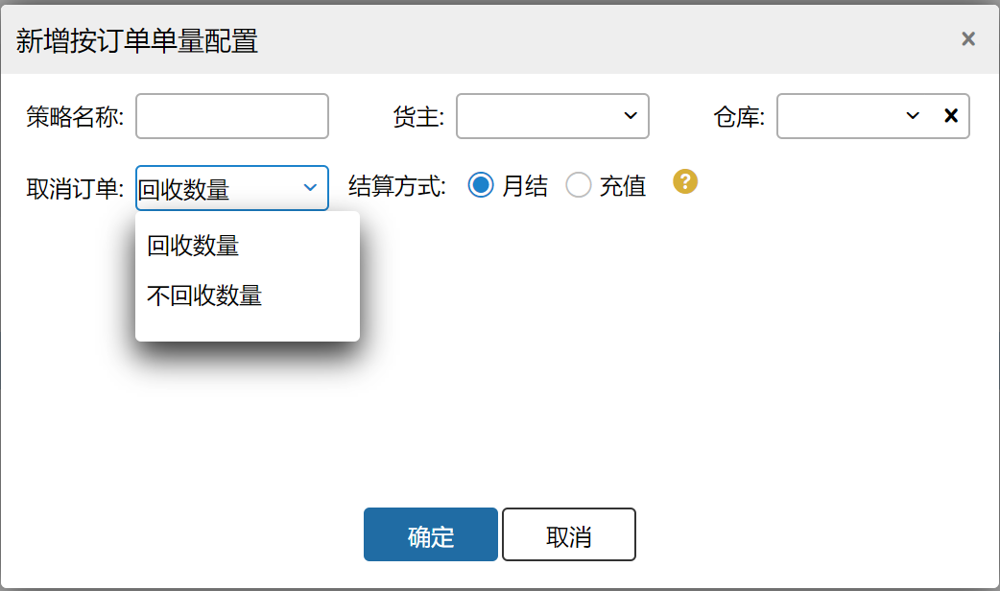

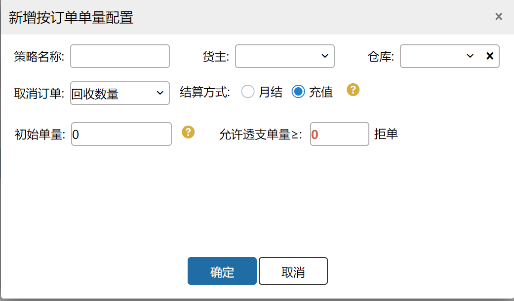

注：

1.取消订单时是否回收数量：若选择回收数量，则对应货主+仓库每个订单取消后，单号数量会自动+1；否则不会+1

2.允许透支单量：在允许透支单量范围内，对应货主+仓库允许继续接单；否则拒单

3.货主+仓库唯一，不允许存在多个相同货主+仓库的策略

- **按承运商新增**

选择对应货主、仓库、承运商后，设置结算方式、初始单量和允许透支单量，点击确定后策略新增成功。

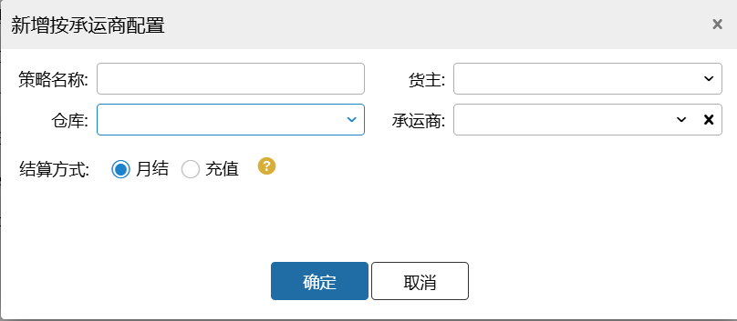

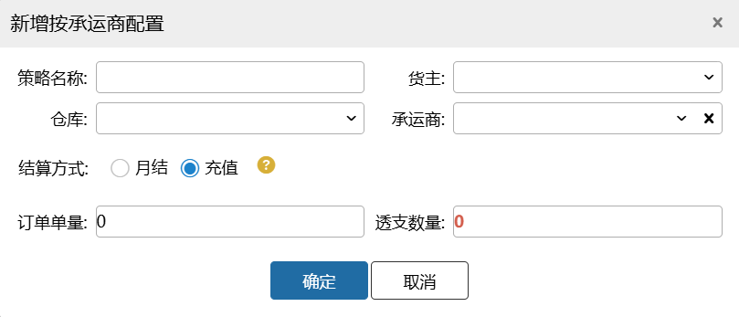

编辑按承运商配置

只能新增承运商，之前添加的承运商无法删除

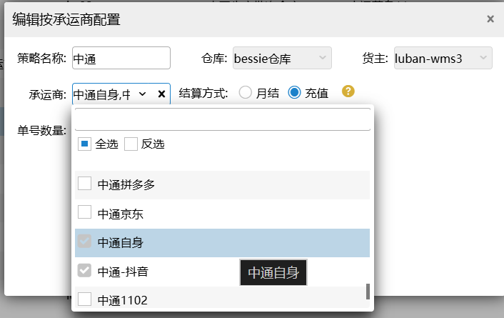

注：货主+仓库+承运商唯一，不允许存在多个相同货主+仓库+承运商的策略

- **按金额新增**

选择对应货主、仓库后，设置初始金额和可透支金额，点击确定后策略新增成功。

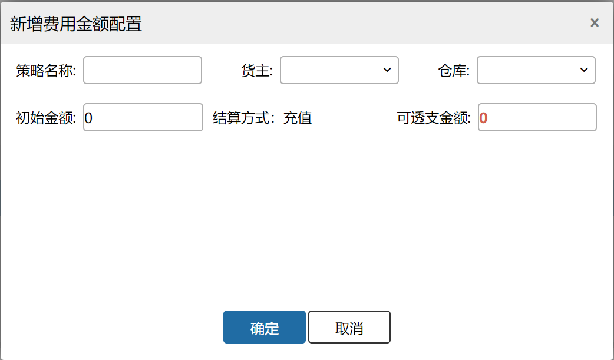

注：货主+仓库唯一，不允许存在多个相同货主+仓库的策略

（**2）修改策略**

修改策略时，置灰字段不允许修改，其他数据允许修改并保存。

**（3）删除策略**

删除策略时，若剩余金额、剩余订单单量、剩余单号数量≠0，则不允许直接删除，需要把数据处理成0后才可以删除。

**（4）预警设置**

针对单个策略设置预警，添加通知人员手机号、并设置预警值后，当策略剩余金额或单量低于预警值时，会给对应手机号发送预警信息。

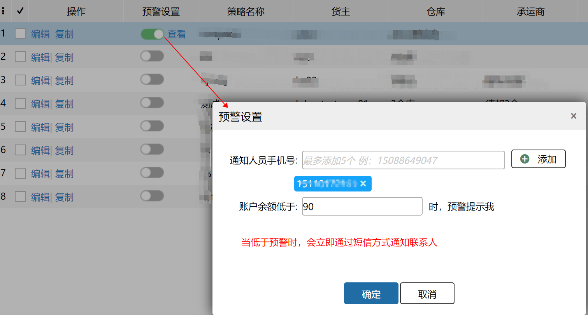

**（5）充值、扣减**

支持充值、扣减的策略，点击对应行操作按钮，页面自动跳转到货主充值页面，并带出对应策略信息，便捷操作。

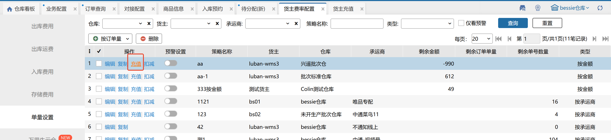

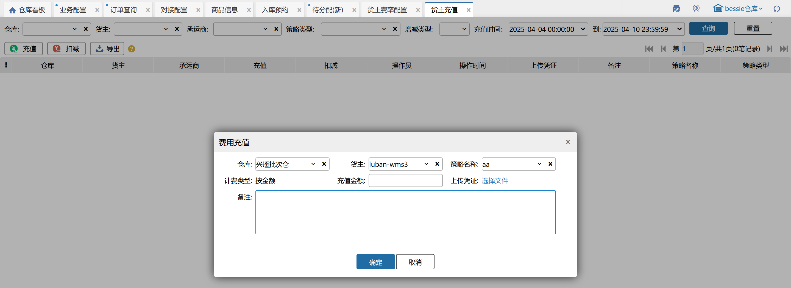

注：

1.无【货主充值】页面权限的账号，不显示充值、扣减按钮；

2.不支持充值、扣减的策略，不显示充值、扣减按钮。

> 更新: 2026-08-17 13:35:25  

> 原文: <https://hupun.yuque.com/unzko7/lsbfg0/lsy8xc0p8piv9462>

---

### 11.2.9 货主费用明细

> 原始文件来源：`00-源文件/操作手册/财务/费用统计/货主费用明细.md`

按照具体明细显示根据货主费率配置页面设置的费用规则计算出的结果。

1.支持统计显示的费用：出库费用、出库运费、入库费用、存储费用。

2.可根据仓库和货主以及单据类型进行查询筛选，仓库支持单选，货主、单据类型支持多选。（注：存储费用无单据，单据类型可不选/全选/部分选均能查出）

3.支持页面数据的导出显示。

4.支持费用重算，冲红显示。

出库费用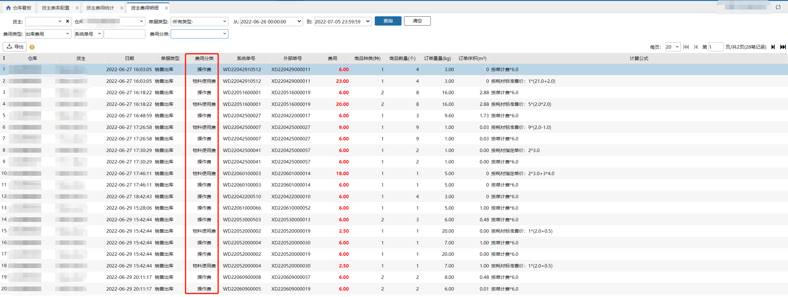出库运费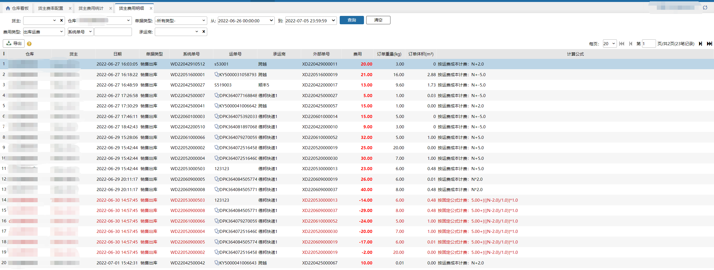

入库运费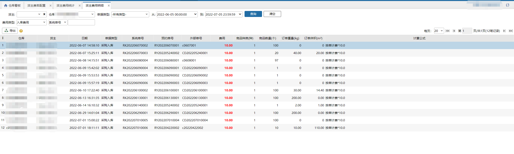存储费用

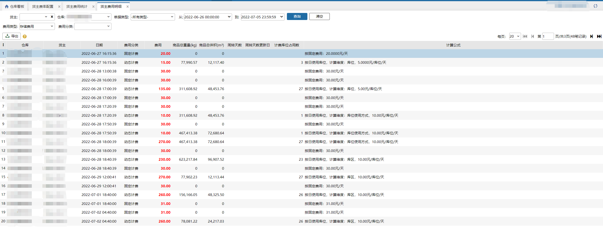

**注：存储费用-按商品日库存，如若策略设置指定等级，商品数量为满足指定等级的商品数量。**

例：仓库1+货主1，所有等级库存500，B类等级库存30，C类等级库存10，策略设置按商品日库存-指定等级-B类、C类，则仓库1+货主1，商品数量显示为40

> 更新: 2023-12-19 15:12:37  

> 原文: <https://hupun.yuque.com/unzko7/lsbfg0/ws5dnksv8cb4lt3g>

---

### 11.2.10 货主费用统计

> 原始文件来源：`00-源文件/操作手册/财务/费用统计/货主费用统计.md`

汇总统计显示根据货主费率配置页面设置的费用规则计算出的结果。

1.支持统计显示的费用：出库费用、出库运费、入库费用、存储费用。

2.可根据仓库和货主以及单据类型进行查询筛选，仓库、货主、单据类型支持多选，支持按天统计/汇总统计。

（注：存储费用无单据，单据类型可选无单据）

3.支持页面数据的导出显示。

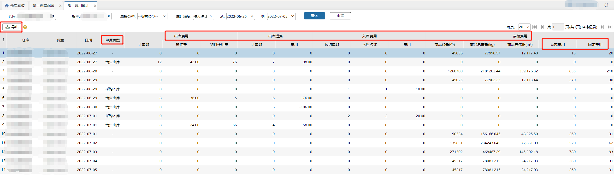**注：存储费用-按商品日库存，如若策略设置指定等级，商品数量为满足指定等级的商品数量。**

例：仓库1+货主1，所有等级库存500，B类等级库存30，C类等级库存10，策略设置按商品日库存-指定等级-B类、C类，则仓库1+货主1，商品数量显示为40

> 更新: 2023-12-19 15:10:48  

> 原文: <https://hupun.yuque.com/unzko7/lsbfg0/xet25owewavpi1n0>

---

## 11.3. 线下货主协同

### 11.3.1 WMS-线下货主模块（含订单导入）

> 原始文件来源：`00-源文件/专题功能介绍/其他/WMS-线下货主模块（含订单导入）.md`

#### 背景

在云仓的运作中，常会碰到一些B端的货主，这类货主要么使用着比较传统的且不具备对接能力的ERP要么就是个简单的进销存工具，这样就导致入仓之后订单进入系统需依赖别的对接好的ERP来导单入库、发货。

#### 操作方式

##### 配置

对接配置中将对应货主设置对接类型为：无对接，则相应的对接系统也会显示无系统，其余对接拓展配置一并隐藏

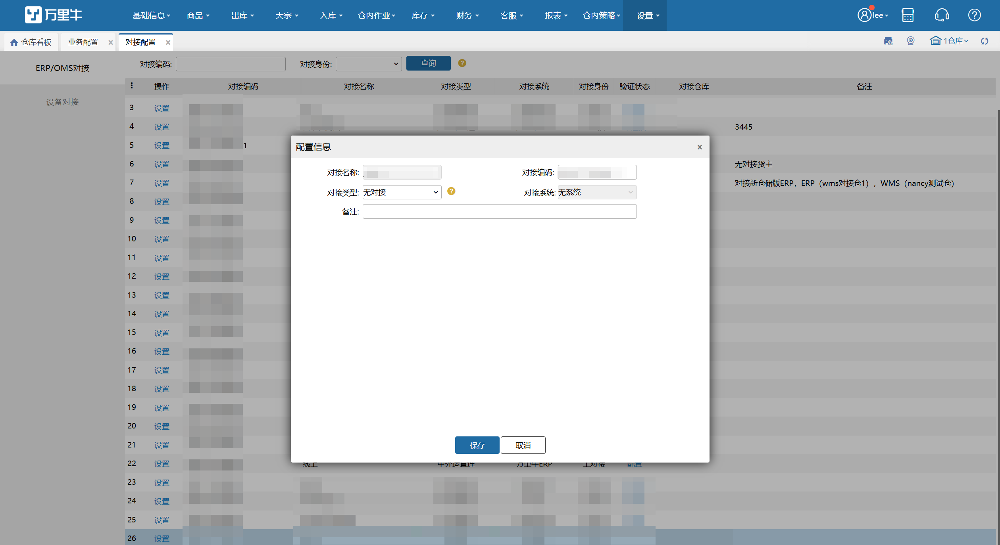

##### 入库作业

在无对接货主的入库场景下，是没有预约单的，仓库可直接使用直接入库的方式进行

采购入库、调拨入库、其他入库等使用验货入库功能

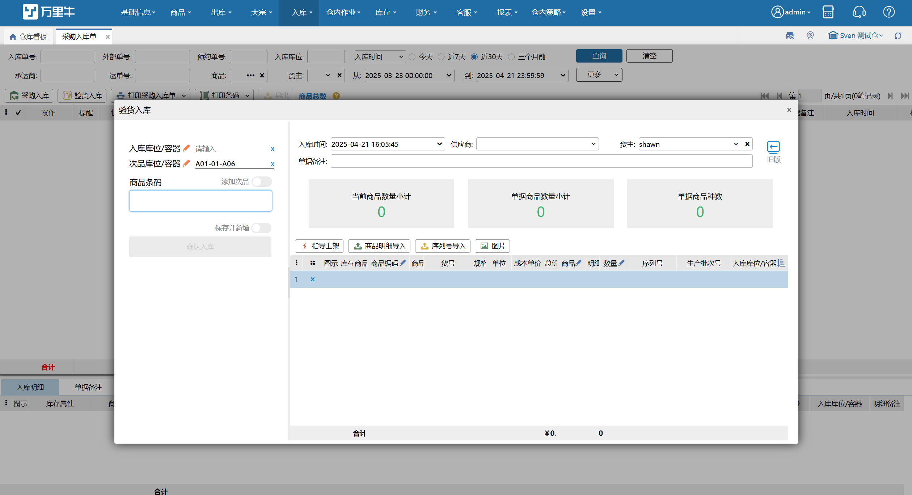

售后入库可使用疑难件登记的方式

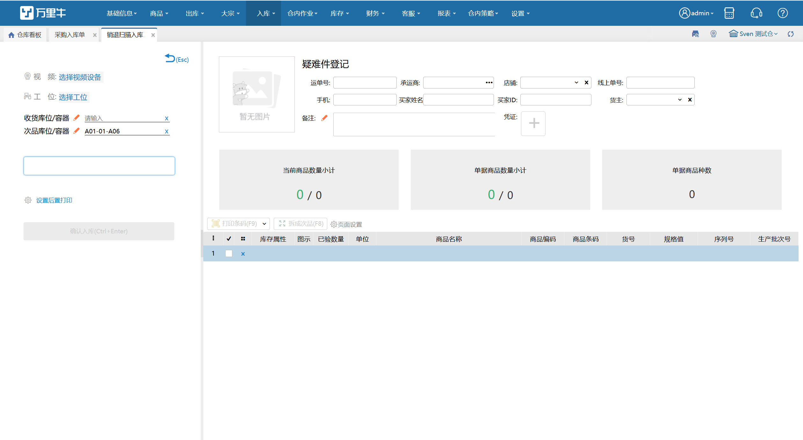

入库提交后因无系统对接所有单据会直接完成无需做对外通知

##### 出库作业

订单导入：因外部系统无法下单，此时需在WMS中创建订单进行发货。考虑到批量作业的便捷性，我们提供了订单导入功能：[点我查看详情](https://hupun.yuque.com/unzko7/lsbfg0/nv9oiqnedsx6n06n)

##### 库存盘点及其他操作

当货主为无系统对接的情况下所有执行的盘点调整，商品同步、订单流转状态同步等操作均按同步完成记录。

> 更新: 2025-04-21 16:55:09  

> 原文: <https://hupun.yuque.com/unzko7/lsbfg0/uihzqs5i3l24gsfu>

---
