# 12. 报表与运维辅助

> 资料来源：基于 `00-源文件/` 对应模块的原始操作手册、专题功能与PDA文档重组迁移。
> 事实边界：正文仅重组迁移原始文档；章节编号、目录和来源标记为整理信息，不新增业务规则、字段或流程。

## 本章知识目录

- **12.1 仓储运营数据报表**
  - [仓库看板](#1211-仓库看板)
  - [公司看板](#1212-公司看板)
  - [现场操作看板](#1213-现场操作看板)
  - [货主出库统计报表](#1214-货主出库统计报表)
  - [货主看板](#1215-货主看板)
  - [入库交接记录](#1216-入库交接记录)
  - [出入库明细报表](#1217-出入库明细报表)
  - [出入库汇总报表](#1218-出入库汇总报表)
  - [出库交接记录](#1219-出库交接记录)
  - [出库完成率统计表](#12110-出库完成率统计表)
  - [库位库存流水](#12111-库位库存流水)
  - [待分配商品统计](#12112-待分配商品统计)
  - [热销商品搭配报表](#12113-热销商品搭配报表)
  - [生成波次统计报表](#12114-生成波次统计报表)
  - [耗材统计报表](#12115-耗材统计报表)
  - [订单重量分析报表](#12116-订单重量分析报表)
  - [作业环节报表](#12117-作业环节报表)
  - [入库上架统计表](#12118-入库上架统计表)
  - [拣货作业报表](#12119-拣货作业报表)
  - [绩效明细报表](#12120-绩效明细报表)
  - [绩效统计报表](#12121-绩效统计报表)
  - [商品库龄报表](#12122-商品库龄报表)
  - [库位热力分布](#12123-库位热力分布)
  - [待上架新品统计](#12124-待上架新品统计)
  - [补货明细报表](#12125-补货明细报表)
- **12.2 物流跟踪与耗材管理**
  - [耗材回收](#1221-耗材回收)
  - [耗材智能推荐](#1222-耗材智能推荐)
- **12.3 视频监控与硬件运维专题**
  - [WMS-视频监控专题总览](#1230-WMS-视频监控专题总览)
  - [【视频监控】【FTP教程】在局域网中搭建FTP存储服务器](#1231-视频监控FTP教程在局域网中搭建FTP存储服务器)
  - [【视频监控】【路由器设置】检查穿透模式网络环境及调整优化](#1232-视频监控路由器设置检查穿透模式网络环境及调整优化)
  - [【视频监控】水印导出增加多通道画中画+多分屏功能](#1233-视频监控水印导出增加多通道画中画多分屏功能)
  - [【视频监控】水印导出增加局部放大功能，适配单号放大场景](#1234-视频监控水印导出增加局部放大功能适配单号放大场景)
  - [WMS-入库质检](#1235-WMS-入库质检)
  - [WMS-加工任务](#1236-WMS-加工任务)
  - [WMS-审批模块](#1237-WMS-审批模块)
  - [WMS-拆单生成子母件](#1238-WMS-拆单生成子母件)
  - [账号管理功能升级介绍](#1239-账号管理功能升级介绍)

---

## 12.1. 仓储运营数据报表

### 12.1.1 仓库看板

> 原始文件来源：`00-源文件/操作手册/报表/看板/仓库看板.md`

管理员登录wms默认首页显示仓库看板，其它有仓库看板权限的操作员登录的首页是仓库看板。没有权限的操作员登录的首页是流程图首页，见无仓库看板权限首页。

1. 锁：点击可解锁模块。

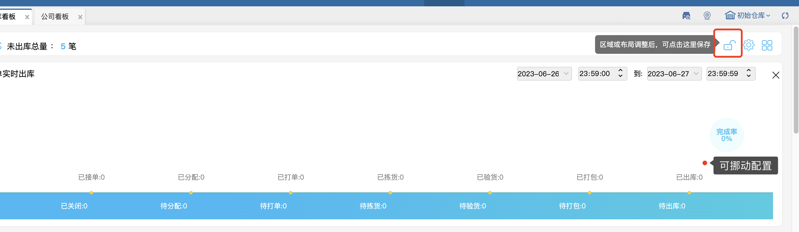

2. 刷新：刷新所有模块的数据，有1分钟缓存（即一分钟内查询的信息都相同）。

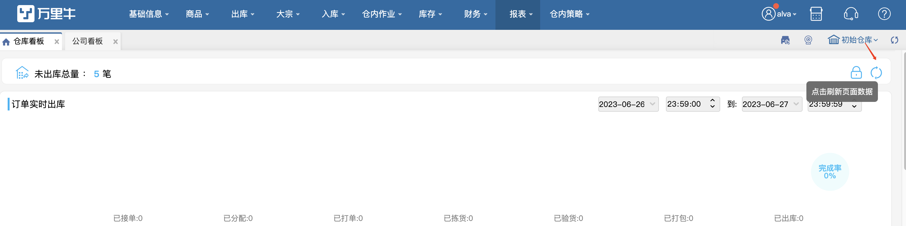

点击解锁后：可以增删模块，也可以调整模块的宽度，宽度比例仅可设置为1/4、1/2、3/4、4/4。（仅可调整宽度）

3. 开着的锁：点击可锁定并保存模块。

4. 模块设置按钮：可选择需要展示的模块。

5. 模块还原：还原初始系统默认模块和布局。

6. 模块右上角的“×”：点击可删除模块。

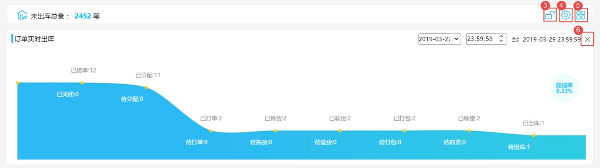

 

仓库看板可分为如图8个模块。

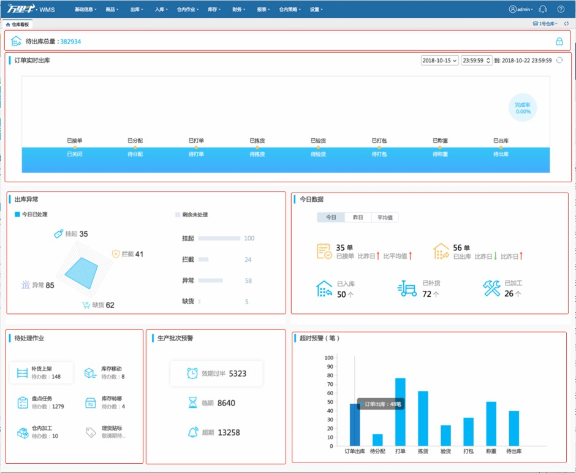

1、未出库总量：统计在仓库内还没出库的订单总数。

2、订单实时出库：

1）默认显示订单仓库接单时间在时间段内的所有订单在每个环节的确认数量，其中完成率=（已出库+已关闭）/已接单。

2）可设置显示异常标记订单，可勾选公司下订单拦截、订单挂起、发货失败及所有异常分类，接单在所选时间范围内的异常订单会在各个环节显示。

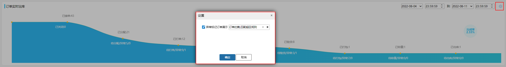

3、出库异常：今日已处理显示今天处理异常的订单数量。剩余未处理统计整个仓库目前还处于异常状态的订单数量。

提示

a订单挂起：若1笔订单挂起，则未处理订单数=1；用户确认挂起，则未处理订单数=0，已处理订单数=1；用户恢复挂起或拦截，则未处理订单数=0，已处理订单数=0。

b订单拦截：若1笔订单拦截，则未处理订单数=1；用户确认拦截，则未处理订单数=0，已处理订单数=1。

c发货失败：若1笔订单发货失败，则未处理订单数=1；用户继续发货且发货成功，则未处理订单数=0，已处理订单数=0。

 d订单缺货：订单从缺货状态变成其他非异常状态，已处理订单+1。

4、今日数据：今日模块：统计凌晨0：00到现在作业的数量，仓库接单数量和出库数量会和昨日以及平均值对比。平均值：统计的是近60天平均每天接单量和出库单量。补货只记录已完成补货任务的补货数量。仓内加工统计成品的数量。

5、待处理作业：显示作业数量，点击即可跳转页面，并且查询待处理的作业。方便用户了解作业的处理情况。灰色作业表示还未开放，敬请期待....

6、生产批次预警：开启了生产批次管理的仓库才会显示。显示生产批次商品的库存和到期状况，点击跳转生产批次预警页面并查询对应库存信息

7、原超时预警变更为履约超时和环节超时。

履约超时：统计的是各个环节的加急订单。

环节超时：统计的是在对应环节呆的时长超过预警时长订单数量。

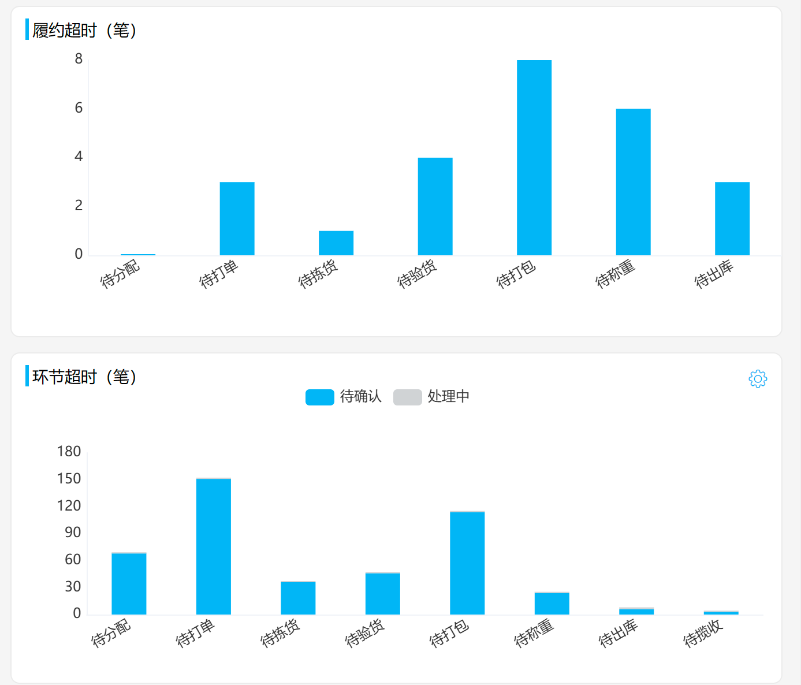a.履约超时在业务配置开启订单加急标志设置：设置如图，并标记辅助订单优先处理-加急订单，结果：1111的订单，下单1小时后还未出库。这类订单将会被统计在预警中。

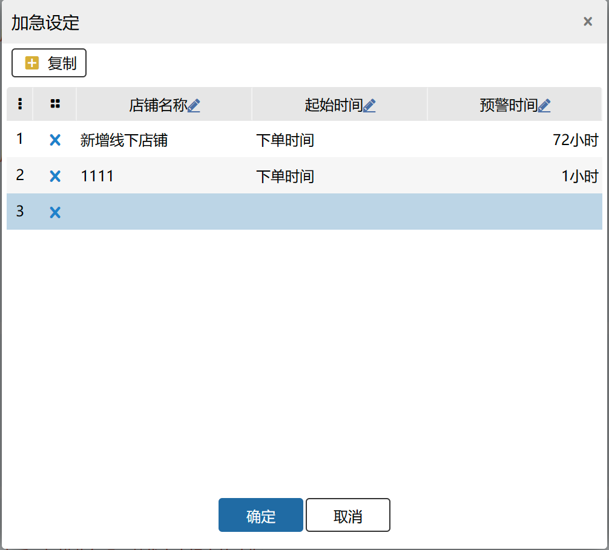

b.环节预警在环节预警中设置：若订单在这个环节呆的时长>预警时长，订单将会被统计在预警中。

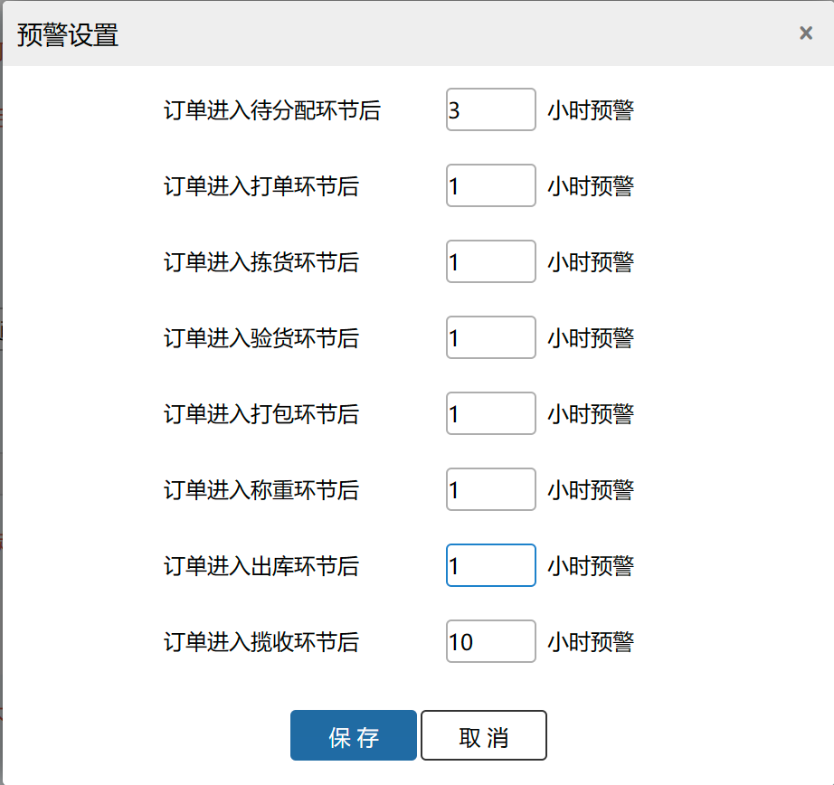

 

 8.快递出库记录:记录当天0点-23：59：59所有出库订单的快递个数以及订单承运商所属的线上物流。

1）点击色块查看线上物流对应的承运商以及出库快递的个数。

9.新增第九个模块：环节时段作业统计，展示当天各个时间内每个环节的作业数量，根据上个环节的作业数量可判断接下来该环节是否忙碌。

1）有效作业人数：配置的环节参与作业人员合计，去重。

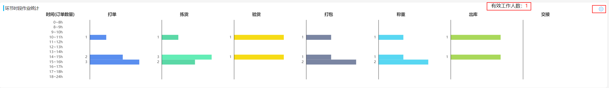

2）可自由配置环节和时间,至少显示3个环节，最多显示24个时间段，即为每个小时显示。

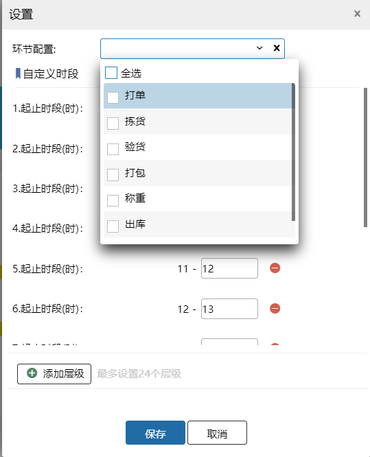

 

 

Q&A

1. 为什么相同查询条件和已出库里显示的出库数量不一样

A：统计的是这个时间段内，仓库接单的，且已出库的，而不是这个时间段内出库的

 

> 更新: 2023-12-18 16:29:47  

> 原文: <https://hupun.yuque.com/unzko7/lsbfg0/whnc6bap92g1ggyk>

---

### 12.1.2 公司看板

> 原始文件来源：`00-源文件/操作手册/报表/看板/公司看板.md`

用户打开公司看板页面默认可见当天所有仓库权限内的仓库报表，若仓库的已接单数量为0则不显示。

如图，1区域可选择仓库和接单时间查询仓库数据；点击重置可恢复默认查询条件。

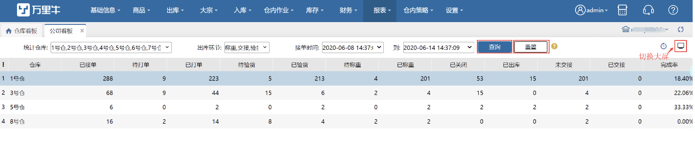

点击切换大屏按钮则可见大屏图，详见下图。点击刷新按钮可强制刷新数据。系统默认10min会自动更新数据。

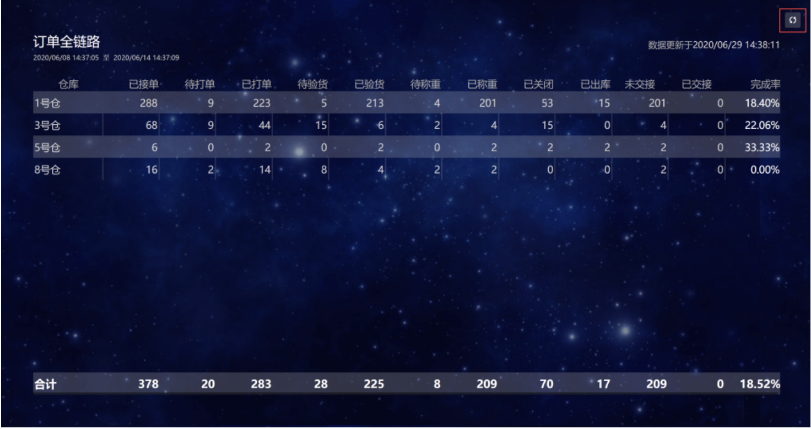

> 更新: 2023-12-20 13:54:15  

> 原文: <https://hupun.yuque.com/unzko7/lsbfg0/tc5x6bbrkwguiiag>

---

### 12.1.3 现场操作看板

> 原始文件来源：`00-源文件/操作手册/报表/看板/现场操作看板.md`

现场操作看板用于现场操作人员看到各个环节的实时绩效排名和仓库各节点待处理作业的数量。

#### 1.设置环节

##### 01.用户可以设置环节，步骤如图所示。

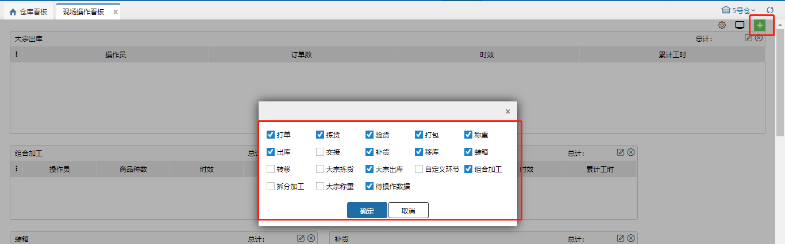

##### 02.设置每个环节显示排名区域、辅助信息、行数和冻结行数，点击保存即可，如图所示。

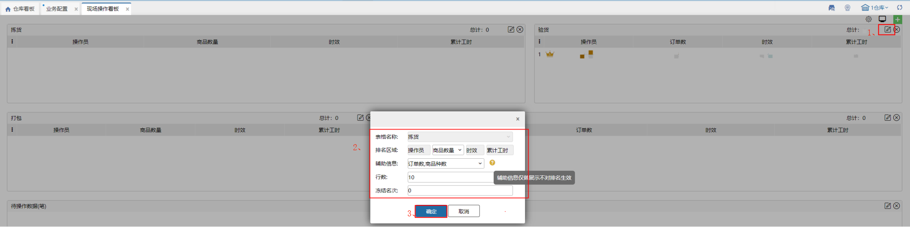

**注：**①辅助信息根据勾选顺序依次显示在排名区域（如上图“商品数量”）后面，只做数据展示，不会影响排名顺序；

       ②已经选中作为排名项的字段，不会在辅助信息中显示。

##### 03.可以拖拽列表调整位置和大小。

#### 2.设置排名方式

排名方式有两种：固定和轮播，设置后只可以在投屏页面看到效果。

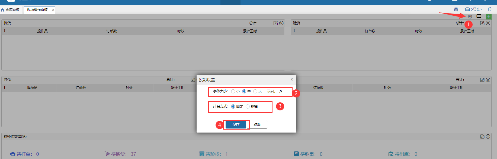

##### 01.固定，只显示设置的行数。

##### 02.轮播，当数据超过一屏时，轮播显示；设置了冻结行数后，只轮播非冻结的行数。

#### 3.设置待操作数据

只是为了查看仓库各环节的待处理工作量，至少选择一个环节，如图所示。

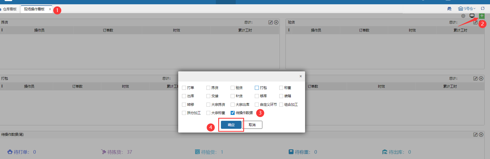

#### 4.设置投屏

点击“投屏”按钮，可见大屏，如图所示，页面数据每5分钟刷新一次，点击右上角刷新按钮，可强制刷新。

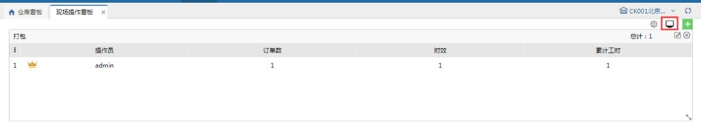

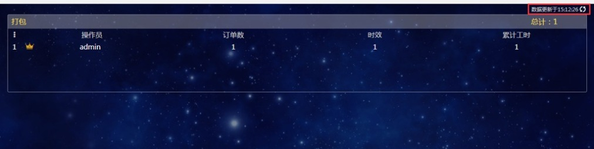

**提示**

①.每次修改后，点击保存后才生生效；

②.时效=本环节统计项／工时，例如7:58操作了2笔订单，则工时+1；8:01操作了1笔订单，则工时+1，即3/2=1.5

③.各个环节的数据和待操作数据都是实时的。

 

 

> 更新: 2023-12-21 18:17:04  

> 原文: <https://hupun.yuque.com/unzko7/lsbfg0/bdkeig08lruvhv8d>

---

### 12.1.4 货主出库统计报表

> 原始文件来源：`00-源文件/操作手册/报表/看板/货主出库统计报表.md`

场景：主要看当日各个货主单量情况及环节数据。

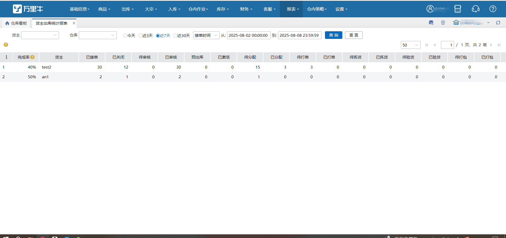

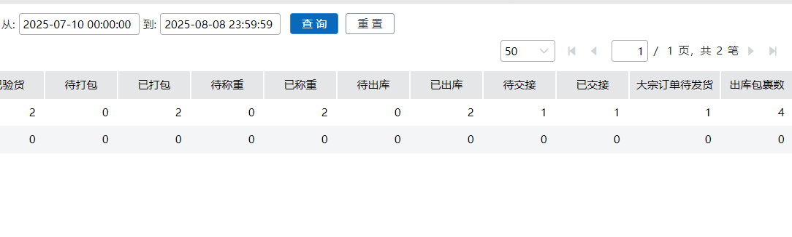

1.开启3PL模块+菜单有权限会显示此菜单。

2.已审核、待审核：公司下有一个货主开启接单审核则显示；预出库、已激活：公司下有一个货主开启缺货接单则显示。

3.完成率=（已出库+已关闭）/已接单*100%

大宗订单待发货=大宗出库页面待处理的订单数量

出库包裹数=已出库订单包裹数量，无包裹的按订单数计算

> 更新: 2025-08-08 11:13:29  

> 原文: <https://hupun.yuque.com/unzko7/lsbfg0/fcpezg49q1edccqy>

---

### 12.1.5 货主看板

> 原始文件来源：`00-源文件/操作手册/报表/看板/货主看板.md`

报表下货主看板是为了客户更直观的查看各货主的出入库及仓内等数据，系统管理员有配置权限，普通操作员开启对应菜单权限可以进行查看，此模块功能只限3PL公司。 

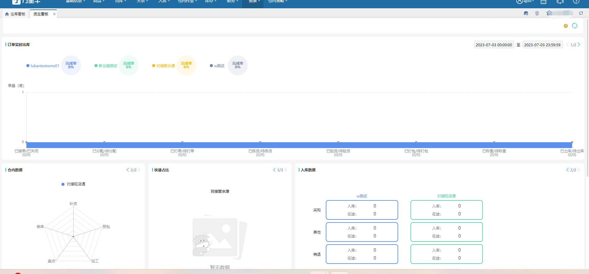

#### 1.订单实时出库

可查看各个环节已完成/待完成的数量，按面积堆叠显示各货主的单量数据

1.环节配置：审核、预出库、待分配、打单、拣货、验货、打包、称重、出库，默认勾选仓库看板相同环节

2.环节配置：待作业、已作业

3.选择货主：授权该仓库+使用中的货主，最多选择12个货主，分3页显示

4. 起止时间：默认当天，最多可查看最近一周数据

#### 2.仓内数据

显示对应货主当天已作业的商品数量

1. 作业类型包括：移库、盘点、加工、预包、补货，不可选择

2. 授权该仓库+使用中的货主，最多选择12个货主，分3页显示                       

#### 3.快递占比

显示对应货主当天已发货的快递数量及占比

1.每个模块1个货主，最多设置3个相同模块                        

#### 4.入库数据

显示对应货主当天采购、其他、销退的入库及在途商品数量

1.单据类型包括：采购入库、其他入库、销退入库，不可选择

2.选择货主：最多可设置9个货主，分3页显示

#### 5.单量预警

显示对应货主当天的剩余金额或剩余单量

1.每个模块最多6个货主，最多设置3个相同模块                        

#### 6.出库数据

柱状图显示各货主的当日已接单、已出库的单量，折线图显示对应货主费用

1.每个模块最多8个货主，最多设置3个相同模块                       

**注：6个模块可以选择性开启，但至少要保留两个模块，不能全部删除**

 

 

> 更新: 2023-12-21 18:15:54  

> 原文: <https://hupun.yuque.com/unzko7/lsbfg0/ia6e3wrigz2xrbq5>

---

### 12.1.6 入库交接记录

> 原始文件来源：`00-源文件/操作手册/报表/出入库/入库交接记录.md`

当入库预约单在入库交接页面完成交接，则会在该页面新增一条记录，具体页面如下：

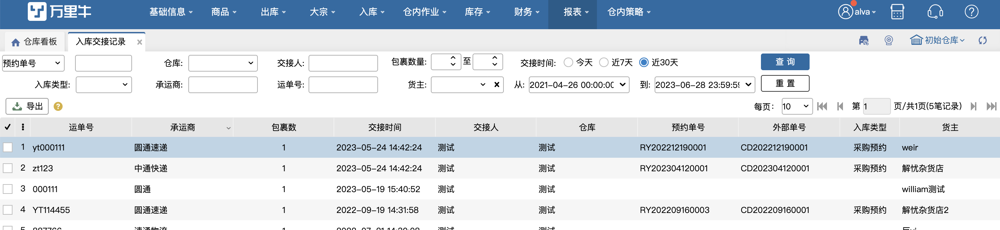

注意：运单号支持模糊查询，左匹配右模糊。例：运单号有JD1234  YD1234 JD2345，12345，输入12查询出预约单12345，输入JD 查询出预约单JD1234、JD2345

 

 

 

> 更新: 2023-12-18 16:32:56  

> 原文: <https://hupun.yuque.com/unzko7/lsbfg0/hb3267y7hs3mwguy>

---

### 12.1.7 出入库明细报表

> 原始文件来源：`00-源文件/操作手册/报表/出入库/出入库明细报表.md`

出入库报表反应了仓库商品的库存变动情况，详见下图。

1、该报表数据来源于与库存相关的所有单据，数据实时统计；默认显示当天的数据；

2、支持单据类型，出入库单号，商品，仓库，系统单号、时间、店铺和生产批次查询；支持导出报表。

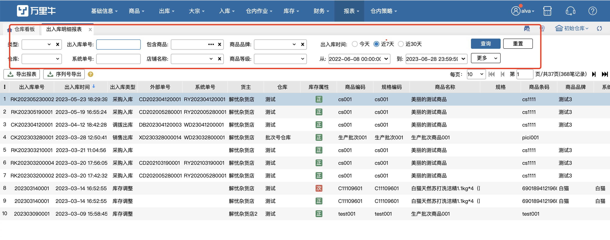

生产批次标准模式下出入库报表生产批次不再与对应库位显示，放到出入库明细中显示。

序列号模式标准模式下出入库报表序列号不再与对应库位显示，放到出入库明细中显示。

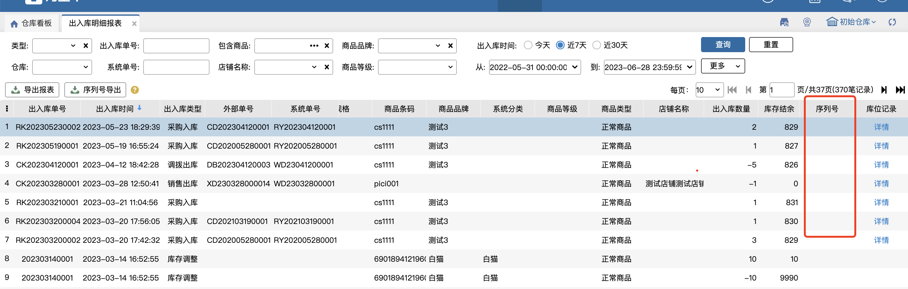

支持规格扩展属性值的显示/导出，新增列，表头跟随系统配置，配置了2个规格扩展值，则新增两列，表头是规格扩展值名称

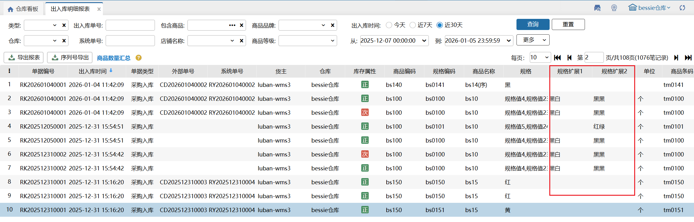

 

 

> 更新: 2026-01-05 10:39:50  

> 原文: <https://hupun.yuque.com/unzko7/lsbfg0/xahrpwyypefr87se>

---

### 12.1.8 出入库汇总报表

> 原始文件来源：`00-源文件/操作手册/报表/出入库/出入库汇总报表.md`

场景1：三方仓客户80-90%都是一单一件的订单每出库一批同品波次就看下出库数量是否对的上，然后晚上下班后再把表格导出给到货主去核对并留档。

场景2：有三方仓客户想看某一商品或几种商品在一段特定时间内的出入库汇总数据，此报表为仓库基础报表，需实时数据，按出库、入库、调整等维度汇总数据进行展示。

该报表关联3PL模块，非3PL无此菜单显示。

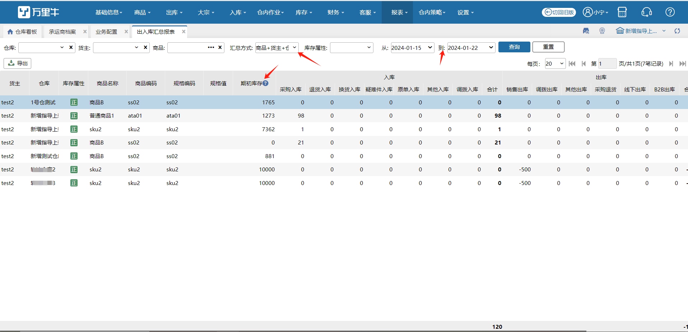

1.仅支持查看最近3个月的记录。

2.支持多维度统计数据汇总，包括货主、仓库等。

3.期初库存为前一日的历史库存数据；结余库存=初始库存+入库-出库+其他；

当天24点库存（当天历史库存）-当天0点库存（前一天历史库存）=当天的库存结余之和。

4.支持规格扩展属性值的显示/导出，新增列，表头跟随系统配置，配置了2个规格扩展值，则新增两列，表头是规格扩展值名称

> 更新: 2026-01-05 10:36:04  

> 原文: <https://hupun.yuque.com/unzko7/lsbfg0/nln6ql67lmn6hfqf>

---

### 12.1.9 出库交接记录

> 原始文件来源：`00-源文件/操作手册/报表/出入库/出库交接记录.md`

当订单在承运商交接页面完成交接，则会在该页面新增一条记录，具体页面如下：

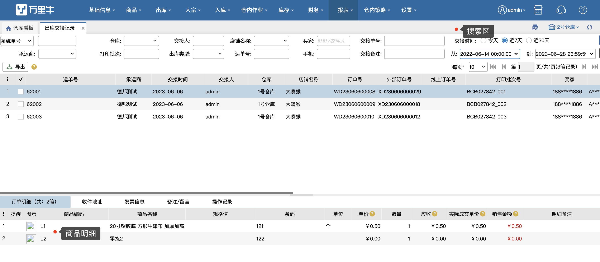

> 更新: 2023-12-18 16:33:13  

> 原文: <https://hupun.yuque.com/unzko7/lsbfg0/dmnttrengau01nip>

---

### 12.1.10 出库完成率统计表

> 原始文件来源：`00-源文件/操作手册/报表/出入库/出库完成率统计表.md`

用于查看发货订单效率相关，仅支持查询近180天的数据。

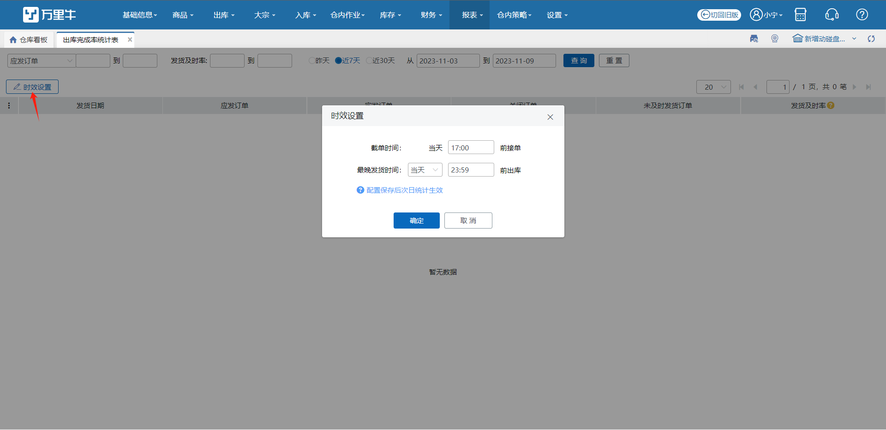

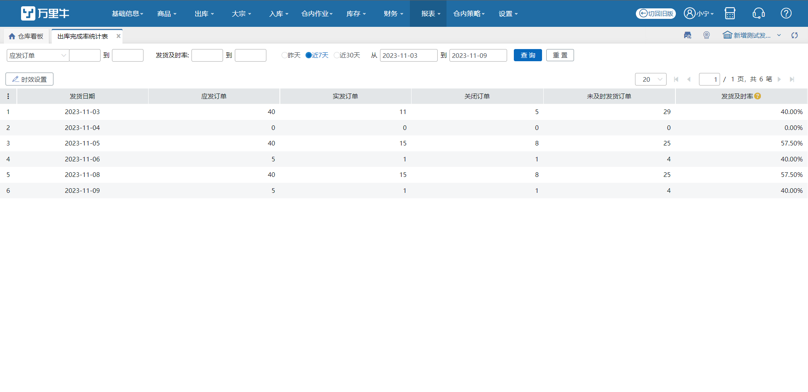

1.时效设置配置保存后次日统计生效。

2.报表数据概念定义：

a.应发订单：订单接单时间在配置的[前一天此截单时间，当天截单时间]区间内的所有单量。  
b.实发订单：订单出库时间在当天/次日的最晚发货时间内的单量。

c.关闭订单：订单关闭时间在当天/次日的最晚发货时间内的单量。（挂起订单也算，订单需确认拦截挂起）

d.未及时发货订单=应发订单-实发订单

e.发货及时率=（实发订单+关闭订单）/应发订单*100%

**注：不支持查看当天的数据。**

例：10号保存配置，配置：当天13:00接单，最晚发货时间当天18:00前；11号配置生效。

应发订单：订单接单时间在[10号13:00，11号13:00]区间内的所有订单。

实发订单：订单出库时间在11号18:00前的单量。

关闭订单：订单关闭时间在11号18:00前的单量。

跑批时间为12号凌晨。

10号保存配置，配置：当天13:00接单，最晚发货时间次日18:00前；11号配置生效。

应发订单：订单接单时间在[10号13:00，11号13:00]区间内的所有订单。

实发订单：订单出库时间在12号18:00前的单量。

关闭订单：订单关闭时间在12号18:00前的单量。

跑批时间为12号18:00后。

> 更新: 2025-04-24 14:38:22  

> 原文: <https://hupun.yuque.com/unzko7/lsbfg0/ctzx20vxdsfnmidv>

---

### 12.1.11 库位库存流水

> 原始文件来源：`00-源文件/操作手册/报表/出入库/库位库存流水.md`

库位库存流水反应了库位变动情况。

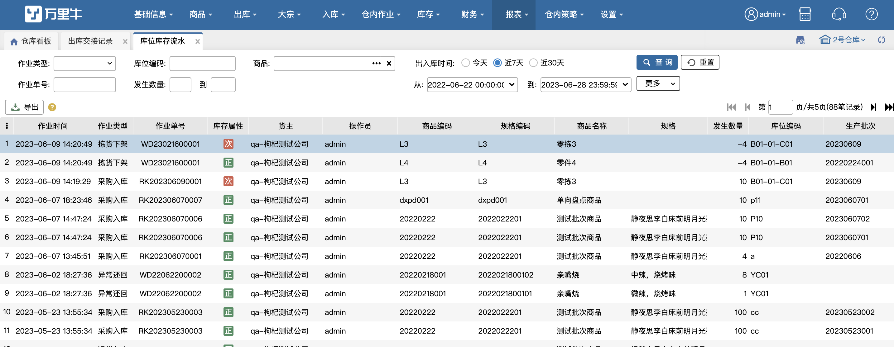

1. 默认查询近七天，可选时间不限。

2.支持单据类型、库位、作业单号、商品查询；支持导出。        

 

 

 

> 更新: 2023-12-18 16:32:41  

> 原文: <https://hupun.yuque.com/unzko7/lsbfg0/ta4f13mn9n4s3b3h>

---

### 12.1.12 待分配商品统计

> 原始文件来源：`00-源文件/操作手册/报表/出入库/待分配商品统计.md`

统计处于待分配状态的订单中包含的商品，页面显示了影响订单、待分配总数、锁定失败总数等列。

1.点击蓝色明细可显示当前数量存储的库位名称。

具体页面如下：

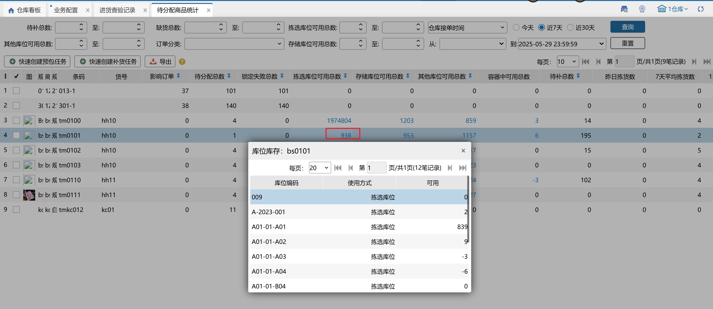

2.可根据查询项查询所需范围内的数据，订单分类为：空/普通订单/预配订单，普通订单/预配订单分为待分配页匹配到普通波次和预配波次的订单，可通过查询到的对应订单生成对应的补货任务和预包任务，创建补货任务和手动补货逻辑一致，预包任务以预配策略里的规格配置生成对应的计划预包数量。

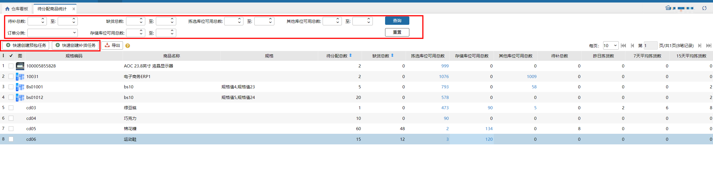3.增加多单位换算

前置条件：当前仓开启业务配置-其他配置中的出库快速换算推荐

增加两列列名：推荐单位（待分配总数）；推荐单位（锁定失败总数），默认不展示，需要自行勾选，

当商品设置了多单位；

推荐单位(待分配总数)按当前行sku待分配总数换算为默认箱数+剩余零数

推荐单位(锁定失败总数)按当前行sku锁定失败总数换算为默认箱数+剩余零数

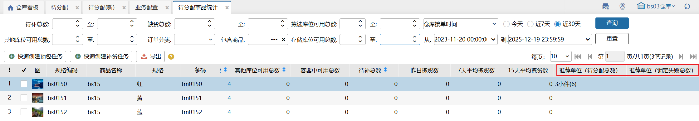

**提示**

1.查询到的商品为处于待分配状态订单包含的商品；

2.其他库位可用总数包含预配库位、异常库位、过渡库位和工位上面的可用库存总和；

3.昨日拣货数为该商品昨天拣货下架、补货下架数的总和；

4.当拣选库存为负时，系统也会提示相应库位；

5.影响订单指当前sku在待分配页面未锁定或锁定失败的订单数量；

6.容器中可用总数指当前sku在容器中的可用数量。

> 更新: 2025-12-19 16:20:00  

> 原文: <https://hupun.yuque.com/unzko7/lsbfg0/tkgb1r3gma6kubl3>

---

### 12.1.13 热销商品搭配报表

> 原始文件来源：`00-源文件/操作手册/报表/出入库/热销商品搭配报表.md`

此报表用于统计一定周期内热销订单组合情况，最多查近1年内的数据。

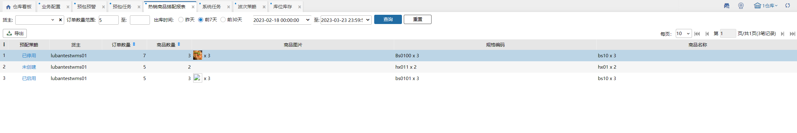每行数据是一种订单结构，各行含义如下：

预配策略：有“未创建”、“已停用”、“已启用”三种，具体用法：

①.若当前行订单组合情况在当前仓库中没有相同的预配策略，则显示“未创建”，点击可以跳转到创建预配策略弹窗进行创建；

②.若当前行订单组合情况在当前仓库中有相同的预配策略且启用中，则显示“已启用”，点击可停用策略；

③.若当前行订单组合情况在当前仓库中有相同的预配策略且停用中，则显示“已停用”，点击可启用策略；

货主：当前行数据对应的货主；

订单数量：在查询时间范围内符合该订单结构的订单笔数；

商品数量：该订单结构中包含的商品数量；

商品图片：该订单结构包含的商品图片；

规格编码：该订单结构包含的商品规格；

商品名称：该订单结构包含的商品名称。

其中：

(1)默认查近7天的数据，最多查近1年内的数据

(2)订单数量默认超过5笔，可手动修改，不能小于2

(3)页面数据支持导出

> 更新: 2023-12-21 18:20:01  

> 原文: <https://hupun.yuque.com/unzko7/lsbfg0/dggmmouayhmcuqb4>

---

### 12.1.14 生成波次统计报表

> 原始文件来源：`00-源文件/操作手册/报表/出入库/生成波次统计报表.md`

波次统计报表，可展示各波次的订单量及不同类型订单的数量、占比，帮助仓储运营人员精准评估作业负荷，支撑场地规划与人员排班，实现资源合理配置，提升仓储作业效率。

1) 波次统计报表只统计状态为启用的波次策略生成的波次数量信息，只能查询近两个月的波次统计信息；

2) 统计的区域为波次的拣选区域，波次数量占比=该库区内订单数量/该策略生成波次总数；

3) 生成订单总数=生成波次中所有订单数量，生成订单占比=当前策略生成订单总数/生成订单数总计

4)生成商品总数=生成订单中包括的所有商品数量（若开启赠品免计算，则排除赠品数量），生成商品占比=当前策略生成商品总数/生成商品数总计

5)报表会扣减掉作废波次或剔除订单相关列数据。

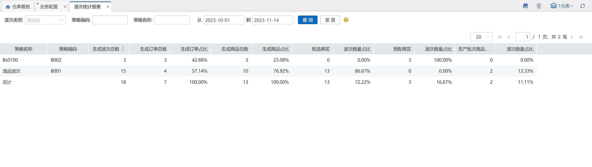

> 更新: 2026-05-28 09:57:15  

> 原文: <https://hupun.yuque.com/unzko7/lsbfg0/afvlte2udt9cur0q>

---

### 12.1.15 耗材统计报表

> 原始文件来源：`00-源文件/操作手册/报表/出入库/耗材统计报表.md`

耗材统计报表统计了90天内订单出库使用的耗材明细，默认查询当前仓库前7天的耗材使用。

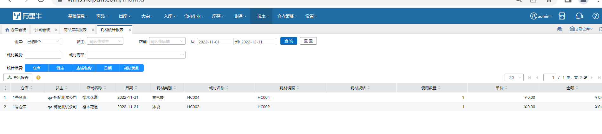

1. 统计维度为仓库，货主，订单的店铺，出库日期，使用的耗材类别，非3PL不显示货主，默认全部显示，可按个人需求进行配置，如选择仓库和货主，就会根据仓库+货主+耗材编码唯一显示，数据如下。

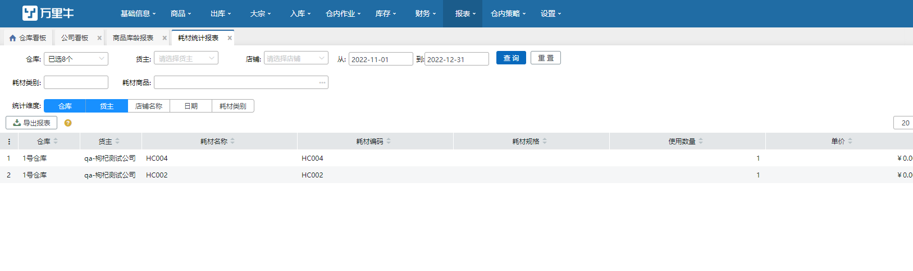

2. 当天出库的订单使用耗材需要凌晨跑批处理后查询。

3.耗材的单价是耗材的标准售价。

> 更新: 2023-12-18 16:33:32  

> 原文: <https://hupun.yuque.com/unzko7/lsbfg0/lha5p7ag3rhegg6w>

---

### 12.1.16 订单重量分析报表

> 原始文件来源：`00-源文件/操作手册/报表/出入库/订单重量分析报表.md`

订单重量分析报表支持通过自定义重量区间来查询对应订单数量、平均重量及订单数占比。点击货主、省份、承运商/物流公司（二选一）可以增加对应列并统计数据。

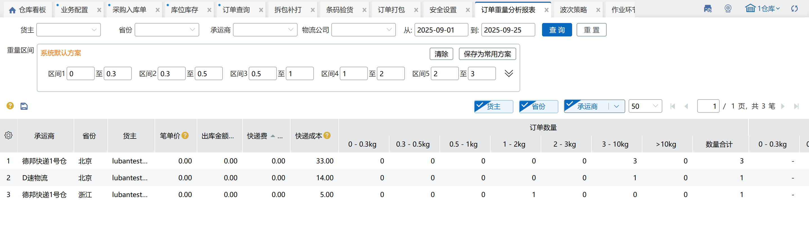

提示：

①时间为订单出库时间；

②支持自定义重量区间，最多4个；

③最多查询近366天内的数据。

> 更新: 2025-09-25 17:58:42  

> 原文: <https://hupun.yuque.com/unzko7/lsbfg0/sy8ty0km8xl4rwzs>

---

### 12.1.17 作业环节报表

> 原始文件来源：`00-源文件/操作手册/报表/绩效/作业环节报表.md`

作业环节报表详细记录订单接单时间、拣货员和拣货时间、验货员和验货时间、打包员和打包时间、称重员和称重时间，支持导出。

 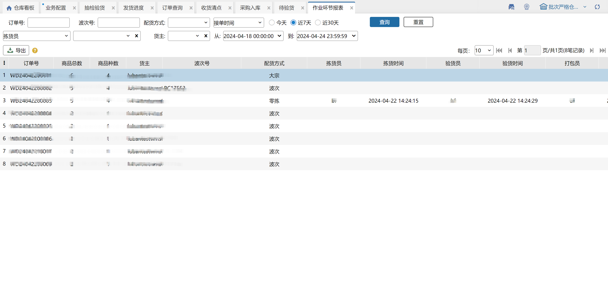

> 更新: 2024-04-24 16:20:23  

> 原文: <https://hupun.yuque.com/unzko7/lsbfg0/ykzel9uzk0btamg2>

---

### 12.1.18 入库上架统计表

> 原始文件来源：`00-源文件/操作手册/报表/绩效/入库上架统计表.md`

入库上架统计表

仓库内仓库确认入库和上架不是同一个人员进行操作的，单据入库完成后统计的是入库人员的记录和，无法统计上架员的相关操作和对应记录显示。

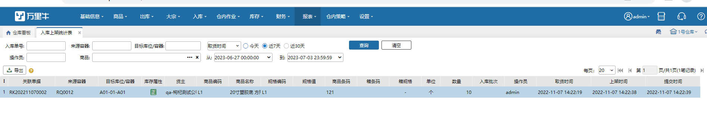1.报表统计时间点：单据在确认入库时，在入库上架统计表中新增记录。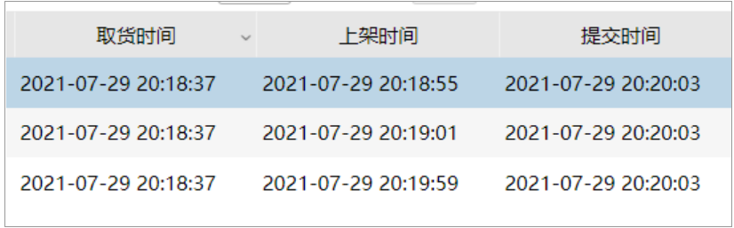

2.操作员在PDA上进行容器上架的操作时，取货时间统计的是开始扫描商品条码的时间点，上架时间是扫描库位上架的时间点，提交时间是提交容器上架的时间点。（注：若扫描容器后选择了商品，商品的开始时间点都是一样的）

3.支持导出，导出的结果和页面显示的一致。

异常情况：

a).待入库单据在PC端，增加新的明细、sku增加数量（包含生产批次数量）、改商品、改批次号，入库上架的记录和绩效都记在点击入库的人身上。

b).待入库单据在PC端，sku数量减少(包含生产批次数量)、删除明细、改目标库位，入库上架的记录和绩效都记在入库上架的人身上。

c).新增明细、sku增加数量、改商品、改批次号，入库上架统计表的来源容器都是空，取货时间、上架时间显示的都一样。

 

 

> 更新: 2023-12-18 16:39:13  

> 原文: <https://hupun.yuque.com/unzko7/lsbfg0/gpzuf191gg244ns7>

---

### 12.1.19 拣货作业报表

> 原始文件来源：`00-源文件/操作手册/报表/绩效/拣货作业报表.md`

用于统计日常拣货人员作业效能的工具，详细记录订单拣货过程中的开始时间和结束时间，订单数、商品种类、商品总数、作业种类以及操作员。

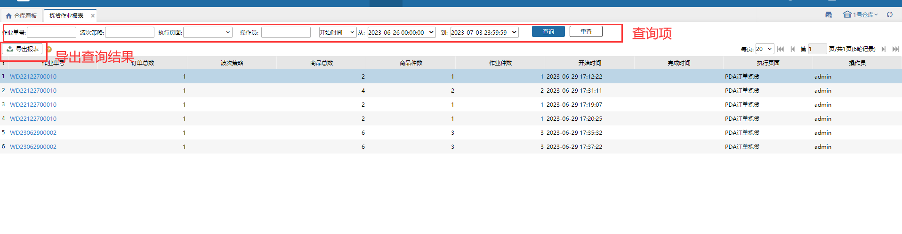

点击作业单号可以查看订单中商品明细。

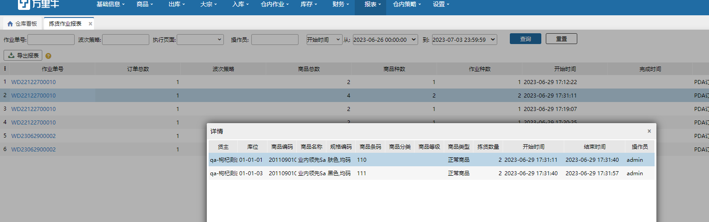

 

 

> 更新: 2023-12-18 16:38:41  

> 原文: <https://hupun.yuque.com/unzko7/lsbfg0/euo46apc1sf4kyzg>

---

### 12.1.20 绩效明细报表

> 原始文件来源：`00-源文件/操作手册/报表/绩效/绩效明细报表.md`

绩效统计用来统计仓库内仓库操作员的各操作的工作量，具体页面如下：

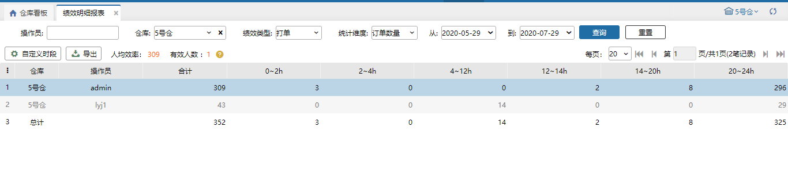

#### 页面查询统计

- 该统计是实时进行的；
- 查询间隔时间：查询的最长的间隔时间为90天；
- 报表支持导出，导出的文件在【数据中心】-【我的下载】中下载，文件只会导出明细，不导出总计；
- 有效人数计算：高于该环节下所有操作员平均值的50%的算为有效操作员，无效操作员字体将会变灰色提醒；（用于排除请半天假、新人等特殊情况数据）
- 人均效率计算：有效操作员数据之和／有效操作员人数

#### 计算基准及统计方式释义

#### 通用基准

> 举例：订单1=A1+B1+B3，订单2=B1+C1。设置A/B/C积分=1/2/3
>

:::warning
- **单据数：∑单据个数**
    - 举例结果=1+1=2
- **商品数：∑单据商品SKU数量**
    - 有箱等多单位/容器的，均以拆零数量计算
    - 举例结果=5+2=7
- **种类数：∑单据商品SKU种类数**
    - 默认会将单据中相同的商品明细去重
    - 举例结果=2+2=4
- **积分：积分绩效设置的计算结果**
    - ∑各明细商品积分值*数量
    - 举例结果=(1*1+2*1+2*3)+(2*1+3*1)=9+5=14积分

:::

#### 个性基准

|  |  |  |  | 最小粒度(去重) | | | | |
| --- | --- | --- | --- | --- | --- | --- | --- | --- |
| 个性基准名称 | 计算规则 | 适用菜单 | 积分计算 | 最小粒度 | 1.跨波次 | 2.跨订单 | 3.1跨明细 | 3.2跨子任务 |
| **金额** | ∑每个订单金额 | 打单/拣货/验货/称重/打包/出库/交接/清点/入库/入库上架/大宗出库/播种/自定义环节 | 否 | 订单 | N | N | N | N |
| **拣货种类库位数** | ∑“商品种类+库位”组合数 | 拣货/大宗拣货 | 否 | 商品种类+库位 | N | N | N | N |
| **箱数** | ∑箱数量(仅唯一箱/规格箱) | 拣货/大宗拣货/大宗装箱 | 否 | 箱 | N | N | N | N |
| **箱数** | ∑箱数量(仅唯一箱/规格箱) | 补货/移库/装箱/盘点/预包任务 | 是 | 箱 | N | N | N | N |
| ***任务数** | ∑拣货任务数 | 大宗拣货 | 否 |  |  |  |  |  |
| ***任务商品数** | ∑拣货任务商品数量 | 大宗拣货 | 否 |  |  |  |  |  |
| ***任务种类数** | ∑拣货任务商品种类数 | 大宗拣货 | 否 |  |  |  |  |  |
| ***箱商品数** | ∑装箱商品数量 | 大宗装箱 | 否 |  |  |  |  |  |
| ***箱商品数** | ∑装箱商品种类数 | 大宗装箱 | 否 |  |  |  |  |  |
| **** |  |  |  |  |  |  |  |  |
| ***作业商品种类数** | ∑商品种类数(多订单时会去重) ps：播种验货提交时，订单维度去重 | 验货 | 否 | 单次作业 | Y | Y | Y | Y |
| **作业种类数** | ∑单次作业的商品种类数 | 清点/入库/入库上架/补货/移库/装箱/转移/盘点/正品转换/次品转换/组合加工/拆分加工/加工领料/预包任务 |  |  |  |  |  |  |
| **作业商品数** | ∑单次作业的商品数量 | 清点/入库/入库上架/补货/移库/装箱/转移/盘点/正品转换/次品转换/组合加工/拆分加工/加工领料/预包任务 |  |  |  |  |  |  |
| **上架种数** | ∑上架的商品种数 | 补货 |  | 商品种类+库位 |  |  |  |  |
| **下架种数** | ∑下架的商品种数 | 补货 |  | 商品种类+库位 |  |  |  |  |
| **提交商品种类数** | ∑商品种类数(多订单时会去重) ps：播种验货提交时，波次整体去重 | 验货 | 否 | 单次提交 | Y | Y | Y | Y |

#### 特殊场景规则

- 拆包补打：拆包裹的订单，新拆包裹打包员记录为拆包补打操作员，前面的环节的绩效统计的订单数量会加1，绩效加在原操作员上；
- 拦截关闭：关闭前操作的绩效仍然统计在内，不会因订单关闭扣减工作量
- 多次提交：部分作业，多次提交时，相同明细计算种类数=2次
- 播种验货：验货-提交商品种类数=∑单次提交的商品种类数（波次维度去重）；验货-作业商品种类数=∑单次提交多笔的商品种类数（订单维度去重）

 举例：波次A包含订单1：订单1=A1+B1+B3，订单2=B1+C1，播种验货提交波次A。提交商品种类数=3，作业商品种类数=3+2=5

> 更新: 2026-02-28 13:47:47  

> 原文: <https://hupun.yuque.com/unzko7/lsbfg0/tuzumgiuigm1vg5a>

---

### 12.1.21 绩效统计报表

> 原始文件来源：`00-源文件/操作手册/报表/绩效/绩效统计报表.md`

绩效统计报表用来统计各个环节的仓库操作员绩效。

#### 1.按天统计

 可以用来查看操作员每天各个环节的工作量情况，如图所示。

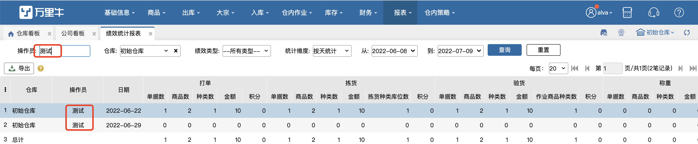

#### 2.汇总统计

可以用来查看操作员连续几天各个环节的工作量，如图所示。

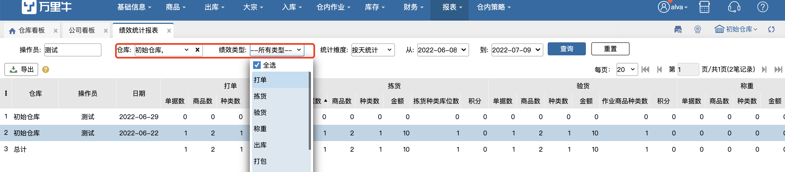

#### 3.导出

支持导出，导出的就是页面上显示的。

 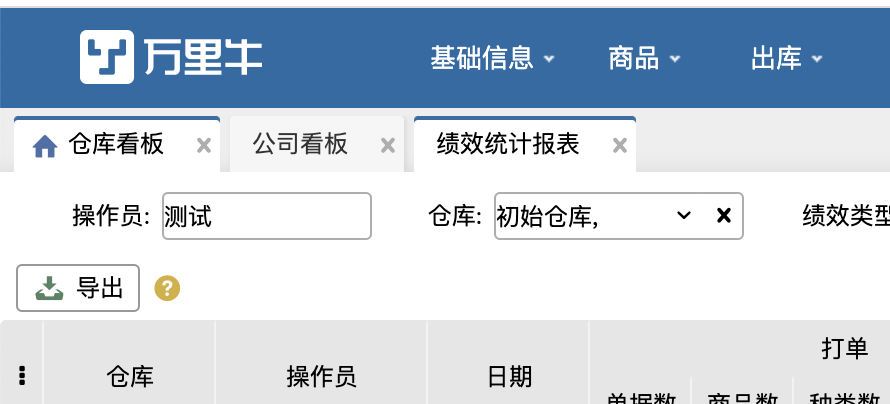

提示

①.该统计是实时进行的；

②.绩效类型分为：打单、拣货、打包、大宗业务、仓内作业等模块

③.统计维度包括：订单数量、商品种数、商品数量、积分、金额；

④.间隔时间：查询的最长的间隔时间为90天；

⑤.金额：是订单上的销售金额；

⑥.积分：商品积分中对应环节设置的积分X订单商品的数量

特殊案例

①.一个订单中同一个sku有两条明细，最后显示的商品种数为1;

②.拦截关闭的订单关闭前操作的绩效仍然统计在内；

③.订单在待验货环节，被操作员A拆包补打后，验货和打包绩效都会记一份，记在操作拆包补打的操作员上。

> 更新: 2023-12-21 18:20:49  

> 原文: <https://hupun.yuque.com/unzko7/lsbfg0/dyids49mz23pwi10>

---

### 12.1.22 商品库龄报表

> 原始文件来源：`00-源文件/操作手册/报表/其他/商品库龄报表.md`

商品库龄报表统计了商品在仓库中存放的时间。用户可自定义想统计的库龄层级。点击库龄对应的库存数据，弹出框会显示单据编码，入库时间以及数量

1) 自定义库龄中用户可以自行定义任意层级的库龄，最高设置999天，层级之间不能交叉，但可以间隔，最后一个层级上限可以不定。设置之后，库龄将按照显示的层级统计并显示。

2) 库龄中可以统计普通商品：未开启入库/生产批次/序列号管理的商品；生产批次、入库批次、序列号商品，均为商品跟仓库都开启管理的商品库存，如仓库未开启管理时计算同普通商品。

3) 普通商品、入库/生产批次商品的库龄计算方式：追溯入库单据中该sku的入库数量来统计入库时间。

4) 序列号库龄计算方式：追溯该序列号入库单首次入库时间。

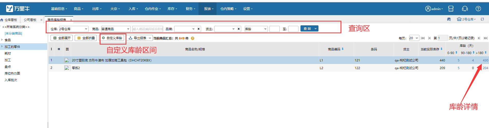

 

 

> 更新: 2023-12-18 16:39:49  

> 原文: <https://hupun.yuque.com/unzko7/lsbfg0/lh49q1tbxzswaanz>

---

### 12.1.23 库位热力分布

> 原始文件来源：`00-源文件/操作手册/报表/其他/库位热力分布.md`

名词解释

库位热力图展示了库位拣货下架的sku数量，通过此图可以看哪个库位被拣货下架的数量最多，以此来调整库位库存分配。

 库位热力分布统计了所选时间段内，库位的拣货下架和补货下架的热度。

1) 仓库库位中货架设置了巷道号、货架号、层号、位号的库位才会被统计到热力图中，地堆层号为空，货架号与位号一致。

2) 对比范围选全仓，最大下架数为全仓下架数量最大的库位；

    对比范围选区域，最大拣货下架数为所选库区所在区域下架数最大的库位；

    对比范围选库区，最大拣货下架数为所选库区下架数最大的库位。

3) 热度根据最大下架数均分为15个层级，颜色从浅到深，点击每层可以查看到该层的范围，点击该层，层级颜色变灰，对应层级的库位颜色变白色，再次点击该层，层级和库位颜色又恢复为原来的。

4) 支持库位编码搜索，精确定位到库位，库位显示凸出且右上角有“★”形状。

5) 点击库位将会弹出该库位的sku的下架数量。

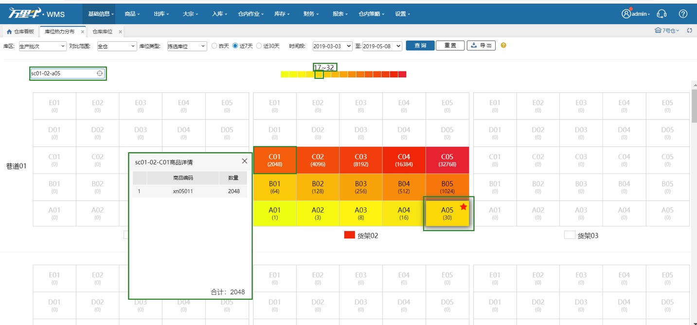

 

> 更新: 2023-12-18 16:40:13  

> 原文: <https://hupun.yuque.com/unzko7/lsbfg0/ypoptggo7p9e02y9>

---

### 12.1.24 待上架新品统计

> 原始文件来源：`00-源文件/操作手册/报表/其他/待上架新品统计.md`

名词解释

1.待上架新品：仓库里从来没在拣选库位和预配库位存在过的商品，但是在其他库位有库存，这种商品我们将它称为待上架新品

待上架新品统计报表中统计了待上架新品在过渡库位、存储库位、其他库位的库存，点击数字可查看对应类型上库位的库存。

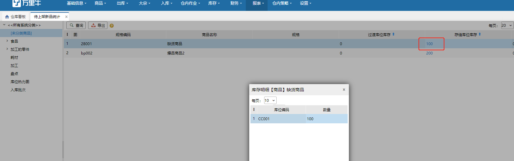

**提示**

目前拣选库位&预配库位无库存，但是曾经在拣选库位&预配库位有过库存的商品不会统计在待上架新品中。

 

> 更新: 2023-12-18 16:40:02  

> 原文: <https://hupun.yuque.com/unzko7/lsbfg0/gw57mg1px6hgfw54>

---

### 12.1.25 补货明细报表

> 原始文件来源：`00-源文件/操作手册/报表/其他/补货明细报表.md`

以商品为维度，实时展示已补商品的作业信息，具体页面如下：


1.此报表数据是实时查询的

2.报表查询时间间隔限制1年

 

 

> 更新: 2023-12-18 16:39:43  

> 原文: <https://hupun.yuque.com/unzko7/lsbfg0/mbqacx41qovz1usl>

---

## 12.2. 物流跟踪与耗材管理

### 12.2.1 耗材回收

> 原始文件来源：`00-源文件/专题功能介绍/其他/WMS-耗材管理/耗材回收.md`

业务场景：做高端商品或冻品冷链的商家，通常发货时使用的耗材价值都比较高，当产生快递拦截、或者是退回包裹中有部分可二次利用的商品则可以重新入库复用。

操作介绍：

功能配置，开启销退入口回收耗材


开启后选择相应的操作页面

操作录入

原单入库

匹配成功订单后会自动带出原订单所登记的耗材，操作员可根据实际情况进行增减


销退扫描入库

同原单入库一样，匹配后会根据原订单信息带出当时出库的耗材


疑难件入库

由于疑难件入库是无法匹配原订单信息的，我们也支持进行主动录入


耗材回收记录

在售后入库单中，针对已经回收耗材的售后单可以在回收耗材的详情页中查看


耗材库存增加

耗材的库存增加是根据原货主使用方式决定的

目前我们支持的出库方式有两种，

一种为跟随单据出库即为开启耗材出库扣减

在这种模式下，耗材的回收也会跟随入库单添加在商品明细中进行入库

另外一种为耗材共享模式，即云仓方提供耗材供其他货主使用，那么这种场景下因为订单发出时是货主方实际耗材的扣除是提供方，所有我们在入库的时候也会同样给提供方主动发起一个入库单。这个入库单会按天汇总后传入

如图，单据备注中会按货主进行汇总


注意：此入库单为自动生成，若生成失败，需在系统任务中进行重试任务类型为：共享耗材回收入库


> 更新: 2025-01-07 17:43:23  

> 原文: <https://hupun.yuque.com/unzko7/lsbfg0/wqsc59r7ri4ci1x1>

---

### 12.2.2 耗材智能推荐

> 原始文件来源：`00-源文件/专题功能介绍/其他/WMS-耗材管理/耗材智能推荐.md`

在百货、食品、五金、纺织品等众多行业中，订单打包时所用的包材会因为所购商品不同而需要使用不同规格、材料、及辅助包装耗材进行打包。我们通常碰到的情况有，

操作员打包挑大的拿，毕竟好打包，反正是老板多出钱我多劳多得

想按商品设置匹配规则无奈仓库好几万SKU，互相组合搭配售卖就更多了。根本没法挨个设置

订单打包时大盆套小盆，小盆里噻小碗，小碗里放个酒盅。按体积计算耗材就显得无比智障

我们在业内首创基于历史使用的大数据模型进行偏好型的计算推荐，从而解决了，推荐难、配置难、使用乱的情况。

策略配置

在按包裹中选择新增智能策略


选择相应的计算偏好

使用次数多是基于历史使用较多的结果进行推荐、

成本最低是基于商品信息中维护的耗材参考进价进行计算，即从节约成本的角度去推荐


模型计算原理

模型数据累计时长为1年，每天晚上更新数据模型

每个策略启用的时候，系统会自动计算过去7日所登记耗材的订单进行初始化模型生成

策略的变更不会导致数据模型变化

模型会根据订单SKU完全一致的情况下进行推荐

> 更新: 2023-12-28 14:04:08  

> 原文: <https://hupun.yuque.com/unzko7/lsbfg0/uk5s2iqsys1d5ll0>

---

## 12.3. 视频监控与硬件运维专题

### 12.3.0 WMS-视频监控专题总览

> 原始文件来源：`00-源文件/专题功能介绍/其他/WMS-视频监控专题/index.md`

#### 一、功能背景及效果

常见于各电商平台，面对买家恶意索赔及售后举证场景中，如包裹错漏发、快递运输漏件对比等用途。

同时在仓储内部流程管理中，也可以用于人员差错追溯及问题定位。

系统可在业务操作时，存储摄像头设备的录制信息，并在需要时直接调用存储视频在WMS系统中播放/下载。

[详细效果宣传介绍](https://mp.weixin.qq.com/s/Ki1ivm-EzRtfjXwlDgm9pQ)

#### 二、支持的摄像头/存储设备

###### 摄像设备

- USB摄像头：即插即用式摄像头，无品牌限制；
- IPC网络摄像机：支持大华、海康等IPC设备；

###### 存储设备

- PC本机存储：指保存在录制计算机电脑磁盘上
- FTP共享服务器：局域网中，共享某台电脑的磁盘用作服务器(需开机)，某些路由器/扩展硬盘盒也能达到此效果(详见FAQ介绍)
- 网络录像机NVR：即网络视频录像机，支持大华、海康、万店掌等NVR设备；

#### 三、支持录制的环节

出库：条码验货/订单打包/称重复核/播种验货/抽检验货/快速验货/分拣验货/单种验货/承运商交接/拆包补打

入库：销退扫描入库(含疑难件)/原单入库

大宗：大宗装箱/大宗称重

PDA：收货入库/订单打包/条码验货/称重复核（仅IPC/NVR可用，需购买模块）

**作业环节及监控方式推荐**

:::tips
售后销退、出库验货推荐使用USB摄像头，对近景记录商品及包裹单号信息

环节操作区域较大或包裹体积较大，或需要多个人配合的环节，推荐用IPC+USB摄像头进行多机位无死角监控

:::

#### 四、如何新增设备

###### USB摄像头

开启配置：仓内-业务配置-其他配置，开启万里牛视频溯源


重新登录后，右上角安装视频助手


****

**新增USB摄像头设备**

**入口1：在操作界面快速新增**

在支持的操作页面，视频点击“+”进行添加设备


2.新增视频设备时，助手会自动返回USB设备名称、Mac地址等信息。

- 如本机有多个设备未注册时会自动带出1个
- 存储地址默认为D:\hupun\video，最后磁盘中存储路径为D:\hupun\video\通道号\yymmdd,也可修改为其他存储路径
- 通道号主要用于多设备（多机位）同时录制及播放的区分
- USB/NVR会以通道作为查询及存储目录，可不填写，但是填写的情况要求相同存储设备唯一，具体规则如下：
- USB设备+本地磁盘，通道号可重复；
- USB设备+相同FTP共享服务器，通道号唯一，若是不同FTP共享服务器则可重复；
- IPC设备+跟随摄像机系统，通道号可重复；
- IPC设备+相同NVR存储服务器，通道号唯一，若是不同NVR存储服务器则可重复。


**入口2：在设备管理界面新增**

打开设备管理下摄像机列表，点击添加


**入口3：在摄像机拓扑新增**

> 场地有较多摄像头/NVR时，在拓扑图中维护会更加便捷，也能清晰知晓外网共享助手关联的存储器关系
>

摄像机拓扑显示前提：开启万里牛视频溯源-允许添加IPC摄像机及NVR网络录像机

在空白处右键-点击新增摄像头，右侧显示摄像机信息，新增方式及相关规则和在列表中新增一致。新增保存成功后，设备信息会同步更新到列表中，并自动创建“本机设备”存储服务器，并连线关联。


****

***USB设备使用局域网FTP存储服务器(非必需)**

前置工作：搭建FTP存储服务器，具体教程见下文“其他知识”

**添加方式1：在操作界面快速新增服务器配置**

新增视频设备也可以选择存储类型为FTP共享服务器，选择已经添加的FTP存储服务器或者点击“+”按钮进行添加，输入正确的服务器地址，用户名与密码。


**添加方式2:在设备管理添加FTP存储服务器**

首选在存储服务器下添加已设置好的FTP服务器，再在摄像机列表添加USB设备时选择刚添加的FTP服务器或者也可以直接点击“+”按钮进行添加。


**添加方式3：在摄像机拓扑新增存储服务器**

在空白处右键-点击新增存储服务器，右侧显示服务器信息，新增方式及相关规则和在列表中新增一致。新增保存成功后，设备信息会同步更新到列表中。


###### IPC摄像头/NVR

开启配置：启用IPC/NVR功能模块


**在设备管理添加NVR及其设备下摄像头（推荐）**

存储服务器中新增，选择NVR网络录像机，NVR品牌可下拉选择，目前支持大华、海康、万店掌，填写正确的服务器地址、访问用户和访问密码。


测试：填写完成后可点击测试能否连接上，以及访问路径，服务的用户名和密码是否正确。连接测试可以测试【本地局域网】+【外网穿透模式】的连接测试


同步：点击同步可读取NVR上连接的设备名称和NVR通道，系统中设备根据设备名称和NVR设备一致为配对成功显示已创建，通道号一致显示为匹配，设备连接在该NVR下显示为已关联，如存在未创建/不匹配/未关联的设备，可进行一键关联。


**在设备管理添加独立的IPC摄像头**

设备类型选择IPC设备，存储类型可选择跟随摄像机系统和NVR网络录像机，跟随摄像机系统直接访问IPC设备内置内存卡，需填写连接设备的访问地址，用户名和密码，NVR网络录像机可直接选择也可点击“+”添加。


**在操作界面快速添加**

操作界面添加IPC/NVR设备仅为保留快速添加的操作习惯，可在配置中选择是否启用此入口。

不开启时普通操作员不可操作，仅在设备管理下摄像机列表和存储服务器进行添加。


- 注意存储类型选择NVR网络录像机时，通道需填写和NVR上一致才能正常录制查看。
- 为避免某些员工作业时疏忽大意，或者恶意不勾选摄像头配置导致业务视频漏录制。在配置操作页面强制绑定工位的情况下，一定要选择工位及工位有绑定摄像机情况下才能正常作业。

#### 五、如何录制视频

###### PC端示例

1.操作界面，勾选视频设备，点击确认。输入单号正常操作，系统会自动唤起录制，USB设备使用时系统会点亮摄像头

Tips：USB摄像头必须在操作端安装视频助手，IPC设备无需安装


2.选择是USB摄像头时，视频控件助手显示状态显示在录制中

视频控件助手-更多-录制配置-开启“每次录制时自动唤起录制效果预览窗口”，则在录制时会自动显示悬浮小窗口，支持缩放/拉伸/拖动，关闭此窗口不影响正常录制功能（若有多个USB摄像头，则会显示多个小窗口）：


开启业务配置-开启万里牛视频溯源-视频录制辅助，扫描单号后会在屏幕中间放大显示1秒，便于监控拍摄：


生效页面包括：PC原单入库、销退扫描入库、条码验货、订单打包、称重复核（节点在扫单号后）、大宗装箱、大宗称重。

3.订单完成会记录操作日志，打上视频录制标志，继续操作下一笔订单会接着录制


###### PDA端示例

[PDA-订单打包](https://hupun.yuque.com/unzko7/lsbfg0/wpnzfyg3ouuupkn6#dM3ZH)

###### 录制时间记录偏好

:::info
对象：录制端操作员

场景：由于每个人有不一样操作习惯，会造成记录视频有微小时间错位（提前或延迟）。此功能设计用于保留用户的操作习惯前提下修正视频记录时间轴，配置后仅会对新记录的视频生效

:::

- 默认规则：自动提交等场景不足5s时将会补齐5s时长

当操作员和仓库都未设置偏好时，录制时长不足5s时，会按默认规则将视频时长拉长至5s。

- 操作员级配置：按操作员个人偏好设置规则

允许只设置往前记录或往后记录时间，设置完成后，下一次录制的视频，会根据当前操作员所设置的偏好在视频录制时间前或后增加相应的时长。偏好设置记忆维度为公司+操作员，即同一操作员所设置的偏好在当前公司下所有允许录制视频的页面（包括PC、PDA）都生效。

**PC具体步骤如下：**


**PDA具体步骤如下：**


举例：操作员A设置时间记录偏好为：开始时间往前记录60秒，结束时间往后记录60秒。

操作员A在PC订单打包页面，选择视频设备后进行正常打包操作并提交订单。则该订单打包环节录制的视频开始时间为匹配到订单的时间再往前记录60秒，结束时间为提交订单的时间再往后记录60秒。

- 仓库级配置：可以指定具体页面设置偏好规则

指定操作菜单包括PC、PDA上所有支持录制视频的页面，可以自定义设置页面范围和前后记录时长。若勾选了“所有未配置菜单”，则未勾选的所有操作菜单都包括其中。

具体步骤如下：


- 优先级：操作员级配置>仓库级配置>默认规则

如果操作员级配置和仓库级配置都未设置，则按默认规则；

如果设置了仓库级配置，未设置操作员级配置，则按仓库级配置；

如果同时设置了操作员级配置和仓库级配置，则按操作员级配置。

#### 六、如何查看视频/下载水印

###### 视频查询

前置条件：查询端需安装视频助手

###### 用业务单据查询

跳转查询，在销退预约/销退入库/订单查询页面点击视频录制标志能够进行跳转查询当前单据

- 请确保登陆账号，有视频查询菜单权限，否则无法查看到记录图标
- 当涉及多个环节/大宗装箱的多个箱号时，会选弹出一个选择框，点击后跳转到视频查询页


###### 用摄像头查询

条件查询，打开视频查询页面，选择录制设备/录制仓库/录制时间，点击查询可查到在这个时间录制的视频并下载


播放时间及机制说明：

- 时间差异：时间水印不准确，可直接在右下角（录制信息区域）调整时间后再查询，可按常见问题Q7调整
- 时间轴：视频播放区域支持拖拽进度条来动态调整显示对应的单据/商品信息
- 查询预加载：因查询操作员的个体习惯差异，为方便快速找到目标包裹视频，减少二次查询。USB摄像头会多加载1分钟(前后各30S)，且播放时间会在第30s开始播放，有误差时直接拖拽播放进度即可。如无需预加载或需增加时长可在配置中调整。
- 边下边播：对于查询时间较长或者清晰度较高的视频时，会在首个片段加载完成即开始播放

播放页功能说明：

- 连接状态：任务进度会显示在页面右侧上方区域（连接状态区域），可在此处查看任务加载情况
- 单据动态信息：实时显示播放对应秒的单据信息，多包裹切换(A包裹切换到B包裹操作时)也会同步切换
- 商品动态信息：商品明细区域会根据当前扫描的商品来动态显示商品字幕。
1. 包括条码信息、批次信息及序列号等；
2. 目前只支持PC销退扫描入库（含疑难件）、原单入库、PC/PDA条码验货、订单打包页面；
3. 录入数量为当前订单的录入进度，分母为订单内该sku总数量，增加/减少均可提现；
4. 匹配错误时也会记录原始扫描的条码；

特殊场景说明：

- 多机位：录制时是多设备(多角度)录制的，可在左上角（通道切换区）切换通道
- 多包裹同框：当视频片段同一秒有A包裹+B包裹时，业务信息顶部Tab区分，可切换对应单据查看
- 批次商品动态信息：批次数量为批次变化量，减少时可为负数
- SN商品动态信息：直接显示操作变更的序列号，减少时也会显示该序列号
- 箱规动态信息：操作箱时会直接换算成箱内商品/Pcs数量体现
- 非原订单商品动态信息：扫描耗材商品或销退扫描差异收时，扫码记录会正常记录，但录入数量的分母为零

###### 在万里牛ERP中查询

前提：业务配置开启允许同步视频记录至ERP系统开关(云仓版在货主配置中)

开启后，在WMS相关操作页面录制的视频会同步到ERP系统（仅支持万里牛ERP），录制操作不发生变化。

ERP订单查询页面，对应订单接收到视频记录后会显示图标，点击可查看视频内容。

注：

- ERP系统，需开启入库视频监控溯源才可查看
- 因ERP的视频记录环节不一样，WMS部分环节监控记录将会缺失，目前仅支持[部分菜单](https://hupun.yuque.com/unzko7/oedgy7/lx0udhka57gheik6#MOcbp)
- USB/IPC设备均可查看，外网模式需要当前WMS仓开启外网共享，与在WMS侧使用一致
- 外网转发模式下查看视频产生的流量会计入WMS的当前仓

###### 下载视频

###### 原视频

> **原视频**：原视频下载是无水印版，无需渲染处理，下载速度较快，直接点击下载即可
>


###### 水印视频

:::warning
根据上游追溯要求或品牌宣传需要，系统可根据不同电商平台、不同货主设置不一样的水印模板自由选择

:::

实际效果参考：

**步骤一：**

在下载水印视频前，请先设计水印模板，具体方法参考视频水印模板[视频水印模板](https://hupun.yuque.com/unzko7/lsbfg0/wokytzy9y6g0o5by)

**步骤二：**

通过单据查询视频、或通过设备直接查询视频后，选择水印模板可以直接下载水印视频，连接状态区域会显示渲染进度，下载完成后视频文件会显示水印项。

- 先按单据查询视频，再修改录制时间范围超过单据实际录制时间，此时业务信息区域仍显示原单据信息，下载的水印视频上也会显示原单据信息
- 每次只允许下载一个水印视频，若多通道同时下载水印视频，会显示任务异常弹窗，若选择“是，开始新任务”，可自动结束上一个任务，开始执行新任务；若选择“否，继续旧任务”，则不会开始新任务，继续执行当前任务。

      

###### 

#### 七、如何外网查询异地仓库的视频

**开启配置：**允许本仓视频文件开放外网共享

**步骤一：确认共享端，安装视频助手**

共享端：在仓库选择某台经常使用或长开机的电脑，安装视频助手并运行。

共享端并不一定是录制的设备机器，只要在同局域网内的电脑能访问的即可。推荐使用办公电脑，多台共享端同时共享，只要有一台共享端在线，即可完成外网访问。

**步骤二：进行外网共享授权**

**1.【摄像机】列表进行外网共享（仅IPC设备）**


- 绑定本机时开启控件可一键绑定，开启后远程电脑就可以访问本机录制的视频。
- 绑定他机时需输入目标电脑的MAC地址，对方MAC地址需要开启过视频控件有记录。


勾选单个设备绑定成功后，该设备绑定的存储服务器和存储服务器下的其他设备也都会开启共享，解绑亦是如此


**2.【存储服务器】外网共享（多种）**


- 选择单行数据，点击外网共享，绑定方式同上，也分为绑定本机和绑定他机。
- FTP/NVR服务器共享成功后下面的设备都能外网访问。

**步骤三：完成配置开始测试**

在共享端(仓库存储视频的电脑)上运行视频助手，即可开始使用。

**穿透模式**：如果无法联通，优先检查共享端设备助手上的网络模式是否正确（更多-网络配置），见下图。


- **穿透模式**详细检查及优化步骤，见文末其他相关知识。
- 如调整不成功，建议使用中转加速模式，功能用途介绍在常见文末FAQ

**其他：解除共享授权**


- 摄像机列表/存储服务器外网共享下拉选择解除共享，会弹一个窗口进行视频助手的选择，若所有助手解除后勾选设备录制视频只能局域网内访问。
- 勾选注销助手时，解除本仓该助手可访问的所有共享绑定，即所有设备录制视频都不能通过该助手访问查看。
- 共享成功后即可外网查询异地仓库的视频，系统会自动判断内/外网环境选择连接方式
- 通过中转加速模式查看/下载视频会产生流量费用，具体请参考流量详情[视频流量详情](https://hupun.yuque.com/unzko7/lsbfg0/ef4l6muu6xply8aq)

#### 常见问题FAQ

###### USB相关常见问题

**Q1：USB摄像头型号有限制么？有推荐么？**

答：没有限制，正常50元-100元的即可，大部分场景都是60cm内的近景拍摄要求没有这么高，像素200-300w够用了，最好买可手动固定焦距的，避免操作时手部动作导致自动调焦启动反而不清晰。相关推荐：[工业USB摄像头]( https://s.click.taobao.com/h0NM4at)，配件-[悬臂支架](https://s.click.taobao.com/e2Pdpat)；

**Q2：USB摄像头录制后，只能在本机播放么？**

答：默认本地局域网均可访问。选择是本地磁盘时，录制电脑开机且启动视频助手即可，FTP时需保证局域网内可访问；

**Q3：视频文件太大占用硬盘可以自动清理么？**

答：可以，视频助手-更多-存储配置。历史视频默认保留180天，循环录制及最大存储容量不限制。如果是FTP服务器记得检查读写权限

**Q4：视频录制后，马上点击查看为何无记录？**

答：操作录制后，转存视频文件需要一点时间，一般推荐3分钟后再查询。

**Q5：为何查询的视频中，会有一段黑屏？**

答：查询时间范围内，原始视频某一段可能被删除，或者当时没录制，查询这段时间视频记录会黑屏。

**Q6：以前录制的视频，原本电脑硬盘不够了，如何转移？**

答：把老的视频直接拷贝到最新的地址，同时保证摄像头的存储地址是最新（拷贝后的）即可。

**Q7：USB摄像头设备坏了，换了个新设备，以前视频还可以查么？**

答：不要删除老设备，在老设备下直接修改设备名称为新的即可，删除后历史视频无法查看。

**Q8：我想要多个角度同时拍摄（多个USB/IPC摄像头）可以同时录制/播放吗？**

答：可以，录制时操作界面同时选择多个设备即可。播放时每个摄像头在左上角是单独一个播放通道。

**Q9：FTP服务器必须搭建么？不搭建可以正常使用么？**

答：不搭建可以正常使用。USB摄像设备默认是存储在PC机器硬盘上，FTP服务器只是拓展硬盘空间，让本地局域网中录像存储在一起，更方便管理使用。

**Q10：搭建FTP存储服务器有哪些方式？**

答：**方法1.**用某台计算机搭建，方式见下文“其他知识”；**方法2.**使用企业级路由器/高端家用路由器的USB扩展功能，路由器组件包含FTP搭建功能，型号如TpLinkWVR1200系列/华硕RT-AC5300系列，如挂载机械盘还需要买硬盘扩展盒，且需要计算USB传输/存储速率瓶颈。例USB2.0读写30-40MB/S，USB3.0读写640MB/S，机械硬盘读写60-160MB/S，SATA口固态硬盘500MB/S，水桶理论取短板；**方法3.**购买专用的网络硬盘盒子直接接入在局域网中，搜关键词“网络硬盘盒”、“私有云”或“NAS(不是群晖)”，但一般情况下这种设备价格比较高更推荐直接购买NVR设备。

---

###### IPC/NVR常见问题

**Q1：NVR是什么？有什么用途？**

答：NVR全称Network Video Recorder，即网络视频录像机，[详见百度百科](https://baike.baidu.com/item/NVR/4404861?fr=aladdin)。一般做安防监控的时候都会配备此设备，来统一管理多个摄像头的运行、录制存储、回放等。不同品牌的NVR设备，使用的技术协议不通用，请购买系统支持的品牌NVR（海康/大华），否则无法连接NVR管理后台。

**Q2：NVR/IPC使用品牌型号有限制么？有推荐么？**

答：【NVR录像机】请使用支持指定大华/海康品牌(型号无限制)，海康16口NVR大约700元左右，非指定品牌使用可能会造成无法连通/闪断等异常情况。如需替换设备，可只更换NVR录像机不更换IPC摄像头，详见Q3；

【IPC摄像头】品牌/型号均没有限制，若未购买的推荐海康近2年以内的型号就行，详见Q3。PDD百亿补贴普通IPC球机价格约200左右，也有专用仓储物流摄像头但价格较高约1K，[DS-2XD8T86E/MD-LS](https://www.hikvision.com/cn/products/pdplist/70766/?q=ds-2xd8t86e-md-ls&pageNum=1&position=1&hiksearch=true)。相关推荐-[海康普通球机](https://s.click.taobao.com/Ffz94at)，配件-桌面[U型支架](https://item.taobao.com/item.htm?ut_sk=1.YCSpMAgzXmMDANOdXbJqhPAI_21380790_1723530266260.Copy.1&id=642883634549&sourceType=item&price=4-85&origin_price=20-90&suid=97ADB107-411D-4306-BB15-30E15C553E7E&shareUniqueId=27897717196&un=c4fd5e382ba3684b4b68d5f77a161062&share_crt_v=1&un_site=0&spm=a2159r.13376460.0.0&tbSocialPopKey=shareItem&sp_tk=c2hrRjNlb2N1a0E=&cpp=1&shareurl=true&short_name=h.glkLpR9qAvYp7jG&bxsign=scdsClk7703HNFey2sF-o3U3TdV3oWMFVN7ncTGzfzIC_vHbwUv3OEiB9kv72vJri22c01moLoCb4LFYsdXMjj8piRFhx3REVNPMuynrUIpkVaPBksKrClNhWgQU2PEiMV9&tk=shkF3eocukA&app=chrome)；

**Q3：NVR的摄像头如果不是网络摄像头(IPC设备)，能用么？**

答：可以，传统摄像头只要NVR设备能正常识别/录制，即可在WMS中识别使用。

目前市面上NVR也支持部分串口筒机/球机，但串口筒机/球机并不一定通过NVR管理，[详见监控IP-SAN和CVR存储](https://zhuanlan.zhihu.com/p/572399190)。NVR的摄像头兼容性，以支持国内GB28181协议/ONVIF国际协议为主，还有海康的Ehome/ISUP协议较多，具体得看NVR本身的系统参数，同品牌不同系列支持的种类也不一样。但无论摄像头种类/连接协议，在系统中摄像头类型均识别为IPC。

**Q4：使用NVR时，IPC摄像头网口未直接接到NVR上，能使用NVR管理么？**

答：可以，理论上只要NVR支持此品牌的IPC设备即可。技术细节咨询NVR购买技术支持或安防服务商。

**Q5：为什么我在WMS中无法查看/添加IPC网络摄像头及NVR服务器？**

答：1.检查是否购买：目前功能为系统的增值服务，请联系客服/销售，购买/开通后使用。2.检查仓库配置是否开启，业务配置-其他配置-基础配置-开启万里牛视频溯源-允许添加IPC/NVR。

**Q6：为什么我测试联通没问题，但无法正常查看NVR上的视频？**

答：检查IPC/NVR的后台配置，部分H265跟音频格式播放器暂不支持。检查项：必须开启主码流，录制的视频编码格式选择H.264，音频格式选择AAC/AC3或不选。配置后等待3分钟后待IPC设备转换新码流后重试连接

**Q7：为什么系统操作时间记录正确，实际查询画面总是偏快/偏慢？跟设备自带时间有几秒差异，如下图**

同类问题也可表现为查询的不是系统记录的单号/单号不一致/录像不一致。

答：检查IPC/NVR的后台时间，可能与标准北京时间不一致，所以跟系统的时间记录有时间差。需要登陆Web版管理界面(有些NVR机器上没有此管理项)，选择NTP校准或者平台校准，保持标准时间同步即可。修改后，之前已录制的画面水印时间还是错的(已录制的OSD水印已固化)，但查询到的视频片段是正确时间的片段。


---

###### 外网共享常见问题

**Q1：视频外网共享，支持USB摄像头么？**

答：支持，外网共享只要共享机可以访问的到存储视频，USB/IPC/NVR设备均可。

**Q2：为什么我在WMS中无法看到视频共享功能？**

答：目前功能为系统的增值服务，请联系客服/销售，购买/开通后使用。

**Q3：为什么我在查看的时候经常性加载缓慢，且特别卡顿？**

答：外网查看时会依赖共享视频电脑的网络上行速度，推荐降低录制视频的清晰度到720P(1280*720)/帧率FPS20以下，NVR设备请设置主码流配置，后期系统会优化可选主/辅码流

**Q4：共享后在局域网内查的时候会占用我的宽带速度么？**

答：不会，即使共享了，如果视频源还是在本地局域网，会优先走局域网传输。

**Q5：共享后仓库只要有外网查视频的时候，仓库整体网速都变慢了，如何解决？**

答：可在共享助手的网络配置控制上传限速，系统默认1M/S上行。管理型路由器也可以在路由器策略中限制APP的总上行速度。

**Q6：为什么在内网环境可顺畅播放，但是外网时经常连接失败？**

答：主要是企业级路由器NAT策略导致穿透模式连接失败。请在仓库共享端电脑，打开视频助手-更多-网络配置，检查连接模式，如果是红色异常(NAT3/4)模式。则需要如下操作优化本地网络，详见文末其他知识中的专题教程。

**Q7：为什么还有中转加速模式？有什么作用**

答：针对较为复杂的局域网网络，穿透模式无法100%成功传输，且调整网络所需花费硬件/精力成本较高。中转模式的高可用率，只要保障网络通畅，即可保障可外网共享访问，无需消耗较多精力诊断/保障网络环境。

**Q8：中转加速模式的流量如何计费的？应该怎么估算使用量**

答：每次查询视频，按照视频文件的实际大小所消耗的流量计费，流量消耗记录可在账号信息界面下查看。

一段2分钟视频大约为100M(清晰度3MP码流H.264)，1TB流量约可播放1万次，一年预估每天约可播放28次，实际大小因录制设备配置清晰度而异。

**Q9：可以把视频存到云盘中访问么？**

答：理论上可行，但是太贵，目前存在本地硬盘的方案是最经济实惠的。与基本免费几个T的个人网盘不同，商业的流媒体及Oss存储费用都较高，一台电脑1个月的存储费用就达到3000以上/年，稍大企业全仓下来基本都得超过3w。海康/大华NVR中均自带有云盘存储功能，可以看一下价格，能接受的话可以直接启用NVR的云存储。

---

#### 其他相关知识

一。用计算机在局域网中搭建FTP存储服务器[【视频监控】【FTP教程】在局域网中搭建FTP存储服务器](https://hupun.yuque.com/unzko7/lsbfg0/gpbau5948uuw9mcd)

二。检查穿透模式网络环境及调整优化[【视频监控】【路由器设置】检查穿透模式网络环境及调整优化](https://hupun.yuque.com/unzko7/lsbfg0/ub5agei267b28fq8)

> 更新: 2026-08-31 14:59:08  

> 原文: <https://hupun.yuque.com/unzko7/lsbfg0/ff462xtrzibtn77z>

---

### 12.3.1 【视频监控】【FTP教程】在局域网中搭建FTP存储服务器

> 原始文件来源：`00-源文件/专题功能介绍/其他/WMS-视频监控专题/【视频监控】【FTP教程】在局域网中搭建FTP存储服务器.md`

#### 1.防火墙配置

安装前，先将搭建服务器的电脑局域网内防火墙/杀毒软件关闭，或将软件设置为白名单（无杀毒软件可忽略）

  

#### 2.服务器固定IP配置

在安装服务器的电脑上配置局域网固定IP

- 方法1:局域网路由器固定IP分配，设置方式[参照链接(Tp-link)](https://resource.tp-link.com.cn/pc/docCenter/showDoc?id=1655112511768617)
- 方法2:服务器电脑获取，设置方式[参照链接](https://jingyan.baidu.com/article/f96699bbce85adc84f3c1b15.html)

#### 3.下载服务器搭建工具FileZillaServer

打开网址，点击下载并安装，默认安装即可(目前最新版本为1.6.1）。[下载地址](https://filezilla-project.org/download.php?type=server)


#### 4.登陆FTPServer 

点击连接，默认安装即可。界面默认登陆IP、端口号、密码（该部分与安装最后一步填写的端口号和密码一致），点击ok登陆成功


#### 5.为服务器添加用户/存储

1）连接服务器后，点击“Server->configure”，在FTPServer下点击“Add”，在Address下新增本机ip地址，**默认Port为21**，再次点击“Apply”


2）点击“Server->configure”，在Users下点击“Add”新增用户名称和本机保存地址，设置“Native Path”为服务器录像保存位置；勾选使用该用户且支持新增该用户登陆密码


#### 6.服务器访问测试

在局域网其他电脑上，文件资源管理器中输入ftp://192.168.60.61(第2步配置的局域网IP)及账号密码可测试是否连接上，连接上可查看ftp服务器上存储文件。


> 更新: 2023-12-21 18:33:28  

> 原文: <https://hupun.yuque.com/unzko7/lsbfg0/gpbau5948uuw9mcd>

---

### 12.3.2 【视频监控】【路由器设置】检查穿透模式网络环境及调整优化

> 原始文件来源：`00-源文件/专题功能介绍/其他/WMS-视频监控专题/【视频监控】【路由器设置】检查穿透模式网络环境及调整优化.md`

#### 网络模式诊断

##### 工具准备

在共享端仓库，打开视频助手-更多-网络配置，检查连接模式。

备用方式：百度下载第三方NAT模式工具NatTypeTester(测试服务器stun.qq.com)  

##### 诊断结果说明

1.绿色，NAT1/NAT2类型，可正常连接。

2.红色，NAT3/NAT4类型，异常连接，存在不可使用的环境，见下图


- 共享端：仓库中可访问视频源文件存储的设备端，并不一定是录制原始设备端
- 查看端：查询视频的设备端
- 如果查看端/共享端，任意一端是移动网络(手机热点)，则有概率连通，取决于运营商基站配置决定。  

##### 解决方案

如果网络模式正常，则排查：

- 关闭共享端PC防火墙或将应用加入白名单
- 如果是网管型路由器，请检查路由器的阻断策略，添加共享端PC为白名单或者将应用加入白名单

****

如果网络模式无法访问，请尝试以下三种方案调整后重新测试。**  
**

#### 方案一：配置Upnp服务

##### 操作步骤

1. 登陆主路由器后台
2. 在高级功能或系统服务菜单下，找到Upnp功能，开启即可
3. 成功后，重启助手，可在Upnp列表中找到视频助手服务即配置成功
4. 在外网查询端使用设备连接测试功能，可连通即代表起效成功。

##### TpLink配置位置

[官方教程](https://resource.tp-link.com.cn/pc/docCenter/showDoc?id=1655112527113938)


##### 锐捷配置位置

##### 配置注意事项

1. 如果有多个外网(有多条宽带)，配置时对外生效端口(Wan口)需全部勾选
2. 如果同局域网有多个共享助手，请注意端口号需保持不同(视频助手-更多-网络配置下修改)  

#### 方案二：配置端口转发

##### 操作步骤

1. 登陆主路由器后台
2. 绑定静态IP
3. 在高级功能菜单下，找到虚拟服务器/端口映射功能
4. 添加转发规则：配置前面的IP地址及助手上显示的端口号，服务协议选择全部或者UDP
5. 配置成功后，稍等几分钟生效后，在系统内测试连接即可，多台机器时请配置多条转发规则
6. 在外网查询端使用设备连接测试功能，可连通即代表起效成功。

##### TpLink配置位置

[官方教程](https://resource.tp-link.com.cn/pc/docCenter/showDoc?id=1655112481787390)


##### 锐捷配置位置


##### 配置注意事项

1. 外网/内网端口号，需保持一致，以共享端助手设置的端口为准；
2. 如果同局域网有多个共享助手，请注意端口号需保持不同(视频助手-更多-网络配置下修改)；
3. 推荐配置完毕后重启电脑/路由器，刚配置完毕由于电脑连接已经建立，在未超时的情况下配置并不会马上生效，视路由器机制决定；

#### 方案三：修改网络的NAT类型

建议在专业网络管理员指导下进行，需要联系当地宽带维保员获取超管密码，修改宽带光猫的桥接模式等等，整个过程较为专业，参考[教程1](https://help.onethingcloud.com/9dd6/01db)；

> 更新: 2025-06-06 09:20:21  

> 原文: <https://hupun.yuque.com/unzko7/lsbfg0/ub5agei267b28fq8>

---

### 12.3.3 【视频监控】水印导出增加多通道画中画+多分屏功能

> 原始文件来源：`00-源文件/专题功能介绍/其他/WMS-视频监控专题/【视频监控】水印导出增加多通道画中画+多分屏功能.md`

#### 功能背景

当前系统水印导出仅支持单通道画面导出，功能较为单一，无法满足业务中多点位、多视角同步复盘核查的需求。在不同场景下，业务人员通常需要留存同一时间段多个监控点位的录像资料。现有单通道导出模式，需逐路视频单独导出并叠加水印，操作步骤繁琐、工作效率低，同时容易出现多文件时间轴不统一、水印格式不规范等问题，影响资料一致性。

同时，多文件分散存储的单通道录像，无法实现多画面同步比对查看。在事件复盘、资料上报、取证归档环节，需反复切换播放文件，难以快速、完整还原事件全过程，不利于多维度画面对比分析，无法满足一些场景的需求。

针对以上现有功能短板，为提升视频导出效率、保障取证资料完整性与规范性，更好适配多通道同步核查、全景复盘、统一归档的业务场景，本次需对水印导出功能进行迭代升级，新增**多通道画中画、多分屏导出能力**。支持将多路监控画面通过画中画、多分屏方式合成单路视频，并统一叠加合规水印，实现一次导出、多画面同步留存，满足常态化业务核查与合规取证需求。

#### 涉及模块

视频水印模板页面、视频查询页面

#### 功能效果

视频水印下载时，可根据水印模板，渲染多通道画中画、多通道多分屏形式生成水印视频

##### 3.1系统标准水印模板

本次会新增6个系统标准水印模板（如下），用户也可在原本模板基础上自定义增加多通道视频：

视频水印16:9 多通道画中画(横拍摄)

视频水印16:9 多通道画中画(竖拍摄)

视频水印16:9 多通道4分屏

视频水印16:10 多通道画中画(横拍摄)

视频水印16:10 多通道画中画(竖拍摄)

视频水印16:10 多通道4分屏

##### 3.2多通道多分屏

在不勾选“默认背景为首通道视频”时，新增多个通道，可以实现单次作业录制的多个通道的视频，下载水印视频后，在同一个画布中同时显示播放。


##### 3.3多通道画中画

在勾选“默认背景为首通道视频”时，新增多个通道，可以实现单次作业录制的多个通道的视频，下载水印视频后，首个通道的视频将会作为视频背景，其余通道视频会覆盖在背景视频上同时显示播放。


##### 3.4通道配置

通道视频可新增、复制、删除，单个模板最多支持显示10个通道。每个通道可单独设置通道属性，以达到不同查看场景下的需求。  


> 更新: 2026-06-02 18:33:52  

> 原文: <https://hupun.yuque.com/unzko7/lsbfg0/ybygol9ecpqtuho1>

---

### 12.3.4 【视频监控】水印导出增加局部放大功能，适配单号放大场景

> 原始文件来源：`00-源文件/专题功能介绍/其他/WMS-视频监控专题/【视频监控】水印导出增加局部放大功能，适配单号放大场景.md`

#### 功能背景

用户场景：电商平台举证要求是清晰的面单号，视频才有效

仓库监控录像水印导出，主要应用于仓储货物核对、出入库追溯、异常核查、合规归档等业务，现有全屏水印导出模式可满足仓库整体场景留存需求，但无法适配仓库单号、货物信息等局部细节核查场景。

在日常仓库作业中，出入库核验、货物盘点、异常纠纷追溯等场景，需要精准识别画面中的物流单号、货物标签、批次编码等关键细小信息。当前系统仅支持完整仓库画面整体导出，无法对单号、标签等局部目标区域进行放大聚焦，极易出现单号模糊、信息辨识不清的问题，影响仓储核查效率。

针对仓库细节取证需求，工作人员需借助第三方工具二次剪辑放大画面，操作繁琐、效率较低。同时二次编辑会破坏原始视频水印的完整性与合规性，导致仓库追溯视频资料不具备有效的取证效力，无法满足仓库单号核验、货物精准追溯、异常纠纷取证的业务规范。

为适配仓库精细化作业核查场景，解决导出视频局部单号、标签细节模糊的问题，规避二次编辑带来的合规风险，提升仓储视频资料的准确性与可用性，本次需新增水印导出局部放大功能。支持在导出带水印仓库监控视频时，对画面内单号、货物标签等指定区域进行局部放大，无需二次处理即可输出细节清晰、水印合规的视频文件，满足仓库出入库追溯、细节核验、异常取证的核心业务需求。

#### 涉及模块

操作员视频监控配置、视频查看

#### 功能效果

视频水印渲染时可根据操作员配置放大指定区域画面

##### 3.1局部放大配置

画面局部放大配置，有三个不同节点可选择，允许多个节点都进行局部放大。同时能自定义配置放大位置，放大倍数和放大时长。


3.2局部放大功能

配置了局部放大配置，水印视频下载后，播放时，会在配置的节点对指定区域进行画面等比例放大显示。

（框选区域为局部放大的视频内容）

##### 

> 更新: 2026-06-02 18:37:10  

> 原文: <https://hupun.yuque.com/unzko7/lsbfg0/pwffh2t1c15oyg4i>

---

### 12.3.5 WMS-入库质检

> 原始文件来源：`00-源文件/专题功能介绍/其他/WMS-入库质检.md`

#### 名词解释

入库前质检（IQC, Incoming Quality Control）

#### 背景

电商商品来源复杂，质量参差不齐。入库质检能防止残次品流入，减少退货差评，提升供应链效率，是保障用户体验的关键环节。

#### 意义

- 降低成本：从质量成本角度，预防成本远低于失败成本
- 保证营销顺畅
- 维护供应链稳定
- 提供质量决策

#### 适用行业

- **母婴行业**:把控原材料及成品安全性美妆行业：验证成分合规、包装密封
- **电器行业**:检测零部件性能、安全性
- **奢侈品行业**:保障材质真伪、工艺精度
- **医药行业:**遵循 GMP标准，检测原材料纯度
- **服装行业**:检查面料质量、缝制工艺
- **家具与大家居**:验证材质环保性、结构稳定
- **印刷制品**:把控印刷色彩精度、文字清晰

#### 普遍的痛点

- 缺乏系统化质检记录

依赖纸质或碎片化记录，导致数据追溯困难、信息丢失，难以支撑质量分析与问题复盘。

- 缺乏对供应商的持续监控

仅依赖入库时抽检，忽视供应商生产过程的质量波动，难以从源头预防质量风险，易导致批次性问题。

- 缺乏对整体质量的量化评估

未建立统一的质量评估指标体系(如 PPM值、合格率趋势等),无法客观衡量效果及供应链整体质量水平

#### 功能介绍

##### 功能开启依赖

使用入库质检功能前必需启用库存残次品管理

##### 入库流程控制

根据不同的入库预约业务决策是否进行质检


点设置策略我们可以基于货主、业务单据以及单据中商品数量多寡来设置


质检作业依赖于来源数量，在流程中启用质检时需同时启用清点环节

设置策略后如果入库预约单符合策略条件，则视为强制作业流程，即必须完成配置的作业环节

##### 质检任务


##### 质检任务创建

质检任务即交由质检员操作的任务。任务中确定了要质检的商品及相应的检验数量

**任务创建的两种方式**

- **按入库任务创建**适合整单质检的场景，适合逐单逐环节作业
- **按清点单创建** 适合商品多，分批作业

**强制环节任务的识别**

在创建任务时对于强制环节的任务会优先展示，任务单号会有锁定标记


选择明细创建任务

在创建质检任务的时候，可以选定部分明细来创建


##### 记录质检结果

点击任务上的质检按钮

通过添加正品/次品的方式在每个明细商品下记录质检结果，正品即质检通过的商品，次品即质检异常的商品

点击添加所有正品按钮后，所有明细自动添加一条正品明细并带出已检验数量，减少手工操作


针对不同的质检次品，可以填写记录问题


也可提前预设一些问题原因


##### 上传质检凭证

对于一些特殊问题、质量缺陷等，也可以上传缺陷商品图片作为记录，每个质检任务可记录10张图片


##### 质检任务暂存

对当天作业不完的质检任务，我们可以通过点击暂存来保存记录当日的数据


##### 质检任务通过

在记录完质检数据后可根据结果决定是否通过质检，通过质检代表着该批货允许入库了，

质检通过后，将产生如下影响

- 该任务完成数量可提交入库
- 质检任务不在允许编辑
- 生成质检单

##### 抽检

##### 抽检策略

抽检策略是按照单据类型、供应商等条件来配置的，如果没有配置抽检策略，则默认做全检


抽检策略中根据不同的条件来设置比例

抽检比例在创建质检任务的时候参与计算 应检验数量

应检验数量在计算的时候如果有小数则向上取整


##### 修改抽检比例

同样我们也允许在未通过的质检任务上去修改抽检比例，修改后相应的应检验数量会重新计算


##### 修改权限

修改抽检比例是比较敏感和风险操作，所以操作员权限上增加了修改抽检比例的权限。无权限的将不允许修改。


##### 质检单

质检单是质检任务完成之后的凭证，用于记录质检任务的结果，一个质检任务产生一个质检单。


> 更新: 2025-12-15 14:14:11  

> 原文: <https://hupun.yuque.com/unzko7/lsbfg0/zexgznlchnpsc7p7>

---

### 12.3.6 WMS-加工任务

> 原始文件来源：`00-源文件/专题功能介绍/其他/WMS-加工任务.md`

场景：SKU种类比较多而且涉及到单次加工的成品比较多，例如服装类目需要印花或百货类目需要组装的。仓库会日常工作中比较频繁的在加工后进行成品销售。加工任务可以自由的根据BOM单列表，根据锁定、商品分类等比较自由地组合任务，以适应单个仓库操作员在当天的任务列表。

一。怎么创建加工任务?

1.上游ERP推送加工单(BOM单)。

2.仓内加工页面进行锁库。


3.选择多笔加工单创建加工任务。


4.加工任务页面显示可以看到步骤3创建的任务。


二。怎么领料？

使用PDA加工领料，可通过来源区域筛选加工任务，选择任务进行领取。


根据页面提示进行领料。


注：PDA加工领料若商品缺货了允许部分拣货提交。

三。怎么加工？

方式1：电脑端上加工任务页面操作确认加工


方式2：

1.使用PDA成品入库，选择该次加工的任务。


2.填写每个加工单的成品数量和消耗的原料数量，进行加工入库。


以上两种方式都支持当原料未使用完，提示做退料操作。

Tips:目前在同任务中，有多个BOM且有相同原料，系统可在部分领料后根据一定规则在成品入库时分配到原有部分的BOM中。

> 更新: 2023-12-21 10:48:03  

> 原文: <https://hupun.yuque.com/unzko7/lsbfg0/azqcdolhhckg41gs>

---

### 12.3.7 WMS-审批模块

> 原始文件来源：`00-源文件/专题功能介绍/其他/WMS-审批模块.md`

#### 引言

    审批模块是针对仓库中所产生的业务结果进行审批确认功能。通常根据企业的组织架构设定会出现某一业务结果需要多人多级岗位进行审批，据此本功能将以流程的形式展现。

#### 操作方式

##### 审批流程设置

启用审批功能时需先进行流程的配置。审批流程是面向仓库、货主、模块进行配置的，具体操作可[点击查看](https://hupun.yuque.com/unzko7/lsbfg0/gumupf3qnnlkrcrs)

例如我们设置采购入库单的审批


##### 提交审批至审批中

符合的业务单据在提交操作后，单据会进入审批中状态，同时生成一个审批单号

##### 审批操作

审批的操作均需要再审批中心完成，详细介绍可[点击查看](https://hupun.yuque.com/unzko7/lsbfg0/nd8c76szyu4qhrwk)

进入审批中心除正常的页面菜单，还可通过点击业务单据中蓝色的审批单号自动跳转到审批单页面

##### 查看可审批单

进入后，可见审批列表，带有审批字样的是当前需本账号审批的


##### 审批

点击确认审批和单据上的审批按钮后可输入相关的审批意见，可以通过和驳回

##### 详情查看

点击审批单的详情可见待审批单据详情


##### 驳回后及异常处理

审批时会产生两种异常情况

1.审批被驳回，此时审批流程结束操作员如需继续作业则要修改后重新提交审批

2.审批通过后单据处理异常，常见于审批通过了但是单据提交入库失败，对外接口不通等情况。此时可在原单据列表中进行确认重试，或者修改后重新提交

上述两点都需再次发起审批，也需要再次执行审批流程。


> 更新: 2025-11-28 15:14:37  

> 原文: <https://hupun.yuque.com/unzko7/lsbfg0/nirdxp2bnbdz7yvp>

---

### 12.3.8 WMS-拆单生成子母件

> 原始文件来源：`00-源文件/专题功能介绍/其他/WMS-拆单生成子母件.md`

##### 多件订单自动拆单并跨订单取子母件面单

###### 一、概述

“拆单+跨订单取子母件”是一套从多件订单拆解到拆后包裹取子母件面单的全链路解决方案。核心解决两个问题：一是多件订单因商品分散在不同库区导致单人拣货效率低、无法与单件订单组波次的问题；二是拆单后多个包裹无法享受子母件计费优惠、每单独立派送成本高的问题。

该方案包含两个阶段：**拆单阶段**——在订单审核环节按商品明细将多件订单拆成多个平级子单，每个子单只含少量商品，可与单件订单一起组波次；**取号阶段**——对已拆分的多个主子单一次性获取子母件电子面单，多个包裹共享一个母单号，快递统一按子母件计费。

###### 二、使用场景

**场景一：多件订单拣货效率低**

家居家私类等大件的客户，一张订单往往包含多件不同商品（如衣柜+床头柜+书桌）。传统做法是整单一起拣货，但仓库库区大，拣货员推车从头走到尾，动线长、耗时长。更麻烦的是，多件订单无法与单件订单组到同一个波次，导致波次数量少、拣货员跑一趟只能拣几单。部分仓库尝试让多个拣货员用PDA接力拣货，但交接环节经常出错，漏拣、重复拣时有发生。

**场景二：拆单后无法享受子母件运费优惠**

拆单后多个主子单对应多个包裹，客户希望使用子母件电子面单（一个母单号+多个子单号），快递侧按子母件计费，平均每单可节省运费。但此前主子单拆出后仍按普通订单独立取号，无法享受子母件优惠，每单都要付一笔首重费用，成本偏高。

**适用行业**：家居家私（衣柜、床头柜、书桌椅等）、大件商品、多件组合销售类电商。

###### 三、怎么设置

###### 3.1 业务配置

进入【业务配置】→【拆单策略】，策略列表直接在页面外层展示，含策略名称、平台/店铺、承运商、策略详情、优先级、自动拆单、自动提交等字段。新增策略最多20条。


###### 3.2 拆单策略配置

**基本信息**：

- **策略名称**：10字符以内，必填且唯一
- **优先级**：正整数，可重复，按数值从小到大匹配


###### 3.3 主子单取子母件面单配置

前置条件：审核拆单中，需要至少一条策略开启了自动拆单开关

自动生成子母件配置

符合前置条件情况下，订单类型选择允许选择【拆单主子单】类型，勾选了【拆单主子单】类型后，平台/承运商范围内可以配置个性化的取号范围。


###### 四、作业流程

##### 4.1 拆单执行

订单进入订单审核后，按优先级匹配拆单策略：

**不支持的订单类型**：

- 得物直发订单
- 预售订单
- 外贸订单
- 已有多包裹的订单

##### 4.2 跨订单取子母件

主子单拆分完成后，在订单审核或订单查询中勾选需要关联的主子单订单，点击【获取子母件】。

**取号入口**：

- **自动入口**：仅针对拆单主子单生效，策略中配置针对主子单自动获取子母件
- **手动入口**：以实际界面勾选结果为准

##### 4.3 改快递/取消

- 界面勾选范围内的订单可整体改快递或取消
- 主子单关联子母件单号且未打印快递单时 → 全部同步变更
- 已有打印记录的关联子母件 → 禁止修改，会有提示“有关联子母件已打印快递单，不允许修改，请使用拆单召回”

##### 4.4 外部发货回传

对接配置中新增“拆单发货回传”选项：


- **多次发货（每单一次，默认）** ：每个子单发货即回传，confirmType按标准值
- **尾单发货一次（全部完成时）** ：非尾单发货只完成节点不回传，尾单发货时回传所有主子单单号及原订单明细，包裹顺序为主单→各子单

##### 4.5 订单召回

订单审核列表操作区新增“拆单召回”按钮：

- 输入主单号即可召回所有关联主子单
- 主子单外部状态变更为【拦截】
- 召回后原主单系统单号后缀为T1C1，重新创建WD主单号（保证给ERP回传的主单号不变）

#### 五、业务效果

1. **拣货效率提升**：多件订单在通过接单拆单后，可变成单件订单一起高效组波次，拣货员不需要跑遍全仓，拣货效率明显提升。
2. **运费成本降低**：拆出的多个主子单可用子母件面单统一取号，平均每单节省运费，同时避免多张单子分别派送带来的多次派件问题。
3. **数据基础统一**：主子单标记为后续3PL账单归集、多包裹通知、子母件取号等能力提供统一的数据基础。

> 更新: 2026-08-06 17:56:55  

> 原文: <https://hupun.yuque.com/unzko7/lsbfg0/tt3eaz3pifsxu2dd>

---

### 12.3.9 账号管理功能升级介绍

> 原始文件来源：`00-源文件/专题功能介绍/其他/账号管理功能升级介绍.md`

#### 1.组织结构优化成多层级管理

账号体系可真实的按照组织架构来设定。最大支持5级部门

原账号体系仅在仓库管理员下辖一级操作员，无多层级管理

**功能上线后，原仓库管理员将自动变为一级部门主管**


更新后的账号体系可支持设置5级中任意一级部门，每级部门下都可设置部门主管岗位。


#### 2.部门预设权限

原账号体系下不支持预设权限，需要仓管/管理员等在员工入职创建账号后，逐个设置角色权限。

升级后下，新增部门时增加了可预设的部门权限，新加入部门的员工可快速的配置上对应的角色权限。


#### 3.各级部门主管可自行设置下属权限

原账号体系下，仅仓库管理员、系统管理员、普通管理员等才可对员工设置权限

升级后下每一级部门主管都可以为自己的下属设置账号权限。

#### 4.拖拽变更部门

原账号体系下不支持员工调整仓库归属，仅能跟随仓库管理员

升级后下我们支持了账号乃至部门通过拖动的方式快速的调整部门归属，对于借调、调岗等操作更加便捷了


#### 5.部门多主管设置

原账号体系下一个仓库仅能设置一个仓库主管，如遇到AB班次，或者协管主管岗位就无法设置多个

升级后下我们支持在同一级部门下设置最多10名主管

#### 6.角色管理增加品牌、仓库管理权限、货主管理权限

为了使升级后配置更加便捷，我们在角色管理中加入了仓库、品牌、货主等数据权限的设定。


#### 7.关于几种权限的定义

**角色权限：**所属部门设置的角色权限，需要通过角色管理页面修改对应角色  

**个人权限：**在账号管理弹窗手动设置的角色权限，这里部门角色权限是置灰的，只能设置其他角色。可以理解为部门角色是必有的，其余的还可以追加别的角色  

**补充权限：**在补充权限弹窗手动设置的权限，这里角色权限和个人权限上的权限是置灰的 。角色之外对于操作员间的操作权限控制。

**注意:** 修改账号部门或角色时，账号补充权限不变，角色权限和个人权限跟随配置变化  

更多操作方式可参考[账号管理](https://hupun.yuque.com/unzko7/lsbfg0/vbosq9isf8ufqm4h)

> 更新: 2024-03-07 17:46:59  

> 原文: <https://hupun.yuque.com/unzko7/lsbfg0/qtnlxttacvavn48a>

---
