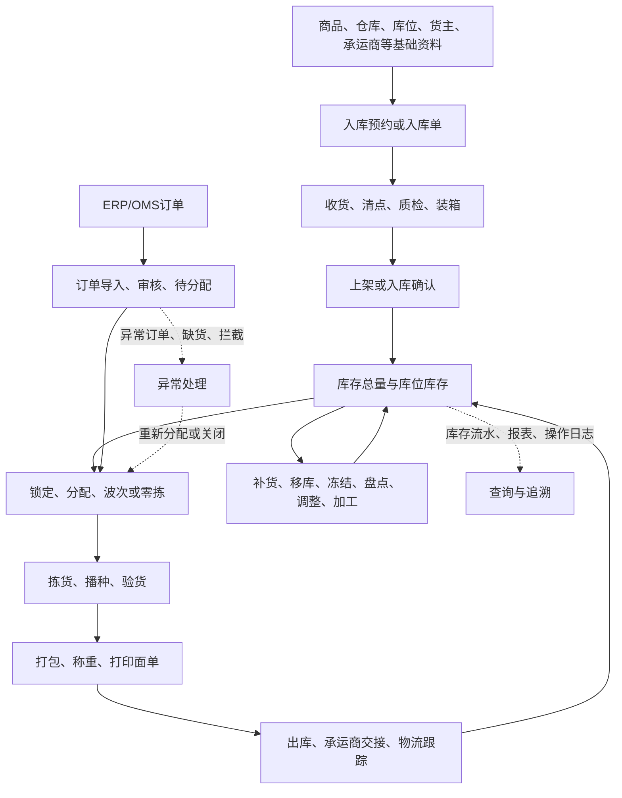
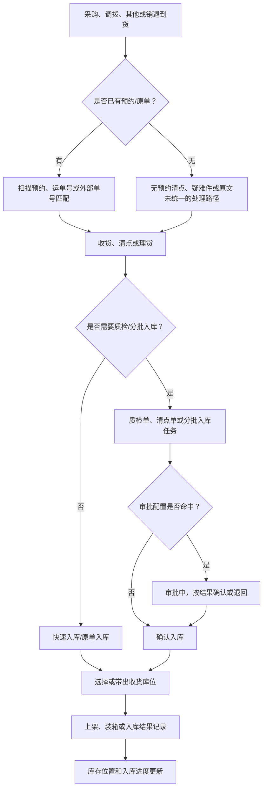
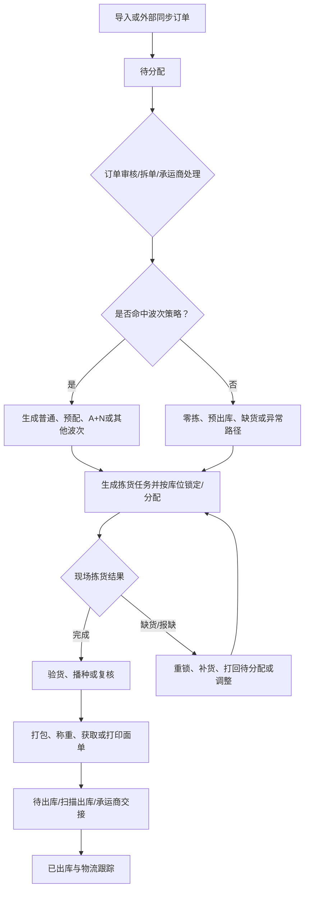
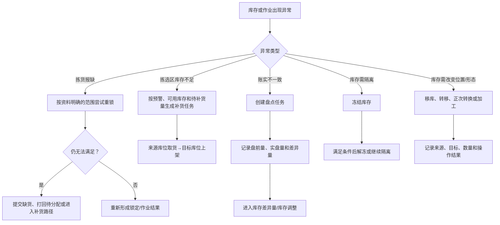

# 00. 跨章节主链与学习导航

本文件补足按章节流程图之外的“总地图”。它不是把所有页面压成一条必经流程，而是帮助新手先建立对象关系，再回到对应章节核对具体规则。

## 1. 怎么使用这张总地图

先看业务主链，理解货物和订单分别怎样流动；再看入库、出库和库存异常三张分图；最后回到01层原文，检查每个节点的页面动作、配置开关和限制条件。图中标注“原文未统一”的地方，不能直接写进PRD的确定规则。

## 2. WMS业务总链

### 2.1 原文依据

- 入库：`00-源文件/操作手册/入库/入库单据/入库预约.md`、`00-源文件/操作手册/入库/快速入库/收货入库.md`、`00-源文件/操作手册/入库/分批入库/进度/分批入库任务.md`
- 出库：`00-源文件/操作手册/出库_B2C/打单/导入订单.md`、`00-源文件/操作手册/出库_B2C/打单/待分配.md`、`00-源文件/操作手册/出库_B2C/拣货/拣货任务.md`
- 库存：`00-源文件/操作手册/库存/库存状况/库存总量.md`、`00-源文件/操作手册/仓内作业/库存移动/补货上架.md`、`00-源文件/操作手册/仓内作业/库存变更/盘点任务.md`
- 位置与策略：`00-源文件/操作手册/基础信息/档案管理/仓库库位.md`、`00-源文件/操作手册/仓内策略/波次策略/index.md`

### 2.2 Mermaid流程图

### 2.3 读图重点与事实边界

| 观察点 | 资料明确支持的理解 | 不能直接推断的内容 |
|---|---|---|
| 主数据 | 商品、仓库、区域、库区、库位、容器、货主和承运商会被业务环节引用 | 主数据启用后是否必须审批、所有对象是否共用一套状态，原文未统一说明 |
| 入库 | 预约、收货/清点、质检、分批入库任务、入库确认和上架在不同页面或模式中出现 | 所有入库类型都必须按同一顺序执行；库存究竟在收货、入库确认还是上架时增加，需按场景确认 |
| 出库 | 订单进入待分配后，可根据策略进入波次、零拣或特殊作业，再经过拣货、验货、打包、称重、出库等环节 | 普通B2C、大宗B2B、JIT/JITX、即时零售必须共用一套状态和必经节点 |
| 库存 | 库存总量明确展示实际、可用、锁定、冻结和在途；移库、补货、盘点、调整会改变库存视图或产生记录 | “锁定”“作业中”“预占”是否是三个独立库存对象，原文未统一定义 |
| 追溯 | 库存详情、操作日志、物流跟踪、报表和视频可以从不同角度回查业务 | 各类记录是否共享同一流水号、是否能跨模块一键跳转，原文未完整说明 |

## 3. 入库主链：从到货意图到库存位置

原文明确写出了有预约与无预约清点、PC/PDA多种入库入口、容器装箱、分批任务和审批结果；但不同入口的库存生效时点并没有在一处统一定义。产品设计时应把“收到多少”“入库单是否生效”“货物现在在哪个库位”拆成三个问题。

## 4. 出库主链：从订单池到承运商交接

这里最值得新手产品经理学习的是“订单池”和“现场任务”要分层：订单决定要发什么，任务决定现场做什么，包裹和运单决定发出去的载体；缺货、拦截和改单不能只靠改一个订单状态解决。

## 5. 库存异常与反向处理

### 5.1 关键数量公式

| 资料位置 | 原文公式或规则 | 设计提示 |
|---|---|---|
| [库存总量](../00-源文件/操作手册/库存/库存状况/库存总量.md) | `可用库存=实际库存-待发货数量（锁定数量）-冻结数量`；`实际库存=可用库存+锁定库存+冻结库存`；在途库存不计入库存总量 | 先定义数量口径，再定义库存字段，不要把页面列名直接当成数据库字段 |
| [补货上架](../00-源文件/操作手册/仓内作业/库存移动/补货上架.md) | `库区补货数量=预警上限-当前库区剩余可用-待补货任务` | “待补货任务”是计算中的占用量，是否与锁定库存共用字段需要确认 |
| [盘点任务](../00-源文件/操作手册/仓内作业/库存变更/盘点任务.md) | `盘点差异量=盘点后数量-盘点前数量` | 盘点发现差异，库存调整才是改变账面数量的动作 |

## 6. 对应章节入口

| 先看总图后进入 | 01事实层 | 03产品设计 | 04字段设计 |
|---|---|---|---|
| 主数据和库位 | [01基础信息](../01-按章节拆分的md文件/01-基础信息与系统设置.md)、[02商品](../01-按章节拆分的md文件/02-商品中心与库存属性.md) | [01基础资料](../03-WMS产品设计精华知识借鉴/01-基础资料与主数据设计.md)、[02空间资源](../03-WMS产品设计精华知识借鉴/02-仓库空间与作业资源设计.md) | [01基础字段](../04-WMS的字段设计参考借鉴/01-基础资料与主数据字段设计.md)、[02空间字段](../04-WMS的字段设计参考借鉴/02-仓库空间与作业资源字段设计.md) |
| 入库和上架 | [04入库操作](../01-按章节拆分的md文件/04-入库操作.md) | [04入库管理](../03-WMS产品设计精华知识借鉴/04-入库管理设计.md)、[05收货上架](../03-WMS产品设计精华知识借鉴/05-收货质检与上架作业设计.md) | [04入库字段](../04-WMS的字段设计参考借鉴/04-入库管理字段设计.md)、[05收货上架字段](../04-WMS的字段设计参考借鉴/05-收货质检与上架字段设计.md) |
| 出库和发运 | [03策略](../01-按章节拆分的md文件/03-仓内策略.md)、[05B2C](../01-按章节拆分的md文件/05-出库_B2C.md)、[06B2B](../01-按章节拆分的md文件/06-大宗_B2B.md) | [03规则策略](../03-WMS产品设计精华知识借鉴/03-WMS规则与策略设计.md)、[06出库管理](../03-WMS产品设计精华知识借鉴/06-出库管理设计.md)、[07执行作业](../03-WMS产品设计精华知识借鉴/07-出库执行作业设计.md) | [03策略字段](../04-WMS的字段设计参考借鉴/03-WMS规则与策略字段设计.md)、[06出库字段](../04-WMS的字段设计参考借鉴/06-出库管理字段设计.md)、[07执行字段](../04-WMS的字段设计参考借鉴/07-出库执行作业字段设计.md) |
| 库存和异常 | [07仓内作业](../01-按章节拆分的md文件/07-仓内作业.md)、[08库存](../01-按章节拆分的md文件/08-库存管理.md) | [08库存管理](../03-WMS产品设计精华知识借鉴/08-库存管理设计.md)、[09库存交易](../03-WMS产品设计精华知识借鉴/09-库存交易与盘点设计.md)、[10任务](../03-WMS产品设计精华知识借鉴/10-任务管理设计.md) | [08库存字段](../04-WMS的字段设计参考借鉴/08-库存管理字段设计.md)、[09交易字段](../04-WMS的字段设计参考借鉴/09-库存交易与盘点字段设计.md)、[10任务字段](../04-WMS的字段设计参考借鉴/10-任务管理字段设计.md) |

## 7. 设计练习

任选一个节点，写出四行内容：输入是什么、系统做什么、现场看到什么、结果如何验收。建议先练习“拣货报缺”“收货无预约”“盘点差异”三个场景，因为它们最容易暴露状态、数量和异常处理没有闭环的问题。
