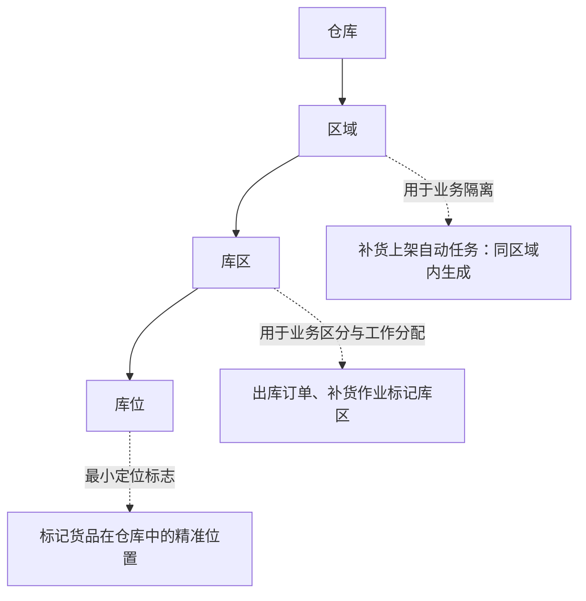
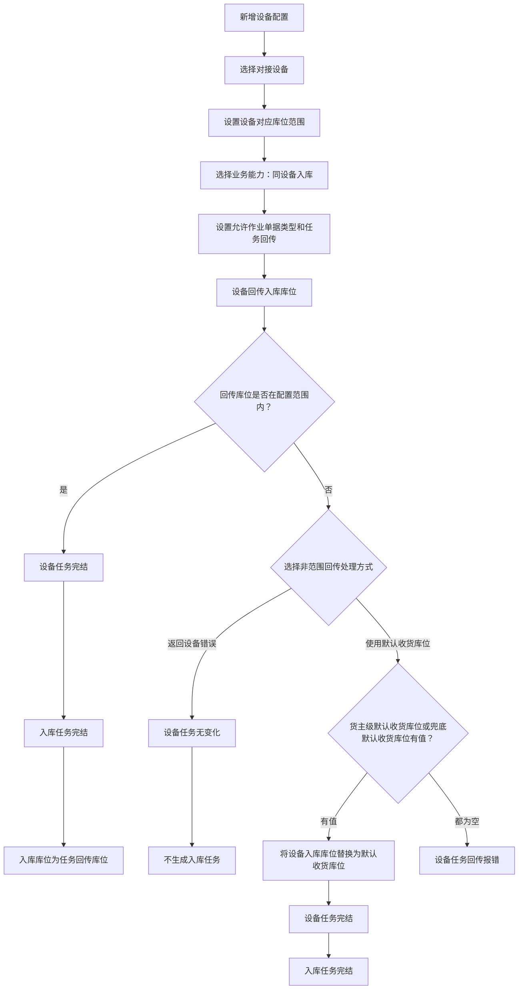
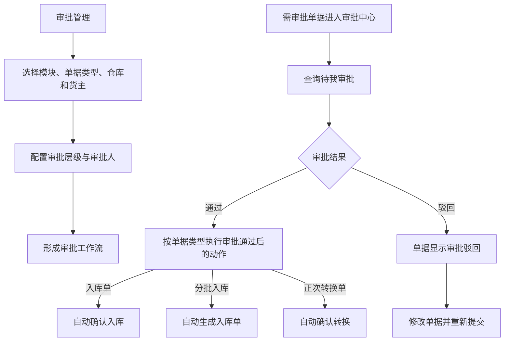

# 01. 基础信息与系统设置

本章只呈现基础档案和自动化仓库配置中，源文档明确写出了层级关系或处理分支的内容。打印模板、账号管理、店铺授权等以页面配置为主的内容，本章暂不强行画成流程图。

## 1. 图表目录

| 编号 | 图表 | 类型 | 用途 |
|---|---|---|---|
| 01-1 | 仓库、区域、库区、库位的层级与作用 | `flowchart` | 说明仓内位置对象的层级关系及源文档明确写出的作用 |
| 01-2 | 自动化仓库入库设备回传处理 | `flowchart` | 展开设备回传库位在范围内、范围外时的处理分支 |
| 01-3 | 审批配置与单据审批结果 | `flowchart` | 展示审批流配置、单据审批和审批结果对入库/转换单据的影响 |

## 2. 仓库、区域、库区、库位的层级与作用

### 2.1 图表标题与用途

这是一张对象关系图，呈现源文档中“仓库下分区域、区域下分库区、库区下分库位”的层级，以及区域、库区、库位分别承担的业务作用。

### 2.2 原文依据

- 源 Markdown：`00-源文件/操作手册/基础信息/档案管理/仓库库位.md`
- PDF 页码：原始资料当前为 Markdown，原文未提供页码。
- 原文小节：`1.区域`、`2.库区`、`3.库位`
- 章节定位：[01-基础信息与系统设置.md](../01-按章节拆分的md文件/01-基础信息与系统设置.md#0111-仓库库位)

### 2.3 Mermaid 代码

### 2.4 编号说明

| 编号 | 节点或关系 | 原文明确说明 |
|---|---|---|
| 1 | 仓库 → 区域 | 仓库下的一个平面仓（一层）建议编为一个区域。 |
| 2 | 区域 → 库区 | 库区用于区分实际作业中的功能划分。 |
| 3 | 库区 → 库位 | 库位是仓库中最小的定位标志，用于标记货品精准位置。 |
| 4 | 区域的作用 | 用于业务隔离；原文举例说明补货上架只会在同区域内生成自动任务。 |
| 5 | 库区的作用 | 用于业务区分和工作分配；出库订单、补货作业会标记库区。 |

### 2.5 事实边界 / 原文未说明

- 图中箭头表示源文档明确写出的层级关系，不代表系统的全部仓储组织模型。
- 源文档没有在本小节中说明区域、库区、库位的数据库关系、编码规则或创建权限，因此不在图中补充。
- “补货上架自动任务：同区域内生成”是源文档对区域作用的原文概括，不延伸为所有仓内任务都必须同区域。

## 3. 自动化仓库入库设备回传处理

### 3.1 图表标题与用途

这是一张细粒度流程图，专门呈现“同设备入库”配置下，设备回传入库库位后，系统根据库位范围进行处理的分支。

### 3.2 原文依据

- 源 Markdown：`00-源文件/操作手册/基础信息/设备管理/自动化仓库.md`
- PDF 页码：原始资料当前为 Markdown，原文未提供页码。
- 原文小节：`1、入库作业`、`1.1同设备入库`
- 章节定位：[01-基础信息与系统设置.md](../01-按章节拆分的md文件/01-基础信息与系统设置.md#01111-自动化仓库)

### 3.3 Mermaid 代码

### 3.4 编号说明

| 编号 | 节点或判断 | 原文明确说明 |
|---|---|---|
| 1 | 设备对应库位范围 | 至少设置 1 个，可以是区域、库区、库位层级；不同设备间设置的库位范围不允许交叉。 |
| 2 | 回传库位在范围内 | 回传成功，设备任务完结、入库任务完结，入库库位为任务回传库位。 |
| 3 | 非范围回传处理方式 | “返回设备错误”和“使用默认收货库位”是配置中二选一的处理方式。 |
| 4 | 返回设备错误 | 设备任务无变化，不生成入库任务。 |
| 5 | 使用默认收货库位 | 将回传的设备入库库位替换为默认收货库位，设备任务和入库任务完结。 |
| 6 | 默认收货库位取值 | 原文说明优先级为“货主级默认收货库位 → 兜底默认收货库位”，都为空时设备任务回传报错。 |

### 3.5 事实边界 / 原文未说明

- 图中只呈现源文档明确描述的“同设备入库”分支，没有把同设备下架、同设备移库、同设备补货等其他作业混入本图。
- 源文档没有说明设备回传报错后的人工处理步骤，因此流程在“设备任务回传报错”处结束。
- 允许作业单据类型的具体枚举及不同单据的默认收货库位取值，保留在源章节正文中，本图不展开。

## 4. 审批配置与单据审批结果

### 4.1 图表标题与用途

这是一张中等粒度流程图，整理审批流配置与审批中心处理单据的关系，并展示源文档明确写出的入库、分批入库和正次转换审批结果。

### 4.2 原文依据

- 源 Markdown：本章 `01.2.8 审批中心`、`01.2.9 审批管理`
- 原文小节：审批中心、审批管理
- PDF 页码：原始资料当前为 Markdown，原文未提供页码。
- 章节定位：[01-基础信息与系统设置.md](../01-按章节拆分的md文件/01-基础信息与系统设置.md#0128-审批中心)

### 4.3 Mermaid 代码

### 4.4 编号说明

1. 审批管理先选择模块，再选择单据类型，并按仓库、货主等条件配置工作流和审批人。
2. 审批中心默认查询“待我审批”，支持单个或批量通过、驳回。
3. 审批通过后，入库单自动确认入库，分批入库任务自动生成入库单，正次转换单自动确认转换。
4. 审批驳回后，单据显示“审批驳回”，可修改后重新提交。

### 4.5 事实边界 / 原文未说明

- 图中只画出源文档明确列出的审批单据类型和结果，没有把其他单据推导为同样的审批后动作。
- 审批工作流的匹配条件、层级数量和审批人数量限制保留在正文中，本图不压缩成通用配置上限。
- 已存在单据与新建单据在审批流被编辑或删除后的具体适用规则，原文有说明，本图未展开。

## 5. 关键逻辑说明

| 逻辑主题 | 关键事实 | 本章图表处理 |
|---|---|---|
| 仓内位置层级 | 仓库、区域、库区、库位存在明确的上下级关系。 | 用 01-1 展示层级和作用。 |
| 设备回传校验 | 自动化入库设备回传的入库库位需要结合设备配置范围处理。 | 用 01-2 展示范围内、返回设备错误、使用默认收货库位三条分支。 |
| 审批闭环 | 审批管理负责配置工作流，审批中心负责处理单据；通过和驳回会产生不同后续动作。 | 用 01-3 展示配置、审批和结果。 |
| 其他基础设置 | 打印、店铺、账号、承运商等内容在源文档中主要是页面配置或操作说明。 | 本批不把页面配置强行解释成跨模块流程。 |

## 6. 本章未绘制内容

- 源文档只说明功能存在或配置方式、但没有明确前后关系的内容，本章不单独绘制流程图。
- 本章没有推导仓库、区域、库区、库位之外的组织模型，也没有补充权限、接口或状态规则。
