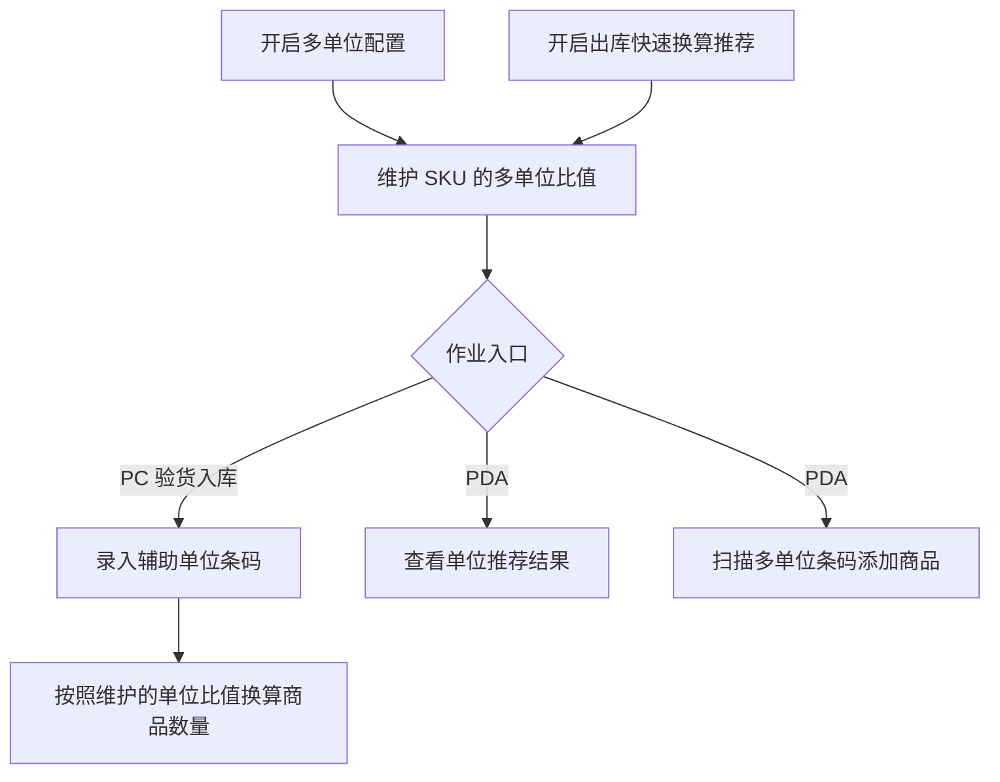
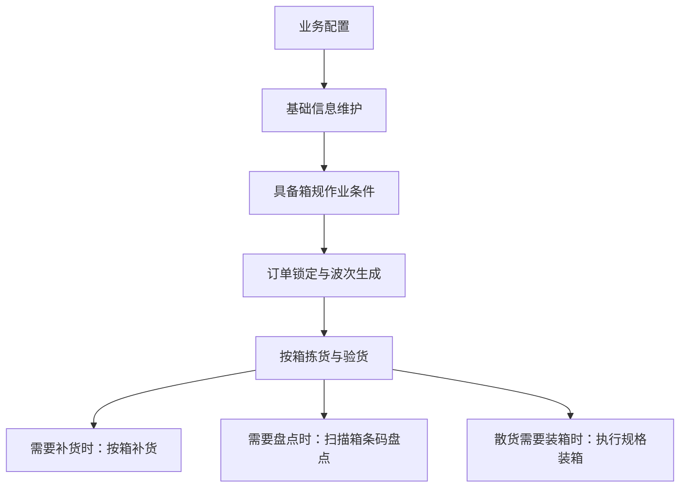
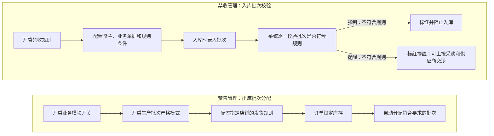

# 02. 商品中心与库存属性

本章选择商品包装与库存属性中，源文档明确写出操作前提、作业顺序或校验结果的内容进行图解。商品品牌、自定义属性、条码打印等页面维护内容以文字和原章节为主，不强行画成流程。

## 1. 图表目录

| 编号 | 图表 | 类型 | 用途 |
|---|---|---|---|
| 02-1 | 多单位配置、单位维护与作业录入 | `flowchart` | 说明多单位功能的配置前提及 PC/PDA 作业入口 |
| 02-2 | 箱规普通订单作业链 | `flowchart` | 按源文档顺序呈现箱规在普通订单中的主要作业环节 |
| 02-3 | 保质期禁收与禁售控制 | `flowchart` | 分开呈现入库禁收校验和出库禁售批次分配 |

## 2. 多单位配置、单位维护与作业录入

### 2.1 图表标题与用途

这是一张中等粒度流程图，呈现开启多单位相关配置、维护 SKU 的单位比值和条码后，PC 与 PDA 如何使用单位换算能力。

### 2.2 原文依据

- 源 Markdown：`00-源文件/专题功能介绍/行业_库存属性/装箱_箱规_多单位/WMS-商品多级单位管理.md`
- PDF 页码：原始资料当前为 Markdown，原文未提供页码。
- 原文小节：`一、配置及商品设定`、`二、操作展示`
- 章节定位：[02-商品中心与库存属性.md](../01-按章节拆分的md文件/02-商品中心与库存属性.md#0221-wms-商品多级单位管理)

### 2.3 Mermaid 代码

### 2.4 编号说明

| 编号 | 节点或判断 | 原文明确说明 |
|---|---|---|
| 1 | 多单位配置 | 原文要求在仓内策略—业务配置—其他配置中开启多单位配置。 |
| 2 | 快速换算推荐 | 原文单独说明“开启出库快速换算推荐”。 |
| 3 | SKU 维护 | 可针对每个 SKU 设置多单位比值以及条码，最大支持 5 种单位。 |
| 4 | PC 验货入库 | 扫描辅助单位条码后，商品数量按照该条码对应的单位比值增加；原文示例为条码 `orange-2`，每次录入数量加 2。 |
| 5 | PDA 作业 | PDA 支持查看单位推荐结果，也支持扫描多单位条码添加商品。 |

### 2.5 事实边界 / 原文未说明

- 图中把“开启多单位配置”和“开启出库快速换算推荐”并列为配置项，未推导两者之间的系统依赖关系。
- 原文明确给出 `orange-2` 的示例，但没有说明所有条码都采用相同命名规则，因此没有把 `-2` 画成通用解析规则。
- 原文说明如果只使用单位换算推荐，可以不填写条码；图中没有把条码维护画成所有场景的强制前置条件。

## 3. 箱规普通订单作业链

### 3.1 图表标题与用途

这是一张粗略到中等粒度的流程图，按源文档“二、使用方式（普通订单）”整理箱规配置、普通订单作业，以及补货、盘点和装箱等相关作业之间的关系。

### 3.2 原文依据

- 源 Markdown：`00-源文件/专题功能介绍/行业_库存属性/装箱_箱规_多单位/WMS-箱规模块(箱规).md`
- PDF 页码：原始资料当前为 Markdown，原文未提供页码。
- 原文小节：`二、使用方式（普通订单）`
- 章节定位：[02-商品中心与库存属性.md](../01-按章节拆分的md文件/02-商品中心与库存属性.md#0223-wms-箱规模块箱规)

### 3.3 Mermaid 代码

### 3.4 编号说明

| 编号 | 环节 | 原文明确说明 |
|---|---|---|
| 1 | 业务配置 | 使用箱规前，需要在业务配置中开启业务开关。 |
| 2 | 基础信息维护 | 仓库库位中新增箱拣选库位，并在商品信息中维护装箱规则、箱条码、比值及单位；支持箱规信息导入。 |
| 3 | 具备箱规作业条件 | 配置和基础信息维护完成后，原文建议按箱收货时在 PDA 移动端执行验货入库；本图不表示每次普通订单都从此处开始。 |
| 4 | 锁定与波次生成 | 基础信息和货品准备完成后，订单进入系统，系统根据设定的波次策略进行锁库和波次生成。 |
| 5 | 拣货、验货 | 锁定规格箱后，PDA 拣货页面显示箱子信息；验货支持扫描箱条码验箱。 |
| 6 | 补货、盘点、装箱 | 源文档分别说明按箱补货、扫描箱条码盘点，以及对散货执行规格装箱；三者是相关作业，不画成互相依赖的连续步骤。 |

### 3.5 事实边界 / 原文未说明

- 本图只表示普通订单部分的作业关系，不表示所有箱规作业必须在同一订单中连续执行。
- 源文档另有“大宗订单”和“其他作业”部分，本图未混入；它们是否与普通订单共用全部节点，不能由本图推断。
- 图中没有补充箱规与库存单位之间的算法，只保留源文档明确写出的作业环节。

## 4. 保质期禁收与禁售控制

### 4.1 图表标题与用途

这是一张分支流程图，将源文档中的“禁收管理”和“禁售管理”并列呈现。两者都涉及保质期规则，但分别作用于入库和出库库存锁定。

### 4.2 原文依据

- 源 Markdown：`00-源文件/专题功能介绍/行业_库存属性/WMS-保质期禁收_禁售.md`
- PDF 页码：原始资料当前为 Markdown，原文未提供页码。
- 原文小节：`禁收管理`、`禁售管理`
- 章节定位：[02-商品中心与库存属性.md](../01-按章节拆分的md文件/02-商品中心与库存属性.md#0231-wms-保质期禁收_禁售)

### 4.3 Mermaid 代码

### 4.4 编号说明

| 编号 | 节点或判断 | 原文明确说明 |
|---|---|---|
| 1 | 禁收配置 | 可配置货主、业务单据和规则条件；规则条件可使用预设规则、商品禁收期或自定义禁收期。 |
| 2 | 禁收强制 | 无论如何都不可入库，没有协商余地。 |
| 3 | 禁收提醒 | 对操作员进行标红提醒，可以上报采购和供应商交涉；原文没有在此处明确交涉后的系统结果。 |
| 4 | 禁售前提 | 必须开启业务模块开关和生产批次严格模式，系统才可以使用禁售规则。 |
| 5 | 禁售配置与结果 | 配置店铺及发货规则后，系统在锁定库存时为订单自动分配符合要求的批次。 |

### 4.5 事实边界 / 原文未说明

- “禁收”和“禁售”是源文档中的两个管理场景，本图没有把它们合并成一个统一的库存状态机。
- 禁收“提醒”分支只画到“上报采购和供应商交涉”，因为原文没有说明交涉后的入库结果。
- 原文没有在本节完整说明多条规则同时命中时的优先级算法，因此图中没有增加优先级判断。

## 5. 关键逻辑说明

| 逻辑主题 | 关键事实 | 本章图表处理 |
|---|---|---|
| 单位换算 | 商品可维护多单位比值和条码，PC/PDA 作业可通过推荐或扫描使用。 | 用 02-1 展示配置到作业入口。 |
| 箱规作业 | 普通订单部分按“业务配置 → 基础信息维护 → 验货入库 → 锁定与波次生成 → 拣货 → 验货 → 补货 → 盘点 → 装箱”展开。 | 用 02-2 保留源文档顺序。 |
| 保质期控制 | 禁收在入库批次录入时校验；禁售在库存锁定时分配符合要求的批次。 | 用 02-3 分开呈现，避免混为一个流程。 |
