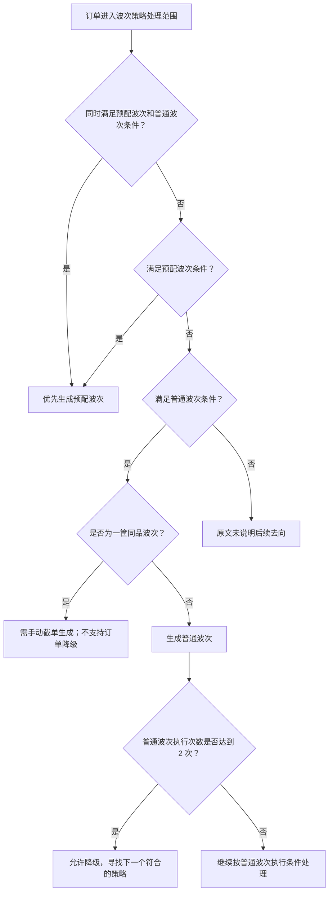
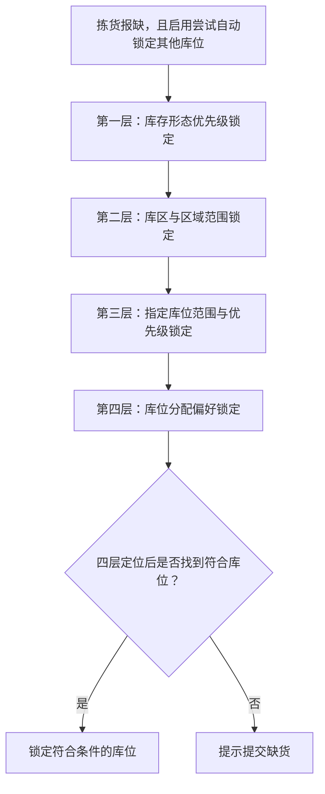
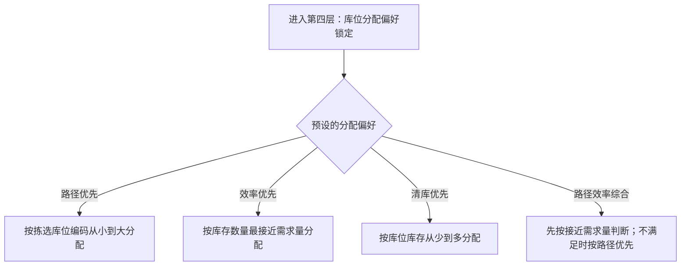

# 03. 仓内策略

本章只对源文档明确写出策略分类、波次降级和库存重锁层级的内容进行图解。策略字段、业务配置开关和大量计分规则仍以源章节正文为事实依据，不在图中全部展开。

## 1. 图表目录

| 编号 | 图表 | 类型 | 用途 |
|---|---|---|---|
| 03-1 | 波次策略分类与普通波次降级 | `flowchart` | 展示预配波次、普通波次及普通波次降级的明确逻辑 |
| 03-2 | 拣货报缺时的四层重锁库存逻辑 | `flowchart` | 展开报缺后尝试锁定其他库位时的四层定位顺序 |
| 03-3 | 库位分配偏好 | `flowchart` | 说明第四层中四种库位分配偏好的适用逻辑 |

## 2. 波次策略分类与普通波次降级

### 2.1 图表标题与用途

这是一张中等粒度流程图，呈现源文档明确写出的两类波次策略，以及普通波次在执行次数达到条件后允许降级寻找下一个符合策略的逻辑。

### 2.2 原文依据

- 源 Markdown：`00-源文件/操作手册/仓内策略/波次策略/index.md`
- PDF 页码：原始资料当前为 Markdown，原文未提供页码。
- 原文小节：波次策略分类及普通波次说明
- 补充依据：`00-源文件/操作手册/仓内策略/波次策略/普通波次/自由波次.md` 的 `二、执行条件`
- 章节定位：[03-仓内策略.md](../01-按章节拆分的md文件/03-仓内策略.md#0310-波次策略总览)

### 2.3 Mermaid 代码

### 2.4 编号说明

| 编号 | 节点或判断 | 原文明确说明 |
|---|---|---|
| 1 | 波次策略分类 | 源文档说明波次策略分为预配波次和普通波次。 |
| 2 | 同时满足两类策略 | 源文档说明预配波次优先级高于普通波次，同时满足时生成预配波次。 |
| 3 | 普通波次降级 | 源文档说明普通波次中，订单的波次执行次数达到 2 次时，允许降级寻找下一个符合的策略。 |
| 4 | 一筐同品波次 | 源文档说明一筐同品不支持自动波次，需手动截单生成，也不支持订单降级。 |
| 5 | 普通波次条件 | 自由波次文档还明确说明起止时间、间隔时间、最长等待时间、容量上下限等执行条件；本图不展开全部条件。 |

### 2.5 事实边界 / 原文未说明

- “满足条件”是图上的汇总节点，不代表新增了一个统一的系统判断字段。
- 图中将同时满足两类策略单独画出，是为了呈现源文档明确写出的预配波次优先关系。
- 对于不满足预配波次和普通波次的订单，本图标为“原文未说明后续去向”，没有根据其他章节内容补画零拣或其他去向。
- 源文档还说明了普通波次的容量、时间和分组条件，但这些条件需要按具体策略分别展开，本图不把它们压缩成未经验证的统一算法。
- “一筐同品”是普通波次中的特殊作业方式；本图只补入源文档明确写出的手动截单和不降级边界。

## 3. 拣货报缺时的四层重锁库存逻辑

### 3.1 图表标题与用途

这是一张细粒度流程图，范围限定为“开启拣货报缺时尝试自动锁定其他库位”后的重锁库存逻辑，不代表所有订单锁库都必然按这四层执行。

### 3.2 原文依据

- 源 Markdown：`00-源文件/操作手册/仓内策略/业务配置-出库配置.md`
- PDF 页码：原始资料当前为 Markdown，原文未提供页码。
- 原文小节：`开启缺货订单处理`、`拣货报缺时尝试自动锁定其他库位`、`系统订单报缺重锁库存逻辑`
- 章节定位：[03-仓内策略.md](../01-按章节拆分的md文件/03-仓内策略.md#0325-业务配置-出库配置)

### 3.3 Mermaid 代码

### 3.4 编号说明

| 层级 | 原文逻辑 |
|---|---|
| 第一层 | 如果开启优先锁箱配置，优先锁定货箱库存；货箱库存不足时，再锁定拆零库存。 |
| 第二层 | 按同库区、邻近库区、同区域、邻近区域、全仓范围依次查找；原文明确写出邻近范围为左右 30 个库位或区域。 |
| 第三层 | 在特定配置的库位范围内，按照预设优先级规则锁定库存。 |
| 第四层 | 根据预设的分配偏好执行锁定，偏好有路径优先、效率优先、清库优先、路径效率综合。 |
| 结果 | 四层定位后最终锁到符合的库位；若未找到符合库位，则提示提交缺货。 |

### 3.5 事实边界 / 原文未说明

- 本图的入口是“拣货报缺时尝试自动锁定其他库位”，没有把普通锁库、手动截单、全仓清单等其他场景混入。
- 第二层的“左右 30 个库位或区域”是源文档明确写出的范围，不代表所有仓库都使用同样的物理距离计算方式。
- 本图只呈现四层顺序，不推导每一层内部的数据库查询、并发处理或失败重试机制。

## 4. 库位分配偏好

### 4.1 图表标题与用途

这是一张细节级流程图，展开四层重锁逻辑中的第四层，说明源文档列出的四种库位分配偏好及其明确的选择方向。

### 4.2 原文依据

- 源 Markdown：`00-源文件/操作手册/仓内策略/业务配置-出库配置.md`
- PDF 页码：原始资料当前为 Markdown，原文未提供页码。
- 原文小节：`库位分配`、`第四层：库位分配偏好锁定`
- 章节定位：[03-仓内策略.md](../01-按章节拆分的md文件/03-仓内策略.md#0325-业务配置-出库配置)

### 4.3 Mermaid 代码

### 4.4 编号说明

| 偏好 | 原文明确说明 |
|---|---|
| 路径优先 | 根据拣选库位编码从小到大分配；适用于面积较大或路径较长的仓库。 |
| 效率优先 | 根据商品拣选库位库存最接近商品所需量分配；适用于产品较重、较大或拆包麻烦的仓库。 |
| 清库优先 | 按库位库存从少到多分配，用于尽可能出库边角库存、腾出库位空间。库存相同时，再按库位优先级和库位编码判断。 |
| 路径效率综合 | 优先根据库存是否接近需求量判断；有满足需求量的库位时按效率优先，没有时按路径优先。 |

### 4.5 事实边界 / 原文未说明

- 图中只展示四种偏好的选择方向，没有把源文档中的全部库存不足、库存为负数和多库位拆分条件全部展开。
- 源文档在四种偏好的总括处写作“清仓优先”，在具体说明处写作“清库优先”；本图沿用具体说明中的“清库优先”，名称存在原文差异。
- “适用于面积较大”等文字是源文档对偏好的说明，不是本图新增的推荐结论。
- 源文档没有在这一小节给出四种偏好的系统默认值，因此图中没有设置默认偏好。

## 5. 关键逻辑说明

| 逻辑主题 | 关键事实 | 本章图表处理 |
|---|---|---|
| 波次策略 | 预配波次与普通波次是源文档明确列出的两类策略；预配波次优先。 | 用 03-1 表达策略分类和普通波次降级。 |
| 报缺重锁 | 报缺重锁按库存形态、库区/区域、指定库位范围与优先级、库位分配偏好四层整理。 | 用 03-2 展示顺序，用 03-3 展开第四层。 |
| 策略配置项 | 源文档中还有大量业务配置、绩效规则和出库配置开关。 | 不把所有配置项强行绘制成流程节点。 |
