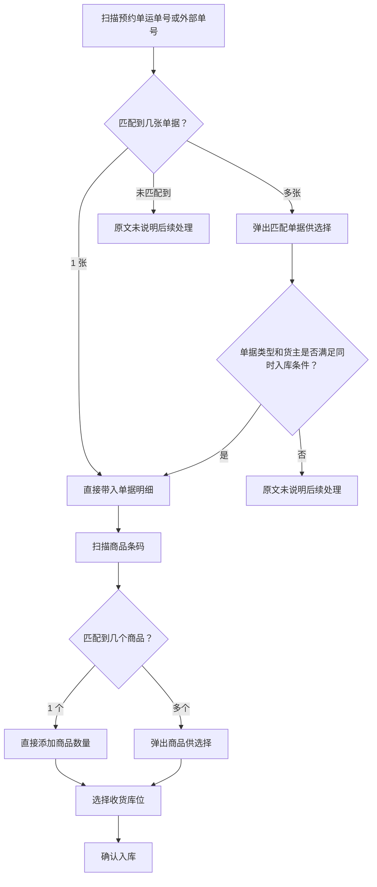
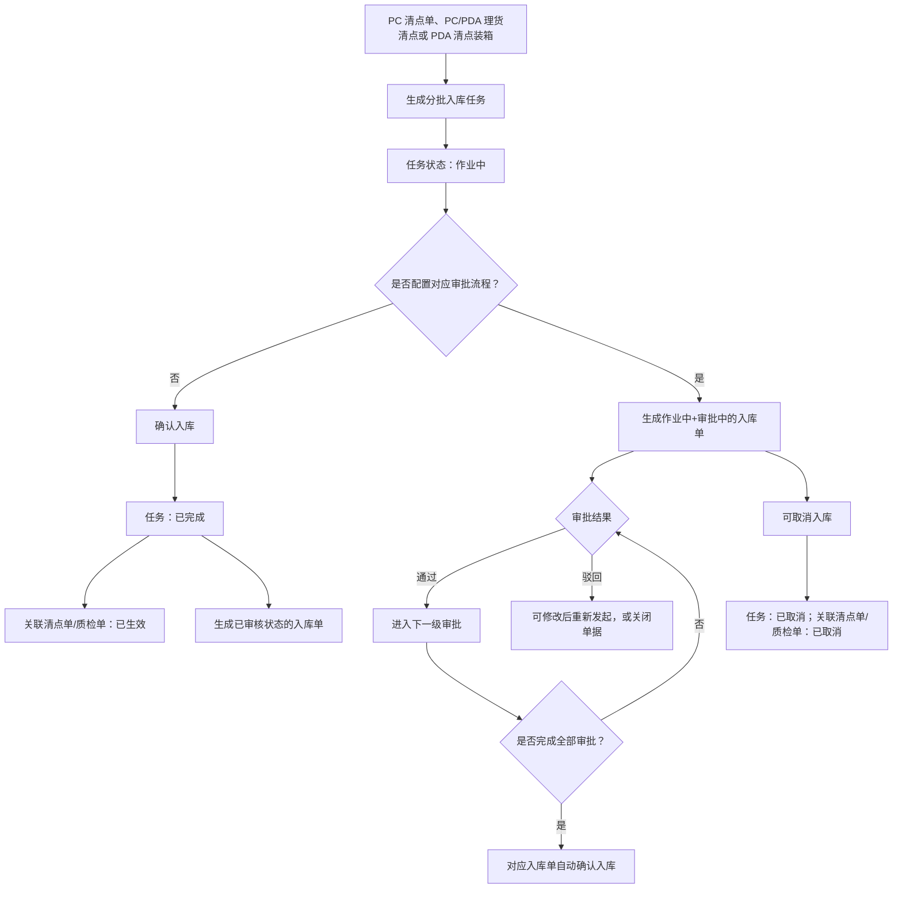
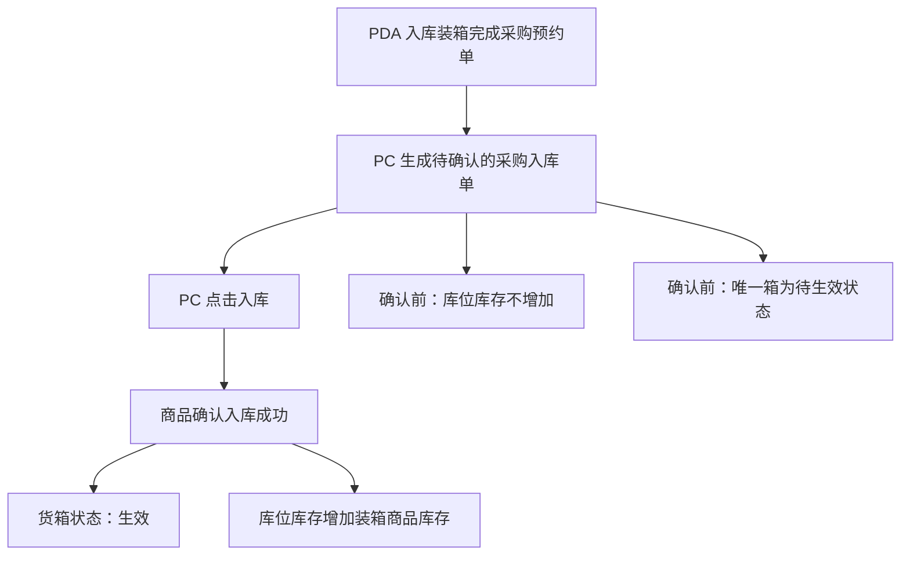

# 04. 入库操作

本章优先整理入库作业中存在明确先后关系、匹配分支和状态结果的内容。不同入库类型的页面字段很多，本轮不把字段清单全部画入流程图。

## 1. 图表目录

| 编号 | 图表 | 类型 | 用途 |
|---|---|---|---|
| 04-1 | 收货入库的扫描匹配路径 | `flowchart` | 展示扫描单据、匹配单据和扫描商品后的基本分支 |
| 04-2 | 分批入库任务确认与审批分支 | `flowchart` | 展示清点/质检后的确认入库、审批和取消结果 |
| 04-3 | PDA 入库装箱到 PC 确认入库 | `flowchart` | 展示装箱完成后待确认入库单与库存生效的关系 |

## 2. 收货入库的扫描匹配路径

### 2.1 图表标题与用途

这是一张中等粒度流程图，展示收货入库扫描预约单和商品条码时，源文档明确写出的单据匹配分支。

### 2.2 原文依据

- 源 Markdown：`00-源文件/操作手册/入库/快速入库/收货入库.md`
- 原文小节：`1.收货入库`、`2.入库装箱`
- PDF 页码：原始资料当前为 Markdown，原文未提供页码。
- 章节定位：[04-入库操作.md](../01-按章节拆分的md文件/04-入库操作.md)

### 2.3 Mermaid 代码

### 2.4 编号说明

| 编号 | 节点或判断 | 原文明确说明 |
|---|---|---|
| 1 | 扫描单据信息 | 支持扫描预约单的运单号和外部单号，并进行匹配。 |
| 2 | 多单据匹配 | 匹配多个单据时弹出选择；只支持同类型、同货主的单据同时入库。 |
| 3 | 扫描商品条码 | 支持条码截取、辅助条码和主条码；匹配一个商品时直接添加数量，匹配多个时弹出选择。 |
| 4 | 确认入库 | 选择收货库位后进入入库操作；是否自动提交还受业务配置影响。 |

### 2.5 事实边界 / 原文未说明

- “未匹配到单据”以及不满足同类型/同货主条件时的后续处理，源文档未说明，本图没有补画异常处理。
- 本图针对“收货入库”，不代表采购入库、验货入库、销退扫描入库都完全使用同一匹配规则。
- 图中的“确认入库”是作业动作名称，不推导后续审核、上架或 ERP 回传的统一时点。

## 3. 分批入库任务确认与审批分支

### 3.1 图表标题与用途

这是一张中等粒度流程图，整理分批入库任务从清点/质检完成到确认入库、审批或取消的明确结果。

### 3.2 原文依据

- 源 Markdown：`00-源文件/操作手册/入库/分批入库/进度/分批入库任务.md`
- 原文小节：`1.生成任务`、`5.确认入库`、`6.取消入库`
- PDF 页码：原始资料当前为 Markdown，原文未提供页码。
- 章节定位：[04-入库操作.md](../01-按章节拆分的md文件/04-入库操作.md)

### 3.3 Mermaid 代码

### 3.4 编号说明

| 编号 | 节点或判断 | 原文明确说明 |
|---|---|---|
| 1 | 任务生成 | 从清点或理货清点等页面生成清点单后，会同步生成分批入库任务，默认状态为“作业中”。 |
| 2 | 未配置审批 | 确认入库正常时，任务变为“已完成”，关联清点单/质检单变为“已生效”，并生成“已审核”入库单。 |
| 3 | 配置审批 | 符合审批配置的任务在确认入库或改入后生成“作业中+审批中”的入库单；审批通过后进入下一级，全部通过后自动确认入库。 |
| 4 | 驳回与取消 | 驳回后可修改重新发起或关闭单据；取消成功后任务及关联清点单/质检单变为“已取消”，不会生成入库单。 |

### 3.5 事实边界 / 原文未说明

- 图中“是否配置对应审批流程”是根据源文档对审批配置前后的两种结果整理出的分支，不推导审批人的通用权限模型。
- “可取消入库”与审批分支在页面上的具体可操作条件，源文档没有在同一段完整列出，本图只保留明确写出的取消结果。
- 不同任务类型的改入范围受入库超收、次品、序列号和生产批次等配置影响，本图不把这些配置压缩成统一规则。

## 4. PDA 入库装箱到 PC 确认入库

### 4.1 图表标题与用途

这是一张细节级流程图，说明 PDA 完成采购预约单装箱后，PC 待确认入库页面如何使货箱和库位库存生效。

### 4.2 原文依据

- 源 Markdown：`00-源文件/操作手册/入库/入库单据/采购入库单.md`
- 原文小节：`7.入库装箱的单据确认入库`
- PDF 页码：原始资料当前为 Markdown，原文未提供页码。
- 章节定位：[04-入库操作.md](../01-按章节拆分的md文件/04-入库操作.md)

### 4.3 Mermaid 代码

### 4.4 编号说明

1. PDA 入库装箱完成后，PC 页面生成待确认的采购入库单。
2. 在 PC 页面点击入库后，商品确认入库成功。
3. 确认前库位库存不会增加，唯一箱处于待生效状态；确认后货箱生效，库位库存增加。

### 4.5 事实边界 / 原文未说明

- 本图只整理“PDA 入库装箱后由 PC 确认”的场景，不代表普通收货入库都需要经过该页面。
- 源文档没有说明该动作与后续上架任务之间的统一关系，因此没有继续画上架节点。

## 5. 关键逻辑说明

| 主题 | 关键事实 | 本章图表处理 |
|---|---|---|
| 单据匹配 | 收货入库支持单据扫描匹配，多单据同时入库要求同类型、同货主。 | 04-1 展示匹配分支。 |
| 分批确认 | 分批任务可直接确认，也可能进入审批流程；取消后不会生成入库单。 | 04-2 展示结果分支。 |
| 库存生效 | PDA 装箱完成不等于库位库存立即增加，PC 确认入库后才生效。 | 04-3 单独强调前后差异。 |
