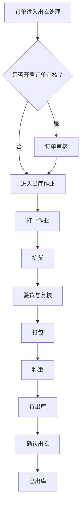
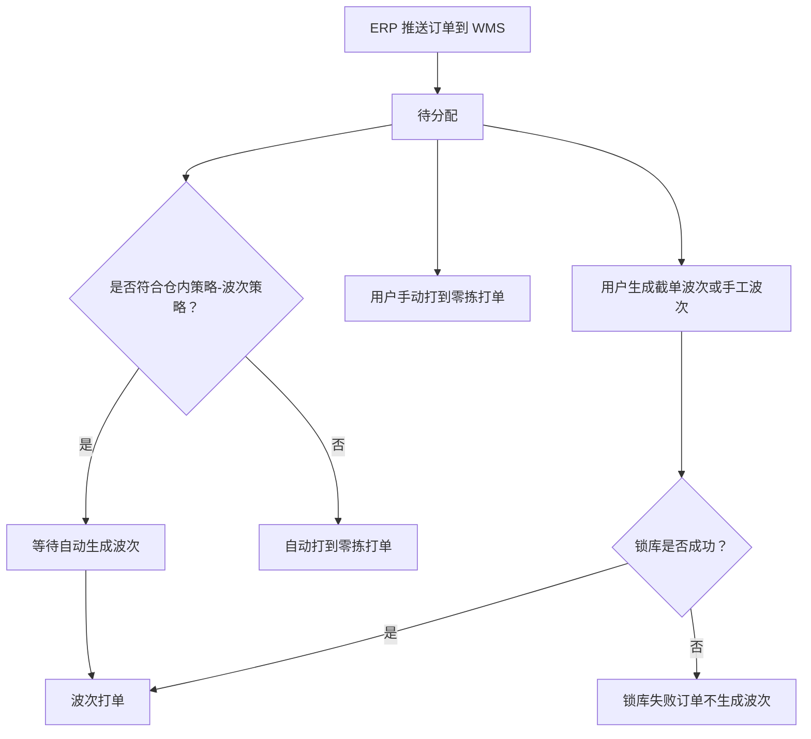
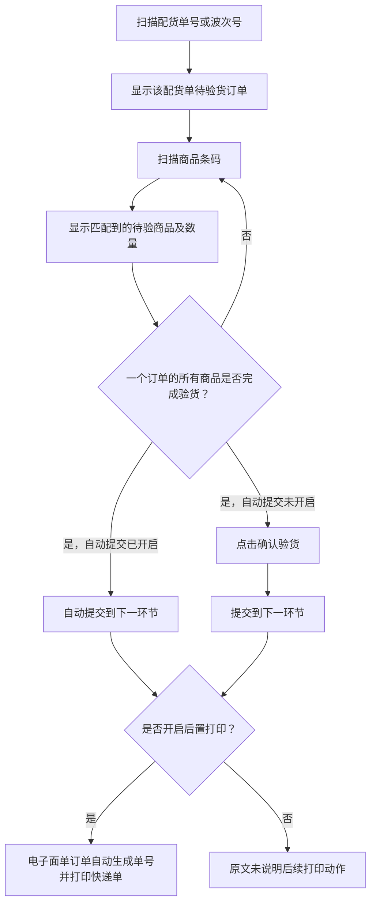

# 05. 出库_B2C

本章以 B2C 出库主链、待分配波次分支和分拣验货逻辑为主。不同拣货、验货、称重和出库方式并非每笔订单都必然全部经过，图中会保留这一事实边界。

## 1. 图表目录

| 编号 | 图表 | 类型 | 用途 |
|---|---|---|---|
| 05-1 | B2C 出库主作业链 | `flowchart` | 汇总本章目录和各环节文档明确写出的主链路 |
| 05-2 | 待分配订单的波次与零拣分支 | `flowchart` | 展示订单匹配仓内策略后的去向及人工操作分支 |
| 05-3 | 分拣验货的动态匹配与提交 | `flowchart` | 展示配货单、商品扫描、验货完成和后置打印逻辑 |

## 2. B2C 出库主作业链

### 2.1 图表标题与用途

这是一张主链流程图，呈现本章明确列出的 B2C 出库环节，并保留订单审核、待出库和确认出库等关键节点；不展开各页面中的全部按钮和异常条件。

### 2.2 原文依据

- 源 Markdown：`00-源文件/操作手册/出库_B2C/index.md`、`00-源文件/操作手册/出库_B2C/打单/波次打单.md`、`00-源文件/操作手册/出库_B2C/拣货/订单拣货.md`、`00-源文件/操作手册/出库_B2C/验货/分拣验货.md`、`00-源文件/操作手册/出库_B2C/打包/订单打包.md`
- 原文小节：出库流程目录、`确认打单`、订单拣货、分拣验货、订单打包
- PDF 页码：原始资料当前为 Markdown，原文未提供页码。
- 章节定位：[05-出库_B2C.md](../01-按章节拆分的md文件/05-出库_B2C.md)

### 2.3 Mermaid 代码

### 2.4 编号说明

1. 本章目录将 B2C 出库作业分为打单、拣货、验货、称重和出库等环节；部分订单开启审核时，会先经过订单审核。
2. 波次打单页面说明，确认打单后波次订单提交到下一环节。
3. 订单拣货说明，确认拣货后订单移至下一环节；分拣验货说明，订单商品完成验货后可提交到下一环节。
4. 出库前还存在“待出库”和“确认出库”节点；图中“打包”和“称重”的具体是否经过受业务配置和作业方式影响。

### 2.5 事实边界 / 原文未说明

- 图示是本章作业菜单和各环节“提交到下一环节”说明的粗略整理，不代表所有订单都必须按同一页面顺序完成。
- 源文档存在零拣、预出库、快速验货、自由验货等不同作业方式，本图不把它们误画成一条唯一执行路径。

## 3. 待分配订单的波次与零拣分支

### 3.1 图表标题与用途

这是一张中等粒度流程图，展示 ERP 推送到 WMS 后订单进入待分配页面，匹配波次策略后生成波次或进入零拣打单的逻辑。

### 3.2 原文依据

- 源 Markdown：`00-源文件/操作手册/出库_B2C/打单/待分配.md`
- 原文小节：`订单池`、`打到零拣打单`、`手动截单`、`生成手工波次`
- PDF 页码：原始资料当前为 Markdown，原文未提供页码。
- 章节定位：[05-出库_B2C.md](../01-按章节拆分的md文件/05-出库_B2C.md)

### 3.3 Mermaid 代码

### 3.4 编号说明

| 编号 | 节点或判断 | 原文明确说明 |
|---|---|---|
| 1 | 待分配来源 | ERP 推送到 WMS 的订单首先进入待分配。 |
| 2 | 策略匹配 | 符合波次策略的订单留在待分配等待自动生成波次；不符合任何策略的订单自动进入零拣打单。 |
| 3 | 人工操作 | 用户可以手动打到零拣打单，也可以生成截单波次或手工波次。 |
| 4 | 锁库失败 | 手工波次说明，库存不足或锁库失败的订单不生成波次；锁库成功的订单正常生成波次。 |

### 3.5 事实边界 / 原文未说明

- “等待自动生成波次”只表示源文档写出的待分配状态，不推导具体跑批时间。
- 截单波次、清仓波次、A+N 波次和普通波次有各自的条件，本图没有把它们合并成一个统一的生成算法。
- 源文档没有在此处完整说明订单既不满足波次策略又未进入零拣时的其他去向，因此未补画额外分支。

## 4. 分拣验货的动态匹配与提交

### 4.1 图表标题与用途

这是一张细节级流程图，展开分拣验货页面中扫描配货单号、扫描商品条码、匹配订单和提交验货的明确动作。

### 4.2 原文依据

- 源 Markdown：`00-源文件/操作手册/出库_B2C/验货/分拣验货.md`
- 原文小节：`01、默认为动态匹配`、后置打印说明
- PDF 页码：原始资料当前为 Markdown，原文未提供页码。
- 章节定位：[05-出库_B2C.md](../01-按章节拆分的md文件/05-出库_B2C.md)

### 4.3 Mermaid 代码

### 4.4 编号说明

1. 首先扫描配货单号或波次号，页面显示该配货单下待验货订单。
2. 扫描商品条码后，右侧显示匹配到的待验商品及数量。
3. 一个订单的所有商品完成验货后，自动提交开启时自动提交；未开启时需要点击确认验货。
4. 开启后置打印时，电子面单快递订单确认验货后会自动生成单号并打印快递单；发票也可按配置后置打印。

### 4.5 事实边界 / 原文未说明

- 本图采用源文档的“动态匹配”模式，不代表单笔匹配、播种验货、单种验货等其他验货方式。
- 图中没有补画验货缺货、批次校验和赠品免验等其他配置分支，这些内容在源文档中是独立规则。

## 5. 关键逻辑说明

| 主题 | 关键事实 | 本章图表处理 |
|---|---|---|
| 待分配去向 | 策略匹配结果影响订单留在待分配、生成波次或进入零拣打单。 | 05-2 展示主分支。 |
| 主作业链 | 源文档按打单、拣货、验货、称重、出库等菜单组织作业。 | 05-1 只画粗略链路。 |
| 分拣验货 | 配货单号/波次号先定位范围，商品条码再匹配待验商品；完成后可自动或手动提交。 | 05-3 展开操作顺序。 |
