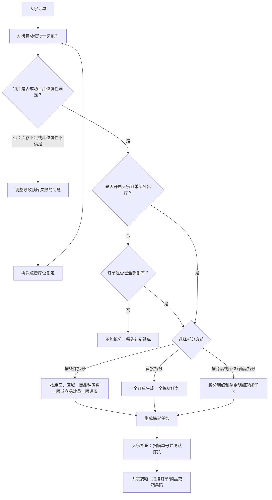
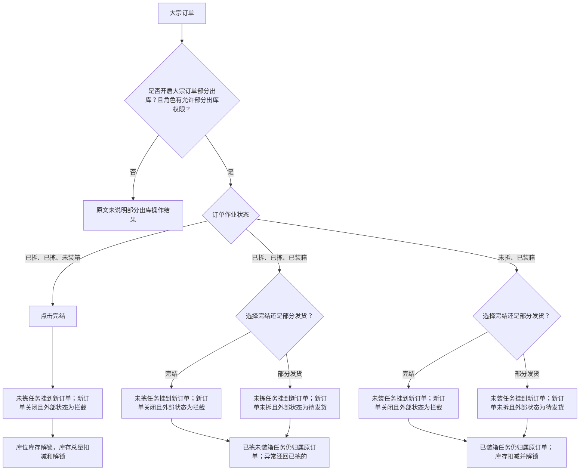
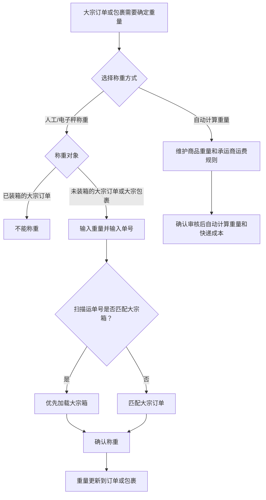

# 06. 大宗_B2B

本章重点整理大宗作业区别于普通订单的三个事实：订单可以拆分为多个拣货任务、支持部分出库、称重既可以人工操作也可以按商品重量自动计算。

## 1. 图表目录

| 编号 | 图表 | 类型 | 用途 |
|---|---|---|---|
| 06-1 | 大宗订单拆分与拣货装箱 | `flowchart` | 展示锁库后选择拆分方式并进入任务作业的路径 |
| 06-2 | 大宗订单部分出库分支 | `flowchart` | 展示部分出库开关、订单作业状态和完结/部分发货结果 |
| 06-3 | 大宗称重方式与结果 | `flowchart` | 展示人工称重、自动计算重量及称重限制 |

## 2. 大宗订单拆分与拣货装箱

### 2.1 图表标题与用途

这是一张中等粒度流程图，呈现大宗订单自动锁库后，拆分拣货任务、拣货和装箱的主路径。

### 2.2 原文依据

- 源 Markdown：`00-源文件/操作手册/大宗_B2B/大宗出库任务.md`、`00-源文件/操作手册/大宗_B2B/大宗拣货.md`、`00-源文件/操作手册/大宗_B2B/大宗装箱.md`
- 原文小节：`02、拆分拣货`、`03、库位锁定`、大宗拣货、大宗装箱
- PDF 页码：原始资料当前为 Markdown，原文未提供页码。
- 章节定位：[06-大宗_B2B.md](../01-按章节拆分的md文件/06-大宗_B2B.md)

### 2.3 Mermaid 代码

### 2.4 编号说明

1. 大宗订单会自动进行一次锁库；库存不足或库位属性不满足时，可以调整后再次点击库位锁定。
2. 未开启部分出库时，部分锁库不能拆分，必须先全部锁库；开启后，部分锁库或全部锁库均可继续拆分。
3. 拆分拣货支持按条件拆分、直接拆分，以及按商品或库位+商品拆分。
4. 拆分后可以到大宗拣货任务页面打印配货单进行拣货；大宗拣货确认后进入装箱作业。
5. 大宗装箱页面支持扫描订单/任务相关单号、商品条码或箱条码，并记录装箱明细。

### 2.5 事实边界 / 原文未说明

- 源文档还说明大宗订单可跳过拣货、验货、称重、打包等环节以快速出库，但具体跳转配置和适用条件未在本图展开。
- 图中把“锁库是否成功”和“是否允许部分锁库后拆分”拆成两个判断，避免把库存异常与部分出库配置混为一谈。

## 3. 大宗订单部分出库分支

### 3.1 图表标题与用途

这是一张细节级流程图，整理源文档明确写出的部分出库前提，以及三种订单作业状态下的完结/部分发货结果。

### 3.2 原文依据

- 源 Markdown：`00-源文件/操作手册/大宗_B2B/大宗出库任务.md`
- 原文小节：`05、部分出库`及其`已拆已拣未装箱`、`已拆已拣已装箱`、`未拆已装箱`
- PDF 页码：原始资料当前为 Markdown，原文未提供页码。
- 章节定位：[06-大宗_B2B.md](../01-按章节拆分的md文件/06-大宗_B2B.md)

### 3.3 Mermaid 代码

### 3.4 编号说明

| 编号 | 节点或判断 | 原文明确说明 |
|---|---|---|
| 1 | 部分出库前提 | 需要开启“大宗订单部分出库”，并在角色管理中勾选“允许部分出库”。 |
| 2 | 已拆已拣未装箱 | 点击完结后，未拣任务挂到新订单，新订单系统状态为关闭、外部状态为拦截。 |
| 3 | 已拆已拣已装箱 | 可选择完结或部分发货；两者对新订单外部状态的描述不同。 |
| 4 | 未拆已装箱 | 可选择完结或部分发货；未装任务挂到新订单，已装箱任务仍归属原订单。 |

### 3.5 事实边界 / 原文未说明

- 本图只整理源文档明确列出的三类作业状态，未把所有“部分锁库/全部锁库、部分任务拣货/全部任务拣货”等组合全部展开。
- “库存扣减并解锁”沿用源文档对应场景的描述，不推导库存总量、库位库存和任务库存的通用状态机。
- 未开启部分出库开关或角色权限不足时的具体按钮表现，源文档未在该小节完整说明。

## 4. 大宗称重方式与结果

### 4.1 图表标题与用途

这是一张中等粒度流程图，展示大宗订单/包裹称重的人工操作与自动计算方式，以及源文档明确写出的匹配和限制。

### 4.2 原文依据

- 源 Markdown：`00-源文件/操作手册/大宗_B2B/大宗称重.md`
- 原文小节：`01.称重`、`02.自动计算重量`、`03.自动计算快递成本`
- PDF 页码：原始资料当前为 Markdown，原文未提供页码。
- 章节定位：[06-大宗_B2B.md](../01-按章节拆分的md文件/06-大宗_B2B.md)

### 4.3 Mermaid 代码

### 4.4 编号说明

1. 大宗称重支持订单和包裹称重；输入重量、单号后确认称重，重量更新到订单或包裹。
2. 扫描运单号时优先匹配大宗箱，匹配不到才匹配大宗订单。
3. 自动计算重量不需要进行大宗称重，依据商品信息中的商品重量和承运商运费规则计算。
4. 源文档明确写出已装箱的大宗订单不能称重；重复称重会提示。

### 4.5 事实边界 / 原文未说明

- 图中“自动计算重量”沿用源文档名称，不推导商品重量字段的维护规则。
- 订单与包裹的具体匹配字段、设备连接方式和异常提示没有在此处全部说明，因此未继续展开。

## 5. 关键逻辑说明

| 主题 | 关键事实 | 本章图表处理 |
|---|---|---|
| 拆分作业 | 大宗订单可按多种维度拆成多个拣货任务，供多人同时作业。 | 06-1 展示拆分选择。 |
| 部分出库 | 需要业务开关和角色权限；不同已拣/已装箱状态会产生不同新订单结果。 | 06-2 展开主要分支。 |
| 称重 | 支持人工/电子秤称重，也支持根据商品重量和运费规则自动计算。 | 06-3 展示两种方式。 |
