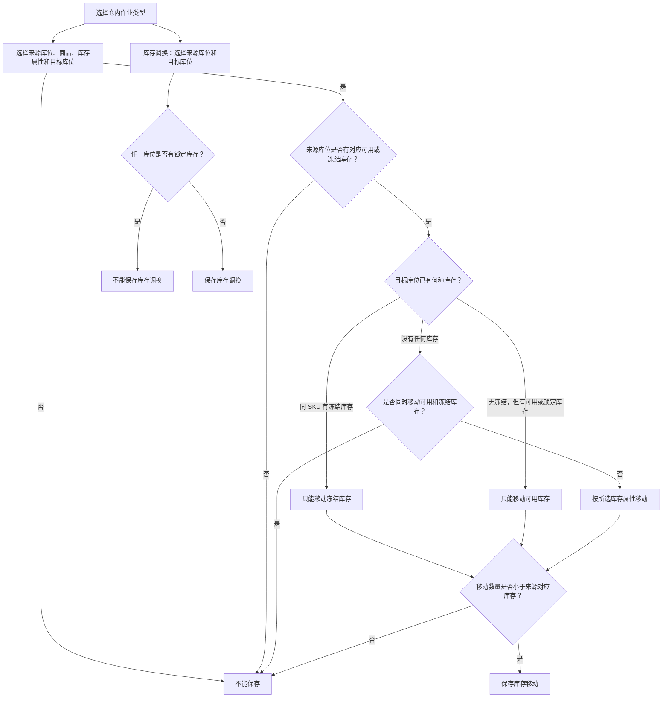
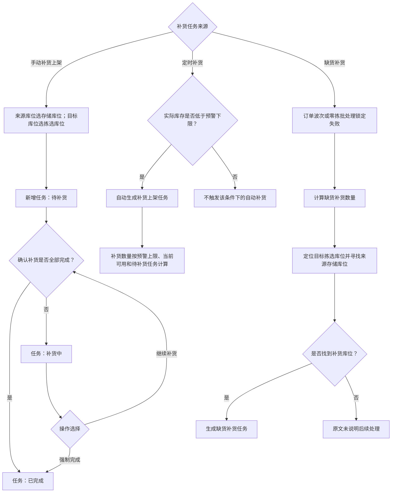
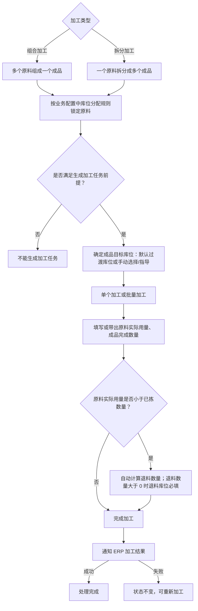

# 07. 仓内作业

本章整理仓内库存移动、补货上架和仓内加工三类作业。盘点任务中的大量新增方式和字段仍以文字表格为主，不强行压缩成一张总流程图。

## 1. 图表目录

| 编号 | 图表 | 类型 | 用途 |
|---|---|---|---|
| 07-1 | 库存移动与库存调换的保存约束 | `flowchart` | 展示来源库存、目标库存属性及锁定库存对保存的影响 |
| 07-2 | 补货上架的三种触发路径 | `flowchart` | 展示手动补货、定时补货和缺货补货的差异 |
| 07-3 | 仓内加工的原料—成品作业链 | `flowchart` | 展示组合加工/拆分加工的原料锁定、成品和完成结果 |

## 2. 库存移动与库存调换的保存约束

### 2.1 图表标题与用途

这是一张细节级流程图，整理普通库存移动的库存属性约束，以及库存调换遇到锁定库存时的保存限制。

### 2.2 原文依据

- 源 Markdown：`00-源文件/操作手册/仓内作业/库存移动/库存移动.md`
- 原文小节：`1.库存移动`
- PDF 页码：原始资料当前为 Markdown，原文未提供页码。
- 章节定位：[07-仓内作业.md](../01-按章节拆分的md文件/07-仓内作业.md)

### 2.3 Mermaid 代码

### 2.4 编号说明

1. 库存移动只能移动来源库位的可用库存或冻结库存，移动数量必须大于 0 且小于来源对应库存。
2. 同 SKU 目标库位已有冻结库存时，只能移动冻结库存；没有冻结但有可用或锁定库存时，只能移动可用库存。
3. 目标库位没有任何库存时，不能同时把可用和冻结库存移入同一目标库位。
4. 源库位和目标库位的库位类型均没有限制。
5. 库存调换是独立于普通库存移动的快速移动方式；任一来源或目标库位存在锁定库存时不能保存。

### 2.5 事实边界 / 原文未说明

- 普通库存移动与库存调换的校验不同；本图只补入源文档明确写出的库存调换锁定库存限制。
- 源文档没有在本小节说明保存后的通知、审核或 ERP 回传，因此没有补画这些节点。

## 3. 补货上架的三种触发路径

### 3.1 图表标题与用途

这是一张中等粒度流程图，区分手动新增、根据预警定时生成和订单缺货触发的补货上架任务。

### 3.2 原文依据

- 源 Markdown：`00-源文件/操作手册/仓内作业/库存移动/补货上架.md`
- 原文小节：`1.手动补货上架`、`2.定时补货`、`3.缺货补货`、`4.补货配置完结`
- PDF 页码：原始资料当前为 Markdown，原文未提供页码。
- 章节定位：[07-仓内作业.md](../01-按章节拆分的md文件/07-仓内作业.md)

### 3.3 Mermaid 代码

### 3.4 编号说明

| 类型 | 原文明确说明 |
|---|---|
| 手动补货 | 来源库位只能选存储库位，目标库位只能选拣选库位；新增后状态为“待补货”。 |
| 定时补货 | 根据库位商品上下限生成；实际库存低于预警下限时自动生成补货任务。 |
| 缺货补货 | 波次或零拣批处理锁定失败时触发；源文档分别说明补多少、补到哪里、从哪里补。 |
| 完结 | 全部补货完成时状态为“已完成”；“补货中”任务可继续作业或强制完成。 |

### 3.5 事实边界 / 原文未说明

- 定时补货和缺货补货的库位搜索顺序、数量公式和配置条件较多，本图只保留主结果，不把全部公式改画成统一算法。
- 未找到补货库位时的具体提示或任务状态，源文档未在该段明确说明。

## 4. 仓内加工的原料—成品作业链

### 4.1 图表标题与用途

这是一张中等粒度流程图，展示组合加工与拆分加工共有的原料锁定、成品目标库位和完成动作，并保留两种加工类型的差异。

### 4.2 原文依据

- 源 Markdown：`00-源文件/操作手册/仓内作业/加工/仓内加工.md`
- 原文小节：`1.组合加工`、`2.拆分加工`、`4.生成加工任务`、`6.退料`
- PDF 页码：原始资料当前为 Markdown，原文未提供页码。
- 章节定位：[07-仓内作业.md](../01-按章节拆分的md文件/07-仓内作业.md)

### 4.3 Mermaid 代码

### 4.4 编号说明

1. 组合加工是多个原料组成一个成品；拆分加工是一个原料拆分成多个成品。
2. 两种加工类型都说明原料库位按照业务配置中的库位分配规则锁定。
3. 生成加工任务前，源文档还要求校验加工单状态、货主、加工类型、是否已有任务或被领取、是否冻结等条件；校验不通过不能生成任务。
4. 成品目标库位可以使用默认过渡库位，也可以手动选择或根据原料锁定库位所在区域进行指导。
5. 确认加工时，如果原料实际使用数量小于已拣数量，系统自动计算退料数量；退料数量大于 0 时退料库位必填。
6. 加工完成后会通知 ERP；通知失败时状态不变，可重新加工。

### 4.5 事实边界 / 原文未说明

- 生产批次严格模式下的 FIFO 顺序、成品批次匹配和推送报错是独立细则，本图不将其概括成所有加工单的通用规则。
- 生成任务的前提在源文档中分散于多个校验项，本图只汇总为“是否满足生成加工任务前提”，不新增统一字段。

## 5. 关键逻辑说明

| 主题 | 关键事实 | 本章图表处理 |
|---|---|---|
| 库存移动/调换 | 目标库位已有库存属性会限制可移动库存属性；库存调换遇到锁定库存不能保存。 | 07-1 展示保存条件。 |
| 补货上架 | 手动、定时、缺货是源文档明确列出的不同来源。 | 07-2 并列三种路径。 |
| 仓内加工 | 组合加工和拆分加工的原料/成品数量关系不同，但都涉及原料锁定和加工完成。 | 07-3 做共性抽象并标出差异。 |
