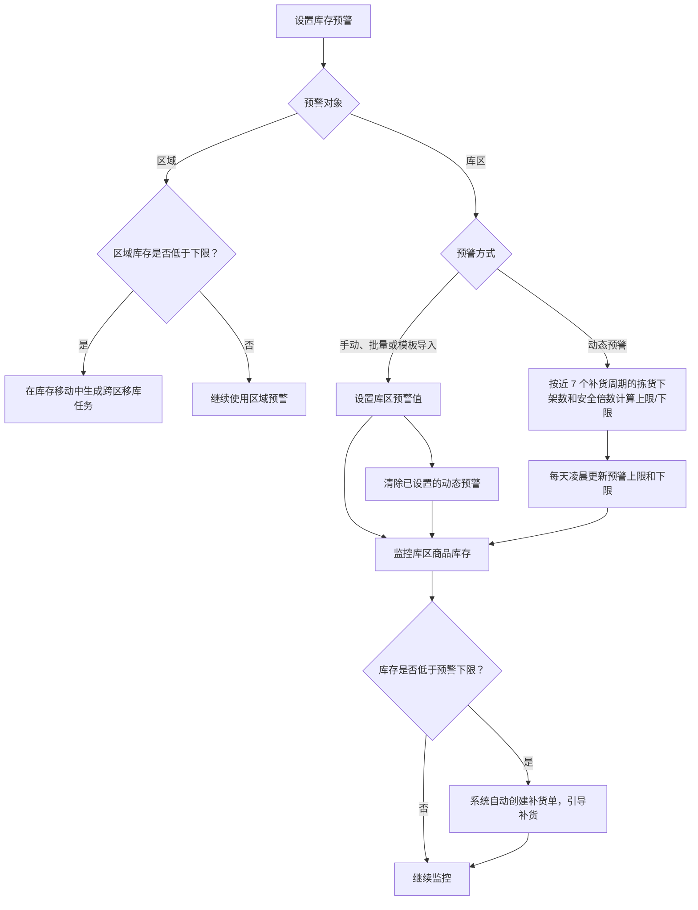
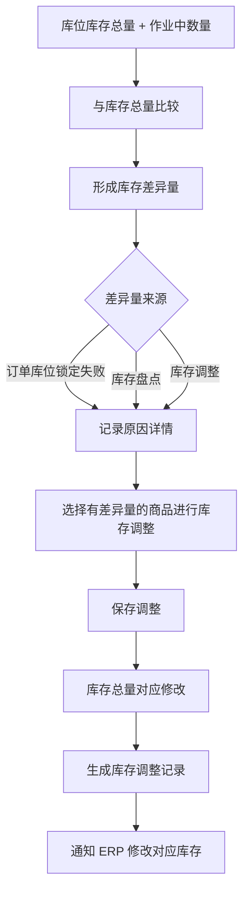
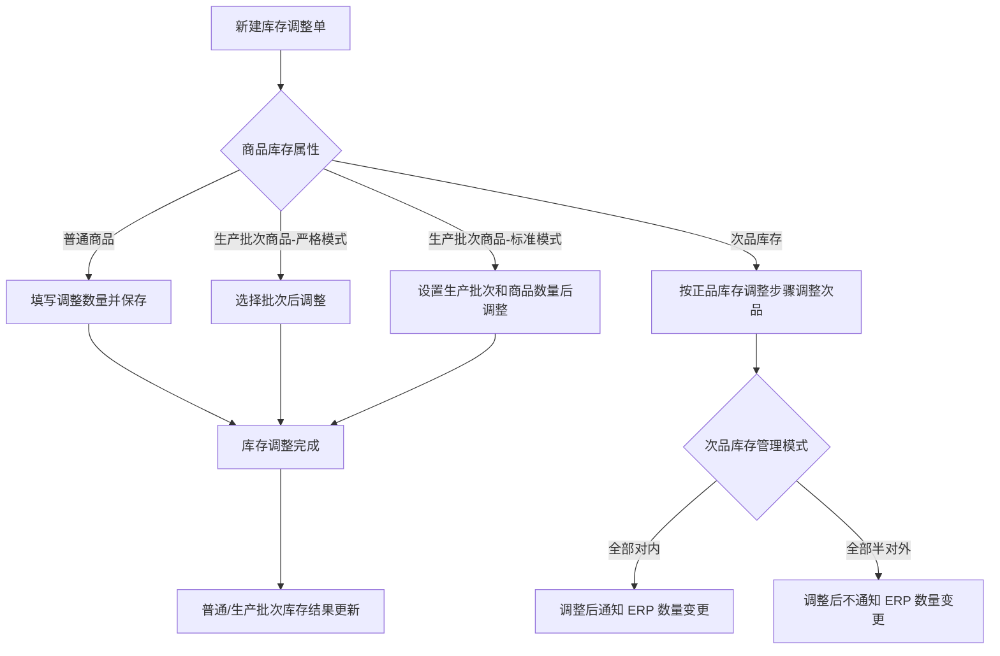

# 08. 库存管理

本章以库存查询、预警和库存调整为主。查询页面本身以展示和筛选为主，流程图只选取会触发补货、库存调整或 ERP 通知的逻辑。

## 1. 图表目录

| 编号 | 图表 | 类型 | 用途 |
|---|---|---|---|
| 08-1 | 区域/库区预警到补货处理 | `flowchart` | 展示区域移库、库区预警、动态更新和补货触发关系 |
| 08-2 | 库存差异量到库存调整 | `flowchart` | 展示差异量来源、调整动作和库存总量变化 |
| 08-3 | 库存调整的批次与 ERP 回传分支 | `flowchart` | 展示普通商品、生产批次商品、次品库存的调整差异 |

## 2. 区域/库区预警到补货处理

### 2.1 图表标题与用途

这是一张中等粒度流程图，展示区域预警触发跨区移库、库区预警触发补货单，以及动态预警更新的关系。

### 2.2 原文依据

- 源 Markdown：`00-源文件/操作手册/库存/库存预警/库区预警.md`
- 原文小节：`2.预警值设置`、`3.动态预警`、`4.拆零保底设置`
- PDF 页码：原始资料当前为 Markdown，原文未提供页码。
- 章节定位：[08-库存管理.md](../01-按章节拆分的md文件/08-库存管理.md)

### 2.3 Mermaid 代码

### 2.4 编号说明

1. 预警分为区域预警和库区预警：区域库存低于下限时，在库存移动中生成跨区移库任务；库区库存低于下限时，系统自动创建补货单。
2. 库区预警可以直接填写、批量设置或模板导入；设置这些预警值后，会清除已设置的动态预警。
3. 动态预警根据近 7 个补货周期的拣货下架数和安全倍数计算上限，下限按源文档的预警比例计算；系统每天凌晨跑批更新。
4. 库区库存低于警戒线时，系统自动创建补货单，引导操作员补货。

### 2.5 事实边界 / 原文未说明

- 图中没有展开新品与非新品的不同计算公式，也没有把拆零保底的具体公式画成所有商品通用的预警规则。
- “继续监控”是流程图的结束性表达，不代表源文档定义了独立的监控任务状态。

## 3. 库存差异量到库存调整

### 3.1 图表标题与用途

这是一张中等粒度流程图，整理库存差异量的定义、来源和通过库存调整修正库存总量的动作。

### 3.2 原文依据

- 源 Markdown：`00-源文件/操作手册/库存/库存预警/库存调整/库存差异量.md`
- 原文小节：`1.造成库存差异量的因素`、`2.库存调整`、`3.全量调整`
- PDF 页码：原始资料当前为 Markdown，原文未提供页码。
- 章节定位：[08-库存管理.md](../01-按章节拆分的md文件/08-库存管理.md)

### 3.3 Mermaid 代码

### 3.4 编号说明

1. 源文档给出的公式是：库存差异量 = 库位库存总量 + 作业中数量 - 库存总量。
2. 主要因素包括订单库位锁定失败、库存盘点和库存调整。
3. 选择有差异量的商品进行调整并保存后，库存总量对应修改；库存调整会增加记录并通知 ERP。
4. 全量调整会带出所选仓库及货主的全部有差异量商品，源文档写明上限为 500 个。

### 3.5 事实边界 / 原文未说明

- 本图没有把“库存差异量”画成某个单独的库存状态，而是按源文档作为计算结果和调整入口处理。
- 具体调整数量、批次选择和次品回传方式在其他小节说明，本图不推导为统一规则。

## 4. 库存调整的批次与 ERP 回传分支

### 4.1 图表标题与用途

这是一张细节级流程图，展示库存调整中普通商品、生产批次商品和次品库存的差异处理边界。

### 4.2 原文依据

- 源 Markdown：`00-源文件/操作手册/库存/库存预警/库存调整/库存调整.md`、`00-源文件/操作手册/库存/库存预警/库存调整/库存差异量.md`
- 原文小节：生产批次商品库存调整、次品库存调整、调整后通知 ERP
- PDF 页码：原始资料当前为 Markdown，原文未提供页码。
- 章节定位：[08-库存管理.md](../01-按章节拆分的md文件/08-库存管理.md)

### 4.3 Mermaid 代码

### 4.4 编号说明

1. 库存调整数量必填；库存调整商品必须同时存在于 WMS 和 ERP。
2. 严格模式生产批次商品需要选择批次；标准模式需要在生产批次录入页面添加批次和商品数量。
3. 次品库存调整步骤同正品库存调整，但调整后是否通知 ERP 取决于次品库存管理模式。
4. 源文档还说明库存调整不会精确到区域、库区和库位，数量增加或减少针对库存总量。

### 4.5 事实边界 / 原文未说明

- 图中“库存调整完成”只表示完成调整动作，不额外推导单据状态名称。
- 序列号调整、生产批次调整和库存调整是不同功能，本图没有合并。

## 5. 关键逻辑说明

| 主题 | 关键事实 | 本章图表处理 |
|---|---|---|
| 区域/库区预警 | 区域低于下限触发跨区移库；库区低于下限触发补货单，预警值可手动设置或按动态规则更新。 | 08-1 展示触发关系。 |
| 差异量 | 差异量来源包括锁库失败、盘点和库存调整。 | 08-2 展示计算和调整入口。 |
| 库存调整 | 生产批次模式和次品库存模式会影响录入方式及 ERP 通知。 | 08-3 展示差异。 |
