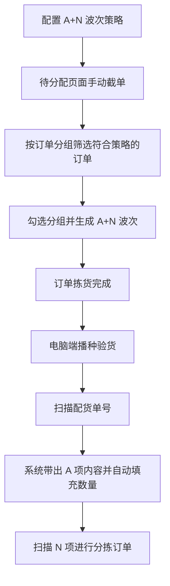
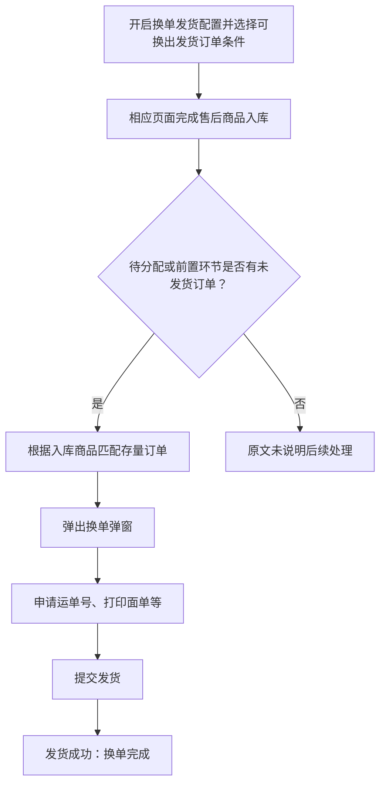
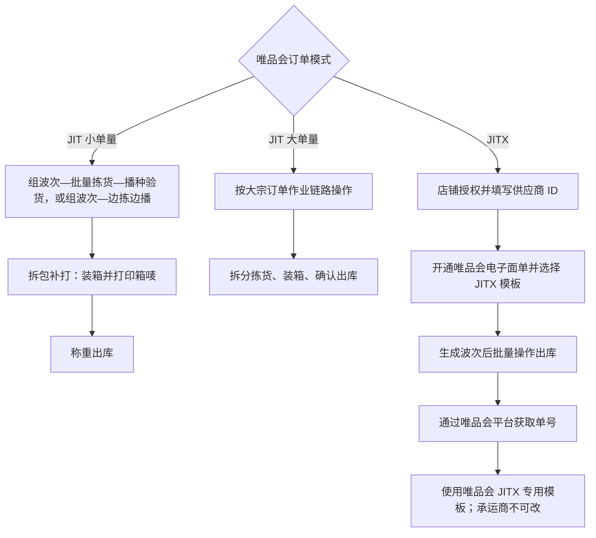

# 09. 特殊作业与即时零售

本章包含特殊出库模式、售后入库快速发货、即时零售和唯品会 JIT/JITX 等专题。图示只整理各专题原文明确写出的作业方式，不把平台业务背景外推为 WMS 的通用规则。

## 1. 图表目录

| 编号 | 图表 | 类型 | 用途 |
|---|---|---|---|
| 09-1 | A+N 波次生成与播种验货 | `flowchart` | 展示 A 项/N 项结构、手动截单和验货动作 |
| 09-2 | 售后入库快速换单发货 | `flowchart` | 展示入库识别、订单匹配、取号打印和发货结果 |
| 09-3 | 唯品会 JIT/JITX 作业差异 | `flowchart` | 对比 JIT 与 JITX 的订单处理和面单约束 |

## 2. A+N 波次生成与播种验货

### 2.1 图表标题与用途

这是一张中等粒度流程图，呈现 A+N 波次的订单分组生成、拣货完成后的播种验货方式及 A/N 项的不同处理。

### 2.2 原文依据

- 源 Markdown：`00-源文件/专题功能介绍/特殊作业方式/WMS-A+N波次.md`
- 原文小节：场景说明、`这种类型的订单如何设定波次？`、`订单怎么生成A+N波次？`、`A+N波次的订单拣货完成后，怎么验货？`
- PDF 页码：原始资料当前为 Markdown，原文未提供页码。
- 章节定位：[09-特殊作业与即时零售.md](../01-按章节拆分的md文件/09-特殊作业与即时零售.md)

### 2.3 Mermaid 代码

### 2.4 编号说明

1. A 项可以是一个或多个商品，在单个波次内 A 项完全一致；N 项是搭配项，单订单 N 项数量和种类均为 1。
2. A+N 波次策略默认优先级为 1 级，自动波次不支持生成 A+N 波次，需要手动截单生成。
3. 播种验货页面扫描配货单号后带出 A 项，A 项免扫并自动填充数量；操作员直接扫描 N 项进行分拣订单。

### 2.5 事实边界 / 原文未说明

- 原文说明暂时仅支持电脑端播种验货，本图没有补画 PDA 或其他验货方式。
- 图中“配置策略”只表示需要新增 A+N 波次策略，不展开策略字段和订单分组条件。

## 3. 售后入库快速换单发货

### 3.1 图表标题与用途

这是一张细节级流程图，展示售后入库后系统识别存量待发货订单并进行换单发货的明确动作。

### 3.2 原文依据

- 源 Markdown：`00-源文件/专题功能介绍/特殊作业方式/WMS-售后入库快速发货.md`
- 原文小节：`功能效果`、`操作方式`
- PDF 页码：原始资料当前为 Markdown，原文未提供页码。
- 章节定位：[09-特殊作业与即时零售.md](../01-按章节拆分的md文件/09-特殊作业与即时零售.md)

### 3.3 Mermaid 代码

### 3.4 编号说明

1. 该功能用于系统已发货但快递未取走的退款关闭订单、拦截回来的订单、原单退回订单等场景。
2. 配置开启后，商品入库成功时，如果待分配或前置环节存在未发货订单，会触发换单匹配。
3. 匹配成功后，操作员可以申请运单号、打印面单并提交发货；发货成功意味着换单完成。

### 3.5 事实边界 / 原文未说明

- 源文档没有展开“可换出发货订单条件”的全部字段，也没有说明匹配多个订单时的选择规则。
- “没有未发货订单”时的系统处理未说明，因此没有画成退回、失败或其他确定结果。

## 4. 唯品会 JIT/JITX 作业差异

### 4.1 图表标题与用途

这是一张对比型流程图，呈现源文档对 JIT 小单量、大单量和 JITX 订单作业及面单约束的说明。

### 4.2 原文依据

- 源 Markdown：`00-源文件/专题功能介绍/唯品会VIP业务/WMS-唯品会JIT与JITX专题.md`
- 原文小节：`1.2发货方式介绍`、`1.3大单量出库`、`2.2订单特性`、`2.3出库作业`、`2.4获取电子面单`
- PDF 页码：原始资料当前为 Markdown，原文未提供页码。
- 章节定位：[09-特殊作业与即时零售.md](../01-按章节拆分的md文件/09-特殊作业与即时零售.md)

### 4.3 Mermaid 代码

### 4.4 编号说明

| 模式 | 原文明确说明 |
|---|---|
| JIT 小单量 | 可组波次后批量拣货、播种验货，或边拣边播；之后拆包补打、装箱、打印箱唛、称重、出库。 |
| JIT 大单量 | 建议使用大宗订单作业链路；商品数量较多时推荐拆分拣货。 |
| JITX | 需完成店铺授权、填写供应商 ID、开通唯品会电子面单并选择 JITX 模板；订单全脱敏，需通过唯品会平台获取单号，承运商不可改。 |

### 4.5 事实边界 / 原文未说明

- 图中“之后”按源文档作业说明整理，不表示 JIT 的所有订单都必须经过同一页面。
- 唯品会平台的业务背景和订单来源不在本图中推导为 WMS 内部状态。

## 5. 关键逻辑说明

| 主题 | 关键事实 | 本章图表处理 |
|---|---|---|
| A+N 波次 | A 项固定且免播，N 项是播种对象；需要手动截单生成。 | 09-1 展示对象和动作。 |
| 售后换单 | 入库识别商品后匹配未发货订单，申请单号、打印并提交发货。 | 09-2 展示结果链。 |
| JIT/JITX | JIT 按单量选择不同作业方式；JITX 有脱敏、取号和模板限制。 | 09-3 做模式对比。 |
