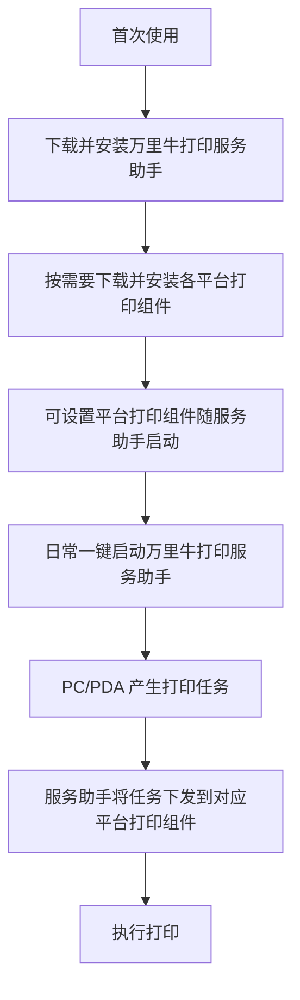
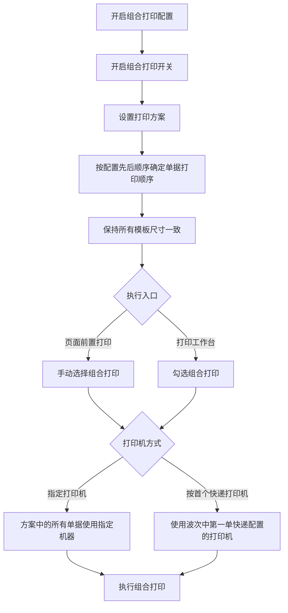
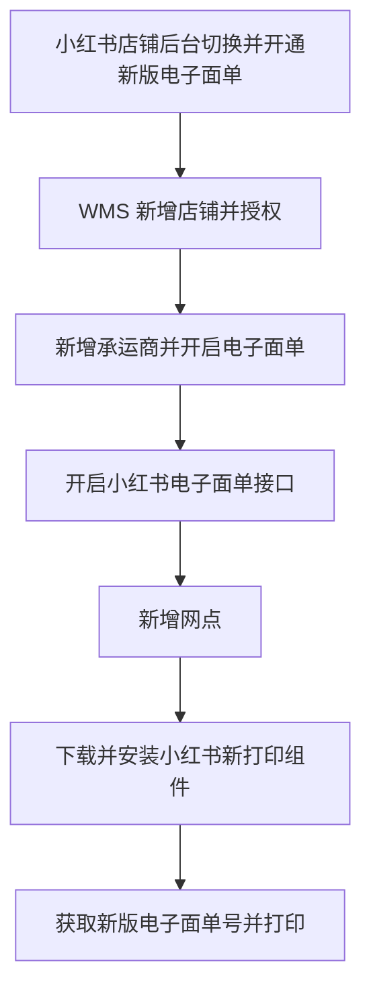

# 10. 打印与电子面单

本章涉及多个平台、打印组件和打印方案。流程图只整理源文档明确写出的安装、授权、配置和打印关系，不把不同平台的差异压成一个通用接口流程。

## 1. 图表目录

| 编号 | 图表 | 类型 | 用途 |
|---|---|---|---|
| 10-1 | 万里牛打印服务助手的打印链路 | `flowchart` | 展示服务助手、平台打印组件和实际打印任务的关系 |
| 10-2 | 组合打印配置与执行 | `flowchart` | 展示组合打印方案、单据顺序和打印机选择 |
| 10-3 | 新版小红书电子面单开通与打印准备 | `flowchart` | 展示平台切换、WMS 授权、承运商/网点和新组件准备 |

## 2. 万里牛打印服务助手的打印链路

### 2.1 图表标题与用途

这是一张粗略流程图，说明首次安装和日常使用时，万里牛打印服务助手如何与各平台打印组件配合。

### 2.2 原文依据

- 源 Markdown：`00-源文件/专题功能介绍/打印_电子面单/WMS-万里牛打印服务助手.md`
- 原文小节：首次下载和安装、平台打印组件、日常使用
- PDF 页码：原始资料当前为 Markdown，原文未提供页码。
- 章节定位：[10-打印与电子面单.md](../01-按章节拆分的md文件/10-打印与电子面单.md)

### 2.3 Mermaid 代码

### 2.4 编号说明

1. 首次使用需要安装万里牛服务助手和各平台打印控件。
2. 平台打印组件支持设置开机启动；开启后，启动万里牛打印服务助手时平台组件会自动启动。
3. 日常打印时，PC 或 PDA 的打印任务由万里牛打印服务助手下发到对应平台的打印组件。

### 2.5 事实边界 / 原文未说明

- 源文档明确说明 CLodop 尚未支持，需要单独下载控件；本图没有把它画成普通平台组件的同一分支。
- 具体平台如何判断使用哪个打印组件、失败时如何重试，源文档未在此处说明。

## 3. 组合打印配置与执行

### 3.1 图表标题与用途

这是一张中等粒度流程图，展示组合打印从开启配置、设置方案到页面或打印工作台执行的逻辑。

### 3.2 原文依据

- 源 Markdown：`00-源文件/专题功能介绍/打印_电子面单/WMS-组合打印.md`
- 原文小节：`1.打印配置`、`2.前置打印`、`3.打印工作台`
- PDF 页码：原始资料当前为 Markdown，原文未提供页码。
- 章节定位：[10-打印与电子面单.md](../01-按章节拆分的md文件/10-打印与电子面单.md)

### 3.3 Mermaid 代码

### 3.4 编号说明

1. 首次配置时系统会自动生成一个“配货单+快递单”打印方案，也可以自行设置方案。
2. 配置单据的先后顺序决定打印先后；所有模板尺寸需要保持一致。
3. 页面前置打印和打印工作台都支持组合打印；打印机可选择指定打印机或按首个快递打印机。
4. 源文档还说明，配置成功后 PDA 后置打印也可以进行组合打印。

### 3.5 事实边界 / 原文未说明

- 本图不列出源文档支持的全部页面清单，也不推导各页面默认是否开启组合打印。
- “执行组合打印”不代表打印任务一定成功；失败原因和重试机制在本来源文档中未说明。

## 4. 新版小红书电子面单开通与打印准备

### 4.1 图表标题与用途

这是一张细节级流程图，整理源文档给出的新版小红书电子面单平台侧和 WMS 侧准备动作。

### 4.2 原文依据

- 源 Markdown：`00-源文件/专题功能介绍/打印_电子面单/WMS-新版小红书电子面单打印.md`
- 原文小节：`商家店铺开通方式`、`WMS系统设置方式`、`店铺授权`、`电子面单开启`、`新增网点`、`新打印组件下载安装`
- PDF 页码：原始资料当前为 Markdown，原文未提供页码。
- 章节定位：[10-打印与电子面单.md](../01-按章节拆分的md文件/10-打印与电子面单.md)

### 4.3 Mermaid 代码

### 4.4 编号说明

1. 平台侧需要进入新版电子面单并申请可申请的物流公司。
2. WMS 侧需要完成店铺授权、新增承运商并开启电子面单、开启小红书电子面单接口。
3. 新增网点并成功开通后，可以正常获取电子面单号；源文档还要求安装新的打印组件。

### 4.5 事实边界 / 原文未说明

- 这是小红书新版电子面单的专题流程，不代表其他平台的开通步骤完全相同。
- 源文档包含平台切换时间通知，本图不把该通知日期绘制成当前系统规则。

## 5. 关键逻辑说明

| 主题 | 关键事实 | 本章图表处理 |
|---|---|---|
| 打印助手 | 首次安装平台组件，日常通过服务助手统一启动和下发任务。 | 10-1 展示组件关系。 |
| 组合打印 | 单据顺序、模板尺寸和打印机选择会影响组合打印配置。 | 10-2 展示配置到执行。 |
| 平台电子面单 | 不同平台有独立授权、开通和打印组件要求。 | 10-3 仅以小红书新版为例，不外推到其他平台。 |
