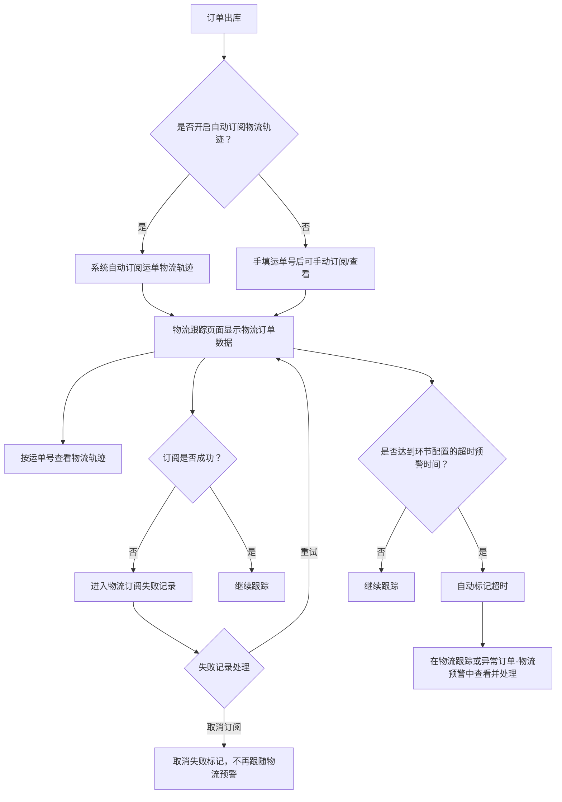
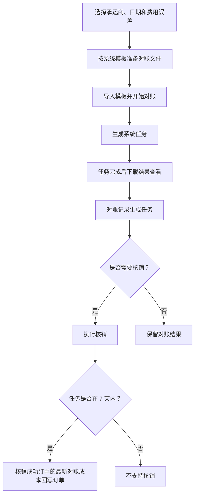
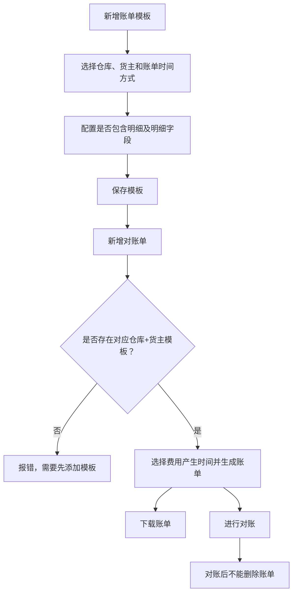

# 11. 客服与财务

本章的流程图集中在物流跟踪、承运商对账和货主账单。费用计算公式、发票字段和账单明细较多，除影响流程结果的条件外，其余保留为文字说明。

## 1. 图表目录

| 编号 | 图表 | 类型 | 用途 |
|---|---|---|---|
| 11-1 | 出库订单物流跟踪与超时预警 | `flowchart` | 展示出库订阅、轨迹查询和超时处理 |
| 11-2 | 承运商对账到核销 | `flowchart` | 展示模板导入、对账任务、结果和核销回写 |
| 11-3 | 货主账单生成与下载 | `flowchart` | 展示账单模板、账单时间范围和下载/对账关系 |

## 2. 出库订单物流跟踪与超时预警

### 2.1 图表标题与用途

这是一张中等粒度流程图，整理订单出库后自动订阅物流轨迹、查询运单及按照超时配置进行预警的逻辑。

### 2.2 原文依据

- 源 Markdown：`00-源文件/操作手册/客服/物流跟踪.md`、`00-源文件/专题功能介绍/其他/WMS-物流跟踪查询/index.md`
- 原文小节：物流跟踪背景、自动订阅物流轨迹、物流预警、物流轨迹查询
- PDF 页码：原始资料当前为 Markdown，原文未提供页码。
- 章节定位：[11-客服与财务.md](../01-按章节拆分的md文件/11-客服与财务.md)

### 2.3 Mermaid 代码

### 2.4 编号说明

1. 订单出库后，系统可自动订阅运单并在物流跟踪中显示后续轨迹；手填运单号也支持订阅和查看轨迹。
2. 物流订阅失败时会进入失败记录，可重试或取消订阅；取消后清除失败标记，不再跟随物流预警。
3. 订单按照对应环节的超时预警时间计算是否超时，超时后自动标记，并可进入物流跟踪或异常订单-物流预警处理。

### 2.5 事实边界 / 原文未说明

- 是否自动订阅取决于业务配置；未开启自动订阅时，源文档明确写出可通过手填运单号进行订阅和查看。
- 图中“继续跟踪”是对未达到超时条件的过程性表达，不代表源文档定义了独立状态。

## 3. 承运商对账到核销

### 3.1 图表标题与用途

这是一张中等粒度流程图，展示承运商对账升级版中导入模板、生成任务、查看差异、核销和更新订单对账成本的关系。

### 3.2 原文依据

- 源 Markdown：`00-源文件/操作手册/财务/对账/承运商对账.md`
- 原文小节：`承运商对账`、`批量修改对账成本`、`对账记录`、`预估成本重算`、`批量核销`
- PDF 页码：原始资料当前为 Markdown，原文未提供页码。
- 章节定位：[11-客服与财务.md](../01-按章节拆分的md文件/11-客服与财务.md)

### 3.3 Mermaid 代码

### 3.4 编号说明

1. 对账时需要选择承运商、日期和费用误差，并使用系统规定的模板导入。
2. 导入成功后生成任务，任务完成后可以下载结果；对账记录页面会生成对应任务。
3. 核销成功后，核销成功订单的最新对账成本自动修改到订单上。
4. 源文档明确说明超过 7 天的任务不支持核销；已对账订单才支持批量核销。

### 3.5 事实边界 / 原文未说明

- 本图没有展开预估成本重算的 180 天和 60 天时间范围，也没有展开运费规则计算。
- “保留对账结果”不是源文档定义的任务状态，仅表示图中没有继续发生核销动作。

## 4. 货主账单生成与下载

### 4.1 图表标题与用途

这是一张中等粒度流程图，整理账单模板配置、账单管理中的新增对账单，以及下载和对账的关系。

### 4.2 原文依据

- 源 Markdown：`00-源文件/操作手册/财务/费用统计/货主账单.md`
- 原文小节：`1.账单模板配置`、`2.账单管理`
- PDF 页码：原始资料当前为 Markdown，原文未提供页码。
- 章节定位：[11-客服与财务.md](../01-按章节拆分的md文件/11-客服与财务.md)

### 4.3 Mermaid 代码

### 4.4 编号说明

1. 账单模板需要选择仓库、货主和账单时间方式，可配置是否生成明细单及导出数据。
2. 新增对账单时，费用产生时间间隔不超过 2 个月，时间不能重复。
3. 若没有对应仓库+货主模板，新增账单时报错，需要先添加模板。
4. 无论是否对账，都可以下载账单；对账后不能删除账单。

### 4.5 事实边界 / 原文未说明

- 本图没有把出库费用、出库运费、入库费用、存储费用和增值费用的计算规则画入账单流程。
- 源文档没有说明对账失败时的状态变化，因此没有添加失败分支。

## 5. 关键逻辑说明

| 主题 | 关键事实 | 本章图表处理 |
|---|---|---|
| 物流跟踪 | 出库后可自动订阅，按运单查看轨迹，并按配置进行超时预警。 | 11-1 展示订阅和预警。 |
| 承运商对账 | 导入对账文件生成任务，核销后将成功订单的最新对账成本回写。 | 11-2 展示任务和回写。 |
| 货主账单 | 先配置仓库+货主模板，再生成账单；下载不要求已对账。 | 11-3 展示前置依赖。 |
