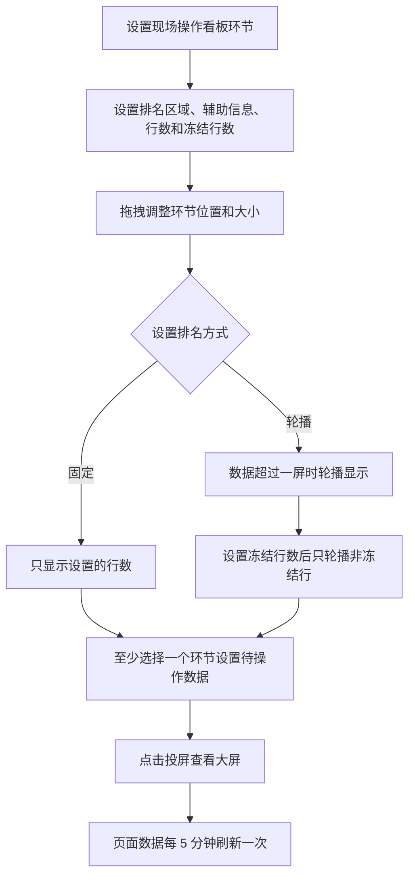
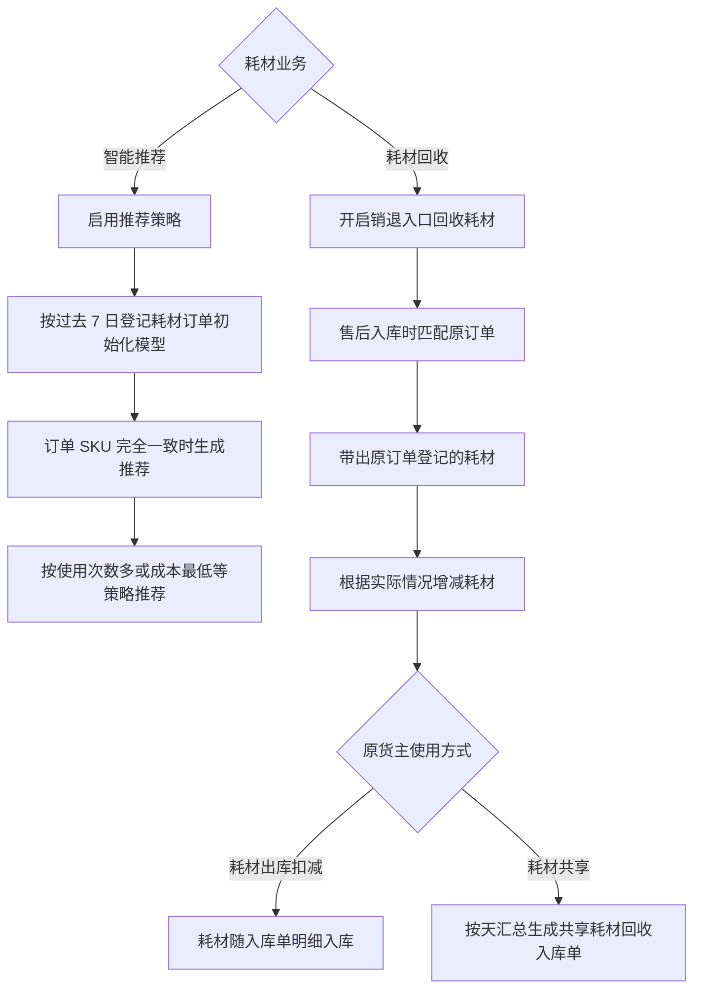
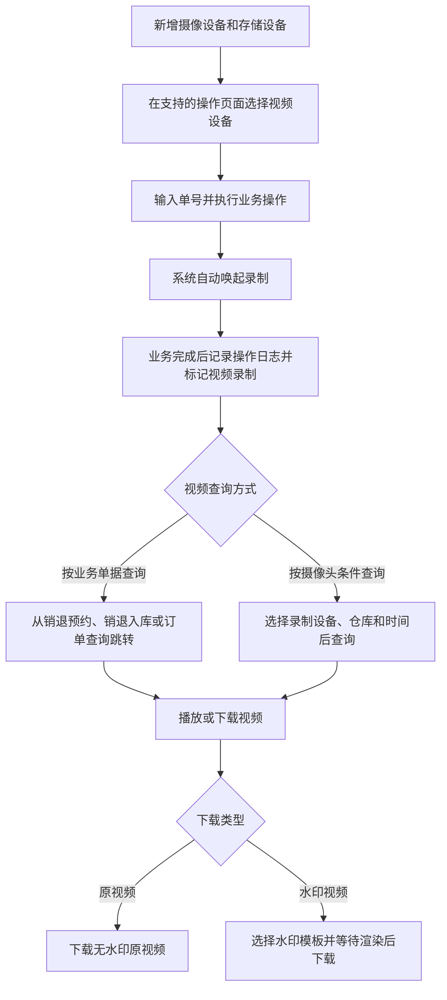

# 12. 报表与运维辅助

本章以看板配置、耗材管理和视频监控为代表整理流程。报表本身多数是查询与展示功能，不把每个报表都强行画成流程图。

## 1. 图表目录

| 编号 | 图表 | 类型 | 用途 |
|---|---|---|---|
| 12-1 | 现场操作看板配置与投屏 | `flowchart` | 展示环节、排名、待操作数据和投屏刷新关系 |
| 12-2 | 耗材智能推荐与耗材回收 | `flowchart` | 并列展示历史模型推荐和售后回收两类逻辑 |
| 12-3 | 视频监控设备、录制与查询 | `flowchart` | 展示设备配置、作业录制、业务单据查询和视频下载 |

## 2. 现场操作看板配置与投屏

### 2.1 图表标题与用途

这是一张中等粒度流程图，整理现场操作看板从配置环节和排名方式，到设置待操作数据并投屏显示的过程。

### 2.2 原文依据

- 源 Markdown：`00-源文件/操作手册/报表/看板/现场操作看板.md`
- 原文小节：`1.设置环节`、`2.设置排名方式`、`3.设置待操作数据`、`4.设置投屏`
- PDF 页码：原始资料当前为 Markdown，原文未提供页码。
- 章节定位：[12-报表与运维辅助.md](../01-按章节拆分的md文件/12-报表与运维辅助.md)

### 2.3 Mermaid 代码

### 2.4 编号说明

1. 用户可以设置显示环节、排名区域、辅助信息、行数和冻结行数，并拖拽调整位置和大小。
2. 排名方式有固定和轮播两种；轮播模式下，设置冻结行数后只轮播非冻结行。
3. 待操作数据用于查看各环节待处理工作量，至少选择一个环节。
4. 点击投屏后查看大屏，页面数据每 5 分钟刷新一次，也可以点击右上角刷新按钮强制刷新。

### 2.5 事实边界 / 原文未说明

- 辅助信息只做数据展示，不影响排名顺序；本图没有把辅助信息画成排名计算节点。
- 看板中每个环节的具体统计字段和绩效公式没有在图中展开。

## 3. 耗材智能推荐与耗材回收

### 3.1 图表标题与用途

这是一张对比型流程图，将“基于历史使用的耗材推荐”和“售后入库时回收耗材”并列呈现，避免把两者误认为同一个流程。

### 3.2 原文依据

- 源 Markdown：`00-源文件/专题功能介绍/其他/WMS-耗材管理/耗材智能推荐.md`、`00-源文件/专题功能介绍/其他/WMS-耗材管理/耗材回收.md`
- 原文小节：耗材智能推荐策略、模型初始化、耗材回收配置、匹配成功订单、耗材库存增加
- PDF 页码：原始资料当前为 Markdown，原文未提供页码。
- 章节定位：[12-报表与运维辅助.md](../01-按章节拆分的md文件/12-报表与运维辅助.md)

### 3.3 Mermaid 代码

### 3.4 编号说明

1. 耗材智能推荐策略启用时，系统根据过去 7 日登记耗材的订单初始化模型。
2. 模型在订单 SKU 完全一致时进行推荐；源文档列出“使用次数多”和“成本最低”等推荐方向。
3. 耗材回收需要开启销退入口回收耗材；匹配原订单后带出原订单登记的耗材，操作员可以按实际情况增减。
4. 耗材库存增加方式取决于原货主使用方式：跟随入库单明细入库，或按天汇总生成共享耗材回收入库单。

### 3.5 事实边界 / 原文未说明

- 智能推荐中的“模型”是源文档原词，本图不推导模型字段、训练算法或推荐置信度。
- 共享耗材回收入库单生成失败时，源文档说明需在系统任务中重试；本图未补画自动重试机制。

## 4. 视频监控设备、录制与查询

### 4.1 图表标题与用途

这是一张中等粒度流程图，整理视频设备/存储配置、操作页面选择设备、自动录制、业务单据查询和视频下载的关系。

### 4.2 原文依据

- 源 Markdown：`00-源文件/专题功能介绍/其他/WMS-视频监控专题/index.md`
- 原文小节：`四、如何新增设备`、`五、如何录制视频`、`六、如何查看视频/下载水印`
- PDF 页码：原始资料当前为 Markdown，原文未提供页码。
- 章节定位：[12-报表与运维辅助.md](../01-按章节拆分的md文件/12-报表与运维辅助.md)

### 4.3 Mermaid 代码

### 4.4 编号说明

1. 源文档列出 USB 摄像头、IPC 网络摄像机，以及本地磁盘、FTP、NVR 等设备/存储类型。
2. 在支持的操作页面勾选视频设备后输入单号正常操作，系统自动唤起录制。
3. 业务完成后记录操作日志并打上视频录制标志；查询可以从业务单据跳转，也可以按设备、仓库和时间条件查询。
4. 原视频无需渲染处理；水印视频需要选择水印模板并等待渲染完成。

### 4.5 事实边界 / 原文未说明

- 摄像设备与存储服务器的通道唯一性、外网共享和网络穿透属于独立配置细节，本图没有压缩成一个通用的设备连接判断。
- 视频是否能够查询还受视频助手、菜单权限、存储和设备状态影响；本图不推导这些条件的统一优先级。

## 5. 关键逻辑说明

| 主题 | 关键事实 | 本章图表处理 |
|---|---|---|
| 现场看板 | 配置环节、排名方式和待操作数据后才能形成投屏展示。 | 12-1 展示配置链。 |
| 耗材管理 | 智能推荐依赖历史登记数据；耗材回收依赖售后入库与原订单匹配。 | 12-2 并列两种业务。 |
| 视频监控 | 业务操作触发录制，之后可按单据或设备查询并下载原视频/水印视频。 | 12-3 展示主链。 |
