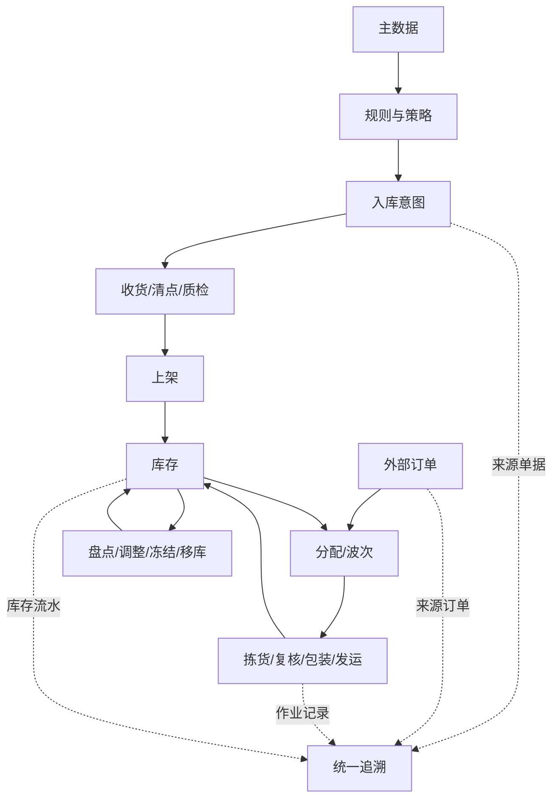
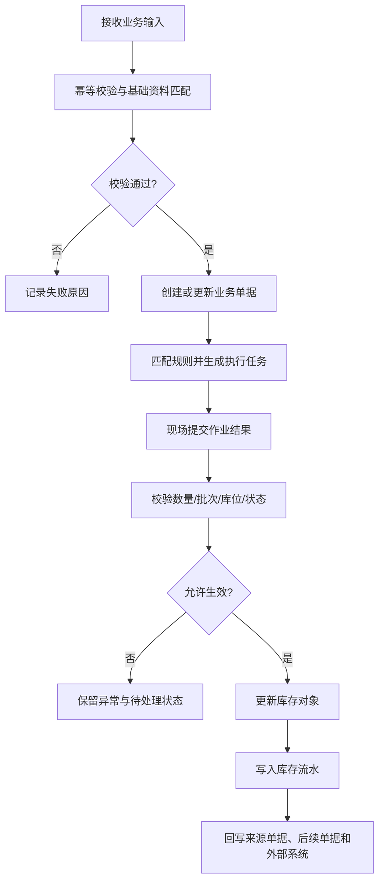
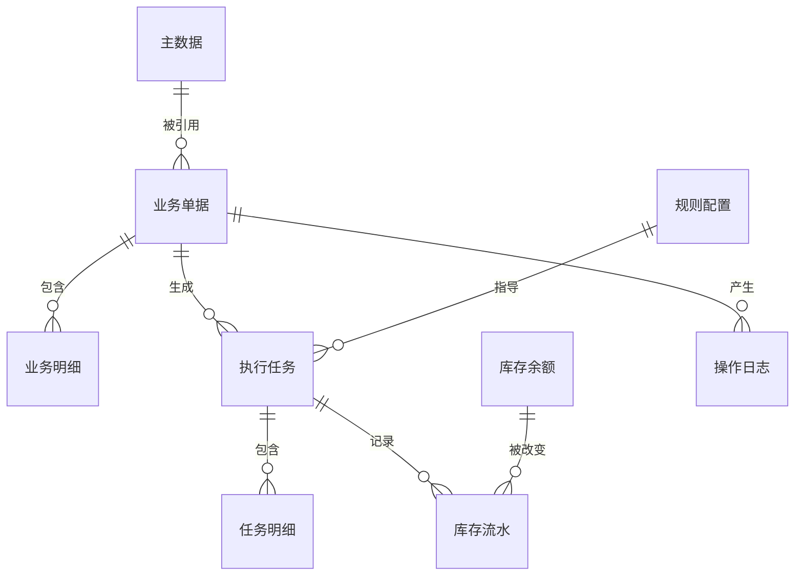

# 总体设计方法与跨模块基线

## 1. 参考范围

参考 `01-按章节拆分的md文件/README.md` 及 01—12 章。目录说明明确指出章节正文保留原始操作步骤、规则、校验和图文引用；本文件只提炼组织方法，不把规划内容当作万里牛事实。

## 2. 模块目标与业务边界

目标是把分散在 PC、PDA、专题功能和平台对接文档中的操作事实，重组为通用 WMS 的业务对象、单据、任务、库存和流水模型。

包含：模块边界、跨模块主链、事实与建议的分层方法、首版范围和待确认项。

不包含：具体字段终稿、API 报文、数据库表结构、前端页面稿和未经资料支持的算法参数。

## 3. 角色与业务场景

**参考事实**：资料中出现仓库操作员、拣货员、验货员、打包员、称重员、收货人员、货主、ERP/OMS、承运商、WCS 设备和审批人。

**建议设计**：将角色分为仓库管理员、收货员、上架员、拣货员、复核员、包装员、发运员、库存管理员、业务主管、系统管理员、接口服务和设备服务。具体是否一人兼任多个角色，待确认。

| 场景 | 为什么需要 WMS | WMS 解决的问题 |
|---|---|---|
| 采购到货 | 到货前只有采购或调拨意图，仓库不知道收什么、收多少 | 用入库预约、收货任务和实收记录建立到货计划 |
| 电商订单履约 | 订单量大、商品分散在多个库位，人工逐单处理效率低 | 用库存分配、波次和任务组织批量作业 |
| 多人协同作业 | 同一批货可能由不同人员在 PC、PDA、设备上处理 | 用任务领取、解绑、进度和操作记录避免重复作业 |
| 账实核对 | 系统库存、库位库存和现场实物可能不一致 | 用盘点、库存调整和库存流水恢复可追溯账实关系 |
| 3PL 多货主 | 不同货主共享仓库资源，但数据和费用必须隔离 | 用货主、数据权限、费用和库存维度隔离业务 |

## 4. 业务流程图

## 5. 系统流程图

## 6. 实体对象与单据

### 数据模型阅读说明

| 模型层 | 中文对象 | 作用 | 典型关系 |
|---|---|---|---|
| 主数据层 | “商品”“仓库”“库位”“货主”“承运商” | 描述可被交易引用的稳定对象 | 一个仓库包含多个库位 |
| 业务单据层 | “入库预约单”“出库订单”“盘点单” | 表达业务意图和业务责任 | 一个单据包含多条明细 |
| 执行层 | “收货任务”“拣货任务”“上架任务” | 表达现场要做什么 | 一个单据可生成一张或多张任务 |
| 库存层 | “库存余额”“库存流水” | 表达当前数量和已发生变化 | 一次业务生效产生一条或多条流水 |
| 配置层 | “波次策略”“库位规则”“审批流程” | 决定如何匹配和处理 | 一个任务引用生成时的规则版本 |

## 7. 单据状态与操作矩阵

| 对象层 | 建议状态职责 | 不应混淆的内容 |
|---|---|---|
| 业务单据 | 表达业务意图是否有效、是否已完成 | 不直接等同于现场任务完成度 |
| 执行任务 | 表达是否待领取、作业中、部分完成或完成 | 不直接等同于库存已经生效 |
| 库存对象 | 表达实际、可用、锁定、冻结、在途等数量 | 不用“页面显示”代替数量定义 |
| 外部同步 | 表达通知、成功、失败、重试 | 不覆盖 WMS 内部业务状态 |

### 单据之间的数量关系

| 上游单据 | 可能生成的下游单据/任务 | 关系说明 |
|---|---|---|
| “采购订单” | 1 张或多张“入库预约单” | 是否按仓库、到货批次或供应商拆分，待确认 |
| “入库预约单” | 1 张或多张“清点单”“质检单”“入库单”“上架任务” | 部分收货、分批清点或分批质检时可能形成 1 对多 |
| “出库订单” | 0 或 1 张“波次单”，1 或多张“拣货任务”和“包裹单” | 是否拆单、分波次和多包裹由订单规则决定 |
| “盘点单” | 0 或 1 张“库存调整单” | 只有存在差异且审核通过时生成，属于建议设计 |
| “业务单据” | 1 或多条“库存流水” | 按库位、批次、序列号和库存属性拆分，属于建议设计 |

这里的“1 对多”是通用 WMS 建模建议，不代表万里牛对每一类单据都明确采用同样的数据库关系。

## 8. 库存影响

适用。跨模块基线要求：库存变化只能发生在明确的生效节点；预占、锁定、冻结、实物转移和账面调整必须分开记录。万里牛资料明确出现实际、可用、锁定、冻结和在途库存，但没有给出覆盖所有单据类型的统一库存事务表。

## 9. 异常与逆向流程

部分适用。资料对入库取消、拣货解绑、缺货、拦截、库存调整和任务关闭有分散描述，但没有覆盖所有操作的统一冲销模型。

## 10. 字段与业务逻辑

**建议设计**：所有交易对象至少需要业务单号、来源单号、仓库、货主、状态、数量、操作人、操作时间、来源任务、外部同步结果和审计信息。具体字段名、类型、长度和必填性待各模块设计确认。

| 字段层 | 表头字段示例 | 明细字段示例 | 主要用途 |
|---|---|---|---|
| 业务识别 | “单据编号”“外部单号”“来源单号” | “明细编号”“来源明细编号” | 幂等、追溯和跨系统关联 |
| 组织归属 | “仓库”“货主”“店铺”“业务类型” | “库区”“库位”“商品” | 确定数据范围和业务边界 |
| 数量进度 | “计划总量”“已完成总量”“剩余总量” | “计划数量”“完成数量”“差异数量” | 判断单据和任务进度 |
| 状态审计 | “业务状态”“同步状态”“创建人” | “操作人”“操作时间”“异常原因” | 保证状态、流水和责任可查 |

## 11. 功能清单

| 优先级 | 功能 | 目标 |
|---|---|---|
| P0 | 单据、任务、库存、流水四层模型 | 保证业务闭环和可追溯 |
| P0 | 统一状态与操作矩阵 | 防止页面动作与库存结果脱节 |
| P0 | 库存事务与幂等控制 | 防止重复入库、重复出库和重复回写 |
| P1 | 规则版本、任务监控和异常中心 | 支撑运营和持续调整 |
| 后续 | 自动化设备编排、行业插件和复杂平台适配 | 在核心闭环稳定后扩展 |

## 12. 万里牛设计借鉴判断

| 判断 | 内容 |
|---|---|
| 建议直接借鉴 | PC 与 PDA 同一业务主题下的作业衔接；任务、库存和操作记录的关联意识；异常订单集中处理；报表回溯单据和流水 |
| 建议改造后借鉴 | 将页面环节抽象成可配置流程；将不同波次和拣货方式抽象为策略类型；将外部平台状态与 WMS 状态分离 |
| 不建议照搬 | 万里牛具体菜单命名、特定平台规则、隐藏开关、平台专用字段和特定快捷键 |
| 我们需要补充 | 统一实体模型、库存事务、幂等、逆向单据、权限数据范围和接口补偿 |
| 资料不足，待确认 | 所有跨单据反向处理、成本口径、状态优先级和并发锁定细节 |

## 13. 跨模块依赖与待确认问题

1. “锁定库存”“预占库存”“作业中库存”是否为同一数量的不同展示，还是不同数量字段。
2. 单据状态和外部状态的主数据字典及同步方向。
3. 入库、拣货、出库、盘点和调整的库存生效时点。
4. 是否支持多组织、多仓、多货主和跨仓库存视图。
5. 目标系统首版是否需要批次、效期、序列号和次品全部启用。
