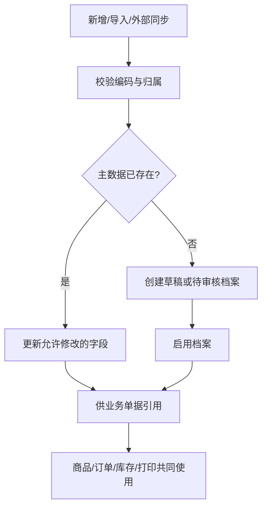
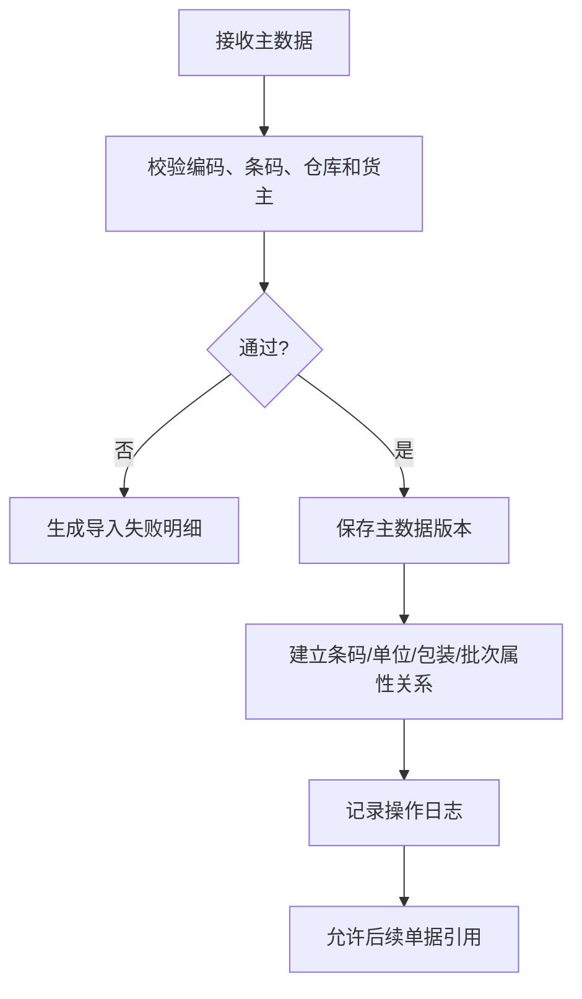
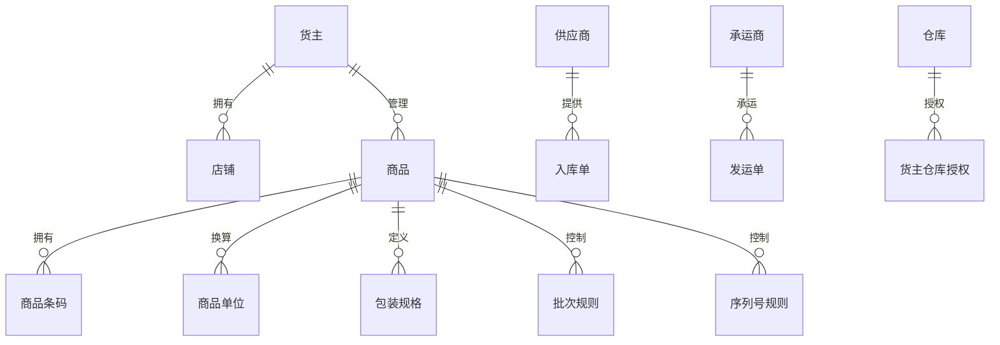

# 01 基础资料与主数据设计

## 1. 参考范围

参考：01 章“供应商档案、货主管理、店铺管理、承运商档案”；02 章“商品信息、品牌及自定义属性、计量单位、批次、序列号、包装规格”；11 章“线下货主模块”。

## 2. 模块目标与业务边界

解决仓库作业中“同一个商品、货主、承运商或条码被不同模块重复维护”的问题。

包含商品 SKU、条码、单位、包装、批次/效期/序列号属性，以及供应商、货主、店铺、承运商等业务主数据。

不包含库存余额、订单履约、费用结算和接口传输本身；这些模块只引用主数据。

## 3. 角色与业务场景

**参考事实**：商品可以手工新增、导入、由 ERP 推送后自动新增或同步；3PL 场景导入商品需要选择货主；没有修改商品权限时只读。

**建议设计**：主数据管理员维护全局档案，业务管理员维护货主和仓库适用范围，仓库人员只使用已生效数据。

### 场景说明

| 使用场景 | 触发时机与参与者 | 业务问题 | WMS 解决方式 | 结果 | 类型 |
|---|---|---|---|---|---|
| 商品首次建档 | 商品管理员在新商品入仓前维护商品 | 同一 SKU 被重复录入，现场扫码无法识别 | 以商品、条码、单位和货主关系作为统一引用对象 | 入库、出库、盘点使用同一商品身份 | 参考事实＋建议设计 |
| ERP/OMS 同步商品 | 外部系统推送新商品或修改商品 | 外部编码与 WMS 编码不一致，订单无法匹配 | 保存外部编码映射，校验货主、仓库和条码 | 订单和入库单能够正确落到 SKU | 参考事实＋建议设计 |
| 多货主共仓 | 3PL 为不同货主维护相似商品 | 商品名称或条码相同但货权不同 | 将货主作为商品适用范围和库存维度之一 | 防止串货、错发和数据越权 | 参考事实＋归纳判断 |
| 批次/效期/序列号商品 | 商品需要追溯或出库校验时 | 只记 SKU 无法回答“哪一批、哪一个序列号” | 在商品档案声明管理方式，并由交易环节采集 | 支持追溯、先进先出和序列号核验 | 参考事实＋建议设计 |

## 4. 业务流程图

## 5. 系统流程图

## 6. 实体对象与单据

## 7. 单据状态与操作矩阵

本节的参考事实来自手册中出现的启用、停用、导入和权限行为；“草稿”“部分失败”等未被手册统一定义的状态属于建议设计。

| 对象 | 状态 | 进入条件 | 可执行操作 | 修改限制 |
|---|---|---|---|---|
| 主数据档案 | 草稿（建议） | 新增或导入后需要审核时 | 编辑、提交 | 不可被交易单据引用 |
| 主数据档案 | 启用 | 校验通过并生效 | 查询、被引用、停用 | 被库存或未完成单据引用时不得物理删除 |
| 主数据档案 | 停用 | 管理员停用 | 查询、启用 | 不得用于新单据，历史单据保留原值 |
| 导入任务 | 处理中、成功、部分失败、失败（建议） | 批量导入 | 查看结果、下载失败明细、重试 | 重试必须幂等 |

### 单据、对象与数量关系

本模块以主数据对象为主，不把主数据档案误写成交易单据。以下是“一个对象可以关联几条记录”的逻辑关系，不代表页面一定生成对应单据。

| 上游对象 | 下游对象 | 可能关系 | 关系说明 | 类型 |
|---|---|---:|---|---|
| 货主 | 店铺 | 1:N | 一个货主可管理多个店铺；店铺归属是订单来源识别条件 | 参考事实＋归纳判断 |
| 商品 | 商品条码 | 1:N | 一个商品可有主条码、辅助条码、单位条码；扫描后反查商品和单位 | 参考事实 |
| 商品 | 商品单位 | 1:N | 一个商品可配置多个计量单位，实际换算关系需有主次单位 | 参考事实＋建议设计 |
| 商品 | 包装规格 | 1:N | 同一商品可有多个包装规格，箱规如何按仓库区分待确认 | 参考事实＋待确认 |
| 商品 | 批次/序列号规则 | 1:1 或 1:N | 管理方式可能按商品配置，也可能叠加货主/仓库策略，需避免重复生效 | 建议设计＋待确认 |
| 仓库 | 货主仓库授权 | 1:N | 一个仓库可服务多个货主；授权关系决定主数据和交易可见范围 | 归纳判断＋建议设计 |

### 状态动作补充矩阵

| 单据/对象 | 当前状态/动作 | 操作前提 | 操作后的状态 | 是否生成任务、流水或关联对象 | 是否允许取消、撤销或反向处理 |
|---|---|---|---|---|---|
| 主数据档案 | 提交启用 | 编码、条码和引用校验通过 | 启用 | 生成版本/操作日志，不生成库存流水 | 启用后用停用，不做物理撤销 |
| 主数据档案 | 停用 | 无新增业务引用或已完成影响评估 | 停用 | 生成操作日志，不生成任务 | 可重新启用；历史单据不反写 |
| 导入任务 | 重试失败行 | 修正失败原因且幂等键不变 | 处理中→成功/部分失败 | 更新主数据和导入日志 | 可取消未开始任务；已写入行通过修正反向处理 |

## 8. 库存影响

不直接影响库存。商品属性、单位、批次和序列号规则会间接影响后续收货、拣货、盘点和库存查询。

特别需要避免：修改商品的批次、序列号或单位管理方式时，不能只修改开关而不处理已有库存。万里牛资料明确存在“开启相关管理前需清空仓库商品库存”的限制，通用设计应改为校验已有库存和未完成单据后再允许变更。

## 9. 异常与逆向流程

适用，但不是库存冲销流程。

- 已被引用的商品、库位、承运商和货主不允许直接删除，采用停用。
- 导入失败保留失败行、失败原因和批次号，支持修正后重新导入。
- 重复条码、重复序列号、重复批次属性组合必须阻止保存。
- 资料未说明主数据版本生效时间，待确认。

## 10. 字段与业务逻辑

本节字段分组和校验规则是建议设计；手册明确出现的商品、条码、批次、序列号、单位和货主关系仅作为参考事实依据。

| 字段类别 | 核心内容 | 业务逻辑 |
|---|---|---|
| 标识字段 | 编码、名称、外部编码 | 编码在组织或货主范围内唯一；外部编码用于同步映射 |
| 商品字段 | SKU、商品名称、品牌、分类、重量、体积、货号 | 商品编码需要与外部系统建立映射；货号是否允许重复需按资料保留 |
| 条码字段 | 主条码、辅助条码、单位条码、箱码 | 条码扫描要能反查 SKU 和单位换算 |
| 属性字段 | 批次、效期、序列号、库存属性 | 管理方式应在商品和仓库策略之间校验兼容性 |
| 关系字段 | 货主、仓库、店铺、供应商、承运商 | 交易单据只能选择已授权且启用的关系 |
| 系统字段 | 状态、来源、版本、创建人、修改人、时间 | 支持追溯和外部同步，不允许业务人员覆盖系统时间 |

### 表头字段

| 字段名称 | 字段含义 | 来源/写入时机 | 必填性 | 可修改时点 | 查询/展示/导出 | 校验与下游影响 | 类型 |
|---|---|---|---|---|---|---|---|
| 商品编码 | WMS 内部识别商品的稳定标识 | 手工、导入或外部同步创建 | 必填 | 生效前；生效后原则上不可改 | 全部业务单据、库存和报表 | 货主/组织范围内唯一，影响所有来源单关联 | 参考事实＋建议设计 |
| 商品名称 | 现场和业务人员识别商品的名称 | 用户录入或外部同步 | 必填 | 未被限制时可改 | 列表、扫码结果、打印 | 修改不应改变商品身份 | 参考事实＋建议设计 |
| 货主 | 商品所属业务主体 | 用户选择或外部映射 | 3PL 必填 | 生效前；被库存引用后不可改 | 权限、库存、单据 | 必须与仓库授权和订单货主一致 | 参考事实＋建议设计 |
| 主条码 | 默认扫描入口 | 用户录入或同步 | 按业务可选 | 已被作业引用后受限 | PDA、打印、查询 | 不能与同一识别范围内其他商品冲突 | 参考事实＋建议设计 |
| 批次/效期/序列号管理方式 | 声明后续是否采集这些属性 | 商品建档时配置 | 按商品类型 | 有库存或未完单据时禁止直接切换 | 商品详情、作业校验 | 改变会影响库存主键和现场采集，资料明确存在清空库存限制 | 参考事实＋建议设计 |
| 状态 | 启用或停用 | 系统/管理员操作 | 系统生成 | 按引用约束操作 | 列表和选择器 | 停用禁止新单据引用，历史数据保留 | 归纳判断＋建议设计 |

### 明细与关联字段

| 字段名称 | 字段含义 | 来源/写入时机 | 必填性 | 可修改时点 | 查询/展示/导出 | 校验与下游影响 | 类型 |
|---|---|---|---|---|---|---|---|
| 商品条码明细 | 一个商品的主条码、辅助条码或单位条码 | 商品档案维护 | 主条码或可扫描码必填 | 被作业引用后限制删除 | 扫码查询、导出 | 条码唯一范围、条码类型和对应单位必须一致 | 参考事实＋建议设计 |
| 单位换算明细 | 基本单位与辅助单位的换算关系 | 商品档案维护 | 使用多单位时必填 | 生效后限制改比例 | 收发货数量、箱规 | 换算比例必须大于 0，舍入规则待确认 | 参考事实＋建议设计 |
| 包装规格明细 | 箱、托等包装的数量和编码 | 商品档案维护 | 使用包装时必填 | 被装箱记录引用后限制改 | 装箱、拣货、耗材 | 不能出现同层级重复规格 | 参考事实＋建议设计 |
| 外部编码映射 | ERP/OMS 对应编码 | 同步或人工维护 | 对接场景必填 | 已有单据引用后不建议改 | 接口日志、单据详情 | 外部系统、货主和商品组合应唯一 | 参考事实＋建议设计 |
| 属性扩展明细 | 批次扩展属性或自定义属性值 | 入库/库存交易采集 | 依规则决定 | 生效后只读 | 批次和库存追溯 | 影响批次唯一性及出库匹配 | 参考事实＋建议设计 |

## 11. 功能清单

| 优先级 | 功能 | 目标与上下游影响 |
|---|---|---|
| P0 | 商品、条码、单位、仓库、货主、承运商档案 | 支撑全部交易模块 |
| P0 | 启用/停用与引用校验 | 防止历史单据断链 |
| P0 | 批次、效期、序列号属性配置 | 支撑库存追溯和出库校验 |
| P1 | 批量导入、同步和失败重试 | 降低主数据维护成本 |
| P1 | 包装规格、多单位和箱码 | 提高收货、拣货、盘点效率 |
| 后续 | 行业属性、医药追溯、平台特殊商品属性 | 按业务行业插件化 |

### 功能说明与首版取舍

| 优先级 | 功能 | 使用场景 | 解决的问题 | 核心交互/规则 | 生成或影响对象 | 我们的补充说明 |
|---|---|---|---|---|---|---|
| P0 | 商品档案维护 | 新品入仓、商品信息变更 | 避免交易环节临时造商品 | 建档、校验、启用、停用；已引用档案不物理删除 | 商品、条码、库存、单据 | 首版先保证身份稳定，不追求行业属性大而全 |
| P0 | 条码与单位换算 | 箱码、件码、辅助码扫描 | 扫码识别失败或数量口径不一致 | 扫码反查商品并按单位换算，异常时阻止提交 | 作业明细、库存数量 | 换算舍入和小数精度列为待确认 |
| P0 | 批次/效期/序列号管理 | 追溯、先进先出、序列号商品 | 无法定位库存来源和去向 | 商品声明规则，收发存各环节按规则采集 | 批次、序列号、库存流水 | 不把“开启开关”直接等同于完整追溯能力 |
| P0 | 启用/停用与引用分析 | 商品不再经营或资料变更 | 删除导致历史单据断链 | 展示引用对象和影响范围后再停用 | 主数据引用关系 | 物理删除只限从未被引用的草稿资料 |
| P1 | 批量导入与外部同步 | ERP/OMS 批量维护 | 人工录入成本高、同步失败难定位 | 按批次导入，逐行返回原因，重试需幂等 | 导入任务、接口日志 | 失败行可单独修正，不能整批静默覆盖 |
| 后续 | 行业追溯扩展 | 医药、食品、序列号强管控 | 通用模型不足以满足监管要求 | 作为扩展属性和专用校验 | 批次扩展、追溯报表 | 不纳入通用首版默认流程 |

## 12. 万里牛设计借鉴判断

### 判断标准

| 维度 | 判断问题 |
|---|---|
| 通用性 | 是否适用于采购、电商、3PL 等多种仓型，而非特定平台？ |
| 业务价值 | 是否减少错收、错发、重复维护或追溯成本？ |
| 闭环完整性 | 是否同时覆盖对象、状态、操作、异常和历史记录？ |
| 实现成本 | 是否能在首版以稳定主数据能力落地，而非依赖复杂算法？ |
| 边界风险 | 是否会受货主、行业、平台、设备或外部系统差异影响？ |

以下判断不是“手册有无功能”的简单统计，而是把参考事实、归纳规律和通用 WMS 的必要补充分开。

### 详细借鉴判断

| 参考设计表现 | 可复用原因 | 我们的改造 | 不能照搬的边界 | 结论/类型 |
|---|---|---|---|---|
| 商品可手工新增、导入或由 ERP 推送 | 多种数据入口是通用 WMS 的现实 | 统一校验、幂等、失败行和外部编码映射 | 不绑定某个 ERP 的字段和同步时序 | 建议直接借鉴；参考事实＋建议设计 |
| 条码、单位、包装与 SKU 关联 | 现场作业依赖可扫描身份和数量换算 | 把条码识别、单位换算和精度校验做成统一服务 | 不预设所有行业的包装层级 | 建议改造后借鉴；参考事实＋归纳判断 |
| 批次/效期/序列号作为商品属性 | 支撑追溯和作业校验 | 将管理方式、采集规则和库存主键联动 | 不把开启开关当成完整追溯闭环 | 建议直接借鉴并补充；参考事实＋建议设计 |
| 已使用属性不能随意删除或切换 | 防止历史库存和单据失去解释 | 增加引用影响分析、变更审批和版本 | 具体“清空库存后才可改”的门槛需按业务确认 | 建议直接借鉴；参考事实＋建议设计 |
| 货主、店铺、供应商、承运商分开管理 | 减少交易单据重复维护 | 统一主数据引用和数据权限 | 不把平台角色直接当成通用主数据层级 | 建议改造后借鉴；归纳判断＋建议设计 |

| 判断 | 内容 |
|---|---|
| 建议直接借鉴 | 商品支持手工、导入和外部同步；条码参与验货；主数据被波次、批次和权限复用 |
| 建议改造后借鉴 | 预录入规则、商品与库位存储条件一致性、多单位扫描换算 |
| 不建议照搬 | 具体平台字段、行业开关组合、特定外部系统编码 |
| 我们需要补充 | 主数据版本、引用影响分析、统一外部编码映射 |
| 资料不足，待确认 | SKU 是否跨货主共用、条码全局唯一还是货主内唯一、单位换算的舍入规则 |

## 13. 跨模块依赖与待确认问题

1. 商品编码和外部 ERP 编码是否必须一一相同。
2. 同 SKU 是否允许多货主、多仓库分别配置不同批次和包装规则。
3. 批次的唯一粒度是否固定为“商品+批次号+生产日期+过期日期+扩展属性”。
4. 序列号在入库、出库、盘点和退货之间的生命周期状态。
5. 主数据变更是否需要审批，以及审批前后何时对新单据生效。
