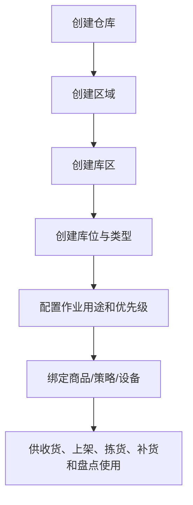
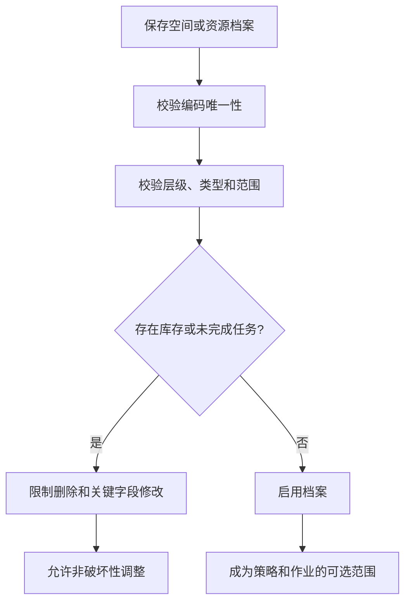
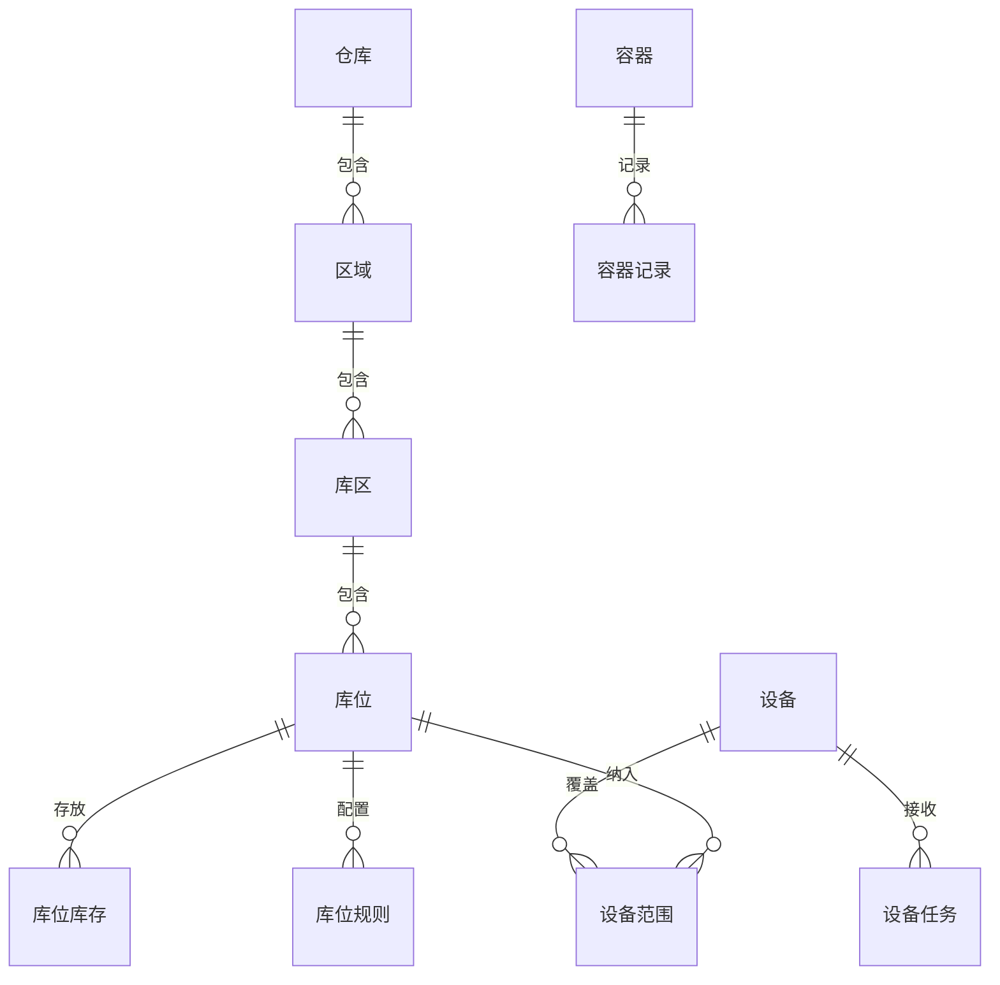

# 02 仓库空间与作业资源设计

## 1. 参考范围

参考 01 章“仓库库位、容器管理、自动化仓库、WCS 管理、设备任务、设备管理、仓库管理”；03 章“区域匹配、业务配置”；07 章“库存移动、容器移库、补货上架”。

## 2. 模块目标与业务边界

解决库存和任务必须落到具体物理位置、作业区域和资源的问题。

包含仓库、区域、库区、库位、库位类型、容器、设备和作业区域边界。

不包含库存数量变更、库位分配算法和设备厂商协议；这些由库存、策略和集成模块负责。

## 3. 角色与业务场景

**参考事实**：区域用于业务隔离，库区用于功能和工作分配；库位有普通、托盘等类型；容器有寄存容器、周转容器、拣货框和托盘形态；WCS 可按库位范围映射设备。

**建议设计**：仓库管理员维护空间结构，作业主管维护作业区域和优先级，设备管理员维护设备覆盖范围。

### 场景说明

| 使用场景 | 触发时机与参与者 | 业务问题 | WMS 解决方式 | 结果 | 类型 |
|---|---|---|---|---|---|
| 新仓库建模 | 仓库上线前由仓库管理员建档 | 系统只有仓库名称，任务无法定位到现场 | 按区域—库区—库位建立可作业空间 | 收货、拣货、盘点有明确目标位置 | 参考事实＋建议设计 |
| 多区域分工 | 收货、存储、拣选、异常区分别作业 | 不同岗位互相抢任务或走错区域 | 以区域/库区划分业务范围和工作队列 | 任务可按区域分派和监控 | 参考事实＋归纳判断 |
| 容器/托盘作业 | 收货装箱、拣货装框、移库换位 | 货物脱离容器后难以追踪 | 给容器唯一编码并记录绑定历史 | 可按容器查询货物和作业轨迹 | 参考事实＋建议设计 |
| 自动化设备接入 | WCS 或设备覆盖部分库位 | 人工任务与设备任务边界不清 | 配置库位范围与设备映射，任务异步下发 | 设备失败可转人工处理 | 参考事实＋建议设计 |
| 库位停用/调整 | 库位改造、维修或安全风险 | 直接删除会破坏库存和历史任务 | 校验引用后停用，保留历史位置 | 新业务不再进入，历史数据可追溯 | 归纳判断＋建议设计 |

## 4. 业务流程图

## 5. 系统流程图

## 6. 实体对象与单据

## 7. 单据状态与操作矩阵

本节中区域、库区、库位和容器的启停及引用限制是参考事实的归纳；容器和设备任务的统一状态名称属于建议设计。

| 对象 | 状态 | 可执行操作 | 操作前提 | 逆向处理 |
|---|---|---|---|---|
| 仓库/区域/库区/库位 | 启用 | 查询、被引用 | 编码和层级有效 | 有引用时停用，不物理删除 |
| 空间档案 | 停用 | 查询历史数据 | 无新增业务引用 | 已有库存或任务不受影响，禁止新业务使用 |
| 容器 | 未使用、使用中、停用（建议） | 新增、绑定、解绑、查询记录 | 编码唯一 | 使用中不得删除，停用后保留历史记录 |
| 设备任务 | 待下发、已下发、完成、失败（部分为建议） | 下发、重试、关闭 | 设备在线且范围匹配 | 失败允许重试，关闭后人工接管规则待确认 |

### 单据、对象与数量关系

本模块主要描述空间和作业资源，不直接生成收发存单据。数量关系重点是层级、引用和任务覆盖关系。

| 上游对象 | 下游对象 | 可能关系 | 关系说明 | 类型 |
|---|---|---:|---|---|
| 仓库 | 区域 | 1:N | 一个仓库可按业务隔离划分多个区域 | 参考事实＋归纳判断 |
| 区域 | 库区 | 1:N | 库区承担功能分区和作业分配 | 参考事实 |
| 库区 | 库位 | 1:N | 一个库区包含多个具体可作业库位 | 参考事实 |
| 库位 | 库位库存 | 1:N | 同一库位可以按 SKU、批次、序列号和库存状态形成多条余额记录，是否允许混放由规则决定 | 建议设计＋待确认 |
| 容器 | 容器记录 | 1:N | 一个容器有多次绑定、移动和释放记录，不等于同时绑定多个业务任务 | 参考事实＋归纳判断 |
| 设备 | 设备任务 | 1:N | 一个设备可接收多条异步任务；是否并发执行由设备能力决定 | 参考事实＋建议设计 |
| 设备范围 | 库位 | N:M | 一个设备可覆盖多个库位，一个库位也可能存在人工与设备两种作业路径 | 建议设计＋待确认 |

### 状态动作补充矩阵

| 单据/对象 | 当前状态/动作 | 操作前提 | 操作后的状态 | 是否生成任务、流水或关联对象 | 是否允许取消、撤销或反向处理 |
|---|---|---|---|---|---|
| 库位档案 | 停用 | 无未完成任务，或已有库存完成迁移评估 | 停用 | 生成操作日志，不生成库存流水 | 可启用；已有库存不能靠停用自动迁移 |
| 容器 | 绑定 | 编码唯一，容器未被其他作业占用 | 使用中 | 生成容器绑定记录，是否生成库存流水由领域作业决定 | 可解绑，但需校验未完成任务和库存归属 |
| 设备任务 | 下发失败重试 | 设备范围匹配且失败可重试 | 重试中→完成/失败 | 生成任务事件和接口日志，不重复生成领域流水 | 可关闭并转人工；是否释放领域占用由领域模块决定 |

## 8. 库存影响

不直接影响库存。空间和资源配置会约束库存能够存放的位置以及任务能否下发。

实际库存移动、上架和容器绑定完成时，由对应交易或作业模块写入库存流水；仅修改库位名称、优先级或设备映射不应产生库存流水。

## 9. 异常与逆向流程

适用，主要是配置逆向：

- 有库存的库位不得直接删除或改变类型。
- 已被任务、策略、设备范围引用的库区和库位只能停用或解除引用。
- 容器编码不能与库位、其他容器编码重复；使用中的容器只能解绑或走业务释放流程。
- 设备任务失败时不得假定库存已移动，必须以设备回传和人工确认结果为准。

## 10. 字段与业务逻辑

本节字段、容量、温区、混放和存储条件的统一模型属于建议设计；手册明确出现的层级、用途、优先级和设备范围是参考事实。

核心字段包括仓库编码、区域编码、库区编码、库位编码、库位类型、作业用途、容量、优先级、存储条件、状态和层级关系。

建议增加：可存放库存属性、是否允许混 SKU、是否允许混正次品、是否允许批次混放、温区、承重和数据权限范围。以上新增字段是建议设计，不表示参考手册已有完整字段。

库位选择至少需要校验：层级归属、作业用途、库存属性、存储条件、设备范围、是否被冻结以及是否存在不可混放库存。

### 表头字段

| 字段名称 | 字段含义 | 来源/写入时机 | 必填性 | 可修改时点 | 查询/展示/导出 | 校验与下游影响 | 类型 |
|---|---|---|---|---|---|---|---|
| 仓库编码/名称 | 物理仓或逻辑仓的身份 | 仓库管理员建档 | 必填 | 未被交易引用前可改 | 所有单据、库存和报表 | 编码唯一，影响数据权限和库存归属 | 参考事实＋建议设计 |
| 区域编码/名称 | 业务隔离或作业分组 | 空间配置时创建 | 必填 | 被任务引用后限制改 | 任务和看板 | 必须归属一个仓库 | 参考事实＋建议设计 |
| 库区编码/用途 | 库区身份及功能 | 空间配置时创建 | 必填 | 有库存/任务引用后限制改 | 分配、补货、盘点 | 用途影响可进入的任务类型 | 参考事实＋归纳判断 |
| 库位编码 | 现场唯一位置 | 批量或手工建档 | 必填 | 被库存引用后不可直接改 | PDA、库存、任务 | 仓库内唯一，需校验层级和状态 | 参考事实＋建议设计 |
| 库位类型 | 普通、托盘等位置类型 | 库位建档 | 必填 | 有库存或任务时禁止切换 | 上架、移库 | 与包装、容器和作业方式联动 | 参考事实＋建议设计 |
| 状态与作业用途 | 是否可用及可承接作业 | 管理员维护 | 必填 | 有未完任务时受限 | 选择器、异常看板 | 停用库位不能被新任务分配 | 建议设计 |

### 明细与关联字段

| 字段名称 | 字段含义 | 来源/写入时机 | 必填性 | 可修改时点 | 查询/展示/导出 | 校验与下游影响 | 类型 |
|---|---|---|---|---|---|---|---|
| 容量/承重 | 库位可承接的数量、体积或重量 | 库位配置 | 按现场管理需要 | 有库存/任务时修改需记录 | 库位详情、上架指导 | 上架推荐和超容校验 | 建议设计 |
| 存储条件 | 温区、湿度或特殊存储要求 | 库位配置 | 特殊仓必填 | 生效后受限 | 上架和库存查询 | 必须与商品存储属性匹配 | 建议设计 |
| 混放约束 | 是否允许混 SKU、批次、货主或库存状态 | 库位配置 | 按管理策略 | 有库存时修改需评估 | 库位和异常查询 | 决定库位分配是否可命中 | 建议设计＋待确认 |
| 设备覆盖明细 | 设备与库位范围映射 | 设备管理员维护 | 自动化场景必填 | 任务运行中修改需版本化 | 设备任务和范围查询 | 决定任务下发还是人工接管 | 参考事实＋建议设计 |
| 容器绑定记录 | 容器、位置、商品或任务的关联 | 作业过程产生 | 按容器作业必填 | 历史记录不可改 | 容器轨迹、库存查询 | 解绑需校验未完成任务和库存归属 | 参考事实＋建议设计 |

## 11. 功能清单

| 优先级 | 功能 | 目标与上下游影响 |
|---|---|---|
| P0 | 仓库—区域—库区—库位层级 | 支撑库存定位和作业范围 |
| P0 | 库位类型、状态和引用约束 | 防止错误上架和错误删除 |
| P0 | 库位优先级与作业用途 | 供分配、补货和路径排序使用 |
| P0 | 容器基础档案和记录 | 支撑容器拣货、装箱和查询 |
| P1 | 设备覆盖范围和任务下发 | 支撑自动化仓库接入 |
| P1 | 库位容量、温区和混放约束 | 提高存储质量 |
| 后续 | 三维库位、路径优化、自动库容计算 | 在现场数据稳定后建设 |

### 功能说明与首版取舍

| 优先级 | 功能 | 使用场景 | 解决的问题 | 核心交互/规则 | 生成或影响对象 | 我们的补充说明 |
|---|---|---|---|---|---|---|
| P0 | 仓库空间层级 | 新仓上线或库区重构 | 库存没有可定位的物理坐标 | 按层级建档，编码唯一，启停受引用约束 | 仓库、区域、库区、库位 | 首版先支持二维层级，不预设三维模型 |
| P0 | 库位类型和用途 | 收货、存储、拣选、异常分区 | 任务把货放到不合适位置 | 位置类型和业务用途参与校验 | 上架、拣货、补货、盘点 | “收货区”是否计库存由库存口径统一决定 |
| P0 | 容器档案与轨迹 | 托盘、周转箱、拣货框 | 现场货物脱离单据难追踪 | 容器编码唯一，记录绑定、移动和释放 | 容器、任务、库存流水 | 容器是载体还是暂存对象需确认 |
| P1 | 设备范围与设备任务 | 自动化仓库 | 设备接收错误库位任务 | 以库位范围匹配设备，失败可人工接管 | 设备、任务、接口日志 | 首版只做边界和状态，不内置厂商协议 |
| P1 | 容量与混放校验 | 密集库位和多货主仓 | 超容、串货或批次混放 | 上架前校验容量、属性和已有库存 | 上架任务、库存余额 | 容量计算的单位和精度列为待确认 |
| 后续 | 路径优化 | 大规模仓库 | 任务路径长、效率低 | 基于历史轨迹优化 | 波次、任务、绩效 | 不作为通用首版前置条件 |

## 12. 万里牛设计借鉴判断

### 判断标准

| 维度 | 判断问题 |
|---|---|
| 通用性 | 分层空间、库位和容器是否适用于不同仓型？ |
| 业务价值 | 是否能提升定位、分工、容量利用和作业安全？ |
| 闭环完整性 | 是否覆盖配置、引用、任务、设备反馈和停用处理？ |
| 实现成本 | 首版能否先落地编码、层级和状态，再扩展自动化？ |
| 边界风险 | 是否属于特定设备、现场编码或仓型的产品选择？ |

重点判断“空间模型是否可复用”，而不是把万里牛的具体菜单和编码方式当成标准。

### 详细借鉴判断

| 参考设计表现 | 可复用原因 | 我们的改造 | 不能照搬的边界 | 结论/类型 |
|---|---|---|---|---|
| 区域—库区—库位分层 | 位置层级能承接数据隔离和作业分工 | 明确每层的业务责任和可引用范围 | 不照搬固定层级数量和命名 | 建议直接借鉴；参考事实＋归纳判断 |
| 库区用于功能与工作分配 | 任务、人员和看板需要共同范围 | 将作业用途、优先级和状态纳入库位规则 | 不把某仓的收货区/拣选区枚举当通用标准 | 建议改造后借鉴；参考事实＋建议设计 |
| 容器有编码和历史记录 | 容器是现场交接和追踪的中间载体 | 统一绑定、移动、解绑和查询关系 | 不默认容器就是库存主键 | 建议直接借鉴并补充；参考事实＋待确认 |
| 设备按库位范围映射 | 设备和人工需要清晰边界 | 做适配器和人工接管，保留回传证据 | 不内置特定厂商协议 | 建议改造后借鉴；参考事实＋建议设计 |
| 库位可启停且有引用限制 | 配置不能破坏历史库存 | 以停用替代物理删除，提供影响分析 | 不把停用后库存迁移规则默认为已存在 | 建议直接借鉴；归纳判断＋建议设计 |

| 判断 | 内容 |
|---|---|
| 建议直接借鉴 | 区域、库区、库位分层；库区承担作业分工；容器可查询当前状态和历史记录 |
| 建议改造后借鉴 | 库位优先级、托盘库位、设备库位范围和异常库位映射 |
| 不建议照搬 | 特定编码前缀、后台开关、固定异常库位编码和设备厂商配置方式 |
| 我们需要补充 | 库位混放、容量、温区、库存属性和引用生命周期的统一规则 |
| 资料不足，待确认 | 库位是否允许多批次、多货主和多库存状态共存 |

## 13. 跨模块依赖与待确认问题

1. 区域是否是强业务隔离边界，还是仅用于路径和任务分组。
2. 库区、库位类型与收货区、存储区、拣选区、异常区的标准枚举。
3. 设备覆盖范围与人工操作范围冲突时如何处理。
4. 库位停用时已有库存如何查询、移动和出库。
5. 容器是库存载体、作业载体，还是两者兼有。
