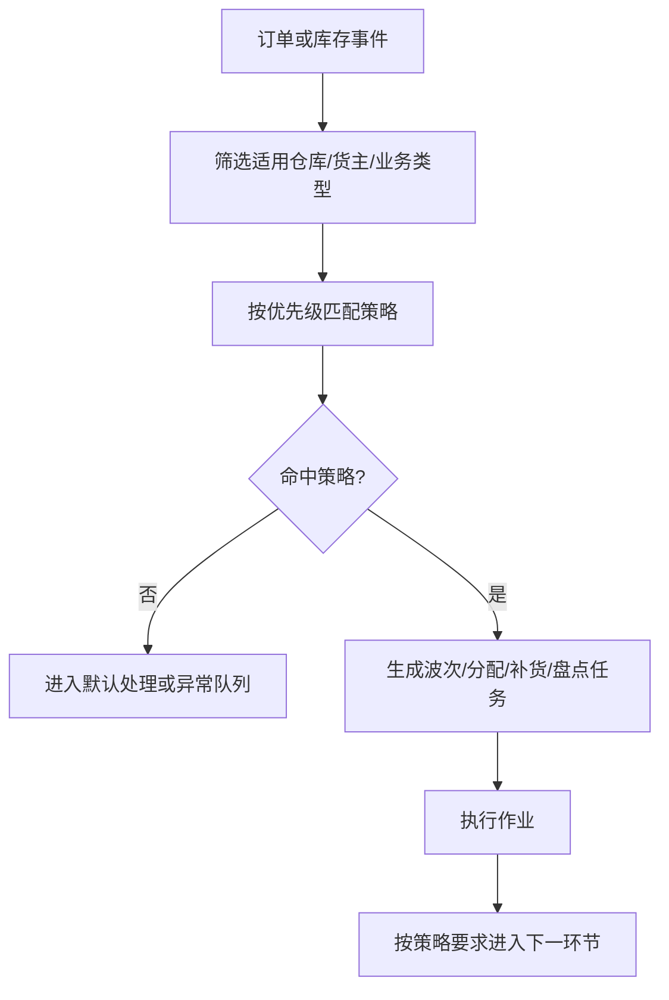
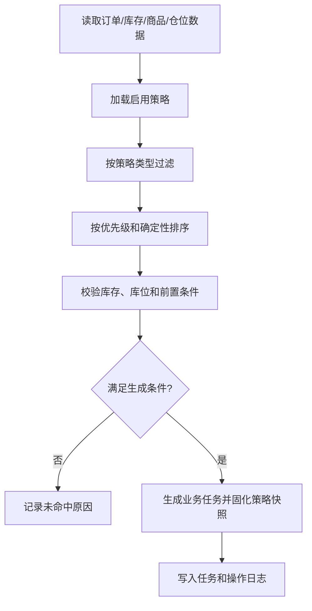
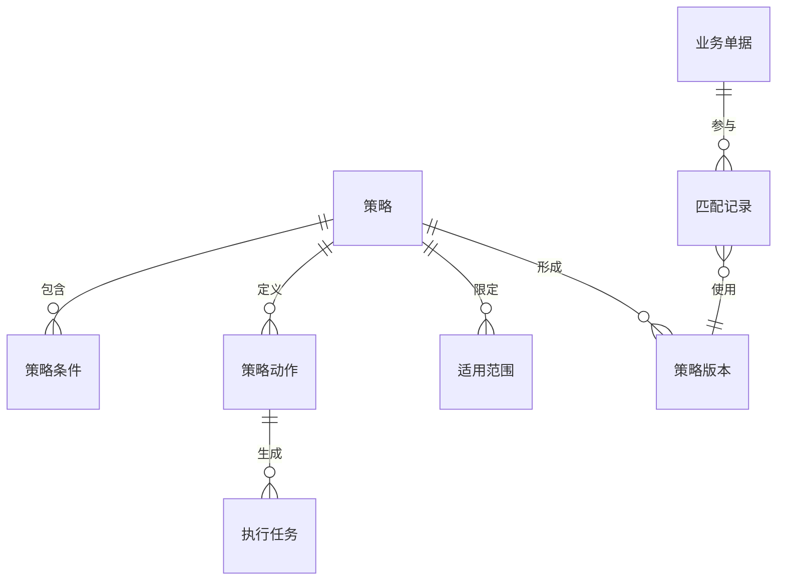

# 03 WMS 规则与策略设计

## 1. 参考范围

参考 03 章全部内容，重点是波次策略、业务配置、库位分配、风险预警、货主策略、区域匹配、大宗策略、盘点策略、补货配置和耗材匹配；补充参考 02 章商品属性和 05 章出库流程。

## 2. 模块目标与业务边界

解决不同仓库、货主、商品和订单需要不同作业路径的问题。

包含策略定义、匹配条件、优先级、适用范围、版本和生效关系。

不包含具体执行任务和库存事务；策略只决定“如何分组、如何分配、如何流转”，不直接改变库存。

## 3. 角色与业务场景

**参考事实**：万里牛使用预配波次、普通波次、自由波次、一筐同品波次，并按货主、店铺、商品、品牌、区域、承运商、数量等条件匹配；策略存在启用、停用、复制和删除操作。

**建议设计**：策略管理员配置规则，业务主管审批高风险规则，系统服务按优先级执行匹配。

### 场景说明

| 使用场景 | 触发时机与参与者 | 业务问题 | WMS 解决方式 | 结果 | 类型 |
|---|---|---|---|---|---|
| 订单集中履约 | 订单达到时间、数量或业务条件后 | 逐单生成任务，拣货路径重复 | 以波次策略按货主、店铺、商品、区域等条件分组 | 减少往返并形成批量任务 | 参考事实＋归纳判断 |
| 预配/预分配 | 需要提前锁定高优先级订单 | 热销库存被其他订单抢占 | 先按策略预配库存，再生成后续作业 | 提升重点订单履约确定性 | 参考事实＋建议设计 |
| 缺货与补货 | 订单可接收但拣选区不足 | 订单停滞，现场不知道先补哪一单 | 按库存和库区阈值生成补货任务或异常队列 | 库存恢复后重新流转 | 参考事实＋建议设计 |
| 库位推荐 | 收货上架或拣货分配时 | 人工选择库位慢且容易违反存储条件 | 按库位范围、优先级、容量和属性匹配 | 位置选择更稳定、可解释 | 参考事实＋建议设计 |
| 策略变更 | 仓库切换作业模式或业务增长 | 直接修改规则影响进行中的任务 | 新建版本、试算、按生效时间应用 | 历史任务可追溯，变更风险可控 | 建议设计 |

## 4. 业务流程图

## 5. 系统流程图

## 6. 实体对象与单据

## 7. 单据状态与操作矩阵

波次策略的启用、停用、复制和删除属于参考事实；策略草稿、匹配记录和生成任务的统一状态属于建议设计。

| 对象 | 状态 | 进入条件 | 可执行操作 | 规则影响 |
|---|---|---|---|---|
| 策略 | 草稿（建议） | 新增或复制 | 编辑、提交 | 不参与匹配 |
| 策略 | 启用 | 校验通过 | 修改受限、停用、复制 | 参与新业务匹配 |
| 策略 | 停用 | 手工停用或失效 | 查询、复制、启用 | 不影响已生成任务 |
| 匹配记录 | 命中、未命中、失败（建议） | 业务对象参与匹配 | 查看原因、重试 | 不直接改库存 |
| 生成任务 | 待执行、执行中、成功、失败（建议） | 自动或手工触发 | 查询、重试、取消 | 结果需回写来源单据 |

### 单据、对象与数量关系

策略不是库存单据，而是决定单据如何分组和生成任务的配置对象。一个策略命中多少业务对象，取决于匹配条件和触发批次。

| 上游对象 | 下游对象 | 可能关系 | 关系说明 | 类型 |
|---|---|---:|---|---|
| 策略 | 策略条件 | 1:N | 一个策略可包含多个条件，条件组合方式必须明确为同时满足或任一满足 | 参考事实＋建议设计 |
| 策略 | 策略版本 | 1:N | 策略修改形成新版本，历史任务保留使用版本 | 建议设计 |
| 策略版本 | 匹配记录 | 1:N | 一个版本可匹配多个订单、商品或库存事件 | 归纳判断＋建议设计 |
| 业务单据 | 匹配记录 | 1:N | 一个订单可能经历多次匹配/重试，但只有一次有效生成结果 | 建议设计 |
| 波次 | 执行任务 | 1:N | 一个波次可拆成多个库区、容器或人员任务 | 参考事实＋归纳判断 |
| 补货策略 | 补货任务 | 1:N | 阈值触发后可生成多条来源库位到目标库位的任务 | 参考事实＋建议设计 |
| 规则动作 | 执行任务 | 0:N | 某些动作只做校验或分组，不必生成任务 | 建议设计 |

### 状态动作补充矩阵

| 单据/对象 | 当前状态/动作 | 操作前提 | 操作后的状态 | 是否生成任务、流水或关联对象 | 是否允许取消、撤销或反向处理 |
|---|---|---|---|---|---|
| 策略 | 启用 | 条件、动作、范围和优先级校验通过 | 启用 | 参与匹配，命中后可能生成波次/任务，不直接生成库存流水 | 可停用；不回溯已生成任务 |
| 策略 | 复制/发布新版本 | 新版本编码和生效范围有效 | 新版本草稿/启用 | 生成策略版本和操作日志 | 未生效版本可撤销；已生效用停用或新版本替代 |
| 匹配记录 | 重试 | 失败原因已处理，来源对象仍有效 | 命中/未命中/失败 | 可能生成任务；不得重复生成同一有效任务 | 可取消本次匹配，不反向修改历史库存 |

## 8. 库存影响

间接影响。波次、分配和补货策略可能触发库存锁定、预占或来源库位选择，但策略配置本身不应改库存。

特别是“锁库范围”“仅可用库存充足时生成”“库位分配偏好”等配置，必须在后续分配服务中明确它们是校验条件、数量预占还是物理库位锁定，不能仅由配置名称推导。

## 9. 异常与逆向流程

适用：

- 策略停用不回溯已生成波次和任务。
- 波次撤销应明确订单是否回到待分配、库存锁定是否释放、已打印面单如何处理。
- 策略修改应采用版本化，历史任务保留生成时的策略快照。
- 匹配失败必须保留失败原因，例如库存不足、库位范围不一致或条件不满足。

## 10. 字段与业务逻辑

本节的字段模型、规则版本、稳定排序和命中解释属于建议设计；策略编码、类型、优先级和适用范围来自参考事实或其归纳。

核心字段：策略编码、名称、类型、优先级、适用仓库、货主、店铺、商品、品牌、承运商、区域、数量阈值、时间窗口、库位范围、自动执行、状态和生效时间。

建议逻辑：

1. 策略编码在适用组织范围内唯一。
2. 同一策略的条件和动作分离存储，便于复用和审查。
3. 优先级相同时必须有稳定的次级排序，不能依赖数据库返回顺序。
4. 规则命中结果、未命中原因和生成任务必须可追溯。
5. 策略变更不修改历史单据上的策略快照。

### 表头字段

| 字段名称 | 字段含义 | 来源/写入时机 | 必填性 | 可修改时点 | 查询/展示/导出 | 校验与下游影响 | 类型 |
|---|---|---|---|---|---|---|---|
| 策略编码/名称 | 策略的可识别身份 | 策略管理员创建 | 必填 | 启用前可改 | 策略列表、命中日志 | 同一适用范围内编码唯一 | 参考事实＋建议设计 |
| 策略类型 | 波次、库位、补货、盘点等分类 | 创建时选择 | 必填 | 启用后限制改 | 策略列表和任务详情 | 决定可配置条件与动作 | 参考事实＋建议设计 |
| 优先级 | 多策略命中时的排序 | 用户配置 | 必填 | 未运行前可改，改动需记录 | 命中日志 | 必须有稳定的并列排序规则 | 参考事实＋建议设计 |
| 适用范围 | 仓库、货主、店铺、区域等 | 用户配置 | 至少一项 | 启用后修改需版本化 | 策略详情 | 范围为空是否代表全局待确认 | 参考事实＋待确认 |
| 生效时间/状态 | 控制版本是否参与匹配 | 系统与管理员维护 | 系统生成 | 按版本规则改 | 策略和审计 | 停用不回溯已生成任务 | 建议设计 |
| 自动执行 | 是否由系统自动触发 | 策略配置 | 按类型决定 | 生效前可改 | 策略详情 | 需防重复运行和并发生成 | 参考事实＋建议设计 |

### 明细与关联字段

| 字段名称 | 字段含义 | 来源/写入时机 | 必填性 | 可修改时点 | 查询/展示/导出 | 校验与下游影响 | 类型 |
|---|---|---|---|---|---|---|---|
| 条件明细 | 字段、运算符和值 | 策略编辑保存 | 按策略类型必填 | 形成新版本 | 命中解释、导出 | 字段类型和范围必须匹配 | 建议设计 |
| 动作明细 | 命中后生成的波次、库位或任务动作 | 策略编辑保存 | 按策略类型必填 | 形成新版本 | 策略详情 | 动作必须能被下游服务执行 | 参考事实＋建议设计 |
| 匹配结果 | 命中、未命中及原因 | 系统匹配时生成 | 系统生成 | 只允许重试生成新记录 | 监控、异常定位 | 必须记录使用的策略版本 | 建议设计 |
| 生成任务关联 | 策略动作生成的任务号 | 任务生成时写入 | 命中生成任务时必填 | 不可改 | 单据、任务、策略互查 | 任务取消不能伪造为未命中 | 建议设计 |
| 阈值/时间窗口 | 补货、波次等触发条件 | 策略配置 | 按类型必填 | 版本化修改 | 策略和命中日志 | 单位、边界值和时区需统一 | 参考事实＋待确认 |

## 11. 功能清单

| 优先级 | 功能 | 目标与上下游影响 |
|---|---|---|
| P0 | 策略启用/停用、适用范围和优先级 | 保证规则可控 |
| P0 | 库位分配、波次和补货基础策略 | 支撑核心履约 |
| P0 | 命中日志和失败原因 | 支撑问题定位 |
| P1 | 策略复制、批量维护、模拟试算 | 提高运营效率 |
| P1 | 规则版本和生效时间 | 支撑变更审计 |
| 后续 | 复杂优化算法、预测补货和动态路径 | 首版不作为基础依赖 |

### 功能说明与首版取舍

| 优先级 | 功能 | 使用场景 | 解决的问题 | 核心交互/规则 | 生成或影响对象 | 我们的补充说明 |
|---|---|---|---|---|---|---|
| P0 | 策略配置与启停 | 不同仓库、货主采用不同作业方式 | 规则散落在人工经验和代码中 | 条件、动作、范围、优先级可审阅 | 策略版本、匹配记录 | 首版先支持有限条件，避免无边界脚本化 |
| P0 | 波次与分配策略 | 订单批量履约 | 减少逐单作业和重复行走 | 按条件分组并生成波次/任务 | 波次、订单、任务 | 预配波次与普通波次要明确优先级 |
| P0 | 库位推荐策略 | 上架、拣货、补货 | 人工选位不稳定 | 结合位置用途、容量、属性和优先级 | 库位、作业任务 | 推荐失败必须有原因和人工改选入口 |
| P0 | 命中解释与失败队列 | 运营排查为何未生成任务 | 系统自动处理不可解释 | 展示命中条件、未命中原因和版本 | 匹配记录、异常 | 是通用 WMS 可运营性的关键补充 |
| P1 | 版本、试算与冲突检测 | 规则变更上线前 | 改规则影响范围不清 | 用样本订单试算，提示策略冲突 | 策略版本、试算记录 | 不直接把试算结果写入库存或任务 |
| 后续 | 动态优化与预测 | 大规模订单和长期补货 | 固定规则无法持续优化 | 以历史数据训练或优化 | 策略、任务、绩效 | 依赖数据质量，不作为首版闭环前提 |

## 12. 万里牛设计借鉴判断

### 判断标准

| 维度 | 判断问题 |
|---|---|
| 通用性 | 规则对象是否能覆盖不同订单、库位、货主和作业模式？ |
| 业务价值 | 是否让分组、分配、补货和异常处理更稳定？ |
| 闭环完整性 | 是否有命中解释、版本、失败、重试和历史快照？ |
| 实现成本 | 首版是否可用明确条件和优先级实现？ |
| 边界风险 | 是否依赖特定平台、算法、阈值或隐藏开关？ |

规则功能必须同时评估“配置灵活性”和“现场可解释性”，不能只看可配置项数量。

### 详细借鉴判断

| 参考设计表现 | 可复用原因 | 我们的改造 | 不能照搬的边界 | 结论/类型 |
|---|---|---|---|---|
| 预配、普通、自由、同品等波次并存 | 不同订单结构确实需要不同作业方式 | 抽象为作业模式模板和策略条件 | 不固定波次类型数量和名称 | 建议改造后借鉴；参考事实＋建议设计 |
| 策略按货主、店铺、商品、品牌、区域等匹配 | 条件化匹配是多仓多货主的通用需求 | 条件、动作、范围和优先级分离 | 不把具体阈值和平台字段设为默认 | 建议直接借鉴；参考事实＋归纳判断 |
| 支持启用、停用、复制和优先级 | 规则需要可运营、可回滚 | 增加版本、生效时间、试算和冲突检测 | 不允许修改后无痕影响历史任务 | 建议直接借鉴并补充；参考事实＋建议设计 |
| 命中策略后生成波次/任务 | 把规则结果落到现场执行 | 记录命中解释和生成结果 | 不把策略配置直接视为库存事务 | 建议直接借鉴；归纳判断＋建议设计 |
| 波次降级、自动补货等特定行为 | 能体现产品对运营效率的取舍 | 做成显式可配置的降级策略 | 不把参考资料中出现的阈值泛化 | 建议改造后借鉴；参考事实＋待确认 |

| 判断 | 内容 |
|---|---|
| 建议直接借鉴 | 策略按业务类型拆分；预配波次和普通波次分层；策略支持启停、复制和优先级 |
| 建议改造后借鉴 | 波次降级、区域匹配、库位分配和大宗策略统一为规则引擎能力 |
| 不建议照搬 | 具体波次类型数量、固定阈值、平台专用策略和隐藏配置开关 |
| 我们需要补充 | 规则版本、试算、命中解释、冲突检测和生效范围 |
| 资料不足，待确认 | 多策略同时命中时的完整优先级、锁库与预占先后关系 |

## 13. 跨模块依赖与待确认问题

1. 策略优先级是数字越小越优先，还是按其他维度排序。
2. 库位分配失败后是降级策略、拆分订单还是进入异常。
3. 预配、同品和 A+N 等模式是否作为通用策略类型还是模板。
4. 自动策略运行频率、并发控制和重复执行规则。
5. 规则变更对已创建但未执行的任务是否生效。
